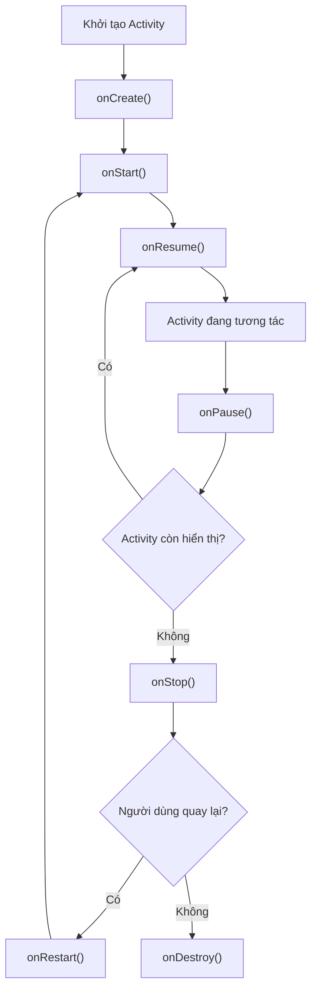
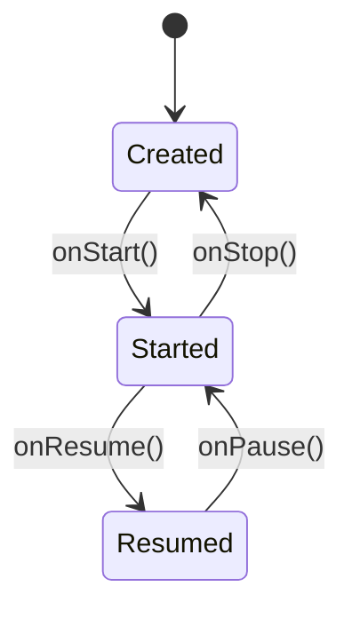
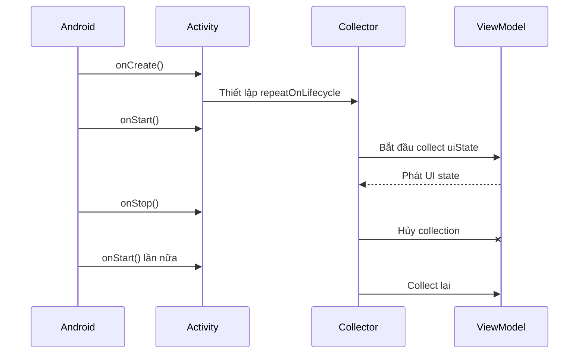
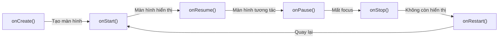

# 004 — `onStart()`
[](https://developer.android.com/guide/components/activities/intro-activities?utm_source=chatgpt.com)

**Học phần:** 02 — App Components and User Interface
**Module:** Module 03 — App Components
**Nhóm nội dung:** Activity
**Nguồn roadmap:** App Components / Activity
**Loại bài:** Lesson
**Thứ tự trong module:** 004
**Thời lượng gợi ý:** 24 phút

---

## 1. Tóm tắt

`onStart()` là một callback thuộc vòng đời của `Activity`. Android gọi phương thức này khi `Activity` chuyển sang trạng thái **Started** và bắt đầu **hiển thị với người dùng**.

`onStart()` thường được gọi:

* Sau `onCreate()` khi màn hình được mở lần đầu.
* Sau `onRestart()` khi người dùng quay lại một `Activity` từng bị dừng.
* Trước `onResume()`, thời điểm màn hình thực sự ở foreground và có thể tương tác đầy đủ.

Một `Activity` có thể đi qua `onStart()` nhiều lần. Vì vậy, code trong callback này phải nhẹ, có thể chạy lặp lại an toàn và cần được cân bằng bằng thao tác dừng hoặc giải phóng tương ứng khi `onStop()` xảy ra. ([Android Developers][1])

---

## 2. Mục tiêu học tập

Sau bài học, anh có thể:

* Giải thích vai trò của `onStart()` trong Activity Lifecycle.
* Phân biệt `onStart()` với `onCreate()` và `onResume()`.
* Xác định trường hợp Android gọi lại `onStart()`.
* Ghi log và quan sát callback bằng Logcat.
* Tránh tải dữ liệu hoặc đăng ký tài nguyên nhiều lần ngoài ý muốn.
* Đặt UI state trong `ViewModel` thay vì giữ trực tiếp trong `Activity`.
* Sử dụng API lifecycle-aware để thu thập `Flow`.
* Viết checklist kiểm thử cho thao tác mở app, về Home, quay lại và xoay màn hình.

---

## 3. Ảnh minh họa


> Hình minh họa chính thức từ Android Developers. Trạng thái **Started** nằm giữa **Created** và **Resumed**. 

---

## 4. Định nghĩa ngắn gọn

> `onStart()` được Android gọi khi `Activity` bắt đầu hiển thị trên màn hình nhưng chưa nhất thiết đã nhận focus để người dùng tương tác.

Sau khi `onStart()` hoàn thành, Android thường nhanh chóng gọi `onResume()`. Khi đó `Activity` mới chuyển sang foreground và trở thành màn hình đang tương tác với người dùng. ([Android Developers][1])

### Ghi chú năm dòng

1. `onStart()` chạy khi `Activity` bắt đầu hiển thị.
2. Nó chạy sau `onCreate()` hoặc `onRestart()`.
3. Nó chạy trước `onResume()`.
4. Nó có thể được gọi nhiều lần trong vòng đời một `Activity`.
5. Công việc bắt đầu theo trạng thái Started nên được dừng tương ứng ở `onStop()`.

---

## 5. Vị trí của `onStart()` trong Activity Lifecycle



### Luồng mở Activity lần đầu

```text
onCreate()
    ↓
onStart()
    ↓
onResume()
```

### Luồng quay lại từ màn hình Home

```text
onPause()
    ↓
onStop()

Người dùng mở lại ứng dụng:

onRestart()
    ↓
onStart()
    ↓
onResume()
```

Trong codelab chính thức, khi người dùng về Home rồi quay lại bằng màn hình Recent Apps, `onStart()` được ghi log lần thứ hai nhưng `onCreate()` không chạy lại vì Android vẫn sử dụng cùng instance của `Activity`. ([Android Developers][2])

---

## 6. Trạng thái Started có ý nghĩa gì?

Khi một `Activity` ở trạng thái **Started**:

* Giao diện đã có thể nhìn thấy.
* Activity chưa chắc đang có focus.
* Người dùng chưa chắc đã tương tác được với màn hình.
* Các thành phần lifecycle-aware nhận sự kiện `ON_START`.
* Sau đó Activity thường chuyển nhanh sang trạng thái Resumed.

Trong chế độ nhiều cửa sổ, một Activity có thể vẫn hiển thị nhưng không phải cửa sổ đang nhận focus. Đây là lý do không nên hiểu `onStart()` là “người dùng đang tương tác với màn hình”. ([Android Developers][1])



---

## 7. So sánh `onCreate()`, `onStart()` và `onResume()`

| Callback     | Trạng thái màn hình                 | Mục đích chính                                               | Có thể chạy nhiều lần?     |
| ------------ | ----------------------------------- | ------------------------------------------------------------ | -------------------------- |
| `onCreate()` | Đang được tạo                       | Khởi tạo giao diện, kết nối ViewModel, thiết lập observer    | Có nếu Activity bị tạo lại |
| `onStart()`  | Đã hiển thị                         | Bắt đầu công việc cần thiết trong lúc màn hình còn nhìn thấy | Có                         |
| `onResume()` | Hiển thị và có focus                | Bắt đầu tương tác hoặc tài nguyên chỉ cần khi foreground     | Có                         |
| `onPause()`  | Mất focus nhưng có thể còn hiển thị | Tạm dừng tác vụ yêu cầu focus                                |                            |
| `onStop()`   | Không còn hiển thị                  | Dừng công việc chỉ cần khi màn hình đang nhìn thấy           |                            |

Android xem khoảng từ `onStart()` đến `onStop()` là **visible lifetime** của Activity. Khoảng từ `onResume()` đến `onPause()` là **foreground lifetime**, khi Activity đang active và tương tác với người dùng. ([Android Developers][3])

---

## 8. Khi nào Android gọi `onStart()`?

### 8.1. Mở Activity lần đầu

```text
onCreate → onStart → onResume
```

Ví dụ:

* Người dùng nhấn biểu tượng ứng dụng.
* Người dùng điều hướng từ `LoginActivity` sang `HomeActivity`.
* Một deep link mở một Activity mới.

---

### 8.2. Quay lại Activity từng bị che hoàn toàn

```text
onRestart → onStart → onResume
```

Ví dụ:

1. Người dùng đang ở `MainActivity`.
2. Nhấn Home.
3. Activity nhận `onPause()` và `onStop()`.
4. Người dùng mở lại ứng dụng.
5. Activity nhận `onRestart()`, `onStart()` và `onResume()`.

Android mô tả rằng khi cùng một instance quay lại foreground, chuỗi callback là `onRestart() → onStart() → onResume()`. ([Android Developers][4])

---

### 8.3. Activity được tạo lại sau thay đổi cấu hình

Khi xoay thiết bị hoặc xảy ra một số thay đổi cấu hình, Android thường hủy Activity cũ và tạo instance mới:

```text
Activity cũ:
onPause → onStop → onDestroy

Activity mới:
onCreate → onStart → onResume
```

Các thay đổi có thể làm Activity được tạo lại gồm xoay màn hình, chuyển chế độ nhiều cửa sổ, đổi giao diện sáng/tối, đổi kích thước chữ hoặc đổi ngôn ngữ. ([Android Developers][5])

---

## 9. Ví dụ Kotlin cơ bản: ghi log `onStart()`

```kotlin
package com.example.lifecyclelesson

import android.os.Bundle
import android.util.Log
import androidx.appcompat.app.AppCompatActivity

private const val TAG = "MainActivityLifecycle"

class MainActivity : AppCompatActivity() {

    override fun onCreate(savedInstanceState: Bundle?) {
        super.onCreate(savedInstanceState)
        setContentView(R.layout.activity_main)

        Log.d(TAG, "onCreate")
    }

    override fun onStart() {
        super.onStart()

        Log.d(TAG, "onStart - Activity bắt đầu hiển thị")
    }

    override fun onResume() {
        super.onResume()

        Log.d(TAG, "onResume - Activity có thể tương tác")
    }

    override fun onPause() {
        super.onPause()

        Log.d(TAG, "onPause - Activity mất focus")
    }

    override fun onStop() {
        super.onStop()

        Log.d(TAG, "onStop - Activity không còn hiển thị")
    }

    override fun onRestart() {
        super.onRestart()

        Log.d(TAG, "onRestart - Activity chuẩn bị hiển thị lại")
    }

    override fun onDestroy() {
        super.onDestroy()

        Log.d(TAG, "onDestroy")
    }
}
```

Khi override callback, cần gọi implementation của lớp cha, chẳng hạn `super.onStart()`. Android Developers sử dụng logging trong các callback như một cách trực tiếp để quan sát Activity Lifecycle bằng Logcat. ([Android Developers][2])

### Log dự kiến khi mở ứng dụng

```text
D/MainActivityLifecycle: onCreate
D/MainActivityLifecycle: onStart - Activity bắt đầu hiển thị
D/MainActivityLifecycle: onResume - Activity có thể tương tác
```

### Khi nhấn Home

```text
D/MainActivityLifecycle: onPause - Activity mất focus
D/MainActivityLifecycle: onStop - Activity không còn hiển thị
```

### Khi quay lại ứng dụng

```text
D/MainActivityLifecycle: onRestart - Activity chuẩn bị hiển thị lại
D/MainActivityLifecycle: onStart - Activity bắt đầu hiển thị
D/MainActivityLifecycle: onResume - Activity có thể tương tác
```

---

## 10. Cách kiểm tra bằng Logcat

### Bước 1: chạy ứng dụng

Mở app trên emulator hoặc thiết bị thật.

### Bước 2: mở Logcat

Trong Android Studio:

```text
View
└── Tool Windows
    └── Logcat
```

### Bước 3: lọc theo tag

```text
tag:MainActivityLifecycle
```

Logcat cho phép xem các thông báo do ứng dụng ghi bằng `Log.d()`, đồng thời có thể lọc theo tag để loại bỏ những log không liên quan. ([Android Developers][2])

### Bước 4: thực hiện các tình huống

1. Mở app lần đầu.
2. Nhấn Home.
3. Quay lại từ Recent Apps.
4. Xoay thiết bị.
5. Mở Activity khác rồi quay lại.
6. Bật chế độ chia đôi màn hình nếu thiết bị hỗ trợ.
7. Nhấn Back để đóng Activity.

---

## 11. Nên đặt gì trong `onStart()`?

`onStart()` phù hợp với công việc:

* Nhẹ và hoàn thành nhanh.
* Có thể chạy lại nhiều lần mà không gây lỗi.
* Chỉ cần thiết trong khoảng Activity đang nhìn thấy.
* Có thao tác dừng tương ứng trong `onStop()`.
* Liên quan đến điều phối giao diện, không phải business logic phức tạp.

Ví dụ về mặt khái niệm:

```kotlin
override fun onStart() {
    super.onStart()

    visibleSessionTracker.start()
}

override fun onStop() {
    visibleSessionTracker.stop()

    super.onStop()
}
```

Android khuyến nghị rằng tài nguyên được khởi động theo `ON_START` nên được giải phóng hoặc dừng theo `ON_STOP`. Tuy nhiên, với ứng dụng hiện đại, logic tài nguyên nên được tách thành component lifecycle-aware thay vì dồn toàn bộ vào Activity. ([Android Developers][1])

---

## 12. Không nên đặt gì trong `onStart()`?

### 12.1. Khởi tạo UI một lần

Không nên:

```kotlin
override fun onStart() {
    super.onStart()

    setContentView(R.layout.activity_main)
}
```

`setContentView()` và việc tạo giao diện ban đầu thường thuộc `onCreate()`.

---

### 12.2. Gọi API không có kiểm soát

Không nên:

```kotlin
override fun onStart() {
    super.onStart()

    viewModel.downloadAllProducts()
}
```

Mỗi lần người dùng:

* Về Home rồi quay lại.
* Mở Activity khác rồi quay về.
* Xoay thiết bị.
* Chuyển chế độ nhiều cửa sổ.

API có thể được gọi lại.

Hậu quả có thể gồm:

* Request trùng lặp.
* Loading nhấp nháy.
* Tốn dữ liệu mạng.
* Tốn pin.
* Ghi dữ liệu lặp.
* Tăng chi phí dịch vụ backend.
* UI hiển thị kết quả cũ và mới không ổn định.

---

### 12.3. Chạy công việc nặng trên main thread

Không nên:

```kotlin
override fun onStart() {
    super.onStart()

    val result = readLargeFileSynchronously()
    val processed = processLargeBitmap(result)
}
```

`onStart()` cần hoàn thành nhanh để Activity sớm chuyển sang Resumed. Công việc nặng trên main thread có thể làm màn hình mở chậm hoặc gây hiện tượng ứng dụng không phản hồi. ([Android Developers][1])

---

### 12.4. Giữ state quan trọng trong biến Activity

Không nên:

```kotlin
class MainActivity : AppCompatActivity() {

    private var selectedProductId: String? = null
}
```

Khi Activity được tạo lại, các field thuộc instance cũ có thể bị mất. `ViewModel` phù hợp hơn cho screen state và business logic vì state của nó có thể tồn tại qua configuration change. ([Android Developers][6])

---

## 13. Cách làm hiện đại: ViewModel và lifecycle-aware collection

Thay vì bắt đầu và hủy việc thu thập `Flow` thủ công trong `onStart()` và `onStop()`, có thể sử dụng `repeatOnLifecycle()`.

```kotlin
package com.example.lifecyclelesson

import android.os.Bundle
import androidx.activity.viewModels
import androidx.appcompat.app.AppCompatActivity
import androidx.lifecycle.Lifecycle
import androidx.lifecycle.lifecycleScope
import androidx.lifecycle.repeatOnLifecycle
import kotlinx.coroutines.launch

class MainActivity : AppCompatActivity() {

    private val viewModel: DashboardViewModel by viewModels()

    override fun onCreate(savedInstanceState: Bundle?) {
        super.onCreate(savedInstanceState)
        setContentView(R.layout.activity_main)

        observeUiState()
    }

    private fun observeUiState() {
        lifecycleScope.launch {
            repeatOnLifecycle(Lifecycle.State.STARTED) {
                viewModel.uiState.collect { state ->
                    render(state)
                }
            }
        }
    }

    private fun render(state: DashboardUiState) {
        // Cập nhật các View dựa trên state.
    }
}
```

`repeatOnLifecycle(Lifecycle.State.STARTED)` sẽ chạy block khi lifecycle đạt ít nhất trạng thái Started, hủy coroutine khi Activity xuống dưới trạng thái đó và chạy lại khi Activity trở về Started. Android khuyến nghị thiết lập block này trong `onCreate()` để tránh vô tình tạo nhiều coroutine lặp giống nhau. ([Android Developers][7])

### Luồng hoạt động



---

## 14. ViewModel mẫu

```kotlin
import androidx.lifecycle.ViewModel
import androidx.lifecycle.viewModelScope
import kotlinx.coroutines.flow.MutableStateFlow
import kotlinx.coroutines.flow.StateFlow
import kotlinx.coroutines.flow.asStateFlow
import kotlinx.coroutines.flow.update
import kotlinx.coroutines.launch

data class DashboardUiState(
    val isLoading: Boolean = false,
    val username: String = "",
    val errorMessage: String? = null
)

class DashboardViewModel(
    private val repository: UserRepository
) : ViewModel() {

    private val _uiState = MutableStateFlow(DashboardUiState())
    val uiState: StateFlow<DashboardUiState> = _uiState.asStateFlow()

    private var hasLoaded = false

    fun loadData() {
        if (hasLoaded) return

        hasLoaded = true

        viewModelScope.launch {
            _uiState.update { it.copy(isLoading = true) }

            runCatching {
                repository.getCurrentUser()
            }.onSuccess { user ->
                _uiState.update {
                    it.copy(
                        isLoading = false,
                        username = user.name,
                        errorMessage = null
                    )
                }
            }.onFailure { throwable ->
                hasLoaded = false

                _uiState.update {
                    it.copy(
                        isLoading = false,
                        errorMessage = throwable.message
                    )
                }
            }
        }
    }
}
```

### Điểm quan trọng

* Activity chỉ render state.
* ViewModel quản lý việc tải dữ liệu.
* `hasLoaded` ngăn request lặp ngoài ý muốn.
* `viewModelScope` tự hủy coroutine khi ViewModel bị xóa.
* State không phụ thuộc trực tiếp vào callback `onStart()`.

ViewModel được thiết kế như một screen-level state holder, cung cấp UI state và chứa business logic liên quan. Lợi ích chính là state có thể tồn tại qua những thay đổi cấu hình như xoay màn hình. ([Android Developers][6])

---

## 15. Với Jetpack Compose

Trong Compose, thường không cần tự thu thập state bằng `onStart()`.

```kotlin
@Composable
fun DashboardRoute(
    viewModel: DashboardViewModel
) {
    val uiState by viewModel.uiState.collectAsStateWithLifecycle()

    DashboardScreen(
        state = uiState,
        onRetry = viewModel::loadData
    )
}
```

Theo tài liệu Android hiện tại, `collectAsStateWithLifecycle()` mặc định bắt đầu thu thập khi lifecycle đạt trạng thái `STARTED` và dừng khi lifecycle xuống `STOPPED`. Android cũng khuyến nghị không đặt business logic trực tiếp trong các callback như `onStart()` của Activity Compose. ([Android Developers][8])

---

## 16. Ví dụ nhỏ: theo dõi thời gian màn hình hiển thị

### `VisibleSessionTracker.kt`

```kotlin
import android.os.SystemClock
import android.util.Log

class VisibleSessionTracker {

    private var startedAt: Long? = null

    fun start() {
        if (startedAt != null) return

        startedAt = SystemClock.elapsedRealtime()
        Log.d(TAG, "Visible session started")
    }

    fun stop() {
        val startTime = startedAt ?: return
        val duration = SystemClock.elapsedRealtime() - startTime

        Log.d(TAG, "Visible duration: $duration ms")
        startedAt = null
    }

    private companion object {
        const val TAG = "VisibleSessionTracker"
    }
}
```

### Sử dụng trong Activity

```kotlin
class MainActivity : AppCompatActivity() {

    private val visibleSessionTracker = VisibleSessionTracker()

    override fun onStart() {
        super.onStart()
        visibleSessionTracker.start()
    }

    override fun onStop() {
        visibleSessionTracker.stop()
        super.onStop()
    }
}
```

Ví dụ này thể hiện ba yêu cầu quan trọng:

1. Logic được tách khỏi Activity.
2. `start()` có tính idempotent, gọi lại không tạo session trùng.
3. Công việc bắt đầu ở `onStart()` được kết thúc ở `onStop()`.

---

## 17. Lỗi thường gặp của lập trình viên mới

### Lỗi: coi `onStart()` chỉ chạy một lần

```kotlin
override fun onStart() {
    super.onStart()

    repository.createDefaultProfile()
}
```

Nếu callback chạy lại, ứng dụng có thể tạo nhiều profile hoặc ghi dữ liệu trùng.

### Nguyên nhân

Lập trình viên nhầm rằng:

```text
onStart ≈ khởi động ứng dụng một lần
```

Trong thực tế:

```text
onStart ≈ Activity chuyển sang trạng thái nhìn thấy
```

### Cách sửa

* Công việc một lần của Activity đặt trong `onCreate()`.
* Công việc một lần của ứng dụng đặt trong `Application`, dependency container hoặc startup component phù hợp.
* Ghi dữ liệu phải có cơ chế idempotency.
* Việc tải screen state đặt trong ViewModel.
* Quan sát state bằng lifecycle-aware API.
* Không dùng lifecycle callback làm nguồn sự thật duy nhất cho nghiệp vụ.

---

## 18. Tác động đến UX

### Làm đúng

* Màn hình quay lại nhanh.
* Không hiện loading không cần thiết.
* Animation và observer dừng khi màn hình không còn hiển thị.
* State không bị reset khi xoay màn hình.
* Không tạo request trùng.

### Làm sai

* Mỗi lần quay lại app đều tải lại dữ liệu.
* Nội dung nhấp nháy giữa loading và success.
* Scroll position hoặc lựa chọn của người dùng bị mất.
* Sensor, listener hoặc timer vẫn chạy ở background.
* Pin và tài nguyên mạng bị tiêu hao.
* Analytics ghi nhiều lượt xem cho cùng một lần hiển thị.

---

## 19. Tác động đến reliability và maintainability

### Reliability

Một callback có thể chạy nhiều lần nên code phải:

* Không phụ thuộc vào việc chỉ được gọi một lần.
* Không tạo nhiều observer giống nhau.
* Không tạo coroutine không được hủy.
* Không đăng ký listener nhiều lần.
* Không ghi dữ liệu trùng.
* Xử lý được trường hợp tiến trình bị Android kết thúc.

Android có thể hủy process trong khi người dùng rời ứng dụng. Vì vậy, screen state quan trọng không nên chỉ phụ thuộc vào biến trong Activity; có thể cần kết hợp ViewModel, saved state và local storage tùy loại dữ liệu. ([Android Developers][1])

### Maintainability

Activity nên chủ yếu đảm nhận:

```text
Nhận lifecycle event
        ↓
Điều phối thành phần UI
        ↓
Render state
        ↓
Chuyển user event cho ViewModel
```

Không nên trở thành:

```text
Activity
├── Gọi API
├── Truy vấn database
├── Chứa business rule
├── Quản lý cache
├── Theo dõi analytics
├── Quản lý timer
└── Xử lý toàn bộ lỗi
```

---

## 20. Thực hành 24 phút

### Phần 1 — Ghi log lifecycle: 7 phút

1. Tạo project Android.
2. Override các callback lifecycle.
3. Thêm `Log.d()`.
4. Lọc Logcat bằng tag.
5. Ghi lại thứ tự callback.

### Phần 2 — Thử các tình huống: 7 phút

Thực hiện:

* Mở app.
* Nhấn Home.
* Quay lại app.
* Xoay thiết bị.
* Nhấn Back.
* Mở app lần nữa.

Ghi kết quả vào bảng:

| Tình huống    | Callback quan sát được                    |
| ------------- | ----------------------------------------- |
| Mở lần đầu    | `onCreate → onStart → onResume`           |
| Nhấn Home     | `onPause → onStop`                        |
| Quay lại      | `onRestart → onStart → onResume`          |
| Xoay màn hình | Activity cũ bị hủy, Activity mới được tạo |
| Nhấn Back     | `onPause → onStop → onDestroy`            |

### Phần 3 — Sửa lỗi request lặp: 7 phút

Cho đoạn code:

```kotlin
override fun onStart() {
    super.onStart()
    viewModel.loadProducts()
}
```

Yêu cầu:

* Phát hiện nguy cơ request lặp.
* Chuyển state vào ViewModel.
* Làm `loadProducts()` idempotent.
* Thu thập state bằng `repeatOnLifecycle()`.

### Phần 4 — Viết README: 3 phút

README cần có:

* Định nghĩa `onStart()`.
* Sơ đồ lifecycle.
* Code logging.
* Ảnh chụp Logcat.
* Bảng kết quả kiểm thử.
* Một lỗi đã phát hiện và cách sửa.

---

## 21. Bài tập

### Bài tập chính

Tạo ứng dụng **Lifecycle Counter** có các chức năng:

* Hiển thị số lần `onStart()` được gọi.
* Ghi log toàn bộ callback của Activity.
* Giữ số đếm qua thao tác xoay màn hình bằng ViewModel.
* Có nút mở Activity thứ hai.
* Khi quay lại Activity đầu, số lần `onStart()` tăng lên.
* README giải thích vì sao callback chạy lại.

### Gợi ý UI

```text
┌──────────────────────────────┐
│ Lifecycle Counter            │
│                              │
│ onStart called: 3 times      │
│ Current state: RESUMED       │
│                              │
│ [ Open Second Activity ]     │
│ [ Reset Counter ]            │
└──────────────────────────────┘
```

### Tiêu chí hoàn thành

* Không crash khi xoay màn hình.
* Không tạo observer trùng.
* Không giữ `Activity` hoặc `View` trong ViewModel.
* Số đếm hiển thị đúng sau khi quay lại từ Activity thứ hai.
* Có ảnh chụp Logcat trong README.

---

## 22. Kiểm thử đề xuất

### Kiểm thử thủ công

```markdown
- [ ] Mở app lần đầu thấy onCreate → onStart → onResume.
- [ ] Nhấn Home thấy onPause → onStop.
- [ ] Quay lại thấy onRestart → onStart → onResume.
- [ ] Xoay màn hình không làm mất screen state.
- [ ] Nhấn Back làm Activity kết thúc.
- [ ] Không có API request trùng khi quay lại app.
- [ ] Không có listener hoặc timer tiếp tục chạy sau onStop.
- [ ] Giao diện không nhấp nháy loading không cần thiết.
```

### Kiểm thử component lifecycle-aware

```kotlin
import androidx.lifecycle.DefaultLifecycleObserver
import androidx.lifecycle.LifecycleOwner

class VisibilityObserver(
    private val onVisible: () -> Unit,
    private val onHidden: () -> Unit
) : DefaultLifecycleObserver {

    override fun onStart(owner: LifecycleOwner) {
        onVisible()
    }

    override fun onStop(owner: LifecycleOwner) {
        onHidden()
    }
}
```

Tách observer thành class riêng giúp kiểm thử logic `onVisible` và `onHidden` mà không phải đưa toàn bộ nghiệp vụ vào `Activity`.

---

## 23. Checklist hoàn thành

### Kiến thức

* [ ] Giải thích được `onStart()` bằng ngôn ngữ của mình.
* [ ] Biết Activity đã hiển thị nhưng chưa chắc có focus.
* [ ] Phân biệt được `onStart()` với `onCreate()`.
* [ ] Phân biệt được `onStart()` với `onResume()`.
* [ ] Biết `onStart()` có thể chạy nhiều lần.
* [ ] Biết quan hệ giữa `onStart()` và `onStop()`.

### Code

* [ ] Có gọi `super.onStart()`.
* [ ] Code trong callback nhẹ.
* [ ] Không gọi API vô điều kiện trong `onStart()`.
* [ ] Không tạo observer trùng.
* [ ] State được đặt trong ViewModel khi phù hợp.
* [ ] Flow được thu thập bằng lifecycle-aware API.
* [ ] Tài nguyên bắt đầu ở Started được dừng ở Stopped.

### Testing

* [ ] Đã kiểm tra mở app lần đầu.
* [ ] Đã kiểm tra nhấn Home và quay lại.
* [ ] Đã kiểm tra xoay thiết bị.
* [ ] Đã kiểm tra mở Activity khác.
* [ ] Đã kiểm tra nhấn Back.
* [ ] Đã kiểm tra multi-window nếu có thể.
* [ ] Đã quan sát callback bằng Logcat.

### Portfolio

* [ ] Có repository Git.
* [ ] Có README.
* [ ] Có sơ đồ lifecycle.
* [ ] Có code Kotlin.
* [ ] Có screenshot Logcat.
* [ ] Có bảng test case.
* [ ] Có phần “Lỗi thường gặp và cách sửa”.

---

## 24. Ghi chú production

Trước khi đưa code liên quan đến `onStart()` lên production, cần kiểm tra:

```markdown
- Callback có thể chạy lại mà không tạo dữ liệu trùng không?
- Có network request nào bị gọi mỗi lần người dùng quay lại không?
- Có listener, receiver, sensor hoặc timer nào chưa dừng trong onStop không?
- Công việc có làm nghẽn main thread không?
- UI state có tồn tại sau khi xoay thiết bị không?
- State có phục hồi được sau process death không?
- ViewModel có giữ tham chiếu tới Activity hoặc View không?
- Log có chứa token, dữ liệu cá nhân hoặc thông tin nhạy cảm không?
- Có test cho Home, Recent Apps, rotation và navigation không?
- Có xử lý lỗi mạng, retry và trạng thái offline không?
```

---

## 25. Kết luận

`onStart()` không có nghĩa là “ứng dụng khởi động lần đầu”. Nó có nghĩa là:

```text
Activity đã chuyển sang trạng thái hiển thị với người dùng.
```

Quy tắc dễ nhớ:



Trong dự án Android hiện đại:

* Dùng `onStart()` để hiểu và phản ứng với trạng thái hiển thị.
* Không đặt business logic phức tạp trực tiếp trong callback.
* Đặt screen state và nghiệp vụ trong ViewModel.
* Dùng `repeatOnLifecycle()` hoặc `collectAsStateWithLifecycle()`.
* Thiết kế code để chạy lặp lại an toàn.
* Ghép công việc bắt đầu ở `onStart()` với thao tác dừng ở `onStop()`.

[1]: https://developer.android.com/guide/components/activities/activity-lifecycle "The activity lifecycle  |  App architecture  |  Android Developers"
[2]: https://developer.android.com/codelabs/basic-android-kotlin-compose-activity-lifecycle "Stages of the Activity lifecycle  |  Android Developers"
[3]: https://developer.android.com/reference/android/app/Activity?utm_source=chatgpt.com "Activity | API reference"
[4]: https://developer.android.com/guide/components/activities/state-changes?utm_source=chatgpt.com "Activity state changes | App architecture"
[5]: https://developer.android.com/topic/architecture/views/resources/runtime-changes-views "Handle configuration changes (Views)  |  Android Developers"
[6]: https://developer.android.com/topic/libraries/architecture/views/viewmodel "ViewModel overview (Views)  |  Android Developers"
[7]: https://developer.android.com/reference/androidx/lifecycle/RepeatOnLifecycleKt?utm_source=chatgpt.com "RepeatOnLifecycleKt  |  API reference  |  Android Developers"
[8]: https://developer.android.com/topic/libraries/architecture/coroutines "Use Kotlin coroutines with lifecycle-aware components  |  App architecture  |  Android Developers"

---

# Bài luyện tập

## Mục tiêu


## Đề bài


## Yêu cầu hoàn thành

- [ ] 
- [ ] 
- [ ] 

## Kết quả / lời giải


## Ghi chú
