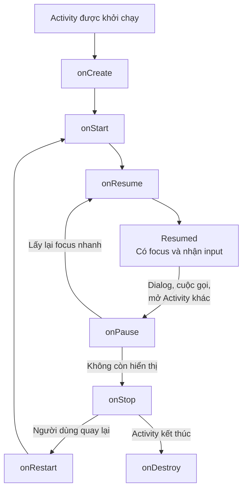
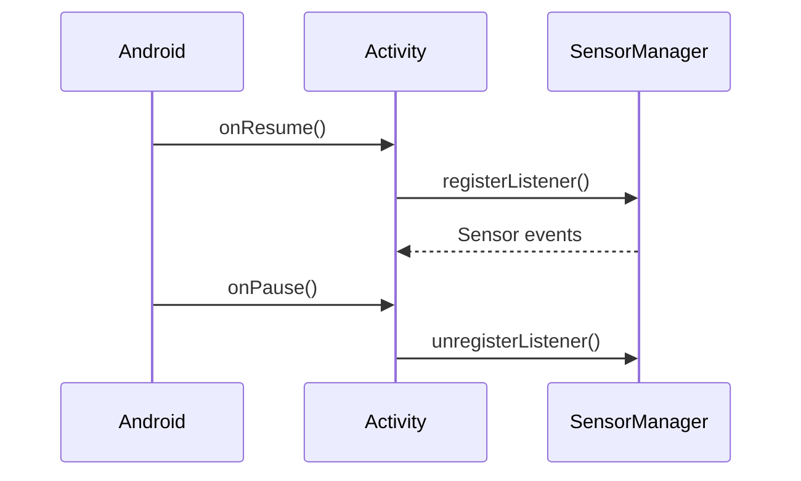
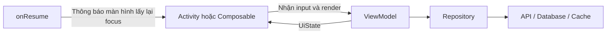

# 005 - `onResume()`

[](https://developer.android.com/guide/components/activities/intro-activities?utm_source=chatgpt.com)

**Học phần:** 02 - App Components and User Interface
**Module:** Module 03 - App Components
**Nhóm nội dung:** Activity
**Nguồn roadmap:** App Components / Activity
**Loại bài:** Lesson
**Thứ tự trong module:** 005
**Thời lượng gợi ý:** 24 phút

---

## 1. Tóm tắt

`onResume()` là một callback thuộc vòng đời của `Activity`. Android gọi phương thức này khi Activity đi vào trạng thái **Resumed**: màn hình đang ở foreground, có focus và người dùng có thể tương tác với nó.

`onResume()` không chỉ chạy một lần. Nó có thể được gọi khi:

* Activity vừa được mở.
* Người dùng quay lại ứng dụng từ màn hình Home.
* Một dialog hoặc Activity khác vừa đóng.
* Người dùng chuyển lại cửa sổ ứng dụng.
* Activity được tạo lại sau thay đổi cấu hình.

Vì vậy, code trong `onResume()` phải nhẹ, có thể chạy lặp lại và không vô tình tạo nhiều request, listener hoặc coroutine trùng nhau. Android cũng khuyến nghị với Jetpack Compose nên ưu tiên API nhận biết lifecycle như `LifecycleResumeEffect`, `repeatOnLifecycle` và `collectAsStateWithLifecycle` thay vì dồn logic giao diện trực tiếp vào callback của Activity. ([Android Developers][1])

---

## 2. Mục tiêu học tập

Sau bài học, anh có thể:

* Giải thích vai trò của `onResume()` trong Activity Lifecycle.
* Phân biệt `onResume()` với `onStart()` và `onPause()`.
* Xác định những tác vụ phù hợp và không phù hợp với `onResume()`.
* Ghi log để quan sát callback trong Android Studio.
* Tránh gọi API hoặc đăng ký listener trùng lặp.
* Sử dụng `ViewModel` để lưu UI state qua thay đổi cấu hình.
* Áp dụng lifecycle-aware API trong Jetpack Compose.
* Viết checklist kiểm thử khi ứng dụng vào foreground.

---

## 3. Ghi chú 5 dòng về `onResume()`

> 1. `onResume()` được gọi khi Activity đi vào foreground và nhận focus.
> 2. Đây là lúc người dùng có thể tương tác trực tiếp với màn hình.
> 3. Phương thức này có thể được gọi nhiều lần trong đời sống của một Activity.
> 4. Tác vụ bắt đầu tại `onResume()` thường phải được dừng hoặc giải phóng tại `onPause()`.
> 5. Không nên đặt xử lý nặng, network request thiếu kiểm soát hoặc persistent state trực tiếp trong `onResume()`.

---

## 4. Ảnh minh họa Activity Lifecycle


*Nguồn ảnh: Android Developers.*

Ảnh rút gọn tập trung vào các trạng thái:


*Nguồn ảnh: Android Developers Codelab.*

Android gọi `onResume()` khi Activity chuyển từ trạng thái **Started** sang **Resumed**. Khi có sự kiện làm Activity mất focus, hệ thống gọi `onPause()`. Nếu Activity nhanh chóng lấy lại focus, `onResume()` sẽ được gọi lại. ([Android Developers][1])

---

## 5. `onResume()` nằm ở đâu trong Activity Lifecycle?



### Lần đầu mở Activity

```text
onCreate()
    ↓
onStart()
    ↓
onResume()
    ↓
Người dùng tương tác
```

### Nhấn Home rồi quay lại

```text
onPause()
    ↓
onStop()
    ↓
onRestart()
    ↓
onStart()
    ↓
onResume()
```

### Một dialog che một phần màn hình

```text
onPause()
    ↓
Dialog đóng
    ↓
onResume()
```

Trong trường hợp dialog hoặc một Activity trong suốt che một phần màn hình, Activity phía dưới có thể vẫn hiển thị nhưng không còn focus. Khi đó `onPause()` được gọi nhưng chưa chắc `onStop()` được gọi. ([Android Developers][2])

---

## 6. Khái niệm chính

### 6.1. Trạng thái Resumed là gì?

Khi Activity ở trạng thái **Resumed**:

* Activity ở foreground.
* Activity có focus.
* Người dùng có thể chạm, nhập liệu và tương tác.
* Activity thường nằm trên cùng trong task hiện tại.
* Những chức năng chỉ cần khi người dùng đang tương tác có thể được kích hoạt.

Android giữ Activity ở trạng thái này cho đến khi một sự kiện lấy focus khỏi nó, chẳng hạn mở Activity khác, có cuộc gọi đến hoặc màn hình thiết bị tắt. ([Android Developers][1])

---

### 6.2. `onResume()` có thể chạy nhiều lần

Một sai lầm phổ biến là nghĩ rằng:

```text
onCreate chạy một lần
onResume cũng chạy một lần
```

Thực tế, trong cùng một instance Activity:

```text
onCreate → onStart → onResume
                      ↓
                  onPause
                      ↓
                  onResume
                      ↓
                  onPause
                      ↓
                   onStop
```

Do đó, đoạn code sau có thể gọi API nhiều lần:

```kotlin
override fun onResume() {
    super.onResume()

    viewModel.loadProducts()
}
```

Mỗi lần người dùng:

* Đóng một dialog.
* Quay lại từ màn hình cấp quyền.
* Quay lại từ Settings.
* Chuyển từ ứng dụng khác về.
* Chuyển giữa các cửa sổ.

`loadProducts()` có khả năng được gọi lại.

---

## 7. So sánh các callback liên quan

| Callback      | Trạng thái màn hình |   Có focus? | Người dùng tương tác? | Tác vụ điển hình                                             |
| ------------- | ------------------: | ----------: | --------------------: | ------------------------------------------------------------ |
| `onCreate()`  |       Đang được tạo |       Không |                 Không | Khởi tạo UI, lấy ViewModel, thiết lập dependency             |
| `onStart()`   |         Đã hiển thị | Có thể chưa |           Có thể chưa | Bắt đầu tác vụ cần khi màn hình visible                      |
| `onResume()`  |          Foreground |          Có |                    Có | Khôi phục tác vụ cần focus, kiểm tra trạng thái vừa thay đổi |
| `onPause()`   | Có thể vẫn hiển thị |       Không |                 Không | Tạm dừng tác vụ đã bắt đầu ở `onResume()`                    |
| `onStop()`    |  Không còn hiển thị |       Không |                 Không | Dừng tác vụ chỉ cần khi màn hình visible                     |
| `onDestroy()` |              Bị hủy |       Không |                 Không | Dọn tài nguyên gắn với instance Activity                     |

### Quy tắc ghép cặp

```text
onStart  ↔ onStop
onResume ↔ onPause
```

Nếu đăng ký một tài nguyên trong `onResume()`, thông thường phải hủy đăng ký trong `onPause()`. Nếu đăng ký từ `onStart()`, nên hủy tại `onStop()`. Android khuyến nghị chọn cặp lifecycle phù hợp với thời gian thực sự cần giữ tài nguyên. ([Android Developers][1])

---

## 8. Khi nào nên sử dụng `onResume()`?

`onResume()` phù hợp với tác vụ phải chạy mỗi khi màn hình lấy lại focus.

### Ví dụ phù hợp

* Tiếp tục camera preview.
* Đăng ký listener cảm biến chỉ cần khi người dùng tương tác.
* Tiếp tục game hoặc animation đã tạm dừng.
* Kiểm tra trạng thái quyền sau khi người dùng quay lại từ Settings.
* Làm mới trạng thái đăng nhập sau một external authentication flow.
* Kiểm tra kết quả thanh toán khi quay lại ứng dụng.
* Gửi sự kiện analytics “screen resumed” nếu hệ thống analytics yêu cầu.
* Khôi phục tài nguyên đã giải phóng trong `onPause()`.

### Ví dụ không nên đặt trực tiếp

* Khởi tạo giao diện lần đầu.
* Tạo `ViewModel`.
* Thực hiện migration cơ sở dữ liệu.
* Gọi API không có cache hoặc không kiểm soát số lần gọi.
* Chạy thuật toán nặng trên main thread.
* Lưu toàn bộ trạng thái người dùng.
* Khởi chạy coroutine không bao giờ bị hủy.
* Đăng ký listener nhưng không hủy đăng ký.

---

## 9. Ví dụ cơ bản: quan sát `onResume()` bằng Logcat

```kotlin
package com.example.lifecycledemo

import android.os.Bundle
import android.util.Log
import androidx.appcompat.app.AppCompatActivity

class MainActivity : AppCompatActivity() {

    companion object {
        private const val TAG = "ActivityLifecycle"
    }

    override fun onCreate(savedInstanceState: Bundle?) {
        super.onCreate(savedInstanceState)
        setContentView(R.layout.activity_main)

        Log.d(TAG, "onCreate")
    }

    override fun onStart() {
        super.onStart()
        Log.d(TAG, "onStart")
    }

    override fun onResume() {
        super.onResume()
        Log.d(TAG, "onResume - Activity đã có focus")
    }

    override fun onPause() {
        Log.d(TAG, "onPause - Activity mất focus")
        super.onPause()
    }

    override fun onStop() {
        Log.d(TAG, "onStop")
        super.onStop()
    }

    override fun onDestroy() {
        Log.d(TAG, "onDestroy")
        super.onDestroy()
    }
}
```

### Kết quả khi mở ứng dụng

```text
D/ActivityLifecycle: onCreate
D/ActivityLifecycle: onStart
D/ActivityLifecycle: onResume - Activity đã có focus
```

### Kết quả khi nhấn Home

```text
D/ActivityLifecycle: onPause - Activity mất focus
D/ActivityLifecycle: onStop
```

### Kết quả khi quay lại ứng dụng

```text
D/ActivityLifecycle: onStart
D/ActivityLifecycle: onResume - Activity đã có focus
```

Trong một số trường hợp, trước `onStart()` còn có `onRestart()`.

---

## 10. Ví dụ thực tế: đăng ký cảm biến

Giả sử ứng dụng chỉ cần nhận dữ liệu cảm biến khi người dùng đang tương tác với màn hình.

```kotlin
package com.example.sensordemo

import android.hardware.Sensor
import android.hardware.SensorEvent
import android.hardware.SensorEventListener
import android.hardware.SensorManager
import android.os.Bundle
import androidx.appcompat.app.AppCompatActivity

class SensorActivity : AppCompatActivity(), SensorEventListener {

    private lateinit var sensorManager: SensorManager
    private var accelerometer: Sensor? = null
    private var listenerRegistered = false

    override fun onCreate(savedInstanceState: Bundle?) {
        super.onCreate(savedInstanceState)
        setContentView(R.layout.activity_sensor)

        sensorManager = getSystemService(SENSOR_SERVICE) as SensorManager
        accelerometer = sensorManager.getDefaultSensor(
            Sensor.TYPE_ACCELEROMETER
        )
    }

    override fun onResume() {
        super.onResume()

        val sensor = accelerometer ?: return

        if (!listenerRegistered) {
            listenerRegistered = sensorManager.registerListener(
                this,
                sensor,
                SensorManager.SENSOR_DELAY_NORMAL
            )
        }
    }

    override fun onPause() {
        if (listenerRegistered) {
            sensorManager.unregisterListener(this)
            listenerRegistered = false
        }

        super.onPause()
    }

    override fun onSensorChanged(event: SensorEvent?) {
        val accelerationX = event?.values?.getOrNull(0) ?: return

        // Chỉ cập nhật UI hoặc chuyển dữ liệu cho state holder.
        updateAccelerationText(accelerationX)
    }

    override fun onAccuracyChanged(sensor: Sensor?, accuracy: Int) {
        // Không cần xử lý trong ví dụ này.
    }

    private fun updateAccelerationText(value: Float) {
        // Cập nhật TextView hoặc chuyển dữ liệu sang ViewModel.
    }
}
```

### Điểm quan trọng



Biến `listenerRegistered` giúp tránh đăng ký cùng một listener nhiều lần.

---

## 11. Ví dụ phù hợp hơn với app thực tế: quay lại từ Settings

Một use case phổ biến là người dùng mở Settings để thay đổi quyền hoặc cài đặt thông báo, sau đó quay lại ứng dụng.

### Activity

```kotlin
class NotificationSettingsActivity : AppCompatActivity() {

    private val viewModel: NotificationSettingsViewModel by viewModels()

    override fun onCreate(savedInstanceState: Bundle?) {
        super.onCreate(savedInstanceState)

        // Thiết lập UI và observe state tại đây.
    }

    override fun onResume() {
        super.onResume()

        val notificationsEnabled =
            NotificationManagerCompat
                .from(this)
                .areNotificationsEnabled()

        viewModel.onNotificationStatusChanged(
            enabled = notificationsEnabled
        )
    }
}
```

### ViewModel

```kotlin
data class NotificationUiState(
    val notificationsEnabled: Boolean = false
)

class NotificationSettingsViewModel : ViewModel() {

    private val _uiState = MutableStateFlow(NotificationUiState())
    val uiState: StateFlow<NotificationUiState> = _uiState.asStateFlow()

    fun onNotificationStatusChanged(enabled: Boolean) {
        _uiState.update { currentState ->
            if (currentState.notificationsEnabled == enabled) {
                currentState
            } else {
                currentState.copy(
                    notificationsEnabled = enabled
                )
            }
        }
    }
}
```

Ở đây:

* Activity đọc trạng thái hệ thống.
* ViewModel giữ UI state.
* Phương thức cập nhật mang tính idempotent.
* Quay lại màn hình nhiều lần không tạo request mạng trùng lặp.
* UI có thể render lại từ `uiState`.

ViewModel phù hợp để giữ UI state qua configuration change và tách state khỏi vòng đời của một instance Activity. ([Android Developers][3])

---

## 12. `onResume()` và Jetpack Compose

Trong Compose, không nên mặc định override `Activity.onResume()` cho mọi tác vụ của một màn hình composable. Tài liệu kiến trúc Android hiện khuyến nghị sử dụng lifecycle-aware effect hoặc lifecycle-aware state collection. ([Android Developers][4])

### 12.1. Chạy tác vụ đồng bộ khi màn hình resume

```kotlin
@Composable
fun CameraPreview(
    controller: CameraController
) {
    LifecycleResumeEffect(controller) {
        controller.startPreview()

        onPauseOrDispose {
            controller.stopPreview()
        }
    }

    // Nội dung giao diện...
}
```

Ý nghĩa:

```text
RESUME  → startPreview()
PAUSE   → stopPreview()
DISPOSE → stopPreview()
```

`LifecycleResumeEffect` thể hiện rõ quan hệ giữa bắt đầu và dọn tài nguyên.

---

### 12.2. Nhận một lifecycle event cụ thể

```kotlin
@Composable
fun AnalyticsScreen(
    analytics: Analytics
) {
    LifecycleEventEffect(
        event = Lifecycle.Event.ON_RESUME
    ) {
        analytics.trackScreenResumed(
            screenName = "Profile"
        )
    }

    ProfileContent()
}
```

Cần bảo đảm analytics SDK không tự động ghi nhận cùng sự kiện, tránh duplicate event.

---

### 12.3. Collect state khi lifecycle ở trạng thái Resumed

```kotlin
@Composable
fun DashboardRoute(
    viewModel: DashboardViewModel = viewModel()
) {
    val uiState by viewModel.uiState.collectAsStateWithLifecycle(
        minActiveState = Lifecycle.State.RESUMED
    )

    DashboardScreen(uiState = uiState)
}
```

Mặc định, `collectAsStateWithLifecycle()` thu thập dữ liệu từ trạng thái `STARTED`. Có thể đặt `minActiveState = Lifecycle.State.RESUMED` khi dữ liệu chỉ nên được nhận lúc màn hình có focus. ([Android Developers][5])

Không nên chọn `RESUMED` một cách máy móc. Nếu UI vẫn cần cập nhật khi visible nhưng tạm mất focus, `STARTED` thường phù hợp hơn.

---

## 13. State nên được lưu ở đâu?



### Activity hoặc Composable

Nên chịu trách nhiệm:

* Điều phối UI.
* Nhận lifecycle event.
* Đọc trạng thái hệ thống cần `Context`.
* Gửi user action hoặc lifecycle signal vào ViewModel.
* Render `UiState`.

### ViewModel

Nên chịu trách nhiệm:

* Giữ UI state.
* Xử lý business logic.
* Quyết định có cần refresh dữ liệu hay không.
* Chống request trùng lặp.
* Duy trì state qua configuration change.

### Repository

Nên chịu trách nhiệm:

* Gọi API.
* Đọc và ghi database.
* Cache dữ liệu.
* Quyết định nguồn dữ liệu.
* Chuẩn hóa lỗi tầng dữ liệu.

---

## 14. Sai lầm phổ biến của lập trình viên mới

### Sai lầm 1: gọi API mỗi lần `onResume()`

```kotlin
override fun onResume() {
    super.onResume()

    lifecycleScope.launch {
        val products = api.getProducts()
        render(products)
    }
}
```

#### Vấn đề

Mỗi lần Activity lấy lại focus sẽ tạo request mới:

```text
Mở màn hình          → request 1
Mở dialog rồi đóng   → request 2
Mở Settings quay lại → request 3
Chuyển app quay lại  → request 4
```

Hậu quả:

* Tốn pin và dữ liệu mạng.
* UI loading lặp lại.
* Dữ liệu cũ có thể ghi đè dữ liệu mới.
* Tăng chi phí backend.
* Tạo race condition.
* Khó test.

#### Cách cải thiện

```kotlin
class ProductViewModel(
    private val repository: ProductRepository
) : ViewModel() {

    private var lastRefreshTime: Long? = null
    private var refreshJob: Job? = null

    fun refreshIfNeeded(currentTime: Long) {
        val lastRefresh = lastRefreshTime
        val dataStillFresh =
            lastRefresh != null &&
                currentTime - lastRefresh < 60_000L

        if (dataStillFresh || refreshJob?.isActive == true) {
            return
        }

        refreshJob = viewModelScope.launch {
            repository.refreshProducts()
            lastRefreshTime = currentTime
        }
    }
}
```

Activity chỉ gửi signal:

```kotlin
override fun onResume() {
    super.onResume()
    viewModel.refreshIfNeeded(
        currentTime = System.currentTimeMillis()
    )
}
```

Trong production, nên inject clock thay vì gọi trực tiếp `System.currentTimeMillis()` để dễ test.

---

### Sai lầm 2: đăng ký listener nhưng không hủy

```kotlin
override fun onResume() {
    super.onResume()
    locationManager.requestLocationUpdates(...)
}
```

Không có xử lý tương ứng trong `onPause()` có thể dẫn đến:

* Listener trùng lặp.
* Rò rỉ tài nguyên.
* Tiếp tục lấy vị trí khi không cần.
* Tốn pin.
* Callback cập nhật UI khi Activity không còn focus.

---

### Sai lầm 3: lưu state chỉ trong Activity

```kotlin
class MainActivity : AppCompatActivity() {

    private var selectedProductId: Long? = null
}
```

Khi xoay màn hình, Activity có thể bị hủy và tạo lại. State chỉ nằm trong field của Activity có thể mất nếu không được lưu ở ViewModel, `SavedStateHandle`, `rememberSaveable` hoặc persistent storage phù hợp.

---

### Sai lầm 4: chạy xử lý nặng trên main thread

```kotlin
override fun onResume() {
    super.onResume()

    val report = generateLargeReport()
    showReport(report)
}
```

`onResume()` chạy trên main thread. Xử lý nặng tại đây có thể khiến màn hình giật hoặc bị ANR.

---

### Sai lầm 5: gọi `super.onResume()` sai vị trí hoặc bỏ qua

Nên gọi implementation của lớp cha:

```kotlin
override fun onResume() {
    super.onResume()

    // Logic của ứng dụng.
}
```

---

## 15. Idempotency trong `onResume()`

Một tác vụ idempotent cho kết quả hợp lệ dù được gọi lại nhiều lần.

### Không an toàn

```kotlin
override fun onResume() {
    super.onResume()
    cartItemCount += 1
}
```

Mỗi lần quay lại màn hình, số lượng sản phẩm tăng dù người dùng không thêm sản phẩm.

### An toàn hơn

```kotlin
override fun onResume() {
    super.onResume()

    val currentPermissionState = readPermissionState()
    viewModel.updatePermissionState(currentPermissionState)
}
```

Việc đọc trạng thái hiện tại và đồng bộ vào UI thường an toàn hơn việc thay đổi dữ liệu một cách tích lũy.

---

## 16. Multi-window và focus

Trong chế độ multi-window:

* Activity có thể vẫn hiển thị.
* Nhưng Activity không có focus.
* Activity đó có thể nằm ở trạng thái Paused.
* Chỉ một cửa sổ nhận input tại một thời điểm.

Do đó, cần đặt câu hỏi:

> Tính năng cần chạy khi màn hình **visible**, hay chỉ khi màn hình **có focus**?

### Nếu chỉ cần khi visible

Dùng cặp:

```text
onStart ↔ onStop
```

### Nếu chỉ cần khi focused và interactive

Dùng cặp:

```text
onResume ↔ onPause
```

Camera, microphone, cảm biến hoặc tài nguyên dùng chung cần được chọn lifecycle boundary cẩn thận để tránh giữ tài nguyên khi ứng dụng khác cần sử dụng. ([Android Developers][1])

---

## 17. Thực hành

### Bài thực hành: Lifecycle Logger

Tạo một ứng dụng có:

* Một `MainActivity`.
* Một `TextView` hoặc Compose `Text` hiển thị callback gần nhất.
* Log cho tất cả lifecycle callback.
* Một biến đếm số lần `onResume()` được gọi.
* Một nút mở dialog.
* Một nút mở màn hình Settings.

### Yêu cầu

1. Mở ứng dụng.
2. Kiểm tra Logcat.
3. Nhấn Home rồi quay lại.
4. Mở dialog rồi đóng.
5. Xoay màn hình.
6. Chuyển sang ứng dụng khác rồi quay lại.
7. Ghi lại thứ tự callback.

### Kết quả dự kiến

| Thao tác               | Callback đáng chú ý                                            |
| ---------------------- | -------------------------------------------------------------- |
| Mở app                 | `onCreate → onStart → onResume`                                |
| Nhấn Home              | `onPause → onStop`                                             |
| Quay lại app           | `onRestart → onStart → onResume`                               |
| Mở dialog che một phần | Thường có `onPause`                                            |
| Đóng dialog            | `onResume`                                                     |
| Xoay màn hình          | `onPause → onStop → onDestroy → onCreate → onStart → onResume` |
| Nhấn Back kết thúc     | `onPause → onStop → onDestroy`                                 |

Thứ tự cụ thể có thể phụ thuộc loại dialog, navigation flow và hành vi của thiết bị, nhưng `onResume()` gắn với việc Activity lấy lại focus. Android Codelab cũng hướng dẫn dùng logging và thay đổi cấu hình để quan sát các chuyển tiếp này. ([Android Developers][2])

---

## 18. Kiểm thử

### 18.1. Kiểm thử thủ công

```markdown
- [ ] Mở Activity lần đầu.
- [ ] Nhấn Home và quay lại.
- [ ] Chuyển sang ứng dụng khác và quay lại.
- [ ] Mở và đóng dialog.
- [ ] Mở Settings rồi quay lại.
- [ ] Xoay màn hình.
- [ ] Tắt và bật màn hình thiết bị.
- [ ] Kiểm tra multi-window.
- [ ] Kiểm tra listener không bị đăng ký trùng.
- [ ] Kiểm tra API không bị gọi ngoài ý muốn.
- [ ] Kiểm tra UI state không bị reset.
```

---

### 18.2. Kiểm tra Logcat

Lọc theo tag:

```text
tag:ActivityLifecycle
```

Hoặc tìm:

```text
onResume
```

Kỳ vọng mỗi lần `onResume()` chạy đều có log rõ ràng:

```text
onResume called, count=3
```

---

### 18.3. Unit test cho ViewModel

Lifecycle callback khó unit test trực tiếp vì thuộc Android framework. Tuy nhiên, logic được gọi từ callback nên được tách ra để unit test.

```kotlin
class NotificationSettingsViewModelTest {

    @Test
    fun `notification status is updated when screen resumes`() {
        val viewModel = NotificationSettingsViewModel()

        viewModel.onNotificationStatusChanged(enabled = true)

        assertTrue(
            viewModel.uiState.value.notificationsEnabled
        )
    }

    @Test
    fun `same notification status does not change state value`() {
        val viewModel = NotificationSettingsViewModel()

        viewModel.onNotificationStatusChanged(enabled = true)
        val previousState = viewModel.uiState.value

        viewModel.onNotificationStatusChanged(enabled = true)

        assertEquals(
            previousState,
            viewModel.uiState.value
        )
    }
}
```

---

## 19. Debugging checklist

Khi một lỗi xuất hiện sau khi người dùng quay lại màn hình, kiểm tra:

```markdown
- [ ] `onResume()` được gọi bao nhiêu lần?
- [ ] Có API request mới mỗi lần callback chạy không?
- [ ] Có nhiều coroutine cùng chạy không?
- [ ] Listener có được đăng ký lại nhưng chưa hủy không?
- [ ] `onPause()` có giải phóng đúng tài nguyên không?
- [ ] State đang nằm trong Activity hay ViewModel?
- [ ] Có state nào bị reset khi rotate không?
- [ ] Kết quả request cũ có ghi đè request mới không?
- [ ] Analytics event có bị gửi trùng không?
- [ ] Tác vụ có đang chặn main thread không?
```

Có thể thêm một mã nhận dạng cho từng lần resume:

```kotlin
private var resumeCount = 0

override fun onResume() {
    super.onResume()

    resumeCount += 1

    Log.d(
        "ActivityLifecycle",
        "onResume count=$resumeCount"
    )
}
```

---

## 20. Ảnh hưởng tới UX

Sử dụng đúng `onResume()` giúp:

* Camera tiếp tục đúng lúc.
* Trạng thái quyền được cập nhật ngay khi quay lại.
* Game tiếp tục thay vì đứng yên.
* Màn hình không hiển thị dữ liệu đã lỗi thời.
* Cảm biến không chạy khi không cần.
* Ứng dụng không loading lại liên tục.
* Người dùng không mất dữ liệu khi chuyển ứng dụng.

Sử dụng sai có thể gây:

* Loading spinner lặp lại.
* Màn hình nhấp nháy.
* Tốn pin.
* Âm thanh hoặc video tự chạy nhiều lần.
* Navigation trùng.
* Dialog xuất hiện lại liên tục.
* Request mạng bị nhân đôi.
* State quay về giá trị mặc định.

Việc xử lý lifecycle đúng giúp hạn chế crash, tiêu thụ tài nguyên không cần thiết và mất tiến trình khi người dùng chuyển app hoặc xoay màn hình. ([Android Developers][1])

---

## 21. Ảnh hưởng tới độ ổn định và khả năng bảo trì

### Độ ổn định

Code lifecycle-aware giúp:

* Tự dừng coroutine đúng thời điểm.
* Tránh cập nhật View đã bị hủy.
* Tránh giữ camera, sensor hoặc location quá lâu.
* Hạn chế race condition.
* Giảm lỗi khi người dùng chuyển app nhanh.

### Khả năng bảo trì

Một kiến trúc tốt nên có dạng:

```text
Lifecycle event
      ↓
UI Controller
      ↓
ViewModel action
      ↓
Repository
      ↓
API / Database
```

Không nên:

```text
onResume()
   ├── gọi API
   ├── parse JSON
   ├── ghi database
   ├── tính business rule
   ├── cập nhật 7 View
   └── điều hướng màn hình
```

---

## 22. Artifact nhỏ cho portfolio

### Tên dự án

```text
Android Activity Lifecycle Logger
```

### Chức năng

* Theo dõi tất cả Activity callback.
* Hiển thị callback hiện tại.
* Đếm số lần `onResume()`.
* Có nút mở dialog.
* Có nút mở Settings.
* Giữ counter trong ViewModel.
* Có test cho state logic.
* Có README giải thích lifecycle.

### Cấu trúc README gợi ý

```markdown
# Activity Lifecycle Logger

## Mục tiêu

Minh họa cách Android gọi onCreate, onStart, onResume,
onPause, onStop và onDestroy.

## Tính năng

- Lifecycle logging
- Resume counter
- Configuration-change demonstration
- ViewModel state retention
- Dialog and external Settings test

## Kiến trúc

Activity → ViewModel → UiState

## Các tình huống đã kiểm thử

- First launch
- Home and return
- Dialog overlay
- Screen rotation
- External Settings
- Multi-window
```

### Screenshot nên đưa vào portfolio

1. Màn hình hiển thị `Current state: RESUMED`.
2. Logcat có chuỗi callback.
3. Màn hình sau khi rotate nhưng counter vẫn giữ nguyên.
4. Dialog làm Activity chuyển sang Paused.
5. Sơ đồ lifecycle trong README.

---

## 23. Bài tập

### Bài 1: Giải thích

Viết một đoạn từ 5–8 câu trả lời:

* `onResume()` là gì?
* Khi nào Android gọi callback này?
* Vì sao callback có thể chạy nhiều lần?
* Tác vụ nào nên đặt tại đây?
* Tác vụ nào không nên đặt tại đây?

### Bài 2: Thực hành code

Tạo `MainActivity`:

* Log `onResume()`.
* Đếm số lần Activity resume.
* Mở một dialog.
* Quan sát counter sau khi dialog đóng.

### Bài 3: State

Chuyển biến `resumeCount` từ Activity vào ViewModel và kiểm tra:

* Counter có còn sau khi xoay màn hình không?
* Counter có bị reset khi process thực sự bị hủy không?
* Trường hợp nào cần `SavedStateHandle`?

### Bài 4: Phân tích lỗi

Đoạn code sau có vấn đề gì?

```kotlin
override fun onResume() {
    super.onResume()

    lifecycleScope.launch {
        repository.fetchProfile()
    }

    sensorManager.registerListener(
        listener,
        accelerometer,
        SensorManager.SENSOR_DELAY_GAME
    )
}
```

### Đáp án gợi ý

* API có thể bị gọi nhiều lần.
* Coroutine cũ có thể vẫn đang chạy.
* Listener có thể bị đăng ký lặp.
* Không thấy `unregisterListener`.
* Không có loading/error state.
* Business logic đang nằm trong Activity.
* Không có chính sách cache hoặc refresh.
* Không kiểm tra sensor có tồn tại hay không.

---

## 24. Câu hỏi tự kiểm tra

### Câu 1

Callback nào được gọi khi Activity lấy lại focus?

* A. `onCreate()`
* B. `onStart()`
* C. `onResume()`
* D. `onDestroy()`

**Đáp án:** C.

### Câu 2

Callback nào thường ghép cặp với `onResume()`?

* A. `onCreate()`
* B. `onPause()`
* C. `onStop()`
* D. `onRestart()`

**Đáp án:** B.

### Câu 3

Có nên gọi API không kiểm soát mỗi lần `onResume()` chạy không?

**Đáp án:** Không. Cần cache, refresh policy, chống request trùng hoặc để ViewModel quyết định khi nào tải lại.

### Câu 4

Activity đang hiển thị một phần nhưng mất focus có thể ở trạng thái nào?

**Đáp án:** Paused.

### Câu 5

Trong Compose, API nào phù hợp với cặp Resume/Pause?

**Đáp án:** `LifecycleResumeEffect`.

---

## 25. Checklist hoàn thành

```markdown
- [ ] Giải thích được trạng thái Resumed.
- [ ] Biết `onResume()` có thể chạy nhiều lần.
- [ ] Phân biệt được visible và focused.
- [ ] Biết cặp `onResume()` – `onPause()`.
- [ ] Có ví dụ logging trong Logcat.
- [ ] Có ví dụ đăng ký và hủy listener.
- [ ] Không đặt xử lý nặng trên main thread.
- [ ] Không gọi API thiếu kiểm soát trong `onResume()`.
- [ ] Đưa persistent UI state vào ViewModel.
- [ ] Biết sử dụng LifecycleResumeEffect trong Compose.
- [ ] Kiểm tra rotate, Home, dialog và external Settings.
- [ ] Có README hoặc screenshot cho portfolio.
```

---

## 26. Ghi chú production

Trước khi merge một thay đổi liên quan đến `onResume()`, cần kiểm tra:

### Lifecycle

* Tác vụ có cần focus hay chỉ cần visible?
* Có cleanup tương ứng trong `onPause()` không?
* Có chạy đúng trong multi-window không?
* Có bị gọi lặp khi dialog đóng không?

### State

* State có nằm trong ViewModel không?
* State nào cần `SavedStateHandle`?
* Xoay màn hình có làm mất dữ liệu không?
* Process death có được xử lý phù hợp không?

### Network

* Có gọi request mỗi lần resume không?
* Có cache hoặc thời hạn dữ liệu không?
* Có chống nhiều request đồng thời không?
* Có hủy request khi không còn cần không?
* Có loading, retry và error state không?

### Tài nguyên thiết bị

* Camera có được giải phóng không?
* Sensor listener có bị đăng ký trùng không?
* Location update có tiếp tục chạy nền không?
* Audio hoặc video có phát chồng không?

### Quality

* Có log để quan sát callback không?
* Có test ViewModel và repository không?
* Có kiểm thử Home, Recents, rotate và dialog không?
* Có kiểm tra trên thiết bị cấu hình thấp không?
* Analytics có bị ghi nhận trùng không?

---

## 27. Kết luận

`onResume()` đánh dấu thời điểm Activity ở foreground, có focus và sẵn sàng nhận tương tác từ người dùng. Điểm quan trọng nhất không phải chỉ là biết override callback, mà là hiểu rằng callback có thể chạy nhiều lần.

Một implementation tốt cần:

```text
Chạy nhẹ
+ Có thể gọi lặp
+ Ghép cặp cleanup
+ Không giữ persistent state trong Activity
+ Không tạo request trùng
+ Dùng lifecycle-aware API
= UX ổn định và code dễ bảo trì
```

Trong ứng dụng hiện đại:

* Activity hoặc Composable điều phối UI.
* ViewModel quản lý UI state và business logic.
* Repository quản lý dữ liệu.
* Lifecycle-aware API quản lý thời điểm bắt đầu và dừng công việc.

Đó là cách biến kiến thức về `onResume()` từ một callback cơ bản thành kỹ năng xây dựng ứng dụng Android ổn định trong production.

[1]: https://developer.android.com/guide/components/activities/activity-lifecycle "The activity lifecycle  |  App architecture  |  Android Developers"
[2]: https://developer.android.com/codelabs/basic-android-kotlin-compose-activity-lifecycle "Stages of the Activity lifecycle  |  Android Developers"
[3]: https://developer.android.com/topic/libraries/architecture/viewmodel "ViewModel overview  |  App architecture  |  Android Developers"
[4]: https://developer.android.com/topic/architecture/recommendations "Recommendations for Android architecture  |  App architecture  |  Android Developers"
[5]: https://developer.android.com/topic/libraries/architecture/coroutines "Use Kotlin coroutines with lifecycle-aware components  |  App architecture  |  Android Developers"

---

# Bài luyện tập

## Mục tiêu


## Đề bài


## Yêu cầu hoàn thành

- [ ] 
- [ ] 
- [ ] 

## Kết quả / lời giải


## Ghi chú
