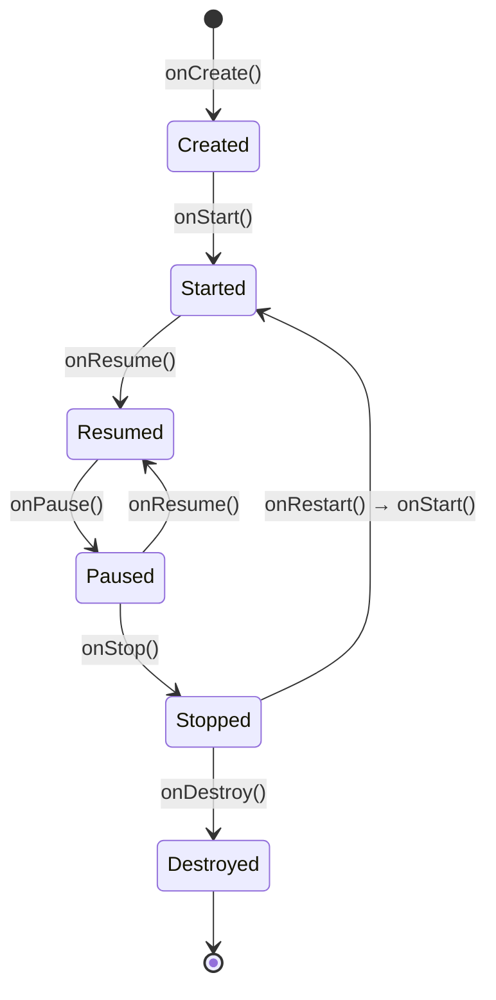
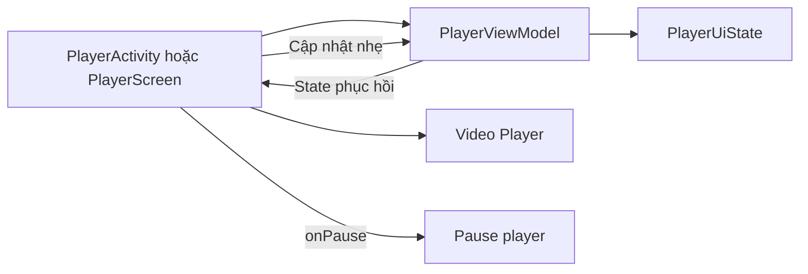

[](https://developer.android.com/guide/components/activities/intro-activities?utm_source=chatgpt.com)

# 006 — `onPause`

| Thông tin               | Nội dung                               |
| ----------------------- | -------------------------------------- |
| **Học phần**            | 02 — App Components and User Interface |
| **Module**              | Module 03 — App Components             |
| **Nhóm nội dung**       | Activity                               |
| **Nguồn roadmap**       | App Components / Activity              |
| **Loại bài**            | Lesson                                 |
| **Thứ tự trong module** | 006                                    |
| **Thời lượng gợi ý**    | 24 phút                                |

---

## 1. Tóm tắt

`onPause()` là một callback trong vòng đời `Activity`, được hệ thống gọi khi màn hình **mất quyền tương tác trực tiếp với người dùng** và chuyển từ trạng thái `RESUMED` sang `PAUSED`.

Khi `onPause()` được gọi, `Activity` có thể vẫn còn nhìn thấy một phần hoặc thậm chí vẫn hiển thị đầy đủ trong chế độ đa cửa sổ, nhưng nó không còn là cửa sổ đang nhận input của người dùng. Sau `onPause()`, Activity có thể quay lại `onResume()` hoặc tiếp tục sang `onStop()`. ([Android Developers][1])

> **Ý chính:** `onPause()` không có nghĩa là Activity đã bị đóng. Nó chỉ có nghĩa là Activity đã mất focus.

---

## 2. Mục tiêu học tập

Sau bài học, anh có thể:

* Giải thích được thời điểm Android gọi `onPause()`.
* Phân biệt `onPause()` với `onStop()`.
* Biết loại tác vụ nào nên và không nên đặt trong `onPause()`.
* Ghép đúng cặp `onResume()` — `onPause()`.
* Quản lý state bằng `ViewModel`, `rememberSaveable` hoặc bộ nhớ bền vững.
* Quan sát callback bằng Logcat.
* Kiểm thử trạng thái `PAUSED` bằng `ActivityScenario`.
* Xây dựng một artifact nhỏ để đưa vào portfolio.

---

## 3. Ghi chú 5 dòng về `onPause`

1. `onPause()` được gọi khi Activity mất focus.
2. Activity có thể vẫn còn hiển thị trên màn hình.
3. Callback này phải thực thi nhanh.
4. Có thể dùng nó để tạm dừng camera, video, animation hoặc sensor chỉ cần thiết khi người dùng đang tương tác.
5. Không nên lưu dữ liệu lớn, gọi mạng hoặc chạy transaction cơ sở dữ liệu trực tiếp trong `onPause()`.

Android lưu ý rằng `onPause()` có thời gian thực thi rất ngắn; các thao tác lưu dữ liệu, gọi mạng hoặc transaction cơ sở dữ liệu có thể chưa hoàn thành trước khi callback kết thúc. ([Android Developers][1])

---

## 4. Ảnh minh họa Activity Lifecycle


*Nguồn ảnh: Android Developers — Activity Lifecycle.* 

---

## 5. Vị trí của `onPause` trong Activity Lifecycle



Luồng quan trọng nhất:

```text
onResume()
    ↓ Activity mất focus
onPause()
    ├── Người dùng quay lại ngay → onResume()
    └── Activity không còn nhìn thấy → onStop()
```

Activity luôn nhận `onPause()` sau khi rời trạng thái `RESUMED`. Sau đó, callback tiếp theo là `onResume()` hoặc `onStop()`, tùy Activity có lấy lại focus hay bị che hoàn toàn. ([Android Developers][2])

---

## 6. Khi nào `onPause()` được gọi?

### 6.1 Một dialog hoặc Activity trong suốt xuất hiện

Ví dụ:

* Dialog xin quyền truy cập.
* Activity có nền trong suốt.
* Bottom sheet hoặc cửa sổ hệ thống lấy focus.
* Màn hình xác nhận thanh toán xuất hiện phía trên.

Activity phía dưới có thể vẫn nhìn thấy nhưng không còn nhận tương tác.

```text
Activity A: RESUMED
        ↓
Dialog/Activity B xuất hiện
        ↓
Activity A: onPause()
        ↓
Dialog đóng
        ↓
Activity A: onResume()
```

Một Activity hoặc dialog mới lấy focus và chỉ che một phần màn hình sẽ khiến Activity bên dưới đi vào trạng thái `PAUSED`. ([Android Developers][3])

---

### 6.2 Người dùng nhấn Home hoặc mở màn hình Recents

Luồng phổ biến:

```text
onPause()
onStop()
```

Khi người dùng quay lại:

```text
onRestart()
onStart()
onResume()
```

Home và Recents thường khiến Activity bị che hoàn toàn, vì vậy `onPause()` thường nhanh chóng được theo sau bởi `onStop()`. ([Android Developers][3])

---

### 6.3 Người dùng chuyển focus trong chế độ đa cửa sổ

Trong multi-window, hai ứng dụng có thể cùng hiển thị, nhưng chỉ ứng dụng đang được tương tác mới ở trạng thái `RESUMED`. Ứng dụng còn lại có thể ở trạng thái `PAUSED` dù vẫn nhìn thấy đầy đủ. ([Android Developers][3])

```text
┌────────────────────┬────────────────────┐
│ App A              │ App B              │
│ PAUSED             │ RESUMED            │
│ vẫn nhìn thấy      │ đang nhận input    │
└────────────────────┴────────────────────┘
```

Đây là lý do không nên mặc định rằng mọi UI phải dừng hoàn toàn ngay trong `onPause()`.

---

### 6.4 Xoay thiết bị hoặc thay đổi cấu hình

Khi Activity được hệ thống tạo lại do xoay màn hình, instance cũ thường đi qua:

```text
onPause()
onStop()
onDestroy()
```

Instance mới được tạo:

```text
onCreate()
onStart()
onResume()
```

State cần sống qua configuration change nên được đặt trong `ViewModel`, `rememberSaveable` hoặc bộ nhớ bền vững, thay vì chỉ giữ trong biến của Activity. ([Android Developers][3])

---

### 6.5 Người dùng nhấn Back

Đối với một Activity thông thường:

```text
onPause()
onStop()
onDestroy()
```

Activity bị loại khỏi back stack. Đây khác với việc tạm thời chuyển sang ứng dụng khác vì người dùng thường không kỳ vọng quay lại đúng instance vừa đóng. ([Android Developers][3])

---

## 7. `onPause()` nên làm gì?

### Những tác vụ phù hợp

* Tạm dừng video hoặc game loop.
* Dừng camera preview nếu camera chỉ cần hoạt động khi Activity có focus.
* Tạm dừng animation nặng.
* Dừng đọc sensor cần tương tác trực tiếp.
* Ngừng nhận callback độc quyền.
* Cập nhật nhanh state trong bộ nhớ.
* Ghi log lifecycle để debug.
* Hủy đăng ký tài nguyên đã đăng ký trong `onResume()`.

Nguyên tắc ghép cặp:

```text
Khởi tạo trong onResume()
        ↕
Giải phóng trong onPause()
```

Nếu tài nguyên được khởi tạo từ `onStart()`, tài nguyên đó thường nên được giải phóng tại `onStop()`. Android khuyến nghị chọn cặp callback tương ứng để tránh giữ tài nguyên quá lâu hoặc giải phóng quá sớm. ([Android Developers][1])

---

## 8. `onPause()` không nên làm gì?

Không nên đặt trực tiếp những tác vụ sau trong `onPause()`:

```kotlin
override fun onPause() {
    super.onPause()

    // Không nên:
    repository.uploadLargeFile()
    database.runLargeTransaction()
    Thread.sleep(2_000)
    generateLargeReport()
}
```

### Vì sao?

`onPause()` phải hoàn thành nhanh để Activity tiếp theo có thể xuất hiện mượt mà. Tác vụ nặng trên main thread có thể gây:

* Giật hoặc đứng giao diện.
* Chậm chuyển màn hình.
* ANR.
* Transaction chưa hoàn thành.
* Dữ liệu lưu không đầy đủ.
* Trải nghiệm Back/Home thiếu tự nhiên.

Android khuyến nghị không dùng `onPause()` để lưu dữ liệu ứng dụng hoặc dữ liệu người dùng, gọi mạng hay chạy transaction cơ sở dữ liệu. Các thao tác shutdown tương đối nặng nên được chuyển sang `onStop()` hoặc giao cho tầng dữ liệu chạy bất đồng bộ. ([Android Developers][2])

---

## 9. Phân biệt `onPause()` và `onStop()`

| Tiêu chí                               | `onPause()`          | `onStop()`                                     |
| -------------------------------------- | -------------------- | ---------------------------------------------- |
| Activity có focus?                     | Không                | Không                                          |
| Activity còn nhìn thấy?                | Có thể vẫn nhìn thấy | Không còn nhìn thấy                            |
| Callback có cần chạy nhanh?            | Rất nhanh            | Có nhiều thời gian hơn                         |
| Camera chỉ dùng khi tương tác          | Có thể dừng tại đây  | Không cần chờ đến đây                          |
| Animation vẫn hữu ích khi multi-window | Có thể tiếp tục      | Nên dừng                                       |
| Tác vụ shutdown tương đối nặng         | Không phù hợp        | Phù hợp hơn                                    |
| Có thể quay thẳng về `onResume()`      | Có                   | Không, thường qua `onRestart()` và `onStart()` |

Android đề xuất cân nhắc `onStop()` cho các tài nguyên liên quan tới UI nếu chúng vẫn cần tiếp tục khi Activity còn nhìn thấy trong chế độ đa cửa sổ. ([Android Developers][1])

---

## 10. Ví dụ Kotlin cơ bản

### 10.1 Ghi log callback

```kotlin
package com.example.lifecycle

import android.os.Bundle
import android.util.Log
import androidx.appcompat.app.AppCompatActivity

class LifecycleActivity : AppCompatActivity() {

    override fun onCreate(savedInstanceState: Bundle?) {
        super.onCreate(savedInstanceState)
        setContentView(R.layout.activity_lifecycle)

        Log.d(TAG, "onCreate")
    }

    override fun onStart() {
        super.onStart()
        Log.d(TAG, "onStart")
    }

    override fun onResume() {
        super.onResume()
        Log.d(TAG, "onResume")
    }

    override fun onPause() {
        Log.d(TAG, "onPause")

        // Chỉ thực hiện cleanup nhẹ và nhanh tại đây.

        super.onPause()
    }

    override fun onStop() {
        Log.d(TAG, "onStop")
        super.onStop()
    }

    override fun onDestroy() {
        Log.d(TAG, "onDestroy")
        super.onDestroy()
    }

    companion object {
        private const val TAG = "ActivityLifecycle"
    }
}
```

Mở **Logcat** và lọc theo:

```text
tag:ActivityLifecycle
```

Android cũng khuyến khích học lifecycle bằng cách thêm log vào callback, chạy ứng dụng, chuyển nền, quay lại và xoay thiết bị để quan sát thứ tự sự kiện. ([Android Developers][4])

---

## 11. Ví dụ tạm dừng camera preview

```kotlin
class CameraActivity : AppCompatActivity() {

    private lateinit var previewController: CameraPreviewController

    override fun onCreate(savedInstanceState: Bundle?) {
        super.onCreate(savedInstanceState)
        setContentView(R.layout.activity_camera)

        previewController = CameraPreviewController(
            context = this
        )
    }

    override fun onResume() {
        super.onResume()

        // Camera chỉ hoạt động khi Activity có focus.
        previewController.startPreview()
    }

    override fun onPause() {
        // Dừng nhanh tài nguyên đã mở trong onResume().
        previewController.stopPreview()

        super.onPause()
    }
}
```

```kotlin
class CameraPreviewController(
    private val context: Context
) {
    private var isPreviewRunning = false

    fun startPreview() {
        if (isPreviewRunning) return

        // Mở hoặc khởi động camera preview.
        isPreviewRunning = true
    }

    fun stopPreview() {
        if (!isPreviewRunning) return

        // Dừng preview và giải phóng tài nguyên cần thiết.
        isPreviewRunning = false
    }
}
```

Nếu camera cần tiếp tục hiển thị trong multi-window khi Activity vẫn còn nhìn thấy, có thể cân nhắc cặp `onStart()` — `onStop()` thay vì `onResume()` — `onPause()`. Tuy nhiên, giữ camera trong trạng thái `PAUSED` cũng có thể ngăn ứng dụng khác sử dụng camera, vì vậy phải lựa chọn dựa trên UX thực tế. ([Android Developers][1])

---

## 12. Quản lý state bằng ViewModel

Không nên coi Activity là nơi lưu trữ state lâu dài. Activity có thể bị hủy và tạo lại khi xoay màn hình hoặc thay đổi cấu hình. Vai trò chính của Activity là host giao diện và điều phối tương tác với hệ thống. ([Android Developers][5])

### ViewModel

```kotlin
data class PlayerUiState(
    val currentPositionMs: Long = 0L,
    val isPlaying: Boolean = false
)
```

```kotlin
import androidx.lifecycle.ViewModel
import kotlinx.coroutines.flow.MutableStateFlow
import kotlinx.coroutines.flow.StateFlow
import kotlinx.coroutines.flow.asStateFlow
import kotlinx.coroutines.flow.update

class PlayerViewModel : ViewModel() {

    private val _uiState = MutableStateFlow(PlayerUiState())
    val uiState: StateFlow<PlayerUiState> = _uiState.asStateFlow()

    fun updatePlaybackPosition(positionMs: Long) {
        _uiState.update {
            it.copy(currentPositionMs = positionMs)
        }
    }

    fun setPlaying(isPlaying: Boolean) {
        _uiState.update {
            it.copy(isPlaying = isPlaying)
        }
    }
}
```

### Activity

```kotlin
class PlayerActivity : AppCompatActivity() {

    private val viewModel: PlayerViewModel by viewModels()
    private lateinit var player: AppPlayer

    override fun onResume() {
        super.onResume()

        player.seekTo(viewModel.uiState.value.currentPositionMs)
        player.play()
        viewModel.setPlaying(true)
    }

    override fun onPause() {
        // Chỉ cập nhật state trong bộ nhớ — thao tác rất nhẹ.
        viewModel.updatePlaybackPosition(player.currentPositionMs)
        viewModel.setPlaying(false)

        player.pause()

        super.onPause()
    }
}
```

Ở đây `onPause()` chỉ lấy vị trí phát hiện tại và cập nhật state trong bộ nhớ. Nếu cần lưu vào Room hoặc gửi lên server, tầng repository nên thực hiện bất đồng bộ tại thời điểm phù hợp thay vì chặn main thread trong callback.

---

## 13. `onPause` trong Jetpack Compose

Trong ứng dụng Compose hiện đại, không nên đưa toàn bộ lifecycle logic trực tiếp vào Activity. Android cung cấp `LifecycleResumeEffect`, chạy setup khi nhận `ON_RESUME` và tự chạy `onPauseOrDispose` khi nhận `ON_PAUSE` hoặc khi composable rời Composition. ([Android Developers][6])

```kotlin
import androidx.compose.runtime.Composable
import androidx.lifecycle.compose.LifecycleResumeEffect

@Composable
fun CameraPreview(
    cameraController: CameraController
) {
    LifecycleResumeEffect(cameraController) {
        cameraController.startPreview()

        onPauseOrDispose {
            cameraController.stopPreview()
        }
    }

    // Nội dung UI của camera.
}
```

### Ví dụ video player

```kotlin
@Composable
fun LifecycleAwareVideoPlayer(
    player: VideoPlayer
) {
    LifecycleResumeEffect(player) {
        player.resumePlayback()

        onPauseOrDispose {
            player.pausePlayback()
        }
    }

    VideoPlayerView(player = player)
}
```

`LifecycleResumeEffect` phù hợp với tài nguyên chỉ nên hoạt động khi người dùng đang trực tiếp tương tác, chẳng hạn camera, video hoặc animation nặng. ([Android Developers][6])

---

## 14. Thu thập Flow theo lifecycle

Với state từ `ViewModel`, nên dùng `collectAsStateWithLifecycle()` thay vì tự bắt đầu và dừng collection trong `onResume()` hoặc `onPause()`.

```kotlin
@Composable
fun PlayerRoute(
    viewModel: PlayerViewModel
) {
    val uiState by viewModel.uiState.collectAsStateWithLifecycle()

    PlayerScreen(
        positionMs = uiState.currentPositionMs,
        isPlaying = uiState.isPlaying
    )
}
```

Theo mặc định, `collectAsStateWithLifecycle()` bắt đầu collection khi lifecycle đạt `STARTED` và dừng khi lifecycle xuống dưới trạng thái này. Có thể đặt `minActiveState = Lifecycle.State.RESUMED` nếu dữ liệu chỉ nên được thu thập khi màn hình có focus. ([Android Developers][7])

```kotlin
val uiState by viewModel.uiState.collectAsStateWithLifecycle(
    minActiveState = Lifecycle.State.RESUMED
)
```

---

## 15. Sai lầm phổ biến của lập trình viên mới

### Sai lầm 1: Cho rằng `onPause()` nghĩa là màn hình đã biến mất

```kotlin
override fun onPause() {
    super.onPause()

    // Dừng tất cả UI ngay lập tức.
    animationController.destroy()
}
```

Trong multi-window hoặc khi một dialog trong suốt xuất hiện, Activity có thể vẫn còn nhìn thấy. Dừng hoặc hủy toàn bộ UI tại đây có thể làm màn hình trống hoặc giật.

**Cách sửa:** xác định tài nguyên cần focus hay chỉ cần visibility.

```text
Chỉ cần hoạt động khi có focus:
onResume ↔ onPause

Cần hoạt động khi còn nhìn thấy:
onStart ↔ onStop
```

---

### Sai lầm 2: Lưu toàn bộ form vào database trong `onPause()`

```kotlin
override fun onPause() {
    database.noteDao().insert(note) // Có thể chặn main thread
    super.onPause()
}
```

**Cách sửa:**

* Cập nhật state liên tục khi người dùng nhập.
* Lưu tự động bằng coroutine hoặc repository.
* Dùng `ViewModel` cho screen state.
* Dùng `rememberSaveable` cho UI state nhỏ.
* Dùng Room/DataStore cho dữ liệu cần tồn tại lâu dài.

---

### Sai lầm 3: Mở tài nguyên trong `onResume()` nhưng không đóng trong `onPause()`

```kotlin
override fun onResume() {
    super.onResume()
    sensorManager.registerListener(listener, sensor, delay)
}
```

Nếu không unregister, app có thể tiếp tục đọc sensor khi không còn focus, gây tốn pin hoặc đăng ký listener nhiều lần.

```kotlin
override fun onPause() {
    sensorManager.unregisterListener(listener)
    super.onPause()
}
```

---

### Sai lầm 4: Khởi chạy network request mỗi lần `onResume()`

```kotlin
override fun onResume() {
    super.onResume()
    viewModel.reloadFromServer()
}
```

Một dialog nhỏ đóng mở cũng có thể khiến request chạy lại, dẫn đến:

* Request trùng lặp.
* Loading nhấp nháy.
* Tăng chi phí dữ liệu.
* Ghi đè state mới bằng response cũ.

**Cách sửa:** để `ViewModel` hoặc repository quyết định khi nào dữ liệu cần refresh, dựa trên cache, timestamp hoặc sự kiện rõ ràng.

---

## 16. Thực hành với Logcat

### Bước 1: Khởi chạy app

Kết quả dự kiến:

```text
onCreate
onStart
onResume
```

### Bước 2: Nhấn Home

```text
onPause
onStop
```

### Bước 3: Quay lại app

```text
onRestart
onStart
onResume
```

### Bước 4: Xoay thiết bị

```text
onPause
onStop
onDestroy
onCreate
onStart
onResume
```

### Bước 5: Mở dialog che một phần Activity

```text
onPause
```

Đóng dialog:

```text
onResume
```

### Bước 6: Thử split-screen

Chuyển focus sang cửa sổ khác và kiểm tra:

* `onPause()` được gọi.
* Activity có thể vẫn hiển thị.
* Nội dung không được biến mất ngoài ý muốn.

Các luồng trên phản ánh cách Android xử lý Home, dialog, configuration change và multi-window. ([Android Developers][3])

---

## 17. Kiểm thử bằng `ActivityScenario`

`ActivityScenario` có thể đưa Activity tới các trạng thái lifecycle cụ thể. Chuyển sang `Lifecycle.State.STARTED` mô phỏng tình huống Activity bị pause nhưng chưa bị stop. ([Android Developers][8])

### Probe dùng cho bài thực hành

```kotlin
object LifecycleProbe {

    private val _events = mutableListOf<String>()
    val events: List<String>
        get() = _events.toList()

    fun record(event: String) {
        _events += event
    }

    fun reset() {
        _events.clear()
    }
}
```

### Ghi sự kiện trong Activity

```kotlin
override fun onPause() {
    LifecycleProbe.record("onPause")
    super.onPause()
}
```

### Instrumented test

```kotlin
import androidx.lifecycle.Lifecycle
import androidx.test.core.app.launchActivity
import androidx.test.ext.junit.runners.AndroidJUnit4
import org.junit.Assert.assertTrue
import org.junit.Test
import org.junit.runner.RunWith

@RunWith(AndroidJUnit4::class)
class LifecycleActivityTest {

    @Test
    fun movingToStarted_callsOnPause() {
        LifecycleProbe.reset()

        launchActivity<LifecycleActivity>().use { scenario ->
            scenario.moveToState(Lifecycle.State.STARTED)

            assertTrue(
                LifecycleProbe.events.contains("onPause")
            )
        }
    }
}
```

Có thể kiểm thử tạo lại Activity bằng:

```kotlin
scenario.recreate()
```

`ActivityScenario.recreate()` hủy instance hiện tại, tạo instance mới và đưa Activity trở lại trạng thái trước đó, phù hợp để kiểm tra state sau configuration change. ([Android Developers][8])

---

## 18. Tác động tới UX, độ ổn định và maintainability

### UX

Triển khai đúng `onPause()` giúp:

* Video dừng đúng lúc.
* Camera không chiếm tài nguyên khi mất focus.
* App chuyển màn hình mượt.
* Không mất vị trí đọc hoặc vị trí phát.
* Không loading lại vô lý khi đóng dialog.

### Độ ổn định

Lifecycle handling tốt giúp giảm nguy cơ:

* Crash khi chuyển app.
* Listener đăng ký nhiều lần.
* Memory leak.
* Sensor hoặc camera tiếp tục chạy.
* State mất khi xoay màn hình.
* Request trùng lặp.

Android nhấn mạnh rằng xử lý lifecycle đúng giúp tránh crash khi chuyển ứng dụng, giảm tiêu thụ tài nguyên và bảo toàn tiến trình của người dùng. ([Android Developers][1])

### Maintainability

Code dễ bảo trì hơn khi:

```text
Activity/Composable
        ↓ phát UI event
ViewModel
        ↓ điều phối
Repository
        ↓
Database / Network
```

Thay vì:

```text
Activity
 ├── gọi API
 ├── ghi database
 ├── quản lý camera
 ├── lưu state
 ├── xử lý business logic
 └── tự quản lý coroutine
```

Android khuyến nghị giữ UI controller gọn, đưa screen state vào `ViewModel` và đặt data logic trong tầng thích hợp. ([Android Developers][6])

---

## 19. Mini project: Lifecycle-aware Video Player

### Yêu cầu

Xây dựng màn hình video đơn giản:

* Phát video khi Activity ở trạng thái `RESUMED`.
* Tạm dừng khi nhận `onPause()`.
* Nhớ vị trí phát trong `ViewModel`.
* Khôi phục vị trí sau khi xoay màn hình.
* Không gọi database hoặc network trực tiếp trong `onPause()`.
* Ghi toàn bộ callback vào Logcat.

### Kiến trúc



### Artifact portfolio

```text
onpause-demo/
├── app/
│   ├── PlayerActivity.kt
│   ├── PlayerViewModel.kt
│   ├── PlayerUiState.kt
│   └── LifecycleProbe.kt
├── screenshots/
│   ├── player-resumed.png
│   └── logcat-pause-resume.png
├── tests/
│   └── LifecycleActivityTest.kt
└── README.md
```

---

## 20. Mẫu README cho portfolio

```markdown
# Android onPause Lifecycle Demo

Ứng dụng minh họa cách xử lý callback `onPause()` trong Android.

## Tính năng

- Ghi log toàn bộ Activity lifecycle.
- Tạm dừng video khi Activity mất focus.
- Khôi phục vị trí phát bằng ViewModel.
- Kiểm thử lifecycle bằng ActivityScenario.
- Hỗ trợ rotation và multi-window.

## Lifecycle flow

onResume → onPause → onResume

hoặc:

onResume → onPause → onStop

## Quy tắc triển khai

- Không chạy tác vụ nặng trong onPause.
- Ghép tài nguyên onResume với onPause.
- Đặt screen state trong ViewModel.
- Sử dụng lifecycle-aware API trong Compose.
```

---

## 21. Bài tập

### Bài tập 1 — Giải thích

Viết một đoạn 5–7 câu trả lời:

> `onPause()` được gọi khi nào và tại sao Activity có thể vẫn nhìn thấy sau khi callback này được gọi?

### Bài tập 2 — Thực hành

Tạo một Activity có các callback:

```text
onCreate
onStart
onResume
onPause
onStop
onDestroy
```

Ghi log và thử:

1. Nhấn Home.
2. Mở Recents.
3. Xoay màn hình.
4. Mở dialog.
5. Nhấn Back.
6. Chạy split-screen.

### Bài tập 3 — Sửa code

Tìm vấn đề trong đoạn sau:

```kotlin
override fun onPause() {
    api.uploadDraft()
    database.saveAllItems()
    bitmap.compress(format, 100, outputStream)
    super.onPause()
}
```

**Gợi ý:** callback đang làm quá nhiều công việc nặng và có thể chặn main thread.

### Bài tập 4 — Compose

Chuyển logic sau sang `LifecycleResumeEffect`:

```kotlin
override fun onResume() {
    camera.start()
}

override fun onPause() {
    camera.stop()
}
```

---

## 22. Câu hỏi tự kiểm tra

1. `onPause()` có đồng nghĩa Activity không còn nhìn thấy không?
2. Callback nào có thể xuất hiện ngay sau `onPause()`?
3. Vì sao không nên chạy transaction database trong `onPause()`?
4. Khi nào nên dùng cặp `onStart()` — `onStop()` thay cho `onResume()` — `onPause()`?
5. State nhập liệu nên lưu ở Activity, `ViewModel`, `rememberSaveable` hay database?
6. API Compose nào cung cấp `onPauseOrDispose`?
7. Làm thế nào dùng `ActivityScenario` để mô phỏng Activity bị pause?

---

## 23. Checklist hoàn thành

### Kiến thức

* [ ] Giải thích được `onPause()` bằng lời của mình.
* [ ] Biết Activity có thể vẫn nhìn thấy khi ở trạng thái `PAUSED`.
* [ ] Phân biệt được `onPause()` với `onStop()`.
* [ ] Biết callback tiếp theo có thể là `onResume()` hoặc `onStop()`.

### Code

* [ ] Đã override `onPause()` đúng cú pháp.
* [ ] Không đặt network call trong `onPause()`.
* [ ] Không chạy database transaction trên main thread.
* [ ] Tài nguyên mở trong `onResume()` được đóng trong `onPause()`.
* [ ] Screen state nằm trong `ViewModel` hoặc `rememberSaveable`.
* [ ] Compose sử dụng lifecycle-aware API khi phù hợp.

### Testing

* [ ] Đã kiểm tra khi nhấn Home.
* [ ] Đã kiểm tra khi mở dialog.
* [ ] Đã kiểm tra khi xoay màn hình.
* [ ] Đã kiểm tra khi nhấn Back.
* [ ] Đã kiểm tra multi-window.
* [ ] Đã quan sát callback trong Logcat.
* [ ] Có ít nhất một test bằng `ActivityScenario`.

### Portfolio

* [ ] Có source code.
* [ ] Có README.
* [ ] Có sơ đồ lifecycle.
* [ ] Có ảnh chụp Logcat.
* [ ] Có mô tả lỗi phổ biến.
* [ ] Có test hoặc checklist kiểm thử.

---

## 24. Ghi chú production

Trước khi release, cần kiểm tra:

```text
[ ] Có tác vụ nào chặn main thread trong onPause không?
[ ] Camera, microphone và sensor có được giải phóng đúng cặp không?
[ ] Video/audio có dừng và khôi phục đúng vị trí không?
[ ] Việc mở dialog có làm màn hình bị reset không?
[ ] App có hoạt động đúng trong split-screen không?
[ ] State có sống qua rotation không?
[ ] Network request có bị gọi lại mỗi lần onResume không?
[ ] Người dùng có mất nội dung form khi chuyển ứng dụng không?
[ ] Có listener nào bị đăng ký lặp lại không?
[ ] Lifecycle behavior đã được kiểm thử trên thiết bị thật chưa?
```

### Nguyên tắc cần nhớ

```text
onPause = mất focus, chưa chắc mất visibility
onStop  = không còn visibility
ViewModel = giữ screen state
Repository = xử lý dữ liệu
Lifecycle-aware API = tự động start/stop đúng thời điểm
```

> **Kết luận:** `onPause()` nên được xem là một tín hiệu để nhanh chóng điều chỉnh những chức năng chỉ cần thiết khi Activity đang có focus. Không dùng nó như một nơi “lưu mọi thứ trước khi ứng dụng đóng”, bởi Activity có thể chỉ mất focus trong vài giây và thậm chí vẫn đang hiển thị trên màn hình.

[1]: https://developer.android.com/guide/components/activities/activity-lifecycle "The activity lifecycle  |  App architecture  |  Android Developers"
[2]: https://developer.android.com/guide/components/activities/intro-activities "Introduction to activities  |  App architecture  |  Android Developers"
[3]: https://developer.android.com/guide/components/activities/state-changes "Activity state changes  |  App architecture  |  Android Developers"
[4]: https://developer.android.com/codelabs/basic-android-kotlin-compose-activity-lifecycle?utm_source=chatgpt.com "Stages of the Activity lifecycle"
[5]: https://developer.android.com/topic/architecture "Guide to app architecture  |  App architecture  |  Android Developers"
[6]: https://developer.android.com/topic/libraries/architecture/lifecycle "Lifecycle in Jetpack Compose  |  App architecture  |  Android Developers"
[7]: https://developer.android.com/topic/libraries/architecture/coroutines "Use Kotlin coroutines with lifecycle-aware components  |  App architecture  |  Android Developers"
[8]: https://developer.android.com/reference/androidx/test/core/app/ActivityScenario?utm_source=chatgpt.com "ActivityScenario  |  API reference  |  Android Developers"
