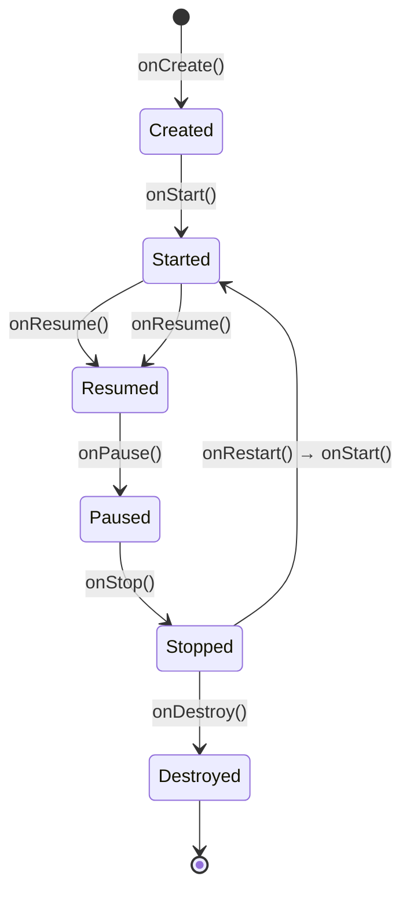

[](https://developer.android.com/codelabs/basic-android-kotlin-compose-activity-lifecycle?utm_source=chatgpt.com)

# 007 - `onStop`

**Học phần:** 02 - App Components and User Interface
**Module:** Module 03 - App Components
**Nhóm nội dung:** Activity
**Nguồn roadmap:** App Components / Activity
**Loại bài:** Lesson
**Thứ tự trong module:** 007
**Thời lượng gợi ý:** 24 phút

---

## 1. Tóm tắt

`onStop()` là callback thuộc vòng đời `Activity`, được Android gọi khi màn hình của Activity **không còn hiển thị với người dùng**.

Đây là thời điểm phù hợp để:

* Dừng animation hoặc cập nhật giao diện không còn cần thiết.
* Hủy đăng ký cảm biến, listener hoặc callback chỉ phục vụ màn hình.
* Giảm tần suất cập nhật vị trí.
* Tạm dừng những tác vụ gắn với việc màn hình đang hiển thị.
* Lưu dữ liệu nháp nếu chưa có thời điểm phù hợp hơn.

Sau `onStop()`, Activity có thể quay lại thông qua `onRestart()` hoặc tiếp tục bị hủy thông qua `onDestroy()`. Đối tượng Activity thường vẫn được giữ trong bộ nhớ khi ở trạng thái Stopped, nhưng tiến trình chứa Activity có khả năng bị hệ thống thu hồi cao hơn khi cần RAM. ([Android Developers][1])

---

## 2. Mục tiêu học tập

Sau bài học, anh có thể:

* Giải thích được khi nào Android gọi `onStop()`.
* Phân biệt `onPause()` với `onStop()`.
* Biết loại tài nguyên nào nên giải phóng trong `onStop()`.
* Không đặt công việc blocking hoặc business logic phức tạp trực tiếp trong Activity.
* Kiểm tra `onStop()` bằng Logcat, thao tác Home, xoay màn hình và `ActivityScenario`.
* Xây dựng một demo nhỏ có thể đưa vào portfolio.

---

## 3. Ghi chú năm dòng về `onStop`

> 1. `onStop()` được gọi khi Activity không còn nhìn thấy trên màn hình.
> 2. Nó thường xuất hiện sau `onPause()`.
> 3. Đây là nơi dừng những tài nguyên chỉ cần khi giao diện đang hiển thị.
> 4. Activity chưa chắc đã bị hủy sau `onStop()`.
> 5. Khi quay lại, Android thường gọi `onRestart()` → `onStart()` → `onResume()`.

---

## 4. Vị trí của `onStop` trong Activity Lifecycle


*Nguồn hình: Android Developers.* 



Luồng phổ biến khi người dùng nhấn nút Home:

```text
onPause()
   ↓
onStop()
   ↓
Ứng dụng nằm trong nền
   ↓
onRestart()
   ↓
onStart()
   ↓
onResume()
```

Android gọi `onStop()` khi Activity không còn hiển thị, chẳng hạn một Activity toàn màn hình khác che lên Activity hiện tại hoặc Activity đang kết thúc. Callback tiếp theo thường là `onRestart()` nếu người dùng quay lại hoặc `onDestroy()` nếu Activity bị hủy. ([Android Developers][2])

---

## 5. Khi nào `onStop()` được gọi?

### 5.1 Người dùng nhấn Home

Activity mất focus rồi biến mất khỏi màn hình:

```text
onPause()
onStop()
```

Khi người dùng mở lại ứng dụng:

```text
onRestart()
onStart()
onResume()
```

### 5.2 Mở một Activity toàn màn hình khác

Ví dụ:

```kotlin
startActivity(Intent(this, DetailActivity::class.java))
```

Nếu `DetailActivity` che hoàn toàn Activity cũ, Activity cũ sẽ đi qua:

```text
onPause()
onStop()
```

Khi Activity A mở Activity B, thứ tự thường là:

```text
A.onPause()

B.onCreate()
B.onStart()
B.onResume()

A.onStop()
```

`onStop()` của Activity A xảy ra sau khi Activity B đã được đưa lên foreground nếu A không còn nhìn thấy. ([Android Developers][1])

### 5.3 Người dùng nhấn Back

Activity hiện tại thường đi qua:

```text
onPause()
onStop()
onDestroy()
```

Trong trường hợp này, Activity đang được kết thúc chứ không chỉ tạm thời đưa xuống nền.

### 5.4 Xoay màn hình

Theo cơ chế mặc định, thay đổi cấu hình như xoay màn hình có thể làm Activity cũ bị hủy và tạo lại:

```text
Activity cũ:
onPause()
onStop()
onDestroy()

Activity mới:
onCreate()
onStart()
onResume()
```

Codelab Android chính thức sử dụng xoay thiết bị và Logcat để quan sát chính chuỗi callback này. ([Android Developers][3])

### 5.5 Một cửa sổ chỉ che một phần màn hình

Một dialog hoặc Activity bán trong suốt có thể chỉ làm Activity mất focus nhưng vẫn còn nhìn thấy:

```text
onPause()
```

Trong trường hợp đó, `onStop()` chưa được gọi. Đây là lý do không nên dừng mọi cập nhật giao diện ngay trong `onPause()`: ứng dụng có thể vẫn đang hiển thị trong chế độ nhiều cửa sổ hoặc phía sau một thành phần bán trong suốt. ([Android Developers][1])

---

## 6. Phân biệt `onPause()` và `onStop()`

| Tiêu chí            | `onPause()`                                | `onStop()`                                            |
| ------------------- | ------------------------------------------ | ----------------------------------------------------- |
| Trạng thái màn hình | Có thể vẫn nhìn thấy một phần              | Không còn nhìn thấy                                   |
| Focus               | Đã mất focus                               | Đã mất focus và bị che hoàn toàn                      |
| Thời gian thực thi  | Nên rất ngắn                               | Có thể xử lý cleanup nặng hơn một chút                |
| Ví dụ               | Dừng camera cần focus, commit thao tác nhỏ | Dừng animation, sensor, listener hoặc cập nhật vị trí |
| Multi-window        | Activity có thể vẫn hiển thị               | Activity đã không còn hiển thị                        |
| Callback tiếp theo  | `onResume()` hoặc `onStop()`               | `onRestart()` hoặc `onDestroy()`                      |

Android khuyến nghị giữ `onPause()` nhẹ, không thực hiện giao dịch database, network hoặc thao tác lưu dữ liệu tốn thời gian trong callback này. Các thao tác shutdown tương đối nặng có thể chuyển sang `onStop()`, nhưng công việc dài hạn vẫn nên được giao cho lớp dữ liệu, coroutine hoặc cơ chế background work phù hợp. ([Android Developers][1])

---

## 7. Nên làm gì trong `onStop()`?

### Phù hợp

```kotlin
override fun onStop() {
    super.onStop()

    animation.pause()
    sensorManager.unregisterListener(sensorListener)
    locationClient.removeLocationUpdates(locationCallback)
    player.pause()
}
```

Các ví dụ phù hợp gồm:

* Dừng animation không còn nhìn thấy.
* Hủy đăng ký cảm biến.
* Hủy callback cập nhật vị trí chính xác cao.
* Dừng preview hoặc render gắn với màn hình.
* Tạm dừng trình phát theo yêu cầu sản phẩm.
* Gọi ViewModel để lưu bản nháp.
* Giải phóng tài nguyên có thể đăng ký lại trong `onStart()`.

Android đưa ra ví dụ tạm dừng animation, giảm mức độ cập nhật vị trí và lưu nháp thông qua ViewModel trong `onStop()`. ([Android Developers][1])

### Không phù hợp

```kotlin
override fun onStop() {
    super.onStop()

    // Không nên blocking main thread.
    Thread.sleep(5_000)

    // Không nên thực hiện network đồng bộ.
    val response = blockingApi.uploadEverything()

    // Không nên đặt toàn bộ business logic tại đây.
    calculateInvoice()
    validateOrder()
    updateDatabaseSynchronously()
}
```

Không nên:

* Chặn main thread.
* Chờ một request mạng hoàn thành.
* Chạy vòng lặp dài.
* Serialize lượng dữ liệu lớn.
* Đặt toàn bộ logic nghiệp vụ trong Activity.
* Xem `onStop()` là cơ chế duy nhất bảo vệ dữ liệu người dùng.

Dữ liệu quan trọng nên được lưu tại thời điểm người dùng thay đổi nó hoặc thông qua repository. Nếu chỉ giữ trong Activity, dữ liệu có thể mất khi tiến trình bị hệ thống thu hồi trong lúc Activity đang Stopped. `ViewModel` giúp vượt qua configuration change, còn `SavedStateHandle`, `rememberSaveable` hoặc local storage cần được dùng tùy loại state và yêu cầu phục hồi sau process death. ([Android Developers][4])

---

## 8. Ví dụ thực hành: dừng cảm biến ánh sáng trong `onStop`

Ứng dụng hiển thị độ sáng môi trường bằng cảm biến ánh sáng:

* Khi màn hình hiển thị: đăng ký cảm biến trong `onStart()`.
* Khi màn hình biến mất: hủy đăng ký trong `onStop()`.
* Giá trị giao diện được lưu trong `ViewModel`.

### `MainActivity.kt`

```kotlin
package com.example.onstopdemo

import android.hardware.Sensor
import android.hardware.SensorEvent
import android.hardware.SensorEventListener
import android.hardware.SensorManager
import android.os.Bundle
import android.util.Log
import androidx.activity.ComponentActivity
import androidx.activity.compose.setContent
import androidx.activity.viewModels
import androidx.annotation.VisibleForTesting
import androidx.compose.foundation.layout.Arrangement
import androidx.compose.foundation.layout.Column
import androidx.compose.foundation.layout.fillMaxSize
import androidx.compose.foundation.layout.padding
import androidx.compose.material3.MaterialTheme
import androidx.compose.material3.Surface
import androidx.compose.material3.Text
import androidx.compose.runtime.getValue
import androidx.compose.ui.Alignment
import androidx.compose.ui.Modifier
import androidx.compose.ui.unit.dp
import androidx.lifecycle.ViewModel
import androidx.lifecycle.compose.collectAsStateWithLifecycle
import kotlinx.coroutines.flow.MutableStateFlow
import kotlinx.coroutines.flow.asStateFlow

private const val TAG = "MainActivity"

class MainActivity : ComponentActivity(), SensorEventListener {

    private val viewModel: LightSensorViewModel by viewModels()

    private lateinit var sensorManager: SensorManager

    private val lightSensor: Sensor? by lazy {
        sensorManager.getDefaultSensor(Sensor.TYPE_LIGHT)
    }

    @VisibleForTesting
    internal var isSensorRegistered = false
        private set

    override fun onCreate(savedInstanceState: Bundle?) {
        super.onCreate(savedInstanceState)

        sensorManager =
            getSystemService(SENSOR_SERVICE) as SensorManager

        Log.d(TAG, "onCreate")

        setContent {
            val lux by viewModel.lux.collectAsStateWithLifecycle()

            MaterialTheme {
                Surface(modifier = Modifier.fillMaxSize()) {
                    Column(
                        modifier = Modifier
                            .fillMaxSize()
                            .padding(24.dp),
                        horizontalAlignment = Alignment.CenterHorizontally,
                        verticalArrangement = Arrangement.Center
                    ) {
                        Text(
                            text = "Cảm biến ánh sáng",
                            style = MaterialTheme.typography.headlineMedium
                        )

                        Text(
                            text = lux?.let { value ->
                                "Độ sáng: %.1f lux".format(value)
                            } ?: "Đang chờ dữ liệu cảm biến…",
                            modifier = Modifier.padding(top = 16.dp)
                        )
                    }
                }
            }
        }
    }

    override fun onStart() {
        super.onStart()
        Log.d(TAG, "onStart")

        isSensorRegistered = lightSensor?.let { sensor ->
            sensorManager.registerListener(
                this,
                sensor,
                SensorManager.SENSOR_DELAY_NORMAL
            )
        } ?: false
    }

    override fun onResume() {
        super.onResume()
        Log.d(TAG, "onResume")
    }

    override fun onPause() {
        super.onPause()
        Log.d(TAG, "onPause")
    }

    override fun onStop() {
        super.onStop()

        if (isSensorRegistered) {
            sensorManager.unregisterListener(this)
            isSensorRegistered = false
        }

        Log.d(TAG, "onStop: đã hủy đăng ký cảm biến")
    }

    override fun onRestart() {
        super.onRestart()
        Log.d(TAG, "onRestart")
    }

    override fun onDestroy() {
        super.onDestroy()
        Log.d(TAG, "onDestroy")
    }

    override fun onSensorChanged(event: SensorEvent?) {
        if (event?.sensor?.type == Sensor.TYPE_LIGHT) {
            viewModel.updateLux(event.values.firstOrNull())
        }
    }

    override fun onAccuracyChanged(
        sensor: Sensor?,
        accuracy: Int
    ) = Unit
}

class LightSensorViewModel : ViewModel() {

    private val _lux = MutableStateFlow<Float?>(null)
    val lux = _lux.asStateFlow()

    fun updateLux(value: Float?) {
        _lux.value = value
    }
}
```

### Tại sao đăng ký ở `onStart()` và hủy ở `onStop()`?

Hai callback tạo thành một cặp đối xứng:

```text
onStart()  → bắt đầu tài nguyên cần khi màn hình hiển thị
onStop()   → dừng tài nguyên khi màn hình biến mất
```

Nếu đăng ký cảm biến trong `onStart()` nhưng quên hủy trong `onStop()`, cảm biến có thể tiếp tục gửi dữ liệu dù người dùng không còn nhìn thấy màn hình, làm tăng mức sử dụng pin và tài nguyên.

`collectAsStateWithLifecycle()` giúp Compose chỉ thu thập Flow phù hợp với lifecycle của giao diện, thay vì liên tục cập nhật UI khi màn hình đã xuống nền. Android hiện khuyến nghị đặt screen state và business logic trong ViewModel, đồng thời sử dụng API lifecycle-aware thay vì nhồi toàn bộ logic vào callback của Activity. ([Android Developers][1])

---

## 9. Kết quả mong đợi trong Logcat

### Khởi động ứng dụng

```text
MainActivity: onCreate
MainActivity: onStart
MainActivity: onResume
```

### Nhấn Home

```text
MainActivity: onPause
MainActivity: onStop: đã hủy đăng ký cảm biến
```

### Quay lại ứng dụng

```text
MainActivity: onRestart
MainActivity: onStart
MainActivity: onResume
```

### Xoay thiết bị

```text
MainActivity: onPause
MainActivity: onStop: đã hủy đăng ký cảm biến
MainActivity: onDestroy

MainActivity: onCreate
MainActivity: onStart
MainActivity: onResume
```

`onStart()` và `onStop()` có thể được gọi nhiều lần khi người dùng liên tục rời khỏi rồi quay lại Activity. ([Android Developers][3])

### Bộ lọc Logcat

```text
tag:MainActivity
```

Hoặc:

```text
package:com.example.onstopdemo tag:MainActivity
```

---

## 10. Kiểm thử bằng `ActivityScenario`

Thêm dependency Android Test phù hợp với cấu hình project:

```kotlin
androidTestImplementation(
    "androidx.test:core-ktx:<version>"
)

androidTestImplementation(
    "androidx.test.ext:junit-ktx:<version>"
)
```

Không nên sao chép một số phiên bản cố định từ bài học; hãy dùng Version Catalog hoặc phiên bản AndroidX đang được project quản lý.

### `MainActivityLifecycleTest.kt`

```kotlin
package com.example.onstopdemo

import androidx.lifecycle.Lifecycle
import androidx.test.core.app.ActivityScenario
import androidx.test.ext.junit.runners.AndroidJUnit4
import org.junit.Assert.assertEquals
import org.junit.Assert.assertFalse
import org.junit.Test
import org.junit.runner.RunWith

@RunWith(AndroidJUnit4::class)
class MainActivityLifecycleTest {

    @Test
    fun movingToCreatedState_stopsVisibleResources() {
        ActivityScenario.launch(MainActivity::class.java).use { scenario ->

            // ActivityScenario sử dụng đường đi qua onStop()
            // khi chuyển từ RESUMED xuống CREATED.
            scenario.moveToState(Lifecycle.State.CREATED)

            assertEquals(
                Lifecycle.State.CREATED,
                scenario.state
            )

            scenario.onActivity { activity ->
                assertFalse(activity.isSensorRegistered)
            }
        }
    }
}
```

Trong `ActivityScenario`, chuyển Activity từ `RESUMED` xuống `Lifecycle.State.CREATED` sử dụng đường lifecycle đi qua sự kiện `ON_STOP`. API này được thiết kế để điều khiển trạng thái Activity phục vụ kiểm thử. ([Android Developers][5])

> Lưu ý: emulator có thể không cung cấp cảm biến ánh sáng thật. Với production test, nên tách phần quản lý sensor thành một interface và inject fake implementation để kiểm tra chính xác số lần đăng ký và hủy đăng ký.

---

## 11. Kiểm thử thủ công

| Bước | Thao tác               | Kết quả mong đợi                                         |
| ---- | ---------------------- | -------------------------------------------------------- |
| 1    | Mở ứng dụng            | Có `onCreate`, `onStart`, `onResume`                     |
| 2    | Nhấn Home              | Có `onPause`, sau đó `onStop`                            |
| 3    | Mở lại ứng dụng        | Có `onRestart`, `onStart`, `onResume`                    |
| 4    | Mở dialog che một phần | Thường chỉ có `onPause`                                  |
| 5    | Đóng dialog            | Có `onResume`                                            |
| 6    | Xoay màn hình          | Activity cũ stop và destroy, Activity mới được tạo       |
| 7    | Nhấn Back              | Có `onPause`, `onStop`, `onDestroy`                      |
| 8    | Kiểm tra profiler      | Sensor hoặc listener không chạy khi app bị che hoàn toàn |

---

## 12. Lỗi thường gặp của lập trình viên mới

### Lỗi 1: Nhầm `onStop()` với `onDestroy()`

```kotlin
override fun onStop() {
    super.onStop()

    // Sai tư duy: cho rằng Activity sẽ không quay lại.
    viewModel.clearAllUserInput()
}
```

Activity có thể quay lại ngay sau đó thông qua:

```text
onRestart() → onStart() → onResume()
```

Vì vậy không nên xóa dữ liệu người dùng chỉ vì Activity bị stop.

### Lỗi 2: Dừng tài nguyên quá sớm trong `onPause()`

```kotlin
override fun onPause() {
    super.onPause()
    visibleAnimation.cancel()
}
```

Nếu Activity vẫn còn nhìn thấy trong multi-window, animation sẽ bị đứng dù người dùng vẫn quan sát được giao diện. Với tài nguyên chỉ cần dừng khi màn hình hoàn toàn biến mất, `onStop()` thường phù hợp hơn. ([Android Developers][1])

### Lỗi 3: Chạy database đồng bộ trên main thread

```kotlin
override fun onStop() {
    super.onStop()

    // Không nên.
    database.noteDao().insertBlocking(note)
}
```

Nên giao việc cho ViewModel hoặc repository:

```kotlin
override fun onStop() {
    super.onStop()
    viewModel.saveDraft()
}
```

```kotlin
class NoteViewModel(
    private val repository: NoteRepository
) : ViewModel() {

    fun saveDraft() {
        viewModelScope.launch {
            repository.saveDraft()
        }
    }
}
```

### Lỗi 4: Chỉ lưu dữ liệu trong `onStop()`

Nếu dữ liệu rất quan trọng, nên lưu khi nó thay đổi hoặc autosave theo luồng nghiệp vụ. `onStop()` là điểm dự phòng hợp lý khi chưa có thời điểm tốt hơn, không nên là cơ chế lưu duy nhất. Android cũng khuyến nghị ưu tiên cơ hội lưu khi Activity đang foreground và chỉ dùng `onStop()` nếu chưa có cơ hội phù hợp. ([Android Developers][1])

### Lỗi 5: Đăng ký nhiều lần nhưng chỉ hủy một lần

```kotlin
override fun onStart() {
    super.onStart()
    sensorManager.registerListener(...)
    sensorManager.registerListener(...)
}
```

Nên theo dõi trạng thái đăng ký:

```kotlin
if (!isSensorRegistered) {
    isSensorRegistered = registerSensor()
}
```

---

## 13. Ảnh hưởng đến chất lượng ứng dụng

### UX

Quản lý `onStop()` đúng giúp:

* Người dùng quay lại đúng trạng thái trước đó.
* Không mất nội dung đang nhập.
* Không phát âm thanh hoặc animation ngoài ý muốn.
* Không thấy màn hình bị reset vô lý.

### Reliability

* Tránh duplicate listener.
* Tránh callback cập nhật vào màn hình không còn hiển thị.
* Giảm khả năng crash do tài nguyên đã hết hiệu lực.
* Tránh phụ thuộc vào việc Activity luôn còn trong bộ nhớ.

### Performance và pin

* Sensor không tiếp tục chạy vô ích.
* Không render frame khi màn hình không còn hiển thị.
* Giảm cập nhật vị trí, camera hoặc media.
* Giảm lượng CPU và bộ nhớ sử dụng trong background.

### Maintainability

Một cấu trúc dễ bảo trì thường là:

```text
Activity / Composable
        │
        │ điều phối lifecycle và hiển thị
        ▼
     ViewModel
        │
        │ quản lý screen state và business logic
        ▼
     Repository
        │
        ├── Network
        ├── Room
        └── DataStore
```

---

## 14. Artifact nhỏ cho portfolio

### Tên project

```text
Android Activity onStop Sensor Demo
```

### Nội dung nên đưa lên repository

```text
onstop-sensor-demo/
├── app/
│   ├── src/main/
│   │   └── MainActivity.kt
│   └── src/androidTest/
│       └── MainActivityLifecycleTest.kt
├── screenshots/
│   ├── app-running.png
│   └── lifecycle-logcat.png
└── README.md
```

### README mẫu

```markdown
# Activity onStop Demo

Ứng dụng Android minh họa cách sử dụng `onStop()` để hủy đăng ký
cảm biến ánh sáng khi Activity không còn hiển thị.

## Kiến thức được minh họa

- Activity Lifecycle
- onStart / onStop resource pairing
- ViewModel và StateFlow
- collectAsStateWithLifecycle
- Logcat lifecycle debugging
- ActivityScenario lifecycle test

## Cách kiểm tra

1. Chạy ứng dụng.
2. Lọc Logcat bằng `tag:MainActivity`.
3. Nhấn Home.
4. Xác nhận `onPause()` và `onStop()` được gọi.
5. Mở lại ứng dụng.
6. Xác nhận chuỗi `onRestart()` → `onStart()` → `onResume()`.
```

### Minh chứng nên chụp

* Màn hình đang hiển thị giá trị lux.
* Logcat trước và sau khi nhấn Home.
* Kết quả test `MainActivityLifecycleTest`.
* Một GIF ngắn thể hiện rời app và quay lại.

---

## 15. Bài tập

### Bài tập chính

Xây dựng ứng dụng **Draft Note** có một ô nhập ghi chú.

Yêu cầu:

1. Nội dung ô nhập được quản lý bởi ViewModel.
2. Khi Activity đi vào `onStop()`, ViewModel lưu bản nháp qua repository.
3. Khi mở lại ứng dụng, bản nháp được khôi phục.
4. Logcat phải hiển thị toàn bộ callback lifecycle.
5. Viết ít nhất một lifecycle test bằng `ActivityScenario`.

### Câu hỏi tự luận

1. Tại sao không nên coi `onStop()` là `onDestroy()`?
2. Tại sao một dialog bán trong suốt có thể chỉ gọi `onPause()`?
3. Khi nào nên dừng tài nguyên trong `onPause()` thay vì `onStop()`?
4. ViewModel có bảo vệ dữ liệu khỏi process death không?
5. Tại sao database operation không nên blocking main thread?

---

## 16. Checklist hoàn thành

### Kiến thức

* [ ] Giải thích được `onStop()` bằng ngôn ngữ của mình.
* [ ] Biết Activity không còn nhìn thấy khi callback này được gọi.
* [ ] Phân biệt được mất focus và mất visibility.
* [ ] Biết callback tiếp theo có thể là `onRestart()` hoặc `onDestroy()`.

### Code

* [ ] Có override `onStop()`.
* [ ] Có gọi `super.onStop()`.
* [ ] Có cặp đăng ký trong `onStart()` và hủy trong `onStop()`.
* [ ] Không blocking main thread.
* [ ] Screen state được giữ trong ViewModel.
* [ ] Dữ liệu lâu dài được giao cho repository hoặc local storage.

### Testing

* [ ] Đã kiểm tra bằng nút Home.
* [ ] Đã kiểm tra khi quay lại ứng dụng.
* [ ] Đã xoay thiết bị.
* [ ] Đã thử một dialog che một phần.
* [ ] Đã lọc callback bằng Logcat.
* [ ] Có lifecycle test bằng `ActivityScenario`.

### Portfolio

* [ ] Có source code.
* [ ] Có README.
* [ ] Có screenshot giao diện.
* [ ] Có screenshot Logcat.
* [ ] Có mô tả ảnh hưởng đến pin, UX và reliability.

---

## 17. Ghi chú production

Trước khi release một màn hình sử dụng `onStop()`, hãy kiểm tra:

```text
[ ] Có sensor, receiver hoặc callback nào vẫn chạy khi app xuống nền không?
[ ] Có đăng ký listener trùng lặp khi quay lại app không?
[ ] Có dữ liệu người dùng chỉ tồn tại trong Activity field không?
[ ] Có thao tác database hoặc network blocking main thread không?
[ ] Có trường hợp multi-window khiến tài nguyên bị dừng quá sớm không?
[ ] Có state nào cần SavedStateHandle, rememberSaveable hoặc local storage không?
[ ] Có test Home → quay lại app không?
[ ] Có test xoay màn hình không?
[ ] Có test process recreation không?
```

Điểm quan trọng nhất:

> `onStop()` đánh dấu việc màn hình không còn hiển thị, không phải lúc ứng dụng chắc chắn kết thúc.

---

## 18. Tài liệu tham khảo

* [The Activity Lifecycle — Android Developers](https://developer.android.com/guide/components/activities/activity-lifecycle)
* [Introduction to Activities — Android Developers](https://developer.android.com/guide/components/activities/intro-activities)
* [Stages of the Activity Lifecycle — Android Codelab](https://developer.android.com/codelabs/basic-android-kotlin-compose-activity-lifecycle)
* [Save UI States — Android Developers](https://developer.android.com/topic/libraries/architecture/saving-states)
* [ViewModel Overview — Android Developers](https://developer.android.com/topic/libraries/architecture/viewmodel)
* [ActivityScenario API — Android Developers](https://developer.android.com/reference/androidx/test/core/app/ActivityScenario)

[1]: https://developer.android.com/guide/components/activities/activity-lifecycle "The activity lifecycle  |  App architecture  |  Android Developers"
[2]: https://developer.android.com/guide/components/activities/intro-activities "Introduction to activities  |  App architecture  |  Android Developers"
[3]: https://developer.android.com/codelabs/basic-android-kotlin-compose-activity-lifecycle "Stages of the Activity lifecycle  |  Android Developers"
[4]: https://developer.android.com/topic/libraries/architecture/views/saving-states-views "Save UI states (Views)  |  Android Developers"
[5]: https://developer.android.com/reference/androidx/test/core/app/ActivityScenario?utm_source=chatgpt.com "ActivityScenario  |  API reference  |  Android Developers"

---

# Bài luyện tập

## Mục tiêu


## Đề bài


## Yêu cầu hoàn thành

- [ ] 
- [ ] 
- [ ] 

## Kết quả / lời giải


## Ghi chú
