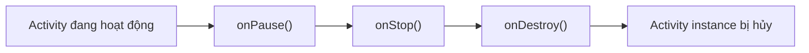
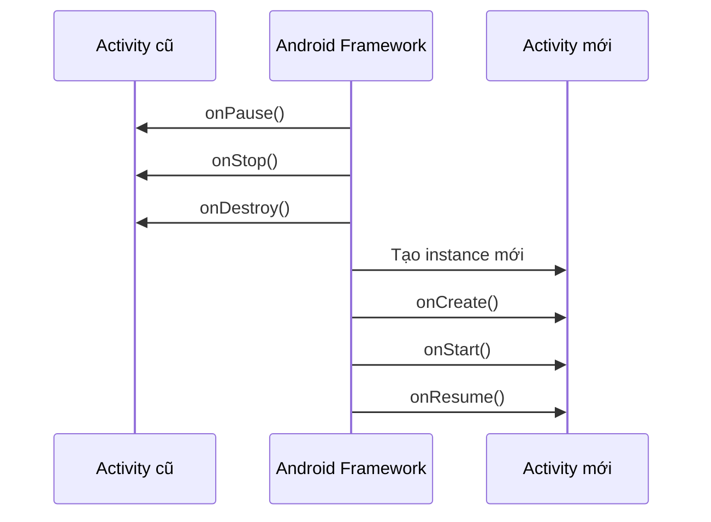

# 008 — `onDestroy`

| Thuộc tính              | Nội dung                               |
| ----------------------- | -------------------------------------- |
| **Học phần**            | 02 — App Components and User Interface |
| **Module**              | Module 03 — App Components             |
| **Nhóm nội dung**       | Activity                               |
| **Nguồn roadmap**       | App Components / Activity              |
| **Loại bài**            | Lesson                                 |
| **Thứ tự trong module** | 008                                    |
| **Thời lượng gợi ý**    | 24 phút                                |

---

## 1. Tóm tắt

`onDestroy()` là callback cuối cùng của **một instance Activity** trước khi instance đó bị hủy.

Android có thể gọi `onDestroy()` khi:

1. Người dùng đóng Activity hoặc ứng dụng gọi `finish()`.
2. Hệ thống hủy Activity để tái tạo giao diện sau một **configuration change**, chẳng hạn xoay màn hình, thay đổi kích thước cửa sổ hoặc chuyển sang chế độ nhiều cửa sổ.

Điểm quan trọng nhất:

> `onDestroy()` không đồng nghĩa với “ứng dụng chắc chắn đã thoát” và cũng không được đảm bảo sẽ luôn được gọi.

Khi hệ thống chấm dứt toàn bộ process để thu hồi bộ nhớ, `onDestroy()` có thể không chạy. Vì vậy, không nên dùng callback này để lưu dữ liệu quan trọng, gửi request cuối cùng hoặc thực hiện công việc bắt buộc phải hoàn thành. ([Android Developers][1])

---

## 2. Mục tiêu học tập

Sau bài học, anh có thể:

* Giải thích được vai trò của `onDestroy()` trong Activity Lifecycle.
* Phân biệt Activity bị hủy do `finish()` với bị hủy do thay đổi cấu hình.
* Hiểu vì sao không được xem `onDestroy()` là sự kiện “app exit”.
* Biết loại tài nguyên nào có thể dọn dẹp trong `onDestroy()`.
* Phân biệt `onDestroy()` với `onStop()` và `ViewModel.onCleared()`.
* Kiểm tra callback bằng Logcat, xoay màn hình và `ActivityScenario`.
* Lưu state đúng cách bằng `ViewModel`, `SavedStateHandle` hoặc persistent storage.

---

## 3. Ghi chú 5 dòng về `onDestroy`

1. `onDestroy()` chạy trước khi một instance Activity bị hủy.
2. Nó có thể chạy khi người dùng đóng Activity hoặc khi Activity được tái tạo.
3. Xoay màn hình thường tạo ra một Activity instance mới.
4. `onDestroy()` không được đảm bảo chạy khi hệ thống kill process.
5. Chỉ nên dùng nó để giải phóng tài nguyên gắn với lifetime của Activity instance.

---

## 4. Vị trí trong Activity Lifecycle


*Nguồn ảnh: [Android Developers — Stages of the Activity lifecycle](https://developer.android.com/codelabs/basic-android-kotlin-compose-activity-lifecycle).*

Trong một lần đóng Activity thông thường, chuỗi callback thường là:



Nếu Activity bị hủy vì xoay màn hình hoặc thay đổi cấu hình:



Khi configuration change xảy ra, Android hủy Activity cũ rồi tạo Activity mới phù hợp với cấu hình mới. Chuỗi callback của instance cũ là `onPause()` → `onStop()` → `onDestroy()`, sau đó instance mới nhận `onCreate()` → `onStart()` → `onResume()`. ([Android Developers][2])

---

## 5. Khi nào `onDestroy()` được gọi?

### 5.1. Người dùng đóng Activity

Ví dụ:

* Người dùng nhấn nút Back và Activity bị loại khỏi back stack.
* Code gọi `finish()`.
* Một Navigation destination hoặc Activity không còn cần thiết.

Trong trường hợp Activity thực sự đang kết thúc:

```kotlin
override fun onDestroy() {
    Log.d(TAG, "isFinishing = $isFinishing")
    super.onDestroy()
}
```

`isFinishing` thường trả về `true`.

---

### 5.2. Activity bị tái tạo do configuration change

Một số configuration change phổ biến:

* Xoay màn hình dọc sang ngang.
* Thay đổi kích thước cửa sổ.
* Chuyển sang multi-window.
* Thay đổi ngôn ngữ thiết bị.
* Kết nối bàn phím vật lý.
* Thay đổi một số thuộc tính màn hình.

Trong trường hợp này:

```kotlin
override fun onDestroy() {
    Log.d(TAG, "isChangingConfigurations = $isChangingConfigurations")
    super.onDestroy()
}
```

`isChangingConfigurations` thường trả về `true`.

Android sẽ tạo ngay một Activity instance mới sau khi instance cũ bị hủy. ([Android Developers][1])

---

### 5.3. Process bị hệ thống chấm dứt

Khi ứng dụng đang ở background, Android có thể chấm dứt process để thu hồi tài nguyên.

Trong tình huống đó:

```text
onDestroy() có thể không được gọi
```

Do đó, đoạn code sau không an toàn:

```kotlin
override fun onDestroy() {
    // Không an toàn: callback này có thể không chạy.
    saveImportantUserData()
    uploadPendingOrder()
    sendFinalAnalyticsRequest()

    super.onDestroy()
}
```

Các process được cache có thể bị hệ thống chấm dứt bất cứ lúc nào và `onDestroy()` không được đảm bảo sẽ chạy. ([Android Developers][3])

---

## 6. `onDestroy()` dùng để làm gì?

`onDestroy()` phù hợp với việc giải phóng tài nguyên có lifetime bằng toàn bộ lifetime của **Activity instance**.

Ví dụ:

* Hủy đăng ký listener đã đăng ký trong `onCreate()`.
* Hủy đăng ký `BroadcastReceiver` gắn với created lifecycle.
* Đóng một tài nguyên chỉ thuộc về Activity instance.
* Gỡ callback khỏi Handler hoặc đối tượng tùy chỉnh.
* Ghi log để debug lifecycle.
* Xóa reference có nguy cơ giữ Activity lâu hơn cần thiết.

Nguyên tắc ghép cặp:

| Khởi tạo hoặc đăng ký tại        | Thường dọn dẹp tại      |
| -------------------------------- | ----------------------- |
| `onCreate()`                     | `onDestroy()`           |
| `onStart()`                      | `onStop()`              |
| `onResume()`                     | `onPause()`             |
| `ViewModel` constructor/init     | `ViewModel.onCleared()` |
| `DisposableEffect` trong Compose | `onDispose`             |

Không nên mặc định dồn tất cả cleanup vào `onDestroy()`. Tài nguyên chỉ cần khi màn hình hiển thị nên được dừng sớm hơn tại `onStop()`; tài nguyên chỉ cần khi người dùng tương tác nên được dừng tại `onPause()`.

---

## 7. Ví dụ Kotlin: ghi log và giải phóng tài nguyên

Ví dụ dưới đây đăng ký một `BroadcastReceiver` trong `onCreate()` và hủy đăng ký trong `onDestroy()`.

```kotlin
package com.example.lifecycle

import android.content.BroadcastReceiver
import android.content.Context
import android.content.Intent
import android.content.IntentFilter
import android.os.Bundle
import android.util.Log
import androidx.activity.ComponentActivity
import androidx.core.content.ContextCompat

private const val TAG = "MainActivity"

class MainActivity : ComponentActivity() {

    private var isReceiverRegistered = false

    private val batteryReceiver = object : BroadcastReceiver() {
        override fun onReceive(context: Context?, intent: Intent?) {
            Log.d(TAG, "Đã nhận thay đổi trạng thái pin")
        }
    }

    override fun onCreate(savedInstanceState: Bundle?) {
        super.onCreate(savedInstanceState)

        Log.d(TAG, "onCreate: instance=${hashCode()}")

        ContextCompat.registerReceiver(
            this,
            batteryReceiver,
            IntentFilter(Intent.ACTION_BATTERY_CHANGED),
            ContextCompat.RECEIVER_NOT_EXPORTED
        )

        isReceiverRegistered = true
    }

    override fun onDestroy() {
        Log.d(
            TAG,
            """
            onDestroy:
            instance=${hashCode()}
            isFinishing=$isFinishing
            isChangingConfigurations=$isChangingConfigurations
            """.trimIndent()
        )

        if (isReceiverRegistered) {
            unregisterReceiver(batteryReceiver)
            isReceiverRegistered = false
        }

        super.onDestroy()
    }
}
```

### Kết quả mong đợi khi đóng Activity

```text
onDestroy:
instance=18492745
isFinishing=true
isChangingConfigurations=false
```

### Kết quả mong đợi khi xoay màn hình

Instance cũ:

```text
onDestroy:
instance=18492745
isFinishing=false
isChangingConfigurations=true
```

Instance mới:

```text
onCreate: instance=73920618
```

Hai giá trị `hashCode()` khác nhau cho thấy Android đã tạo một Activity object mới.

> Nếu receiver chỉ cần hoạt động khi màn hình đang hiển thị, nên đăng ký tại `onStart()` và hủy đăng ký tại `onStop()` thay vì giữ nó đến `onDestroy()`.

---

## 8. `onDestroy()` không phải nơi giữ UI state

Xét ví dụ sai:

```kotlin
class MainActivity : ComponentActivity() {

    private var score = 0

    override fun onDestroy() {
        Log.d(TAG, "Điểm cuối cùng: $score")
        super.onDestroy()
    }
}
```

Khi xoay màn hình:

1. Activity cũ bị hủy.
2. Biến `score` của Activity cũ biến mất.
3. Activity mới được tạo.
4. `score` trở lại `0`.

Không nên cố “cứu” state bằng cách lưu nó trong `onDestroy()`.

### Cách phù hợp hơn

| Loại dữ liệu                            | Công cụ phù hợp                                                  |
| --------------------------------------- | ---------------------------------------------------------------- |
| State cần sống qua rotation             | `ViewModel`                                                      |
| State UI nhỏ cần sống qua process death | `SavedStateHandle`, `rememberSaveable` hoặc saved instance state |
| Dữ liệu nghiệp vụ lâu dài               | Room, DataStore, file, server                                    |
| Công việc nền trì hoãn cần tiếp tục     | WorkManager                                                      |
| Tài nguyên thuộc Activity instance      | Cleanup theo lifecycle tương ứng                                 |

`ViewModel` được giữ lại qua configuration change và có thể được gắn với Activity instance mới. Tuy nhiên, bản thân `ViewModel` thông thường không sống qua system-initiated process death; state nhỏ cần phục hồi nên được đưa vào `SavedStateHandle` hoặc saved instance state. ([Android Developers][4])

---

## 9. Quan hệ giữa Activity và ViewModel


*Nguồn ảnh: [Android Developers — ViewModel overview](https://developer.android.com/topic/libraries/architecture/viewmodel).*

Sơ đồ cho thấy:

* Khi xoay màn hình, Activity cũ nhận `onDestroy()`.
* Activity mới được tạo bằng `onCreate()`.
* ViewModel cũ vẫn được giữ lại và chuyển cho Activity mới.
* Khi Activity thực sự kết thúc, ViewModel mới nhận `onCleared()`.

ViewModel tồn tại cho đến khi scope của nó biến mất vĩnh viễn. Với Activity-scoped ViewModel, điều này thường xảy ra khi Activity thực sự finish, không phải mỗi lần xoay màn hình. ([Android Developers][4])

### Ví dụ ViewModel sử dụng `SavedStateHandle`

```kotlin
package com.example.lifecycle

import androidx.lifecycle.SavedStateHandle
import androidx.lifecycle.ViewModel
import kotlinx.coroutines.flow.StateFlow

class CounterViewModel(
    private val savedStateHandle: SavedStateHandle
) : ViewModel() {

    val count: StateFlow<Int> =
        savedStateHandle.getStateFlow(KEY_COUNT, 0)

    fun increase() {
        savedStateHandle[KEY_COUNT] = count.value + 1
    }

    override fun onCleared() {
        // Chỉ cleanup những tài nguyên thuộc ViewModel.
        // Không giữ reference tới Activity hoặc View.
        super.onCleared()
    }

    private companion object {
        const val KEY_COUNT = "count"
    }
}
```

`SavedStateHandle` có thể giữ những giá trị nhỏ cần phục hồi sau khi process bị hệ thống chấm dứt. Không nên lưu bitmap, danh sách rất lớn hoặc object phức tạp vào saved state. ([Android Developers][5])

---

## 10. So sánh các callback

| Callback                | Activity ở trạng thái nào?           | Trường hợp sử dụng                                                        |
| ----------------------- | ------------------------------------ | ------------------------------------------------------------------------- |
| `onPause()`             | Mất focus nhưng có thể vẫn nhìn thấy | Tạm dừng công việc cần tương tác trực tiếp                                |
| `onStop()`              | Không còn hiển thị                   | Dừng cập nhật giao diện, camera, sensor hoặc listener chỉ cần khi visible |
| `onDestroy()`           | Instance sắp bị hủy                  | Cleanup tài nguyên thuộc toàn bộ Activity instance                        |
| `ViewModel.onCleared()` | ViewModel scope biến mất vĩnh viễn   | Cleanup coroutine hoặc dependency thuộc ViewModel                         |
| Compose `onDispose`     | Composable rời Composition           | Cleanup listener hoặc resource thuộc composable                           |

### Quy tắc ghi nhớ

```text
Không còn tương tác  → onPause
Không còn nhìn thấy  → onStop
Activity instance mất → onDestroy
ViewModel scope mất   → onCleared
Composable bị bỏ     → onDispose
```

---

## 11. Ví dụ sai của lập trình viên junior

### Sai lầm 1: xem `onDestroy()` là “app exit”

```kotlin
override fun onDestroy() {
    notifyServerThatUserExitedApp()
    super.onDestroy()
}
```

Vấn đề:

* Xoay màn hình cũng có thể gọi `onDestroy()`.
* Một ứng dụng có thể có nhiều Activity.
* Process death có thể xảy ra mà không gọi `onDestroy()`.
* Request có thể chưa hoàn thành trước khi process biến mất.

---

### Sai lầm 2: lưu dữ liệu quan trọng trong `onDestroy()`

```kotlin
override fun onDestroy() {
    repository.saveOrder(currentOrder)
    super.onDestroy()
}
```

Dữ liệu có thể bị mất nếu callback không chạy.

Nên lưu dữ liệu ngay khi người dùng thay đổi nó, khi giao dịch được xác nhận hoặc tại một điểm nghiệp vụ rõ ràng.

---

### Sai lầm 3: xóa ViewModel state mỗi khi Activity bị hủy

```kotlin
override fun onDestroy() {
    viewModel.clearForm()
    super.onDestroy()
}
```

Khi xoay màn hình, Activity bị hủy nhưng ViewModel vẫn tồn tại. Việc xóa form tại đây làm người dùng mất dữ liệu đang nhập.

---

### Sai lầm 4: thực hiện tác vụ nặng

```kotlin
override fun onDestroy() {
    uploadLargeFile()
    database.exportBackup()
    Thread.sleep(3_000)

    super.onDestroy()
}
```

Lifecycle callback không phải nơi phù hợp để chạy upload lớn, backup hoặc tác vụ đồng bộ kéo dài. Công việc trì hoãn cần tiếp tục nên được chuyển sang cơ chế background work phù hợp; WorkManager là thư viện Android được khuyến nghị cho persistent work. ([Android Developers][6])

---

### Sai lầm 5: giữ Activity trong ViewModel

```kotlin
class BadViewModel(
    private val activity: MainActivity
) : ViewModel()
```

ViewModel có thể sống lâu hơn Activity instance khi xoay màn hình. Giữ reference đến Activity có thể khiến Activity cũ không được giải phóng và gây memory leak. Android khuyến nghị ViewModel không giữ các lifecycle-related reference như Activity context hoặc Resources. ([Android Developers][4])

---

## 12. Thực hành với Logcat

### Bước 1: thêm log callback

```kotlin
override fun onCreate(savedInstanceState: Bundle?) {
    super.onCreate(savedInstanceState)
    Log.d(TAG, "onCreate instance=${hashCode()}")
}

override fun onStart() {
    super.onStart()
    Log.d(TAG, "onStart")
}

override fun onResume() {
    super.onResume()
    Log.d(TAG, "onResume")
}

override fun onPause() {
    Log.d(TAG, "onPause")
    super.onPause()
}

override fun onStop() {
    Log.d(TAG, "onStop")
    super.onStop()
}

override fun onDestroy() {
    Log.d(
        TAG,
        "onDestroy finishing=$isFinishing " +
            "changingConfig=$isChangingConfigurations"
    )
    super.onDestroy()
}
```

### Bước 2: lọc Logcat

Trong ô tìm kiếm Logcat:

```text
tag:MainActivity
```

Android Developers cũng sử dụng phương pháp ghi log callback và quan sát Logcat để học Activity Lifecycle. ([Android Developers][7])

### Bước 3: chạy các tình huống

| Thao tác                 | Callback dự kiến                                  |
| ------------------------ | ------------------------------------------------- |
| Mở ứng dụng              | `onCreate` → `onStart` → `onResume`               |
| Về Home                  | `onPause` → `onStop`                              |
| Quay lại ứng dụng        | `onRestart` → `onStart` → `onResume`              |
| Xoay màn hình            | `onPause` → `onStop` → `onDestroy` → Activity mới |
| Gọi `finish()`           | `onPause` → `onStop` → `onDestroy`                |
| Kill process từ hệ thống | Không được dựa vào `onDestroy`                    |

---

## 13. Instrumentation test với `ActivityScenario`

Tạo một recorder đơn giản chỉ dùng cho debug hoặc test:

```kotlin
package com.example.lifecycle

object LifecycleRecorder {
    val events = mutableListOf<String>()

    fun clear() {
        events.clear()
    }
}
```

Ghi sự kiện trong Activity:

```kotlin
override fun onCreate(savedInstanceState: Bundle?) {
    super.onCreate(savedInstanceState)
    LifecycleRecorder.events += "onCreate"
}

override fun onDestroy() {
    LifecycleRecorder.events += "onDestroy"
    super.onDestroy()
}
```

Instrumentation test:

```kotlin
package com.example.lifecycle

import androidx.test.core.app.ActivityScenario
import androidx.test.ext.junit.runners.AndroidJUnit4
import com.google.common.truth.Truth.assertThat
import org.junit.Test
import org.junit.runner.RunWith

@RunWith(AndroidJUnit4::class)
class MainActivityLifecycleTest {

    @Test
    fun recreate_destroysOldActivity_andCreatesNewActivity() {
        ActivityScenario.launch(MainActivity::class.java).use { scenario ->
            LifecycleRecorder.clear()

            scenario.recreate()

            assertThat(LifecycleRecorder.events).contains("onDestroy")
            assertThat(LifecycleRecorder.events).contains("onCreate")
        }
    }
}
```

Test này xác nhận việc recreate làm Activity cũ bị hủy và Activity mới được tạo. Với ứng dụng production, nên kiểm tra thêm state người dùng có được phục hồi chính xác sau recreate hay không.

---

## 14. Ảnh hưởng đến chất lượng ứng dụng

| Khía cạnh           | Cách xử lý sai                                | Cách xử lý đúng                                      |
| ------------------- | --------------------------------------------- | ---------------------------------------------------- |
| **UX**              | Mất form khi xoay màn hình                    | State nằm trong ViewModel hoặc SavedStateHandle      |
| **Reliability**     | Lưu dữ liệu quan trọng trong `onDestroy()`    | Lưu tại điểm nghiệp vụ hoặc persistent storage       |
| **Performance**     | Chạy network, backup trong callback           | Chuyển sang background work thích hợp                |
| **Memory**          | Không hủy listener, giữ Activity reference    | Cleanup đúng lifecycle                               |
| **Maintainability** | Activity chứa toàn bộ state và business logic | Activity điều phối UI, ViewModel giữ screen state    |
| **Testing**         | Chỉ test lúc mở app                           | Test rotation, recreate, background và process death |

---

## 15. Bài thực hành 24 phút

### Phần A — Quan sát lifecycle: 6 phút

1. Tạo `MainActivity`.
2. Ghi log các callback.
3. Mở ứng dụng.
4. Xoay màn hình.
5. Nhấn Home rồi quay lại.
6. Nhấn Back để đóng Activity.

### Phần B — Giữ state: 8 phút

1. Tạo bộ đếm.
2. Ban đầu lưu `count` trực tiếp trong Activity.
3. Xoay màn hình và quan sát state bị mất.
4. Chuyển `count` sang ViewModel.
5. Dùng `SavedStateHandle` để tăng khả năng phục hồi state.

### Phần C — Cleanup resource: 6 phút

1. Tạo một listener hoặc receiver.
2. Đăng ký tại một callback phù hợp.
3. Hủy đăng ký tại callback đối xứng.
4. Kiểm tra Logcat để bảo đảm không đăng ký trùng.

### Phần D — README: 4 phút

Ghi lại:

* `onDestroy()` là gì.
* Hai nguyên nhân khiến nó được gọi.
* Vì sao nó không phải “app exit”.
* State được lưu ở đâu.
* Tài nguyên nào được cleanup.

---

## 16. Bài tập

### Yêu cầu

Xây dựng ứng dụng **Lifecycle Counter** có:

* Một số đếm.
* Nút tăng số.
* Hiển thị `hashCode()` của Activity hiện tại.
* Hiển thị số lần `onDestroy()` đã được gọi trong phiên debug.
* State không mất khi xoay màn hình.
* Log rõ `isFinishing` và `isChangingConfigurations`.

### Tiêu chí hoàn thành

```text
[ ] Xoay màn hình tạo Activity instance mới.
[ ] Giá trị bộ đếm không bị mất.
[ ] onDestroy xuất hiện trong Logcat khi recreate.
[ ] Nhấn Back cho isFinishing=true.
[ ] Xoay màn hình cho isChangingConfigurations=true.
[ ] Không lưu dữ liệu quan trọng trong onDestroy.
[ ] Không có Activity reference trong ViewModel.
```

---

## 17. Artifact đưa vào portfolio

Cấu trúc gợi ý:

```text
activity-ondestroy-demo/
├── app/
│   ├── src/main/java/.../MainActivity.kt
│   ├── src/main/java/.../CounterViewModel.kt
│   └── src/androidTest/.../MainActivityLifecycleTest.kt
├── screenshots/
│   ├── portrait.png
│   ├── landscape.png
│   └── logcat-lifecycle.png
└── README.md
```

README có thể trình bày:

```markdown
# Activity onDestroy Demo

Ứng dụng minh họa sự khác nhau giữa:

- Activity finish
- Configuration change
- Process death
- Activity.onDestroy()
- ViewModel.onCleared()

## Kiểm thử

1. Mở ứng dụng.
2. Tăng bộ đếm.
3. Xoay màn hình.
4. Xác nhận bộ đếm không bị mất.
5. Kiểm tra Activity instance đã thay đổi trong Logcat.

## Kết luận

onDestroy chỉ là callback cuối của một Activity instance.
Nó không phải sự kiện app exit và không được đảm bảo chạy khi process bị kill.
```

---

## 18. Checklist hoàn thành

* [ ] Có định nghĩa ngắn gọn về `onDestroy()`.
* [ ] Biết hai nguyên nhân chính khiến callback được gọi.
* [ ] Hiểu sự khác nhau giữa finish và configuration change.
* [ ] Biết kiểm tra `isFinishing`.
* [ ] Biết kiểm tra `isChangingConfigurations`.
* [ ] Không lưu dữ liệu quan trọng trong `onDestroy()`.
* [ ] Không chạy network hoặc tác vụ nặng trong callback.
* [ ] State màn hình được đặt trong ViewModel.
* [ ] State nhỏ cần phục hồi dùng `SavedStateHandle`.
* [ ] Tài nguyên được cleanup theo đúng lifecycle.
* [ ] Đã kiểm tra bằng rotation và Logcat.
* [ ] Có code, screenshot và README cho portfolio.

---

## 19. Ghi chú production

Trước khi release, cần trả lời được các câu hỏi:

1. Khi Activity bị recreate, người dùng có mất form, vị trí cuộn hoặc bộ lọc không?
2. Code có đang nhầm `onDestroy()` với app exit không?
3. Có dữ liệu quan trọng nào chỉ được lưu trong `onDestroy()` không?
4. Listener, receiver, callback hoặc resource có được hủy đúng lifecycle không?
5. ViewModel có giữ Activity, View hoặc Context không phù hợp không?
6. Tác vụ mạng có bị khởi động lại khi xoay màn hình không?
7. Ứng dụng đã được test với rotation, multi-window và process recreation chưa?
8. State nào cần ViewModel, state nào cần SavedStateHandle và state nào phải lưu xuống disk?

---

## 20. Kết luận

`onDestroy()` đánh dấu kết thúc lifetime của **một Activity instance**, không phải kết thúc chắc chắn của toàn bộ ứng dụng.

Cách tư duy đúng:

```text
onDestroy
    ├── Có thể do Activity thực sự finish
    ├── Có thể do configuration change
    ├── Không được đảm bảo khi process bị kill
    ├── Không phải nơi lưu dữ liệu quan trọng
    └── Phù hợp để cleanup tài nguyên thuộc Activity instance
```

Một ứng dụng Android ổn định không phụ thuộc vào `onDestroy()` để bảo vệ dữ liệu. UI state nên được quản lý bằng ViewModel và saved state; dữ liệu lâu dài phải được lưu vào persistent storage; công việc nền cần cơ chế lập lịch phù hợp. ([Android Developers][1])

[1]: https://developer.android.com/topic/libraries/architecture/views/activity-lifecycle-views "The activity lifecycle (Views)  |  Android Developers"
[2]: https://developer.android.com/guide/components/activities/state-changes "Activity state changes  |  App architecture  |  Android Developers"
[3]: https://developer.android.com/guide/components/activities/process-lifecycle "Processes and app lifecycle  |  App architecture  |  Android Developers"
[4]: https://developer.android.com/topic/libraries/architecture/viewmodel "ViewModel overview  |  App architecture  |  Android Developers"
[5]: https://developer.android.com/topic/libraries/architecture/views/saving-states-views?utm_source=chatgpt.com "Save UI states (Views)  |  Android Developers"
[6]: https://developer.android.com/reference/androidx/work/package-summary?authuser=00&utm_source=chatgpt.com "androidx.work  |  API reference  |  Android Developers"
[7]: https://developer.android.com/codelabs/basic-android-kotlin-compose-activity-lifecycle "Stages of the Activity lifecycle  |  Android Developers"

---

# Bài luyện tập

## Mục tiêu


## Đề bài


## Yêu cầu hoàn thành

- [ ] 
- [ ] 
- [ ] 

## Kết quả / lời giải


## Ghi chú
