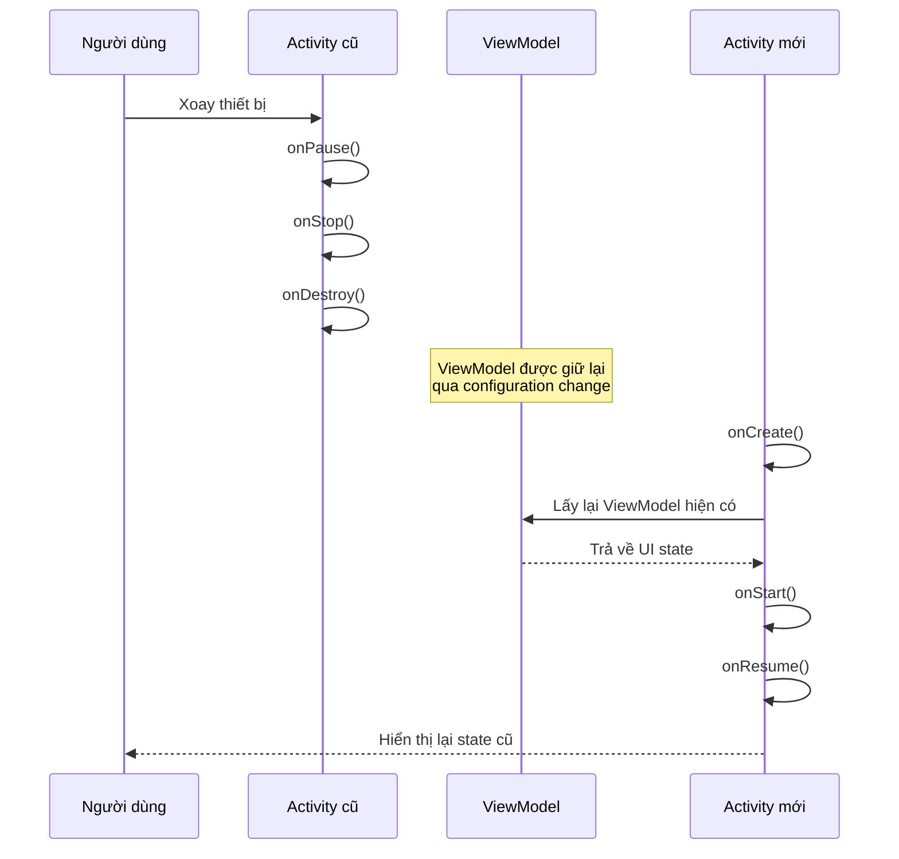
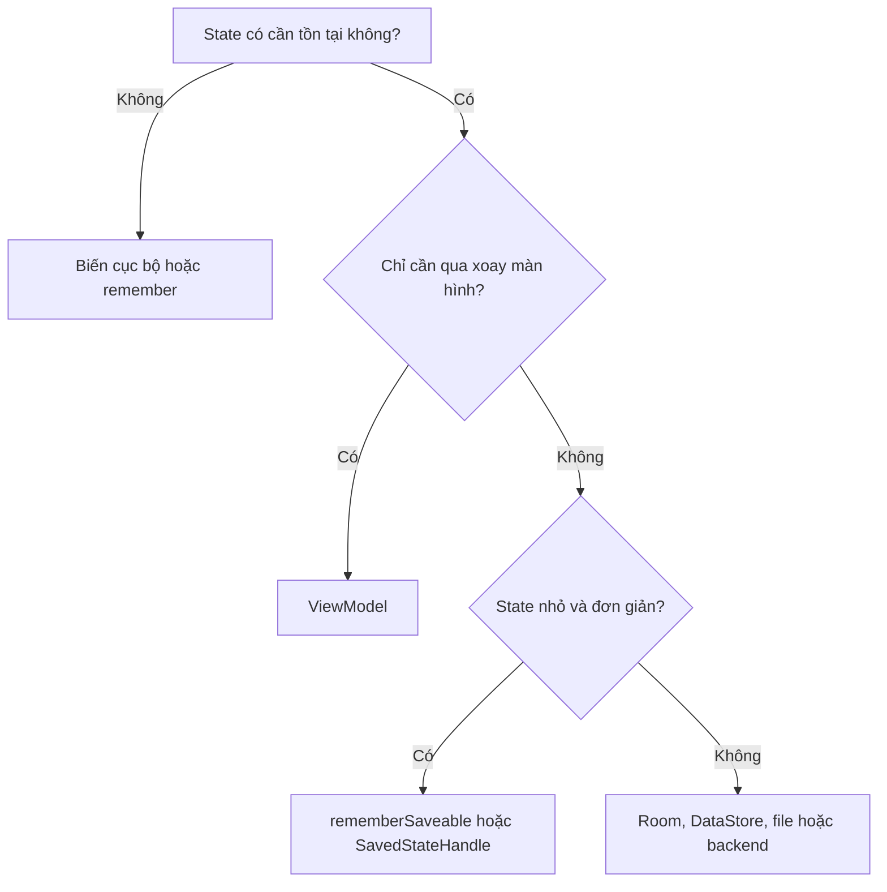
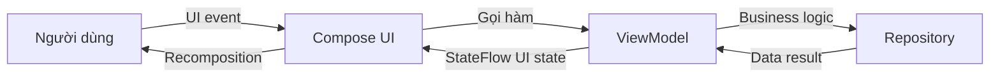

# 009 - State Changes
[](https://developer.android.com/topic/libraries/architecture/viewmodel?utm_source=chatgpt.com)

**Học phần:** 02 - App Components and User Interface
**Module:** Module 03 - App Components
**Nhóm nội dung:** Activity
**Nguồn roadmap:** App Components / Activity
**Loại bài:** Lesson
**Thứ tự trong module:** 009
**Thời lượng gợi ý:** 24 phút

---

## 1. Tóm tắt

**State Changes** trong Android bao gồm hai khái niệm có liên quan:

1. **Thay đổi trạng thái của Activity:** Activity chuyển qua các trạng thái như `Created`, `Started`, `Resumed`, `Paused`, `Stopped` và `Destroyed`.
2. **Thay đổi trạng thái giao diện:** nội dung trên màn hình thay đổi khi người dùng nhập dữ liệu, nhấn nút, xoay thiết bị hoặc khi dữ liệu từ mạng và cơ sở dữ liệu được cập nhật.

Một `Activity` có thể bị Android hủy và tạo lại khi xoay màn hình, đổi ngôn ngữ, thay đổi kích thước cửa sổ hoặc chuyển sang chế độ đa cửa sổ. Vì vậy, không nên xem các biến nằm trực tiếp trong `Activity` là nơi lưu trữ trạng thái đáng tin cậy. Android khuyến nghị sử dụng `ViewModel`, `rememberSaveable`, `SavedStateHandle` hoặc bộ nhớ bền vững tùy theo loại dữ liệu. ([Android Developers][1])

### Ghi chú năm dòng

> 1. Activity luôn chuyển đổi giữa nhiều trạng thái lifecycle.
> 2. Xoay màn hình có thể làm Activity cũ bị hủy và tạo Activity mới.
> 3. Trạng thái màn hình và business logic nên được đặt trong `ViewModel`.
> 4. Trạng thái nhỏ cần phục hồi sau process death có thể dùng `SavedStateHandle` hoặc `rememberSaveable`.
> 5. Cần kiểm thử bằng xoay màn hình, đưa ứng dụng xuống nền và tái tạo Activity.

---

## 2. Mục tiêu học tập

Sau bài học, bạn có thể:

* Giải thích được State Changes trong Android.
* Phân biệt **Activity lifecycle state** với **UI state**.
* Mô tả điều gì xảy ra khi xoay thiết bị.
* Chọn đúng nơi lưu `state`: `remember`, `rememberSaveable`, `ViewModel`, `SavedStateHandle` hoặc local storage.
* Tránh gọi API hoặc tạo lại dữ liệu không cần thiết sau mỗi lần Activity được tái tạo.
* Kiểm thử khả năng giữ và phục hồi trạng thái.
* Xây dựng một project nhỏ để đưa vào portfolio.

---

## 3. Ảnh minh họa

Ảnh chính thức từ Android Developers:

```markdown

```

Kết quả hiển thị:


Activity có sáu callback lifecycle chính: `onCreate()`, `onStart()`, `onResume()`, `onPause()`, `onStop()` và `onDestroy()`. Android gọi các callback này khi Activity chuyển giữa các trạng thái. ([Android Developers][2])

---

## 4. State Changes là gì?

### 4.1. Activity lifecycle state

Activity có thể chuyển qua những trạng thái sau:

| Trạng thái | Callback thường gặp | Ý nghĩa                                 |
| ---------- | ------------------- | --------------------------------------- |
| Created    | `onCreate()`        | Activity được khởi tạo                  |
| Started    | `onStart()`         | Giao diện bắt đầu hiển thị              |
| Resumed    | `onResume()`        | Người dùng có thể tương tác             |
| Paused     | `onPause()`         | Mất focus nhưng có thể vẫn còn hiển thị |
| Stopped    | `onStop()`          | Không còn hiển thị                      |
| Destroyed  | `onDestroy()`       | Instance của Activity bị hủy            |

Ví dụ:

* Một dialog xuất hiện và che một phần Activity: Activity có thể chuyển sang `Paused`.
* Activity khác che hoàn toàn màn hình: Activity hiện tại chuyển sang `Stopped`.
* Người dùng quay lại: Activity có thể đi qua `onRestart()` → `onStart()` → `onResume()`.
* Người dùng xoay màn hình: Activity hiện tại thường bị hủy và một instance mới được tạo. ([Android Developers][1])

### 4.2. UI state

**UI state** là dữ liệu quyết định màn hình đang hiển thị điều gì.

Ví dụ:

```kotlin
data class LoginUiState(
    val email: String = "",
    val password: String = "",
    val isLoading: Boolean = false,
    val errorMessage: String? = null,
    val isLoggedIn: Boolean = false
)
```

Trong ví dụ này:

* Người dùng nhập email → `email` thay đổi.
* Người dùng nhấn đăng nhập → `isLoading` chuyển thành `true`.
* API thất bại → `errorMessage` được cập nhật.
* Đăng nhập thành công → `isLoggedIn` chuyển thành `true`.

Giao diện Compose đọc `LoginUiState` và tự động dựng lại những phần bị ảnh hưởng.

---

## 5. Những sự kiện gây ra State Changes

| Sự kiện                             | Điều có thể xảy ra                               |
| ----------------------------------- | ------------------------------------------------ |
| Người dùng nhấn nút                 | UI state thay đổi                                |
| Dữ liệu API trả về                  | Loading chuyển thành Success hoặc Error          |
| Dữ liệu Room thay đổi               | Flow phát ra state mới                           |
| Mở dialog                           | Activity có thể chuyển sang `Paused`             |
| Nhấn Home                           | Activity thường đi qua `onPause()` và `onStop()` |
| Quay lại ứng dụng                   | Activity trở về `Started` và `Resumed`           |
| Xoay màn hình                       | Activity bị hủy và tạo lại                       |
| Đổi ngôn ngữ hoặc kích thước cửa sổ | Có thể gây configuration change                  |
| Nhấn Back                           | Activity có thể bị hủy và xóa khỏi back stack    |
| Hệ thống thiếu bộ nhớ               | Process của ứng dụng có thể bị hủy               |

Khi xảy ra configuration change, instance Activity cũ thường nhận:

```text
onPause()
onStop()
onDestroy()
```

Sau đó instance mới nhận:

```text
onCreate()
onStart()
onResume()
```

Khi hệ thống hủy toàn bộ process để thu hồi bộ nhớ, `onDestroy()` **không được đảm bảo sẽ được gọi**. Vì vậy, không nên chờ đến `onDestroy()` mới lưu dữ liệu quan trọng. ([Android Developers][1])

---

## 6. Sơ đồ State Changes khi xoay màn hình



`ViewModel` được thiết kế như một screen-level state holder. Nó giữ state và các thao tác liên quan qua configuration change, nhờ đó Activity mới không phải tải lại dữ liệu chỉ vì người dùng xoay màn hình. ([Android Developers][3])

> `ViewModel` tồn tại qua việc xoay màn hình nhưng không phải là cơ sở dữ liệu. Nó không tự động tồn tại sau process death.

---

## 7. Chọn đúng nơi lưu trạng thái

| Công cụ             | Tồn tại qua recomposition | Tồn tại qua xoay màn hình |   Có thể phục hồi sau process death | Phù hợp với                        |
| ------------------- | ------------------------: | ------------------------: | ----------------------------------: | ---------------------------------- |
| Biến cục bộ         |                     Không |                     Không |                               Không | Giá trị tạm trong một lần gọi      |
| `remember`          |                        Có |                     Không |                               Không | State tạm thời của Composable      |
| `rememberSaveable`  |                        Có |                        Có | Có, với state lưu được trong Bundle | Text input, tab, expanded state    |
| `ViewModel`         |                        Có |                        Có |                               Không | Screen state, business logic       |
| `SavedStateHandle`  |                        Có |                        Có |                                  Có | ID, query, bộ lọc, form nhỏ        |
| Room/DataStore/File |                        Có |                        Có |                                  Có | Dữ liệu cần lưu bền vững           |
| Backend             |                        Có |                        Có |                                  Có | Dữ liệu tài khoản, dữ liệu đồng bộ |

Android khuyến nghị kết hợp nhiều cơ chế thay vì cố sử dụng một công cụ cho mọi dữ liệu. `ViewModel` phù hợp với screen state và business logic; `rememberSaveable` hoặc `SavedStateHandle` phù hợp với transient state đơn giản; local storage phù hợp với dữ liệu lớn hoặc cần tồn tại lâu dài. ([Android Developers][4])

### Quy tắc lựa chọn nhanh



---

## 8. `remember` và `rememberSaveable`

### 8.1. `remember`

```kotlin
@Composable
fun CounterExample() {
    var count by remember {
        mutableIntStateOf(0)
    }

    Button(onClick = { count++ }) {
        Text("Count: $count")
    }
}
```

`remember` giữ giá trị qua các lần recomposition nhưng giá trị có thể mất khi Activity bị tái tạo.

### 8.2. `rememberSaveable`

```kotlin
@Composable
fun CounterExample() {
    var count by rememberSaveable {
        mutableIntStateOf(0)
    }

    Button(onClick = { count++ }) {
        Text("Count: $count")
    }
}
```

`rememberSaveable` sử dụng cơ chế saved instance state để phục hồi những giá trị phù hợp với `Bundle`.

Không nên lưu danh sách lớn, bitmap, response API hoặc object phức tạp trong `rememberSaveable`. Android khuyến nghị chỉ lưu dữ liệu tối thiểu, chẳng hạn ID hoặc key, rồi tải lại dữ liệu phức tạp từ repository hoặc persistent storage. ([Android Developers][5])

---

## 9. Luồng thay đổi UI state được khuyến nghị



Nguyên tắc:

* UI gửi **event** lên ViewModel.
* ViewModel xử lý business logic.
* ViewModel tạo ra một UI state mới.
* UI quan sát state và hiển thị.
* Không sửa giao diện thủ công ở nhiều nơi.
* Không đặt network request hoặc business state trực tiếp trong Composable.

---

## 10. Thực hành: ứng dụng Study Session Counter

Ứng dụng có các chức năng:

* Tăng số phiên học.
* Nhập ghi chú.
* Giữ dữ liệu khi xoay màn hình.
* Phục hồi dữ liệu đơn giản sau khi process được tái tạo.
* Sử dụng `ViewModel`, `SavedStateHandle` và `StateFlow`.

### 10.1. ViewModel

```kotlin
package com.example.statechanges

import androidx.lifecycle.SavedStateHandle
import androidx.lifecycle.ViewModel
import kotlinx.coroutines.flow.StateFlow

class StudyViewModel(
    private val savedStateHandle: SavedStateHandle
) : ViewModel() {

    val sessionCount: StateFlow<Int> =
        savedStateHandle.getStateFlow(
            key = KEY_SESSION_COUNT,
            initialValue = 0
        )

    val note: StateFlow<String> =
        savedStateHandle.getStateFlow(
            key = KEY_NOTE,
            initialValue = ""
        )

    fun addSession() {
        savedStateHandle[KEY_SESSION_COUNT] =
            sessionCount.value + 1
    }

    fun updateNote(newNote: String) {
        savedStateHandle[KEY_NOTE] = newNote
    }

    fun reset() {
        savedStateHandle[KEY_SESSION_COUNT] = 0
        savedStateHandle[KEY_NOTE] = ""
    }

    companion object {
        private const val KEY_SESSION_COUNT = "session_count"
        private const val KEY_NOTE = "note"
    }
}
```

`SavedStateHandle` giúp giữ những state đơn giản qua configuration change và có thể phục hồi chúng sau process death. Tuy nhiên, nó cũng dựa trên cơ chế `Bundle`, vì vậy không nên đưa object lớn hoặc dữ liệu nghiệp vụ phức tạp vào đó. ([Android Developers][3])

### 10.2. Compose UI

```kotlin
package com.example.statechanges

import androidx.compose.foundation.layout.Arrangement
import androidx.compose.foundation.layout.Column
import androidx.compose.foundation.layout.Row
import androidx.compose.foundation.layout.fillMaxSize
import androidx.compose.foundation.layout.fillMaxWidth
import androidx.compose.foundation.layout.padding
import androidx.compose.material3.Button
import androidx.compose.material3.OutlinedTextField
import androidx.compose.material3.Text
import androidx.compose.runtime.Composable
import androidx.compose.runtime.getValue
import androidx.compose.ui.Modifier
import androidx.compose.ui.unit.dp
import androidx.lifecycle.compose.collectAsStateWithLifecycle
import androidx.lifecycle.viewmodel.compose.viewModel

@Composable
fun StudyScreen(
    viewModel: StudyViewModel = viewModel()
) {
    val sessionCount by
        viewModel.sessionCount.collectAsStateWithLifecycle()

    val note by
        viewModel.note.collectAsStateWithLifecycle()

    Column(
        modifier = Modifier
            .fillMaxSize()
            .padding(24.dp),
        verticalArrangement = Arrangement.spacedBy(16.dp)
    ) {
        Text(
            text = "Số phiên học: $sessionCount"
        )

        Button(
            onClick = viewModel::addSession
        ) {
            Text("Hoàn thành một phiên")
        }

        OutlinedTextField(
            value = note,
            onValueChange = viewModel::updateNote,
            label = {
                Text("Ghi chú")
            },
            modifier = Modifier.fillMaxWidth()
        )

        Row(
            horizontalArrangement = Arrangement.spacedBy(12.dp)
        ) {
            Button(
                onClick = viewModel::reset
            ) {
                Text("Đặt lại")
            }
        }
    }
}
```

Sử dụng `collectAsStateWithLifecycle()` giúp việc thu thập `Flow` đi theo lifecycle của màn hình, tránh tiếp tục thu thập dữ liệu không cần thiết khi UI không ở trạng thái phù hợp. Android cũng khuyến nghị dùng các API nhận biết lifecycle cho side effect, animation và luồng dữ liệu trong Compose. ([Android Developers][1])

### 10.3. MainActivity

```kotlin
package com.example.statechanges

import android.os.Bundle
import androidx.activity.ComponentActivity
import androidx.activity.compose.setContent

class MainActivity : ComponentActivity() {

    override fun onCreate(
        savedInstanceState: Bundle?
    ) {
        super.onCreate(savedInstanceState)

        setContent {
            StudyScreen()
        }
    }
}
```

---

## 11. Quan sát State Changes bằng Logcat

Thêm log vào Activity:

```kotlin
package com.example.statechanges

import android.os.Bundle
import android.util.Log
import androidx.activity.ComponentActivity
import androidx.activity.compose.setContent

class MainActivity : ComponentActivity() {

    private val tag = "StateChanges"

    override fun onCreate(savedInstanceState: Bundle?) {
        super.onCreate(savedInstanceState)
        Log.d(tag, "onCreate")

        setContent {
            StudyScreen()
        }
    }

    override fun onStart() {
        super.onStart()
        Log.d(tag, "onStart")
    }

    override fun onResume() {
        super.onResume()
        Log.d(tag, "onResume")
    }

    override fun onPause() {
        Log.d(tag, "onPause")
        super.onPause()
    }

    override fun onStop() {
        Log.d(tag, "onStop")
        super.onStop()
    }

    override fun onDestroy() {
        Log.d(
            tag,
            "onDestroy, changingConfigurations=$isChangingConfigurations"
        )
        super.onDestroy()
    }
}
```

### Log dự kiến khi mở ứng dụng

```text
onCreate
onStart
onResume
```

### Log dự kiến khi xoay màn hình

```text
onPause
onStop
onDestroy, changingConfigurations=true
onCreate
onStart
onResume
```

### Log dự kiến khi nhấn Home

```text
onPause
onStop
```

Khi quay lại ứng dụng:

```text
onStart
onResume
```

Hoặc nếu Activity vẫn còn cùng instance:

```text
onRestart
onStart
onResume
```

---

## 12. Ví dụ sai và cách sửa

### 12.1. Sai: giữ state trong Activity

```kotlin
class MainActivity : ComponentActivity() {

    private var sessionCount = 0

    fun addSession() {
        sessionCount++
    }
}
```

Khi Activity bị hủy và tạo lại, `sessionCount` trở về `0`.

### 12.2. Đúng: đưa state vào ViewModel

```kotlin
class StudyViewModel : ViewModel() {

    private val _sessionCount =
        MutableStateFlow(0)

    val sessionCount =
        _sessionCount.asStateFlow()

    fun addSession() {
        _sessionCount.update { it + 1 }
    }
}
```

`ViewModel` giữ state qua configuration change. Tuy nhiên, state này vẫn mất nếu toàn bộ process bị hệ thống hủy. Muốn phục hồi state nhỏ sau process death, có thể kết hợp `SavedStateHandle`. ([Android Developers][3])

---

## 13. Sai lầm thường gặp của lập trình viên mới

### 13.1. Cho rằng `remember` giữ state khi xoay màn hình

```kotlin
var query by remember {
    mutableStateOf("")
}
```

`remember` chỉ giữ state trong Composition hiện tại. Khi Activity bị tạo lại, Composition cũ bị loại bỏ.

Giải pháp:

```kotlin
var query by rememberSaveable {
    mutableStateOf("")
}
```

Hoặc đưa `query` vào `ViewModel` nếu nó tham gia vào business logic.

### 13.2. Cho rằng ViewModel tồn tại sau process death

`ViewModel` tồn tại qua configuration change nhưng không tồn tại sau khi process bị hủy. Khi process mới được tạo, ViewModel cũng là instance mới. ([Android Developers][5])

### 13.3. Lưu object lớn trong `SavedStateHandle`

Không nên làm:

```kotlin
savedStateHandle["products"] = hugeProductList
```

Nên lưu ID hoặc bộ lọc:

```kotlin
savedStateHandle["category_id"] = categoryId
```

Sau đó tải lại danh sách từ repository.

### 13.4. Gọi API mỗi lần `onCreate()` chạy

```kotlin
override fun onCreate(savedInstanceState: Bundle?) {
    super.onCreate(savedInstanceState)
    repository.loadProducts()
}
```

Khi xoay màn hình, API có thể bị gọi lại không cần thiết.

Nên kích hoạt việc tải dữ liệu trong ViewModel và kiểm soát trạng thái:

```kotlin
class ProductViewModel(
    private val repository: ProductRepository
) : ViewModel() {

    private val _uiState =
        MutableStateFlow<ProductUiState>(
            ProductUiState.Loading
        )

    val uiState = _uiState.asStateFlow()

    init {
        loadProducts()
    }

    private fun loadProducts() {
        viewModelScope.launch {
            _uiState.value =
                runCatching {
                    repository.getProducts()
                }.fold(
                    onSuccess = {
                        ProductUiState.Success(it)
                    },
                    onFailure = {
                        ProductUiState.Error(
                            it.message ?: "Unknown error"
                        )
                    }
                )
        }
    }
}
```

ViewModel hiện có được gắn vào Activity mới sau configuration change, vì vậy thao tác tải dữ liệu không bị khởi động lại chỉ vì xoay thiết bị. ([Android Developers][3])

### 13.5. Dùng `android:configChanges` chỉ để tránh mất state

Ví dụ:

```xml
<activity
    android:name=".MainActivity"
    android:configChanges="orientation|screenSize" />
```

Đây không phải giải pháp tổng quát. Activity vẫn có thể bị tái tạo vì nhiều nguyên nhân khác, bao gồm process death. Android khuyến nghị xây dựng khả năng lưu và phục hồi state thay vì tránh recreation như một cách sửa nhanh. ([Android Developers][6])

### 13.6. Lưu dữ liệu quan trọng trong `onDestroy()`

Sai:

```kotlin
override fun onDestroy() {
    saveImportantUserData()
    super.onDestroy()
}
```

`onDestroy()` không được đảm bảo khi hệ thống kết thúc process. Dữ liệu quan trọng nên được lưu ngay khi nó thay đổi, thông qua repository, Room, DataStore hoặc backend. ([Android Developers][1])

### 13.7. Giữ Activity hoặc View trong ViewModel

Không nên:

```kotlin
class BadViewModel(
    private val activity: Activity
) : ViewModel()
```

ViewModel có thể tồn tại lâu hơn instance UI cũ. Việc giữ tham chiếu đến Activity hoặc View có thể gây memory leak. Android khuyến nghị ViewModel không phụ thuộc vào chi tiết triển khai UI hoặc các API gắn trực tiếp với lifecycle. ([Android Developers][3])

---

## 14. Kiểm thử State Changes

### 14.1. Kiểm thử thủ công

Thực hiện lần lượt:

1. Mở ứng dụng.
2. Nhấn **Hoàn thành một phiên** ba lần.
3. Nhập một ghi chú.
4. Xoay thiết bị.
5. Kiểm tra số phiên và ghi chú còn nguyên.
6. Nhấn Home.
7. Mở một số ứng dụng khác.
8. Quay lại ứng dụng.
9. Kiểm tra state.
10. Nhấn Back để đóng màn hình.
11. Mở lại ứng dụng và kiểm tra state có được reset đúng yêu cầu không.

### 14.2. Kiểm thử thay đổi cấu hình

Kiểm tra với:

* Portrait → landscape.
* Landscape → portrait.
* Light mode → dark mode.
* Thay đổi ngôn ngữ.
* Thay đổi font size.
* Thay đổi kích thước cửa sổ.
* Multi-window.
* Thiết bị màn hình gập nếu dự án hỗ trợ.

### 14.3. Dùng Developer Options

Bật:

```text
Settings
→ Developer options
→ Don't keep activities
```

Khi rời khỏi Activity, hệ thống sẽ hủy Activity sớm hơn. Cách này hữu ích để phát hiện state đang được lưu sai chỗ.

> `Don't keep activities` chủ yếu giúp kiểm tra Activity recreation, không thay thế hoàn toàn kiểm thử process death.

### 14.4. Mô phỏng process death bằng ADB

Đưa ứng dụng xuống background, sau đó chạy:

```bash
adb shell am kill com.example.statechanges
```

Quay lại ứng dụng từ màn hình Recent Apps và kiểm tra:

* `ViewModel` đã được tạo lại.
* State nằm trong `SavedStateHandle` được phục hồi.
* Dữ liệu phức tạp được tải lại từ repository.
* Không có màn hình trắng hoặc crash.

### 14.5. Kiểm thử tự động với `ActivityScenario`

```kotlin
@RunWith(AndroidJUnit4::class)
class MainActivityStateTest {

    @Test
    fun state_isPreserved_afterActivityRecreation() {
        ActivityScenario
            .launch(MainActivity::class.java)
            .use { scenario ->

                // Thao tác với UI:
                // 1. Nhấn nút tăng.
                // 2. Nhập ghi chú.

                scenario.recreate()

                // Xác nhận state vẫn hiển thị.
            }
    }
}
```

Đối với state được lưu bằng `rememberSaveable`, Compose cung cấp `StateRestorationTester` để kiểm tra việc lưu và phục hồi state. ([Android Developers][5])

---

## 15. Test matrix

| Kịch bản               | State mong đợi                      | Kết quả |
| ---------------------- | ----------------------------------- | ------- |
| Recomposition          | Giữ nguyên                          | ⬜       |
| Xoay màn hình          | Giữ nguyên                          | ⬜       |
| Đổi dark mode          | Giữ nguyên                          | ⬜       |
| Resize cửa sổ          | Giữ nguyên                          | ⬜       |
| Nhấn Home rồi quay lại | Giữ nguyên                          | ⬜       |
| Activity recreation    | Giữ nguyên                          | ⬜       |
| Process death          | Phục hồi state tối thiểu            | ⬜       |
| Nhấn Back rồi mở lại   | Reset hoặc phục hồi theo yêu cầu UX | ⬜       |
| API thất bại           | Hiển thị Error, không crash         | ⬜       |
| Mạng chậm              | Hiển thị Loading                    | ⬜       |
| Xoay khi đang tải API  | Không gọi API trùng lặp             | ⬜       |

---

## 16. State Changes ảnh hưởng đến sản phẩm như thế nào?

| Khía cạnh       | Ảnh hưởng                                                      |
| --------------- | -------------------------------------------------------------- |
| UX              | Người dùng không mất nội dung vừa nhập khi xoay màn hình       |
| Reliability     | Ứng dụng không crash hoặc hiển thị sai state sau recreation    |
| Performance     | Không gọi lại API hoặc tính toán nặng không cần thiết          |
| Maintainability | State và business logic được tập trung trong ViewModel         |
| Testing         | Có thể kiểm thử state transition độc lập với UI                |
| Release risk    | Giảm lỗi chỉ xuất hiện trên tablet, foldable hoặc multi-window |

Android nhấn mạnh rằng việc phục hồi UI state nhanh chóng sau khi Activity hoặc process bị hủy là cần thiết để tạo trải nghiệm nhất quán. Người dùng thường mong màn hình trở lại đúng trạng thái trước đó sau một configuration change hoặc sau khi tạm thời chuyển sang ứng dụng khác. ([Android Developers][4])

---

## 17. Artifact đưa vào portfolio

### Tên project

```text
Android State Changes Demo
```

### Cấu trúc gợi ý

```text
state-changes-demo/
├── app/
│   └── src/
│       ├── main/
│       │   ├── java/com/example/statechanges/
│       │   │   ├── MainActivity.kt
│       │   │   ├── StudyScreen.kt
│       │   │   └── StudyViewModel.kt
│       │   └── AndroidManifest.xml
│       └── androidTest/
│           └── MainActivityStateTest.kt
├── screenshots/
│   ├── portrait.png
│   ├── landscape.png
│   └── state-restored.png
├── docs/
│   └── state-flow.md
└── README.md
```

### Nội dung README

```markdown
# Android State Changes Demo

Ứng dụng minh họa cách quản lý UI state khi Android Activity
bị tái tạo do configuration change hoặc process recreation.

## Công nghệ

- Kotlin
- Jetpack Compose
- ViewModel
- StateFlow
- SavedStateHandle
- ActivityScenario

## Kịch bản minh họa

1. Tăng số phiên học.
2. Nhập ghi chú.
3. Xoay màn hình.
4. Xác nhận state vẫn còn.
5. Mô phỏng process death.
6. Xác nhận state tối thiểu được phục hồi.

## Kiến trúc

UI Event → ViewModel → UI State → Compose UI

## Kết quả

- Không mất state khi xoay màn hình.
- Không gọi API trùng lặp.
- State đơn giản được phục hồi sau process recreation.
```

### Screenshot nên có

* Màn hình portrait với state ban đầu.
* Màn hình có số phiên và ghi chú.
* Màn hình landscape sau khi xoay.
* Logcat thể hiện Activity cũ bị hủy và Activity mới được tạo.
* Kết quả automated test thành công.

---

## 18. Bài tập

### Bài tập chính

Xây dựng màn hình tạo ghi chú gồm:

* Tiêu đề.
* Nội dung.
* Mức độ ưu tiên.
* Nút lưu.
* Loading state.
* Error state.
* Success state.

Yêu cầu:

1. Tiêu đề và nội dung không mất khi xoay màn hình.
2. Business state được đặt trong ViewModel.
3. Sử dụng `SavedStateHandle` cho bản nháp nhỏ.
4. Dữ liệu đã lưu được ghi vào Room hoặc repository.
5. Không gọi thao tác lưu hai lần khi Activity được tái tạo.
6. Có test cho `scenario.recreate()`.
7. Có ảnh trước và sau khi xoay màn hình.

### Bài tập mở rộng

Phân loại từng state sau:

| State                     | Nên đặt ở đâu?                              |
| ------------------------- | ------------------------------------------- |
| Dialog đang mở            | `rememberSaveable`                          |
| Search query              | `SavedStateHandle` hoặc ViewModel           |
| Danh sách sản phẩm từ API | ViewModel và Repository                     |
| ID sản phẩm đang xem      | `SavedStateHandle` hoặc navigation argument |
| Danh sách yêu thích       | Room hoặc backend                           |
| Animation đang chạy       | UI state cục bộ                             |
| Access token              | Storage bảo mật phù hợp                     |
| Trạng thái loading        | ViewModel UI state                          |

---

## 19. Checklist hoàn thành

### Kiến thức

* [ ] Giải thích được State Changes.
* [ ] Phân biệt Activity state và UI state.
* [ ] Mô tả được điều xảy ra khi xoay màn hình.
* [ ] Biết rằng `onDestroy()` không luôn được gọi.
* [ ] Biết ViewModel không tồn tại sau process death.

### Code

* [ ] UI state được mô hình hóa rõ ràng.
* [ ] Screen state được đặt trong ViewModel.
* [ ] UI thu thập state theo lifecycle.
* [ ] State nhỏ cần phục hồi sử dụng `rememberSaveable` hoặc `SavedStateHandle`.
* [ ] Dữ liệu lớn được tải từ repository hoặc local storage.
* [ ] ViewModel không giữ Activity, Fragment hoặc View.
* [ ] API không bị gọi lại không cần thiết sau rotation.

### Kiểm thử

* [ ] Đã xoay thiết bị.
* [ ] Đã thử dark mode.
* [ ] Đã thử background và foreground.
* [ ] Đã thử Activity recreation.
* [ ] Đã thử process death.
* [ ] Đã kiểm tra loading, success và error.
* [ ] Đã chạy automated test.

### Portfolio

* [ ] Có README.
* [ ] Có sơ đồ state flow.
* [ ] Có screenshot portrait và landscape.
* [ ] Có ảnh Logcat.
* [ ] Có test report.
* [ ] Có mô tả lỗi ban đầu và cách sửa.

---

## 20. Ghi chú production

Trước khi release, hãy trả lời các câu hỏi sau:

1. State nào cần tồn tại khi người dùng xoay màn hình?
2. State nào cần tồn tại sau process death?
3. State nào phải được lưu bền vững?
4. Có object lớn nào đang được đặt trong `Bundle` hoặc `SavedStateHandle` không?
5. API có bị gọi lại khi Activity được tạo lại không?
6. Người dùng có mất nội dung form khi đổi dark mode hoặc ngôn ngữ không?
7. Màn hình có hoạt động trên tablet, foldable và multi-window không?
8. Loading, Empty, Success và Error state đã được xử lý đầy đủ chưa?
9. Có logic quan trọng nào đang phụ thuộc vào `onDestroy()` không?
10. Test suite có bao phủ Activity recreation và state restoration không?

---

## 21. Kết luận

**State Changes** không chỉ là việc ghi log các callback lifecycle. Đây là nền tảng để xây dựng một ứng dụng Android có khả năng:

* Thích nghi với configuration change.
* Không làm mất dữ liệu người dùng.
* Không gọi network request trùng lặp.
* Phục hồi đúng trạng thái sau khi process bị hủy.
* Chạy ổn định trên nhiều kích thước màn hình.
* Dễ kiểm thử và bảo trì.

Công thức ghi nhớ:

```text
UI tạm thời
→ remember

UI tạm thời cần phục hồi
→ rememberSaveable

Screen state và business logic
→ ViewModel

State nhỏ cần phục hồi sau process death
→ SavedStateHandle

Dữ liệu lớn hoặc quan trọng
→ Room, DataStore, file hoặc backend
```

Một Android developer tốt không chỉ biết Activity có thể bị hủy, mà còn thiết kế ứng dụng sao cho việc Activity bị hủy và tạo lại gần như **vô hình đối với người dùng**.

[1]: https://developer.android.com/guide/components/activities/state-changes "Activity state changes  |  App architecture  |  Android Developers"
[2]: https://developer.android.com/guide/components/activities/activity-lifecycle?utm_source=chatgpt.com "The activity lifecycle | App architecture"
[3]: https://developer.android.com/topic/libraries/architecture/viewmodel "ViewModel overview  |  App architecture  |  Android Developers"
[4]: https://developer.android.com/topic/libraries/architecture/saving-states "Save UI states  |  App architecture  |  Android Developers"
[5]: https://developer.android.com/develop/ui/compose/state-saving "Save UI state in Compose  |  Jetpack Compose  |  Android Developers"
[6]: https://developer.android.com/topic/architecture/views/resources/runtime-changes-views?utm_source=chatgpt.com "Handle configuration changes (Views)"
