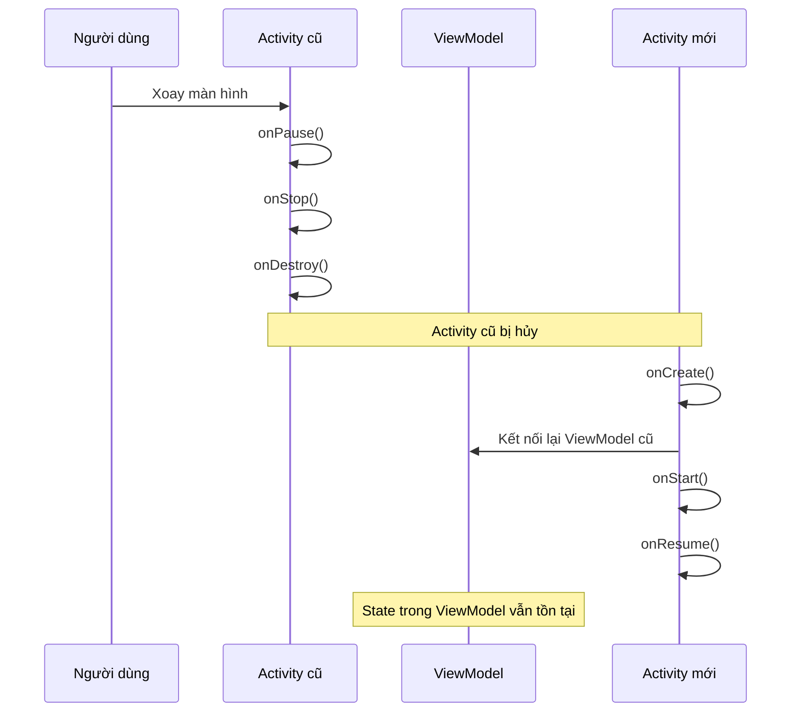
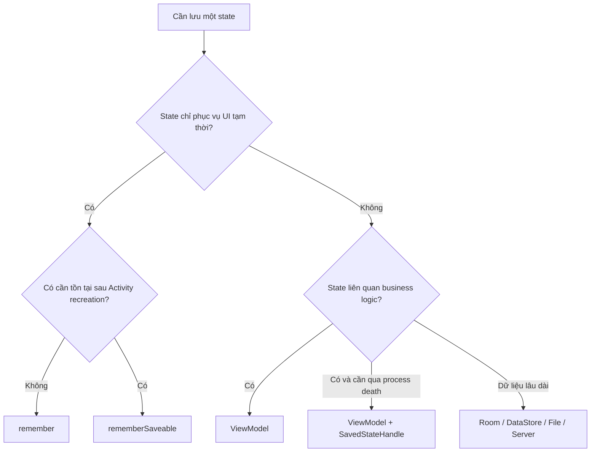

# 010 - Configuration Changes

**Học phần:** 02 - App Components and User Interface
**Module:** Module 03 - App Components
**Nhóm nội dung:** Activity
**Nguồn roadmap:** App Components / Activity
**Loại bài:** Lesson
**Thứ tự trong module:** 010
**Thời lượng gợi ý:** 24 phút

---

## 1. Tóm tắt

**Configuration Changes** là các thay đổi trong cấu hình thiết bị hoặc môi trường hiển thị, chẳng hạn như:

* Xoay màn hình từ dọc sang ngang.
* Thay đổi kích thước cửa sổ.
* Chuyển sang chế độ chia đôi màn hình.
* Gập hoặc mở thiết bị màn hình gập.
* Chuyển giao diện sáng/tối.
* Thay đổi ngôn ngữ.
* Thay đổi cỡ chữ hệ thống.
* Kết nối bàn phím vật lý hoặc dock.

Theo hành vi mặc định, Android thường **hủy Activity hiện tại và tạo một Activity mới** để nạp lại giao diện cùng các tài nguyên phù hợp với cấu hình mới. Vì vậy, trạng thái chỉ được lưu trong thuộc tính của Activity có thể bị mất sau khi xoay màn hình.

Một ứng dụng Android được thiết kế tốt cần:

* Cho phép giao diện thích nghi với cấu hình mới.
* Không làm mất dữ liệu người dùng đang nhập.
* Không gửi lại request mạng không cần thiết.
* Không tạo nhiều coroutine, observer hoặc listener trùng lặp.
* Không giữ tham chiếu đến Activity đã bị hủy.

---

## 2. Mục tiêu học tập

Sau bài học, anh có thể:

* Giải thích được Configuration Changes là gì.
* Mô tả Activity Lifecycle khi xoay thiết bị.
* Phân biệt `remember`, `rememberSaveable`, `ViewModel` và `SavedStateHandle`.
* Lưu trạng thái UI phù hợp khi Activity được tạo lại.
* Tránh việc dùng `android:configChanges` để che giấu lỗi quản lý state.
* Viết kiểm thử xác nhận dữ liệu không bị mất sau khi Activity recreation.
* Tạo một artifact nhỏ để đưa vào portfolio Android.

---

## 3. Configuration Changes là gì?

Configuration Changes xảy ra khi cấu hình mà Android sử dụng để chọn tài nguyên và xây dựng giao diện thay đổi đáng kể.

Ví dụ, khi người dùng đổi ngôn ngữ:

* Android cần nạp lại `strings.xml` tương ứng.
* Kích thước chuỗi có thể thay đổi.
* Hướng chữ có thể chuyển từ trái sang phải sang phải sang trái.
* Layout có thể phải được xây dựng lại.

Khi người dùng xoay màn hình:

* Chiều rộng và chiều cao khả dụng thay đổi.
* Android có thể chuyển từ `layout/` sang `layout-land/`.
* Giao diện cần thích nghi với không gian mới.

Việc tạo lại Activity giúp Android tự động nạp resource phù hợp với cấu hình mới.

### Các Configuration Changes phổ biến

| Thay đổi    | Ví dụ                    | Ảnh hưởng có thể xảy ra                  |
| ----------- | ------------------------ | ---------------------------------------- |
| Orientation | Dọc → ngang              | Activity được tạo lại, layout thay đổi   |
| Window size | Chia đôi màn hình        | Không gian UI bị thu nhỏ                 |
| Dark mode   | Light → dark             | Màu sắc và resource được nạp lại         |
| Locale      | Tiếng Việt → tiếng Anh   | Chuỗi, định dạng ngày và layout thay đổi |
| Font scale  | Cỡ chữ thường → lớn      | Text có thể tràn hoặc che nội dung       |
| Fold state  | Mở → gập thiết bị        | Kích thước và vùng hiển thị thay đổi     |
| Keyboard    | Gắn bàn phím vật lý      | Cấu hình nhập liệu thay đổi              |
| Density     | Thay đổi mật độ màn hình | Hình ảnh và kích thước resource thay đổi |

Danh sách configuration change không chỉ giới hạn ở việc xoay màn hình; Android còn xem thay đổi chế độ cửa sổ, theme, font size, locale và thiết bị nhập là những trường hợp cần được ứng dụng xử lý đúng.

---

## 4. Điều gì xảy ra khi xoay màn hình?

Trong trường hợp thông thường, Android sẽ hủy Activity cũ và tạo Activity mới.



Chuỗi callback thường quan sát được khi xoay thiết bị:

```text
Activity cũ:
onPause()
onStop()
onDestroy()

Activity mới:
onCreate()
onStart()
onResume()
```

Android codelab minh họa rằng khi xảy ra Configuration Change, các callback đóng Activity được gọi, sau đó Activity mới được khởi tạo lại từ `onCreate()`.

### Ảnh minh họa Activity Lifecycle


*Nguồn: Android Developers.*

---

## 5. Activity mới nhưng ViewModel có thể được giữ lại

Khi Activity bị tạo lại do Configuration Change:

* Đối tượng Activity cũ bị hủy.
* Một đối tượng Activity mới được tạo.
* ViewModel thuộc scope của Activity có thể được gắn lại vào Activity mới.
* Dữ liệu và tác vụ bất đồng bộ trong ViewModel tiếp tục tồn tại.
* `onCleared()` chưa được gọi chỉ vì xoay màn hình.

ViewModel thường chỉ được giải phóng khi scope tương ứng kết thúc vĩnh viễn, ví dụ Activity thực sự `finish()` hoặc navigation destination bị loại khỏi back stack.

### Ảnh minh họa Activity và ViewModel khi xoay màn hình


*Nguồn: Android Developers.*

---

## 6. Phân biệt các loại state

Không phải trạng thái nào cũng nên lưu bằng cùng một cơ chế.



### Bảng so sánh

| Cơ chế             | Qua recomposition | Qua xoay màn hình | Qua process recreation | Qua lần mở app mới | Phù hợp với                    |
| ------------------ | ----------------: | ----------------: | ---------------------: | -----------------: | ------------------------------ |
| `remember`         |                Có |             Không |                  Không |              Không | State tạm thời của Composable  |
| `rememberSaveable` |                Có |                Có |           Có điều kiện |              Không | Text, tab, trạng thái mở/đóng  |
| `ViewModel`        |                Có |                Có |                  Không |              Không | Screen state và business logic |
| `SavedStateHandle` |                Có |                Có |           Có điều kiện |              Không | ID, query, filter, key nhỏ     |
| Room/DataStore     |                Có |                Có |                     Có |                 Có | Dữ liệu cần lưu lâu dài        |

> “Qua process recreation có điều kiện” nghĩa là Android còn khả năng phục hồi saved instance state. Đây không phải cơ chế lưu trữ vĩnh viễn và không thay thế Room hoặc DataStore.

Android khuyến nghị sử dụng `ViewModel` cho dữ liệu và business logic, còn `rememberSaveable` cho state ở mức phần tử UI.

---

## 7. `remember` và `rememberSaveable`

### 7.1. Sử dụng `remember`

```kotlin
@Composable
fun CounterScreen() {
    var count by remember {
        mutableIntStateOf(0)
    }

    Button(onClick = { count++ }) {
        Text(text = "Count: $count")
    }
}
```

`remember` giữ giá trị qua các lần recomposition, nhưng giá trị có thể bị mất khi Activity bị hủy và tạo lại.

Quy trình:

```text
Nhấn nút → count = 5
Xoay màn hình
Activity bị tạo lại
count trở về 0
```

### 7.2. Sử dụng `rememberSaveable`

```kotlin
@Composable
fun CounterScreen() {
    var count by rememberSaveable {
        mutableIntStateOf(0)
    }

    Button(onClick = { count++ }) {
        Text(text = "Count: $count")
    }
}
```

Kết quả:

```text
Nhấn nút → count = 5
Xoay màn hình
Activity bị tạo lại
count vẫn bằng 5
```

`rememberSaveable` phù hợp với state UI nhỏ như:

* Nội dung người dùng đang nhập.
* Tab đang được chọn.
* Dialog đang mở hay đóng.
* Bộ lọc đơn giản.
* ID của phần tử đang được chọn.
* Vị trí hoặc key cần để phục hồi UI.

Không nên lưu danh sách lớn, bitmap hoặc object phức tạp vào `rememberSaveable`, vì cơ chế này sử dụng saved state dựa trên `Bundle`. Android khuyến nghị chỉ lưu dữ liệu tối thiểu như ID hoặc key, sau đó tải lại dữ liệu phức tạp từ repository hoặc persistent storage.

---

## 8. Ví dụ hoàn chỉnh với ViewModel và SavedStateHandle

Ví dụ xây dựng màn hình tìm kiếm sản phẩm:

* Nội dung ô tìm kiếm phải tồn tại sau khi xoay màn hình.
* Logic lọc danh sách đặt trong ViewModel.
* Trạng thái mở bộ lọc đặt trong `rememberSaveable`.
* Composable chỉ render state và gửi event.

### 8.1. Model

```kotlin
data class Product(
    val id: Int,
    val name: String
)
```

### 8.2. ViewModel

```kotlin
import androidx.lifecycle.SavedStateHandle
import androidx.lifecycle.ViewModel
import kotlinx.coroutines.flow.MutableStateFlow
import kotlinx.coroutines.flow.StateFlow
import kotlinx.coroutines.flow.asStateFlow
import kotlinx.coroutines.flow.combine

class ProductViewModel(
    private val savedStateHandle: SavedStateHandle
) : ViewModel() {

    private companion object {
        const val QUERY_KEY = "search_query"
    }

    private val allProducts = MutableStateFlow(
        listOf(
            Product(1, "Android Phone"),
            Product(2, "Android Tablet"),
            Product(3, "Mechanical Keyboard"),
            Product(4, "Wireless Mouse")
        )
    )

    val query: StateFlow<String> =
        savedStateHandle.getStateFlow(
            key = QUERY_KEY,
            initialValue = ""
        )

    private val _loading = MutableStateFlow(false)
    val loading: StateFlow<Boolean> = _loading.asStateFlow()

    val filteredProducts = combine(
        allProducts,
        query
    ) { products, currentQuery ->
        if (currentQuery.isBlank()) {
            products
        } else {
            products.filter { product ->
                product.name.contains(
                    other = currentQuery,
                    ignoreCase = true
                )
            }
        }
    }

    fun onQueryChange(newQuery: String) {
        savedStateHandle[QUERY_KEY] = newQuery
    }
}
```

`SavedStateHandle` cho phép lưu một lượng nhỏ UI state qua Configuration Change và system-initiated process recreation. Tuy nhiên, dữ liệu lớn hoặc screen state được tạo từ business logic vẫn nên được tái tạo từ data layer.

### 8.3. Composable

```kotlin
import androidx.compose.foundation.layout.Arrangement
import androidx.compose.foundation.layout.Column
import androidx.compose.foundation.layout.Row
import androidx.compose.foundation.layout.fillMaxSize
import androidx.compose.foundation.layout.fillMaxWidth
import androidx.compose.foundation.layout.padding
import androidx.compose.foundation.lazy.LazyColumn
import androidx.compose.foundation.lazy.items
import androidx.compose.material3.Button
import androidx.compose.material3.CircularProgressIndicator
import androidx.compose.material3.OutlinedTextField
import androidx.compose.material3.Text
import androidx.compose.runtime.Composable
import androidx.compose.runtime.getValue
import androidx.compose.runtime.saveable.rememberSaveable
import androidx.compose.runtime.setValue
import androidx.compose.runtime.mutableStateOf
import androidx.compose.ui.Modifier
import androidx.compose.ui.platform.testTag
import androidx.compose.ui.unit.dp
import androidx.lifecycle.compose.collectAsStateWithLifecycle
import androidx.lifecycle.viewmodel.compose.viewModel

@Composable
fun ProductScreen(
    productViewModel: ProductViewModel = viewModel()
) {
    val query by productViewModel.query.collectAsStateWithLifecycle()
    val products by productViewModel.filteredProducts
        .collectAsStateWithLifecycle(initialValue = emptyList())
    val loading by productViewModel.loading.collectAsStateWithLifecycle()

    var showFilterOptions by rememberSaveable {
        mutableStateOf(false)
    }

    Column(
        modifier = Modifier
            .fillMaxSize()
            .padding(16.dp),
        verticalArrangement = Arrangement.spacedBy(12.dp)
    ) {
        OutlinedTextField(
            value = query,
            onValueChange = productViewModel::onQueryChange,
            modifier = Modifier
                .fillMaxWidth()
                .testTag("search_input"),
            label = {
                Text("Tìm sản phẩm")
            },
            singleLine = true
        )

        Button(
            onClick = {
                showFilterOptions = !showFilterOptions
            }
        ) {
            Text(
                text = if (showFilterOptions) {
                    "Ẩn bộ lọc"
                } else {
                    "Hiện bộ lọc"
                }
            )
        }

        if (showFilterOptions) {
            Text("Bộ lọc nâng cao")
        }

        if (loading) {
            CircularProgressIndicator()
        } else {
            LazyColumn {
                items(
                    items = products,
                    key = Product::id
                ) { product ->
                    Row(
                        modifier = Modifier
                            .fillMaxWidth()
                            .padding(vertical = 8.dp)
                    ) {
                        Text(product.name)
                    }
                }
            }
        }
    }
}
```

### Phân công trách nhiệm

| Thành phần          | Trách nhiệm                             |
| ------------------- | --------------------------------------- |
| Composable          | Hiển thị UI và nhận thao tác            |
| `rememberSaveable`  | Lưu trạng thái mở/đóng bộ lọc           |
| ViewModel           | Lọc danh sách và điều phối screen state |
| `SavedStateHandle`  | Lưu từ khóa tìm kiếm nhỏ                |
| Repository/Room/API | Cung cấp dữ liệu sản phẩm thực tế       |

---

## 9. Không gửi lại request mạng khi xoay màn hình

### Cách làm dễ gây lỗi

```kotlin
class MainActivity : ComponentActivity() {

    override fun onCreate(savedInstanceState: Bundle?) {
        super.onCreate(savedInstanceState)

        api.loadProducts()
    }
}
```

Mỗi lần xoay màn hình, `onCreate()` được gọi lại và request có thể được gửi thêm lần nữa.

Hậu quả:

* Tốn băng thông.
* UI nhấp nháy loading.
* Dữ liệu bị ghi đè.
* Có nhiều request chạy song song.
* Có thể tạo duplicate event hoặc duplicate order.

### Cách tổ chức tốt hơn

```kotlin
class ProductViewModel(
    private val repository: ProductRepository
) : ViewModel() {

    private val _uiState = MutableStateFlow<ProductUiState>(
        ProductUiState.Loading
    )

    val uiState: StateFlow<ProductUiState> =
        _uiState.asStateFlow()

    init {
        loadProducts()
    }

    private fun loadProducts() {
        viewModelScope.launch {
            _uiState.value = try {
                val products = repository.getProducts()
                ProductUiState.Success(products)
            } catch (exception: Exception) {
                ProductUiState.Error(
                    message = exception.message
                        ?: "Không thể tải sản phẩm"
                )
            }
        }
    }
}
```

Khi Activity bị tạo lại do xoay màn hình, ViewModel cũ được kết nối với UI mới nên không nhất thiết phải tải lại dữ liệu từ đầu. ViewModel được thiết kế để lưu screen state và tiếp tục các tác vụ bất đồng bộ qua những Configuration Changes thông thường.

---

## 10. Resource qualifiers và giao diện thích nghi

Configuration Changes không chỉ là bài toán lưu state. Chúng còn liên quan đến việc cung cấp resource phù hợp.

### Cấu trúc resource ví dụ

```text
app/src/main/res/
├── layout/
│   └── activity_main.xml
├── layout-land/
│   └── activity_main.xml
├── values/
│   ├── strings.xml
│   └── dimens.xml
├── values-vi/
│   └── strings.xml
├── values-night/
│   └── colors.xml
└── values-sw600dp/
    └── dimens.xml
```

### Ý nghĩa

| Thư mục           | Trường hợp sử dụng                       |
| ----------------- | ---------------------------------------- |
| `layout/`         | Layout mặc định                          |
| `layout-land/`    | Màn hình ngang                           |
| `values-vi/`      | Ngôn ngữ tiếng Việt                      |
| `values-night/`   | Dark mode                                |
| `values-sw600dp/` | Thiết bị có chiều rộng nhỏ nhất từ 600dp |

Khi Activity được tạo lại, Android có thể chọn lại resource theo cấu hình mới. Đây là lý do không nên cố ngăn Activity recreation trong phần lớn ứng dụng.

---

## 11. Có nên dùng `android:configChanges` không?

Có thể khai báo trong `AndroidManifest.xml`:

```xml
<activity
    android:name=".MainActivity"
    android:configChanges="orientation|screenSize" />
```

Khi đó, Activity có thể không bị tạo lại đối với các loại configuration đã khai báo. Thay vào đó, Activity nhận callback:

```kotlin
override fun onConfigurationChanged(
    newConfig: Configuration
) {
    super.onConfigurationChanged(newConfig)

    when (newConfig.orientation) {
        Configuration.ORIENTATION_LANDSCAPE -> {
            Log.d("ConfigDemo", "Landscape")
        }

        Configuration.ORIENTATION_PORTRAIT -> {
            Log.d("ConfigDemo", "Portrait")
        }
    }
}
```

Tuy nhiên, đây **không phải giải pháp mặc định**.

Khi tắt Activity recreation:

* Android không còn tự xây dựng lại toàn bộ UI.
* Developer phải tự cập nhật resource.
* Có thể bỏ sót dark mode, locale hoặc window size.
* Code dễ phụ thuộc vào loại thiết bị.
* Lỗi có thể xuất hiện trên tablet, foldable và multi-window.

Tài liệu Android cảnh báo rằng vô hiệu hóa Activity recreation khiến việc dùng alternative resources khó hơn và chỉ nên áp dụng như lựa chọn cuối cùng trong các trường hợp thực sự cần thiết.

---

## 12. Configuration Change khác Process Death như thế nào?

Hai trường hợp này không giống nhau.

### Configuration Change

```text
Activity cũ bị hủy
        ↓
Process vẫn còn
        ↓
ViewModel có thể còn
        ↓
Activity mới được tạo
```

### Process Death

```text
Ứng dụng chuyển background
        ↓
Hệ thống cần bộ nhớ
        ↓
Toàn bộ process bị hủy
        ↓
Activity và ViewModel đều mất
        ↓
Android có thể phục hồi saved state
```

| Đặc điểm                    | Configuration Change | Process Death |
| --------------------------- | -------------------- | ------------- |
| Activity bị hủy             | Có thể có            | Có            |
| Process bị hủy              | Không                | Có            |
| ViewModel tồn tại           | Thường có            | Không         |
| `rememberSaveable` phục hồi | Có                   | Có điều kiện  |
| `SavedStateHandle` phục hồi | Có                   | Có điều kiện  |
| Room/DataStore tồn tại      | Có                   | Có            |

`ViewModel` tự nó không sống qua system-initiated process death. Với state nhỏ cần phục hồi, có thể sử dụng `SavedStateHandle`; với dữ liệu lâu dài hoặc phức tạp, sử dụng persistent storage.

---

## 13. Ghi log để quan sát vòng đời

```kotlin
import android.os.Bundle
import android.util.Log
import androidx.activity.ComponentActivity
import androidx.activity.viewModels

class MainActivity : ComponentActivity() {

    private val productViewModel: ProductViewModel by viewModels()

    override fun onCreate(savedInstanceState: Bundle?) {
        super.onCreate(savedInstanceState)

        Log.d(
            "ConfigDemo",
            """
            onCreate
            Activity=${System.identityHashCode(this)}
            ViewModel=${System.identityHashCode(productViewModel)}
            """.trimIndent()
        )
    }

    override fun onStart() {
        super.onStart()
        Log.d("ConfigDemo", "onStart")
    }

    override fun onResume() {
        super.onResume()
        Log.d("ConfigDemo", "onResume")
    }

    override fun onPause() {
        Log.d("ConfigDemo", "onPause")
        super.onPause()
    }

    override fun onStop() {
        Log.d("ConfigDemo", "onStop")
        super.onStop()
    }

    override fun onDestroy() {
        Log.d(
            "ConfigDemo",
            "onDestroy changingConfigurations=$isChangingConfigurations"
        )
        super.onDestroy()
    }
}
```

Sau khi xoay màn hình, có thể quan sát:

```text
onPause
onStop
onDestroy changingConfigurations=true

onCreate
onStart
onResume
```

`Activity` hash có thể thay đổi vì đây là đối tượng mới, trong khi ViewModel hash thường vẫn giữ nguyên khi chỉ xảy ra Configuration Change.

---

## 14. Kiểm thử Configuration Changes

### 14.1. Kiểm thử thủ công

1. Mở màn hình tìm kiếm.
2. Nhập từ khóa `Android`.
3. Mở phần bộ lọc.
4. Cuộn danh sách xuống.
5. Xoay màn hình sang ngang.
6. Kiểm tra từ khóa có còn không.
7. Kiểm tra bộ lọc có còn mở không.
8. Kiểm tra danh sách có bị tải lại không.
9. Chuyển dark mode.
10. Tăng font size hệ thống.
11. Thử split-screen.
12. Thử đổi ngôn ngữ ứng dụng.

### 14.2. Compose UI test với Activity recreation

```kotlin
import androidx.compose.ui.test.assertTextContains
import androidx.compose.ui.test.junit4.createAndroidComposeRule
import androidx.compose.ui.test.onNodeWithTag
import androidx.compose.ui.test.performTextInput
import org.junit.Rule
import org.junit.Test

class ProductScreenRecreationTest {

    @get:Rule
    val composeRule =
        createAndroidComposeRule<MainActivity>()

    @Test
    fun searchQuery_survivesActivityRecreation() {
        composeRule
            .onNodeWithTag("search_input")
            .performTextInput("Android")

        composeRule.activityRule.scenario.recreate()

        composeRule
            .onNodeWithTag("search_input")
            .assertTextContains("Android")
    }
}
```

### 14.3. Kiểm thử `rememberSaveable`

Android cung cấp `StateRestorationTester` để xác nhận state của Composable được lưu và phục hồi đúng.

```kotlin
import androidx.compose.runtime.getValue
import androidx.compose.runtime.saveable.rememberSaveable
import androidx.compose.runtime.setValue
import androidx.compose.runtime.mutableStateOf
import androidx.compose.ui.test.junit4.StateRestorationTester
import androidx.compose.ui.test.junit4.createComposeRule
import org.junit.Assert.assertTrue
import org.junit.Rule
import org.junit.Test

class FilterStateTest {

    @get:Rule
    val composeRule = createComposeRule()

    @Test
    fun filterVisibility_isRestored() {
        val restorationTester =
            StateRestorationTester(composeRule)

        var showFilters = false

        restorationTester.setContent {
            var savedValue by rememberSaveable {
                mutableStateOf(false)
            }

            showFilters = savedValue
            savedValue = true
        }

        restorationTester.emulateSavedInstanceStateRestore()

        assertTrue(showFilters)
    }
}
```

---

## 15. Những lỗi junior developer thường mắc

### Lỗi 1: Lưu state trong Activity

```kotlin
class MainActivity : ComponentActivity() {

    private var searchQuery: String = ""
}
```

Khi Activity bị tạo lại, `searchQuery` trở về giá trị mặc định.

**Khắc phục:** dùng `rememberSaveable`, ViewModel hoặc `SavedStateHandle` tùy loại state.

---

### Lỗi 2: Dùng `remember` cho dữ liệu cần tồn tại sau rotation

```kotlin
var text by remember {
    mutableStateOf("")
}
```

**Khắc phục:**

```kotlin
var text by rememberSaveable {
    mutableStateOf("")
}
```

---

### Lỗi 3: Gọi API trực tiếp trong `onCreate()`

Mỗi lần Activity recreation có thể tạo request mới.

**Khắc phục:** đặt việc tải dữ liệu trong ViewModel hoặc repository và expose state cho UI.

---

### Lỗi 4: Lưu object lớn trong saved state

```kotlin
var products by rememberSaveable {
    mutableStateOf(largeProductList)
}
```

Điều này có thể làm `Bundle` quá lớn.

**Khắc phục:** chỉ lưu ID, query hoặc filter; dữ liệu thật được tải lại từ Room, repository hoặc API.

---

### Lỗi 5: Dùng `android:configChanges` để tránh sửa state

Cách này chỉ che giấu vấn đề và buộc Activity tự xử lý nhiều thay đổi giao diện.

**Khắc phục:** cho phép Activity recreation và xây dựng state management đúng.

---

### Lỗi 6: ViewModel giữ Activity hoặc View

```kotlin
class ProductViewModel(
    val activity: Activity
) : ViewModel()
```

Activity cũ có thể đã bị hủy trong khi ViewModel còn tồn tại, dẫn đến memory leak.

**Khắc phục:** ViewModel không nên giữ tham chiếu tới Activity, Fragment, View hoặc UI Context. Android cũng khuyến nghị tránh lưu lifecycle-related API trong ViewModel.

---

## 16. Ảnh hưởng đến UX và chất lượng ứng dụng

### UX

Quản lý Configuration Changes không đúng có thể khiến:

* Nội dung biểu mẫu bị mất.
* Người dùng phải nhập lại dữ liệu.
* Danh sách quay về đầu.
* Tab đang chọn bị reset.
* Video hoặc âm thanh bắt đầu lại.
* Màn hình loading xuất hiện nhiều lần.
* Người dùng bị gửi lại trang trước.

### Reliability

Ứng dụng có thể:

* Gửi request trùng lặp.
* Đăng ký nhiều observer.
* Tạo nhiều coroutine.
* Gọi API thanh toán nhiều lần.
* Giữ reference tới Activity cũ.
* Crash khi callback cập nhật View đã bị hủy.

### Maintainability

Kiến trúc rõ ràng giúp:

* UI chỉ render state.
* ViewModel quản lý screen state.
* Repository quản lý dữ liệu.
* Saved state chỉ lưu giá trị tối thiểu.
* Configuration Change trở thành tình huống bình thường, không phải trường hợp đặc biệt.

---

## 17. Thực hành 24 phút

### Phần 1 — Quan sát lifecycle: 5 phút

Thêm log vào:

```text
onCreate
onStart
onResume
onPause
onStop
onDestroy
```

Chạy app và xoay màn hình.

### Phần 2 — Tạo lỗi mất state: 4 phút

```kotlin
var count by remember {
    mutableIntStateOf(0)
}
```

Tăng counter và xoay màn hình.

### Phần 3 — Sửa bằng `rememberSaveable`: 4 phút

```kotlin
var count by rememberSaveable {
    mutableIntStateOf(0)
}
```

Xác nhận counter không bị reset.

### Phần 4 — Chuyển business state vào ViewModel: 7 phút

* Tạo `CounterViewModel`.
* Chuyển `count` vào `StateFlow`.
* Composable thu thập state bằng `collectAsStateWithLifecycle()`.

### Phần 5 — Viết test và README: 4 phút

* Viết test dùng `scenario.recreate()`.
* Chụp ảnh portrait và landscape.
* Ghi lại expected behavior.

---

## 18. Bài tập

Xây dựng màn hình **Đăng ký tài khoản** gồm:

* Họ tên.
* Email.
* Mật khẩu.
* Vai trò đang chọn.
* Checkbox đồng ý điều khoản.
* Nút gửi đăng ký.
* Loading state.
* Error message.

### Yêu cầu

1. Xoay màn hình không làm mất họ tên và email.
2. Loading state thuộc ViewModel.
3. Không gửi request đăng ký lần thứ hai khi Activity recreation.
4. Mật khẩu không được lưu lâu dài trong Room hoặc DataStore.
5. Error message có thể được hiển thị lại nếu phù hợp với UX.
6. Giao diện hoạt động ở portrait và landscape.
7. Có ít nhất một test sử dụng `ActivityScenario.recreate()`.

### Câu hỏi phân tích

* State nào dùng `rememberSaveable`?
* State nào đặt trong ViewModel?
* State nào cần `SavedStateHandle`?
* State nào không nên được phục hồi?
* Điều gì xảy ra khi process bị hệ thống hủy?
* Điều gì xảy ra khi người dùng force stop ứng dụng?

---

## 19. Artifact đưa vào portfolio

Tạo project:

```text
configuration-change-demo/
├── app/
├── screenshots/
│   ├── portrait.png
│   ├── landscape.png
│   ├── dark-mode.png
│   └── large-font.png
├── docs/
│   └── state-strategy.md
├── README.md
└── TESTING.md
```

### README nên có

```markdown
# Configuration Change Demo

## Mục tiêu

Minh họa cách giữ UI state qua Activity recreation bằng:

- rememberSaveable
- ViewModel
- SavedStateHandle
- Room hoặc DataStore

## Tình huống đã kiểm thử

- Screen rotation
- Dark mode
- Font scale
- Locale change
- Multi-window
- ActivityScenario.recreate()

## State strategy

| State | Cơ chế |
|---|---|
| Search query | SavedStateHandle |
| Filter panel | rememberSaveable |
| Product list | ViewModel + Repository |
| Favorite products | Room |
```

---

## 20. Checklist hoàn thành

### Kiến thức

* [ ] Giải thích được Configuration Changes.
* [ ] Biết Activity có thể bị hủy và tạo lại.
* [ ] Biết sequence lifecycle khi xoay màn hình.
* [ ] Phân biệt Configuration Change và Process Death.
* [ ] Phân biệt `remember` và `rememberSaveable`.
* [ ] Biết vai trò của ViewModel.
* [ ] Biết khi nào dùng `SavedStateHandle`.

### Code

* [ ] Không giữ screen state quan trọng trong Activity field.
* [ ] Không giữ Activity hoặc View trong ViewModel.
* [ ] Không lưu object lớn vào saved state.
* [ ] Không gửi lại API request không cần thiết.
* [ ] UI thu thập state theo lifecycle.
* [ ] Resource phù hợp với dark mode và window size.

### Testing

* [ ] Đã xoay màn hình nhiều lần.
* [ ] Đã dùng `ActivityScenario.recreate()`.
* [ ] Đã kiểm tra dark mode.
* [ ] Đã kiểm tra font size lớn.
* [ ] Đã kiểm tra multi-window.
* [ ] Đã kiểm tra locale.
* [ ] Đã kiểm tra lỗi mạng khi Activity recreation.

### Portfolio

* [ ] Có ảnh portrait và landscape.
* [ ] Có README giải thích state strategy.
* [ ] Có test tự động.
* [ ] Có sơ đồ lifecycle.
* [ ] Có ghi chú về Configuration Change và Process Death.

---

## 21. Ghi chú production

Trước khi release, cần trả lời được các câu hỏi sau:

1. Người dùng có mất nội dung đang nhập khi xoay màn hình không?
2. Request mạng có bị gửi lại không?
3. App có tạo nhiều observer hoặc coroutine không?
4. Scroll position có được giữ đúng không?
5. UI có hoạt động trong split-screen không?
6. Font size lớn có làm vỡ layout không?
7. Dark mode có màu chữ khó đọc không?
8. Locale khác có làm text tràn không?
9. ViewModel có giữ Activity hoặc View không?
10. State nào cần sống qua process death?
11. State nào phải lưu vào Room hoặc DataStore?
12. Test nào bảo vệ hành vi Activity recreation?

---

## 22. Ghi nhớ nhanh

> **Configuration Change thường tạo Activity mới, nhưng không nhất thiết tạo ViewModel mới.**

```text
UI state nhỏ
→ rememberSaveable

Screen state và business logic
→ ViewModel

State nhỏ cần phục hồi sau process recreation
→ SavedStateHandle

Dữ liệu lâu dài
→ Room / DataStore / Server
```

Không nên chống lại Activity recreation. Hãy thiết kế ứng dụng để việc Activity bị tạo lại trở thành một phần bình thường của kiến trúc Android.

---

## 23. Tài liệu tham khảo

* [Handle configuration changes – Android Developers](https://developer.android.com/guide/topics/resources/runtime-changes)
* [Activity state changes – Android Developers](https://developer.android.com/guide/components/activities/state-changes)
* [ViewModel overview – Android Developers](https://developer.android.com/topic/libraries/architecture/viewmodel)
* [Save UI state in Compose – Android Developers](https://developer.android.com/develop/ui/compose/state-saving)
* [Activity Lifecycle Codelab – Android Developers](https://developer.android.com/codelabs/basic-android-kotlin-compose-activity-lifecycle)
