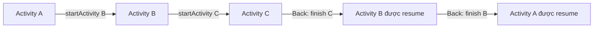
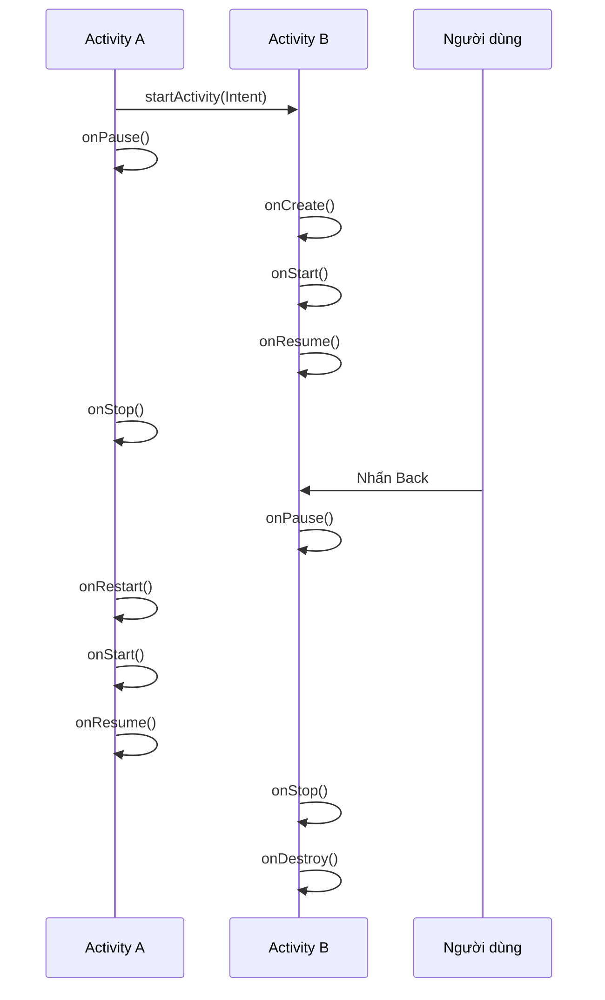
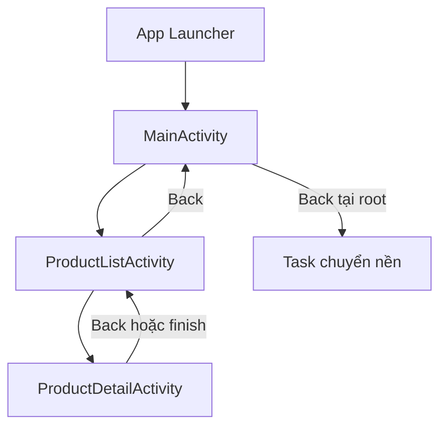

# 011 - Tasks and Backstack

**Học phần:** 02 - App Components and User Interface
**Module:** Module 03 - App Components
**Nhóm nội dung:** Activity
**Nguồn roadmap:** App Components / Activity
**Loại bài:** Lesson
**Thứ tự trong module:** 011
**Thời lượng gợi ý:** 24 phút

---

## 1. Tóm tắt

**Task** là một tập hợp các `Activity` mà người dùng tương tác để hoàn thành một công việc trong ứng dụng. Các `Activity` bên trong task được sắp xếp theo thứ tự mở trong một cấu trúc gọi là **back stack**.

Back stack hoạt động theo nguyên tắc **LIFO — Last In, First Out**:

* `Activity` được mở sau cùng nằm trên cùng.
* Khi người dùng nhấn hoặc vuốt **Back**, `Activity` trên cùng được loại khỏi stack.
* `Activity` ngay bên dưới được hiển thị trở lại.
* Khi task chuyển sang nền, back stack thường vẫn được giữ để người dùng có thể tiếp tục công việc đang làm.

Ví dụ, trong ứng dụng mua sắm:

```text
HomeActivity
    ↓
ProductListActivity
    ↓
ProductDetailActivity
    ↓
CheckoutActivity
```

Back stack lúc này là:

```text
Đỉnh stack
┌─────────────────────────┐
│ CheckoutActivity        │
├─────────────────────────┤
│ ProductDetailActivity   │
├─────────────────────────┤
│ ProductListActivity     │
├─────────────────────────┤
│ HomeActivity            │
└─────────────────────────┘
Đáy stack
```

Khi người dùng nhấn Back:

```text
Checkout → Product Detail → Product List → Home
```

---

## 2. Mục tiêu học tập

Sau bài học, bạn có thể:

* Giải thích được sự khác nhau giữa **task** và **back stack**.
* Mô tả cách Android thêm và loại bỏ `Activity` khỏi stack.
* Phân biệt Back, Home và màn hình Recent Apps.
* Hiểu ảnh hưởng của back stack đến lifecycle của `Activity`.
* Sử dụng `finish()`, `launchMode` và các `Intent Flag` cơ bản.
* Nhận biết tình trạng tạo trùng nhiều instance của cùng một `Activity`.
* Thiết kế luồng đăng nhập, thanh toán, deep link và notification hợp lý.
* Kiểm tra back stack bằng log lifecycle và ADB.
* Tạo một demo nhỏ có thể đưa vào portfolio.

---

## 3. Hình minh họa


> **Hình:** Khi một `Activity` mới được mở, nó được đưa lên đỉnh stack. Khi người dùng Back, `Activity` trên cùng bị hủy và `Activity` trước đó tiếp tục hoạt động.

Hình minh họa nhiều task:


> Mỗi task có back stack riêng. Một task có thể nằm ở foreground trong khi task khác nằm ở background.

---

## 4. Khái niệm chính

### 4.1. Task là gì?

Một **task** đại diện cho một công việc mà người dùng đang thực hiện.

Ví dụ:

* Soạn và gửi email.
* Chọn sản phẩm rồi thanh toán.
* Mở bài viết từ notification.
* Chỉnh sửa một tài liệu.
* Đặt vé xem phim.

Một task có thể chứa nhiều `Activity`, kể cả `Activity` đến từ nhiều ứng dụng khác nhau trong một số trường hợp sử dụng implicit intent.

Ví dụ:

```text
Ứng dụng mua sắm
    ↓
Mở Camera để chụp ảnh
    ↓
Quay lại màn hình đánh giá sản phẩm
```

Đối với người dùng, toàn bộ quá trình này có thể được xem như một công việc liên tục.

---

### 4.2. Back stack là gì?

**Back stack** là ngăn xếp chứa lịch sử các `Activity` đã được mở trong một task.

Mỗi phần tử trong stack thường là một instance của `Activity`.

```text
HomeActivity → ListActivity → DetailActivity
```

Back stack:

```text
┌──────────────────┐
│ DetailActivity   │ ← Đỉnh stack, đang hiển thị
├──────────────────┤
│ ListActivity     │
├──────────────────┤
│ HomeActivity     │ ← Root Activity
└──────────────────┘
```

Android không mặc định đưa một `Activity` cũ từ giữa stack lên trên. Khi gọi `startActivity()`, hệ thống thường tạo một instance mới rồi đẩy nó lên đỉnh stack. Vì vậy, một lớp `Activity` có thể xuất hiện nhiều lần trong cùng một task.

---

### 4.3. Root Activity

`Activity` nằm ở đáy stack được gọi là **root Activity**.

Thông thường, đây là `Activity` có `intent-filter`:

```xml
<intent-filter>
    <action android:name="android.intent.action.MAIN" />
    <category android:name="android.intent.category.LAUNCHER" />
</intent-filter>
```

Ví dụ:

```text
HomeActivity ← Root Activity
```

Khi người dùng mở ứng dụng từ launcher:

1. Android tìm task hiện có của ứng dụng.
2. Nếu chưa có task, Android tạo task mới.
3. Main Activity trở thành root Activity.
4. Những `Activity` tiếp theo được thêm lên trên root.

---

### 4.4. Top Activity

`Activity` nằm trên cùng được gọi là **top Activity**.

Đây thường là màn hình:

* Đang hiển thị.
* Đang nhận tương tác của người dùng.
* Đang ở trạng thái `RESUMED`.

```text
┌───────────────────────┐
│ CheckoutActivity      │ ← Top Activity
├───────────────────────┤
│ ProductDetailActivity │
├───────────────────────┤
│ HomeActivity          │
└───────────────────────┘
```

---

## 5. Nguyên tắc LIFO

Back stack hoạt động theo nguyên tắc:

> **Last In, First Out — Vào sau, ra trước.**

Giả sử người dùng mở lần lượt:

```text
Activity A → Activity B → Activity C
```

Quá trình push:

```text
Bước 1                    Bước 2                    Bước 3

┌────────────┐            ┌────────────┐            ┌────────────┐
│ Activity A │            │ Activity B │            │ Activity C │
└────────────┘            ├────────────┤            ├────────────┤
                          │ Activity A │            │ Activity B │
                          └────────────┘            ├────────────┤
                                                    │ Activity A │
                                                    └────────────┘
```

Khi Back:

```text
Activity C bị pop
        ↓
Activity B xuất hiện
        ↓
Activity B bị pop
        ↓
Activity A xuất hiện
```

### Sơ đồ Mermaid



---

## 6. Back, Home và Recent Apps

Ba hành động này có hành vi khác nhau.

| Hành động                   | Điều xảy ra                                              |
| --------------------------- | -------------------------------------------------------- |
| Mở `Activity` mới           | `Activity` mới được push lên stack                       |
| Nhấn Back                   | `Activity` hiện tại được pop khỏi stack                  |
| Nhấn Home                   | Task được chuyển xuống background                        |
| Mở lại ứng dụng             | Task được đưa lên foreground và top Activity được resume |
| Chọn task trong Recent Apps | Task được đưa trở lại foreground                         |
| Vuốt task khỏi Recent Apps  | Task có thể bị loại khỏi danh sách gần đây               |

### Nhấn Back

Nếu stack là:

```text
Home → List → Detail
```

Nhấn Back tại `DetailActivity`:

```text
Home → List
```

Thông thường:

```text
DetailActivity.onPause()
ListActivity.onRestart()
ListActivity.onStart()
ListActivity.onResume()
DetailActivity.onStop()
DetailActivity.onDestroy()
```

Thứ tự chi tiết có thể thay đổi tùy tình huống, vì vậy không nên xây dựng business logic dựa trên giả định cứng về thứ tự log giữa hai `Activity`.

---

### Nhấn Home

Nhấn Home không tương đương với Back.

```text
Home → List → Detail
```

Sau khi nhấn Home:

```text
Task chuyển xuống background
Stack vẫn là: Home → List → Detail
```

Khi mở lại ứng dụng:

```text
DetailActivity được đưa trở lại foreground
```

Khi một task ở background, các `Activity` trong task thường ở trạng thái stopped nhưng lịch sử stack vẫn được giữ. Tuy nhiên, khi thiết bị thiếu bộ nhớ, hệ thống có thể hủy `Activity` hoặc tiến trình ứng dụng. Vì vậy, back stack không phải nơi lưu dữ liệu lâu dài.

---

### Back tại root Activity

Từ Android 12 trở lên, khi người dùng Back tại root launcher Activity, hệ thống mặc định chuyển task xuống background thay vì luôn kết thúc root Activity. Hành vi này giúp ứng dụng có thể được tiếp tục từ trạng thái warm khi người dùng quay lại.

Không nên tùy tiện viết:

```kotlin
override fun onBackPressed() {
    finish()
}
```

Trong ứng dụng hiện đại, nên sử dụng AndroidX Back APIs hoặc `OnBackPressedDispatcher`.

---

## 7. Tasks, Back Stack và Activity Lifecycle

Khi `Activity A` mở `Activity B`:

```text
Activity A                   Activity B
──────────                   ──────────
onPause()
                             onCreate()
                             onStart()
                             onResume()
onStop()
```

Back từ B về A:

```text
Activity B                   Activity A
──────────                   ──────────
onPause()
                             onRestart()
                             onStart()
                             onResume()
onStop()
onDestroy()
```

### Quan hệ tổng quát



> Back stack quản lý lịch sử điều hướng, không bảo đảm lưu giữ dữ liệu nghiệp vụ hoặc UI state mãi mãi.

---

## 8. Ví dụ thực hành: Shopping Back Stack Demo

Ứng dụng gồm ba màn hình:

```text
MainActivity
    ↓
ProductListActivity
    ↓
ProductDetailActivity
```

### 8.1. AndroidManifest.xml

```xml
<?xml version="1.0" encoding="utf-8"?>
<manifest xmlns:android="http://schemas.android.com/apk/res/android">

    <application
        android:allowBackup="true"
        android:label="Back Stack Demo"
        android:theme="@style/Theme.BackStackDemo">

        <activity
            android:name=".ProductDetailActivity"
            android:exported="false" />

        <activity
            android:name=".ProductListActivity"
            android:exported="false" />

        <activity
            android:name=".MainActivity"
            android:exported="true">

            <intent-filter>
                <action android:name="android.intent.action.MAIN" />
                <category android:name="android.intent.category.LAUNCHER" />
            </intent-filter>

        </activity>
    </application>

</manifest>
```

Mặc định, các `Activity` sử dụng:

```xml
android:launchMode="standard"
```

Không cần khai báo `standard` nếu không muốn thay đổi hành vi mặc định.

---

### 8.2. MainActivity.kt

```kotlin
package com.example.backstackdemo

import android.content.Intent
import android.os.Bundle
import android.util.Log
import android.widget.Button
import androidx.appcompat.app.AppCompatActivity

class MainActivity : AppCompatActivity() {

    private val tagName = "BackStackDemo"

    override fun onCreate(savedInstanceState: Bundle?) {
        super.onCreate(savedInstanceState)
        setContentView(R.layout.activity_main)

        Log.d(
            tagName,
            "MainActivity onCreate | taskId=$taskId | instance=${hashCode()}"
        )

        findViewById<Button>(R.id.openProductListButton)
            .setOnClickListener {
                val intent = Intent(
                    this,
                    ProductListActivity::class.java
                )

                startActivity(intent)
            }
    }

    override fun onResume() {
        super.onResume()
        Log.d(tagName, "MainActivity onResume | taskId=$taskId")
    }

    override fun onDestroy() {
        Log.d(tagName, "MainActivity onDestroy | taskId=$taskId")
        super.onDestroy()
    }
}
```

---

### 8.3. ProductListActivity.kt

```kotlin
package com.example.backstackdemo

import android.content.Intent
import android.os.Bundle
import android.util.Log
import android.widget.Button
import androidx.appcompat.app.AppCompatActivity

class ProductListActivity : AppCompatActivity() {

    private val tagName = "BackStackDemo"

    override fun onCreate(savedInstanceState: Bundle?) {
        super.onCreate(savedInstanceState)
        setContentView(R.layout.activity_product_list)

        Log.d(
            tagName,
            "ProductListActivity onCreate | " +
                "taskId=$taskId | instance=${hashCode()}"
        )

        findViewById<Button>(R.id.openProductDetailButton)
            .setOnClickListener {
                val intent = Intent(
                    this,
                    ProductDetailActivity::class.java
                ).apply {
                    putExtra(ProductDetailActivity.EXTRA_PRODUCT_ID, 101L)
                }

                startActivity(intent)
            }
    }

    override fun onResume() {
        super.onResume()
        Log.d(tagName, "ProductListActivity onResume | taskId=$taskId")
    }

    override fun onDestroy() {
        Log.d(tagName, "ProductListActivity onDestroy | taskId=$taskId")
        super.onDestroy()
    }
}
```

---

### 8.4. ProductDetailActivity.kt

```kotlin
package com.example.backstackdemo

import android.os.Bundle
import android.util.Log
import android.widget.Button
import android.widget.TextView
import androidx.appcompat.app.AppCompatActivity

class ProductDetailActivity : AppCompatActivity() {

    private val tagName = "BackStackDemo"

    override fun onCreate(savedInstanceState: Bundle?) {
        super.onCreate(savedInstanceState)
        setContentView(R.layout.activity_product_detail)

        Log.d(
            tagName,
            "ProductDetailActivity onCreate | " +
                "taskId=$taskId | instance=${hashCode()}"
        )

        val productId = intent.getLongExtra(EXTRA_PRODUCT_ID, -1L)

        findViewById<TextView>(R.id.productIdTextView).text =
            "Product ID: $productId"

        findViewById<Button>(R.id.closeDetailButton)
            .setOnClickListener {
                finish()
            }
    }

    override fun onResume() {
        super.onResume()
        Log.d(tagName, "ProductDetailActivity onResume | taskId=$taskId")
    }

    override fun onDestroy() {
        Log.d(tagName, "ProductDetailActivity onDestroy | taskId=$taskId")
        super.onDestroy()
    }

    companion object {
        const val EXTRA_PRODUCT_ID = "extra_product_id"
    }
}
```

Khi gọi:

```kotlin
finish()
```

`ProductDetailActivity` được loại khỏi back stack. Sau đó, `ProductListActivity` bên dưới được hiển thị lại.

---

## 9. Có nên gọi finish() sau startActivity()?

Xét đoạn code:

```kotlin
startActivity(
    Intent(this, ProductListActivity::class.java)
)

finish()
```

Sau lệnh này, `MainActivity` bị loại khỏi stack.

Back stack:

```text
Trước:

MainActivity → ProductListActivity
```

Sau `finish()`:

```text
ProductListActivity
```

Khi người dùng Back từ `ProductListActivity`, họ không quay lại `MainActivity`.

### Trường hợp phù hợp

Có thể dùng `finish()` khi:

* Splash screen đã hoàn thành.
* Màn hình đăng nhập không được quay lại sau khi đăng nhập thành công.
* Màn hình xác nhận chỉ dùng một lần.
* Luồng thanh toán đã kết thúc và cần đóng một màn hình tạm thời.

### Trường hợp không phù hợp

Không nên gọi `finish()` chỉ để:

* Tiết kiệm bộ nhớ một cách thủ công.
* Ngăn người dùng quay lại mà không có yêu cầu UX rõ ràng.
* Che giấu lỗi thiết kế điều hướng.
* Tránh xử lý state đúng cách.

Android tự quản lý bộ nhớ và lifecycle. Việc đóng màn hình quá sớm có thể làm hành vi Back khác với kỳ vọng của người dùng.

---

## 10. Nhiều instance của cùng một Activity

Giả sử stack đang là:

```text
Home → ProductList → ProductDetail
```

Từ `ProductDetailActivity`, ứng dụng lại mở `ProductListActivity`:

```kotlin
startActivity(
    Intent(this, ProductListActivity::class.java)
)
```

Với `launchMode="standard"`, stack trở thành:

```text
Home
→ ProductList instance 1
→ ProductDetail
→ ProductList instance 2
```

Bây giờ người dùng phải Back qua nhiều màn hình có thể trông giống nhau:

```text
ProductList 2
→ ProductDetail
→ ProductList 1
→ Home
```

Đây không nhất thiết là lỗi hệ thống. Đó là hành vi mặc định của `standard`.

Tuy nhiên, nếu không chủ ý, nó có thể gây:

* Màn hình trùng lặp.
* Back nhiều lần mới về Home.
* State không nhất quán giữa các instance.
* Tốn bộ nhớ không cần thiết.
* Deep link mở ra lịch sử điều hướng khó hiểu.

---

## 11. Launch Mode

`launchMode` xác định cách Android tạo hoặc tái sử dụng instance của một `Activity`.

### 11.1. Bảng tổng quan

| Launch mode             | Hành vi chính                                         | Trường hợp sử dụng                    |
| ----------------------- | ----------------------------------------------------- | ------------------------------------- |
| `standard`              | Luôn có thể tạo instance mới                          | Mặc định cho phần lớn màn hình        |
| `singleTop`             | Tái sử dụng nếu instance đang ở đỉnh stack            | Màn hình nhận notification liên tiếp  |
| `singleTask`            | Tìm instance trong task và xóa các màn hình phía trên | Entry point đặc biệt, dùng thận trọng |
| `singleInstance`        | Activity nằm một mình trong task                      | Trường hợp hệ thống rất đặc biệt      |
| `singleInstancePerTask` | Một instance ở root của mỗi task                      | Document hoặc multi-task chuyên biệt  |

Android khuyến nghị phần lớn ứng dụng giữ hành vi mặc định. Những chế độ đặc biệt có thể làm luồng Back khác kỳ vọng và cần được kiểm thử kỹ.

---

### 11.2. standard

```xml
<activity
    android:name=".ProductDetailActivity"
    android:launchMode="standard" />
```

Mỗi lần gọi:

```kotlin
startActivity(
    Intent(this, ProductDetailActivity::class.java)
)
```

Android có thể tạo một instance mới.

```text
A → B → B → B
```

---

### 11.3. singleTop

```xml
<activity
    android:name=".NotificationActivity"
    android:launchMode="singleTop" />
```

Nếu `NotificationActivity` đã nằm trên đỉnh:

```text
A → NotificationActivity
```

Mở lại `NotificationActivity` không tạo instance mới. Intent mới được gửi vào:

```kotlin
override fun onNewIntent(intent: Intent) {
    super.onNewIntent(intent)

    setIntent(intent)
    renderFromIntent(intent)
}
```

Implementation an toàn hơn:

```kotlin
class NotificationActivity : AppCompatActivity() {

    override fun onCreate(savedInstanceState: Bundle?) {
        super.onCreate(savedInstanceState)
        setContentView(R.layout.activity_notification)

        renderFromIntent(intent)
    }

    override fun onNewIntent(intent: Intent) {
        super.onNewIntent(intent)

        setIntent(intent)
        renderFromIntent(intent)
    }

    private fun renderFromIntent(intent: Intent) {
        val notificationId = intent.getLongExtra(
            EXTRA_NOTIFICATION_ID,
            -1L
        )

        // Cập nhật ViewModel hoặc UI dựa trên notificationId.
    }

    companion object {
        const val EXTRA_NOTIFICATION_ID = "notification_id"
    }
}
```

Nếu instance không ở đỉnh stack, `singleTop` vẫn có thể tạo instance mới.

Ví dụ:

```text
A → NotificationActivity → B
```

Mở `NotificationActivity`:

```text
A → NotificationActivity → B → NotificationActivity
```

---

### 11.4. singleTask

Ví dụ stack:

```text
Home → List → Detail
```

Nếu `HomeActivity` là `singleTask` và được mở lại:

```text
Home
```

Các `Activity` phía trên có thể bị đóng:

```text
List và Detail bị loại khỏi stack
```

Intent mới được chuyển tới:

```kotlin
HomeActivity.onNewIntent(intent)
```

`singleTask` có ảnh hưởng lớn đến lịch sử điều hướng nên không nên sử dụng như một cách sửa nhanh cho lỗi duplicate screen.

---

## 12. Intent Flags

Ngoài `launchMode` trong manifest, Activity gửi intent có thể yêu cầu hành vi stack thông qua flag.

### 12.1. FLAG_ACTIVITY_SINGLE_TOP

```kotlin
val intent = Intent(
    this,
    ProductDetailActivity::class.java
).apply {
    addFlags(Intent.FLAG_ACTIVITY_SINGLE_TOP)
}

startActivity(intent)
```

Tương tự `singleTop`, nhưng chỉ áp dụng cho lần mở bằng intent này.

---

### 12.2. FLAG_ACTIVITY_CLEAR_TOP

Giả sử stack:

```text
Home → List → Detail → Checkout
```

Mở `ListActivity` với `CLEAR_TOP`:

```kotlin
val intent = Intent(
    this,
    ProductListActivity::class.java
).apply {
    addFlags(Intent.FLAG_ACTIVITY_CLEAR_TOP)
}

startActivity(intent)
```

Kết quả có thể là:

```text
Home → List
```

`Detail` và `Checkout` bị loại khỏi stack.

Để tái sử dụng instance `ListActivity` ở trên cùng thay vì tạo lại, thường kết hợp:

```kotlin
val intent = Intent(
    this,
    ProductListActivity::class.java
).apply {
    addFlags(
        Intent.FLAG_ACTIVITY_CLEAR_TOP or
            Intent.FLAG_ACTIVITY_SINGLE_TOP
    )
}

startActivity(intent)
```

Khi đó `ProductListActivity` có thể nhận intent mới qua:

```kotlin
override fun onNewIntent(intent: Intent) {
    super.onNewIntent(intent)
    setIntent(intent)
}
```

Nếu Activity đích sử dụng `standard`, `CLEAR_TOP` có thể loại cả instance cũ rồi tạo instance mới nếu không kết hợp hành vi tái sử dụng phù hợp.

---

### 12.3. FLAG_ACTIVITY_NEW_TASK

```kotlin
val intent = Intent(
    context,
    MainActivity::class.java
).apply {
    addFlags(Intent.FLAG_ACTIVITY_NEW_TASK)
}

context.startActivity(intent)
```

Flag này thường cần thiết khi mở Activity từ một `Context` không phải `Activity`, chẳng hạn `Application Context`.

Tuy nhiên, `NEW_TASK` không đơn giản có nghĩa là “luôn tạo task hoàn toàn mới”. Android có thể tìm một task phù hợp đang tồn tại rồi đưa task đó lên foreground.

Không nên thêm `NEW_TASK` vào mọi intent vì nó có thể:

* Làm thay đổi task chứa Activity.
* Đưa một task cũ lên foreground.
* Tạo hành vi Recent Apps khó hiểu.
* Làm Back không quay lại màn hình mong đợi.

---

### 12.4. FLAG_ACTIVITY_CLEAR_TASK

Thông thường được kết hợp với `NEW_TASK`:

```kotlin
val intent = Intent(
    this,
    LoginActivity::class.java
).apply {
    flags =
        Intent.FLAG_ACTIVITY_NEW_TASK or
            Intent.FLAG_ACTIVITY_CLEAR_TASK
}

startActivity(intent)
```

Hành vi này xóa task cũ trước khi đặt Activity mới làm root.

Trường hợp có thể dùng:

* Đăng xuất.
* Reset hoàn toàn luồng xác thực.
* Xóa dữ liệu nhạy cảm khỏi lịch sử màn hình.
* Khởi tạo lại một task sau thay đổi tài khoản.

Ví dụ đăng xuất:

```kotlin
fun logout() {
    authRepository.clearSession()

    val intent = Intent(
        this,
        LoginActivity::class.java
    ).apply {
        flags =
            Intent.FLAG_ACTIVITY_NEW_TASK or
                Intent.FLAG_ACTIVITY_CLEAR_TASK
    }

    startActivity(intent)
}
```

Sau đó, Back không đưa người dùng về màn hình tài khoản cũ.

---

## 13. Bảng so sánh launchMode và Intent Flag

| Nhu cầu                                           | Giải pháp có thể xem xét                     |
| ------------------------------------------------- | -------------------------------------------- |
| Không tạo thêm instance nếu Activity đang ở đỉnh  | `singleTop` hoặc `FLAG_ACTIVITY_SINGLE_TOP`  |
| Quay về Activity có sẵn và xóa màn hình phía trên | `FLAG_ACTIVITY_CLEAR_TOP`                    |
| Mở từ Application Context                         | `FLAG_ACTIVITY_NEW_TASK`                     |
| Reset toàn bộ task sau logout                     | `NEW_TASK` kết hợp `CLEAR_TASK`              |
| Xây dựng stack cho deep link hoặc notification    | Navigation Component hoặc `TaskStackBuilder` |
| Chuyển giữa các destination trong single Activity | `NavController` và `popUpTo()`               |

> Không nên chọn launch mode chỉ vì tên của nó có vẻ phù hợp. Hãy vẽ back stack trước, sau đó xác định chính xác stack mong muốn sau mỗi hành động.

---

## 14. Task Back Stack và Navigation Component Back Stack

Hai khái niệm này có liên quan nhưng không hoàn toàn giống nhau.

### Activity Task Back Stack

Do Android Framework quản lý:

```text
Task
└── MainActivity
    └── DetailActivity
        └── CheckoutActivity
```

Mỗi phần tử thường là một `Activity`.

---

### Navigation Component Back Stack

Do `NavController` quản lý:

```text
MainActivity
└── Home destination
    └── List destination
        └── Detail destination
```

Trong kiến trúc single-activity hiện đại:

* Hệ thống có thể chỉ có một `MainActivity`.
* `NavController` quản lý lịch sử các destination.
* Mỗi destination có thể là Fragment hoặc composable.
* Back thường pop destination thay vì hủy cả `Activity`.

`NavController` cũng sử dụng cấu trúc LIFO: destination mới được push lên trên, còn Back hoặc `popBackStack()` loại destination trên cùng.

### Ví dụ Compose Navigation

```kotlin
NavHost(
    navController = navController,
    startDestination = "home"
) {
    composable("home") {
        HomeScreen(
            onOpenProducts = {
                navController.navigate("products")
            }
        )
    }

    composable("products") {
        ProductListScreen(
            onOpenProduct = { productId ->
                navController.navigate("product/$productId")
            }
        )
    }

    composable(
        route = "product/{productId}"
    ) { backStackEntry ->
        val productId = backStackEntry
            .arguments
            ?.getString("productId")

        ProductDetailScreen(
            productId = productId,
            onBack = {
                navController.popBackStack()
            }
        )
    }
}
```

Stack destination:

```text
home → products → product/101
```

Khi gọi:

```kotlin
navController.popBackStack()
```

Stack trở thành:

```text
home → products
```

---

## 15. Xóa một phần Navigation Back Stack

Ví dụ sau khi đăng nhập thành công, người dùng không nên Back về màn hình login:

```kotlin
navController.navigate("home") {
    popUpTo("login") {
        inclusive = true
    }
}
```

Trước:

```text
splash → login
```

Sau:

```text
home
```

Ví dụ kết thúc checkout và quay về Home:

```kotlin
navController.navigate("home") {
    popUpTo("home") {
        inclusive = false
    }

    launchSingleTop = true
}
```

Trước:

```text
home → products → detail → cart → checkout
```

Sau:

```text
home
```

Android Navigation hỗ trợ `popBackStack()` và `popUpTo()` để loại một hoặc nhiều destination phía trên một điểm cụ thể.

---

## 16. Back Stack không phải nơi lưu dữ liệu

Một hiểu lầm phổ biến:

> “Activity vẫn ở back stack nên dữ liệu trong Activity chắc chắn vẫn còn.”

Điều này không an toàn.

Android có thể hủy Activity hoặc toàn bộ process khi:

* Thiết bị thiếu bộ nhớ.
* Ứng dụng nằm background lâu.
* Có configuration change.
* Người dùng thay đổi kích thước cửa sổ.
* Thiết bị xoay màn hình.
* Hệ thống phục hồi task sau process death.

Không nên đặt dữ liệu quan trọng trực tiếp trong Activity:

```kotlin
class CheckoutActivity : AppCompatActivity() {

    // Không an toàn nếu đây là nơi duy nhất giữ dữ liệu.
    private var orderDraft: OrderDraft? = null
}
```

Activity chủ yếu nên điều phối UI. Android khuyến nghị không coi các app component ngắn hạn như Activity là nguồn lưu trữ dữ liệu ứng dụng.

---

## 17. Quản lý state đúng cách

### 17.1. ViewModel

Dùng `ViewModel` cho UI state cần tồn tại qua configuration change:

```kotlin
data class CheckoutUiState(
    val productIds: List<Long> = emptyList(),
    val address: String = "",
    val isLoading: Boolean = false
)

class CheckoutViewModel : ViewModel() {

    private val _uiState = MutableStateFlow(
        CheckoutUiState()
    )

    val uiState: StateFlow<CheckoutUiState> =
        _uiState.asStateFlow()

    fun updateAddress(address: String) {
        _uiState.update { current ->
            current.copy(address = address)
        }
    }
}
```

---

### 17.2. SavedStateHandle

Dùng `SavedStateHandle` cho state nhỏ cần hỗ trợ phục hồi:

```kotlin
class ProductDetailViewModel(
    private val savedStateHandle: SavedStateHandle,
    private val repository: ProductRepository
) : ViewModel() {

    val productId: Long =
        checkNotNull(savedStateHandle["productId"])

    val product = repository.observeProduct(productId)
}
```

---

### 17.3. Repository hoặc database

Dùng repository, Room hoặc nguồn dữ liệu khác cho:

* Đơn hàng.
* Giỏ hàng.
* Nội dung người dùng đã nhập.
* Trạng thái thanh toán.
* Dữ liệu tải từ mạng.
* Dữ liệu phải tồn tại sau process death.

```text
Activity/Compose UI
        ↓
ViewModel
        ↓
Repository
        ↓
Room / Network / DataStore
```

---

## 18. Deep Link và Back Stack

Giả sử người dùng mở link:

```text
myshop://products/101
```

Nếu ứng dụng chỉ mở trực tiếp `ProductDetailActivity`, stack có thể là:

```text
ProductDetailActivity
```

Khi Back:

```text
Thoát ứng dụng
```

Nhưng người dùng có thể kỳ vọng:

```text
Home → Product List → Product Detail
```

Đây được gọi là **synthetic back stack** — stack được tạo nhân tạo để mô phỏng luồng điều hướng tự nhiên.

Navigation Component có thể xây dựng back stack hợp lý dựa trên navigation graph khi xử lý deep link. Trong trường hợp multi-activity, có thể nghiên cứu `TaskStackBuilder`.

Ví dụ:

```kotlin
val detailIntent = Intent(
    this,
    ProductDetailActivity::class.java
).apply {
    putExtra(ProductDetailActivity.EXTRA_PRODUCT_ID, 101L)
}

TaskStackBuilder.create(this)
    .addNextIntentWithParentStack(detailIntent)
    .startActivities()
```

Manifest cần khai báo quan hệ parent phù hợp:

```xml
<activity
    android:name=".ProductDetailActivity"
    android:parentActivityName=".ProductListActivity" />

<activity
    android:name=".ProductListActivity"
    android:parentActivityName=".MainActivity" />
```

---

## 19. Back và Up có giống nhau không?

### Back

* Thể hiện lịch sử thao tác theo thời gian.
* Có thể đưa người dùng về ứng dụng trước đó.
* Có thể thoát task tại root.
* Thường pop phần tử trên cùng.

### Up

* Thể hiện quan hệ phân cấp trong ứng dụng.
* Thường đưa người dùng về màn hình cha.
* Không nên thoát ra ứng dụng khác.
* Xuất hiện trên app bar.

Trong cùng một task đơn giản, Back và Up thường cho kết quả giống nhau. Nhưng với deep link hoặc khi Activity được mở từ ứng dụng khác, hành vi có thể khác.

Ví dụ:

```text
Email App
    ↓ mở deep link
Product Detail trong Shopping App
```

* Back có thể quay lại Email App.
* Up có thể đi tới Product List hoặc Home của Shopping App.

---

## 20. Predictive Back

Các phiên bản Android hiện đại hỗ trợ cử chỉ Back có phần xem trước chuyển động điều hướng.

Ứng dụng không nên:

* Chặn Back một cách tùy tiện.
* Gọi `System.exit()`.
* Kill process khi Back.
* Luôn ghi đè `onBackPressed()`.
* Chuyển màn hình theo hướng trái ngược kỳ vọng.

Với Activity sử dụng AndroidX:

```kotlin
onBackPressedDispatcher.addCallback(
    this,
    object : OnBackPressedCallback(true) {

        override fun handleOnBackPressed() {
            if (hasUnsavedChanges()) {
                showDiscardDialog()
            } else {
                isEnabled = false
                onBackPressedDispatcher.onBackPressed()
            }
        }
    }
)
```

Chỉ chặn Back khi có lý do UX rõ ràng, ví dụ cảnh báo người dùng về dữ liệu chưa lưu.

---

## 21. Lỗi thường gặp

### Lỗi 1: Mở lại Activity thay vì Back

Code không nên dùng:

```kotlin
startActivity(
    Intent(this, ProductListActivity::class.java)
)
```

khi mục tiêu thực sự là quay lại `ProductListActivity` ngay dưới stack.

Điều này có thể tạo:

```text
ProductList 1
→ ProductDetail
→ ProductList 2
```

Giải pháp đơn giản:

```kotlin
finish()
```

hoặc:

```kotlin
onBackPressedDispatcher.onBackPressed()
```

---

### Lỗi 2: Gọi finish() cho mọi Activity

```kotlin
startActivity(intent)
finish()
```

ở mọi màn hình làm mất toàn bộ lịch sử tự nhiên.

Hậu quả:

* Back thoát ứng dụng bất ngờ.
* Không thể quay lại form trước.
* Dữ liệu nhập bị mất.
* UX khác với phần lớn ứng dụng Android.

---

### Lỗi 3: Dùng singleTask để sửa duplicate screen

Khai báo:

```xml
android:launchMode="singleTask"
```

có thể làm các màn hình phía trên bị xóa.

Đây là thay đổi lớn đối với task, không phải giải pháp mặc định cho mọi lỗi tạo màn hình trùng.

Trước tiên nên kiểm tra:

* Có gọi `navigate()` hai lần không?
* Sự kiện click có bị xử lý lặp không?
* Flow hoặc LiveData có phát lại navigation event không?
* Notification intent có được gửi nhiều lần không?
* Có thể dùng `launchSingleTop` không?

---

### Lỗi 4: Không xử lý onNewIntent()

Khi dùng `singleTop`, `singleTask` hoặc một số flag, Activity cũ có thể được tái sử dụng.

Nếu chỉ đọc intent trong `onCreate()`:

```kotlin
override fun onCreate(savedInstanceState: Bundle?) {
    super.onCreate(savedInstanceState)

    renderFromIntent(intent)
}
```

thì dữ liệu mới có thể không được hiển thị.

Cần xử lý thêm:

```kotlin
override fun onNewIntent(intent: Intent) {
    super.onNewIntent(intent)

    setIntent(intent)
    renderFromIntent(intent)
}
```

---

### Lỗi 5: Coi Back stack là database

```kotlin
private lateinit var paymentResult: PaymentResult
```

Nếu Activity hoặc process bị hủy, dữ liệu có thể mất.

Thông tin thanh toán cần được lưu và xác minh tại repository hoặc backend, không dựa vào việc Activity còn trong stack.

---

### Lỗi 6: Xóa task sau đăng nhập không đúng lúc

Nếu dùng:

```kotlin
Intent.FLAG_ACTIVITY_CLEAR_TASK
```

trước khi token hoặc profile được lưu thành công, người dùng có thể rơi vào trạng thái:

```text
Không còn màn hình login
+
Home không tải được dữ liệu
```

Cần bảo đảm transaction đăng nhập hoàn tất trước khi reset stack.

---

### Lỗi 7: Back dẫn về dữ liệu nhạy cảm

Sau khi logout:

```text
Login ← Back ← Account Detail
```

Đây là lỗi UX và có thể là rủi ro bảo mật.

Sau logout, cần xóa session và reset task:

```kotlin
Intent.FLAG_ACTIVITY_NEW_TASK or
    Intent.FLAG_ACTIVITY_CLEAR_TASK
```

---

## 22. Debug Back Stack bằng log

Tạo một base Activity:

```kotlin
abstract class LoggedActivity : AppCompatActivity() {

    private val logTag = "BackStackDemo"

    override fun onCreate(savedInstanceState: Bundle?) {
        super.onCreate(savedInstanceState)
        logEvent("onCreate")
    }

    override fun onStart() {
        super.onStart()
        logEvent("onStart")
    }

    override fun onResume() {
        super.onResume()
        logEvent("onResume")
    }

    override fun onPause() {
        logEvent("onPause")
        super.onPause()
    }

    override fun onStop() {
        logEvent("onStop")
        super.onStop()
    }

    override fun onDestroy() {
        logEvent("onDestroy")
        super.onDestroy()
    }

    override fun onNewIntent(intent: Intent) {
        super.onNewIntent(intent)
        logEvent("onNewIntent")
    }

    private fun logEvent(event: String) {
        Log.d(
            logTag,
            "${javaClass.simpleName} " +
                "$event | taskId=$taskId | " +
                "instance=${hashCode()} | " +
                "isTaskRoot=$isTaskRoot"
        )
    }
}
```

Sau đó:

```kotlin
class MainActivity : LoggedActivity()
```

Thông tin quan trọng:

| Giá trị         | Ý nghĩa                                  |
| --------------- | ---------------------------------------- |
| `taskId`        | Activity đang thuộc task nào             |
| `hashCode()`    | Phân biệt các instance của cùng Activity |
| `isTaskRoot`    | Activity có phải root của task không     |
| `onNewIntent()` | Instance cũ đang được tái sử dụng        |
| `onDestroy()`   | Instance đã bị hủy                       |

---

## 23. Kiểm tra bằng ADB

Xem trạng thái Activity và task:

```bash
adb shell dumpsys activity activities
```

Lọc theo package trên macOS hoặc Linux:

```bash
adb shell dumpsys activity activities \
  | grep "com.example.backstackdemo"
```

Trên Windows:

```powershell
adb shell dumpsys activity activities |
    findstr "com.example.backstackdemo"
```

Một số phiên bản Android có output khác nhau, nhưng thường có thể quan sát:

* Task ID.
* Activity đang resumed.
* Activity history.
* Root Activity.
* Package và component name.

ADB là công cụ dòng lệnh chính thức để giao tiếp, chạy lệnh và debug thiết bị Android.

---

## 24. Kịch bản kiểm thử thủ công

### Test 1: Back cơ bản

1. Mở `MainActivity`.
2. Mở `ProductListActivity`.
3. Mở `ProductDetailActivity`.
4. Nhấn Back.

Kỳ vọng:

```text
ProductDetail → ProductList
```

5. Nhấn Back lần nữa.

Kỳ vọng:

```text
ProductList → Main
```

---

### Test 2: Home và resume

1. Mở đến `ProductDetailActivity`.
2. Nhấn Home.
3. Mở lại ứng dụng từ Recent Apps.

Kỳ vọng:

* `ProductDetailActivity` được hiển thị lại.
* Không tự động quay về `MainActivity`.
* Dữ liệu UI hợp lệ.
* Không gọi API lặp không cần thiết.

---

### Test 3: Configuration change

1. Nhập dữ liệu vào màn hình.
2. Xoay thiết bị.
3. Kiểm tra UI state.
4. Back về màn hình trước.

Kỳ vọng:

* Dữ liệu quan trọng không bị mất.
* Không tạo navigation event lần thứ hai.
* Không tạo thêm Activity ngoài ý muốn.

---

### Test 4: Mở cùng Activity nhiều lần

1. Mở `ProductDetailActivity`.
2. Từ Activity đó, mở lại chính nó.
3. Quan sát `hashCode()` trong Logcat.
4. Back nhiều lần.

Kỳ vọng:

* Hiểu rõ có bao nhiêu instance được tạo.
* Hành vi phù hợp với thiết kế.

---

### Test 5: singleTop

1. Đặt `NotificationActivity` là `singleTop`.
2. Mở Activity.
3. Khi Activity đang ở đỉnh, gửi intent mới.
4. Quan sát log.

Kỳ vọng:

```text
onNewIntent()
```

Không có thêm:

```text
onCreate()
```

---

### Test 6: Process recreation

1. Mở một màn hình có form.
2. Chuyển ứng dụng xuống background.
3. Dùng công cụ hoặc tùy chọn phát triển để tạo áp lực hủy Activity.
4. Quay lại ứng dụng.

Kỳ vọng:

* Ứng dụng không crash.
* Route có thể được phục hồi.
* Dữ liệu quan trọng lấy lại từ ViewModel, SavedStateHandle hoặc repository.
* Không dựa vào biến trong Activity làm nguồn dữ liệu duy nhất.

---

### Test 7: Logout

1. Đăng nhập.
2. Mở màn hình tài khoản.
3. Logout.
4. Nhấn Back.

Kỳ vọng:

```text
Vẫn ở Login
```

Không được quay lại:

```text
Account Detail
```

---

### Test 8: Deep link

1. Đóng ứng dụng.
2. Mở deep link tới màn hình chi tiết.
3. Nhấn Up.
4. Nhấn Back.
5. Lặp lại khi ứng dụng đang chạy background.

Kỳ vọng:

* Không tạo stack vô lý.
* Up và Back đúng với thiết kế.
* Không tạo nhiều instance ngoài ý muốn.
* Dữ liệu deep link mới được xử lý trong `onNewIntent()` nếu Activity được tái sử dụng.

---

## 25. Unit và UI Test nên bảo vệ điều gì?

Back stack phụ thuộc Android Framework nên thường cần instrumentation hoặc navigation test.

Các hành vi quan trọng cần test:

```text
Login thành công
    → Login bị xóa khỏi stack

Checkout thành công
    → Quay về Order Success hoặc Home

Logout
    → Không quay lại Account bằng Back

Deep link
    → Tạo lịch sử điều hướng hợp lý

Notification mới
    → Hiển thị dữ liệu mới, không giữ nội dung cũ

Nhấn nút hai lần nhanh
    → Không mở hai màn hình giống nhau
```

Ví dụ ngăn double navigation:

```kotlin
class ProductListViewModel : ViewModel() {

    private var isOpeningProduct = false

    fun openProduct(
        productId: Long,
        navigate: (Long) -> Unit
    ) {
        if (isOpeningProduct) return

        isOpeningProduct = true
        navigate(productId)
    }

    fun onNavigationCompleted() {
        isOpeningProduct = false
    }
}
```

Với Compose, có thể vô hiệu hóa nút trong thời gian navigation:

```kotlin
Button(
    enabled = !uiState.isNavigating,
    onClick = {
        viewModel.onProductClicked(product.id)
    }
) {
    Text("Xem chi tiết")
}
```

---

## 26. Ảnh hưởng đến UX

Thiết kế back stack tốt giúp người dùng:

* Quay lại đúng màn hình trước.
* Không gặp nhiều màn hình trùng nhau.
* Không mất dữ liệu đang nhập.
* Không bị đưa về Home ngoài ý muốn.
* Tiếp tục công việc sau khi chuyển ứng dụng.
* Hiểu được mối quan hệ giữa Back và Up.
* Không quay lại màn hình nhạy cảm sau logout.

Thiết kế sai có thể tạo ra:

```text
Back → màn hình không liên quan
Back → cùng một màn hình nhiều lần
Back → thoát app bất ngờ
Back → tài khoản đã logout
Mở notification → nội dung cũ
Mở deep link → không có đường về Home
```

---

## 27. Ảnh hưởng đến reliability

Tasks và back stack ảnh hưởng trực tiếp đến độ ổn định:

* Activity có thể được tạo nhiều lần.
* Intent mới có thể đi qua `onNewIntent()`.
* Process có thể bị hủy khi task ở background.
* UI state có thể cần được tái tạo.
* Deep link có thể khởi động ứng dụng từ trạng thái cold hoặc warm.
* Notification có thể mở task cũ hoặc tạo task mới.
* Màn hình thanh toán không được dựa vào stack để xác định giao dịch thành công.

Ứng dụng đáng tin cậy phải hoạt động đúng trong cả ba trường hợp:

```text
Cold start:
Ứng dụng chưa có process

Warm start:
Process còn nhưng Activity có thể được tạo lại

Hot start:
Task và top Activity vẫn còn trong bộ nhớ
```

---

## 28. Ảnh hưởng đến maintainability

Để code dễ bảo trì:

* Không rải `Intent Flag` khắp project.
* Định nghĩa route và navigation contract rõ ràng.
* Đặt logic dữ liệu trong ViewModel hoặc repository.
* Đặt xử lý intent vào một hàm dùng chung.
* Ghi chú lý do sử dụng launch mode đặc biệt.
* Viết test cho logout, login, checkout và deep link.
* Vẽ sơ đồ stack cho luồng phức tạp.

Ví dụ đóng gói navigation:

```kotlin
object AppNavigator {

    fun createLoginResetIntent(
        context: Context
    ): Intent {
        return Intent(
            context,
            LoginActivity::class.java
        ).apply {
            flags =
                Intent.FLAG_ACTIVITY_NEW_TASK or
                    Intent.FLAG_ACTIVITY_CLEAR_TASK
        }
    }
}
```

Sử dụng:

```kotlin
startActivity(
    AppNavigator.createLoginResetIntent(this)
)
```

---

## 29. Sai lầm của lập trình viên Android mới

Một sai lầm phổ biến là **mở một Activity mới để giả lập thao tác Back**.

Ví dụ, khi đang ở `DetailActivity`, lập trình viên viết:

```kotlin
startActivity(
    Intent(this, ListActivity::class.java)
)
```

thay vì:

```kotlin
finish()
```

Kết quả:

```text
Home
→ List instance 1
→ Detail
→ List instance 2
```

Người dùng phải nhấn Back qua các màn hình trùng nhau.

### Cách tư duy đúng

Trước mỗi thao tác điều hướng, hãy hỏi:

1. Tôi đang mở một màn hình mới hay quay lại màn hình cũ?
2. Tôi muốn tạo instance mới hay dùng instance đang có?
3. Stack mong muốn sau thao tác này là gì?
4. Người dùng nhấn Back tiếp theo sẽ thấy gì?
5. Nếu process bị hủy, dữ liệu có phục hồi được không?

---

## 30. Bài thực hành 24 phút

### Phần 1 — Giải thích khái niệm: 5 phút

Viết ghi chú 5 dòng:

```text
1. Task là một nhóm Activity phục vụ một công việc của người dùng.
2. Back stack lưu thứ tự các Activity được mở trong task.
3. Activity mới thường được push lên đỉnh stack.
4. Back pop Activity trên cùng và hiển thị Activity trước đó.
5. Back stack không phải nơi lưu dữ liệu lâu dài.
```

---

### Phần 2 — Xây demo: 10 phút

Tạo ba Activity:

```text
MainActivity
ProductListActivity
ProductDetailActivity
```

Yêu cầu:

* Main mở Product List.
* Product List mở Product Detail.
* Mỗi Activity log `taskId` và `hashCode()`.
* Back từ Detail về List.
* Back từ List về Main.

---

### Phần 3 — Tạo duplicate: 4 phút

Trong `ProductDetailActivity`, thêm nút:

```kotlin
startActivity(
    Intent(this, ProductListActivity::class.java)
)
```

Quan sát:

* Instance mới được tạo hay không?
* Back stack thay đổi thế nào?
* Người dùng phải Back bao nhiêu lần?

---

### Phần 4 — Sửa luồng: 5 phút

Thay việc mở `ProductListActivity` mới bằng:

```kotlin
finish()
```

So sánh log và UX trước, sau khi sửa.

---

## 31. Bài tập

### Bài tập 1: Giải thích

Viết khoảng 150–200 từ trả lời:

> Task và back stack khác nhau như thế nào? Back, Home và Recent Apps ảnh hưởng đến task ra sao?

---

### Bài tập 2: Login flow

Thiết kế luồng:

```text
Splash → Login → Home → Profile
```

Yêu cầu:

* Sau khi login thành công, Back không quay lại Login.
* Sau logout, Back không quay lại Profile.
* Token không được lưu trong Activity.
* Vẽ back stack trước và sau login/logout.

---

### Bài tập 3: Notification

Tạo notification mở `MessageActivity`.

Kiểm tra hai trường hợp:

1. Ứng dụng chưa chạy.
2. `MessageActivity` đang ở đỉnh stack.

Xử lý intent trong:

```kotlin
onCreate()
```

và:

```kotlin
onNewIntent()
```

---

### Bài tập 4: Deep link

Tạo deep link:

```text
demo://products/101
```

Mục tiêu:

```text
Home → Product List → Product Detail 101
```

Khi nhấn Up từ Product Detail, người dùng về Product List.

---

### Bài tập 5: Phân tích lỗi

Cho stack:

```text
Home → List → Detail → List → Detail
```

Trả lời:

* Nguyên nhân nào có thể tạo stack này?
* Khi nào đây là hành vi hợp lệ?
* Khi nào đây là lỗi UX?
* Có nên dùng `singleTask` để sửa không?
* Giải pháp ít ảnh hưởng nhất là gì?

---

## 32. Artifact cho portfolio

Tạo project:

```text
android-tasks-backstack-demo/
├── app/
├── screenshots/
│   ├── main-screen.png
│   ├── product-list.png
│   ├── product-detail.png
│   └── logcat-task-stack.png
├── diagrams/
│   └── back-stack-flow.md
└── README.md
```

README nên có:

```markdown
# Android Tasks and Back Stack Demo

## Mục tiêu

Minh họa cách Android quản lý Activity task, back stack,
launch mode và Intent flags.

## Luồng màn hình

MainActivity → ProductListActivity → ProductDetailActivity

## Nội dung đã thực hành

- Standard launch mode
- Multiple Activity instances
- finish()
- singleTop
- onNewIntent()
- FLAG_ACTIVITY_CLEAR_TOP
- Task ID và lifecycle logging
- Logout task reset

## Kịch bản kiểm thử

1. Mở lần lượt ba Activity.
2. Back về từng màn hình.
3. Nhấn Home và mở lại ứng dụng.
4. Mở cùng Activity nhiều lần.
5. Kiểm tra process recreation.
```

### Sơ đồ portfolio



---

## 33. Checklist hoàn thành

### Kiến thức

* [ ] Giải thích được task là gì.
* [ ] Giải thích được back stack là gì.
* [ ] Hiểu nguyên tắc LIFO.
* [ ] Phân biệt root Activity và top Activity.
* [ ] Phân biệt Back và Home.
* [ ] Phân biệt Activity back stack với Navigation back stack.
* [ ] Hiểu rằng một Activity có thể có nhiều instance.

### Code

* [ ] Tạo demo tối thiểu ba Activity.
* [ ] Dùng `startActivity()` để push Activity.
* [ ] Dùng `finish()` để pop Activity.
* [ ] Log `taskId`.
* [ ] Log `hashCode()` để phân biệt instance.
* [ ] Thử `singleTop`.
* [ ] Xử lý `onNewIntent()`.
* [ ] Thử `FLAG_ACTIVITY_CLEAR_TOP`.

### State

* [ ] Không coi back stack là nơi lưu dữ liệu.
* [ ] UI state được quản lý bằng ViewModel khi phù hợp.
* [ ] Dữ liệu cần phục hồi được lưu qua `SavedStateHandle`.
* [ ] Dữ liệu nghiệp vụ nằm trong repository hoặc database.
* [ ] App không crash sau configuration change.
* [ ] App có thể phục hồi sau process recreation.

### Testing

* [ ] Test Back qua nhiều màn hình.
* [ ] Test Home và mở lại ứng dụng.
* [ ] Test Recent Apps.
* [ ] Test xoay màn hình.
* [ ] Test mở Activity nhiều lần.
* [ ] Test deep link.
* [ ] Test notification.
* [ ] Test login/logout.
* [ ] Test cold start và warm start.

### Production

* [ ] Không lạm dụng `singleTask`.
* [ ] Không thêm `NEW_TASK` vào mọi intent.
* [ ] Không gọi `finish()` cho mọi màn hình.
* [ ] Back không đưa người dùng về dữ liệu nhạy cảm.
* [ ] Intent mới được xử lý trong `onNewIntent()`.
* [ ] Có sơ đồ back stack cho các luồng phức tạp.
* [ ] Hành vi Back phù hợp kỳ vọng Android.
* [ ] Đã kiểm tra trên gesture navigation.

---

## 34. Câu hỏi tự đánh giá

1. Task khác process như thế nào?
2. Tại sao Back stack được gọi là LIFO?
3. Điều gì xảy ra khi Activity A mở Activity B?
4. Home khác Back ở điểm nào?
5. Vì sao cùng một Activity có thể xuất hiện nhiều lần?
6. `singleTop` hoạt động khi Activity không ở đỉnh stack không?
7. Khi nào `onNewIntent()` được gọi?
8. `FLAG_ACTIVITY_CLEAR_TOP` làm gì?
9. Vì sao không nên lưu dữ liệu nghiệp vụ trong Activity?
10. Sau logout, cần thiết kế stack như thế nào?
11. Activity back stack khác `NavController` back stack như thế nào?
12. Deep link có thể làm thay đổi lịch sử điều hướng ra sao?

---

## 35. Ghi nhớ nhanh

```text
Task
= Một công việc hoặc luồng màn hình của người dùng.

Back stack
= Lịch sử Activity hoặc destination trong task.

Push
= Thêm màn hình mới lên đỉnh.

Pop
= Loại màn hình hiện tại khỏi đỉnh.

Back
= Pop màn hình hiện tại.

Home
= Đưa task xuống background.

finish()
= Kết thúc Activity hiện tại.

standard
= Có thể tạo instance mới mỗi lần mở.

singleTop
= Tái sử dụng khi Activity đã ở đỉnh.

CLEAR_TOP
= Xóa các Activity phía trên Activity đích.

ViewModel/Repository
= Quản lý state và dữ liệu, không phụ thuộc back stack.
```

---

## 36. Tài liệu tham khảo

* Android Developers — Tasks and the back stack:
  https://developer.android.com/guide/components/activities/tasks-and-back-stack

* Android Developers — Navigation and the back stack:
  https://developer.android.com/guide/navigation/backstack

* Android Developers — Principles of navigation:
  https://developer.android.com/guide/navigation/principles

* Android Developers — Activity manifest element:
  https://developer.android.com/guide/topics/manifest/activity-element

* Android Developers — Guide to app architecture:
  https://developer.android.com/topic/architecture

* Android Developers — Intent API reference:
  https://developer.android.com/reference/kotlin/android/content/Intent

---

## 37. Kết luận

**Tasks and Backstack** quyết định cách các màn hình Android được tổ chức, mở lại và đóng khi người dùng điều hướng.

Một developer Android tốt không chỉ biết gọi:

```kotlin
startActivity(intent)
```

mà còn phải dự đoán được:

```text
Stack trước khi điều hướng là gì?
Stack sau khi điều hướng là gì?
Back tiếp theo sẽ đưa người dùng tới đâu?
Có tạo instance trùng không?
State có tồn tại sau rotate hoặc process death không?
Deep link và notification có tạo UX hợp lý không?
```

Trong phần lớn trường hợp, nên giữ hành vi task mặc định, sử dụng Navigation Component cho kiến trúc single-activity và chỉ thay đổi `launchMode` hoặc `Intent Flag` khi có yêu cầu điều hướng rõ ràng, đã được vẽ sơ đồ và kiểm thử đầy đủ.
