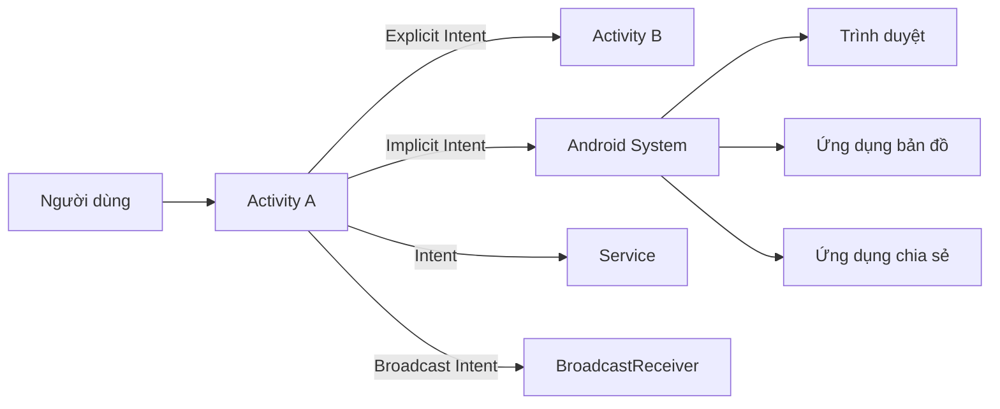
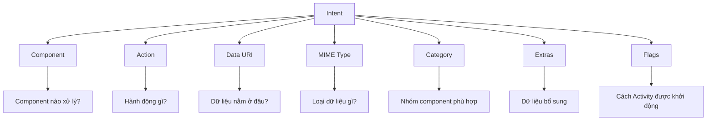
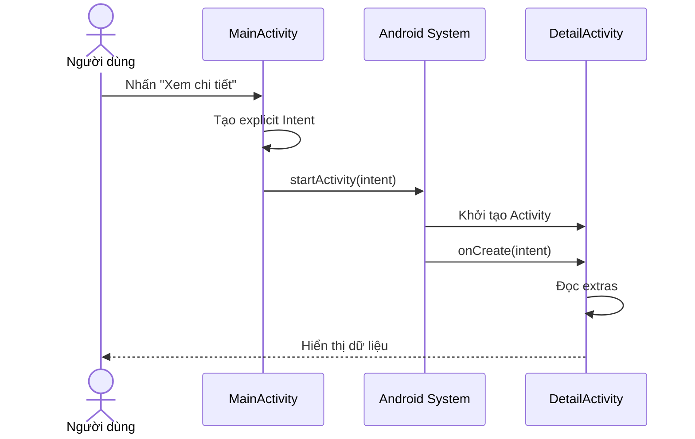
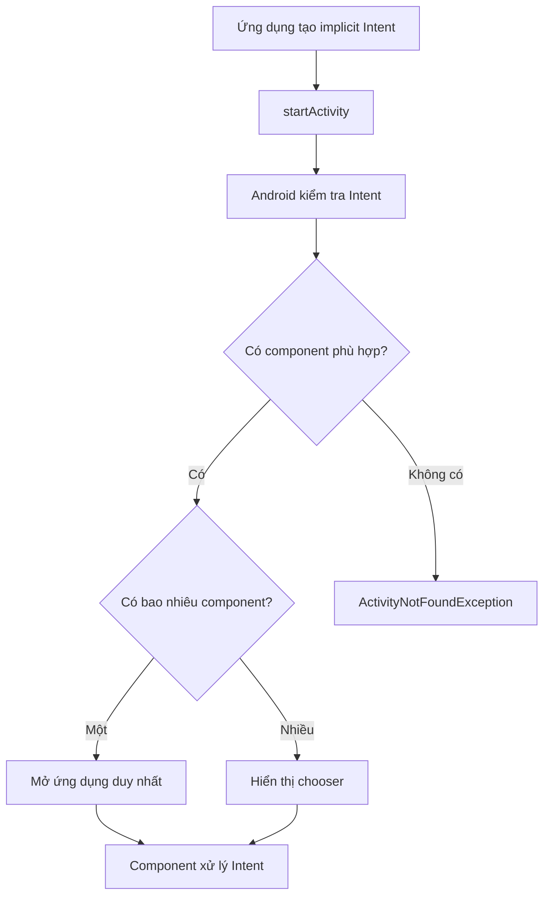
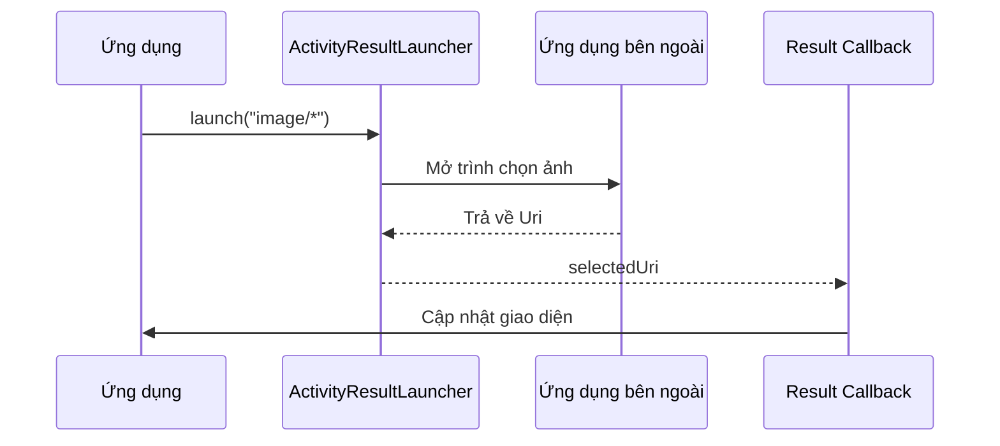
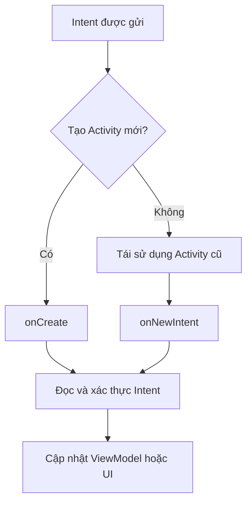
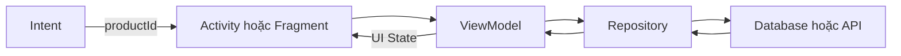
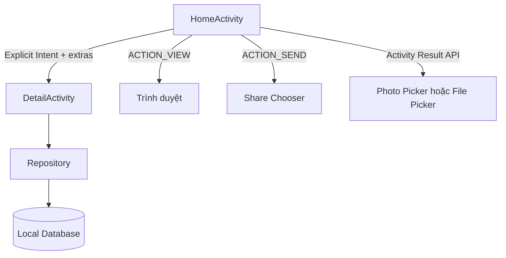
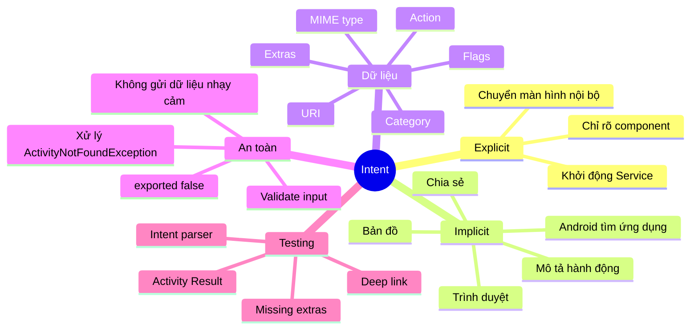

# 012 - Intent trong Android

**Học phần:** 02 - App Components and User Interface
**Module:** Module 03 - App Components
**Nhóm nội dung:** Intent
**Nguồn roadmap:** App Components / Intent
**Loại bài:** Lesson
**Thứ tự trong module:** 012
**Thời lượng gợi ý:** 24 phút

---

## 1. Tóm tắt

Trong Android, **Intent** là một đối tượng mô tả yêu cầu thực hiện một hành động. Intent thường được dùng để:

* Chuyển từ `Activity` này sang `Activity` khác.
* Mở trình duyệt, bản đồ, camera hoặc ứng dụng email.
* Chia sẻ văn bản, ảnh hoặc tệp sang ứng dụng khác.
* Khởi động một `Service`.
* Gửi thông điệp đến `BroadcastReceiver`.
* Truyền dữ liệu giữa các Android component.

Intent không trực tiếp thực hiện hành động. Nó đóng vai trò như một **thông điệp yêu cầu**, sau đó hệ thống Android xác định component phù hợp để xử lý yêu cầu đó. Android chia Intent thành hai loại chính: **explicit intent** và **implicit intent**.

---

## 2. Mục tiêu học tập

Sau bài học, anh có thể:

* Giải thích Intent bằng ngôn ngữ của mình.
* Phân biệt explicit intent và implicit intent.
* Chuyển màn hình và truyền dữ liệu bằng Intent.
* Mở một ứng dụng bên ngoài như trình duyệt hoặc bản đồ.
* Sử dụng chooser khi chia sẻ nội dung.
* Nhận kết quả bằng Activity Result API.
* Khai báo `intent-filter` trong `AndroidManifest.xml`.
* Kiểm tra và xác thực dữ liệu nhận từ bên ngoài ứng dụng.
* Nhận biết các rủi ro UX, bảo mật và maintainability liên quan đến Intent.
* Hoàn thiện một mini project có thể đưa vào portfolio.

---

## 3. Ghi chú 5 dòng về Intent

> 1. Intent là một đối tượng mô tả hành động mà ứng dụng muốn thực hiện.
> 2. Explicit intent chỉ rõ component đích, thường dùng để chuyển màn hình trong cùng ứng dụng.
> 3. Implicit intent chỉ mô tả hành động và dữ liệu, để Android tìm ứng dụng phù hợp.
> 4. Intent có thể mang dữ liệu thông qua URI, MIME type và extras.
> 5. Dữ liệu Intent nhận từ bên ngoài phải được kiểm tra trước khi sử dụng.

---

## 4. Hình minh họa

### 4.1. Cách Android xử lý implicit intent


*Nguồn ảnh: Android Developers – Intents and intent filters.*

Trong luồng trên:

1. `Activity A` tạo một Intent.
2. Intent được gửi đến Android bằng `startActivity()`.
3. Android tìm các ứng dụng có `intent-filter` phù hợp.
4. Component phù hợp được khởi tạo và nhận Intent trong `onCreate()`.

Hệ thống so sánh `action`, `data` và `category` của Intent với các `intent-filter` được khai báo bởi ứng dụng trên thiết bị. Nếu nhiều ứng dụng cùng xử lý được yêu cầu, Android có thể cho người dùng lựa chọn ứng dụng.

### 4.2. Giao diện chọn ứng dụng để chia sẻ


*Nguồn ảnh: Android Developers – Intent chooser. Giao diện thực tế có thể khác tùy phiên bản Android và thiết bị.*

---

## 5. Intent nằm ở đâu trong kiến trúc Android?

Intent kết nối các Android component với nhau tại runtime.



Intent có thể kích hoạt ba trong bốn loại Android component chính:

| Component           | Cách Intent được sử dụng                                       |
| ------------------- | -------------------------------------------------------------- |
| `Activity`          | Mở một màn hình hoặc yêu cầu ứng dụng khác thực hiện hành động |
| `Service`           | Khởi động hoặc kết nối tới một service                         |
| `BroadcastReceiver` | Gửi hoặc nhận thông báo sự kiện                                |
| `ContentProvider`   | Không được khởi động trực tiếp bằng Intent                     |

Intent hoạt động như một thông điệp bất đồng bộ giúp liên kết các component trong cùng ứng dụng hoặc giữa nhiều ứng dụng.

---

## 6. Cấu trúc của một Intent

Một Intent có thể chứa các thành phần sau:



### 6.1. Component

`component` chỉ định chính xác component đích.

```kotlin
val intent = Intent(this, DetailActivity::class.java)
```

Khi có component cụ thể, Intent trở thành **explicit intent**.

### 6.2. Action

`action` mô tả hành động cần thực hiện.

Một số action thường gặp:

| Action                          | Ý nghĩa                                 |
| ------------------------------- | --------------------------------------- |
| `Intent.ACTION_VIEW`            | Xem một trang web, vị trí hoặc nội dung |
| `Intent.ACTION_SEND`            | Chia sẻ một nội dung                    |
| `Intent.ACTION_DIAL`            | Mở màn hình quay số                     |
| `Intent.ACTION_PICK`            | Yêu cầu người dùng chọn dữ liệu         |
| `Intent.ACTION_GET_CONTENT`     | Chọn nội dung từ một nguồn dữ liệu      |
| `Intent.ACTION_CREATE_DOCUMENT` | Tạo và lưu một tài liệu                 |

Android định nghĩa nhiều action tiêu chuẩn để các ứng dụng có thể tương tác với nhau theo cùng một quy ước.

### 6.3. Data

`data` thường là một `Uri`, mô tả dữ liệu cần xử lý.

```kotlin
val webpage = Uri.parse("https://developer.android.com")
val intent = Intent(Intent.ACTION_VIEW, webpage)
```

Một số URI thường gặp:

```text
https://example.com
geo:21.0285,105.8542
tel:0123456789
mailto:example@gmail.com
content://com.example.provider/items/10
```

### 6.4. MIME type

MIME type mô tả loại dữ liệu.

```kotlin
intent.type = "text/plain"
```

Một số MIME type phổ biến:

```text
text/plain
text/html
image/*
image/jpeg
video/*
application/pdf
```

Khi cần thiết lập đồng thời URI và MIME type, nên dùng `setDataAndType()` vì gọi riêng `setData()` và `setType()` có thể ghi đè giá trị của nhau.

### 6.5. Category

Category cung cấp thêm điều kiện cho component xử lý Intent.

Ví dụ:

```kotlin
intent.addCategory(Intent.CATEGORY_BROWSABLE)
```

Một `Activity` muốn nhận implicit intent từ `startActivity()` phải có `android.intent.category.DEFAULT` trong `intent-filter`.

### 6.6. Extras

Extras là tập dữ liệu dạng key-value được đính kèm vào Intent.

```kotlin
intent.putExtra("product_id", 101)
intent.putExtra("product_name", "Android Course")
```

Các kiểu dữ liệu thường được truyền:

* `String`
* `Int`
* `Long`
* `Boolean`
* `Float`
* `Double`
* `Bundle`
* `Parcelable`
* Một số dạng collection được hỗ trợ

Không nên truyền object quá lớn qua Intent vì dữ liệu cần được đóng gói và truyền qua cơ chế IPC của Android.

### 6.7. Flags

Flags thay đổi cách Android khởi động hoặc quản lý Activity trong task và back stack.

```kotlin
intent.addFlags(Intent.FLAG_ACTIVITY_CLEAR_TOP)
```

Một số flag thường gặp:

| Flag                              | Công dụng                                           |
| --------------------------------- | --------------------------------------------------- |
| `FLAG_ACTIVITY_NEW_TASK`          | Khởi động Activity trong task mới hoặc task hiện có |
| `FLAG_ACTIVITY_CLEAR_TOP`         | Xóa các Activity nằm phía trên Activity đích        |
| `FLAG_ACTIVITY_SINGLE_TOP`        | Tái sử dụng Activity nếu nó đang ở đỉnh stack       |
| `FLAG_GRANT_READ_URI_PERMISSION`  | Cấp quyền đọc tạm thời đối với URI                  |
| `FLAG_GRANT_WRITE_URI_PERMISSION` | Cấp quyền ghi tạm thời đối với URI                  |

Không nên thêm flag chỉ để “sửa lỗi back stack” khi chưa hiểu rõ luồng điều hướng.

---

## 7. Explicit Intent

### 7.1. Khái niệm

**Explicit intent** chỉ rõ component sẽ nhận Intent.

Loại Intent này thường được sử dụng để:

* Chuyển giữa các Activity trong cùng ứng dụng.
* Khởi động một Service thuộc ứng dụng.
* Gửi broadcast đến một receiver cụ thể.
* Mở một component đã biết chính xác package và class.

Explicit intent thường phù hợp khi ứng dụng đã biết component nào phải xử lý yêu cầu.

### 7.2. Sơ đồ



### 7.3. Chuyển màn hình cơ bản

```kotlin
val intent = Intent(this, DetailActivity::class.java)
startActivity(intent)
```

### 7.4. Truyền dữ liệu sang Activity khác

#### MainActivity.kt

```kotlin
class MainActivity : AppCompatActivity() {

    companion object {
        const val EXTRA_PRODUCT_ID =
            "com.example.intentdemo.extra.PRODUCT_ID"

        const val EXTRA_PRODUCT_NAME =
            "com.example.intentdemo.extra.PRODUCT_NAME"
    }

    private fun openProductDetail() {
        val intent = Intent(this, DetailActivity::class.java).apply {
            putExtra(EXTRA_PRODUCT_ID, 101)
            putExtra(EXTRA_PRODUCT_NAME, "Khóa học Android")
        }

        startActivity(intent)
    }
}
```

Nên dùng key có prefix là package của ứng dụng để giảm nguy cơ trùng tên khi Intent được chia sẻ giữa nhiều component hoặc nhiều ứng dụng. Android cũng khuyến nghị namespace các custom action và extra key bằng package name.

#### DetailActivity.kt

```kotlin
class DetailActivity : AppCompatActivity() {

    override fun onCreate(savedInstanceState: Bundle?) {
        super.onCreate(savedInstanceState)
        setContentView(R.layout.activity_detail)

        val productId = intent.getIntExtra(
            MainActivity.EXTRA_PRODUCT_ID,
            -1
        )

        val productName = intent.getStringExtra(
            MainActivity.EXTRA_PRODUCT_NAME
        )

        if (productId == -1 || productName.isNullOrBlank()) {
            showInvalidDataMessage()
            finish()
            return
        }

        findViewById<TextView>(R.id.productNameTextView).text =
            productName
    }

    private fun showInvalidDataMessage() {
        Toast.makeText(
            this,
            "Không thể mở sản phẩm",
            Toast.LENGTH_SHORT
        ).show()
    }
}
```

### 7.5. Cách tốt hơn: truyền ID thay vì truyền toàn bộ object

Không nên:

```kotlin
intent.putExtra("product", veryLargeProductObject)
```

Nên:

```kotlin
intent.putExtra(EXTRA_PRODUCT_ID, product.id)
```

Ở màn hình đích:

```kotlin
val productId = intent.getLongExtra(EXTRA_PRODUCT_ID, -1L)

viewModel.loadProduct(productId)
```

Cách này giúp:

* Giảm kích thước Intent.
* Tránh phụ thuộc chặt giữa các màn hình.
* Dữ liệu được lấy lại từ repository hoặc database.
* Dễ xử lý process recreation.
* Dễ kiểm thử hơn.

---

## 8. Implicit Intent

### 8.1. Khái niệm

**Implicit intent** không chỉ rõ component đích. Nó mô tả:

* Hành động cần thực hiện.
* URI hoặc dữ liệu liên quan.
* MIME type.
* Category phù hợp.

Android tìm component có `intent-filter` tương thích để xử lý Intent.

### 8.2. Sơ đồ resolution



### 8.3. Mở một trang web

```kotlin
private fun openWebsite() {
    val uri = Uri.parse("https://developer.android.com")
    val intent = Intent(Intent.ACTION_VIEW, uri)

    try {
        startActivity(intent)
    } catch (exception: ActivityNotFoundException) {
        Toast.makeText(
            this,
            "Không tìm thấy ứng dụng mở liên kết",
            Toast.LENGTH_SHORT
        ).show()
    }
}
```

### 8.4. Mở bản đồ

```kotlin
private fun openMap() {
    val latitude = 21.0285
    val longitude = 105.8542

    val uri = Uri.parse(
        "geo:$latitude,$longitude?q=$latitude,$longitude"
    )

    val intent = Intent(Intent.ACTION_VIEW, uri)

    try {
        startActivity(intent)
    } catch (exception: ActivityNotFoundException) {
        Toast.makeText(
            this,
            "Thiết bị không có ứng dụng bản đồ",
            Toast.LENGTH_SHORT
        ).show()
    }
}
```

### 8.5. Mở màn hình quay số

```kotlin
private fun openDialer(phoneNumber: String) {
    val normalizedNumber = phoneNumber.filter {
        it.isDigit() || it == '+'
    }

    if (normalizedNumber.isBlank()) {
        return
    }

    val uri = Uri.parse("tel:$normalizedNumber")
    val intent = Intent(Intent.ACTION_DIAL, uri)

    try {
        startActivity(intent)
    } catch (exception: ActivityNotFoundException) {
        Toast.makeText(
            this,
            "Không tìm thấy ứng dụng gọi điện",
            Toast.LENGTH_SHORT
        ).show()
    }
}
```

`ACTION_DIAL` chỉ mở màn hình quay số để người dùng xác nhận. Nó an toàn và minh bạch hơn so với tự động thực hiện cuộc gọi.

### 8.6. Chia sẻ văn bản

```kotlin
private fun shareText(text: String) {
    if (text.isBlank()) {
        Toast.makeText(
            this,
            "Không có nội dung để chia sẻ",
            Toast.LENGTH_SHORT
        ).show()
        return
    }

    val sendIntent = Intent(Intent.ACTION_SEND).apply {
        type = "text/plain"
        putExtra(Intent.EXTRA_TEXT, text)
    }

    val chooserIntent = Intent.createChooser(
        sendIntent,
        "Chia sẻ bằng"
    )

    try {
        startActivity(chooserIntent)
    } catch (exception: ActivityNotFoundException) {
        Toast.makeText(
            this,
            "Không có ứng dụng phù hợp",
            Toast.LENGTH_SHORT
        ).show()
    }
}
```

Chooser đặc biệt phù hợp với thao tác chia sẻ vì người dùng có thể muốn chọn ứng dụng khác nhau tùy ngữ cảnh.

---

## 9. So sánh explicit và implicit intent

| Tiêu chí                      | Explicit Intent                   | Implicit Intent                  |
| ----------------------------- | --------------------------------- | -------------------------------- |
| Component đích                | Được chỉ định rõ                  | Không được chỉ định              |
| Phạm vi phổ biến              | Trong cùng ứng dụng               | Giữa các ứng dụng                |
| Ví dụ                         | `MainActivity` → `DetailActivity` | Mở trình duyệt, bản đồ, chia sẻ  |
| Android có resolution không?  | Không cần tìm component           | Có                               |
| Có thể xuất hiện chooser?     | Thường không                      | Có                               |
| Nguy cơ bị ứng dụng khác chặn | Thấp hơn                          | Cao hơn nếu gửi dữ liệu nhạy cảm |
| Cách xử lý lỗi                | Kiểm tra manifest và class        | Bắt `ActivityNotFoundException`  |
| Trường hợp phù hợp            | Biết chính xác component          | Chỉ biết hành động cần thực hiện |

Quy tắc dễ nhớ:

```text
Biết chính xác component cần mở
        ↓
Dùng explicit intent

Chỉ biết hành động cần thực hiện
        ↓
Dùng implicit intent
```

---

## 10. Nhận kết quả từ một Activity

API cũ gồm:

```kotlin
startActivityForResult(...)
onActivityResult(...)
```

Mặc dù các API này vẫn tồn tại, Android khuyến nghị dùng **Activity Result API** thông qua `registerForActivityResult()`. Callback cần được đăng ký ổn định khi Activity hoặc Fragment được tạo lại, vì process có thể bị hệ thống hủy trong lúc người dùng đang sử dụng camera hoặc ứng dụng bên ngoài.

### 10.1. Chọn một ảnh

```kotlin
class ProfileActivity : AppCompatActivity() {

    private val pickImageLauncher =
        registerForActivityResult(
            ActivityResultContracts.GetContent()
        ) { selectedUri: Uri? ->
            if (selectedUri == null) {
                Toast.makeText(
                    this,
                    "Bạn chưa chọn ảnh",
                    Toast.LENGTH_SHORT
                ).show()
                return@registerForActivityResult
            }

            findViewById<ImageView>(R.id.avatarImageView)
                .setImageURI(selectedUri)
        }

    override fun onCreate(savedInstanceState: Bundle?) {
        super.onCreate(savedInstanceState)
        setContentView(R.layout.activity_profile)

        findViewById<Button>(R.id.selectImageButton)
            .setOnClickListener {
                pickImageLauncher.launch("image/*")
            }
    }
}
```

### 10.2. Luồng Activity Result API



---

## 11. Intent Filter

### 11.1. Khái niệm

`intent-filter` khai báo những implicit intent mà một component có khả năng xử lý.

Một filter có thể kiểm tra ba nhóm thông tin:

* `action`
* `category`
* `data`

Intent phải thỏa mãn các điều kiện cần thiết của filter thì component mới được xem là phù hợp.

### 11.2. Nhận văn bản được chia sẻ từ ứng dụng khác

```xml
<activity
    android:name=".ReceiveTextActivity"
    android:exported="true">

    <intent-filter>
        <action android:name="android.intent.action.SEND" />

        <category
            android:name="android.intent.category.DEFAULT" />

        <data android:mimeType="text/plain" />
    </intent-filter>

</activity>
```

Khi component cần được mở từ ứng dụng khác, `android:exported` phải được cấu hình phù hợp. Với ứng dụng target Android 12 trở lên, component có `intent-filter` phải khai báo rõ `android:exported`; nếu thiếu, ứng dụng có thể không cài đặt được trên thiết bị tương ứng.

### 11.3. Đọc dữ liệu nhận được

```kotlin
class ReceiveTextActivity : AppCompatActivity() {

    override fun onCreate(savedInstanceState: Bundle?) {
        super.onCreate(savedInstanceState)
        setContentView(R.layout.activity_receive_text)

        handleIncomingIntent(intent)
    }

    override fun onNewIntent(intent: Intent) {
        super.onNewIntent(intent)
        setIntent(intent)
        handleIncomingIntent(intent)
    }

    private fun handleIncomingIntent(incomingIntent: Intent) {
        if (incomingIntent.action != Intent.ACTION_SEND) {
            showInvalidIntent()
            return
        }

        if (incomingIntent.type != "text/plain") {
            showInvalidIntent()
            return
        }

        val sharedText =
            incomingIntent.getStringExtra(Intent.EXTRA_TEXT)
                ?.trim()
                ?.take(5_000)

        if (sharedText.isNullOrBlank()) {
            showInvalidIntent()
            return
        }

        findViewById<TextView>(R.id.receivedTextView).text =
            sharedText
    }

    private fun showInvalidIntent() {
        Toast.makeText(
            this,
            "Dữ liệu chia sẻ không hợp lệ",
            Toast.LENGTH_SHORT
        ).show()

        finish()
    }
}
```

---

## 12. Intent và lifecycle

Khi một Activity được mở bằng Intent:

1. Android tìm hoặc tạo Activity đích.
2. Intent được truyền vào Activity.
3. Activity mới nhận Intent thông qua `getIntent()` hoặc thuộc tính Kotlin `intent`.
4. Nếu một instance mới được tạo, dữ liệu thường được đọc trong `onCreate()`.
5. Nếu Activity cũ được tái sử dụng do launch mode hoặc flag, Intent mới có thể được chuyển đến `onNewIntent()`.



### Sai lầm liên quan đến lifecycle

Chỉ xử lý Intent trong `onCreate()`:

```kotlin
override fun onCreate(savedInstanceState: Bundle?) {
    super.onCreate(savedInstanceState)
    handleIntent(intent)
}
```

Nếu Activity được tái sử dụng, Intent mới có thể không được xử lý.

Cải thiện:

```kotlin
override fun onNewIntent(intent: Intent) {
    super.onNewIntent(intent)
    setIntent(intent)
    handleIntent(intent)
}
```

---

## 13. Intent và state

Intent nên được xem là **đầu vào điều hướng**, không phải nguồn lưu trữ state lâu dài.

Ví dụ:

```kotlin
val productId = intent.getLongExtra(EXTRA_PRODUCT_ID, -1L)
viewModel.loadProduct(productId)
```

Sau đó UI state được quản lý bởi `ViewModel`:

```kotlin
data class ProductUiState(
    val isLoading: Boolean = false,
    val productName: String = "",
    val errorMessage: String? = null
)
```

### Phân chia trách nhiệm



| Thành phần        | Trách nhiệm                                  |
| ----------------- | -------------------------------------------- |
| Intent            | Chuyển yêu cầu điều hướng và input tối thiểu |
| Activity/Fragment | Đọc và xác thực input                        |
| ViewModel         | Quản lý UI state và business logic           |
| Repository        | Đọc dữ liệu từ database, cache hoặc network  |

---

## 14. Bảo mật Intent

### 14.1. Xem Intent từ bên ngoài là dữ liệu không đáng tin cậy

Một ứng dụng khác có thể gửi:

* Action không mong đợi.
* URI bị chỉnh sửa.
* Extra thiếu hoặc sai kiểu.
* Chuỗi quá dài.
* ID không hợp lệ.
* Nested Intent trỏ tới component nhạy cảm.

Do đó, receiver phải kiểm tra:

```kotlin
private fun validateIntent(intent: Intent): Boolean {
    if (intent.action != Intent.ACTION_VIEW) {
        return false
    }

    val uri = intent.data ?: return false

    if (uri.scheme != "https") {
        return false
    }

    if (uri.host != "example.com") {
        return false
    }

    return true
}
```

### 14.2. Không gửi dữ liệu nhạy cảm qua implicit intent

Không nên:

```kotlin
Intent(Intent.ACTION_SEND).apply {
    type = "text/plain"
    putExtra(Intent.EXTRA_TEXT, userAccessToken)
}
```

Implicit intent có thể được xử lý bởi ứng dụng bên ngoài. Android khuyến nghị sử dụng explicit intent khi chuyển dữ liệu nhạy cảm đến một component xác định.

### 14.3. Không dùng implicit intent để khởi động Service

Không nên:

```kotlin
val intent = Intent("com.example.DOWNLOAD")
startService(intent)
```

Nên:

```kotlin
val intent = Intent(this, DownloadService::class.java)
startService(intent)
```

Android khuyến nghị luôn dùng explicit intent khi khởi động Service. Implicit intent cho Service có thể khiến ứng dụng không biết chính xác service nào sẽ xử lý yêu cầu; `bindService()` với implicit intent cũng bị từ chối từ Android 5.0 trở lên.

### 14.4. Không export component nếu không cần

Component chỉ dùng nội bộ:

```xml
<activity
    android:name=".InternalSettingsActivity"
    android:exported="false" />
```

Component nhận deep link từ bên ngoài:

```xml
<activity
    android:name=".DeepLinkActivity"
    android:exported="true">
    <!-- intent-filter -->
</activity>
```

`android:exported="false"` giới hạn việc khởi động component từ ứng dụng khác và nên được dùng khi component không có yêu cầu giao tiếp liên ứng dụng.

### 14.5. Không chuyển tiếp nested Intent một cách mù quáng

Không nên:

```kotlin
val nestedIntent =
    intent.getParcelableExtra<Intent>("next_intent")

startActivity(nestedIntent)
```

Một nested Intent không được xác thực có thể dẫn đến **intent redirection**, khiến ứng dụng vô tình mở component nhạy cảm thay cho ứng dụng tấn công. Android cung cấp `IntentSanitizer` để tạo bản sao Intent an toàn dựa trên các trường được cho phép.

---

## 15. Lỗi phổ biến của lập trình viên mới

### Lỗi 1: Tin rằng thiết bị luôn có ứng dụng xử lý implicit intent

```kotlin
startActivity(
    Intent(
        Intent.ACTION_VIEW,
        Uri.parse("custom-scheme://item/10")
    )
)
```

Nếu không có ứng dụng phù hợp, app có thể gặp `ActivityNotFoundException`.

Cải thiện:

```kotlin
try {
    startActivity(intent)
} catch (exception: ActivityNotFoundException) {
    showFallbackUi()
}
```

---

### Lỗi 2: Dùng key extras dạng chuỗi rải rác

Không nên:

```kotlin
intent.putExtra("id", productId)
```

Ở màn hình khác:

```kotlin
intent.getLongExtra("product_id", -1L)
```

Hai key không giống nhau nên dữ liệu bị mất.

Cải thiện:

```kotlin
object ProductNavigation {
    const val EXTRA_PRODUCT_ID =
        "com.example.app.extra.PRODUCT_ID"
}
```

---

### Lỗi 3: Dùng giá trị mặc định hợp lệ

Không nên:

```kotlin
val productId = intent.getLongExtra(EXTRA_PRODUCT_ID, 0L)
```

Nếu `0` là ID hợp lệ, ứng dụng không phân biệt được “không có dữ liệu” và “sản phẩm số 0”.

Nên:

```kotlin
val productId = intent.getLongExtra(EXTRA_PRODUCT_ID, -1L)

if (productId <= 0L) {
    finish()
    return
}
```

---

### Lỗi 4: Truyền object hoặc bitmap quá lớn

Không nên:

```kotlin
intent.putExtra("bitmap", highResolutionBitmap)
```

Nên lưu dữ liệu vào cache, file hoặc repository rồi chỉ truyền URI hay ID:

```kotlin
intent.putExtra(EXTRA_IMAGE_URI, imageUri.toString())
```

---

### Lỗi 5: Chỉ đọc Intent trong `onCreate()`

Điều này có thể bỏ sót Intent mới khi Activity được tái sử dụng.

Cần xem xét thêm:

```kotlin
override fun onNewIntent(intent: Intent) {
    super.onNewIntent(intent)
    handleIntent(intent)
}
```

---

### Lỗi 6: Export component không cần thiết

Không nên:

```xml
<activity
    android:name=".AdminActivity"
    android:exported="true" />
```

Nên:

```xml
<activity
    android:name=".AdminActivity"
    android:exported="false" />
```

---

### Lỗi 7: Sử dụng Intent thay cho navigation state

Không nên truyền hàng loạt dữ liệu UI qua Intent mỗi lần rotate hoặc recreate.

Nên:

* Intent chuyển ID hoặc navigation argument.
* `ViewModel` quản lý UI state.
* Repository quản lý dữ liệu.
* `SavedStateHandle` giữ state cần phục hồi.

---

## 16. Ảnh hưởng đến UX, độ ổn định và maintainability

### 16.1. UX

Intent được xử lý tốt giúp:

* Điều hướng đúng màn hình.
* Không crash khi thiết bị thiếu ứng dụng bên ngoài.
* Hiển thị chooser phù hợp.
* Có thông báo khi không mở được liên kết.
* Tránh đưa người dùng đến ứng dụng ngoài mà không rõ lý do.
* Khôi phục luồng đúng sau khi Activity được tạo lại.

Ví dụ fallback:

```kotlin
private fun showNoBrowserDialog() {
    MaterialAlertDialogBuilder(this)
        .setTitle("Không thể mở liên kết")
        .setMessage(
            "Thiết bị chưa có ứng dụng phù hợp để mở nội dung này."
        )
        .setPositiveButton("Đóng", null)
        .show()
}
```

### 16.2. Reliability

Độ ổn định tăng khi:

* Extras được kiểm tra null và phạm vi giá trị.
* URI được xác thực.
* `ActivityNotFoundException` được xử lý.
* Intent mới được xử lý trong `onNewIntent()`.
* Result callback được đăng ký bằng Activity Result API.
* Component không cần thiết được đặt `exported="false"`.

### 16.3. Maintainability

Maintainability tốt hơn khi:

* Extra key được gom vào một nơi.
* Mỗi màn hình chỉ nhận input tối thiểu.
* Navigation code được tách khỏi business logic.
* Không truyền object domain lớn giữa các màn hình.
* Các custom action sử dụng namespace của package.
* Intent parsing được đóng gói thành hàm riêng.

Ví dụ:

```kotlin
data class ProductDestination(
    val productId: Long
)

fun Intent.toProductDestination(): ProductDestination? {
    val productId = getLongExtra(
        ProductNavigation.EXTRA_PRODUCT_ID,
        -1L
    )

    if (productId <= 0L) {
        return null
    }

    return ProductDestination(productId)
}
```

Sử dụng:

```kotlin
val destination = intent.toProductDestination()

if (destination == null) {
    finish()
    return
}

viewModel.loadProduct(destination.productId)
```

---

## 17. Debugging Intent

### 17.1. Log thông tin quan trọng

```kotlin
private fun logIntent(intent: Intent) {
    Log.d("IntentDebug", "action=${intent.action}")
    Log.d("IntentDebug", "data=${intent.data}")
    Log.d("IntentDebug", "type=${intent.type}")
    Log.d("IntentDebug", "categories=${intent.categories}")
    Log.d("IntentDebug", "component=${intent.component}")
}
```

Không ghi access token, mật khẩu, nội dung riêng tư hoặc dữ liệu cá nhân vào log production.

### 17.2. Dùng ADB kiểm tra deep link

```bash
adb shell am start \
  -a android.intent.action.VIEW \
  -d "https://example.com/products/101"
```

### 17.3. Mở Activity cụ thể

```bash
adb shell am start \
  -n com.example.intentdemo/.MainActivity
```

### 17.4. Gửi extra bằng ADB

```bash
adb shell am start \
  -n com.example.intentdemo/.DetailActivity \
  --es product_name "Android Course" \
  --ei product_id 101
```

### 17.5. Các câu hỏi khi debug

* `action` có đúng không?
* URI có đúng scheme, host và path không?
* MIME type có khớp `intent-filter` không?
* Filter có `CATEGORY_DEFAULT` không?
* Component có khai báo trong manifest không?
* `android:exported` có phù hợp không?
* Extra key ở nơi gửi và nơi nhận có giống nhau không?
* Activity có nhận Intent mới trong `onNewIntent()` không?
* Có ứng dụng nào trên thiết bị xử lý được implicit intent không?

---

## 18. Kiểm thử Intent

### 18.1. Unit test hàm parse Intent

```kotlin
class ProductIntentParserTest {

    @Test
    fun validProductId_returnsDestination() {
        val intent = Intent().apply {
            putExtra(
                ProductNavigation.EXTRA_PRODUCT_ID,
                101L
            )
        }

        val result = intent.toProductDestination()

        assertEquals(101L, result?.productId)
    }

    @Test
    fun missingProductId_returnsNull() {
        val intent = Intent()

        val result = intent.toProductDestination()

        assertNull(result)
    }

    @Test
    fun invalidProductId_returnsNull() {
        val intent = Intent().apply {
            putExtra(
                ProductNavigation.EXTRA_PRODUCT_ID,
                -10L
            )
        }

        val result = intent.toProductDestination()

        assertNull(result)
    }
}
```

### 18.2. Instrumentation test mở Activity

```kotlin
@RunWith(AndroidJUnit4::class)
class DetailActivityTest {

    @Test
    fun validIntent_displaysProductName() {
        val context =
            ApplicationProvider.getApplicationContext<Context>()

        val intent = Intent(
            context,
            DetailActivity::class.java
        ).apply {
            putExtra(
                MainActivity.EXTRA_PRODUCT_ID,
                101
            )

            putExtra(
                MainActivity.EXTRA_PRODUCT_NAME,
                "Khóa học Android"
            )
        }

        ActivityScenario.launch<DetailActivity>(intent)

        onView(withId(R.id.productNameTextView))
            .check(matches(withText("Khóa học Android")))
    }
}
```

### 18.3. Ma trận test

| Test case                            | Kết quả mong đợi                     |
| ------------------------------------ | ------------------------------------ |
| Intent có ID hợp lệ                  | Hiển thị đúng dữ liệu                |
| Thiếu ID                             | Hiện thông báo và đóng màn hình      |
| ID âm                                | Không tải dữ liệu                    |
| Thiếu ứng dụng xử lý implicit intent | Hiện fallback UI                     |
| Chọn hủy trong Activity Result       | UI không crash                       |
| MIME type không hợp lệ               | Từ chối dữ liệu                      |
| Deep link sai host                   | Không điều hướng                     |
| Activity nhận Intent mới             | Giao diện cập nhật                   |
| Rotate màn hình                      | State không bị mất ngoài dự kiến     |
| Process bị hủy rồi tạo lại           | Callback và state vẫn hoạt động đúng |

---

## 19. Bài thực hành: Intent Demo App

### 19.1. Yêu cầu

Tạo ứng dụng gồm hai màn hình:

#### Màn hình Home

* Nhập tên sản phẩm.
* Nhấn **Xem chi tiết** để mở `DetailActivity`.
* Nhấn **Mở tài liệu Android** để mở trình duyệt.
* Nhấn **Chia sẻ** để chia sẻ tên sản phẩm.
* Nhấn **Chọn ảnh** để chọn ảnh từ thiết bị.

#### Màn hình Detail

* Nhận `productId`.
* Nhận `productName`.
* Kiểm tra dữ liệu.
* Hiển thị thông báo nếu input không hợp lệ.

### 19.2. Sơ đồ ứng dụng



### 19.3. Cấu trúc thư mục gợi ý

```text
com.example.intentdemo
├── MainActivity.kt
├── detail
│   ├── DetailActivity.kt
│   ├── DetailViewModel.kt
│   └── ProductIntentParser.kt
├── navigation
│   └── ProductNavigation.kt
├── data
│   └── ProductRepository.kt
└── test
    └── ProductIntentParserTest.kt
```

---

## 20. Artifact đưa vào portfolio

Tên project:

```text
Android Intent Lab
```

README nên có:

```markdown
# Android Intent Lab

Ứng dụng minh họa giao tiếp giữa Android components bằng Intent.

## Tính năng

- Explicit Intent giữa hai Activity
- Truyền dữ liệu bằng extras
- Implicit Intent mở trình duyệt
- Chia sẻ văn bản bằng Intent Chooser
- Chọn ảnh bằng Activity Result API
- Kiểm tra dữ liệu Intent
- Xử lý ActivityNotFoundException
- Unit test cho Intent parser

## Kiến thức áp dụng

- Activity lifecycle
- Intent và intent-filter
- Activity Result API
- URI và MIME type
- android:exported
- Input validation
- Navigation testing

## Ảnh minh họa

- Home screen
- Detail screen
- Share chooser
- Image picker
- Invalid input state
```

Artifact hoàn chỉnh có thể gồm:

* Source code trên GitHub hoặc GitLab.
* Sơ đồ Mermaid về Intent resolution.
* Screenshot hai màn hình.
* GIF hoặc video demo luồng chia sẻ.
* Unit test cho Intent parser.
* README giải thích rủi ro bảo mật.
* Checklist kiểm thử release.

---

## 21. Bài tập

### Bài 1 – Explicit Intent

Tạo `ProfileActivity` và truyền:

```text
user_id
display_name
is_premium
```

Màn hình đích phải kiểm tra dữ liệu trước khi hiển thị.

### Bài 2 – Implicit Intent

Thêm ba nút:

```text
Mở website
Mở bản đồ
Chia sẻ khóa học
```

Mỗi thao tác phải có xử lý khi không có ứng dụng phù hợp.

### Bài 3 – Activity Result API

Cho phép người dùng chọn một ảnh đại diện và hiển thị ảnh được chọn.

### Bài 4 – Intent Filter

Tạo một Activity có khả năng nhận văn bản từ ứng dụng khác qua `ACTION_SEND`.

### Bài 5 – Bảo mật

Viết hàm xác thực deep link chỉ chấp nhận:

```text
Scheme: https
Host: learning.example.com
Path bắt đầu bằng: /courses/
```

### Bài 6 – Kiểm thử

Viết ít nhất ba test case:

1. Có ID hợp lệ.
2. Thiếu ID.
3. ID nhỏ hơn hoặc bằng 0.

---

## 22. Checklist hoàn thành

### Kiến thức

* [ ] Giải thích được Intent bằng ngôn ngữ của mình.
* [ ] Phân biệt được explicit và implicit intent.
* [ ] Biết các thành phần `action`, `data`, `type`, `category`, `extras`.
* [ ] Hiểu cách Android thực hiện intent resolution.
* [ ] Biết vai trò của `intent-filter`.

### Thực hành

* [ ] Chuyển màn hình bằng explicit intent.
* [ ] Truyền và nhận extras.
* [ ] Mở website bằng implicit intent.
* [ ] Chia sẻ văn bản bằng chooser.
* [ ] Nhận kết quả bằng Activity Result API.
* [ ] Xử lý `ActivityNotFoundException`.
* [ ] Xử lý Intent trong `onNewIntent()` khi cần.

### Bảo mật

* [ ] Không tin tưởng dữ liệu Intent bên ngoài.
* [ ] Xác thực action, URI, MIME type và extras.
* [ ] Không gửi dữ liệu nhạy cảm qua implicit intent.
* [ ] Không dùng implicit intent để khởi động Service.
* [ ] Đặt `android:exported="false"` nếu component chỉ dùng nội bộ.
* [ ] Không chuyển tiếp nested Intent chưa được kiểm tra.

### Testing và release

* [ ] Có unit test cho Intent parser.
* [ ] Có test input thiếu hoặc sai.
* [ ] Có test khi thiết bị không có ứng dụng xử lý.
* [ ] Kiểm tra deep link bằng ADB.
* [ ] Kiểm tra rotate, background và process recreation.
* [ ] Kiểm tra manifest trên Android 12 trở lên.
* [ ] Không log dữ liệu nhạy cảm trong production.

### Portfolio

* [ ] Có README.
* [ ] Có sơ đồ luồng Intent.
* [ ] Có screenshot hoặc video demo.
* [ ] Có source code.
* [ ] Có test.
* [ ] Có phần giải thích ảnh hưởng đến UX và bảo mật.

---

## 23. Ghi chú production

Trước khi release tính năng sử dụng Intent, cần trả lời:

1. Component nào có thể gửi Intent đến màn hình này?
2. Component có thật sự cần `android:exported="true"` không?
3. Action, URI, MIME type và extras đã được xác thực chưa?
4. Dữ liệu có chứa token, thông tin cá nhân hoặc nội dung nhạy cảm không?
5. Điều gì xảy ra nếu không có ứng dụng xử lý implicit intent?
6. Người dùng có hiểu rằng họ sắp rời ứng dụng không?
7. Activity có thể nhận Intent mới qua `onNewIntent()` không?
8. State có được giữ khi rotate hoặc process bị hủy không?
9. Có unit test và instrumentation test cho input không hợp lệ không?
10. Back stack có hoạt động đúng sau khi mở deep link hoặc notification không?

---

## 24. Tóm tắt cuối bài



> **Intent là hợp đồng giao tiếp giữa các Android component.**
> Một implementation tốt không chỉ mở được màn hình, mà còn phải xử lý input sai, ứng dụng bên ngoài không tồn tại, lifecycle thay đổi, back stack và các rủi ro bảo mật.

---

## 25. Tài liệu tham khảo

* [Intents and intent filters – Android Developers](https://developer.android.com/guide/components/intents-filters)
* [Common intents – Android Developers](https://developer.android.com/guide/components/intents-common)
* [Interact with other apps – Android Developers](https://developer.android.com/training/basics/intents)
* [Get a result from an activity – Android Developers](https://developer.android.com/training/basics/intents/result)
* [Implicit intent hijacking – Android Developers](https://developer.android.com/privacy-and-security/risks/implicit-intent-hijacking)
* [Intent redirection – Android Developers](https://developer.android.com/privacy-and-security/risks/intent-redirection)
* [android:exported – Android Developers](https://developer.android.com/privacy-and-security/risks/android-exported)

---

# Bài luyện tập

## Mục tiêu


## Đề bài


## Yêu cầu hoàn thành

- [ ] 
- [ ] 
- [ ] 

## Kết quả / lời giải


## Ghi chú
