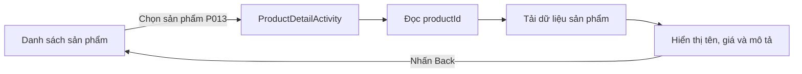
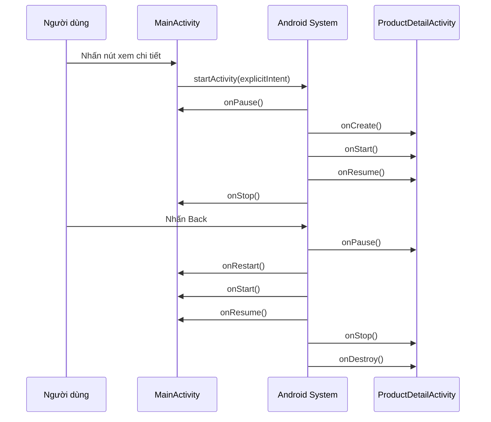
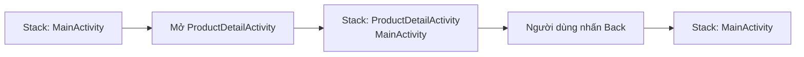
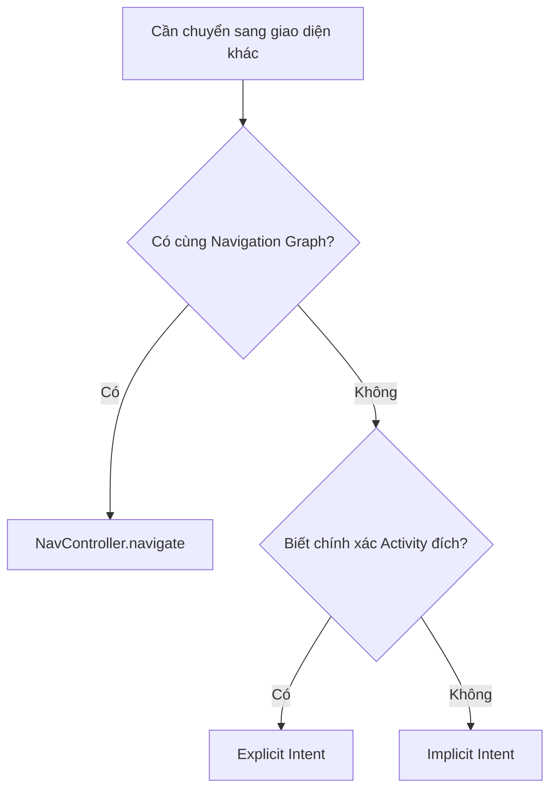

# 013 - Explicit Intents trong Android
[](https://developer.android.com/guide/components/intents-filters?utm_source=chatgpt.com)
| Thuộc tính              | Nội dung                               |
| ----------------------- | -------------------------------------- |
| **Học phần**            | 02 - App Components and User Interface |
| **Module**              | Module 03 - App Components             |
| **Nhóm nội dung**       | Intent                                 |
| **Nguồn roadmap**       | App Components / Intent                |
| **Loại bài**            | Lesson                                 |
| **Thứ tự trong module** | 013                                    |
| **Thời lượng gợi ý**    | 24 phút                                |
| **Ngôn ngữ minh họa**   | Kotlin                                 |
| **Mức độ**              | Cơ bản → thực hành                     |

---

## 1. Tóm tắt

**Explicit Intent**, hay **Intent tường minh**, là một đối tượng `Intent` chỉ định chính xác component Android cần được khởi chạy, chẳng hạn như `ProductDetailActivity`, `LoginActivity` hoặc một `Service` cụ thể.

Điểm làm cho một Intent trở thành Explicit Intent là nó chứa **component đích**, thường được khai báo thông qua constructor:

```kotlin
Intent(context, TargetActivity::class.java)
```

Explicit Intent thường được sử dụng khi ứng dụng đã biết rõ màn hình hoặc component nào cần xử lý yêu cầu. Android không phải tìm kiếm component phù hợp thông qua các `intent-filter`; hệ thống chuyển Intent trực tiếp tới component được chỉ định. ([Android Developers][1])

Ví dụ:

```kotlin
val intent = Intent(this, ProductDetailActivity::class.java)
startActivity(intent)
```

Trong ví dụ trên, `MainActivity` yêu cầu Android mở chính xác `ProductDetailActivity`.

---

## 2. Mục tiêu học tập

Sau bài học, anh có thể:

* Giải thích Explicit Intent bằng ngôn ngữ của mình.
* Phân biệt Explicit Intent và Implicit Intent.
* Mở một `Activity` cụ thể bằng Kotlin.
* Truyền dữ liệu giữa hai Activity bằng `putExtra()`.
* Đọc và kiểm tra dữ liệu nhận được trong Activity đích.
* Giải thích ảnh hưởng của Intent tới lifecycle và back stack.
* Viết kiểm thử cơ bản cho Explicit Intent.
* Nhận biết lỗi thường gặp về `Context`, extra key, state và `android:exported`.
* Xây dựng một artifact nhỏ để đưa vào portfolio Android.

---

## 3. Ghi chú 5 dòng về Explicit Intent

> 1. Explicit Intent chỉ định chính xác component Android cần khởi chạy.
> 2. Nó thường được dùng để di chuyển giữa các Activity trong cùng ứng dụng.
> 3. Cú pháp phổ biến là `Intent(context, TargetActivity::class.java)`.
> 4. Dữ liệu có thể được gửi kèm bằng `putExtra()` hoặc `Bundle`.
> 5. Khi Activity mới được mở, nó được đưa lên trên cùng của back stack.

---

## 4. Khái niệm chính

### 4.1. Intent là gì?

`Intent` là một đối tượng truyền thông điệp, dùng để yêu cầu một Android app component thực hiện một hành động. Intent có thể được dùng để:

* Khởi chạy một `Activity`.
* Khởi chạy hoặc kết nối với một `Service`.
* Gửi một broadcast.

Khi khởi chạy Activity, Intent vừa mô tả component cần mở, vừa có thể mang theo dữ liệu cần thiết cho component đó. ([Android Developers][1])

---

### 4.2. Explicit Intent là gì?

Explicit Intent là Intent có chứa tên component đích cụ thể.

```kotlin
val intent = Intent(this, ProfileActivity::class.java)
```

Trong đoạn code này:

* `this` là `Context` hiện tại.
* `ProfileActivity::class.java` là class cụ thể cần khởi chạy.
* Android không cần tìm kiếm ứng dụng hoặc Activity phù hợp.
* Intent chỉ được chuyển đến component đã được chỉ định.

Component name là thông tin quan trọng làm cho Intent trở thành Intent tường minh. Component có thể được thiết lập bằng constructor `Intent(Context, Class)`, `setClass()`, `setClassName()` hoặc `setComponent()`. ([Android Developers][1])

---

## 5. Sơ đồ hoạt động

```mermaid
flowchart LR
    A[MainActivity] --> B[Tạo Explicit Intent]
    B --> C["Intent(this, ProductDetailActivity::class.java)"]
    C --> D["putExtra(PRODUCT_ID, P013)"]
    D --> E["startActivity(intent)"]
    E --> F[Android System]
    F --> G[Khởi tạo ProductDetailActivity]
    G --> H["onCreate()"]
    H --> I["Đọc intent extras"]
    I --> J[Hiển thị chi tiết sản phẩm]
```



Explicit Intent có thể được hình dung như một địa chỉ giao hàng đầy đủ:

```text
Người gửi: MainActivity
Địa chỉ đích: ProductDetailActivity
Hàng hóa: productId = "P013"
Đơn vị vận chuyển: Android System
```

Vì địa chỉ đích đã rõ ràng, Android không cần hỏi component nào có khả năng xử lý yêu cầu.

---

## 6. Explicit Intent và Implicit Intent

| Tiêu chí                              | Explicit Intent                            | Implicit Intent                          |
| ------------------------------------- | ------------------------------------------ | ---------------------------------------- |
| Component đích                        | Được chỉ định rõ                           | Không chỉ định component cụ thể          |
| Cách tạo                              | `Intent(this, DetailActivity::class.java)` | `Intent(Intent.ACTION_VIEW, uri)`        |
| Hệ thống có phải tìm component không? | Không                                      | Có                                       |
| Trường hợp phổ biến                   | Mở màn hình trong cùng app                 | Mở trình duyệt, bản đồ, ứng dụng chia sẻ |
| Phụ thuộc `intent-filter`             | Không bắt buộc                             | Thường có                                |
| Khả năng hiện hộp chọn ứng dụng       | Không                                      | Có thể                                   |
| Mức độ kiểm soát                      | Cao                                        | Phụ thuộc các app đã cài đặt             |

Android định nghĩa hai loại Intent chính: Explicit Intent xác định component cụ thể, còn Implicit Intent mô tả hành động chung để hệ thống tìm component thích hợp. ([Android Developers][1])

### Ví dụ Explicit Intent

```kotlin
val intent = Intent(this, SettingsActivity::class.java)
startActivity(intent)
```

### Ví dụ Implicit Intent

```kotlin
val intent = Intent(
    Intent.ACTION_VIEW,
    Uri.parse("https://developer.android.com")
)

startActivity(intent)
```

---

## 7. Ảnh minh họa Intent

Hình dưới đây mô tả cách một Activity tạo Intent, chuyển nó cho Android System và hệ thống khởi chạy Activity đích.


> **Lưu ý:** Hình chính thức tập trung vào quá trình phân giải Implicit Intent. Với Explicit Intent, component đích đã được chỉ định nên Android không cần tìm kiếm qua các `intent-filter`. 

---

## 8. Cấu trúc của một Explicit Intent

Một Explicit Intent thường có các phần sau:

```kotlin
val intent = Intent(context, TargetActivity::class.java).apply {
    putExtra("extra_key", "extra_value")
    flags = Intent.FLAG_ACTIVITY_CLEAR_TOP
}
```

### 8.1. Context

`Context` cung cấp thông tin về môi trường hiện tại của ứng dụng.

```kotlin
Intent(this, DetailActivity::class.java)
```

Trong Activity, `this` thường chính là Activity hiện tại.

Trong Fragment:

```kotlin
Intent(requireContext(), DetailActivity::class.java)
```

Trong Jetpack Compose:

```kotlin
val context = LocalContext.current

Button(
    onClick = {
        context.startActivity(
            Intent(context, DetailActivity::class.java)
        )
    }
) {
    Text("Mở chi tiết")
}
```

---

### 8.2. Component đích

```kotlin
ProductDetailActivity::class.java
```

Đây là class chính xác Android cần khởi chạy.

Activity đích phải được khai báo trong `AndroidManifest.xml`. Activity không được khai báo trong manifest sẽ không được hệ thống nhận diện và không thể chạy. ([Android Developers][2])

---

### 8.3. Extras

Extras là các cặp key-value dùng để chuyển dữ liệu bổ sung tới component đích.

```kotlin
intent.putExtra("product_id", "P013")
intent.putExtra("quantity", 2)
intent.putExtra("is_premium", true)
```

Android hỗ trợ nhiều kiểu dữ liệu cho extra như:

* `String`
* `Int`
* `Long`
* `Double`
* `Boolean`
* `Bundle`
* Một số kiểu `Parcelable`

Extras không quyết định component nào được mở. Chúng cung cấp dữ liệu để component đích thực hiện công việc sau khi được khởi chạy. ([Android Developers][1])

---

### 8.4. Flags

Flags điều chỉnh cách Activity được khởi chạy hoặc cách nó tham gia task và back stack.

Ví dụ:

```kotlin
intent.addFlags(Intent.FLAG_ACTIVITY_CLEAR_TOP)
```

Không nên thêm flag chỉ để “sửa nhanh” lỗi điều hướng. Một flag không phù hợp có thể làm Activity bị tạo lại, bị xóa khỏi stack hoặc tạo task mới ngoài dự kiến. Intent flags có thể ảnh hưởng trực tiếp đến task chứa Activity và cách Activity xuất hiện trong lịch sử điều hướng. ([Android Developers][1])

---

## 9. Thực hành: mở màn hình chi tiết sản phẩm

### 9.1. User flow



Ứng dụng gồm hai Activity:

```text
MainActivity
└── ProductDetailActivity
```

`MainActivity` hiển thị nút mở sản phẩm.

`ProductDetailActivity` nhận `productId` và hiển thị nội dung.

---

## 10. Khai báo Activity trong Manifest

```xml
<application
    android:theme="@style/Theme.IntentDemo">

    <activity
        android:name=".ProductDetailActivity"
        android:exported="false" />

    <activity
        android:name=".MainActivity"
        android:exported="true">

        <intent-filter>
            <action android:name="android.intent.action.MAIN" />

            <category android:name="android.intent.category.LAUNCHER" />
        </intent-filter>
    </activity>

</application>
```

### Giải thích

* `MainActivity` là màn hình launcher nên có `MAIN` và `LAUNCHER`.
* `MainActivity` được đặt `android:exported="true"` để launcher của hệ thống có thể mở nó.
* `ProductDetailActivity` chỉ dùng nội bộ nên đặt `android:exported="false"`.
* `ProductDetailActivity` không cần `intent-filter` vì nó được mở bằng Explicit Intent.

Một Activity có `android:exported="false"` không thể bị ứng dụng khác khởi chạy trực tiếp. Đây là thiết lập an toàn phù hợp cho các màn hình chỉ dùng nội bộ. Android cũng yêu cầu khai báo rõ `android:exported` đối với component có `intent-filter` trên Android 12 trở lên. ([Android Developers][1])

---

## 11. ProductDetailActivity

```kotlin
package com.example.intentdemo

import android.content.Context
import android.content.Intent
import android.os.Bundle
import androidx.activity.ComponentActivity
import androidx.activity.compose.setContent
import androidx.compose.material3.MaterialTheme
import androidx.compose.material3.Text
import androidx.compose.runtime.Composable

class ProductDetailActivity : ComponentActivity() {

    override fun onCreate(savedInstanceState: Bundle?) {
        super.onCreate(savedInstanceState)

        val productId = intent.getStringExtra(EXTRA_PRODUCT_ID)

        if (productId.isNullOrBlank()) {
            finish()
            return
        }

        setContent {
            MaterialTheme {
                ProductDetailScreen(productId = productId)
            }
        }
    }

    companion object {
        const val EXTRA_PRODUCT_ID =
            "com.example.intentdemo.extra.PRODUCT_ID"

        fun createIntent(
            context: Context,
            productId: String
        ): Intent {
            require(productId.isNotBlank()) {
                "productId không được để trống"
            }

            return Intent(
                context,
                ProductDetailActivity::class.java
            ).apply {
                putExtra(EXTRA_PRODUCT_ID, productId)
            }
        }
    }
}

@Composable
private fun ProductDetailScreen(productId: String) {
    Text(text = "Đang hiển thị sản phẩm: $productId")
}
```

### Tại sao nên tạo hàm `createIntent()`?

Thay vì tạo Intent rải rác:

```kotlin
Intent(context, ProductDetailActivity::class.java)
    .putExtra("id", productId)
```

Ta gom logic vào Activity đích:

```kotlin
ProductDetailActivity.createIntent(context, productId)
```

Cách này giúp:

* Tập trung extra key tại một nơi.
* Giảm lỗi gõ sai chuỗi.
* Kiểm tra tham số trước khi điều hướng.
* Làm rõ contract của Activity.
* Dễ viết test hơn.
* Giảm coupling giữa Activity gọi và cách Activity đích nhận dữ liệu.

---

## 12. MainActivity

```kotlin
package com.example.intentdemo

import android.os.Bundle
import androidx.activity.ComponentActivity
import androidx.activity.compose.setContent
import androidx.compose.foundation.layout.Column
import androidx.compose.material3.Button
import androidx.compose.material3.MaterialTheme
import androidx.compose.material3.Text

class MainActivity : ComponentActivity() {

    override fun onCreate(savedInstanceState: Bundle?) {
        super.onCreate(savedInstanceState)

        setContent {
            MaterialTheme {
                Column {
                    Text(text = "Sản phẩm Android Course")

                    Button(
                        onClick = {
                            val intent =
                                ProductDetailActivity.createIntent(
                                    context = this@MainActivity,
                                    productId = "P013"
                                )

                            startActivity(intent)
                        }
                    ) {
                        Text(text = "Xem chi tiết")
                    }
                }
            }
        }
    }
}
```

### Luồng chạy

```text
1. Người dùng nhấn “Xem chi tiết”.
2. MainActivity gọi ProductDetailActivity.createIntent().
3. Intent chỉ định ProductDetailActivity là component đích.
4. productId = "P013" được thêm vào extras.
5. startActivity() gửi Intent cho Android.
6. Android tạo ProductDetailActivity.
7. ProductDetailActivity đọc productId trong onCreate().
8. Giao diện chi tiết được hiển thị.
```

---

## 13. Lifecycle khi mở Activity mới

Khi `MainActivity` mở `ProductDetailActivity`, luồng lifecycle đơn giản có thể diễn ra như sau:



Lifecycle thực tế có thể thay đổi tùy thiết bị, chế độ đa cửa sổ và trạng thái tiến trình. Sáu callback chính của Activity gồm `onCreate()`, `onStart()`, `onResume()`, `onPause()`, `onStop()` và `onDestroy()`. ([Android Developers][3])


*Nguồn hình: Android Developers.* 

---

## 14. Explicit Intent và back stack

Khi Activity hiện tại mở một Activity mới:

1. Activity mới được đẩy lên trên cùng của back stack.
2. Activity cũ vẫn nằm bên dưới stack.
3. Activity mới nhận focus.
4. Khi người dùng nhấn Back, Activity mới được lấy khỏi stack.
5. Activity trước đó được tiếp tục.

Back stack hoạt động theo nguyên tắc **LIFO — Last In, First Out**. Activity được mở sau sẽ được đóng trước. ([Android Developers][4])




*Nguồn hình: Android Developers.* 

---

## 15. Rotation và configuration change

Explicit Intent chỉ giải quyết việc **component nào cần được mở** và **tham số ban đầu là gì**. Nó không tự động giải quyết toàn bộ state của màn hình.

Ví dụ `ProductDetailActivity` có:

* `productId`: tham số điều hướng.
* `product`: dữ liệu đã tải từ repository.
* `isLoading`: trạng thái tải.
* `selectedTab`: trạng thái giao diện.
* `scrollPosition`: vị trí cuộn.

Không nên đưa toàn bộ state trên vào Intent.

```text
Intent extras
└── Tham số cần thiết để xác định màn hình
    └── productId

ViewModel hoặc SavedStateHandle
└── UI state và dữ liệu của màn hình
    ├── product
    ├── isLoading
    ├── selectedTab
    └── error
```

Android có thể tạo lại Activity khi xoay màn hình hoặc khi configuration thay đổi. Dữ liệu giao diện nên được quản lý bằng ViewModel, `savedInstanceState` hoặc `SavedStateHandle`, thay vì dựa vào các biến nằm trực tiếp trong Activity. ([Android Developers][5])

---

## 16. Process recreation

Hệ điều hành có thể kết thúc process của ứng dụng khi cần tài nguyên. Vì vậy:

```kotlin
var currentProduct: Product? = null
```

không phải nơi lưu trữ an toàn cho dữ liệu cần khôi phục.

Thiết kế tốt hơn:

```text
ProductDetailActivity
        │
        ├── productId từ Intent
        │
        ▼
ProductDetailViewModel
        │
        ▼
ProductRepository
        │
        ├── Database
        └── Network API
```

Khi màn hình được tạo lại:

1. Activity đọc lại `productId`.
2. ViewModel hoặc repository lấy lại dữ liệu.
3. UI render từ state.
4. Người dùng tiếp tục luồng sử dụng.

Tài liệu kiến trúc Android khuyến nghị không lưu application data trực tiếp trong app components vì chúng có thể bị hệ thống tạo lại hoặc hủy bất kỳ lúc nào. ([Android Developers][5])

---

## 17. Nhận kết quả từ Activity đích

Giả sử `ProductDetailActivity` cho phép chọn một sản phẩm và trả kết quả về `MainActivity`.

Android vẫn cung cấp `startActivityForResult()` và `onActivityResult()`, nhưng Google khuyến nghị sử dụng **Activity Result APIs** của AndroidX. API này tách rõ việc đăng ký callback, khởi chạy Activity và xử lý kết quả. ([Android Developers][6])

### MainActivity

```kotlin
class MainActivity : ComponentActivity() {

    private val detailLauncher = registerForActivityResult(
        ActivityResultContracts.StartActivityForResult()
    ) { result ->

        if (result.resultCode == RESULT_OK) {
            val selectedProductId =
                result.data?.getStringExtra(
                    ProductDetailActivity.EXTRA_SELECTED_PRODUCT_ID
                )

            if (selectedProductId != null) {
                println("Sản phẩm đã chọn: $selectedProductId")
            }
        }
    }

    private fun openProductDetail() {
        val intent = ProductDetailActivity.createIntent(
            context = this,
            productId = "P013"
        )

        detailLauncher.launch(intent)
    }
}
```

### ProductDetailActivity

```kotlin
private fun returnSelectedProduct(productId: String) {
    val resultIntent = Intent().apply {
        putExtra(EXTRA_SELECTED_PRODUCT_ID, productId)
    }

    setResult(RESULT_OK, resultIntent)
    finish()
}
```

Trong `companion object`:

```kotlin
const val EXTRA_SELECTED_PRODUCT_ID =
    "com.example.intentdemo.extra.SELECTED_PRODUCT_ID"
```

`ActivityResultContracts.StartActivityForResult` nhận một `Intent` làm đầu vào và trả về `ActivityResult`, nhờ đó ứng dụng không phải tự quản lý request code theo cách cũ. ([Android Developers][7])

---

## 18. Explicit Intent trong ứng dụng hiện đại

Các ứng dụng Android hiện đại thường sử dụng kiến trúc **single-activity**, trong đó một Activity đóng vai trò container cho nhiều màn hình hoặc Compose destination. Vì vậy, không phải mỗi lần chuyển màn hình đều cần tạo một Activity mới. ([Android Developers][5])

### Dùng Navigation khi

* Chuyển giữa các màn hình thuộc cùng một flow.
* Các màn hình dùng chung navigation graph.
* Ứng dụng sử dụng Jetpack Compose Navigation.
* Muốn quản lý back stack ở cấp destination.

### Dùng Explicit Intent khi

* Mở một Activity độc lập.
* Khởi chạy Activity thuộc module hoặc feature khác.
* Mở màn hình từ notification hoặc widget.
* Khởi chạy một Service cụ thể.
* Giao tiếp với component có lifecycle độc lập.
* Cần một entry point Android riêng biệt.



---

## 19. Các lỗi junior thường gặp

### Lỗi 1: Gõ sai extra key

#### Activity gửi

```kotlin
intent.putExtra("product_id", "P013")
```

#### Activity nhận sai

```kotlin
val id = intent.getStringExtra("productId")
```

Kết quả:

```text
id = null
```

#### Cách sửa

Dùng một constant duy nhất:

```kotlin
const val EXTRA_PRODUCT_ID =
    "com.example.intentdemo.extra.PRODUCT_ID"
```

---

### Lỗi 2: Không kiểm tra dữ liệu đầu vào

Không tốt:

```kotlin
val productId = intent.getStringExtra(EXTRA_PRODUCT_ID)!!
```

Ứng dụng có thể crash nếu extra bị thiếu.

Tốt hơn:

```kotlin
val productId = intent.getStringExtra(EXTRA_PRODUCT_ID)

if (productId.isNullOrBlank()) {
    finish()
    return
}
```

Hoặc hiển thị màn hình lỗi:

```kotlin
if (productId.isNullOrBlank()) {
    showError("Không tìm thấy mã sản phẩm")
    return
}
```

---

### Lỗi 3: Tạo Intent ở nhiều nơi

Không tốt:

```kotlin
Intent(context, ProductDetailActivity::class.java)
    .putExtra("id", productId)
```

Đoạn code trên bị sao chép ở nhiều Activity hoặc Fragment, khiến key và validation dễ không đồng nhất.

Tốt hơn:

```kotlin
ProductDetailActivity.createIntent(context, productId)
```

---

### Lỗi 4: Mở Activity từ sai Context

Trong Activity:

```kotlin
startActivity(
    Intent(this, DetailActivity::class.java)
)
```

Trong Fragment:

```kotlin
startActivity(
    Intent(requireContext(), DetailActivity::class.java)
)
```

Trong Compose:

```kotlin
val context = LocalContext.current

context.startActivity(
    Intent(context, DetailActivity::class.java)
)
```

Không nên giữ Activity context trong singleton hoặc ViewModel vì có thể tạo memory leak và làm sai ranh giới kiến trúc.

---

### Lỗi 5: Truyền toàn bộ object lớn

Không nên:

```kotlin
intent.putExtra("product", hugeProductObject)
```

Nên truyền một định danh:

```kotlin
intent.putExtra(EXTRA_PRODUCT_ID, product.id)
```

Activity đích dùng ID để lấy dữ liệu từ repository:

```kotlin
viewModel.loadProduct(productId)
```

Cách này giảm coupling và giúp dữ liệu được lấy từ nguồn tin cậy thay vì phụ thuộc vào một bản sao object cũ.

---

### Lỗi 6: Đưa dữ liệu nhạy cảm vào extras

Không nên chuyển:

```text
password
access token
refresh token
thông tin thanh toán đầy đủ
khóa bí mật
```

Intent extras không phải kho lưu trữ bí mật. Chỉ nên chuyển định danh hoặc dữ liệu tối thiểu cần thiết cho navigation.

---

### Lỗi 7: Đặt Activity nội bộ thành exported

Không tốt:

```xml
<activity
    android:name=".ProductDetailActivity"
    android:exported="true" />
```

Nếu Activity chỉ được dùng nội bộ:

```xml
<activity
    android:name=".ProductDetailActivity"
    android:exported="false" />
```

Intent filter không phải cơ chế bảo mật đủ để ngăn ứng dụng khác mở component. Với component nội bộ, nên sử dụng `android:exported="false"`. ([Android Developers][1])

---

### Lỗi 8: Dùng Explicit Intent cho mọi màn hình

Một Activity cho mỗi màn hình có thể khiến:

* Navigation phức tạp.
* Back stack khó kiểm soát.
* State bị phân tán.
* Animation chuyển màn hình khó đồng nhất.
* Code bị phụ thuộc nhiều vào Android framework.

Trong ứng dụng single-activity, nên dùng Navigation Component cho các destination nội bộ và chỉ dùng Explicit Intent khi cần ranh giới Activity hoặc component thực sự.

---

## 20. Kiểm thử Explicit Intent

### 20.1. Kiểm thử Intent factory

Tệp:

```text
src/androidTest/java/com/example/intentdemo/ProductDetailIntentTest.kt
```

```kotlin
package com.example.intentdemo

import android.content.Context
import androidx.test.core.app.ApplicationProvider
import com.google.common.truth.Truth.assertThat
import org.junit.Test

class ProductDetailIntentTest {

    @Test
    fun createIntent_containsCorrectComponentAndProductId() {
        val context =
            ApplicationProvider.getApplicationContext<Context>()

        val intent = ProductDetailActivity.createIntent(
            context = context,
            productId = "P013"
        )

        assertThat(intent.component?.className)
            .isEqualTo(ProductDetailActivity::class.java.name)

        assertThat(
            intent.getStringExtra(
                ProductDetailActivity.EXTRA_PRODUCT_ID
            )
        ).isEqualTo("P013")
    }
}
```

Test này xác nhận:

* Intent trỏ tới đúng Activity.
* Intent chứa đúng `productId`.
* Contract giữa hai Activity không bị thay đổi ngoài ý muốn.

---

### 20.2. Kiểm thử input không hợp lệ

```kotlin
@Test(expected = IllegalArgumentException::class)
fun createIntent_blankProductId_throwsException() {
    val context =
        ApplicationProvider.getApplicationContext<Context>()

    ProductDetailActivity.createIntent(
        context = context,
        productId = ""
    )
}
```

---

### 20.3. Các test case thủ công

| Test case          | Các bước                               | Kết quả mong đợi                          |
| ------------------ | -------------------------------------- | ----------------------------------------- |
| Mở chi tiết        | Nhấn “Xem chi tiết”                    | ProductDetailActivity xuất hiện           |
| Dữ liệu đúng       | Mở sản phẩm P013                       | Màn hình hiển thị P013                    |
| Nhấn Back          | Mở chi tiết rồi nhấn Back              | Quay lại MainActivity                     |
| Xoay màn hình      | Mở chi tiết rồi xoay thiết bị          | Màn hình không crash                      |
| Background         | Đưa app xuống nền rồi mở lại           | Người dùng tiếp tục đúng màn hình         |
| Process recreation | Bật “Don't keep activities” và thử lại | Màn hình khôi phục được                   |
| Thiếu extra        | Khởi chạy Activity không có ID         | Hiển thị lỗi hoặc đóng an toàn            |
| Nhấn nhiều lần     | Nhấn nút mở nhanh nhiều lần            | Không tạo quá nhiều Activity ngoài ý muốn |

---

## 21. Debugging

### 21.1. Log Intent nhận được

```kotlin
Log.d(
    "ProductDetailActivity",
    "productId=${intent.getStringExtra(EXTRA_PRODUCT_ID)}"
)
```

Không log token, mật khẩu hoặc dữ liệu nhạy cảm.

---

### 21.2. Kiểm tra component

```kotlin
Log.d(
    "ExplicitIntent",
    "Target component: ${intent.component}"
)
```

Kết quả có thể giống:

```text
ComponentInfo{
    com.example.intentdemo/
    com.example.intentdemo.ProductDetailActivity
}
```

---

### 21.3. Kiểm tra lifecycle

```kotlin
override fun onStart() {
    super.onStart()
    Log.d(TAG, "onStart")
}

override fun onResume() {
    super.onResume()
    Log.d(TAG, "onResume")
}

override fun onStop() {
    super.onStop()
    Log.d(TAG, "onStop")
}
```

Logcat giúp kiểm tra:

* Activity có bị tạo nhiều lần không.
* Back có đóng đúng Activity không.
* Rotation có tạo lại Activity không.
* Activity cũ có bị dừng như dự kiến không.

---

### 21.4. Dùng ADB để mở Activity

Có thể kiểm tra trực tiếp một Activity bằng ADB:

```bash
adb shell am start \
  -n com.example.intentdemo/.ProductDetailActivity \
  --es com.example.intentdemo.extra.PRODUCT_ID P013
```

Nếu Activity đặt:

```xml
android:exported="false"
```

thì ứng dụng khác hoặc lệnh bên ngoài có thể không được phép mở Activity đó. Đây là hành vi mong muốn đối với màn hình nội bộ.

---

## 22. Ảnh hưởng tới chất lượng ứng dụng

### 22.1. UX

Explicit Intent ảnh hưởng trực tiếp đến luồng điều hướng.

Một implementation tốt phải đảm bảo:

* Người dùng đến đúng màn hình.
* Màn hình đích có đủ dữ liệu.
* Nút Back hoạt động tự nhiên.
* Không mở lặp nhiều Activity.
* Không mất state khi xoay màn hình.
* Có thông báo rõ nếu dữ liệu đầu vào không hợp lệ.

---

### 22.2. Reliability

Rủi ro thường gặp:

| Rủi ro                   | Hậu quả                    | Biện pháp                         |
| ------------------------ | -------------------------- | --------------------------------- |
| Thiếu extra              | Crash hoặc màn hình trống  | Validate dữ liệu                  |
| Sai extra key            | Nhận `null`                | Dùng constant hoặc intent factory |
| Activity chưa khai báo   | Không thể khởi chạy        | Kiểm tra Manifest                 |
| Tạo nhiều instance       | Back stack dài             | Debounce và kiểm tra navigation   |
| State lưu trong Activity | Mất dữ liệu khi recreation | Dùng ViewModel                    |
| Sai `android:exported`   | Lộ component nội bộ        | Đặt `false`                       |
| Lạm dụng flags           | Back hoạt động sai         | Kiểm thử task và back stack       |

---

### 22.3. Maintainability

Explicit Intent dễ bảo trì hơn khi mỗi màn hình công khai một navigation contract rõ ràng:

```kotlin
ProductDetailActivity.createIntent(
    context = context,
    productId = productId
)
```

Thay vì để Activity gọi biết toàn bộ chi tiết:

```kotlin
Intent(context, ProductDetailActivity::class.java)
    .putExtra("id", productId)
    .putExtra("source", "home")
    .putExtra("premium", true)
```

Nguyên tắc nên áp dụng:

```text
Activity gọi:
“Tôi muốn mở chi tiết của P013.”

Activity đích:
“Tôi sẽ quyết định Intent cần được tạo như thế nào.”
```

---

### 22.4. Performance

Việc khởi chạy Activity mới có chi phí lifecycle, tạo giao diện và quản lý back stack. Không nên mở Activity mới chỉ để thay đổi một phần rất nhỏ của UI.

Một số biện pháp:

* Không thực hiện công việc nặng trực tiếp trong `onCreate()`.
* Không truyền object lớn nếu chỉ cần ID.
* Không gọi API mạng lặp lại không cần thiết.
* Cache dữ liệu ở repository.
* Tránh người dùng nhấn nút điều hướng nhiều lần liên tiếp.
* Hiển thị loading state trong khi tải dữ liệu.

---

### 22.5. Release risk

Trước khi release, một thay đổi Intent có thể gây lỗi nếu:

* Extra key bị đổi nhưng Activity gửi chưa cập nhật.
* Activity bị đổi tên package.
* Activity bị xóa khỏi manifest.
* `android:exported` bị thiết lập sai.
* Navigation flag làm thay đổi back stack.
* Deep link hoặc notification vẫn trỏ tới Activity cũ.
* ProGuard hoặc R8 ảnh hưởng đến code reflection liên quan.
* Test không bao phủ rotation và process recreation.

---

## 23. Bài thực hành 24 phút

### Phần 1 — Khái niệm: 4 phút

Viết lại bằng lời của anh:

```text
Explicit Intent là...
Nó khác Implicit Intent ở...
Một trường hợp sử dụng là...
Component đích được xác định bằng...
Dữ liệu có thể được chuyển bằng...
```

---

### Phần 2 — Implement: 10 phút

Tạo:

```text
MainActivity
ProductDetailActivity
```

Yêu cầu:

* MainActivity có nút “Xem chi tiết”.
* Nút mở ProductDetailActivity.
* Truyền `productId = "P013"`.
* ProductDetailActivity hiển thị ID nhận được.
* Thiếu ID thì xử lý an toàn.

---

### Phần 3 — Lifecycle và back stack: 4 phút

Thực hiện:

1. Mở ProductDetailActivity.
2. Quan sát lifecycle bằng Logcat.
3. Nhấn Back.
4. Xoay màn hình.
5. Đưa ứng dụng xuống background.
6. Quay lại ứng dụng.

Ghi lại callback xuất hiện.

---

### Phần 4 — Testing: 4 phút

Viết test xác nhận:

```text
Intent trỏ tới ProductDetailActivity.
Intent chứa productId đúng.
productId rỗng bị từ chối.
```

---

### Phần 5 — README: 2 phút

Viết:

```markdown
## Explicit Intent Demo

- MainActivity mở ProductDetailActivity.
- productId được truyền bằng Intent extra.
- Activity đích validate dữ liệu.
- Back stack và rotation đã được kiểm thử.
```

---

## 24. Bài tập

### Bài 1 — Profile flow

Xây dựng:

```text
UserListActivity
    └── UserProfileActivity
```

Truyền:

```kotlin
userId: Long
```

Yêu cầu:

* Không truyền toàn bộ object `User`.
* Validate `userId`.
* Nhấn Back quay lại danh sách.
* Viết test kiểm tra Intent.

---

### Bài 2 — Edit profile có kết quả trả về

Xây dựng:

```text
ProfileActivity
    └── EditProfileActivity
```

`EditProfileActivity` trả về:

```kotlin
updatedDisplayName: String
```

Sử dụng:

```kotlin
registerForActivityResult(
    ActivityResultContracts.StartActivityForResult()
)
```

---

### Bài 3 — Phân tích production risk

Viết khoảng 150–200 từ trả lời:

> Điều gì xảy ra nếu Activity đích không nhận được extra, process bị hệ thống hủy hoặc người dùng nhấn nút mở màn hình năm lần liên tiếp?

---

## 25. Artifact đưa vào portfolio

### Tên project

```text
Explicit Intent Product Navigator
```

### Chức năng

* Hiển thị danh sách sản phẩm.
* Mở màn hình chi tiết bằng Explicit Intent.
* Truyền `productId`.
* Tải dữ liệu giả từ repository.
* Xử lý ID không hợp lệ.
* Trả kết quả về màn hình trước.
* Có test cho navigation contract.
* Có screenshot và sơ đồ Mermaid.

### Cấu trúc gợi ý

```text
app/
├── src/main/java/com/example/intentdemo/
│   ├── MainActivity.kt
│   ├── ProductDetailActivity.kt
│   ├── ProductDetailViewModel.kt
│   └── ProductRepository.kt
├── src/androidTest/
│   └── ProductDetailIntentTest.kt
└── AndroidManifest.xml
```

### Nội dung README

```markdown
# Explicit Intent Product Navigator

## Mục tiêu

Minh họa cách sử dụng Explicit Intent để điều hướng giữa hai
Activity và truyền productId bằng Intent extras.

## Luồng hoạt động

MainActivity → ProductDetailActivity → Back → MainActivity

## Kỹ thuật sử dụng

- Explicit Intent
- Intent extras
- Activity Result API
- Activity lifecycle
- Back stack
- ViewModel
- Instrumentation test

## Các trường hợp đã kiểm thử

- ID hợp lệ
- ID bị thiếu
- Nhấn Back
- Rotation
- Background/foreground
- Process recreation
```

---

## 26. Checklist hoàn thành

### Kiến thức

* [ ] Giải thích được Explicit Intent.
* [ ] Biết yếu tố nào làm Intent trở thành tường minh.
* [ ] Phân biệt được Explicit Intent và Implicit Intent.
* [ ] Biết khi nào nên dùng Navigation thay cho Activity mới.

### Implementation

* [ ] Activity đích được khai báo trong Manifest.
* [ ] Intent chỉ định đúng component.
* [ ] Extra key sử dụng constant.
* [ ] Activity đích validate dữ liệu.
* [ ] Có intent factory như `createIntent()`.
* [ ] Không truyền dữ liệu nhạy cảm.
* [ ] Component nội bộ đặt `android:exported="false"`.

### Lifecycle và state

* [ ] Đã kiểm tra Back.
* [ ] Đã kiểm tra rotation.
* [ ] Đã kiểm tra background/foreground.
* [ ] UI state không chỉ được lưu trong Activity.
* [ ] Dữ liệu có thể được tải lại sau process recreation.

### Testing

* [ ] Test đúng target component.
* [ ] Test đúng extras.
* [ ] Test input không hợp lệ.
* [ ] Test người dùng nhấn nút nhiều lần.
* [ ] Test Activity Result nếu có dữ liệu trả về.

### Portfolio

* [ ] Có README.
* [ ] Có sơ đồ navigation.
* [ ] Có screenshot hai màn hình.
* [ ] Có source code rõ ràng.
* [ ] Có ít nhất một automated test.
* [ ] Có ghi chú về lifecycle và security.

---

## 27. Câu hỏi tự kiểm tra

1. Điều gì làm cho một Intent trở thành Explicit Intent?
2. Vì sao Explicit Intent không cần Android tìm kiếm qua `intent-filter`?
3. `Context` trong constructor của Intent có vai trò gì?
4. Tại sao nên dùng constant cho extra key?
5. Tại sao nên truyền `productId` thay vì toàn bộ object `Product`?
6. Activity mới ảnh hưởng thế nào đến back stack?
7. Điều gì xảy ra khi người dùng nhấn Back?
8. Explicit Intent có tự bảo vệ state khi xoay màn hình không?
9. Khi nào nên dùng Activity Result API?
10. Vì sao Activity nội bộ nên đặt `android:exported="false"`?
11. Khi nào nên dùng `NavController.navigate()` thay cho Explicit Intent?
12. Test nào bảo vệ navigation contract giữa hai Activity?

---

## 28. Kết luận

Explicit Intent là cơ chế điều hướng và giao tiếp component cơ bản của Android. Một implementation production-ready không chỉ dừng ở:

```kotlin
startActivity(
    Intent(this, DetailActivity::class.java)
)
```

Nó cần có một contract rõ ràng:

```text
Component đích cụ thể
        +
Tham số đầu vào tối thiểu
        +
Validation
        +
Quản lý lifecycle và state
        +
Back stack đúng
        +
Manifest an toàn
        +
Automated test
```

Mẫu nên ưu tiên:

```kotlin
ProductDetailActivity.createIntent(
    context = this,
    productId = "P013"
).also(::startActivity)
```

Cách tiếp cận này giúp navigation dễ đọc, dễ kiểm thử, giảm lỗi extra key và hạn chế coupling giữa các component.
</writing_block>

[1]: https://developer.android.com/guide/components/intents-filters "Intents and intent filters  |  App architecture  |  Android Developers"
[2]: https://developer.android.com/guide/topics/manifest/activity-element "<activity>  |  App architecture  |  Android Developers"
[3]: https://developer.android.com/guide/components/activities/activity-lifecycle "The activity lifecycle  |  App architecture  |  Android Developers"
[4]: https://developer.android.com/guide/components/activities/tasks-and-back-stack "Tasks and the back stack  |  App architecture  |  Android Developers"
[5]: https://developer.android.com/topic/architecture "Guide to app architecture  |  App architecture  |  Android Developers"
[6]: https://developer.android.com/training/basics/intents/result?authuser=6&utm_source=chatgpt.com "Get a result from an activity  |  App architecture  |  Android Developers"
[7]: https://developer.android.com/reference/androidx/activity/result/contract/ActivityResultContracts.StartActivityForResult?authuser=1&utm_source=chatgpt.com "ActivityResultContracts.StartActivityForResult  |  API reference  |  Android Developers"

---

# Bài luyện tập

## Mục tiêu


## Đề bài


## Yêu cầu hoàn thành

- [ ] 
- [ ] 
- [ ] 

## Kết quả / lời giải


## Ghi chú
