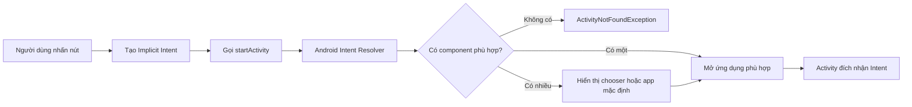
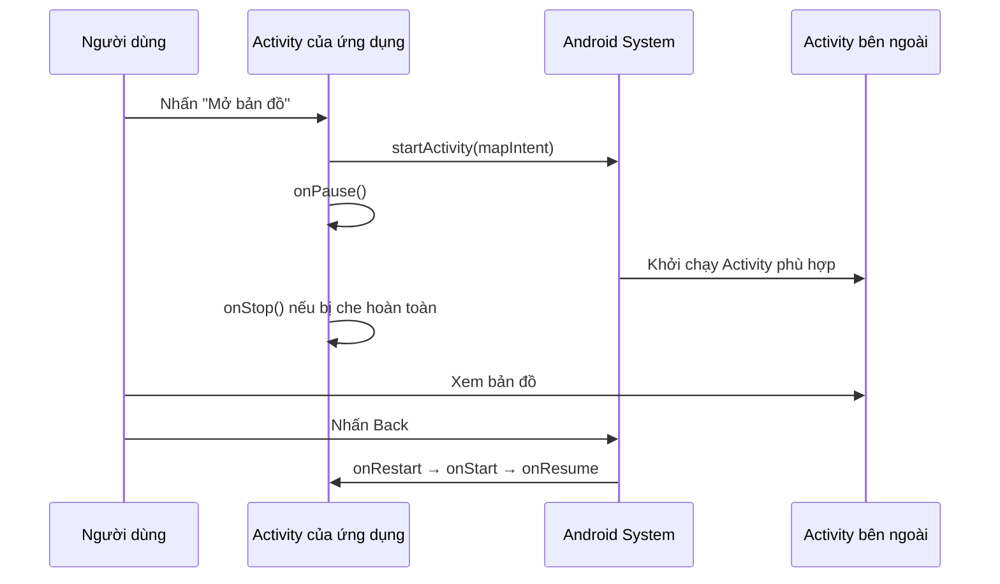

# 014 - Implicit Intents

**Học phần:** 02 - App Components and User Interface
**Module:** Module 03 - App Components
**Nhóm nội dung:** Intent
**Nguồn roadmap:** App Components / Intent
**Loại bài:** Lesson
**Thứ tự trong module:** 014
**Thời lượng gợi ý:** 24 phút

---

## 1. Tóm tắt

**Implicit Intent** — Intent ngầm định — là một yêu cầu mô tả **hành động mà ứng dụng muốn thực hiện** nhưng không chỉ định chính xác `Activity` hoặc ứng dụng nào phải xử lý yêu cầu đó.

Ví dụ, ứng dụng có thể yêu cầu:

* Mở một trang web.
* Hiển thị địa điểm trên bản đồ.
* Mở màn hình quay số.
* Chia sẻ văn bản hoặc hình ảnh.
* Chọn một tệp từ thiết bị.
* Gửi email.

Android sẽ so sánh `action`, `data` và `category` trong Intent với các `<intent-filter>` của những ứng dụng trên thiết bị. Sau đó hệ thống chọn component phù hợp hoặc hiển thị màn hình để người dùng chọn ứng dụng. ([Android Developers][1])

---

## 2. Mục tiêu học tập

Sau bài học, anh có thể:

* Giải thích được Implicit Intent bằng ngôn ngữ của mình.
* Phân biệt Implicit Intent với Explicit Intent.
* Tạo Implicit Intent bằng Kotlin.
* Sử dụng các action phổ biến như `ACTION_VIEW`, `ACTION_DIAL` và `ACTION_SEND`.
* Xử lý trường hợp thiết bị không có ứng dụng phù hợp.
* Sử dụng Android Sharesheet thông qua `Intent.createChooser()`.
* Khai báo `<intent-filter>` để ứng dụng nhận Intent từ ứng dụng khác.
* Hiểu ảnh hưởng của Intent đối với lifecycle và UI state.
* Nhận biết rủi ro bảo mật khi truyền dữ liệu nhạy cảm.
* Viết kiểm thử cho Intent bằng Espresso-Intents.

---

## 3. Ghi chú 5 dòng

> 1. Implicit Intent mô tả hành động cần thực hiện nhưng không chỉ định component cụ thể.
> 2. Android tìm ứng dụng phù hợp dựa trên `action`, `data` và `category`.
> 3. Nếu có nhiều ứng dụng phù hợp, người dùng có thể được yêu cầu chọn một ứng dụng.
> 4. Nếu không có ứng dụng xử lý Intent, `startActivity()` có thể ném `ActivityNotFoundException`.
> 5. Không nên đưa token, mật khẩu hoặc dữ liệu riêng tư vào một Implicit Intent không được giới hạn đích đến.

---

## 4. Hình ảnh minh họa

### 4.1. Luồng xử lý Implicit Intent


*Nguồn ảnh: [Android Developers — Intents and intent filters](https://developer.android.com/guide/components/intents-filters)*

Trong luồng trên:

1. `Activity A` tạo một Intent mô tả hành động.
2. `Activity A` gọi `startActivity(intent)`.
3. Android tìm các component có `<intent-filter>` phù hợp.
4. Component được chọn nhận Intent trong quá trình khởi tạo `Activity`. ([Android Developers][1])

### 4.2. Màn hình chọn ứng dụng


*Nguồn ảnh: [Android Developers — Let other apps start your activity](https://developer.android.com/training/basics/intents/filters)*

Đây là hình minh họa giao diện chooser truyền thống. Giao diện thực tế có thể khác tùy phiên bản Android và nhà sản xuất thiết bị.

---

## 5. Implicit Intent hoạt động như thế nào?

Một Implicit Intent thường chứa ba thành phần chính:

| Thành phần | Ý nghĩa                           | Ví dụ                               |
| ---------- | --------------------------------- | ----------------------------------- |
| `action`   | Hành động cần thực hiện           | `Intent.ACTION_VIEW`                |
| `data`     | Dữ liệu mà hành động tác động tới | `https://...`, `tel:...`, `geo:...` |
| `category` | Ngữ cảnh hoặc đặc điểm bổ sung    | `CATEGORY_BROWSABLE`                |
| `type`     | MIME type của dữ liệu             | `text/plain`, `image/*`             |
| `extras`   | Dữ liệu bổ sung dạng key-value    | `EXTRA_TEXT`, `EXTRA_SUBJECT`       |

Android thực hiện Intent Resolution bằng cách so sánh `action`, dữ liệu URI hoặc MIME type và `category` với các intent filter đã được đăng ký. Component phải thỏa mãn các điều kiện tương ứng mới có thể nhận Intent. ([Android Developers][1])



---

## 6. So sánh Explicit Intent và Implicit Intent

| Tiêu chí                 | Explicit Intent                            | Implicit Intent                     |
| ------------------------ | ------------------------------------------ | ----------------------------------- |
| Component đích           | Được chỉ định rõ                           | Không chỉ định cụ thể               |
| Cách tạo phổ biến        | `Intent(this, DetailActivity::class.java)` | `Intent(ACTION_VIEW, uri)`          |
| Phạm vi thường dùng      | Điều hướng trong cùng ứng dụng             | Tương tác với ứng dụng khác         |
| Ai chọn component?       | Lập trình viên                             | Android hoặc người dùng             |
| Nguy cơ không có handler | Thấp nếu component tồn tại                 | Có thể xảy ra                       |
| Nguy cơ bị chặn dữ liệu  | Thấp hơn                                   | Cao hơn nếu truyền dữ liệu nhạy cảm |
| Ví dụ                    | Mở `ProfileActivity`                       | Mở trình duyệt, bản đồ, điện thoại  |

### Explicit Intent

```kotlin
val intent = Intent(this, DetailActivity::class.java)
startActivity(intent)
```

### Implicit Intent

```kotlin
val intent = Intent(
    Intent.ACTION_VIEW,
    Uri.parse("https://developer.android.com")
)

startActivity(intent)
```

---

## 7. Ví dụ thực hành: ứng dụng Intent Hub

Ứng dụng nhỏ gồm bốn nút:

* Mở trang web.
* Mở địa điểm trên bản đồ.
* Mở màn hình quay số.
* Chia sẻ thông tin ứng dụng.

### 7.1. Giao diện XML

```xml
<?xml version="1.0" encoding="utf-8"?>
<LinearLayout
    xmlns:android="http://schemas.android.com/apk/res/android"
    android:layout_width="match_parent"
    android:layout_height="match_parent"
    android:orientation="vertical"
    android:padding="24dp">

    <Button
        android:id="@+id/btnWebsite"
        android:layout_width="match_parent"
        android:layout_height="wrap_content"
        android:text="Mở trang Android Developers" />

    <Button
        android:id="@+id/btnMap"
        android:layout_width="match_parent"
        android:layout_height="wrap_content"
        android:layout_marginTop="12dp"
        android:text="Mở bản đồ" />

    <Button
        android:id="@+id/btnDial"
        android:layout_width="match_parent"
        android:layout_height="wrap_content"
        android:layout_marginTop="12dp"
        android:text="Mở màn hình gọi điện" />

    <Button
        android:id="@+id/btnShare"
        android:layout_width="match_parent"
        android:layout_height="wrap_content"
        android:layout_marginTop="12dp"
        android:text="Chia sẻ ứng dụng" />

</LinearLayout>
```

---

## 8. Hàm mở Intent an toàn

Một lỗi phổ biến là gọi trực tiếp `startActivity()` mà không xử lý trường hợp thiết bị không có ứng dụng nhận Intent.

```kotlin
import android.content.ActivityNotFoundException
import android.content.Intent
import android.widget.Toast
import androidx.appcompat.app.AppCompatActivity

fun AppCompatActivity.launchIntentSafely(
    intent: Intent,
    unavailableMessage: String
) {
    try {
        startActivity(intent)
    } catch (exception: ActivityNotFoundException) {
        Toast.makeText(
            this,
            unavailableMessage,
            Toast.LENGTH_LONG
        ).show()
    }
}
```

Đối với ứng dụng target Android 11 trở lên, cách đơn giản là thử gọi `startActivity()` rồi bắt `ActivityNotFoundException`. Việc khởi chạy Activity của ứng dụng khác không bắt buộc ứng dụng đích phải xuất hiện trong kết quả package visibility. Tuy nhiên, nếu giao diện cần kiểm tra trước bằng `resolveActivity()` hoặc `queryIntentActivities()`, ứng dụng có thể phải khai báo `<queries>` phù hợp trong manifest. ([Android Developers][2])

---

## 9. Mở một trang web

```kotlin
private fun openWebsite() {
    val websiteUri = Uri.parse("https://developer.android.com")

    val websiteIntent = Intent(
        Intent.ACTION_VIEW,
        websiteUri
    )

    launchIntentSafely(
        intent = websiteIntent,
        unavailableMessage = "Không tìm thấy ứng dụng mở liên kết."
    )
}
```

`ACTION_VIEW` yêu cầu một ứng dụng hiển thị dữ liệu tại URI. Với URI `https`, ứng dụng xử lý có thể là trình duyệt hoặc một ứng dụng đã đăng ký deep link tương ứng. ([Android Developers][2])

---

## 10. Hiển thị địa điểm trên bản đồ

```kotlin
private fun openMap() {
    val placeName = "Đại học Bách khoa Hà Nội"

    val mapUri = Uri.parse(
        "geo:0,0?q=${Uri.encode(placeName)}"
    )

    val mapIntent = Intent(
        Intent.ACTION_VIEW,
        mapUri
    )

    launchIntentSafely(
        intent = mapIntent,
        unavailableMessage = "Thiết bị chưa có ứng dụng bản đồ phù hợp."
    )
}
```

Cấu trúc URI:

```text
geo:latitude,longitude
```

Hoặc tìm kiếm theo tên:

```text
geo:0,0?q=TÊN_ĐỊA_ĐIỂM
```

Android Developers sử dụng `ACTION_VIEW` kết hợp với URI `geo:` làm mẫu để yêu cầu ứng dụng bản đồ hiển thị một vị trí. ([Android Developers][3])

---

## 11. Mở màn hình quay số

```kotlin
private fun openDialer() {
    val phoneUri = Uri.parse("tel:+84123456789")

    val dialIntent = Intent(
        Intent.ACTION_DIAL,
        phoneUri
    )

    launchIntentSafely(
        intent = dialIntent,
        unavailableMessage = "Không tìm thấy ứng dụng điện thoại."
    )
}
```

### Vì sao nên dùng `ACTION_DIAL`?

`ACTION_DIAL` chỉ mở màn hình quay số và điền sẵn số điện thoại. Người dùng vẫn phải chủ động nhấn nút gọi.

Không nên dùng `ACTION_CALL` nếu tính năng chỉ cần mở dialer, vì `ACTION_CALL` thực hiện cuộc gọi trực tiếp và yêu cầu quyền nhạy cảm:

```xml
<uses-permission android:name="android.permission.CALL_PHONE" />
```

Quy tắc thiết kế tốt là chỉ yêu cầu quyền khi tính năng thực sự cần quyền đó.

---

## 12. Chia sẻ văn bản bằng Android Sharesheet

```kotlin
private fun shareApp() {
    val sendIntent = Intent(Intent.ACTION_SEND).apply {
        type = "text/plain"

        putExtra(
            Intent.EXTRA_SUBJECT,
            "Intent Hub"
        )

        putExtra(
            Intent.EXTRA_TEXT,
            """
            Hãy xem ứng dụng Intent Hub:
            https://example.com/intent-hub
            """.trimIndent()
        )
    }

    val chooserIntent = Intent.createChooser(
        sendIntent,
        "Chia sẻ bằng"
    )

    launchIntentSafely(
        intent = chooserIntent,
        unavailableMessage = "Không có ứng dụng chia sẻ phù hợp."
    )
}
```

`Intent.createChooser()` yêu cầu Android hiển thị Sharesheet để người dùng chọn nơi nhận nội dung. Khi có nhiều ứng dụng xử lý một implicit intent, Android cũng có thể hiển thị hộp thoại chọn ứng dụng. ([Android Developers][4])

### Không nên ép người dùng dùng một ứng dụng cụ thể

```kotlin
// Hạn chế UX và có thể lỗi nếu ứng dụng này chưa được cài đặt.
sendIntent.setPackage("com.example.socialapp")
```

Chỉ sử dụng `setPackage()` khi sản phẩm thật sự yêu cầu tích hợp với một ứng dụng xác định.

---

## 13. Kết nối các nút trong `MainActivity`

```kotlin
import android.os.Bundle
import android.widget.Button
import androidx.appcompat.app.AppCompatActivity

class MainActivity : AppCompatActivity() {

    override fun onCreate(savedInstanceState: Bundle?) {
        super.onCreate(savedInstanceState)
        setContentView(R.layout.activity_main)

        findViewById<Button>(R.id.btnWebsite)
            .setOnClickListener {
                openWebsite()
            }

        findViewById<Button>(R.id.btnMap)
            .setOnClickListener {
                openMap()
            }

        findViewById<Button>(R.id.btnDial)
            .setOnClickListener {
                openDialer()
            }

        findViewById<Button>(R.id.btnShare)
            .setOnClickListener {
                shareApp()
            }
    }
}
```

---

## 14. Cho phép ứng dụng nhận Implicit Intent

Ứng dụng không chỉ gửi Intent mà còn có thể đăng ký để nhận Intent từ ứng dụng khác.

Ví dụ: cho phép ứng dụng nhận văn bản được chia sẻ.

### 14.1. Khai báo trong `AndroidManifest.xml`

```xml
<application
    ...>

    <activity
        android:name=".ReceiveTextActivity"
        android:exported="true">

        <intent-filter>
            <action android:name="android.intent.action.SEND" />

            <category
                android:name="android.intent.category.DEFAULT" />

            <data
                android:mimeType="text/plain" />
        </intent-filter>

    </activity>

</application>
```

Ba điều kiện của filter:

```text
Action   = android.intent.action.SEND
Category = android.intent.category.DEFAULT
Data     = text/plain
```

Một Activity muốn nhận Implicit Intent từ `startActivity()` cần có `CATEGORY_DEFAULT`. Component có intent filter cũng phải khai báo rõ `android:exported`; khi muốn nhận yêu cầu từ ứng dụng khác, component đó phải được export có chủ đích. ([Android Developers][1])

### 14.2. Đọc dữ liệu trong Activity

```kotlin
import android.content.Intent
import android.os.Bundle
import android.widget.TextView
import androidx.appcompat.app.AppCompatActivity

class ReceiveTextActivity : AppCompatActivity() {

    override fun onCreate(savedInstanceState: Bundle?) {
        super.onCreate(savedInstanceState)
        setContentView(R.layout.activity_receive_text)

        handleIncomingIntent(intent)
    }

    private fun handleIncomingIntent(incomingIntent: Intent?) {
        val isSupportedIntent =
            incomingIntent?.action == Intent.ACTION_SEND &&
            incomingIntent.type == "text/plain"

        if (!isSupportedIntent) {
            finish()
            return
        }

        val sharedText = incomingIntent
            ?.getStringExtra(Intent.EXTRA_TEXT)
            ?.take(MAX_TEXT_LENGTH)
            .orEmpty()

        findViewById<TextView>(R.id.tvSharedText).text =
            sharedText.ifBlank {
                "Không có nội dung được chia sẻ."
            }
    }

    companion object {
        private const val MAX_TEXT_LENGTH = 10_000
    }
}
```

### Nguyên tắc quan trọng

Dữ liệu từ Intent bên ngoài phải được xem là **dữ liệu không đáng tin cậy**:

* Kiểm tra `action`.
* Kiểm tra MIME type.
* Kiểm tra URI scheme và host.
* Giới hạn độ dài chuỗi.
* Không thực thi trực tiếp lệnh nhận từ extra.
* Không mở file tùy ý mà chưa kiểm tra quyền và MIME type.
* Không tin rằng extra luôn tồn tại hoặc có đúng kiểu dữ liệu.

---

## 15. Quan hệ với Activity Lifecycle

Khi ứng dụng mở một Activity bên ngoài:



Khi Activity khác xuất hiện phía trên, Activity hiện tại thường đi vào `onPause()` và có thể tiếp tục sang `onStop()` nếu không còn hiển thị. Trong thời gian ở background, process của ứng dụng cũng có khả năng bị hệ thống thu hồi. ([Android Developers][5])

### Không nên

```kotlin
override fun onPause() {
    super.onPause()

    // Không nên thực hiện network request hoặc transaction dài ở đây.
    uploadLargeFile()
}
```

`onPause()` có thời gian thực thi ngắn và không phù hợp với network request, database transaction hoặc công việc lưu trữ nặng. ([Android Developers][5])

### Nên lưu state nào?

| Dữ liệu                | Vị trí phù hợp                                     |
| ---------------------- | -------------------------------------------------- |
| Nội dung ô tìm kiếm    | `SavedStateHandle` hoặc saved instance state       |
| Dữ liệu từ database    | Repository hoặc database                           |
| Trạng thái tải dữ liệu | ViewModel                                          |
| ID đối tượng đang xem  | `SavedStateHandle`                                 |
| Token đăng nhập        | Storage bảo mật, không đặt trong Implicit Intent   |
| Dữ liệu lớn            | Database hoặc file, không lưu toàn bộ vào `Bundle` |

Saved state có thể giúp khôi phục UI sau configuration change và system-initiated process death, nhưng chỉ nên chứa dữ liệu nhỏ cần thiết để tái tạo giao diện. ([Android Developers][6])

---

## 16. Package visibility trên Android hiện đại

Từ Android 11, kết quả truy vấn danh sách ứng dụng có thể bị giới hạn bởi package visibility.

### Trường hợp chỉ cần mở Activity

Không nhất thiết phải thêm `<queries>`:

```kotlin
try {
    startActivity(intent)
} catch (exception: ActivityNotFoundException) {
    showUnavailableMessage()
}
```

### Trường hợp cần kiểm tra trước

Ví dụ giao diện phải ẩn nút “Mở PDF” nếu không có ứng dụng phù hợp:

```xml
<manifest ...>

    <queries>
        <intent>
            <action android:name="android.intent.action.VIEW" />

            <data
                android:mimeType="application/pdf" />
        </intent>
    </queries>

    <application ... />

</manifest>
```

Sau đó mới truy vấn:

```kotlin
val canOpenPdf =
    pdfIntent.resolveActivity(packageManager) != null
```

Tài liệu Android khuyến nghị thêm intent signature trong `<queries>` khi tính năng cần biết trước một Intent có thể được xử lý hay không. ([Android Developers][2])

---

## 17. Bảo mật

### 17.1. Không truyền dữ liệu nhạy cảm tùy ý

```kotlin
// Không an toàn
Intent(Intent.ACTION_SEND).apply {
    type = "text/plain"
    putExtra(Intent.EXTRA_TEXT, "access_token=secret-token")
}
```

Một ứng dụng độc hại có thể đăng ký intent filter phù hợp để trở thành ứng dụng nhận Intent. Rủi ro này được gọi là **implicit intent hijacking**. Dữ liệu như token phiên, thông tin định danh cá nhân hoặc đối tượng có thể thay đổi không nên được đưa vào Implicit Intent không giới hạn đích đến. ([Android Developers][7])

### 17.2. Dùng Explicit Intent cho component nội bộ

```kotlin
val intent = Intent(
    this,
    InternalPaymentActivity::class.java
)

startActivity(intent)
```

Không nên dùng custom action ngầm định để mở màn hình nội bộ:

```kotlin
// Không nên dùng cho Activity nội bộ.
val intent = Intent("com.example.OPEN_PAYMENT")
startActivity(intent)
```

Với ứng dụng target Android 14 trở lên, Implicit Intent chỉ được chuyển tới exported component. Một component nội bộ có `android:exported="false"` phải được mở bằng Explicit Intent. ([Android Developers][8])

### 17.3. Không dùng Implicit Intent để khởi động Service

Service nên được khởi động bằng Explicit Intent:

```kotlin
val serviceIntent = Intent(
    this,
    SyncService::class.java
)

startService(serviceIntent)
```

Android cảnh báo rằng dùng Implicit Intent cho Service gây rủi ro vì ứng dụng không thể chắc chắn Service nào sẽ nhận yêu cầu. `bindService()` với Implicit Intent cũng bị từ chối từ Android 5.0. ([Android Developers][1])

---

## 18. Sai lầm phổ biến của lập trình viên mới

### Sai lầm 1: Không xử lý trường hợp không có ứng dụng nhận Intent

```kotlin
startActivity(Intent(Intent.ACTION_VIEW, uri))
```

Hậu quả:

```text
ActivityNotFoundException
→ ứng dụng bị crash
→ người dùng không hiểu chuyện gì xảy ra
```

Cách sửa:

```kotlin
try {
    startActivity(intent)
} catch (exception: ActivityNotFoundException) {
    Toast.makeText(
        this,
        "Không có ứng dụng phù hợp.",
        Toast.LENGTH_LONG
    ).show()
}
```

Nếu không có ứng dụng nào nhận Implicit Intent, việc gọi `startActivity()` có thể làm ứng dụng crash nếu exception không được xử lý. ([Android Developers][4])

### Sai lầm 2: MIME type quá rộng

```kotlin
shareIntent.type = "*/*"
```

MIME type quá rộng làm xuất hiện nhiều ứng dụng không liên quan.

Nên khai báo cụ thể:

```kotlin
shareIntent.type = "text/plain"
```

hoặc:

```kotlin
shareIntent.type = "image/jpeg"
```

### Sai lầm 3: Dùng URI file trực tiếp

```kotlin
intent.putExtra(
    Intent.EXTRA_STREAM,
    Uri.fromFile(file)
)
```

Khi chia sẻ file, nên dùng `content://` URI từ `FileProvider` và cấp quyền đọc tạm thời:

```kotlin
intent.addFlags(
    Intent.FLAG_GRANT_READ_URI_PERMISSION
)
```

Android yêu cầu hoặc khuyến nghị cấp quyền URI rõ ràng khi ứng dụng khác cần đọc `content://` URI được gửi qua Intent. ([Android Developers][2])

### Sai lầm 4: Tin tưởng hoàn toàn Intent nhận vào

```kotlin
val command = intent.getStringExtra("command")
executeCommand(command)
```

Thay vào đó cần whitelist hành động:

```kotlin
when (intent.getStringExtra("command")) {
    "preview" -> showPreview()
    "share" -> showShareScreen()
    else -> showUnsupportedRequest()
}
```

### Sai lầm 5: Dùng Intent để truyền dữ liệu quá lớn

Không nên truyền:

* Bitmap kích thước lớn.
* Danh sách hàng nghìn object.
* JSON nhiều megabyte.
* Nội dung toàn bộ file.

Chỉ nên truyền ID, URI hoặc dữ liệu nhỏ cần thiết:

```kotlin
intent.putExtra("document_id", documentId)
```

---

## 19. Kiểm thử Implicit Intent

Espresso-Intents có thể ghi nhận, xác thực và stub các Intent được gửi ra ngoài ứng dụng. Hai API quan trọng là:

* `intended()` để xác nhận Intent đã được gửi.
* `intending()` để giả lập phản hồi hoặc ngăn Activity thật được mở trong test. ([Android Developers][9])

### Ví dụ kiểm thử nút mở website

```kotlin
import android.app.Activity
import android.app.Instrumentation
import android.content.Intent
import android.net.Uri
import androidx.test.core.app.ActivityScenario
import androidx.test.espresso.Espresso.onView
import androidx.test.espresso.action.ViewActions.click
import androidx.test.espresso.intent.Intents
import androidx.test.espresso.intent.Intents.intended
import androidx.test.espresso.intent.Intents.intending
import androidx.test.espresso.intent.matcher.IntentMatchers.hasAction
import androidx.test.espresso.intent.matcher.IntentMatchers.hasData
import androidx.test.espresso.matcher.ViewMatchers.withId
import org.hamcrest.Matchers.allOf
import org.junit.After
import org.junit.Before
import org.junit.Test

class MainActivityIntentTest {

    @Before
    fun setUp() {
        Intents.init()
    }

    @After
    fun tearDown() {
        Intents.release()
    }

    @Test
    fun clickWebsite_sendsActionViewIntent() {
        intending(hasAction(Intent.ACTION_VIEW))
            .respondWith(
                Instrumentation.ActivityResult(
                    Activity.RESULT_OK,
                    null
                )
            )

        ActivityScenario
            .launch(MainActivity::class.java)
            .use {
                onView(withId(R.id.btnWebsite))
                    .perform(click())

                intended(
                    allOf(
                        hasAction(Intent.ACTION_VIEW),
                        hasData(
                            Uri.parse(
                                "https://developer.android.com"
                            )
                        )
                    )
                )
            }
    }
}
```

### Các trường hợp cần test

| Trường hợp                    | Kết quả mong đợi                            |
| ----------------------------- | ------------------------------------------- |
| Nhấn “Mở website”             | Gửi `ACTION_VIEW` với URI đúng              |
| Nhấn “Gọi điện”               | Gửi `ACTION_DIAL`, không phải `ACTION_CALL` |
| Nhấn “Chia sẻ”                | Gửi `ACTION_SEND` và MIME type `text/plain` |
| Không có handler              | Hiển thị thông báo, không crash             |
| Xoay màn hình                 | UI state không bị mất                       |
| Quay lại từ ứng dụng ngoài    | Màn hình tiếp tục hoạt động                 |
| Process bị tái tạo            | State quan trọng được khôi phục             |
| Intent nhận vào sai MIME type | Từ chối hoặc đóng Activity                  |
| Extra bị thiếu                | Không phát sinh `NullPointerException`      |
| Dữ liệu đầu vào quá dài       | Bị giới hạn hoặc từ chối                    |

---

## 20. Debug bằng ADB

Có thể gửi thử một Intent từ terminal.

### Mở website

```bash
adb shell am start \
  -a android.intent.action.VIEW \
  -d "https://developer.android.com"
```

### Mở bản đồ

```bash
adb shell am start \
  -a android.intent.action.VIEW \
  -d "geo:0,0?q=Ha+Noi"
```

### Gửi văn bản đến Activity đã đăng ký `ACTION_SEND`

```bash
adb shell am start \
  -a android.intent.action.SEND \
  -t "text/plain" \
  --es android.intent.extra.TEXT "Hello from ADB"
```

### Xem Activity nào có thể xử lý Intent

```bash
adb shell cmd package query-activities \
  -a android.intent.action.VIEW \
  -d "https://developer.android.com"
```

---

## 21. Ảnh hưởng đến chất lượng sản phẩm

### UX

Implicit Intent tốt giúp:

* Người dùng tiếp tục sử dụng ứng dụng quen thuộc.
* Không cần xây dựng lại trình duyệt, bản đồ hoặc ứng dụng gọi điện.
* Giảm số quyền mà ứng dụng phải yêu cầu.
* Tạo trải nghiệm chia sẻ nhất quán với Android.

UX kém xảy ra khi:

* Nút bấm không phản hồi.
* Ứng dụng crash vì không có handler.
* Chooser hiển thị quá nhiều ứng dụng không liên quan.
* Người dùng bị ép cài một ứng dụng cụ thể.
* State bị mất khi quay lại từ ứng dụng ngoài.

### Reliability

Cần bảo vệ bằng:

```text
try/catch ActivityNotFoundException
+ MIME type chính xác
+ URI hợp lệ
+ kiểm tra Intent nhận vào
+ test lifecycle
+ test process recreation
```

### Maintainability

Nên gom logic Intent vào một lớp riêng:

```kotlin
class ExternalNavigator(
    private val activity: AppCompatActivity
) {

    fun openUrl(url: String) {
        val intent = Intent(
            Intent.ACTION_VIEW,
            Uri.parse(url)
        )

        activity.launchIntentSafely(
            intent,
            "Không thể mở liên kết."
        )
    }

    fun dial(phoneNumber: String) {
        val intent = Intent(
            Intent.ACTION_DIAL,
            Uri.parse("tel:$phoneNumber")
        )

        activity.launchIntentSafely(
            intent,
            "Không thể mở ứng dụng điện thoại."
        )
    }
}
```

UI không cần biết chi tiết cách xây dựng Intent:

```kotlin
externalNavigator.openUrl(
    "https://developer.android.com"
)
```

---

## 22. Bài thực hành 24 phút

### Phút 0–5: Hiểu khái niệm

Viết lại bằng lời của anh:

```text
Implicit Intent là...
Android chọn ứng dụng bằng...
Intent thường chứa...
```

### Phút 5–12: Mở ứng dụng bên ngoài

Tạo ba nút:

```text
Mở website
Mở bản đồ
Mở dialer
```

### Phút 12–17: Thêm tính năng chia sẻ

Sử dụng:

```kotlin
Intent.ACTION_SEND
Intent.EXTRA_TEXT
Intent.createChooser()
```

### Phút 17–21: Xử lý lỗi

Bắt:

```kotlin
ActivityNotFoundException
```

Hiển thị Toast hoặc Snackbar có nội dung dễ hiểu.

### Phút 21–24: Kiểm thử và README

Chụp:

* Màn hình chính.
* Trình duyệt hoặc bản đồ được mở.
* Android Sharesheet.
* Thông báo fallback.

---

## 23. Bài tập

### Bài tập 1: Contact Card

Tạo ứng dụng hiển thị:

```text
Tên
Số điện thoại
Email
Website
Địa chỉ
```

Các nút:

```text
Gọi điện
Gửi email
Mở website
Xem bản đồ
Chia sẻ liên hệ
```

### Bài tập 2: Nhận nội dung chia sẻ

Tạo `ReceiveTextActivity` có thể nhận:

```text
ACTION_SEND
MIME type: text/plain
```

Hiển thị nội dung nhận được trong `TextView`.

### Bài tập 3: Xử lý đầu vào không hợp lệ

Kiểm tra các trường hợp:

```text
Intent không có action
Sai MIME type
Không có EXTRA_TEXT
Chuỗi quá dài
Chuỗi chỉ chứa khoảng trắng
```

### Bài tập 4: Test tự động

Viết ít nhất hai test:

```text
clickWebsite_sendsCorrectViewIntent
clickDial_sendsDialIntentWithCorrectPhoneNumber
```

---

## 24. Artifact đưa vào portfolio

### Tên dự án

```text
Intent Hub — Android Inter-App Communication Demo
```

### Tính năng

* Mở website.
* Mở bản đồ.
* Mở dialer.
* Chia sẻ văn bản.
* Nhận văn bản từ ứng dụng khác.
* Xử lý khi không có ứng dụng phù hợp.
* Espresso test cho outgoing Intent.
* Validation cho incoming Intent.

### Cấu trúc README

```markdown
# Intent Hub

## Giới thiệu

Ứng dụng minh họa cách Android giao tiếp giữa các ứng dụng
bằng Implicit Intent.

## Tính năng

- Open website
- Open map
- Open dialer
- Share text
- Receive shared text
- Handle ActivityNotFoundException

## Kiến thức áp dụng

- Intent actions
- URI schemes
- MIME types
- Intent filters
- Android Sharesheet
- Activity lifecycle
- Espresso-Intents
- Intent security

## Screenshots

Chèn ảnh màn hình ứng dụng tại đây.

## Kiểm thử

Mô tả các test cho ACTION_VIEW, ACTION_DIAL và ACTION_SEND.

## Bài học rút ra

Không được giả định thiết bị luôn có ứng dụng xử lý Intent và
không được tin tưởng dữ liệu nhận từ ứng dụng bên ngoài.
```

---

## 25. Checklist hoàn thành

### Khái niệm

* [ ] Giải thích được Implicit Intent.
* [ ] Phân biệt được Explicit Intent và Implicit Intent.
* [ ] Hiểu `action`, `data`, `category`, MIME type và extras.
* [ ] Hiểu cách Android thực hiện Intent Resolution.

### Code

* [ ] Mở được website bằng `ACTION_VIEW`.
* [ ] Mở được bản đồ bằng URI `geo:`.
* [ ] Mở được dialer bằng `ACTION_DIAL`.
* [ ] Chia sẻ được văn bản bằng `ACTION_SEND`.
* [ ] Sử dụng `Intent.createChooser()`.
* [ ] Xử lý `ActivityNotFoundException`.

### Receiving Intent

* [ ] Khai báo `<intent-filter>`.
* [ ] Khai báo `CATEGORY_DEFAULT`.
* [ ] Thiết lập `android:exported` có chủ đích.
* [ ] Kiểm tra action và MIME type.
* [ ] Xử lý trường hợp extra bị thiếu.
* [ ] Giới hạn dữ liệu đầu vào.

### Lifecycle và state

* [ ] Kiểm tra khi quay lại từ ứng dụng bên ngoài.
* [ ] Kiểm tra xoay màn hình.
* [ ] Kiểm tra background/foreground.
* [ ] Không thực hiện công việc nặng trong `onPause()`.
* [ ] State quan trọng có thể được khôi phục.

### Security

* [ ] Không truyền token hoặc mật khẩu qua Implicit Intent.
* [ ] Dùng Explicit Intent cho component nội bộ.
* [ ] Không dùng Implicit Intent để khởi động Service.
* [ ] Dùng `content://` URI khi chia sẻ file.
* [ ] Cấp quyền URI tối thiểu cần thiết.

### Portfolio

* [ ] Có README.
* [ ] Có sơ đồ Intent Resolution.
* [ ] Có screenshot Android Sharesheet.
* [ ] Có ít nhất hai Espresso Intent test.
* [ ] Có ghi chú về UX, lifecycle và security.

---

## 26. Câu hỏi ôn tập

1. Vì sao `Intent(Intent.ACTION_VIEW, uri)` là Implicit Intent?
2. Android dựa trên những thành phần nào để tìm Activity phù hợp?
3. Điều gì xảy ra khi không có ứng dụng nào xử lý Intent?
4. Khi nào cần sử dụng `Intent.createChooser()`?
5. Vì sao nên dùng `ACTION_DIAL` thay cho `ACTION_CALL`?
6. Vì sao Activity nhận Implicit Intent cần `CATEGORY_DEFAULT`?
7. Khi nào cần khai báo `<queries>`?
8. Vì sao không nên truyền access token qua `ACTION_SEND`?
9. Activity hiện tại có thể nhận những lifecycle callback nào khi mở ứng dụng khác?
10. Espresso-Intents dùng `intended()` và `intending()` để làm gì?

---

## 27. Kết luận

Implicit Intent là cơ chế quan trọng giúp ứng dụng Android sử dụng khả năng của hệ điều hành và các ứng dụng khác mà không phải tự xây dựng lại mọi tính năng.

Một implementation production-ready không chỉ dừng ở:

```kotlin
startActivity(intent)
```

Mà cần đầy đủ:

```text
Action và URI chính xác
→ MIME type cụ thể
→ chooser phù hợp
→ xử lý ActivityNotFoundException
→ bảo vệ lifecycle và state
→ kiểm tra dữ liệu nhận vào
→ tránh truyền dữ liệu nhạy cảm
→ kiểm thử outgoing và incoming Intent
```

> **Nguyên tắc ghi nhớ:** dùng Implicit Intent khi anh quan tâm đến **hành động cần thực hiện**; dùng Explicit Intent khi anh quan tâm đến **component chính xác phải thực hiện hành động đó**.

[1]: https://developer.android.com/guide/components/intents-filters "Intents and intent filters  |  App architecture  |  Android Developers"
[2]: https://developer.android.com/training/package-visibility/use-cases "Fulfill common use cases while having limited package visibility  |  App architecture  |  Android Developers"
[3]: https://developer.android.com/training/basics/intents/sending "Sending the user to another app  |  App architecture  |  Android Developers"
[4]: https://developer.android.com/guide/components/intents-common "Common intents  |  App architecture  |  Android Developers"
[5]: https://developer.android.com/guide/components/activities/activity-lifecycle?utm_source=chatgpt.com "The activity lifecycle  |  App architecture  |  Android Developers"
[6]: https://developer.android.com/topic/libraries/architecture/views/saving-states-views?utm_source=chatgpt.com "Save UI states (Views)  |  Android Developers"
[7]: https://developer.android.com/privacy-and-security/risks/implicit-intent-hijacking "Implicit intent hijacking  |  Security  |  Android Developers"
[8]: https://developer.android.com/about/versions/14/behavior-changes-14 "Behavior changes: Apps targeting Android 14 or higher  |  Android Developers"
[9]: https://developer.android.com/training/testing/espresso/intents?hl=en&utm_source=chatgpt.com "Espresso-Intents  |  Test your app on Android  |  Android Developers"

---

# Bài luyện tập

## Mục tiêu


## Đề bài


## Yêu cầu hoàn thành

- [ ] 
- [ ] 
- [ ] 

## Kết quả / lời giải


## Ghi chú
