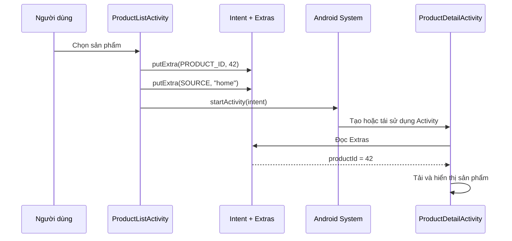
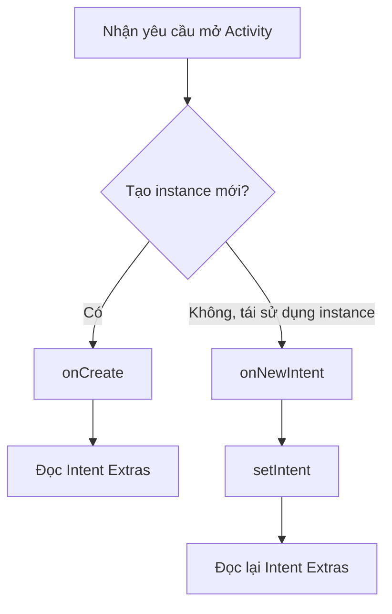
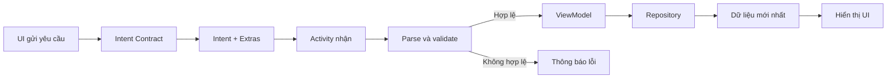

# 015 - Intent Extras

> **Học phần:** 02 - App Components and User Interface
> **Module:** Module 03 - App Components
> **Nhóm nội dung:** Intent
> **Nguồn roadmap:** App Components / Intent
> **Loại bài:** Lesson
> **Thứ tự trong module:** 015
> **Thời lượng gợi ý:** 24 phút

---

## 1. Tóm tắt

**Intent Extras** là cơ chế đính kèm dữ liệu vào một `Intent` dưới dạng các cặp **key–value**. Nhờ đó, một Android component có thể gửi dữ liệu cho component khác, chẳng hạn:

* Gửi `productId` từ màn hình danh sách sang màn hình chi tiết.
* Gửi nội dung văn bản sang ứng dụng nhắn tin.
* Truyền chế độ hiển thị, nguồn điều hướng hoặc bộ lọc ban đầu.
* Trả kết quả từ một Activity về Activity gọi nó.

Extras không quyết định component nào sẽ xử lý Intent. Chúng chỉ mang thêm dữ liệu để component nhận biết phải thực hiện công việc như thế nào. Android cung cấp các hàm `putExtra()`, `getStringExtra()`, `getIntExtra()` và `putExtras()` để ghi hoặc đọc dữ liệu này.

---

## 2. Mục tiêu học tập

Sau bài học, anh có thể:

* Giải thích được Intent Extras bằng ngôn ngữ của mình.
* Phân biệt `action`, `data` và `extras` trong một Intent.
* Truyền dữ liệu giữa hai Activity bằng Kotlin.
* Thiết kế key rõ ràng, tránh sai kiểu và thiếu dữ liệu.
* Biết khi nào nên gửi giá trị đơn giản, `Bundle`, `Parcelable` hoặc chỉ gửi ID.
* Xử lý Extras khi Activity được tái sử dụng qua `onNewIntent()`.
* Viết test kiểm tra Intent được tạo đúng.
* Nhận diện các rủi ro về kích thước dữ liệu, bảo mật và lifecycle.

---

## 3. Hình minh họa


*Hình: Activity A tạo Intent, Android chuyển Intent đến Activity B. Dữ liệu Extras được mang bên trong Intent này. Nguồn: Android Developers.*

Ví dụ thực tế của Extras là Android Sharesheet. Nội dung cần chia sẻ thường được đặt trong `Intent.EXTRA_TEXT`, `Intent.EXTRA_STREAM`, `Intent.EXTRA_SUBJECT` hoặc các key chuẩn khác.


*Nguồn: Android Developers.*

---

## 4. Intent Extras là gì?

Một Intent thường có thể chứa:

| Thành phần | Vai trò                              | Ví dụ                        |
| ---------- | ------------------------------------ | ---------------------------- |
| Component  | Chỉ định component cụ thể            | `DetailActivity::class.java` |
| Action     | Mô tả hành động cần thực hiện        | `Intent.ACTION_SEND`         |
| Data       | URI hoặc dữ liệu chính của hành động | `https://example.com`        |
| Type       | MIME type của dữ liệu                | `text/plain`                 |
| Category   | Bổ sung điều kiện xử lý Intent       | `CATEGORY_BROWSABLE`         |
| Extras     | Tham số bổ sung dạng key–value       | `product_id = 42`            |
| Flags      | Điều khiển task và cách mở component | `FLAG_ACTIVITY_SINGLE_TOP`   |

Ví dụ:

```kotlin
val intent = Intent(this, ProductDetailActivity::class.java).apply {
    putExtra("product_id", 42L)
    putExtra("opened_from", "home")
    putExtra("show_promotion", true)
}

startActivity(intent)
```

Trong Intent trên:

```text
Component  = ProductDetailActivity
Extras     = {
    "product_id"    : 42,
    "opened_from"   : "home",
    "show_promotion": true
}
```

---

## 5. Sơ đồ hoạt động



Có thể hiểu đơn giản:

```text
Màn hình gửi
      │
      │  Intent
      │  ├── Component
      │  ├── Action
      │  └── Extras
      │       ├── product_id = 42
      │       └── source = "home"
      ▼
Màn hình nhận
```

---

## 6. Các kiểu dữ liệu thường dùng

`Intent.putExtra()` có nhiều phiên bản hỗ trợ những kiểu dữ liệu khác nhau.

| Nhóm             | Ví dụ                                       |
| ---------------- | ------------------------------------------- |
| Primitive        | `Int`, `Long`, `Boolean`, `Double`, `Float` |
| Văn bản          | `String`, `CharSequence`                    |
| Mảng             | `IntArray`, `LongArray`, `Array<String>`    |
| Danh sách hỗ trợ | `ArrayList<String>`, `ArrayList<Int>`       |
| Android object   | `Bundle`, `Parcelable`                      |
| Java object      | `Serializable`                              |

Ví dụ:

```kotlin
intent.putExtra(EXTRA_NAME, "Android")
intent.putExtra(EXTRA_SCORE, 95)
intent.putExtra(EXTRA_IS_PREMIUM, true)
intent.putExtra(EXTRA_TAGS, arrayOf("Kotlin", "Intent", "Activity"))
```

### Nguyên tắc lựa chọn

Ưu tiên theo thứ tự:

1. Primitive hoặc `String`.
2. ID dùng để tải dữ liệu từ repository.
3. `Bundle` cho một nhóm tham số nhỏ.
4. `Parcelable` cho object nhỏ dùng nội bộ ứng dụng.
5. Hạn chế `Serializable` trong luồng Android thông thường.

Android khuyến nghị dữ liệu trong Intent chỉ nên có kích thước vài KB. Binder có buffer giới hạn dùng chung cho các giao dịch của process; dữ liệu quá lớn có thể gây `TransactionTooLargeException`.

---

## 7. Ví dụ hoàn chỉnh: mở màn hình chi tiết sản phẩm

### 7.1. Tạo contract cho Intent

Không nên đặt chuỗi key rải rác khắp codebase. Hãy gom việc tạo và đọc Intent vào một contract.

```kotlin
package com.example.shop.navigation

import android.content.Context
import android.content.Intent
import com.example.shop.ui.ProductDetailActivity

data class ProductDetailArgs(
    val productId: Long,
    val source: String?
)

object ProductDetailContract {

    private const val EXTRA_PRODUCT_ID =
        "com.example.shop.extra.PRODUCT_ID"

    private const val EXTRA_SOURCE =
        "com.example.shop.extra.SOURCE"

    fun createIntent(
        context: Context,
        productId: Long,
        source: String? = null
    ): Intent {
        require(productId > 0) {
            "productId must be greater than 0"
        }

        return Intent(context, ProductDetailActivity::class.java).apply {
            putExtra(EXTRA_PRODUCT_ID, productId)
            putExtra(EXTRA_SOURCE, source)
        }
    }

    fun parse(intent: Intent): ProductDetailArgs? {
        val productId = intent.getLongExtra(
            EXTRA_PRODUCT_ID,
            INVALID_PRODUCT_ID
        )

        if (productId == INVALID_PRODUCT_ID) {
            return null
        }

        return ProductDetailArgs(
            productId = productId,
            source = intent.getStringExtra(EXTRA_SOURCE)
        )
    }

    private const val INVALID_PRODUCT_ID = -1L
}
```

Sử dụng package name làm tiền tố cho custom key giúp giảm nguy cơ trùng tên, đặc biệt khi Intent có thể được gửi hoặc nhận giữa nhiều ứng dụng. Đây cũng là cách được tài liệu Android khuyến nghị cho custom extras.

---

### 7.2. Gửi Intent

```kotlin
val productId = 42L

val detailIntent = ProductDetailContract.createIntent(
    context = this,
    productId = productId,
    source = "home_recommendation"
)

startActivity(detailIntent)
```

---

### 7.3. Nhận và kiểm tra Extras

```kotlin
package com.example.shop.ui

import android.content.Intent
import android.os.Bundle
import android.widget.Toast
import androidx.appcompat.app.AppCompatActivity
import com.example.shop.navigation.ProductDetailContract

class ProductDetailActivity : AppCompatActivity() {

    override fun onCreate(savedInstanceState: Bundle?) {
        super.onCreate(savedInstanceState)
        setContentView(R.layout.activity_product_detail)

        handleIntent(intent)
    }

    private fun handleIntent(receivedIntent: Intent) {
        val args = ProductDetailContract.parse(receivedIntent)

        if (args == null) {
            Toast.makeText(
                this,
                "Không tìm thấy sản phẩm.",
                Toast.LENGTH_SHORT
            ).show()

            finish()
            return
        }

        loadProduct(
            productId = args.productId,
            source = args.source
        )
    }

    private fun loadProduct(
        productId: Long,
        source: String?
    ) {
        // ViewModel hoặc repository tải sản phẩm bằng productId.
    }
}
```

Điểm quan trọng là Activity không dùng `!!` để ép Extras phải tồn tại. Dữ liệu đầu vào được kiểm tra trước khi tiếp tục user flow.

---

## 8. Required Extras và Optional Extras

Không phải Extra nào cũng có mức độ quan trọng giống nhau.

### Required Extra

Thiếu dữ liệu thì màn hình không thể hoạt động.

```kotlin
val productId = intent.getLongExtra(EXTRA_PRODUCT_ID, -1L)

if (productId <= 0) {
    showInvalidInputError()
    finish()
    return
}
```

### Optional Extra

Có thể sử dụng giá trị mặc định.

```kotlin
val openedFrom = intent.getStringExtra(EXTRA_SOURCE) ?: "unknown"

val showPromotion = intent.getBooleanExtra(
    EXTRA_SHOW_PROMOTION,
    false
)
```

### Quy ước nên có trong team

```text
Required Extra
├── Phải được kiểm tra
├── Không hợp lệ → thông báo hoặc kết thúc flow
└── Có test cho trường hợp thiếu

Optional Extra
├── Có giá trị mặc định
├── Không được làm app crash
└── Có thể thiếu khi app được mở từ nguồn khác
```

---

## 9. Dùng Bundle để nhóm nhiều Extras

Có thể tạo một `Bundle` rồi đưa toàn bộ vào Intent:

```kotlin
val extras = Bundle().apply {
    putLong("product_id", 42L)
    putString("source", "search")
    putBoolean("show_promotion", true)
}

val intent = Intent(
    this,
    ProductDetailActivity::class.java
).apply {
    putExtras(extras)
}

startActivity(intent)
```

Đọc dữ liệu:

```kotlin
val extras = intent.extras

val productId = extras?.getLong(
    "product_id",
    -1L
) ?: -1L
```

`Bundle` phù hợp khi cần truyền một nhóm tham số nhỏ, nhưng không nên biến Bundle thành nơi chứa toàn bộ model hoặc dữ liệu lớn.

---

## 10. Truyền object bằng Parcelable

Khi thật sự cần truyền một object nhỏ giữa các Activity trong cùng ứng dụng, có thể dùng `Parcelable`.

### Cấu hình plugin

```kotlin
plugins {
    id("kotlin-parcelize")
}
```

### Tạo model

```kotlin
import android.os.Parcelable
import kotlinx.parcelize.Parcelize

@Parcelize
data class ProductPreview(
    val id: Long,
    val name: String,
    val price: Long
) : Parcelable
```

### Gửi object

```kotlin
val preview = ProductPreview(
    id = 42L,
    name = "Android Course",
    price = 299_000L
)

val intent = Intent(
    this,
    ProductDetailActivity::class.java
).apply {
    putExtra(EXTRA_PRODUCT, preview)
}

startActivity(intent)
```

Tuy nhiên, trong đa số ứng dụng thực tế, nên chỉ truyền `productId` rồi tải dữ liệu từ repository:

```kotlin
putExtra(EXTRA_PRODUCT_ID, product.id)
```

Cách truyền ID có một số lợi ích:

* Intent nhỏ hơn.
* Không truyền model cũ hoặc model đã thay đổi.
* Màn hình đích lấy được dữ liệu mới nhất.
* Giảm sự phụ thuộc giữa hai Activity.
* Dễ thay đổi cấu trúc model hơn.

Không nên gửi custom `Parcelable` hoặc `Serializable` cho ứng dụng khác vì ứng dụng nhận có thể không có class tương ứng để giải mã, dẫn đến lỗi runtime.

---

## 11. Ví dụ với Implicit Intent

Extras không chỉ dùng trong explicit intent. Chúng cũng thường xuất hiện trong implicit intent.

### Chia sẻ văn bản

```kotlin
fun shareLesson() {
    val sendIntent = Intent(Intent.ACTION_SEND).apply {
        type = "text/plain"

        putExtra(
            Intent.EXTRA_SUBJECT,
            "Bài học Intent Extras"
        )

        putExtra(
            Intent.EXTRA_TEXT,
            "Mình đang học cách truyền dữ liệu bằng Intent Extras."
        )
    }

    val chooserIntent = Intent.createChooser(
        sendIntent,
        "Chia sẻ bài học"
    )

    startActivity(chooserIntent)
}
```

Với Intent dùng giữa các ứng dụng, nên sử dụng những key chuẩn như:

```kotlin
Intent.EXTRA_TEXT
Intent.EXTRA_SUBJECT
Intent.EXTRA_EMAIL
Intent.EXTRA_STREAM
```

Android khuyến nghị sử dụng Android Sharesheet cho hành động chia sẻ thay vì tự xây dựng danh sách ứng dụng nhận nội dung.

---

## 12. Intent Extras và lifecycle

### 12.1. Khi Activity được tạo lần đầu

Activity đọc Intent ban đầu trong `onCreate()`:

```kotlin
override fun onCreate(savedInstanceState: Bundle?) {
    super.onCreate(savedInstanceState)

    handleIntent(intent)
}
```

### 12.2. Khi xoay màn hình

Khi có configuration change, Android có thể hủy và tạo lại Activity. Bundle Extras của Intent ban đầu vẫn được giao lại cho Activity được khôi phục. Tuy nhiên, trạng thái mà người dùng đã thay đổi sau đó không nên được lưu ngược vào Intent; hãy dùng `ViewModel`, `SavedStateHandle`, `rememberSaveable` hoặc `onSaveInstanceState()` tùy kiến trúc UI.

Ví dụ:

```text
Intent Extra:
product_id = 42
```

Đây là **đầu vào của màn hình**.

```text
UI state:
selected_tab = "reviews"
scroll_position = 740
draft_comment = "Sản phẩm..."
```

Đây là **trạng thái đang thay đổi**, nên được quản lý bằng cơ chế state phù hợp thay vì sửa Intent Extras.

---

### 12.3. Khi Activity nhận Intent mới

Với `singleTop` hoặc `FLAG_ACTIVITY_SINGLE_TOP`, Android có thể tái sử dụng Activity đang tồn tại và gọi `onNewIntent()` thay vì tạo Activity mới.

```kotlin
override fun onNewIntent(intent: Intent) {
    super.onNewIntent(intent)

    setIntent(intent)
    handleIntent(intent)
}
```

`getIntent()` vẫn trả về Intent ban đầu nếu không gọi `setIntent()` với Intent mới. Vì vậy, Activity có thể hiển thị sai sản phẩm nếu chỉ xử lý Extras trong `onCreate()`.

Sơ đồ:



---

## 13. Intent Extras không phải nơi lưu dữ liệu lâu dài

Extras phù hợp với:

* ID của đối tượng.
* Tham số điều hướng.
* Bộ lọc khởi tạo.
* Cờ điều khiển giao diện.
* Nội dung chia sẻ nhỏ.
* Dữ liệu kết quả nhỏ.

Extras không phù hợp với:

* Danh sách hàng nghìn phần tử.
* Toàn bộ JSON response.
* Bitmap hoặc byte array lớn.
* Video, audio hoặc file.
* Token bí mật không cần thiết.
* Dữ liệu phải tồn tại lâu dài.

Với file hoặc ảnh, hãy truyền `content://Uri` có quyền truy cập phù hợp thay vì đưa toàn bộ nội dung file vào Extras.

```kotlin
shareIntent.putExtra(
    Intent.EXTRA_STREAM,
    imageContentUri
)

shareIntent.addFlags(
    Intent.FLAG_GRANT_READ_URI_PERMISSION
)
```

---

## 14. Lỗi thường gặp

### Lỗi 1: Key gửi và nhận không giống nhau

```kotlin
// Gửi
putExtra("product_id", 42L)

// Nhận sai
getLongExtra("productId", -1L)
```

Kết quả là màn hình nhận giá trị mặc định.

**Khắc phục:** dùng một constant hoặc contract chung.

```kotlin
private const val EXTRA_PRODUCT_ID =
    "com.example.shop.extra.PRODUCT_ID"
```

---

### Lỗi 2: Gửi một kiểu nhưng đọc bằng kiểu khác

```kotlin
putExtra(EXTRA_PRODUCT_ID, 42L)

// Sai: dữ liệu được gửi là Long.
val id = intent.getIntExtra(EXTRA_PRODUCT_ID, -1)
```

**Khắc phục:** xác định rõ schema của từng Extra.

```text
EXTRA_PRODUCT_ID → Long → Required
EXTRA_SOURCE → String? → Optional
EXTRA_SHOW_PROMOTION → Boolean → Default false
```

---

### Lỗi 3: Ép dữ liệu tồn tại bằng `!!`

```kotlin
val name = intent.getStringExtra(EXTRA_NAME)!!
```

Intent có thể đến từ deep link, notification, test hoặc ứng dụng khác. Nếu thiếu Extra, app sẽ crash.

**Khắc phục:**

```kotlin
val name = intent.getStringExtra(EXTRA_NAME)

if (name.isNullOrBlank()) {
    showInvalidInputError()
    finish()
    return
}
```

---

### Lỗi 4: Truyền toàn bộ object lớn

```kotlin
putExtra(EXTRA_PRODUCTS, hugeProductList)
```

Dữ liệu quá lớn có thể làm chậm quá trình parcel/unparcel hoặc gây `TransactionTooLargeException`.

**Khắc phục:**

```kotlin
putExtra(EXTRA_CATEGORY_ID, categoryId)
```

Sau đó Activity đích tải danh sách từ repository.

---

### Lỗi 5: Chỉ đọc Extras trong `onCreate()`

Khi Activity được tái sử dụng, dữ liệu mới có thể đến qua `onNewIntent()`.

**Khắc phục:** tạo một hàm dùng chung.

```kotlin
private fun handleIntent(intent: Intent) {
    // Parse và cập nhật state.
}
```

Gọi từ cả hai callback:

```kotlin
override fun onCreate(savedInstanceState: Bundle?) {
    super.onCreate(savedInstanceState)
    handleIntent(intent)
}

override fun onNewIntent(intent: Intent) {
    super.onNewIntent(intent)
    setIntent(intent)
    handleIntent(intent)
}
```

---

### Lỗi 6: Tin tưởng Extras từ bên ngoài

Một Activity được export có thể nhận dữ liệu do ứng dụng khác kiểm soát.

Không nên:

```kotlin
val redirectIntent =
    intent.getParcelableExtra<Intent>("redirect")

startActivity(redirectIntent)
```

Việc lấy một nested Intent từ Extras rồi khởi chạy ngay có thể tạo lỗ hổng **Intent redirection**. Cần kiểm tra component, package, flags và dữ liệu trước khi sử dụng; trong nhiều trường hợp nên dùng `PendingIntent` hoặc `IntentSanitizer`.

---

## 15. Mẫu thiết kế tốt



Contract chịu trách nhiệm:

* Định nghĩa key.
* Tạo Intent.
* Parse Intent.
* Kiểm tra dữ liệu bắt buộc.
* Cung cấp giá trị mặc định.
* Giảm sự phụ thuộc giữa màn hình gửi và nhận.

---

## 16. Testing

### 16.1. Unit test cho hàm parse

```kotlin
import android.content.Intent
import com.google.common.truth.Truth.assertThat
import org.junit.Test

class ProductDetailContractTest {

    @Test
    fun parse_validProductId_returnsArgs() {
        val intent = Intent().apply {
            putExtra(
                "com.example.shop.extra.PRODUCT_ID",
                42L
            )

            putExtra(
                "com.example.shop.extra.SOURCE",
                "home"
            )
        }

        val result = ProductDetailContract.parse(intent)

        assertThat(result).isEqualTo(
            ProductDetailArgs(
                productId = 42L,
                source = "home"
            )
        )
    }

    @Test
    fun parse_missingProductId_returnsNull() {
        val intent = Intent()

        val result = ProductDetailContract.parse(intent)

        assertThat(result).isNull()
    }
}
```

Trong project thực tế, có thể để test trong Robolectric hoặc instrumented test nếu test cần Android framework đầy đủ.

---

### 16.2. Kiểm tra Intent được gửi đi

Với Espresso-Intents:

```kotlin
@Test
fun clickProduct_opensCorrectProduct() {
    onView(withText("Android Course"))
        .perform(click())

    intended(
        allOf(
            hasComponent(
                ProductDetailActivity::class.java.name
            ),
            hasExtra(
                "com.example.shop.extra.PRODUCT_ID",
                42L
            )
        )
    )
}
```

Espresso-Intents cho phép kiểm tra hoặc stub các Intent được ứng dụng gửi ra, giúp test logic của app mà không phụ thuộc hoàn toàn vào ứng dụng bên ngoài.

---

### 16.3. Các test case nên có

| Test case                          | Kết quả mong đợi               |
| ---------------------------------- | ------------------------------ |
| Có đầy đủ required Extras          | Màn hình hiển thị đúng dữ liệu |
| Thiếu required Extra               | Hiển thị lỗi, không crash      |
| Optional Extra bị thiếu            | Dùng giá trị mặc định          |
| Extra sai hoặc ID không hợp lệ     | Từ chối xử lý                  |
| Xoay màn hình                      | Dữ liệu và UI state đúng       |
| Activity nhận `onNewIntent()`      | Nội dung được cập nhật         |
| Process recreation                 | Màn hình khôi phục hợp lý      |
| Gửi dữ liệu lớn                    | Được thay bằng ID hoặc URI     |
| Intent đến từ bên ngoài            | Dữ liệu được validate          |
| Không có app xử lý implicit intent | Có fallback hoặc thông báo     |

---

## 17. Debugging

### In toàn bộ Extras

Chỉ nên dùng trong môi trường debug và tránh log dữ liệu nhạy cảm.

```kotlin
private fun logExtras(intent: Intent) {
    intent.extras
        ?.keySet()
        ?.forEach { key ->
            val value = intent.extras?.get(key)
            android.util.Log.d(
                "IntentExtras",
                "$key = $value"
            )
        }
}
```

### Dùng ADB để kiểm tra Activity

```bash
adb shell am start \
  -n com.example.shop/.ui.ProductDetailActivity \
  --el com.example.shop.extra.PRODUCT_ID 42 \
  --es com.example.shop.extra.SOURCE adb
```

Một số loại tham số thường dùng:

```text
--es  String
--ei  Int
--el  Long
--ez  Boolean
--ef  Float
```

### Những thứ cần kiểm tra trong debugger

```text
intent.action
intent.data
intent.type
intent.component
intent.flags
intent.extras
```

---

## 18. Ảnh hưởng đến chất lượng ứng dụng

### UX

Intent Extras sai hoặc thiếu có thể làm người dùng:

* Mở nhầm nội dung.
* Nhìn thấy màn hình trắng.
* Mất ngữ cảnh điều hướng.
* Bị crash khi mở notification hoặc deep link.
* Thấy dữ liệu cũ khi Activity được tái sử dụng.

### Reliability

Contract rõ ràng và validation giúp:

* Không phụ thuộc vào magic string.
* Không crash vì null.
* Giảm lỗi sai kiểu dữ liệu.
* Xử lý được nhiều nguồn mở màn hình.
* Khôi phục tốt hơn sau lifecycle changes.

### Maintainability

Một Intent contract tập trung giúp thay đổi key hoặc quy tắc validation ở một nơi.

```text
Không có contract:
Activity A ──magic key──▶ Activity B
Activity C ──key khác───▶ Activity B
Notification ──key sai─▶ Activity B

Có contract:
Activity A ─┐
Activity C ─┼──▶ ProductDetailContract ──▶ Activity B
Notification┘
```

### Performance

Extras lớn phải được parcel và truyền qua Binder. Việc chỉ truyền ID hoặc URI thường nhẹ hơn, nhanh hơn và ít rủi ro hơn.

### Security

Extras đến từ exported Activity, deep link hoặc ứng dụng khác phải được coi là dữ liệu không đáng tin cậy:

* Kiểm tra kiểu.
* Kiểm tra phạm vi giá trị.
* Không khởi chạy nested Intent ngay lập tức.
* Không cấp quyền URI rộng hơn cần thiết.
* Không ghi token hoặc thông tin nhạy cảm vào log.

---

## 19. Thực hành 24 phút

### Phút 0–5: định nghĩa

Viết ghi chú năm dòng:

> Intent Extras là dữ liệu bổ sung được gắn vào Intent dưới dạng key–value.
> Component gửi dùng `putExtra()` để thêm dữ liệu.
> Component nhận dùng các hàm như `getStringExtra()` hoặc `getLongExtra()`.
> Extras phù hợp với dữ liệu nhỏ như ID, cờ và tham số điều hướng.
> Dữ liệu nhận được phải được kiểm tra trước khi sử dụng.

### Phút 5–14: triển khai

Tạo hai màn hình:

```text
ProductListActivity
        │
        │ productId = 42
        ▼
ProductDetailActivity
```

Yêu cầu:

* Tạo `ProductDetailContract`.
* Gửi một `Long` và một `String`.
* Kiểm tra required Extra.
* Hiển thị lỗi nếu thiếu dữ liệu.

### Phút 14–19: lifecycle

* Xoay thiết bị.
* Thử `FLAG_ACTIVITY_SINGLE_TOP`.
* Gửi product ID khác.
* Kiểm tra `onNewIntent()`.

### Phút 19–24: testing và README

Viết:

* Một test có đầy đủ Extras.
* Một test thiếu required Extra.
* Một đoạn README giải thích quyết định chỉ truyền ID.

---

## 20. Bài tập

Xây dựng luồng mở màn hình hồ sơ người dùng.

### Yêu cầu

Màn hình gửi:

```text
UserListActivity
```

Màn hình nhận:

```text
UserProfileActivity
```

Extras:

| Key         | Kiểu      | Bắt buộc |
| ----------- | --------- | -------- |
| `USER_ID`   | `Long`    | Có       |
| `SOURCE`    | `String`  | Không    |
| `READ_ONLY` | `Boolean` | Không    |

Quy tắc:

* `USER_ID` phải lớn hơn `0`.
* `SOURCE` mặc định là `"unknown"`.
* `READ_ONLY` mặc định là `false`.
* Không truyền toàn bộ `User` object.
* Hỗ trợ Activity nhận Intent mới.
* Có test cho dữ liệu hợp lệ và thiếu `USER_ID`.

---

## 21. Artifact đưa vào portfolio

Có thể tạo một project nhỏ:

```text
intent-extras-demo/
├── app/
│   ├── navigation/
│   │   └── ProductDetailContract.kt
│   ├── ui/
│   │   ├── ProductListActivity.kt
│   │   └── ProductDetailActivity.kt
│   └── test/
│       └── ProductDetailContractTest.kt
├── screenshots/
│   ├── product-list.png
│   ├── product-detail.png
│   └── missing-extra-error.png
└── README.md
```

README nên giải thích:

```markdown
## Intent Extras Demo

Ứng dụng minh họa cách:

- Định nghĩa Intent contract.
- Truyền product ID giữa hai Activity.
- Validate required và optional Extras.
- Xử lý onNewIntent().
- Test Intent bằng Espresso-Intents.
- Tránh truyền object hoặc dữ liệu lớn.
```

---

## 22. Checklist production

### Thiết kế

* [ ] Mỗi Extra có tên và kiểu dữ liệu rõ ràng.
* [ ] Key được khai báo bằng `const val`.
* [ ] Custom key có package prefix.
* [ ] Required và optional Extras được phân biệt.
* [ ] Việc tạo và parse Intent được gom vào contract.

### Dữ liệu

* [ ] Ưu tiên truyền ID thay vì model lớn.
* [ ] Không truyền bitmap hoặc file bytes.
* [ ] File được truyền bằng `content://Uri`.
* [ ] Extras không chứa dữ liệu nhạy cảm không cần thiết.
* [ ] Dữ liệu từ bên ngoài được validate.

### Lifecycle

* [ ] Đã kiểm tra khi xoay thiết bị.
* [ ] UI state không bị lưu nhầm trong Intent.
* [ ] Có xử lý `onNewIntent()` nếu Activity có thể được tái sử dụng.
* [ ] Gọi `setIntent()` khi muốn cập nhật Intent hiện tại.
* [ ] Đã kiểm tra process recreation.

### Testing

* [ ] Test trường hợp có đầy đủ Extras.
* [ ] Test trường hợp thiếu required Extra.
* [ ] Test optional Extra dùng default.
* [ ] Test Intent được gửi đúng component.
* [ ] Test key và kiểu dữ liệu chính xác.
* [ ] Test mở màn hình từ notification hoặc deep link nếu có.

### Release

* [ ] Không log token hoặc thông tin cá nhân.
* [ ] Không có nested Intent được khởi chạy mà chưa kiểm tra.
* [ ] Không có `extras!!` hoặc ép null không an toàn.
* [ ] Có fallback khi implicit intent không được xử lý.
* [ ] Luồng lỗi cung cấp phản hồi rõ ràng cho người dùng.

---

## 23. Câu hỏi tự kiểm tra

1. Intent Extras khác `Intent.data` như thế nào?
2. Tại sao nên dùng constant thay vì viết trực tiếp `"product_id"`?
3. Khi nào nên truyền `Parcelable`?
4. Tại sao truyền ID thường tốt hơn truyền toàn bộ object?
5. Điều gì xảy ra nếu gửi một `Long` nhưng đọc bằng `getIntExtra()`?
6. Tại sao cần xử lý `onNewIntent()`?
7. Intent Extras có thay thế được `ViewModel` không?
8. Vì sao không nên đặt bitmap lớn trong Intent?
9. Dữ liệu từ exported Activity nên được xử lý như thế nào?
10. Espresso-Intents giúp kiểm tra điều gì?

---

## 24. Kết luận

**Intent Extras là hợp đồng dữ liệu giữa các Android component.**

Một implementation tốt không chỉ gọi:

```kotlin
putExtra()
```

và:

```kotlin
getStringExtra()
```

Mà còn phải bảo đảm:

```text
Key rõ ràng
+ đúng kiểu dữ liệu
+ kích thước nhỏ
+ kiểm tra đầu vào
+ xử lý lifecycle
+ có test
= luồng điều hướng ổn định
```

Quy tắc thực tế nên ghi nhớ:

> **Truyền ID và tham số nhỏ qua Intent. Tải dữ liệu thật từ repository. Không xem Intent Extras là nơi lưu state hoặc database.**

---

## Tài liệu tham khảo chính thức

* [Intents and intent filters – Android Developers](https://developer.android.com/guide/components/intents-filters)
* [Parcelables and Bundles – Android Developers](https://developer.android.com/guide/components/activities/parcelables-and-bundles)
* [Send simple data to other apps – Android Developers](https://developer.android.com/develop/ui/compose/sharing/send)
* [Activity.onNewIntent – Android Developers](https://developer.android.com/reference/android/app/Activity#onNewIntent%28android.content.Intent%29)
* [Espresso-Intents – Android Developers](https://developer.android.com/training/testing/espresso/intents)
* [Intent redirection risks – Android Developers](https://developer.android.com/privacy-and-security/risks/intent-redirection)
