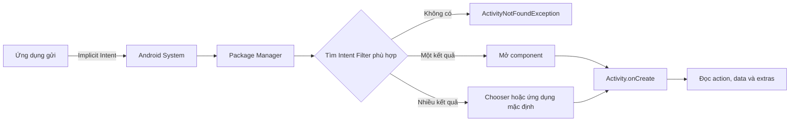
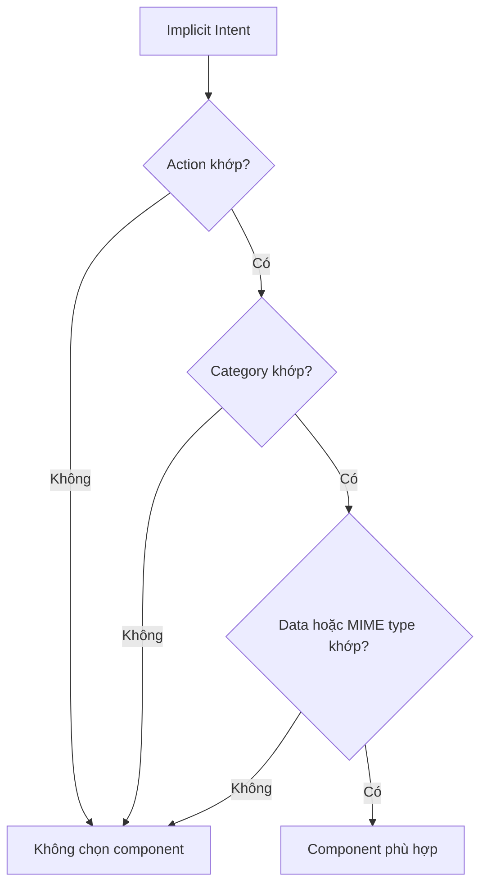

# 016 - Intent Filters

[](https://developer.android.com/guide/components/intents-filters?utm_source=chatgpt.com)


| Thuộc tính              | Nội dung                               |
| ----------------------- | -------------------------------------- |
| **Học phần**            | 02 - App Components and User Interface |
| **Module**              | Module 03 - App Components             |
| **Nhóm nội dung**       | Intent                                 |
| **Nguồn roadmap**       | App Components / Intent                |
| **Loại bài**            | Lesson                                 |
| **Thứ tự trong module** | 016                                    |
| **Thời lượng gợi ý**    | 24 phút                                |

---

## 1. Tóm tắt

**Intent Filter** là cấu hình khai báo trong `AndroidManifest.xml`, cho Android biết một `Activity`, `Service` hoặc `BroadcastReceiver` có khả năng tiếp nhận những loại **implicit Intent** nào.

Thay vì một ứng dụng yêu cầu mở chính xác `ShareActivity`, ứng dụng đó chỉ cần phát biểu nhu cầu:

> “Tôi muốn gửi một đoạn văn bản.”

Android sẽ so sánh `Intent` với các Intent Filter của những ứng dụng đã cài đặt. Nếu tìm thấy thành phần phù hợp, hệ thống sẽ khởi chạy thành phần đó và truyền `Intent` vào. Khi nhiều ứng dụng cùng phù hợp, Android có thể hiển thị giao diện cho người dùng lựa chọn. ([Android Developers][1])


*Hình: Activity A gửi implicit Intent; Android tìm Intent Filter phù hợp rồi khởi chạy Activity B.* 

---

## 2. Mục tiêu học tập

Sau bài học, anh có thể:

* Giải thích Intent Filter bằng ngôn ngữ của mình.
* Phân biệt `Intent` và `Intent Filter`.
* Hiểu ba thành phần chính: `action`, `category` và `data`.
* Khai báo một Activity có thể nhận nội dung chia sẻ từ ứng dụng khác.
* Xử lý dữ liệu Intent trong `onCreate()` và `onNewIntent()`.
* Kiểm tra Intent Filter bằng ADB.
* Nhận biết các rủi ro liên quan đến `android:exported`.
* Viết checklist kiểm thử và production cho một app entry point từ bên ngoài.

---

## 3. Intent Filter là gì?

### 3.1. Định nghĩa ngắn gọn

> **Intent Filter là bản mô tả khả năng của một Android component, giúp hệ thống xác định component đó có thể tiếp nhận loại implicit Intent nào.**

Ví dụ:

* Trình duyệt đăng ký khả năng mở địa chỉ `https://`.
* Ứng dụng bản đồ đăng ký khả năng xem tọa độ địa lý.
* Ứng dụng nhắn tin đăng ký khả năng gửi nội dung văn bản.
* Ứng dụng đọc ảnh đăng ký khả năng mở dữ liệu có MIME type `image/*`.
* Ứng dụng của anh đăng ký khả năng mở liên kết `https://example.com/articles/...`.

Intent Filter thường được viết bằng thẻ `<intent-filter>` bên trong component tương ứng trong `AndroidManifest.xml`. Android so sánh implicit Intent với `action`, `category` và `data` được khai báo trong filter. Intent chỉ được chuyển đến component khi vượt qua các điều kiện phù hợp. ([Android Developers][2])

---

## 4. Intent và Intent Filter khác nhau thế nào?

| Intent                                       | Intent Filter                                           |
| -------------------------------------------- | ------------------------------------------------------- |
| Là yêu cầu thực hiện một hành động           | Là mô tả loại yêu cầu component có thể nhận             |
| Được tạo ở runtime bằng Kotlin hoặc Java     | Thường được khai báo trong `AndroidManifest.xml`        |
| Có thể chứa action, data, category và extras | Kiểm tra action, data và category                       |
| Do bên gửi tạo                               | Do bên nhận khai báo                                    |
| Ví dụ: “Gửi đoạn text này”                   | Ví dụ: “Tôi có thể nhận `ACTION_SEND` với `text/plain`” |

Một cách ghi nhớ:

```text
Intent        = Tôi muốn làm gì?
Intent Filter = Tôi có thể xử lý việc gì?
```

---

## 5. Vị trí của Intent Filter trong ứng dụng Android



Khi một Activity được mở từ ứng dụng khác, website, thông báo hoặc shortcut, Intent Filter trở thành một **entry point** của ứng dụng.

Vì vậy, nó ảnh hưởng trực tiếp đến:

* Điều hướng.
* Back stack.
* Lifecycle của Activity.
* Kiểm tra dữ liệu đầu vào.
* Bảo mật component.
* Trải nghiệm mở liên kết.
* Khả năng tương tác giữa nhiều ứng dụng.

---

## 6. Cấu trúc của một Intent Filter

Một Intent Filter có ba thành phần chính:

```xml
<intent-filter>
    <action android:name="..." />
    <category android:name="..." />
    <data
        android:scheme="..."
        android:host="..."
        android:mimeType="..." />
</intent-filter>
```

### 6.1. `action`

`action` mô tả hành động component có thể thực hiện.

Một số action phổ biến:

| Action                                | Ý nghĩa                        |
| ------------------------------------- | ------------------------------ |
| `android.intent.action.MAIN`          | Entry point chính của ứng dụng |
| `android.intent.action.VIEW`          | Hiển thị hoặc mở dữ liệu       |
| `android.intent.action.SEND`          | Nhận nội dung được chia sẻ     |
| `android.intent.action.SEND_MULTIPLE` | Nhận nhiều nội dung            |
| `android.intent.action.EDIT`          | Chỉnh sửa dữ liệu              |
| `android.intent.action.PICK`          | Chọn một dữ liệu               |

Ví dụ:

```xml
<action android:name="android.intent.action.SEND" />
```

Giá trị trong manifest phải là chuỗi action đầy đủ, không phải tên hằng Kotlin như `Intent.ACTION_SEND`. ([Android Developers][2])

---

### 6.2. `category`

`category` cung cấp thêm thông tin về cách component được sử dụng.

Một số category phổ biến:

| Category    | Công dụng                                              |
| ----------- | ------------------------------------------------------ |
| `DEFAULT`   | Cho phép Activity nhận implicit Intent thông thường    |
| `LAUNCHER`  | Hiển thị Activity trong launcher                       |
| `BROWSABLE` | Cho phép Activity được mở từ trình duyệt hoặc liên kết |
| `HOME`      | Component có thể hoạt động như màn hình chính          |

Ví dụ:

```xml
<category android:name="android.intent.category.DEFAULT" />
```

Để Activity nhận implicit Intent được gửi qua `startActivity()`, filter thường phải có `CATEGORY_DEFAULT`. Nếu thiếu category này, Intent có thể không resolve đến Activity như mong đợi. ([Android Developers][2])

---

### 6.3. `data`

`data` mô tả loại dữ liệu mà component có thể xử lý.

Nó có thể kiểm tra:

* URI scheme: `https`, `http`, `geo`, `mailto`.
* Host: `example.com`.
* Port.
* Path hoặc path prefix.
* MIME type: `text/plain`, `image/*`, `application/pdf`.

Ví dụ nhận văn bản:

```xml
<data android:mimeType="text/plain" />
```

Ví dụ mở liên kết:

```xml
<data
    android:scheme="https"
    android:host="example.com"
    android:pathPrefix="/articles" />
```

---

## 7. Quy tắc matching

Một implicit Intent phải phù hợp với các phần cần thiết của filter:



Có thể ghi nhớ bằng công thức:

```text
Action phù hợp
AND Category phù hợp
AND Data phù hợp
= Intent Filter phù hợp
```

Nếu một component có nhiều `<intent-filter>`, chỉ cần Intent phù hợp với **một filter** là component có thể được lựa chọn.

```text
Filter 1 OR Filter 2 OR Filter 3
```

Android khuyến nghị sử dụng filter riêng cho từng nhóm công việc khác nhau. Điều này giúp manifest rõ ràng hơn và tránh tạo ra những tổ hợp URI ngoài ý muốn. ([Android Developers][1])

---

## 8. Ví dụ 1: Activity xuất hiện trong launcher

Đây là Intent Filter quen thuộc nhất của một ứng dụng Android:

```xml
<activity
    android:name=".MainActivity"
    android:exported="true">

    <intent-filter>
        <action android:name="android.intent.action.MAIN" />

        <category android:name="android.intent.category.LAUNCHER" />
    </intent-filter>

</activity>
```

Ý nghĩa:

* `MAIN`: đây là entry point chính.
* `LAUNCHER`: Activity được hiển thị trong danh sách ứng dụng.
* `exported="true"`: launcher hệ thống có thể khởi chạy Activity.

Filter này không yêu cầu `<data>` vì mở app từ launcher không cần URI hoặc MIME type.

---

## 9. Ví dụ 2: Nhận văn bản được chia sẻ từ ứng dụng khác

### 9.1. Yêu cầu

Xây dựng một màn hình có thể nhận nội dung khi người dùng:

1. Chọn một đoạn văn bản trong trình duyệt.
2. Nhấn **Chia sẻ**.
3. Chọn ứng dụng của anh.
4. Ứng dụng hiển thị đoạn văn bản vừa nhận.

Giao diện lựa chọn ứng dụng có thể trông như sau:


*Hình: Android hiển thị các ứng dụng có Intent Filter phù hợp với hành động chia sẻ.* 

---

### 9.2. Khai báo trong `AndroidManifest.xml`

```xml
<application
    ...>

    <activity
        android:name=".ShareReceiverActivity"
        android:exported="true">

        <intent-filter>
            <action android:name="android.intent.action.SEND" />

            <category android:name="android.intent.category.DEFAULT" />

            <data android:mimeType="text/plain" />
        </intent-filter>

    </activity>

</application>
```

Filter trên có nghĩa:

```text
Component: ShareReceiverActivity
Action:    ACTION_SEND
Category:  DEFAULT
Data type: text/plain
```

Do Activity cần nhận Intent từ ứng dụng khác nên `android:exported` phải được đặt có chủ đích. Trên Android 12 trở lên, component có Intent Filter nhưng không khai báo rõ `android:exported` có thể khiến ứng dụng không cài đặt được. ([Android Developers][2])

---

### 9.3. Xử lý Intent bằng Kotlin

```kotlin
package com.example.intentfilters

import android.content.Intent
import android.os.Bundle
import androidx.activity.ComponentActivity
import androidx.activity.compose.setContent
import androidx.compose.foundation.layout.Column
import androidx.compose.foundation.layout.padding
import androidx.compose.material3.MaterialTheme
import androidx.compose.material3.Text
import androidx.compose.runtime.mutableStateOf
import androidx.compose.ui.Modifier
import androidx.compose.ui.unit.dp

class ShareReceiverActivity : ComponentActivity() {

    private val receivedText = mutableStateOf<String?>(null)
    private val errorMessage = mutableStateOf<String?>(null)

    override fun onCreate(savedInstanceState: Bundle?) {
        super.onCreate(savedInstanceState)

        handleIncomingIntent(intent)

        setContent {
            MaterialTheme {
                Column(modifier = Modifier.padding(24.dp)) {
                    Text(
                        text = "Nội dung được chia sẻ",
                        style = MaterialTheme.typography.headlineSmall
                    )

                    when {
                        errorMessage.value != null -> {
                            Text(text = errorMessage.value!!)
                        }

                        receivedText.value != null -> {
                            Text(text = receivedText.value!!)
                        }

                        else -> {
                            Text(text = "Không có nội dung.")
                        }
                    }
                }
            }
        }
    }

    override fun onNewIntent(intent: Intent) {
        super.onNewIntent(intent)

        // Cập nhật Intent hiện tại của Activity.
        setIntent(intent)

        // Xử lý Intent mới nếu Activity được tái sử dụng.
        handleIncomingIntent(intent)
    }

    private fun handleIncomingIntent(incomingIntent: Intent) {
        val isValidAction =
            incomingIntent.action == Intent.ACTION_SEND

        val isValidType =
            incomingIntent.type == "text/plain"

        if (!isValidAction || !isValidType) {
            receivedText.value = null
            errorMessage.value = "Intent không được hỗ trợ."
            return
        }

        val text = incomingIntent
            .getStringExtra(Intent.EXTRA_TEXT)
            ?.trim()
            ?.take(MAX_TEXT_LENGTH)

        if (text.isNullOrEmpty()) {
            receivedText.value = null
            errorMessage.value = "Nội dung chia sẻ bị trống."
            return
        }

        receivedText.value = text
        errorMessage.value = null
    }

    private companion object {
        const val MAX_TEXT_LENGTH = 10_000
    }
}
```

### Điểm đáng chú ý

Code không chỉ đọc `EXTRA_TEXT`, mà còn kiểm tra:

* Action có phải `ACTION_SEND` hay không.
* MIME type có phải `text/plain` hay không.
* Nội dung có rỗng không.
* Nội dung có quá dài không.
* Activity có nhận Intent mới qua `onNewIntent()` hay không.

Dữ liệu đến từ một ứng dụng bên ngoài phải được xem là **dữ liệu không đáng tin cậy**.

---

## 10. Ví dụ 3: Mở màn hình bằng deep link

### 10.1. Manifest

```xml
<activity
    android:name=".ArticleActivity"
    android:exported="true">

    <intent-filter android:autoVerify="true">
        <action android:name="android.intent.action.VIEW" />

        <category android:name="android.intent.category.DEFAULT" />
        <category android:name="android.intent.category.BROWSABLE" />

        <data
            android:scheme="https"
            android:host="example.com"
            android:pathPrefix="/articles" />
    </intent-filter>

</activity>
```

Filter này có thể nhận các URI như:

```text
https://example.com/articles/42
https://example.com/articles/android-intents
```

Nhưng không nhận:

```text
https://other-domain.com/articles/42
https://example.com/profile/42
http://example.com/articles/42
```

Deep link sử dụng hệ thống Intent để chuyển người dùng trực tiếp vào một nội dung cụ thể. Khi nhiều ứng dụng cùng khai báo khả năng xử lý URI, Android có thể mở ứng dụng mặc định, mở ứng dụng duy nhất phù hợp hoặc cho người dùng lựa chọn. Với tên miền thuộc quyền kiểm soát của mình, nên sử dụng **Android App Links** đã được xác minh. ([Android Developers][3])

---

### 10.2. Đọc URI trong Activity

```kotlin
class ArticleActivity : ComponentActivity() {

    override fun onCreate(savedInstanceState: Bundle?) {
        super.onCreate(savedInstanceState)
        handleIntent(intent)
    }

    override fun onNewIntent(intent: Intent) {
        super.onNewIntent(intent)
        setIntent(intent)
        handleIntent(intent)
    }

    private fun handleIntent(incomingIntent: Intent) {
        if (incomingIntent.action != Intent.ACTION_VIEW) {
            showInvalidLink()
            return
        }

        val uri = incomingIntent.data

        val isValidUri =
            uri?.scheme == "https" &&
            uri.host == "example.com" &&
            uri.pathSegments.firstOrNull() == "articles"

        if (!isValidUri) {
            showInvalidLink()
            return
        }

        val articleId = uri
            ?.pathSegments
            ?.getOrNull(1)
            ?.takeIf { it.matches(Regex("[a-zA-Z0-9-]{1,100}")) }

        if (articleId == null) {
            showInvalidLink()
            return
        }

        openArticle(articleId)
    }

    private fun openArticle(articleId: String) {
        // Chuyển articleId vào ViewModel hoặc Navigation.
    }

    private fun showInvalidLink() {
        // Hiển thị lỗi an toàn hoặc chuyển về màn hình chính.
    }
}
```

Không nên chỉ tin rằng URI hợp lệ vì Android đã match Intent Filter. Activity vẫn phải kiểm tra lại:

* Scheme.
* Host.
* Path.
* ID.
* Query parameters.
* Quyền truy cập của người dùng.
* Trạng thái đăng nhập.
* Nội dung có tồn tại hay không.

---

## 11. Cẩn thận với nhiều thẻ `<data>`

Đây là lỗi dễ gặp:

```xml
<intent-filter>
    <action android:name="android.intent.action.VIEW" />

    <category android:name="android.intent.category.DEFAULT" />
    <category android:name="android.intent.category.BROWSABLE" />

    <data
        android:scheme="https"
        android:host="www.example.com" />

    <data
        android:scheme="myapp"
        android:host="open.example.com" />
</intent-filter>
```

Lập trình viên có thể nghĩ rằng filter chỉ nhận:

```text
https://www.example.com
myapp://open.example.com
```

Tuy nhiên, các thuộc tính của nhiều thẻ `<data>` trong cùng filter có thể được kết hợp, làm xuất hiện thêm các tổ hợp:

```text
myapp://www.example.com
https://open.example.com
```

Android khuyến nghị dùng các Intent Filter riêng khi muốn biểu diễn những tổ hợp URI độc lập. ([Android Developers][3])

Cách rõ ràng hơn:

```xml
<intent-filter>
    <action android:name="android.intent.action.VIEW" />
    <category android:name="android.intent.category.DEFAULT" />
    <category android:name="android.intent.category.BROWSABLE" />

    <data
        android:scheme="https"
        android:host="www.example.com" />
</intent-filter>

<intent-filter>
    <action android:name="android.intent.action.VIEW" />
    <category android:name="android.intent.category.DEFAULT" />
    <category android:name="android.intent.category.BROWSABLE" />

    <data
        android:scheme="myapp"
        android:host="open.example.com" />
</intent-filter>
```

---

## 12. Intent Filter và Lifecycle

Intent Filter không thay đổi trực tiếp lifecycle, nhưng nó thay đổi **cách Activity được khởi chạy**.

### Trường hợp tạo Activity mới

```text
External Intent
    ↓
onCreate()
    ↓
Đọc intent.action
    ↓
Đọc intent.data hoặc extras
    ↓
Tạo UI state
```

### Trường hợp Activity hiện tại được tái sử dụng

Khi launch mode hoặc Intent flags khiến một Activity hiện có được dùng lại:

```text
External Intent mới
    ↓
onNewIntent()
    ↓
setIntent(newIntent)
    ↓
Phân tích lại dữ liệu
    ↓
Cập nhật UI state
```

Nếu chỉ xử lý Intent trong `onCreate()`, Activity có thể hiển thị nội dung cũ khi nhận một Intent mới.

### Khi xoay màn hình

Activity có thể bị tạo lại:

```text
onPause
→ onStop
→ onDestroy
→ onCreate
```

Dữ liệu quan trọng nên được chuyển thành state có thể phục hồi, chẳng hạn:

* Route hoặc content ID.
* Nội dung văn bản đã được chuẩn hóa.
* Trạng thái loading.
* Trạng thái lỗi.
* ID của request đã chạy.

Không nên giữ toàn bộ `Intent`, `Uri` hoặc object lớn làm business state lâu dài. Hãy phân tích đầu vào thành model nhỏ, rõ ràng và có thể kiểm thử.

---

## 13. Ảnh hưởng đến UX

Một Intent Filter tốt giúp:

* Người dùng mở đúng nội dung ngay từ website hoặc ứng dụng khác.
* Ứng dụng xuất hiện trong bảng chia sẻ đúng trường hợp.
* Giảm số bước điều hướng.
* Hỗ trợ luồng app-to-app tự nhiên.
* Cải thiện trải nghiệm thông báo và deep link.

Một Intent Filter cấu hình sai có thể gây:

* Ứng dụng xuất hiện trong chooser khi không xử lý được dữ liệu.
* Link mở sai màn hình.
* Người dùng gặp trang trống.
* Deep link yêu cầu đăng nhập rồi làm mất nội dung đích.
* Nút Back đưa người dùng đến vị trí không mong đợi.
* Hai Activity cùng nhận một link và kết quả không ổn định.

Đối với deep link, màn hình nên đưa người dùng trực tiếp đến nội dung đích và có hành vi Back/Up phù hợp với kỳ vọng điều hướng. ([Android Developers][3])

---

## 14. Bảo mật

### 14.1. Luôn khai báo `android:exported`

```xml
<activity
    android:name=".InternalActivity"
    android:exported="false" />
```

```xml
<activity
    android:name=".DeepLinkActivity"
    android:exported="true">
    ...
</activity>
```

Ý nghĩa:

* `true`: ứng dụng khác có thể khởi chạy component.
* `false`: component chỉ dành cho nội bộ ứng dụng, cùng UID hoặc một số thành phần hệ thống đặc quyền.

Không khai báo rõ thuộc tính này có thể vô tình làm lộ component nội bộ. Android khuyến nghị luôn đặt giá trị tường minh. ([Android Developers][4])

---

### 14.2. Intent Filter không phải cơ chế phân quyền

Intent Filter chỉ mô tả loại implicit Intent mà component quan tâm. Nó không thay thế:

* `android:exported`.
* Permission.
* Kiểm tra đăng nhập.
* Authorization.
* Kiểm tra chủ sở hữu dữ liệu.
* Xác thực URI và extras.

Android cảnh báo rằng filter không phải cách bảo mật component. Nếu component không cần được ứng dụng khác khởi chạy, nên đặt `android:exported="false"` và không tạo entry point bên ngoài không cần thiết. ([Android Developers][2])

---

### 14.3. Không truyền dữ liệu nhạy cảm qua implicit Intent tùy tiện

Ứng dụng độc hại có thể đăng ký Intent Filter tương thích để chặn một implicit Intent chứa dữ liệu nhạy cảm.

Ví dụ không an toàn:

```kotlin
val intent = Intent("com.example.OPEN_PAYMENT").apply {
    putExtra("session_token", sessionToken)
}

startActivity(intent)
```

An toàn hơn khi biết ứng dụng nhận:

```kotlin
val intent = Intent("com.example.OPEN_PAYMENT").apply {
    setPackage("com.example.payment")
    putExtra("payment_id", paymentId)
}

startActivity(intent)
```

Khi dữ liệu cần gửi đến một ứng dụng cụ thể, có thể giới hạn package hoặc sử dụng explicit Intent. Android mô tả implicit Intent hijacking là trường hợp ứng dụng độc hại đăng ký filter để chặn Intent vốn dành cho component khác. ([Android Developers][5])

---

### 14.4. Service nên dùng explicit Intent

Không nên khai báo Service để nhận implicit Intent khi không thực sự cần thiết:

```kotlin
val intent = Intent(this, DownloadService::class.java)
startService(intent)
```

Explicit Intent bảo đảm đúng Service được khởi chạy. Android cũng không cho phép `bindService()` bằng implicit Intent từ Android 5.0 trở lên vì lý do an toàn. ([Android Developers][1])

---

## 15. Kiểm thử bằng ADB

### 15.1. Kiểm tra Activity nhận văn bản

```bash
adb shell am start \
  -W \
  -a android.intent.action.SEND \
  -t "text/plain" \
  --es android.intent.extra.TEXT "Nội dung kiểm thử Intent Filter" \
  -p com.example.intentfilters
```

Các trường hợp nên thử:

```text
ACTION_SEND + text/plain       → Chấp nhận
ACTION_SEND + image/png        → Không nhận
ACTION_VIEW + text/plain       → Không nhận
ACTION_SEND + text trống       → Hiển thị lỗi
ACTION_SEND + text rất dài     → Giới hạn hoặc từ chối
```

---

### 15.2. Kiểm tra deep link

Cú pháp kiểm tra URI bằng ADB:

```bash
adb shell am start \
  -W \
  -a android.intent.action.VIEW \
  -d "https://example.com/articles/42" \
  com.example.intentfilters
```

Android Developers khuyến nghị sử dụng `adb shell am start` với `ACTION_VIEW`, URI và package để xác nhận URI được resolve đến đúng Activity. ([Android Developers][3])

Thử cả trường hợp hợp lệ và không hợp lệ:

```bash
# Hợp lệ
adb shell am start \
  -W \
  -a android.intent.action.VIEW \
  -d "https://example.com/articles/42" \
  com.example.intentfilters

# Sai host
adb shell am start \
  -W \
  -a android.intent.action.VIEW \
  -d "https://evil.example/articles/42" \
  com.example.intentfilters

# Sai path
adb shell am start \
  -W \
  -a android.intent.action.VIEW \
  -d "https://example.com/profile/42" \
  com.example.intentfilters
```

---

## 16. Kiểm thử tự động

### 16.1. Tách logic phân tích Intent

```kotlin
data class IncomingShare(
    val text: String
)

sealed interface ShareParseResult {
    data class Success(
        val share: IncomingShare
    ) : ShareParseResult

    data class Error(
        val reason: String
    ) : ShareParseResult
}

class ShareIntentParser {

    fun parse(intent: Intent): ShareParseResult {
        if (intent.action != Intent.ACTION_SEND) {
            return ShareParseResult.Error("Unsupported action")
        }

        if (intent.type != "text/plain") {
            return ShareParseResult.Error("Unsupported MIME type")
        }

        val text = intent
            .getStringExtra(Intent.EXTRA_TEXT)
            ?.trim()
            ?.take(10_000)

        if (text.isNullOrEmpty()) {
            return ShareParseResult.Error("Empty content")
        }

        return ShareParseResult.Success(
            IncomingShare(text = text)
        )
    }
}
```

### 16.2. Unit test

```kotlin
class ShareIntentParserTest {

    private val parser = ShareIntentParser()

    @Test
    fun `ACTION_SEND text plain returns success`() {
        val intent = Intent(Intent.ACTION_SEND).apply {
            type = "text/plain"
            putExtra(Intent.EXTRA_TEXT, "Hello Android")
        }

        val result = parser.parse(intent)

        assertTrue(result is ShareParseResult.Success)
        assertEquals(
            "Hello Android",
            (result as ShareParseResult.Success).share.text
        )
    }

    @Test
    fun `wrong action returns error`() {
        val intent = Intent(Intent.ACTION_VIEW).apply {
            type = "text/plain"
        }

        val result = parser.parse(intent)

        assertTrue(result is ShareParseResult.Error)
    }

    @Test
    fun `empty shared text returns error`() {
        val intent = Intent(Intent.ACTION_SEND).apply {
            type = "text/plain"
            putExtra(Intent.EXTRA_TEXT, "   ")
        }

        val result = parser.parse(intent)

        assertTrue(result is ShareParseResult.Error)
    }
}
```

Tách parser khỏi Activity giúp:

* Dễ viết unit test.
* Không phụ thuộc UI framework.
* Giảm logic trong lifecycle callback.
* Dễ tái sử dụng cho nhiều entry point.
* Dễ kiểm tra input độc hại.

---

## 17. Lỗi phổ biến của lập trình viên mới

### Lỗi 1: Quên `CATEGORY_DEFAULT`

```xml
<intent-filter>
    <action android:name="android.intent.action.SEND" />
    <data android:mimeType="text/plain" />
</intent-filter>
```

Hậu quả: Activity có thể không nhận implicit Intent từ `startActivity()`.

---

### Lỗi 2: Quên `android:exported`

```xml
<activity android:name=".ShareReceiverActivity">
    <intent-filter>
        ...
    </intent-filter>
</activity>
```

Hậu quả: app có thể không cài đặt được trên Android 12 trở lên.

---

### Lỗi 3: Đặt `exported="false"` nhưng muốn nhận từ app khác

```xml
<activity
    android:name=".ShareReceiverActivity"
    android:exported="false">
```

Hậu quả: ứng dụng bên ngoài không thể mở Activity.

---

### Lỗi 4: Tin tưởng hoàn toàn vào extras

```kotlin
val text = intent.getStringExtra(Intent.EXTRA_TEXT)!!
```

Hậu quả:

* Crash khi thiếu extra.
* Nội dung quá lớn.
* Dữ liệu không đúng định dạng.
* Input độc hại đi thẳng vào WebView, database hoặc API.

---

### Lỗi 5: Một filter xử lý quá nhiều việc

```xml
<intent-filter>
    <action android:name="android.intent.action.VIEW" />
    <action android:name="android.intent.action.SEND" />

    <data android:mimeType="text/plain" />
    <data android:scheme="https" />
</intent-filter>
```

Filter trở nên khó dự đoán và Activity phải xử lý quá nhiều tổ hợp. Nên tách thành các filter hoặc entry Activity khác nhau.

---

### Lỗi 6: Chỉ xử lý Intent trong `onCreate()`

Hậu quả: Activity được tái sử dụng nhưng UI vẫn hiển thị dữ liệu cũ.

Giải pháp: xử lý cả `onNewIntent()` khi kiến trúc hoặc launch mode có khả năng tái sử dụng Activity.

---

### Lỗi 7: Hai Activity cùng xử lý một App Link

Nếu nhiều Activity khai báo filter cho cùng một verified App Link, Android không bảo đảm Activity nào sẽ nhận link. ([Android Developers][3])

---

## 18. Ảnh hưởng đến chất lượng sản phẩm

| Khía cạnh           | Ảnh hưởng                                                             |
| ------------------- | --------------------------------------------------------------------- |
| **UX**              | Người dùng có mở đúng màn hình và đúng nội dung không?                |
| **Reliability**     | App có xử lý Intent thiếu hoặc sai dữ liệu không?                     |
| **Security**        | Component có bị export ngoài ý muốn không?                            |
| **Maintainability** | Filter có tách theo từng trách nhiệm rõ ràng không?                   |
| **Navigation**      | Back stack có đúng khi vào app từ bên ngoài không?                    |
| **Performance**     | Có thực hiện network hoặc parsing nặng ngay trong `onCreate()` không? |
| **Testing**         | Có test action, category, MIME type và URI không?                     |
| **Release**         | App Links, manifest và domain verification đã được kiểm tra chưa?     |

---

## 19. Ghi chú năm dòng

```text
1. Intent Filter mô tả loại implicit Intent mà một component có thể nhận.
2. Filter thường được khai báo trong AndroidManifest.xml.
3. Android so sánh action, category và data để tìm component phù hợp.
4. Component nhận Intent bên ngoài phải kiểm tra dữ liệu và android:exported.
5. Intent Filter cần được test bằng ADB, lifecycle test và input không hợp lệ.
```

---

## 20. Bài thực hành nhỏ

### Đề bài

Xây dựng ứng dụng **Text Collector** có khả năng nhận văn bản từ trình duyệt hoặc ứng dụng ghi chú.

### Yêu cầu chức năng

1. Ứng dụng xuất hiện trong bảng chia sẻ khi dữ liệu là `text/plain`.
2. Màn hình hiển thị nội dung được chia sẻ.
3. Từ chối nội dung trống.
4. Giới hạn nội dung tối đa 10.000 ký tự.
5. Không xuất hiện khi người dùng chia sẻ ảnh.
6. Giữ nội dung sau khi xoay màn hình.
7. Xử lý Intent mới khi Activity đang tồn tại.
8. Có ít nhất ba unit test cho parser.

### Artifact đưa vào portfolio

```text
intent-filter-demo/
├── README.md
├── screenshots/
│   ├── android-share-sheet.png
│   ├── received-text.png
│   └── invalid-input.png
├── app/
│   └── src/
│       ├── main/
│       │   ├── AndroidManifest.xml
│       │   └── ShareReceiverActivity.kt
│       └── test/
│           └── ShareIntentParserTest.kt
└── docs/
    └── intent-flow.md
```

---

## 21. Gợi ý README portfolio

````markdown
# Android Intent Filter Demo

Ứng dụng minh họa cách nhận nội dung `text/plain` từ ứng dụng khác
bằng implicit Intent và Intent Filter.

## Features

- Nhận ACTION_SEND với MIME type text/plain.
- Kiểm tra action, MIME type và extras.
- Xử lý onCreate và onNewIntent.
- Giới hạn kích thước dữ liệu đầu vào.
- Unit test cho Intent parser.
- ADB commands để kiểm tra Intent Filter.

## Security Decisions

- Chỉ export Activity cần nhận dữ liệu bên ngoài.
- Không tin tưởng dữ liệu trong extras.
- Không truyền token hoặc dữ liệu nhạy cảm qua implicit Intent.
- Tách parser khỏi Activity để dễ kiểm thử.

## Test

```bash
adb shell am start \
  -W \
  -a android.intent.action.SEND \
  -t "text/plain" \
  --es android.intent.extra.TEXT "Hello Android" \
  -p com.example.intentfilters
````

````

---

## 22. Checklist hoàn thành

### Kiến thức

- [ ] Giải thích được Intent Filter là gì.
- [ ] Phân biệt được Intent và Intent Filter.
- [ ] Hiểu vai trò của `action`, `category` và `data`.
- [ ] Biết khi nào cần `DEFAULT`, `LAUNCHER` và `BROWSABLE`.
- [ ] Hiểu quy tắc matching cơ bản.

### Cài đặt

- [ ] Đã khai báo `<intent-filter>` trong manifest.
- [ ] Đã đặt `android:exported` rõ ràng.
- [ ] Đã kiểm tra action trước khi xử lý.
- [ ] Đã kiểm tra MIME type hoặc URI.
- [ ] Đã kiểm tra extras rỗng, sai kiểu hoặc quá lớn.
- [ ] Đã xử lý `onNewIntent()` nếu cần.

### Kiểm thử

- [ ] Test Intent hợp lệ.
- [ ] Test sai action.
- [ ] Test sai MIME type.
- [ ] Test thiếu extras.
- [ ] Test URI sai host hoặc sai path.
- [ ] Test xoay màn hình.
- [ ] Test background rồi foreground.
- [ ] Test process recreation.
- [ ] Test khi không có ứng dụng xử lý Intent.
- [ ] Test Back và Up navigation.

### Production và bảo mật

- [ ] Không export component không cần thiết.
- [ ] Không coi Intent Filter là cơ chế authorization.
- [ ] Không truyền token qua implicit Intent.
- [ ] Không đưa dữ liệu chưa kiểm tra vào WebView hoặc database.
- [ ] Service nội bộ sử dụng explicit Intent.
- [ ] App Links đã được xác minh với domain.
- [ ] Manifest của bản release đã được review.
- [ ] Có log lỗi nhưng không log dữ liệu nhạy cảm.

---

## 23. Câu hỏi tự đánh giá

1. Intent Filter nằm ở bên gửi hay bên nhận?
2. Tại sao Activity nhận implicit Intent thường cần `CATEGORY_DEFAULT`?
3. `CATEGORY_BROWSABLE` được dùng trong trường hợp nào?
4. Khi nào `android:exported` nên là `true`?
5. Tại sao không nên tin tưởng `Intent.EXTRA_TEXT`?
6. `onNewIntent()` có vai trò gì?
7. Vì sao nên tách nhiều tổ hợp URI thành nhiều Intent Filter?
8. Intent Filter có thể thay thế permission hay không?
9. Làm thế nào để kiểm tra deep link bằng ADB?
10. Vì sao App Links đáng tin cậy hơn deep link chưa xác minh?

---

## 24. Kết luận

Intent Filter là cầu nối giữa một Android component và các yêu cầu đến từ hệ thống hoặc ứng dụng khác. Nó giúp Android trả lời câu hỏi:

> “Component nào có khả năng xử lý Intent này?”

Một implementation tốt không dừng ở việc thêm vài dòng XML. Lập trình viên cần đồng thời quan tâm đến:

```text
Manifest declaration
        ↓
Intent resolution
        ↓
Input validation
        ↓
Lifecycle handling
        ↓
Navigation và state
        ↓
Security testing
        ↓
Release verification
````

Nguyên tắc quan trọng nhất:

> **Chỉ export những component thực sự cần thiết, tách filter theo từng trách nhiệm và luôn xem dữ liệu Intent bên ngoài là dữ liệu không đáng tin cậy.**

### Tài liệu tham khảo chính

* Android Developers — Intents and Intent Filters. ([Android Developers][1])
* Android Developers — Create Deep Links. ([Android Developers][3])
* Android Developers — Test App Links. ([Android Developers][6])
* Android Developers — `android:exported` security guidance. ([Android Developers][4])
* Android Developers — Implicit Intent Hijacking. ([Android Developers][5])

[1]: https://developer.android.com/guide/components/intents-filters "Intents and intent filters  |  App architecture  |  Android Developers"
[2]: https://developer.android.com/guide/components/intents-filters?hl=en "Intents and intent filters  |  App architecture  |  Android Developers"
[3]: https://developer.android.com/training/app-links/create-deeplinks?authuser=002 "Create deep links  |  App architecture  |  Android Developers"
[4]: https://developer.android.com/privacy-and-security/risks/android-exported?hl=en "android:exported  |  Security  |  Android Developers"
[5]: https://developer.android.com/privacy-and-security/risks/implicit-intent-hijacking?hl=en "Implicit intent hijacking  |  Security  |  Android Developers"
[6]: https://developer.android.com/training/app-links/test-applinks "Test App Links  |  App architecture  |  Android Developers"

---

# Bài luyện tập

## Mục tiêu


## Đề bài


## Yêu cầu hoàn thành

- [ ] 
- [ ] 
- [ ] 

## Kết quả / lời giải


## Ghi chú
