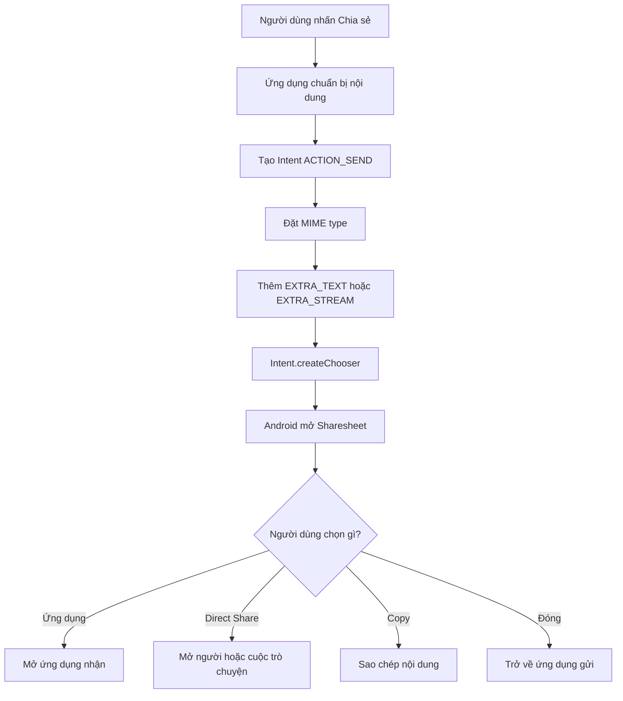
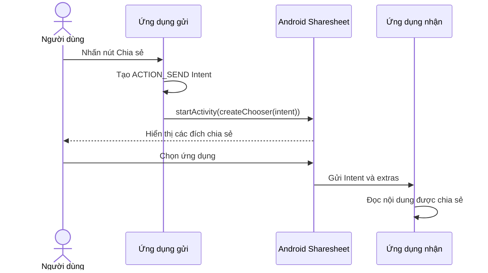
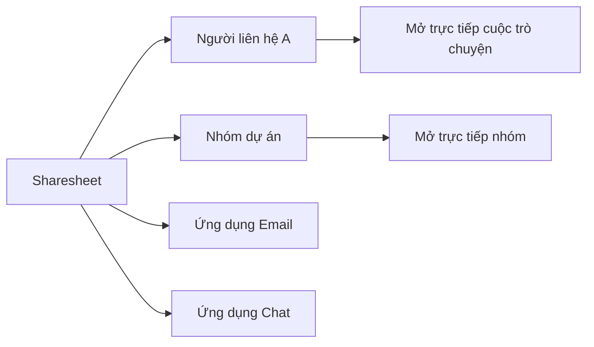
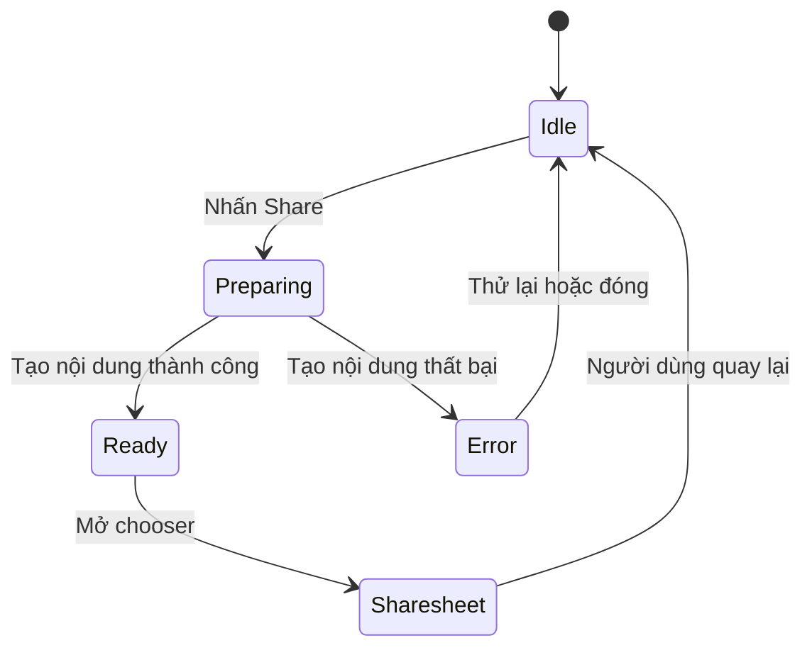
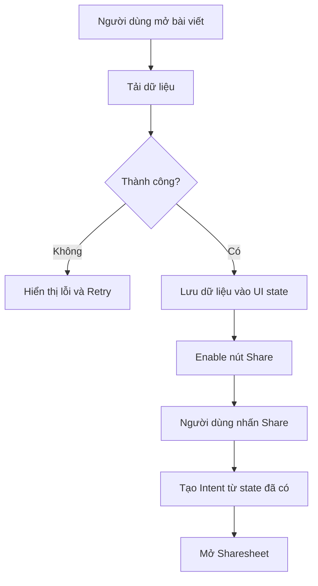

# 017 — Share Sheet trong Android

[](https://developer.android.com/about/versions/14/features?utm_source=chatgpt.com)


| Thuộc tính              | Nội dung                               |
| ----------------------- | -------------------------------------- |
| **Học phần**            | 02 — App Components and User Interface |
| **Module**              | Module 03 — App Components             |
| **Nhóm nội dung**       | Intent                                 |
| **Nguồn roadmap**       | App Components / Intent                |
| **Loại bài**            | Lesson                                 |
| **Thứ tự trong module** | 017                                    |
| **Thời lượng gợi ý**    | 24 phút                                |

---

## 1. Tóm tắt

**Android Sharesheet** là giao diện chia sẻ do hệ điều hành cung cấp. Khi người dùng nhấn nút **Chia sẻ**, ứng dụng tạo một implicit `Intent`, đính kèm nội dung cần gửi rồi gọi `Intent.createChooser()` để Android hiển thị danh sách ứng dụng hoặc người nhận phù hợp.

Share Sheet thường được dùng để chia sẻ:

* Văn bản hoặc đường dẫn.
* Hình ảnh, video, âm thanh.
* PDF và các loại tệp khác.
* Nhiều tệp cùng lúc.
* Nội dung trực tiếp tới một cuộc trò chuyện thông qua Direct Share.

Android khuyến nghị dùng Sharesheet của hệ thống thay vì tự xây dựng danh sách ứng dụng chia sẻ. Giao diện hệ thống mang lại trải nghiệm nhất quán, xếp hạng đích chia sẻ theo ngữ cảnh và hỗ trợ các tính năng hệ thống mà một danh sách tùy chỉnh khó triển khai đầy đủ. ([Android Developers][1])

---

## 2. Mục tiêu học tập

Sau bài học, anh có thể:

* Giải thích Share Sheet bằng ngôn ngữ của mình.
* Phân biệt **Android Sharesheet** với **Intent Resolver**.
* Tạo chức năng chia sẻ văn bản bằng Kotlin.
* Gọi Share Sheet từ Jetpack Compose.
* Chia sẻ ảnh hoặc tệp an toàn bằng `FileProvider`.
* Chọn đúng MIME type cho nội dung.
* Nhận biết ảnh hưởng của Share Sheet đến lifecycle và UI state.
* Viết test kiểm tra `ACTION_SEND`, extras và MIME type.
* Tránh các lỗi bảo mật như chia sẻ `file://` URI hoặc cấp quyền quá rộng.

---

## 3. Ghi chú năm dòng về Share Sheet

> 1. Share Sheet là giao diện chọn ứng dụng hoặc người nhận do Android quản lý.
> 2. Ứng dụng gửi nội dung bằng `Intent.ACTION_SEND`.
> 3. Nội dung được đặt trong các extras như `EXTRA_TEXT` hoặc `EXTRA_STREAM`.
> 4. `Intent.createChooser()` dùng để mở Sharesheet của hệ thống.
> 5. Khi chia sẻ tệp, nên dùng `content://` URI từ `FileProvider`, không dùng đường dẫn tệp trực tiếp.

---

## 4. Hình minh họa


*Hình: Android Sharesheet hiển thị phần xem trước, hành động nhanh, Direct Share targets và danh sách ứng dụng.* 

---

## 5. Share Sheet là gì?

Share Sheet không phải là một màn hình do ứng dụng tự vẽ. Nó là một phần giao diện của Android được mở thông qua `Intent`.

Ứng dụng gửi mô tả về nội dung cần chia sẻ:

```text
Hành động: ACTION_SEND
Loại dữ liệu: text/plain
Nội dung: "Học Android cùng tôi"
```

Android sẽ:

1. Đọc action của `Intent`.
2. Đọc MIME type.
3. Tìm các Activity có `intent-filter` phù hợp.
4. Xếp hạng ứng dụng và Direct Share targets.
5. Hiển thị Sharesheet.
6. Chuyển nội dung tới ứng dụng do người dùng chọn.

Android sử dụng `ACTION_SEND` để truyền dữ liệu giữa các Activity, kể cả khi hai Activity thuộc các process hoặc ứng dụng khác nhau. `Intent.createChooser()` tạo một chooser intent luôn hiển thị giao diện Sharesheet. ([Android Developers][1])

---

## 6. Sơ đồ hoạt động



### Luồng dữ liệu



---

## 7. Những thành phần chính của một Share Intent

| Thành phần                       | Vai trò                            | Ví dụ                     |
| -------------------------------- | ---------------------------------- | ------------------------- |
| `Intent.ACTION_SEND`             | Chia sẻ một nội dung               | Một đoạn văn bản          |
| `Intent.ACTION_SEND_MULTIPLE`    | Chia sẻ nhiều nội dung             | Nhiều hình ảnh            |
| `type`                           | Xác định MIME type                 | `text/plain`, `image/png` |
| `Intent.EXTRA_TEXT`              | Văn bản hoặc URL                   | Link bài viết             |
| `Intent.EXTRA_STREAM`            | URI của tệp nhị phân               | Ảnh, PDF, video           |
| `Intent.EXTRA_TITLE`             | Tiêu đề nội dung xem trước         | Tên bài viết              |
| `Intent.EXTRA_SUBJECT`           | Chủ đề, thường dành cho email      | Tiêu đề email             |
| `ClipData`                       | Cung cấp URI và quyền truy cập     | Thumbnail hoặc file URI   |
| `FLAG_GRANT_READ_URI_PERMISSION` | Cho ứng dụng nhận đọc URI tạm thời | FileProvider URI          |
| `Intent.createChooser()`         | Mở Android Sharesheet              | “Chia sẻ bằng…”           |

---

## 8. Share Sheet và Intent Resolver khác nhau thế nào?

| Android Sharesheet                               | Intent Resolver                                     |
| ------------------------------------------------ | --------------------------------------------------- |
| Dành cho việc chia sẻ nội dung ra ngoài ứng dụng | Dành cho bước tiếp theo của một tác vụ cụ thể       |
| Được mở bằng `Intent.createChooser()`            | Gọi trực tiếp `startActivity(intent)`               |
| Luôn hiển thị giao diện chọn chia sẻ             | Có thể mở thẳng ứng dụng nếu chỉ có một app phù hợp |
| Có Direct Share, preview và xếp hạng hệ thống    | Chủ yếu chọn Activity xử lý hành động               |
| Ví dụ: gửi URL cho bạn bè                        | Ví dụ: mở PDF bằng trình đọc PDF                    |

Android mô tả Sharesheet là lựa chọn phù hợp khi gửi nội dung ra ngoài ứng dụng hoặc trực tiếp tới người khác. Intent Resolver phù hợp hơn khi chuyển dữ liệu sang bước tiếp theo của một quy trình đã xác định rõ, chẳng hạn mở PDF bằng ứng dụng đọc tài liệu. ([Android Developers][1])

---

# 9. Ví dụ 1 — Chia sẻ văn bản

## 9.1. Hàm Kotlin cơ bản

```kotlin
import android.content.ActivityNotFoundException
import android.content.Context
import android.content.Intent
import android.widget.Toast

fun shareText(
    context: Context,
    text: String,
    chooserTitle: String = "Chia sẻ bằng"
) {
    if (text.isBlank()) {
        Toast.makeText(
            context,
            "Không có nội dung để chia sẻ",
            Toast.LENGTH_SHORT
        ).show()
        return
    }

    val sendIntent = Intent(Intent.ACTION_SEND).apply {
        type = "text/plain"
        putExtra(Intent.EXTRA_TEXT, text)
    }

    val chooserIntent = Intent.createChooser(
        sendIntent,
        chooserTitle
    )

    try {
        context.startActivity(chooserIntent)
    } catch (exception: ActivityNotFoundException) {
        Toast.makeText(
            context,
            "Không tìm thấy ứng dụng phù hợp",
            Toast.LENGTH_SHORT
        ).show()
    }
}
```

Ba phần quan trọng nhất là:

```kotlin
action = Intent.ACTION_SEND
type = "text/plain"
putExtra(Intent.EXTRA_TEXT, text)
```

Sau đó mở Sharesheet:

```kotlin
context.startActivity(
    Intent.createChooser(sendIntent, "Chia sẻ bằng")
)
```

Đây là cấu trúc cơ bản được Android hướng dẫn cho nội dung văn bản. ([Android Developers][1])

---

## 9.2. Gọi từ Activity hoặc Fragment

```kotlin
shareText(
    context = requireContext(),
    text = """
        Share Sheet trong Android
        
        https://developer.android.com/develop/ui/compose/sharing/send
    """.trimIndent()
)
```

Đối với Activity:

```kotlin
shareText(
    context = this,
    text = "Tôi đang học Android Sharesheet!"
)
```

---

# 10. Ví dụ 2 — Nút chia sẻ trong Jetpack Compose

```kotlin
import android.content.Intent
import androidx.compose.material.icons.Icons
import androidx.compose.material.icons.outlined.Share
import androidx.compose.material3.Icon
import androidx.compose.material3.IconButton
import androidx.compose.runtime.Composable
import androidx.compose.ui.platform.LocalContext

@Composable
fun ShareArticleButton(
    articleTitle: String,
    articleUrl: String
) {
    val context = LocalContext.current

    IconButton(
        onClick = {
            val content = buildString {
                appendLine(articleTitle)
                append(articleUrl)
            }

            val sendIntent = Intent(Intent.ACTION_SEND).apply {
                type = "text/plain"
                putExtra(Intent.EXTRA_TEXT, content)
                putExtra(Intent.EXTRA_TITLE, articleTitle)
            }

            context.startActivity(
                Intent.createChooser(
                    sendIntent,
                    "Chia sẻ bài viết"
                )
            )
        }
    ) {
        Icon(
            imageVector = Icons.Outlined.Share,
            contentDescription = "Chia sẻ bài viết"
        )
    }
}
```

### Lưu ý accessibility

Không nên để:

```kotlin
contentDescription = null
```

với một nút chỉ có icon. Người dùng sử dụng trình đọc màn hình cần một nhãn có ý nghĩa như:

```kotlin
contentDescription = "Chia sẻ bài viết"
```

---

# 11. Tách phần tạo Intent để dễ kiểm thử

Thay vì viết toàn bộ logic trong `onClick`, có thể tạo một factory:

```kotlin
import android.content.Intent

object ShareIntentFactory {

    fun createTextIntent(
        title: String,
        text: String
    ): Intent {
        require(text.isNotBlank()) {
            "Shared text must not be blank"
        }

        return Intent(Intent.ACTION_SEND).apply {
            type = "text/plain"
            putExtra(Intent.EXTRA_TITLE, title)
            putExtra(Intent.EXTRA_TEXT, text)
        }
    }

    fun createChooser(
        title: String,
        text: String
    ): Intent {
        val sendIntent = createTextIntent(
            title = title,
            text = text
        )

        return Intent.createChooser(
            sendIntent,
            "Chia sẻ bằng"
        )
    }
}
```

Trong Compose:

```kotlin
val chooserIntent = ShareIntentFactory.createChooser(
    title = articleTitle,
    text = "$articleTitle\n$articleUrl"
)

context.startActivity(chooserIntent)
```

Cách tách này mang lại ba lợi ích:

* Logic tạo Intent không phụ thuộc UI.
* Dễ viết unit test.
* Nhiều màn hình có thể tái sử dụng cùng một chuẩn chia sẻ.

---

# 12. Ví dụ 3 — Chia sẻ hình ảnh an toàn

Chia sẻ ảnh phức tạp hơn chia sẻ văn bản vì ứng dụng nhận cần quyền đọc tệp.

Không nên gửi:

```text
file:///data/user/0/com.example.app/files/image.png
```

Nên gửi:

```text
content://com.example.app.fileprovider/shared_images/image.png
```

`FileProvider` tạo `content://` URI và cho phép cấp quyền truy cập tạm thời đến đúng tài nguyên cần chia sẻ. ([Android Developers][2])

---

## 12.1. Khai báo FileProvider trong `AndroidManifest.xml`

```xml
<application
    ...>

    <provider
        android:name="androidx.core.content.FileProvider"
        android:authorities="${applicationId}.fileprovider"
        android:exported="false"
        android:grantUriPermissions="true">

        <meta-data
            android:name="android.support.FILE_PROVIDER_PATHS"
            android:resource="@xml/file_paths" />
    </provider>

</application>
```

Các thiết lập quan trọng:

```xml
android:exported="false"
android:grantUriPermissions="true"
```

* Provider không được công khai trực tiếp.
* Ứng dụng có thể cấp quyền tạm thời cho URI cụ thể.

Cách cấu hình authority và thư mục chia sẻ bằng XML là mô hình được Android hướng dẫn cho `FileProvider`. ([Android Developers][2])

---

## 12.2. Tạo `res/xml/file_paths.xml`

```xml
<?xml version="1.0" encoding="utf-8"?>
<paths xmlns:android="http://schemas.android.com/apk/res/android">

    <cache-path
        name="shared_images"
        path="shared/" />

</paths>
```

Cấu hình trên chỉ cho phép chia sẻ tệp trong:

```text
cacheDir/shared/
```

Không nên cấu hình phạm vi quá rộng như toàn bộ thư mục gốc nếu ứng dụng chỉ cần chia sẻ một thư mục nhỏ.

---

## 12.3. Tạo URI bằng FileProvider

```kotlin
import android.content.Context
import android.net.Uri
import androidx.core.content.FileProvider
import java.io.File

fun createShareableImageUri(
    context: Context,
    imageFile: File
): Uri {
    require(imageFile.exists()) {
        "Image file does not exist"
    }

    return FileProvider.getUriForFile(
        context,
        "${context.packageName}.fileprovider",
        imageFile
    )
}
```

---

## 12.4. Mở Sharesheet để chia sẻ ảnh

```kotlin
import android.content.ClipData
import android.content.Context
import android.content.Intent
import android.net.Uri

fun shareImage(
    context: Context,
    imageUri: Uri,
    caption: String? = null
) {
    val sendIntent = Intent(Intent.ACTION_SEND).apply {
        type = "image/png"

        putExtra(Intent.EXTRA_STREAM, imageUri)

        caption
            ?.takeIf { it.isNotBlank() }
            ?.let {
                putExtra(Intent.EXTRA_TEXT, it)
            }

        clipData = ClipData.newRawUri(
            "Shared image",
            imageUri
        )

        addFlags(Intent.FLAG_GRANT_READ_URI_PERMISSION)
    }

    context.startActivity(
        Intent.createChooser(
            sendIntent,
            "Chia sẻ hình ảnh"
        )
    )
}
```

Khi chia sẻ dữ liệu nhị phân, URI được đặt trong `Intent.EXTRA_STREAM`. Ứng dụng nhận phải có quyền truy cập URI; Android khuyến nghị dùng quyền theo URI có thời hạn, thường được triển khai thuận tiện bằng `FileProvider`. ([Android Developers][1])

---

# 13. Chọn MIME type đúng

MIME type giúp Android chỉ hiển thị những ứng dụng có thể xử lý nội dung.

| Nội dung                     | MIME type nên dùng |
| ---------------------------- | ------------------ |
| Văn bản thuần                | `text/plain`       |
| HTML                         | `text/html`        |
| JSON                         | `application/json` |
| Ảnh PNG                      | `image/png`        |
| Ảnh JPEG                     | `image/jpeg`       |
| Ảnh không xác định định dạng | `image/*`          |
| Video MP4                    | `video/mp4`        |
| PDF                          | `application/pdf`  |

Ví dụ:

```kotlin
type = "application/pdf"
```

Không nên mặc định:

```kotlin
type = "*/*"
```

`*/*` khiến Android hiển thị nhiều ứng dụng không thực sự xử lý được nội dung. Android khuyến nghị chọn MIME type cụ thể nhất có thể. ([Android Developers][1])

---

# 14. Chia sẻ nhiều hình ảnh

Dùng `ACTION_SEND_MULTIPLE` thay cho `ACTION_SEND`.

```kotlin
import android.content.Context
import android.content.Intent
import android.net.Uri

fun shareMultipleImages(
    context: Context,
    imageUris: ArrayList<Uri>
) {
    if (imageUris.isEmpty()) return

    val sendIntent = Intent(Intent.ACTION_SEND_MULTIPLE).apply {
        type = "image/*"

        putParcelableArrayListExtra(
            Intent.EXTRA_STREAM,
            imageUris
        )

        addFlags(Intent.FLAG_GRANT_READ_URI_PERMISSION)
    }

    context.startActivity(
        Intent.createChooser(
            sendIntent,
            "Chia sẻ hình ảnh"
        )
    )
}
```

`ACTION_SEND_MULTIPLE` được dùng cùng danh sách URI. Các URI phải trỏ đến dữ liệu mà ứng dụng nhận có quyền đọc. Android cũng khuyến cáo hạn chế chia sẻ nhiều loại dữ liệu không liên quan trong cùng một Intent vì phía nhận khó xác định cách xử lý. ([Android Developers][1])

---

# 15. Rich content preview

Từ Android 10, Sharesheet có thể hiển thị phần xem trước cho nội dung văn bản. Ứng dụng có thể cung cấp:

* Tiêu đề.
* Đường dẫn.
* Hình thumbnail.
* Mô tả nội dung.

```kotlin
fun shareLinkWithPreview(
    context: Context,
    title: String,
    url: String,
    thumbnailUri: Uri
) {
    val sendIntent = Intent(Intent.ACTION_SEND).apply {
        type = "text/plain"

        putExtra(Intent.EXTRA_TEXT, url)
        putExtra(Intent.EXTRA_TITLE, title)

        clipData = ClipData.newRawUri(
            title,
            thumbnailUri
        )

        addFlags(Intent.FLAG_GRANT_READ_URI_PERMISSION)
    }

    context.startActivity(
        Intent.createChooser(
            sendIntent,
            "Chia sẻ liên kết"
        )
    )
}
```

Android hỗ trợ phần xem trước nội dung văn bản từ API level 29. Thumbnail nên được cung cấp bằng URI mà Sharesheet có quyền đọc, chẳng hạn URI được tạo qua `FileProvider`. ([Android Developers][1])

---

# 16. Direct Share là gì?

Direct Share cho phép Sharesheet hiển thị trực tiếp:

* Một người liên hệ.
* Một cuộc trò chuyện.
* Một nhóm chat.
* Một thiết bị hoặc đích cụ thể.

Thay vì:

```text
Chọn ứng dụng nhắn tin
        ↓
Tìm người nhận
        ↓
Chọn cuộc trò chuyện
```

Người dùng có thể:

```text
Chọn trực tiếp “An — Messages”
        ↓
Mở đúng cuộc trò chuyện
```



Từ Android 11, Direct Share targets được cung cấp qua **Sharing Shortcuts API**. Khi người dùng chọn một target, ứng dụng nhận nên đưa họ tới đúng người hoặc cuộc trò chuyện liên quan thay vì mở một màn hình không liên quan. ([Android Developers][3])

Direct Share là nội dung nâng cao và chỉ thực sự cần thiết nếu anh đang xây:

* Ứng dụng nhắn tin.
* Mạng xã hội.
* Email client.
* Ứng dụng cộng tác nhóm.
* Ứng dụng chia sẻ dữ liệu giữa người dùng.

---

# 17. Custom actions trên Sharesheet

Trên Android 14 trở lên, ứng dụng có thể thêm các hành động tùy chỉnh ở phần trên của Sharesheet, chẳng hạn:

* Sao chép link đặc biệt.
* Tạo QR code.
* Chia sẻ dưới dạng ảnh.
* Tạo link công khai.
* In nội dung.

Các custom action được khai báo thông qua `ChooserAction` và `Intent.EXTRA_CHOOSER_CUSTOM_ACTIONS`. ([Android Developers][1])

Đây là tính năng nâng cao. Với bài nhập môn, anh nên ưu tiên thực hiện chính xác:

```text
ACTION_SEND
+ MIME type
+ Extras
+ createChooser()
```

---

# 18. Lifecycle và state

## 18.1. Điều gì xảy ra khi mở Sharesheet?

Khi một Activity khác hoặc giao diện hệ thống xuất hiện phía trên ứng dụng:

* Activity hiện tại có thể nhận `onPause()`.
* Nếu không còn hiển thị, Activity có thể nhận `onStop()`.
* Khi người dùng quay lại, Activity có thể được resume.
* Trong một số điều kiện, process ứng dụng có thể bị hệ thống giải phóng khi đang ở background.

Android xác định Activity không còn ở foreground khi `onPause()` xảy ra và không còn nhìn thấy khi chuyển sang trạng thái Stopped. ([Android Developers][4])

---

## 18.2. State nào cần được giữ?

Giả sử màn hình đang có:

```text
Tiêu đề bài viết
Nội dung người dùng đang nhập
Ảnh vừa tạo
Trạng thái loading
URL chia sẻ
```

Không nên giả định rằng mọi dữ liệu sẽ luôn còn nguyên chỉ vì người dùng đóng Sharesheet và quay lại.

Có thể lưu:

* UI state ngắn hạn trong `ViewModel`.
* State cần phục hồi sau process recreation trong `SavedStateHandle`.
* Dữ liệu quan trọng trong database hoặc file.
* URI hoặc ID của nội dung thay vì giữ toàn bộ bitmap lớn trong Bundle.

`SavedStateHandle` có thể lưu dữ liệu dạng key-value để phục hồi state sau khi process bị hệ thống kết thúc và tạo lại. ([Android Developers][5])

---

## 18.3. Ví dụ SavedStateHandle

```kotlin
import androidx.lifecycle.SavedStateHandle
import androidx.lifecycle.ViewModel

class ArticleViewModel(
    private val savedStateHandle: SavedStateHandle
) : ViewModel() {

    var articleTitle: String
        get() = savedStateHandle["article_title"] ?: ""
        set(value) {
            savedStateHandle["article_title"] = value
        }

    var articleUrl: String
        get() = savedStateHandle["article_url"] ?: ""
        set(value) {
            savedStateHandle["article_url"] = value
        }

    fun buildShareText(): String {
        return buildString {
            appendLine(articleTitle)
            append(articleUrl)
        }
    }
}
```

---

# 19. Ảnh hưởng đến UX, độ ổn định và maintainability

| Khía cạnh       | Thực hiện tốt                            | Thực hiện kém                                        |
| --------------- | ---------------------------------------- | ---------------------------------------------------- |
| UX              | Sharesheet quen thuộc, ít thao tác       | Tự tạo danh sách app khó sử dụng                     |
| Accessibility   | Nút có nhãn “Chia sẻ”                    | Icon không có mô tả                                  |
| Reliability     | URI có quyền đọc tạm thời                | Ứng dụng nhận không mở được file                     |
| Security        | Dùng `FileProvider`                      | Lộ đường dẫn file nội bộ                             |
| Compatibility   | MIME type chính xác                      | Dùng `*/*` cho mọi nội dung                          |
| State           | Nội dung được lưu trước khi rời màn hình | Quay lại bị mất draft                                |
| Maintainability | Có `ShareIntentFactory` dùng chung       | Mỗi màn hình tạo Intent một kiểu                     |
| Testing         | Kiểm tra action, extras, MIME type       | Chỉ kiểm thử thủ công                                |
| Analytics       | Theo dõi thao tác mở Share hợp lý        | Cho rằng mở Sharesheet đồng nghĩa chia sẻ thành công |

---

# 20. Lỗi phổ biến của lập trình viên mới

## Lỗi 1 — Không gọi `Intent.createChooser()`

```kotlin
context.startActivity(sendIntent)
```

Đoạn code trên sử dụng cơ chế resolver trực tiếp. Nếu có một ứng dụng phù hợp hoặc người dùng đã đặt app mặc định, nội dung có thể được chuyển thẳng tới ứng dụng đó.

Với một luồng chia sẻ chung, nên dùng:

```kotlin
context.startActivity(
    Intent.createChooser(
        sendIntent,
        "Chia sẻ bằng"
    )
)
```

Android yêu cầu các luồng chia sẻ bên ngoài thông thường đi qua system chooser trong hướng dẫn Share Sheet của Apps Experience Program. ([Android Developers][6])

---

## Lỗi 2 — Tự xây dựng danh sách ứng dụng chia sẻ

Ví dụ không nên làm:

```text
[Facebook] [Messenger] [Gmail] [Telegram]
```

Vấn đề:

* Không biết đầy đủ ứng dụng nào đang được cài.
* Không có xếp hạng Direct Share của hệ thống.
* Danh sách có thể lỗi thời.
* Phải xử lý thêm package visibility.
* Trải nghiệm không nhất quán với Android.

Android khuyến nghị không hiển thị danh sách share targets tùy chỉnh hoặc tạo biến thể riêng của Sharesheet cho các luồng chia sẻ chung. ([Android Developers][1])

---

## Lỗi 3 — Dùng MIME type sai

```kotlin
type = "text/plain"
putExtra(Intent.EXTRA_STREAM, imageUri)
```

Đây là nội dung ảnh nhưng được khai báo là văn bản.

Nên dùng:

```kotlin
type = "image/png"
```

---

## Lỗi 4 — Dùng `file://` URI

```kotlin
val uri = Uri.fromFile(imageFile)
```

Không nên chuyển URI này sang ứng dụng khác.

Nên dùng:

```kotlin
val uri = FileProvider.getUriForFile(
    context,
    "${context.packageName}.fileprovider",
    imageFile
)
```

---

## Lỗi 5 — Quên cấp quyền đọc URI

```kotlin
putExtra(Intent.EXTRA_STREAM, imageUri)
```

Thiếu:

```kotlin
addFlags(Intent.FLAG_GRANT_READ_URI_PERMISSION)
```

Kết quả có thể là ứng dụng nhận nhìn thấy tệp nhưng không đọc được.

---

## Lỗi 6 — Chia sẻ dữ liệu nhạy cảm

Không nên vô tình đưa vào `EXTRA_TEXT`:

* Access token.
* Session ID.
* Đường dẫn nội bộ.
* Thông tin định danh không cần thiết.
* Log debug.
* Nội dung chưa được người dùng xác nhận.

Ví dụ nguy hiểm:

```kotlin
putExtra(
    Intent.EXTRA_TEXT,
    "Bearer $accessToken"
)
```

---

## Lỗi 7 — Chia sẻ khi nội dung chưa sẵn sàng

```text
Nhấn Share
   ↓
Bắt đầu gọi API
   ↓
Mở Sharesheet ngay
   ↓
File chưa tồn tại
```

Nên:

```text
Nhấn Share
   ↓
Hiển thị trạng thái đang chuẩn bị
   ↓
Tạo file thành công
   ↓
Lấy content URI
   ↓
Mở Sharesheet
```



---

## Lỗi 8 — Cho rằng mở Sharesheet là đã chia sẻ thành công

Sự kiện:

```text
Người dùng nhấn Share
```

chỉ chứng minh rằng ứng dụng đã yêu cầu mở Sharesheet.

Người dùng vẫn có thể:

* Đóng Sharesheet.
* Nhấn Back.
* Chọn Copy.
* Chọn một ứng dụng rồi hủy trong ứng dụng đó.
* Không hoàn thành việc gửi.

Vì vậy, analytics nên phân biệt:

```text
share_button_clicked
sharesheet_opened
share_target_selected
```

với:

```text
content_delivered
```

Ứng dụng gửi thường không thể khẳng định nội dung đã thực sự được giao chỉ từ việc gọi `startActivity()`.

---

# 21. Kiểm thử Share Sheet

## 21.1. Unit test cho Intent factory

```kotlin
import android.content.Intent
import com.google.common.truth.Truth.assertThat
import org.junit.Test

class ShareIntentFactoryTest {

    @Test
    fun createTextIntent_containsCorrectActionTypeAndText() {
        val intent = ShareIntentFactory.createTextIntent(
            title = "Android Share Sheet",
            text = "https://example.com/android-share"
        )

        assertThat(intent.action)
            .isEqualTo(Intent.ACTION_SEND)

        assertThat(intent.type)
            .isEqualTo("text/plain")

        assertThat(
            intent.getStringExtra(Intent.EXTRA_TEXT)
        ).isEqualTo(
            "https://example.com/android-share"
        )

        assertThat(
            intent.getStringExtra(Intent.EXTRA_TITLE)
        ).isEqualTo(
            "Android Share Sheet"
        )
    }

    @Test(expected = IllegalArgumentException::class)
    fun createTextIntent_blankText_throwsException() {
        ShareIntentFactory.createTextIntent(
            title = "Test",
            text = ""
        )
    }
}
```

---

## 21.2. Kiểm tra chooser Intent

`Intent.createChooser()` tạo một `ACTION_CHOOSER` Intent. Share Intent ban đầu nằm trong `Intent.EXTRA_INTENT`.

```kotlin
import android.content.Intent
import androidx.core.content.IntentCompat
import com.google.common.truth.Truth.assertThat
import org.junit.Test

class ShareChooserTest {

    @Test
    fun createChooser_wrapsSendIntent() {
        val chooser = ShareIntentFactory.createChooser(
            title = "Bài học Android",
            text = "Nội dung chia sẻ"
        )

        assertThat(chooser.action)
            .isEqualTo(Intent.ACTION_CHOOSER)

        val nestedIntent = IntentCompat.getParcelableExtra(
            chooser,
            Intent.EXTRA_INTENT,
            Intent::class.java
        )

        assertThat(nestedIntent).isNotNull()
        assertThat(nestedIntent?.action)
            .isEqualTo(Intent.ACTION_SEND)

        assertThat(nestedIntent?.type)
            .isEqualTo("text/plain")
    }
}
```

---

## 21.3. Instrumentation test với Espresso-Intents

Espresso-Intents cho phép ghi nhận, xác thực và stub các outgoing intents mà ứng dụng gửi ra ngoài. Điều này phù hợp khi ứng dụng ủy quyền một chức năng cho ứng dụng khác hoặc cho nền tảng. ([Android Developers][7])

Ví dụ kiểm tra nút Share tạo chooser:

```kotlin
import android.app.Activity
import android.content.Intent
import androidx.test.espresso.Espresso.onView
import androidx.test.espresso.action.ViewActions.click
import androidx.test.espresso.intent.Intents.intended
import androidx.test.espresso.intent.Intents.intending
import androidx.test.espresso.intent.matcher.IntentMatchers.hasAction
import androidx.test.espresso.matcher.ViewMatchers.withId
import androidx.test.ext.junit.rules.ActivityScenarioRule
import org.hamcrest.Matchers.allOf
import org.junit.Before
import org.junit.Rule
import org.junit.Test

class ShareScreenTest {

    @get:Rule
    val activityRule =
        ActivityScenarioRule(MainActivity::class.java)

    @Before
    fun stubChooser() {
        intending(
            hasAction(Intent.ACTION_CHOOSER)
        ).respondWith(
            androidx.test.espresso.intent.ActivityResult(
                Activity.RESULT_CANCELED,
                null
            )
        )
    }

    @Test
    fun clickingShare_sendsChooserIntent() {
        onView(withId(R.id.shareButton))
            .perform(click())

        intended(
            allOf(
                hasAction(Intent.ACTION_CHOOSER)
            )
        )
    }
}
```

---

## 21.4. Checklist kiểm thử thủ công

### Chia sẻ văn bản

* [ ] Nhấn Share mở đúng Android Sharesheet.
* [ ] Preview hiển thị đúng tiêu đề và URL.
* [ ] Chọn ứng dụng nhắn tin nhận đúng văn bản.
* [ ] Chọn email nhận đúng subject và body.
* [ ] Đóng Sharesheet không làm mất state màn hình.
* [ ] Không xuất hiện dữ liệu debug hoặc token.

### Chia sẻ hình ảnh

* [ ] Thumbnail hiển thị đúng.
* [ ] Ứng dụng nhận đọc được ảnh.
* [ ] MIME type khớp định dạng ảnh.
* [ ] URI bắt đầu bằng `content://`.
* [ ] Không xuất hiện `FileUriExposedException`.
* [ ] File tạm được dọn dẹp khi không còn cần thiết.
* [ ] Không cấp quyền ghi nếu chỉ cần đọc.

### Lifecycle

* [ ] Mở Sharesheet rồi quay lại.
* [ ] Xoay màn hình trước khi chia sẻ.
* [ ] Xoay màn hình sau khi quay lại.
* [ ] Đưa ứng dụng xuống background.
* [ ] Bật tùy chọn **Don’t keep activities** để thử recreation.
* [ ] Kiểm tra draft và URL vẫn được phục hồi.
* [ ] Kiểm tra không gọi API chia sẻ lặp lại sau recreation.

### Thiết bị

* [ ] Điện thoại.
* [ ] Máy tính bảng.
* [ ] Foldable.
* [ ] Chế độ đa cửa sổ.
* [ ] Android phiên bản thấp nhất mà ứng dụng hỗ trợ.
* [ ] Android phiên bản mới nhất đang được hỗ trợ.

---

# 22. Xử lý network và storage

## Trường hợp chia sẻ nội dung lấy từ API

Không nên phụ thuộc hoàn toàn vào request đang chạy khi mở Sharesheet.



Nên disable nút Share khi:

* URL chưa được tạo.
* File đang export.
* Ảnh chưa ghi xong.
* Dữ liệu bắt buộc còn thiếu.
* URI chưa được cấp quyền.

Ví dụ Compose:

```kotlin
IconButton(
    enabled = uiState.shareUrl != null &&
        !uiState.isExporting,
    onClick = onShare
) {
    Icon(
        imageVector = Icons.Outlined.Share,
        contentDescription = "Chia sẻ"
    )
}
```

---

## Trường hợp tạo PDF hoặc ảnh tạm

Quy trình phù hợp:

```text
1. Tạo file trong cacheDir/shared.
2. Xác minh file tồn tại và có kích thước hợp lệ.
3. Tạo content URI bằng FileProvider.
4. Cấp quyền đọc URI.
5. Mở Sharesheet.
6. Dọn cache cũ theo chính sách của ứng dụng.
```

Không nên xóa file ngay sau:

```kotlin
context.startActivity(chooserIntent)
file.delete()
```

Ứng dụng nhận có thể chưa kịp đọc file.

Nên áp dụng chính sách dọn cache theo:

* Tuổi của file.
* Lần khởi động tiếp theo.
* Worker chạy định kỳ.
* Giới hạn dung lượng thư mục cache.

---

# 23. Production checklist

## Intent

* [ ] Dùng `Intent.ACTION_SEND` cho một nội dung.
* [ ] Dùng `ACTION_SEND_MULTIPLE` cho nhiều nội dung.
* [ ] Luồng chia sẻ bên ngoài đi qua `Intent.createChooser()`.
* [ ] MIME type cụ thể và chính xác.
* [ ] Extras không chứa dữ liệu nhạy cảm.
* [ ] Không ép người dùng vào một package cụ thể nếu không có yêu cầu nghiệp vụ rõ ràng.

## File và bảo mật

* [ ] Tất cả file nội bộ được chia sẻ bằng `content://` URI.
* [ ] `FileProvider` có `android:exported="false"`.
* [ ] Chỉ khai báo những thư mục thực sự cần chia sẻ.
* [ ] Dùng `FLAG_GRANT_READ_URI_PERMISSION`.
* [ ] Không cấp quyền ghi nếu không cần.
* [ ] File cache có chính sách dọn dẹp.
* [ ] Không log URI chứa dữ liệu nhạy cảm.

## UX

* [ ] Nút Share có icon và content description.
* [ ] Có loading khi phải tạo file.
* [ ] Có thông báo lỗi dễ hiểu.
* [ ] Không mở Sharesheet với nội dung trống.
* [ ] Nội dung preview phản ánh chính xác thứ sẽ được gửi.
* [ ] Quay lại từ Sharesheet không làm mất draft.

## Testing

* [ ] Unit test cho Intent factory.
* [ ] Kiểm tra action.
* [ ] Kiểm tra MIME type.
* [ ] Kiểm tra extras.
* [ ] Kiểm tra nested Intent trong chooser.
* [ ] Test URI permission.
* [ ] Test rotation và process recreation.
* [ ] Test với ít nhất hai ứng dụng nhận khác nhau.

## Release

* [ ] Kiểm tra Android phiên bản thấp nhất.
* [ ] Kiểm tra Android phiên bản mới nhất.
* [ ] Kiểm tra trên thiết bị thật.
* [ ] Kiểm tra tablet và chế độ đa cửa sổ nếu ứng dụng hỗ trợ.
* [ ] Kiểm tra ProGuard/R8 không ảnh hưởng `FileProvider`.
* [ ] Kiểm tra authority không xung đột giữa các build variant.
* [ ] Kiểm tra bản debug và release đều chia sẻ được file.

---

# 24. Một lỗi điển hình của junior developer

## Tình huống

Lập trình viên muốn chia sẻ ảnh vừa tạo:

```kotlin
val file = File(context.filesDir, "result.png")

val intent = Intent(Intent.ACTION_SEND).apply {
    type = "image/png"
    putExtra(
        Intent.EXTRA_STREAM,
        Uri.fromFile(file)
    )
}

context.startActivity(intent)
```

## Vấn đề

* Dùng `file://` URI.
* Không có `Intent.createChooser()`.
* Không cấp quyền đọc URI.
* Ứng dụng nhận có thể không truy cập được file.
* Không kiểm tra file tồn tại.
* Không xử lý lỗi.

## Phiên bản phù hợp hơn

```kotlin
val file = File(
    context.cacheDir,
    "shared/result.png"
)

if (!file.exists()) {
    return
}

val contentUri = FileProvider.getUriForFile(
    context,
    "${context.packageName}.fileprovider",
    file
)

val sendIntent = Intent(Intent.ACTION_SEND).apply {
    type = "image/png"
    putExtra(Intent.EXTRA_STREAM, contentUri)
    clipData = ClipData.newRawUri(
        "Shared image",
        contentUri
    )
    addFlags(Intent.FLAG_GRANT_READ_URI_PERMISSION)
}

context.startActivity(
    Intent.createChooser(
        sendIntent,
        "Chia sẻ hình ảnh"
    )
)
```

---

# 25. Bài thực hành 24 phút

## Phần 1 — Khởi tạo giao diện, 5 phút

Tạo màn hình gồm:

```text
┌─────────────────────────────┐
│ Android Share Demo          │
│                             │
│ Nội dung cần chia sẻ        │
│ ┌─────────────────────────┐ │
│ │ Tôi đang học Android... │ │
│ └─────────────────────────┘ │
│                             │
│       [ Chia sẻ ]           │
└─────────────────────────────┘
```

Yêu cầu:

* Có `TextField`.
* Có nút Share.
* Nút bị disable khi nội dung trống.

---

## Phần 2 — Tạo ShareIntentFactory, 5 phút

```kotlin
object ShareIntentFactory {

    fun text(
        title: String,
        content: String
    ): Intent {
        return Intent(Intent.ACTION_SEND).apply {
            type = "text/plain"
            putExtra(Intent.EXTRA_TITLE, title)
            putExtra(Intent.EXTRA_TEXT, content)
        }
    }
}
```

---

## Phần 3 — Mở Sharesheet, 4 phút

```kotlin
val sendIntent = ShareIntentFactory.text(
    title = "Android Share Demo",
    content = uiState.text
)

context.startActivity(
    Intent.createChooser(
        sendIntent,
        "Chia sẻ bằng"
    )
)
```

---

## Phần 4 — Giữ state, 5 phút

Lưu nội dung nhập trong:

* `rememberSaveable`, hoặc
* `ViewModel` kết hợp `SavedStateHandle`.

Sau đó:

1. Nhập nội dung.
2. Mở Sharesheet.
3. Quay lại.
4. Xoay màn hình.
5. Xác minh nội dung không bị mất.

---

## Phần 5 — Viết test, 5 phút

Kiểm tra:

```text
action == ACTION_SEND
type == text/plain
EXTRA_TEXT == nội dung đã nhập
```

---

# 26. Bài tập

## Bài 1 — Chia sẻ bài viết

Tạo chức năng chia sẻ gồm:

* Tên bài viết.
* Mô tả ngắn.
* URL.
* Hashtag của ứng dụng.

Kết quả:

```text
Share Sheet trong Android

Tìm hiểu cách chia sẻ dữ liệu giữa các ứng dụng.

https://example.com/android/share-sheet

#AndroidLearning
```

---

## Bài 2 — Chia sẻ ảnh

Tạo một ảnh trong thư mục cache và chia sẻ bằng:

* `FileProvider`.
* `content://` URI.
* `Intent.EXTRA_STREAM`.
* `FLAG_GRANT_READ_URI_PERMISSION`.

---

## Bài 3 — Kiểm tra lifecycle

Thực hiện:

1. Nhập caption.
2. Mở Sharesheet.
3. Đưa ứng dụng xuống background.
4. Quay lại.
5. Xoay thiết bị.
6. Xác minh caption vẫn còn.

Viết một đoạn README giải thích state được lưu ở đâu.

---

## Bài 4 — Phân tích lỗi

Giải thích vì sao đoạn code sau không tốt:

```kotlin
val intent = Intent(Intent.ACTION_SEND).apply {
    type = "*/*"
    putExtra(Intent.EXTRA_STREAM, Uri.fromFile(file))
}

startActivity(intent)
```

Các ý cần tìm:

* MIME type quá rộng.
* `file://` URI.
* Thiếu quyền đọc.
* Không dùng chooser.
* Không kiểm tra file.
* Không xử lý lỗi.

---

# 27. Artifact đưa vào portfolio

Anh có thể xây một mini project:

```text
android-share-demo/
├── app/
│   ├── src/main/java/
│   │   ├── MainActivity.kt
│   │   ├── ShareScreen.kt
│   │   ├── ShareViewModel.kt
│   │   └── ShareIntentFactory.kt
│   ├── src/main/res/xml/
│   │   └── file_paths.xml
│   └── src/androidTest/
│       └── ShareScreenTest.kt
├── screenshots/
│   ├── share-screen.png
│   └── android-sharesheet.png
└── README.md
```

README nên có:

```markdown
# Android Share Demo

Ứng dụng minh họa Android Sharesheet.

## Tính năng

- Chia sẻ văn bản.
- Chia sẻ URL.
- Chia sẻ ảnh bằng FileProvider.
- Rich content preview.
- Giữ state khi configuration change.
- Unit test cho Share Intent.

## Kỹ thuật

- Kotlin
- Jetpack Compose
- Intent.ACTION_SEND
- Intent.createChooser
- FileProvider
- SavedStateHandle
- Espresso-Intents
```

---

# 28. Tiêu chí hoàn thành

* [ ] Giải thích được Share Sheet là gì.
* [ ] Phân biệt được Sharesheet và Intent Resolver.
* [ ] Chia sẻ được văn bản bằng `ACTION_SEND`.
* [ ] Sử dụng `Intent.createChooser()`.
* [ ] Chọn đúng MIME type.
* [ ] Chia sẻ tệp bằng `content://` URI.
* [ ] Cấu hình được `FileProvider`.
* [ ] Cấp quyền đọc URI tạm thời.
* [ ] Không làm mất UI state khi quay lại ứng dụng.
* [ ] Có unit test kiểm tra Intent.
* [ ] Có checklist kiểm thử thủ công.
* [ ] Có screenshot hoặc README để đưa vào portfolio.

---

# 29. Câu hỏi ôn tập

1. Share Sheet khác Intent Resolver ở điểm nào?
2. Vì sao nên gọi `Intent.createChooser()`?
3. `EXTRA_TEXT` và `EXTRA_STREAM` dùng cho loại dữ liệu nào?
4. Khi nào dùng `ACTION_SEND_MULTIPLE`?
5. Vì sao không nên dùng `*/*` cho mọi nội dung?
6. Tại sao phải dùng `FileProvider`?
7. `FLAG_GRANT_READ_URI_PERMISSION` có tác dụng gì?
8. Điều gì có thể xảy ra với Activity khi Sharesheet được mở?
9. Vì sao việc mở Sharesheet không đồng nghĩa nội dung đã được gửi?
10. Những thành phần nào nên được kiểm tra trong unit test?

---

# 30. Kết luận

Share Sheet là cầu nối giữa ứng dụng Android và các ứng dụng bên ngoài. Một triển khai tốt không chỉ dừng ở việc gọi `ACTION_SEND`, mà cần đồng thời xử lý:

```text
Intent chính xác
+ MIME type chính xác
+ URI an toàn
+ Quyền truy cập tối thiểu
+ UI state bền vững
+ Kiểm thử
+ Trải nghiệm nhất quán
```

Công thức cơ bản cần nhớ:

```kotlin
val sendIntent = Intent(Intent.ACTION_SEND).apply {
    type = "text/plain"
    putExtra(Intent.EXTRA_TEXT, content)
}

val chooserIntent = Intent.createChooser(
    sendIntent,
    "Chia sẻ bằng"
)

context.startActivity(chooserIntent)
```

Đối với tệp:

```text
File
  → FileProvider
  → content:// URI
  → EXTRA_STREAM
  → FLAG_GRANT_READ_URI_PERMISSION
  → Android Sharesheet
```

Đây là một tính năng nhỏ về giao diện nhưng liên quan trực tiếp tới UX, lifecycle, storage, bảo mật, khả năng tương thích và chất lượng release của ứng dụng Android.

[1]: https://developer.android.com/training/sharing/send "Send simple data to other apps  |  Jetpack Compose  |  Android Developers"
[2]: https://developer.android.com/training/secure-file-sharing/setup-sharing "Setting up file sharing  |  App data and files  |  Android Developers"
[3]: https://developer.android.com/training/sharing/direct-share-targets "Provide Direct Share targets  |  Jetpack Compose  |  Android Developers"
[4]: https://developer.android.com/guide/components/activities/activity-lifecycle.html?utm_source=chatgpt.com "The activity lifecycle  |  App architecture  |  Android Developers"
[5]: https://developer.android.com/reference/androidx/lifecycle/SavedStateHandle?utm_source=chatgpt.com "SavedStateHandle  |  API reference  |  Android Developers"
[6]: https://developer.android.com/distribute/aep/aep-req-share-sheet "AEP guideline: Share Sheet  |  Apps Experience Program  |  Android Developers"
[7]: https://developer.android.com/training/testing/espresso/intents?hl=en&utm_source=chatgpt.com "Espresso-Intents  |  Test your app on Android  |  Android Developers"

---

# Bài luyện tập

## Mục tiêu


## Đề bài


## Yêu cầu hoàn thành

- [ ] 
- [ ] 
- [ ] 

## Kết quả / lời giải


## Ghi chú
