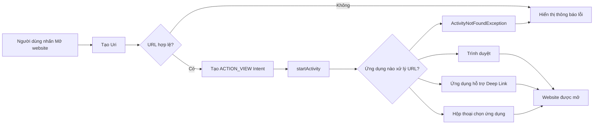

# 018 — Open Browser Intent trong Android

| Thông tin               | Nội dung                               |
| ----------------------- | -------------------------------------- |
| **Học phần**            | 02 — App Components and User Interface |
| **Module**              | Module 03 — App Components             |
| **Nhóm nội dung**       | Intent                                 |
| **Nguồn roadmap**       | App Components / Intent                |
| **Loại bài**            | Lesson                                 |
| **Thứ tự trong module** | 018                                    |
| **Thời lượng gợi ý**    | 24 phút                                |

---

## 1. Tóm tắt

**Open Browser Intent** là kỹ thuật dùng một **implicit intent** để yêu cầu Android mở một địa chỉ web bằng trình duyệt hoặc một ứng dụng có khả năng xử lý URL đó.

Thông thường, ứng dụng sẽ tạo một `Intent` gồm:

* Action: `Intent.ACTION_VIEW`.
* Data: một `Uri` dùng `http` hoặc `https`.
* Lệnh thực thi: `startActivity(intent)`.

Android sẽ tìm ứng dụng phù hợp để xử lý URL. Kết quả có thể là trình duyệt, một ứng dụng hỗ trợ deep link, hộp thoại lựa chọn ứng dụng hoặc lỗi `ActivityNotFoundException` nếu thiết bị không có ứng dụng phù hợp. ([Android Developers][1])

---

## 2. Mục tiêu học tập

Sau bài học, anh có thể:

* Giải thích được Open Browser Intent bằng ngôn ngữ của mình.
* Phân biệt mở trình duyệt ngoài, Custom Tabs và WebView.
* Tạo một implicit intent với `ACTION_VIEW`.
* Kiểm tra và giới hạn URL chỉ còn `http` hoặc `https`.
* Xử lý trường hợp thiết bị không có ứng dụng mở URL.
* Hiểu ảnh hưởng của thao tác này đến Activity Lifecycle.
* Viết test bảo vệ hành vi mở liên kết.
* Tạo một ví dụ nhỏ để đưa vào portfolio.

---

## 3. Khái niệm chính

### 3.1. Open Browser Intent là gì?

Open Browser Intent không phải là một lớp riêng trong Android SDK. Đây là tên gọi phổ biến của việc kết hợp:

```text
Intent.ACTION_VIEW + URI của trang web
```

Ví dụ:

```kotlin
val intent = Intent(
    Intent.ACTION_VIEW,
    Uri.parse("https://developer.android.com")
)

startActivity(intent)
```

Đây là **implicit intent** vì ứng dụng không chỉ định chính xác Activity hoặc package nào phải xử lý yêu cầu. Android sẽ so sánh action và data của intent với các intent filter được đăng ký trên thiết bị để tìm ứng dụng phù hợp. ([Android Developers][2])

---

## 4. Ảnh minh họa


*Nguồn ảnh: [Android Developers — Intents and intent filters](https://developer.android.com/guide/components/intents-filters).*

Hình trên mô tả ba bước:

1. `Activity A` tạo intent và gọi `startActivity()`.
2. Android System tìm ứng dụng có intent filter phù hợp.
3. Android mở `Activity B` và truyền intent cho Activity đó.

---

## 5. Sơ đồ hoạt động



---

## 6. Các thành phần của Intent

### 6.1. Action

```kotlin
Intent.ACTION_VIEW
```

`ACTION_VIEW` thể hiện yêu cầu:

> Hãy hiển thị dữ liệu này cho người dùng.

Dữ liệu có thể là:

* Website: `https://example.com`.
* Vị trí bản đồ: `geo:21.0285,105.8542`.
* Số điện thoại: `tel:0123456789`.
* Tệp hoặc nội dung khác mà ứng dụng phù hợp có thể hiển thị.

Trong trường hợp Open Browser Intent, dữ liệu thường là URL sử dụng `http` hoặc `https`. ([Android Developers][1])

### 6.2. Data URI

```kotlin
val uri = Uri.parse("https://developer.android.com")
```

URI gồm các phần như:

```text
https://developer.android.com/guide/components/intents-common
│       │                     │
scheme  host                  path
```

| Thành phần | Giá trị                            |
| ---------- | ---------------------------------- |
| Scheme     | `https`                            |
| Host       | `developer.android.com`            |
| Path       | `/guide/components/intents-common` |

Với liên kết nhận từ API, QR code, notification hoặc deep link, ứng dụng nên kiểm tra ít nhất `scheme` và `host` trước khi sử dụng. Android cũng khuyến nghị xác thực các thành phần URI khi xử lý dữ liệu không đáng tin cậy. ([Android Developers][3])

---

## 7. Ví dụ Kotlin cơ bản

```kotlin
import android.content.Intent
import android.net.Uri
import androidx.appcompat.app.AppCompatActivity

class MainActivity : AppCompatActivity() {

    private fun openWebPage() {
        val url = "https://developer.android.com"

        val browserIntent = Intent(
            Intent.ACTION_VIEW,
            Uri.parse(url)
        )

        startActivity(browserIntent)
    }
}
```

Gọi hàm khi người dùng nhấn nút:

```kotlin
binding.openWebsiteButton.setOnClickListener {
    openWebPage()
}
```

Phiên bản này phù hợp để học khái niệm, nhưng chưa xử lý URL không hợp lệ hoặc trường hợp thiết bị không mở được liên kết.

---

## 8. Phiên bản Kotlin dùng trong production

```kotlin
import android.app.Activity
import android.content.ActivityNotFoundException
import android.content.Context
import android.content.Intent
import android.net.Uri

fun Context.openBrowser(
    url: String,
    onInvalidUrl: () -> Unit = {},
    onBrowserUnavailable: () -> Unit = {}
) {
    val uri = Uri.parse(url.trim())

    val validScheme = uri.scheme.equals("https", ignoreCase = true) ||
        uri.scheme.equals("http", ignoreCase = true)

    val validHost = !uri.host.isNullOrBlank()

    if (!validScheme || !validHost) {
        onInvalidUrl()
        return
    }

    val browserIntent = Intent(Intent.ACTION_VIEW, uri).apply {
        addCategory(Intent.CATEGORY_BROWSABLE)

        // Cần thiết nếu Context không phải Activity.
        if (this@openBrowser !is Activity) {
            addFlags(Intent.FLAG_ACTIVITY_NEW_TASK)
        }
    }

    try {
        startActivity(browserIntent)
    } catch (exception: ActivityNotFoundException) {
        onBrowserUnavailable()
    }
}
```

Sử dụng trong Activity hoặc Fragment:

```kotlin
requireContext().openBrowser(
    url = "https://developer.android.com",
    onInvalidUrl = {
        Toast.makeText(
            requireContext(),
            "Đường dẫn không hợp lệ",
            Toast.LENGTH_SHORT
        ).show()
    },
    onBrowserUnavailable = {
        Toast.makeText(
            requireContext(),
            "Không tìm thấy ứng dụng mở liên kết",
            Toast.LENGTH_SHORT
        ).show()
    }
)
```

Với ứng dụng target Android 11 trở lên, cách đơn giản là gọi `startActivity()` rồi bắt `ActivityNotFoundException`. Chỉ để mở URL, ứng dụng không cần thêm `<queries>` vào manifest. `<queries>` chỉ cần thiết khi ứng dụng muốn truy vấn trước danh sách trình duyệt hoặc dùng kết quả kiểm tra để quyết định hiển thị giao diện. ([Android Developers][4])

> **Ghi chú:** Vì ứng dụng chỉ gửi yêu cầu cho trình duyệt ngoài, ví dụ này thường không cần khai báo quyền `INTERNET` trong ứng dụng gọi. Trình duyệt là ứng dụng trực tiếp thực hiện kết nối mạng.

---

## 9. Sử dụng với Jetpack Compose

```kotlin
import androidx.compose.material3.Button
import androidx.compose.material3.Text
import androidx.compose.runtime.Composable
import androidx.compose.ui.platform.LocalContext

@Composable
fun OpenWebsiteButton() {
    val context = LocalContext.current

    Button(
        onClick = {
            context.openBrowser(
                url = "https://developer.android.com"
            )
        }
    ) {
        Text("Mở tài liệu Android")
    }
}
```

Trong dự án thật, callback lỗi có thể cập nhật `SnackbarHostState` thay vì hiển thị `Toast`.

---

## 10. Ví dụ Java

```java
import android.content.ActivityNotFoundException;
import android.content.Intent;
import android.net.Uri;
import android.widget.Toast;

private void openWebPage(String url) {
    Uri uri = Uri.parse(url);

    Intent intent = new Intent(Intent.ACTION_VIEW, uri);

    try {
        startActivity(intent);
    } catch (ActivityNotFoundException exception) {
        Toast.makeText(
            this,
            "Không tìm thấy ứng dụng mở liên kết",
            Toast.LENGTH_SHORT
        ).show();
    }
}
```

---

## 11. Có cần khai báo `<queries>` không?

### Trường hợp thông thường: không cần

Nếu ứng dụng chỉ thực hiện:

```kotlin
startActivity(
    Intent(
        Intent.ACTION_VIEW,
        Uri.parse("https://example.com")
    )
)
```

thì không cần thêm `<queries>`.

### Trường hợp cần kiểm tra trước

Khi ứng dụng dùng:

```kotlin
intent.resolveActivity(packageManager)
```

hoặc:

```kotlin
packageManager.queryIntentActivities(intent, 0)
```

để kiểm tra trình duyệt trước khi hiển thị nút, có thể cần khai báo khả năng truy vấn trong `AndroidManifest.xml`:

```xml
<manifest xmlns:android="http://schemas.android.com/apk/res/android">

    <queries>
        <intent>
            <action android:name="android.intent.action.VIEW" />
            <category android:name="android.intent.category.BROWSABLE" />
            <data android:scheme="https" />
        </intent>
    </queries>

    <application>
        <!-- Activities -->
    </application>

</manifest>
```

Package visibility của Android 11 trở lên có thể giới hạn kết quả từ các API truy vấn ứng dụng. Tuy nhiên, giới hạn đó không ngăn ứng dụng gọi trực tiếp `startActivity()` để mở URL. ([Android Developers][4])

---

## 12. Trình duyệt ngoài, Custom Tabs hay WebView?

| Giải pháp     | Trải nghiệm                               | Mức độ triển khai | Trường hợp sử dụng                   |
| ------------- | ----------------------------------------- | ----------------: | ------------------------------------ |
| `ACTION_VIEW` | Rời sang trình duyệt hoặc app khác        |              Thấp | Liên kết ngoài, tài liệu, chính sách |
| Custom Tabs   | Nội dung web vẫn mang cảm giác thuộc app  |        Trung bình | Đăng nhập, thanh toán, bài viết      |
| WebView       | Website nằm hoàn toàn trong giao diện app |               Cao | Nội dung cần kiểm soát sâu           |

### 12.1. Khi nào nên dùng `ACTION_VIEW`?

* Mở tài liệu hỗ trợ.
* Mở trang GitHub.
* Mở chính sách quyền riêng tư.
* Mở một website không thuộc ứng dụng.
* Cho người dùng sử dụng trình duyệt mặc định.

### 12.2. Khi nào dùng Custom Tabs?

Custom Tabs dùng engine của trình duyệt người dùng nhưng cho phép tùy chỉnh thanh công cụ và giúp người dùng giữ ngữ cảnh với ứng dụng. Nó cũng chia sẻ trạng thái trình duyệt như cookie, thông tin đăng nhập và một số tính năng web có sẵn. ([Android Developers][5])

Dependency ổn định được tài liệu Android công bố tại thời điểm bài viết:

```kotlin
dependencies {
    implementation("androidx.browser:browser:1.10.0")
}
```

Phiên bản `1.10.0` là bản stable được Android Developers liệt kê vào tháng 3 năm 2026. ([Android Developers][6])

Ví dụ:

```kotlin
import android.content.Context
import android.net.Uri
import androidx.browser.customtabs.CustomTabsIntent

fun Context.openCustomTab(url: String) {
    val uri = Uri.parse(url)

    val customTabsIntent = CustomTabsIntent.Builder()
        .setShowTitle(true)
        .build()

    customTabsIntent.launchUrl(this, uri)
}
```

### 12.3. Khi nào dùng WebView?

Chỉ nên dùng WebView khi ứng dụng thực sự cần:

* Điều khiển navigation của nội dung web.
* Giao tiếp giữa JavaScript và native.
* Hiển thị nội dung thuộc hệ thống của mình.
* Tích hợp web thành một phần quan trọng của màn hình.

Không nên dùng WebView chỉ để mở một liên kết tài liệu đơn giản. WebView yêu cầu quản lý navigation, bảo mật, JavaScript, cookie, tải tệp và các lỗi mạng nhiều hơn Custom Tabs hoặc trình duyệt ngoài. ([Android Developers][5])

---

## 13. Ảnh hưởng đến Lifecycle và State

Khi trình duyệt hoặc ứng dụng khác được mở:

```text
Ứng dụng hiện tại
      │
      ├── onPause()
      │
      └── onStop() nếu màn hình bị che hoàn toàn
```

Khi người dùng quay lại:

```text
onRestart() → onStart() → onResume()
```

Activity hiện tại có thể chuyển sang `onPause()` và sau đó là `onStop()` nếu Activity mới che toàn bộ màn hình. Android cũng có thể thu hồi process của ứng dụng trong lúc người dùng đang ở trình duyệt, vì vậy không nên giả định mọi state trong bộ nhớ vẫn còn khi quay lại. ([Android Developers][7])

### State nên được lưu

Ví dụ màn hình chứa:

* Nội dung người dùng đang nhập.
* Vị trí cuộn.
* Tab đang chọn.
* ID bài viết.
* Trạng thái loading.
* URL cần tiếp tục xử lý.

Có thể sử dụng:

```text
ViewModel
SavedStateHandle
rememberSaveable
onSaveInstanceState
Local database
```

### Không nên làm

```kotlin
override fun onResume() {
    super.onResume()

    // Không nên tự động mở lại trình duyệt.
    openWebPage()
}
```

Đoạn code trên có thể tạo vòng lặp:

```text
Mở trình duyệt
→ quay lại app
→ onResume
→ mở trình duyệt lần nữa
```

Intent mở trình duyệt nên xuất phát từ một **user action rõ ràng**, chẳng hạn nhấn nút hoặc chọn menu.

---

## 14. Bảo mật URL

### 14.1. Chỉ chấp nhận scheme cần thiết

```kotlin
private fun isSupportedWebUrl(uri: Uri): Boolean {
    val scheme = uri.scheme?.lowercase()

    return scheme in setOf("http", "https") &&
        !uri.host.isNullOrBlank()
}
```

Không nên chuyển trực tiếp dữ liệu không đáng tin cậy sang:

```kotlin
Intent(Intent.ACTION_VIEW, Uri.parse(serverUrl))
```

Một giá trị bên ngoài có thể sử dụng scheme khác như:

```text
file:
content:
intent:
javascript:
custom-scheme:
```

Việc giới hạn scheme và kiểm tra host giúp ứng dụng không vô tình khởi chạy hành vi ngoài dự kiến. Với domain nhạy cảm như đăng nhập, thanh toán hoặc quản trị, nên dùng allowlist host. ([Android Developers][3])

Ví dụ allowlist:

```kotlin
private val allowedHosts = setOf(
    "example.com",
    "www.example.com",
    "support.example.com"
)

fun isTrustedUrl(url: String): Boolean {
    val uri = Uri.parse(url)

    return uri.scheme == "https" &&
        uri.host?.lowercase() in allowedHosts
}
```

### 14.2. Ưu tiên HTTPS

```text
https://example.com  ✅
http://example.com   ⚠️
```

HTTPS bảo vệ dữ liệu khi truyền và giảm nguy cơ nội dung bị can thiệp trên đường truyền. Android cũng khuyến nghị không tin tưởng dữ liệu tải qua HTTP hoặc các giao thức không an toàn. ([Android Developers][8])

### 14.3. Không ép mở một trình duyệt cụ thể

Không nên viết:

```kotlin
intent.setPackage("com.android.chrome")
```

trừ khi nghiệp vụ thực sự phụ thuộc vào Chrome.

Người dùng có thể:

* Không cài Chrome.
* Sử dụng Firefox, Edge hoặc Samsung Internet.
* Đặt một trình duyệt khác làm mặc định.

Để Android tự phân giải intent thường tạo trải nghiệm tương thích hơn.

---

## 15. Những lỗi junior thường gặp

### Lỗi 1: URL không có scheme

```kotlin
Uri.parse("developer.android.com")
```

Android có thể không xác định đây là website.

Nên dùng:

```kotlin
Uri.parse("https://developer.android.com")
```

Hoặc chuẩn hóa:

```kotlin
fun normalizeUrl(url: String): String {
    val value = url.trim()

    return if (
        value.startsWith("http://") ||
        value.startsWith("https://")
    ) {
        value
    } else {
        "https://$value"
    }
}
```

### Lỗi 2: Không xử lý `ActivityNotFoundException`

```kotlin
startActivity(intent)
```

Dù hiếm, Android có thể không tìm thấy Activity xử lý intent. Production code nên bắt `ActivityNotFoundException` và thông báo phù hợp. ([Android Developers][9])

### Lỗi 3: Tin tưởng URL từ server

```kotlin
val url = response.redirectUrl
startActivity(Intent(Intent.ACTION_VIEW, Uri.parse(url)))
```

Nên kiểm tra scheme và host trước.

### Lỗi 4: Dùng WebView cho mọi liên kết

Điều này làm tăng:

* Code bảo trì.
* Rủi ro bảo mật.
* Xử lý cookie và đăng nhập.
* Xử lý JavaScript.
* Xử lý tải xuống và điều hướng.

### Lỗi 5: Mở trình duyệt ngay khi màn hình khởi tạo

```kotlin
override fun onCreate(savedInstanceState: Bundle?) {
    super.onCreate(savedInstanceState)
    openWebPage()
}
```

Khi Activity được tạo lại do rotate hoặc process recreation, trình duyệt có thể bị mở lại ngoài ý muốn.

---

## 16. Kiểm thử

### 16.1. Unit test cho URL validator

```kotlin
import android.net.Uri
import org.junit.Assert.assertFalse
import org.junit.Assert.assertTrue
import org.junit.Test

class WebUrlValidatorTest {

    private fun isValid(url: String): Boolean {
        val uri = Uri.parse(url)

        val supportedScheme =
            uri.scheme == "https" || uri.scheme == "http"

        return supportedScheme && !uri.host.isNullOrBlank()
    }

    @Test
    fun httpsUrl_isValid() {
        assertTrue(
            isValid("https://developer.android.com")
        )
    }

    @Test
    fun httpUrl_isValid() {
        assertTrue(
            isValid("http://example.com")
        )
    }

    @Test
    fun missingScheme_isInvalid() {
        assertFalse(
            isValid("developer.android.com")
        )
    }

    @Test
    fun javascriptScheme_isInvalid() {
        assertFalse(
            isValid("javascript:alert('test')")
        )
    }

    @Test
    fun fileScheme_isInvalid() {
        assertFalse(
            isValid("file:///data/local/file.html")
        )
    }
}
```

### 16.2. Instrumented test với Espresso Intents

```kotlin
import android.content.Intent
import androidx.test.espresso.Espresso.onView
import androidx.test.espresso.action.ViewActions.click
import androidx.test.espresso.intent.Intents
import androidx.test.espresso.intent.matcher.IntentMatchers.hasAction
import androidx.test.espresso.intent.matcher.IntentMatchers.hasData
import androidx.test.espresso.matcher.ViewMatchers.withId
import org.hamcrest.Matchers.allOf
import org.junit.After
import org.junit.Before
import org.junit.Test

class OpenBrowserIntentTest {

    @Before
    fun setup() {
        Intents.init()
    }

    @After
    fun teardown() {
        Intents.release()
    }

    @Test
    fun clickOpenWebsite_sendsActionViewIntent() {
        onView(withId(R.id.openWebsiteButton))
            .perform(click())

        Intents.intended(
            allOf(
                hasAction(Intent.ACTION_VIEW),
                hasData("https://developer.android.com")
            )
        )
    }
}
```

### 16.3. Test thủ công

| Trường hợp               | Kết quả mong đợi                        |
| ------------------------ | --------------------------------------- |
| URL HTTPS hợp lệ         | Mở trình duyệt hoặc app phù hợp         |
| URL HTTP hợp lệ          | Mở được nhưng có thể cảnh báo nghiệp vụ |
| URL không có scheme      | Không mở, hiện lỗi                      |
| URL dùng `javascript:`   | Bị từ chối                              |
| Không có trình duyệt     | App không crash                         |
| Nhiều ứng dụng xử lý URL | Android hiển thị lựa chọn               |
| URL có App Link          | Có thể mở ứng dụng tương ứng            |
| Nhấn nút nhiều lần       | Không mở nhiều cửa sổ ngoài ý muốn      |
| Rotate màn hình          | Không tự động mở lại trình duyệt        |
| Quay về từ trình duyệt   | State trước đó vẫn còn                  |
| Process bị kill          | State quan trọng được khôi phục         |

---

## 17. Debug bằng ADB

Có thể kiểm tra một URL mà không cần nhấn nút trong ứng dụng:

```bash
adb shell am start \
  -a android.intent.action.VIEW \
  -d "https://developer.android.com"
```

Lệnh trên yêu cầu Android xử lý một `ACTION_VIEW` intent với URL đã cung cấp. Android Developers cũng hướng dẫn dùng `adb shell am start` để kiểm tra việc xử lý intent trên thiết bị hoặc emulator. ([Android Developers][1])

Xem Activity được mở:

```bash
adb shell dumpsys activity activities
```

Xem log liên quan:

```bash
adb logcat | grep ActivityTaskManager
```

---

## 18. Bài thực hành nhỏ

### Yêu cầu

Tạo ứng dụng có màn hình “About” gồm:

* Nút **Mở tài liệu Android**.
* Nút **Chính sách quyền riêng tư**.
* Nút **Liên hệ hỗ trợ**.
* Snackbar khi URL không hợp lệ.
* Không crash khi không có ứng dụng xử lý URL.

### Giao diện mẫu

```text
┌─────────────────────────────────┐
│            About App            │
├─────────────────────────────────┤
│                                 │
│  Android Learning App           │
│  Version 1.0.0                  │
│                                 │
│  [ Mở tài liệu Android       ]  │
│  [ Chính sách quyền riêng tư ]  │
│  [ Trang hỗ trợ              ]  │
│                                 │
└─────────────────────────────────┘
```

### Cấu trúc đề xuất

```text
app/
├── ui/
│   └── about/
│       └── AboutScreen.kt
├── navigation/
├── util/
│   ├── BrowserLauncher.kt
│   └── WebUrlValidator.kt
└── test/
    └── WebUrlValidatorTest.kt
```

---

## 19. Artifact đưa vào portfolio

Anh có thể tạo một repository nhỏ:

```text
android-open-browser-intent-demo/
├── app/
├── screenshots/
│   ├── about-screen.png
│   ├── browser-opened.png
│   └── invalid-url-snackbar.png
├── README.md
└── LICENSE
```

README nên có:

```markdown
# Android Open Browser Intent Demo

## Tính năng

- Mở website bằng ACTION_VIEW.
- Chỉ chấp nhận HTTP và HTTPS.
- Xử lý ActivityNotFoundException.
- Hỗ trợ Views hoặc Jetpack Compose.
- Có unit test cho URL validator.

## Kiến thức minh họa

- Implicit Intent
- Uri
- Intent Resolution
- Activity Lifecycle
- URL Validation
- Android Package Visibility
```

---

## 20. Ghi chú năm dòng

> Open Browser Intent là một implicit intent dùng để mở địa chỉ web.
> Intent sử dụng `ACTION_VIEW` và mang theo URL dưới dạng `Uri`.
> Android quyết định trình duyệt hoặc ứng dụng nào xử lý URL.
> Ứng dụng nên kiểm tra scheme, host và xử lý `ActivityNotFoundException`.
> State của màn hình cần được giữ lại khi người dùng chuyển sang trình duyệt.

---

## 21. Bài tập

### Bài 1 — Cơ bản

Tạo nút mở:

```text
https://developer.android.com
```

### Bài 2 — Chuẩn hóa URL

Cho phép người dùng nhập:

```text
developer.android.com
```

Sau đó tự chuyển thành:

```text
https://developer.android.com
```

### Bài 3 — Kiểm tra an toàn

Từ chối các URL:

```text
javascript:alert(1)
file:///data/test.html
content://example/data
```

### Bài 4 — Custom Tabs

Thay `ACTION_VIEW` bằng `CustomTabsIntent` và so sánh trải nghiệm.

### Bài 5 — Lifecycle

Thêm một `TextField`, nhập nội dung, mở trình duyệt rồi quay lại. Kiểm tra nội dung có bị mất sau:

* Quay lại từ trình duyệt.
* Xoay màn hình.
* Bật tùy chọn **Don't keep activities**.
* Process recreation.

---

## 22. Checklist hoàn thành

### Kiến thức

* [ ] Giải thích được Open Browser Intent.
* [ ] Biết đây là một implicit intent.
* [ ] Hiểu vai trò của `ACTION_VIEW`.
* [ ] Hiểu vai trò của `Uri`.
* [ ] Phân biệt browser, Custom Tabs và WebView.

### Code

* [ ] URL có scheme `http` hoặc `https`.
* [ ] URL có host hợp lệ.
* [ ] Có xử lý `ActivityNotFoundException`.
* [ ] Không ép người dùng dùng một trình duyệt cụ thể.
* [ ] Không mở trình duyệt tự động trong `onResume()`.
* [ ] Không mở lại liên kết sau configuration change.

### Test

* [ ] Test URL hợp lệ.
* [ ] Test URL không có scheme.
* [ ] Test scheme nguy hiểm.
* [ ] Test click tạo `ACTION_VIEW`.
* [ ] Test quay lại từ trình duyệt.
* [ ] Test rotate và process recreation.

### Portfolio

* [ ] Có README.
* [ ] Có ảnh chụp màn hình.
* [ ] Có code Kotlin rõ ràng.
* [ ] Có unit test.
* [ ] Có ghi chú về lifecycle và security.

---

## 23. Ghi chú sản xuất

Trước khi release, cần trả lời được:

1. URL đến từ code cố định, API hay nội dung người dùng nhập?
2. Có kiểm tra `scheme` và `host` không?
3. Có bắt `ActivityNotFoundException` không?
4. Khi người dùng quay lại, state màn hình còn nguyên không?
5. Liên kết cần mở bằng browser, Custom Tabs hay app deep link?
6. Có vô tình mở liên kết nhiều lần khi recomposition hoặc rotate không?
7. Analytics có ghi nhận đúng thao tác nhấn liên kết không?
8. Chính sách quyền riêng tư và điều khoản sử dụng có mở đúng môi trường production không?
9. Có test trên thiết bị dùng nhiều trình duyệt khác nhau không?
10. Có test trường hợp process bị Android thu hồi không?

---

## 24. Tài liệu tham khảo

* [Common intents — Android Developers](https://developer.android.com/guide/components/intents-common)
* [Intents and intent filters — Android Developers](https://developer.android.com/guide/components/intents-filters)
* [Package visibility use cases — Android Developers](https://developer.android.com/training/package-visibility/use-cases)
* [Android Custom Tabs — Android Developers](https://developer.android.com/develop/ui/views/layout/webapps/overview-of-android-custom-tabs)
* [Activity Lifecycle — Android Developers](https://developer.android.com/guide/components/activities/activity-lifecycle)
* [Unsafe URI Loading — Android Developers](https://developer.android.com/privacy-and-security/risks/unsafe-uri-loading)

[1]: https://developer.android.com/guide/components/intents-common "Common intents  |  App architecture  |  Android Developers"
[2]: https://developer.android.com/guide/components/intents-filters "Intents and intent filters  |  App architecture  |  Android Developers"
[3]: https://developer.android.com/privacy-and-security/risks/unsafe-uri-loading?utm_source=chatgpt.com "Webviews – Unsafe URI Loading | Security"
[4]: https://developer.android.com/training/package-visibility/use-cases "Fulfill common use cases while having limited package visibility  |  App architecture  |  Android Developers"
[5]: https://developer.android.com/develop/ui/views/layout/webapps/overview-of-android-custom-tabs "Overview of Android Custom Tabs  |  Views  |  Android Developers"
[6]: https://developer.android.com/jetpack/androidx/releases/browser "Browser  |  Jetpack  |  Android Developers"
[7]: https://developer.android.com/guide/components/activities/activity-lifecycle?utm_source=chatgpt.com "The activity lifecycle  |  App architecture  |  Android Developers"
[8]: https://developer.android.com/privacy-and-security/security-tips?utm_source=chatgpt.com "Security checklist"
[9]: https://developer.android.com/reference/android/content/ActivityNotFoundException?utm_source=chatgpt.com "ActivityNotFoundException | API reference"
