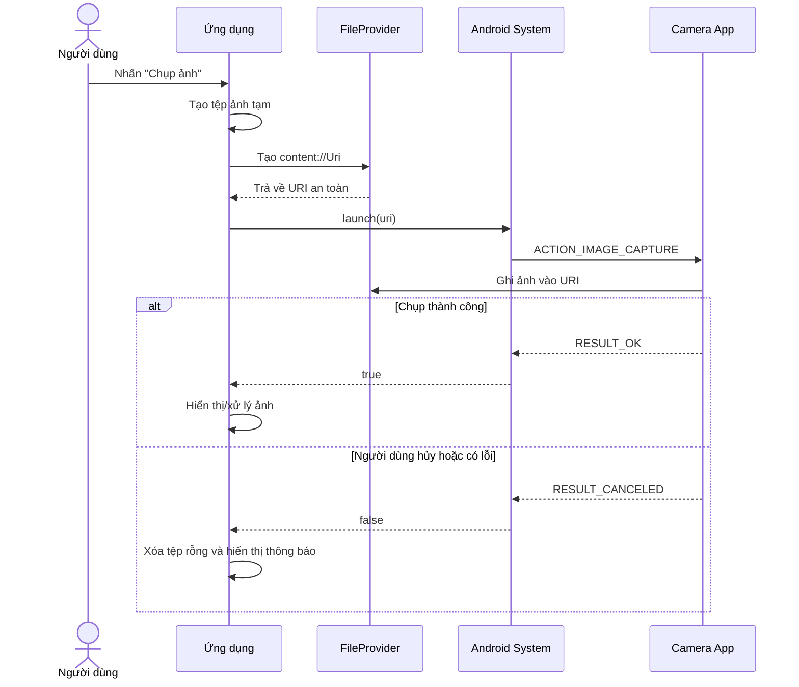
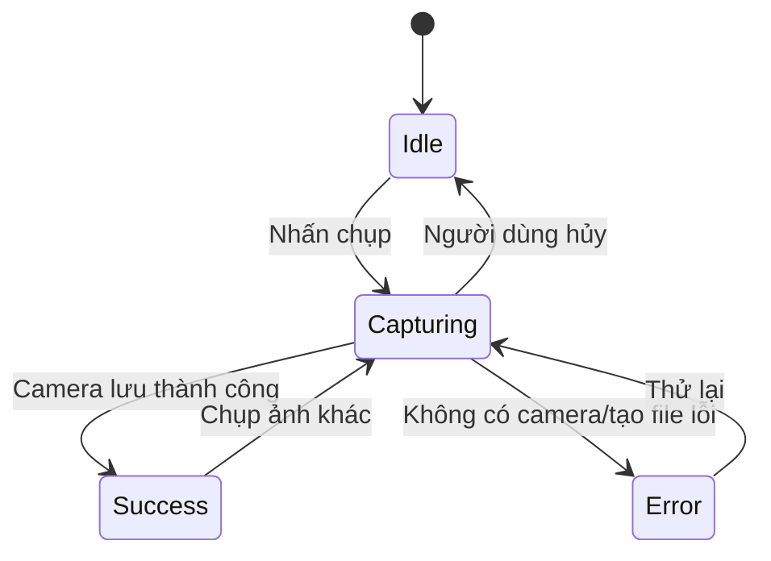

# 019 - Camera Intent trong Android

> **Học phần:** 02 - App Components and User Interface
> **Module:** Module 03 - App Components
> **Nhóm nội dung:** Intent
> **Nguồn roadmap:** App Components / Intent
> **Loại bài:** Lesson
> **Thứ tự trong module:** 019
> **Thời lượng gợi ý:** 24 phút

---

## 1. Tóm tắt

**Camera Intent** là kỹ thuật sử dụng `Intent` để yêu cầu một ứng dụng camera bên ngoài chụp ảnh hoặc quay video thay cho ứng dụng của chúng ta.

Với nhu cầu chụp ảnh cơ bản, ứng dụng không cần tự xây dựng màn hình camera, quản lý preview, autofocus hay camera lifecycle. Android sẽ chuyển yêu cầu đến một ứng dụng camera phù hợp, sau đó trả quyền điều khiển về ứng dụng ban đầu. Với các yêu cầu phức tạp hơn như camera tùy chỉnh, phân tích ảnh thời gian thực hoặc điều khiển ống kính, Android khuyến nghị sử dụng CameraX hoặc Camera2.

Bài học tập trung vào:

* Chụp ảnh bằng ứng dụng camera hệ thống.
* Nhận ảnh chất lượng đầy đủ.
* Sử dụng `ActivityResultContracts.TakePicture`.
* Chia sẻ tệp an toàn bằng `FileProvider`.
* Giữ trạng thái khi xoay màn hình hoặc tiến trình bị tạo lại.
* Xử lý trường hợp người dùng hủy hoặc thiết bị không có ứng dụng camera.

---

## 2. Mục tiêu học tập

Sau bài học, anh có thể:

* Giải thích Camera Intent bằng ngôn ngữ của mình.
* Phân biệt ảnh thumbnail và ảnh chất lượng đầy đủ.
* Sử dụng `ActivityResultContracts.TakePicture`.
* Tạo `content://Uri` bằng `FileProvider`.
* Hiểu vì sao không nên truyền `Bitmap` lớn qua `Intent`.
* Giữ URI ảnh qua configuration change và process recreation.
* Xử lý trường hợp camera bị hủy, không tồn tại hoặc không lưu được ảnh.
* Viết checklist kiểm thử Camera Intent trước khi phát hành.

---

## 3. Ghi chú 5 dòng về Camera Intent

1. Camera Intent cho phép ứng dụng nhờ một ứng dụng camera khác chụp ảnh.
2. Đây là một dạng **implicit intent** vì ứng dụng không chỉ định chính xác camera component nào sẽ xử lý.
3. Với ảnh chất lượng đầy đủ, ứng dụng phải cung cấp trước một `content://Uri`.
4. Camera ghi ảnh vào URI đó và ứng dụng nhận kết quả thành công hoặc thất bại.
5. URI đang chờ phải được giữ lại vì Activity có thể bị tạo lại trong lúc camera đang mở.

---

## 4. Hình minh họa


*Hình: Một ứng dụng Android có thể khởi chạy Activity thuộc ứng dụng camera hoặc ứng dụng chia sẻ khác thông qua Intent. Nguồn: Google Android Developer Fundamentals.*

---

## 5. Camera Intent nằm ở đâu trong ứng dụng Android?

```text
Người dùng
    │
    │ Nhấn "Chụp ảnh"
    ▼
UI: Activity hoặc Fragment
    │
    │ launch(photoUri)
    ▼
Activity Result API
    │
    │ ACTION_IMAGE_CAPTURE
    ▼
Android Intent Resolver
    │
    ▼
Ứng dụng camera bên ngoài
    │
    │ Ghi dữ liệu ảnh
    ▼
content://Uri do FileProvider cung cấp
    │
    │ Trả kết quả true/false
    ▼
Ứng dụng hiển thị hoặc xử lý ảnh
```

Camera Intent liên quan trực tiếp đến các thành phần sau:

| Thành phần                  | Vai trò                                                        |
| --------------------------- | -------------------------------------------------------------- |
| `Intent`                    | Mô tả hành động chụp ảnh                                       |
| Activity Result API         | Khởi chạy camera và nhận kết quả                               |
| `FileProvider`              | Cung cấp URI an toàn cho tệp ảnh                               |
| Activity/Fragment lifecycle | Quản lý trạng thái khi ứng dụng chuyển nền                     |
| Saved instance state        | Giữ URI ảnh đang chờ                                           |
| Storage                     | Quyết định ảnh chỉ thuộc ứng dụng hay xuất hiện trong thư viện |
| UI state                    | Hiển thị loading, thành công, hủy hoặc lỗi                     |

---

## 6. Luồng hoạt động



---

## 7. Thumbnail và ảnh chất lượng đầy đủ

### 7.1. Thumbnail

Một số camera có thể trả về một ảnh thu nhỏ trong trường `"data"` của `Intent` kết quả. Đây chỉ là bản giảm kích thước và không nên được xem là ảnh gốc chất lượng đầy đủ.

Ví dụ phù hợp:

* Hiển thị avatar rất nhỏ.
* Làm prototype nhanh.
* Không cần lưu ảnh gốc.

### 7.2. Ảnh chất lượng đầy đủ

Để nhận ảnh đầy đủ, ứng dụng cung cấp trước một URI và yêu cầu camera ghi ảnh vào đó.

`ActivityResultContracts.TakePicture` nhận đầu vào là một `Uri` và trả về `true` khi ảnh được lưu thành công vào URI đã cung cấp.

| Giải pháp              | Kết quả              | Phù hợp                             |
| ---------------------- | -------------------- | ----------------------------------- |
| `TakePicturePreview()` | `Bitmap` thu nhỏ     | Prototype, preview nhỏ              |
| `TakePicture()`        | Ảnh đầy đủ tại `Uri` | Avatar, biên nhận, hồ sơ            |
| CameraX                | Camera tùy chỉnh     | Scanner, OCR, filter, phân tích ảnh |
| Camera2                | Điều khiển mức thấp  | Nhu cầu camera chuyên sâu           |

---

## 8. Có cần quyền `CAMERA` không?

Khi ứng dụng chỉ gọi camera hệ thống thông qua `ACTION_IMAGE_CAPTURE`, thông thường **không cần khai báo hoặc yêu cầu quyền `CAMERA`**.

Android khuyến nghị không khai báo quyền camera trong trường hợp này. Nếu ứng dụng đã khai báo `CAMERA` nhưng người dùng chưa cấp quyền, việc mở camera bằng intent có thể gây `SecurityException`.

Vì vậy, ví dụ trong bài **không thêm** dòng sau:

```xml
<uses-permission android:name="android.permission.CAMERA" />
```

Quyền `CAMERA` chỉ cần khi ứng dụng trực tiếp truy cập camera, chẳng hạn sử dụng CameraX hoặc Camera2.

---

# 9. Thực hành: Chụp ảnh đầy đủ bằng Camera Intent

## 9.1. Cấu trúc tệp

```text
app/
├── src/main/
│   ├── java/com/example/cameraintent/
│   │   └── CameraIntentActivity.kt
│   ├── res/
│   │   ├── layout/
│   │   │   └── activity_camera_intent.xml
│   │   └── xml/
│   │       └── file_paths.xml
│   └── AndroidManifest.xml
```

---

## 9.2. Khai báo `FileProvider`

Thêm provider vào bên trong thẻ `<application>` của `AndroidManifest.xml`:

```xml
<application
    ...>

    <activity
        android:name=".CameraIntentActivity"
        android:exported="false" />

    <provider
        android:name="androidx.core.content.FileProvider"
        android:authorities="${applicationId}.fileprovider"
        android:exported="false"
        android:grantUriPermissions="true">

        <meta-data
            android:name="android.support.FILE_PROVIDER_PATHS"
            android:resource="@xml/file_paths" />
    </provider>

</application>
```

### Ý nghĩa các thuộc tính

| Thuộc tính                           | Ý nghĩa                                         |
| ------------------------------------ | ----------------------------------------------- |
| `android:authorities`                | Tên định danh duy nhất của provider             |
| `android:exported="false"`           | Không cho ứng dụng khác truy cập provider tùy ý |
| `android:grantUriPermissions="true"` | Cho phép cấp quyền URI tạm thời                 |
| `FILE_PROVIDER_PATHS`                | Khai báo những thư mục được phép chia sẻ        |

`FileProvider` tạo URI dạng `content://` thay cho URI dạng `file://`. URI nội dung cho phép cấp quyền đọc hoặc ghi tạm thời cho ứng dụng nhận, an toàn hơn việc công khai đường dẫn tệp trực tiếp.

---

## 9.3. Khai báo đường dẫn được phép

Tạo tệp:

```text
res/xml/file_paths.xml
```

Nội dung:

```xml
<?xml version="1.0" encoding="utf-8"?>
<paths xmlns:android="http://schemas.android.com/apk/res/android">

    <!-- getExternalFilesDir(Environment.DIRECTORY_PICTURES) -->
    <external-files-path
        name="external_camera_images"
        path="Pictures/" />

    <!-- Thư mục dự phòng: filesDir/camera/ -->
    <files-path
        name="internal_camera_images"
        path="camera/" />

</paths>
```

Không nên khai báo một đường dẫn quá rộng như:

```xml
<files-path
    name="all_internal_files"
    path="." />
```

Việc chỉ cho phép thư mục `camera/` giúp giảm phạm vi tệp có thể được chia sẻ qua provider.

---

## 9.4. Giao diện XML

Tạo `res/layout/activity_camera_intent.xml`:

```xml
<?xml version="1.0" encoding="utf-8"?>
<LinearLayout
    xmlns:android="http://schemas.android.com/apk/res/android"
    android:layout_width="match_parent"
    android:layout_height="match_parent"
    android:orientation="vertical"
    android:padding="24dp">

    <Button
        android:id="@+id/buttonTakePhoto"
        android:layout_width="match_parent"
        android:layout_height="wrap_content"
        android:text="Chụp ảnh" />

    <TextView
        android:id="@+id/textStatus"
        android:layout_width="match_parent"
        android:layout_height="wrap_content"
        android:layout_marginTop="16dp"
        android:text="Chưa có ảnh"
        android:textSize="16sp" />

    <ImageView
        android:id="@+id/imagePreview"
        android:layout_width="match_parent"
        android:layout_height="360dp"
        android:layout_marginTop="16dp"
        android:adjustViewBounds="true"
        android:contentDescription="Ảnh vừa chụp"
        android:scaleType="centerCrop" />

</LinearLayout>
```

---

## 9.5. Code Kotlin hoàn chỉnh

```kotlin
package com.example.cameraintent

import android.content.ActivityNotFoundException
import android.net.Uri
import android.os.Bundle
import android.os.Environment
import android.widget.Button
import android.widget.ImageView
import android.widget.TextView
import android.widget.Toast
import androidx.activity.result.contract.ActivityResultContracts
import androidx.appcompat.app.AppCompatActivity
import androidx.core.content.FileProvider
import java.io.File
import java.io.IOException

class CameraIntentActivity : AppCompatActivity() {

    private lateinit var imagePreview: ImageView
    private lateinit var textStatus: TextView

    /*
     * URI và đường dẫn của ảnh đang chờ camera ghi dữ liệu.
     * Hai giá trị này cần được lưu lại khi Activity bị tạo lại.
     */
    private var pendingPhotoUri: Uri? = null
    private var pendingPhotoPath: String? = null

    /*
     * Launcher phải được đăng ký không điều kiện mỗi lần Activity được tạo.
     *
     * TakePicture:
     * - Input: Uri
     * - Output: Boolean
     */
    private val takePictureLauncher =
        registerForActivityResult(ActivityResultContracts.TakePicture()) { saved ->

            val photoUri = pendingPhotoUri

            if (saved && photoUri != null) {
                showCapturedImage(photoUri)
                textStatus.text = "Ảnh đã được lưu thành công"
            } else {
                deletePendingEmptyFile()
                textStatus.text = "Người dùng đã hủy hoặc camera không lưu được ảnh"

                Toast.makeText(
                    this,
                    "Không có ảnh mới",
                    Toast.LENGTH_SHORT
                ).show()
            }
        }

    override fun onCreate(savedInstanceState: Bundle?) {
        super.onCreate(savedInstanceState)
        setContentView(R.layout.activity_camera_intent)

        imagePreview = findViewById(R.id.imagePreview)
        textStatus = findViewById(R.id.textStatus)

        /*
         * Khôi phục dữ liệu khi xoay màn hình hoặc Activity được tạo lại.
         */
        pendingPhotoUri = savedInstanceState
            ?.getString(KEY_PENDING_PHOTO_URI)
            ?.let(Uri::parse)

        pendingPhotoPath =
            savedInstanceState?.getString(KEY_PENDING_PHOTO_PATH)

        /*
         * Nếu Activity được tạo lại sau khi ảnh đã tồn tại,
         * hiển thị lại ảnh cho người dùng.
         */
        pendingPhotoPath
            ?.let(::File)
            ?.takeIf(File::exists)
            ?.let {
                pendingPhotoUri?.let(::showCapturedImage)
            }

        findViewById<Button>(R.id.buttonTakePhoto).setOnClickListener {
            launchCamera()
        }
    }

    private fun launchCamera() {
        try {
            val imageFile = createImageFile()

            val imageUri = FileProvider.getUriForFile(
                this,
                "${packageName}.fileprovider",
                imageFile
            )

            pendingPhotoPath = imageFile.absolutePath
            pendingPhotoUri = imageUri
            textStatus.text = "Đang mở camera..."

            takePictureLauncher.launch(imageUri)
        } catch (error: ActivityNotFoundException) {
            deletePendingEmptyFile()

            textStatus.text = "Thiết bị không có ứng dụng camera phù hợp"

            Toast.makeText(
                this,
                "Không tìm thấy ứng dụng camera",
                Toast.LENGTH_LONG
            ).show()
        } catch (error: IOException) {
            deletePendingEmptyFile()

            textStatus.text = "Không thể tạo tệp ảnh"

            Toast.makeText(
                this,
                "Không thể chuẩn bị nơi lưu ảnh",
                Toast.LENGTH_LONG
            ).show()
        } catch (error: IllegalArgumentException) {
            /*
             * Có thể xảy ra nếu đường dẫn file không nằm trong
             * phạm vi đã khai báo ở file_paths.xml.
             */
            deletePendingEmptyFile()

            textStatus.text = "Cấu hình FileProvider không hợp lệ"

            Toast.makeText(
                this,
                "Không thể tạo URI cho ảnh",
                Toast.LENGTH_LONG
            ).show()
        }
    }

    @Throws(IOException::class)
    private fun createImageFile(): File {
        val externalPicturesDirectory =
            getExternalFilesDir(Environment.DIRECTORY_PICTURES)

        val destinationDirectory = externalPicturesDirectory
            ?: File(filesDir, INTERNAL_CAMERA_DIRECTORY).apply {
                if (!exists() && !mkdirs()) {
                    throw IOException("Không thể tạo thư mục camera")
                }
            }

        return File.createTempFile(
            "camera_${System.currentTimeMillis()}_",
            ".jpg",
            destinationDirectory
        )
    }

    private fun showCapturedImage(uri: Uri) {
        /*
         * Đặt null trước giúp ImageView tải lại ảnh
         * nếu URI giống lần hiển thị trước.
         */
        imagePreview.setImageURI(null)
        imagePreview.setImageURI(uri)
    }

    private fun deletePendingEmptyFile() {
        pendingPhotoPath
            ?.let(::File)
            ?.takeIf(File::exists)
            ?.delete()

        pendingPhotoUri = null
        pendingPhotoPath = null
    }

    override fun onSaveInstanceState(outState: Bundle) {
        outState.putString(
            KEY_PENDING_PHOTO_URI,
            pendingPhotoUri?.toString()
        )

        outState.putString(
            KEY_PENDING_PHOTO_PATH,
            pendingPhotoPath
        )

        super.onSaveInstanceState(outState)
    }

    companion object {
        private const val KEY_PENDING_PHOTO_URI =
            "pending_photo_uri"

        private const val KEY_PENDING_PHOTO_PATH =
            "pending_photo_path"

        private const val INTERNAL_CAMERA_DIRECTORY =
            "camera"
    }
}
```

---

## 10. Giải thích code

### 10.1. Đăng ký launcher

```kotlin
private val takePictureLauncher =
    registerForActivityResult(
        ActivityResultContracts.TakePicture()
    ) { saved ->
        // Xử lý kết quả
    }
```

Activity Result API được khuyến nghị thay cho cách cũ sử dụng trực tiếp `startActivityForResult()` và `onActivityResult()`. API này tách phần đăng ký callback khỏi thời điểm khởi chạy camera.

### 10.2. Tạo trước tệp ảnh

```kotlin
val imageFile = createImageFile()
```

Ứng dụng tạo trước một tệp rỗng để xác định vị trí mà camera sẽ ghi dữ liệu.

### 10.3. Chuyển tệp thành URI an toàn

```kotlin
val imageUri = FileProvider.getUriForFile(
    this,
    "${packageName}.fileprovider",
    imageFile
)
```

Kết quả có dạng tương tự:

```text
content://com.example.cameraintent.fileprovider/external_camera_images/camera_123.jpg
```

Không truyền đường dẫn dạng:

```text
file:///storage/emulated/0/Pictures/photo.jpg
```

### 10.4. Khởi chạy camera

```kotlin
takePictureLauncher.launch(imageUri)
```

`TakePicture` tạo camera intent và cung cấp URI để ứng dụng camera ghi ảnh.

### 10.5. Xử lý kết quả

```kotlin
if (saved) {
    showCapturedImage(photoUri)
}
```

Giá trị `saved` chỉ cho biết camera đã báo lưu thành công hay chưa. Dữ liệu ảnh nằm tại URI đã cung cấp, không nằm trong biến `saved`.

---

# 11. Lifecycle và state

## 11.1. Điều gì xảy ra khi camera mở?

Khi camera Activity xuất hiện:

```text
Ứng dụng ban đầu: onPause()
        ↓
Có thể: onStop()
        ↓
Camera app hoạt động
        ↓
Người dùng hoàn tất
        ↓
Ứng dụng ban đầu: onStart() → onResume()
```

Trong thời gian đó, hệ thống có thể thu hồi tiến trình của ứng dụng ban đầu để giải phóng bộ nhớ. Tài liệu Android lưu ý tình huống này đặc biệt dễ xảy ra với các thao tác dùng nhiều bộ nhớ như camera. Vì vậy, callback Activity Result phải được đăng ký lại mỗi lần Activity được tạo.

## 11.2. Trạng thái cần lưu

Ứng dụng phải giữ ít nhất:

```text
pendingPhotoUri
pendingPhotoPath
```

Nếu URI bị mất:

1. Camera vẫn có thể đã ghi ảnh thành công.
2. Activity được tạo lại.
3. Callback trả về `true`.
4. Ứng dụng không biết ảnh nằm ở đâu.
5. UI không thể hiển thị ảnh vừa chụp.

## 11.3. Có nên lưu `Bitmap` trong Bundle không?

Không nên lưu ảnh lớn trong:

* `Intent extras`.
* `Bundle`.
* `savedInstanceState`.
* Navigation arguments.

Nên lưu:

* URI.
* ID của bản ghi database.
* Đường dẫn nội bộ có kiểm soát.
* Trạng thái xử lý như `Idle`, `Capturing`, `Success`, `Error`.

---

## 12. Mô hình state đề xuất

```kotlin
sealed interface CameraUiState {
    data object Idle : CameraUiState

    data class Capturing(
        val outputUri: Uri
    ) : CameraUiState

    data class Success(
        val photoUri: Uri
    ) : CameraUiState

    data class Error(
        val message: String
    ) : CameraUiState
}
```

Luồng chuyển trạng thái:



Trong ứng dụng lớn, state có thể được quản lý bằng:

* `ViewModel`.
* `SavedStateHandle`.
* Repository lưu metadata ảnh.
* Data layer xử lý upload hoặc nén ảnh.

---

# 13. Ảnh có xuất hiện trong thư viện không?

Ví dụ trên lưu ảnh vào:

```kotlin
getExternalFilesDir(Environment.DIRECTORY_PICTURES)
```

Đây là vùng lưu trữ dành riêng cho ứng dụng.

Ưu điểm:

* Không cần quyền đọc hoặc ghi bộ nhớ dùng chung.
* Dễ quản lý.
* Phù hợp với ảnh tạm, avatar hoặc ảnh sẽ upload.
* Tệp tự bị xóa khi người dùng gỡ ứng dụng.

Hạn chế:

* Không nên giả định rằng ảnh sẽ tự xuất hiện trong ứng dụng Gallery.
* Trên Android mới, ứng dụng khác không thể trực tiếp truy cập thư mục riêng của ứng dụng.

Nếu ảnh là nội dung do người dùng sở hữu và cần xuất hiện trong thư viện, ứng dụng nên lưu hoặc xuất ảnh qua `MediaStore`. Android phân biệt app-specific storage và shared storage; ảnh cần dùng rộng rãi nên được xuất sang collection phù hợp của `MediaStore`.

---

# 14. Xử lý ảnh lớn

Đoạn demo dùng:

```kotlin
imagePreview.setImageURI(uri)
```

Cách này đủ để minh họa Camera Intent nhưng chưa phải giải pháp tối ưu cho mọi ứng dụng production.

Ảnh camera có thể có độ phân giải rất lớn. Khi hiển thị, nên:

* Decode theo kích thước thực tế của UI.
* Tạo thumbnail riêng.
* Tôn trọng EXIF orientation.
* Không giữ nhiều `Bitmap` lớn trong bộ nhớ.
* Sử dụng thư viện tải ảnh như Coil hoặc Glide.
* Nén bản upload nhưng giữ bản gốc khi nghiệp vụ yêu cầu.
* Thực hiện upload hoặc xử lý nặng ngoài main thread.

Ví dụ với Coil trong Jetpack Compose:

```kotlin
AsyncImage(
    model = photoUri,
    contentDescription = "Ảnh vừa chụp",
    modifier = Modifier.fillMaxWidth(),
    contentScale = ContentScale.Crop
)
```

---

# 15. Khi nào nên dùng CameraX thay vì Camera Intent?

## Dùng Camera Intent khi

* Chỉ cần người dùng chụp một ảnh.
* Không cần giao diện camera tùy chỉnh.
* Không cần xử lý frame thời gian thực.
* Muốn giảm số lượng quyền và code phải bảo trì.
* Chấp nhận trải nghiệm camera phụ thuộc ứng dụng camera trên thiết bị.

## Dùng CameraX khi

* Cần preview camera nằm trong ứng dụng.
* Cần quét QR hoặc barcode.
* Cần OCR trực tiếp.
* Cần kiểm tra khuôn mặt trước khi chụp.
* Cần overlay hướng dẫn.
* Cần chuyển camera trước và sau.
* Cần flash, zoom hoặc focus tùy chỉnh.
* Cần kết quả ổn định giữa nhiều thiết bị.

Tài liệu Android khuyến nghị dùng Intent cho thao tác camera cơ bản và CameraX hoặc Camera2 cho nhu cầu phức tạp hơn.

---

# 16. Những lỗi junior thường gặp

## Lỗi 1: Yêu cầu quyền camera không cần thiết

```xml
<uses-permission android:name="android.permission.CAMERA" />
```

Ứng dụng chỉ gọi camera hệ thống nhưng vẫn yêu cầu quyền, làm tăng ma sát UX và phạm vi quyền riêng tư.

**Cách sửa:** Không khai báo `CAMERA` nếu không trực tiếp truy cập camera.

---

## Lỗi 2: Sử dụng `Uri.fromFile()`

```kotlin
val uri = Uri.fromFile(imageFile)
```

Đây là URI dạng `file://`, không phù hợp để chia sẻ an toàn giữa các ứng dụng.

**Cách sửa:**

```kotlin
val uri = FileProvider.getUriForFile(
    context,
    "${context.packageName}.fileprovider",
    imageFile
)
```

---

## Lỗi 3: Mong đợi ảnh đầy đủ trong `Intent.data`

```kotlin
val bitmap = resultIntent
    ?.extras
    ?.get("data") as Bitmap
```

Giá trị này thường chỉ là thumbnail và không được đảm bảo là ảnh gốc đầy đủ.

**Cách sửa:** Sử dụng `TakePicture()` cùng một URI đầu ra.

---

## Lỗi 4: Tạo URI trong biến cục bộ rồi quên nó

```kotlin
fun openCamera() {
    val uri = createUri()
    launcher.launch(uri)
}
```

Nếu Activity bị tạo lại, biến `uri` biến mất.

**Cách sửa:** Lưu URI trong `savedInstanceState`, `SavedStateHandle` hoặc persistent state phù hợp.

---

## Lỗi 5: Không xử lý người dùng hủy

Người dùng có thể:

* Nhấn Back.
* Đóng ứng dụng camera.
* Từ chối xác nhận ảnh.
* Chuyển sang ứng dụng khác.
* Gặp lỗi khi camera lưu tệp.

Callback phải xử lý cả `true` và `false`.

---

## Lỗi 6: Không xóa tệp rỗng

Ứng dụng tạo tệp trước khi mở camera. Nếu người dùng hủy, tệp có thể vẫn còn nhưng không có dữ liệu hữu ích.

**Cách sửa:** Xóa tệp đang chờ khi kết quả thất bại hoặc bị hủy.

---

## Lỗi 7: Giả định mọi thiết bị đều có camera app

Một số emulator, thiết bị doanh nghiệp hoặc thiết bị đặc biệt có thể không có Activity xử lý camera intent.

**Cách sửa:**

```kotlin
try {
    takePictureLauncher.launch(uri)
} catch (error: ActivityNotFoundException) {
    // Hiển thị trạng thái thay thế
}
```

Với cách sử dụng intent trực tiếp kiểu cũ, tài liệu Android cũng khuyến nghị kiểm tra `resolveActivity()` để tránh crash khi không có ứng dụng xử lý.

---

# 17. Ảnh hưởng đến UX, độ ổn định và khả năng bảo trì

| Khía cạnh                | Thiết kế chưa tốt                | Thiết kế tốt                                    |
| ------------------------ | -------------------------------- | ----------------------------------------------- |
| UX                       | Xin quyền camera ngay khi mở app | Chỉ mở camera sau thao tác của người dùng       |
| Hủy thao tác             | Hiển thị lỗi chung chung         | Quay lại màn hình cũ và giữ dữ liệu             |
| Rotation                 | Mất URI và preview               | Khôi phục URI từ saved state                    |
| Process death            | Không tìm thấy ảnh vừa chụp      | Lưu URI/path trước khi launch                   |
| Bảo mật                  | Dùng `file://`                   | Dùng `content://` và FileProvider               |
| Bộ nhớ                   | Truyền `Bitmap` lớn              | Truyền URI                                      |
| Thiết bị không có camera | Ứng dụng crash                   | Hiển thị trạng thái thay thế                    |
| Storage                  | Ảnh tạm xuất hiện khắp Gallery   | Chọn app-specific hoặc MediaStore đúng mục đích |
| Maintainability          | Logic nằm hết trong Activity     | Tách file creation, state và image processing   |

---

# 18. Kiểm thử Camera Intent

## 18.1. Checklist kiểm thử thủ công

### Luồng thành công

* [ ] Nhấn nút chụp mở đúng ứng dụng camera.
* [ ] Chụp và xác nhận ảnh.
* [ ] Ứng dụng quay lại đúng màn hình.
* [ ] Preview hiển thị đúng ảnh.
* [ ] Ảnh không bị kéo méo.
* [ ] Có thông báo thành công phù hợp.

### Luồng hủy

* [ ] Mở camera rồi nhấn Back.
* [ ] Không hiển thị ảnh cũ thành ảnh mới.
* [ ] Không crash.
* [ ] Tệp tạm rỗng được dọn dẹp.
* [ ] Người dùng có thể thử lại.

### Lifecycle

* [ ] Xoay màn hình trước khi mở camera.
* [ ] Xoay màn hình sau khi nhận ảnh.
* [ ] Chuyển ứng dụng sang background khi camera đang mở.
* [ ] Quay lại ứng dụng sau vài phút.
* [ ] Bật Developer options → **Don't keep activities**.
* [ ] Kiểm tra callback sau khi Activity bị tạo lại.
* [ ] Kiểm tra URI và preview vẫn hợp lệ.

### Thiết bị

* [ ] Camera trước và camera sau.
* [ ] Thiết bị thật.
* [ ] Emulator.
* [ ] Android phiên bản thấp nhất được hỗ trợ.
* [ ] Android phiên bản mới nhất được hỗ trợ.
* [ ] Thiết bị có nhiều ứng dụng camera.
* [ ] Thiết bị không có ứng dụng camera phù hợp.

### Storage

* [ ] Bộ nhớ gần đầy.
* [ ] Không thể tạo thư mục.
* [ ] Tên tệp không trùng.
* [ ] Tệp bị xóa khi người dùng hủy.
* [ ] Ảnh được lưu đúng thư mục.
* [ ] Không vô tình cấp quyền truy cập cho cả thư mục.

---

## 18.2. Kịch bản kiểm thử quan trọng

| ID     | Tình huống                        | Kết quả mong đợi                          |
| ------ | --------------------------------- | ----------------------------------------- |
| CAM-01 | Chụp và xác nhận ảnh              | Preview hiển thị ảnh mới                  |
| CAM-02 | Mở camera rồi nhấn Back           | Quay lại app, không crash                 |
| CAM-03 | Camera trả về `false`             | Tệp rỗng được xóa                         |
| CAM-04 | Không có camera app               | Hiển thị thông báo thay thế               |
| CAM-05 | Xoay màn hình sau khi chụp        | Ảnh vẫn hiển thị                          |
| CAM-06 | Activity bị tạo lại khi camera mở | Callback vẫn được xử lý                   |
| CAM-07 | FileProvider sai authority        | App xử lý lỗi cấu hình                    |
| CAM-08 | Bộ nhớ không tạo được file        | Hiển thị lỗi lưu trữ                      |
| CAM-09 | Chụp ảnh độ phân giải lớn         | Không gây OutOfMemoryError                |
| CAM-10 | Nhấn chụp nhiều lần nhanh         | Không tạo nhiều phiên camera ngoài ý muốn |

---

# 19. Gỡ lỗi

## 19.1. Lỗi `Couldn't find meta-data for provider`

Nguyên nhân:

* Authority trong code không khớp manifest.
* Thiếu `<meta-data>`.
* Sai tên `file_paths.xml`.

Kiểm tra:

```kotlin
"${packageName}.fileprovider"
```

phải tương ứng với:

```xml
android:authorities="${applicationId}.fileprovider"
```

---

## 19.2. Lỗi `Failed to find configured root`

Nguyên nhân: Tệp cần chia sẻ không nằm trong đường dẫn được khai báo ở `file_paths.xml`.

Ví dụ code tạo tệp tại:

```text
filesDir/camera/photo.jpg
```

thì XML phải có:

```xml
<files-path
    name="internal_camera_images"
    path="camera/" />
```

---

## 19.3. Camera mở nhưng ảnh không hiển thị

Kiểm tra:

1. Callback có trả về `true` không?
2. `pendingPhotoUri` có bị mất không?
3. Tệp có tồn tại không?
4. Tệp có kích thước lớn hơn `0` byte không?
5. URI có đúng authority không?
6. Image loader có quyền đọc URI không?
7. Ảnh có bị xoay do EXIF không?

Có thể log:

```kotlin
val file = pendingPhotoPath?.let(::File)

Log.d(
    "CameraIntent",
    "saved=$saved, uri=$pendingPhotoUri, " +
        "exists=${file?.exists()}, size=${file?.length()}"
)
```

Không nên ghi URI hoặc đường dẫn chứa dữ liệu nhạy cảm vào log production nếu chúng có thể tiết lộ thông tin người dùng.

---

# 20. Artifact đưa vào portfolio

## Tên project

```text
Camera Intent Photo Capture
```

## Tính năng tối thiểu

* Chụp ảnh bằng camera hệ thống.
* Nhận ảnh chất lượng đầy đủ.
* Sử dụng Activity Result API.
* Cấu hình FileProvider.
* Preview ảnh.
* Xử lý hủy.
* Giữ state khi xoay màn hình.
* Không yêu cầu quyền camera không cần thiết.

## Cấu trúc README đề xuất

```markdown
# Camera Intent Photo Capture

Ứng dụng Android mẫu minh họa cách chụp ảnh đầy đủ bằng camera
hệ thống với Activity Result API và FileProvider.

## Features

- Full-resolution photo capture
- ActivityResultContracts.TakePicture
- Secure content URI with FileProvider
- Rotation and process recreation handling
- Cancel and error handling
- No unnecessary CAMERA permission

## Architecture

User action
→ Activity Result Launcher
→ Camera app
→ FileProvider URI
→ Preview

## Edge cases tested

- User cancels capture
- No camera application
- Configuration change
- Activity recreation
- File creation failure
```

## Screenshot nên có

```text
screenshots/
├── 01-home.png
├── 02-camera-opened.png
├── 03-photo-preview.png
└── 04-cancel-state.png
```

---

# 21. Bài tập

## Bài 1: Cơ bản

Tạo ứng dụng có:

* Một nút **Chụp ảnh**.
* Một `ImageView`.
* Sử dụng `TakePicture`.
* Hiển thị ảnh sau khi chụp.
* Xử lý trường hợp người dùng hủy.

## Bài 2: Lifecycle

Mở camera, sau đó bật tùy chọn:

```text
Developer options → Don't keep activities
```

Hoàn tất chụp ảnh và kiểm tra:

* Callback có chạy không?
* URI có còn không?
* Ảnh có hiển thị không?

Viết lại phần lưu state nếu ứng dụng thất bại.

## Bài 3: Production

Bổ sung:

* Trạng thái loading.
* Nút chụp lại.
* Nút xóa ảnh.
* Nút chia sẻ ảnh.
* Nén ảnh trước khi upload.
* Thông báo lỗi theo từng nguyên nhân.
* Test trường hợp nhấn nút liên tục.

## Bài 4: So sánh

Viết một đoạn giải thích khoảng 150 từ:

> Khi nào nên sử dụng Camera Intent và khi nào nên sử dụng CameraX?

---

# 22. Câu hỏi tự kiểm tra

1. Camera Intent là explicit intent hay implicit intent?
2. Vì sao ảnh chất lượng đầy đủ cần một URI đầu ra?
3. `TakePicture()` trả về kiểu dữ liệu nào?
4. Dữ liệu ảnh thật nằm ở đâu?
5. Vì sao không nên sử dụng `Uri.fromFile()`?
6. `FileProvider` giải quyết vấn đề gì?
7. Camera Intent có luôn cần quyền `CAMERA` không?
8. Vì sao cần lưu `pendingPhotoUri`?
9. Điều gì xảy ra nếu người dùng hủy camera?
10. Khi nào CameraX phù hợp hơn Camera Intent?

---

# 23. Đáp án ngắn

1. Camera Intent thường là implicit intent.
2. Để camera biết nơi ghi ảnh đầy đủ.
3. `Boolean`.
4. Tại `Uri` được truyền vào launcher.
5. Vì `file://` không phải cơ chế chia sẻ tệp an toàn giữa các ứng dụng.
6. Tạo `content://Uri` và cấp quyền truy cập tạm thời.
7. Không, nếu chỉ ủy quyền cho camera hệ thống.
8. Vì Activity hoặc process có thể bị tạo lại.
9. Callback trả về thất bại; ứng dụng cần dọn tệp tạm.
10. Khi cần preview hoặc điều khiển camera tùy chỉnh.

---

# 24. Checklist hoàn thành bài học

* [ ] Giải thích được Camera Intent.
* [ ] Phân biệt thumbnail và ảnh đầy đủ.
* [ ] Sử dụng `ActivityResultContracts.TakePicture`.
* [ ] Cấu hình `FileProvider`.
* [ ] Không sử dụng URI dạng `file://`.
* [ ] Không yêu cầu quyền camera không cần thiết.
* [ ] Lưu URI qua configuration change.
* [ ] Xử lý process recreation.
* [ ] Xử lý người dùng hủy.
* [ ] Xử lý thiết bị không có camera app.
* [ ] Dọn dẹp tệp rỗng.
* [ ] Kiểm tra ảnh độ phân giải lớn.
* [ ] Có README và screenshot cho portfolio.

---

# 25. Ghi chú sản xuất

Trước khi đưa Camera Intent vào production, cần trả lời:

* Ảnh thuộc sở hữu của ứng dụng hay của người dùng?
* Ảnh có cần xuất hiện trong Gallery không?
* Ảnh có cần upload lên server không?
* Có cần nén hoặc xóa metadata EXIF không?
* Có giới hạn kích thước ảnh không?
* URI có được giữ sau process recreation không?
* Tệp tạm có được dọn dẹp khi người dùng hủy không?
* Ứng dụng xử lý thế nào khi camera không tồn tại?
* Ảnh lớn có gây tăng bộ nhớ hoặc crash không?
* Có test trên thiết bị thật của nhiều hãng không?
* Log và analytics có vô tình ghi thông tin nhạy cảm không?
* Chính sách quyền riêng tư có mô tả việc lưu hoặc tải ảnh lên không?

---

# 26. Tài liệu tham khảo

* [Camera intents – Android Developers](https://developer.android.com/media/camera/camera-intents)
* [Get a result from an activity – Android Developers](https://developer.android.com/training/basics/intents/result)
* [ActivityResultContracts.TakePicture](https://developer.android.com/reference/androidx/activity/result/contract/ActivityResultContracts.TakePicture)
* [FileProvider – Android Developers](https://developer.android.com/reference/androidx/core/content/FileProvider)
* [Sharing files securely – Android Developers](https://developer.android.com/training/secure-file-sharing)
* [Minimize permission requests – Android Developers](https://developer.android.com/privacy-and-security/minimize-permission-requests)
* [Common intents – Android Developers](https://developer.android.com/guide/components/intents-common)
* [Storage use cases and best practices](https://developer.android.com/training/data-storage/use-cases)
