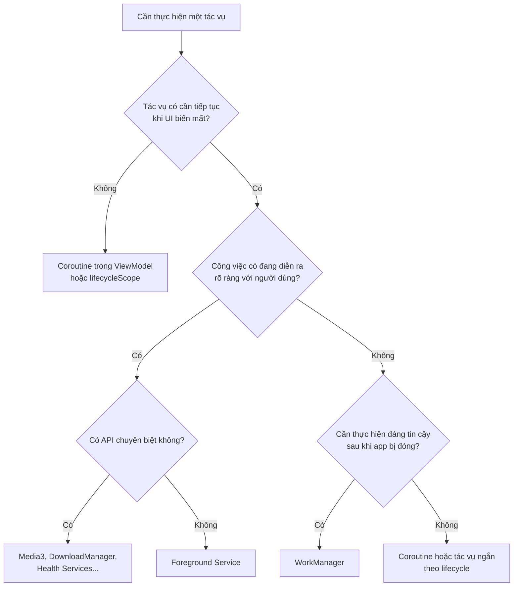
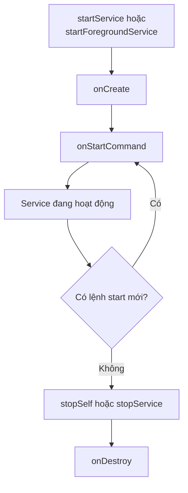
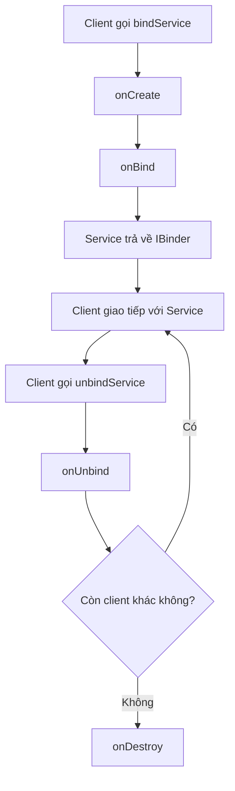
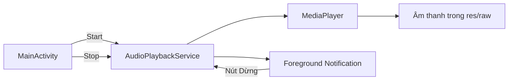

# 020 - Services

[](https://developer.android.com/develop/background-work/services?utm_source=chatgpt.com)


**Học phần:** 02 - App Components and User Interface
**Module:** Module 03 - App Components
**Nhóm nội dung:** Other Components
**Nguồn roadmap:** App Components / Other Components
**Loại bài:** Lesson
**Thứ tự trong module:** 020
**Thời lượng gợi ý:** 24 phút

---

## 1. Tóm tắt

**Service** là một Android App Component không có giao diện trực tiếp, thường được sử dụng để thực hiện công việc cần tiếp tục khi người dùng rời khỏi một `Activity`, hoặc để cung cấp một API cho các component khác kết nối vào.

Service **không phải là một thread riêng**. Theo mặc định, các callback của Service vẫn chạy trên **main thread** của tiến trình ứng dụng. Vì vậy, các thao tác nặng như đọc tệp lớn, truy vấn mạng hoặc xử lý âm thanh vẫn phải được chuyển sang coroutine, executor hoặc API chuyên dụng. ([Android Developers][1])

Sau bài học, anh sẽ phân biệt được:

* Started Service, Bound Service và Foreground Service.
* Service với coroutine và WorkManager.
* Vòng đời của Service.
* Cách khai báo và khởi chạy Foreground Service.
* Những giới hạn quan trọng trên Android hiện đại.

---

## 2. Mục tiêu học tập

Sau khi hoàn thành bài này, anh có thể:

* Giải thích Service bằng ngôn ngữ của mình.
* Phân biệt `startService()`, `bindService()` và Foreground Service.
* Hiểu các callback `onCreate()`, `onStartCommand()`, `onBind()` và `onDestroy()`.
* Biết rằng Service không tự tạo background thread.
* Lựa chọn giữa Service, coroutine và WorkManager.
* Tạo một Foreground Service phát âm thanh đơn giản.
* Kiểm thử việc chạy nền, dừng Service và giải phóng tài nguyên.
* Nhận diện các rủi ro về pin, lifecycle, quyền truy cập và Google Play policy.

---

## 3. Hình minh họa

### Vòng đời của Android Service


*Nguồn: [Android Developers – Services overview](https://developer.android.com/develop/background-work/services)*

Sơ đồ bên trái mô tả Service được tạo bằng `startService()`. Sơ đồ bên phải mô tả Service được tạo thông qua `bindService()`. Một Service cũng có thể vừa được **start**, vừa cho phép component khác **bind** vào. ([Android Developers][1])

---

## 4. Khái niệm Service

### 4.1 Định nghĩa

Service là một thành phần ứng dụng Android:

* Không tự cung cấp giao diện người dùng.
* Có lifecycle độc lập với `Activity`.
* Có thể tiếp tục hoạt động khi người dùng chuyển sang màn hình hoặc ứng dụng khác.
* Có thể cho phép `Activity`, `Fragment` hoặc ứng dụng khác kết nối và gửi lệnh.
* Phải được khai báo bằng thẻ `<service>` trong `AndroidManifest.xml`.

Android mô tả Service là một component dùng cho các tác vụ nền kéo dài hoặc cung cấp API giao tiếp cho component khác. ([Android Developers][2])

> **Mô hình tư duy quan trọng:**
> Service là một **lifecycle container**, không phải một background thread.

---

### 4.2 Ví dụ sử dụng

Một số trường hợp phù hợp với Service:

* Phát nhạc khi màn hình đã tắt.
* Theo dõi một buổi chạy bộ mà người dùng đã chủ động bắt đầu.
* Duy trì cuộc gọi thoại hoặc video.
* Ghi màn hình.
* Kết nối với thiết bị Bluetooth.
* Cung cấp một playback engine để nhiều màn hình điều khiển.
* Cho ứng dụng khác giao tiếp thông qua Binder hoặc AIDL.

Foreground Service phải hiển thị notification để người dùng biết ứng dụng đang thực hiện một công việc đáng chú ý và đang sử dụng tài nguyên hệ thống. ([Android Developers][3])

---

## 5. Các cách phân loại Service

Service thường được phân loại theo **hai góc nhìn khác nhau**.

### 5.1 Theo cách component tương tác với Service

| Loại            | Cách khởi tạo                                    | Khi nào kết thúc?                         | Trường hợp sử dụng                  |
| --------------- | ------------------------------------------------ | ----------------------------------------- | ----------------------------------- |
| Started Service | `startService()` hoặc `startForegroundService()` | Khi gọi `stopSelf()` hoặc `stopService()` | Phát nhạc, ghi hoạt động            |
| Bound Service   | `bindService()`                                  | Khi không còn client nào bind             | Activity điều khiển playback engine |
| Started + Bound | Start trước, bind sau                            | Phải stop và tất cả client phải unbind    | App nghe nhạc hoàn chỉnh            |

Một Bound Service hoạt động theo mô hình client-server. Component phía client nhận một `IBinder` để gửi lệnh, đọc trạng thái hoặc thực hiện IPC. Bound Service thông thường chỉ tồn tại trong thời gian có client kết nối. ([Android Developers][4])

### 5.2 Theo mức độ hiển thị với người dùng

| Loại               | Đặc điểm                                                                      |
| ------------------ | ----------------------------------------------------------------------------- |
| Foreground Service | Thực hiện công việc người dùng nhận biết được và phải có notification         |
| Background Service | Không có UI hoặc notification liên tục; bị hạn chế mạnh trên Android hiện đại |

Hai cách phân loại này có thể kết hợp. Ví dụ, một Service phát nhạc có thể đồng thời là:

* Started Service.
* Bound Service.
* Foreground Service.

---

## 6. Service không phải là Thread

Đoạn code sau vẫn chạy trên main thread:

```kotlin
class BadService : Service() {

    override fun onStartCommand(
        intent: Intent?,
        flags: Int,
        startId: Int
    ): Int {
        // Sai: callback này mặc định vẫn chạy trên main thread.
        Thread.sleep(10_000)

        return START_NOT_STICKY
    }

    override fun onBind(intent: Intent?): IBinder? = null
}
```

Hậu quả có thể xảy ra:

* UI bị đứng.
* Xuất hiện ANR.
* Service không kịp chuyển thành Foreground Service.
* Notification phản hồi chậm.
* Hệ thống dừng hoặc hạn chế ứng dụng.

Android xác nhận Service chạy trên main thread của ứng dụng theo mặc định. Nếu Service thực hiện công việc blocking hoặc CPU-intensive, lập trình viên vẫn phải chuyển công việc sang thread khác. ([Android Developers][1])

Ví dụ sử dụng coroutine:

```kotlin
class ProcessingService : Service() {

    private val serviceScope =
        CoroutineScope(SupervisorJob() + Dispatchers.IO)

    override fun onStartCommand(
        intent: Intent?,
        flags: Int,
        startId: Int
    ): Int {
        serviceScope.launch {
            runCatching {
                processLargeFile()
            }.onFailure { error ->
                Log.e("ProcessingService", "Processing failed", error)
            }

            stopSelf(startId)
        }

        return START_NOT_STICKY
    }

    override fun onDestroy() {
        serviceScope.cancel()
        super.onDestroy()
    }

    override fun onBind(intent: Intent?): IBinder? = null

    private suspend fun processLargeFile() {
        // Thực hiện công việc trên Dispatchers.IO.
    }
}
```

---

## 7. Phân biệt Service, coroutine và WorkManager

| Nhu cầu                                          | Giải pháp phù hợp                                                        |
| ------------------------------------------------ | ------------------------------------------------------------------------ |
| Tải dữ liệu khi màn hình đang mở                 | Coroutine trong ViewModel                                                |
| Tác vụ có thể hủy khi người dùng rời màn hình    | Coroutine                                                                |
| Đồng bộ dữ liệu cần hoàn thành dù app bị đóng    | WorkManager                                                              |
| Tác vụ định kỳ                                   | WorkManager                                                              |
| Phát nhạc khi người dùng rời app                 | Foreground Service                                                       |
| Theo dõi một hoạt động người dùng đang nhận biết | Foreground Service                                                       |
| Activity cần điều khiển một engine dùng chung    | Bound Service                                                            |
| Báo thức chính xác                               | AlarmManager                                                             |
| Download lớn do người dùng chủ động thực hiện    | API download phù hợp hoặc giải pháp background-work được Android đề xuất |

WorkManager được Android khuyến nghị cho công việc bền vững cần tiếp tục hoặc được lên lịch lại sau khi ứng dụng thoát hay thiết bị khởi động lại. Trong phần lớn trường hợp background task, nên đánh giá WorkManager trước khi tự tạo Service. ([Android Developers][5])

### Sơ đồ lựa chọn API



Đây là sơ đồ rút gọn. Android khuyến nghị ưu tiên API chuyên dụng hoặc WorkManager khi chúng phù hợp, thay vì dùng Foreground Service cho mọi công việc nền. ([Android Developers][6])

---

## 8. Vòng đời của Service

### 8.1 Started Service



Đặc điểm:

* `onCreate()` chỉ được gọi khi instance Service được tạo lần đầu.
* `onStartCommand()` có thể được gọi nhiều lần.
* Mỗi lần start có một `startId`.
* Started Service phải chủ động dừng khi hoàn tất.
* Service không có callback `onStop()`.
* Callback cuối cùng là `onDestroy()`.

Started Service tiếp tục tồn tại cho đến khi gọi `stopSelf()` hoặc một component khác gọi `stopService()`. ([Android Developers][1])

---

### 8.2 Bound Service



Bound Service có thể có nhiều client kết nối cùng lúc. Android thường gọi `onBind()` khi client đầu tiên bind, sau đó tái sử dụng communication channel cho những client tiếp theo. ([Android Developers][4])

---

### 8.3 Các callback quan trọng

| Callback           | Vai trò                       | Việc nên thực hiện                                 |
| ------------------ | ----------------------------- | -------------------------------------------------- |
| `onCreate()`       | Khởi tạo Service một lần      | Tạo player, scope, listener, notification channel  |
| `onStartCommand()` | Nhận lệnh start               | Đọc action, bắt đầu công việc, trả về restart mode |
| `onBind()`         | Cung cấp Binder               | Trả về API để client giao tiếp                     |
| `onUnbind()`       | Client cuối cùng ngắt kết nối | Dừng listener không còn cần thiết                  |
| `onRebind()`       | Client bind lại               | Khôi phục kết nối                                  |
| `onDestroy()`      | Service sắp bị hủy            | Release player, hủy coroutine, unregister receiver |

---

## 9. Giá trị trả về của `onStartCommand()`

### `START_NOT_STICKY`

Hệ thống không cần tự tạo lại Service sau khi tiến trình bị kill.

Phù hợp khi:

* Công việc có thể được người dùng bắt đầu lại.
* Không muốn hành động bị thực hiện ngoài ý muốn.
* Intent cũ không còn giá trị.

```kotlin
return START_NOT_STICKY
```

### `START_STICKY`

Hệ thống có thể tạo lại Service nhưng không nhất thiết gửi lại Intent cũ.

Phù hợp với một số Service duy trì trạng thái liên tục, nhưng Service phải tự khôi phục state an toàn.

```kotlin
return START_STICKY
```

### `START_REDELIVER_INTENT`

Hệ thống có thể tạo lại Service và gửi lại Intent chưa xử lý xong.

```kotlin
return START_REDELIVER_INTENT
```

Không nên chọn restart mode chỉ với mục tiêu “giữ Service sống mãi”. Ứng dụng phải xử lý idempotency, duplicate command và trạng thái tiến trình bị kill.

---

## 10. Thực hành: Foreground Service phát âm thanh

### 10.1 Kiến trúc ví dụ



Đây là ví dụ học tập để hiểu Service. Với ứng dụng phát media production, Android khuyến nghị đặt `Player` và `MediaSession` trong `MediaSessionService` của Media3 để hỗ trợ system media control, Bluetooth, Android Auto và các client bên ngoài. ([Android Developers][7])

---

### 10.2 Chuẩn bị tệp âm thanh

Đặt một tệp âm thanh vào:

```text
app/src/main/res/raw/demo_audio.mp3
```

Tên tệp resource phải viết thường và không chứa khoảng trắng.

---

### 10.3 Khai báo trong Manifest

```xml
<manifest xmlns:android="http://schemas.android.com/apk/res/android">

    <uses-permission
        android:name="android.permission.FOREGROUND_SERVICE" />

    <uses-permission
        android:name="android.permission.FOREGROUND_SERVICE_MEDIA_PLAYBACK" />

    <uses-permission
        android:name="android.permission.POST_NOTIFICATIONS" />

    <application
        ...>

        <service
            android:name=".AudioPlaybackService"
            android:exported="false"
            android:foregroundServiceType="mediaPlayback" />

    </application>

</manifest>
```

Từ Android 14, ứng dụng target API 34 trở lên phải khai báo đúng Foreground Service type và các permission tương ứng. Nếu type sử dụng lúc chạy không được khai báo trong Manifest, hệ thống có thể ném exception. ([Android Developers][6])

`android:exported="false"` ngăn ứng dụng khác khởi chạy trực tiếp Service nội bộ này.

---

### 10.4 Tạo `AudioPlaybackService`

```kotlin
package com.example.servicesdemo

import android.app.NotificationChannel
import android.app.NotificationManager
import android.app.PendingIntent
import android.app.Service
import android.content.Intent
import android.content.pm.ServiceInfo
import android.media.MediaPlayer
import android.os.Build
import android.os.IBinder
import android.util.Log
import androidx.core.app.NotificationCompat
import androidx.core.app.ServiceCompat

class AudioPlaybackService : Service() {

    companion object {
        private const val TAG = "AudioPlaybackService"
        private const val CHANNEL_ID = "audio_playback"
        private const val NOTIFICATION_ID = 1001

        const val ACTION_START =
            "com.example.servicesdemo.action.START_AUDIO"

        const val ACTION_STOP =
            "com.example.servicesdemo.action.STOP_AUDIO"
    }

    private var mediaPlayer: MediaPlayer? = null

    override fun onCreate() {
        super.onCreate()

        Log.d(TAG, "onCreate")

        createNotificationChannel()

        mediaPlayer = MediaPlayer.create(
            this,
            R.raw.demo_audio
        )?.apply {
            isLooping = true

            setOnErrorListener { _, what, extra ->
                Log.e(
                    TAG,
                    "MediaPlayer error: what=$what, extra=$extra"
                )

                stopSelf()
                true
            }
        }
    }

    override fun onStartCommand(
        intent: Intent?,
        flags: Int,
        startId: Int
    ): Int {
        Log.d(
            TAG,
            "onStartCommand: action=${intent?.action}, startId=$startId"
        )

        when (intent?.action) {
            ACTION_STOP -> {
                stopSelf()
                return START_NOT_STICKY
            }

            ACTION_START, null -> {
                startAsForeground()

                if (mediaPlayer?.isPlaying != true) {
                    mediaPlayer?.start()
                }
            }
        }

        return START_NOT_STICKY
    }

    private fun startAsForeground() {
        val stopIntent =
            Intent(this, AudioPlaybackService::class.java).apply {
                action = ACTION_STOP
            }

        val stopPendingIntent = PendingIntent.getService(
            this,
            1,
            stopIntent,
            PendingIntent.FLAG_UPDATE_CURRENT or
                PendingIntent.FLAG_IMMUTABLE
        )

        val openAppIntent =
            Intent(this, MainActivity::class.java)

        val openAppPendingIntent = PendingIntent.getActivity(
            this,
            2,
            openAppIntent,
            PendingIntent.FLAG_UPDATE_CURRENT or
                PendingIntent.FLAG_IMMUTABLE
        )

        val notification = NotificationCompat.Builder(
            this,
            CHANNEL_ID
        )
            .setSmallIcon(R.drawable.ic_music_note)
            .setContentTitle("Đang phát âm thanh")
            .setContentText("Âm thanh tiếp tục khi rời ứng dụng")
            .setContentIntent(openAppPendingIntent)
            .setOngoing(true)
            .addAction(
                R.drawable.ic_stop,
                "Dừng",
                stopPendingIntent
            )
            .build()

        val foregroundServiceType =
            if (Build.VERSION.SDK_INT >= Build.VERSION_CODES.Q) {
                ServiceInfo.FOREGROUND_SERVICE_TYPE_MEDIA_PLAYBACK
            } else {
                0
            }

        ServiceCompat.startForeground(
            this,
            NOTIFICATION_ID,
            notification,
            foregroundServiceType
        )
    }

    private fun createNotificationChannel() {
        if (Build.VERSION.SDK_INT < Build.VERSION_CODES.O) {
            return
        }

        val channel = NotificationChannel(
            CHANNEL_ID,
            "Phát âm thanh",
            NotificationManager.IMPORTANCE_LOW
        ).apply {
            description =
                "Thông báo cho hoạt động phát âm thanh trong nền"
        }

        val notificationManager =
            getSystemService(NotificationManager::class.java)

        notificationManager.createNotificationChannel(channel)
    }

    override fun onDestroy() {
        Log.d(TAG, "onDestroy")

        mediaPlayer?.let { player ->
            runCatching {
                if (player.isPlaying) {
                    player.stop()
                }
            }

            player.release()
        }

        mediaPlayer = null

        super.onDestroy()
    }

    override fun onBind(intent: Intent?): IBinder? {
        return null
    }
}
```

Foreground Service được khởi chạy theo hai bước: component gọi `startForegroundService()`, sau đó Service gọi `ServiceCompat.startForeground()` để chuyển chính nó thành Foreground Service và cung cấp notification. ([Android Developers][8])

---

### 10.5 Khởi chạy Service từ Activity

```kotlin
private fun startAudioService() {
    val intent =
        Intent(this, AudioPlaybackService::class.java).apply {
            action = AudioPlaybackService.ACTION_START
        }

    ContextCompat.startForegroundService(this, intent)
}

private fun stopAudioService() {
    val intent =
        Intent(this, AudioPlaybackService::class.java)

    stopService(intent)
}
```

Ví dụ với hai Button:

```kotlin
binding.startButton.setOnClickListener {
    startAudioService()
}

binding.stopButton.setOnClickListener {
    stopAudioService()
}
```

Trên Android 13 trở lên, ứng dụng nên yêu cầu quyền notification trước khi bắt đầu trải nghiệm playback để người dùng nhìn thấy đầy đủ notification điều khiển.

---

## 11. Quy định Foreground Service quan trọng

### Android 12 trở lên

Ứng dụng target Android 12, API 31 trở lên nhìn chung không được khởi chạy Foreground Service khi ứng dụng đang ở background, ngoại trừ một số trường hợp được hệ thống cho phép.

Nếu vi phạm, hệ thống có thể ném:

```text
ForegroundServiceStartNotAllowedException
```

Một hành động rõ ràng từ người dùng trên Activity, notification hoặc widget có thể là trường hợp cho phép khởi chạy. ([Android Developers][9])

### Android 14 trở lên

Ứng dụng target API 34 trở lên phải:

1. Khai báo `android:foregroundServiceType`.
2. Khai báo `FOREGROUND_SERVICE`.
3. Khai báo permission riêng của từng type.
4. Đảm bảo runtime permission đã được cấp nếu type yêu cầu.
5. Chỉ sử dụng type đúng với hành vi thực tế.

Ví dụ:

```xml
<uses-permission
    android:name="android.permission.FOREGROUND_SERVICE" />

<uses-permission
    android:name="android.permission.FOREGROUND_SERVICE_LOCATION" />

<service
    android:name=".LocationTrackingService"
    android:foregroundServiceType="location"
    android:exported="false" />
```

Các type phổ biến gồm `mediaPlayback`, `location`, `camera`, `microphone`, `connectedDevice`, `health`, `dataSync`, `mediaProjection` và `shortService`. Một số type còn yêu cầu runtime permission hoặc có giới hạn thời gian riêng. ([Android Developers][6])

---

## 12. State và lifecycle

### 12.1 Không lưu state quan trọng chỉ trong Service

Ví dụ không an toàn:

```kotlin
private var uploadedBytes: Long = 0
```

Nếu tiến trình bị kill, giá trị trên sẽ biến mất.

State quan trọng nên được lưu trong:

* Room.
* DataStore.
* File.
* Repository.
* Server.
* WorkManager progress nếu công việc sử dụng Worker.

### 12.2 Service không phụ thuộc vào rotate

Khi xoay màn hình:

* `Activity` có thể bị recreate.
* Started Service vẫn có thể tiếp tục chạy.
* Activity mới không nên tạo thêm một Service trùng lặp.
* UI nên đọc trạng thái từ repository, Binder, `StateFlow` hoặc MediaController.

### 12.3 Intent phải được xử lý idempotent

Service có thể nhận nhiều lệnh start:

```kotlin
override fun onStartCommand(
    intent: Intent?,
    flags: Int,
    startId: Int
): Int {
    if (intent?.action == ACTION_START &&
        mediaPlayer?.isPlaying != true
    ) {
        mediaPlayer?.start()
    }

    return START_NOT_STICKY
}
```

Kiểm tra trạng thái trước khi thực hiện giúp tránh:

* Phát nhiều player cùng lúc.
* Tạo nhiều coroutine giống nhau.
* Upload cùng một tệp nhiều lần.
* Hiển thị nhiều notification trùng nhau.

---

## 13. Lỗi phổ biến của lập trình viên mới

### Lỗi 1: Nghĩ rằng Service tự chạy trên background thread

```kotlin
override fun onStartCommand(
    intent: Intent?,
    flags: Int,
    startId: Int
): Int {
    downloadLargeFile() // Có thể block main thread.
    return START_NOT_STICKY
}
```

**Cách sửa:** dùng coroutine, executor hoặc API chuyên biệt.

---

### Lỗi 2: Dùng Service cho mọi background task

Ví dụ không nên:

```text
Cứ 15 phút tạo Service để gọi API đồng bộ dữ liệu.
```

Tác vụ định kỳ và cần chạy đáng tin cậy phù hợp hơn với WorkManager. ([Android Developers][5])

---

### Lỗi 3: Không dừng Service

```kotlin
// Công việc đã hoàn tất nhưng không gọi stopSelf().
```

Hậu quả:

* Notification tồn tại lâu.
* Tốn pin.
* Tốn RAM.
* Người dùng nghĩ ứng dụng vẫn đang thực hiện công việc.

Cách sửa:

```kotlin
try {
    performTask()
} finally {
    stopSelf(startId)
}
```

---

### Lỗi 4: Không giải phóng tài nguyên

Các tài nguyên cần kiểm tra trong `onDestroy()`:

* `MediaPlayer`.
* Coroutine scope.
* Sensor listener.
* Location callback.
* BroadcastReceiver.
* Bluetooth connection.
* File stream.
* Wake lock.

---

### Lỗi 5: Khởi chạy Foreground Service từ background

```kotlin
ContextCompat.startForegroundService(
    context,
    serviceIntent
)
```

Đoạn code có thể chạy khi Activity hiển thị nhưng có thể thất bại nếu được gọi tùy tiện khi app đang background trên Android 12 trở lên. ([Android Developers][9])

---

### Lỗi 6: Thiếu Foreground Service type

```xml
<service
    android:name=".AudioPlaybackService"
    android:exported="false" />
```

Với ứng dụng target Android hiện đại, cần khai báo type thích hợp:

```xml
<service
    android:name=".AudioPlaybackService"
    android:exported="false"
    android:foregroundServiceType="mediaPlayback" />
```

---

### Lỗi 7: Export Service không cần thiết

```xml
<service
    android:name=".InternalService"
    android:exported="true" />
```

Nếu Service chỉ dùng nội bộ, nên đặt:

```xml
android:exported="false"
```

Nếu phải export, cần kiểm tra caller, permission và dữ liệu đầu vào để tránh component khác gửi Intent độc hại.

---

## 14. Kiểm thử

### 14.1 Checklist kiểm thử thủ công

* [ ] Nhấn Start và kiểm tra âm thanh bắt đầu.
* [ ] Notification xuất hiện.
* [ ] Nhấn Home và xác nhận âm thanh tiếp tục.
* [ ] Quay lại ứng dụng và không xuất hiện thêm player.
* [ ] Xoay màn hình và kiểm tra Service không bị start trùng.
* [ ] Nhấn Stop trong Activity.
* [ ] Nhấn Stop từ notification.
* [ ] Kiểm tra notification biến mất.
* [ ] Kiểm tra `onDestroy()` được log.
* [ ] Tắt màn hình và kiểm tra hành vi.
* [ ] Thử khi notification permission bị từ chối.
* [ ] Thử trên Android 12, 13, 14 và phiên bản target hiện tại.
* [ ] Kiểm tra ứng dụng sau khi tiến trình bị hệ thống dừng.
* [ ] Kiểm tra không còn coroutine, player hoặc listener bị rò rỉ.

Từ Android 13, người dùng có thể dừng ứng dụng đang chạy Foreground Service thông qua Task Manager của hệ thống. Ứng dụng cần xử lý đúng khi bị người dùng dừng theo cách này. ([Android Developers][10])

---

### 14.2 Quan sát Logcat

```bash
adb logcat | grep AudioPlaybackService
```

Kết quả mong đợi:

```text
AudioPlaybackService: onCreate
AudioPlaybackService: onStartCommand: action=...START_AUDIO
AudioPlaybackService: onDestroy
```

---

### 14.3 Kiểm tra Service bằng `dumpsys`

```bash
adb shell dumpsys activity services com.example.servicesdemo
```

Hoặc kiểm tra toàn bộ Activity Manager:

```bash
adb shell dumpsys activity services
```

`dumpsys` cung cấp thông tin chẩn đoán về các system service và component đang chạy trên thiết bị được kết nối qua ADB. ([Android Developers][11])

---

### 14.4 Kiểm thử logic tách khỏi Service

Không nên đặt toàn bộ business logic trực tiếp trong Service:

```kotlin
class PlaybackController {

    private var playing = false

    fun start() {
        if (playing) return
        playing = true
    }

    fun stop() {
        playing = false
    }

    fun isPlaying(): Boolean = playing
}
```

Unit test:

```kotlin
class PlaybackControllerTest {

    @Test
    fun start_twice_keeps_single_playback_state() {
        val controller = PlaybackController()

        controller.start()
        controller.start()

        assertTrue(controller.isPlaying())
    }

    @Test
    fun stop_after_start_changes_state_to_false() {
        val controller = PlaybackController()

        controller.start()
        controller.stop()

        assertFalse(controller.isPlaying())
    }
}
```

Service chỉ nên đóng vai trò:

* Nhận Intent.
* Quản lý lifecycle.
* Tạo notification.
* Gọi use case hoặc controller.
* Giải phóng resource.

---

## 15. Ảnh hưởng đến chất lượng ứng dụng

### UX

Service ảnh hưởng trực tiếp đến UX khi:

* Notification không giải thích ứng dụng đang làm gì.
* Không có nút Stop hoặc Cancel.
* Playback bị dừng khi người dùng khóa màn hình.
* Service tiếp tục chạy sau khi công việc hoàn tất.
* UI hiển thị trạng thái khác với Service.

### Reliability

Các rủi ro reliability:

* Tiến trình bị kill làm mất state.
* Service được restart nhưng Intent hoặc dữ liệu không còn.
* Command bị gửi nhiều lần.
* Mạng mất giữa quá trình upload.
* Tài nguyên không được release.
* Service không xử lý hành động người dùng dừng ứng dụng.

### Maintainability

Để dễ bảo trì:

```text
Service
   │
   ├── NotificationFactory
   ├── PlaybackController
   ├── Repository
   └── AnalyticsLogger
```

Không nên:

```text
Service 2.000 dòng
   ├── Gọi API
   ├── Truy vấn database
   ├── Tạo notification
   ├── Parse JSON
   ├── Điều khiển UI
   └── Chứa toàn bộ business logic
```

### Performance và pin

Foreground Service không phải cơ chế để ứng dụng được chạy vô hạn mà không bị kiểm soát. App nên:

* Chỉ chạy khi thật sự cần thiết.
* Dừng ngay khi công việc hoàn thành.
* Không polling mạng liên tục.
* Không giữ wake lock nếu không cần.
* Giảm tần suất location hoặc sensor.
* Ưu tiên API chuyên dụng và scheduler do hệ thống quản lý.

Android cảnh báo việc chọn sai background API có thể gây hao pin, giảm hiệu năng và ảnh hưởng khả năng phát hành ứng dụng. ([Android Developers][12])

---

## 16. Checklist production

### Manifest và bảo mật

* [ ] Service đã được khai báo trong Manifest.
* [ ] `android:exported` được thiết lập rõ ràng.
* [ ] Service nội bộ dùng `android:exported="false"`.
* [ ] Foreground Service type đúng với use case.
* [ ] Có đủ permission tương ứng.
* [ ] Runtime permission được yêu cầu trước khi khởi chạy.
* [ ] Intent input được kiểm tra và validate.
* [ ] Không ghi secret hoặc token vào Intent extras.

### Lifecycle

* [ ] `onCreate()` chỉ dùng cho khởi tạo một lần.
* [ ] `onStartCommand()` xử lý được nhiều lệnh.
* [ ] Command có tính idempotent.
* [ ] Có điều kiện gọi `stopSelf()` hoặc `stopService()`.
* [ ] Tài nguyên được giải phóng trong `onDestroy()`.
* [ ] Coroutine scope được cancel.
* [ ] Listener và receiver được unregister.
* [ ] State quan trọng không chỉ nằm trong RAM.

### UX

* [ ] Notification mô tả rõ công việc đang chạy.
* [ ] Có hành động Stop hoặc Cancel nếu phù hợp.
* [ ] Không hiển thị notification gây hiểu nhầm.
* [ ] UI đồng bộ với trạng thái thực tế của Service.
* [ ] Người dùng có thể quay lại màn hình liên quan từ notification.
* [ ] Service không tiếp tục ngoài mong đợi.

### Testing

* [ ] Test khi app foreground.
* [ ] Test khi app background.
* [ ] Test khi khóa màn hình.
* [ ] Test sau configuration change.
* [ ] Test mất mạng.
* [ ] Test bị thu hồi permission.
* [ ] Test process death.
* [ ] Test người dùng dừng app từ system Task Manager.
* [ ] Test nhiều lệnh Start liên tiếp.
* [ ] Test nút Stop từ notification.
* [ ] Test trên nhiều API level.

### Release

* [ ] Kiểm tra target SDK hiện tại.
* [ ] Kiểm tra quy định Foreground Service của Android.
* [ ] Kiểm tra khai báo Foreground Service trong Play Console.
* [ ] Kiểm tra Android Vitals, ANR và battery usage.
* [ ] Kiểm tra notification channel.
* [ ] Kiểm tra privacy disclosure nếu dùng location, camera hoặc microphone.

Ứng dụng target Android 14 trở lên có thể phải khai báo các Foreground Service type trong phần App content của Play Console, ngoài khai báo trong Manifest. ([Android Developers][6])

---

## 17. Ghi chú năm dòng về Services

1. Service là Android component không có giao diện trực tiếp.
2. Service không tự chạy trên background thread mà mặc định vẫn dùng main thread.
3. Started Service chạy đến khi gọi `stopSelf()` hoặc `stopService()`.
4. Bound Service cho phép component khác giao tiếp thông qua `IBinder`.
5. Foreground Service phải có notification; các tác vụ đồng bộ bền vững thường phù hợp hơn với WorkManager.

---

## 18. Artifact đưa vào portfolio

### Mini project: Background Audio Player

Các chức năng tối thiểu:

* Start playback.
* Stop playback.
* Phát tiếp khi người dùng nhấn Home.
* Foreground notification.
* Nút Stop trong notification.
* Log lifecycle.
* Xử lý rotate.
* Không tạo nhiều `MediaPlayer`.

Cấu trúc gợi ý:

```text
services-demo/
├── app/
│   └── src/main/
│       ├── java/com/example/servicesdemo/
│       │   ├── MainActivity.kt
│       │   ├── AudioPlaybackService.kt
│       │   └── NotificationFactory.kt
│       ├── res/
│       │   ├── raw/demo_audio.mp3
│       │   └── drawable/
│       └── AndroidManifest.xml
├── screenshots/
│   ├── main-screen.png
│   ├── foreground-notification.png
│   └── lifecycle-logcat.png
└── README.md
```

### Nội dung README

```markdown
# Android Foreground Service Demo

## Mục tiêu

Minh họa vòng đời của Started Service và cách phát âm thanh
khi ứng dụng không còn hiển thị.

## Công nghệ

- Kotlin
- Android Service
- Foreground Notification
- MediaPlayer
- AndroidX Core

## Kiến thức thể hiện

- Service lifecycle
- Foreground Service permissions
- Notification channel
- Process và configuration change
- Resource cleanup
- Debug bằng Logcat và dumpsys

## Test cases

- Start và Stop playback
- Nhấn Home
- Xoay màn hình
- Stop từ notification
- Từ chối notification permission
- Process bị dừng
```

---

## 19. Bài tập

### Bài tập 1: Giải thích khái niệm

Viết khoảng 100–150 từ giải thích:

* Service là gì?
* Service khác coroutine như thế nào?
* Khi nào dùng WorkManager thay vì Service?

### Bài tập 2: Mở rộng ví dụ

Thêm các tính năng:

* Nút Pause.
* Nút Resume.
* Hiển thị tên bài hát trong notification.
* Tự gọi `stopSelf()` khi phát xong.
* Lưu trạng thái playback.
* Không tạo player mới khi người dùng nhấn Start nhiều lần.

### Bài tập 3: Phân tích lỗi

Đọc đoạn code:

```kotlin
class SyncService : Service() {

    override fun onStartCommand(
        intent: Intent?,
        flags: Int,
        startId: Int
    ): Int {
        while (true) {
            syncWithServer()
        }

        return START_STICKY
    }

    override fun onBind(intent: Intent?): IBinder? = null
}
```

Hãy tìm ít nhất năm vấn đề.

<details>
<summary>Gợi ý đáp án</summary>

* Vòng lặp vô hạn.
* Chạy trên main thread.
* Có nguy cơ ANR.
* Không có điều kiện dừng.
* Không giải phóng tài nguyên.
* Không xử lý lỗi mạng.
* Không backoff.
* Không kiểm tra kết nối.
* `START_STICKY` có thể làm Service được tạo lại ngoài mong muốn.
* Công việc đồng bộ có thể phù hợp hơn với WorkManager.
* Không có Foreground notification nếu chạy lâu và cần người dùng nhận biết.
* Không xử lý duplicate sync.

</details>

---

## 20. Checklist hoàn thành bài

* [ ] Có định nghĩa ngắn gọn về Service.
* [ ] Biết Service không phải background thread.
* [ ] Phân biệt Started Service và Bound Service.
* [ ] Hiểu Foreground Service.
* [ ] Mô tả được vòng đời Service.
* [ ] Biết khi nào dùng WorkManager.
* [ ] Có ví dụ Foreground Service bằng Kotlin.
* [ ] Có notification channel.
* [ ] Có nút dừng Service.
* [ ] Có xử lý `onDestroy()`.
* [ ] Có test rotate, background và process death.
* [ ] Có artifact nhỏ để đưa vào portfolio.

---

## 21. Kết luận

Service phù hợp khi ứng dụng cần một component có lifecycle riêng để thực hiện công việc ngoài phạm vi của màn hình hoặc cung cấp API cho component khác. Tuy nhiên, Service không phải giải pháp mặc định cho mọi background task.

Ba câu hỏi cần đặt ra trước khi tạo Service:

1. Công việc có cần tiếp tục khi UI biến mất không?
2. Người dùng có nhận biết và mong đợi công việc này đang chạy không?
3. WorkManager hoặc một API chuyên dụng có phù hợp hơn không?

Một triển khai production tốt phải kiểm soát rõ lifecycle, thread, notification, state, permission, mức sử dụng pin và cách Service kết thúc.

[1]: https://developer.android.com/develop/background-work/services "Services overview  |  Background work  |  Android Developers"
[2]: https://developer.android.com/guide/topics/manifest/service-element "<service>  |  App architecture  |  Android Developers"
[3]: https://developer.android.com/develop/background-work/services/fgs "Foreground services overview  |  Background work  |  Android Developers"
[4]: https://developer.android.com/develop/background-work/services/bound-services "Bound services overview  |  Background work  |  Android Developers"
[5]: https://developer.android.com/develop/background-work/background-tasks/persistent?hl=en&utm_source=chatgpt.com "Task scheduling  |  Background work  |  Android Developers"
[6]: https://developer.android.com/develop/background-work/services/fgs/service-types "Foreground service types  |  Background work  |  Android Developers"
[7]: https://developer.android.com/media/media3/session/background-playback?hl=en&utm_source=chatgpt.com "Background playback with a MediaSessionService  |  Android media  |  Android Developers"
[8]: https://developer.android.com/develop/background-work/services/fgs/launch "Launch a foreground service  |  Background work  |  Android Developers"
[9]: https://developer.android.com/develop/background-work/services/fgs/restrictions-bg-start "Restrictions on starting a foreground service from the background  |  Background work  |  Android Developers"
[10]: https://developer.android.com/develop/background-work/services/fgs/handle-user-stopping?authuser=00&utm_source=chatgpt.com "Handle user-initiated stopping of apps running foreground services  |  Background work  |  Android Developers"
[11]: https://developer.android.com/tools/dumpsys?authuser=19&utm_source=chatgpt.com "dumpsys  |  Android Studio  |  Android Developers"
[12]: https://developer.android.com/develop/background-work/background-tasks?authuser=0000&utm_source=chatgpt.com "Background tasks overview  |  Background work  |  Android Developers"
