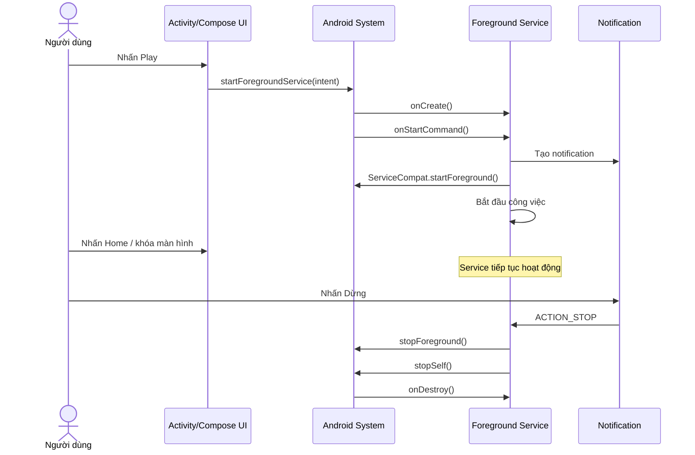
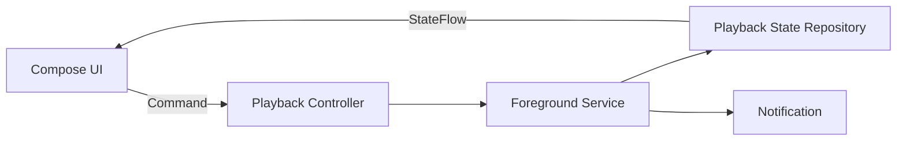

# 021 - Foreground Service

[](https://developer.android.com/design/ui/mobile/guides/home-screen/notifications?utm_source=chatgpt.com)


**Học phần:** 02 - App Components and User Interface
**Module:** Module 03 - App Components
**Nhóm nội dung:** Other Components
**Nguồn roadmap:** App Components / Other Components
**Loại bài:** Lesson
**Thứ tự trong module:** 021
**Thời lượng gợi ý:** 24 phút

---

## 1. Tóm tắt

**Foreground Service** là một `Service` dùng cho công việc đang diễn ra, có ý nghĩa rõ ràng đối với người dùng và cần tiếp tục khi người dùng rời khỏi màn hình ứng dụng, chẳng hạn:

* Phát nhạc hoặc podcast.
* Ghi lại một buổi chạy bộ.
* Điều hướng bằng GPS.
* Ghi âm cuộc gọi hoặc giọng nói.
* Chia sẻ màn hình.
* Duy trì một cuộc gọi đang diễn ra.

Foreground Service phải đi kèm một **notification** để người dùng biết ứng dụng đang sử dụng tài nguyên hệ thống. Tuy nhiên, Foreground Service không tạo ra thread riêng và cũng không làm ứng dụng trở nên “không thể bị tắt”; các tác vụ blocking vẫn phải được chuyển sang coroutine, executor hoặc worker thread. ([Android Developers][1])

---

## 2. Mục tiêu học tập

Sau bài học, anh có thể:

* Giải thích Foreground Service bằng ngôn ngữ của mình.
* Phân biệt Foreground Service với `WorkManager`, coroutine và Bound Service.
* Khai báo đúng service type và permission trong `AndroidManifest.xml`.
* Khởi chạy Foreground Service theo đúng lifecycle.
* Tạo notification có hành động dừng service.
* Tránh các lỗi phổ biến như:

  * `ForegroundServiceStartNotAllowedException`.
  * `MissingForegroundServiceTypeException`.
  * `SecurityException`.
  * Không gọi `startForeground()` đủ sớm.
* Kiểm thử service khi ứng dụng chuyển nền, xoay màn hình hoặc bị người dùng dừng.
* Tạo một mini project có thể đưa vào portfolio.

---

## 3. Giải thích Foreground Service trong 5 dòng

> Foreground Service là một thành phần Android thực hiện công việc đang diễn ra khi người dùng không còn mở màn hình ứng dụng.
> Công việc đó phải đủ quan trọng và có thể nhận biết được đối với người dùng.
> Service phải hiển thị notification trong thời gian hoạt động.
> Foreground Service không tự tạo background thread, vì vậy không được chạy tác vụ blocking trên main thread.
> Khi công việc hoàn tất, ứng dụng phải dừng service và giải phóng toàn bộ tài nguyên.

---

## 4. Hình minh họa

### 4.1. Notification của Foreground Service


*Hình: ứng dụng tiếp tục theo dõi hoạt động đi bộ và thông báo cho người dùng rằng quá trình vẫn đang diễn ra.* 

### 4.2. Lifecycle chung của Service


*Hình: lifecycle của Started Service và Bound Service. Foreground Service thường được triển khai dưới dạng Started Service rồi được nâng lên foreground.* 

---

## 5. Khái niệm chính

### 5.1. Foreground không có nghĩa là giao diện đang mở

Từ “foreground” trong Foreground Service không có nghĩa là Activity đang hiển thị trên màn hình.

Nó có nghĩa là:

* Hệ thống xem công việc này có mức ưu tiên cao hơn background work thông thường.
* Người dùng phải biết công việc đang diễn ra.
* Ứng dụng phải cung cấp notification liên quan đến công việc đó.
* Công việc có thể tiếp tục sau khi người dùng nhấn Home hoặc mở ứng dụng khác.

Ví dụ: người dùng mở ứng dụng âm nhạc, nhấn **Play**, sau đó khóa màn hình. Nhạc vẫn phát vì player được đặt trong Foreground Service thay vì phụ thuộc vào Activity.

### 5.2. Foreground Service vẫn chạy trên main thread

Một nhầm lẫn phổ biến là cho rằng kế thừa `Service` sẽ tự động đưa code sang background thread.

Điều này không đúng. Theo mặc định:

```text
Activity
Service
BroadcastReceiver
ContentProvider
```

đều chạy trong main thread của process ứng dụng. Tác vụ mạng, mã hóa file, xử lý ảnh hoặc vòng lặp nặng bên trong `Service` vẫn có thể gây ANR. ([Android Developers][1])

Ví dụ không nên làm:

```kotlin
override fun onStartCommand(
    intent: Intent?,
    flags: Int,
    startId: Int
): Int {
    // Không nên gọi network blocking trực tiếp tại đây.
    val result = blockingApi.downloadLargeFile()

    return START_NOT_STICKY
}
```

Nên chuyển công việc blocking sang coroutine:

```kotlin
private val serviceScope = CoroutineScope(
    SupervisorJob() + Dispatchers.IO
)

override fun onStartCommand(
    intent: Intent?,
    flags: Int,
    startId: Int
): Int {
    serviceScope.launch {
        runCatching {
            repository.downloadFile()
        }.also {
            stopSelf(startId)
        }
    }

    return START_NOT_STICKY
}

override fun onDestroy() {
    serviceScope.cancel()
    super.onDestroy()
}
```

---

## 6. Khi nào nên dùng Foreground Service?

| Trường hợp                                            | Có nên dùng? | Giải pháp phù hợp                             |
| ----------------------------------------------------- | -----------: | --------------------------------------------- |
| Phát nhạc khi người dùng khóa màn hình                |           Có | `MediaSessionService` hoặc media playback FGS |
| Theo dõi vị trí trong buổi chạy do người dùng bắt đầu |           Có | Location FGS                                  |
| Ghi âm do người dùng chủ động bật                     |           Có | Microphone FGS                                |
| Chia sẻ hoặc quay màn hình                            |           Có | Media projection FGS                          |
| Đồng bộ dữ liệu nhỏ, có thể chờ                       |        Không | `WorkManager`                                 |
| Gửi log analytics ngầm                                |        Không | Batch + `WorkManager`                         |
| Làm mới dữ liệu khi mở màn hình                       |        Không | Coroutine trong ViewModel                     |
| Muốn giữ process sống vô thời hạn                     |        Không | Thiết kế lại lifecycle                        |
| Upload file có thể retry và không cần UI liên tục     | Thường không | `WorkManager` hoặc API upload phù hợp         |
| Tác vụ chỉ tồn tại trong Activity                     |        Không | Coroutine hoặc thread gắn với lifecycle       |

`WorkManager` thường phù hợp hơn cho công việc có thể trì hoãn, cần retry hoặc cần đảm bảo hoàn thành nhưng không cần người dùng liên tục nhận biết. ([Android Developers][1])

### Câu hỏi quyết định nhanh

Trước khi tạo Foreground Service, hãy hỏi:

```text
Người dùng có vừa chủ động bắt đầu công việc này không?
                    |
          +---------+---------+
          |                   |
         Có                 Không
          |                   |
Công việc có cần tiếp tục    Ưu tiên WorkManager,
khi rời ứng dụng không?      JobScheduler hoặc API khác
          |
    +-----+-----+
    |           |
   Có          Không
    |           |
Người dùng có   Coroutine/ViewModel
cần biết nó
đang chạy không?
    |
 +--+--+
 |     |
Có    Không
 |     |
Có thể dùng   Thường không nên dùng
Foreground    Foreground Service
Service
```

---

## 7. Lifecycle khởi chạy

Một Foreground Service thường được khởi chạy qua hai bước:

1. Component gọi `startForegroundService()`.
2. Service gọi `ServiceCompat.startForeground()` để tự nâng mình thành Foreground Service.

Ứng dụng phải thực hiện bước thứ hai rất sớm sau khi service được tạo. Android cũng giới hạn việc khởi chạy Foreground Service từ background kể từ Android 12, ngoại trừ một số trường hợp đặc biệt. ([Android Developers][2])



### Lifecycle quan trọng

| Callback           | Vai trò                                            |
| ------------------ | -------------------------------------------------- |
| `onCreate()`       | Khởi tạo tài nguyên dùng một lần                   |
| `onStartCommand()` | Nhận lệnh bắt đầu, dừng hoặc cập nhật              |
| `onBind()`         | Trả về `IBinder` nếu cho phép component khác bind  |
| `onTaskRemoved()`  | Được gọi trong một số trường hợp task bị xóa       |
| `onDestroy()`      | Giải phóng player, coroutine, receiver, listener   |
| `onTimeout()`      | Xử lý timeout của một số FGS type trên Android mới |

Một Started Service có lifecycle độc lập với Activity đã khởi chạy nó. Vì vậy, xoay màn hình làm Activity được tạo lại nhưng không nhất thiết làm service dừng. UI không nên lưu trạng thái service chỉ bằng một biến Boolean cục bộ trong Activity. ([Android Developers][1])

---

## 8. Foreground Service type

Mỗi Foreground Service phải mô tả đúng loại công việc mà nó thực hiện.

Một số type thường gặp:

| Service type      | Ví dụ                                  |
| ----------------- | -------------------------------------- |
| `mediaPlayback`   | Nhạc, podcast, audio book              |
| `location`        | Điều hướng hoặc theo dõi buổi chạy     |
| `microphone`      | Ghi âm                                 |
| `camera`          | Quay video trong tác vụ đang diễn ra   |
| `mediaProjection` | Quay hoặc chia sẻ màn hình             |
| `connectedDevice` | Giao tiếp với thiết bị Bluetooth/USB   |
| `phoneCall`       | Cuộc gọi đang diễn ra                  |
| `health`          | Theo dõi sức khỏe hoặc vận động        |
| `dataSync`        | Đồng bộ dữ liệu do người dùng khởi tạo |
| `mediaProcessing` | Chuyển mã hoặc xử lý media lâu         |
| `shortService`    | Công việc quan trọng, rất ngắn         |

Từ Android 14, ứng dụng target API 34 trở lên phải khai báo Foreground Service type phù hợp. Hệ thống kiểm tra cả type và các permission liên quan khi service được nâng lên foreground. ([Android Developers][3])

---

## 9. Những thay đổi Android cần lưu ý trong năm 2026

### Android 12 — hạn chế khởi chạy từ background

Ứng dụng target API 31 trở lên thường không được khởi chạy Foreground Service khi ứng dụng đang ở background, trừ các trường hợp được miễn. Vi phạm có thể tạo ra:

```text
ForegroundServiceStartNotAllowedException
```

Vì vậy, nên bắt đầu service từ một hành động trực tiếp như người dùng nhấn **Play**, **Start workout** hoặc **Record**. ([Android Developers][4])

### Android 13 — notification permission và Task Manager

Android 13 bổ sung `POST_NOTIFICATIONS`. Ứng dụng không bắt buộc phải được cấp permission này mới có thể khởi chạy Foreground Service, nhưng vẫn phải tạo notification.

Khi permission bị từ chối, notification Foreground Service không miễn trừ có thể không xuất hiện trong notification drawer, nhưng người dùng vẫn thấy ứng dụng trong Task Manager. Android 13 cũng cho phép người dùng dismiss notification Foreground Service theo mặc định. ([Android Developers][5])

### Android 14 — bắt buộc service type

Ứng dụng target API 34 trở lên phải:

* Khai báo `android:foregroundServiceType`.
* Khai báo permission của type.
* Được cấp các runtime permission cần thiết trước khi nâng service lên foreground.

Thiếu type có thể gây `MissingForegroundServiceTypeException`; thiếu permission có thể gây `SecurityException`. ([Android Developers][3])

### Android 15 — timeout

Các Foreground Service type `dataSync` và `mediaProcessing` bị giới hạn tổng cộng khoảng sáu giờ trong mỗi khoảng 24 giờ khi ứng dụng ở background. Khi hết thời gian, hệ thống gọi `Service.onTimeout()` và service phải nhanh chóng tự dừng. ([Android Developers][6])

### Android 16 — Job quota vẫn được áp dụng

Job được tạo thông qua `JobScheduler`, `WorkManager` hoặc `DownloadManager` không còn tránh được runtime quota chỉ vì nó đang chạy đồng thời với Foreground Service. ([Android Developers][7])

### Android 17 — background audio được kiểm soát chặt hơn

Theo tài liệu Android 17 hiện tại, ứng dụng tương tác với audio khi ở background phải có Activity đang hiển thị hoặc một Foreground Service phù hợp; `shortService` không được xem là giải pháp cho background audio. ([Android Developers][8])

---

# 10. Thực hành: ứng dụng phát nhạc bằng Foreground Service

## 10.1. Yêu cầu

Ứng dụng có hai nút:

* **Phát nhạc:** khởi chạy Foreground Service.
* **Dừng nhạc:** dừng service.

Khi người dùng nhấn Home:

* Nhạc vẫn tiếp tục phát.
* Notification hiển thị trạng thái phát nhạc.
* Notification có nút **Dừng**.

## 10.2. Cấu trúc project

```text
app/
├── src/main/
│   ├── java/com/example/foregroundservice/
│   │   ├── MainActivity.kt
│   │   └── MusicForegroundService.kt
│   ├── res/
│   │   ├── drawable/
│   │   │   ├── ic_music_note.xml
│   │   │   └── ic_stop.xml
│   │   └── raw/
│   │       └── sample_audio.mp3
│   └── AndroidManifest.xml
```

---

## 10.3. Khai báo trong `AndroidManifest.xml`

```xml
<?xml version="1.0" encoding="utf-8"?>
<manifest xmlns:android="http://schemas.android.com/apk/res/android">

    <!-- Quyền cơ bản để chạy Foreground Service -->
    <uses-permission
        android:name="android.permission.FOREGROUND_SERVICE" />

    <!-- Quyền dành cho mediaPlayback FGS trên Android mới -->
    <uses-permission
        android:name="android.permission.FOREGROUND_SERVICE_MEDIA_PLAYBACK" />

    <!-- Notification runtime permission từ Android 13 -->
    <uses-permission
        android:name="android.permission.POST_NOTIFICATIONS" />

    <application
        android:allowBackup="true"
        android:label="Foreground Service Demo"
        android:theme="@style/Theme.ForegroundServiceDemo">

        <activity
            android:name=".MainActivity"
            android:exported="true">
            <intent-filter>
                <action android:name="android.intent.action.MAIN" />
                <category android:name="android.intent.category.LAUNCHER" />
            </intent-filter>
        </activity>

        <service
            android:name=".MusicForegroundService"
            android:exported="false"
            android:foregroundServiceType="mediaPlayback" />

    </application>

</manifest>
```

`android:exported="false"` ngăn ứng dụng khác trực tiếp khởi chạy service này. Type và permission phải khớp với công việc mà service thực hiện. ([Android Developers][3])

---

## 10.4. Tạo `MusicForegroundService.kt`

```kotlin
package com.example.foregroundservice

import android.app.Notification
import android.app.NotificationChannel
import android.app.NotificationManager
import android.app.PendingIntent
import android.app.Service
import android.content.Intent
import android.content.pm.ServiceInfo
import android.media.MediaPlayer
import android.os.Build
import android.os.IBinder
import androidx.core.app.NotificationCompat
import androidx.core.app.ServiceCompat

class MusicForegroundService : Service() {

    private var mediaPlayer: MediaPlayer? = null

    override fun onCreate() {
        super.onCreate()
        createNotificationChannel()
    }

    override fun onStartCommand(
        intent: Intent?,
        flags: Int,
        startId: Int
    ): Int {
        when (intent?.action) {
            ACTION_STOP -> {
                stopMusicAndService()
                return START_NOT_STICKY
            }

            ACTION_PLAY, null -> {
                // Phải đưa service lên foreground trước khi làm việc lâu.
                promoteToForeground()
                startMusic()
            }
        }

        /*
         * Demo không tự khởi động lại khi bị hệ thống dừng.
         * Ứng dụng production cần quyết định theo nghiệp vụ
         * và phải khôi phục state một cách rõ ràng.
         */
        return START_NOT_STICKY
    }

    override fun onBind(intent: Intent?): IBinder? {
        // Demo này là Started Service, không hỗ trợ binding.
        return null
    }

    override fun onDestroy() {
        releasePlayer()
        super.onDestroy()
    }

    private fun promoteToForeground() {
        val notification = createNotification()

        ServiceCompat.startForeground(
            this,
            NOTIFICATION_ID,
            notification,
            ServiceInfo.FOREGROUND_SERVICE_TYPE_MEDIA_PLAYBACK
        )
    }

    private fun startMusic() {
        if (mediaPlayer?.isPlaying == true) {
            return
        }

        releasePlayer()

        mediaPlayer = MediaPlayer.create(
            this,
            R.raw.sample_audio
        )?.apply {
            isLooping = true
            start()
        }

        // Không tạo được player thì dừng service để tránh service rỗng.
        if (mediaPlayer == null) {
            stopMusicAndService()
        }
    }

    private fun createNotification(): Notification {
        val openAppIntent = Intent(
            this,
            MainActivity::class.java
        )

        val openAppPendingIntent = PendingIntent.getActivity(
            this,
            REQUEST_OPEN_APP,
            openAppIntent,
            PendingIntent.FLAG_UPDATE_CURRENT or
                PendingIntent.FLAG_IMMUTABLE
        )

        val stopIntent = Intent(
            this,
            MusicForegroundService::class.java
        ).apply {
            action = ACTION_STOP
        }

        val stopPendingIntent = PendingIntent.getService(
            this,
            REQUEST_STOP_SERVICE,
            stopIntent,
            PendingIntent.FLAG_UPDATE_CURRENT or
                PendingIntent.FLAG_IMMUTABLE
        )

        return NotificationCompat.Builder(this, CHANNEL_ID)
            .setSmallIcon(R.drawable.ic_music_note)
            .setContentTitle("Đang phát nhạc")
            .setContentText("Nhấn Dừng để kết thúc phát nhạc")
            .setContentIntent(openAppPendingIntent)
            .setCategory(NotificationCompat.CATEGORY_TRANSPORT)
            .setPriority(NotificationCompat.PRIORITY_LOW)
            .setOnlyAlertOnce(true)
            .setOngoing(true)
            .addAction(
                R.drawable.ic_stop,
                "Dừng",
                stopPendingIntent
            )
            .build()
    }

    private fun createNotificationChannel() {
        if (Build.VERSION.SDK_INT < Build.VERSION_CODES.O) {
            return
        }

        val channel = NotificationChannel(
            CHANNEL_ID,
            "Phát nhạc",
            NotificationManager.IMPORTANCE_LOW
        ).apply {
            description = "Hiển thị trạng thái phát nhạc nền"
            setSound(null, null)
        }

        getSystemService(NotificationManager::class.java)
            .createNotificationChannel(channel)
    }

    private fun stopMusicAndService() {
        releasePlayer()
        removeForegroundNotification()
        stopSelf()
    }

    private fun releasePlayer() {
        mediaPlayer?.let { player ->
            runCatching {
                if (player.isPlaying) {
                    player.stop()
                }
            }

            player.release()
        }

        mediaPlayer = null
    }

    private fun removeForegroundNotification() {
        if (Build.VERSION.SDK_INT >= Build.VERSION_CODES.N) {
            stopForeground(STOP_FOREGROUND_REMOVE)
        } else {
            @Suppress("DEPRECATION")
            stopForeground(true)
        }
    }

    companion object {
        const val ACTION_PLAY =
            "com.example.foregroundservice.action.PLAY"

        const val ACTION_STOP =
            "com.example.foregroundservice.action.STOP"

        private const val CHANNEL_ID =
            "music_playback_channel"

        private const val NOTIFICATION_ID = 1001
        private const val REQUEST_OPEN_APP = 2001
        private const val REQUEST_STOP_SERVICE = 2002
    }
}
```

Quá trình chuẩn là gọi `startForegroundService()` từ component, sau đó gọi `ServiceCompat.startForeground()` bên trong service cùng notification và service type thích hợp. ([Android Developers][2])

---

## 10.5. Giao diện Jetpack Compose

```kotlin
package com.example.foregroundservice

import android.Manifest
import android.content.Context
import android.content.Intent
import android.content.pm.PackageManager
import android.os.Build
import android.os.Bundle
import androidx.activity.ComponentActivity
import androidx.activity.compose.rememberLauncherForActivityResult
import androidx.activity.compose.setContent
import androidx.activity.result.contract.ActivityResultContracts
import androidx.compose.foundation.layout.Arrangement
import androidx.compose.foundation.layout.Column
import androidx.compose.foundation.layout.fillMaxSize
import androidx.compose.foundation.layout.padding
import androidx.compose.material3.Button
import androidx.compose.material3.MaterialTheme
import androidx.compose.material3.Text
import androidx.compose.runtime.Composable
import androidx.compose.ui.Alignment
import androidx.compose.ui.Modifier
import androidx.compose.ui.platform.LocalContext
import androidx.compose.ui.unit.dp
import androidx.core.content.ContextCompat

class MainActivity : ComponentActivity() {

    override fun onCreate(savedInstanceState: Bundle?) {
        super.onCreate(savedInstanceState)

        setContent {
            MaterialTheme {
                ForegroundServiceScreen()
            }
        }
    }
}

@Composable
private fun ForegroundServiceScreen() {
    val context = LocalContext.current

    val notificationPermissionLauncher =
        rememberLauncherForActivityResult(
            ActivityResultContracts.RequestPermission()
        ) {
            /*
             * POST_NOTIFICATIONS không phải điều kiện bắt buộc
             * để khởi chạy FGS.
             *
             * Sau khi người dùng lựa chọn, tiếp tục hành động
             * mà họ vừa chủ động yêu cầu.
             */
            startMusicService(context)
        }

    Column(
        modifier = Modifier
            .fillMaxSize()
            .padding(24.dp),
        verticalArrangement = Arrangement.spacedBy(
            16.dp,
            Alignment.CenterVertically
        ),
        horizontalAlignment = Alignment.CenterHorizontally
    ) {
        Text(
            text = "Foreground Service Demo",
            style = MaterialTheme.typography.headlineSmall
        )

        Button(
            onClick = {
                val needsNotificationPermission =
                    Build.VERSION.SDK_INT >= Build.VERSION_CODES.TIRAMISU &&
                        ContextCompat.checkSelfPermission(
                            context,
                            Manifest.permission.POST_NOTIFICATIONS
                        ) != PackageManager.PERMISSION_GRANTED

                if (needsNotificationPermission) {
                    notificationPermissionLauncher.launch(
                        Manifest.permission.POST_NOTIFICATIONS
                    )
                } else {
                    startMusicService(context)
                }
            }
        ) {
            Text("Phát nhạc")
        }

        Button(
            onClick = {
                context.stopService(
                    Intent(
                        context,
                        MusicForegroundService::class.java
                    )
                )
            }
        ) {
            Text("Dừng nhạc")
        }
    }
}

private fun startMusicService(context: Context) {
    val intent = Intent(
        context,
        MusicForegroundService::class.java
    ).apply {
        action = MusicForegroundService.ACTION_PLAY
    }

    ContextCompat.startForegroundService(
        context,
        intent
    )
}
```

Android 13 không bắt buộc `POST_NOTIFICATIONS` để khởi chạy Foreground Service, nhưng yêu cầu permission theo ngữ cảnh giúp người dùng hiểu vì sao ứng dụng cần hiển thị notification. ([Android Developers][5])

---

## 11. Trạng thái và Configuration Change

### Cách làm chưa tốt

```kotlin
var isPlaying by remember {
    mutableStateOf(false)
}
```

Biến trên chỉ phản ánh trạng thái UI hiện tại. Nó có thể sai khi:

* Activity bị tạo lại.
* Process được khôi phục.
* Service bị người dùng dừng từ notification.
* Service gặp lỗi.
* Người dùng dừng toàn bộ app từ Task Manager.

### Cách làm tốt hơn



Trong production:

* Service hoặc player là nguồn trạng thái chính.
* UI gửi command: play, pause, stop.
* UI quan sát `StateFlow`, `MediaController` hoặc một state repository.
* Không để Activity là nguồn sự thật về việc service có đang chạy hay không.
* State cần thiết phải được lưu nếu cần phục hồi sau process death.

Đối với ứng dụng media thực tế, Android khuyến nghị đặt `Player` và `MediaSession` trong `MediaSessionService`. Media3 cũng tự quản lý media notification, system controls, Bluetooth, Android Auto và các controller bên ngoài. ([Android Developers][9])

---

## 12. Dừng Foreground Service đúng cách

Service có thể tự dừng:

```kotlin
stopForeground(STOP_FOREGROUND_REMOVE)
stopSelf()
```

Hoặc component khác có thể dừng:

```kotlin
context.stopService(
    Intent(context, MusicForegroundService::class.java)
)
```

Khi dừng, cần giải phóng:

* Media player.
* Coroutine scope.
* Location callback.
* Sensor listener.
* Broadcast receiver đăng ký động.
* Wake lock.
* Bluetooth callback.
* File hoặc network stream.

Android cho phép service gọi `stopSelf()`, hoặc component khác gọi `stopService()`. Nếu chỉ gọi `stopForeground()` mà không gọi `stopSelf()`, service có thể tiếp tục tồn tại nhưng không còn là Foreground Service. ([Android Developers][10])

---

## 13. Người dùng có thể tự dừng ứng dụng

Từ Android 13, Task Manager trong notification drawer cho phép người dùng dừng ứng dụng đang chạy Foreground Service.

Khi người dùng nhấn **Stop**:

* Process ứng dụng bị loại khỏi memory.
* Back stack của Activity bị xóa.
* Media playback dừng.
* Notification bị xóa.
* Ứng dụng không nhận được callback trực tiếp trước khi bị dừng.

Vì vậy, không được phụ thuộc hoàn toàn vào `onDestroy()` để lưu dữ liệu quan trọng. Dữ liệu cần thiết nên được checkpoint trong quá trình thực hiện. ([Android Developers][11])

---

## 14. Lỗi phổ biến và cách xử lý

| Lỗi                                         | Nguyên nhân thường gặp                         | Cách xử lý                                              |
| ------------------------------------------- | ---------------------------------------------- | ------------------------------------------------------- |
| `ForegroundServiceStartNotAllowedException` | Khởi chạy FGS khi app đang background          | Bắt đầu từ user interaction hoặc dùng API thay thế      |
| `MissingForegroundServiceTypeException`     | Không khai báo `foregroundServiceType`         | Thêm type phù hợp vào manifest                          |
| `SecurityException`                         | Thiếu permission của service type              | Khai báo và xin permission trước khi start              |
| Service bị crash ngay khi mở                | Không gọi `startForeground()` đủ sớm           | Tạo notification và promote ngay đầu `onStartCommand()` |
| ANR                                         | Chạy network hoặc CPU-heavy trên main thread   | Dùng coroutine `Dispatchers.IO`, executor hoặc worker   |
| Notification không xuất hiện                | Người dùng từ chối notification permission     | Giải thích permission và kiểm tra Task Manager          |
| Service chạy mãi                            | Không gọi `stopSelf()` khi hoàn tất            | Thiết kế trạng thái kết thúc rõ ràng                    |
| UI báo “đang chạy” nhưng service đã dừng    | State chỉ được lưu trong Activity              | Đồng bộ qua repository, Flow hoặc MediaController       |
| Hết timeout                                 | `dataSync` hoặc `mediaProcessing` chạy quá lâu | Implement `onTimeout()` và checkpoint công việc         |

Các lỗi về background start, thiếu type và thiếu permission được Android kiểm tra tại thời điểm service được khởi chạy hoặc nâng lên foreground. ([Android Developers][2])

---

## 15. Sai lầm thường gặp của lập trình viên mới

### Sai lầm

> Tạo Foreground Service để đồng bộ dữ liệu server mỗi giờ vì muốn service “không bao giờ chết”.

### Vấn đề

* Công việc không được người dùng trực tiếp nhận biết.
* Notification gây phiền nhiễu.
* Tiêu tốn pin và dữ liệu.
* Có thể vi phạm chính sách sử dụng Foreground Service.
* Không phù hợp với các giới hạn background execution mới.
* Foreground Service vẫn có thể bị hệ thống hoặc người dùng dừng.

### Giải pháp

```text
Đồng bộ định kỳ
      |
      v
PeriodicWorkRequest
      |
      v
Constraints
- Có mạng
- Đủ pin
- Không roaming nếu cần
      |
      v
Retry với backoff
```

Sử dụng `WorkManager` cho công việc có thể trì hoãn, retry hoặc thực hiện theo constraint thay vì tạo Foreground Service trực tiếp.

---

## 16. Kế hoạch kiểm thử

### 16.1. Test thủ công

| Test case            | Thao tác              | Kết quả mong đợi                         |
| -------------------- | --------------------- | ---------------------------------------- |
| Khởi chạy            | Nhấn Phát nhạc        | Nhạc phát và notification xuất hiện      |
| Chuyển nền           | Nhấn Home             | Nhạc tiếp tục phát                       |
| Khóa màn hình        | Tắt màn hình          | Nhạc tiếp tục phát                       |
| Xoay màn hình        | Rotate thiết bị       | Service không bị tạo lại ngoài ý muốn    |
| Mở lại app           | Nhấn notification     | App mở đúng màn hình                     |
| Stop từ notification | Nhấn Dừng             | Nhạc và service dừng                     |
| Stop từ UI           | Nhấn Dừng nhạc        | Notification được xóa                    |
| Từ chối notification | Deny permission       | App không crash; hành vi được giải thích |
| Start lặp lại        | Nhấn Phát nhiều lần   | Không tạo nhiều player song song         |
| Xóa recent task      | Swipe app khỏi recent | Hành vi đúng theo yêu cầu sản phẩm       |
| User stop app        | Dừng từ Task Manager  | Dữ liệu không bị hỏng                    |
| Thiếu audio          | Xóa resource test     | Service tự dừng, không chạy rỗng         |

### 16.2. Kiểm tra service bằng ADB

```bash
adb shell dumpsys activity services com.example.foregroundservice
```

Tìm process:

```bash
adb shell pidof com.example.foregroundservice
```

Mô phỏng người dùng dừng ứng dụng:

```bash
adb shell cmd activity stop-app com.example.foregroundservice
```

Android cung cấp lệnh `stop-app` để kiểm tra hành vi khi người dùng dừng ứng dụng đang chạy Foreground Service. ([Android Developers][11])

### 16.3. Kiểm thử timeout

Đối với `dataSync` hoặc `mediaProcessing` trên thiết bị Android 15 trở lên:

```bash
adb shell am compat enable \
  FGS_INTRODUCE_TIME_LIMITS \
  com.example.foregroundservice
```

Rút ngắn timeout của `dataSync` để test:

```bash
adb shell device_config put \
  activity_manager \
  data_sync_fgs_timeout_duration \
  60000
```

Khôi phục cấu hình:

```bash
adb shell device_config delete \
  activity_manager \
  data_sync_fgs_timeout_duration
```

Android hỗ trợ compatibility flag và `device_config` để kiểm thử timeout mà không cần chờ đủ sáu giờ. ([Android Developers][6])

---

## 17. Debugging với Logcat

Có thể lọc Logcat bằng:

```text
MusicForegroundService
ActivityManager
AndroidRuntime
ForegroundService
```

Thêm log lifecycle:

```kotlin
private companion object {
    const val TAG = "MusicForegroundService"
}

override fun onCreate() {
    super.onCreate()
    Log.d(TAG, "onCreate")
}

override fun onStartCommand(
    intent: Intent?,
    flags: Int,
    startId: Int
): Int {
    Log.d(
        TAG,
        "onStartCommand action=${intent?.action}, startId=$startId"
    )

    return START_NOT_STICKY
}

override fun onDestroy() {
    Log.d(TAG, "onDestroy")
    super.onDestroy()
}
```

Không ghi các dữ liệu nhạy cảm như access token, vị trí chính xác hoặc thông tin sức khỏe vào Logcat production.

---

## 18. Ảnh hưởng đến UX và chất lượng ứng dụng

### UX

Foreground Service tốt khi:

* Notification mô tả chính xác công việc.
* Người dùng biết tại sao công việc vẫn tiếp tục.
* Có nút pause, stop hoặc quay lại màn hình liên quan.
* Service chỉ chạy sau hành động rõ ràng của người dùng.

Foreground Service gây UX xấu khi:

* Notification quá chung chung như “App is running”.
* Không có cách dừng.
* Service tự khởi động mà người dùng không biết.
* Notification liên tục phát âm thanh.
* Service tiếp tục sau khi công việc đã hoàn tất.

### Reliability

Để tăng độ tin cậy:

* Persist state quan trọng.
* Chấp nhận khả năng process bị kill.
* Xử lý user stop.
* Dùng timeout.
* Dọn dẹp resource.
* Tránh phụ thuộc vào `onDestroy()`.
* Không lưu trạng thái duy nhất trong Activity.

### Maintainability

Nên tách:

```text
Service
├── Điều phối lifecycle
├── Tạo notification
└── Nhận command

PlaybackController
├── Play
├── Pause
└── Stop

Repository
├── StateFlow
├── Persist state
└── Business state

NotificationFactory
└── Xây dựng notification
```

Không nên đặt toàn bộ network, database, notification và business logic trong một class `Service` dài hàng nghìn dòng.

---

## 19. Bài tập

### Bài tập chính

Mở rộng ứng dụng phát nhạc với các yêu cầu:

1. Thêm nút **Pause/Resume** vào notification.
2. Notification hiển thị:

   * Tên bài hát.
   * Trạng thái đang phát hoặc tạm dừng.
3. Khi Activity xoay màn hình, trạng thái UI vẫn đúng.
4. Không tạo nhiều `MediaPlayer` khi nhấn Play nhiều lần.
5. Khi audio kết thúc:

   * Service tự dừng.
   * Notification được xóa.
6. Ghi lại lifecycle bằng Logcat.
7. Viết bảng test cho Android 12, 13, 14 và 15.

### Bài tập nâng cao

Chuyển ví dụ từ `MediaPlayer` thủ công sang:

```text
Media3 ExoPlayer
      +
MediaSession
      +
MediaSessionService
      +
MediaController
```

Media3 là kiến trúc phù hợp hơn cho playback production vì hỗ trợ system media controls, Bluetooth, Wear OS, Android Auto và quản lý media notification. ([Android Developers][9])

---

## 20. Artifact đưa vào portfolio

Tên project đề xuất:

```text
Android Foreground Media Service Demo
```

README nên có:

````markdown
# Android Foreground Media Service Demo

## Features

- Background audio playback
- Foreground Service notification
- Stop action from notification
- Android 13 notification permission
- Android 14 service type declaration
- Process and lifecycle testing

## Architecture

```mermaid
flowchart LR
    UI --> Controller
    Controller --> MediaService
    MediaService --> Player
    MediaService --> Notification
````

## Test matrix

| Android | Nội dung                                |
| ------- | --------------------------------------- |
| 12      | Background start restriction            |
| 13      | Notification permission và Task Manager |
| 14      | Foreground Service type                 |
| 15      | Timeout behavior                        |
| 16      | Job quota interaction                   |

````

Artifact portfolio nên bao gồm:

- Source code.
- Sơ đồ kiến trúc.
- Screenshot notification.
- Video app vẫn phát nhạc sau khi nhấn Home.
- Test matrix.
- Danh sách lỗi đã xử lý.
- README giải thích vì sao dùng Foreground Service thay vì WorkManager.

---

## 21. Checklist hoàn thành

### Kiến thức

- [ ] Giải thích được Foreground Service bằng 5 dòng.
- [ ] Biết Foreground Service không tự tạo background thread.
- [ ] Phân biệt được Foreground Service và WorkManager.
- [ ] Biết service không phải cơ chế giữ process sống vô hạn.
- [ ] Biết người dùng có thể dừng app từ Task Manager.

### Manifest và permission

- [ ] Có `FOREGROUND_SERVICE`.
- [ ] Có permission tương ứng với service type.
- [ ] Có `POST_NOTIFICATIONS` nếu notification không thuộc trường hợp miễn trừ.
- [ ] Có `android:foregroundServiceType`.
- [ ] Có `android:exported="false"` khi service chỉ dùng nội bộ.

### Code

- [ ] Khởi chạy bằng `startForegroundService()`.
- [ ] Gọi `ServiceCompat.startForeground()` đủ sớm.
- [ ] Notification có small icon hợp lệ.
- [ ] Notification có hành động dừng.
- [ ] Không chạy blocking work trên main thread.
- [ ] Không tạo nhiều worker hoặc player trùng nhau.
- [ ] Gọi `stopSelf()` khi hoàn tất.
- [ ] Giải phóng resource trong `onDestroy()`.

### Testing

- [ ] Test khi nhấn Home.
- [ ] Test khi khóa màn hình.
- [ ] Test khi xoay màn hình.
- [ ] Test khi người dùng từ chối notification.
- [ ] Test khi nhấn Stop trong notification.
- [ ] Test user stop từ Task Manager.
- [ ] Test process death.
- [ ] Test trên Android 12 trở lên.
- [ ] Kiểm tra battery và network usage.

### Release

- [ ] Foreground Service phục vụ use case thực sự nhận biết được.
- [ ] Notification mô tả đúng công việc.
- [ ] Có privacy disclosure khi sử dụng location, camera hoặc microphone.
- [ ] Service type trong Play Console khớp với manifest.
- [ ] Không khởi chạy service ngầm trái với background restriction.
- [ ] Có crash monitoring cho các exception liên quan đến FGS.
- [ ] Có log nhưng không chứa dữ liệu nhạy cảm.

---

## 22. Kết luận

Foreground Service phù hợp cho công việc:

```text
Đang diễn ra
+ Do người dùng chủ động bắt đầu
+ Có thể nhận biết rõ
+ Cần tiếp tục khi rời Activity
+ Có notification minh bạch
````

Nó không nên được dùng như một mẹo để giữ ứng dụng sống hoặc chạy đồng bộ ngầm.

Một triển khai production tốt cần đồng thời xử lý:

* Service type.
* Permission.
* Notification.
* Background start restriction.
* Threading.
* State restoration.
* User stop.
* Timeout.
* Battery usage.
* Google Play policy.

---

## 23. Tài liệu tham khảo

* [Foreground services overview](https://developer.android.com/develop/background-work/services/fgs)
* [Declare foreground services and permissions](https://developer.android.com/develop/background-work/services/fgs/declare)
* [Launch a foreground service](https://developer.android.com/develop/background-work/services/fgs/launch)
* [Foreground service types](https://developer.android.com/develop/background-work/services/fgs/service-types)
* [Foreground service timeouts](https://developer.android.com/develop/background-work/services/fgs/timeout)
* [Restrictions on background starts](https://developer.android.com/develop/background-work/services/fgs/restrictions-bg-start)
* [Handle user-initiated stopping](https://developer.android.com/develop/background-work/services/fgs/handle-user-stopping)
* [Background playback with MediaSessionService](https://developer.android.com/media/media3/session/background-playback)

[1]: https://developer.android.com/develop/background-work/services "Services overview  |  Background work  |  Android Developers"
[2]: https://developer.android.com/develop/background-work/services/fgs/launch "Launch a foreground service  |  Background work  |  Android Developers"
[3]: https://developer.android.com/develop/background-work/services/fgs/declare "Declare foreground services and request permissions  |  Background work  |  Android Developers"
[4]: https://developer.android.com/develop/background-work/services/fgs/restrictions-bg-start?utm_source=chatgpt.com "Restrictions on starting a foreground service from the ..."
[5]: https://developer.android.com/develop/ui/compose/notifications/notification-permission?utm_source=chatgpt.com "Notification runtime permission  |  Jetpack Compose  |  Android Developers"
[6]: https://developer.android.com/develop/background-work/services/fgs/timeout?hl=en&utm_source=chatgpt.com "Foreground service timeouts  |  Background work  |  Android Developers"
[7]: https://developer.android.com/develop/background-work/services/fgs/changes?hl=en&utm_source=chatgpt.com "Changes to foreground services  |  Background work  |  Android Developers"
[8]: https://developer.android.com/about/versions/17/changes/bg-audio?hl=en&utm_source=chatgpt.com "Background audio hardening  |  Android Developers"
[9]: https://developer.android.com/media/media3/session/background-playback?hl=en&utm_source=chatgpt.com "Background playback with a MediaSessionService  |  Android media  |  Android Developers"
[10]: https://developer.android.com/develop/background-work/services/fgs/stop-fgs "Stop a foreground service  |  Background work  |  Android Developers"
[11]: https://developer.android.com/develop/background-work/services/fgs/handle-user-stopping?authuser=00 "Handle user-initiated stopping of apps running foreground services  |  Background work  |  Android Developers"

---

# Bài luyện tập

## Mục tiêu


## Đề bài


## Yêu cầu hoàn thành

- [ ] 
- [ ] 
- [ ] 

## Kết quả / lời giải


## Ghi chú
