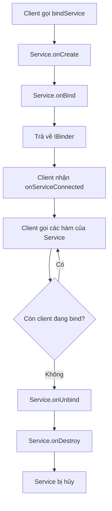
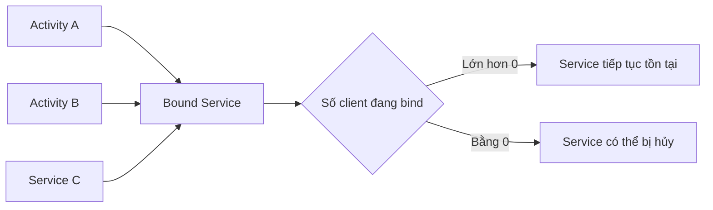
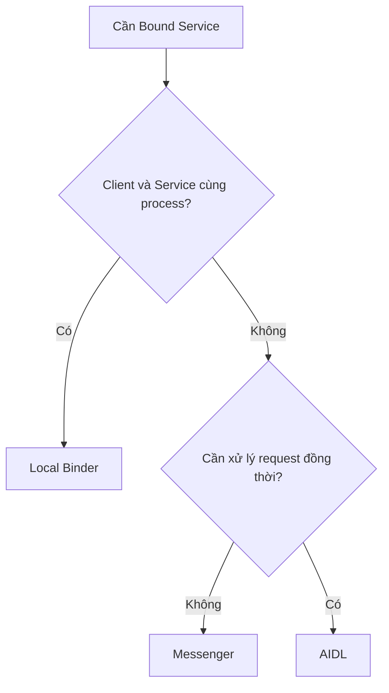
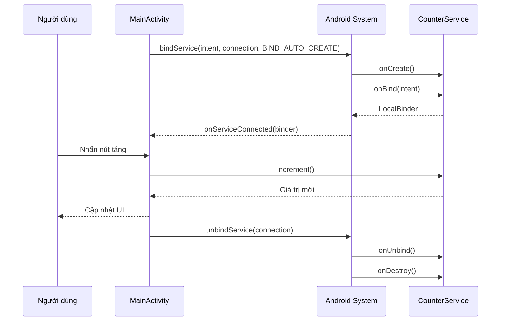
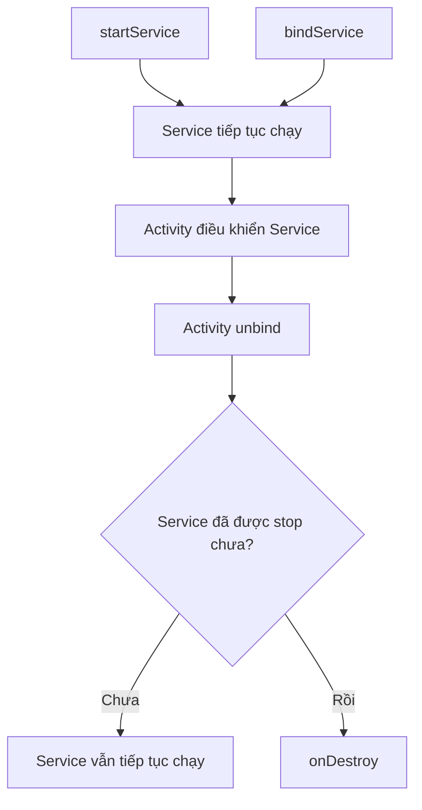
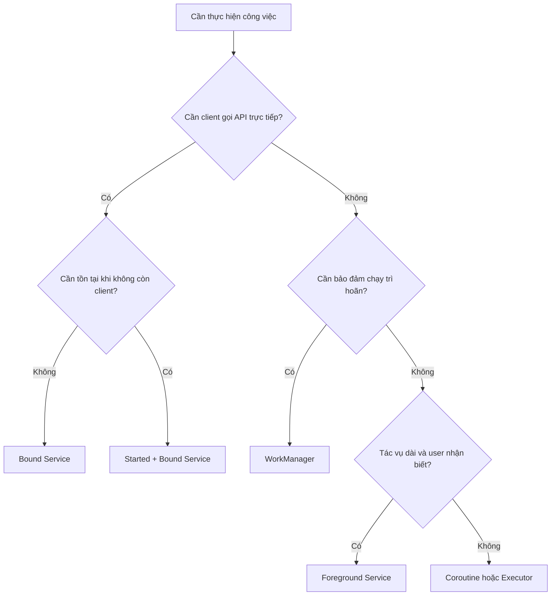
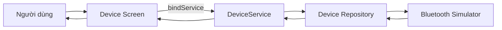

# 022 — Bound Service trong Android

**Học phần:** 02 — App Components and User Interface
**Module:** Module 03 — App Components
**Nhóm nội dung:** Other Components
**Nguồn roadmap:** App Components / Other Components
**Loại bài:** Lesson
**Thứ tự trong module:** 022
**Thời lượng gợi ý:** 24 phút

---

## 1. Tóm tắt

**Bound Service** là một `Service` cung cấp giao diện client–server để các thành phần Android như `Activity`, `Service` hoặc `ContentProvider` kết nối, gửi yêu cầu và nhận kết quả.

Client kết nối bằng `bindService()`. Service trả về một đối tượng `IBinder` từ `onBind()`, qua đó client có thể gọi các chức năng mà service cung cấp. Một Bound Service thuần túy thường chỉ tồn tại khi còn ít nhất một client đang liên kết với nó; khi client cuối cùng gọi `unbindService()`, hệ thống có thể hủy service. ([Android Developers][1])

Bound Service phù hợp với các tình huống như:

* Màn hình điều khiển trình phát nhạc.
* Giao tiếp với thiết bị Bluetooth hoặc USB.
* Theo dõi trạng thái cảm biến dùng chung.
* Cho nhiều màn hình truy cập cùng một bộ điều khiển.
* Giao tiếp giữa các process hoặc giữa các ứng dụng bằng IPC.

---

## 2. Mục tiêu học tập

Sau bài học, bạn có thể:

* Giải thích Bound Service bằng ngôn ngữ của mình.
* Phân biệt Bound Service, Started Service và Foreground Service.
* Hiểu vai trò của `IBinder`, `ServiceConnection` và `bindService()`.
* Quản lý việc bind/unbind theo lifecycle của `Activity`.
* Cài đặt một Local Bound Service bằng Kotlin.
* Nhận biết rủi ro về lifecycle, thread, state, bảo mật và memory leak.
* Viết instrumented test cho Bound Service bằng `ServiceTestRule`.
* Tạo một artifact nhỏ để đưa vào portfolio Android.

---

## 3. Bound Service là gì?

Có thể hình dung Bound Service như một **máy chủ nhỏ bên trong ứng dụng**:

```text
Activity / Fragment / Service
           │
           │ bindService()
           ▼
      Bound Service
           │
           │ trả về IBinder
           ▼
Client gọi các hàm do Service cung cấp
```

Bound Service gồm hai phía:

| Thành phần          | Vai trò                                       |
| ------------------- | --------------------------------------------- |
| Client              | Thành phần muốn sử dụng chức năng của service |
| Service             | Cung cấp dữ liệu hoặc hành vi                 |
| `IBinder`           | Giao diện giao tiếp giữa client và service    |
| `ServiceConnection` | Nhận sự kiện kết nối hoặc mất kết nối         |
| `bindService()`     | Gửi yêu cầu kết nối                           |
| `unbindService()`   | Ngắt kết nối khỏi service                     |

`bindService()` hoạt động bất đồng bộ: phương thức trả về trước khi client nhận được `IBinder`. Khi kết nối hoàn tất, Android gọi `onServiceConnected()` trên `ServiceConnection`. ([Android Developers][1])

---

## 4. Hình minh họa lifecycle


*Nguồn ảnh: [Android Developers — Services overview](https://developer.android.com/develop/background-work/services)*

Hình bên phải mô tả Bound Service thuần túy:



Lifecycle cơ bản thường là:

```text
bindService()
     ↓
onCreate()
     ↓
onBind()
     ↓
Client đang kết nối
     ↓
unbindService()
     ↓
onUnbind()
     ↓
onDestroy()
```

Khi nhiều client cùng bind:



Android chỉ gọi `onBind()` để tạo `IBinder` khi client đầu tiên kết nối. Hệ thống có thể tái sử dụng cùng kênh `IBinder` cho những client tiếp theo. Khi client cuối cùng unbind, một service thuần bound sẽ bị hủy. ([Android Developers][1])

---

## 5. Các callback quan trọng

### 5.1. `onCreate()`

Được gọi một lần khi service được tạo.

Thường dùng để:

* Khởi tạo repository.
* Mở kết nối thiết bị.
* Tạo executor hoặc coroutine scope.
* Đăng ký listener.
* Chuẩn bị tài nguyên dùng chung.

```kotlin
override fun onCreate() {
    super.onCreate()
    // Khởi tạo tài nguyên
}
```

---

### 5.2. `onBind()`

Được gọi khi client đầu tiên yêu cầu bind.

Phương thức phải trả về một `IBinder` nếu service cho phép binding.

```kotlin
override fun onBind(intent: Intent): IBinder {
    return binder
}
```

Nếu service không cho phép client bind, `onBind()` có thể trả về `null`.

---

### 5.3. `onUnbind()`

Được gọi khi tất cả client đã unbind khỏi một interface của service.

```kotlin
override fun onUnbind(intent: Intent): Boolean {
    return super.onUnbind(intent)
}
```

Có thể trả về `true` nếu service vừa là started service vừa hỗ trợ binding và muốn nhận `onRebind()` khi client kết nối trở lại. ([Android Developers][1])

---

### 5.4. `onRebind()`

Được gọi khi:

1. Service vẫn đang chạy.
2. Tất cả client trước đó đã unbind.
3. `onUnbind()` đã trả về `true`.
4. Một client mới bind lại.

```kotlin
override fun onRebind(intent: Intent) {
    super.onRebind(intent)
}
```

---

### 5.5. `onDestroy()`

Được gọi khi service không còn được sử dụng và chuẩn bị bị hủy.

```kotlin
override fun onDestroy() {
    // Hủy coroutine, listener, receiver hoặc kết nối
    super.onDestroy()
}
```

Đây là nơi giải phóng:

* Coroutine scope.
* Thread hoặc executor.
* Bluetooth callback.
* Sensor listener.
* Broadcast receiver.
* Socket hoặc file đang mở.

---

## 6. Ba cách tạo giao diện cho Bound Service

Android hỗ trợ ba hướng giao tiếp chính. ([Android Developers][1])

| Giải pháp      | Phạm vi                               | Độ phức tạp | Khi nên dùng                            |
| -------------- | ------------------------------------- | ----------: | --------------------------------------- |
| Local `Binder` | Cùng ứng dụng, cùng process           |        Thấp | Phần lớn ứng dụng thông thường          |
| `Messenger`    | Khác process, xử lý tuần tự           |  Trung bình | IPC đơn giản, mỗi request được xếp hàng |
| AIDL           | Khác process, nhiều request đồng thời |         Cao | API IPC phức tạp giữa nhiều ứng dụng    |

### Khuyến nghị lựa chọn



AIDL thường chỉ cần thiết khi service được truy cập từ process hoặc ứng dụng khác và cần hỗ trợ IPC đa luồng. Với service nội bộ cùng process, Local Binder đơn giản và dễ bảo trì hơn. ([Android Developers][2])

---

## 7. Ví dụ thực hành: Counter Bound Service

Ví dụ tạo một service lưu biến đếm. `Activity` bind vào service và gọi `increment()` khi người dùng nhấn nút.

### 7.1. Cấu trúc dự án

```text
app/
├── src/main/
│   ├── AndroidManifest.xml
│   └── java/com/example/boundservice/
│       ├── CounterService.kt
│       └── MainActivity.kt
└── src/androidTest/
    └── java/com/example/boundservice/
        └── CounterServiceTest.kt
```

---

### 7.2. Khai báo service trong Manifest

```xml
<manifest xmlns:android="http://schemas.android.com/apk/res/android">

    <application
        android:allowBackup="true"
        android:label="Bound Service Demo"
        android:theme="@style/Theme.BoundServiceDemo">

        <service
            android:name=".CounterService"
            android:enabled="true"
            android:exported="false" />

        <activity
            android:name=".MainActivity"
            android:exported="true">

            <intent-filter>
                <action android:name="android.intent.action.MAIN" />
                <category android:name="android.intent.category.LAUNCHER" />
            </intent-filter>

        </activity>

    </application>

</manifest>
```

`android:exported="false"` ngăn ứng dụng khác bind vào service nội bộ này.

---

### 7.3. Tạo `CounterService`

```kotlin
package com.example.boundservice

import android.app.Service
import android.content.Intent
import android.os.Binder
import android.os.IBinder
import android.util.Log

class CounterService : Service() {

    /**
     * Binder dùng khi client và service nằm trong cùng process.
     */
    inner class LocalBinder : Binder() {

        fun getService(): CounterService {
            return this@CounterService
        }
    }

    private val binder = LocalBinder()

    private var count: Int = 0

    override fun onCreate() {
        super.onCreate()
        Log.d(TAG, "onCreate")
    }

    override fun onBind(intent: Intent): IBinder {
        Log.d(TAG, "onBind")
        return binder
    }

    /**
     * API mà client có thể gọi sau khi bind thành công.
     */
    fun increment(): Int {
        count += 1
        return count
    }

    fun getCurrentCount(): Int {
        return count
    }

    override fun onUnbind(intent: Intent): Boolean {
        Log.d(TAG, "onUnbind")
        return super.onUnbind(intent)
    }

    override fun onDestroy() {
        Log.d(TAG, "onDestroy")
        super.onDestroy()
    }

    companion object {
        private const val TAG = "CounterService"
    }
}
```

Trong ví dụ này:

```text
LocalBinder.getService()
          ↓
Trả về CounterService
          ↓
Activity có thể gọi increment()
```

Cách này chỉ phù hợp khi client và service chạy trong cùng process.

---

### 7.4. Bind service từ `MainActivity`

Ví dụ sử dụng Jetpack Compose:

```kotlin
package com.example.boundservice

import android.content.ComponentName
import android.content.Context
import android.content.Intent
import android.content.ServiceConnection
import android.os.Bundle
import android.os.IBinder
import androidx.activity.ComponentActivity
import androidx.activity.compose.setContent
import androidx.compose.foundation.layout.Arrangement
import androidx.compose.foundation.layout.Column
import androidx.compose.foundation.layout.fillMaxSize
import androidx.compose.foundation.layout.padding
import androidx.compose.material3.Button
import androidx.compose.material3.MaterialTheme
import androidx.compose.material3.Text
import androidx.compose.runtime.mutableIntStateOf
import androidx.compose.runtime.mutableStateOf
import androidx.compose.ui.Alignment
import androidx.compose.ui.Modifier
import androidx.compose.ui.unit.dp

class MainActivity : ComponentActivity() {

    private var counterService: CounterService? = null

    /**
     * Ghi lại việc bindService() có được Android chấp nhận hay không.
     * Chỉ gọi unbindService() khi giá trị này là true.
     */
    private var bindingRequested = false

    private val countState = mutableIntStateOf(0)
    private val connectedState = mutableStateOf(false)

    private val serviceConnection = object : ServiceConnection {

        override fun onServiceConnected(
            name: ComponentName?,
            service: IBinder?
        ) {
            val binder = service as? CounterService.LocalBinder
                ?: return

            counterService = binder.getService()
            connectedState.value = true
            countState.intValue =
                counterService?.getCurrentCount() ?: 0
        }

        override fun onServiceDisconnected(name: ComponentName?) {
            /*
             * Callback này dành cho trường hợp mất kết nối bất ngờ,
             * chẳng hạn process chứa service bị crash hoặc bị kill.
             *
             * Nó không phải callback của thao tác unbind bình thường.
             */
            counterService = null
            connectedState.value = false
        }
    }

    override fun onCreate(savedInstanceState: Bundle?) {
        super.onCreate(savedInstanceState)

        setContent {
            MaterialTheme {
                Column(
                    modifier = Modifier
                        .fillMaxSize()
                        .padding(24.dp),
                    verticalArrangement = Arrangement.spacedBy(16.dp),
                    horizontalAlignment = Alignment.CenterHorizontally
                ) {
                    Text(
                        text = if (connectedState.value) {
                            "Đã kết nối Service"
                        } else {
                            "Chưa kết nối Service"
                        }
                    )

                    Text(
                        text = "Giá trị: ${countState.intValue}",
                        style = MaterialTheme.typography.headlineMedium
                    )

                    Button(
                        enabled = connectedState.value,
                        onClick = {
                            countState.intValue =
                                counterService?.increment()
                                    ?: countState.intValue
                        }
                    ) {
                        Text("Tăng giá trị")
                    }
                }
            }
        }
    }

    override fun onStart() {
        super.onStart()

        val intent = Intent(
            this,
            CounterService::class.java
        )

        bindingRequested = bindService(
            intent,
            serviceConnection,
            Context.BIND_AUTO_CREATE
        )
    }

    override fun onStop() {
        if (bindingRequested) {
            unbindService(serviceConnection)
            bindingRequested = false
        }

        counterService = null
        connectedState.value = false

        super.onStop()
    }
}
```

### Luồng thực thi



---

## 8. Chọn vị trí bind và unbind theo lifecycle

### Chỉ cần service khi màn hình đang hiển thị

Bind trong `onStart()` và unbind trong `onStop()`:

```kotlin
override fun onStart() {
    super.onStart()
    bindService(...)
}

override fun onStop() {
    unbindService(...)
    super.onStop()
}
```

Đây là lựa chọn phổ biến khi service phục vụ trực tiếp cho UI.

### Cần giữ kết nối cả khi Activity tạm thời không hiển thị

Có thể bind trong `onCreate()` và unbind trong `onDestroy()`.

Tuy nhiên, cách này khiến Activity giữ service lâu hơn, kể cả khi Activity đang ở background. Android Developers lưu ý điều đó có thể làm tăng mức độ quan trọng và mức sử dụng tài nguyên của process chứa service. ([Android Developers][1])

### Quy tắc thực tế

```text
UI chỉ cần dữ liệu khi đang nhìn thấy
→ onStart() / onStop()

Cần giữ kết nối trong toàn bộ đời Activity
→ onCreate() / onDestroy()

Công việc phải tiếp tục dù không còn UI
→ Không dùng Bound Service thuần túy
→ Cân nhắc Started/Foreground Service hoặc WorkManager
```

---

## 9. Bound Service không phải background thread

Một hiểu lầm phổ biến là:

> “Code chạy trong Service thì tự động chạy ở background thread.”

Điều này không đúng. Theo mặc định, `Service` vẫn chạy trên main thread của process ứng dụng. Tác vụ nặng hoặc blocking bên trong service vẫn có thể làm đứng UI và gây ANR. Android khuyến nghị sử dụng coroutine, executor hoặc cơ chế threading phù hợp nếu service thực hiện công việc tốn thời gian. ([Android Developers][3])

### Không nên

```kotlin
fun downloadLargeFile(): ByteArray {
    // Chạy đồng bộ và có thể được gọi từ main thread
    return networkClient.download()
}
```

### Nên

```kotlin
private val serviceScope =
    CoroutineScope(SupervisorJob() + Dispatchers.IO)

fun downloadLargeFile() {
    serviceScope.launch {
        runCatching {
            networkClient.download()
        }.onSuccess { data ->
            // Cập nhật state
        }.onFailure { error ->
            // Xử lý lỗi
        }
    }
}

override fun onDestroy() {
    serviceScope.cancel()
    super.onDestroy()
}
```

---

## 10. Bound, Started và Foreground Service

| Tiêu chí                         | Bound Service                 | Started Service              | Foreground Service           |
| -------------------------------- | ----------------------------- | ---------------------------- | ---------------------------- |
| Cách khởi tạo                    | `bindService()`               | `startService()`             | `startForegroundService()`   |
| Giao tiếp trực tiếp              | Có, qua `IBinder`             | Không bắt buộc               | Có thể hỗ trợ binding        |
| Thời gian tồn tại                | Khi còn client bind           | Đến khi được dừng            | Đến khi được dừng            |
| Notification                     | Không bắt buộc                | Không mặc định               | Bắt buộc                     |
| Dùng cho UI điều khiển           | Phù hợp                       | Không phải mục tiêu chính    | Có thể                       |
| Tác vụ dài, người dùng nhận biết | Không phù hợp nếu thuần bound | Bị giới hạn trong background | Phù hợp nếu đáp ứng quy định |
| Cần gọi `stopSelf()`             | Không, nếu thuần bound        | Có                           | Có                           |

Một service có thể vừa được **start** vừa được **bind**:



Ví dụ điển hình là trình phát nhạc:

1. `startService()` để nhạc tiếp tục phát khi người dùng rời màn hình.
2. `bindService()` để màn hình Player điều khiển play, pause và seek.
3. Unbind khi màn hình đóng.
4. Service vẫn chạy vì đã được start.
5. Khi người dùng dừng phát nhạc, gọi `stopSelf()`.

Nếu một service đã nhận `startService()`, việc tất cả client unbind không đủ để hủy service; service phải được dừng bằng `stopSelf()` hoặc `stopService()`. ([Android Developers][1])

---

## 11. Khi nào nên dùng Bound Service?

### Nên dùng

* Một hoặc nhiều màn hình cần gọi trực tiếp API của service.
* Cần duy trì kết nối Bluetooth trong khi UI đang điều khiển thiết bị.
* Cần chia sẻ bộ điều khiển phát media giữa nhiều component.
* Cần nhận trạng thái liên tục từ một component có lifecycle riêng.
* Cần IPC giữa các process hoặc ứng dụng.
* Hệ thống Android yêu cầu triển khai một loại bound service chuyên biệt.

### Không nên dùng

* Chỉ cần chạy một phép tính ngoài main thread.
* Chỉ cần tải dữ liệu trong lúc một màn hình đang mở.
* Cần chạy tác vụ trì hoãn hoặc bảo đảm thực thi.
* Cần duy trì state đơn giản cho một màn hình.
* Công việc có thể được giải quyết bằng `ViewModel`, coroutine hoặc repository.
* Công việc cần chạy lâu sau khi người dùng rời ứng dụng nhưng không có lifecycle và notification phù hợp.



---

## 12. State và Configuration Change

Với ví dụ `CounterService`, khi xoay màn hình có thể xảy ra:

```text
Activity cũ onStop()
        ↓
Activity cũ unbind
        ↓
Không còn client
        ↓
Service bị hủy
        ↓
Activity mới bind
        ↓
Service mới được tạo
        ↓
Count trở về 0
```

Đây không nhất thiết là bug của Android. Nó là kết quả của lifecycle Bound Service thuần túy.

### Cách xử lý tùy yêu cầu

| Yêu cầu                                      | Giải pháp                                               |
| -------------------------------------------- | ------------------------------------------------------- |
| State chỉ thuộc UI                           | `ViewModel`                                             |
| State cần sống qua process death             | Room, DataStore hoặc `SavedStateHandle`                 |
| Service phải tiếp tục chạy khi UI bị tái tạo | Started + Bound Service                                 |
| Chỉ muốn tránh hủy trong chuyển tiếp ngắn    | Bind ở lifecycle dài hơn, nhưng cần đánh giá tài nguyên |
| Nhiều client cần cùng state                  | Repository hoặc service làm nguồn dữ liệu chung         |

Không nên dùng Bound Service chỉ để thay thế `ViewModel`.

---

## 13. Bảo mật

### 13.1. Sử dụng explicit Intent

Nên xác định rõ class của service:

```kotlin
val intent = Intent(
    this,
    CounterService::class.java
)
```

Không nên bind service nội bộ bằng implicit intent:

```kotlin
// Không nên
val intent = Intent("com.example.COUNTER_SERVICE")
bindService(intent, connection, Context.BIND_AUTO_CREATE)
```

Implicit intent khi bind service tạo rủi ro vì ứng dụng không chắc thành phần nào sẽ nhận intent. Android 5.0 trở lên không cho phép gọi `bindService()` bằng implicit intent theo cách này. ([Android Developers][1])

### 13.2. Giới hạn service nội bộ

```xml
<service
    android:name=".CounterService"
    android:exported="false" />
```

### 13.3. Nếu service được export

Cần xem xét:

* Custom permission.
* Signature-level permission.
* Kiểm tra caller.
* Xác thực dữ liệu đầu vào.
* Không trả dữ liệu nhạy cảm không cần thiết.
* Kiểm soát kích thước dữ liệu IPC.
* Xử lý client độc hại hoặc gửi request quá nhanh.

---

## 14. Những lỗi junior thường gặp

### Lỗi 1: Quên gọi `unbindService()`

```kotlin
override fun onStart() {
    bindService(...)
}

// Thiếu onStop() để unbind
```

Hậu quả:

* Service tiếp tục được giữ lại.
* Activity hoặc connection có thể bị giữ tham chiếu lâu hơn cần thiết.
* Tăng sử dụng tài nguyên.
* Lifecycle khó dự đoán.

---

### Lỗi 2: Gọi `unbindService()` khi bind thất bại

Nên lưu kết quả từ `bindService()`:

```kotlin
private var bindingRequested = false

override fun onStart() {
    super.onStart()

    bindingRequested = bindService(
        Intent(this, CounterService::class.java),
        serviceConnection,
        Context.BIND_AUTO_CREATE
    )
}

override fun onStop() {
    if (bindingRequested) {
        unbindService(serviceConnection)
        bindingRequested = false
    }

    super.onStop()
}
```

---

### Lỗi 3: Gọi service trước `onServiceConnected()`

Sai:

```kotlin
bindService(intent, connection, Context.BIND_AUTO_CREATE)
counterService?.increment()
```

`bindService()` không trả về binder ngay lập tức.

Đúng:

```kotlin
override fun onServiceConnected(
    name: ComponentName?,
    binder: IBinder?
) {
    counterService =
        (binder as CounterService.LocalBinder).getService()

    counterService?.increment()
}
```

---

### Lỗi 4: Nghĩ rằng `onServiceDisconnected()` luôn được gọi khi unbind

`onServiceDisconnected()` thường chỉ được gọi khi kết nối mất bất ngờ, chẳng hạn process chứa service bị crash hoặc bị hệ thống kill. Nó không được gọi cho thao tác `unbindService()` bình thường. ([Android Developers][1])

---

### Lỗi 5: Chạy network hoặc database blocking trên main thread

```kotlin
fun loadData(): List<Item> {
    return database.queryEverything()
}
```

Nếu Activity gọi hàm này từ main thread, UI có thể bị đứng.

---

### Lỗi 6: Trả trực tiếp toàn bộ service cho ứng dụng khác

`LocalBinder` chỉ nên dùng trong cùng process. Khi giao tiếp với process hoặc ứng dụng khác, nên thiết kế contract bằng `Messenger` hoặc AIDL thay vì truyền cách truy cập trực tiếp vào implementation.

---

### Lỗi 7: Nhầm Bound Service với Foreground Service

Bound Service không tự động:

* Hiển thị notification.
* Được ưu tiên như foreground process.
* Chạy vô hạn.
* Tránh được giới hạn background execution.

---

## 15. Kiểm thử Bound Service

AndroidX Test cung cấp `ServiceTestRule` để khởi tạo, bind và dọn dẹp service trong instrumented test. ([Android Developers][4])

### 15.1. Dependency

```kotlin
dependencies {
    androidTestImplementation("androidx.test:rules:<version>")
    androidTestImplementation("androidx.test:runner:<version>")
    androidTestImplementation("androidx.test.ext:junit:<version>")
}
```

Nên lấy phiên bản hiện hành từ AndroidX release notes thay vì hardcode phiên bản cũ.

---

### 15.2. Instrumented test

```kotlin
package com.example.boundservice

import android.content.Context
import android.content.Intent
import androidx.test.core.app.ApplicationProvider
import androidx.test.ext.junit.runners.AndroidJUnit4
import androidx.test.rule.ServiceTestRule
import org.junit.Assert.assertEquals
import org.junit.Assert.assertNotNull
import org.junit.Rule
import org.junit.Test
import org.junit.runner.RunWith
import java.util.concurrent.TimeoutException

@RunWith(AndroidJUnit4::class)
class CounterServiceTest {

    @get:Rule
    val serviceRule = ServiceTestRule()

    @Test
    @Throws(TimeoutException::class)
    fun bindService_returnsWorkingCounterService() {
        val context =
            ApplicationProvider.getApplicationContext<Context>()

        val intent = Intent(
            context,
            CounterService::class.java
        )

        val binder = serviceRule.bindService(intent)

        val localBinder =
            binder as CounterService.LocalBinder

        val service = localBinder.getService()

        assertNotNull(service)
        assertEquals(0, service.getCurrentCount())

        assertEquals(1, service.increment())
        assertEquals(2, service.increment())
        assertEquals(2, service.getCurrentCount())
    }
}
```

`ServiceTestRule.bindService()` chờ đến khi kết nối service thành công rồi mới trả về `IBinder`, giúp test ổn định hơn so với tự quản lý callback bất đồng bộ. ([Android Developers][5])

---

## 16. Kịch bản test cần có

| Test case               | Kết quả mong đợi                                    |
| ----------------------- | --------------------------------------------------- |
| Bind thành công         | `onServiceConnected()` được gọi                     |
| Service trả đúng Binder | Client truy cập được API                            |
| Gọi `increment()`       | Giá trị tăng chính xác                              |
| Nhiều client cùng bind  | Các client dùng chung service instance              |
| Một client unbind       | Service vẫn tồn tại nếu còn client khác             |
| Client cuối cùng unbind | Bound Service thuần túy bị hủy                      |
| Xoay màn hình           | Không crash, state đúng theo thiết kế               |
| App vào background      | Kết nối được ngắt hoặc giữ theo yêu cầu             |
| Process service bị kill | Client xử lý mất kết nối                            |
| Bind không được phép    | App xử lý `SecurityException` hoặc kết quả thất bại |
| Dữ liệu đầu vào sai     | Service không crash                                 |
| Tác vụ nặng             | Không block main thread                             |

---

## 17. Ảnh hưởng đến UX và chất lượng

### UX

Thiết kế tốt:

* Nút điều khiển chỉ bật khi service đã kết nối.
* UI hiển thị trạng thái “Đang kết nối”.
* Mất kết nối không làm ứng dụng crash.
* State được khôi phục đúng khi rotate.
* Người dùng không thấy dữ liệu cũ hoặc sai.

Thiết kế kém:

```text
Activity mở
→ UI cho phép nhấn nút ngay
→ Service chưa kết nối
→ NullPointerException hoặc thao tác không phản hồi
```

---

### Reliability

Bound Service đáng tin cậy hơn khi:

* Mọi lần bind đều có lần unbind tương ứng.
* Xử lý trường hợp service disconnect bất ngờ.
* Không giả định process sẽ tồn tại mãi.
* State quan trọng được lưu ngoài bộ nhớ của service.
* Tác vụ blocking được chuyển khỏi main thread.
* Started + Bound Service được dừng rõ ràng khi hoàn thành.

---

### Maintainability

Một service dễ bảo trì nên:

```text
Service
├── Quản lý lifecycle và binder
├── Gọi repository hoặc use case
├── Không chứa UI logic
└── Không chứa toàn bộ business logic

Repository / UseCase
├── Có thể unit test
├── Không phụ thuộc trực tiếp Activity
└── Chứa quy tắc nghiệp vụ
```

Không nên biến Service thành “God Object” chứa network, database, business rules, analytics và state UI trong cùng một class.

---

### Performance

Cần tránh:

* Bind service khi không thực sự cần.
* Giữ kết nối trong toàn bộ app chỉ để đọc một giá trị.
* IPC quá thường xuyên.
* Gửi object lớn qua Binder.
* Query database đồng bộ từ hàm Binder.
* Tạo nhiều service có chức năng trùng nhau.

---

## 18. Debugging

### Ghi log lifecycle

```kotlin
override fun onCreate() {
    super.onCreate()
    Log.d(TAG, "onCreate")
}

override fun onBind(intent: Intent): IBinder {
    Log.d(TAG, "onBind")
    return binder
}

override fun onUnbind(intent: Intent): Boolean {
    Log.d(TAG, "onUnbind")
    return super.onUnbind(intent)
}

override fun onDestroy() {
    Log.d(TAG, "onDestroy")
    super.onDestroy()
}
```

Log mong đợi:

```text
D/CounterService: onCreate
D/CounterService: onBind
D/CounterService: onUnbind
D/CounterService: onDestroy
```

### Dùng ADB kiểm tra service

```bash
adb shell dumpsys activity services
```

Lọc theo package:

```bash
adb shell dumpsys activity services com.example.boundservice
```

Logcat:

```bash
adb logcat | grep CounterService
```

---

## 19. Ghi chú 5 dòng về Bound Service

> Bound Service là một Android Service cho phép component khác kết nối và gọi API qua `IBinder`.
> Client dùng `bindService()` và nhận kết nối trong `onServiceConnected()`.
> Một Bound Service thuần túy thường chỉ tồn tại khi còn client đang bind.
> Service không tự tạo background thread nên tác vụ nặng vẫn phải dùng coroutine hoặc executor.
> Client phải quản lý bind và unbind đúng lifecycle để tránh lỗi và lãng phí tài nguyên.

---

## 20. Bài thực hành

Xây dựng ứng dụng **Device Controller Simulator**:

### Yêu cầu

* Tạo `DeviceService`.
* Service lưu trạng thái kết nối thiết bị.
* Cung cấp các hàm:

```kotlin
fun connect(): Boolean
fun disconnect()
fun isConnected(): Boolean
fun sendCommand(command: String): Result<String>
```

* Activity bind trong `onStart()`.
* Activity unbind trong `onStop()`.
* Nút gửi lệnh chỉ được bật khi service kết nối thành công.
* Hiển thị trạng thái service trên UI.
* Viết test cho `connect()`, `disconnect()` và `sendCommand()`.
* Kiểm tra khi xoay màn hình.
* Kiểm tra khi app chuyển sang background.

### Sơ đồ gợi ý



---

## 21. Artifact cho portfolio

Tên project gợi ý:

```text
android-bound-service-device-controller
```

README nên có:

````markdown
# Android Bound Service Device Controller

## Features

- Local Bound Service bằng Binder
- Lifecycle-aware bind/unbind
- Service connection state
- Jetpack Compose UI
- Instrumented test với ServiceTestRule
- Xử lý configuration change
- Không block main thread

## Architecture

```mermaid
flowchart LR
    UI --> Service
    Service --> Repository
    Repository --> DataSource
````

## Test Cases

* Bind thành công
* Gọi API qua Binder
* Unbind an toàn
* Xử lý disconnect
* Rotate không crash

````

Screenshot nên gồm:

1. Màn hình chưa kết nối.
2. Màn hình đã bind thành công.
3. Giá trị hoặc trạng thái được cập nhật.
4. Logcat lifecycle.
5. Instrumented test chạy thành công.

---

## 22. Checklist production

### Lifecycle

- [ ] Chọn đúng cặp `onStart/onStop` hoặc `onCreate/onDestroy`.
- [ ] Mỗi lần bind thành công đều có lần unbind tương ứng.
- [ ] Không gọi `unbindService()` khi bind chưa thành công.
- [ ] Xử lý service mất kết nối bất ngờ.
- [ ] Hiểu rõ service là bound, started hay cả hai.
- [ ] Started + Bound Service được gọi `stopSelf()` khi hoàn thành.

### Threading

- [ ] Không thực hiện network trên main thread.
- [ ] Không query database blocking từ Binder API.
- [ ] Coroutine scope hoặc executor được hủy trong `onDestroy()`.
- [ ] Shared state được bảo vệ nếu nhiều thread cùng truy cập.

### State

- [ ] Xác định state nào thuộc UI.
- [ ] Xác định state nào thuộc service.
- [ ] State quan trọng được lưu bền vững.
- [ ] Đã test rotate và process recreation.
- [ ] Không dựa vào service memory cho dữ liệu bắt buộc phải tồn tại.

### Security

- [ ] Sử dụng explicit intent.
- [ ] Service nội bộ đặt `android:exported="false"`.
- [ ] Service export có permission phù hợp.
- [ ] Dữ liệu từ client được kiểm tra.
- [ ] Không để lộ API nội bộ không cần thiết.

### Testing

- [ ] Test bind thành công.
- [ ] Test API của binder.
- [ ] Test nhiều client nếu có.
- [ ] Test client cuối cùng unbind.
- [ ] Test disconnect bất ngờ.
- [ ] Test lỗi dữ liệu hoặc thiết bị.
- [ ] Test không block UI.

---

## 23. Câu hỏi ôn tập

1. `IBinder` có vai trò gì trong Bound Service?
2. Tại sao không nên gọi API của service ngay sau `bindService()`?
3. Khi nào `onServiceConnected()` được gọi?
4. Khi nào `onServiceDisconnected()` được gọi?
5. Điều gì xảy ra khi client cuối cùng unbind khỏi Bound Service thuần túy?
6. Vì sao Service không đồng nghĩa với background thread?
7. Khi nào nên dùng Local Binder, Messenger và AIDL?
8. Bound Service khác Foreground Service như thế nào?
9. Điều gì xảy ra nếu service vừa được start vừa được bind?
10. Vì sao state trong service có thể mất khi xoay màn hình?

---

## 24. Kết luận

Bound Service phù hợp khi một Android component cần **duy trì kết nối và tương tác trực tiếp** với một service thông qua `IBinder`.

Mô hình cần nhớ:

```text
Client
  │
  │ bindService()
  ▼
Service.onCreate()
  │
  ▼
Service.onBind()
  │
  │ IBinder
  ▼
Client.onServiceConnected()
  │
  │ Gọi API của Service
  ▼
Client.unbindService()
  │
  ▼
Service.onUnbind()
  │
  ▼
Service.onDestroy()
````

Ba nguyên tắc quan trọng nhất:

1. **Bind và unbind đúng lifecycle.**
2. **Không coi Service là background thread.**
3. **Không lưu dữ liệu quan trọng chỉ trong bộ nhớ của Bound Service.**

---

## Tài liệu tham khảo

* [Bound services overview — Android Developers](https://developer.android.com/develop/background-work/services/bound-services)
* [Services overview — Android Developers](https://developer.android.com/develop/background-work/services)
* [Service API reference — Android Developers](https://developer.android.com/reference/android/app/Service)
* [Android Interface Definition Language — Android Developers](https://developer.android.com/develop/background-work/services/aidl)
* [Test your service — Android Developers](https://developer.android.com/training/testing/other-components/services)
* [ServiceTestRule API reference](https://developer.android.com/reference/kotlin/androidx/test/rule/ServiceTestRule)

[1]: https://developer.android.com/develop/background-work/services/bound-services "Bound services overview  |  Background work  |  Android Developers"
[2]: https://developer.android.com/develop/background-work/services/aidl "Android Interface Definition Language (AIDL)  |  Background work  |  Android Developers"
[3]: https://developer.android.com/develop/background-work/services "Services overview  |  Background work  |  Android Developers"
[4]: https://developer.android.com/training/testing/other-components/services?hl=en&utm_source=chatgpt.com "Test your service  |  Test your app on Android  |  Android Developers"
[5]: https://developer.android.com/reference/kotlin/androidx/test/rule/ServiceTestRule?utm_source=chatgpt.com "ServiceTestRule  |  API reference  |  Android Developers"
