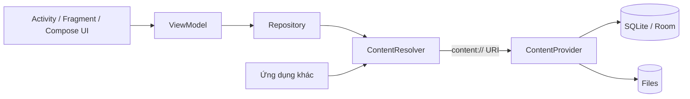
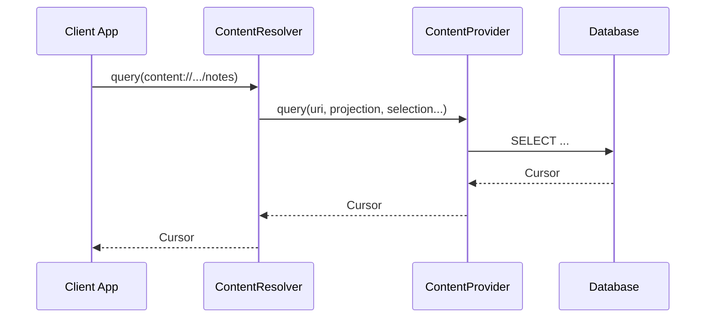
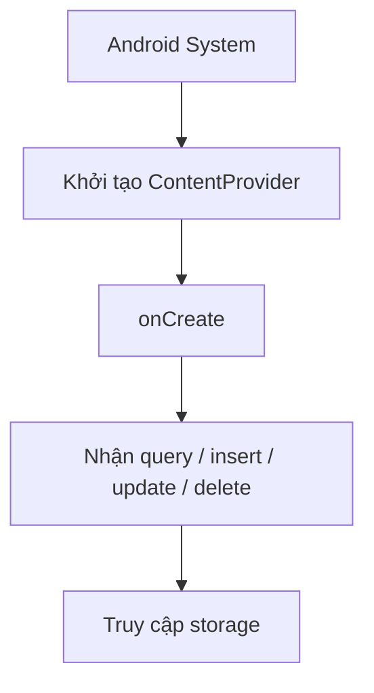

[](https://www.igloo.co.kr/security-information/%EC%95%88%EB%93%9C%EB%A1%9C%EC%9D%B4%EB%93%9C-content-provider-%EC%B7%A8%EC%95%BD%EC%84%B1/?utm_source=chatgpt.com)

# 023 - Content Provider

**Học phần:** 02 - App Components and User Interface
**Module:** Module 03 - App Components
**Nhóm nội dung:** Other Components
**Nguồn roadmap:** App Components / Other Components
**Loại bài:** Lesson
**Thứ tự trong module:** 023
**Thời lượng gợi ý:** 24 phút

---

## 1. Tóm tắt

**Content Provider** là một app component dùng để quản lý và cung cấp quyền truy cập có cấu trúc đến dữ liệu của ứng dụng. Thành phần này đặc biệt quan trọng khi một ứng dụng cần chia sẻ dữ liệu với ứng dụng khác hoặc cần truy cập các kho dữ liệu do hệ thống Android quản lý, chẳng hạn danh bạ, lịch và thư viện media.

Ứng dụng phía client không gọi trực tiếp `ContentProvider`. Thay vào đó, nó sử dụng `ContentResolver` cùng một URI có dạng `content://...` để thực hiện các thao tác đọc, thêm, sửa và xóa dữ liệu. Android chịu trách nhiệm chuyển yêu cầu đến đúng provider, kể cả khi provider nằm trong process khác. ([Android Developers][1])

Sau bài học, anh sẽ:

* Hiểu vai trò của `ContentProvider` và `ContentResolver`.
* Phân tích được cấu trúc của một content URI.
* Biết khi nào nên và không nên tạo Content Provider.
* Tạo được một Notes Provider nhỏ bằng Kotlin.
* Biết cách xử lý permission, lifecycle, threading và notification.
* Viết được integration test cơ bản cho provider.

---

## 2. Mục tiêu học tập

Sau bài học, anh có thể:

* Giải thích Content Provider bằng ngôn ngữ của mình.
* Phân biệt `ContentProvider`, `ContentResolver`, Room và Repository.
* Xây dựng contract cho dữ liệu được chia sẻ.
* Triển khai các thao tác CRUD.
* Khai báo provider trong `AndroidManifest.xml`.
* Bảo vệ provider bằng `android:exported` và permission.
* Tránh blocking UI khi truy vấn provider.
* Viết test bảo vệ contract và dữ liệu.
* Biến ví dụ thành một artifact nhỏ trong portfolio.

---

## 3. Ghi nhớ trong 5 dòng

> 1. Content Provider là cổng truy cập có kiểm soát đến dữ liệu của ứng dụng.
> 2. Client sử dụng `ContentResolver`, không gọi trực tiếp provider.
> 3. Dữ liệu được định danh bằng URI có scheme `content://`.
> 4. Provider thường cung cấp các thao tác `query`, `insert`, `update` và `delete`.
> 5. Chỉ nên export provider khi thật sự cần chia sẻ dữ liệu và đã thiết kế permission phù hợp.

---

## 4. Ảnh minh họa

### 4.1 Content Provider đứng giữa ứng dụng và kho dữ liệu


*Nguồn ảnh: Android Developers.*

Content Provider đóng vai trò như một lớp giao tiếp ổn định. Ứng dụng client không cần biết dữ liệu thật sự nằm trong SQLite, Room, file hay một nguồn khác. Do đó, provider có thể giúp thay đổi cách lưu trữ bên dưới mà không làm thay đổi contract mà client đang sử dụng. ([Android Developers][2])

### 4.2 Luồng truy vấn dữ liệu


*Nguồn ảnh: Android Developers.*

---

## 5. Content Provider là gì?

Có thể hiểu Content Provider như một **API dữ liệu nội bộ của Android**.

Ví dụ, ứng dụng A đang lưu danh sách ghi chú. Ứng dụng B cần đọc một số ghi chú đó. Thay vì cho ứng dụng B truy cập trực tiếp file database của ứng dụng A, ứng dụng A cung cấp một Content Provider.

Ứng dụng B gửi yêu cầu:

```text
content://com.example.notes.provider/notes
```

Android xác định:

1. Provider nào sở hữu authority `com.example.notes.provider`.
2. Client có đủ permission hay không.
3. URI đang yêu cầu cả bảng hay một bản ghi.
4. Phương thức nào của provider cần được gọi.
5. Kết quả nào được trả về cho client.

Content Provider có thể đại diện cho dữ liệu dạng bảng như SQLite, nhưng implementation bên dưới không bắt buộc phải là database. Provider cũng có thể cung cấp file, hình ảnh, âm thanh hoặc dữ liệu lấy từ nhiều nguồn khác nhau. ([Android Developers][1])

---

## 6. Vị trí trong kiến trúc Android



Một ứng dụng hiện đại vẫn nên giữ logic truy cập Content Provider trong Repository thay vì gọi `ContentResolver` trực tiếp từ Composable hoặc Activity.

```text
UI → ViewModel → Repository → ContentResolver → ContentProvider → Storage
```

Content Provider là một trong các app component chính của Android, bên cạnh Activity, Service và Broadcast Receiver. Nó tập trung vào **data access và inter-process communication**, không phụ trách hiển thị UI. ([Android Developers][3])

---

## 7. Các thành phần quan trọng

| Thành phần        | Vai trò                                        |
| ----------------- | ---------------------------------------------- |
| `ContentProvider` | Nhận và xử lý yêu cầu dữ liệu                  |
| `ContentResolver` | API phía client dùng để gửi yêu cầu            |
| `Uri`             | Xác định provider và vùng dữ liệu cần truy cập |
| `UriMatcher`      | Phân loại URI collection và item               |
| `Cursor`          | Chứa kết quả dạng hàng và cột                  |
| `ContentValues`   | Chứa dữ liệu cần insert hoặc update            |
| Contract class    | Định nghĩa authority, URI và tên cột           |
| Permission        | Kiểm soát ứng dụng nào được truy cập           |
| `ContentObserver` | Theo dõi thay đổi dữ liệu                      |

---

## 8. Cấu trúc của Content URI

Một content URI thường có dạng:

```text
content://authority/path/id
```

Ví dụ:

```text
content://com.example.notes.provider/notes/15
```

| Phần      | Giá trị                      | Ý nghĩa                         |
| --------- | ---------------------------- | ------------------------------- |
| Scheme    | `content://`                 | Đây là URI của Content Provider |
| Authority | `com.example.notes.provider` | Tên duy nhất của provider       |
| Path      | `notes`                      | Nhóm hoặc bảng dữ liệu          |
| ID        | `15`                         | Bản ghi cụ thể                  |

### URI collection

Truy cập toàn bộ ghi chú:

```text
content://com.example.notes.provider/notes
```

### URI item

Truy cập ghi chú có ID bằng `15`:

```text
content://com.example.notes.provider/notes/15
```

Authority phải được khai báo trong `<provider>` và phải đủ duy nhất để không xung đột với provider của ứng dụng khác. Android sử dụng authority để tìm provider tương ứng trong hệ thống. ([Android Developers][4])

---

## 9. CRUD qua ContentResolver

| Nhu cầu               | ContentResolver | ContentProvider |
| --------------------- | --------------- | --------------- |
| Đọc                   | `query()`       | `query()`       |
| Thêm                  | `insert()`      | `insert()`      |
| Sửa                   | `update()`      | `update()`      |
| Xóa                   | `delete()`      | `delete()`      |
| Xác định loại dữ liệu | `getType()`     | `getType()`     |



Android tự chuyển các yêu cầu từ `ContentResolver` đến đúng instance của `ContentProvider`, vì vậy provider không cần tự triển khai chi tiết Binder IPC. ([Android Developers][5])

---

## 10. Khi nào nên sử dụng?

Content Provider phù hợp khi:

* Cần chia sẻ dữ liệu giữa nhiều ứng dụng.
* Cần cung cấp dữ liệu cho widget.
* Cần tích hợp với Contacts, Calendar hoặc MediaStore.
* Cần chia sẻ file bằng URI an toàn.
* Cần tạo `DocumentsProvider`.
* Cần duy trì một data contract ổn định cho client bên ngoài.
* Cần giao tiếp dữ liệu giữa các process.

Android cũng sử dụng Content Provider cho các nguồn dữ liệu hệ thống như media, contacts và calendar. ([Android Developers][2])

### Ví dụ thực tế

| Trường hợp                            | Provider/API phù hợp    |
| ------------------------------------- | ----------------------- |
| Đọc danh bạ                           | Contacts Provider       |
| Đọc sự kiện lịch                      | Calendar Provider       |
| Đọc ảnh và video dùng chung           | MediaStore              |
| Chia sẻ một file của ứng dụng         | `FileProvider`          |
| Hiển thị tài liệu trong system picker | `DocumentsProvider`     |
| Chia sẻ dữ liệu nghiệp vụ riêng       | Custom Content Provider |

`FileProvider` là một subclass đặc biệt của Content Provider, cho phép chia sẻ file bằng `content://` URI thay cho `file://` URI. ([Android Developers][6])

---

## 11. Khi nào không cần sử dụng?

Không nên tạo Content Provider chỉ vì ứng dụng có database.

Nếu dữ liệu chỉ được sử dụng bên trong một ứng dụng, kiến trúc thông thường đã đủ:

```text
UI → ViewModel → Repository → Room
```

Content Provider không thay thế Room:

| Room                           | Content Provider                 |
| ------------------------------ | -------------------------------- |
| Thư viện quản lý SQLite        | App component                    |
| Dùng DAO và entity             | Dùng URI, Cursor, ContentValues  |
| Thường phục vụ nội bộ ứng dụng | Thường phục vụ chia sẻ dữ liệu   |
| Hỗ trợ Flow, suspend function  | Giao tiếp qua ContentResolver    |
| Compile-time query checking    | Contract dựa trên URI và tên cột |

Một provider có thể sử dụng Room làm storage bên dưới, nhưng việc có Room không đồng nghĩa ứng dụng bắt buộc phải có Content Provider. Android khuyến nghị cân nhắc provider chủ yếu khi cần chia sẻ dữ liệu hoặc cần một lớp abstraction tương thích với các API dựa trên provider. ([Android Developers][2])

---

# 12. Thực hành: xây dựng Notes Content Provider

Ví dụ sau tạo provider quản lý các ghi chú:

```text
content://com.example.notes.provider/notes
content://com.example.notes.provider/notes/1
```

## 12.1 Cấu trúc thư mục

```text
com.example.notes
├── data
│   ├── NotesContract.kt
│   ├── NotesDbHelper.kt
│   └── NotesProvider.kt
├── repository
│   └── NotesRepository.kt
└── ui
    └── MainActivity.kt
```

---

## 12.2 Tạo Contract class

Contract giúp provider và client dùng chung một bộ authority, URI và tên cột.

```kotlin
package com.example.notes.data

import android.content.ContentResolver
import android.net.Uri
import android.provider.BaseColumns

object NotesContract {

    const val AUTHORITY = "com.example.notes.provider"
    const val PATH_NOTES = "notes"

    val CONTENT_URI: Uri =
        Uri.parse("content://$AUTHORITY/$PATH_NOTES")

    object Columns {
        const val ID = BaseColumns._ID
        const val TITLE = "title"
        const val BODY = "body"
        const val UPDATED_AT = "updated_at"
    }

    const val MIME_TYPE_NOTES =
        "${ContentResolver.CURSOR_DIR_BASE_TYPE}/vnd.$AUTHORITY.notes"

    const val MIME_TYPE_NOTE =
        "${ContentResolver.CURSOR_ITEM_BASE_TYPE}/vnd.$AUTHORITY.note"
}
```

Contract class là nơi client có thể lấy các constant về content URI, tên cột và những thành phần khác của data contract. Android cũng cung cấp nhiều contract class hệ thống trong package `android.provider`, chẳng hạn `ContactsContract`. ([Android Developers][1])

---

## 12.3 Tạo SQLiteOpenHelper

```kotlin
package com.example.notes.data

import android.content.Context
import android.database.sqlite.SQLiteDatabase
import android.database.sqlite.SQLiteOpenHelper

class NotesDbHelper(context: Context) : SQLiteOpenHelper(
    context,
    DATABASE_NAME,
    null,
    DATABASE_VERSION
) {

    override fun onCreate(db: SQLiteDatabase) {
        db.execSQL(
            """
            CREATE TABLE $TABLE_NOTES (
                ${NotesContract.Columns.ID} INTEGER PRIMARY KEY AUTOINCREMENT,
                ${NotesContract.Columns.TITLE} TEXT NOT NULL,
                ${NotesContract.Columns.BODY} TEXT NOT NULL DEFAULT '',
                ${NotesContract.Columns.UPDATED_AT} INTEGER NOT NULL
            )
            """.trimIndent()
        )
    }

    override fun onUpgrade(
        db: SQLiteDatabase,
        oldVersion: Int,
        newVersion: Int
    ) {
        db.execSQL("DROP TABLE IF EXISTS $TABLE_NOTES")
        onCreate(db)
    }

    companion object {
        const val TABLE_NOTES = "notes"

        private const val DATABASE_NAME = "notes.db"
        private const val DATABASE_VERSION = 1
    }
}
```

> Trong production, không nên dùng chiến lược `DROP TABLE` cho migration vì sẽ làm mất dữ liệu. Ví dụ trên chỉ dùng để giữ bài thực hành ngắn.

---

## 12.4 Tạo UriMatcher

Provider cần phân biệt:

* URI của toàn bộ bảng.
* URI của một bản ghi.

```kotlin
private const val NOTES = 1
private const val NOTE_ID = 2

private val uriMatcher = UriMatcher(UriMatcher.NO_MATCH).apply {
    addURI(
        NotesContract.AUTHORITY,
        NotesContract.PATH_NOTES,
        NOTES
    )

    addURI(
        NotesContract.AUTHORITY,
        "${NotesContract.PATH_NOTES}/#",
        NOTE_ID
    )
}
```

Ký tự `#` đại diện cho một ID dạng số. `UriMatcher` giúp provider định tuyến URI collection và URI item đến logic xử lý tương ứng. ([Android Developers][4])

---

## 12.5 Triển khai NotesProvider

```kotlin
package com.example.notes.data

import android.content.ContentProvider
import android.content.ContentUris
import android.content.ContentValues
import android.content.UriMatcher
import android.database.Cursor
import android.net.Uri
import android.provider.BaseColumns

class NotesProvider : ContentProvider() {

    private lateinit var dbHelper: NotesDbHelper

    override fun onCreate(): Boolean {
        val appContext = context ?: return false

        // Chỉ khởi tạo helper, chưa mở database tại đây.
        dbHelper = NotesDbHelper(appContext)

        return true
    }

    override fun query(
        uri: Uri,
        projection: Array<out String>?,
        selection: String?,
        selectionArgs: Array<out String>?,
        sortOrder: String?
    ): Cursor {
        validateUri(uri)

        val database = dbHelper.readableDatabase
        val resolved = resolveSelection(uri, selection, selectionArgs)

        return database.query(
            NotesDbHelper.TABLE_NOTES,
            projection,
            resolved.selection,
            resolved.args,
            null,
            null,
            sortOrder ?: "${NotesContract.Columns.UPDATED_AT} DESC"
        ).also { cursor ->
            val resolver = checkNotNull(context).contentResolver

            cursor.setNotificationUri(
                resolver,
                NotesContract.CONTENT_URI
            )
        }
    }

    override fun insert(
        uri: Uri,
        values: ContentValues?
    ): Uri {
        require(uriMatcher.match(uri) == NOTES) {
            "Insert chỉ được hỗ trợ trên URI collection: $uri"
        }

        val safeValues = ContentValues(values ?: ContentValues())

        require(
            !safeValues
                .getAsString(NotesContract.Columns.TITLE)
                .isNullOrBlank()
        ) {
            "Tiêu đề ghi chú không được để trống"
        }

        if (!safeValues.containsKey(NotesContract.Columns.BODY)) {
            safeValues.put(NotesContract.Columns.BODY, "")
        }

        safeValues.put(
            NotesContract.Columns.UPDATED_AT,
            System.currentTimeMillis()
        )

        val rowId = dbHelper.writableDatabase.insertOrThrow(
            NotesDbHelper.TABLE_NOTES,
            null,
            safeValues
        )

        val resultUri = ContentUris.withAppendedId(
            NotesContract.CONTENT_URI,
            rowId
        )

        notifyNotesChanged()

        return resultUri
    }

    override fun update(
        uri: Uri,
        values: ContentValues?,
        selection: String?,
        selectionArgs: Array<out String>?
    ): Int {
        validateUri(uri)

        val safeValues = ContentValues(values ?: ContentValues())

        if (safeValues.size() == 0) {
            return 0
        }

        safeValues.put(
            NotesContract.Columns.UPDATED_AT,
            System.currentTimeMillis()
        )

        val resolved = resolveSelection(
            uri,
            selection,
            selectionArgs
        )

        val updatedRows = dbHelper.writableDatabase.update(
            NotesDbHelper.TABLE_NOTES,
            safeValues,
            resolved.selection,
            resolved.args
        )

        if (updatedRows > 0) {
            notifyNotesChanged()
        }

        return updatedRows
    }

    override fun delete(
        uri: Uri,
        selection: String?,
        selectionArgs: Array<out String>?
    ): Int {
        validateUri(uri)

        val resolved = resolveSelection(
            uri,
            selection,
            selectionArgs
        )

        val deletedRows = dbHelper.writableDatabase.delete(
            NotesDbHelper.TABLE_NOTES,
            resolved.selection,
            resolved.args
        )

        if (deletedRows > 0) {
            notifyNotesChanged()
        }

        return deletedRows
    }

    override fun getType(uri: Uri): String {
        return when (uriMatcher.match(uri)) {
            NOTES -> NotesContract.MIME_TYPE_NOTES
            NOTE_ID -> NotesContract.MIME_TYPE_NOTE

            else -> throw IllegalArgumentException(
                "URI không được hỗ trợ: $uri"
            )
        }
    }

    private fun validateUri(uri: Uri) {
        require(
            uriMatcher.match(uri) == NOTES ||
                uriMatcher.match(uri) == NOTE_ID
        ) {
            "URI không được hỗ trợ: $uri"
        }
    }

    private fun resolveSelection(
        uri: Uri,
        selection: String?,
        selectionArgs: Array<out String>?
    ): ResolvedSelection {
        if (uriMatcher.match(uri) == NOTES) {
            return ResolvedSelection(
                selection = selection,
                args = selectionArgs
            )
        }

        val id = requireNotNull(uri.lastPathSegment)

        val itemSelection =
            "${BaseColumns._ID} = ?" +
                if (selection.isNullOrBlank()) {
                    ""
                } else {
                    " AND ($selection)"
                }

        val itemArgs = arrayOf(id) +
            (selectionArgs ?: emptyArray())

        return ResolvedSelection(
            selection = itemSelection,
            args = itemArgs
        )
    }

    private fun notifyNotesChanged() {
        val resolver = checkNotNull(context).contentResolver

        resolver.notifyChange(
            NotesContract.CONTENT_URI,
            null
        )
    }

    private data class ResolvedSelection(
        val selection: String?,
        val args: Array<out String>?
    )

    companion object {
        private const val NOTES = 1
        private const val NOTE_ID = 2

        private val uriMatcher =
            UriMatcher(UriMatcher.NO_MATCH).apply {
                addURI(
                    NotesContract.AUTHORITY,
                    NotesContract.PATH_NOTES,
                    NOTES
                )

                addURI(
                    NotesContract.AUTHORITY,
                    "${NotesContract.PATH_NOTES}/#",
                    NOTE_ID
                )
            }
    }
}
```

Provider phải triển khai sáu phương thức chính: `onCreate`, `query`, `insert`, `update`, `delete` và `getType`. Các phương thức truy cập dữ liệu có thể được nhiều thread gọi đồng thời, vì vậy implementation phải thread-safe. `onCreate()` chạy trên main thread và không nên thực hiện công việc tốn thời gian như mở, nâng cấp hoặc quét toàn bộ database. ([Android Developers][4])

---

## 12.6 Khai báo trong AndroidManifest.xml

### Trường hợp chỉ dùng trong nội bộ ứng dụng

```xml
<application
    ...>

    <provider
        android:name=".data.NotesProvider"
        android:authorities="com.example.notes.provider"
        android:enabled="true"
        android:exported="false" />

</application>
```

Đây là lựa chọn an toàn khi ứng dụng khác không cần truy cập provider.

### Trường hợp chia sẻ với ứng dụng đối tác

```xml
<manifest
    xmlns:android="http://schemas.android.com/apk/res/android">

    <permission
        android:name="com.example.notes.permission.ACCESS_NOTES"
        android:protectionLevel="signature" />

    <application
        ...>

        <provider
            android:name=".data.NotesProvider"
            android:authorities="com.example.notes.provider"
            android:enabled="true"
            android:exported="true"
            android:readPermission=
                "com.example.notes.permission.ACCESS_NOTES"
            android:writePermission=
                "com.example.notes.permission.ACCESS_NOTES" />

    </application>

</manifest>
```

Mọi Content Provider phải được khai báo bằng `<provider>`. `android:exported="true"` cho phép ứng dụng khác truy cập, nhưng quyền truy cập vẫn chịu sự kiểm soát của `permission`, `readPermission`, `writePermission` hoặc URI permission. Với provider không cần chia sẻ, nên đặt rõ `android:exported="false"`. ([Android Developers][4])

---

## 12.7 Client thêm ghi chú

```kotlin
package com.example.notes.repository

import android.content.ContentValues
import android.content.Context
import android.net.Uri
import com.example.notes.data.NotesContract
import kotlinx.coroutines.Dispatchers
import kotlinx.coroutines.withContext

suspend fun insertNote(
    context: Context,
    title: String,
    body: String
): Uri = withContext(Dispatchers.IO) {

    val values = ContentValues().apply {
        put(NotesContract.Columns.TITLE, title)
        put(NotesContract.Columns.BODY, body)
    }

    checkNotNull(
        context.contentResolver.insert(
            NotesContract.CONTENT_URI,
            values
        )
    ) {
        "Không thể thêm ghi chú"
    }
}
```

---

## 12.8 Client đọc danh sách ghi chú

```kotlin
package com.example.notes.repository

import android.content.Context
import com.example.notes.data.NotesContract
import kotlinx.coroutines.Dispatchers
import kotlinx.coroutines.withContext

data class Note(
    val id: Long,
    val title: String,
    val body: String,
    val updatedAt: Long
)

suspend fun loadNotes(
    context: Context
): List<Note> = withContext(Dispatchers.IO) {

    val projection = arrayOf(
        NotesContract.Columns.ID,
        NotesContract.Columns.TITLE,
        NotesContract.Columns.BODY,
        NotesContract.Columns.UPDATED_AT
    )

    context.contentResolver.query(
        NotesContract.CONTENT_URI,
        projection,
        null,
        null,
        "${NotesContract.Columns.UPDATED_AT} DESC"
    )?.use { cursor ->

        val idIndex = cursor.getColumnIndexOrThrow(
            NotesContract.Columns.ID
        )

        val titleIndex = cursor.getColumnIndexOrThrow(
            NotesContract.Columns.TITLE
        )

        val bodyIndex = cursor.getColumnIndexOrThrow(
            NotesContract.Columns.BODY
        )

        val updatedAtIndex = cursor.getColumnIndexOrThrow(
            NotesContract.Columns.UPDATED_AT
        )

        buildList {
            while (cursor.moveToNext()) {
                add(
                    Note(
                        id = cursor.getLong(idIndex),
                        title = cursor.getString(titleIndex),
                        body = cursor.getString(bodyIndex),
                        updatedAt = cursor.getLong(updatedAtIndex)
                    )
                )
            }
        }
    } ?: emptyList()
}
```

Dùng `use` giúp đóng `Cursor` tự động. Truy vấn nên chạy ngoài main thread để tránh làm UI đứng hoặc xuất hiện ANR khi provider, database hay IPC phản hồi chậm.

---

## 13. Theo dõi thay đổi dữ liệu

Hai phần cần phối hợp:

### Provider gắn notification URI vào Cursor

```kotlin
cursor.setNotificationUri(
    context.contentResolver,
    NotesContract.CONTENT_URI
)
```

### Provider phát notification sau khi thay đổi dữ liệu

```kotlin
context.contentResolver.notifyChange(
    NotesContract.CONTENT_URI,
    null
)
```

Client có thể đăng ký `ContentObserver`:

```kotlin
val observer = object : ContentObserver(
    Handler(Looper.getMainLooper())
) {
    override fun onChange(
        selfChange: Boolean,
        uri: Uri?
    ) {
        // Yêu cầu ViewModel hoặc Repository tải lại dữ liệu.
    }
}

contentResolver.registerContentObserver(
    NotesContract.CONTENT_URI,
    true,
    observer
)
```

Khi không còn sử dụng:

```kotlin
contentResolver.unregisterContentObserver(observer)
```

`Cursor.setNotificationUri()` xác định URI cần theo dõi, trong khi `ContentResolver.notifyChange()` thông báo cho các observer rằng dữ liệu đã thay đổi. ([Android Developers][7])

---

## 14. Lifecycle và state

Content Provider không có lifecycle giống Activity.



### Khi xoay màn hình

* Activity hoặc Fragment có thể được tạo lại.
* Dữ liệu trong provider/database không tự mất.
* Không nên giữ `Cursor` cũ trong Activity đã bị destroy.
* ViewModel hoặc Repository nên truy vấn lại khi cần.
* `ContentObserver` phải được đăng ký và hủy theo lifecycle phù hợp.

### Khi ứng dụng vào background

* Process có thể bị Android kết thúc.
* Khi provider được sử dụng lại, process và provider có thể được tạo lại.
* Provider không nên phụ thuộc vào biến RAM để bảo đảm tính đúng đắn của dữ liệu.
* Dữ liệu quan trọng phải được lưu trong persistent storage.

### `onCreate()` của provider

Không nên thực hiện:

```kotlin
override fun onCreate(): Boolean {
    downloadLargeFile()
    scanEntireDatabase()
    Thread.sleep(5_000)
    return true
}
```

Provider được hệ thống khởi tạo trên main thread; công việc nặng trong `onCreate()` có thể làm chậm quá trình startup. Android khuyến nghị trì hoãn các thao tác không đơn giản đến khi provider thật sự nhận yêu cầu dữ liệu. ([Android Developers][5])

---

## 15. Security

Content Provider là một ranh giới bảo mật. Khi provider được export, dữ liệu có thể được yêu cầu từ process và ứng dụng khác.

### Nguyên tắc an toàn

```text
Không cần chia sẻ
    ↓
android:exported="false"

Cần chia sẻ với app cùng tổ chức
    ↓
Signature permission

Chỉ chia sẻ một file hoặc URI tạm thời
    ↓
grantUriPermission + FLAG_GRANT_READ_URI_PERMISSION

Người dùng tự chọn ảnh hoặc tài liệu
    ↓
Photo Picker hoặc Storage Access Framework
```

Content Provider hỗ trợ permission đọc và ghi riêng biệt, permission ở mức toàn provider và permission dựa trên path. Android cũng hỗ trợ cấp quyền tạm thời cho một URI cụ thể thay vì mở toàn bộ provider. ([Android Developers][2])

### Không nên

```xml
<provider
    android:name=".SecretProvider"
    android:authorities="com.example.secret"
    android:exported="true" />
```

Nếu không có permission và không kiểm tra caller, provider này có thể vô tình công khai dữ liệu.

### Nên

```xml
<provider
    android:name=".SecretProvider"
    android:authorities="com.example.secret"
    android:exported="false" />
```

Hoặc:

```xml
<provider
    android:name=".PartnerProvider"
    android:authorities="com.example.partner"
    android:exported="true"
    android:readPermission=
        "com.example.permission.READ_PARTNER_DATA" />
```

### Tránh SQL injection

Không ghép trực tiếp dữ liệu từ URI hoặc client vào câu SQL:

```kotlin
// Không nên
val where = "_id = ${uri.lastPathSegment}"
```

Nên dùng placeholder:

```kotlin
val where = "_id = ?"
val args = arrayOf(uri.lastPathSegment)
```

Ngoài ra, provider public nên:

* Giới hạn các cột được phép query.
* Kiểm tra MIME type.
* Kiểm tra giá trị bắt buộc trước khi insert.
* Không trả token, mật khẩu hoặc dữ liệu nội bộ.
* Không để client truyền tùy ý tên bảng.
* Giới hạn số lượng bản ghi khi cần.
* Ghi log lỗi nhưng không log dữ liệu nhạy cảm.

---

## 16. Content Provider và UX

Content Provider không hiển thị UI nhưng vẫn ảnh hưởng trực tiếp đến trải nghiệm người dùng.

| Vấn đề                     | Ảnh hưởng UX                           |
| -------------------------- | -------------------------------------- |
| Query trên main thread     | UI giật hoặc ANR                       |
| Không gọi `notifyChange()` | Danh sách hiển thị dữ liệu cũ          |
| Provider permission sai    | Người dùng không truy cập được dữ liệu |
| `onCreate()` làm việc nặng | App khởi động chậm                     |
| Cursor không đóng          | Rò rỉ tài nguyên                       |
| URI contract thay đổi      | Client bị crash                        |
| Export nhầm provider       | Rủi ro riêng tư và bảo mật             |
| Không xử lý Cursor rỗng    | UI blank hoặc crash                    |

---

## 17. Reliability và maintainability

### Contract phải ổn định

Khi nhiều ứng dụng cùng dùng provider, các thành phần sau trở thành public API:

```text
Authority
Path
Column names
MIME types
Permission names
Ý nghĩa của dữ liệu
Error behavior
```

Không nên đổi:

```text
content://com.example.notes.provider/notes
```

thành:

```text
content://com.example.notes.provider/items
```

mà không có kế hoạch version hoặc migration, vì client cũ có thể ngừng hoạt động.

### Provider không nên chứa toàn bộ business logic

Không nên:

```text
ContentProvider
├── validate subscription
├── gọi payment API
├── tính giá
├── gửi email
├── cập nhật database
└── điều khiển UI
```

Nên:

```text
ContentProvider
    ↓
Use case / Repository
    ↓
Database hoặc file storage
```

Provider chủ yếu là adapter chuyển:

```text
URI + ContentValues + Cursor
```

thành lời gọi đến data layer của ứng dụng.

---

## 18. Testing

Provider có thể truy cập dữ liệu thật của người dùng, vì vậy test cần chạy trong môi trường cô lập hoặc trong một build/test database chuyên dụng. Tài liệu Android hiện cũng lưu ý các helper test cũ dựa trên `android.test.mock` đang được thay thế; hướng tiếp cận phù hợp là dùng provider thật trong môi trường test hoặc viết fake provider riêng cho use case. ([Android Developers][8])

### Integration test tối thiểu

> Test dưới đây nên chạy với test database hoặc dữ liệu của build debug, không chạy trực tiếp trên dữ liệu production của người dùng.

```kotlin
package com.example.notes.data

import android.content.ContentValues
import androidx.test.ext.junit.runners.AndroidJUnit4
import androidx.test.platform.app.InstrumentationRegistry
import org.junit.Assert.assertEquals
import org.junit.Assert.assertNotNull
import org.junit.Before
import org.junit.Test
import org.junit.runner.RunWith

@RunWith(AndroidJUnit4::class)
class NotesProviderTest {

    private val context
        get() = InstrumentationRegistry
            .getInstrumentation()
            .targetContext

    private val resolver
        get() = context.contentResolver

    @Before
    fun clearData() {
        resolver.delete(
            NotesContract.CONTENT_URI,
            null,
            null
        )
    }

    @Test
    fun insert_thenQuery_returnsInsertedNote() {
        val values = ContentValues().apply {
            put(NotesContract.Columns.TITLE, "Học Android")
            put(
                NotesContract.Columns.BODY,
                "Hoàn thành bài Content Provider"
            )
        }

        val insertedUri = resolver.insert(
            NotesContract.CONTENT_URI,
            values
        )

        assertNotNull(insertedUri)

        resolver.query(
            NotesContract.CONTENT_URI,
            arrayOf(
                NotesContract.Columns.ID,
                NotesContract.Columns.TITLE
            ),
            null,
            null,
            null
        )?.use { cursor ->
            assertEquals(1, cursor.count)

            cursor.moveToFirst()

            val title = cursor.getString(
                cursor.getColumnIndexOrThrow(
                    NotesContract.Columns.TITLE
                )
            )

            assertEquals("Học Android", title)
        }
    }
}
```

### Các test case cần có

| Test                    | Kết quả mong đợi               |
| ----------------------- | ------------------------------ |
| Query collection URI    | Trả nhiều bản ghi              |
| Query item URI          | Trả đúng một bản ghi           |
| Query URI không hợp lệ  | Ném `IllegalArgumentException` |
| Insert hợp lệ           | Trả URI có ID                  |
| Insert thiếu title      | Bị từ chối                     |
| Update item URI         | Chỉ sửa đúng bản ghi           |
| Delete item URI         | Chỉ xóa đúng bản ghi           |
| Permission không hợp lệ | Ném `SecurityException`        |
| Query không có dữ liệu  | Cursor có count bằng 0         |
| Dữ liệu thay đổi        | Observer nhận notification     |

Android khuyến nghị trả về một `Cursor` rỗng khi truy vấn hợp lệ không tìm thấy bản ghi và chỉ trả `null` khi có lỗi nội bộ trong quá trình query. ([Android Developers][4])

---

## 19. Lỗi thường gặp của lập trình viên mới

### Lỗi nguy hiểm nhất

```xml
android:exported="true"
```

nhưng không có permission và không kiểm tra dữ liệu được trả về.

### Các lỗi phổ biến khác

1. Dùng Content Provider cho dữ liệu chỉ sử dụng nội bộ.
2. Gọi `ContentResolver.query()` trực tiếp trên main thread.
3. Không đóng `Cursor`.
4. Không gọi `setNotificationUri()`.
5. Không gọi `notifyChange()` sau insert, update hoặc delete.
6. Thực hiện migration database nặng trong `onCreate()`.
7. Ghép `selection` bằng string không an toàn.
8. Không xử lý URI không hợp lệ.
9. Cho client truy cập mọi cột trong database.
10. Thay đổi authority hoặc tên cột mà không version contract.

---

## 20. Debugging checklist

Khi provider không hoạt động, kiểm tra theo thứ tự:

```text
1. Provider đã được khai báo trong manifest chưa?
2. Authority trong manifest và contract có giống nhau không?
3. URI có đúng path không?
4. UriMatcher có nhận diện URI không?
5. Provider có bị exported=false khi gọi từ app khác không?
6. Client có permission cần thiết không?
7. query() có trả Cursor không?
8. Cursor có đúng tên cột không?
9. Cursor đã được đóng chưa?
10. Provider có phát notifyChange() sau khi sửa dữ liệu không?
```

### Log URI trong debug build

```kotlin
Log.d(
    "NotesProvider",
    "query uri=$uri, match=${uriMatcher.match(uri)}"
)
```

Không nên log:

```text
Token
Password
Nội dung riêng tư
Thông tin định danh nhạy cảm
Toàn bộ ContentValues production
```

---

## 21. Production checklist

### Architecture

* [ ] Provider chỉ làm nhiệm vụ adapter cho data layer.
* [ ] Authority được định nghĩa trong contract.
* [ ] URI collection và item rõ ràng.
* [ ] Contract có tài liệu cho client.
* [ ] Không đưa logic UI vào provider.

### Performance

* [ ] `onCreate()` chỉ thực hiện khởi tạo nhẹ.
* [ ] Query không chạy trên UI thread phía client.
* [ ] Query lớn có projection và giới hạn phù hợp.
* [ ] Có index database cho cột thường query.
* [ ] Cursor được đóng bằng `use`.

### Security

* [ ] Đặt rõ `android:exported`.
* [ ] Provider private dùng `exported="false"`.
* [ ] Provider public có read/write permission.
* [ ] Không trả dữ liệu bí mật.
* [ ] Không ghép SQL từ input của client.
* [ ] URI permission chỉ được cấp cho phạm vi cần thiết.
* [ ] Kiểm tra ứng dụng caller khi business rule yêu cầu.

### Reliability

* [ ] URI không hợp lệ được xử lý rõ ràng.
* [ ] Insert kiểm tra trường bắt buộc.
* [ ] Query rỗng trả Cursor có `count = 0`.
* [ ] Insert trả URI của item mới.
* [ ] Update và delete trả đúng số dòng bị ảnh hưởng.
* [ ] Gọi `notifyChange()` khi dữ liệu thay đổi.
* [ ] Migration không làm mất dữ liệu production.

### Testing

* [ ] Test collection URI.
* [ ] Test item URI.
* [ ] Test CRUD.
* [ ] Test dữ liệu không hợp lệ.
* [ ] Test permission bị từ chối.
* [ ] Test notification.
* [ ] Test contract compatibility.

---

## 22. Artifact cho portfolio

### Tên dự án

```text
Secure Notes Content Provider
```

### Cấu trúc đề xuất

```text
secure-notes-provider/
├── provider-app/
│   ├── NotesProvider
│   ├── SQLite hoặc Room
│   └── Provider tests
├── consumer-app/
│   ├── ContentResolver client
│   └── Compose notes list
├── docs/
│   ├── architecture.md
│   ├── security.md
│   └── screenshots/
└── README.md
```

### Nội dung README

```markdown
# Secure Notes Content Provider

## Features

- Custom Content Provider
- Collection và item URI
- CRUD qua ContentResolver
- Signature permission
- ContentObserver
- Integration tests
- Two-app demonstration

## Content URIs

- content://com.example.notes.provider/notes
- content://com.example.notes.provider/notes/{id}

## Security

Provider chỉ cho phép các ứng dụng được ký cùng certificate
truy cập dữ liệu.

## Architecture

Consumer App
    → ContentResolver
    → NotesProvider
    → Database
```

### Screenshot nên có

1. Provider app thêm ghi chú.
2. Consumer app đọc ghi chú.
3. Log khi client query.
4. Test CRUD chạy thành công.
5. Trường hợp client không có permission bị từ chối.

---

## 23. Bài tập

### Bài 1 – Cơ bản

Tạo provider có URI:

```text
content://com.example.books.provider/books
content://com.example.books.provider/books/10
```

Mỗi book có:

```text
_id
title
author
published_year
```

Yêu cầu:

* Implement `query()`.
* Implement `insert()`.
* Implement `getType()`.
* Provider chỉ dùng nội bộ ứng dụng.

### Bài 2 – Trung bình

Bổ sung:

* `update()`.
* `delete()`.
* `ContentObserver`.
* Integration test.
* Xử lý URI không hợp lệ.
* Không cho phép title rỗng.

### Bài 3 – Portfolio

Tạo hai app:

```text
Book Provider App
Book Reader App
```

Yêu cầu:

* Reader App dùng `ContentResolver`.
* Provider dùng signature permission.
* Hiển thị danh sách bằng Compose.
* Có màn hình permission/error state.
* Có sơ đồ kiến trúc và README.
* Có test chứng minh app không có quyền sẽ bị từ chối.

---

## 24. Câu hỏi tự kiểm tra

1. Vì sao client không gọi trực tiếp `ContentProvider`?
2. Authority có vai trò gì?
3. Khác biệt giữa URI collection và item là gì?
4. `query()` trả về kiểu dữ liệu nào?
5. Khi nào cần gọi `notifyChange()`?
6. Vì sao không nên làm việc nặng trong `onCreate()`?
7. `android:exported="false"` có ý nghĩa gì?
8. Content Provider có thay thế Room không?
9. Tại sao phải đóng Cursor?
10. Khi nào nên dùng `FileProvider` thay vì custom provider?

---

## 25. Kết luận

Content Provider là một **data gateway có contract và permission rõ ràng**:

```text
Client
  → ContentResolver
  → content:// URI
  → ContentProvider
  → Database hoặc File
```

Điểm quan trọng nhất không phải là viết đủ sáu callback, mà là thiết kế đúng ranh giới dữ liệu:

* Chỉ tạo provider khi thực sự cần.
* Giữ URI contract ổn định.
* Không chặn main thread.
* Phát notification khi dữ liệu thay đổi.
* Không export dữ liệu ngoài ý muốn.
* Kiểm tra provider trong môi trường test cô lập.
* Xem permission và privacy như một phần của thiết kế, không phải bước bổ sung cuối cùng.

---

## 26. Checklist hoàn thành

* [ ] Có định nghĩa Content Provider ngắn gọn.
* [ ] Phân biệt được provider và resolver.
* [ ] Hiểu cấu trúc `content://authority/path/id`.
* [ ] Có contract class.
* [ ] Có ví dụ CRUD bằng Kotlin.
* [ ] Có khai báo `<provider>`.
* [ ] Có ghi chú về `android:exported`.
* [ ] Có xử lý permission.
* [ ] Có xử lý Cursor và notification.
* [ ] Có ghi chú về lifecycle và threading.
* [ ] Có integration test.
* [ ] Có artifact để đưa vào portfolio.

[1]: https://developer.android.com/guide/topics/providers/content-provider-basics?hl=en "Content provider basics  |  App data and files  |  Android Developers"
[2]: https://developer.android.com/guide/topics/providers/content-providers.html "Content providers  |  App data and files  |  Android Developers"
[3]: https://developer.android.com/topic/architecture?utm_source=chatgpt.com "Guide to app architecture  |  App architecture  |  Android Developers"
[4]: https://developer.android.com/guide/topics/providers/content-provider-creating?hl=en "Create a content provider  |  App data and files  |  Android Developers"
[5]: https://developer.android.com/reference/android/content/ContentProvider.html "ContentProvider  |  API reference  |  Android Developers"
[6]: https://developer.android.com/reference/androidx/core/content/FileProvider?utm_source=chatgpt.com "FileProvider  |  API reference  |  Android Developers"
[7]: https://developer.android.com/reference/android/database/Cursor?utm_source=chatgpt.com "Cursor  |  API reference  |  Android Developers"
[8]: https://developer.android.com/training/testing/other-components/content-providers "Test content providers  |  Test your app on Android  |  Android Developers"

---

# Bài luyện tập

## Mục tiêu


## Đề bài


## Yêu cầu hoàn thành

- [ ] 
- [ ] 
- [ ] 

## Kết quả / lời giải


## Ghi chú
