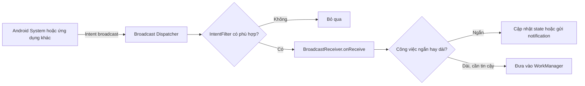
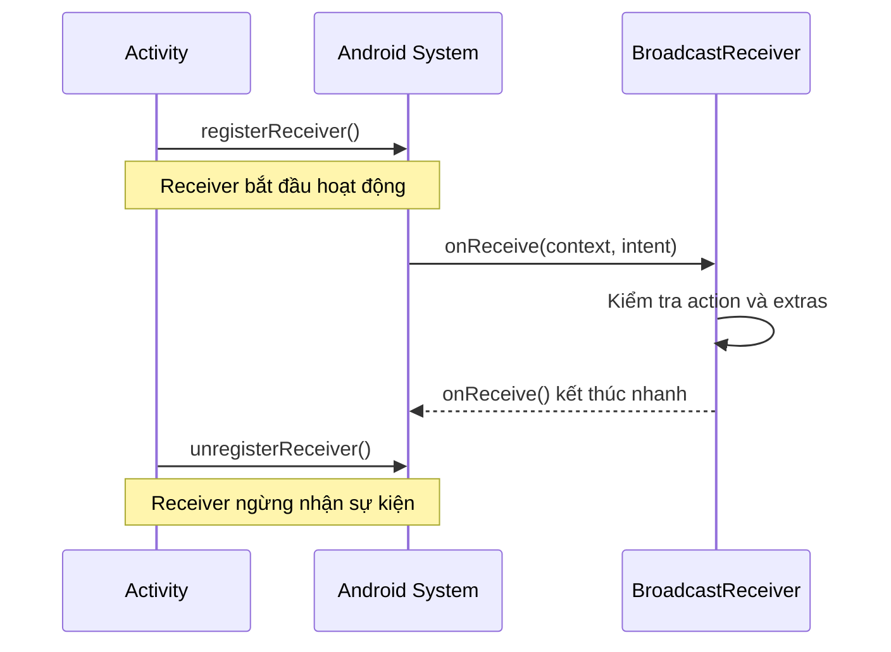
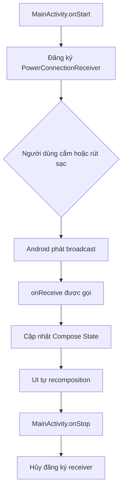
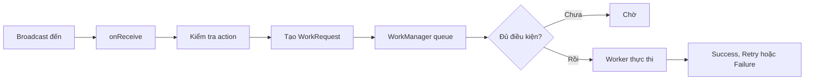

# 024 - Broadcast Receiver trong Android

**Học phần:** 02 - App Components and User Interface
**Module:** Module 03 - App Components
**Nhóm nội dung:** Other Components
**Nguồn roadmap:** App Components / Other Components
**Loại bài:** Lesson
**Thứ tự trong module:** 024
**Thời lượng gợi ý:** 24 phút

---

## 1. Tóm tắt

**Broadcast Receiver** là một thành phần Android dùng để nhận các thông điệp dạng broadcast do hệ điều hành hoặc ứng dụng khác phát ra.

Một số sự kiện thường gặp:

* Thiết bị được cắm hoặc rút sạc.
* Chế độ máy bay thay đổi.
* Thiết bị khởi động hoàn tất.
* Múi giờ hoặc thời gian hệ thống thay đổi.
* Một package được cài đặt hoặc gỡ bỏ.
* Một ứng dụng gửi custom broadcast.

Broadcast hoạt động gần giống mô hình **publish–subscribe**:

1. Một thành phần phát `Intent`.
2. Android tìm những receiver quan tâm đến `action` đó.
3. Android gọi `onReceive()` của các receiver phù hợp.

Android có thể tối ưu hoặc trì hoãn việc phân phối broadcast để bảo vệ hiệu năng hệ thống, vì vậy broadcast không thích hợp cho giao tiếp liên tiến trình yêu cầu độ trễ cực thấp.

---

## 2. Mục tiêu học tập

Sau bài học, anh có thể:

* Giải thích Broadcast Receiver bằng ngôn ngữ của mình.
* Phân biệt receiver khai báo trong Manifest và receiver đăng ký bằng code.
* Biết vai trò của `Intent`, `action`, `extras` và `IntentFilter`.
* Đăng ký và hủy đăng ký receiver đúng lifecycle.
* Tránh xử lý tác vụ dài trong `onReceive()`.
* Biết khi nào chuyển công việc sang `WorkManager`.
* Kiểm soát `android:exported`, quyền truy cập và dữ liệu đầu vào.
* Viết unit test cơ bản cho receiver.
* Tạo một mini project có thể đưa vào portfolio.

---

## 3. Ghi chú năm dòng

> Broadcast Receiver là thành phần nhận thông báo sự kiện từ Android hoặc ứng dụng khác.
> Mỗi broadcast được đóng gói trong một `Intent` có `action` và có thể có `extras`.
> Receiver xử lý sự kiện trong hàm `onReceive()`.
> `onReceive()` phải hoàn thành nhanh, không dùng cho công việc kéo dài.
> Receiver phải được đăng ký đúng phạm vi lifecycle và bảo vệ khỏi Intent không đáng tin cậy.

---

## 4. Broadcast Receiver nằm ở đâu trong ứng dụng?

Broadcast Receiver là một trong bốn loại app component truyền thống của Android:

| Thành phần          | Vai trò                                        |
| ------------------- | ---------------------------------------------- |
| `Activity`          | Hiển thị màn hình và xử lý tương tác           |
| `Service`           | Thực hiện công việc không gắn trực tiếp với UI |
| `ContentProvider`   | Chia sẻ hoặc cung cấp dữ liệu có cấu trúc      |
| `BroadcastReceiver` | Phản ứng với một sự kiện được phát đi          |

Receiver thường đóng vai trò **điểm kích hoạt**, không phải nơi chứa toàn bộ business logic.



Một kiến trúc tốt thường để receiver làm ba việc:

1. Xác thực `action` và dữ liệu đầu vào.
2. Chuyển dữ liệu sang tầng phù hợp.
3. Kết thúc nhanh.

---

## 5. Các thành phần của một broadcast

### 5.1. Sender

Sender là thành phần phát broadcast:

```kotlin
context.sendBroadcast(intent)
```

Sender có thể là:

* Hệ điều hành Android.
* Một ứng dụng khác.
* Một component trong cùng ứng dụng.

### 5.2. Intent

Broadcast được đóng gói bằng `Intent`.

```kotlin
val intent = Intent("com.example.power.ACTION_REFRESH").apply {
    putExtra("reason", "user_requested")
}
```

Hai trường quan trọng nhất:

| Trường   | Ý nghĩa        |
| -------- | -------------- |
| `action` | Tên sự kiện    |
| `extras` | Dữ liệu đi kèm |

Tên custom action nằm trong namespace toàn cục, vì vậy nên dùng package của ứng dụng để tránh trùng với ứng dụng khác:

```text
com.example.power.ACTION_REFRESH
```

### 5.3. IntentFilter

`IntentFilter` mô tả những action mà receiver muốn nhận.

```kotlin
val filter = IntentFilter().apply {
    addAction(Intent.ACTION_POWER_CONNECTED)
    addAction(Intent.ACTION_POWER_DISCONNECTED)
}
```

### 5.4. BroadcastReceiver

Receiver kế thừa từ `BroadcastReceiver` và cài đặt `onReceive()`:

```kotlin
class PowerConnectionReceiver : BroadcastReceiver() {

    override fun onReceive(context: Context, intent: Intent) {
        when (intent.action) {
            Intent.ACTION_POWER_CONNECTED -> {
                // Thiết bị vừa được cắm sạc
            }

            Intent.ACTION_POWER_DISCONNECTED -> {
                // Thiết bị vừa bị rút sạc
            }
        }
    }
}
```

Android chỉ xem đối tượng receiver là đang hoạt động trong thời gian thực thi `onReceive()`. Sau khi hàm trả về, hệ thống có thể giảm mức ưu tiên hoặc kết thúc process nếu không còn component quan trọng nào khác.

---

## 6. Hai cách đăng ký Broadcast Receiver

## 6.1. Context-registered receiver

Receiver được tạo và đăng ký bằng code:

```kotlin
ContextCompat.registerReceiver(
    context,
    receiver,
    filter,
    ContextCompat.RECEIVER_EXPORTED
)
```

Receiver chỉ hoạt động trong khoảng thời gian `Context` đăng ký nó còn hợp lệ, thường là từ `registerReceiver()` đến `unregisterReceiver()`.

### Phù hợp khi

* Chỉ cần nhận sự kiện lúc màn hình đang mở.
* Chỉ cần nhận sự kiện khi ứng dụng đang chạy.
* Muốn giới hạn receiver theo lifecycle.
* Broadcast không được phép khai báo tĩnh trong Manifest.

### Ưu điểm

* Dễ kiểm soát thời điểm bắt đầu và kết thúc.
* Không đánh thức ứng dụng khi không cần thiết.
* Giảm rủi ro ảnh hưởng pin và hiệu năng.

### Nhược điểm

* Phải hủy đăng ký đúng lifecycle.
* Không nhận được sự kiện khi scope đã kết thúc.
* Có thể gây memory leak nếu giữ `Activity Context` quá lâu.

Receiver giữ tham chiếu tới `Context` đã dùng để đăng ký. Nếu đăng ký bằng `Activity` nhưng không hủy khi Activity bị hủy, ứng dụng có thể làm rò rỉ Activity.

---

## 6.2. Manifest-declared receiver

Receiver được khai báo trong `AndroidManifest.xml`:

```xml
<application>
    <receiver
        android:name=".BootCompletedReceiver"
        android:enabled="true"
        android:exported="false">

        <intent-filter>
            <action android:name="android.intent.action.BOOT_COMPLETED" />
        </intent-filter>
    </receiver>
</application>
```

Receiver khai báo trong Manifest trở thành một entry point của ứng dụng. Android có thể khởi động process ứng dụng để phân phối broadcast ngay cả khi ứng dụng chưa chạy.

### Phù hợp khi

* Ứng dụng cần phản ứng với một sự kiện được Android cho phép nhận từ Manifest.
* Sự kiện phải được xử lý ngay cả khi UI không mở.
* Ví dụ: hoàn tất khởi động thiết bị, một số thay đổi package hoặc sự kiện hệ thống đặc biệt.

### Giới hạn quan trọng

Với ứng dụng target API 26 trở lên, phần lớn **implicit broadcast** không thể đăng ký trong Manifest, ngoại trừ danh sách các broadcast được miễn trừ. Trong nhiều trường hợp, Android khuyến nghị dùng cơ chế lập lịch công việc thay thế.

---

## 6.3. Bảng lựa chọn

| Tình huống                                           | Cách phù hợp                                      |
| ---------------------------------------------------- | ------------------------------------------------- |
| Chỉ theo dõi khi màn hình đang hiển thị              | Đăng ký trong `onStart()`, hủy trong `onStop()`   |
| Chỉ theo dõi khi người dùng đang tương tác           | Đăng ký trong `onResume()`, hủy trong `onPause()` |
| Theo dõi trong toàn bộ thời gian app process tồn tại | Application Context                               |
| Cần Android khởi động app khi sự kiện xảy ra         | Manifest, nếu action được phép                    |
| Công việc phải tiếp tục dù app đóng                  | Receiver kích hoạt `WorkManager`                  |
| Truyền state giữa các màn hình trong cùng app        | `StateFlow`, callback hoặc repository             |
| Giao tiếp IPC độ trễ thấp                            | Bound Service thay vì broadcast                   |

---

## 7. Lifecycle của Broadcast Receiver



### Một số scope thường dùng

| Đăng ký             | Hủy đăng ký              | Receiver hoạt động khi                 |
| ------------------- | ------------------------ | -------------------------------------- |
| `onResume()`        | `onPause()`              | Người dùng đang tương tác với màn hình |
| `onStart()`         | `onStop()`               | Màn hình đang hiển thị                 |
| `onCreate()`        | `onDestroy()`            | Activity vẫn tồn tại                   |
| Application Context | Scope riêng của ứng dụng | Process ứng dụng đang chạy             |

Android khuyến nghị chỉ đăng ký receiver trong phạm vi nhỏ nhất thực sự cần thiết. Với Jetpack Compose, có thể dùng `LifecycleStartEffect`, `LifecycleResumeEffect` hoặc `DisposableEffect`, đồng thời tránh để receiver vô tình giữ tham chiếu Activity lâu hơn lifecycle của nó.

---

## 8. Ví dụ thực hành: theo dõi trạng thái cắm sạc

Ứng dụng hiển thị trạng thái:

* `Đang kết nối nguồn điện`
* `Đã ngắt kết nối nguồn điện`
* `Chưa nhận được sự kiện`

### 8.1. Tạo receiver

```kotlin
package com.example.powerstatus

import android.content.BroadcastReceiver
import android.content.Context
import android.content.Intent

class PowerConnectionReceiver(
    private val onPowerChanged: (isConnected: Boolean) -> Unit
) : BroadcastReceiver() {

    override fun onReceive(context: Context, intent: Intent) {
        when (intent.action) {
            Intent.ACTION_POWER_CONNECTED -> onPowerChanged(true)
            Intent.ACTION_POWER_DISCONNECTED -> onPowerChanged(false)
        }
    }
}
```

Receiver chỉ kiểm tra action và chuyển kết quả sang UI. Nó không thực hiện network, truy vấn database lớn hoặc xử lý file.

---

### 8.2. Đăng ký receiver trong Activity

```kotlin
package com.example.powerstatus

import android.content.Intent
import android.content.IntentFilter
import android.os.Bundle
import androidx.activity.ComponentActivity
import androidx.activity.compose.setContent
import androidx.compose.material3.Text
import androidx.compose.runtime.getValue
import androidx.compose.runtime.mutableStateOf
import androidx.compose.runtime.setValue
import androidx.core.content.ContextCompat

class MainActivity : ComponentActivity() {

    private var isReceiverRegistered = false
    private var isPowerConnected by mutableStateOf<Boolean?>(null)

    private val powerReceiver = PowerConnectionReceiver { connected ->
        isPowerConnected = connected
    }

    override fun onCreate(savedInstanceState: Bundle?) {
        super.onCreate(savedInstanceState)

        setContent {
            val message = when (isPowerConnected) {
                true -> "Đang kết nối nguồn điện"
                false -> "Đã ngắt kết nối nguồn điện"
                null -> "Chưa nhận được sự kiện"
            }

            Text(text = message)
        }
    }

    override fun onStart() {
        super.onStart()

        val filter = IntentFilter().apply {
            addAction(Intent.ACTION_POWER_CONNECTED)
            addAction(Intent.ACTION_POWER_DISCONNECTED)
        }

        ContextCompat.registerReceiver(
            this,
            powerReceiver,
            filter,
            ContextCompat.RECEIVER_EXPORTED
        )

        isReceiverRegistered = true
    }

    override fun onStop() {
        if (isReceiverRegistered) {
            unregisterReceiver(powerReceiver)
            isReceiverRegistered = false
        }

        super.onStop()
    }
}
```

Vì receiver này lắng nghe broadcast từ hệ thống, ví dụ dùng `RECEIVER_EXPORTED`. Khi receiver chỉ nhận broadcast do chính ứng dụng gửi, nên dùng `RECEIVER_NOT_EXPORTED`. Nếu một receiver cần nhận cả broadcast nội bộ và broadcast bên ngoài, nên tách thành các receiver riêng với phạm vi export phù hợp.

### Luồng chạy



---

## 9. `onReceive()` phải hoàn thành nhanh

Theo mặc định, `onReceive()` thường chạy trên main thread. Vì vậy không nên đặt các công việc sau trực tiếp trong receiver:

```kotlin
override fun onReceive(context: Context, intent: Intent) {
    // Không nên
    downloadLargeFile()
    uploadDatabase()
    Thread.sleep(15_000)
    performComplexImageProcessing()
}
```

Receiver chậm có thể:

* Làm UI giật hoặc đứng.
* Chặn main thread.
* Tạo Broadcast Receiver ANR.
* Bị hệ thống kết thúc trước khi hoàn thành.
* Làm tăng thời gian khởi động lạnh của ứng dụng.

Broadcast Receiver ANR xảy ra khi `onReceive()` không kết thúc đúng thời gian hoặc khi receiver dùng `goAsync()` nhưng không gọi `PendingResult.finish()` kịp thời.

### Ảnh minh họa: thời gian xử lý Broadcast Receiver


*Nguồn ảnh: Android Developers – Diagnose and fix ANRs.*

---

## 10. Công việc ngắn, bất đồng bộ và công việc dài

## 10.1. Công việc rất ngắn

Có thể xử lý trực tiếp trong `onReceive()`:

```kotlin
override fun onReceive(context: Context, intent: Intent) {
    val enabled = intent.getBooleanExtra("enabled", false)
    preferences.saveFeatureEnabled(enabled)
}
```

Chỉ phù hợp nếu thao tác nhanh và không chặn thread.

---

## 10.2. Công việc bất đồng bộ ngắn với `goAsync()`

```kotlin
class DataChangedReceiver(
    private val repository: DataRepository,
    private val appScope: CoroutineScope
) : BroadcastReceiver() {

    override fun onReceive(context: Context, intent: Intent) {
        val pendingResult = goAsync()

        appScope.launch {
            try {
                repository.refreshSmallCache()
            } finally {
                pendingResult.finish()
            }
        }
    }
}
```

`goAsync()` cho phép `onReceive()` trả về trước khi công việc nền hoàn thành. Tuy nhiên receiver vẫn phải kết thúc nhanh và phải gọi `finish()` trên mọi code path.

Không nên dùng `goAsync()` cho:

* Upload file lớn.
* Đồng bộ dữ liệu dài.
* Xử lý video.
* Tác vụ cần retry.
* Công việc phải sống sót khi process bị kết thúc.

---

## 10.3. Công việc dài hoặc cần độ tin cậy với WorkManager

```kotlin
class SyncReceiver : BroadcastReceiver() {

    override fun onReceive(context: Context, intent: Intent) {
        if (intent.action != ACTION_SYNC_REQUIRED) return

        val request = OneTimeWorkRequestBuilder<SyncWorker>()
            .build()

        WorkManager
            .getInstance(context)
            .enqueueUniqueWork(
                "background-sync",
                ExistingWorkPolicy.KEEP,
                request
            )
    }

    companion object {
        const val ACTION_SYNC_REQUIRED =
            "com.example.powerstatus.ACTION_SYNC_REQUIRED"
    }
}
```

WorkManager phù hợp với công việc cần tiếp tục dù người dùng rời màn hình, ứng dụng thoát hoặc thiết bị khởi động lại. Nó cũng hỗ trợ constraint, retry, backoff và unique work.



---

## 11. Normal Broadcast và Ordered Broadcast

### Normal Broadcast

```kotlin
context.sendBroadcast(intent)
```

Đặc điểm:

* Phân phối cho các receiver phù hợp.
* Không đảm bảo thứ tự thực thi giữa các receiver.
* Receiver không chuyển kết quả cho receiver tiếp theo.
* Hiệu quả hơn ordered broadcast.

### Ordered Broadcast

```kotlin
context.sendOrderedBroadcast(
    intent,
    null
)
```

Đặc điểm:

* Receiver được chạy lần lượt.
* Receiver trước có thể truyền kết quả cho receiver sau.
* Một receiver có thể ngăn broadcast tiếp tục trong một số trường hợp.
* Không nên phụ thuộc vào thứ tự giữa các process hoặc ứng dụng ngoài tầm kiểm soát.

Android mô tả `sendBroadcast()` là normal broadcast với thứ tự receiver không xác định, trong khi `sendOrderedBroadcast()` phân phối lần lượt và cho phép truyền kết quả giữa các receiver.

---

## 12. Explicit và implicit broadcast

### Implicit broadcast

Intent chỉ chứa action, không chỉ định component cụ thể:

```kotlin
val intent = Intent("com.example.ACTION_REFRESH")
context.sendBroadcast(intent)
```

Nhiều ứng dụng có thể đăng ký action đó.

### Explicit broadcast

Intent chỉ định receiver cụ thể:

```kotlin
val intent = Intent(context, RefreshReceiver::class.java)
context.sendBroadcast(intent)
```

Hoặc giới hạn theo package:

```kotlin
val intent = Intent("com.example.ACTION_REFRESH").apply {
    setPackage(context.packageName)
}

context.sendBroadcast(intent)
```

Khi gửi dữ liệu chỉ dành cho một ứng dụng, nên giới hạn package, dùng explicit intent hoặc permission phù hợp. Android cảnh báo không truyền dữ liệu nhạy cảm qua implicit broadcast vì ứng dụng khác có thể đăng ký để nhận nó.

---

## 13. Bảo mật Broadcast Receiver

Receiver là một entry point vào ứng dụng. Nếu receiver bị export ngoài ý muốn, ứng dụng độc hại có thể gửi Intent giả để kích hoạt hành vi không dành cho bên ngoài.

### 13.1. Khai báo rõ `android:exported`

Receiver chỉ dùng nội bộ:

```xml
<receiver
    android:name=".RefreshReceiver"
    android:exported="false" />
```

Receiver cần nhận từ ứng dụng khác:

```xml
<receiver
    android:name=".PublicReceiver"
    android:exported="true"
    android:permission="com.example.permission.SEND_COMMAND" />
```

Android khuyến nghị khai báo rõ `android:exported`. Giá trị `false` ngăn các nguồn bên ngoài ứng dụng gọi receiver, ngoại trừ một số nguồn hệ thống hoặc ứng dụng có cùng UID.

### 13.2. Không tin tưởng extras

Không nên:

```kotlin
override fun onReceive(context: Context, intent: Intent) {
    val userId = intent.getStringExtra("user_id")!!
    repository.deleteUser(userId)
}
```

Nên:

```kotlin
override fun onReceive(context: Context, intent: Intent) {
    if (intent.action != ACTION_SAFE_REFRESH) return

    val userId = intent.getStringExtra(EXTRA_USER_ID)
        ?.takeIf { it.matches(Regex("[a-zA-Z0-9_-]{1,64}")) }
        ?: return

    repository.requestSafeRefresh(userId)
}
```

Receiver không nên thực hiện thao tác nguy hiểm chỉ dựa trên dữ liệu do Intent cung cấp.

### 13.3. Dùng permission khi giao tiếp giữa các app

```xml
<permission
    android:name="com.example.permission.SEND_SECURE_EVENT"
    android:protectionLevel="signature" />

<receiver
    android:name=".SecureEventReceiver"
    android:exported="true"
    android:permission="com.example.permission.SEND_SECURE_EVENT">
    <intent-filter>
        <action android:name="com.example.ACTION_SECURE_EVENT" />
    </intent-filter>
</receiver>
```

Với `protectionLevel="signature"`, chỉ ứng dụng được ký bằng cùng certificate mới có thể được cấp permission đó.

### 13.4. Tránh custom broadcast cho sự kiện nội bộ đơn giản

Khi sender và receiver nằm trong cùng process, các lựa chọn dễ kiểm soát hơn thường là:

* Callback.
* Kotlin `Flow` hoặc `StateFlow`.
* Shared ViewModel.
* Repository.
* Navigation result.
* Event channel có scope rõ ràng.

Tài liệu bảo mật Android cũng khuyến nghị cân nhắc callback thay vì Broadcast Receiver cho các sự kiện hoàn tất chỉ dùng nội bộ.

---

## 14. Không mở Activity trực tiếp từ receiver

Không nên:

```kotlin
override fun onReceive(context: Context, intent: Intent) {
    val screenIntent = Intent(context, WarningActivity::class.java).apply {
        addFlags(Intent.FLAG_ACTIVITY_NEW_TASK)
    }

    context.startActivity(screenIntent)
}
```

Hành vi này có thể:

* Làm gián đoạn tác vụ hiện tại của người dùng.
* Mở màn hình bất ngờ.
* Tạo trải nghiệm khó chịu.
* Bị giới hạn bởi cơ chế background activity launch.

Cách phù hợp hơn thường là gửi notification để người dùng tự quyết định mở màn hình. Android cũng khuyến nghị tránh khởi chạy Activity từ receiver và cân nhắc notification.

---

## 15. Unit test Broadcast Receiver

Receiver trong ví dụ sử dụng callback nên có thể test mà không cần mở UI.

```kotlin
@RunWith(AndroidJUnit4::class)
class PowerConnectionReceiverTest {

    @Test
    fun powerConnected_emitsTrue() {
        val context = ApplicationProvider
            .getApplicationContext<Context>()

        var result: Boolean? = null

        val receiver = PowerConnectionReceiver { connected ->
            result = connected
        }

        receiver.onReceive(
            context,
            Intent(Intent.ACTION_POWER_CONNECTED)
        )

        assertThat(result).isTrue()
    }

    @Test
    fun powerDisconnected_emitsFalse() {
        val context = ApplicationProvider
            .getApplicationContext<Context>()

        var result: Boolean? = null

        val receiver = PowerConnectionReceiver { connected ->
            result = connected
        }

        receiver.onReceive(
            context,
            Intent(Intent.ACTION_POWER_DISCONNECTED)
        )

        assertThat(result).isFalse()
    }

    @Test
    fun unknownAction_doesNotChangeResult() {
        val context = ApplicationProvider
            .getApplicationContext<Context>()

        var result: Boolean? = null

        val receiver = PowerConnectionReceiver { connected ->
            result = connected
        }

        receiver.onReceive(
            context,
            Intent("com.example.UNKNOWN_ACTION")
        )

        assertThat(result).isNull()
    }
}
```

### Các trường hợp nên test

| Test case                           | Kết quả mong đợi                |
| ----------------------------------- | ------------------------------- |
| Action hợp lệ                       | Receiver xử lý đúng             |
| Action không xác định               | Receiver bỏ qua                 |
| Thiếu extra                         | Không crash                     |
| Extra sai kiểu                      | Không crash                     |
| Extra quá dài hoặc sai định dạng    | Bị từ chối                      |
| Receiver đăng ký khi Activity start | Nhận sự kiện                    |
| Activity stop                       | Không còn nhận sự kiện          |
| Công việc bị gửi nhiều lần          | Không tạo nhiều job trùng       |
| Receiver export                     | Chỉ caller hợp lệ truy cập được |

---

## 16. Debug bằng ADB

Đối với custom receiver dùng trong môi trường debug, có thể phát broadcast bằng ADB:

```bash
adb shell am broadcast \
  -a com.example.powerstatus.ACTION_DEBUG_REFRESH \
  -p com.example.powerstatus
```

Gửi kèm dữ liệu:

```bash
adb shell am broadcast \
  -a com.example.powerstatus.ACTION_DEBUG_REFRESH \
  -p com.example.powerstatus \
  --es reason "adb_test"
```

Xem log:

```bash
adb logcat | grep PowerConnectionReceiver
```

Không phải system broadcast nào cũng có thể giả lập bằng ADB. Một số action được bảo vệ và chỉ hệ thống mới có quyền gửi.

---

## 17. Các lỗi junior thường gặp

### Lỗi 1: Quên hủy đăng ký receiver

```kotlin
override fun onStart() {
    super.onStart()
    registerReceiver(receiver, filter)
}

// Không có unregisterReceiver()
```

**Hậu quả:** rò rỉ `Activity`, nhận callback khi màn hình không còn cần và có thể đăng ký trùng.

---

### Lỗi 2: Thực hiện network trực tiếp trong `onReceive()`

```kotlin
override fun onReceive(context: Context, intent: Intent) {
    api.uploadAllData()
}
```

**Hậu quả:** block main thread, ANR hoặc tác vụ bị dừng khi process bị kết thúc.

**Cách sửa:** enqueue `WorkManager`.

---

### Lỗi 3: Dùng Manifest cho mọi broadcast

```xml
<receiver
    android:name=".NetworkReceiver"
    android:exported="false">
    <intent-filter>
        <action android:name="android.net.conn.CONNECTIVITY_CHANGE" />
    </intent-filter>
</receiver>
```

Các ứng dụng target Android 7.0 trở lên không nhận `CONNECTIVITY_ACTION` bằng receiver khai báo trong Manifest. Receiver đăng ký bằng context vẫn có thể nhận khi ứng dụng đang chạy.

Đối với công việc cần mạng, thường nên đặt network constraint cho `WorkManager` thay vì tự nghe mọi biến động mạng.

---

### Lỗi 4: Export receiver không cần thiết

```xml
<receiver
    android:name=".DeleteAccountReceiver"
    android:exported="true" />
```

**Hậu quả:** ứng dụng khác có thể cố gửi Intent để kích hoạt thao tác nguy hiểm.

**Cách sửa:** đặt `android:exported="false"` hoặc bảo vệ bằng permission phù hợp.

---

### Lỗi 5: Tin tưởng hoàn toàn vào extras

```kotlin
val path = intent.getStringExtra("file_path")!!
File(path).delete()
```

**Hậu quả:** path traversal, xóa nhầm file hoặc crash.

**Cách sửa:** validate input và chỉ thao tác trong thư mục ứng dụng kiểm soát.

---

### Lỗi 6: Khởi tạo thread rồi kết thúc `onReceive()`

```kotlin
override fun onReceive(context: Context, intent: Intent) {
    Thread {
        performLongTask()
    }.start()
}
```

Sau khi `onReceive()` kết thúc, Android có thể kết thúc process vì không còn biết thread đó đại diện cho công việc quan trọng.

---

### Lỗi 7: Dùng broadcast như một event bus toàn ứng dụng

Điều này làm luồng dữ liệu:

* Khó lần theo.
* Khó test.
* Không rõ ownership.
* Dễ tạo event trùng.
* Dễ gặp lỗi lifecycle.

Với giao tiếp trong cùng app, nên ưu tiên state holder, repository và `Flow`.

---

## 18. Ảnh minh họa quy trình debug ANR


*Sơ đồ chính thức dùng để xác định receiver đồng bộ, receiver dùng `goAsync()`, slow startup, thiếu `finish()` và worker thread bị block.*

---

## 19. Ảnh hưởng đến UX, reliability và maintainability

| Khía cạnh       | Triển khai tốt                                | Triển khai kém                                 |
| --------------- | --------------------------------------------- | ---------------------------------------------- |
| UX              | Cập nhật trạng thái đúng thời điểm            | Màn hình tự bật hoặc UI bị giật                |
| Reliability     | Công việc dài được đưa vào WorkManager        | Tác vụ mất khi process bị kill                 |
| Performance     | Receiver hoạt động trong scope nhỏ            | Nhiều receiver đánh thức ứng dụng              |
| Battery         | Chỉ phản ứng khi thật sự cần                  | Xử lý nền ở mọi broadcast                      |
| Security        | Export tối thiểu, validate input              | Receiver công khai và tin mọi extras           |
| Maintainability | Receiver mỏng, business logic tách riêng      | Toàn bộ logic nằm trong `onReceive()`          |
| Testing         | Action được map thành hàm thuần hoặc callback | Phụ thuộc trực tiếp vào framework và singleton |
| Release risk    | Test trên nhiều API level                     | Chỉ test trên một emulator                     |

---

## 20. Checklist production

### Lifecycle

* [ ] Receiver chỉ được đăng ký trong scope cần thiết.
* [ ] Mỗi lần đăng ký đều có lần hủy tương ứng.
* [ ] Không giữ Activity Context trong singleton.
* [ ] Không đăng ký lại nhiều lần ngoài ý muốn.
* [ ] Xem xét hành vi khi rotate hoặc process recreation.

### Hiệu năng

* [ ] `onReceive()` hoàn thành nhanh.
* [ ] Không đọc file lớn trong receiver.
* [ ] Không gọi network đồng bộ.
* [ ] Không dùng `Thread.sleep()`.
* [ ] Công việc dài được chuyển sang WorkManager.
* [ ] Dùng unique work khi broadcast có thể đến liên tục.

### Bảo mật

* [ ] Khai báo rõ `android:exported`.
* [ ] Dùng `RECEIVER_NOT_EXPORTED` cho broadcast nội bộ.
* [ ] Chỉ export receiver khi có yêu cầu thực sự.
* [ ] Receiver công khai được bảo vệ bằng permission khi cần.
* [ ] Kiểm tra `intent.action` trước khi xử lý.
* [ ] Validate tất cả extras.
* [ ] Không phát dữ liệu nhạy cảm bằng implicit broadcast.
* [ ] Custom action sử dụng namespace của ứng dụng.

### UX

* [ ] Không tự mở Activity từ receiver.
* [ ] Dùng notification khi cần thu hút người dùng.
* [ ] Không hiển thị nhiều notification cho cùng một sự kiện.
* [ ] Có cơ chế chống duplicate event.
* [ ] Nội dung notification được bản địa hóa.

### Testing và release

* [ ] Test action hợp lệ.
* [ ] Test action không hợp lệ.
* [ ] Test thiếu hoặc sai extras.
* [ ] Test receiver khi ứng dụng foreground.
* [ ] Test khi ứng dụng background.
* [ ] Test trên API level thấp nhất và target API.
* [ ] Kiểm tra ANR trong Play Console.
* [ ] Kiểm tra receiver bằng App Inspection hoặc `adb`.
* [ ] Rà soát Manifest sau quá trình manifest merging.

---

## 21. Mini project cho portfolio

### Tên project

**Android Power Event Monitor**

### Chức năng

* Hiển thị trạng thái nguồn điện.
* Theo dõi sự kiện cắm và rút sạc.
* Ghi lịch sử sự kiện vào Room.
* Dùng WorkManager để định kỳ dọn dữ liệu cũ.
* Có unit test cho receiver.
* Có instrumentation test cho lifecycle.
* Có tài liệu security review.

### Cấu trúc gợi ý

```text
app/
├── receiver/
│   └── PowerConnectionReceiver.kt
├── data/
│   ├── PowerEvent.kt
│   ├── PowerEventDao.kt
│   └── PowerEventRepository.kt
├── worker/
│   └── CleanupPowerHistoryWorker.kt
├── ui/
│   ├── PowerStatusViewModel.kt
│   └── PowerStatusScreen.kt
└── test/
    └── PowerConnectionReceiverTest.kt
```

### README nên có

```markdown
# Android Power Event Monitor

## Mục tiêu
Minh họa cách sử dụng BroadcastReceiver an toàn và đúng lifecycle.

## Kiến trúc
Android System → BroadcastReceiver → ViewModel/Repository → Compose UI

## Quyết định kỹ thuật
- Receiver được đăng ký trong onStart và hủy trong onStop.
- onReceive không chứa tác vụ dài.
- Công việc bền vững được chuyển sang WorkManager.
- Intent action và extras luôn được kiểm tra.
- Receiver không thực hiện navigation trực tiếp.

## Kiểm thử
- ACTION_POWER_CONNECTED
- ACTION_POWER_DISCONNECTED
- Unknown action
- Lifecycle registration
- Duplicate work prevention
```

---

## 22. Bài tập

### Bài 1: Battery Low Receiver

Tạo receiver lắng nghe:

```kotlin
Intent.ACTION_BATTERY_LOW
Intent.ACTION_BATTERY_OKAY
```

Yêu cầu:

* Hiển thị trạng thái trong Compose.
* Không mở Activity từ receiver.
* Không đăng ký khi màn hình đã stop.
* Có ít nhất ba unit test.

---

### Bài 2: Boot Receiver và WorkManager

Tạo receiver nhận:

```text
android.intent.action.BOOT_COMPLETED
```

Khi thiết bị khởi động:

1. Receiver không thực hiện đồng bộ trực tiếp.
2. Receiver enqueue một unique WorkRequest.
3. Worker kiểm tra xem người dùng đã bật tính năng tự đồng bộ chưa.
4. Nếu chưa bật, worker kết thúc mà không gọi API.

Gợi ý permission:

```xml
<uses-permission android:name="android.permission.RECEIVE_BOOT_COMPLETED" />
```

---

### Bài 3: Security Review

Đọc receiver sau và tìm lỗi:

```xml
<receiver
    android:name=".AdminCommandReceiver"
    android:exported="true">
    <intent-filter>
        <action android:name="RUN_ADMIN_COMMAND" />
    </intent-filter>
</receiver>
```

```kotlin
class AdminCommandReceiver : BroadcastReceiver() {

    override fun onReceive(context: Context, intent: Intent) {
        val command = intent.getStringExtra("command")!!
        Runtime.getRuntime().exec(command)
    }
}
```

Các vấn đề chính:

* Receiver được export công khai.
* Không có permission.
* Action không dùng namespace.
* Không kiểm tra action.
* Dùng `!!` với dữ liệu ngoài.
* Thực thi command tùy ý.
* Thực hiện tác vụ nguy hiểm từ Intent không đáng tin cậy.

---

## 23. Câu hỏi tự kiểm tra

1. Broadcast Receiver khác Service ở điểm nào?
2. `IntentFilter` có nhiệm vụ gì?
3. Khi nào nên đăng ký receiver trong `onStart()`?
4. Tại sao phải gọi `unregisterReceiver()`?
5. Vì sao không nên gọi network trực tiếp trong `onReceive()`?
6. `goAsync()` giải quyết vấn đề gì?
7. Khi nào nên dùng WorkManager?
8. `android:exported="true"` tạo ra rủi ro nào?
9. Vì sao không nên gửi token qua implicit broadcast?
10. Manifest receiver bị giới hạn như thế nào từ API 26?
11. Vì sao không nên tự mở Activity từ receiver?
12. Làm thế nào để ngăn nhiều broadcast tạo nhiều worker trùng nhau?

---

## 24. Checklist hoàn thành bài học

* [ ] Có định nghĩa ngắn gọn về Broadcast Receiver.
* [ ] Hiểu vai trò của `Intent`, `action`, `extras` và `IntentFilter`.
* [ ] Phân biệt context-registered và manifest-declared receiver.
* [ ] Đăng ký và hủy đăng ký receiver đúng lifecycle.
* [ ] Có ví dụ Kotlin chạy được.
* [ ] Không đặt công việc dài trong `onReceive()`.
* [ ] Biết sử dụng `goAsync()` cho tác vụ ngắn.
* [ ] Biết chuyển công việc bền vững sang WorkManager.
* [ ] Hiểu `android:exported` và receiver permission.
* [ ] Có test cho action hợp lệ và không hợp lệ.
* [ ] Có diagram mô tả luồng broadcast.
* [ ] Có README hoặc screenshot để đưa vào portfolio.

---

## 25. Kết luận

Broadcast Receiver không phải là một background worker độc lập. Nó là **điểm tiếp nhận sự kiện** có vòng đời rất ngắn.

Nguyên tắc quan trọng nhất:

> **Nhận sự kiện, xác thực dữ liệu, chuyển công việc sang đúng tầng và kết thúc nhanh.**

Một implementation production-ready nên:

* Đăng ký receiver trong scope nhỏ nhất.
* Hủy đăng ký đúng lifecycle.
* Giữ `onReceive()` nhẹ.
* Dùng WorkManager cho công việc cần độ tin cậy.
* Không mở Activity bất ngờ.
* Không tin tưởng Intent từ bên ngoài.
* Export receiver ở mức tối thiểu.
* Có unit test, ANR monitoring và security checklist.

---

# Bài luyện tập

## Mục tiêu


## Đề bài


## Yêu cầu hoàn thành

- [ ] 
- [ ] 
- [ ] 

## Kết quả / lời giải


## Ghi chú
