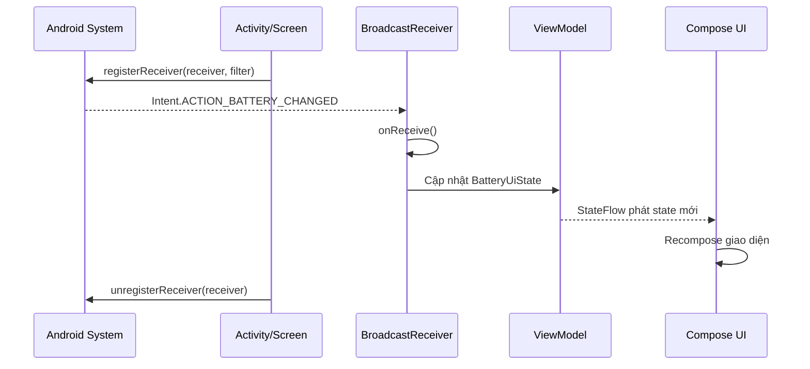
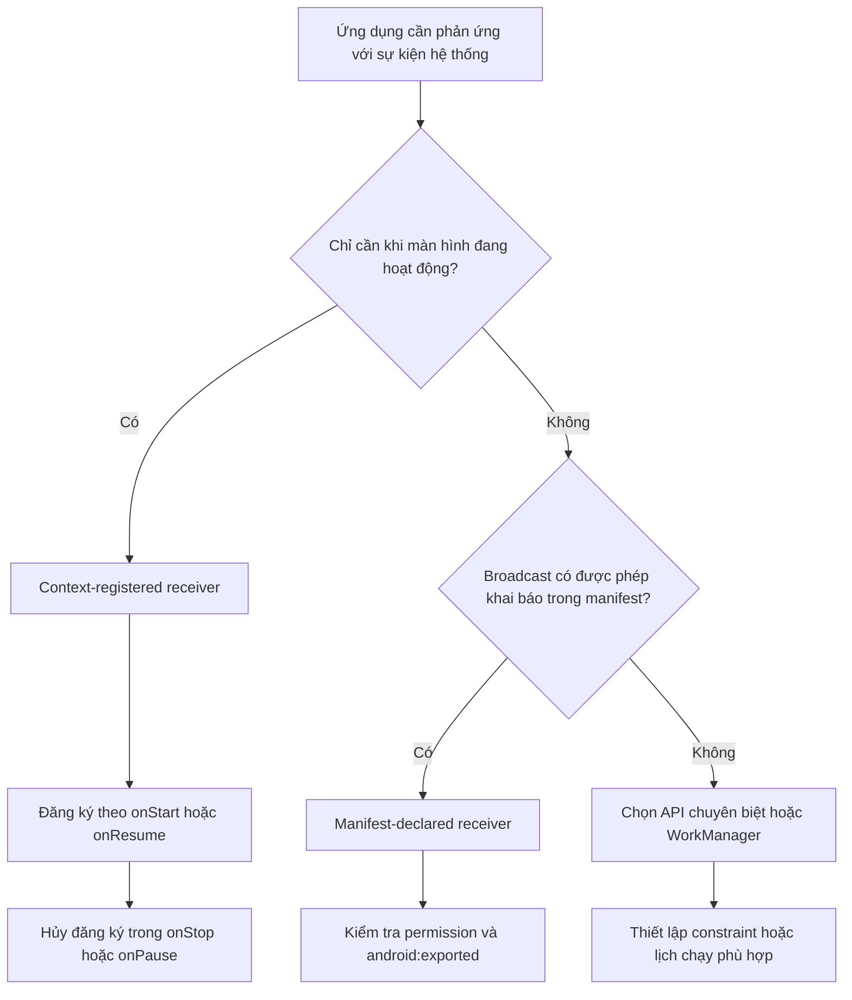

# 025 — System Broadcasts trong Android

[](https://medium.com/%40abhishekhzb/android-activity-lifecycle-5533126a4762?utm_source=chatgpt.com)


| Thuộc tính              | Nội dung                               |
| ----------------------- | -------------------------------------- |
| **Học phần**            | 02 — App Components and User Interface |
| **Module**              | Module 03 — App Components             |
| **Nhóm nội dung**       | Other Components                       |
| **Nguồn roadmap**       | App Components / Other Components      |
| **Loại bài**            | Lesson                                 |
| **Thứ tự trong module** | 025                                    |
| **Thời lượng gợi ý**    | 24 phút                                |

---

## 1. Tóm tắt

**System Broadcasts** là các thông điệp dạng `Intent` do hệ điều hành Android phát ra khi một sự kiện hệ thống xảy ra, chẳng hạn:

* Trạng thái pin thay đổi.
* Thiết bị được cắm hoặc rút sạc.
* Múi giờ thay đổi.
* Thiết bị khởi động xong.
* Ứng dụng vừa được cập nhật.
* Bộ nhớ thiết bị xuống thấp.

Ứng dụng có thể đăng ký một `BroadcastReceiver` để nhận những thông điệp phù hợp và phản ứng lại.

Tuy nhiên, broadcast chỉ nên được xem là **tín hiệu cho biết một sự kiện vừa xảy ra**, không phải môi trường để thực hiện công việc nặng hoặc kéo dài. Phương thức `onReceive()` thường chạy trên main thread và cần hoàn thành nhanh. Công việc cần tồn tại sau khi ứng dụng đóng nên được chuyển sang `WorkManager` hoặc API background work phù hợp. ([Android Developers][1])

---

## 2. Mục tiêu học tập

Sau bài học, anh có thể:

* Giải thích System Broadcast bằng ngôn ngữ của mình.
* Phân biệt System Broadcast với custom broadcast.
* Nhận biết khi nào dùng receiver đăng ký theo lifecycle.
* Nhận biết khi nào có thể khai báo receiver trong `AndroidManifest.xml`.
* Xử lý broadcast mà không làm treo giao diện.
* Tránh memory leak do quên gọi `unregisterReceiver()`.
* Kiểm tra System Broadcast bằng Android Emulator.
* Xây dựng một ứng dụng nhỏ theo dõi trạng thái pin để đưa vào portfolio.

---

## 3. System Broadcast là gì?

Một System Broadcast thường gồm ba thành phần:

1. **Nguồn phát:** hệ điều hành Android hoặc thành phần hệ thống.
2. **Broadcast Intent:** mô tả loại sự kiện và dữ liệu liên quan.
3. **BroadcastReceiver:** thành phần trong ứng dụng nhận và xử lý sự kiện.

Ví dụ, khi trạng thái pin thay đổi, Android có thể phát một `Intent` với action:

```kotlin
Intent.ACTION_BATTERY_CHANGED
```

Ứng dụng đăng ký nhận action này sẽ được gọi tại:

```kotlin
override fun onReceive(context: Context, intent: Intent)
```

`ACTION_BATTERY_CHANGED` là một sticky broadcast chứa mức pin, trạng thái sạc và các thông tin liên quan. Broadcast này không thể nhận thông qua receiver khai báo trong manifest; ứng dụng phải đăng ký receiver bằng code. Đây cũng là protected broadcast, nghĩa là chỉ hệ thống được phép phát action này. ([Android Developers][2])

---

## 4. Mô hình hoạt động



Có thể hình dung broadcast giống như một thông báo:

> “Hệ thống vừa xảy ra sự kiện X. Ứng dụng nào đang quan tâm đến X thì xử lý.”

BroadcastReceiver không nên liên tục kiểm tra trạng thái hệ thống. Thay vào đó, nó phản ứng khi Android gửi sự kiện.

---

## 5. Một số System Broadcast thường gặp

| Action                       | Ý nghĩa                              | Cách đăng ký phù hợp                 |
| ---------------------------- | ------------------------------------ | ------------------------------------ |
| `ACTION_BATTERY_CHANGED`     | Mức pin hoặc trạng thái sạc thay đổi | Runtime receiver                     |
| `ACTION_BATTERY_LOW`         | Pin xuống mức thấp theo hệ thống     | Runtime hoặc tùy trường hợp manifest |
| `ACTION_BATTERY_OKAY`        | Pin trở lại mức an toàn              | Runtime hoặc tùy trường hợp manifest |
| `ACTION_POWER_CONNECTED`     | Thiết bị được cắm nguồn              | Kiểm tra quy định manifest theo API  |
| `ACTION_POWER_DISCONNECTED`  | Thiết bị bị rút nguồn                | Kiểm tra quy định manifest theo API  |
| `ACTION_TIMEZONE_CHANGED`    | Người dùng hoặc hệ thống đổi múi giờ | Runtime hoặc receiver được phép      |
| `ACTION_TIME_TICK`           | Thời gian thay đổi mỗi phút          | Chỉ runtime receiver                 |
| `ACTION_BOOT_COMPLETED`      | Thiết bị khởi động hoàn tất          | Manifest và permission               |
| `ACTION_MY_PACKAGE_REPLACED` | Chính ứng dụng vừa được cập nhật     | Manifest receiver                    |
| `ACTION_DEVICE_STORAGE_LOW`  | Dung lượng lưu trữ xuống thấp        | Kiểm tra API và nhu cầu ứng dụng     |

`ACTION_TIME_TICK` chỉ có thể nhận bằng cách đăng ký receiver bằng code. `ACTION_BOOT_COMPLETED` yêu cầu quyền `RECEIVE_BOOT_COMPLETED`. `ACTION_MY_PACKAGE_REPLACED` chỉ được gửi đến chính ứng dụng vừa được cập nhật. ([Android Developers][2])

> Không nên ghi nhớ toàn bộ action. Khi sử dụng một System Broadcast, hãy đọc tài liệu của chính action đó để biết permission, extras, giới hạn API và cách đăng ký.

---

## 6. Hai cách đăng ký BroadcastReceiver

### 6.1. Context-registered receiver

Receiver được đăng ký bằng code:

```kotlin
ContextCompat.registerReceiver(
    context,
    receiver,
    intentFilter,
    receiverFlags
)
```

Receiver chỉ hoạt động trong khoảng thời gian từ lúc đăng ký đến lúc:

```kotlin
context.unregisterReceiver(receiver)
```

Nếu receiver được đăng ký bằng `Activity`, nó không nên sống lâu hơn lifecycle của `Activity`. Android khuyến nghị đăng ký receiver trong phạm vi nhỏ nhất mà màn hình thực sự cần dữ liệu, chẳng hạn `onStart()`/`onStop()` hoặc `onResume()`/`onPause()`. ([Android Developers][1])

#### Phù hợp khi

* Chỉ cần cập nhật khi màn hình đang hiển thị.
* Sự kiện trực tiếp ảnh hưởng đến UI.
* Không cần đánh thức ứng dụng khi ứng dụng chưa chạy.
* Broadcast không được phép khai báo trong manifest.

Ví dụ:

```kotlin
override fun onStart() {
    super.onStart()
    registerBatteryReceiver()
}

override fun onStop() {
    unregisterBatteryReceiver()
    super.onStop()
}
```

---

### 6.2. Manifest-declared receiver

Receiver được khai báo trong `AndroidManifest.xml`:

```xml
<receiver
    android:name=".AppUpdatedReceiver"
    android:exported="false">

    <intent-filter>
        <action android:name="android.intent.action.MY_PACKAGE_REPLACED" />
    </intent-filter>
</receiver>
```

Khi broadcast phù hợp được gửi, hệ thống có thể khởi động process của ứng dụng để chuyển broadcast đến receiver.

Từ Android 8.0, ứng dụng target API 26 trở lên không thể đăng ký phần lớn implicit broadcast trong manifest. Một số broadcast được gửi riêng cho ứng dụng hoặc nằm trong danh sách ngoại lệ vẫn có thể sử dụng manifest receiver. ([Android Developers][1])

#### Phù hợp khi

* Sự kiện phải được nhận dù UI chưa mở.
* Broadcast được phép khai báo trong manifest.
* Broadcast được gửi riêng đến package của ứng dụng.
* Ứng dụng cần khôi phục một tác vụ sau khi thiết bị khởi động.

---

## 7. Sơ đồ lựa chọn cách xử lý



---

## 8. Quy tắc lifecycle quan trọng

### Đăng ký trong `onStart()`

```kotlin
override fun onStart() {
    super.onStart()
    registerReceiver()
}
```

### Hủy trong `onStop()`

```kotlin
override fun onStop() {
    unregisterReceiver()
    super.onStop()
}
```

Cặp lifecycle phải đối xứng:

| Đăng ký      | Hủy đăng ký   |
| ------------ | ------------- |
| `onResume()` | `onPause()`   |
| `onStart()`  | `onStop()`    |
| `onCreate()` | `onDestroy()` |

Không nên đăng ký trong `onStart()` nhưng đợi đến `onDestroy()` mới hủy vì receiver sẽ tiếp tục nhận sự kiện khi màn hình đã không còn hiển thị.

Receiver đang được đăng ký giữ tham chiếu đến `Context`. Nếu receiver sống lâu hơn `Activity`, ứng dụng có thể giữ lại Activity không cần thiết và gây memory leak. ([Android Developers][1])

---

# 9. Thực hành: ứng dụng theo dõi pin

Ứng dụng mẫu sẽ:

* Nhận `ACTION_BATTERY_CHANGED`.
* Đọc mức pin và trạng thái sạc.
* Đưa dữ liệu vào `ViewModel`.
* Hiển thị trạng thái bằng Jetpack Compose.
* Chỉ theo dõi pin khi màn hình đang ở trạng thái started.

---

## 9.1. Mô hình state

```kotlin
data class BatteryUiState(
    val levelPercent: Int? = null,
    val isCharging: Boolean = false
)
```

---

## 9.2. Chuyển Intent thành state

Tách phần đọc `Intent` thành một mapper giúp receiver gọn hơn và dễ kiểm thử hơn.

```kotlin
import android.content.Intent
import android.os.BatteryManager
import kotlin.math.roundToInt

object BatteryIntentMapper {

    fun map(intent: Intent): BatteryUiState? {
        if (intent.action != Intent.ACTION_BATTERY_CHANGED) {
            return null
        }

        val rawLevel = intent.getIntExtra(
            BatteryManager.EXTRA_LEVEL,
            -1
        )

        val scale = intent.getIntExtra(
            BatteryManager.EXTRA_SCALE,
            -1
        )

        val status = intent.getIntExtra(
            BatteryManager.EXTRA_STATUS,
            BatteryManager.BATTERY_STATUS_UNKNOWN
        )

        val levelPercent =
            if (rawLevel >= 0 && scale > 0) {
                ((rawLevel * 100f) / scale).roundToInt()
            } else {
                null
            }

        val isCharging =
            status == BatteryManager.BATTERY_STATUS_CHARGING ||
                status == BatteryManager.BATTERY_STATUS_FULL

        return BatteryUiState(
            levelPercent = levelPercent,
            isCharging = isCharging
        )
    }
}
```

---

## 9.3. ViewModel

```kotlin
import androidx.lifecycle.ViewModel
import kotlinx.coroutines.flow.MutableStateFlow
import kotlinx.coroutines.flow.asStateFlow

class BatteryViewModel : ViewModel() {

    private val _uiState = MutableStateFlow(BatteryUiState())
    val uiState = _uiState.asStateFlow()

    fun updateBatteryState(state: BatteryUiState) {
        _uiState.value = state
    }
}
```

ViewModel giúp dữ liệu không bị gắn trực tiếp vào View hoặc Composable. Khi Activity được tạo lại do rotate, state hiện tại trong ViewModel có thể tiếp tục được sử dụng.

---

## 9.4. Activity và BroadcastReceiver

```kotlin
import android.content.BroadcastReceiver
import android.content.Context
import android.content.Intent
import android.content.IntentFilter
import android.os.Bundle
import androidx.activity.ComponentActivity
import androidx.activity.compose.setContent
import androidx.activity.viewModels
import androidx.core.content.ContextCompat
import androidx.lifecycle.compose.collectAsStateWithLifecycle
import androidx.compose.runtime.getValue

class MainActivity : ComponentActivity() {

    private val viewModel by viewModels<BatteryViewModel>()

    private var receiverRegistered = false

    private val batteryReceiver = object : BroadcastReceiver() {

        override fun onReceive(
            context: Context,
            intent: Intent
        ) {
            val state = BatteryIntentMapper.map(intent)
                ?: return

            viewModel.updateBatteryState(state)
        }
    }

    override fun onCreate(savedInstanceState: Bundle?) {
        super.onCreate(savedInstanceState)

        setContent {
            val state by viewModel.uiState.collectAsStateWithLifecycle()

            BatteryScreen(state = state)
        }
    }

    override fun onStart() {
        super.onStart()

        if (!receiverRegistered) {
            val filter = IntentFilter(
                Intent.ACTION_BATTERY_CHANGED
            )

            ContextCompat.registerReceiver(
                this,
                batteryReceiver,
                filter,
                ContextCompat.RECEIVER_EXPORTED
            )

            receiverRegistered = true
        }
    }

    override fun onStop() {
        if (receiverRegistered) {
            unregisterReceiver(batteryReceiver)
            receiverRegistered = false
        }

        super.onStop()
    }
}
```

Android hướng dẫn sử dụng `RECEIVER_EXPORTED` khi receiver cần nhận broadcast từ hệ thống hoặc ứng dụng khác. `RECEIVER_NOT_EXPORTED` phù hợp với broadcast chỉ được gửi bên trong ứng dụng. Một số System Broadcast đến từ các ứng dụng hệ thống có đặc quyền thay vì trực tiếp từ system UID, vì vậy receiver muốn nhận đầy đủ System Broadcast có thể cần `RECEIVER_EXPORTED`. ([Android Developers][1])

Trong ví dụ này, filter chỉ nhận `ACTION_BATTERY_CHANGED`. Đây là protected broadcast nên chỉ hệ thống có thể phát action đó. ([Android Developers][2])

---

## 9.5. Giao diện Compose

```kotlin
import androidx.compose.foundation.layout.Arrangement
import androidx.compose.foundation.layout.Column
import androidx.compose.foundation.layout.fillMaxSize
import androidx.compose.foundation.layout.padding
import androidx.compose.material3.MaterialTheme
import androidx.compose.material3.Text
import androidx.compose.runtime.Composable
import androidx.compose.ui.Alignment
import androidx.compose.ui.Modifier
import androidx.compose.ui.unit.dp

@Composable
fun BatteryScreen(state: BatteryUiState) {
    val levelText = state.levelPercent
        ?.let { "$it%" }
        ?: "Đang đọc..."

    val chargingText =
        if (state.isCharging) {
            "Đang sạc"
        } else {
            "Không sạc"
        }

    Column(
        modifier = Modifier
            .fillMaxSize()
            .padding(24.dp),
        verticalArrangement = Arrangement.Center,
        horizontalAlignment = Alignment.CenterHorizontally
    ) {
        Text(
            text = "Trạng thái pin",
            style = MaterialTheme.typography.headlineMedium
        )

        Text(
            text = levelText,
            style = MaterialTheme.typography.displayMedium
        )

        Text(
            text = chargingText,
            style = MaterialTheme.typography.bodyLarge
        )

        if ((state.levelPercent ?: 100) <= 20) {
            Text(
                text = "Pin yếu — nên tạm dừng tác vụ nặng",
                style = MaterialTheme.typography.bodyMedium
            )
        }
    }
}
```

---

## 10. Vì sao không xử lý công việc nặng trong `onReceive()`?

Ví dụ không nên làm:

```kotlin
override fun onReceive(context: Context, intent: Intent) {
    uploadLargeVideo()
    downloadDatabase()
    processImages()
}
```

`onReceive()` mặc định chạy trên main thread và receiver chỉ được xem là đang hoạt động trong thời gian callback thực thi. Sau khi callback trả về, hệ thống có thể kết thúc process nếu không còn component đang hoạt động. Android yêu cầu receiver xử lý nhanh; ngay cả khi dùng `goAsync()`, công việc vẫn cần hoàn thành trong khoảng thời gian ngắn. ([Android Developers][1])

### Cách phù hợp hơn

```kotlin
override fun onReceive(context: Context, intent: Intent) {
    WorkManager
        .getInstance(context)
        .enqueue(createSyncWork())
}
```

BroadcastReceiver chỉ:

1. Xác minh action.
2. Đọc dữ liệu tối thiểu.
3. Cập nhật state hoặc lưu một tín hiệu.
4. Enqueue công việc bền vững.
5. Kết thúc nhanh.

WorkManager phù hợp với công việc cần tiếp tục hoặc được chạy lại ngay cả khi ứng dụng rời khỏi trạng thái hiển thị, process bị đóng hoặc thiết bị khởi động lại. ([Android Developers][3])

---

## 11. Khi nào không nên dùng System Broadcast?

Không nên dùng BroadcastReceiver như giải pháp mặc định cho mọi thay đổi hệ thống.

| Nhu cầu                                               | Giải pháp nên xem xét                      |
| ----------------------------------------------------- | ------------------------------------------ |
| Theo dõi kết nối mạng hiện tại                        | `ConnectivityManager.NetworkCallback`      |
| Chạy đồng bộ khi có mạng và đủ pin                    | WorkManager với constraints                |
| Chạy công việc chính xác vào một thời điểm            | `AlarmManager` khi thực sự cần exact alarm |
| Phát nhạc hoặc theo dõi vị trí do người dùng chủ động | Foreground Service phù hợp                 |
| Giao tiếp giữa các lớp trong cùng ứng dụng            | StateFlow, SharedFlow hoặc callback        |
| Truyền state giữa các Composable                      | ViewModel và observable state              |

Broadcast phù hợp với sự kiện rời rạc. Nếu cần theo dõi một trạng thái liên tục, API callback chuyên biệt thường rõ ràng và ổn định hơn.

---

## 12. Ảnh minh họa kiểm thử pin

Có thể thay đổi mức pin và trạng thái sạc trong Android Emulator bằng cửa sổ **Extended controls → Battery**.


> Hình trên minh họa một phiên bản giao diện Emulator cũ. Giao diện hiện tại có thể khác đôi chút, nhưng Android Emulator vẫn hỗ trợ mô phỏng charge level, charger connection, battery health và battery status. ([Android Developers][4])

---

## 13. Kiểm thử

### 13.1. Unit test cho phép tính phần trăm pin

Đầu tiên có thể tách phép tính thành hàm thuần:

```kotlin
fun calculateBatteryPercent(
    level: Int,
    scale: Int
): Int? {
    if (level < 0 || scale <= 0) {
        return null
    }

    return ((level * 100f) / scale).roundToInt()
}
```

Test:

```kotlin
import org.junit.Assert.assertEquals
import org.junit.Assert.assertNull
import org.junit.Test

class BatteryCalculatorTest {

    @Test
    fun `level 50 scale 100 returns 50 percent`() {
        val result = calculateBatteryPercent(
            level = 50,
            scale = 100
        )

        assertEquals(50, result)
    }

    @Test
    fun `invalid scale returns null`() {
        val result = calculateBatteryPercent(
            level = 50,
            scale = 0
        )

        assertNull(result)
    }
}
```

---

### 13.2. Instrumentation test cho Intent mapper

```kotlin
import android.content.Intent
import android.os.BatteryManager
import androidx.test.ext.junit.runners.AndroidJUnit4
import org.junit.Assert.assertEquals
import org.junit.Assert.assertTrue
import org.junit.Test
import org.junit.runner.RunWith

@RunWith(AndroidJUnit4::class)
class BatteryIntentMapperTest {

    @Test
    fun parseBatteryChangedIntent() {
        val intent = Intent(
            Intent.ACTION_BATTERY_CHANGED
        ).apply {
            putExtra(BatteryManager.EXTRA_LEVEL, 80)
            putExtra(BatteryManager.EXTRA_SCALE, 100)
            putExtra(
                BatteryManager.EXTRA_STATUS,
                BatteryManager.BATTERY_STATUS_CHARGING
            )
        }

        val state = BatteryIntentMapper.map(intent)

        assertEquals(80, state?.levelPercent)
        assertTrue(state?.isCharging == true)
    }
}
```

---

### 13.3. Kiểm thử thủ công trên Emulator

1. Khởi chạy ứng dụng.
2. Mở **Extended controls** trên Android Emulator.
3. Chọn mục **Battery**.
4. Thay đổi `Charge level`.
5. Chuyển `Battery status` giữa:

   * Charging
   * Discharging
   * Not charging
   * Full
6. Kiểm tra UI có cập nhật hay không.
7. Đưa ứng dụng về background.
8. Thay đổi trạng thái pin.
9. Quay lại ứng dụng và kiểm tra receiver đăng ký lại.
10. Rotate màn hình và xác minh ứng dụng không crash hoặc đăng ký receiver trùng lặp.

Android Emulator hỗ trợ mô phỏng mức pin, kết nối bộ sạc, tình trạng pin và trạng thái sạc trong Extended controls. ([Android Developers][4])

---

## 14. Lỗi phổ biến của lập trình viên junior

### Lỗi 1: Quên `unregisterReceiver()`

```kotlin
override fun onStart() {
    super.onStart()
    registerReceiver()
}

// Không có unregisterReceiver()
```

#### Hậu quả

* Activity có thể bị giữ lại trong bộ nhớ.
* Receiver tiếp tục nhận event không cần thiết.
* Có thể đăng ký trùng khi màn hình được mở lại.
* UI nhận nhiều callback cho cùng một sự kiện.

---

### Lỗi 2: Đăng ký sai phạm vi lifecycle

```kotlin
override fun onResume() {
    super.onResume()
    registerReceiver()
}

override fun onDestroy() {
    unregisterReceiver()
    super.onDestroy()
}
```

Mỗi lần `onResume()` chạy, receiver có thể được đăng ký thêm một lần nhưng chỉ được hủy một lần.

Cách đúng:

```kotlin
override fun onResume() {
    super.onResume()
    registerReceiver()
}

override fun onPause() {
    unregisterReceiver()
    super.onPause()
}
```

---

### Lỗi 3: Đăng ký mọi implicit broadcast trong manifest

```xml
<receiver
    android:name=".SystemReceiver"
    android:exported="true">

    <intent-filter>
        <action android:name="android.net.conn.CONNECTIVITY_CHANGE" />
        <action android:name="android.intent.action.TIME_TICK" />
    </intent-filter>
</receiver>
```

Cách này không hoạt động đúng với nhiều broadcast trên Android hiện đại. Từ API 26, phần lớn implicit broadcast không còn được phép đăng ký trong manifest. ([Android Developers][1])

---

### Lỗi 4: Làm network request trực tiếp trong receiver

```kotlin
override fun onReceive(context: Context, intent: Intent) {
    runBlocking {
        api.uploadAllPendingFiles()
    }
}
```

Đây là nguy cơ gây block main thread, ANR hoặc khiến tác vụ bị ngắt giữa chừng.

---

### Lỗi 5: Tin rằng broadcast luôn được gửi ngay lập tức

Trên các phiên bản Android mới, hệ thống có thể trì hoãn một số broadcast ít quan trọng khi ứng dụng đang ở trạng thái cached. Vì vậy, không nên xây dựng logic yêu cầu độ chính xác thời gian tuyệt đối chỉ dựa trên broadcast. ([Android Developers][5])

---

### Lỗi 6: Dùng `RECEIVER_EXPORTED` cho mọi receiver

Receiver exported có thể nhận dữ liệu từ bên ngoài ứng dụng. Nếu action không được bảo vệ, một ứng dụng khác có thể cố gửi broadcast giả đến receiver.

Với broadcast nội bộ:

```kotlin
ContextCompat.RECEIVER_NOT_EXPORTED
```

Với System Broadcast hoặc broadcast từ ứng dụng bên ngoài, cần đánh giá:

```kotlin
ContextCompat.RECEIVER_EXPORTED
```

Khi receiver lắng nghe nhiều nhóm action có yêu cầu bảo mật khác nhau, Android khuyến nghị tách thành các receiver riêng. ([Android Developers][1])

---

## 15. System Broadcast ảnh hưởng đến chất lượng ứng dụng như thế nào?

### UX

Xử lý tốt System Broadcast giúp ứng dụng:

* Hiển thị đúng trạng thái pin.
* Tạm dừng tác vụ nặng khi điều kiện không phù hợp.
* Cập nhật lịch khi múi giờ thay đổi.
* Khôi phục công việc sau khi thiết bị khởi động.
* Thông báo cho người dùng thay vì đột ngột mở Activity.

Android khuyến nghị không tự động mở Activity từ receiver vì trải nghiệm này có thể gây khó chịu. Khi cần thông báo cho người dùng, notification thường phù hợp hơn. ([Android Developers][1])

### Reliability

* Receiver phải xử lý idempotent.
* Không giả định chỉ nhận event đúng một lần.
* Không dùng broadcast làm nguồn state duy nhất nếu có API truy vấn trạng thái hiện tại.
* Công việc quan trọng phải được lưu hoặc enqueue vào WorkManager.

### Maintainability

* Tách Intent parser khỏi receiver.
* Receiver chỉ đóng vai trò adapter.
* State được quản lý trong ViewModel hoặc data layer.
* Mỗi receiver chỉ phụ trách một nhóm action liên quan.
* Action và extra nên được kiểm tra rõ ràng.

### Performance

* Chỉ đăng ký receiver khi cần.
* Không xử lý ảnh, JSON lớn hoặc database nặng trong `onReceive()`.
* Không giữ wake lock không cần thiết.
* Không đăng ký broadcast có tần suất cao ở phạm vi toàn ứng dụng nếu UI không dùng đến.

### Security

* Kiểm tra `android:exported`.
* Dùng permission khi cần.
* Không tin tưởng extras từ broadcast bên ngoài.
* Không phát dữ liệu nhạy cảm bằng implicit broadcast.
* Dùng action name có namespace riêng cho custom broadcast.

Android cảnh báo implicit broadcast chứa dữ liệu nhạy cảm có thể bị ứng dụng khác đọc nếu ứng dụng đó đăng ký receiver phù hợp. ([Android Developers][1])

---

## 16. Checklist production

### Đăng ký receiver

* [ ] Đã xác định đây thực sự là System Broadcast.
* [ ] Đã đọc tài liệu của action cụ thể.
* [ ] Đã kiểm tra action có được khai báo trong manifest hay không.
* [ ] Đã chọn lifecycle scope nhỏ nhất.
* [ ] Đã có cặp đăng ký và hủy đăng ký đối xứng.
* [ ] Đã ngăn đăng ký receiver trùng lặp.

### Bảo mật

* [ ] Đã lựa chọn đúng `RECEIVER_EXPORTED` hoặc `RECEIVER_NOT_EXPORTED`.
* [ ] `android:exported` trong manifest được khai báo rõ.
* [ ] Receiver không tin tưởng dữ liệu từ Intent bên ngoài.
* [ ] Không phát dữ liệu nhạy cảm qua implicit broadcast.
* [ ] Permission đã được thêm nếu broadcast yêu cầu.

### Hiệu năng

* [ ] `onReceive()` kết thúc nhanh.
* [ ] Không chạy network hoặc database nặng trực tiếp.
* [ ] Công việc bền vững được chuyển sang WorkManager.
* [ ] Broadcast có tần suất cao không được đăng ký khi không cần.

### UX

* [ ] Không tự động mở Activity từ receiver.
* [ ] Có notification nếu người dùng cần biết sự kiện.
* [ ] UI xử lý được trạng thái chưa có dữ liệu.
* [ ] Không hiển thị nhiều notification trùng lặp.

### Kiểm thử

* [ ] Đã test app foreground.
* [ ] Đã test app background.
* [ ] Đã test rotate.
* [ ] Đã test process bị kill.
* [ ] Đã test trên nhiều API level.
* [ ] Đã test trạng thái pin hoặc nguồn điện bằng Emulator.
* [ ] Đã test broadcast đến nhiều lần liên tiếp.

---

## 17. Bài tập

Xây dựng ứng dụng **Device Event Monitor** có các yêu cầu:

1. Hiển thị phần trăm pin.
2. Hiển thị thiết bị đang sạc hay không.
3. Hiển thị thời điểm nhận broadcast gần nhất.
4. Receiver chỉ hoạt động khi màn hình đang visible.
5. Không xử lý logic UI trực tiếp trong receiver.
6. Có ít nhất một unit test cho mapper.
7. Có một screenshot thay đổi trạng thái pin trên Emulator.
8. Viết README giải thích:

   * System Broadcast là gì.
   * Vì sao dùng runtime receiver.
   * Receiver được đăng ký ở lifecycle nào.
   * Vì sao không chạy công việc nặng trong `onReceive()`.

### Mở rộng

* Thêm `ACTION_POWER_CONNECTED`.
* Thêm `ACTION_POWER_DISCONNECTED`.
* Ghi lịch sử sự kiện vào Room.
* Dùng WorkManager để đồng bộ lịch sử khi có mạng.
* Hiển thị notification khi pin xuống dưới ngưỡng do ứng dụng quy định.

---

## 18. Artifact cho portfolio

Cấu trúc gợi ý:

```text
system-broadcast-monitor/
├── app/
├── screenshots/
│   ├── battery-discharging.png
│   ├── battery-charging.png
│   └── emulator-battery-controls.png
├── docs/
│   └── architecture.md
├── README.md
└── LICENSE
```

README nên có:

```markdown
# Android System Broadcast Monitor

Ứng dụng minh họa cách nhận System Broadcast bằng
context-registered BroadcastReceiver.

## Features

- Theo dõi mức pin.
- Theo dõi trạng thái sạc.
- Lifecycle-aware registration.
- StateFlow và ViewModel.
- Unit test và instrumentation test.

## Architecture

Android System
→ BroadcastReceiver
→ Intent Mapper
→ ViewModel
→ StateFlow
→ Compose UI

## Production considerations

- Receiver được unregister trong onStop.
- onReceive không thực hiện công việc nặng.
- Persistent work được chuyển sang WorkManager.
```

---

## 19. Ghi chú 5 dòng

> System Broadcast là thông điệp do Android phát khi có sự kiện hệ thống.
> Ứng dụng nhận thông điệp bằng `BroadcastReceiver`.
> Receiver có thể được đăng ký bằng code hoặc trong manifest tùy action.
> `onReceive()` phải xử lý nhanh và không chạy công việc nặng.
> Receiver đăng ký theo lifecycle phải được hủy đăng ký đúng thời điểm.

---

## 20. Checklist hoàn thành bài học

* [ ] Giải thích được System Broadcast.
* [ ] Phân biệt được runtime receiver và manifest receiver.
* [ ] Biết giới hạn implicit broadcast từ Android 8.0.
* [ ] Biết sử dụng `IntentFilter`.
* [ ] Biết chọn receiver export flag.
* [ ] Biết đăng ký và hủy receiver theo lifecycle.
* [ ] Không chạy công việc nặng trong `onReceive()`.
* [ ] Biết chuyển công việc bền vững sang WorkManager.
* [ ] Có ứng dụng Battery Monitor nhỏ.
* [ ] Có unit test hoặc instrumentation test.
* [ ] Có screenshot để đưa vào portfolio.
* [ ] Có README giải thích lifecycle, state, security và testing.

---

## 21. Tài liệu tham khảo

* [Broadcasts overview — Android Developers](https://developer.android.com/develop/background-work/background-tasks/broadcasts?hl=vi)
* [System Broadcast Intent reference](https://developer.android.com/reference/android/content/Intent)
* [Implicit broadcast exceptions](https://developer.android.com/develop/background-work/background-tasks/broadcasts/broadcast-exceptions)
* [Background execution limits](https://developer.android.com/about/versions/oreo/background)
* [WorkManager và persistent work](https://developer.android.com/develop/background-work/background-tasks/persistent)
* [Android Emulator Extended Controls](https://developer.android.com/studio/run/emulator-extended-controls)

[1]: https://developer.android.com/develop/background-work/background-tasks/broadcasts "Broadcasts overview  |  Background work  |  Android Developers"
[2]: https://developer.android.com/reference/android/content/Intent?authuser=1 "Intent  |  API reference  |  Android Developers"
[3]: https://developer.android.com/develop/background-work/background-tasks/persistent?hl=en&utm_source=chatgpt.com "Task scheduling  |  Background work  |  Android Developers"
[4]: https://developer.android.com/studio/run/emulator-extended-controls?hl=en&utm_source=chatgpt.com "Extended controls, settings, and help  |  Android Studio  |  Android Developers"
[5]: https://developer.android.com/develop/background-work/background-tasks/broadcasts?utm_source=chatgpt.com "Broadcasts overview  |  Background work  |  Android Developers"
