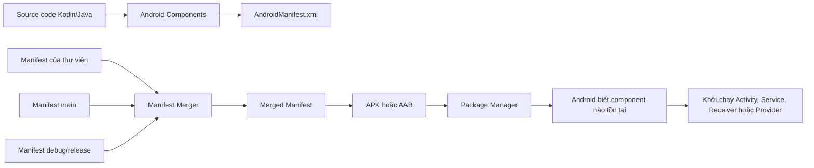
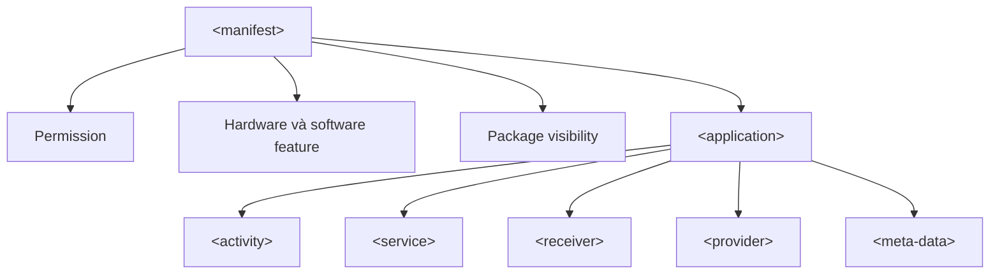
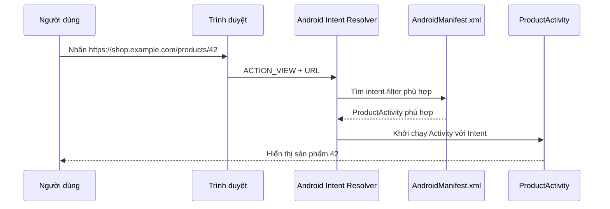
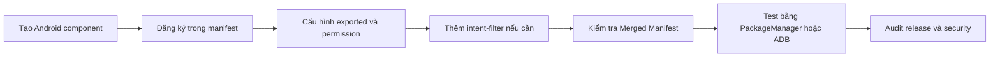

# 026 - App Manifest Registration

[](https://uniofgreenwich.github.io/ELEE1146-Lectures/content/AndroidStudioUserInterface/AndroidStudioUserInterface.html?utm_source=chatgpt.com)

**Học phần:** 02 - App Components and User Interface
**Module:** Module 03 - App Components
**Nhóm nội dung:** Other Components
**Nguồn roadmap:** App Components / Other Components
**Loại bài:** Lesson
**Thứ tự trong module:** 026
**Thời lượng gợi ý:** 24 phút

---

## 1. Tóm tắt

**App Manifest Registration** là việc khai báo các thành phần, quyền, khả năng và yêu cầu của ứng dụng trong tệp `AndroidManifest.xml`.

Manifest đóng vai trò như một **hợp đồng tĩnh** giữa ứng dụng với:

* Android build tools;
* hệ điều hành Android;
* Google Play;
* các ứng dụng khác muốn tương tác với ứng dụng.

Android cần đọc manifest để biết ứng dụng có những `Activity`, `Service`, `BroadcastReceiver` và `ContentProvider` nào trước khi hệ thống có thể khởi chạy chúng. Manifest cũng khai báo permission, phần cứng cần thiết, intent filter, deep link và mức độ cho phép ứng dụng khác truy cập từng component. ([Android Developers][1])

> **Ý tưởng cốt lõi:**
> Viết một class Kotlin chưa đủ để biến nó thành Android component. Component phải được Android biết đến thông qua manifest hoặc một cơ chế đăng ký runtime phù hợp.

---

## 2. Mục tiêu học tập

Sau bài học, anh có thể:

* Giải thích vai trò của `AndroidManifest.xml`.
* Phân biệt khai báo trong manifest và đăng ký bằng code khi runtime.
* Khai báo đúng `Activity`, `Service`, `BroadcastReceiver` và `ContentProvider`.
* Hiểu tác dụng của `android:name`, `android:exported`, `android:enabled` và `intent-filter`.
* Tránh lỗi cài đặt ứng dụng do thiếu `android:exported`.
* Kiểm tra **Merged Manifest** trước khi release.
* Xây dựng một artifact nhỏ để đưa vào portfolio.

---

## 3. App Manifest Registration là gì?

`AndroidManifest.xml` là tệp XML bắt buộc của một ứng dụng Android. Tệp này cung cấp thông tin thiết yếu cho hệ thống Android, công cụ build và Google Play. ([Android Developers][1])

Một manifest thường trả lời các câu hỏi:

| Câu hỏi                               | Thành phần manifest trả lời              |
| ------------------------------------- | ---------------------------------------- |
| Ứng dụng có những màn hình nào?       | `<activity>`                             |
| Ứng dụng có dịch vụ nền nào?          | `<service>`                              |
| Ứng dụng lắng nghe sự kiện nào?       | `<receiver>`                             |
| Ứng dụng cung cấp dữ liệu nào?        | `<provider>`                             |
| Ứng dụng cần quyền gì?                | `<uses-permission>`                      |
| Ứng dụng cần phần cứng nào?           | `<uses-feature>`                         |
| Ứng dụng nào được phép gọi component? | `android:exported`, `android:permission` |
| Component xử lý loại Intent nào?      | `<intent-filter>`                        |
| Ứng dụng cần tương tác với app nào?   | `<queries>`                              |
| Có cấu hình bổ sung nào không?        | `<meta-data>`                            |

### Ghi chú 5 dòng

1. Manifest là hồ sơ cấu hình của ứng dụng Android.
2. Android đọc manifest để khám phá các app component.
3. `Activity`, `Service` và `ContentProvider` phải được khai báo trong manifest.
4. `BroadcastReceiver` có thể được khai báo trong manifest hoặc đăng ký bằng code.
5. Khai báo sai manifest có thể làm app không cài được, không chạy đúng hoặc tạo lỗ hổng bảo mật.

---

## 4. Manifest nằm ở đâu?

Manifest chính của app module thường nằm tại:

```text
project-root/
└── app/
    └── src/
        └── main/
            └── AndroidManifest.xml
```

Một dự án có thể có nhiều manifest:

```text
app/src/main/AndroidManifest.xml
app/src/debug/AndroidManifest.xml
app/src/release/AndroidManifest.xml
app/src/demo/AndroidManifest.xml
library-module/src/main/AndroidManifest.xml
```

Gradle kết hợp manifest của:

1. thư viện;
2. source set chính;
3. product flavor;
4. build type;
5. build variant;

thành một **Merged Manifest** duy nhất được đóng gói trong APK hoặc Android App Bundle. Manifest của build variant có độ ưu tiên cao hơn manifest chính, còn manifest thư viện thường có độ ưu tiên thấp hơn. ([Android Developers][2])

### Ảnh minh họa quá trình merge manifest


*Nguồn ảnh: Android Developers – Manage manifest files.* 

---

## 5. Manifest hoạt động như thế nào?



Manifest là dữ liệu tĩnh. Android có thể đọc nó ngay cả khi process của ứng dụng chưa chạy.

Điều này đặc biệt quan trọng với:

* launcher activity;
* deep link;
* broadcast sau khi thiết bị khởi động;
* content provider;
* service được hệ thống hoặc ứng dụng khác gọi.

---

## 6. Cấu trúc cơ bản của `AndroidManifest.xml`

```xml
<?xml version="1.0" encoding="utf-8"?>

<manifest xmlns:android="http://schemas.android.com/apk/res/android"
    xmlns:tools="http://schemas.android.com/tools">

    <!-- Các quyền và yêu cầu của toàn bộ ứng dụng -->
    <uses-permission android:name="android.permission.INTERNET" />

    <uses-feature
        android:name="android.hardware.camera.any"
        android:required="false" />

    <application
        android:name=".ManifestDemoApplication"
        android:allowBackup="true"
        android:icon="@mipmap/ic_launcher"
        android:label="@string/app_name"
        android:theme="@style/Theme.ManifestDemo">

        <!-- Khai báo các app component tại đây -->

    </application>

</manifest>
```

### Hai tầng chính



Chỉ có một phần tử `<manifest>` và một phần tử `<application>` trong manifest cuối cùng. Các component được đặt bên trong `<application>`, còn permission và `uses-feature` thường nằm trực tiếp bên trong `<manifest>`. ([Android Developers][1])

---

## 7. Đăng ký các Android component

### 7.1. Activity

Mỗi `Activity` phải có một phần tử `<activity>` tương ứng trong manifest. Nếu Activity không được khai báo, Android không thể khởi chạy nó. ([Android Developers][3])

```xml
<activity
    android:name=".MainActivity"
    android:exported="true">

    <intent-filter>
        <action android:name="android.intent.action.MAIN" />
        <category android:name="android.intent.category.LAUNCHER" />
    </intent-filter>

</activity>
```

`MAIN` kết hợp với `LAUNCHER` biến Activity thành điểm vào từ màn hình launcher.

Một Activity nội bộ không cần ứng dụng khác khởi chạy nên đặt:

```xml
<activity
    android:name=".feature.settings.SettingsActivity"
    android:exported="false" />
```

> Trong ứng dụng Jetpack Compose theo kiến trúc single-activity, anh chỉ đăng ký Activity chứa Compose UI. Các composable như `HomeScreen`, `ProfileScreen` hoặc `SettingsScreen` không phải Android component và không cần khai báo riêng trong manifest. Android hiện khuyến nghị nhiều ứng dụng hiện đại sử dụng một Activity làm container cho các destination. ([Android Developers][4])

---

### 7.2. Service

Mọi subclass của `Service` phải được khai báo bằng `<service>`. Service không xuất hiện trong manifest sẽ không được hệ thống nhận biết và không thể chạy. ([Android Developers][5])

```xml
<service
    android:name=".sync.SyncService"
    android:enabled="true"
    android:exported="false" />
```

Nếu đây là foreground service, anh còn có thể phải khai báo loại foreground service và permission phù hợp:

```xml
<uses-permission android:name="android.permission.FOREGROUND_SERVICE" />
<uses-permission
    android:name="android.permission.FOREGROUND_SERVICE_DATA_SYNC" />

<application>
    <service
        android:name=".sync.DataSyncService"
        android:exported="false"
        android:foregroundServiceType="dataSync" />
</application>
```

Các ứng dụng target Android 14 trở lên phải khai báo loại foreground service phù hợp cho nhiều trường hợp sử dụng. Chỉ khai báo service trong manifest không có nghĩa Android cho phép nó chạy nền vô hạn; background execution và foreground service vẫn chịu các giới hạn riêng. ([Android Developers][6])

---

### 7.3. BroadcastReceiver

Một `BroadcastReceiver` có hai cách đăng ký:

1. khai báo tĩnh trong manifest;
2. đăng ký động bằng code.

Android mô tả rõ cả hai cơ chế này trong tài liệu `<receiver>`. ([Android Developers][7])

#### Đăng ký trong manifest

Ví dụ lắng nghe sự kiện thiết bị khởi động:

```xml
<uses-permission
    android:name="android.permission.RECEIVE_BOOT_COMPLETED" />

<application>

    <receiver
        android:name=".boot.BootReceiver"
        android:enabled="true"
        android:exported="false">

        <intent-filter>
            <action android:name="android.intent.action.BOOT_COMPLETED" />
        </intent-filter>

    </receiver>

</application>
```

```kotlin
package com.example.manifestdemo.boot

import android.content.BroadcastReceiver
import android.content.Context
import android.content.Intent
import android.util.Log

class BootReceiver : BroadcastReceiver() {

    override fun onReceive(context: Context, intent: Intent) {
        if (intent.action != Intent.ACTION_BOOT_COMPLETED) return

        Log.i("BootReceiver", "Thiết bị vừa khởi động")

        context
            .getSharedPreferences("app_state", Context.MODE_PRIVATE)
            .edit()
            .putLong("last_boot_received_at", System.currentTimeMillis())
            .apply()

        // Có thể khôi phục alarm, notification hoặc enqueue WorkManager tại đây.
        // Không thực hiện công việc dài trực tiếp trong onReceive().
    }
}
```

Quyền `RECEIVE_BOOT_COMPLETED` là cần thiết để nhận broadcast khởi động hoàn tất. Một receiver không cần tiếp nhận yêu cầu tùy ý từ app khác có thể đặt `android:exported="false"`. ([Android Developers][8])

#### Đăng ký receiver bằng code

Receiver động chỉ tồn tại trong khoảng thời gian code đã đăng ký nó:

```kotlin
class MainActivity : ComponentActivity() {

    private val airplaneModeReceiver = object : BroadcastReceiver() {
        override fun onReceive(context: Context, intent: Intent) {
            val enabled = intent.getBooleanExtra("state", false)
            Log.d("AirplaneMode", "Enabled = $enabled")
        }
    }

    override fun onStart() {
        super.onStart()

        val filter = IntentFilter(Intent.ACTION_AIRPLANE_MODE_CHANGED)

        ContextCompat.registerReceiver(
            this,
            airplaneModeReceiver,
            filter,
            ContextCompat.RECEIVER_NOT_EXPORTED
        )
    }

    override fun onStop() {
        unregisterReceiver(airplaneModeReceiver)
        super.onStop()
    }
}
```

Nhiều implicit broadcast bị giới hạn khi đăng ký trong manifest. Với sự kiện chỉ cần nhận khi UI đang hoạt động, context-registered receiver thường phù hợp hơn. Android cũng khuyến nghị giới hạn receiver bằng permission hoặc trạng thái exported thích hợp. ([Android Developers][9])

---

### 7.4. ContentProvider

`ContentProvider` phải được khai báo bằng `<provider>`. Nếu không có declaration này, hệ thống không biết provider tồn tại. ([Android Developers][10])

Ví dụ sử dụng `FileProvider` để chia sẻ file an toàn:

```xml
<provider
    android:name="androidx.core.content.FileProvider"
    android:authorities="${applicationId}.files"
    android:exported="false"
    android:grantUriPermissions="true">

    <meta-data
        android:name="android.support.FILE_PROVIDER_PATHS"
        android:resource="@xml/file_paths" />

</provider>
```

Tệp `res/xml/file_paths.xml`:

```xml
<?xml version="1.0" encoding="utf-8"?>

<paths xmlns:android="http://schemas.android.com/apk/res/android">
    <cache-path
        name="shared_cache"
        path="shared/" />
</paths>
```

`FileProvider` cần một entry trong manifest, một authority và một XML mô tả thư mục được phép chia sẻ. Khi chia sẻ dữ liệu giữa các ứng dụng, nên dùng URI `content://` và quyền truy cập tạm thời thay vì URI `file://`. ([Android Developers][11])

---

## 8. Những thuộc tính quan trọng

### `android:name`

Xác định class triển khai component:

```xml
<activity android:name=".MainActivity" />
```

Dấu chấm ở đầu là tên rút gọn. Nếu namespace của module là:

```kotlin
android {
    namespace = "com.example.manifestdemo"
}
```

thì:

```xml
android:name=".MainActivity"
```

được hiểu là:

```text
com.example.manifestdemo.MainActivity
```

Nếu component nằm trong package con:

```xml
<activity android:name=".feature.profile.ProfileActivity" />
```

Tên class rút gọn được ghép với namespace của module. ([Android Developers][1])

---

### `android:exported`

Cho biết component có thể được gọi từ bên ngoài ứng dụng hay không:

```xml
android:exported="true"
```

Component có thể được ứng dụng khác truy cập nếu các điều kiện permission và intent phù hợp được đáp ứng.

```xml
android:exported="false"
```

Component chủ yếu chỉ được sử dụng bên trong ứng dụng, bởi ứng dụng có cùng user ID hoặc bởi một số thành phần hệ thống đặc quyền. ([Android Developers][12])

#### Quy tắc thực tế

| Component                        | Giá trị thường dùng |
| -------------------------------- | ------------------: |
| Launcher Activity                |              `true` |
| App Link hoặc deep-link Activity |              `true` |
| Activity nội bộ                  |             `false` |
| Service nội bộ                   |             `false` |
| Receiver chỉ dùng nội bộ         |             `false` |
| FileProvider                     |             `false` |

Với ứng dụng target Android 12 trở lên, Activity, Service hoặc Receiver có `intent-filter` phải khai báo `android:exported` rõ ràng. Thiếu thuộc tính này có thể khiến ứng dụng không cài đặt được trên Android 12 trở lên. ([Android Developers][13])

---

### `android:enabled`

Cho biết component có đang được bật hay không:

```xml
<receiver
    android:name=".PromoReceiver"
    android:enabled="false"
    android:exported="false" />
```

Component có thể được khai báo nhưng tạm thời vô hiệu hóa. Ứng dụng cũng có thể thay đổi trạng thái component bằng `PackageManager`:

```kotlin
fun setPromoReceiverEnabled(context: Context, enabled: Boolean) {
    val component = ComponentName(context, PromoReceiver::class.java)

    val newState = if (enabled) {
        PackageManager.COMPONENT_ENABLED_STATE_ENABLED
    } else {
        PackageManager.COMPONENT_ENABLED_STATE_DISABLED
    }

    context.packageManager.setComponentEnabledSetting(
        component,
        newState,
        PackageManager.DONT_KILL_APP
    )
}
```

Một use case là bật hoặc tắt launcher alias, receiver hoặc feature theo cấu hình.

---

### `android:permission`

Giới hạn ai được gọi component:

```xml
<service
    android:name=".admin.AdminService"
    android:exported="true"
    android:permission="com.example.permission.ACCESS_ADMIN_SERVICE" />
```

Cần phân biệt:

```xml
<uses-permission android:name="..." />
```

Ứng dụng đang **yêu cầu sử dụng** một quyền.

```xml
android:permission="..."
```

Caller phải có quyền đó mới được **truy cập component**.

---

## 9. Intent Filter trong manifest

`intent-filter` mô tả loại Intent mà component có khả năng xử lý. Hệ thống dựa vào các filter để tìm component phù hợp cho implicit intent. Một component có thể có nhiều intent filter. ([Android Developers][1])

### Cấu trúc

```xml
<intent-filter>
    <action android:name="..." />
    <category android:name="..." />
    <data
        android:scheme="..."
        android:host="..." />
</intent-filter>
```

### Ví dụ deep link

```xml
<activity
    android:name=".feature.product.ProductActivity"
    android:exported="true">

    <intent-filter android:autoVerify="true">
        <action android:name="android.intent.action.VIEW" />

        <category android:name="android.intent.category.DEFAULT" />
        <category android:name="android.intent.category.BROWSABLE" />

        <data
            android:scheme="https"
            android:host="shop.example.com"
            android:pathPrefix="/products" />
    </intent-filter>

</activity>
```

Luồng xử lý:



Một Activity không có intent filter vẫn có thể được gọi bằng explicit intent:

```kotlin
val intent = Intent(this, SettingsActivity::class.java)
startActivity(intent)
```

Nếu Activity có intent filter, các ứng dụng khác có thể khám phá hoặc gọi nó tùy thuộc vào `android:exported`, permission và quy tắc intent resolution. ([Android Developers][14])

---

## 10. Manifest registration và runtime registration

| Tiêu chí              | Manifest registration                                 | Runtime registration                 |
| --------------------- | ----------------------------------------------------- | ------------------------------------ |
| Thời điểm có hiệu lực | Sau khi cài app                                       | Sau khi code đăng ký chạy            |
| Process app chưa chạy | Hệ thống vẫn biết component                           | Chưa tồn tại                         |
| Cấu hình              | XML                                                   | Kotlin/Java                          |
| Phù hợp với           | Launcher, deep link, provider, service, boot receiver | Receiver gắn với lifecycle           |
| Kiểm soát vòng đời    | Tĩnh                                                  | Có thể đăng ký và hủy đăng ký        |
| Nguy cơ               | Export nhầm, merge conflict                           | Quên unregister, leak, sai lifecycle |

### Quy tắc ghi nhớ

```text
Activity         → khai báo manifest
Service          → khai báo manifest
ContentProvider  → khai báo manifest
BroadcastReceiver→ manifest hoặc runtime
Composable       → không khai báo manifest
Fragment         → không khai báo manifest
ViewModel        → không khai báo manifest
Repository       → không khai báo manifest
```

---

## 11. Ví dụ hoàn chỉnh

### `AndroidManifest.xml`

```xml
<?xml version="1.0" encoding="utf-8"?>

<manifest xmlns:android="http://schemas.android.com/apk/res/android"
    xmlns:tools="http://schemas.android.com/tools">

    <!-- Quyền truy cập mạng -->
    <uses-permission android:name="android.permission.INTERNET" />

    <!-- Quyền nhận sự kiện boot -->
    <uses-permission
        android:name="android.permission.RECEIVE_BOOT_COMPLETED" />

    <!-- App dùng camera nhưng vẫn hoạt động nếu thiết bị không có camera -->
    <uses-feature
        android:name="android.hardware.camera.any"
        android:required="false" />

    <application
        android:name=".ManifestDemoApplication"
        android:allowBackup="true"
        android:icon="@mipmap/ic_launcher"
        android:label="@string/app_name"
        android:roundIcon="@mipmap/ic_launcher_round"
        android:supportsRtl="true"
        android:theme="@style/Theme.ManifestDemo"
        tools:targetApi="36">

        <!-- Màn hình nội bộ -->
        <activity
            android:name=".feature.settings.SettingsActivity"
            android:exported="false" />

        <!-- Điểm vào của ứng dụng -->
        <activity
            android:name=".MainActivity"
            android:exported="true">

            <intent-filter>
                <action android:name="android.intent.action.MAIN" />
                <category android:name="android.intent.category.LAUNCHER" />
            </intent-filter>

        </activity>

        <!-- Service nội bộ -->
        <service
            android:name=".sync.SyncService"
            android:enabled="true"
            android:exported="false" />

        <!-- Nhận sự kiện thiết bị khởi động -->
        <receiver
            android:name=".boot.BootReceiver"
            android:enabled="true"
            android:exported="false">

            <intent-filter>
                <action android:name="android.intent.action.BOOT_COMPLETED" />
            </intent-filter>

        </receiver>

        <!-- Chia sẻ file bằng content URI -->
        <provider
            android:name="androidx.core.content.FileProvider"
            android:authorities="${applicationId}.files"
            android:exported="false"
            android:grantUriPermissions="true">

            <meta-data
                android:name="android.support.FILE_PROVIDER_PATHS"
                android:resource="@xml/file_paths" />

        </provider>

    </application>

</manifest>
```

---

## 12. Ảnh hưởng đến lifecycle và state

Manifest không trực tiếp lưu UI state, nhưng nó quyết định **component nào được Android tạo ra** và component đó có thể được tạo trong hoàn cảnh nào.

### Activity

Activity được khai báo trong manifest vẫn phải xử lý:

* configuration change;
* process recreation;
* saved instance state;
* navigation back stack;
* deep link mở app từ trạng thái cold start.

### Receiver

Manifest receiver có thể được gọi khi:

* UI không tồn tại;
* Activity chưa được tạo;
* process ứng dụng vừa được hệ thống khởi động.

Vì vậy không được giả định rằng:

```kotlin
MainActivity.instance
```

hoặc một singleton trong RAM luôn tồn tại.

### Service

Service có lifecycle độc lập với Activity. Việc Activity bị `onStop()` hoặc `onDestroy()` không đồng nghĩa service chắc chắn dừng lại.

### Provider

ContentProvider có thể được tạo rất sớm khi process ứng dụng khởi động. Không nên thực hiện quá nhiều công việc nặng trong quá trình khởi tạo provider, vì điều này có thể ảnh hưởng đến startup. Android cung cấp App Startup để tổ chức việc khởi tạo dependency theo thứ tự rõ ràng và tránh sử dụng quá nhiều provider chỉ để chạy initializer. ([Android Developers][15])

---

## 13. Lỗi junior thường gặp

### Lỗi 1: Viết Activity nhưng quên đăng ký

```kotlin
class DetailActivity : AppCompatActivity()
```

Nhưng không có:

```xml
<activity android:name=".DetailActivity" />
```

Khi chạy:

```kotlin
startActivity(Intent(this, DetailActivity::class.java))
```

ứng dụng có thể gặp lỗi:

```text
ActivityNotFoundException
```

---

### Lỗi 2: Quên `android:exported`

```xml
<activity android:name=".MainActivity">
    <intent-filter>
        <action android:name="android.intent.action.MAIN" />
        <category android:name="android.intent.category.LAUNCHER" />
    </intent-filter>
</activity>
```

Với ứng dụng target Android 12 trở lên, component có intent filter phải khai báo rõ `android:exported`. Nếu thiếu, quá trình build hoặc cài đặt có thể thất bại. ([Android Developers][13])

Cách sửa:

```xml
<activity
    android:name=".MainActivity"
    android:exported="true">
```

---

### Lỗi 3: Đặt tất cả component thành exported

```xml
<service
    android:name=".InternalPaymentService"
    android:exported="true" />
```

Nếu service chỉ dùng nội bộ, cấu hình này mở thêm bề mặt tấn công không cần thiết. `android:exported` quyết định ứng dụng khác có thể khởi chạy component hay không. ([Android Developers][12])

Cách an toàn hơn:

```xml
<service
    android:name=".InternalPaymentService"
    android:exported="false" />
```

> Nguyên tắc: **mặc định đóng, chỉ mở khi có use case rõ ràng**.

---

### Lỗi 4: Chỉ nhìn manifest chính

Một dependency có thể tự thêm:

* permission;
* provider;
* service;
* receiver;
* metadata.

Do đó, file `src/main/AndroidManifest.xml` chưa chắc phản ánh cấu hình cuối cùng. Luôn kiểm tra tab **Merged Manifest** trong Android Studio. ([Android Developers][2])

---

### Lỗi 5: Hardcode authority

Không nên:

```xml
android:authorities="com.example.manifestdemo.files"
```

Nếu có nhiều build variant như:

```text
com.example.manifestdemo
com.example.manifestdemo.debug
com.example.manifestdemo.staging
```

authority có thể bị trùng.

Nên dùng:

```xml
android:authorities="${applicationId}.files"
```

---

### Lỗi 6: Cho rằng permission trong manifest là đủ

```xml
<uses-permission android:name="android.permission.CAMERA" />
```

Với runtime permission, declaration trong manifest chỉ là bước đầu. Ứng dụng vẫn phải yêu cầu người dùng cấp quyền trong runtime trước khi truy cập tài nguyên được bảo vệ. Android yêu cầu các permission cần thiết phải được khai báo trong manifest, trong khi một số permission còn phải được người dùng chấp thuận khi ứng dụng chạy. ([Android Developers][1])

---

### Lỗi 7: Làm công việc dài trong receiver

```kotlin
override fun onReceive(context: Context, intent: Intent) {
    downloadLargeFile()
}
```

`onReceive()` không phải nơi phù hợp cho network request hoặc xử lý kéo dài. Receiver nên xác nhận sự kiện nhanh, cập nhật trạng thái ngắn hoặc chuyển việc trì hoãn sang WorkManager hay cơ chế background work phù hợp.

---

## 14. Debugging manifest

### 14.1. Xem Merged Manifest

Trong Android Studio:

```text
app
└── manifests
    └── AndroidManifest.xml
```

Mở file rồi chọn tab:

```text
Merged Manifest
```

Anh có thể kiểm tra:

* component đến từ file nào;
* permission nào do thư viện thêm;
* merge conflict;
* giá trị cuối cùng của `exported`;
* authority cuối cùng;
* intent filter cuối cùng.

Android Developers khuyến nghị sử dụng Merged Manifest view để xem trước kết quả và tìm lỗi merge. ([Android Developers][2])

---

### 14.2. Build manifest

```bash
./gradlew :app:processDebugMainManifest
```

Build toàn bộ debug variant:

```bash
./gradlew :app:assembleDebug
```

---

### 14.3. Kiểm tra package đã cài

```bash
adb shell dumpsys package com.example.manifestdemo
```

Lệnh này giúp kiểm tra thông tin như:

* activities;
* receivers;
* services;
* providers;
* requested permissions;
* granted permissions.

---

### 14.4. Kiểm tra launcher Activity

```bash
adb shell am start \
  -n com.example.manifestdemo/.MainActivity
```

Kết quả mong đợi:

```text
Starting: Intent {
    cmp=com.example.manifestdemo/.MainActivity
}
```

---

### 14.5. Kiểm tra sau khi reboot

Với `BOOT_COMPLETED` receiver:

1. Cài ứng dụng trên emulator.
2. Mở ứng dụng ít nhất một lần.
3. Khởi động lại emulator.
4. Kiểm tra Logcat:

```text
tag:BootReceiver
```

Lưu ý rằng chế độ hạn chế sử dụng pin có thể ảnh hưởng đến thời điểm hệ thống phân phối một số boot broadcast. ([Android Developers][16])

---

## 15. Testing strategy

### Test 1: Launcher Activity tồn tại

```kotlin
@RunWith(AndroidJUnit4::class)
class ManifestRegistrationTest {

    private val context = ApplicationProvider.getApplicationContext<Context>()

    @Test
    fun mainActivity_isRegistered() {
        val component = ComponentName(context, MainActivity::class.java)

        val activityInfo = context.packageManager.getActivityInfo(
            component,
            PackageManager.ComponentInfoFlags.of(0)
        )

        assertEquals(MainActivity::class.java.name, activityInfo.name)
        assertTrue(activityInfo.exported)
    }
}
```

### Test 2: Activity nội bộ không exported

```kotlin
@Test
fun settingsActivity_isNotExported() {
    val component = ComponentName(context, SettingsActivity::class.java)

    val activityInfo = context.packageManager.getActivityInfo(
        component,
        PackageManager.ComponentInfoFlags.of(0)
    )

    assertFalse(activityInfo.exported)
}
```

### Test 3: Service đã được đăng ký

```kotlin
@Test
fun syncService_isRegisteredAndPrivate() {
    val component = ComponentName(context, SyncService::class.java)

    val serviceInfo = context.packageManager.getServiceInfo(
        component,
        PackageManager.ComponentInfoFlags.of(0)
    )

    assertTrue(serviceInfo.enabled)
    assertFalse(serviceInfo.exported)
}
```

### Test 4: Build release variant

```bash
./gradlew clean
./gradlew lintRelease
./gradlew testReleaseUnitTest
./gradlew assembleRelease
```

Manifest release có thể khác debug manifest, vì vậy không nên chỉ test debug variant.

---

## 16. Ảnh hưởng đến UX, reliability và maintainability

### UX

Manifest sai có thể khiến:

* icon ứng dụng không xuất hiện trên launcher;
* deep link không mở đúng màn hình;
* camera hoặc thiết bị phù hợp không tìm thấy app trên Google Play;
* share sheet không hiển thị ứng dụng;
* notification hoặc task không được khôi phục sau khi reboot.

### Reliability

Khai báo đúng giúp:

* Android tìm đúng component;
* intent được route chính xác;
* receiver hoạt động khi app chưa mở;
* provider có authority ổn định;
* service có cấu hình runtime phù hợp.

### Maintainability

Một manifest được tổ chức tốt giúp đội phát triển:

* dễ audit component public;
* giảm cấu hình trùng lặp;
* nhận biết permission do dependency thêm;
* quản lý build flavor;
* review rủi ro trước release.

### Security

Rủi ro lớn nhất thường nằm ở:

* component exported không cần thiết;
* provider public;
* service không được bảo vệ bằng permission;
* deep link không validate dữ liệu đầu vào;
* receiver chấp nhận broadcast tùy ý;
* authority bị trùng.

---

## 17. Checklist production

### Component

* [ ] Mỗi Activity đều được khai báo.
* [ ] Mỗi Service đều được khai báo.
* [ ] Mỗi ContentProvider đều được khai báo.
* [ ] Receiver dùng đúng manifest registration hoặc runtime registration.
* [ ] Không khai báo các class thuần Kotlin không phải Android component.

### Exported và security

* [ ] Mỗi component có intent filter đều có `android:exported`.
* [ ] Launcher Activity đặt `android:exported="true"`.
* [ ] Component nội bộ đặt `android:exported="false"`.
* [ ] Component public có permission hoặc validate input phù hợp.
* [ ] Provider không public nếu không thực sự cần.
* [ ] FileProvider dùng `grantUriPermissions="true"` và exported false.

### Permission

* [ ] Chỉ yêu cầu permission thực sự cần thiết.
* [ ] Runtime permission có luồng từ chối và thử lại.
* [ ] Permission không còn dùng đã được xóa.
* [ ] Permission do dependency thêm đã được audit.

### Intent filter

* [ ] Action đúng.
* [ ] Có `CATEGORY_DEFAULT` khi cần nhận implicit Activity intent.
* [ ] Deep link có scheme, host và path đúng.
* [ ] Deep-link Activity validate URL và dữ liệu truyền vào.
* [ ] Custom action sử dụng namespace của ứng dụng.

### Build và release

* [ ] Đã kiểm tra **Merged Manifest**.
* [ ] Đã test debug manifest.
* [ ] Đã test release manifest.
* [ ] Không để debug Activity hoặc test receiver trong release.
* [ ] Không có authority trùng giữa các build variant.
* [ ] `applicationId`, icon, label và theme đúng môi trường.
* [ ] Google Play device filtering đúng với `uses-feature`.

---

## 18. Artifact portfolio gợi ý

Tạo một thư mục:

```text
manifest-registration-demo/
├── README.md
├── app/
│   └── src/main/
│       ├── AndroidManifest.xml
│       └── java/com/example/manifestdemo/
│           ├── MainActivity.kt
│           ├── boot/BootReceiver.kt
│           └── sync/SyncService.kt
├── docs/
│   ├── manifest-flow.md
│   ├── merged-manifest.png
│   └── security-audit.md
└── tests/
    └── ManifestRegistrationTest.kt
```

### Nội dung README

```markdown
# Android Manifest Registration Demo

## Mục tiêu

Demo cách đăng ký Activity, Service, BroadcastReceiver và FileProvider.

## Thành phần

- MainActivity: launcher, exported.
- SettingsActivity: internal, not exported.
- BootReceiver: nhận BOOT_COMPLETED.
- SyncService: service nội bộ.
- FileProvider: chia sẻ file bằng content URI.

## Kiểm thử

- Kiểm tra component bằng PackageManager.
- Kiểm tra Merged Manifest.
- Kiểm tra launcher bằng adb.
- Kiểm tra receiver sau khi reboot emulator.

## Security decisions

- Chỉ launcher Activity được exported.
- Service, receiver và provider đều private.
- Authority sử dụng `${applicationId}`.
```

Artifact này thể hiện được:

* kiến thức Android component;
* XML manifest;
* intent routing;
* bảo mật component;
* debugging bằng ADB;
* release checklist;
* automated testing.

---

## 19. Bài thực hành 24 phút

### Phần 1 — Đọc manifest: 4 phút

Mở `AndroidManifest.xml` và xác định:

* launcher Activity;
* permission;
* application theme;
* component nào exported.

### Phần 2 — Thêm Activity nội bộ: 5 phút

Tạo:

```kotlin
class SettingsActivity : AppCompatActivity()
```

Đăng ký:

```xml
<activity
    android:name=".SettingsActivity"
    android:exported="false" />
```

### Phần 3 — Thêm receiver: 7 phút

Tạo `BootReceiver`, đăng ký `BOOT_COMPLETED` và thêm permission.

### Phần 4 — Kiểm tra Merged Manifest: 4 phút

Chụp ảnh tab Merged Manifest và ghi lại:

* component nguồn từ app;
* component nguồn từ dependency;
* permission cuối cùng.

### Phần 5 — Viết security note: 4 phút

Trả lời:

```text
Component nào được exported?
Tại sao nó cần được exported?
Dữ liệu đầu vào được validate ở đâu?
Điều gì xảy ra nếu component bị ứng dụng khác gọi?
```

---

## 20. Bài tập

Xây dựng một ứng dụng nhỏ có:

1. một launcher Activity;
2. một Activity nội bộ;
3. một `BroadcastReceiver`;
4. một `FileProvider`;
5. ít nhất một permission;
6. một optional hardware feature;
7. một test kiểm tra trạng thái exported.

### Yêu cầu báo cáo

```markdown
## App Manifest Registration

### Component đã đăng ký

| Component | Manifest element | Exported | Lý do |
|---|---|---:|---|
| MainActivity | activity | true | Launcher |
| SettingsActivity | activity | false | Chỉ dùng nội bộ |
| BootReceiver | receiver | false | Nhận system broadcast |
| FileProvider | provider | false | Chia sẻ file có kiểm soát |

### Rủi ro

- Export nhầm component.
- Trùng authority.
- Thiếu runtime permission.
- Manifest dependency thêm permission ngoài ý muốn.

### Cách kiểm thử

- Merged Manifest.
- PackageManager test.
- ADB launch.
- Reboot emulator.
```

---

## 21. Câu hỏi tự kiểm tra

1. Tại sao Android cần manifest trước khi process ứng dụng chạy?
2. Activity không có intent filter có cần đăng ký không?
3. Component nào có thể đăng ký động bằng code?
4. `android:exported="true"` có ý nghĩa gì?
5. Vì sao launcher Activity thường phải exported?
6. Permission trên component khác gì `<uses-permission>`?
7. Merged Manifest có thể khác manifest chính như thế nào?
8. Tại sao nên dùng `${applicationId}` trong provider authority?
9. Composable có cần khai báo trong manifest không?
10. Vì sao phải kiểm tra cả release manifest?

---

## 22. Kết luận

**App Manifest Registration** là bước làm cho Android nhận biết cấu trúc và khả năng của ứng dụng.

Luồng tư duy đúng là:



Một Android developer tốt không chỉ biết thêm `<activity>` hoặc `<service>`, mà còn phải giải thích được:

* ai có thể gọi component;
* component được tạo trong trạng thái nào;
* dữ liệu đầu vào có đáng tin không;
* dependency đã thêm gì vào manifest;
* cấu hình có thay đổi giữa debug và release không;
* lỗi manifest ảnh hưởng thế nào đến UX và bảo mật.

### Checklist hoàn thành

* [ ] Có định nghĩa ngắn gọn.
* [ ] Hiểu cấu trúc `AndroidManifest.xml`.
* [ ] Biết đăng ký bốn app component chính.
* [ ] Phân biệt manifest registration và runtime registration.
* [ ] Hiểu `android:exported`.
* [ ] Có ví dụ code Kotlin và XML.
* [ ] Có sơ đồ luồng hoạt động.
* [ ] Biết kiểm tra Merged Manifest.
* [ ] Có test hoặc lệnh ADB.
* [ ] Có artifact nhỏ để đưa vào portfolio.

[1]: https://developer.android.com/guide/topics/manifest/manifest-intro "App manifest overview  |  App architecture  |  Android Developers"
[2]: https://developer.android.com/build/manage-manifests "Manage manifest files  |  Android Studio  |  Android Developers"
[3]: https://developer.android.com/guide/topics/manifest/activity-element?utm_source=chatgpt.com "<activity> | App architecture"
[4]: https://developer.android.com/topic/architecture?utm_source=chatgpt.com "Guide to app architecture"
[5]: https://developer.android.com/develop/background-work/services?utm_source=chatgpt.com "Services overview | Background work | Android Developers"
[6]: https://developer.android.com/about/versions/14/changes/fgs-types-required?utm_source=chatgpt.com "Foreground service types are required"
[7]: https://developer.android.com/guide/topics/manifest/receiver-element?utm_source=chatgpt.com "<receiver> | App architecture"
[8]: https://developer.android.com/training/tv/discovery/recommendations-row?hl=en&utm_source=chatgpt.com "Recommendations in Android N and earlier  |  Android TV  |  Android Developers"
[9]: https://developer.android.com/develop/background-work/background-tasks/broadcasts?utm_source=chatgpt.com "Broadcasts overview | Background work"
[10]: https://developer.android.com/guide/topics/manifest/provider-element?utm_source=chatgpt.com "<provider> | App architecture"
[11]: https://developer.android.com/training/secure-file-sharing/setup-sharing?utm_source=chatgpt.com "Setting up file sharing | App data and files"
[12]: https://developer.android.com/privacy-and-security/risks/android-exported?utm_source=chatgpt.com "android:exported | Security"
[13]: https://developer.android.com/about/versions/12/behavior-changes-12?utm_source=chatgpt.com "Behavior changes: Apps targeting Android 12"
[14]: https://developer.android.com/guide/components/intents-filters?utm_source=chatgpt.com "Intents and intent filters | App architecture"
[15]: https://developer.android.com/topic/libraries/app-startup?utm_source=chatgpt.com "App Startup | App architecture"
[16]: https://developer.android.com/about/versions/13/behavior-changes-13?utm_source=chatgpt.com "Behavior changes: Apps targeting Android 13 or higher"

---

# Bài luyện tập

## Mục tiêu


## Đề bài


## Yêu cầu hoàn thành

- [ ] 
- [ ] 
- [ ] 

## Kết quả / lời giải


## Ghi chú
