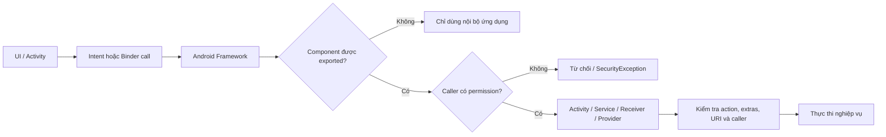
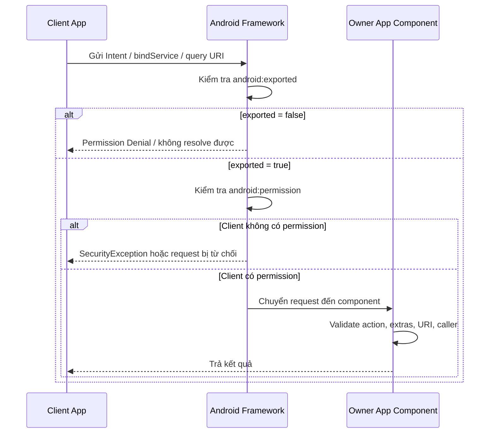
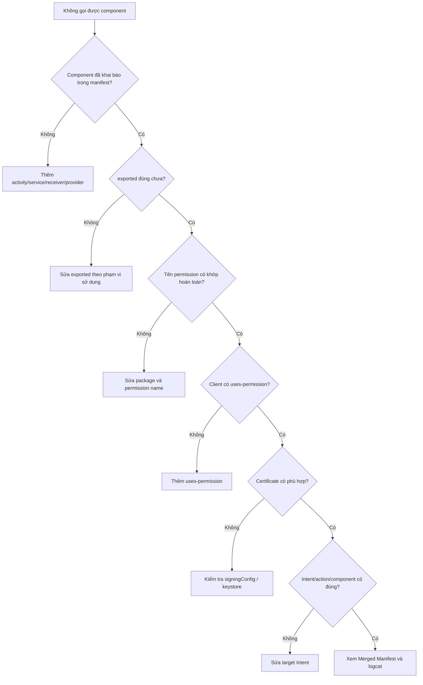

# 027 - Component Permissions

**Học phần:** 02 - App Components and User Interface
**Module:** Module 03 - App Components
**Nhóm nội dung:** Other Components
**Nguồn roadmap:** App Components / Other Components
**Loại bài:** Lesson
**Thứ tự trong module:** 027
**Thời lượng gợi ý:** 24 phút

---

## 1. Tóm tắt

**Component Permissions** là cơ chế kiểm soát ứng dụng hoặc tiến trình nào được phép gọi một Android component, chẳng hạn:

* `Activity`
* `Service`
* `BroadcastReceiver`
* `ContentProvider`

Quyền có thể được khai báo trực tiếp trên component bằng thuộc tính như `android:permission`, `android:readPermission` hoặc `android:writePermission`.

Hai thuộc tính thường phải được xem xét cùng nhau là:

* `android:exported`: component có thể được ứng dụng khác tiếp cận hay không.
* `android:permission`: bên gọi cần sở hữu quyền nào trước khi Android chuyển yêu cầu đến component.

Một component được export nhưng không được bảo vệ phù hợp có thể bị ứng dụng khác khởi chạy, gửi dữ liệu giả, gọi tác vụ nhạy cảm hoặc truy cập dữ liệu ngoài ý muốn. Android khuyến nghị khai báo rõ `android:exported` cho component thay vì phụ thuộc vào giá trị mặc định.

---

## 2. Mục tiêu học tập

Sau bài học, anh có thể:

* Giải thích Component Permissions bằng ngôn ngữ của mình.
* Phân biệt `<permission>`, `<uses-permission>` và `android:permission`.
* Phân biệt vai trò của `android:exported` và permission.
* Bảo vệ `Activity`, `Service`, `BroadcastReceiver` và `ContentProvider`.
* Tạo custom permission với mức bảo vệ `signature`.
* Kiểm tra trường hợp được phép và bị từ chối.
* Nhận biết các rủi ro về bảo mật, UX, maintainability và release.
* Hoàn thiện một artifact nhỏ để đưa vào portfolio.

---

## 3. Component Permissions nằm ở đâu trong ứng dụng?

Component Permissions thuộc lớp **bảo mật giao tiếp giữa các component và giữa các ứng dụng**.



Permission không thay thế việc kiểm tra dữ liệu đầu vào. Ngay cả khi caller có quyền hợp lệ, component vẫn cần kiểm tra `Intent`, `extras`, URI, action và dữ liệu nghiệp vụ trước khi xử lý. Hướng dẫn bảo mật Android cũng khuyến nghị bảo vệ các exported component và xác thực mọi dữ liệu đi vào component.

---

## 4. Hình minh họa

Hình dưới đây trình bày luồng permission tổng quát của Android: đánh giá nhu cầu, khai báo permission, kiểm tra trạng thái và chỉ thực hiện hành động khi quyền phù hợp.


> **Nguồn hình:** Android Developers – Permissions on Android. Hình này mô tả permission ở cấp ứng dụng; với Component Permissions, Android bổ sung bước kiểm tra khả năng export và quyền của caller trước khi chuyển lời gọi đến component.

---

## 5. Ba khái niệm dễ nhầm lẫn

### 5.1. `<permission>` — định nghĩa một quyền mới

Ứng dụng sở hữu component sử dụng `<permission>` để tạo một custom permission.

```xml
<permission
    android:name="com.example.secureapp.permission.OPEN_REPORT"
    android:protectionLevel="signature" />
```

Tên custom permission nên có tiền tố là package của ứng dụng, theo dạng reverse domain, nhằm tránh trùng tên và làm rõ ứng dụng nào sở hữu permission.

---

### 5.2. `<uses-permission>` — yêu cầu sử dụng một quyền

Ứng dụng muốn gọi component được bảo vệ phải khai báo:

```xml
<uses-permission
    android:name="com.example.secureapp.permission.OPEN_REPORT" />
```

`<uses-permission>` không tạo ra quyền mới. Nó chỉ cho biết ứng dụng hiện tại muốn sử dụng một permission đã được Android hoặc ứng dụng khác định nghĩa.

---

### 5.3. `android:permission` — gắn hàng rào vào component

Ứng dụng sở hữu component gắn permission vào component:

```xml
<activity
    android:name=".SecureReportActivity"
    android:exported="true"
    android:permission="com.example.secureapp.permission.OPEN_REPORT" />
```

Khi một ứng dụng khác gọi `SecureReportActivity`, Android kiểm tra caller có permission `OPEN_REPORT` hay không trước khi chuyển `Intent` đến activity. Nếu caller không có quyền, activity không được kích hoạt.

---

## 6. Luồng cấp và kiểm tra Component Permission



---

## 7. `android:exported` và `android:permission`

Hai thuộc tính này giải quyết hai câu hỏi khác nhau.

| Thuộc tính                 | Câu hỏi cần trả lời                             | Ý nghĩa                         |
| -------------------------- | ----------------------------------------------- | ------------------------------- |
| `android:exported`         | Ứng dụng khác có được tiếp cận component không? | Kiểm soát phạm vi tiếp cận      |
| `android:permission`       | Caller cần sở hữu quyền nào?                    | Kiểm soát caller được ủy quyền  |
| Kiểm tra input             | Caller được phép gửi dữ liệu gì?                | Kiểm soát dữ liệu và hành vi    |
| Kiểm tra caller trong code | Caller cụ thể có đáng tin không?                | Bảo vệ bổ sung cho IPC nhạy cảm |

### Trường hợp 1: Component chỉ sử dụng nội bộ

```xml
<service
    android:name=".InternalSyncService"
    android:exported="false" />
```

Đây thường là lựa chọn an toàn nhất khi ứng dụng khác không cần sử dụng service.

### Trường hợp 2: Component được công khai cho mọi ứng dụng

```xml
<activity
    android:name=".PublicHelpActivity"
    android:exported="true" />
```

Component này không có permission bảo vệ. Bất kỳ ứng dụng nào có thể tạo explicit intent phù hợp đều có khả năng gọi nó. Do đó activity chỉ nên cung cấp chức năng công khai, không nhạy cảm.

### Trường hợp 3: Component chỉ dành cho nhóm ứng dụng cùng nhà phát triển

```xml
<activity
    android:name=".PartnerActivity"
    android:exported="true"
    android:permission="com.example.permission.PARTNER_ACCESS" />
```

Custom permission nên sử dụng `protectionLevel="signature"` khi chỉ các ứng dụng được ký bằng cùng certificate mới được phép giao tiếp. Signature permission được Android cấp cho ứng dụng có certificate phù hợp mà không cần hiển thị runtime permission dialog.

> Từ Android 12, activity, service hoặc receiver có `intent-filter` phải khai báo rõ `android:exported`; thiếu thuộc tính này có thể khiến ứng dụng không cài đặt được khi target Android 12 trở lên.

---

## 8. Component Permission theo từng loại component

### 8.1. Activity

```xml
<activity
    android:name=".SecureReportActivity"
    android:exported="true"
    android:permission="com.example.secureapp.permission.OPEN_REPORT">
    <intent-filter>
        <action android:name="com.example.secureapp.action.OPEN_REPORT" />
        <category android:name="android.intent.category.DEFAULT" />
    </intent-filter>
</activity>
```

Caller cần permission để:

* Gọi `startActivity()`.
* Gọi `startActivityForResult()`.
* Gửi intent đến activity.

Nếu caller không có permission, intent không được chuyển đến activity.

---

### 8.2. Service

```xml
<service
    android:name=".SecureExportService"
    android:exported="true"
    android:permission="com.example.secureapp.permission.EXPORT_DATA" />
```

Permission có thể bảo vệ các thao tác:

* `startService()`
* `stopService()`
* `bindService()`

Caller không có permission sẽ không thể khởi chạy hoặc bind đến service.

Đối với bound service thực hiện IPC nhạy cảm, permission ở manifest là lớp bảo vệ đầu tiên. Những method trên `Binder` vẫn nên kiểm tra caller tại mỗi transaction quan trọng, đặc biệt khi service phục vụ các partner app.

---

### 8.3. BroadcastReceiver

```xml
<receiver
    android:name=".RefreshReportReceiver"
    android:exported="true"
    android:permission="com.example.secureapp.permission.SEND_REFRESH">
    <intent-filter>
        <action android:name="com.example.secureapp.action.REFRESH_REPORT" />
    </intent-filter>
</receiver>
```

Trong trường hợp này, ứng dụng gửi broadcast phải sở hữu permission `SEND_REFRESH`. Nếu không khai báo permission trên receiver hoặc `<application>`, receiver không được bảo vệ bằng permission.

Với receiver chỉ dùng nội bộ, nên ưu tiên:

```xml
<receiver
    android:name=".InternalReceiver"
    android:exported="false" />
```

Đối với receiver đăng ký động, có thể sử dụng `RECEIVER_NOT_EXPORTED` khi không cần nhận broadcast từ ứng dụng bên ngoài. Android cũng khuyến nghị bảo vệ custom broadcast bằng signature permission hoặc receiver không export.

---

### 8.4. ContentProvider

`ContentProvider` hỗ trợ kiểm soát quyền đọc và ghi riêng biệt.

```xml
<provider
    android:name=".ReportProvider"
    android:authorities="com.example.secureapp.reports"
    android:exported="true"
    android:readPermission="com.example.secureapp.permission.READ_REPORTS"
    android:writePermission="com.example.secureapp.permission.WRITE_REPORTS"
    android:grantUriPermissions="false" />
```

| Thuộc tính                    | Chức năng                                       |
| ----------------------------- | ----------------------------------------------- |
| `android:permission`          | Một permission chung cho cả đọc và ghi          |
| `android:readPermission`      | Permission cần có để query dữ liệu              |
| `android:writePermission`     | Permission cần có để insert, update hoặc delete |
| `android:grantUriPermissions` | Cho phép cấp quyền URI tạm thời                 |
| `<path-permission>`           | Đặt permission riêng cho một đường dẫn URI      |

`readPermission` và `writePermission` có độ ưu tiên cao hơn permission chung trên provider.

#### Permission theo đường dẫn

```xml
<provider
    android:name=".ReportProvider"
    android:authorities="com.example.secureapp.reports"
    android:exported="true">

    <path-permission
        android:pathPrefix="/public"
        android:readPermission="com.example.secureapp.permission.READ_PUBLIC_REPORTS" />

    <path-permission
        android:pathPrefix="/private"
        android:readPermission="com.example.secureapp.permission.READ_PRIVATE_REPORTS"
        android:writePermission="com.example.secureapp.permission.WRITE_PRIVATE_REPORTS" />
</provider>
```

`<path-permission>` cho phép bảo vệ từng tập con dữ liệu trong provider thay vì áp dụng một permission duy nhất cho toàn bộ authority.

---

## 9. Các protection level quan trọng

| Protection level | Ai có thể nhận permission?                    | Phù hợp với                                |
| ---------------- | --------------------------------------------- | ------------------------------------------ |
| `normal`         | Ứng dụng yêu cầu được cấp tự động khi cài đặt | Chức năng rủi ro thấp                      |
| `dangerous`      | Thường cần người dùng cấp trong runtime       | Dữ liệu nhạy cảm của người dùng            |
| `signature`      | Chỉ app ký bằng certificate phù hợp           | Giao tiếp giữa các app cùng nhà phát triển |

### Vì sao `normal` không phù hợp để bảo vệ chức năng nhạy cảm?

```xml
<permission
    android:name="com.example.permission.ADMIN"
    android:protectionLevel="normal" />
```

Permission `normal` được cấp tự động cho ứng dụng yêu cầu nó khi cài đặt. Vì vậy, nó không phải hàng rào mạnh để bảo vệ thao tác quản trị, thanh toán, dữ liệu riêng hoặc API nội bộ.

### Khi nào nên dùng `signature`?

```xml
<permission
    android:name="com.example.secureapp.permission.INTERNAL_COMMUNICATION"
    android:protectionLevel="signature" />
```

Nên sử dụng khi:

* Công ty có nhiều ứng dụng cần giao tiếp.
* Chỉ các app do cùng tổ chức phát hành được phép gọi component.
* Component cung cấp dữ liệu hoặc tác vụ không dành cho ứng dụng bên thứ ba.
* Các ứng dụng được ký bằng certificate tin cậy tương ứng.

Android cung cấp pattern chính thức dùng custom signature permission để bảo vệ exported activity giữa các ứng dụng cùng nhà phát triển.

---

## 10. Ví dụ hoàn chỉnh: bảo vệ một Activity

Giả sử có hai ứng dụng:

```text
Owner App
└── Chứa SecureReportActivity

Client App
└── Muốn mở SecureReportActivity
```

### 10.1. Owner App — định nghĩa permission

`AndroidManifest.xml`:

```xml
<?xml version="1.0" encoding="utf-8"?>
<manifest
    xmlns:android="http://schemas.android.com/apk/res/android">

    <permission
        android:name="com.example.reportowner.permission.OPEN_SECURE_REPORT"
        android:label="@string/permission_open_report_label"
        android:description="@string/permission_open_report_description"
        android:protectionLevel="signature" />

    <application
        android:allowBackup="false"
        android:label="@string/app_name"
        android:theme="@style/Theme.ReportOwner">

        <activity
            android:name=".SecureReportActivity"
            android:exported="true"
            android:permission="com.example.reportowner.permission.OPEN_SECURE_REPORT">

            <intent-filter>
                <action android:name="com.example.reportowner.action.OPEN_SECURE_REPORT" />
                <category android:name="android.intent.category.DEFAULT" />
            </intent-filter>
        </activity>

    </application>
</manifest>
```

Custom permission được định nghĩa bên ngoài `<application>` và trực tiếp bên trong `<manifest>`.

---

### 10.2. Owner App — kiểm tra dữ liệu đầu vào

```kotlin
class SecureReportActivity : AppCompatActivity() {

    override fun onCreate(savedInstanceState: Bundle?) {
        super.onCreate(savedInstanceState)

        processIncomingIntent(intent)
    }

    override fun onNewIntent(newIntent: Intent) {
        super.onNewIntent(newIntent)

        // Cập nhật Intent hiện tại trước khi xử lý.
        intent = newIntent
        processIncomingIntent(newIntent)
    }

    private fun processIncomingIntent(incomingIntent: Intent) {
        val expectedAction =
            "com.example.reportowner.action.OPEN_SECURE_REPORT"

        if (incomingIntent.action != expectedAction) {
            Log.w(TAG, "Rejected unexpected action: ${incomingIntent.action}")
            finish()
            return
        }

        val reportId = incomingIntent.getStringExtra(EXTRA_REPORT_ID)

        if (reportId.isNullOrBlank() || !REPORT_ID_REGEX.matches(reportId)) {
            Log.w(TAG, "Rejected invalid report ID")
            finish()
            return
        }

        setContentView(R.layout.activity_secure_report)

        findViewById<TextView>(R.id.reportTitle).text =
            getString(R.string.report_title_format, reportId)
    }

    companion object {
        private const val TAG = "SecureReportActivity"
        private const val EXTRA_REPORT_ID = "report_id"

        private val REPORT_ID_REGEX =
            Regex(pattern = "REPORT-[0-9]{4,10}")
    }
}
```

Permission chỉ quyết định caller có được gọi component hay không. Activity vẫn cần kiểm tra:

* `action`
* Kiểu dữ liệu của extra
* Giá trị rỗng
* Độ dài dữ liệu
* Định dạng ID
* URI hoặc file được truyền vào
* Trường hợp activity nhận intent mới qua `onNewIntent()`

Android khuyến nghị áp dụng cùng cơ chế xác thực trong cả `onCreate()` và `onNewIntent()` để tránh xử lý intent mới mà không kiểm tra.

---

### 10.3. Client App — yêu cầu permission

Client app cần được ký bằng certificate phù hợp với owner app.

```xml
<manifest
    xmlns:android="http://schemas.android.com/apk/res/android">

    <uses-permission
        android:name="com.example.reportowner.permission.OPEN_SECURE_REPORT" />

    <application
        android:label="@string/app_name"
        android:theme="@style/Theme.ReportClient">
        <!-- Components -->
    </application>
</manifest>
```

---

### 10.4. Client App — gọi Activity

```kotlin
object SecureReportLauncher {

    private const val OWNER_PACKAGE = "com.example.reportowner"

    private const val OPEN_REPORT_ACTION =
        "com.example.reportowner.action.OPEN_SECURE_REPORT"

    private const val EXTRA_REPORT_ID = "report_id"

    fun open(
        context: Context,
        reportId: String,
        onUnavailable: (String) -> Unit
    ) {
        val intent = Intent(OPEN_REPORT_ACTION).apply {
            setPackage(OWNER_PACKAGE)
            putExtra(EXTRA_REPORT_ID, reportId)

            if (context !is Activity) {
                addFlags(Intent.FLAG_ACTIVITY_NEW_TASK)
            }
        }

        val resolvedActivity = intent.resolveActivity(context.packageManager)

        if (resolvedActivity == null) {
            onUnavailable("Ứng dụng báo cáo chưa được cài đặt hoặc activity không khả dụng.")
            return
        }

        try {
            context.startActivity(intent)
        } catch (error: SecurityException) {
            Log.e(
                "SecureReportLauncher",
                "Caller không có permission phù hợp",
                error
            )

            onUnavailable("Ứng dụng này không được cấp quyền mở báo cáo.")
        } catch (error: ActivityNotFoundException) {
            Log.e(
                "SecureReportLauncher",
                "Không tìm thấy activity",
                error
            )

            onUnavailable("Không tìm thấy màn hình báo cáo.")
        }
    }
}
```

Sử dụng `setPackage()` giúp giới hạn implicit intent vào đúng package dự kiến, tránh gửi dữ liệu sang một ứng dụng khác vô tình khai báo cùng action.

---

## 11. Component permission không phải runtime permission của người dùng

Hai cơ chế này dễ bị nhầm lẫn.

### Runtime permission

Ví dụ:

```xml
<uses-permission android:name="android.permission.CAMERA" />
```

Sau đó ứng dụng có thể phải yêu cầu người dùng cấp quyền camera trong runtime.

```kotlin
cameraPermissionLauncher.launch(Manifest.permission.CAMERA)
```

Runtime permission bảo vệ dữ liệu hoặc tài nguyên nhạy cảm của người dùng. Android yêu cầu ứng dụng kiểm tra quyền mỗi khi chuẩn bị sử dụng API được bảo vệ và xử lý graceful degradation khi người dùng từ chối.

### Component permission

```xml
<activity
    android:name=".SecureActivity"
    android:exported="true"
    android:permission="com.example.permission.OPEN_SECURE_ACTIVITY" />
```

Component permission chủ yếu trả lời:

> Ứng dụng hoặc tiến trình nào được phép gọi component này?

Custom signature permission thường được cấp dựa trên chữ ký ứng dụng, không phải bằng dialog hỏi người dùng.

---

## 12. Ma trận thiết kế nhanh

| Component            | Chỉ nội bộ app                                | Công khai cho mọi app            | Chỉ cho partner app                           |
| -------------------- | --------------------------------------------- | -------------------------------- | --------------------------------------------- |
| Activity             | `exported=false`                              | `exported=true`, validate intent | `exported=true` + signature permission        |
| Service              | `exported=false`                              | Hạn chế tối đa, kiểm tra caller  | Signature permission + kiểm tra Binder caller |
| Receiver             | `exported=false` hoặc `RECEIVER_NOT_EXPORTED` | Validate action và payload       | Signature permission                          |
| Provider             | `exported=false`                              | Permission đọc/ghi phù hợp       | Signature read/write permissions              |
| URI chia sẻ tạm thời | `FileProvider`                                | Chỉ URI cần thiết                | `FLAG_GRANT_READ_URI_PERMISSION` có thời hạn  |

---

## 13. Ảnh hưởng đến UX

Component Permissions thường không trực tiếp tạo UI, nhưng cấu hình sai có thể làm hỏng user flow.

### Permission quá chặt

Ví dụ client app hợp lệ nhưng:

* Quên `<uses-permission>`.
* Hai app được ký bằng certificate khác nhau.
* Tên permission bị sai.
* Component để `exported=false`.

Kết quả:

* Nút “Mở báo cáo” không hoạt động.
* `SecurityException`.
* Không resolve được activity.
* Không bind được service.

Ứng dụng nên hiển thị thông báo dễ hiểu thay vì crash:

```text
Không thể mở báo cáo.
Ứng dụng hiện tại không được cấp quyền sử dụng tính năng này.
```

### Permission quá lỏng

Một exported component không được bảo vệ có thể bị ứng dụng khác gọi ngoài ý muốn, dẫn đến:

* Mở màn hình bất thường.
* Kích hoạt thao tác nền.
* Ghi dữ liệu giả.
* Gửi broadcast giả.
* Đọc hoặc sửa dữ liệu provider.
* Crash do payload không hợp lệ.

Android liệt kê các hậu quả tiềm ẩn của component bị expose sai gồm rò rỉ dữ liệu, sửa đổi chức năng nội bộ, từ chối dịch vụ và thực thi hành vi trong ngữ cảnh ứng dụng bị lỗi.

---

## 14. Ảnh hưởng đến lifecycle và state

### Activity

Một exported activity có thể được gọi khi:

* App chưa chạy.
* App đang ở background.
* Activity đã nằm trên back stack.
* Activity sử dụng `singleTop` và nhận intent qua `onNewIntent()`.

Vì vậy, validation không chỉ nằm trong `onCreate()`.

```kotlin
override fun onNewIntent(newIntent: Intent) {
    super.onNewIntent(newIntent)
    intent = newIntent
    validateAndProcess(newIntent)
}
```

### Service

Service có thể được start hoặc bind từ process khác. Không nên giả định rằng:

* UI đang tồn tại.
* Người dùng đang nhìn thấy app.
* Caller luôn là component nội bộ.
* Một lần kiểm tra permission là đủ cho toàn bộ Binder session.

### BroadcastReceiver

`onReceive()` phải hoàn thành nhanh và không nên tin cậy trực tiếp vào dữ liệu từ broadcast ngoài app.

```kotlin
override fun onReceive(context: Context, intent: Intent) {
    if (intent.action != ACTION_REFRESH_REPORT) {
        return
    }

    val reportId = intent.getStringExtra(EXTRA_REPORT_ID)
        ?: return

    // Chỉ enqueue công việc đã được kiểm tra.
}
```

### ContentProvider

Provider có thể được tạo trước `Application.onCreate()` trong một số luồng khởi động. Không nên phụ thuộc vào UI state hoặc session trong activity để xác định quyền truy cập dữ liệu.

---

## 15. Sai lầm phổ biến của lập trình viên mới

### Sai lầm 1: Nghĩ rằng intent-filter là cơ chế bảo mật

```xml
<intent-filter>
    <action android:name="com.example.action.ADMIN" />
</intent-filter>
```

`intent-filter` chỉ hỗ trợ intent matching. Nó không chứng minh caller đáng tin cậy.

---

### Sai lầm 2: Để `exported=true` nhưng không có lý do

```xml
<service
    android:name=".DatabaseCleanupService"
    android:exported="true" />
```

Nếu service chỉ dùng nội bộ, nên đặt:

```xml
android:exported="false"
```

---

### Sai lầm 3: Dùng custom permission mức `normal` cho chức năng nhạy cảm

```xml
<permission
    android:name="com.example.permission.DELETE_ACCOUNT"
    android:protectionLevel="normal" />
```

App khác có thể yêu cầu normal permission và được cấp tự động khi cài đặt.

---

### Sai lầm 4: Nghĩ rằng permission thay thế input validation

Caller có permission vẫn có thể gửi:

```text
report_id = ""
report_id = "../../../secret"
report_id = chuỗi dài hàng triệu ký tự
action = action không được hỗ trợ
URI = content URI ngoài allowlist
```

Permission xác thực khả năng truy cập, không xác thực tính hợp lệ của dữ liệu.

---

### Sai lầm 5: Chỉ kiểm tra intent trong `onCreate()`

Nếu activity nhận intent mới trong `onNewIntent()`, payload mới có thể đi qua một luồng chưa được kiểm tra.

---

### Sai lầm 6: Gắn permission ở `<application>` mà không nhận ra phạm vi ảnh hưởng

```xml
<application
    android:permission="com.example.permission.INTERNAL_ACCESS">
```

Permission này có thể trở thành giá trị mặc định cho các component không khai báo permission riêng. Điều này dễ khiến component bị khóa quá mức hoặc cấu hình khó hiểu. Các trang manifest của Activity, Service và Receiver đều mô tả cơ chế kế thừa permission từ `<application>`.

Nên ưu tiên gắn permission trực tiếp lên component cần bảo vệ để ý định thiết kế rõ ràng hơn.

---

## 16. Testing Component Permissions

### 16.1. Kiểm tra Merged Manifest

Trong Android Studio:

```text
app
└── manifests
    └── AndroidManifest.xml
        └── Merged Manifest
```

Kiểm tra:

* Component cuối cùng có `exported` bằng bao nhiêu.
* Permission có bị manifest của dependency ghi đè không.
* Permission có đúng package không.
* Product flavor có thay đổi cấu hình không.
* Release manifest có giống debug manifest không.

---

### 16.2. Positive test

Tạo client app:

* Có `<uses-permission>`.
* Được ký bằng certificate phù hợp.
* Gửi đúng action và extra.

Kỳ vọng:

```text
SecureReportActivity được mở.
report_id hợp lệ được hiển thị.
Không xuất hiện SecurityException.
```

---

### 16.3. Negative test: caller không có permission

Tạo một test caller app khác:

* Không khai báo `<uses-permission>`, hoặc
* Được ký bằng certificate khác.

Kỳ vọng:

```text
Android từ chối lời gọi.
Owner component không được chạy.
Dữ liệu không bị thay đổi.
Client xử lý SecurityException mà không crash.
```

---

### 16.4. Test payload không hợp lệ

| Input                        | Kết quả mong đợi                |
| ---------------------------- | ------------------------------- |
| Không có `report_id`         | Activity đóng hoặc hiển thị lỗi |
| `report_id=""`               | Từ chối                         |
| ID sai format                | Từ chối                         |
| Action không đúng            | Từ chối                         |
| Extra sai kiểu               | Không crash                     |
| Chuỗi quá dài                | Từ chối hoặc giới hạn           |
| URI ngoài authority cho phép | Từ chối                         |

---

### 16.5. Kiểm tra bằng ADB

Kiểm tra một activity:

```bash
adb shell am start \
  -a com.example.reportowner.action.OPEN_SECURE_REPORT \
  -n com.example.reportowner/.SecureReportActivity \
  --es report_id REPORT-2026
```

Nếu caller shell không có custom signature permission, log thường xuất hiện thông báo dạng:

```text
Permission Denial
requires com.example.reportowner.permission.OPEN_SECURE_REPORT
```

Xem thông tin package:

```bash
adb shell dumpsys package com.example.reportowner
```

Tìm các phần:

```text
declared permissions
requested permissions
granted permissions
activities
services
receivers
providers
```

Xem log bảo mật:

```bash
adb logcat | grep -i "Permission Denial"
```

---

### 16.6. Không chỉ test từ bên trong cùng một app

Instrumentation test chạy cùng application ID hoặc cùng UID có thể không mô phỏng chính xác một ứng dụng bên ngoài.

Để kiểm tra hàng rào component permission đúng nghĩa, nên có:

```text
owner-app/
trusted-client-app/
untrusted-client-app/
```

Trong đó:

* `trusted-client-app` được ký đúng certificate.
* `untrusted-client-app` được ký khác certificate.
* Hai app cùng thử gọi component của owner.

---

## 17. Debugging checklist

Khi gặp `SecurityException` hoặc component không hoạt động, kiểm tra theo thứ tự:



---

## 18. Ảnh hưởng đến maintainability

### Cấu hình khó bảo trì

```xml
<application
    android:permission="com.example.permission.DEFAULT">
```

Sau đó nhiều component ghi đè permission khác nhau:

```xml
<activity android:permission="..." />
<service android:permission="..." />
<receiver android:permission="..." />
```

Cấu hình này có thể khiến lập trình viên mới khó xác định permission thực tế.

### Cách tổ chức dễ bảo trì hơn

Tạo hằng số permission trong tài liệu hoặc module dùng chung:

```kotlin
object AppPermissions {
    const val OPEN_REPORT =
        "com.example.reportowner.permission.OPEN_SECURE_REPORT"

    const val READ_REPORTS =
        "com.example.reportowner.permission.READ_REPORTS"

    const val WRITE_REPORTS =
        "com.example.reportowner.permission.WRITE_REPORTS"
}
```

Tạo bảng kiểm kê component:

| Component              | Exported | Permission                       | Caller dự kiến |
| ---------------------- | -------: | -------------------------------- | -------------- |
| `MainActivity`         |       Có | Không                            | Launcher       |
| `SecureReportActivity` |       Có | `OPEN_SECURE_REPORT`             | Partner app    |
| `InternalSyncService`  |    Không | Không                            | Owner app      |
| `RefreshReceiver`      |       Có | `SEND_REFRESH`                   | Partner app    |
| `ReportProvider`       |       Có | `READ_REPORTS` / `WRITE_REPORTS` | Partner app    |

---

## 19. Ảnh hưởng đến performance

Permission check do Android Framework thực hiện thường không phải nút thắt hiệu năng chính.

Rủi ro performance thường đến từ code sau khi component được gọi:

* Receiver làm công việc quá nặng.
* Service tạo nhiều Binder transaction.
* Provider thực hiện query không giới hạn.
* Activity parse payload quá lớn.
* Component bị ứng dụng khác gọi liên tục.

Vì vậy, ngoài permission cần có:

```text
Permission check
        +
Input validation
        +
Rate limiting nếu cần
        +
Giới hạn kích thước payload
        +
Timeout
        +
Query projection và selection an toàn
```

---

## 20. Ảnh hưởng đến release

Component Permissions có thể gây lỗi chỉ xuất hiện ở release build vì:

* Debug và release dùng keystore khác nhau.
* Partner app chưa được ký bằng production certificate.
* Manifest placeholder có giá trị khác.
* Product flavor dùng permission name khác.
* Library thêm exported component vào merged manifest.
* R8 làm thay đổi class name được tham chiếu sai.
* App bundle hoặc dynamic feature có manifest riêng.
* Bản nâng cấp thay đổi tên custom permission.

### Quy tắc quan trọng

Không nên đổi tên custom permission sau khi hệ sinh thái app đã sử dụng nó mà chưa có kế hoạch migration.

Ví dụ permission cũ:

```text
com.example.permission.OPEN_REPORT
```

Permission mới:

```text
com.example.report.permission.OPEN_REPORT
```

Client app chưa cập nhật sẽ mất khả năng gọi component.

---

## 21. Mini project thực hành

### Tên project

**Secure Report Component Demo**

### Chức năng

Owner app chứa:

* Một `SecureReportActivity`.
* Một `RefreshReportReceiver`.
* Một `ReportProvider`.
* Custom signature permissions.

Trusted client app:

* Mở report.
* Gửi yêu cầu refresh.
* Query report.

Untrusted client app:

* Thử thực hiện cùng thao tác.
* Nhận kết quả bị từ chối.

### Cấu trúc đề xuất

```text
secure-component-demo/
├── owner-app/
│   ├── SecureReportActivity.kt
│   ├── RefreshReportReceiver.kt
│   ├── ReportProvider.kt
│   └── AndroidManifest.xml
│
├── trusted-client/
│   ├── MainActivity.kt
│   └── AndroidManifest.xml
│
├── untrusted-client/
│   ├── MainActivity.kt
│   └── AndroidManifest.xml
│
├── docs/
│   ├── component-permission-diagram.md
│   └── test-matrix.md
│
└── README.md
```

---

## 22. Artifact đưa vào portfolio

README nên có các phần:

```markdown
# Secure Android Components Demo

## Problem

An exported Android component can be invoked by another application.
Sensitive components must restrict caller access.

## Solution

- Explicit android:exported values.
- Custom signature permissions.
- Separate ContentProvider read/write permissions.
- Strict Intent and URI validation.
- Positive and negative caller tests.

## Components

| Component | Exported | Permission |
|---|---:|---|
| SecureReportActivity | true | OPEN_SECURE_REPORT |
| RefreshReportReceiver | true | SEND_REFRESH |
| ReportProvider | true | READ_REPORTS / WRITE_REPORTS |

## Security tests

- Trusted caller succeeds.
- Unsigned caller is denied.
- Missing permission is denied.
- Invalid payload is rejected.
- Internal components cannot be resolved externally.
```

Ảnh chụp portfolio nên có:

1. Merged Manifest.
2. Trusted client gọi thành công.
3. Untrusted client bị từ chối.
4. Logcat hiển thị Permission Denial.
5. Sơ đồ kiến trúc component.

---

## 23. Ghi chú năm dòng

> Component Permissions kiểm soát ứng dụng nào được phép gọi một Android component.
> `android:exported` quyết định component có thể được tiếp cận từ bên ngoài hay không.
> `android:permission` quyết định caller cần có quyền nào trước khi request được chuyển đến component.
> Custom permission mức `signature` phù hợp cho giao tiếp giữa các app cùng nhà phát triển.
> Permission không thay thế việc kiểm tra Intent, extras, URI và dữ liệu đầu vào.

---

## 24. Bài tập

### Bài 1: Activity

Tạo `PartnerActivity`:

* `exported=true`
* Được bảo vệ bằng signature permission.
* Chỉ chấp nhận action `OPEN_PARTNER_SCREEN`.
* Từ chối extra sai định dạng.

### Bài 2: Receiver

Tạo receiver nhận action:

```text
com.example.action.SYNC_PROFILE
```

Yêu cầu:

* App ngoài không có permission không gửi được.
* Payload phải chứa `profile_id`.
* Receiver không crash khi thiếu extra.

### Bài 3: Provider

Tạo provider có hai nhóm URI:

```text
content://com.example.documents/public/*
content://com.example.documents/private/*
```

Yêu cầu:

* `/public` chỉ yêu cầu read permission.
* `/private` yêu cầu permission riêng cho đọc và ghi.
* Query phải sử dụng `selectionArgs`.

### Câu hỏi tự luận

1. Vì sao `exported=false` thường an toàn hơn `exported=true`?
2. Vì sao `normal` permission không thích hợp để bảo vệ chức năng quản trị?
3. Permission và input validation khác nhau như thế nào?
4. Vì sao cần test bằng một caller app riêng?
5. Chuyện gì xảy ra nếu partner app dùng sai signing certificate?

---

## 25. Checklist hoàn thành

### Kiến thức

* [ ] Giải thích được Component Permissions.
* [ ] Phân biệt `<permission>` và `<uses-permission>`.
* [ ] Phân biệt `android:exported` và `android:permission`.
* [ ] Hiểu `normal`, `dangerous` và `signature`.
* [ ] Biết permission riêng của `ContentProvider`.

### Implementation

* [ ] Mọi component đều khai báo rõ `android:exported`.
* [ ] Component nội bộ đặt `exported=false`.
* [ ] Exported component nhạy cảm có permission phù hợp.
* [ ] Tên custom permission có package prefix.
* [ ] Intent action và extras được kiểm tra.
* [ ] `onNewIntent()` áp dụng cùng validation với `onCreate()`.
* [ ] Bound service kiểm tra caller khi thực hiện tác vụ nhạy cảm.
* [ ] Provider tách quyền đọc và ghi khi cần.

### Testing

* [ ] Trusted caller gọi thành công.
* [ ] Untrusted caller bị từ chối.
* [ ] Caller thiếu `<uses-permission>` bị từ chối.
* [ ] Caller khác certificate bị từ chối.
* [ ] Payload sai không làm component crash.
* [ ] Đã kiểm tra Merged Manifest.
* [ ] Đã kiểm tra debug và release signing.
* [ ] Đã xem log bằng `adb logcat`.

### Portfolio

* [ ] Có README.
* [ ] Có sơ đồ luồng permission.
* [ ] Có test matrix.
* [ ] Có screenshot thành công và bị từ chối.
* [ ] Có giải thích rủi ro bảo mật.
* [ ] Có ghi chú về lifecycle và release.

---

## 26. Production checklist

Trước khi release, đặt các câu hỏi sau:

1. Component này có thật sự cần được ứng dụng khác gọi không?
2. Có thể chuyển từ `exported=true` sang `exported=false` không?
3. Nếu cần export, caller là mọi ứng dụng hay chỉ partner app?
4. Custom permission có cần `signature` không?
5. Tên permission có ổn định và có package prefix không?
6. Release build và partner app có dùng certificate tương thích không?
7. Merged Manifest có thêm component ngoài dự kiến không?
8. Mọi intent action, extra, URI và MIME type đã được kiểm tra chưa?
9. Activity có kiểm tra cả `onCreate()` và `onNewIntent()` không?
10. Service có kiểm tra caller cho từng tác vụ nhạy cảm không?
11. Provider có tách quyền đọc và ghi không?
12. Có giới hạn kích thước payload và kết quả query không?
13. App có graceful handling khi bị `SecurityException` không?
14. Có negative test bằng untrusted caller app không?
15. Release checklist có lưu danh sách exported component không?

---

## 27. Kết luận

Component Permissions là lớp kiểm soát truy cập quan trọng của Android:

```text
Không cần giao tiếp ngoài app
        → android:exported="false"

Cần giao tiếp công khai
        → android:exported="true"
        → Chỉ cung cấp chức năng an toàn
        → Validate toàn bộ input

Chỉ giao tiếp giữa các app cùng nhà phát triển
        → android:exported="true"
        → Custom signature permission
        → Kiểm tra Intent, Binder caller hoặc URI
```

Nguyên tắc quan trọng nhất là:

> **Không export component nếu không cần. Nếu phải export, chỉ cấp đúng quyền tối thiểu và không bao giờ tin tưởng hoàn toàn dữ liệu từ caller.**

Android khuyến nghị giảm tối đa số permission và phạm vi truy cập, bởi mỗi permission hoặc exported interface đều làm tăng bề mặt cần kiểm tra, giải thích và bảo trì.

---

## 28. Tài liệu chính thức

* [Permissions on Android](https://developer.android.com/guide/topics/permissions/overview)
* [Define a custom app permission](https://developer.android.com/guide/topics/permissions/defining)
* [`<permission>` manifest element](https://developer.android.com/guide/topics/manifest/permission-element)
* [`<activity>` manifest element](https://developer.android.com/guide/topics/manifest/activity-element)
* [`<service>` manifest element](https://developer.android.com/guide/topics/manifest/service-element)
* [`<receiver>` manifest element](https://developer.android.com/guide/topics/manifest/receiver-element)
* [`<provider>` manifest element](https://developer.android.com/guide/topics/manifest/provider-element)
* [`<path-permission>` manifest element](https://developer.android.com/guide/topics/manifest/path-permission-element)
* [Android exported component security](https://developer.android.com/privacy-and-security/risks/android-exported)
* [Android intent and component security best practices](https://developer.android.com/agents/skills/security/android-intent-security/SKILL)
