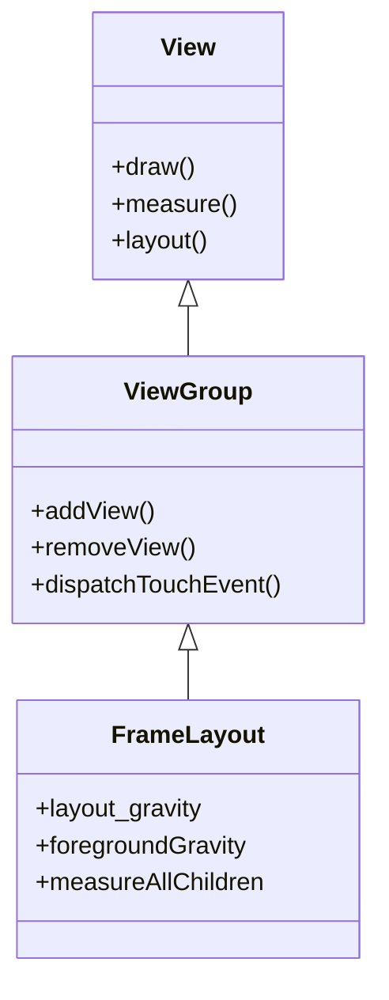
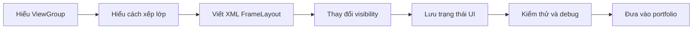
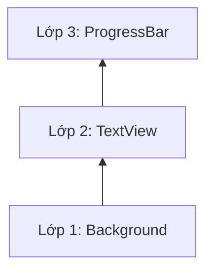
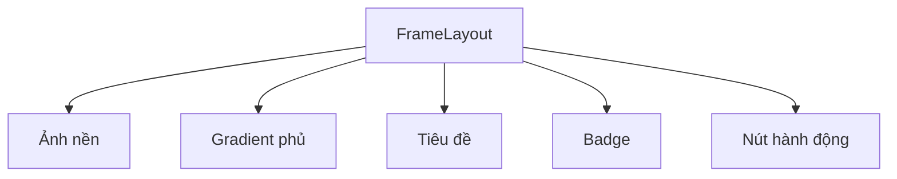
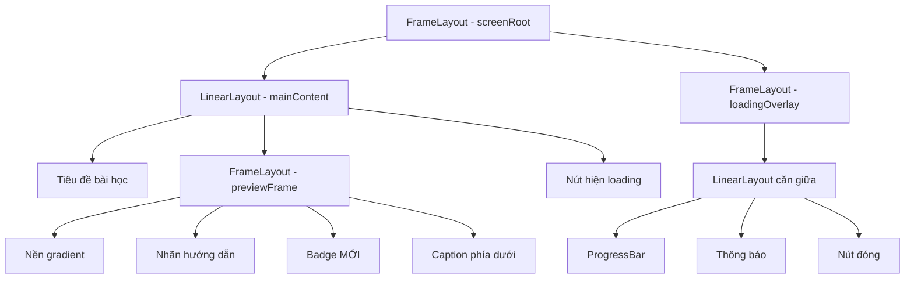
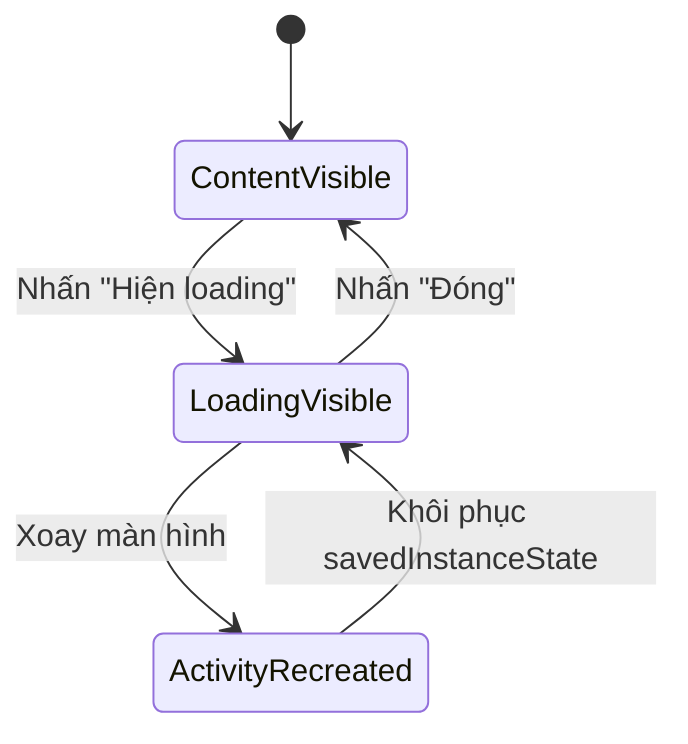
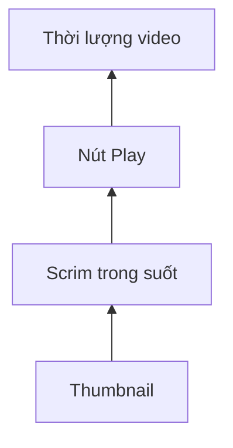
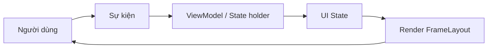
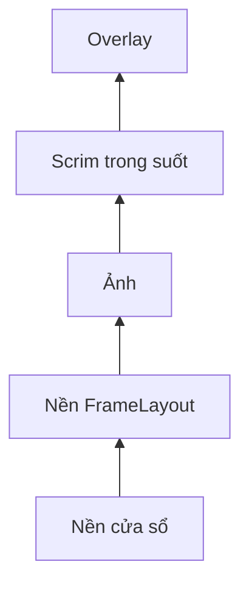

# 001 - FrameLayout

[](https://cryallen.com/2017/04/25/2017-04-25-AndroidTouchEvent/?utm_source=chatgpt.com)


> **Học phần:** 02 - App Components and User Interface
> **Module:** Module 04 - Interface and Navigation
> **Nhóm nội dung:** Traditional Layouts
> **Nguồn roadmap:** Interface and Navigation / Traditional Layouts
> **Loại bài:** UI
> **Thứ tự trong module:** 001
> **Thời lượng gợi ý:** 30 phút

---

## 1. Tóm tắt

`FrameLayout` là một `ViewGroup` đơn giản trong hệ thống Android Views. Nó thường được dùng để dành một vùng trên màn hình cho một nội dung chính hoặc để xếp nhiều `View` chồng lên nhau.

Các phần tử con được vẽ theo thứ tự khai báo: phần tử được thêm sau sẽ nằm trên phần tử được thêm trước. Android khuyến nghị dùng `FrameLayout` chủ yếu cho một nội dung chính; nếu có nhiều phần tử con, cần kiểm soát vị trí bằng `android:layout_gravity` và tránh tạo bố cục phức tạp khó thích ứng với nhiều kích thước màn hình. ([Android Git Repositories][1])


*Hình: Mọi giao diện XML truyền thống đều được xây dựng từ cây `View` và `ViewGroup`.* ([Android Developers][2])

### Vị trí của FrameLayout trong hệ thống View



Sau bài học, anh sẽ tạo được một màn hình có:

* Nội dung chính.
* Nhãn được đặt chồng lên nội dung.
* Loading overlay toàn màn hình.
* Trạng thái được giữ khi Activity bị tạo lại.
* Kiểm thử UI bằng Espresso.

---

## 2. Mục tiêu học tập

Sau khi hoàn thành bài này, anh có thể:

* Giải thích `FrameLayout` bằng ngôn ngữ của mình.
* Phân biệt `FrameLayout` với `LinearLayout` và `ConstraintLayout`.
* Hiểu thứ tự chồng lớp của các phần tử con.
* Sử dụng đúng `android:layout_gravity`.
* Tạo badge, caption, loading overlay hoặc empty-state overlay.
* Tránh lỗi lớp trong suốt chặn thao tác của phần tử bên dưới.
* Giữ trạng thái giao diện khi xoay màn hình hoặc Activity được tạo lại.
* Kiểm tra bố cục bằng Layout Inspector và Espresso.
* Đưa ví dụ hoàn chỉnh vào portfolio Android.

### Luồng học tập




---

## 3. Khái niệm chính

### 3.1. FrameLayout là gì?

`FrameLayout` có thể được hình dung như một khung tranh:

* Khung xác định vùng hiển thị.
* Mỗi phần tử con là một lớp nằm trong khung.
* Các lớp có thể che một phần hoặc toàn bộ lớp phía dưới.
* Lớp được khai báo sau thường xuất hiện ở phía trên.

Theo mã nguồn Android, gravity mặc định của phần tử con là `TOP | START`. Kích thước của `FrameLayout` thường phụ thuộc vào phần tử con lớn nhất cộng với padding, trong phạm vi kích thước mà phần tử cha cho phép. ([Android Git Repositories][1])

```xml
<FrameLayout
    android:layout_width="match_parent"
    android:layout_height="240dp">

    <!-- Lớp dưới cùng -->
    <ImageView
        android:layout_width="match_parent"
        android:layout_height="match_parent" />

    <!-- Lớp trên cùng -->
    <TextView
        android:layout_width="wrap_content"
        android:layout_height="wrap_content"
        android:layout_gravity="bottom|start"
        android:text="Chú thích" />

</FrameLayout>
```

### 3.2. Thứ tự chồng lớp

Xét cấu trúc sau:

```xml
<FrameLayout>

    <View android:id="@+id/background" />

    <TextView android:id="@+id/title" />

    <ProgressBar android:id="@+id/progress" />

</FrameLayout>
```

Thứ tự hiển thị từ dưới lên trên là:

```text
┌──────────────────────────────┐
│ ProgressBar                  │  ← khai báo cuối, nằm trên cùng
│                              │
│ TextView                     │
│                              │
│ View nền                     │  ← khai báo đầu, nằm dưới cùng
└──────────────────────────────┘
```



Có thể thay đổi thứ tự lớp trong Kotlin bằng:

```kotlin
parent.bringChildToFront(targetView)
```

Tuy nhiên, với giao diện tĩnh, nên tổ chức đúng thứ tự ngay trong XML để code dễ đọc hơn.

### 3.3. `layout_gravity` và `foregroundGravity`

Hai thuộc tính này có vai trò khác nhau:

| Thuộc tính                   | Đặt ở đâu?    | Chức năng                                             |
| ---------------------------- | ------------- | ----------------------------------------------------- |
| `android:layout_gravity`     | Phần tử con   | Xác định vị trí của phần tử con trong `FrameLayout`   |
| `android:foreground`         | `FrameLayout` | Đặt một drawable lên phía trước nội dung              |
| `android:foregroundGravity`  | `FrameLayout` | Xác định vị trí của foreground drawable               |
| `android:measureAllChildren` | `FrameLayout` | Cho phép đo cả những phần tử đang ở trạng thái `GONE` |

Ví dụ đặt badge ở góc trên bên phải:

```xml
<TextView
    android:layout_width="wrap_content"
    android:layout_height="wrap_content"
    android:layout_gravity="top|end"
    android:layout_margin="12dp"
    android:text="MỚI" />
```

Ví dụ đặt nút ở chính giữa:

```xml
<Button
    android:layout_width="wrap_content"
    android:layout_height="wrap_content"
    android:layout_gravity="center"
    android:text="Bắt đầu" />
```

Ví dụ đặt caption ở cạnh dưới:

```xml
<TextView
    android:layout_width="match_parent"
    android:layout_height="wrap_content"
    android:layout_gravity="bottom"
    android:text="Nội dung chú thích" />
```

> Nên dùng `start` và `end` thay cho `left` và `right` để giao diện thích ứng với cả ngôn ngữ viết từ trái sang phải và từ phải sang trái.

### 3.4. Các vị trí thường dùng

```text
top|start          top|center_horizontal          top|end

center_vertical|
start              center                         center_vertical|end

bottom|start       bottom|center_horizontal       bottom|end
```

Ví dụ:

```xml
android:layout_gravity="bottom|end"
```

Có nghĩa là phần tử nằm ở góc dưới, phía cuối hướng đọc.

### 3.5. Những trường hợp phù hợp

`FrameLayout` phù hợp với các giao diện như:

1. Ảnh có caption hoặc gradient phủ phía dưới.
2. Avatar có badge trạng thái online.
3. Video có nút Play ở giữa.
4. Màn hình có loading overlay.
5. Empty state nằm trên khu vực nội dung.
6. Fragment container.
7. Bản đồ có nút điều khiển nổi.
8. Một nội dung chính được thay đổi bằng `visibility`.



### 3.6. Khi nào không nên dùng?

Không nên dùng `FrameLayout` để bố trí một màn hình phức tạp gồm nhiều thành phần cần liên kết vị trí với nhau.

Ví dụ không phù hợp:

* Form đăng ký có nhiều trường nhập.
* Dashboard nhiều hàng và cột.
* Màn hình cần thay đổi mạnh giữa điện thoại, máy tính bảng và màn hình gập.
* Bố cục có nhiều quan hệ như “A nằm dưới B, C căn theo D”.

Trong những trường hợp này, `ConstraintLayout` thường phù hợp hơn vì hỗ trợ bố cục phức tạp với hệ phân cấp tương đối phẳng. ([Android Developers][3])

| Nhu cầu                          | Layout phù hợp     |
| -------------------------------- | ------------------ |
| Xếp các phần tử chồng lên nhau   | `FrameLayout`      |
| Sắp xếp một chiều dọc hoặc ngang | `LinearLayout`     |
| Bố cục phức tạp, responsive      | `ConstraintLayout` |
| Danh sách dài                    | `RecyclerView`     |
| Giao diện Compose cần chồng lớp  | `Box`              |


### 3.7. FrameLayout và Jetpack Compose

Trong Jetpack Compose, thành phần có vai trò gần tương đương là `Box`. `Box` cho phép đặt các composable chồng lên nhau và căn chỉnh từng phần tử bằng `Modifier.align()`. ([Android Developers][4])

```kotlin
@Composable
fun OverlayExample() {
    Box {
        Image(
            painter = painterResource(R.drawable.sample_image),
            contentDescription = "Ảnh minh họa"
        )

        Text(
            text = "MỚI",
            modifier = Modifier.align(Alignment.TopEnd)
        )
    }
}
```

Bài này tập trung vào **Android Views và XML**, nhưng việc hiểu `FrameLayout` sẽ giúp anh tiếp cận `Box` nhanh hơn.

---

## 4. Thực hành: tạo màn hình có loading overlay

### 4.1. Yêu cầu

Xây dựng một màn hình gồm:

* Thẻ nội dung chính.
* Badge “MỚI” ở góc trên bên phải.
* Tiêu đề ở cạnh dưới.
* Nút mở loading overlay.
* Loading overlay chặn thao tác phía dưới.
* Nút đóng overlay.
* Trạng thái overlay được giữ khi Activity được tạo lại.

### 4.2. Cấu trúc lớp



### 4.3. Tạo nền gradient

Tạo file:

```text
res/drawable/bg_frame_demo.xml
```

```xml
<?xml version="1.0" encoding="utf-8"?>
<shape xmlns:android="http://schemas.android.com/apk/res/android"
    android:shape="rectangle">

    <gradient
        android:angle="315"
        android:endColor="#512DA8"
        android:startColor="#0288D1"
        android:type="linear" />

    <corners android:radius="24dp" />

</shape>
```

### 4.4. Tạo layout

Tạo file:

```text
res/layout/activity_frame_layout.xml
```

```xml
<?xml version="1.0" encoding="utf-8"?>
<FrameLayout xmlns:android="http://schemas.android.com/apk/res/android"
    xmlns:tools="http://schemas.android.com/tools"
    android:id="@+id/screenRoot"
    android:layout_width="match_parent"
    android:layout_height="match_parent"
    android:background="#F6F7FB"
    tools:context=".FrameLayoutActivity">

    <!-- Lớp 1: nội dung chính -->
    <LinearLayout
        android:id="@+id/mainContent"
        android:layout_width="match_parent"
        android:layout_height="match_parent"
        android:orientation="vertical"
        android:padding="24dp">

        <TextView
            android:layout_width="wrap_content"
            android:layout_height="wrap_content"
            android:text="@string/frame_layout_title"
            android:textColor="#171A1F"
            android:textSize="28sp"
            android:textStyle="bold" />

        <TextView
            android:layout_width="match_parent"
            android:layout_height="wrap_content"
            android:layout_marginTop="8dp"
            android:text="@string/frame_layout_description"
            android:textColor="#5C6370"
            android:textSize="16sp" />

        <!-- FrameLayout minh họa -->
        <FrameLayout
            android:id="@+id/previewFrame"
            android:layout_width="match_parent"
            android:layout_height="240dp"
            android:layout_marginTop="24dp"
            android:background="@drawable/bg_frame_demo"
            android:clipToOutline="true">

            <!-- Lớp dưới -->
            <TextView
                android:layout_width="wrap_content"
                android:layout_height="wrap_content"
                android:layout_gravity="top|start"
                android:layout_margin="16dp"
                android:text="@string/base_layer"
                android:textColor="#CCFFFFFF"
                android:textSize="14sp" />

            <!-- Badge được đặt chồng ở góc trên bên phải -->
            <TextView
                android:layout_width="wrap_content"
                android:layout_height="wrap_content"
                android:layout_gravity="top|end"
                android:layout_margin="16dp"
                android:background="#FFF3E0"
                android:paddingHorizontal="12dp"
                android:paddingVertical="6dp"
                android:text="@string/new_badge"
                android:textColor="#C2410C"
                android:textSize="12sp"
                android:textStyle="bold" />

            <!-- Caption ở lớp trên, cạnh dưới -->
            <TextView
                android:layout_width="match_parent"
                android:layout_height="wrap_content"
                android:layout_gravity="bottom"
                android:background="#73000000"
                android:padding="16dp"
                android:text="@string/card_caption"
                android:textColor="#FFFFFF"
                android:textSize="20sp"
                android:textStyle="bold" />

        </FrameLayout>

        <Button
            android:id="@+id/btnShowLoading"
            android:layout_width="match_parent"
            android:layout_height="wrap_content"
            android:layout_marginTop="24dp"
            android:minHeight="48dp"
            android:text="@string/show_loading" />

    </LinearLayout>

    <!-- Lớp 2: overlay nằm trên toàn bộ nội dung -->
    <FrameLayout
        android:id="@+id/loadingOverlay"
        android:layout_width="match_parent"
        android:layout_height="match_parent"
        android:background="#B3000000"
        android:clickable="true"
        android:focusable="true"
        android:importantForAccessibility="yes"
        android:visibility="gone"
        tools:visibility="visible">

        <LinearLayout
            android:layout_width="280dp"
            android:layout_height="wrap_content"
            android:layout_gravity="center"
            android:background="#FFFFFF"
            android:gravity="center"
            android:orientation="vertical"
            android:padding="24dp">

            <ProgressBar
                android:layout_width="48dp"
                android:layout_height="48dp"
                android:indeterminate="true" />

            <TextView
                android:id="@+id/txtLoadingMessage"
                android:layout_width="wrap_content"
                android:layout_height="wrap_content"
                android:layout_marginTop="16dp"
                android:text="@string/loading_message"
                android:textColor="#171A1F"
                android:textSize="16sp"
                android:textStyle="bold" />

            <Button
                android:id="@+id/btnCloseLoading"
                android:layout_width="match_parent"
                android:layout_height="wrap_content"
                android:layout_marginTop="20dp"
                android:minHeight="48dp"
                android:text="@string/close_overlay" />

        </LinearLayout>

    </FrameLayout>

</FrameLayout>
```

### 4.5. Khai báo chuỗi

Tạo hoặc cập nhật:

```text
res/values/strings.xml
```

```xml
<resources>
    <string name="app_name">FrameLayout Demo</string>

    <string name="frame_layout_title">FrameLayout</string>
    <string name="frame_layout_description">
        Ví dụ xếp badge, caption và loading overlay thành nhiều lớp.
    </string>

    <string name="base_layer">LỚP NỘI DUNG GỐC</string>
    <string name="new_badge">MỚI</string>
    <string name="card_caption">Các View có thể được xếp chồng lên nhau</string>

    <string name="show_loading">Hiện loading overlay</string>
    <string name="loading_message">Đang xử lý dữ liệu…</string>
    <string name="close_overlay">Đóng</string>
</resources>
```

### 4.6. Điều khiển trạng thái bằng Kotlin

Tạo file:

```text
FrameLayoutActivity.kt
```

```kotlin
package com.example.framelayoutdemo

import android.os.Bundle
import android.view.View
import android.widget.Button
import android.widget.FrameLayout
import androidx.appcompat.app.AppCompatActivity
import androidx.core.view.isVisible

class FrameLayoutActivity : AppCompatActivity() {

    private lateinit var mainContent: View
    private lateinit var loadingOverlay: FrameLayout
    private lateinit var showLoadingButton: Button
    private lateinit var closeLoadingButton: Button

    private var isLoadingVisible: Boolean = false

    override fun onCreate(savedInstanceState: Bundle?) {
        super.onCreate(savedInstanceState)
        setContentView(R.layout.activity_frame_layout)

        mainContent = findViewById(R.id.mainContent)
        loadingOverlay = findViewById(R.id.loadingOverlay)
        showLoadingButton = findViewById(R.id.btnShowLoading)
        closeLoadingButton = findViewById(R.id.btnCloseLoading)

        isLoadingVisible =
            savedInstanceState?.getBoolean(KEY_LOADING_VISIBLE) ?: false

        showLoadingButton.setOnClickListener {
            isLoadingVisible = true
            render()
        }

        closeLoadingButton.setOnClickListener {
            isLoadingVisible = false
            render()
        }

        render()
    }

    private fun render() {
        loadingOverlay.isVisible = isLoadingVisible

        mainContent.importantForAccessibility =
            if (isLoadingVisible) {
                View.IMPORTANT_FOR_ACCESSIBILITY_NO_HIDE_DESCENDANTS
            } else {
                View.IMPORTANT_FOR_ACCESSIBILITY_AUTO
            }

        if (isLoadingVisible) {
            closeLoadingButton.requestFocus()

            loadingOverlay.announceForAccessibility(
                getString(R.string.loading_message)
            )
        } else {
            showLoadingButton.requestFocus()
        }
    }

    override fun onSaveInstanceState(outState: Bundle) {
        outState.putBoolean(
            KEY_LOADING_VISIBLE,
            isLoadingVisible
        )

        super.onSaveInstanceState(outState)
    }

    companion object {
        private const val KEY_LOADING_VISIBLE = "loading_visible"
    }
}
```

### 4.7. Luồng thay đổi trạng thái



`FrameLayout` chỉ chịu trách nhiệm bố trí giao diện. Trạng thái “đang loading hay không” phải được quản lý bởi Activity, Fragment, ViewModel hoặc state holder thích hợp.

Với trạng thái UI nhỏ và tạm thời, có thể dùng `onSaveInstanceState()`. Không nên lưu bitmap, danh sách lớn hoặc cấu trúc dữ liệu phức tạp trong `Bundle`; tài liệu Android khuyến nghị chỉ lưu lượng dữ liệu tối thiểu cần thiết để tái tạo giao diện. ([Android Developers][5])

---

## 5. Bài tập

### Bài tập 1: Avatar có trạng thái online

Tạo một `FrameLayout` gồm:

* `ImageView` hình tròn.
* Một chấm xanh ở góc dưới bên phải.
* Chấm xanh có kích thước `16dp`.
* Có viền trắng bao quanh.

```text
┌───────────────────┐
│                   │
│      Avatar       │
│              ●    │
└───────────────────┘
```

### Bài tập 2: Video thumbnail

Tạo giao diện gồm:

* Ảnh thumbnail.
* Một lớp màu đen trong suốt.
* Nút Play nằm chính giữa.
* Thời lượng video ở góc dưới bên phải.



### Bài tập 3: Empty-state overlay

Tạo một khu vực danh sách có hai trạng thái:

```kotlin
enum class ScreenState {
    CONTENT,
    EMPTY,
    LOADING,
    ERROR
}
```

Mỗi trạng thái điều khiển một lớp khác nhau:

| Trạng thái | Lớp hiển thị                 |
| ---------- | ---------------------------- |
| `CONTENT`  | Nội dung danh sách           |
| `EMPTY`    | Thông báo chưa có dữ liệu    |
| `LOADING`  | Progress indicator           |
| `ERROR`    | Thông báo lỗi và nút thử lại |

Yêu cầu chỉ có một trạng thái chính được hiển thị tại một thời điểm.

### Bài tập nâng cao

Chuyển ví dụ XML sang Jetpack Compose bằng:

* `Box`.
* `Modifier.align()`.
* `AnimatedVisibility`.
* `rememberSaveable`.

---

## 6. Kiểm thử và gỡ lỗi

### 6.1. Checklist kiểm thử thủ công

| Kiểm tra                     | Kết quả mong đợi                                 |
| ---------------------------- | ------------------------------------------------ |
| Mở màn hình                  | Overlay đang ẩn                                  |
| Nhấn “Hiện loading”          | Overlay xuất hiện trên toàn màn hình             |
| Nhấn vào vùng tối            | Nội dung phía dưới không nhận thao tác           |
| Dùng TalkBack                | Nội dung phía dưới không được đọc khi overlay mở |
| Nhấn “Đóng”                  | Overlay biến mất                                 |
| Xoay màn hình khi overlay mở | Overlay vẫn hiển thị                             |
| Chuyển sang dark mode        | Chữ và nền vẫn có độ tương phản phù hợp          |
| Dùng cỡ chữ lớn              | Nội dung không bị cắt                            |
| Chạy trên màn hình nhỏ       | Hộp loading vẫn nằm trong màn hình               |

### 6.2. Kiểm thử bằng Espresso

Espresso cung cấp `onView()` để tìm `View`, thực hiện thao tác và kiểm tra kết quả giao diện. ([Android Developers][6])

```kotlin
package com.example.framelayoutdemo

import androidx.test.core.app.ActivityScenario
import androidx.test.espresso.Espresso.onView
import androidx.test.espresso.action.ViewActions.click
import androidx.test.espresso.assertion.ViewAssertions.matches
import androidx.test.espresso.matcher.ViewMatchers.Visibility.GONE
import androidx.test.espresso.matcher.ViewMatchers.isDisplayed
import androidx.test.espresso.matcher.ViewMatchers.withEffectiveVisibility
import androidx.test.espresso.matcher.ViewMatchers.withId
import androidx.test.ext.junit.rules.ActivityScenarioRule
import androidx.test.ext.junit.runners.AndroidJUnit4
import org.junit.Rule
import org.junit.Test
import org.junit.runner.RunWith

@RunWith(AndroidJUnit4::class)
class FrameLayoutActivityTest {

    @get:Rule
    val activityRule =
        ActivityScenarioRule(FrameLayoutActivity::class.java)

    @Test
    fun clickShowLoading_displaysOverlay() {
        onView(withId(R.id.btnShowLoading))
            .perform(click())

        onView(withId(R.id.loadingOverlay))
            .check(matches(isDisplayed()))
    }

    @Test
    fun clickCloseLoading_hidesOverlay() {
        onView(withId(R.id.btnShowLoading))
            .perform(click())

        onView(withId(R.id.btnCloseLoading))
            .perform(click())

        onView(withId(R.id.loadingOverlay))
            .check(matches(withEffectiveVisibility(GONE)))
    }

    @Test
    fun overlayRemainsVisible_afterActivityRecreation() {
        onView(withId(R.id.btnShowLoading))
            .perform(click())

        activityRule.scenario.recreate()

        onView(withId(R.id.loadingOverlay))
            .check(matches(isDisplayed()))
    }
}
```

### 6.3. Debug bằng Layout Inspector

Layout Inspector cho phép kiểm tra cây View, kích thước, vị trí, thuộc tính và các thành phần đang chồng lên nhau trong ứng dụng chạy trên emulator hoặc thiết bị thật. Khi nhiều lớp cùng nằm trong một vùng, có thể chọn phần tử thông qua Component Tree. ([Android Developers][7])


Quy trình kiểm tra:

1. Chạy ứng dụng trên emulator.
2. Mở cửa sổ **Running Devices**.
3. Bật **Layout Inspector**.
4. Tìm `screenRoot`.
5. Mở lần lượt `mainContent` và `loadingOverlay`.
6. Kiểm tra bounds của từng lớp.
7. Xác nhận `loadingOverlay` nằm sau `mainContent` trong XML nhưng ở trên về mặt hiển thị.
8. Kiểm tra thuộc tính `visibility`, `clickable` và `focusable`.

### 6.4. Các lỗi thường gặp

#### Lỗi 1: View phía dưới không thể nhấn được

**Nguyên nhân:** Có một View trong suốt nằm phía trên và đang nhận sự kiện chạm.

```xml
android:clickable="true"
```

**Cách xử lý:**

* Đặt lớp đó thành `GONE` khi không dùng.
* Không tạo View phủ toàn màn hình nếu không cần.
* Kiểm tra thứ tự khai báo trong XML.

#### Lỗi 2: Badge nằm sai góc

**Nguyên nhân:** Đặt `android:gravity` thay vì `android:layout_gravity`.

```xml
<!-- Đúng -->
android:layout_gravity="top|end"
```

#### Lỗi 3: Các View che nhau ngoài ý muốn

**Nguyên nhân:** Dùng `FrameLayout` cho bố cục vốn cần quan hệ vị trí phức tạp.

**Cách xử lý:** Chuyển phần nội dung phức tạp sang `ConstraintLayout`, chỉ giữ `FrameLayout` cho phần overlay.

#### Lỗi 4: Overlay mở lại bị mất sau khi xoay màn hình

**Nguyên nhân:** Trạng thái chỉ được giữ trong một biến của Activity cũ.

**Cách xử lý:**

* `onSaveInstanceState()` cho trạng thái nhỏ.
* `ViewModel` cho trạng thái tồn tại qua configuration change.
* `SavedStateHandle` nếu cần tái tạo trạng thái sau process death.
* Repository hoặc cơ sở dữ liệu cho dữ liệu ứng dụng lâu dài.

---

## 7. Checklist hoàn thành

### Kiến thức

* [ ] Giải thích được `FrameLayout` là một `ViewGroup`.
* [ ] Hiểu phần tử khai báo sau thường nằm trên phần tử khai báo trước.
* [ ] Phân biệt được `layout_gravity` và `foregroundGravity`.
* [ ] Biết khi nào nên dùng `FrameLayout`.
* [ ] Biết khi nào nên chuyển sang `ConstraintLayout`.
* [ ] Biết `Box` là lựa chọn tương đương trong Compose.

### Thực hành

* [ ] Tạo được FrameLayout bằng XML.
* [ ] Đặt được badge ở góc trên bên phải.
* [ ] Đặt được caption ở cạnh dưới.
* [ ] Tạo được loading overlay.
* [ ] Overlay chặn được thao tác phía dưới.
* [ ] Có nút đóng overlay.
* [ ] Trạng thái được giữ khi Activity tạo lại.

### Chất lượng

* [ ] Chuỗi hiển thị nằm trong `strings.xml`.
* [ ] Dùng `start` và `end` thay cho `left` và `right`.
* [ ] Thành phần tương tác có vùng chạm phù hợp.
* [ ] TalkBack không đọc nội dung phía dưới khi overlay mở.
* [ ] Có kiểm thử Espresso.
* [ ] Đã kiểm tra bằng Layout Inspector.
* [ ] Đã thử trên nhiều kích thước màn hình.

### Portfolio

* [ ] Có ảnh chụp trạng thái bình thường.
* [ ] Có ảnh chụp trạng thái loading.
* [ ] Có sơ đồ thứ tự lớp.
* [ ] Có README giải thích quyết định sử dụng `FrameLayout`.
* [ ] Có video GIF hoặc WebM ngắn mô tả thay đổi trạng thái.

---

## 8. Ghi chú sản xuất

### 8.1. Quản lý trạng thái

Không đặt business state trực tiếp vào `FrameLayout`. Layout chỉ nên phản ánh state:

```text
State → render() → visibility của từng lớp
```

Có thể áp dụng mô hình:



Phân loại nơi lưu trạng thái:

| Loại dữ liệu                | Nơi lưu phù hợp                               |
| --------------------------- | --------------------------------------------- |
| Overlay đang mở hay đóng    | `onSaveInstanceState` hoặc `SavedStateHandle` |
| Dữ liệu đang tải            | ViewModel                                     |
| ID item đang xem            | SavedStateHandle                              |
| Nội dung lấy từ API         | Repository và cache                           |
| Dữ liệu cần tồn tại lâu dài | Room hoặc DataStore                           |
| Bitmap lớn                  | Bộ nhớ đệm ảnh, không lưu trong Bundle        |

Android lưu ý rằng saved instance state có giới hạn về dung lượng và quá trình tuần tự hóa diễn ra trên main thread, vì vậy chỉ nên lưu dữ liệu nhỏ cần thiết để phục hồi giao diện. ([Android Developers][5])

### 8.2. Accessibility

Khi dùng overlay:

* Overlay phải nhận focus.
* Nội dung phía dưới nên tạm thời bị loại khỏi accessibility tree.
* Thông báo loading nên được công bố cho TalkBack.
* Nút đóng hoặc hủy phải có nhãn rõ ràng.
* Ảnh trang trí nên dùng `android:contentDescription="@null"`.
* Không chỉ dùng màu sắc để thể hiện trạng thái.

Android khuyến nghị cung cấp nhãn mô tả rõ mục đích của các thành phần tương tác để TalkBack và các dịch vụ hỗ trợ có thể thông báo chính xác cho người dùng. ([Android Developers][8])

### 8.3. Hiệu năng và overdraw

Xếp lớp là thế mạnh của `FrameLayout`, nhưng quá nhiều lớp có background hoặc alpha có thể khiến một pixel bị vẽ nhiều lần trong cùng một frame. Hiện tượng này được gọi là **overdraw**. ([Android Developers][9])



Biện pháp hạn chế:

* Xóa background không cần thiết.
* Không tạo nhiều lớp toàn màn hình cùng lúc.
* Đặt overlay thành `GONE` khi không sử dụng.
* Hạn chế nhiều lớp alpha bán trong suốt.
* Giữ cây View nông.
* Kiểm tra bằng Debug GPU Overdraw và Layout Inspector.

Android khuyến nghị loại bỏ background không nhìn thấy, làm phẳng hệ phân cấp và giảm các đối tượng trong suốt khi overdraw trở thành vấn đề. ([Android Developers][9])

### 8.4. Responsive UI

`FrameLayout` không tự giải quyết bố cục responsive phức tạp. Khi phát triển production:

* Không hard-code vị trí bằng `translationX` hoặc `translationY`.
* Dùng `layout_gravity`, margin và resource theo kích thước màn hình.
* Kiểm tra portrait và landscape.
* Kiểm tra font scale lớn.
* Kiểm tra tablet và màn hình gập.
* Dùng `ConstraintLayout` cho nội dung phức tạp bên trong.
* Chỉ dùng `FrameLayout` ở lớp ngoài khi cần overlay.

### 8.5. Release checklist

Trước khi phát hành, cần kiểm tra:

```text
[ ] Overlay không bị kẹt vĩnh viễn
[ ] Có cách hủy hoặc đóng khi thao tác kéo dài
[ ] Không nhấn được nút phía dưới overlay
[ ] Back button có hành vi phù hợp
[ ] Trạng thái không mất khi xoay màn hình
[ ] Không lưu dữ liệu lớn trong Bundle
[ ] TalkBack đọc đúng trạng thái
[ ] Không có overdraw nghiêm trọng
[ ] Giao diện hoạt động ở nhiều cỡ chữ
[ ] Espresso test chạy thành công
```

---

## 9. Artifact gợi ý cho portfolio

### Cấu trúc thư mục

```text
FrameLayoutDemo/
├── app/
│   └── src/
│       ├── main/
│       │   ├── java/.../FrameLayoutActivity.kt
│       │   └── res/
│       │       ├── drawable/bg_frame_demo.xml
│       │       ├── layout/activity_frame_layout.xml
│       │       └── values/strings.xml
│       └── androidTest/
│           └── java/.../FrameLayoutActivityTest.kt
├── screenshots/
│   ├── content-state.png
│   ├── loading-overlay.png
│   └── landscape-state.png
└── README.md
```

### Nội dung README ngắn

```markdown
# FrameLayout Overlay Demo

Ứng dụng minh họa cách sử dụng FrameLayout để:

- Xếp badge và caption lên nội dung.
- Hiển thị loading overlay.
- Chặn tương tác với nội dung phía dưới.
- Hỗ trợ accessibility.
- Giữ trạng thái khi Activity được tạo lại.
- Kiểm thử giao diện bằng Espresso.

## Kiến trúc

UI Event → Activity State → render() → View Visibility

## Kiểm thử

- Overlay xuất hiện sau khi nhấn nút.
- Overlay biến mất sau khi đóng.
- Overlay được phục hồi sau Activity recreation.
```

---

## 10. Câu hỏi tự kiểm tra

1. Tại sao phần tử khai báo cuối trong `FrameLayout` thường nằm trên cùng?
2. `android:layout_gravity` được đặt trên parent hay child?
3. Vì sao không nên dùng `FrameLayout` cho một form phức tạp?
4. Một View trong suốt có thể chặn sự kiện chạm không?
5. Khi nào nên dùng `GONE` thay vì `INVISIBLE`?
6. Vì sao không nên lưu bitmap trong `onSaveInstanceState()`?
7. Thành phần tương đương với `FrameLayout` trong Compose là gì?
8. Công cụ nào giúp kiểm tra các View đang chồng lên nhau?
9. Việc xếp nhiều lớp trong suốt có thể gây vấn đề hiệu năng nào?
10. Khi overlay mở, cần xử lý accessibility tree của nội dung phía dưới ra sao?

---

## Kết luận

`FrameLayout` phù hợp nhất khi giao diện có một vùng nội dung chính hoặc cần xếp một số lớp đơn giản như badge, caption, nút Play, loading và empty state. Điểm quan trọng không chỉ là biết viết XML, mà còn phải quản lý đúng thứ tự lớp, sự kiện chạm, trạng thái, accessibility và overdraw.

Nguyên tắc dễ nhớ:

```text
FrameLayout = một khung + nhiều lớp

Khai báo trước  → nằm dưới
Khai báo sau    → nằm trên
Layout đơn giản → dùng FrameLayout
Quan hệ phức tạp → dùng ConstraintLayout
```

### Tài liệu chính

* API `FrameLayout` và mã nguồn Android Framework. ([Android Developers][10])
* Khai báo layout bằng hệ thống Views. ([Android Developers][2])
* Lưu và khôi phục UI state. ([Android Developers][5])
* Accessibility cho Android Views. ([Android Developers][8])
* Kiểm thử giao diện bằng Espresso. ([Android Developers][6])
* Debug bằng Layout Inspector. ([Android Developers][7])
* Phát hiện và giảm overdraw. ([Android Developers][9])

[1]: https://android.googlesource.com/platform/frameworks/base/%2B/master/core/java/android/widget/FrameLayout.java "core/java/android/widget/FrameLayout.java - platform/frameworks/base - Git at Google"
[2]: https://developer.android.com/develop/ui/views/layout/declaring-layout "Layouts in views  |  Views  |  Android Developers"
[3]: https://developer.android.com/develop/ui/views/layout/constraint-layout "Build a responsive UI with ConstraintLayout  |  Views  |  Android Developers"
[4]: https://developer.android.com/develop/ui/compose/layouts/basics?hl=en&utm_source=chatgpt.com "Compose layout basics  |  Jetpack Compose  |  Android Developers"
[5]: https://developer.android.com/topic/libraries/architecture/views/saving-states-views "Save UI states (Views)  |  Android Developers"
[6]: https://developer.android.com/training/testing/espresso/basics?utm_source=chatgpt.com "Espresso basics  |  Test your app on Android  |  Android Developers"
[7]: https://developer.android.com/studio/debug/layout-inspector "Debug your layout with Layout Inspector  |  Android Studio  |  Android Developers"
[8]: https://developer.android.com/guide/topics/ui/accessibility/views/principles-views "Principles for improving app accessibility (Views)  |  Android Developers"
[9]: https://developer.android.com/topic/performance/rendering/overdraw?hl=en "Reduce overdraw  |  App quality  |  Android Developers"
[10]: https://developer.android.com/reference/android/widget/FrameLayout "FrameLayout  |  API reference  |  Android Developers"

---

# Bài luyện tập

## Mục tiêu


## Đề bài


## Yêu cầu hoàn thành

- [ ] 
- [ ] 
- [ ] 

## Kết quả / lời giải


## Ghi chú
