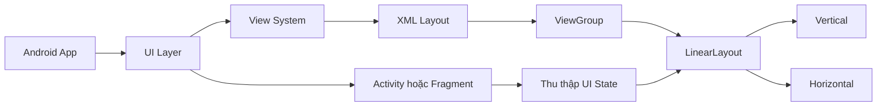
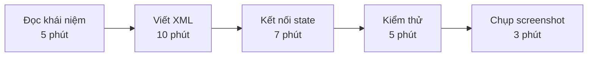
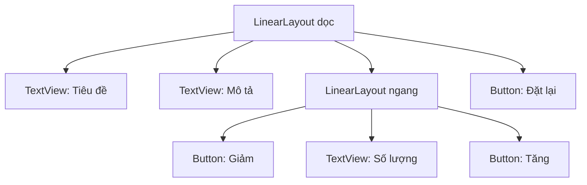
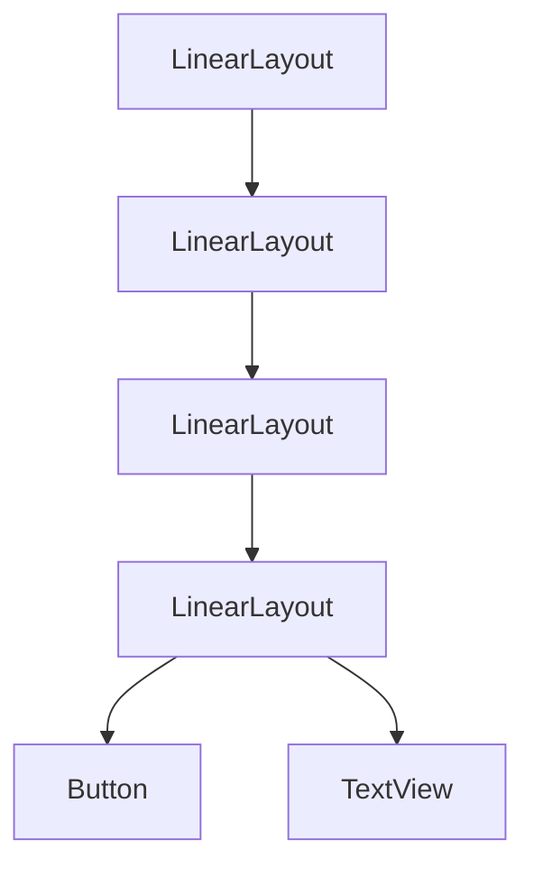
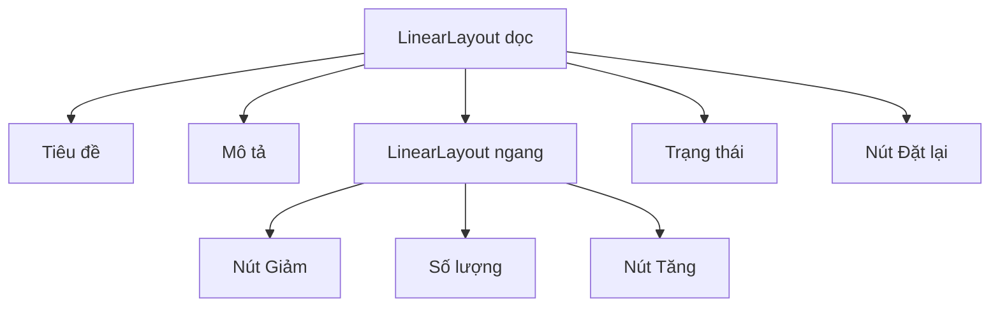
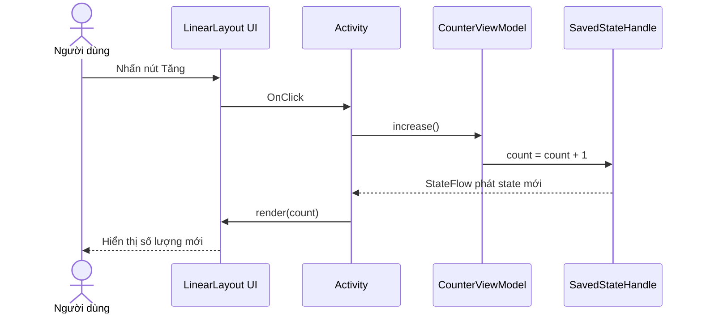
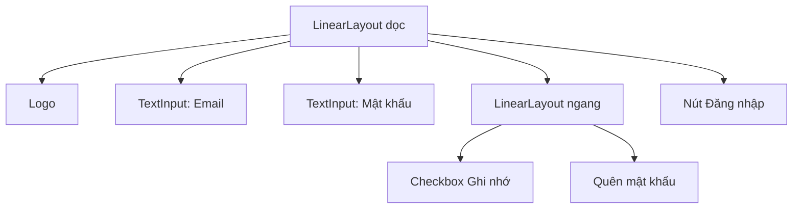
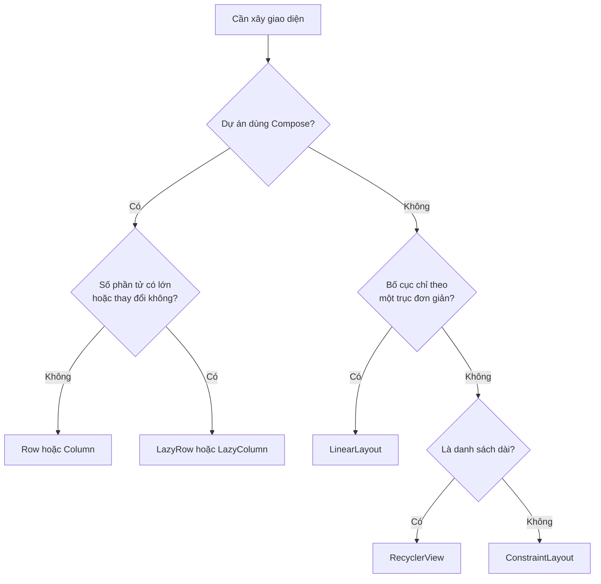

# 002 — LinearLayout trong Android

| Thông tin               | Nội dung                                                 |
| ----------------------- | -------------------------------------------------------- |
| **Học phần**            | 02 — App Components and User Interface                   |
| **Module**              | Module 04 — Interface and Navigation                     |
| **Nhóm nội dung**       | Traditional Layouts                                      |
| **Nguồn roadmap**       | Interface and Navigation / Traditional Layouts           |
| **Loại bài**            | UI                                                       |
| **Thứ tự trong module** | 002                                                      |
| **Thời lượng gợi ý**    | 30 phút                                                  |
| **Công nghệ chính**     | Android Views, XML, Kotlin, View Binding                 |
| **Artifact portfolio**  | Ứng dụng bộ đếm sử dụng `LinearLayout` và lưu trạng thái |

---

## 1. Tóm tắt

`LinearLayout` là một `ViewGroup` dùng để sắp xếp các `View` con liên tiếp theo **một trục duy nhất**:

* `vertical`: từ trên xuống dưới.
* `horizontal`: từ trái sang phải hoặc theo chiều RTL của ngôn ngữ.


> Ảnh minh họa: [Android Developers — Create a linear layout](https://developer.android.com/develop/ui/views/layout/linear)

Tất cả phần tử con được đặt lần lượt theo thứ tự xuất hiện trong XML. `LinearLayout` còn hỗ trợ `layout_weight` để chia phần không gian còn lại giữa các phần tử theo tỷ lệ. ([Android Developers][1])

### LinearLayout nằm ở đâu trong ứng dụng?



`LinearLayout` chỉ chịu trách nhiệm về **cách sắp xếp giao diện**. Nó không tự quản lý:

* Lifecycle của `Activity` hoặc `Fragment`.
* Dữ liệu nghiệp vụ.
* Network hoặc database.
* Trạng thái cần giữ khi xoay màn hình.
* Điều hướng giữa các màn hình.

Các phần này nên được xử lý bởi `Activity`, `Fragment`, `ViewModel`, repository hoặc Navigation component tương ứng.

### Khi nào nên dùng?

| Tình huống                                             |                    Có nên dùng? |
| ------------------------------------------------------ | ------------------------------: |
| Nhóm vài nút nằm trên cùng một hàng                    |                              Có |
| Form nhỏ gồm các trường xếp dọc                        |                              Có |
| Thanh hành động đơn giản                               |                              Có |
| Giao diện có nhiều quan hệ hai chiều                   | Nên cân nhắc `ConstraintLayout` |
| Danh sách dài hoặc số lượng phần tử thay đổi           |             Dùng `RecyclerView` |
| Dự án sử dụng Jetpack Compose                          |        Dùng `Row` hoặc `Column` |
| Nhiều `LinearLayout` lồng sâu và nhiều `layout_weight` |                Nên thiết kế lại |

Tài liệu Android hiện khuyến nghị cân nhắc `ConstraintLayout` cho giao diện Views phức tạp vì nó giúp tạo hierarchy phẳng hơn và có tooling tốt hơn. Tuy nhiên, `LinearLayout` vẫn phù hợp với các nhóm giao diện nhỏ, đơn giản và chỉ chạy theo một trục. ([Android Developers][1])

---

## 2. Mục tiêu học tập

Sau bài học, người học có thể:

1. Giải thích được `LinearLayout` là gì và thuộc Android View System.
2. Phân biệt `horizontal` với `vertical`.
3. Sử dụng đúng:

   * `android:orientation`
   * `android:gravity`
   * `android:layout_gravity`
   * `android:layout_weight`
   * `match_parent`, `wrap_content` và `0dp`
   * `padding` và `layout_margin`
4. Tạo giao diện XML có `LinearLayout` lồng nhau ở mức hợp lý.
5. Kết nối View với Kotlin bằng View Binding.
6. Cập nhật giao diện từ state.
7. Giữ trạng thái khi `Activity` được tái tạo.
8. Viết kiểm thử UI cơ bản bằng Espresso.
9. Kiểm tra giao diện trên màn hình, hướng xoay và cỡ chữ khác nhau.
10. Nhận biết khi nào nên thay `LinearLayout` bằng layout khác.


> Ảnh minh họa: `TextView` và `ImageView` là các `View`; `LinearLayout`, `FrameLayout` và `ConstraintLayout` là các `ViewGroup`.

### Kết quả cần tạo sau 30 phút



Artifact cuối bài gồm:

* Một màn hình XML sử dụng `LinearLayout`.
* Một thay đổi trạng thái khi người dùng nhấn nút.
* State không mất khi xoay màn hình.
* Một UI test.
* Một screenshot hoặc GIF ngắn.
* Một file `README.md` mô tả lựa chọn kỹ thuật.

---

## 3. Khái niệm chính

### 3.1. LinearLayout là một ViewGroup

Một layout XML trong Android tạo ra cây phân cấp gồm:

* `View`: phần tử hiển thị hoặc nhận tương tác, chẳng hạn `TextView`, `Button`, `ImageView`.
* `ViewGroup`: container đo, sắp xếp và chứa các `View` khác.
* `LinearLayout`: một loại `ViewGroup` chỉ sắp xếp con theo một hướng.



Android cho phép khai báo cây giao diện bằng XML hoặc tạo `View` bằng code. XML thường dễ đọc, dễ tách phần trình bày khỏi logic và thuận tiện hơn khi tạo layout variant cho nhiều kích thước màn hình. ([Android Developers][2])

---

### 3.2. Thuộc tính `android:orientation`

#### Xếp dọc

```xml
<LinearLayout
    android:layout_width="match_parent"
    android:layout_height="wrap_content"
    android:orientation="vertical">

    <TextView ... />

    <Button ... />

    <Button ... />

</LinearLayout>
```

Kết quả:

```text
┌──────────────────────────┐
│        TextView          │
├──────────────────────────┤
│         Button           │
├──────────────────────────┤
│         Button           │
└──────────────────────────┘
```

#### Xếp ngang

```xml
<LinearLayout
    android:layout_width="match_parent"
    android:layout_height="wrap_content"
    android:orientation="horizontal">

    <Button ... />

    <TextView ... />

    <Button ... />

</LinearLayout>
```

Kết quả:

```text
┌─────────┬──────────┬─────────┐
│ Button  │ TextView │ Button  │
└─────────┴──────────┴─────────┘
```

---

### 3.3. `layout_width` và `layout_height`

Mỗi `View` phải có chiều rộng và chiều cao.

| Giá trị        | Ý nghĩa                                          |
| -------------- | ------------------------------------------------ |
| `match_parent` | Chiếm toàn bộ không gian mà parent cho phép      |
| `wrap_content` | Chỉ lớn vừa đủ để chứa nội dung                  |
| `0dp`          | Thường dùng trên trục có `layout_weight`         |
| `48dp`         | Kích thước cố định 48 density-independent pixels |
| `@dimen/...`   | Lấy kích thước từ resource                       |

Ví dụ:

```xml
<TextView
    android:layout_width="match_parent"
    android:layout_height="wrap_content"
    android:text="@string/title" />
```

Không nên sử dụng kích thước cố định cho toàn bộ màn hình, chẳng hạn:

```xml
<!-- Không nên -->
android:layout_width="390dp"
android:layout_height="844dp"
```

Màn hình Android có nhiều kích thước, tỷ lệ, mật độ và cỡ chữ khác nhau. Layout cần thích nghi với không gian mà parent cung cấp.

---

### 3.4. `gravity` và `layout_gravity`


> Ảnh minh họa: [Android Layouts — Gravity](https://wiki.bibble.co.nz/Android_Layouts)

Hai thuộc tính này rất dễ bị nhầm.

#### `android:gravity`

Điều khiển vị trí của **nội dung bên trong chính View** hoặc cách `LinearLayout` đặt toàn bộ nhóm con trong không gian còn lại.

```xml
<LinearLayout
    android:layout_width="match_parent"
    android:layout_height="200dp"
    android:gravity="center"
    android:orientation="vertical">

    <Button ... />

</LinearLayout>
```

Nút sẽ được đặt ở giữa vùng của `LinearLayout`.

#### `android:layout_gravity`

Được đặt trên View con để cho biết **View con nằm ở đâu trong parent**.

```xml
<Button
    android:layout_width="wrap_content"
    android:layout_height="wrap_content"
    android:layout_gravity="end"
    android:text="@string/confirm" />
```

### Quy tắc ghi nhớ

```text
gravity        = căn nội dung hoặc các con bên trong mình
layout_gravity = căn chính mình bên trong parent
```

Đối với `LinearLayout`:

* Parent `vertical`: `layout_gravity` của con chủ yếu có tác dụng theo chiều ngang.
* Parent `horizontal`: `layout_gravity` của con chủ yếu có tác dụng theo chiều dọc.

---

### 3.5. Chia không gian bằng `layout_weight`

`android:layout_weight` phân phối **không gian còn dư** cho các View con theo tỷ lệ. Trọng số mặc định là `0`. ([Android Developers][3])

#### Hai nút rộng bằng nhau

```xml
<LinearLayout
    android:layout_width="match_parent"
    android:layout_height="wrap_content"
    android:orientation="horizontal">

    <Button
        android:layout_width="0dp"
        android:layout_height="48dp"
        android:layout_weight="1"
        android:text="@string/cancel" />

    <Button
        android:layout_width="0dp"
        android:layout_height="48dp"
        android:layout_weight="1"
        android:text="@string/confirm" />

</LinearLayout>
```

Kết quả:

```text
┌────────────────┬────────────────┐
│      Hủy       │    Xác nhận    │
│    weight=1    │    weight=1    │
└────────────────┴────────────────┘
```

#### Chia theo tỷ lệ 1:2

```xml
<Button
    android:layout_width="0dp"
    android:layout_height="48dp"
    android:layout_weight="1" />

<Button
    android:layout_width="0dp"
    android:layout_height="48dp"
    android:layout_weight="2" />
```

```text
┌──────────┬─────────────────────┐
│ weight 1 │      weight 2       │
└──────────┴─────────────────────┘
```

Cách phân phối có thể hình dung như sau:

```text
Không gian nhận được
= Không gian còn lại × weight của View / tổng weight
```

### Quy tắc đặt `0dp`

| Orientation của parent | Kích thước nên đặt `0dp` |
| ---------------------- | ------------------------ |
| `horizontal`           | `layout_width="0dp"`     |
| `vertical`             | `layout_height="0dp"`    |

Với layout ngang, Android chia chiều rộng. Với layout dọc, Android chia chiều cao.

> Không nên lạm dụng `layout_weight`, đặc biệt trong hierarchy lồng sâu hoặc item của danh sách. Việc đo các View có weight có thể làm tăng chi phí measurement. ([Android Developers][4])

---

### 3.6. Padding và margin

```text
┌──────────── Margin của View ────────────┐
│  ┌──────── Biên của View ────────────┐  │
│  │          Padding                  │  │
│  │    ┌────────────────────────┐     │  │
│  │    │        Nội dung        │     │  │
│  │    └────────────────────────┘     │  │
│  └───────────────────────────────────┘  │
└─────────────────────────────────────────┘
```

| Thuộc tính                   | Tác dụng                          |
| ---------------------------- | --------------------------------- |
| `android:padding`            | Khoảng cách bên trong View        |
| `android:paddingStart`       | Padding phía bắt đầu theo LTR/RTL |
| `android:layout_margin`      | Khoảng cách bên ngoài View        |
| `android:layout_marginStart` | Margin phía bắt đầu theo LTR/RTL  |
| `android:layout_marginTop`   | Khoảng cách phía trên             |

Ví dụ:

```xml
<LinearLayout
    android:layout_width="match_parent"
    android:layout_height="wrap_content"
    android:orientation="vertical"
    android:padding="24dp">

    <Button
        android:layout_width="match_parent"
        android:layout_height="48dp"
        android:layout_marginTop="16dp"
        android:text="@string/continue_label" />

</LinearLayout>
```

Ưu tiên `Start` và `End` thay cho `Left` và `Right` để giao diện thích nghi tốt hơn với ngôn ngữ viết từ phải sang trái.

---

### 3.7. Divider giữa các phần tử

`LinearLayout` hỗ trợ divider thông qua:

* `android:divider`
* `android:showDividers`
* `android:dividerPadding`

```xml
<LinearLayout
    android:layout_width="match_parent"
    android:layout_height="wrap_content"
    android:divider="?android:attr/listDivider"
    android:orientation="vertical"
    android:showDividers="middle">

    <TextView ... />

    <TextView ... />

    <TextView ... />

</LinearLayout>
```

Với thiết kế hiện đại, divider cũng có thể được tạo bằng một `View` mỏng:

```xml
<View
    android:layout_width="match_parent"
    android:layout_height="1dp"
    android:background="?android:attr/listDivider" />
```

---

### 3.8. LinearLayout lồng nhau

Có thể lồng một `LinearLayout` ngang trong một `LinearLayout` dọc:

```xml
<LinearLayout
    android:orientation="vertical">

    <TextView ... />

    <LinearLayout
        android:orientation="horizontal">

        <Button ... />
        <Button ... />

    </LinearLayout>

</LinearLayout>
```

Đây là cách hợp lý đối với màn hình nhỏ. Tuy nhiên, nhiều lớp lồng nhau làm cây View sâu hơn:



Khi giao diện bắt đầu có nhiều tầng như trên, nên cân nhắc:

* Chuyển sang `ConstraintLayout`.
* Tách một nhóm thành custom component.
* Dùng `<include>` để tái sử dụng layout.
* Dùng `RecyclerView` nếu nội dung là danh sách.
* Dùng `Row` và `Column` nếu dự án được xây dựng bằng Compose.

---

### 3.9. So sánh với các layout khác

| Nhu cầu                                 | Thành phần phù hợp      |
| --------------------------------------- | ----------------------- |
| Xếp vài phần tử theo một hàng/cột       | `LinearLayout`          |
| Đặt phần tử chồng lên nhau              | `FrameLayout`           |
| Giao diện Views phức tạp, nhiều quan hệ | `ConstraintLayout`      |
| Danh sách dài, tái sử dụng item         | `RecyclerView`          |
| Compose xếp ngang                       | `Row`                   |
| Compose xếp dọc                         | `Column`                |
| Compose danh sách dài                   | `LazyRow`, `LazyColumn` |

Trong Compose, `Row` và `Column` đảm nhiệm vai trò tương tự bố cục ngang và dọc, nhưng chúng thuộc hệ thống giao diện khai báo bằng Kotlin, không phải Android View XML. ([Android Developers][5])

---

## 4. Thực hành: xây dựng màn hình bộ đếm

Mục tiêu là tạo một màn hình có:

* Tiêu đề và mô tả xếp dọc.
* Nút giảm, số lượng và nút tăng xếp ngang.
* Nút đặt lại.
* State cập nhật ngay khi nhấn nút.
* State được giữ khi xoay màn hình.


> Ảnh: [Android Studio Layout Editor](https://developer.android.com/studio/views/layout-editor)

Layout Editor hỗ trợ chế độ Code, Design và Split, đồng thời cho phép xem trước layout trên nhiều loại thiết bị và cấu hình màn hình. ([Android Developers][6])

---

### 4.1. Cấu trúc màn hình



---

### 4.2. Bật View Binding

Trong file `build.gradle.kts` của module ứng dụng:

```kotlin
android {
    buildFeatures {
        viewBinding = true
    }
}
```

View Binding tạo một binding class cho mỗi layout XML và cung cấp tham chiếu an toàn tới các View có `android:id`. Trong phần lớn trường hợp Views đơn giản, nó có thể thay thế `findViewById`. ([Android Developers][7])

---

### 4.3. Khai báo string resource

**File:** `res/values/strings.xml`

```xml
<?xml version="1.0" encoding="utf-8"?>
<resources>
    <string name="app_name">LinearLayout Demo</string>

    <string name="counter_title">Bộ đếm số lượng</string>
    <string name="counter_description">
        Thay đổi số lượng bằng các nút bên dưới.
    </string>

    <string name="decrease">Giảm</string>
    <string name="increase">Tăng</string>
    <string name="reset">Đặt lại</string>

    <string name="count_initial">0</string>
    <string name="status_empty">Chưa có sản phẩm nào được chọn.</string>
    <string name="status_selected">Đã chọn %1$d sản phẩm.</string>
</resources>
```

Không nên hardcode văn bản trực tiếp trong layout vì string resource giúp:

* Dịch đa ngôn ngữ.
* Tái sử dụng nội dung.
* Kiểm thử dễ hơn.
* Tránh cảnh báo Android Lint.

---

### 4.4. Tạo layout XML

**File:** `res/layout/activity_linear_layout_demo.xml`

```xml
<?xml version="1.0" encoding="utf-8"?>
<LinearLayout
    xmlns:android="http://schemas.android.com/apk/res/android"
    android:id="@+id/rootLayout"
    android:layout_width="match_parent"
    android:layout_height="match_parent"
    android:gravity="center_horizontal"
    android:orientation="vertical"
    android:padding="24dp">

    <TextView
        android:id="@+id/textTitle"
        android:layout_width="match_parent"
        android:layout_height="wrap_content"
        android:gravity="center"
        android:text="@string/counter_title"
        android:textSize="28sp"
        android:textStyle="bold" />

    <TextView
        android:id="@+id/textDescription"
        android:layout_width="match_parent"
        android:layout_height="wrap_content"
        android:layout_marginTop="8dp"
        android:gravity="center"
        android:text="@string/counter_description"
        android:textSize="16sp" />

    <LinearLayout
        android:id="@+id/counterControls"
        android:layout_width="match_parent"
        android:layout_height="64dp"
        android:layout_marginTop="32dp"
        android:gravity="center_vertical"
        android:orientation="horizontal">

        <Button
            android:id="@+id/buttonDecrease"
            android:layout_width="0dp"
            android:layout_height="48dp"
            android:layout_weight="1"
            android:text="@string/decrease" />

        <TextView
            android:id="@+id/textCount"
            android:layout_width="88dp"
            android:layout_height="match_parent"
            android:layout_marginStart="12dp"
            android:layout_marginEnd="12dp"
            android:accessibilityLiveRegion="polite"
            android:gravity="center"
            android:text="@string/count_initial"
            android:textSize="32sp"
            android:textStyle="bold" />

        <Button
            android:id="@+id/buttonIncrease"
            android:layout_width="0dp"
            android:layout_height="48dp"
            android:layout_weight="1"
            android:text="@string/increase" />

    </LinearLayout>

    <TextView
        android:id="@+id/textStatus"
        android:layout_width="match_parent"
        android:layout_height="wrap_content"
        android:layout_marginTop="16dp"
        android:accessibilityLiveRegion="polite"
        android:gravity="center"
        android:text="@string/status_empty"
        android:textSize="16sp" />

    <Button
        android:id="@+id/buttonReset"
        android:layout_width="match_parent"
        android:layout_height="48dp"
        android:layout_marginTop="24dp"
        android:text="@string/reset" />

</LinearLayout>
```

### Các điểm cần quan sát

* Root dùng `orientation="vertical"`.
* Nhóm điều khiển dùng `orientation="horizontal"`.
* Hai nút có `layout_width="0dp"` và `layout_weight="1"`.
* Hai nút nhận chiều rộng bằng nhau.
* `TextView` hiển thị state nằm giữa.
* Các phần tử tương tác cao tối thiểu `48dp`.
* Dùng `Start` và `End` thay cho `Left` và `Right`.

Android khuyến nghị vùng tương tác có kích thước tối thiểu khoảng `48dp × 48dp`. TextView thông thường đã được screen reader đọc bằng chính nội dung text nên không cần thêm `contentDescription` trùng lặp. ([Android Developers][8])

---

### 4.5. Tạo ViewModel lưu trạng thái

**File:** `CounterViewModel.kt`

```kotlin
package com.example.linearlayoutdemo

import androidx.lifecycle.SavedStateHandle
import androidx.lifecycle.ViewModel
import kotlinx.coroutines.flow.StateFlow

class CounterViewModel(
    private val savedStateHandle: SavedStateHandle
) : ViewModel() {

    val count: StateFlow<Int> =
        savedStateHandle.getStateFlow(KEY_COUNT, DEFAULT_COUNT)

    fun increase() {
        savedStateHandle[KEY_COUNT] = count.value + 1
    }

    fun decrease() {
        if (count.value > 0) {
            savedStateHandle[KEY_COUNT] = count.value - 1
        }
    }

    fun reset() {
        savedStateHandle[KEY_COUNT] = DEFAULT_COUNT
    }

    private companion object {
        const val KEY_COUNT = "count"
        const val DEFAULT_COUNT = 0
    }
}
```

`SavedStateHandle` là một map key-value dành cho `ViewModel`. Nó có thể cung cấp state dưới dạng `StateFlow` và giúp khôi phục dữ liệu UI nhỏ khi controller được tái tạo; không nên dùng nó để lưu object lớn hoặc thay thế database. ([Android Developers][9])

---

### 4.6. Kết nối Activity với ViewModel

**File:** `LinearLayoutDemoActivity.kt`

```kotlin
package com.example.linearlayoutdemo

import android.os.Bundle
import androidx.activity.viewModels
import androidx.appcompat.app.AppCompatActivity
import androidx.lifecycle.Lifecycle
import androidx.lifecycle.lifecycleScope
import androidx.lifecycle.repeatOnLifecycle
import com.example.linearlayoutdemo.databinding.ActivityLinearLayoutDemoBinding
import kotlinx.coroutines.launch

class LinearLayoutDemoActivity : AppCompatActivity() {

    private lateinit var binding: ActivityLinearLayoutDemoBinding

    private val viewModel: CounterViewModel by viewModels()

    override fun onCreate(savedInstanceState: Bundle?) {
        super.onCreate(savedInstanceState)

        binding = ActivityLinearLayoutDemoBinding.inflate(layoutInflater)
        setContentView(binding.root)

        setupListeners()
        observeState()
    }

    private fun setupListeners() {
        binding.buttonIncrease.setOnClickListener {
            viewModel.increase()
        }

        binding.buttonDecrease.setOnClickListener {
            viewModel.decrease()
        }

        binding.buttonReset.setOnClickListener {
            viewModel.reset()
        }
    }

    private fun observeState() {
        lifecycleScope.launch {
            repeatOnLifecycle(Lifecycle.State.STARTED) {
                viewModel.count.collect { count ->
                    render(count)
                }
            }
        }
    }

    private fun render(count: Int) {
        binding.textCount.text = count.toString()

        binding.textStatus.text = if (count == 0) {
            getString(R.string.status_empty)
        } else {
            getString(R.string.status_selected, count)
        }

        binding.buttonDecrease.isEnabled = count > 0
        binding.buttonReset.isEnabled = count > 0
    }
}
```

### Dòng dữ liệu



### Nguyên tắc quan trọng

```text
XML không sở hữu state nghiệp vụ.
Activity không tự lưu số lượng vào một biến UI rời rạc.
ViewModel là nguồn state.
Activity chỉ thu thập state và render giao diện.
```

---

### 4.7. Kết quả dự kiến

```text
┌────────────────────────────────────┐
│         BỘ ĐẾM SỐ LƯỢNG            │
│                                    │
│ Thay đổi số lượng bằng các nút...  │
│                                    │
│ ┌────────┐    3    ┌────────┐      │
│ │  Giảm  │         │  Tăng  │      │
│ └────────┘         └────────┘      │
│                                    │
│       Đã chọn 3 sản phẩm.          │
│                                    │
│ ┌────────────────────────────┐     │
│ │          Đặt lại           │     │
│ └────────────────────────────┘     │
└────────────────────────────────────┘
```

---

### 4.8. Artifact đưa vào portfolio

Lưu các bằng chứng sau:

```text
linear-layout-demo/
├── screenshots/
│   ├── portrait.png
│   ├── landscape.png
│   └── large-font.png
├── app/
│   └── src/
│       ├── main/
│       └── androidTest/
└── README.md
```

Mẫu `README.md`:

```markdown
# LinearLayout Counter Demo

## Mục tiêu

Minh họa LinearLayout dọc, LinearLayout ngang và layout_weight.

## Kỹ thuật

- Android Views và XML
- LinearLayout
- View Binding
- ViewModel
- SavedStateHandle
- StateFlow
- Espresso UI Test

## Hành vi

- Nút Tăng cập nhật số lượng.
- Nút Giảm bị vô hiệu hóa khi số lượng bằng 0.
- State không bị mất khi Activity được tái tạo.
- Giao diện hỗ trợ cỡ chữ lớn và landscape.

## Bằng chứng

- Screenshot portrait
- Screenshot landscape
- UI test
- Layout Inspector screenshot
```

---

## 5. Bài tập


> Ảnh: [Android Studio — Layout Validation](https://developer.android.com/studio/views/layout-editor#layout-validation)

Layout Validation cho phép xem trước giao diện trên điện thoại, foldable, tablet, desktop và nhiều cấu hình hiển thị khác nhau. ([Android Developers][6])

### Bài tập chính: bộ chọn số lượng sản phẩm

Mở rộng ví dụ thực hành với các yêu cầu:

1. Số lượng không được nhỏ hơn `0`.
2. Số lượng tối đa là `10`.
3. Nút `Tăng` bị vô hiệu hóa khi đạt `10`.
4. Khi đạt `10`, trạng thái hiển thị:

   * `Đã đạt số lượng tối đa.`
5. Thêm nút `Xác nhận`.
6. Nút `Xác nhận` chỉ hoạt động khi số lượng lớn hơn `0`.
7. Xoay màn hình vẫn giữ nguyên số lượng.
8. Không hardcode text trong XML hoặc Kotlin.
9. Kiểm tra cỡ chữ `130%`.
10. Chụp screenshot làm artifact.

### State đề xuất

```kotlin
data class CounterUiState(
    val count: Int = 0,
    val minCount: Int = 0,
    val maxCount: Int = 10
) {
    val canDecrease: Boolean
        get() = count > minCount

    val canIncrease: Boolean
        get() = count < maxCount

    val canConfirm: Boolean
        get() = count > minCount
}
```

---

### Bài tập mở rộng A: thanh điều hướng đơn giản

Tạo một `LinearLayout` ngang gồm ba nút:

```text
┌─────────────┬─────────────┬─────────────┐
│ Trang chủ   │ Yêu thích   │ Cá nhân     │
└─────────────┴─────────────┴─────────────┘
```

Yêu cầu:

* Ba nút có chiều rộng bằng nhau.
* Nút đang chọn bị disabled hoặc có trạng thái selected.
* State được giữ khi xoay màn hình.
* Không dùng chiều rộng hardcode.

---

### Bài tập mở rộng B: form đăng nhập



Yêu cầu:

* Không để keyboard che nút đăng nhập.
* Thông báo lỗi có thể được TalkBack đọc.
* Các trường có label rõ ràng.
* Kiểm tra landscape và cỡ chữ lớn.
* Không lưu mật khẩu thô trong `SavedStateHandle`.

---

### Checklist kiểm thử thủ công

| Trường hợp                          | Kết quả mong đợi                  |
| ----------------------------------- | --------------------------------- |
| Mở ứng dụng                         | Số lượng bằng `0`                 |
| Nhấn `Tăng`                         | Số tăng thêm `1`                  |
| Nhấn `Giảm`                         | Số giảm `1`                       |
| Số lượng bằng `0`                   | Nút `Giảm` bị vô hiệu hóa         |
| Nhấn `Đặt lại`                      | Số trở về `0`                     |
| Xoay portrait sang landscape        | State không mất                   |
| Đưa app xuống background rồi mở lại | UI hiển thị state nhất quán       |
| Cỡ chữ lớn                          | Text không bị cắt hoặc đè lên nút |
| Bật TalkBack                        | Điều khiển được đọc và focus đúng |
| Ngôn ngữ RTL                        | Khoảng cách Start/End đúng        |
| Màn hình nhỏ                        | Không tràn khỏi màn hình          |

---

### UI test bằng Espresso

```kotlin
package com.example.linearlayoutdemo

import androidx.test.core.app.ActivityScenario
import androidx.test.espresso.Espresso.onView
import androidx.test.espresso.action.ViewActions.click
import androidx.test.espresso.assertion.ViewAssertions.matches
import androidx.test.espresso.matcher.ViewMatchers.isEnabled
import androidx.test.espresso.matcher.ViewMatchers.withId
import androidx.test.espresso.matcher.ViewMatchers.withText
import org.hamcrest.Matchers.not
import org.junit.Test

class LinearLayoutDemoTest {

    @Test
    fun increase_updatesCount_andSurvivesRecreation() {
        val scenario =
            ActivityScenario.launch(LinearLayoutDemoActivity::class.java)

        onView(withId(R.id.buttonIncrease))
            .perform(click())

        onView(withId(R.id.textCount))
            .check(matches(withText("1")))

        scenario.recreate()

        onView(withId(R.id.textCount))
            .check(matches(withText("1")))

        scenario.close()
    }

    @Test
    fun decrease_isDisabled_whenCountIsZero() {
        val scenario =
            ActivityScenario.launch(LinearLayoutDemoActivity::class.java)

        onView(withId(R.id.buttonDecrease))
            .check(matches(not(isEnabled())))

        scenario.close()
    }
}
```

Espresso tổ chức test theo hành vi người dùng: tìm View bằng matcher, thực hiện action và kiểm tra kết quả bằng assertion. ([Android Developers][10])

---

## 6. Checklist hoàn thành


> Ảnh: [Android Studio — Font Size Validation](https://developer.android.com/studio/views/layout-editor#layout-validation)

### Kiến thức

* [ ] Định nghĩa được `LinearLayout`.
* [ ] Biết `LinearLayout` là một `ViewGroup`.
* [ ] Phân biệt được `horizontal` và `vertical`.
* [ ] Phân biệt `gravity` và `layout_gravity`.
* [ ] Giải thích được `layout_weight`.
* [ ] Biết khi nào phải dùng `0dp`.
* [ ] Phân biệt `padding` và `margin`.
* [ ] Biết khi nào nên chuyển sang `ConstraintLayout`.
* [ ] Biết danh sách dài nên dùng `RecyclerView`.
* [ ] Biết `Row` và `Column` là lựa chọn tương ứng trong Compose.

### Code

* [ ] Có file layout XML hoàn chỉnh.
* [ ] Không hardcode string.
* [ ] Dùng `Start` và `End` thay cho `Left` và `Right`.
* [ ] Dùng View Binding.
* [ ] Listener không chứa logic nghiệp vụ phức tạp.
* [ ] Giao diện được render từ một nguồn state.
* [ ] Nút được enable hoặc disable theo state.
* [ ] State không mất khi xoay màn hình.
* [ ] Không lưu object lớn trong saved state.

### UX và accessibility

* [ ] Vùng tương tác tối thiểu khoảng `48dp × 48dp`.
* [ ] Nội dung nút mô tả đúng hành động.
* [ ] Không thêm `contentDescription` trùng với text đã hiển thị.
* [ ] UI sử dụng được bằng TalkBack.
* [ ] Focus order hợp lý.
* [ ] Không truyền đạt thông tin chỉ bằng màu sắc.
* [ ] Text không bị cắt khi tăng cỡ chữ.
* [ ] Giao diện không tràn ở landscape.

### Testing

* [ ] Có checklist kiểm thử thủ công.
* [ ] Có ít nhất một Espresso UI test.
* [ ] Test được hành vi tăng và giảm.
* [ ] Test state sau khi `Activity` được recreate.
* [ ] Kiểm tra portrait và landscape.
* [ ] Kiểm tra cỡ chữ lớn.
* [ ] Kiểm tra trên màn hình nhỏ và tablet.
* [ ] Kiểm tra trạng thái disabled.

### Portfolio

* [ ] Có screenshot portrait.
* [ ] Có screenshot landscape.
* [ ] Có screenshot Layout Inspector.
* [ ] Có `README.md`.
* [ ] Có mô tả kiến trúc state.
* [ ] Có sơ đồ View hierarchy.
* [ ] Có hướng dẫn chạy ứng dụng.
* [ ] Có ghi chú về giới hạn của `LinearLayout`.

---

## 7. Ghi chú sản xuất


> Ảnh: [Android Developers — Optimize layout hierarchies](https://developer.android.com/develop/ui/views/layout/improving-layouts/optimizing-layouts)

### 7.1. Chọn đúng layout



`RecyclerView` tạo và tái sử dụng item khi cần thay vì dựng toàn bộ một danh sách dài cùng lúc, giúp giảm chi phí bộ nhớ và cải thiện khả năng phản hồi. ([Android Developers][11])

---

### 7.2. Tránh hierarchy quá sâu

#### Không tốt

```text
LinearLayout
└── LinearLayout
    └── LinearLayout
        └── LinearLayout
            ├── TextView
            └── Button
```

#### Tốt hơn

```text
ConstraintLayout
├── TextView
└── Button
```

Hoặc tách thành component có trách nhiệm rõ ràng.

Layout lồng sâu và nhiều `layout_weight` có thể làm tăng số lần đo View. Android Studio Layout Inspector giúp quan sát cây giao diện và phát hiện hierarchy không cần thiết. ([Android Developers][4])

---

### 7.3. Không dùng LinearLayout thay RecyclerView

Không nên thêm hàng trăm View bằng code:

```kotlin
items.forEach { item ->
    linearLayout.addView(createItemView(item))
}
```

Cách này có thể:

* Tạo toàn bộ View cùng lúc.
* Tăng memory usage.
* Làm màn hình mở chậm.
* Làm thao tác cuộn kém mượt.
* Khó quản lý cập nhật từng item.

Sử dụng `RecyclerView` cho tập dữ liệu dài hoặc thay đổi động.

---

### 7.4. Quản lý state đúng tầng

#### Không tốt

```kotlin
var count = 0
```

Nếu biến chỉ nằm trong `Activity`, state có thể bị đặt lại khi controller được tạo lại.

#### Tốt hơn

```text
Repository hoặc use case
          ↓
       ViewModel
          ↓
       UI State
          ↓
Activity hoặc Fragment
          ↓
    LinearLayout Views
```

Chỉ lưu vào saved state những dữ liệu tối thiểu cần để phục hồi UI, chẳng hạn:

* ID item đang chọn.
* Nội dung query.
* Tab hiện tại.
* Số lượng trong form.
* Vị trí hoặc filter nhỏ.

Không lưu:

* Bitmap lớn.
* Danh sách object lớn.
* Response network toàn bộ.
* Đối tượng không thể serialize phù hợp.
* Dữ liệu cần tính lại từ database.

---

### 7.5. Xử lý configuration change

Các thay đổi như:

* Xoay màn hình.
* Thay đổi kích thước cửa sổ.
* Thay đổi ngôn ngữ.
* Thay đổi cỡ chữ.
* Chuyển light/dark mode.

có thể khiến `Activity` hoặc `Fragment` được tạo lại. Android khuyến nghị thiết kế UI thích ứng, sử dụng resource qualifier và tránh kích thước hardcode. ([Android Developers][12])

Cần kiểm tra:

```text
Portrait
Landscape
Split screen
Phone
Foldable
Tablet
Desktop window
Font 85%
Font 100%
Font 115%
Font 130%
Dark mode
Ngôn ngữ có text dài
```

---

### 7.6. Accessibility

| Rủi ro                         | Cách xử lý                                        |
| ------------------------------ | ------------------------------------------------- |
| Nút quá nhỏ                    | Bảo đảm touch target khoảng 48dp                  |
| Icon không có ý nghĩa văn bản  | Thêm `contentDescription`                         |
| TextView bị mô tả hai lần      | Không thêm description trùng text                 |
| Chỉ dùng màu để báo trạng thái | Thêm text, icon hoặc trạng thái semantic          |
| Text bị cắt khi tăng font      | Dùng `wrap_content`, kiểm tra font scaling        |
| Focus order sai                | Kiểm thử TalkBack và bàn phím                     |
| Nút chỉ ghi `+` hoặc `-`       | Dùng nhãn “Tăng”, “Giảm” hoặc description rõ ràng |

Android khuyến nghị mỗi phần tử tương tác có vùng focus/touch tối thiểu `48dp × 48dp` và mỗi thành phần phi văn bản cần có mô tả mục đích phù hợp. ([Android Developers][8])

---

### 7.7. Debugging

#### Layout Editor

Dùng để:

* Xem Code, Split và Design.
* Kiểm tra attributes.
* Xem Component Tree.
* Preview portrait, landscape và dark mode.
* Nhận cảnh báo layout.

#### Layout Inspector

Dùng khi ứng dụng đang chạy để:

* Kiểm tra hierarchy thực tế.
* Xem kích thước View.
* Xem margin và padding.
* Phát hiện View bị che hoặc nằm sai vị trí.
* Tìm layout lồng quá sâu.

#### Layout Validation

Dùng để:

* Xem đồng thời nhiều thiết bị.
* Kiểm tra phone, foldable, tablet và desktop.
* Kiểm tra font scale.
* Kiểm tra mô phỏng color blindness.
* Phát hiện text bị cắt sớm.

---

### 7.8. Các lỗi thường gặp

| Lỗi                                                  | Triệu chứng                   | Cách sửa                                         |
| ---------------------------------------------------- | ----------------------------- | ------------------------------------------------ |
| Quên `orientation`                                   | Các View xếp không đúng hướng | Khai báo rõ `horizontal` hoặc `vertical`         |
| Dùng `match_parent` cho nhiều con trong layout ngang | View đầu chiếm hết chiều rộng | Dùng `0dp` kết hợp weight                        |
| Dùng `wrap_content` trên trục cần weight             | Chia tỷ lệ không như mong đợi | Đặt trục đó thành `0dp`                          |
| Nhầm `gravity` với `layout_gravity`                  | View không căn đúng           | Xác định đang căn nội dung hay căn chính View    |
| Lồng quá nhiều layout                                | Measure chậm, khó bảo trì     | Chuyển sang ConstraintLayout hoặc tách component |
| Hardcode text                                        | Không dịch được               | Đưa text vào `strings.xml`                       |
| Hardcode kích thước màn hình                         | Vỡ giao diện thiết bị khác    | Dùng constraint, weight và resource qualifier    |
| State nằm trong View                                 | Mất state khi recreate        | Đưa state vào ViewModel                          |
| Dùng LinearLayout cho danh sách dài                  | Khởi tạo chậm, tốn bộ nhớ     | Dùng RecyclerView                                |
| Nút quá nhỏ                                          | Khó chạm, lỗi accessibility   | Tăng min height, width hoặc padding              |

---

### 7.9. Release checklist

Trước khi đưa màn hình có `LinearLayout` lên production:

* [ ] Chạy Android Lint.
* [ ] Không còn warning layout quan trọng.
* [ ] Không có layout lồng không cần thiết.
* [ ] Không dùng `layout_weight` quá mức.
* [ ] Không hardcode text.
* [ ] Không hardcode kích thước màn hình.
* [ ] Kiểm tra phone, foldable và tablet.
* [ ] Kiểm tra portrait và landscape.
* [ ] Kiểm tra cỡ chữ lớn.
* [ ] Kiểm tra dark mode.
* [ ] Kiểm tra TalkBack.
* [ ] Kiểm tra ngôn ngữ có nội dung dài.
* [ ] Kiểm tra state sau khi xoay màn hình.
* [ ] Kiểm tra background và foreground.
* [ ] Có UI test cho user flow chính.
* [ ] Có screenshot hoặc video trước khi merge.
* [ ] Cập nhật README và release note nếu hành vi UI thay đổi.

---

## Tổng kết

`LinearLayout` phù hợp nhất khi giao diện có một cấu trúc tuyến tính đơn giản:

```text
Một hàng  → orientation="horizontal"
Một cột   → orientation="vertical"
```

Các nguyên tắc quan trọng nhất:

1. Dùng `0dp` trên trục được chia bởi `layout_weight`.
2. Phân biệt rõ `gravity` và `layout_gravity`.
3. Không lồng quá nhiều `LinearLayout`.
4. Không dùng nó cho danh sách dài.
5. Render giao diện từ state thay vì để View tự sở hữu state nghiệp vụ.
6. Kiểm tra rotate, font scale, nhiều kích thước màn hình và accessibility.
7. Chuyển sang `ConstraintLayout`, `RecyclerView`, `Row`, `Column` hoặc lazy layout khi bài toán phức tạp hơn.

---

## Tài liệu tham khảo

* [Android Developers — Create a linear layout](https://developer.android.com/develop/ui/views/layout/linear)
* [Android Developers — LinearLayout API](https://developer.android.com/reference/kotlin/android/widget/LinearLayout)
* [Android Developers — LinearLayout.LayoutParams](https://developer.android.com/reference/kotlin/android/widget/LinearLayout.LayoutParams)
* [Android Developers — Layouts in Views](https://developer.android.com/develop/ui/views/layout/declaring-layout)
* [Android Developers — Optimize layout hierarchies](https://developer.android.com/develop/ui/views/layout/improving-layouts/optimizing-layouts)
* [Android Developers — View Binding](https://developer.android.com/topic/libraries/view-binding)
* [Android Developers — Layout Editor](https://developer.android.com/studio/views/layout-editor)
* [Android Developers — Accessibility for Views](https://developer.android.com/guide/topics/ui/accessibility/views/apps-views)
* [Android Developers — Espresso basics](https://developer.android.com/training/testing/espresso/basics)
* [Android Developers — SavedStateHandle for Views](https://developer.android.com/topic/libraries/architecture/views/viewmodel/viewmodel-savedstate-views)
* [Android Developers — Compose layout basics](https://developer.android.com/develop/ui/compose/layouts/basics)

[1]: https://developer.android.com/develop/ui/views/layout/linear "Create a linear layout  |  Views  |  Android Developers"
[2]: https://developer.android.com/develop/ui/views/layout/declaring-layout?utm_source=chatgpt.com "Layouts in views"
[3]: https://developer.android.com/reference/kotlin/android/widget/LinearLayout.LayoutParams?utm_source=chatgpt.com "LinearLayout.LayoutParams | API reference"
[4]: https://developer.android.com/develop/ui/views/layout/improving-layouts/optimizing-layouts "Optimize layout hierarchies  |  Views  |  Android Developers"
[5]: https://developer.android.com/develop/ui/compose/layouts/basics?hl=en "Compose layout basics  |  Jetpack Compose  |  Android Developers"
[6]: https://developer.android.com/studio/views/layout-editor "Develop a UI with Views  |  Android Developers"
[7]: https://developer.android.com/topic/libraries/view-binding?utm_source=chatgpt.com "View binding"
[8]: https://developer.android.com/guide/topics/ui/accessibility/views/apps-views?hl=en "Make apps more accessible (Views)  |  Android Developers"
[9]: https://developer.android.com/topic/libraries/architecture/views/viewmodel/viewmodel-savedstate-views?hl=en "Saved State module for ViewModel (Views)  |  Android Developers"
[10]: https://developer.android.com/training/testing/espresso/basics "Espresso basics  |  Test your app on Android  |  Android Developers"
[11]: https://developer.android.com/develop/ui/views/layout/recyclerview?utm_source=chatgpt.com "Create dynamic lists with RecyclerView | Views"
[12]: https://developer.android.com/guide/navigation/responsive/config-changes "Handling configuration changes  |  App architecture  |  Android Developers"
