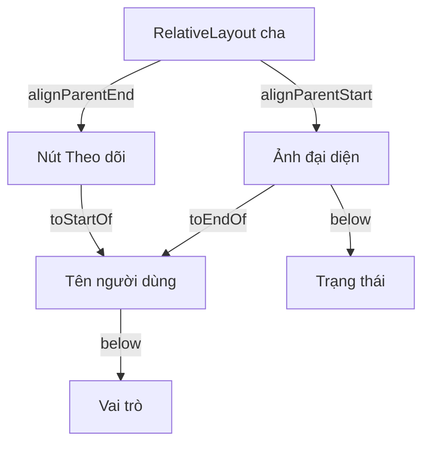
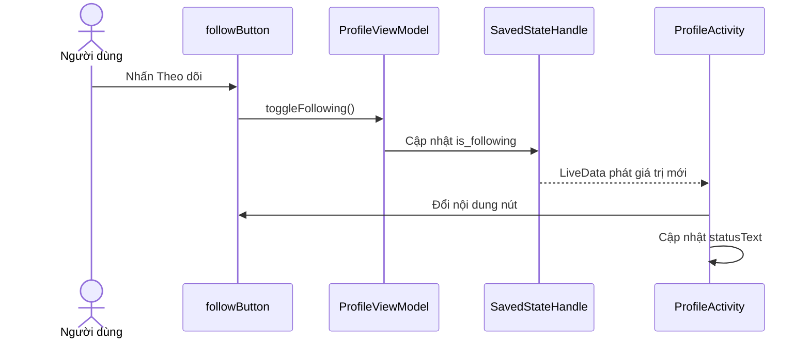
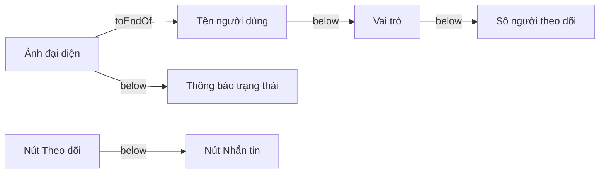

# 003 — RelativeLayout

**Học phần:** 02 — App Components and User Interface
**Module:** Module 04 — Interface and Navigation
**Nhóm nội dung:** Traditional Layouts
**Nguồn roadmap:** Interface and Navigation / Traditional Layouts
**Loại bài:** UI
**Thứ tự trong module:** 003
**Thời lượng gợi ý:** 30 phút

---

## 1. Tóm tắt


`RelativeLayout` là một `ViewGroup` dùng để định vị các thành phần giao diện:

* Tương đối với **layout cha**.
* Tương đối với **một View khác**.
* Căn theo cạnh trên, dưới, đầu, cuối hoặc tâm.
* Đặt một View bên dưới, phía trước hoặc phía sau một View khác.

Ví dụ, ảnh đại diện có thể nằm ở đầu màn hình, tên người dùng nằm bên cạnh ảnh và nút theo dõi nằm sát cuối màn hình.

Android hiện vẫn cung cấp `RelativeLayout`; lớp này không bị đánh dấu deprecated. Tuy nhiên, tài liệu Android khuyến nghị dùng `ConstraintLayout` cho các màn hình lớn hoặc phức tạp vì nó linh hoạt hơn, hỗ trợ công cụ thiết kế tốt hơn và cũng duy trì được hệ phân cấp View phẳng. ([Android Developers][1])

> **Kết luận ngắn:** `RelativeLayout` phù hợp để học cách các View phụ thuộc vị trí vào nhau và để bảo trì những dự án Android Views cũ. Với màn hình mới, phức tạp hoặc responsive, nên cân nhắc `ConstraintLayout` hoặc Jetpack Compose.

---

## 2. Mục tiêu học tập


Sau bài học, anh có thể:

* Giải thích `RelativeLayout` bằng ngôn ngữ của mình.
* Phân biệt quan hệ giữa View với **parent** và quan hệ giữa các **sibling View**.
* Sử dụng các thuộc tính như:

  * `android:layout_below`
  * `android:layout_above`
  * `android:layout_toStartOf`
  * `android:layout_toEndOf`
  * `android:layout_alignParentStart`
  * `android:layout_alignParentEnd`
  * `android:layout_centerInParent`
* Tạo một màn hình nhỏ bằng XML và Kotlin.
* Thay đổi trạng thái giao diện khi người dùng tương tác.
* Kiểm tra việc giữ trạng thái sau khi xoay màn hình.
* Phát hiện bố cục bị chồng lấn hoặc lồng quá sâu.
* Đưa screenshot, mã nguồn, test và README vào portfolio.

Trong `RelativeLayout`, mỗi View cần một ID rõ ràng nếu các View khác phải tham chiếu đến nó. ID duy nhất cũng giúp Android tự động lưu và khôi phục một số trạng thái View khi `Activity` được tái tạo. ([Android Developers][1])

---

## 3. Khái niệm chính


### 3.1. RelativeLayout là gì?

`RelativeLayout` kế thừa từ `ViewGroup`. Nó đo kích thước các View con và xác định vị trí của chúng dựa trên một tập hợp quy tắc tương đối.

Mỗi View con có thể được định vị theo hai nhóm quan hệ chính:

```text
RelativeLayout
├── Quan hệ với parent
│   ├── Căn đầu hoặc cuối
│   ├── Căn trên hoặc dưới
│   └── Căn giữa
│
└── Quan hệ với sibling View
    ├── Nằm dưới hoặc trên
    ├── Nằm trước hoặc sau
    └── Căn cạnh với View khác
```

Theo mặc định, nếu không có quy tắc định vị phù hợp, các View con có xu hướng được đặt ở khu vực trên và đầu của layout. Vì vậy, mỗi View nên có các quy tắc vị trí đủ rõ ràng. ([Android Developers][1])

### 3.2. Sơ đồ quan hệ giữa các View



Trong ví dụ này:

* Ảnh đại diện được căn với đầu của layout cha.
* Nút theo dõi được căn với cuối của layout cha.
* Tên nằm sau ảnh nhưng trước nút theo dõi.
* Vai trò nằm dưới tên.
* Trạng thái nằm dưới ảnh đại diện.

### 3.3. Các thuộc tính thường dùng

| Thuộc tính                 | Ý nghĩa                                            |
| -------------------------- | -------------------------------------------------- |
| `layout_alignParentTop`    | Căn cạnh trên của View với cạnh trên của parent    |
| `layout_alignParentBottom` | Căn cạnh dưới của View với cạnh dưới của parent    |
| `layout_alignParentStart`  | Căn View về phía bắt đầu của parent                |
| `layout_alignParentEnd`    | Căn View về phía kết thúc của parent               |
| `layout_centerHorizontal`  | Căn giữa theo chiều ngang                          |
| `layout_centerVertical`    | Căn giữa theo chiều dọc                            |
| `layout_centerInParent`    | Căn giữa cả hai chiều                              |
| `layout_below`             | Đặt View bên dưới một View khác                    |
| `layout_above`             | Đặt View phía trên một View khác                   |
| `layout_toStartOf`         | Đặt View trước một View khác theo layout direction |
| `layout_toEndOf`           | Đặt View sau một View khác theo layout direction   |
| `layout_alignStart`        | Căn cạnh bắt đầu với View được tham chiếu          |
| `layout_alignEnd`          | Căn cạnh kết thúc với View được tham chiếu         |
| `layout_alignTop`          | Căn cạnh trên với View được tham chiếu             |
| `layout_alignBottom`       | Căn cạnh dưới với View được tham chiếu             |

Các thuộc tính quan hệ với sibling nhận ID của View làm giá trị, ví dụ:

```xml
android:layout_below="@id/avatarImage"
```

Các thuộc tính quan hệ với parent thường nhận giá trị boolean:

```xml
android:layout_alignParentEnd="true"
```

API của `RelativeLayout.LayoutParams` hỗ trợ cả thuộc tính vật lý như `left/right` và thuộc tính theo hướng giao diện như `start/end`. Trong ứng dụng hỗ trợ nhiều ngôn ngữ, nên ưu tiên `start/end` để bố cục thích nghi tốt hơn với ngôn ngữ viết từ phải sang trái. ([Android Developers][2])

### 3.4. Phân biệt `@+id` và `@id`

#### Khởi tạo ID mới

```xml
android:id="@+id/avatarImage"
```

Dấu `+` yêu cầu Android tạo ID mới trong bảng tài nguyên.

#### Tham chiếu ID đã có

```xml
android:layout_below="@id/avatarImage"
```

Không sử dụng dấu `+` khi chỉ muốn tham chiếu một ID đã được khai báo.

### 3.5. Thứ tự khai báo View

Các quan hệ trong `RelativeLayout` được giải quyết dựa trên ID, không hoàn toàn phụ thuộc vào thứ tự View xuất hiện trong XML. Vì vậy, một View có thể tham chiếu đến View được khai báo sau nó, miễn là ID được tạo đúng cách. Tuy nhiên, sắp xếp XML theo thứ tự đọc tự nhiên vẫn giúp mã dễ bảo trì hơn. ([Android Developers][1])

### 3.6. Khi nào nên dùng?

`RelativeLayout` có thể phù hợp khi:

* Bảo trì một dự án Android Views cũ.
* Giao diện có ít thành phần.
* Các quan hệ vị trí tương đối khá đơn giản.
* Muốn thay thế một số `LinearLayout` lồng nhau bằng một layout phẳng hơn.
* Làm bài tập để hiểu cách View đo và định vị lẫn nhau.

Nên cân nhắc `ConstraintLayout` khi:

* Màn hình có nhiều quan hệ phức tạp.
* Cần responsive trên điện thoại, tablet hoặc màn hình gập.
* Cần guideline, barrier, chain hoặc tỉ lệ kích thước.
* Nhiều View có thể thay đổi kích thước hay trạng thái hiển thị.
* Cần thiết kế trực quan trong Layout Editor.

Android mô tả `ConstraintLayout` là giải pháp tương tự `RelativeLayout` về cách tạo quan hệ giữa View, nhưng linh hoạt hơn và tích hợp tốt hơn với Layout Editor. ([Android Developers][3])

### 3.7. So sánh các Traditional Layout

| Layout             | Cách bố trí chính                    | Trường hợp phù hợp                   |
| ------------------ | ------------------------------------ | ------------------------------------ |
| `FrameLayout`      | Xếp chồng các View                   | Fragment container, overlay, loading |
| `LinearLayout`     | Theo một hàng hoặc một cột           | Form và nhóm nút đơn giản            |
| `RelativeLayout`   | Theo quan hệ với parent hoặc sibling | Màn hình nhỏ có quan hệ tương đối    |
| `ConstraintLayout` | Theo hệ thống constraint             | Màn hình responsive hoặc phức tạp    |

### 3.8. RelativeLayout không quản lý trạng thái

`RelativeLayout` chỉ chịu trách nhiệm đo và sắp xếp View. Nó không quyết định:

* Người dùng đã theo dõi tài khoản hay chưa.
* Dữ liệu đã tải xong hay chưa.
* Form có hợp lệ hay không.
* Trạng thái có được giữ lại sau khi xoay màn hình hay không.

Trạng thái nên được quản lý bởi `ViewModel`, `SavedStateHandle`, saved instance state hoặc tầng dữ liệu thích hợp. UI đọc trạng thái và hiển thị kết quả; sự kiện từ UI được gửi ngược về state holder để xử lý. ([Android Developers][4])

---

## 4. Thực hành


### 4.1. Yêu cầu bài thực hành

Xây dựng màn hình hồ sơ nhỏ gồm:

* Ảnh đại diện.
* Tên người dùng.
* Vai trò.
* Nút `Theo dõi`.
* Dòng thông báo trạng thái.
* Trạng thái theo dõi không bị mất khi xoay màn hình.

### 4.2. Cấu trúc thư mục

```text
app/
├── src/main/java/com/example/relativelayout/
│   ├── ProfileActivity.kt
│   └── ProfileViewModel.kt
│
├── src/main/res/layout/
│   └── activity_profile.xml
│
├── src/main/res/drawable/
│   └── ic_person.xml
│
└── src/main/res/values/
    └── strings.xml
```

### 4.3. Bật View Binding

Trong `app/build.gradle.kts`:

```kotlin
android {
    buildFeatures {
        viewBinding = true
    }
}
```

### 4.4. Tạo Vector Asset

Trong Android Studio:

```text
res/drawable
→ New
→ Vector Asset
→ Chọn biểu tượng Person
→ Đặt tên ic_person
```

### 4.5. Tạo layout XML

Tệp `res/layout/activity_profile.xml`:

```xml
<?xml version="1.0" encoding="utf-8"?>
<RelativeLayout
    xmlns:android="http://schemas.android.com/apk/res/android"
    android:id="@+id/profileRoot"
    android:layout_width="match_parent"
    android:layout_height="match_parent"
    android:padding="24dp">

    <ImageView
        android:id="@+id/avatarImage"
        android:layout_width="72dp"
        android:layout_height="72dp"
        android:layout_alignParentStart="true"
        android:layout_alignParentTop="true"
        android:contentDescription="@string/profile_avatar_description"
        android:padding="12dp"
        android:src="@drawable/ic_person" />

    <Button
        android:id="@+id/followButton"
        android:layout_width="wrap_content"
        android:layout_height="wrap_content"
        android:layout_alignParentEnd="true"
        android:layout_alignTop="@id/avatarImage"
        android:minHeight="48dp"
        android:text="@string/follow" />

    <TextView
        android:id="@+id/nameText"
        android:layout_width="match_parent"
        android:layout_height="wrap_content"
        android:layout_alignTop="@id/avatarImage"
        android:layout_marginStart="16dp"
        android:layout_marginEnd="12dp"
        android:layout_toEndOf="@id/avatarImage"
        android:layout_toStartOf="@id/followButton"
        android:text="@string/profile_name"
        android:textSize="20sp"
        android:textStyle="bold" />

    <TextView
        android:id="@+id/roleText"
        android:layout_width="match_parent"
        android:layout_height="wrap_content"
        android:layout_below="@id/nameText"
        android:layout_alignStart="@id/nameText"
        android:layout_alignEnd="@id/nameText"
        android:layout_marginTop="4dp"
        android:text="@string/profile_role"
        android:textSize="14sp" />

    <TextView
        android:id="@+id/statusText"
        android:layout_width="match_parent"
        android:layout_height="wrap_content"
        android:layout_below="@id/avatarImage"
        android:layout_alignParentStart="true"
        android:layout_alignParentEnd="true"
        android:layout_marginTop="24dp"
        android:accessibilityLiveRegion="polite"
        android:text="@string/not_following_status"
        android:textSize="16sp" />

</RelativeLayout>
```

### 4.6. Tạo tài nguyên chuỗi

Tệp `res/values/strings.xml`:

```xml
<resources>
    <string name="app_name">RelativeLayout Demo</string>

    <string name="profile_name">Trần An Khánh</string>
    <string name="profile_role">Android Developer</string>
    <string name="profile_avatar_description">
        Ảnh đại diện của Trần An Khánh
    </string>

    <string name="follow">Theo dõi</string>
    <string name="unfollow">Bỏ theo dõi</string>

    <string name="following_status">
        Bạn đang theo dõi tài khoản này.
    </string>

    <string name="not_following_status">
        Bạn chưa theo dõi tài khoản này.
    </string>
</resources>
```

Đưa văn bản vào `strings.xml` giúp hỗ trợ dịch thuật, tái sử dụng tài nguyên và tránh hard-code chuỗi trong layout hoặc Kotlin.

### 4.7. Tạo ViewModel

Tệp `ProfileViewModel.kt`:

```kotlin
package com.example.relativelayout

import androidx.lifecycle.LiveData
import androidx.lifecycle.SavedStateHandle
import androidx.lifecycle.ViewModel

class ProfileViewModel(
    private val savedStateHandle: SavedStateHandle
) : ViewModel() {

    val isFollowing: LiveData<Boolean> =
        savedStateHandle.getLiveData(IS_FOLLOWING_KEY, false)

    fun toggleFollowing() {
        val currentValue = isFollowing.value ?: false
        savedStateHandle[IS_FOLLOWING_KEY] = !currentValue
    }

    companion object {
        private const val IS_FOLLOWING_KEY = "is_following"
    }
}
```

`ViewModel` giữ trạng thái qua configuration change, còn `SavedStateHandle` hỗ trợ khôi phục trạng thái nhỏ sau khi tiến trình bị hệ thống tạo lại. Android khuyến nghị `ViewModel` cho trạng thái cấp màn hình và sử dụng saved state cho lượng dữ liệu nhỏ cần tái tạo UI. ([Android Developers][4])

### 4.8. Kết nối Activity với ViewModel

Tệp `ProfileActivity.kt`:

```kotlin
package com.example.relativelayout

import android.os.Bundle
import androidx.activity.viewModels
import androidx.appcompat.app.AppCompatActivity
import com.example.relativelayout.databinding.ActivityProfileBinding

class ProfileActivity : AppCompatActivity() {

    private lateinit var binding: ActivityProfileBinding

    private val viewModel: ProfileViewModel by viewModels()

    override fun onCreate(savedInstanceState: Bundle?) {
        super.onCreate(savedInstanceState)

        binding = ActivityProfileBinding.inflate(layoutInflater)
        setContentView(binding.root)

        observeUiState()
        setupListeners()
    }

    private fun observeUiState() {
        viewModel.isFollowing.observe(this) { isFollowing ->
            renderFollowingState(isFollowing)
        }
    }

    private fun setupListeners() {
        binding.followButton.setOnClickListener {
            viewModel.toggleFollowing()
        }
    }

    private fun renderFollowingState(isFollowing: Boolean) {
        binding.followButton.setText(
            if (isFollowing) {
                R.string.unfollow
            } else {
                R.string.follow
            }
        )

        binding.statusText.setText(
            if (isFollowing) {
                R.string.following_status
            } else {
                R.string.not_following_status
            }
        )

        binding.followButton.isSelected = isFollowing
    }
}
```

### 4.9. Luồng cập nhật trạng thái



### 4.10. Kết quả mong đợi

Trước khi nhấn nút:

```text
[Avatar] Trần An Khánh          [Theo dõi]
         Android Developer

Bạn chưa theo dõi tài khoản này.
```

Sau khi nhấn nút:

```text
[Avatar] Trần An Khánh       [Bỏ theo dõi]
         Android Developer

Bạn đang theo dõi tài khoản này.
```

Khi xoay thiết bị, trạng thái `Đang theo dõi` phải được giữ lại.

---

## 5. Bài tập


### Bài tập chính

Mở rộng màn hình hồ sơ với các yêu cầu sau:

1. Thêm nút `Nhắn tin` bên dưới nút theo dõi.
2. Thêm số lượng người theo dõi dưới tên người dùng.
3. Thêm trạng thái `Đang xử lý…` trong 1 giây trước khi thay đổi kết quả.
4. Giữ trạng thái khi xoay thiết bị.
5. Không để tên dài chồng lên nút.
6. Hỗ trợ font scale lớn.
7. Chụp screenshot ở chế độ sáng và tối.

### Gợi ý bố cục



### Kiểm thử Espresso cơ bản

Tệp `ProfileActivityTest.kt`:

```kotlin
package com.example.relativelayout

import androidx.test.core.app.ActivityScenario
import androidx.test.espresso.Espresso.onView
import androidx.test.espresso.action.ViewActions.click
import androidx.test.espresso.assertion.ViewAssertions.matches
import androidx.test.espresso.matcher.ViewMatchers.withId
import androidx.test.espresso.matcher.ViewMatchers.withText
import androidx.test.ext.junit.runners.AndroidJUnit4
import org.junit.Test
import org.junit.runner.RunWith

@RunWith(AndroidJUnit4::class)
class ProfileActivityTest {

    @Test
    fun clickFollow_updatesButtonAndStatus() {
        ActivityScenario.launch(ProfileActivity::class.java)

        onView(withId(R.id.followButton))
            .perform(click())

        onView(withId(R.id.followButton))
            .check(matches(withText(R.string.unfollow)))

        onView(withId(R.id.statusText))
            .check(matches(withText(R.string.following_status)))
    }

    @Test
    fun followingState_survivesActivityRecreation() {
        val scenario =
            ActivityScenario.launch(ProfileActivity::class.java)

        onView(withId(R.id.followButton))
            .perform(click())

        scenario.recreate()

        onView(withId(R.id.followButton))
            .check(matches(withText(R.string.unfollow)))

        onView(withId(R.id.statusText))
            .check(matches(withText(R.string.following_status)))
    }
}
```

### Checklist kiểm thử thủ công

| Trường hợp         | Thao tác                | Kết quả mong đợi          |
| ------------------ | ----------------------- | ------------------------- |
| Trạng thái ban đầu | Mở màn hình             | Hiển thị `Theo dõi`       |
| Theo dõi           | Nhấn nút                | Đổi thành `Bỏ theo dõi`   |
| Bỏ theo dõi        | Nhấn lần nữa            | Trở lại `Theo dõi`        |
| Xoay màn hình      | Theo dõi rồi xoay       | Trạng thái được giữ       |
| Font lớn           | Đặt font 200%           | Không chồng chữ           |
| Tên dài            | Thay tên rất dài        | Không đè lên nút          |
| RTL                | Ép layout direction RTL | Các View đảo hướng hợp lý |
| TalkBack           | Bật trình đọc màn hình  | Nút và ảnh được đọc đúng  |
| Dark Mode          | Chuyển theme tối        | Nội dung vẫn dễ đọc       |

Layout Inspector cho phép quan sát cây View khi ứng dụng đang chạy và giúp phát hiện layout lồng sâu, View bị chồng hoặc kích thước không đúng dự kiến. ([Android Developers][5])

---

## 6. Checklist hoàn thành


### Kiến thức

* [ ] Giải thích được `RelativeLayout` là một `ViewGroup`.
* [ ] Phân biệt quan hệ với parent và sibling.
* [ ] Biết sử dụng `layout_below`.
* [ ] Biết sử dụng `layout_toStartOf` và `layout_toEndOf`.
* [ ] Biết sử dụng `layout_alignParentStart` và `layout_alignParentEnd`.
* [ ] Hiểu vai trò của ID trong quan hệ giữa các View.
* [ ] Biết vì sao nên ưu tiên `start/end` thay vì `left/right`.

### Thực hành

* [ ] Tạo được layout XML bằng `RelativeLayout`.
* [ ] Kết nối XML với Kotlin qua View Binding.
* [ ] Có ít nhất một thay đổi trạng thái.
* [ ] Trạng thái được quản lý ngoài layout.
* [ ] Không để View chồng lên nhau.
* [ ] Không hard-code chuỗi hiển thị.
* [ ] Có content description cho ảnh mang ý nghĩa.
* [ ] Đã kiểm tra khi xoay màn hình.

### Kiểm thử và debugging

* [ ] Có test cho trạng thái ban đầu.
* [ ] Có test sau khi nhấn nút.
* [ ] Có test sau khi tái tạo `Activity`.
* [ ] Đã chạy Android Lint.
* [ ] Đã xem màn hình bằng Layout Inspector.
* [ ] Đã kiểm tra với font lớn.
* [ ] Đã kiểm tra chế độ RTL.
* [ ] Đã kiểm tra TalkBack hoặc Accessibility Scanner.

Android khuyến nghị dùng lint để tìm các vấn đề như parent không cần thiết, layout lồng quá sâu hoặc cấu trúc View chưa tối ưu. Layout phẳng thường dễ đo, vẽ và bảo trì hơn layout có quá nhiều tầng lồng nhau. ([Android Developers][5])

### Artifact cho portfolio

* [ ] `activity_profile.xml`
* [ ] `ProfileActivity.kt`
* [ ] `ProfileViewModel.kt`
* [ ] `ProfileActivityTest.kt`
* [ ] Screenshot trước và sau khi theo dõi
* [ ] GIF hoặc video ngắn thể hiện thao tác
* [ ] README mô tả các quan hệ RelativeLayout
* [ ] Checklist accessibility và responsive

README có thể trình bày:

```markdown
# RelativeLayout Profile Demo

## Mục tiêu

Minh họa cách định vị View tương đối với parent và sibling
bằng RelativeLayout.

## Quan hệ chính

- Avatar căn theo đầu của parent.
- Nút theo dõi căn theo cuối của parent.
- Tên nằm sau avatar và trước nút.
- Vai trò nằm dưới tên.
- Trạng thái nằm dưới avatar.

## State

Trạng thái theo dõi được giữ trong ViewModel và SavedStateHandle.

## Testing

- Kiểm tra thao tác theo dõi.
- Kiểm tra nội dung trạng thái.
- Kiểm tra Activity recreation.
```

---

## 7. Ghi chú sản xuất


### 7.1. Lifecycle và state

Khi thiết bị xoay hoặc chuyển sang một cấu hình khác, Android có thể hủy và tạo lại `Activity`. Dữ liệu chỉ lưu trong biến của `Activity` có thể bị mất.

Đối với màn hình production:

* Dùng `ViewModel` cho trạng thái cấp màn hình.
* Dùng `SavedStateHandle` hoặc saved instance state cho trạng thái nhỏ cần khôi phục.
* Dùng database hoặc local storage cho dữ liệu dài hạn.
* Mỗi View cần ID duy nhất nếu muốn hệ thống khôi phục trạng thái View tự động.
* Không lưu object lớn trong `Bundle`.

Android cho biết người dùng kỳ vọng trạng thái giao diện không thay đổi sau configuration change. Hệ thống có thể tự lưu một số trạng thái View, nhưng dữ liệu phức tạp cần được quản lý bằng `ViewModel`, saved state và storage phù hợp. ([Android Developers][6])

### 7.2. Nội dung động

Hãy kiểm tra các trường hợp:

* Tên người dùng rất dài.
* Font hệ thống được phóng lớn.
* Nút được dịch sang ngôn ngữ có chuỗi dài hơn.
* Một View chuyển sang `GONE`.
* Ảnh tải chậm hoặc tải thất bại.
* Dữ liệu chưa có hoặc trả về lỗi.
* Người dùng nhấn nút nhiều lần liên tiếp.

Không nên dựa vào kích thước cố định nếu nội dung có thể thay đổi. Đặc biệt, một `TextView` nằm giữa ảnh và nút nên có cả quy tắc `toEndOf` và `toStartOf` để giới hạn không gian.

### 7.3. Hỗ trợ RTL

Nên dùng:

```xml
android:layout_alignParentStart="true"
android:layout_alignParentEnd="true"
android:layout_toStartOf="@id/otherView"
android:layout_toEndOf="@id/otherView"
android:layout_marginStart="16dp"
android:layout_marginEnd="16dp"
```

Hạn chế dùng:

```xml
android:layout_alignParentLeft="true"
android:layout_alignParentRight="true"
android:layout_toLeftOf="@id/otherView"
android:layout_toRightOf="@id/otherView"
```

Các quy tắc `start/end` thay đổi theo layout direction, trong khi `left/right` luôn đại diện cho cạnh vật lý. ([Android Developers][2])

### 7.4. Accessibility

Kiểm tra:

* View có thể tương tác có vùng chạm đủ lớn.
* `ImageView` mang thông tin có `contentDescription`.
* Ảnh chỉ để trang trí có thể đặt:

```xml
android:contentDescription="@null"
android:importantForAccessibility="no"
```

* Thông báo trạng thái nên được TalkBack đọc lại:

```xml
android:accessibilityLiveRegion="polite"
```

* Không dùng vị trí hoặc màu sắc làm tín hiệu duy nhất.
* Thứ tự đọc của TalkBack phải hợp lý.
* Font lớn không làm các View chồng lên nhau.

### 7.5. Performance

Không có layout nào luôn nhanh nhất trong mọi trường hợp. Chi phí phụ thuộc vào số lượng View, số lần đo, độ sâu của cây View và tần suất layout được inflate.

Đối với production:

* Tránh nhiều ViewGroup lồng nhau không cần thiết.
* Không thêm parent chỉ để bọc một View duy nhất.
* Dùng Layout Inspector để kiểm tra cây View.
* Chạy lint trước khi release.
* Thử nghiệm trên thiết bị cấu hình thấp.
* Đặc biệt cẩn thận với layout được dùng lặp lại trong `RecyclerView`.

Android lưu ý rằng mỗi View và ViewGroup đều cần được khởi tạo, đo, bố trí và vẽ; hệ phân cấp phức tạp có thể ảnh hưởng đến bộ nhớ và độ mượt của giao diện. ([Android Developers][7])

### 7.6. Khi nào nên refactor sang ConstraintLayout?

Cân nhắc chuyển đổi nếu:

* Số lượng quan hệ giữa các View tăng nhanh.
* XML có nhiều View trung gian chỉ để căn chỉnh.
* Giao diện thường xuyên bị chồng khi dịch ngôn ngữ.
* Cần hỗ trợ tablet hoặc màn hình gập.
* Một View thay đổi `VISIBLE`, `INVISIBLE` và `GONE` thường xuyên.
* Cần guideline, barrier hoặc chain.
* Nhóm phát triển khó hiểu mạng lưới quan hệ trong XML.

`ConstraintLayout` cung cấp mô hình quan hệ tương tự nhưng linh hoạt hơn cho những giao diện lớn, phức tạp và responsive. ([Android Developers][3])

### 7.7. Release checklist

```text
[ ] Không có View bị chồng ở màn hình nhỏ
[ ] Không bị cắt chữ khi font scale 200%
[ ] Đã kiểm tra portrait và landscape
[ ] Đã kiểm tra RTL
[ ] Đã kiểm tra dark mode
[ ] Trạng thái được giữ sau Activity recreation
[ ] Không thực hiện network trực tiếp trong Activity
[ ] Có trạng thái loading, success và error nếu dùng dữ liệu
[ ] Android Lint không còn lỗi nghiêm trọng
[ ] Layout Inspector không phát hiện tầng layout dư thừa
[ ] TalkBack đọc đúng thứ tự
[ ] Có screenshot hoặc test bảo vệ hành vi chính
```

---

> **Ghi nhớ:** `RelativeLayout` quyết định **View nằm ở đâu**, không quyết định **dữ liệu là gì**. Một màn hình tốt cần kết hợp bố cục rõ ràng, state holder phù hợp, xử lý lifecycle, accessibility và kiểm thử trên nhiều cấu hình thiết bị.

[1]: https://developer.android.com/develop/ui/views/layout/relative?hl=vi "Bố cục tương đối  |  Views  |  Android Developers"
[2]: https://developer.android.com/reference/android/widget/RelativeLayout.LayoutParams.html?authuser=2 "RelativeLayout.LayoutParams  |  API reference  |  Android Developers"
[3]: https://developer.android.com/develop/ui/views/layout/constraint-layout "Build a responsive UI with ConstraintLayout  |  Views  |  Android Developers"
[4]: https://developer.android.com/topic/architecture/ui-layer "UI layer  |  App architecture  |  Android Developers"
[5]: https://developer.android.com/develop/ui/views/layout/improving-layouts/optimizing-layouts "Optimize layout hierarchies  |  Views  |  Android Developers"
[6]: https://developer.android.com/topic/libraries/architecture/views/activity-lifecycle-views "The activity lifecycle (Views)  |  Android Developers"
[7]: https://developer.android.com/develop/ui/views/layout/improving-layouts/optimizing-layouts?utm_source=chatgpt.com "Optimize layout hierarchies  |  Views  |  Android Developers"
