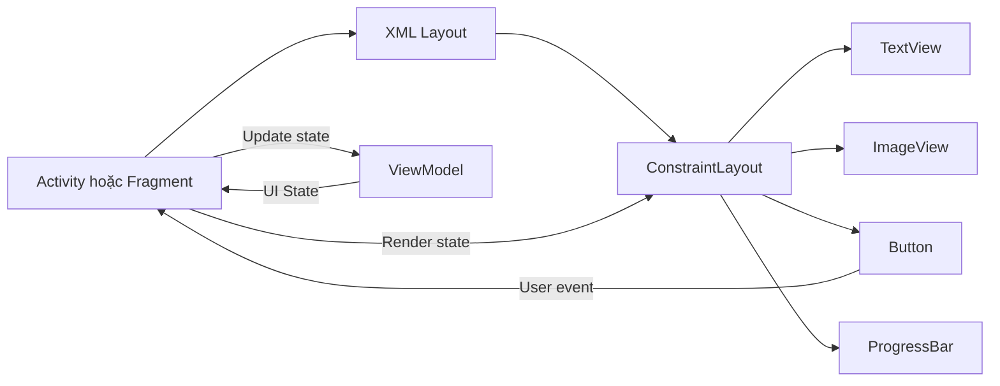
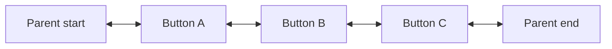
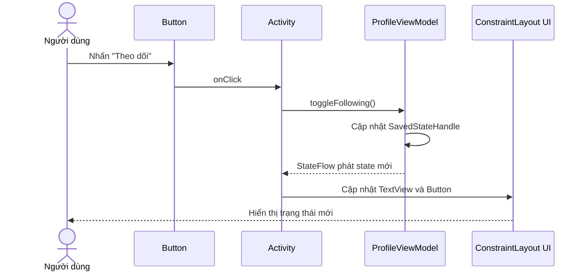

# 004 - ConstraintLayout

| Thông tin               | Nội dung                                       |
| ----------------------- | ---------------------------------------------- |
| **Học phần**            | 02 - App Components and User Interface         |
| **Module**              | Module 04 - Interface and Navigation           |
| **Nhóm nội dung**       | Traditional Layouts                            |
| **Nguồn roadmap**       | Interface and Navigation / Traditional Layouts |
| **Loại bài**            | UI                                             |
| **Thứ tự trong module** | 004                                            |
| **Thời lượng gợi ý**    | 30 phút                                        |

> [!IMPORTANT]
> Trong Android năm 2026, `ConstraintLayout` vẫn rất quan trọng đối với các dự án sử dụng **XML và View system**. Tuy nhiên, thư viện ConstraintLayout cho View hiện ở chế độ bảo trì và Android khuyến nghị **Jetpack Compose** cho giao diện mới. Vì vậy, anh nên học ConstraintLayout để làm việc với codebase XML, bảo trì ứng dụng cũ và hiểu tư duy bố cục theo ràng buộc.

---

## 1. Tóm tắt


`ConstraintLayout` là một `ViewGroup` thuộc Android Jetpack, cho phép xác định vị trí và kích thước của các `View` dựa trên **mối quan hệ ràng buộc** giữa:

* View và layout cha.
* View và View anh em.
* View và `Guideline`.
* View và `Barrier`.
* Các View nằm trong `Chain`.

Khác với việc lồng nhiều `LinearLayout`, `ConstraintLayout` có thể xây dựng giao diện phức tạp với cây View tương đối phẳng. Nó linh hoạt hơn `RelativeLayout` và được tích hợp trực tiếp với Layout Editor của Android Studio.

### ConstraintLayout nằm ở đâu trong ứng dụng?



`ConstraintLayout` chỉ chịu trách nhiệm về **bố cục giao diện**. Nó không nên trực tiếp xử lý:

* Nghiệp vụ.
* Gọi API.
* Truy vấn cơ sở dữ liệu.
* Điều hướng phức tạp.
* Lưu trạng thái lâu dài.

Những phần này nên được xử lý bởi `Activity`, `Fragment`, `ViewModel`, repository hoặc các thành phần kiến trúc phù hợp.

### Giá trị thực tế

Một lập trình viên Android cần biết ConstraintLayout để:

* Đọc và bảo trì màn hình XML hiện có.
* Xây dựng màn hình responsive mà không lồng quá nhiều layout.
* Xử lý văn bản dài, nhiều ngôn ngữ và kích thước màn hình khác nhau.
* Phát hiện View bị thiếu constraint.
* Kiểm tra UI khi xoay màn hình hoặc thay đổi trạng thái.
* Phân tích cây giao diện bằng Layout Inspector.

---

## 2. Mục tiêu học tập


Sau khi hoàn thành bài này, anh có thể:

* Giải thích ConstraintLayout bằng ngôn ngữ của mình.
* Phân biệt ConstraintLayout với `LinearLayout`, `FrameLayout` và `RelativeLayout`.
* Xác định constraint theo chiều ngang và chiều dọc.
* Sử dụng `start`, `end`, `top`, `bottom` và `baseline`.
* Hiểu ý nghĩa của `0dp` trong ConstraintLayout.
* Sử dụng margin, bias và dimension ratio.
* Sử dụng `Guideline`, `Barrier` và `Chain`.
* Kết nối UI với state từ `ViewModel`.
* Kiểm tra trạng thái sau khi Activity được tạo lại.
* Viết một UI test cơ bản bằng Espresso.
* Chuẩn bị screenshot, README và checklist để đưa vào portfolio.

### Tiêu chí đạt bài

Anh hoàn thành bài khi có thể giải thích được câu sau:

> Mỗi View trong ConstraintLayout cần đủ thông tin để hệ thống xác định vị trí của nó theo cả trục ngang và trục dọc.

Theo tài liệu Android, mỗi View thông thường cần ít nhất một constraint ngang và một constraint dọc. View không có constraint vẫn có thể trông đúng trong Layout Editor nhưng có thể bị đặt về góc trên bên trái khi chạy ứng dụng.

---

## 3. Khái niệm chính


### 3.1. Mô hình tư duy

Hãy xem mỗi View là một vật thể có các điểm neo:

```text
             TOP
              │
       ┌─────────────┐
START ─┤    VIEW     ├─ END
       └─────────────┘
              │
            BOTTOM
```

Đối với `TextView`, còn có một điểm đặc biệt là `baseline`:

```text
TextView A:  Xin chào
                  ───────── baseline

TextView B:  20 tuổi
                  ───────── baseline
```

Constraint không có nghĩa là View phải chạm vào View khác. Nó chỉ mô tả quan hệ như:

* Cạnh trên của A nằm dưới cạnh dưới của B.
* Cạnh bắt đầu của A trùng với cạnh bắt đầu của parent.
* Baseline của A trùng với baseline của B.
* A nằm giữa hai cạnh của parent.
* A chiếm toàn bộ phần không gian còn lại.

### 3.2. Các constraint cơ bản

| Thuộc tính                               | Ý nghĩa                               |
| ---------------------------------------- | ------------------------------------- |
| `layout_constraintStart_toStartOf`       | Cạnh bắt đầu nối với cạnh bắt đầu     |
| `layout_constraintStart_toEndOf`         | Cạnh bắt đầu nối với cạnh kết thúc    |
| `layout_constraintEnd_toStartOf`         | Cạnh kết thúc nối với cạnh bắt đầu    |
| `layout_constraintEnd_toEndOf`           | Cạnh kết thúc nối với cạnh kết thúc   |
| `layout_constraintTop_toTopOf`           | Cạnh trên nối với cạnh trên           |
| `layout_constraintTop_toBottomOf`        | Cạnh trên nằm dưới cạnh dưới          |
| `layout_constraintBottom_toTopOf`        | Cạnh dưới nằm trên cạnh trên          |
| `layout_constraintBottom_toBottomOf`     | Cạnh dưới nối với cạnh dưới           |
| `layout_constraintBaseline_toBaselineOf` | Căn đường cơ sở của hai View chứa chữ |

Ví dụ căn một nút giữa màn hình:

```xml
<Button
    android:id="@+id/centerButton"
    android:layout_width="wrap_content"
    android:layout_height="wrap_content"
    android:text="Tiếp tục"
    app:layout_constraintBottom_toBottomOf="parent"
    app:layout_constraintEnd_toEndOf="parent"
    app:layout_constraintStart_toStartOf="parent"
    app:layout_constraintTop_toTopOf="parent" />
```

### 3.3. Dùng `start` và `end` thay cho `left` và `right`

Nên ưu tiên:

```xml
app:layout_constraintStart_toStartOf="parent"
app:layout_constraintEnd_toEndOf="parent"
```

Thay vì:

```xml
app:layout_constraintLeft_toLeftOf="parent"
app:layout_constraintRight_toRightOf="parent"
```

`start` và `end` hỗ trợ tốt hơn cho các ngôn ngữ viết từ phải sang trái như tiếng Ả Rập hoặc tiếng Hebrew.

### 3.4. Baseline constraint


Baseline constraint hữu ích khi hai `TextView` có kích thước chữ khác nhau:

```xml
<TextView
    android:id="@+id/price"
    android:layout_width="wrap_content"
    android:layout_height="wrap_content"
    android:text="250.000"
    android:textSize="28sp"
    app:layout_constraintStart_toStartOf="parent"
    app:layout_constraintTop_toTopOf="parent" />

<TextView
    android:id="@+id/currency"
    android:layout_width="wrap_content"
    android:layout_height="wrap_content"
    android:text="VNĐ"
    android:textSize="14sp"
    app:layout_constraintBaseline_toBaselineOf="@id/price"
    app:layout_constraintStart_toEndOf="@id/price" />
```

Căn theo `top` có thể khiến hai đoạn chữ trông lệch. Căn theo `baseline` giúp chữ nằm tự nhiên trên cùng một dòng.

### 3.5. `wrap_content`, kích thước cố định và `0dp`

Trong ConstraintLayout, ba chế độ kích thước thường gặp là:

| Giá trị            | Hành vi                                        |
| ------------------ | ---------------------------------------------- |
| `wrap_content`     | Vừa đủ chứa nội dung                           |
| `72dp`, `200dp`... | Kích thước cố định                             |
| `0dp`              | Match constraints, mở rộng theo các constraint |

Ví dụ cho `TextView` chiếm toàn bộ phần ngang còn lại:

```xml
<TextView
    android:id="@+id/title"
    android:layout_width="0dp"
    android:layout_height="wrap_content"
    app:layout_constraintEnd_toEndOf="parent"
    app:layout_constraintStart_toEndOf="@id/thumbnail"
    app:layout_constraintTop_toTopOf="@id/thumbnail" />
```

> [!WARNING]
> Không dùng `match_parent` cho View con bên trong ConstraintLayout. Hãy dùng `0dp` và constraint View vào hai cạnh tương ứng. Đây là chế độ **match constraints**.

### 3.6. Bias

Khi một View được constraint vào hai phía đối diện nhưng không giãn ra, nó mặc định nằm giữa với bias `0.5`.

```xml
app:layout_constraintHorizontal_bias="0.25"
```

Minh họa:

```text
Bias 0.0                 Bias 0.5                 Bias 1.0
┌──────────────┐         ┌──────────────┐         ┌──────────────┐
│[View]        │         │    [View]    │         │        [View]│
└──────────────┘         └──────────────┘         └──────────────┘
```

Bias chỉ phát huy tác dụng khi View có constraint ở cả hai phía trên cùng một trục.

### 3.7. Dimension ratio


Dùng ratio khi cần giữ tỷ lệ ảnh hoặc video:

```xml
<ImageView
    android:id="@+id/bannerImage"
    android:layout_width="0dp"
    android:layout_height="0dp"
    android:scaleType="centerCrop"
    app:layout_constraintDimensionRatio="16:9"
    app:layout_constraintEnd_toEndOf="parent"
    app:layout_constraintStart_toStartOf="parent"
    app:layout_constraintTop_toTopOf="parent" />
```

Ít nhất một chiều phải dùng `0dp` để ConstraintLayout có thể tính kích thước dựa trên ratio.

### 3.8. Guideline


`Guideline` là đường vô hình dùng làm mốc bố cục. Nó có thể được đặt theo:

* Khoảng cách tính bằng `dp`.
* Khoảng cách từ cuối parent.
* Tỷ lệ phần trăm chiều rộng hoặc chiều cao.

Ví dụ Guideline dọc tại 35% màn hình:

```xml
<androidx.constraintlayout.widget.Guideline
    android:id="@+id/contentGuideline"
    android:layout_width="wrap_content"
    android:layout_height="wrap_content"
    android:orientation="vertical"
    app:layout_constraintGuide_percent="0.35" />
```

Sau đó constraint một View vào Guideline:

```xml
app:layout_constraintStart_toStartOf="@id/contentGuideline"
```

Guideline không xuất hiện khi ứng dụng chạy.

### 3.9. Barrier


`Barrier` cũng là một đường vô hình, nhưng vị trí của nó được tính từ một nhóm View.

Ví dụ một nhãn có thể là `"Tên"` hoặc `"Tên người nhận thanh toán"`. Nếu đặt ô dữ liệu ngay sau một TextView cụ thể, nội dung dài có thể đè lên nhau. Barrier sẽ tự đặt tại cạnh xa nhất của tất cả nhãn.

```xml
<androidx.constraintlayout.widget.Barrier
    android:id="@+id/labelBarrier"
    android:layout_width="wrap_content"
    android:layout_height="wrap_content"
    app:barrierDirection="end"
    app:constraint_referenced_ids="nameLabel,emailLabel,phoneLabel" />
```

```xml
<EditText
    android:id="@+id/nameInput"
    android:layout_width="0dp"
    android:layout_height="wrap_content"
    app:layout_constraintEnd_toEndOf="parent"
    app:layout_constraintStart_toEndOf="@id/labelBarrier" />
```

Barrier đặc biệt hữu ích cho:

* Giao diện đa ngôn ngữ.
* Nội dung có độ dài không xác định.
* TextView thay đổi theo state.
* Form có nhiều nhãn.

Barrier tự di chuyển theo View có kích thước xa nhất trong nhóm tham chiếu.

### 3.10. Chain


Chain là một nhóm View được liên kết hai chiều trên cùng một trục.



Các kiểu Chain:

| Kiểu            | Hành vi                           |
| --------------- | --------------------------------- |
| `spread`        | Khoảng trống được phân bố đều     |
| `spread_inside` | View đầu và cuối bám vào hai cạnh |
| `packed`        | Các View nằm sát thành một nhóm   |
| Weighted        | Chia kích thước theo trọng số     |

Ví dụ:

```xml
app:layout_constraintHorizontal_chainStyle="spread_inside"
```

Chain style được đặt tại **View đầu chuỗi**, còn gọi là chain head.

### 3.11. So sánh với các layout khác

| Layout                         | Phù hợp với                                             |
| ------------------------------ | ------------------------------------------------------- |
| `FrameLayout`                  | Xếp chồng View, Fragment container, overlay đơn giản    |
| `LinearLayout`                 | Danh sách View theo một chiều, bố cục nhỏ               |
| `RelativeLayout`               | Bố cục tương đối cũ, ít nên dùng cho màn hình mới       |
| `ConstraintLayout`             | Màn hình XML phức tạp, cần responsive và cây View phẳng |
| Compose `Row`, `Column`, `Box` | Giao diện Android hiện đại viết bằng Kotlin             |

Trong View system, cây View phẳng từng là lợi thế lớn của ConstraintLayout. Trong Compose, việc lồng nhiều `Row`, `Column` và `Box` không tạo ra cùng loại chi phí như cây View truyền thống, nên ConstraintLayout không phải lúc nào cũng mang lại lợi ích rõ rệt trong Compose.

---

## 4. Thực hành


### 4.1. Yêu cầu bài thực hành

Xây dựng màn hình hồ sơ nhỏ gồm:

* Ảnh đại diện.
* Tên người dùng.
* Vai trò.
* Trạng thái theo dõi.
* Nút bật hoặc tắt theo dõi.
* State vẫn được giữ sau khi Activity được tạo lại.

Kết quả dự kiến:

```text
┌─────────────────────────────────┐
│  ┌────────┐  Trần An Khánh      │
│  │ Avatar │  Android Developer  │
│  └────────┘                     │
│                                 │
│  Bạn chưa theo dõi tài khoản.   │
│                                 │
│  [           THEO DÕI         ] │
└─────────────────────────────────┘
```

### 4.2. Thêm dependency

Trong `build.gradle.kts` của module ứng dụng:

```kotlin
dependencies {
    implementation("androidx.constraintlayout:constraintlayout:2.2.2")
}
```

Phiên bản ổn định được tài liệu Android liệt kê tại thời điểm cập nhật tháng 7 năm 2026 là `2.2.2`.

Bật View Binding:

```kotlin
android {
    buildFeatures {
        viewBinding = true
    }
}
```

### 4.3. Tạo giao diện XML

Tệp `res/layout/activity_profile.xml`:

```xml
<?xml version="1.0" encoding="utf-8"?>
<androidx.constraintlayout.widget.ConstraintLayout
    xmlns:android="http://schemas.android.com/apk/res/android"
    xmlns:app="http://schemas.android.com/apk/res-auto"
    xmlns:tools="http://schemas.android.com/tools"
    android:id="@+id/profileRoot"
    android:layout_width="match_parent"
    android:layout_height="match_parent"
    android:padding="24dp"
    tools:context=".ProfileActivity">

    <ImageView
        android:id="@+id/avatarImage"
        android:layout_width="88dp"
        android:layout_height="88dp"
        android:contentDescription="@string/profile_avatar_description"
        android:scaleType="centerCrop"
        android:src="@drawable/ic_person"
        app:layout_constraintStart_toStartOf="parent"
        app:layout_constraintTop_toTopOf="parent" />

    <TextView
        android:id="@+id/profileName"
        android:layout_width="0dp"
        android:layout_height="wrap_content"
        android:layout_marginStart="16dp"
        android:text="@string/profile_name"
        android:textAppearance="@style/TextAppearance.Material3.TitleLarge"
        android:textStyle="bold"
        app:layout_constraintEnd_toEndOf="parent"
        app:layout_constraintStart_toEndOf="@id/avatarImage"
        app:layout_constraintTop_toTopOf="@id/avatarImage" />

    <TextView
        android:id="@+id/profileRole"
        android:layout_width="0dp"
        android:layout_height="wrap_content"
        android:layout_marginTop="6dp"
        android:text="@string/profile_role"
        android:textAppearance="@style/TextAppearance.Material3.BodyMedium"
        app:layout_constraintEnd_toEndOf="@id/profileName"
        app:layout_constraintStart_toStartOf="@id/profileName"
        app:layout_constraintTop_toBottomOf="@id/profileName" />

    <androidx.constraintlayout.widget.Barrier
        android:id="@+id/profileInfoBarrier"
        android:layout_width="wrap_content"
        android:layout_height="wrap_content"
        app:barrierDirection="bottom"
        app:constraint_referenced_ids="avatarImage,profileRole" />

    <TextView
        android:id="@+id/followStatus"
        android:layout_width="0dp"
        android:layout_height="wrap_content"
        android:layout_marginTop="24dp"
        android:text="@string/not_following_message"
        android:textAppearance="@style/TextAppearance.Material3.BodyLarge"
        app:layout_constraintEnd_toEndOf="parent"
        app:layout_constraintStart_toStartOf="parent"
        app:layout_constraintTop_toBottomOf="@id/profileInfoBarrier" />

    <Button
        android:id="@+id/followButton"
        android:layout_width="0dp"
        android:layout_height="wrap_content"
        android:layout_marginTop="16dp"
        android:text="@string/follow"
        app:layout_constraintEnd_toEndOf="parent"
        app:layout_constraintStart_toStartOf="parent"
        app:layout_constraintTop_toBottomOf="@id/followStatus" />

</androidx.constraintlayout.widget.ConstraintLayout>
```

### 4.4. Chuỗi văn bản

Tệp `res/values/strings.xml`:

```xml
<resources>
    <string name="app_name">ConstraintLayout Demo</string>

    <string name="profile_name">Trần An Khánh</string>
    <string name="profile_role">Android Developer</string>
    <string name="profile_avatar_description">Ảnh đại diện người dùng</string>

    <string name="follow">Theo dõi</string>
    <string name="unfollow">Bỏ theo dõi</string>

    <string name="following_message">
        Bạn đang theo dõi tài khoản này.
    </string>

    <string name="not_following_message">
        Bạn chưa theo dõi tài khoản này.
    </string>
</resources>
```

Không nên viết trực tiếp chuỗi hiển thị trong Kotlin hoặc XML production vì sẽ gây khó khăn cho việc bản địa hóa.

### 4.5. Quản lý state bằng ViewModel

Tệp `ProfileViewModel.kt`:

```kotlin
package com.example.constraintlayoutdemo

import androidx.lifecycle.SavedStateHandle
import androidx.lifecycle.ViewModel
import kotlinx.coroutines.flow.StateFlow

class ProfileViewModel(
    private val savedStateHandle: SavedStateHandle
) : ViewModel() {

    val isFollowing: StateFlow<Boolean> =
        savedStateHandle.getStateFlow(KEY_IS_FOLLOWING, false)

    fun toggleFollowing() {
        savedStateHandle[KEY_IS_FOLLOWING] = !isFollowing.value
    }

    private companion object {
        const val KEY_IS_FOLLOWING = "is_following"
    }
}
```

`ViewModel` giúp state tồn tại qua configuration change, còn `SavedStateHandle` có thể lưu lượng state nhỏ cần thiết để khôi phục giao diện sau khi hệ thống tạo lại UI controller hoặc process. Không nên lưu bitmap lớn, response API hoàn chỉnh hoặc object phức tạp vào saved state.

### 4.6. Kết nối Activity với giao diện

Tệp `ProfileActivity.kt`:

```kotlin
package com.example.constraintlayoutdemo

import android.os.Bundle
import androidx.activity.viewModels
import androidx.appcompat.app.AppCompatActivity
import androidx.lifecycle.Lifecycle
import androidx.lifecycle.lifecycleScope
import androidx.lifecycle.repeatOnLifecycle
import com.example.constraintlayoutdemo.databinding.ActivityProfileBinding
import kotlinx.coroutines.launch

class ProfileActivity : AppCompatActivity() {

    private lateinit var binding: ActivityProfileBinding

    private val viewModel: ProfileViewModel by viewModels()

    override fun onCreate(savedInstanceState: Bundle?) {
        super.onCreate(savedInstanceState)

        binding = ActivityProfileBinding.inflate(layoutInflater)
        setContentView(binding.root)

        binding.followButton.setOnClickListener {
            viewModel.toggleFollowing()
        }

        observeUiState()
    }

    private fun observeUiState() {
        lifecycleScope.launch {
            repeatOnLifecycle(Lifecycle.State.STARTED) {
                viewModel.isFollowing.collect { isFollowing ->
                    renderFollowingState(isFollowing)
                }
            }
        }
    }

    private fun renderFollowingState(isFollowing: Boolean) {
        binding.followStatus.text = getString(
            if (isFollowing) {
                R.string.following_message
            } else {
                R.string.not_following_message
            }
        )

        binding.followButton.text = getString(
            if (isFollowing) {
                R.string.unfollow
            } else {
                R.string.follow
            }
        )

        binding.followButton.isSelected = isFollowing
    }
}
```

### 4.7. Luồng cập nhật state



ConstraintLayout không sở hữu state. Nó chỉ sắp xếp các View đang hiển thị state.

### 4.8. Kiểm tra thủ công

Thực hiện theo thứ tự:

1. Chạy ứng dụng ở chế độ dọc.
2. Nhấn nút **Theo dõi**.
3. Xác nhận nội dung trạng thái và nút thay đổi.
4. Xoay thiết bị sang ngang.
5. Xác nhận trạng thái vẫn còn.
6. Xoay lại chế độ dọc.
7. Tăng font size trong cài đặt thiết bị.
8. Kiểm tra chữ không đè lên ảnh hoặc nút.
9. Thử nội dung tên dài hơn.
10. Mở Layout Inspector để kiểm tra cây View.

### 4.9. UI test bằng Espresso

```kotlin
package com.example.constraintlayoutdemo

import androidx.test.espresso.Espresso.onView
import androidx.test.espresso.action.ViewActions.click
import androidx.test.espresso.assertion.ViewAssertions.matches
import androidx.test.espresso.matcher.ViewMatchers.withId
import androidx.test.espresso.matcher.ViewMatchers.withText
import androidx.test.ext.junit.rules.ActivityScenarioRule
import org.junit.Rule
import org.junit.Test

class ProfileActivityTest {

    @get:Rule
    val scenarioRule = ActivityScenarioRule(ProfileActivity::class.java)

    @Test
    fun followingState_survivesActivityRecreation() {
        onView(withId(R.id.followButton))
            .perform(click())

        onView(withId(R.id.followStatus))
            .check(matches(withText(R.string.following_message)))

        scenarioRule.scenario.recreate()

        onView(withId(R.id.followStatus))
            .check(matches(withText(R.string.following_message)))

        onView(withId(R.id.followButton))
            .check(matches(withText(R.string.unfollow)))
    }
}
```

Espresso được thiết kế để mô phỏng thao tác người dùng và kiểm tra trạng thái của View trong ứng dụng Android.

---

## 5. Bài tập


### Bài 1 — Constraint cơ bản

Tạo màn hình đăng nhập gồm:

* Logo.
* Tiêu đề.
* Email.
* Mật khẩu.
* Nút đăng nhập.
* Liên kết quên mật khẩu.

Yêu cầu:

* Không lồng `LinearLayout`.
* Các ô nhập có chiều rộng `0dp`.
* Nút đăng nhập constraint vào hai cạnh parent.
* Tất cả View có đủ constraint ngang và dọc.

### Bài 2 — Guideline

Tạo giao diện danh thiếp:

```text
┌──────────────────────────────┐
│       35%       │    65%     │
│                 │            │
│     Avatar      │ Họ tên     │
│                 │ Chức danh  │
└──────────────────────────────┘
```

Yêu cầu:

* Tạo một Guideline dọc tại `35%`.
* Avatar nằm bên trái Guideline.
* Thông tin nằm bên phải Guideline.
* Kiểm tra ở chế độ dọc và ngang.

### Bài 3 — Barrier

Tạo form gồm:

```text
Họ và tên:          [................]
Email:              [................]
Số điện thoại:      [................]
Địa chỉ nhận hàng:  [................]
```

Yêu cầu:

* Các nhãn có độ dài khác nhau.
* Dùng Barrier để các ô nhập bắt đầu sau nhãn dài nhất.
* Thay chuỗi tiếng Việt bằng tiếng Anh và kiểm tra lại.

### Bài 4 — Chain

Tạo ba nút:

```text
[TRƯỚC]       [BỎ QUA]       [TIẾP]
```

Lần lượt thử:

```xml
app:layout_constraintHorizontal_chainStyle="spread"
```

```xml
app:layout_constraintHorizontal_chainStyle="spread_inside"
```

```xml
app:layout_constraintHorizontal_chainStyle="packed"
```

Chụp screenshot cho từng kiểu.

### Bài 5 — State và lifecycle

Mở rộng ứng dụng hồ sơ:

* Trạng thái `loading`.
* Trạng thái `following`.
* Trạng thái `notFollowing`.
* Trạng thái `error`.

Khi loading:

* Disable nút.
* Hiển thị `ProgressBar`.

Khi error:

* Hiển thị thông báo.
* Cho phép người dùng thử lại.

Sau đó kiểm tra state khi:

* Xoay màn hình.
* Đưa ứng dụng xuống background.
* Bật lại ứng dụng.
* Activity được gọi `recreate()` trong test.

### Bài nâng cao — Màn hình responsive

Tạo hai layout:

```text
res/layout/activity_profile.xml
res/layout-w600dp/activity_profile.xml
```

Ở điện thoại:

```text
Avatar
Tên
Vai trò
Nút
```

Ở màn hình rộng:

```text
Avatar | Tên + Vai trò | Nút
```

Responsive và adaptive layout giúp ứng dụng hoạt động tốt trên điện thoại, tablet, thiết bị gập, multi-window và desktop windowing.

---

## 6. Checklist hoàn thành


### Kiến thức

* [ ] Giải thích được ConstraintLayout là gì.
* [ ] Phân biệt được constraint ngang và dọc.
* [ ] Hiểu `start`, `end`, `top`, `bottom` và `baseline`.
* [ ] Hiểu `0dp` là match constraints.
* [ ] Không dùng `match_parent` cho View con trong ConstraintLayout.
* [ ] Sử dụng được margin và bias.
* [ ] Sử dụng được dimension ratio.
* [ ] Giải thích được Guideline.
* [ ] Giải thích được Barrier.
* [ ] Tạo được horizontal hoặc vertical Chain.

### Code

* [ ] Root layout sử dụng `ConstraintLayout`.
* [ ] Mỗi View có ít nhất một constraint ngang và một constraint dọc.
* [ ] Dùng `start/end` thay cho `left/right`.
* [ ] Chuỗi hiển thị được đặt trong `strings.xml`.
* [ ] Ảnh có `contentDescription` phù hợp hoặc được đánh dấu decorative.
* [ ] Không viết logic nghiệp vụ trong XML.
* [ ] UI được cập nhật từ state rõ ràng.
* [ ] State quan trọng tồn tại sau configuration change.

### Kiểm thử

* [ ] Kiểm tra màn hình dọc.
* [ ] Kiểm tra màn hình ngang.
* [ ] Kiểm tra màn hình nhỏ.
* [ ] Kiểm tra tablet hoặc cửa sổ rộng.
* [ ] Kiểm tra font scale lớn.
* [ ] Kiểm tra tên hoặc nội dung rất dài.
* [ ] Kiểm tra RTL.
* [ ] Kiểm tra trạng thái loading.
* [ ] Kiểm tra trạng thái lỗi.
* [ ] Kiểm tra sau khi Activity được tạo lại.
* [ ] Có ít nhất một Espresso UI test.

### Portfolio

* [ ] Có screenshot màn hình hoàn chỉnh.
* [ ] Có screenshot Layout Inspector.
* [ ] Có GIF hoặc video thể hiện state thay đổi.
* [ ] Có README mô tả constraint chính.
* [ ] Có sơ đồ luồng state.
* [ ] Có danh sách test case.
* [ ] Repository chạy được từ một lệnh build sạch.

### Cấu trúc artifact gợi ý

```text
constraintlayout-profile-demo/
├── README.md
├── screenshots/
│   ├── phone-portrait.png
│   ├── phone-landscape.png
│   ├── tablet.png
│   └── layout-inspector.png
├── app/
│   └── src/
│       ├── main/
│       │   ├── java/.../ProfileActivity.kt
│       │   ├── java/.../ProfileViewModel.kt
│       │   └── res/layout/activity_profile.xml
│       └── androidTest/
│           └── java/.../ProfileActivityTest.kt
└── docs/
    ├── ui-state-flow.md
    └── manual-test-checklist.md
```

---

## 7. Ghi chú sản xuất


### 7.1. Không coi ConstraintLayout là kiến trúc ứng dụng

ConstraintLayout chỉ quyết định:

* View nằm ở đâu.
* View lớn bao nhiêu.
* View phụ thuộc vào cạnh nào.
* Không gian được phân bố ra sao.

Nó không quyết định:

* Khi nào gọi API.
* Khi nào lưu dữ liệu.
* Người dùng có quyền thực hiện hành động hay không.
* Cách xử lý lỗi nghiệp vụ.
* Điều hướng đến màn hình nào.

### 7.2. State và lifecycle

Khi xoay màn hình hoặc thay đổi cấu hình, Activity hoặc Fragment có thể được tạo lại. State của màn hình nên được phân loại:

| Loại state                               | Nơi lưu gợi ý               |
| ---------------------------------------- | --------------------------- |
| State dẫn xuất từ dữ liệu                | Tính lại từ repository      |
| State nghiệp vụ của màn hình             | `ViewModel`                 |
| State nhỏ cần phục hồi sau process death | `SavedStateHandle`          |
| Dữ liệu lâu dài                          | Room, DataStore hoặc server |
| Trạng thái View mặc định                 | View state mechanism        |

Để hệ thống tự khôi phục state của View truyền thống, mỗi View cần có `android:id` duy nhất. Android cũng khuyến nghị kết hợp `ViewModel`, saved instance state và local storage tùy theo tuổi thọ của dữ liệu.

### 7.3. Nội dung dài và đa ngôn ngữ

Không thiết kế màn hình chỉ với chuỗi ngắn trong Layout Editor.

Cần thử:

```text
Tên ngắn: An
Tên dài: Nguyễn Hoàng Anh Khôi Trần
Tiếng Anh: Senior Android Application Developer
Tiếng Đức: Softwareentwicklungsingenieur
```

Biện pháp:

* Dùng `0dp` để giới hạn TextView giữa hai constraint.
* Dùng `Barrier` khi vị trí phụ thuộc vào nội dung dài nhất.
* Dùng `maxLines` và `ellipsize` khi nghiệp vụ cho phép.
* Không đặt chiều rộng cố định cho nội dung có thể dịch.
* Dùng `start/end` để hỗ trợ RTL.
* Không giảm font size chỉ để ép nội dung vừa màn hình.

### 7.4. Accessibility

Kiểm tra:

* Text có độ tương phản đủ.
* Nút có kích thước vùng chạm phù hợp.
* `ImageView` mang thông tin có `contentDescription`.
* Ảnh trang trí có thể đặt:

```xml
android:contentDescription="@null"
android:importantForAccessibility="no"
```

* Thứ tự đọc của TalkBack hợp lý.
* Font scale lớn không làm các thành phần chồng lên nhau.
* Không dùng vị trí trực quan làm cách duy nhất để truyền đạt ý nghĩa.

### 7.5. Hiệu năng

ConstraintLayout có thể giúp giảm việc lồng nhiều ViewGroup, nhưng không nên mặc định cho rằng mọi layout dùng ConstraintLayout đều nhanh hơn.

Cần đo lường bằng:

* Layout Inspector.
* Android Lint.
* Profile GPU Rendering.
* Macrobenchmark đối với luồng quan trọng.
* Android vitals sau khi phát hành.

Android lưu ý rằng mỗi View và ViewGroup đều cần được khởi tạo, đo kích thước, bố trí và vẽ. Cây View quá sâu hoặc các layout sử dụng `layout_weight` phức tạp có thể làm tăng chi phí đo. Layout Inspector và lint có thể giúp phát hiện cây View không hiệu quả.

### 7.6. Các lỗi thường gặp

| Hiện tượng                           | Nguyên nhân có thể                             | Cách sửa                                    |
| ------------------------------------ | ---------------------------------------------- | ------------------------------------------- |
| View xuất hiện ở góc trên trái       | Thiếu constraint                               | Thêm constraint ngang và dọc                |
| TextView bị tràn                     | Dùng `wrap_content` không giới hạn             | Dùng `0dp`, start và end constraint         |
| View không giãn toàn chiều rộng      | Dùng `wrap_content`                            | Đổi width thành `0dp`                       |
| Bias không có tác dụng               | Chỉ có constraint một phía                     | Constraint cả hai phía                      |
| Chain không hoạt động                | Chuỗi chưa khép kín                            | Nối hai đầu chain với parent hoặc View khác |
| Giao diện lệch khi dịch              | Width cố định hoặc neo vào một nhãn            | Dùng Barrier và `0dp`                       |
| Chữ có cỡ khác nhau bị lệch          | Căn theo top                                   | Dùng baseline constraint                    |
| Ảnh bị méo                           | Width và height cố định không đúng tỷ lệ       | Dùng dimension ratio                        |
| State mất khi xoay màn hình          | State chỉ nằm trong Activity                   | Đưa state vào ViewModel                     |
| Layout Editor đúng nhưng runtime sai | Dùng thuộc tính `tools:` hoặc thiếu constraint | Kiểm tra thuộc tính `android:` và `app:`    |

### 7.7. Có nên chuyển toàn bộ LinearLayout sang ConstraintLayout?

Không nhất thiết.

Giữ `LinearLayout` khi:

* Chỉ có vài thành phần theo một chiều.
* Bố cục rõ ràng và không lồng sâu.
* Không có yêu cầu responsive phức tạp.
* Code hiện tại dễ đọc và hiệu năng đã đạt yêu cầu.

Dùng ConstraintLayout khi:

* Có nhiều mối quan hệ giữa các View.
* Đang lồng nhiều ViewGroup.
* Cần Barrier, Guideline, Chain hoặc ratio.
* Cần kiểm soát responsive trên nhiều kích thước.
* Màn hình XML đang trở nên khó bảo trì.

### 7.8. ConstraintLayout hay Jetpack Compose?

| Trường hợp                  | Lựa chọn hợp lý                           |
| --------------------------- | ----------------------------------------- |
| Dự án XML đang hoạt động    | Tiếp tục dùng ConstraintLayout            |
| Bảo trì ứng dụng cũ         | Học và sử dụng ConstraintLayout           |
| Màn hình mới trong app XML  | ConstraintLayout vẫn phù hợp              |
| Dự án Android mới hoàn toàn | Ưu tiên Jetpack Compose                   |
| Migration từng phần         | Dùng ComposeView hoặc AndroidView khi cần |
| UI Compose phức tạp         | Thường bắt đầu với `Row`, `Column`, `Box` |

Thư viện ConstraintLayout cho View đang ở maintenance mode và chỉ dự kiến nhận các bản sửa lỗi quan trọng; tài liệu Android khuyến nghị Compose cho việc xây dựng UI mới.

### 7.9. Release checklist

Trước khi phát hành:

* [ ] Không còn cảnh báo missing constraints.
* [ ] Không có View vô tình nằm ngoài màn hình.
* [ ] Không dùng chuỗi hard-code.
* [ ] Kiểm tra portrait, landscape và multi-window.
* [ ] Kiểm tra ít nhất một thiết bị màn hình nhỏ.
* [ ] Kiểm tra ít nhất một cấu hình màn hình rộng.
* [ ] Kiểm tra font scale lớn.
* [ ] Kiểm tra nội dung tiếng Việt dài.
* [ ] Kiểm tra RTL nếu ứng dụng hỗ trợ.
* [ ] Kiểm tra TalkBack.
* [ ] Kiểm tra state sau khi Activity recreate.
* [ ] Kiểm tra loading, empty, error và success.
* [ ] Chạy Android Lint.
* [ ] Xem cây View bằng Layout Inspector.
* [ ] Chạy UI test trên CI.
* [ ] Chụp screenshot trước khi merge.

---

## 8. README mẫu cho portfolio

```markdown
# ConstraintLayout Profile Demo

Ứng dụng Android nhỏ minh họa cách xây dựng màn hình hồ sơ bằng
ConstraintLayout và XML View system.

## Nội dung thực hành

- Constraint vào parent và sibling View.
- Match constraints bằng `0dp`.
- Barrier dựa trên chiều cao của thông tin hồ sơ.
- View Binding.
- ViewModel và SavedStateHandle.
- State được giữ sau Activity recreation.
- Espresso UI test.

## Trạng thái giao diện

- Not following.
- Following.

## Kiểm thử

- Phone portrait.
- Phone landscape.
- Large font.
- Long Vietnamese text.
- Activity recreation.
- Espresso interaction test.

## Artifact

- Screenshot điện thoại.
- Screenshot màn hình ngang.
- Screenshot Layout Inspector.
- Video ngắn thể hiện thay đổi state.
```

---

## 9. Câu hỏi ôn tập nhanh

1. Vì sao một View cần constraint theo cả trục ngang và trục dọc?
2. `0dp` có ý nghĩa gì trong ConstraintLayout?
3. Khi nào nên dùng baseline constraint?
4. Guideline và Barrier khác nhau như thế nào?
5. Bias chỉ hoạt động trong điều kiện nào?
6. Chain head là View nào?
7. Vì sao nên dùng `start/end` thay cho `left/right`?
8. ConstraintLayout có chịu trách nhiệm giữ state không?
9. State nào nên đưa vào `ViewModel`?
10. Khi nào một `LinearLayout` đơn giản vẫn tốt hơn ConstraintLayout?

---

## 10. Tóm tắt ghi nhớ

```text
ConstraintLayout
├── Constraint ngang + dọc
├── 0dp = match constraints
├── Start/End hỗ trợ RTL
├── Baseline căn văn bản
├── Bias điều chỉnh vị trí tương đối
├── Ratio giữ tỷ lệ
├── Guideline tạo mốc cố định
├── Barrier phụ thuộc kích thước nội dung
├── Chain phân bố nhóm View
├── ViewModel giữ UI state
└── Layout Inspector dùng để kiểm tra runtime
```

> **Quy tắc quan trọng nhất:** Đừng chỉ kéo View đến vị trí trông đẹp trong Layout Editor. Hãy mô tả rõ mối quan hệ của nó với parent và các View khác bằng constraint.

---

## Tài liệu tham khảo

* [Android Developers – Build a responsive UI with ConstraintLayout](https://developer.android.com/develop/ui/views/layout/constraint-layout)
* [Android Developers – ConstraintLayout release notes](https://developer.android.com/jetpack/androidx/releases/constraintlayout)
* [Android Developers – ConstraintLayout in Compose](https://developer.android.com/develop/ui/compose/layouts/constraintlayout)
* [Android Developers – Save UI states for Views](https://developer.android.com/topic/libraries/architecture/views/saving-states-views)
* [Android Developers – Espresso](https://developer.android.com/training/testing/espresso)
* [Android Developers – Optimize layout hierarchies](https://developer.android.com/develop/ui/views/layout/improving-layouts/optimizing-layouts)
