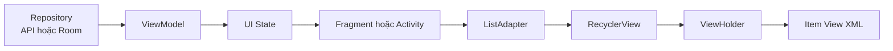
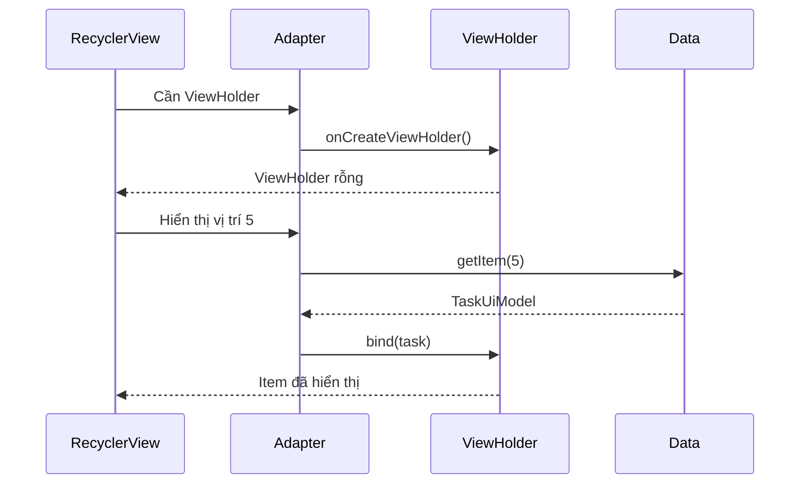
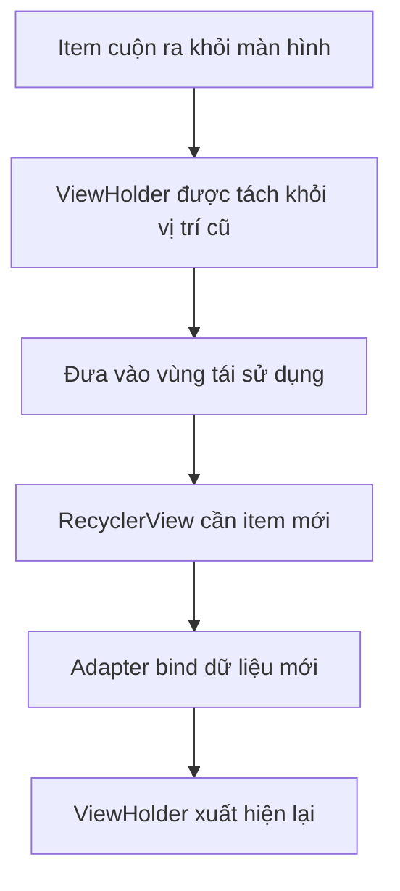
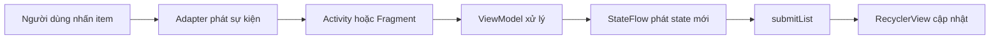
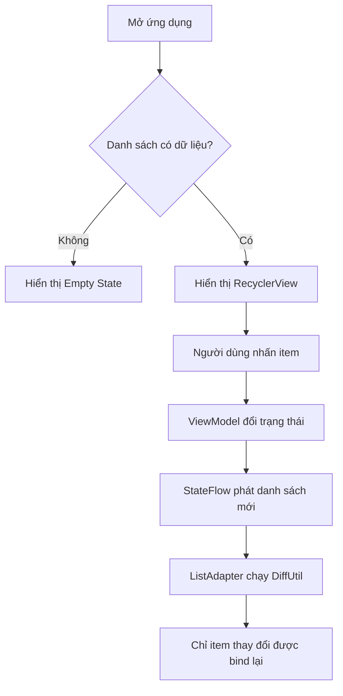
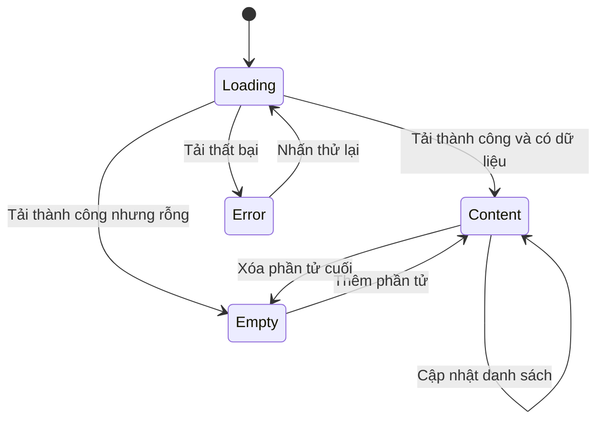
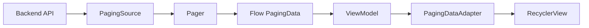

# 005 — RecyclerView trong Android

> **Học phần:** 02 — App Components and User Interface
> **Module:** Module 04 — Interface and Navigation
> **Nhóm nội dung:** Traditional Layouts
> **Nguồn roadmap:** Interface and Navigation / Traditional Layouts
> **Loại bài:** UI
> **Thứ tự trong module:** 005
> **Thời lượng gợi ý:** 30–45 phút

---

## Thông tin cập nhật năm 2026

`RecyclerView` thuộc hệ thống giao diện dựa trên **Android Views/XML** và vẫn rất quan trọng khi bảo trì ứng dụng cũ, làm việc với Fragment, View Binding hoặc tích hợp màn hình View vào dự án hiện có.

Tuy nhiên, thư viện RecyclerView hiện ở chế độ **maintenance mode**: vẫn nhận các bản sửa lỗi quan trọng nhưng không còn được ưu tiên phát triển tính năng mới. Với màn hình hoàn toàn mới, Android khuyến nghị sử dụng Jetpack Compose và các thành phần như `LazyColumn`, `LazyRow` hoặc `LazyVerticalGrid`. Phiên bản ổn định hiện được tài liệu Android liệt kê là `androidx.recyclerview:recyclerview:1.4.0`. ([Android Developers][1])

```kotlin
dependencies {
    implementation("androidx.recyclerview:recyclerview:1.4.0")
}
```

---

## 1. Tóm tắt


*Hình minh họa: danh sách các thẻ nội dung được hiển thị bằng RecyclerView.* 

`RecyclerView` là một `ViewGroup` dùng để hiển thị danh sách hoặc lưới dữ liệu có thể cuộn. Thay vì tạo toàn bộ giao diện cho hàng trăm hoặc hàng nghìn phần tử cùng lúc, RecyclerView chỉ tạo số lượng `View` cần thiết cho vùng đang xuất hiện trên màn hình.

Khi một phần tử cuộn ra khỏi màn hình, `View` của phần tử đó không bị hủy ngay. RecyclerView giữ lại và tái sử dụng nó để hiển thị dữ liệu của một phần tử mới. Cơ chế này giúp giảm số lần tạo View, giảm sử dụng bộ nhớ và làm danh sách phản hồi mượt hơn. ([Android Developers][2])

RecyclerView thường xuất hiện trong:

* Danh sách bài viết.
* Danh sách sản phẩm.
* Danh bạ người dùng.
* Tin nhắn trong ứng dụng chat.
* Lịch sử giao dịch.
* Thư viện ảnh.
* Danh sách thông báo.
* Màn hình kết quả tìm kiếm.
* Danh sách dữ liệu phân trang từ API hoặc Room.

### Vị trí của RecyclerView trong ứng dụng



### Ý tưởng cốt lõi

```text
Dữ liệu không phải là View
ViewHolder không sở hữu dữ liệu lâu dài
Adapter chỉ ánh xạ dữ liệu sang giao diện
RecyclerView quản lý việc tạo, bố trí và tái sử dụng View
```

---

## 2. Mục tiêu học tập


*Hình minh họa: quan hệ giữa Data Source, Adapter, ViewHolder, RecyclerView và LayoutManager.* 

Sau bài học, anh cần có khả năng:

* Giải thích RecyclerView bằng ngôn ngữ của mình.
* Phân biệt `RecyclerView`, `Adapter`, `ViewHolder` và `LayoutManager`.
* Tạo một danh sách dọc bằng `LinearLayoutManager`.
* Thiết kế giao diện cho từng phần tử bằng XML.
* Sử dụng `ListAdapter` và `DiffUtil.ItemCallback`.
* Xử lý sự kiện nhấn vào một phần tử.
* Cập nhật danh sách bằng dữ liệu bất biến.
* Hiển thị các trạng thái loading, empty, content và error.
* Giữ dữ liệu khi xoay màn hình bằng `ViewModel`.
* Giữ vị trí cuộn khi Adapter nhận dữ liệu bất đồng bộ.
* Viết kiểm thử UI cơ bản bằng Espresso.
* Nhận biết các lỗi hiệu năng trong `onBindViewHolder()`.
* Biến ví dụ thành một sản phẩm nhỏ trong portfolio.

### Kết quả đầu ra của bài học

Sau khi hoàn thành, project nên có:

```text
RecyclerViewDemo/
├── model/
│   └── TaskUiModel.kt
├── ui/
│   ├── MainActivity.kt
│   ├── TaskAdapter.kt
│   └── TaskViewModel.kt
├── res/layout/
│   ├── activity_main.xml
│   └── item_task.xml
├── androidTest/
│   └── MainActivityTest.kt
├── screenshots/
│   ├── task-list.png
│   └── empty-state.png
└── README.md
```

---

## 3. Khái niệm chính


*Hình minh họa: các tương tác UI có thể được ghi lại và kiểm tra bằng Espresso Test Recorder.* 

### 3.1. RecyclerView

`RecyclerView` là vùng chứa các item đang được hiển thị. Nó chịu trách nhiệm:

* Nhận `Adapter`.
* Nhận `LayoutManager`.
* Quản lý việc cuộn.
* Yêu cầu tạo hoặc bind `ViewHolder`.
* Tái sử dụng các ViewHolder không còn xuất hiện.
* Thực hiện animation khi phần tử được thêm, xóa hoặc thay đổi.

RecyclerView không tự biết:

* Dữ liệu đến từ đâu.
* Một item phải hiển thị như thế nào.
* Khi nhấn item thì ứng dụng phải làm gì.
* Trạng thái loading hoặc lỗi được quản lý ra sao.

Những trách nhiệm đó thuộc về các lớp khác.

---

### 3.2. Adapter

`Adapter` là cầu nối giữa danh sách dữ liệu và RecyclerView.

Adapter trả lời ba câu hỏi chính:

1. Cần tạo ViewHolder bằng layout nào?
2. Ở vị trí hiện tại cần hiển thị dữ liệu nào?
3. Danh sách hiện có bao nhiêu phần tử?

Ba hàm nền tảng của `RecyclerView.Adapter` là:

```kotlin
onCreateViewHolder()
onBindViewHolder()
getItemCount()
```

Android mô tả `onCreateViewHolder()` là nơi tạo View mới, còn `onBindViewHolder()` là nơi liên kết ViewHolder với dữ liệu tương ứng. ([Android Developers][2])



---

### 3.3. ViewHolder

`ViewHolder` giữ tham chiếu đến các View của một item, ví dụ:

* `TextView` tiêu đề.
* `TextView` mô tả.
* `CheckBox`.
* `ImageView`.
* `ProgressBar`.

```kotlin
class TaskViewHolder(
    private val binding: ItemTaskBinding,
    private val onClick: (TaskUiModel) -> Unit
) : RecyclerView.ViewHolder(binding.root) {

    fun bind(item: TaskUiModel) {
        binding.titleText.text = item.title
        binding.completedCheckBox.isChecked = item.isCompleted

        binding.root.setOnClickListener {
            onClick(item)
        }
    }
}
```

Một ViewHolder đã từng hiển thị `Task A` có thể được tái sử dụng để hiển thị `Task Z`. Vì vậy, hàm `bind()` phải gán đầy đủ trạng thái cho View.

Ví dụ sai:

```kotlin
if (item.isCompleted) {
    binding.titleText.alpha = 0.5f
}
```

Khi ViewHolder được tái sử dụng cho item chưa hoàn thành, `alpha` có thể vẫn là `0.5f`.

Cách đúng:

```kotlin
binding.titleText.alpha =
    if (item.isCompleted) 0.5f else 1.0f
```

> Quy tắc: mỗi lần `bind()`, hãy coi ViewHolder đang chứa trạng thái của một item hoàn toàn khác.

---

### 3.4. LayoutManager

`LayoutManager` quyết định vị trí và cách sắp xếp item.

RecyclerView cung cấp ba LayoutManager thông dụng. ([Android Developers][2])

| LayoutManager                | Cách hiển thị                   | Trường hợp sử dụng            |
| ---------------------------- | ------------------------------- | ----------------------------- |
| `LinearLayoutManager`        | Danh sách một chiều             | Bài viết, tin nhắn, thông báo |
| `GridLayoutManager`          | Lưới đều                        | Sản phẩm, ảnh, danh mục       |
| `StaggeredGridLayoutManager` | Lưới có item cao thấp khác nhau | Pinterest, thư viện ảnh       |

#### Danh sách dọc

```kotlin
binding.taskRecyclerView.layoutManager =
    LinearLayoutManager(this)
```

#### Danh sách ngang

```kotlin
binding.taskRecyclerView.layoutManager =
    LinearLayoutManager(
        this,
        LinearLayoutManager.HORIZONTAL,
        false
    )
```

#### Lưới hai cột

```kotlin
binding.taskRecyclerView.layoutManager =
    GridLayoutManager(this, 2)
```

---

### 3.5. Cơ chế tái sử dụng View

Giả sử màn hình chỉ đủ hiển thị năm item:

```text
Ban đầu:

Màn hình             Recycler pool
┌──────────────┐
│ ViewHolder A │
│ ViewHolder B │
│ ViewHolder C │
│ ViewHolder D │
│ ViewHolder E │
└──────────────┘
```

Khi người dùng cuộn xuống:

```text
ViewHolder A ra khỏi màn hình
        ↓
Được đưa vào vùng tái sử dụng
        ↓
Bind dữ liệu của item tiếp theo
        ↓
Hiển thị lại ở cuối danh sách
```



RecyclerView không nhất thiết chỉ có đúng số ViewHolder đang nhìn thấy. Nó có thể chuẩn bị thêm một số View ở gần vùng hiển thị để hỗ trợ cuộn mượt.

---

### 3.6. ListAdapter và DiffUtil

`ListAdapter` là một lớp Adapter chuyên dùng để làm việc với danh sách. Nó nhận `DiffUtil.ItemCallback` và cung cấp `submitList()`.

`DiffUtil` so sánh danh sách cũ với danh sách mới, sau đó tạo tập thao tác tối thiểu để cập nhật RecyclerView. `ListAdapter` và `AsyncListDiffer` có thể thực hiện phép so sánh này ngoài main thread. ([Android Developers][3])

```kotlin
object TaskDiffCallback :
    DiffUtil.ItemCallback<TaskUiModel>() {

    override fun areItemsTheSame(
        oldItem: TaskUiModel,
        newItem: TaskUiModel
    ): Boolean {
        return oldItem.id == newItem.id
    }

    override fun areContentsTheSame(
        oldItem: TaskUiModel,
        newItem: TaskUiModel
    ): Boolean {
        return oldItem == newItem
    }
}
```

#### `areItemsTheSame()`

Kiểm tra hai đối tượng có đại diện cho cùng một thực thể hay không.

```kotlin
oldItem.id == newItem.id
```

#### `areContentsTheSame()`

Kiểm tra nội dung hiển thị có thay đổi hay không.

```kotlin
oldItem == newItem
```

#### Cập nhật danh sách đúng cách

```kotlin
adapter.submitList(newTasks)
```

Không nên sửa trực tiếp danh sách đã gửi cho DiffUtil. Tài liệu yêu cầu danh sách và các thuộc tính dùng để so sánh không bị mutate trong khi DiffUtil đang sử dụng; khi có thay đổi, nên tạo danh sách mới. ([Android Developers][3])

```kotlin
// Không nên
tasks[0].isCompleted = true
adapter.notifyDataSetChanged()

// Nên
val newTasks = tasks.map { task ->
    if (task.id == selectedId) {
        task.copy(isCompleted = !task.isCompleted)
    } else {
        task
    }
}

adapter.submitList(newTasks)
```

---

### 3.7. State và lifecycle

RecyclerView chỉ hiển thị state; nó không nên là nơi lưu state nghiệp vụ.

State nên được lưu trong:

* `ViewModel`.
* `StateFlow` hoặc `LiveData`.
* Repository.
* Room hoặc nguồn dữ liệu bền vững.



Khi cấu hình thiết bị thay đổi, chẳng hạn xoay màn hình, Android có thể hủy Activity cũ và tạo Activity mới. Các biến chỉ được giữ trong Activity có thể bị mất. ([Android Developers][4])

```kotlin
class TaskViewModel : ViewModel() {

    private val _tasks = MutableStateFlow(sampleTasks())

    val tasks: StateFlow<List<TaskUiModel>> =
        _tasks.asStateFlow()

    fun toggleTask(taskId: Long) {
        _tasks.update { currentTasks ->
            currentTasks.map { task ->
                if (task.id == taskId) {
                    task.copy(isCompleted = !task.isCompleted)
                } else {
                    task
                }
            }
        }
    }
}
```

`ViewModel` giúp danh sách còn tồn tại qua thay đổi cấu hình. Với dữ liệu cần phục hồi sau khi tiến trình ứng dụng bị hệ thống hủy, có thể kết hợp `SavedStateHandle`, Room hoặc tải lại từ Repository. ([Android Developers][5])

---

### 3.8. Khôi phục vị trí cuộn

Với danh sách tải bất đồng bộ, RecyclerView có thể cố khôi phục vị trí cuộn khi Adapter vẫn đang rỗng. Có thể trì hoãn việc khôi phục cho tới khi Adapter có dữ liệu:

```kotlin
adapter.stateRestorationPolicy =
    RecyclerView.Adapter.StateRestorationPolicy.PREVENT_WHEN_EMPTY
```

`PREVENT_WHEN_EMPTY` cho phép RecyclerView phục hồi state sau khi Adapter có ít nhất một item. ([Android Developers][6])

---

### 3.9. So sánh RecyclerView và LazyColumn

| Tiêu chí       | RecyclerView               | `LazyColumn`      |
| -------------- | -------------------------- | ----------------- |
| Hệ thống UI    | Android Views/XML          | Jetpack Compose   |
| Lớp trung gian | Adapter, ViewHolder        | Không cần Adapter |
| Item layout    | XML hoặc custom View       | Composable        |
| Cập nhật state | `submitList()`             | Truyền state mới  |
| Tái sử dụng    | ViewHolder recycling       | Lazy composition  |
| Dự án phù hợp  | View-based, legacy, hybrid | Compose-first     |
| Độ dài mã      | Thường nhiều lớp hơn       | Thường ngắn hơn   |

RecyclerView vẫn cần học vì nhiều codebase production đang sử dụng XML, Fragment và View Binding.

---

## 4. Thực hành: ứng dụng danh sách công việc


*Hình minh họa: chọn thành phần giao diện và thêm assertion trong kiểm thử.* 

### 4.1. Yêu cầu ứng dụng

Xây dựng màn hình gồm:

* Danh sách công việc.
* Nút thêm công việc.
* Nhấn item để chuyển trạng thái hoàn thành.
* Empty state khi không có dữ liệu.
* Dữ liệu không mất khi xoay màn hình.
* Vị trí cuộn được khôi phục.
* Danh sách cập nhật bằng `ListAdapter`.

### Luồng người dùng



---

### 4.2. Bật View Binding

Trong `build.gradle.kts` của module `app`:

```kotlin
android {
    buildFeatures {
        viewBinding = true
    }
}

dependencies {
    implementation("androidx.recyclerview:recyclerview:1.4.0")
}
```

---

### 4.3. Data model

Tạo `TaskUiModel.kt`:

```kotlin
data class TaskUiModel(
    val id: Long,
    val title: String,
    val isCompleted: Boolean = false
)
```

Sử dụng `data class` giúp `DiffUtil` so sánh nội dung thông qua `equals()`.

---

### 4.4. Layout của màn hình

Tạo `res/layout/activity_main.xml`:

```xml
<?xml version="1.0" encoding="utf-8"?>
<androidx.constraintlayout.widget.ConstraintLayout
    xmlns:android="http://schemas.android.com/apk/res/android"
    xmlns:app="http://schemas.android.com/apk/res-auto"
    android:layout_width="match_parent"
    android:layout_height="match_parent">

    <TextView
        android:id="@+id/titleText"
        android:layout_width="0dp"
        android:layout_height="wrap_content"
        android:padding="16dp"
        android:text="Công việc hôm nay"
        android:textAppearance="@style/TextAppearance.Material3.HeadlineSmall"
        app:layout_constraintEnd_toEndOf="parent"
        app:layout_constraintStart_toStartOf="parent"
        app:layout_constraintTop_toTopOf="parent" />

    <androidx.recyclerview.widget.RecyclerView
        android:id="@+id/taskRecyclerView"
        android:layout_width="0dp"
        android:layout_height="0dp"
        android:clipToPadding="false"
        android:paddingHorizontal="16dp"
        android:paddingBottom="96dp"
        app:layout_constraintBottom_toBottomOf="parent"
        app:layout_constraintEnd_toEndOf="parent"
        app:layout_constraintStart_toStartOf="parent"
        app:layout_constraintTop_toBottomOf="@id/titleText" />

    <TextView
        android:id="@+id/emptyText"
        android:layout_width="wrap_content"
        android:layout_height="wrap_content"
        android:gravity="center"
        android:text="Chưa có công việc nào"
        android:visibility="gone"
        app:layout_constraintBottom_toBottomOf="@id/taskRecyclerView"
        app:layout_constraintEnd_toEndOf="@id/taskRecyclerView"
        app:layout_constraintStart_toStartOf="@id/taskRecyclerView"
        app:layout_constraintTop_toTopOf="@id/taskRecyclerView" />

    <com.google.android.material.floatingactionbutton.FloatingActionButton
        android:id="@+id/addTaskButton"
        android:layout_width="wrap_content"
        android:layout_height="wrap_content"
        android:layout_margin="24dp"
        android:contentDescription="Thêm công việc"
        app:srcCompat="@android:drawable/ic_input_add"
        app:layout_constraintBottom_toBottomOf="parent"
        app:layout_constraintEnd_toEndOf="parent" />

</androidx.constraintlayout.widget.ConstraintLayout>
```

---

### 4.5. Layout của một item

Tạo `res/layout/item_task.xml`:

```xml
<?xml version="1.0" encoding="utf-8"?>
<com.google.android.material.card.MaterialCardView
    xmlns:android="http://schemas.android.com/apk/res/android"
    xmlns:app="http://schemas.android.com/apk/res-auto"
    android:layout_width="match_parent"
    android:layout_height="wrap_content"
    android:layout_marginBottom="12dp"
    android:clickable="true"
    android:focusable="true"
    android:foreground="?attr/selectableItemBackground"
    app:cardCornerRadius="16dp">

    <LinearLayout
        android:layout_width="match_parent"
        android:layout_height="wrap_content"
        android:gravity="center_vertical"
        android:minHeight="64dp"
        android:orientation="horizontal"
        android:padding="16dp">

        <CheckBox
            android:id="@+id/completedCheckBox"
            android:layout_width="wrap_content"
            android:layout_height="wrap_content"
            android:clickable="false"
            android:focusable="false" />

        <TextView
            android:id="@+id/titleText"
            android:layout_width="0dp"
            android:layout_height="wrap_content"
            android:layout_marginStart="12dp"
            android:layout_weight="1"
            android:textAppearance="@style/TextAppearance.Material3.BodyLarge" />

    </LinearLayout>

</com.google.android.material.card.MaterialCardView>
```

---

### 4.6. Adapter sử dụng ListAdapter

Tạo `TaskAdapter.kt`:

```kotlin
class TaskAdapter(
    private val onTaskClick: (TaskUiModel) -> Unit
) : ListAdapter<TaskUiModel, TaskAdapter.TaskViewHolder>(
    TaskDiffCallback
) {

    init {
        stateRestorationPolicy =
            StateRestorationPolicy.PREVENT_WHEN_EMPTY
    }

    override fun onCreateViewHolder(
        parent: ViewGroup,
        viewType: Int
    ): TaskViewHolder {
        val inflater = LayoutInflater.from(parent.context)

        val binding = ItemTaskBinding.inflate(
            inflater,
            parent,
            false
        )

        return TaskViewHolder(binding, onTaskClick)
    }

    override fun onBindViewHolder(
        holder: TaskViewHolder,
        position: Int
    ) {
        holder.bind(getItem(position))
    }

    class TaskViewHolder(
        private val binding: ItemTaskBinding,
        private val onTaskClick: (TaskUiModel) -> Unit
    ) : RecyclerView.ViewHolder(binding.root) {

        fun bind(item: TaskUiModel) {
            binding.titleText.text = item.title
            binding.completedCheckBox.isChecked = item.isCompleted

            binding.titleText.alpha =
                if (item.isCompleted) 0.5f else 1.0f

            binding.root.contentDescription =
                if (item.isCompleted) {
                    "${item.title}, đã hoàn thành"
                } else {
                    "${item.title}, chưa hoàn thành"
                }

            binding.root.setOnClickListener {
                onTaskClick(item)
            }
        }
    }

    private companion object {
        val TaskDiffCallback =
            object : DiffUtil.ItemCallback<TaskUiModel>() {

                override fun areItemsTheSame(
                    oldItem: TaskUiModel,
                    newItem: TaskUiModel
                ): Boolean {
                    return oldItem.id == newItem.id
                }

                override fun areContentsTheSame(
                    oldItem: TaskUiModel,
                    newItem: TaskUiModel
                ): Boolean {
                    return oldItem == newItem
                }
            }
    }
}
```

---

### 4.7. ViewModel quản lý state

Tạo `TaskViewModel.kt`:

```kotlin
class TaskViewModel : ViewModel() {

    private val _tasks = MutableStateFlow(
        listOf(
            TaskUiModel(1, "Học RecyclerView"),
            TaskUiModel(2, "Viết Adapter"),
            TaskUiModel(3, "Kiểm tra xoay màn hình")
        )
    )

    val tasks: StateFlow<List<TaskUiModel>> =
        _tasks.asStateFlow()

    fun toggleTask(taskId: Long) {
        _tasks.update { currentTasks ->
            currentTasks.map { task ->
                if (task.id == taskId) {
                    task.copy(
                        isCompleted = !task.isCompleted
                    )
                } else {
                    task
                }
            }
        }
    }

    fun addTask() {
        _tasks.update { currentTasks ->
            val nextId =
                (currentTasks.maxOfOrNull { it.id } ?: 0L) + 1L

            currentTasks + TaskUiModel(
                id = nextId,
                title = "Công việc $nextId"
            )
        }
    }
}
```

---

### 4.8. Kết nối RecyclerView với Activity

Tạo `MainActivity.kt`:

```kotlin
class MainActivity : AppCompatActivity() {

    private lateinit var binding: ActivityMainBinding

    private val viewModel: TaskViewModel by viewModels()

    private val taskAdapter by lazy {
        TaskAdapter(
            onTaskClick = { task ->
                viewModel.toggleTask(task.id)
            }
        )
    }

    override fun onCreate(savedInstanceState: Bundle?) {
        super.onCreate(savedInstanceState)

        binding = ActivityMainBinding.inflate(layoutInflater)
        setContentView(binding.root)

        setupRecyclerView()
        observeUiState()
        setupActions()
    }

    private fun setupRecyclerView() {
        binding.taskRecyclerView.apply {
            layoutManager = LinearLayoutManager(this@MainActivity)
            adapter = taskAdapter
            setHasFixedSize(true)
        }
    }

    private fun observeUiState() {
        lifecycleScope.launch {
            repeatOnLifecycle(Lifecycle.State.STARTED) {
                viewModel.tasks.collect { tasks ->
                    taskAdapter.submitList(tasks)

                    binding.taskRecyclerView.isVisible =
                        tasks.isNotEmpty()

                    binding.emptyText.isVisible =
                        tasks.isEmpty()
                }
            }
        }
    }

    private fun setupActions() {
        binding.addTaskButton.setOnClickListener {
            viewModel.addTask()
        }
    }
}
```

`setHasFixedSize(true)` phù hợp khi việc thêm, xóa hoặc thay đổi dữ liệu không làm thay đổi kích thước tổng thể của RecyclerView trong layout. Không nên bật chỉ theo thói quen nếu chiều cao hoặc chiều rộng của chính RecyclerView phụ thuộc vào nội dung.

---

### 4.9. Mở màn hình chi tiết

Không nên truyền `position` sang màn hình khác vì vị trí có thể thay đổi sau khi danh sách được cập nhật.

Không nên:

```kotlin
onTaskClick(position)
```

Nên truyền ID:

```kotlin
onTaskClick(task.id)
```

Ví dụ:

```kotlin
private val taskAdapter by lazy {
    TaskAdapter { task ->
        val intent = Intent(this, TaskDetailActivity::class.java)
            .putExtra("task_id", task.id)

        startActivity(intent)
    }
}
```

Nếu cần lấy vị trí bên trong ViewHolder, sử dụng `bindingAdapterPosition` và kiểm tra `NO_POSITION`:

```kotlin
val position = bindingAdapterPosition

if (position != RecyclerView.NO_POSITION) {
    val item = getItem(position)
    onTaskClick(item)
}
```

---

## 5. Bài tập


*Hình minh họa: cửa sổ kết quả khi kiểm thử Espresso chạy thành công.* 

### Bài tập chính: danh sách khóa học Android

Xây dựng một màn hình hiển thị danh sách bài học:

```kotlin
data class LessonUiModel(
    val id: Long,
    val title: String,
    val durationMinutes: Int,
    val isCompleted: Boolean
)
```

Mỗi item cần hiển thị:

* Tên bài học.
* Thời lượng.
* Trạng thái đã hoàn thành.
* Nút hoặc vùng nhấn để đánh dấu hoàn thành.

### Yêu cầu chức năng

1. Hiển thị tối thiểu 20 bài học.
2. Sử dụng `ListAdapter`.
3. Sử dụng `DiffUtil.ItemCallback`.
4. Nhấn item để đổi trạng thái hoàn thành.
5. Có nút thêm bài học mới.
6. Có empty state.
7. Xoay màn hình không làm mất dữ liệu.
8. Cuộn tới item thứ 15, xoay màn hình và kiểm tra vị trí cuộn.
9. Không sử dụng `notifyDataSetChanged()`.
10. Có ảnh chụp màn hình đưa vào README.

### Bài tập nâng cao

* Thêm hai loại item: header và lesson.
* Thêm chức năng tìm kiếm.
* Thêm bộ lọc `Tất cả / Đã học / Chưa học`.
* Thêm swipe-to-delete bằng `ItemTouchHelper`.
* Thêm drag-and-drop để sắp xếp bài học.
* Tải dữ liệu từ Room.
* Tải dữ liệu phân trang bằng Paging.
* Sử dụng payload để chỉ cập nhật checkbox.
* Dùng `ConcatAdapter` để ghép header, content và footer.
* Hiển thị loading và retry khi gọi API thất bại.

### Sơ đồ state đề xuất



---

### Kiểm thử Espresso cơ bản

Espresso cung cấp `RecyclerViewActions` để cuộn tới hoặc thao tác với item không nằm trong vùng đang hiển thị. ([Android Developers][7])

```kotlin
@RunWith(AndroidJUnit4::class)
class MainActivityTest {

    @get:Rule
    val activityRule =
        ActivityScenarioRule(MainActivity::class.java)

    @Test
    fun clickFirstTask_updatesCompletedState() {
        onView(withId(R.id.taskRecyclerView))
            .perform(
                RecyclerViewActions
                    .actionOnItemAtPosition<
                        TaskAdapter.TaskViewHolder
                    >(0, click())
            )

        onView(withText("Học RecyclerView"))
            .check(matches(isDisplayed()))
    }

    @Test
    fun scrollToLastTask_displaysItem() {
        onView(withId(R.id.taskRecyclerView))
            .perform(
                RecyclerViewActions
                    .scrollToPosition<
                        TaskAdapter.TaskViewHolder
                    >(2)
            )

        onView(withText("Kiểm tra xoay màn hình"))
            .check(matches(isDisplayed()))
    }
}
```

### Kiểm thử DiffUtil cần chú ý

| Trường hợp               | Kết quả mong đợi               |
| ------------------------ | ------------------------------ |
| Cùng ID, cùng nội dung   | Không bind lại không cần thiết |
| Cùng ID, khác trạng thái | Item được cập nhật             |
| Khác ID                  | Được xem là hai item khác nhau |
| Thêm item                | Có animation thêm              |
| Xóa item                 | Có animation xóa               |
| Đổi thứ tự               | Vị trí item được cập nhật      |

---

## 6. Checklist hoàn thành


*Hình minh họa: giao diện đầu ra có thể sử dụng làm ảnh chụp portfolio.* 

### Kiến thức

* [ ] Giải thích được RecyclerView là gì.
* [ ] Giải thích được cơ chế tái sử dụng View.
* [ ] Phân biệt được RecyclerView và Adapter.
* [ ] Phân biệt được Adapter và ViewHolder.
* [ ] Biết vai trò của LayoutManager.
* [ ] Biết sự khác nhau giữa list, grid và staggered grid.
* [ ] Hiểu `areItemsTheSame()` và `areContentsTheSame()`.
* [ ] Biết vì sao không nên mutate danh sách trực tiếp.
* [ ] Biết khi nào sử dụng RecyclerView và khi nào dùng `LazyColumn`.

### Cài đặt

* [ ] Đã thêm dependency RecyclerView.
* [ ] Đã tạo layout màn hình.
* [ ] Đã tạo layout item.
* [ ] Đã tạo data model bất biến.
* [ ] Đã tạo `ListAdapter`.
* [ ] Đã tạo `ViewHolder`.
* [ ] Đã cài đặt `DiffUtil.ItemCallback`.
* [ ] Đã gán `LayoutManager`.
* [ ] Đã gán Adapter cho RecyclerView.
* [ ] Đã xử lý sự kiện nhấn item.

### State và lifecycle

* [ ] Danh sách được lưu trong ViewModel hoặc nguồn dữ liệu phù hợp.
* [ ] Xoay màn hình không làm mất dữ liệu.
* [ ] Background rồi quay lại không gây crash.
* [ ] Vị trí cuộn được phục hồi.
* [ ] Đã cân nhắc `PREVENT_WHEN_EMPTY`.
* [ ] Loading, empty, content và error được biểu diễn rõ ràng.
* [ ] Không giữ Activity hoặc Fragment trong Adapter.

### Chất lượng giao diện

* [ ] Item có vùng nhấn đủ lớn.
* [ ] Item có trạng thái pressed hoặc ripple.
* [ ] Icon có `contentDescription` phù hợp.
* [ ] Text không bị cắt ở font scale lớn.
* [ ] Hoạt động với dark mode.
* [ ] Hoạt động ở chế độ ngang.
* [ ] Hoạt động trên màn hình lớn.
* [ ] Empty state dễ hiểu.
* [ ] Thao tác thất bại có phản hồi cho người dùng.

### Kiểm thử

* [ ] Kiểm tra danh sách rỗng.
* [ ] Kiểm tra danh sách một item.
* [ ] Kiểm tra danh sách dài.
* [ ] Kiểm tra thêm item.
* [ ] Kiểm tra xóa item.
* [ ] Kiểm tra đổi trạng thái item.
* [ ] Kiểm tra cuộn nhanh.
* [ ] Kiểm tra xoay màn hình.
* [ ] Có ít nhất một Espresso test.
* [ ] Không có lỗi hiển thị do ViewHolder bị tái sử dụng.

### Portfolio

* [ ] Có ảnh chụp màn hình.
* [ ] Có README giải thích kiến trúc.
* [ ] Có sơ đồ luồng dữ liệu.
* [ ] Có mô tả về DiffUtil.
* [ ] Có video ngắn thể hiện cập nhật danh sách.
* [ ] Có đường dẫn repository.
* [ ] Project build thành công từ một máy sạch.

---

## 7. Ghi chú sản xuất


*Hình minh họa: các ranh giới trách nhiệm cần được giữ rõ khi đưa RecyclerView vào production.* 

### 7.1. Không thực hiện tác vụ nặng trong `onBindViewHolder()`

`onBindViewHolder()` có thể được gọi rất nhiều lần khi người dùng cuộn. Android khuyến nghị giữ logic bind ở mức tối thiểu; với item thông thường, thao tác bind cần nhanh hơn đáng kể so với một mili giây. ([Android Developers][8])

Không nên:

```kotlin
override fun onBindViewHolder(
    holder: TaskViewHolder,
    position: Int
) {
    val response = api.getTask(position)
    val bitmap = decodeLargeImage(response.image)
    holder.bind(response, bitmap)
}
```

Nên:

```kotlin
override fun onBindViewHolder(
    holder: TaskViewHolder,
    position: Int
) {
    holder.bind(getItem(position))
}
```

Các tác vụ như gọi API, truy vấn Room, định dạng dữ liệu phức tạp hoặc giải mã ảnh nên được thực hiện trước khi state đến Adapter.

---

### 7.2. Không lưu Context lâu dài trong Adapter

Không nên:

```kotlin
class TaskAdapter(
    private val activity: MainActivity
)
```

Cách này làm Adapter phụ thuộc trực tiếp vào Activity và tăng nguy cơ leak hoặc khó kiểm thử.

Nên truyền callback:

```kotlin
class TaskAdapter(
    private val onTaskClick: (TaskUiModel) -> Unit
)
```

Khi cần Context tạm thời:

```kotlin
val context = binding.root.context
```

---

### 7.3. Không dùng `notifyDataSetChanged()` cho mọi thay đổi

`notifyDataSetChanged()` khiến RecyclerView coi toàn bộ danh sách có khả năng đã thay đổi.

Ưu tiên:

```kotlin
adapter.submitList(newList)
```

Hoặc khi tự quản lý Adapter:

```kotlin
notifyItemInserted(position)
notifyItemRemoved(position)
notifyItemChanged(position)
```

Với phần lớn danh sách nghiệp vụ, `ListAdapter` và `DiffUtil` là lựa chọn ít lỗi hơn.

---

### 7.4. Tránh phụ thuộc vào position

Position không phải ID ổn định. Nó có thể thay đổi khi:

* Thêm item.
* Xóa item.
* Sắp xếp.
* Lọc.
* Ghép nhiều Adapter.
* DiffUtil đang áp dụng cập nhật.

Không lưu position vào listener từ lúc bind:

```kotlin
// Không nên
val savedPosition = position
binding.root.setOnClickListener {
    onClick(savedPosition)
}
```

Nên phát item hoặc ID:

```kotlin
binding.root.setOnClickListener {
    onClick(item.id)
}
```

---

### 7.5. Xử lý ảnh đúng cách

Với danh sách chứa ảnh:

* Sử dụng Coil, Glide hoặc thư viện tương đương.
* Hiển thị placeholder.
* Hiển thị fallback khi ảnh lỗi.
* Chỉ tải kích thước ảnh cần thiết.
* Hủy request cũ khi ViewHolder được tái sử dụng.
* Không giải mã bitmap lớn trong `bind()`.
* Tránh animation ảnh lặp lại mỗi lần cuộn nếu không cần thiết.

Ví dụ với Coil:

```kotlin
binding.thumbnailImage.load(item.imageUrl) {
    crossfade(true)
    placeholder(R.drawable.image_placeholder)
    error(R.drawable.image_error)
}
```

---

### 7.6. Payload cho cập nhật một phần

Nếu chỉ checkbox thay đổi, có thể sử dụng payload để tránh bind lại toàn bộ item.

```kotlin
override fun getChangePayload(
    oldItem: TaskUiModel,
    newItem: TaskUiModel
): Any? {
    return if (
        oldItem.title == newItem.title &&
        oldItem.isCompleted != newItem.isCompleted
    ) {
        PAYLOAD_COMPLETED
    } else {
        null
    }
}
```

```kotlin
override fun onBindViewHolder(
    holder: TaskViewHolder,
    position: Int,
    payloads: MutableList<Any>
) {
    if (payloads.contains(PAYLOAD_COMPLETED)) {
        holder.bindCompletedState(getItem(position))
    } else {
        super.onBindViewHolder(holder, position, payloads)
    }
}
```

Chỉ nên dùng payload sau khi cách bind thông thường đã hoạt động đúng.

---

### 7.7. Accessibility

Một RecyclerView cuộn mượt nhưng không sử dụng được với TalkBack vẫn là giao diện chưa hoàn chỉnh.

Cần kiểm tra:

* Item có thể focus.
* Thứ tự focus hợp lý.
* Icon hành động có mô tả.
* Trạng thái selected, checked hoặc completed được công bố.
* Không gán cùng một hành động click cho quá nhiều vùng gây khó hiểu.
* Nội dung quan trọng không chỉ được biểu diễn bằng màu sắc.
* Grid được đọc theo thứ tự hợp lý.
* Font scale lớn không làm text chồng lên nhau.

Ví dụ:

```kotlin
binding.root.contentDescription = buildString {
    append(item.title)

    if (item.isCompleted) {
        append(", đã hoàn thành")
    } else {
        append(", chưa hoàn thành")
    }
}
```

---

### 7.8. Edge-to-edge và system bars

Tài liệu RecyclerView hiện hướng dẫn sử dụng window insets, padding và `clipToPadding="false"` để danh sách có thể cuộn dưới system bars mà nội dung vẫn không bị che. ([Android Developers][2])

```kotlin
ViewCompat.setOnApplyWindowInsetsListener(
    binding.taskRecyclerView
) { view, insets ->

    val bars = insets.getInsets(
        WindowInsetsCompat.Type.systemBars()
    )

    view.updatePadding(
        left = bars.left,
        top = bars.top,
        right = bars.right,
        bottom = bars.bottom
    )

    insets
}
```

---

### 7.9. Danh sách lớn và Paging

Khi API có hàng nghìn phần tử, không nên tải toàn bộ dữ liệu một lần.

Kiến trúc phù hợp:



Paging hỗ trợ tải dữ liệu từng trang và đưa dữ liệu quan sát được từ ViewModel đến giao diện danh sách. ([Android Developers][9])

---

### 7.10. Các trạng thái production bắt buộc

| State                  | Giao diện đề xuất                          |
| ---------------------- | ------------------------------------------ |
| Loading lần đầu        | Skeleton hoặc ProgressBar                  |
| Refresh                | Indicator nhưng giữ nội dung cũ            |
| Empty                  | Hình minh họa, mô tả, CTA                  |
| Error lần đầu          | Thông báo lỗi và nút thử lại               |
| Load-more error        | Footer retry                               |
| Offline có cache       | Nội dung cache và thông báo offline        |
| Partial data           | Hiển thị dữ liệu hợp lệ, đánh dấu phần lỗi |
| Authentication expired | Điều hướng đăng nhập phù hợp               |

---

### 7.11. Release checklist

Trước khi phát hành, cần kiểm tra RecyclerView trên:

* Thiết bị cấu hình thấp.
* Danh sách 0, 1, 10, 100 và 1.000 item.
* Cuộn nhanh lên xuống.
* Dark mode.
* Font scale 200%.
* Chế độ ngang.
* Màn hình nhỏ và tablet.
* TalkBack.
* Mạng chậm hoặc mất mạng.
* API trả danh sách trùng ID.
* Item bị xóa trong lúc người dùng đang thao tác.
* Refresh khi đang ở giữa danh sách.
* Điều hướng đi rồi quay lại.
* Xoay màn hình khi danh sách đang tải.
* Process recreation.
* Animation thêm, xóa và đổi vị trí.

---

## Artifact đề xuất cho portfolio

### Tên project

```text
Android RecyclerView Task Manager
```

### README mẫu

```markdown
# RecyclerView Task Manager

Ứng dụng Android Views minh họa cách xây dựng danh sách động bằng
RecyclerView, ListAdapter, DiffUtil, ViewModel và StateFlow.

## Chức năng

- Hiển thị danh sách công việc
- Đánh dấu hoàn thành
- Thêm công việc
- Empty state
- Giữ state khi xoay màn hình
- Khôi phục vị trí cuộn
- Espresso UI test

## Kiến trúc

Repository → ViewModel → StateFlow → Activity → ListAdapter → RecyclerView

## Điểm kỹ thuật

- Immutable UI model
- DiffUtil.ItemCallback
- StateRestorationPolicy.PREVENT_WHEN_EMPTY
- Lifecycle-aware state collection
- Accessibility content descriptions
```

### Tiêu chí hoàn thành cuối cùng

Một bài thực hành RecyclerView tốt không chỉ dừng ở việc “danh sách cuộn được”. Nó phải chứng minh rằng:

```text
State đúng
→ Diff đúng
→ ViewHolder bind đúng
→ Lifecycle không làm mất dữ liệu
→ Danh sách cuộn mượt
→ Người dùng nhận được phản hồi rõ ràng
→ Tính năng có kiểm thử bảo vệ
```

---

## Ghi nhớ nhanh

```text
RecyclerView = vùng chứa danh sách
LayoutManager = cách bố trí item
Adapter = ánh xạ dữ liệu sang ViewHolder
ViewHolder = giữ và bind giao diện của item
ListAdapter = Adapter hỗ trợ danh sách mới
DiffUtil = tìm phần thay đổi giữa hai danh sách
ViewModel = giữ UI state qua configuration change
PREVENT_WHEN_EMPTY = chờ dữ liệu trước khi phục hồi vị trí cuộn
```

> **Quy tắc thực tế:** dữ liệu thay đổi trong ViewModel, Activity hoặc Fragment quan sát state, Adapter nhận danh sách mới bằng `submitList()`, còn ViewHolder chỉ chịu trách nhiệm hiển thị một item.

[1]: https://developer.android.com/jetpack/androidx/releases/recyclerview "Recyclerview  |  Jetpack  |  Android Developers"
[2]: https://developer.android.com/develop/ui/views/layout/recyclerview "Create dynamic lists with RecyclerView  |  Views  |  Android Developers"
[3]: https://developer.android.com/reference/kotlin/androidx/recyclerview/widget/DiffUtil "DiffUtil  |  API reference  |  Android Developers"
[4]: https://developer.android.com/guide/topics/resources/runtime-changes "Handle configuration changes  |  App architecture  |  Android Developers"
[5]: https://developer.android.com/topic/libraries/architecture/viewmodel?utm_source=chatgpt.com "ViewModel overview | App architecture"
[6]: https://developer.android.com/reference/kotlin/androidx/recyclerview/widget/RecyclerView.Adapter.StateRestorationPolicy "RecyclerView.Adapter.StateRestorationPolicy  |  API reference  |  Android Developers"
[7]: https://developer.android.com/training/testing/espresso/lists?utm_source=chatgpt.com "Espresso lists  |  Test your app on Android  |  Android Developers"
[8]: https://developer.android.com/topic/performance/vitals/render "Slow rendering  |  App quality  |  Android Developers"
[9]: https://developer.android.com/topic/libraries/architecture/paging?utm_source=chatgpt.com "Paging 2 library overview | Views"

---

# Bài luyện tập

## Mục tiêu


## Đề bài


## Yêu cầu hoàn thành

- [ ] 
- [ ] 
- [ ] 

## Kết quả / lời giải


## Ghi chú
