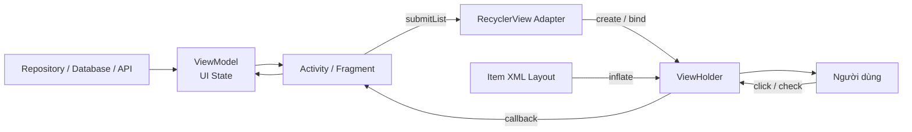
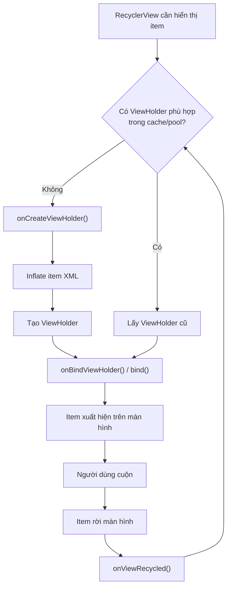
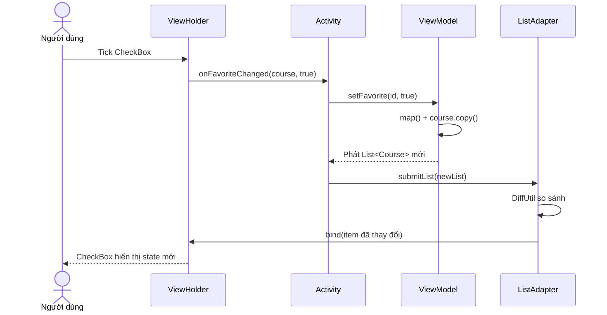

[](https://blog.mindorks.com/how-does-recyclerview-work-internally/?utm_source=chatgpt.com)

# 006 — ViewHolder Pattern

| Thuộc tính              | Nội dung                                       |
| ----------------------- | ---------------------------------------------- |
| **Học phần**            | 02 — App Components and User Interface         |
| **Module**              | Module 04 — Interface and Navigation           |
| **Nhóm nội dung**       | Traditional Layouts                            |
| **Nguồn roadmap**       | Interface and Navigation / Traditional Layouts |
| **Loại bài**            | UI                                             |
| **Thứ tự trong module** | 006                                            |
| **Thời lượng gợi ý**    | 30 phút                                        |
| **Công nghệ chính**     | Kotlin, XML, RecyclerView, View Binding        |
| **Artifact portfolio**  | Danh sách khóa học có trạng thái yêu thích     |

> [!IMPORTANT]
> Trong Android Views/XML, `ViewHolder` thường gắn liền với `RecyclerView`. Tính đến tháng 8/2026, phiên bản ổn định của `androidx.recyclerview:recyclerview` là **1.4.0**. Thư viện đang ở chế độ bảo trì; Google khuyến nghị hướng **Compose-first** cho giao diện mới, nhưng RecyclerView vẫn rất quan trọng khi bảo trì hoặc phát triển ứng dụng dùng XML Views. ([Android Developers][1])

---

## 1. Tóm tắt


**ViewHolder Pattern** là mẫu thiết kế dùng một đối tượng để giữ sẵn tham chiếu đến các `View` bên trong một item danh sách, chẳng hạn:

* `TextView` hiển thị tiêu đề.
* `ImageView` hiển thị ảnh.
* `CheckBox` hiển thị trạng thái lựa chọn.
* `Button` thực hiện hành động.

Thay vì liên tục tìm lại các `View` hoặc tạo giao diện item mới mỗi lần cuộn, `RecyclerView` tái sử dụng các item đã rời khỏi màn hình. Dữ liệu cũ được thay bằng dữ liệu của phần tử mới thông qua quá trình **binding**. Cơ chế này giúp giảm số lần inflate layout, hạn chế lookup `findViewById()` và cải thiện độ mượt khi cuộn. ([Android Developers][2])

Một `ViewHolder` có hai nhiệm vụ chính:

1. Giữ item view và các tham chiếu con của item.
2. Cập nhật toàn bộ trạng thái giao diện khi item được bind với dữ liệu mới.

### Ví dụ thực tế

Một ứng dụng học Android có 500 bài học. Màn hình chỉ hiển thị khoảng 7–12 item tại một thời điểm. RecyclerView không cần tạo 500 giao diện item; nó chỉ tạo số lượng cần thiết cho vùng đang hiển thị và một lượng nhỏ bộ đệm, sau đó tái sử dụng chúng khi người dùng cuộn. RecyclerView được thiết kế để hiển thị tập dữ liệu lớn trong một cửa sổ giao diện giới hạn. ([Android Developers][3])

### Vị trí trong kiến trúc ứng dụng



---

## 2. Mục tiêu học tập


Sau bài học, anh có thể:

| Mục tiêu                 | Kết quả cần đạt                                                |
| ------------------------ | -------------------------------------------------------------- |
| **Giải thích khái niệm** | Nói được ViewHolder giữ gì và vì sao cần tái sử dụng item view |
| **Hiểu luồng hoạt động** | Phân biệt `onCreateViewHolder()` và `onBindViewHolder()`       |
| **Viết code**            | Tạo `RecyclerView.Adapter` hoặc `ListAdapter` bằng Kotlin      |
| **Quản lý trạng thái**   | Không để trạng thái item cũ “rò rỉ” sang item mới              |
| **Xử lý sự kiện**        | Không lưu cố định giá trị `position` trong listener            |
| **Tối ưu cập nhật**      | Sử dụng `ListAdapter` và `DiffUtil`                            |
| **Kiểm thử**             | Kiểm tra cuộn danh sách, thay đổi trạng thái và xoay màn hình  |
| **Portfolio**            | Có ảnh chụp, README và đoạn code minh họa hoàn chỉnh           |

### Kết quả tối thiểu

Anh cần tự giải thích được câu sau:

> ViewHolder không đại diện vĩnh viễn cho một phần tử dữ liệu. Nó là một container giao diện có thể lần lượt được bind với nhiều phần tử khác nhau.

Đây là lý do mọi thuộc tính có thể thay đổi của item phải được cập nhật lại trong `bind()` hoặc `onBindViewHolder()`.

---

## 3. Khái niệm chính


### 3.1. ViewHolder là gì?

`RecyclerView.ViewHolder` mô tả một item view và metadata về vị trí của item đó trong RecyclerView. Android khuyến nghị các Adapter tạo lớp con của `ViewHolder` và lưu các tham chiếu View có chi phí tìm kiếm cao. ([Android Developers][4])

Ví dụ truyền thống:

```kotlin
class CourseViewHolder(itemView: View) :
    RecyclerView.ViewHolder(itemView) {

    val titleTextView: TextView =
        itemView.findViewById(R.id.course_title)

    val favoriteCheckBox: CheckBox =
        itemView.findViewById(R.id.favorite_checkbox)
}
```

Lookup chỉ diễn ra khi `ViewHolder` được tạo, không phải mỗi lần item được bind.

### 3.2. ViewHolder với View Binding

View Binding sinh một binding class cho mỗi XML layout và cung cấp tham chiếu trực tiếp, có kiểu dữ liệu rõ ràng đến các View có ID. Trong phần lớn trường hợp, View Binding thay thế `findViewById()`. ([Android Developers][5])

```kotlin
class CourseViewHolder(
    private val binding: ItemCourseBinding
) : RecyclerView.ViewHolder(binding.root) {

    fun bind(course: Course) {
        binding.courseTitle.text = course.title
        binding.favoriteCheckBox.isChecked = course.isFavorite
    }
}
```

Ưu điểm:

| `findViewById()`              | View Binding                       |
| ----------------------------- | ---------------------------------- |
| Có thể sai ID                 | Binding được sinh từ XML           |
| Có thể cast sai kiểu          | Tham chiếu có type safety          |
| Nhiều code lặp                | Code ngắn và dễ đọc                |
| Lỗi thường xuất hiện lúc chạy | Nhiều lỗi được phát hiện khi build |

### 3.3. Các thành phần của RecyclerView

RecyclerView được xây dựng từ bốn phần chính. ([Android Developers][2])

| Thành phần      | Vai trò                                               |
| --------------- | ----------------------------------------------------- |
| `RecyclerView`  | Container hiển thị danh sách                          |
| `Adapter`       | Kết nối dữ liệu với giao diện item                    |
| `ViewHolder`    | Giữ và quản lý giao diện của một item                 |
| `LayoutManager` | Sắp xếp item theo danh sách, lưới hoặc staggered grid |

### 3.4. Ba phương thức Adapter quan trọng

#### `onCreateViewHolder()`

Được gọi khi RecyclerView cần tạo một ViewHolder mới.

```kotlin
override fun onCreateViewHolder(
    parent: ViewGroup,
    viewType: Int
): CourseViewHolder {
    val binding = ItemCourseBinding.inflate(
        LayoutInflater.from(parent.context),
        parent,
        false
    )

    return CourseViewHolder(binding)
}
```

Công việc phù hợp:

* Inflate XML.
* Khởi tạo ViewHolder.
* Thiết lập listener không phụ thuộc dữ liệu cụ thể.
* Khởi tạo cấu hình dùng chung.

Không bind nội dung của một item cụ thể tại đây.

#### `onBindViewHolder()`

Được gọi để đưa dữ liệu của một phần tử vào ViewHolder.

```kotlin
override fun onBindViewHolder(
    holder: CourseViewHolder,
    position: Int
) {
    holder.bind(courses[position])
}
```

Công việc phù hợp:

* Đặt text.
* Đặt ảnh.
* Cập nhật trạng thái checked, selected, enabled.
* Cập nhật visibility.
* Cập nhật accessibility description.

#### `getItemCount()`

Trả về số phần tử trong tập dữ liệu:

```kotlin
override fun getItemCount(): Int = courses.size
```

RecyclerView gọi `onCreateViewHolder()` khi cần một holder mới và gọi `onBindViewHolder()` để cập nhật holder với dữ liệu tại vị trí hiện tại. Android lưu ý rằng không nên giữ lại tham số `position`; khi cần vị trí tại thời điểm click, hãy lấy `bindingAdapterPosition`. ([Android Developers][6])

### 3.5. Chu trình tái sử dụng ViewHolder



Một ViewHolder từng hiển thị bài học số 1 có thể được tái sử dụng để hiển thị bài học số 30. Vì vậy, `bind()` phải tạo ra một giao diện hoàn chỉnh từ dữ liệu hiện tại.

### 3.6. Lỗi rò rỉ trạng thái item

#### Code sai

```kotlin
fun bind(course: Course) {
    binding.courseTitle.text = course.title

    if (course.isFavorite) {
        binding.favoriteIcon.visibility = View.VISIBLE
    }
}
```

Khi holder từng hiển thị một khóa học yêu thích, icon được đặt thành `VISIBLE`. Sau đó holder được tái sử dụng cho khóa học không yêu thích nhưng code không đặt lại `GONE`, vì vậy icon cũ vẫn xuất hiện.

#### Code đúng

```kotlin
fun bind(course: Course) {
    binding.courseTitle.text = course.title

    binding.favoriteIcon.visibility =
        if (course.isFavorite) View.VISIBLE else View.GONE
}
```

Hoặc dùng Android KTX:

```kotlin
binding.favoriteIcon.isVisible = course.isFavorite
```

### 3.7. Listener và trạng thái CheckBox

`CheckBox` có thể gọi listener khi code thay đổi `isChecked`. Để tránh callback sai trong lúc tái bind:

```kotlin
fun bind(course: Course) = with(binding) {
    favoriteCheckBox.setOnCheckedChangeListener(null)

    favoriteCheckBox.isChecked = course.isFavorite

    favoriteCheckBox.setOnCheckedChangeListener { _, checked ->
        onFavoriteChanged(course, checked)
    }
}
```

Trình tự cần nhớ:

```text
Gỡ listener cũ
      ↓
Đặt trạng thái mới
      ↓
Gắn listener mới
```

### 3.8. Không lưu `position`

#### Không nên

```kotlin
override fun onBindViewHolder(
    holder: CourseViewHolder,
    position: Int
) {
    holder.itemView.setOnClickListener {
        onClick(courses[position])
    }
}
```

Sau khi thêm, xóa hoặc di chuyển item, vị trí cũ có thể không còn đúng.

#### Nên dùng item ID

```kotlin
fun bind(course: Course) {
    binding.root.setOnClickListener {
        onClick(course.id)
    }
}
```

Hoặc lấy vị trí mới nhất tại thời điểm click:

```kotlin
init {
    binding.root.setOnClickListener {
        val position = bindingAdapterPosition

        if (position != RecyclerView.NO_POSITION) {
            onClick(getItem(position))
        }
    }
}
```

`getAdapterPosition()` đã bị deprecated vì dễ gây nhầm lẫn với adapter lồng nhau; trong Adapter thường nên dùng `bindingAdapterPosition`, còn khi cần vị trí theo RecyclerView tổng thể mới dùng `absoluteAdapterPosition`. ([Android Developers][4])

### 3.9. `ListAdapter` và `DiffUtil`

`DiffUtil` so sánh hai danh sách và tạo ra các thao tác cập nhật tối thiểu như thêm, xóa, di chuyển hoặc thay đổi. `ListAdapter` và `AsyncListDiffer` giúp thực hiện phần tính toán diff ở background thread. Danh sách và dữ liệu dùng để diff không nên bị mutate trực tiếp; mỗi thay đổi nên tạo danh sách mới. ([Android Developers][7])

```kotlin
object CourseDiffCallback : DiffUtil.ItemCallback<Course>() {

    override fun areItemsTheSame(
        oldItem: Course,
        newItem: Course
    ): Boolean {
        return oldItem.id == newItem.id
    }

    override fun areContentsTheSame(
        oldItem: Course,
        newItem: Course
    ): Boolean {
        return oldItem == newItem
    }
}
```

| Phương thức            | Câu hỏi cần trả lời                              |
| ---------------------- | ------------------------------------------------ |
| `areItemsTheSame()`    | Đây có phải cùng một đối tượng logic không?      |
| `areContentsTheSame()` | Nội dung hiển thị có hoàn toàn giống nhau không? |

Thông thường:

```kotlin
areItemsTheSame = old.id == new.id
areContentsTheSame = old == new
```

---

## 4. Thực hành: danh sách khóa học yêu thích


### 4.1. Yêu cầu mini project

Xây dựng màn hình có:

* Danh sách năm khóa học Android.
* Mỗi item có tiêu đề, mô tả và CheckBox yêu thích.
* Khi tick CheckBox, `ViewModel` cập nhật state.
* Khi xoay màn hình, trạng thái vẫn được giữ bởi ViewModel.
* Adapter dùng `ListAdapter`, `DiffUtil` và View Binding.

### 4.2. Cấu trúc thư mục

```text
app/
├── src/main/java/com/example/viewholder/
│   ├── Course.kt
│   ├── CourseAdapter.kt
│   ├── CourseViewModel.kt
│   └── MainActivity.kt
│
└── src/main/res/layout/
    ├── activity_main.xml
    └── item_course.xml
```

### 4.3. Bật View Binding và RecyclerView

`app/build.gradle.kts`:

```kotlin
android {
    buildFeatures {
        viewBinding = true
    }
}

dependencies {
    implementation("androidx.recyclerview:recyclerview:1.4.0")
}
```

Phiên bản ổn định hiện tại của RecyclerView là `1.4.0`. ([Android Developers][1])

### 4.4. Tạo model

`Course.kt`:

```kotlin
package com.example.viewholder

data class Course(
    val id: Long,
    val title: String,
    val description: String,
    val isFavorite: Boolean = false
)
```

Model được khai báo immutable bằng `val`. Khi trạng thái thay đổi, ta sử dụng `copy()` để tạo đối tượng mới.

### 4.5. Layout của màn hình

`activity_main.xml`:

```xml
<?xml version="1.0" encoding="utf-8"?>
<androidx.recyclerview.widget.RecyclerView
    xmlns:android="http://schemas.android.com/apk/res/android"
    xmlns:tools="http://schemas.android.com/tools"
    android:id="@+id/course_list"
    android:layout_width="match_parent"
    android:layout_height="match_parent"
    android:clipToPadding="false"
    android:padding="16dp"
    tools:listitem="@layout/item_course" />
```

`tools:listitem` giúp Android Studio Preview biết layout nào đại diện cho một item.

### 4.6. Layout của từng item

`item_course.xml`:

```xml
<?xml version="1.0" encoding="utf-8"?>
<LinearLayout
    xmlns:android="http://schemas.android.com/apk/res/android"
    xmlns:tools="http://schemas.android.com/tools"
    android:layout_width="match_parent"
    android:layout_height="wrap_content"
    android:layout_marginBottom="12dp"
    android:background="?attr/selectableItemBackground"
    android:clickable="true"
    android:focusable="true"
    android:minHeight="88dp"
    android:orientation="horizontal"
    android:padding="16dp">

    <LinearLayout
        android:layout_width="0dp"
        android:layout_height="wrap_content"
        android:layout_gravity="center_vertical"
        android:layout_weight="1"
        android:orientation="vertical">

        <TextView
            android:id="@+id/course_title"
            android:layout_width="wrap_content"
            android:layout_height="wrap_content"
            android:textAppearance="?attr/textAppearanceTitleMedium"
            android:textStyle="bold"
            tools:text="ViewHolder Pattern" />

        <TextView
            android:id="@+id/course_description"
            android:layout_width="wrap_content"
            android:layout_height="wrap_content"
            android:layout_marginTop="4dp"
            android:maxLines="2"
            android:textAppearance="?attr/textAppearanceBodyMedium"
            tools:text="Tái sử dụng item view trong RecyclerView." />

    </LinearLayout>

    <CheckBox
        android:id="@+id/favorite_checkbox"
        android:layout_width="wrap_content"
        android:layout_height="wrap_content"
        android:layout_gravity="center_vertical"
        android:contentDescription="@string/favorite_course"
        android:minWidth="48dp"
        android:minHeight="48dp" />

</LinearLayout>
```

`strings.xml`:

```xml
<resources>
    <string name="app_name">ViewHolder Demo</string>
    <string name="favorite_course">Đánh dấu khóa học yêu thích</string>
</resources>
```

### 4.7. Tạo Adapter và ViewHolder

`CourseAdapter.kt`:

```kotlin
package com.example.viewholder

import android.view.LayoutInflater
import android.view.ViewGroup
import androidx.recyclerview.widget.DiffUtil
import androidx.recyclerview.widget.ListAdapter
import androidx.recyclerview.widget.RecyclerView
import com.example.viewholder.databinding.ItemCourseBinding

class CourseAdapter(
    private val onCourseClick: (Course) -> Unit,
    private val onFavoriteChanged: (Course, Boolean) -> Unit
) : ListAdapter<Course, CourseAdapter.CourseViewHolder>(
    CourseDiffCallback
) {

    override fun onCreateViewHolder(
        parent: ViewGroup,
        viewType: Int
    ): CourseViewHolder {
        val binding = ItemCourseBinding.inflate(
            LayoutInflater.from(parent.context),
            parent,
            false
        )

        return CourseViewHolder(binding)
    }

    override fun onBindViewHolder(
        holder: CourseViewHolder,
        position: Int
    ) {
        holder.bind(getItem(position))
    }

    inner class CourseViewHolder(
        private val binding: ItemCourseBinding
    ) : RecyclerView.ViewHolder(binding.root) {

        init {
            binding.root.setOnClickListener {
                val position = bindingAdapterPosition

                if (position != RecyclerView.NO_POSITION) {
                    onCourseClick(getItem(position))
                }
            }
        }

        fun bind(course: Course) = with(binding) {
            courseTitle.text = course.title
            courseDescription.text = course.description

            // Quan trọng: gỡ listener cũ trước khi đặt state.
            favoriteCheckBox.setOnCheckedChangeListener(null)

            favoriteCheckBox.isChecked = course.isFavorite

            favoriteCheckBox.setOnCheckedChangeListener { _, checked ->
                onFavoriteChanged(course, checked)
            }

            root.isActivated = course.isFavorite
        }
    }
}

object CourseDiffCallback : DiffUtil.ItemCallback<Course>() {

    override fun areItemsTheSame(
        oldItem: Course,
        newItem: Course
    ): Boolean {
        return oldItem.id == newItem.id
    }

    override fun areContentsTheSame(
        oldItem: Course,
        newItem: Course
    ): Boolean {
        return oldItem == newItem
    }
}
```

### 4.8. Quản lý state bằng ViewModel

`CourseViewModel.kt`:

```kotlin
package com.example.viewholder

import androidx.lifecycle.ViewModel
import kotlinx.coroutines.flow.MutableStateFlow
import kotlinx.coroutines.flow.StateFlow
import kotlinx.coroutines.flow.asStateFlow
import kotlinx.coroutines.flow.update

class CourseViewModel : ViewModel() {

    private val _courses = MutableStateFlow(sampleCourses())

    val courses: StateFlow<List<Course>> =
        _courses.asStateFlow()

    fun setFavorite(
        courseId: Long,
        isFavorite: Boolean
    ) {
        _courses.update { currentCourses ->
            currentCourses.map { course ->
                if (course.id == courseId) {
                    course.copy(isFavorite = isFavorite)
                } else {
                    course
                }
            }
        }
    }

    private fun sampleCourses(): List<Course> {
        return listOf(
            Course(
                id = 1,
                title = "FrameLayout",
                description = "Xếp chồng các View trong cùng một vùng."
            ),
            Course(
                id = 2,
                title = "LinearLayout",
                description = "Sắp xếp View theo chiều ngang hoặc dọc."
            ),
            Course(
                id = 3,
                title = "RelativeLayout",
                description = "Định vị View tương đối với View khác."
            ),
            Course(
                id = 4,
                title = "RecyclerView",
                description = "Hiển thị danh sách dữ liệu hiệu quả."
            ),
            Course(
                id = 5,
                title = "ViewHolder Pattern",
                description = "Giữ và tái sử dụng giao diện của item."
            )
        )
    }
}
```

Ở đây, `map()` và `copy()` tạo danh sách mới. Điều này phù hợp với yêu cầu immutable list của `DiffUtil` và `ListAdapter`. ([Android Developers][7])

### 4.9. Kết nối RecyclerView trong Activity

`MainActivity.kt`:

```kotlin
package com.example.viewholder

import android.os.Bundle
import android.widget.Toast
import androidx.activity.viewModels
import androidx.appcompat.app.AppCompatActivity
import androidx.lifecycle.Lifecycle
import androidx.lifecycle.lifecycleScope
import androidx.lifecycle.repeatOnLifecycle
import androidx.recyclerview.widget.LinearLayoutManager
import com.example.viewholder.databinding.ActivityMainBinding
import kotlinx.coroutines.launch

class MainActivity : AppCompatActivity() {

    private lateinit var binding: ActivityMainBinding

    private val viewModel: CourseViewModel by viewModels()

    private val courseAdapter by lazy {
        CourseAdapter(
            onCourseClick = { course ->
                Toast.makeText(
                    this,
                    course.title,
                    Toast.LENGTH_SHORT
                ).show()
            },
            onFavoriteChanged = { course, checked ->
                viewModel.setFavorite(
                    courseId = course.id,
                    isFavorite = checked
                )
            }
        )
    }

    override fun onCreate(savedInstanceState: Bundle?) {
        super.onCreate(savedInstanceState)

        binding = ActivityMainBinding.inflate(layoutInflater)
        setContentView(binding.root)

        setupRecyclerView()
        observeCourses()
    }

    private fun setupRecyclerView() {
        binding.courseList.apply {
            layoutManager = LinearLayoutManager(this@MainActivity)
            adapter = courseAdapter
            setHasFixedSize(true)
        }
    }

    private fun observeCourses() {
        lifecycleScope.launch {
            repeatOnLifecycle(Lifecycle.State.STARTED) {
                viewModel.courses.collect { courses ->
                    courseAdapter.submitList(courses)
                }
            }
        }
    }
}
```

### 4.10. Luồng thay đổi state



### 4.11. Kết quả mong đợi

```text
┌──────────────────────────────────────┐
│ FrameLayout                      ☐   │
│ Xếp chồng các View...                 │
├──────────────────────────────────────┤
│ RecyclerView                     ☑   │
│ Hiển thị danh sách hiệu quả...        │
├──────────────────────────────────────┤
│ ViewHolder Pattern               ☐   │
│ Giữ và tái sử dụng item view...       │
└──────────────────────────────────────┘
```

---

## 5. Bài tập


### Bài tập cơ bản

Mở rộng mini project:

1. Thêm trường `durationMinutes` vào `Course`.
2. Hiển thị thời lượng trong item.
3. Thêm ít nhất 30 item để kiểm tra cuộn.
4. Tick ngẫu nhiên nhiều CheckBox.
5. Cuộn xuống cuối rồi quay lại đầu.
6. Xác nhận trạng thái không bị chuyển nhầm giữa các item.

### Bài tập trung bình

Thêm chức năng lọc:

```text
Tất cả | Yêu thích
```

Khi người dùng chọn **Yêu thích**, chỉ hiển thị các khóa học có:

```kotlin
course.isFavorite == true
```

Yêu cầu:

* Không sửa trực tiếp danh sách đang nằm trong Adapter.
* Tạo danh sách mới.
* Gọi `submitList()`.
* Không dùng `notifyDataSetChanged()`.

### Bài tập nâng cao

Tạo hai loại item:

```text
HeaderViewHolder
CourseViewHolder
```

Ví dụ:

```text
TRADITIONAL LAYOUTS
- FrameLayout
- LinearLayout
- RelativeLayout

DYNAMIC LISTS
- RecyclerView
- ViewHolder Pattern
```

Cần triển khai:

```kotlin
override fun getItemViewType(position: Int): Int
```

và tạo ViewHolder tương ứng trong:

```kotlin
override fun onCreateViewHolder(
    parent: ViewGroup,
    viewType: Int
): RecyclerView.ViewHolder
```

RecyclerView quản lý và tái sử dụng holder theo từng `viewType`; một holder của loại header không được dùng để hiển thị course item. ([Android Developers][6])

### Bài tập phát hiện bug

Đoạn code sau có vấn đề gì?

```kotlin
fun bind(course: Course) {
    binding.title.text = course.title

    if (course.isFavorite) {
        binding.favoriteCheckBox.isChecked = true
    }
}
```

<details>
<summary>Xem đáp án</summary>

Code chỉ đặt `true` nhưng không bao giờ đặt lại `false`. Một ViewHolder từng hiển thị item yêu thích có thể được tái sử dụng cho item không yêu thích, làm CheckBox hiển thị sai.

Cách sửa:

```kotlin
binding.favoriteCheckBox.isChecked =
    course.isFavorite
```

</details>

### Kiểm thử ViewModel

```kotlin
class CourseViewModelTest {

    @Test
    fun setFavorite_updatesOnlySelectedCourse() {
        val viewModel = CourseViewModel()

        viewModel.setFavorite(
            courseId = 2,
            isFavorite = true
        )

        val courses = viewModel.courses.value

        check(courses.first { it.id == 2L }.isFavorite)
        check(courses.filter { it.id != 2L }.none { it.isFavorite })
    }
}
```

### Kiểm thử RecyclerView bằng Espresso

Espresso cung cấp `RecyclerViewActions` để cuộn tới vị trí, cuộn tới ViewHolder hoặc thực hiện hành động trên một item. ([Android Developers][8])

```kotlin
@RunWith(AndroidJUnit4::class)
class CourseListTest {

    @get:Rule
    val activityRule =
        ActivityScenarioRule(MainActivity::class.java)

    @Test
    fun scrollToLastItem_displaysViewHolderLesson() {
        onView(withId(R.id.course_list))
            .perform(
                RecyclerViewActions.scrollToPosition<
                    CourseAdapter.CourseViewHolder
                >(4)
            )

        onView(withText("ViewHolder Pattern"))
            .check(matches(isDisplayed()))
    }
}
```

---

## 6. Checklist hoàn thành


### Kiến thức

* [ ] Giải thích được ViewHolder bằng ngôn ngữ của mình.
* [ ] Biết ViewHolder không gắn vĩnh viễn với một item dữ liệu.
* [ ] Phân biệt được create và bind.
* [ ] Biết vì sao state cũ có thể xuất hiện ở item mới.
* [ ] Biết khi nào dùng `bindingAdapterPosition`.
* [ ] Biết vai trò của `DiffUtil`.

### Code

* [ ] Dùng `RecyclerView` với `LayoutManager`.
* [ ] Có item XML riêng.
* [ ] Dùng View Binding.
* [ ] Adapter kế thừa `ListAdapter`.
* [ ] ViewHolder có hàm `bind()`.
* [ ] `bind()` đặt lại đầy đủ text, visibility và checked state.
* [ ] CheckBox listener được gỡ trước khi cập nhật `isChecked`.
* [ ] Không mutate `currentList`.
* [ ] Không giữ lại tham số `position`.
* [ ] Không gọi `notifyDataSetChanged()` cho mọi thay đổi.

### State và lifecycle

* [ ] State được giữ trong ViewModel thay vì chỉ giữ trong ViewHolder.
* [ ] Xoay màn hình không làm mất trạng thái tạm thời.
* [ ] Khi trở lại foreground, danh sách hiển thị đúng.
* [ ] UI collect state theo lifecycle.
* [ ] State quan trọng được lưu bằng database hoặc cơ chế phù hợp nếu cần chống process death.

### Trải nghiệm người dùng

* [ ] Danh sách cuộn mượt.
* [ ] Item có vùng chạm đủ lớn.
* [ ] CheckBox có `contentDescription`.
* [ ] Text không bị cắt bất thường.
* [ ] Item hoạt động ở font scale lớn.
* [ ] Không xuất hiện hình ảnh hoặc trạng thái của item cũ.

### Kiểm thử

* [ ] Thử danh sách rỗng.
* [ ] Thử một item.
* [ ] Thử hơn 100 item.
* [ ] Thử cuộn nhanh lên và xuống.
* [ ] Thử thêm, xóa và cập nhật item.
* [ ] Thử xoay màn hình.
* [ ] Có ít nhất một unit test.
* [ ] Có ít nhất một Espresso test.

### Artifact portfolio

* [ ] Ảnh chụp danh sách mặc định.
* [ ] Ảnh chụp danh sách có item yêu thích.
* [ ] GIF hoặc video ngắn khi cuộn.
* [ ] README mô tả ViewHolder Pattern.
* [ ] Sơ đồ Adapter → ViewHolder → Item View.
* [ ] Link source code hoặc commit.

---

## 7. Ghi chú sản xuất


### 7.1. ViewHolder không phải nơi lưu state nghiệp vụ

Không nên:

```kotlin
class CourseViewHolder(...) : RecyclerView.ViewHolder(...) {
    var isFavorite: Boolean = false
}
```

State này chỉ thuộc holder và có thể bị chuyển sang item khác khi holder được tái sử dụng.

Nên:

```text
Database / Repository
        ↓
ViewModel UI State
        ↓
ListAdapter
        ↓
ViewHolder chỉ render state
```

ViewHolder nên là lớp hiển thị, không phải nguồn dữ liệu chính.

### 7.2. Bind phải có tính xác định

Với cùng một `Course`, gọi `bind(course)` nhiều lần phải luôn tạo ra cùng giao diện.

```kotlin
fun bind(course: Course) = with(binding) {
    courseTitle.text = course.title
    courseDescription.text = course.description
    favoriteCheckBox.isChecked = course.isFavorite
    root.isEnabled = course.isEnabled
    progressBar.isVisible = course.isLoading
    errorText.isVisible = course.errorMessage != null
    errorText.text = course.errorMessage.orEmpty()
}
```

Không nên dựa vào trạng thái trước đó của ViewHolder.

### 7.3. Không thực hiện công việc nặng trong `bind()`

Tránh:

```kotlin
fun bind(course: Course) {
    val bitmap = decodeLargeBitmap(course.imagePath)
    binding.image.setImageBitmap(bitmap)
}
```

`onBindViewHolder()` có thể được gọi thường xuyên trong lúc cuộn. Công việc nặng trên main thread có thể gây dropped frames.

Nên:

* Chuẩn bị hoặc biến đổi dữ liệu ở tầng khác.
* Dùng thư viện tải ảnh có cache.
* Dùng ảnh placeholder.
* Hủy request ảnh cũ khi holder được recycle nếu thư viện không tự quản lý.

### 7.4. Giải phóng tài nguyên khi recycle

Adapter cung cấp `onViewRecycled()` ngay trước khi holder được gửi vào `RecycledViewPool`. Đây có thể là nơi giải phóng bitmap lớn, dừng animation hoặc hủy công việc gắn với item cũ. ([Android Developers][6])

```kotlin
override fun onViewRecycled(
    holder: CourseViewHolder
) {
    holder.clear()
    super.onViewRecycled(holder)
}
```

```kotlin
fun clear() = with(binding) {
    thumbnail.setImageDrawable(null)
    progressBar.isVisible = false
}
```

Không cần xóa mọi TextView nếu `bind()` luôn cập nhật đầy đủ chúng.

### 7.5. Dùng cập nhật chính xác

Không nên:

```kotlin
notifyDataSetChanged()
```

cho một thay đổi nhỏ, vì RecyclerView không biết phần tử nào thực sự thay đổi.

Nên:

```kotlin
submitList(newCourses)
```

hoặc trong Adapter thủ công:

```kotlin
notifyItemChanged(position)
notifyItemInserted(position)
notifyItemRemoved(position)
```

`DiffUtil` tạo các thao tác cập nhật tối thiểu và giúp animation mang ý nghĩa hơn. ([Android Developers][7])

### 7.6. Partial bind bằng payload

Khi item có nhiều thành phần nhưng chỉ một trạng thái thay đổi, có thể dùng payload:

```kotlin
adapter.notifyItemChanged(
    position,
    FavoritePayload(isFavorite = true)
)
```

```kotlin
override fun onBindViewHolder(
    holder: CourseViewHolder,
    position: Int,
    payloads: MutableList<Any>
) {
    val favoritePayload =
        payloads.filterIsInstance<FavoritePayload>().lastOrNull()

    if (favoritePayload != null) {
        holder.updateFavorite(favoritePayload.isFavorite)
    } else {
        holder.bind(getItem(position))
    }
}
```

Khi payload không rỗng, Adapter có thể thực hiện partial bind; khi payload rỗng, phải thực hiện full bind. Android cũng lưu ý payload có thể bị bỏ qua nếu View không được attach trên màn hình, vì vậy full bind vẫn phải luôn chính xác. ([Android Developers][6])

### 7.7. Accessibility

Mỗi item cần được kiểm tra với:

* TalkBack.
* Font scale lớn.
* Chế độ tương phản cao.
* Điều hướng bằng bàn phím hoặc switch access.
* Vùng chạm tối thiểu phù hợp.
* Nội dung không chỉ được biểu thị bằng màu.

Ví dụ:

```kotlin
binding.favoriteCheckBox.contentDescription =
    if (course.isFavorite) {
        "Bỏ ${course.title} khỏi danh sách yêu thích"
    } else {
        "Thêm ${course.title} vào danh sách yêu thích"
    }
```

### 7.8. Các lỗi production thường gặp

| Hiện tượng                  | Nguyên nhân khả dĩ                 | Cách kiểm tra                         |
| --------------------------- | ---------------------------------- | ------------------------------------- |
| CheckBox tự chuyển item     | Listener cũ hoặc không reset state | Cuộn nhanh lên xuống                  |
| Ảnh sai người/sản phẩm      | Request ảnh cũ hoàn thành muộn     | Dùng placeholder và hủy request       |
| Click mở sai item           | Lưu `position` cũ                  | Dùng ID hoặc `bindingAdapterPosition` |
| Danh sách nhấp nháy         | `notifyDataSetChanged()` liên tục  | Dùng DiffUtil                         |
| UI không cập nhật           | Mutate cùng object/list            | Tạo object và list mới                |
| Cuộn giật                   | Code nặng trong `bind()`           | Profile main thread                   |
| Memory tăng liên tục        | Không giải phóng media/animation   | Kiểm tra `onViewRecycled()`           |
| State mất khi xoay          | State nằm trong Adapter/Activity   | Chuyển sang ViewModel                 |
| Item hiển thị trạng thái cũ | `bind()` thiếu nhánh `else`        | Test nhiều loại item                  |

### 7.9. Release checklist

Trước khi phát hành:

```text
[ ] Test danh sách rỗng
[ ] Test dữ liệu tải chậm
[ ] Test lỗi network
[ ] Test ảnh lỗi hoặc URL rỗng
[ ] Test 1.000+ item hoặc Paging
[ ] Test cuộn nhanh
[ ] Test xoay màn hình
[ ] Test background → foreground
[ ] Test font scale 200%
[ ] Test TalkBack
[ ] Test dark mode
[ ] Test nhiều kích thước màn hình
[ ] Kiểm tra dropped frames
[ ] Kiểm tra memory leak
[ ] Chạy unit test và UI test
```

---

## README portfolio mẫu

```markdown
# ViewHolder Pattern Demo

## Mục tiêu

Minh họa cách RecyclerView tái sử dụng item view bằng
ViewHolder Pattern.

## Công nghệ

- Kotlin
- XML Views
- RecyclerView
- ListAdapter
- DiffUtil
- View Binding
- ViewModel
- StateFlow
- Espresso

## Chức năng

- Hiển thị danh sách khóa học Android.
- Đánh dấu item yêu thích.
- State được quản lý bằng ViewModel.
- DiffUtil chỉ cập nhật item thay đổi.
- Không bị rò rỉ CheckBox state khi cuộn.

## Kiến thức rút ra

Một ViewHolder có thể hiển thị nhiều item dữ liệu khác nhau
trong suốt vòng đời của RecyclerView. Vì vậy, hàm bind()
phải cập nhật đầy đủ mọi trạng thái giao diện.
```

---

## Phân bổ thời gian 30 phút

|  Thời gian | Hoạt động                                |
| ---------: | ---------------------------------------- |
|   0–5 phút | Đọc khái niệm và sơ đồ recycling         |
|  5–10 phút | Tạo model và hai XML layout              |
| 10–20 phút | Viết ListAdapter, ViewHolder và DiffUtil |
| 20–25 phút | Kết nối ViewModel và thay đổi trạng thái |
| 25–28 phút | Cuộn nhanh, xoay màn hình, tìm lỗi state |
| 28–30 phút | Chụp screenshot và viết README ngắn      |

---

## Tài liệu tham khảo

* RecyclerView tạo danh sách động và tái sử dụng item view. ([Android Developers][2])
* API `RecyclerView.ViewHolder`. ([Android Developers][4])
* API `RecyclerView.Adapter` và quy tắc sử dụng vị trí. ([Android Developers][6])
* View Binding thay thế phần lớn trường hợp `findViewById()`. ([Android Developers][5])
* `DiffUtil`, immutable list và cập nhật danh sách. ([Android Developers][7])
* Kiểm thử RecyclerView bằng Espresso. ([Android Developers][8])
* Trạng thái và phiên bản RecyclerView năm 2026. ([Android Developers][1])

[1]: https://developer.android.com/jetpack/androidx/releases/recyclerview?utm_source=chatgpt.com "Recyclerview | Jetpack"
[2]: https://developer.android.com/develop/ui/views/layout/recyclerview "Create dynamic lists with RecyclerView  |  Views  |  Android Developers"
[3]: https://developer.android.com/develop/ui/views/layout/recyclerview?utm_source=chatgpt.com "Create dynamic lists with RecyclerView  |  Views  |  Android Developers"
[4]: https://developer.android.com/reference/androidx/recyclerview/widget/RecyclerView.ViewHolder "RecyclerView.ViewHolder  |  API reference  |  Android Developers"
[5]: https://developer.android.com/topic/libraries/view-binding?utm_source=chatgpt.com "View binding  |  Views  |  Android Developers"
[6]: https://developer.android.com/reference/androidx/recyclerview/widget/RecyclerView.Adapter?utm_source=chatgpt.com "RecyclerView.Adapter  |  API reference  |  Android Developers"
[7]: https://developer.android.com/reference/androidx/recyclerview/widget/DiffUtil?utm_source=chatgpt.com "DiffUtil  |  API reference  |  Android Developers"
[8]: https://developer.android.com/training/testing/espresso/lists?authuser=3&hl=en&utm_source=chatgpt.com "Espresso lists  |  Test your app on Android  |  Android Developers"
