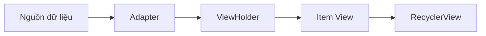
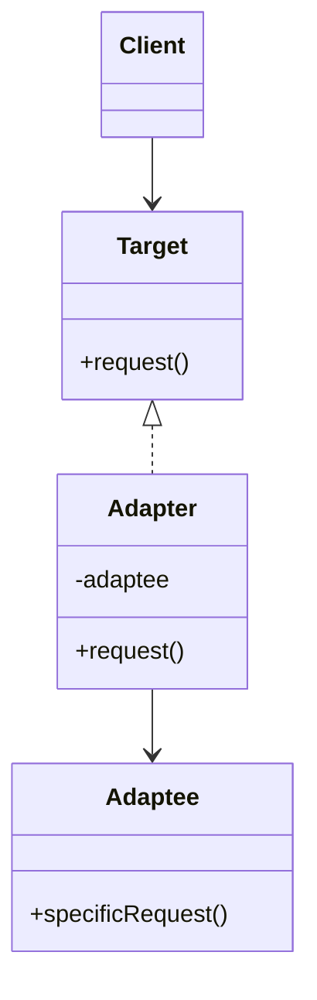
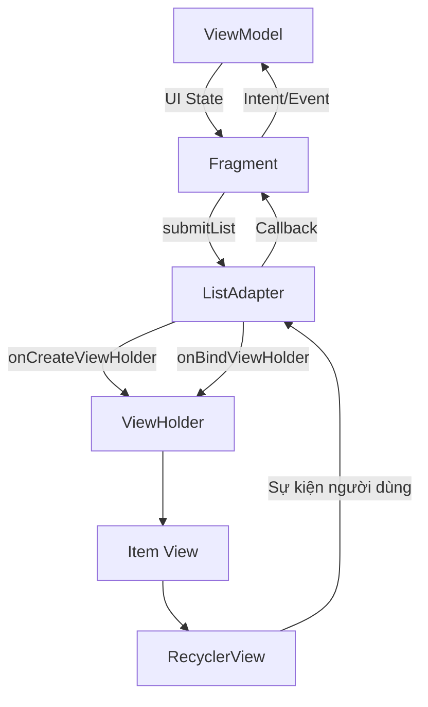
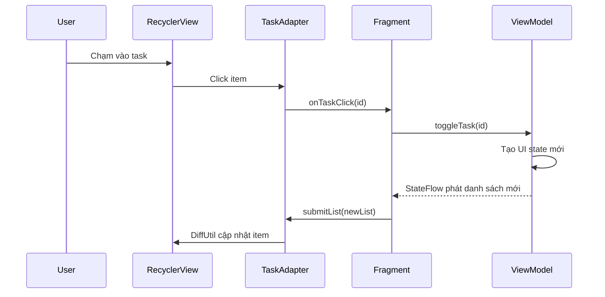
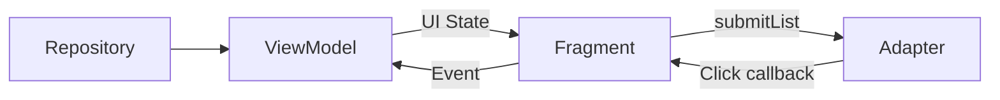
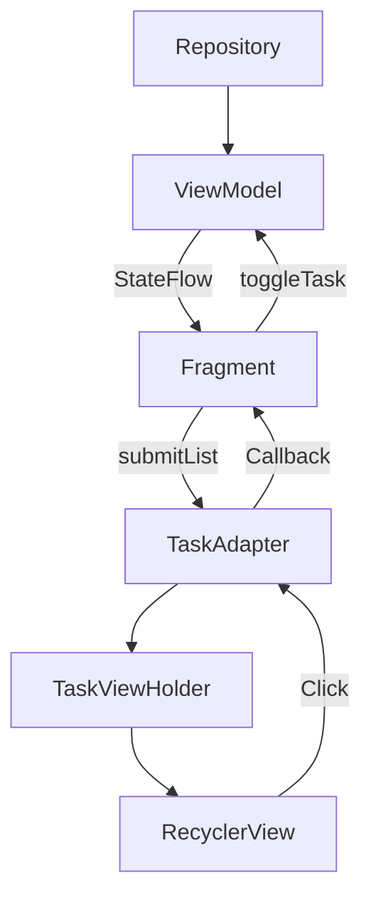

[](https://developer.android.com/topic/architecture/ui-layer?utm_source=chatgpt.com)

# 007 — Adapter Pattern trong Android

**Học phần:** 02 — App Components and User Interface
**Module:** Module 04 — Interface and Navigation
**Nhóm nội dung:** Traditional Layouts
**Nguồn roadmap:** Interface and Navigation / Traditional Layouts
**Loại bài:** UI
**Thứ tự trong module:** 007
**Thời lượng gợi ý:** 30 phút

---

## 1. Tóm tắt


> Hình minh họa một danh sách Android mà dữ liệu của từng hàng được cung cấp thông qua Adapter.
> Nguồn ảnh: Android Developers.

**Adapter Pattern** là một mẫu thiết kế cấu trúc có nhiệm vụ tạo ra một lớp trung gian để hai thành phần có giao diện không tương thích vẫn có thể làm việc với nhau.

Trong giao diện Android truyền thống, Adapter thường được sử dụng để chuyển đổi một nguồn dữ liệu như:

* `List<Product>`
* `List<User>`
* dữ liệu từ Room
* dữ liệu trả về từ API
* dữ liệu phân trang

thành các phần tử giao diện mà `RecyclerView`, `ListView`, `GridView` hoặc `Spinner` có thể hiển thị.

Với `RecyclerView`, Adapter thực hiện hai nhiệm vụ quan trọng:

1. Tạo hoặc tái sử dụng `ViewHolder`.
2. Gắn dữ liệu của một phần tử vào giao diện của `ViewHolder`.

`RecyclerView` chỉ giữ một số lượng View vừa đủ trên màn hình rồi tái sử dụng chúng khi người dùng cuộn. Cơ chế này giúp danh sách lớn hoạt động hiệu quả hơn thay vì tạo một View riêng cho mọi phần tử. ([Android Developers][1])

### Ví dụ trực quan

Giả sử ứng dụng nhận dữ liệu sau:

```kotlin
val tasks = listOf(
    Task(id = 1, title = "Học RecyclerView"),
    Task(id = 2, title = "Viết Adapter"),
    Task(id = 3, title = "Kiểm thử giao diện")
)
```

`RecyclerView` không biết cách biến một đối tượng `Task` thành TextView, CheckBox hay CardView. `TaskAdapter` sẽ đóng vai trò trung gian:

```text
List<Task>
    ↓
TaskAdapter
    ↓
TaskViewHolder
    ↓
item_task.xml
    ↓
Danh sách hiển thị trên màn hình
```

### Sơ đồ tổng quát



### Adapter Pattern trong roadmap Android 2026

Bài này thuộc nhóm **Traditional Layouts**, vì nó liên quan trực tiếp đến hệ thống View dựa trên XML:

```text
XML Layout
   └── RecyclerView
          ├── LayoutManager
          ├── Adapter
          └── ViewHolder
```

Trong Jetpack Compose, `LazyColumn` và `LazyGrid` đảm nhiệm vai trò hiển thị danh sách nhưng không sử dụng lớp `RecyclerView.Adapter`. Khi chuyển từ RecyclerView sang Compose, phần tạo ViewHolder và bind dữ liệu được thay bằng các hàm composable cho từng item. ([Android Developers][2])

---

## 2. Mục tiêu học tập


> Adapter nằm trong UI layer và nhận dữ liệu đã được chuẩn bị từ ViewModel hoặc state holder.
> Nguồn ảnh: Android Developers.

Sau bài học, anh có thể:

* Giải thích Adapter Pattern bằng ngôn ngữ của mình.
* Phân biệt Adapter Pattern tổng quát với `RecyclerView.Adapter`.
* Xác định vai trò của `Adapter`, `ViewHolder`, `LayoutManager` và nguồn dữ liệu.
* Xây dựng một danh sách bằng `RecyclerView` và `ListAdapter`.
* Sử dụng `DiffUtil` để cập nhật danh sách hiệu quả.
* Đưa sự kiện click từ Adapter về Fragment hoặc ViewModel.
* Giữ trạng thái danh sách khi xoay màn hình.
* Kiểm thử thao tác cuộn, click và cập nhật item.
* Nhận biết các lỗi thường gặp do ViewHolder được tái sử dụng.
* Tạo một artifact nhỏ để đưa vào portfolio.

Trong kiến trúc Android hiện đại, ứng dụng thường được chia thành UI layer và data layer; domain layer có thể được thêm vào khi cần xử lý nghiệp vụ phức tạp. Adapter nên nằm trong UI layer và chỉ tập trung vào việc biểu diễn dữ liệu. ([Android Developers][3])

### Kết quả đầu ra mong đợi

Sau khoảng 30 phút, anh nên có:

```text
Task List Screen
├── fragment_task_list.xml
├── item_task.xml
├── TaskUiModel.kt
├── TaskAdapter.kt
├── TaskListViewModel.kt
├── TaskListFragment.kt
├── TaskAdapterTest.kt
└── README.md
```

---

## 3. Khái niệm chính


> Feed là một trường hợp phổ biến sử dụng Adapter để hiển thị nhiều phần tử dữ liệu.
> Nguồn ảnh: Android Developers.

### 3.1. Adapter Pattern tổng quát

Adapter Pattern thường gồm bốn thành phần:

| Thành phần | Vai trò                                     |
| ---------- | ------------------------------------------- |
| Client     | Thành phần cần sử dụng dữ liệu hoặc dịch vụ |
| Target     | Giao diện mà Client hiểu                    |
| Adaptee    | Thành phần hiện có nhưng có giao diện khác  |
| Adapter    | Chuyển đổi Adaptee sang giao diện Target    |



Ví dụ không liên quan đến UI:

```kotlin
interface PaymentProcessor {
    fun pay(amount: Long)
}

class LegacyPaymentService {
    fun makePayment(value: Double) {
        println("Thanh toán $value")
    }
}

class LegacyPaymentAdapter(
    private val legacyService: LegacyPaymentService
) : PaymentProcessor {

    override fun pay(amount: Long) {
        legacyService.makePayment(amount.toDouble())
    }
}
```

`LegacyPaymentAdapter` chuyển giao diện `makePayment(Double)` thành giao diện `pay(Long)` mà ứng dụng đang yêu cầu.

---

### 3.2. Adapter trong giao diện Android

Trong Android, Adapter mang tinh thần của Adapter Pattern: chuyển dữ liệu thành các phần tử UI.

Tuy nhiên, `RecyclerView.Adapter` không hoàn toàn giống sơ đồ Adapter Pattern cổ điển. Nó đồng thời đóng vai trò:

* Factory tạo ViewHolder.
* Binder gắn dữ liệu vào ViewHolder.
* Provider cho biết số lượng và loại item.
* Cầu nối giữa danh sách dữ liệu và RecyclerView.



RecyclerView phối hợp bốn thành phần chính:

| Thành phần      | Trách nhiệm                          |
| --------------- | ------------------------------------ |
| `RecyclerView`  | Chứa và tái sử dụng các item view    |
| `Adapter`       | Tạo ViewHolder và bind dữ liệu       |
| `ViewHolder`    | Giữ tham chiếu đến View của một item |
| `LayoutManager` | Quyết định cách sắp xếp item         |

Đây cũng là cấu trúc được mô tả trong tài liệu RecyclerView chính thức. ([Android Developers][1])

---

### 3.3. Ba phương thức cốt lõi của RecyclerView.Adapter

#### `onCreateViewHolder()`

Được gọi khi RecyclerView cần một ViewHolder mới.

```kotlin
override fun onCreateViewHolder(
    parent: ViewGroup,
    viewType: Int
): TaskViewHolder {
    val binding = ItemTaskBinding.inflate(
        LayoutInflater.from(parent.context),
        parent,
        false
    )

    return TaskViewHolder(binding)
}
```

Chỉ nên thực hiện công việc tạo View tại đây:

* Inflate layout.
* Tạo ViewHolder.
* Không truy vấn database.
* Không gọi API.
* Không thực hiện nghiệp vụ phức tạp.

#### `onBindViewHolder()`

Được gọi khi dữ liệu cần được gắn vào một ViewHolder.

```kotlin
override fun onBindViewHolder(
    holder: TaskViewHolder,
    position: Int
) {
    holder.bind(getItem(position))
}
```

Mọi trạng thái hiển thị phải được thiết lập lại đầy đủ trong `bind()`. ViewHolder có thể từng hiển thị một item khác trước đó.

#### `getItemCount()`

Cho RecyclerView biết số item cần hiển thị.

Khi kế thừa trực tiếp từ `RecyclerView.Adapter`:

```kotlin
override fun getItemCount(): Int = tasks.size
```

Khi sử dụng `ListAdapter`, phương thức này đã được quản lý dựa trên danh sách hiện tại.

---

### 3.4. ViewHolder Pattern

ViewHolder lưu giữ các tham chiếu tới View của một item để Adapter không phải tìm lại chúng nhiều lần.

```kotlin
class TaskViewHolder(
    private val binding: ItemTaskBinding
) : RecyclerView.ViewHolder(binding.root) {

    fun bind(task: TaskUiModel) {
        binding.taskTitleTextView.text = task.title
        binding.taskCheckBox.isChecked = task.isCompleted
    }
}
```

Khi dùng View Binding, lớp binding cung cấp tham chiếu trực tiếp đến các View có ID và thường thay thế nhu cầu sử dụng `findViewById()`. ([Android Developers][4])

---

### 3.5. RecyclerView.Adapter và ListAdapter

#### RecyclerView.Adapter

Phù hợp khi:

* Danh sách rất đơn giản.
* Anh muốn tự kiểm soát toàn bộ quá trình cập nhật.
* Dữ liệu không thay đổi thường xuyên.
* Adapter không được hỗ trợ bởi một `List<T>` thông thường.

```kotlin
class BasicTaskAdapter(
    private var tasks: List<TaskUiModel>
) : RecyclerView.Adapter<TaskViewHolder>()
```

Anh phải tự gọi:

```kotlin
notifyItemInserted(position)
notifyItemRemoved(position)
notifyItemChanged(position)
```

#### ListAdapter

Phù hợp với phần lớn danh sách hiện đại:

```kotlin
class TaskAdapter :
    ListAdapter<TaskUiModel, TaskViewHolder>(TaskDiffCallback)
```

`ListAdapter` sử dụng `DiffUtil` để so sánh danh sách cũ và mới, sau đó gửi các thao tác cập nhật cần thiết đến RecyclerView. Việc tính toán khác biệt được thiết kế để tránh cập nhật lại toàn bộ danh sách. ([Android Developers][5])

---

### 3.6. DiffUtil

`DiffUtil.ItemCallback` cần trả lời hai câu hỏi khác nhau.

#### Hai item có đại diện cho cùng một thực thể không?

```kotlin
override fun areItemsTheSame(
    oldItem: TaskUiModel,
    newItem: TaskUiModel
): Boolean {
    return oldItem.id == newItem.id
}
```

So sánh **identity**, thường bằng ID.

#### Nội dung hiển thị có giống nhau không?

```kotlin
override fun areContentsTheSame(
    oldItem: TaskUiModel,
    newItem: TaskUiModel
): Boolean {
    return oldItem == newItem
}
```

So sánh các trường ảnh hưởng đến giao diện.

```kotlin
object TaskDiffCallback :
    DiffUtil.ItemCallback<TaskUiModel>() {

    override fun areItemsTheSame(
        oldItem: TaskUiModel,
        newItem: TaskUiModel
    ): Boolean = oldItem.id == newItem.id

    override fun areContentsTheSame(
        oldItem: TaskUiModel,
        newItem: TaskUiModel
    ): Boolean = oldItem == newItem
}
```

### Sai lầm phổ biến

```kotlin
override fun areItemsTheSame(old: Task, new: Task): Boolean {
    return old == new
}
```

Cách này có thể khiến một item bị xem là item khác chỉ vì tiêu đề hoặc trạng thái hoàn thành thay đổi.

---

### 3.7. Adapter không nên giữ business logic

Adapter nên chịu trách nhiệm:

* Hiển thị dữ liệu.
* Chuyển đổi model thành thuộc tính View.
* Phát sự kiện click qua callback.
* Quản lý nhiều loại ViewHolder nếu cần.

Adapter không nên:

* Gọi API.
* Truy cập Room.
* Điều hướng trực tiếp.
* Tạo hoặc quản lý ViewModel.
* Chứa nguồn dữ liệu duy nhất của màn hình.
* Quyết định quy tắc nghiệp vụ.

Tài liệu Android khuyến cáo không truyền trực tiếp ViewModel vào RecyclerView Adapter vì điều đó tạo liên kết chặt giữa Adapter và ViewModel. Thay vào đó, Adapter nên phát callback để Fragment hoặc Activity xử lý. ([Android Developers][6])

```kotlin
class TaskAdapter(
    private val onTaskClick: (Long) -> Unit
)
```

---

### 3.8. Adapter trong Views và Compose

| Hệ thống UI     | Cách hiển thị danh sách                        |
| --------------- | ---------------------------------------------- |
| XML Views       | `RecyclerView` + `Adapter` + `ViewHolder`      |
| Jetpack Compose | `LazyColumn` hoặc `LazyGrid` + `items()`       |
| ListView cũ     | `ListView` + `ArrayAdapter` hoặc `BaseAdapter` |
| Spinner         | `Spinner` + `ArrayAdapter`                     |

Ví dụ Compose tương đương:

```kotlin
@Composable
fun TaskList(
    tasks: List<TaskUiModel>,
    onTaskClick: (Long) -> Unit
) {
    LazyColumn {
        items(
            items = tasks,
            key = { task -> task.id }
        ) { task ->
            TaskItem(
                task = task,
                onClick = { onTaskClick(task.id) }
            )
        }
    }
}
```

Compose không có sự tách biệt tương ứng giữa `onCreateViewHolder()` và `onBindViewHolder()`; việc tạo giao diện và cung cấp dữ liệu được thực hiện trong composable item. ([Android Developers][2])

---

## 4. Thực hành


> Mỗi item trong danh sách phải hiển thị đúng dữ liệu ngay cả khi đã được tái sử dụng.
> Nguồn ảnh: Android Developers.

### 4.1. Yêu cầu màn hình

Xây dựng màn hình danh sách công việc:

* Hiển thị tiêu đề công việc.
* Hiển thị trạng thái hoàn thành.
* Chạm vào item để đổi trạng thái.
* Danh sách được giữ lại khi xoay màn hình.
* Chỉ item thay đổi được cập nhật.
* Dữ liệu thuộc quyền sở hữu của ViewModel.



---

### 4.2. Bật View Binding

Trong `build.gradle.kts` của module ứng dụng:

```kotlin
android {
    buildFeatures {
        viewBinding = true
    }
}
```

RecyclerView có thể được quản lý bằng version catalog:

```kotlin
dependencies {
    implementation(libs.androidx.recyclerview)
}
```

---

### 4.3. Model cho UI

```kotlin
data class TaskUiModel(
    val id: Long,
    val title: String,
    val isCompleted: Boolean
)
```

Nên sử dụng model bất biến. Mỗi lần thay đổi trạng thái, tạo object hoặc danh sách mới.

---

### 4.4. Layout của màn hình

Tệp `res/layout/fragment_task_list.xml`:

```xml
<?xml version="1.0" encoding="utf-8"?>
<FrameLayout
    xmlns:android="http://schemas.android.com/apk/res/android"
    xmlns:app="http://schemas.android.com/apk/res-auto"
    android:layout_width="match_parent"
    android:layout_height="match_parent">

    <androidx.recyclerview.widget.RecyclerView
        android:id="@+id/taskRecyclerView"
        android:layout_width="match_parent"
        android:layout_height="match_parent"
        android:clipToPadding="false"
        android:padding="16dp"
        app:layoutManager="androidx.recyclerview.widget.LinearLayoutManager" />

    <TextView
        android:id="@+id/emptyTextView"
        android:layout_width="wrap_content"
        android:layout_height="wrap_content"
        android:layout_gravity="center"
        android:text="@string/no_tasks"
        android:visibility="gone" />

</FrameLayout>
```

---

### 4.5. Layout của một item

Tệp `res/layout/item_task.xml`:

```xml
<?xml version="1.0" encoding="utf-8"?>
<com.google.android.material.card.MaterialCardView
    xmlns:android="http://schemas.android.com/apk/res/android"
    xmlns:app="http://schemas.android.com/apk/res-auto"
    android:id="@+id/taskCard"
    android:layout_width="match_parent"
    android:layout_height="wrap_content"
    android:layout_marginBottom="8dp"
    android:clickable="true"
    android:focusable="true"
    android:foreground="?attr/selectableItemBackground"
    app:cardCornerRadius="12dp"
    app:cardElevation="2dp">

    <LinearLayout
        android:layout_width="match_parent"
        android:layout_height="wrap_content"
        android:gravity="center_vertical"
        android:minHeight="64dp"
        android:orientation="horizontal"
        android:padding="16dp">

        <CheckBox
            android:id="@+id/taskCheckBox"
            android:layout_width="wrap_content"
            android:layout_height="wrap_content"
            android:clickable="false"
            android:focusable="false"
            android:importantForAccessibility="no" />

        <TextView
            android:id="@+id/taskTitleTextView"
            android:layout_width="0dp"
            android:layout_height="wrap_content"
            android:layout_marginStart="12dp"
            android:layout_weight="1"
            android:textAppearance="?attr/textAppearanceBodyLarge" />

    </LinearLayout>

</com.google.android.material.card.MaterialCardView>
```

---

### 4.6. Tạo DiffUtil callback

```kotlin
object TaskDiffCallback :
    DiffUtil.ItemCallback<TaskUiModel>() {

    override fun areItemsTheSame(
        oldItem: TaskUiModel,
        newItem: TaskUiModel
    ): Boolean {
        return oldItem.id == newItem.id
    }

    override fun areContentsTheSame(
        oldItem: TaskUiModel,
        newItem: TaskUiModel
    ): Boolean {
        return oldItem == newItem
    }
}
```

---

### 4.7. Tạo TaskAdapter

```kotlin
class TaskAdapter(
    private val onTaskClick: (taskId: Long) -> Unit
) : ListAdapter<TaskUiModel, TaskAdapter.TaskViewHolder>(
    TaskDiffCallback
) {

    init {
        stateRestorationPolicy =
            StateRestorationPolicy.PREVENT_WHEN_EMPTY
    }

    override fun onCreateViewHolder(
        parent: ViewGroup,
        viewType: Int
    ): TaskViewHolder {
        val inflater = LayoutInflater.from(parent.context)

        val binding = ItemTaskBinding.inflate(
            inflater,
            parent,
            false
        )

        return TaskViewHolder(
            binding = binding,
            onTaskClick = onTaskClick
        )
    }

    override fun onBindViewHolder(
        holder: TaskViewHolder,
        position: Int
    ) {
        holder.bind(getItem(position))
    }

    class TaskViewHolder(
        private val binding: ItemTaskBinding,
        private val onTaskClick: (Long) -> Unit
    ) : RecyclerView.ViewHolder(binding.root) {

        fun bind(task: TaskUiModel) {
            binding.taskTitleTextView.text = task.title
            binding.taskCheckBox.isChecked = task.isCompleted

            binding.taskTitleTextView.paintFlags =
                if (task.isCompleted) {
                    binding.taskTitleTextView.paintFlags or
                        Paint.STRIKE_THRU_TEXT_FLAG
                } else {
                    binding.taskTitleTextView.paintFlags and
                        Paint.STRIKE_THRU_TEXT_FLAG.inv()
                }

            binding.root.contentDescription =
                if (task.isCompleted) {
                    "${task.title}, đã hoàn thành"
                } else {
                    "${task.title}, chưa hoàn thành"
                }

            binding.root.setOnClickListener {
                onTaskClick(task.id)
            }
        }
    }
}
```

### Vì sao không dùng `position` trong callback?

Không nên lưu `position` từ thời điểm bind:

```kotlin
// Không nên
binding.root.setOnClickListener {
    onTaskClick(position)
}
```

Vị trí của item có thể thay đổi sau khi thêm, xóa hoặc sắp xếp danh sách.

Nên gửi ID của object đang được bind:

```kotlin
binding.root.setOnClickListener {
    onTaskClick(task.id)
}
```

---

### 4.8. ViewModel quản lý state

```kotlin
class TaskListViewModel : ViewModel() {

    private val _tasks = MutableStateFlow(
        listOf(
            TaskUiModel(
                id = 1,
                title = "Học Adapter Pattern",
                isCompleted = false
            ),
            TaskUiModel(
                id = 2,
                title = "Tạo RecyclerView",
                isCompleted = true
            ),
            TaskUiModel(
                id = 3,
                title = "Viết UI test",
                isCompleted = false
            )
        )
    )

    val tasks: StateFlow<List<TaskUiModel>> =
        _tasks.asStateFlow()

    fun toggleTask(taskId: Long) {
        _tasks.update { currentTasks ->
            currentTasks.map { task ->
                if (task.id == taskId) {
                    task.copy(
                        isCompleted = !task.isCompleted
                    )
                } else {
                    task
                }
            }
        }
    }
}
```

ViewModel giữ dữ liệu màn hình qua các configuration change như xoay thiết bị. Với dữ liệu cần tồn tại cả sau process death, có thể sử dụng `SavedStateHandle` hoặc lưu trong Room. ([Android Developers][7])

---

### 4.9. Fragment kết nối state với Adapter

```kotlin
class TaskListFragment :
    Fragment(R.layout.fragment_task_list) {

    private var _binding: FragmentTaskListBinding? = null

    private val binding: FragmentTaskListBinding
        get() = requireNotNull(_binding)

    private val viewModel: TaskListViewModel by viewModels()

    private val taskAdapter by lazy {
        TaskAdapter(
            onTaskClick = viewModel::toggleTask
        )
    }

    override fun onViewCreated(
        view: View,
        savedInstanceState: Bundle?
    ) {
        super.onViewCreated(view, savedInstanceState)

        _binding = FragmentTaskListBinding.bind(view)

        setupRecyclerView()
        observeUiState()
    }

    private fun setupRecyclerView() {
        binding.taskRecyclerView.apply {
            adapter = taskAdapter
            setHasFixedSize(true)
        }
    }

    private fun observeUiState() {
        viewLifecycleOwner.lifecycleScope.launch {
            viewLifecycleOwner.repeatOnLifecycle(
                Lifecycle.State.STARTED
            ) {
                viewModel.tasks.collectLatest { tasks ->
                    taskAdapter.submitList(tasks)

                    binding.emptyTextView.isVisible =
                        tasks.isEmpty()
                }
            }
        }
    }

    override fun onDestroyView() {
        binding.taskRecyclerView.adapter = null
        _binding = null
        super.onDestroyView()
    }
}
```

### Luồng dữ liệu

```text
ViewModel.tasks
      ↓
Fragment collect StateFlow
      ↓
taskAdapter.submitList()
      ↓
DiffUtil so sánh danh sách
      ↓
RecyclerView cập nhật item
```

---

### 4.10. Không mutate danh sách hiện tại

Không nên:

```kotlin
val list = taskAdapter.currentList
list[0].isCompleted = true
taskAdapter.submitList(list)
```

Ngoài việc `currentList` không nên bị chỉnh sửa, việc gửi lại cùng một danh sách hoặc thay đổi object tại chỗ có thể khiến quá trình so sánh không nhận ra thay đổi đúng cách.

Nên tạo dữ liệu bất biến mới:

```kotlin
val updatedTasks = currentTasks.map { task ->
    if (task.id == taskId) {
        task.copy(isCompleted = !task.isCompleted)
    } else {
        task
    }
}

_tasks.value = updatedTasks
```

---

## 5. Bài tập


> ViewModel tiếp tục tồn tại khi Activity bị tạo lại do xoay màn hình.
> Nguồn ảnh: Android Developers.

### Bài tập 1 — Danh sách liên hệ

Tạo ứng dụng hiển thị:

```kotlin
data class ContactUiModel(
    val id: Long,
    val name: String,
    val phone: String,
    val isFavorite: Boolean
)
```

Mỗi item gồm:

* Ảnh đại diện.
* Tên.
* Số điện thoại.
* Nút yêu thích.

Yêu cầu:

* Chạm vào biểu tượng sao để đổi `isFavorite`.
* Sắp xếp liên hệ yêu thích lên đầu.
* Sử dụng `ListAdapter`.
* Không gọi `notifyDataSetChanged()`.

---

### Bài tập 2 — Nhiều loại ViewHolder

Tạo danh sách gồm ba loại item:

```text
Header
Product
Loading
```

Gợi ý:

```kotlin
sealed interface ProductListItem {

    data class Header(
        val title: String
    ) : ProductListItem

    data class Product(
        val id: Long,
        val name: String,
        val price: Long
    ) : ProductListItem

    data object Loading : ProductListItem
}
```

Cài đặt:

```kotlin
override fun getItemViewType(position: Int): Int {
    return when (getItem(position)) {
        is ProductListItem.Header -> VIEW_TYPE_HEADER
        is ProductListItem.Product -> VIEW_TYPE_PRODUCT
        ProductListItem.Loading -> VIEW_TYPE_LOADING
    }
}
```

---

### Bài tập 3 — Empty, loading và error state

Thay đổi UI state:

```kotlin
sealed interface TaskListUiState {

    data object Loading : TaskListUiState

    data class Success(
        val tasks: List<TaskUiModel>
    ) : TaskListUiState

    data class Error(
        val message: String
    ) : TaskListUiState
}
```

Màn hình cần hiển thị:

| State              | Giao diện                    |
| ------------------ | ---------------------------- |
| Loading            | ProgressIndicator            |
| Success có dữ liệu | RecyclerView                 |
| Success rỗng       | Empty view                   |
| Error              | Thông báo lỗi và nút thử lại |

---

### Bài tập 4 — Kiểm thử DiffUtil

```kotlin
class TaskDiffCallbackTest {

    private val callback = TaskDiffCallback

    @Test
    fun sameId_itemsAreTheSame() {
        val oldTask = TaskUiModel(
            id = 1,
            title = "Old title",
            isCompleted = false
        )

        val newTask = TaskUiModel(
            id = 1,
            title = "New title",
            isCompleted = false
        )

        assertTrue(
            callback.areItemsTheSame(
                oldTask,
                newTask
            )
        )
    }

    @Test
    fun changedCompletion_contentsAreDifferent() {
        val oldTask = TaskUiModel(
            id = 1,
            title = "Task",
            isCompleted = false
        )

        val newTask = oldTask.copy(
            isCompleted = true
        )

        assertFalse(
            callback.areContentsTheSame(
                oldTask,
                newTask
            )
        )
    }
}
```

---

### Bài tập 5 — UI test cho RecyclerView

```kotlin
@Test
fun clickTask_updatesCompletionState() {
    onView(withId(R.id.taskRecyclerView))
        .perform(
            RecyclerViewActions.actionOnItem<RecyclerView.ViewHolder>(
                hasDescendant(
                    withText("Học Adapter Pattern")
                ),
                click()
            )
        )

    onView(
        allOf(
            withId(R.id.taskCheckBox),
            hasSibling(
                withText("Học Adapter Pattern")
            )
        )
    ).check(matches(isChecked()))
}
```

Espresso cung cấp `RecyclerViewActions` để cuộn đến vị trí, tìm ViewHolder hoặc thực hiện hành động trên một item chưa xuất hiện sẵn trong viewport. ([Android Developers][8])

---

### Bài tập 6 — So sánh Views và Compose

Viết cùng một danh sách bằng hai cách:

```text
Phiên bản A
RecyclerView + ListAdapter + ViewHolder

Phiên bản B
LazyColumn + items(key = ...)
```

So sánh:

| Tiêu chí      | RecyclerView         | LazyColumn                     |
| ------------- | -------------------- | ------------------------------ |
| Item layout   | XML hoặc View        | Composable                     |
| Adapter class | Có                   | Không                          |
| ViewHolder    | Có                   | Không                          |
| Diffing       | ListAdapter/DiffUtil | Compose xử lý qua state và key |
| Dự án legacy  | Phù hợp              | Cần migration                  |
| UI mới        | Vẫn dùng được        | Thường được ưu tiên            |

---

## 6. Checklist hoàn thành


> Danh sách dài cần được kiểm tra cả các item ngoài vùng hiển thị ban đầu.
> Nguồn ảnh: Android Developers.

### Kiến thức

* [ ] Giải thích được mục đích của Adapter Pattern.
* [ ] Phân biệt được Adapter, ViewHolder và RecyclerView.
* [ ] Biết Adapter nằm trong UI layer.
* [ ] Phân biệt `RecyclerView.Adapter` và `ListAdapter`.
* [ ] Hiểu sự khác nhau giữa identity và content trong DiffUtil.
* [ ] Biết vì sao Adapter không nên giữ ViewModel.
* [ ] Biết Compose không sử dụng `RecyclerView.Adapter`.

### Code

* [ ] Có model bất biến cho item.
* [ ] Có XML cho RecyclerView.
* [ ] Có XML cho từng item.
* [ ] Có `DiffUtil.ItemCallback`.
* [ ] Có `ListAdapter`.
* [ ] Có ViewHolder sử dụng View Binding.
* [ ] Có callback cho thao tác người dùng.
* [ ] Fragment gọi `submitList()`.
* [ ] ViewModel là nguồn dữ liệu chính.
* [ ] Không mutate `currentList`.
* [ ] Không gọi `notifyDataSetChanged()` cho thay đổi nhỏ.

### Kiểm thử thủ công

* [ ] Danh sách cuộn mượt.
* [ ] Item đầu tiên hiển thị đúng.
* [ ] Item cuối cùng hiển thị đúng.
* [ ] Chạm một item chỉ thay đổi đúng item đó.
* [ ] Cuộn xuống rồi quay lại không xuất hiện trạng thái sai.
* [ ] Xoay thiết bị không làm mất trạng thái.
* [ ] Danh sách rỗng hiển thị empty state.
* [ ] Dữ liệu lỗi hiển thị nút thử lại.
* [ ] Nhấn nhanh nhiều lần không làm sai trạng thái.
* [ ] TalkBack đọc được nội dung và trạng thái item.
* [ ] Font lớn không làm text bị cắt.
* [ ] Màn hình nhỏ và tablet vẫn hiển thị hợp lý.

### Artifact cho portfolio

* [ ] Một ảnh chụp màn hình danh sách.
* [ ] Một GIF hoặc video ngắn thể hiện cập nhật item.
* [ ] Một sơ đồ luồng dữ liệu.
* [ ] Một file README giải thích Adapter Pattern.
* [ ] Ít nhất một unit test cho DiffUtil.
* [ ] Ít nhất một UI test cho RecyclerView.
* [ ] Một ghi chú về tối ưu hiệu năng.

---

## 7. Ghi chú sản xuất


> Adapter là thành phần biểu diễn UI; state holder như ViewModel mới nên quản lý state của màn hình.
> Nguồn ảnh: Android Developers.

### 7.1. Luôn reset toàn bộ thuộc tính khi bind

Do ViewHolder được tái sử dụng, mọi thuộc tính phụ thuộc vào dữ liệu phải được thiết lập trong mỗi lần `bind()`.

Không nên:

```kotlin
if (task.isCompleted) {
    title.paintFlags =
        title.paintFlags or Paint.STRIKE_THRU_TEXT_FLAG
}
```

Khi ViewHolder được tái sử dụng cho task chưa hoàn thành, gạch ngang có thể vẫn còn.

Nên có cả hai nhánh:

```kotlin
title.paintFlags =
    if (task.isCompleted) {
        title.paintFlags or Paint.STRIKE_THRU_TEXT_FLAG
    } else {
        title.paintFlags and
            Paint.STRIKE_THRU_TEXT_FLAG.inv()
    }
```

Các thuộc tính thường bị bỏ quên:

* `visibility`
* `isEnabled`
* `isSelected`
* `isChecked`
* `alpha`
* `textColor`
* `background`
* `contentDescription`
* trạng thái loading
* placeholder của ảnh
* listener cũ

---

### 7.2. Tránh notifyDataSetChanged()

```kotlin
adapter.notifyDataSetChanged()
```

Lệnh này thông báo rằng toàn bộ danh sách đã thay đổi. RecyclerView có thể phải bind và layout lại nhiều item không cần thiết.

Với thay đổi nhỏ, Android khuyến nghị sử dụng các thao tác cập nhật cụ thể hoặc `DiffUtil` để tính toán cập nhật tối thiểu. ([Android Developers][9])

Ưu tiên:

```kotlin
adapter.submitList(updatedTasks)
```

Thay vì:

```kotlin
adapter.tasks = updatedTasks
adapter.notifyDataSetChanged()
```

---

### 7.3. Không tạo lại Adapter mỗi lần state thay đổi

Không nên:

```kotlin
viewModel.tasks.collect { tasks ->
    binding.taskRecyclerView.adapter =
        TaskAdapter(tasks)
}
```

Cách này có thể:

* Mất scroll position.
* Tạo thêm object.
* Làm mất animation cập nhật.
* Khiến toàn bộ danh sách được bind lại.

Nên tạo Adapter một lần:

```kotlin
private val taskAdapter = TaskAdapter(::onTaskClick)
```

Sau đó chỉ cập nhật dữ liệu:

```kotlin
taskAdapter.submitList(tasks)
```

---

### 7.4. Adapter không phải nguồn sự thật

Không nên giữ hai nguồn dữ liệu có thể thay đổi độc lập:

```text
ViewModel.tasks
Adapter.mutableTasks
```

Nên dùng một chiều:



Adapter chỉ nhận snapshot của state để hiển thị.

---

### 7.5. Xử lý lifecycle

ViewModel giữ state qua configuration change, nhưng View và binding của Fragment chỉ tồn tại từ `onCreateView()` đến `onDestroyView()`.

Do đó:

```kotlin
override fun onDestroyView() {
    binding.taskRecyclerView.adapter = null
    _binding = null
    super.onDestroyView()
}
```

Nên thu thập Flow theo lifecycle:

```kotlin
viewLifecycleOwner.repeatOnLifecycle(
    Lifecycle.State.STARTED
) {
    viewModel.tasks.collectLatest(
        taskAdapter::submitList
    )
}
```

Không giữ tham chiếu đến:

* Fragment.
* Activity.
* View Binding của Fragment.
* Dialog.
* ViewModel.

trong Adapter lâu hơn lifecycle cần thiết.

---

### 7.6. Scroll state và state restoration

Nếu dữ liệu được tải bất đồng bộ, RecyclerView có thể cố khôi phục vị trí cuộn khi Adapter vẫn còn rỗng.

Có thể đặt:

```kotlin
stateRestorationPolicy =
    RecyclerView.Adapter.StateRestorationPolicy
        .PREVENT_WHEN_EMPTY
```

RecyclerView sẽ chờ Adapter có dữ liệu trước khi khôi phục state.

Với filter hoặc tìm kiếm, state nên thuộc ViewModel:

```kotlin
data class TaskListUiState(
    val query: String = "",
    val filter: TaskFilter = TaskFilter.All,
    val tasks: List<TaskUiModel> = emptyList()
)
```

---

### 7.7. Tải hình ảnh trong ViewHolder

Khi item chứa ảnh mạng:

```kotlin
fun bind(product: ProductUiModel) {
    binding.productImageView.load(product.imageUrl) {
        placeholder(R.drawable.image_placeholder)
        error(R.drawable.image_error)
        crossfade(true)
    }
}
```

Cần bảo đảm:

* Luôn đặt placeholder khi bind.
* Request cũ được hủy hoặc thay thế khi ViewHolder tái sử dụng.
* Không tải bitmap kích thước lớn hơn cần thiết.
* Không thực hiện network request thủ công trong Adapter.
* Có trạng thái lỗi khi ảnh không tải được.

---

### 7.8. Nhiều ViewHolder

Khi danh sách có nhiều loại item, không nên dồn mọi thứ vào một layout lớn chứa nhiều View `gone`.

Có thể sử dụng:

* Nhiều ViewHolder.
* Sealed interface cho item.
* `ConcatAdapter` để ghép nhiều Adapter.
* `PagingDataAdapter` khi dữ liệu phân trang.
* `LoadStateAdapter` cho loading và retry.

Ví dụ cấu trúc:

```text
ConcatAdapter
├── HeaderAdapter
├── ProductPagingAdapter
└── FooterLoadStateAdapter
```

---

### 7.9. Accessibility

Mỗi item cần:

* Vùng chạm đủ lớn.
* Nội dung được TalkBack đọc rõ.
* Không dùng màu làm dấu hiệu duy nhất.
* Trạng thái chọn hoặc hoàn thành được công bố.
* Thứ tự focus hợp lý.
* Hỗ trợ font scale lớn.

Ví dụ:

```kotlin
binding.root.contentDescription = buildString {
    append(task.title)

    if (task.isCompleted) {
        append(", đã hoàn thành")
    } else {
        append(", chưa hoàn thành")
    }

    append(", nhấn hai lần để thay đổi trạng thái")
}
```

---

### 7.10. Release checklist

| Rủi ro                                | Cách kiểm tra                               |
| ------------------------------------- | ------------------------------------------- |
| Dữ liệu sai do ViewHolder tái sử dụng | Cuộn nhanh lên xuống nhiều lần              |
| Mất state khi rotate                  | Bật task, xoay thiết bị                     |
| Jank khi cập nhật                     | Kiểm tra việc dùng `notifyDataSetChanged()` |
| Sai click sau khi reorder             | Sử dụng ID thay vì position                 |
| Memory leak                           | Kiểm tra Adapter không giữ Fragment/View    |
| Danh sách API lớn                     | Sử dụng Paging nếu cần                      |
| Ảnh hiển thị nhầm item                | Kiểm tra placeholder và request recycling   |
| TalkBack không đọc trạng thái         | Chạy Accessibility Scanner                  |
| Empty state không xuất hiện           | Trả về danh sách rỗng                       |
| Retry không hoạt động                 | Mô phỏng mất mạng                           |
| Scroll position bị mất                | Tải lại dữ liệu hoặc xoay màn hình          |
| Animation cập nhật sai                | Thêm, xóa và di chuyển item                 |

---

## 8. Artifact gợi ý cho portfolio

### Tên dự án

```text
TaskFlow — RecyclerView Adapter Pattern Demo
```

### README mẫu

```markdown
# TaskFlow

Ứng dụng Android nhỏ minh họa Adapter Pattern bằng RecyclerView.

## Chức năng

- Hiển thị danh sách công việc.
- Đánh dấu công việc hoàn thành.
- Cập nhật item bằng ListAdapter và DiffUtil.
- Giữ state qua configuration change bằng ViewModel.
- Kiểm thử RecyclerView bằng Espresso.

## Kiến trúc

Repository → ViewModel → Fragment → ListAdapter → ViewHolder

## Kỹ thuật

- Kotlin
- XML Views
- RecyclerView
- ListAdapter
- DiffUtil
- View Binding
- StateFlow
- ViewModel
- Espresso
```

### Sơ đồ đưa vào README



---

## 9. Tóm tắt nhanh

```text
Adapter Pattern
    ↓
Chuyển đổi dữ liệu thành giao diện mà RecyclerView hiểu

RecyclerView
    ↓
Quản lý danh sách và tái sử dụng View

Adapter
    ↓
Tạo ViewHolder và bind dữ liệu

ViewHolder
    ↓
Giữ View của từng item

ListAdapter + DiffUtil
    ↓
Cập nhật đúng những item đã thay đổi

ViewModel
    ↓
Giữ UI state và xử lý sự kiện

Fragment
    ↓
Kết nối state, Adapter và lifecycle
```

Điểm quan trọng nhất:

> **Adapter nên là một lớp hiển thị mỏng: nhận dữ liệu, bind giao diện và phát sự kiện. State và business logic phải thuộc ViewModel hoặc các tầng phía dưới.**

[1]: https://developer.android.com/develop/ui/views/layout/recyclerview "Create dynamic lists with RecyclerView  |  Views  |  Android Developers"
[2]: https://developer.android.com/develop/ui/compose/migrate/migration-scenarios/recycler-view "Migrate RecyclerView to Lazy list  |  Jetpack Compose  |  Android Developers"
[3]: https://developer.android.com/topic/architecture "Guide to app architecture  |  App architecture  |  Android Developers"
[4]: https://developer.android.com/topic/libraries/view-binding?utm_source=chatgpt.com "View binding"
[5]: https://developer.android.com/reference/androidx/recyclerview/widget/ListAdapter?utm_source=chatgpt.com "ListAdapter | API reference"
[6]: https://developer.android.com/topic/architecture/views/ui-layer/events-views?utm_source=chatgpt.com "UI events (Views)"
[7]: https://developer.android.com/topic/libraries/architecture/viewmodel.html?authuser=7 "ViewModel overview  |  App architecture  |  Android Developers"
[8]: https://developer.android.com/training/testing/espresso/lists "Espresso lists  |  Test your app on Android  |  Android Developers"
[9]: https://developer.android.com/topic/performance/vitals/render "Slow rendering  |  App quality  |  Android Developers"

---

# Bài luyện tập

## Mục tiêu


## Đề bài


## Yêu cầu hoàn thành

- [ ] 
- [ ] 
- [ ] 

## Kết quả / lời giải


## Ghi chú
