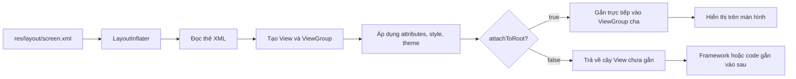
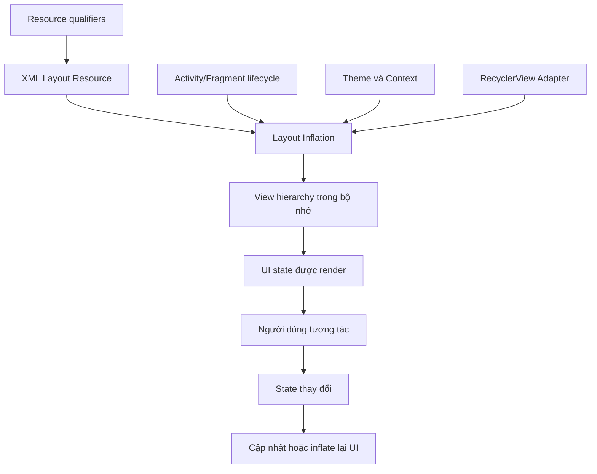
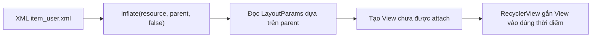
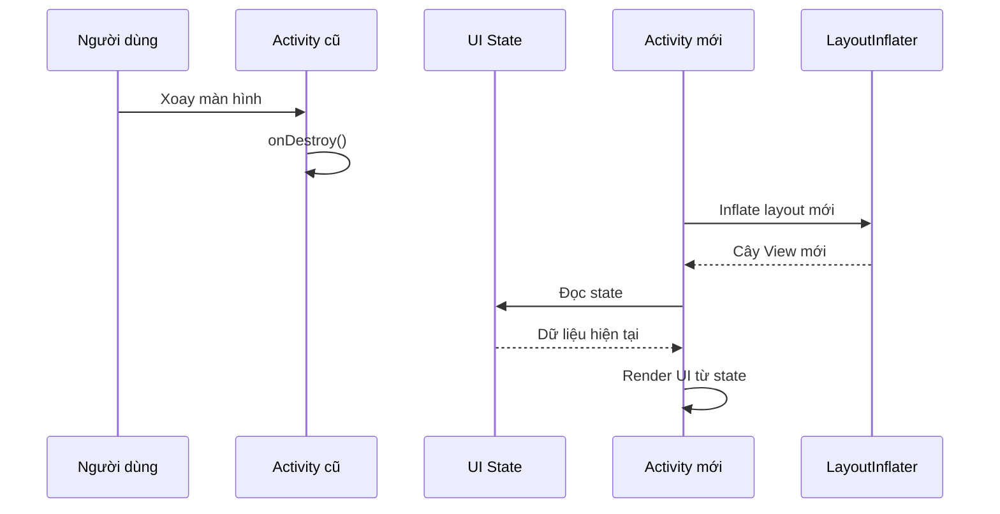
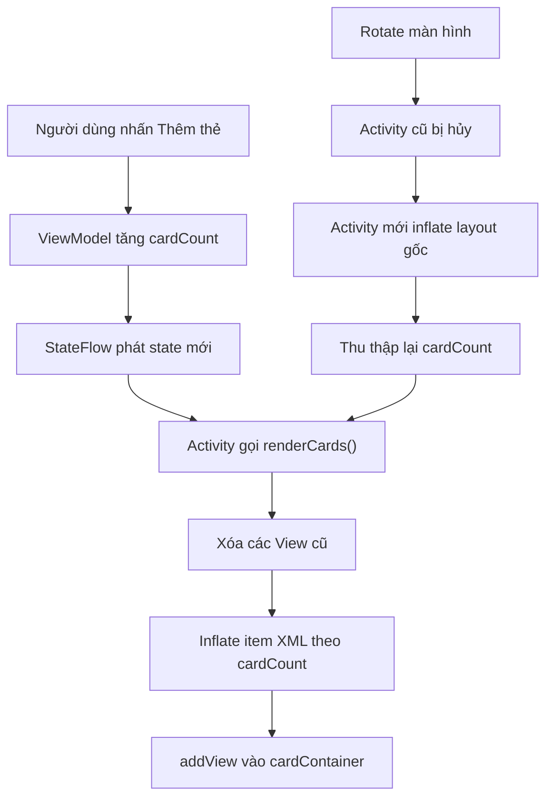
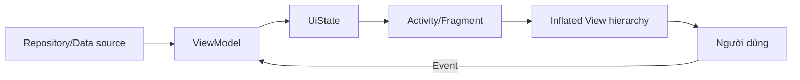

# 008 - Layout Inflation

**Học phần:** 02 - App Components and User Interface
**Module:** Module 04 - Interface and Navigation
**Nhóm nội dung:** Traditional Layouts
**Nguồn roadmap:** Interface and Navigation / Traditional Layouts
**Loại bài:** UI
**Thứ tự trong module:** 008
**Thời lượng gợi ý:** 30 phút

---

## 1. Tóm tắt

**Layout Inflation** là quá trình Android đọc một tệp giao diện XML trong thư mục `res/layout/` và tạo ra cây đối tượng `View`/`ViewGroup` tương ứng trong bộ nhớ.

Ví dụ, đoạn XML:

```xml
<LinearLayout>
    <TextView />
    <Button />
</LinearLayout>
```

sẽ được chuyển thành cây đối tượng lúc chạy:

```text
LinearLayout
├── TextView
└── Button
```

Thành phần chính thực hiện quá trình này là `LayoutInflater`. API này nhận một layout resource, tạo các lớp `View` tương ứng, áp dụng thuộc tính XML, theme và có thể gắn cây vừa tạo vào một `ViewGroup` cha. ([Android Developers][1])

Layout Inflation xuất hiện ở nhiều nơi trong ứng dụng Android sử dụng hệ thống View truyền thống:

* `Activity` nạp màn hình bằng `setContentView()`.
* `Fragment` tạo giao diện trong `onCreateView()`.
* `RecyclerView.Adapter` tạo layout cho từng item.
* Dialog nạp một layout tùy chỉnh.
* Custom View nạp các thành phần con.
* View Binding gọi `inflate()` thông qua lớp binding được sinh tự động.

> **Phạm vi bài học:** Layout Inflation thuộc hệ thống **View/XML truyền thống**. Jetpack Compose xây dựng UI bằng quá trình composition, không sử dụng XML `LayoutInflater` cho các composable thuần Compose.


*Nguồn ảnh minh họa: [Wikimedia Commons – Android Studio Giraffe](https://commons.wikimedia.org/wiki/File:Android_Studio_Giraffe_%282022.3.1%29_screenshot.png). Giao diện Android Studio hiện tại có thể khác ảnh.*

### Sơ đồ tổng quan



---

## 2. Mục tiêu học tập

Sau bài học, người học có thể:

* Giải thích Layout Inflation bằng ngôn ngữ của mình.
* Mô tả quá trình chuyển đổi từ XML thành cây `View`.
* Sử dụng `LayoutInflater.inflate()` đúng cách.
* Phân biệt vai trò của `root` và `attachToRoot`.
* Áp dụng inflation trong `Activity`, `Fragment` và `RecyclerView`.
* Sử dụng View Binding để inflate layout an toàn kiểu dữ liệu.
* Giải thích ảnh hưởng của inflation đến lifecycle và UI state.
* Phát hiện lỗi liên quan đến sai parent, sai context hoặc inflate lặp lại.
* Kiểm tra giao diện sau rotate, đổi theme, đổi font size và đổi kích thước cửa sổ.
* Tạo một ứng dụng nhỏ để đưa vào portfolio.


*Nguồn ảnh minh họa: [Wikimedia Commons – Android System Architecture](https://commons.wikimedia.org/wiki/File:Android-System-Architecture.svg).*

### Vị trí trong ứng dụng



Layout Inflation không trực tiếp tải dữ liệu từ network hoặc database. Tuy nhiên, nó tạo ra các thành phần giao diện dùng để hiển thị dữ liệu và nhận tương tác từ người dùng.

---

## 3. Khái niệm chính


*Nguồn ảnh minh họa: [Wikimedia Commons – Arbre de views](https://commons.wikimedia.org/wiki/File:Arbre_de_views.png).*

### 3.1. Từ XML đến cây View

Các thành phần giao diện Android được tổ chức theo mô hình cây:

* `ViewGroup` là node cha có khả năng chứa thành phần con.
* `View` là thành phần giao diện như `TextView`, `Button` hoặc `ImageView`.
* Một `ViewGroup` cũng có thể chứa các `ViewGroup` khác.

Android đọc tên thẻ XML để xác định lớp cần khởi tạo. Ví dụ:

| Thẻ XML                                       | Đối tượng lúc chạy            |
| --------------------------------------------- | ----------------------------- |
| `<TextView>`                                  | `android.widget.TextView`     |
| `<Button>`                                    | `android.widget.Button`       |
| `<LinearLayout>`                              | `android.widget.LinearLayout` |
| `<androidx.recyclerview.widget.RecyclerView>` | `RecyclerView`                |
| `<com.example.ProfileView>`                   | Custom `ProfileView`          |

Các layout dựa trên View luôn được xây dựng thành một hierarchy gồm các đối tượng `View` và `ViewGroup`. Cây quá sâu hoặc có quá nhiều thành phần có thể làm tăng chi phí khởi tạo, đo kích thước và bố trí giao diện. ([Android Developers][2])

---

### 3.2. `LayoutInflater`

Cách lấy một `LayoutInflater`:

```kotlin
val inflater = LayoutInflater.from(context)
```

Trong `Activity`, có thể dùng trực tiếp:

```kotlin
val inflater = layoutInflater
```

Trong `Fragment`, framework truyền inflater vào:

```kotlin
override fun onCreateView(
    inflater: LayoutInflater,
    container: ViewGroup?,
    savedInstanceState: Bundle?
): View {
    return inflater.inflate(
        R.layout.fragment_profile,
        container,
        false
    )
}
```

Chữ ký thường gặp:

```kotlin
inflate(
    resource: Int,
    root: ViewGroup?,
    attachToRoot: Boolean
): View
```

Trong đó:

* `resource`: ID của XML layout, ví dụ `R.layout.item_user`.
* `root`: `ViewGroup` sẽ trở thành parent của layout.
* `attachToRoot`: có gắn layout vào `root` ngay trong quá trình inflate hay không.

`Context` của inflater đặc biệt quan trọng vì nó cung cấp theme và các giá trị mặc định được sử dụng khi tạo `View`. ([Android Developers][1])

---

### 3.3. Tham số `root`

Nhiều lập trình viên mới cho rằng khi không muốn gắn view ngay thì nên truyền `null`:

```kotlin
val view = inflater.inflate(
    R.layout.item_user,
    null,
    false
)
```

Cách này có thể chạy nhưng thường không tối ưu.

Cách nên dùng trong danh sách hoặc Fragment:

```kotlin
val view = inflater.inflate(
    R.layout.item_user,
    parent,
    false
)
```

Mặc dù view chưa được thêm vào `parent`, inflater vẫn có thể sử dụng `parent` để tạo đúng loại `LayoutParams`.

Ví dụ, nếu item nằm trong `RecyclerView`, `parent` giúp framework thiết lập layout parameters phù hợp với container.



---

### 3.4. Tham số `attachToRoot`

#### Trường hợp `false`

```kotlin
val child = inflater.inflate(
    R.layout.item_user,
    parent,
    false
)
```

Layout được tạo nhưng chưa được thêm vào `parent`.

Dùng khi:

* `FragmentManager` sẽ gắn Fragment View.
* `RecyclerView` sẽ quản lý và gắn item.
* Code cần chỉnh sửa view trước khi gọi `addView()`.

#### Trường hợp `true`

```kotlin
inflater.inflate(
    R.layout.view_profile_content,
    this,
    true
)
```

Layout được tạo và gắn ngay vào parent.

Thường dùng trong custom `ViewGroup`:

```kotlin
class ProfileView @JvmOverloads constructor(
    context: Context,
    attrs: AttributeSet? = null
) : LinearLayout(context, attrs) {

    init {
        orientation = VERTICAL

        LayoutInflater.from(context).inflate(
            R.layout.view_profile_content,
            this,
            true
        )
    }
}
```

#### Bảng quyết định

| `root`   | `attachToRoot` | Kết quả                   | Trường hợp sử dụng                            |
| -------- | -------------: | ------------------------- | --------------------------------------------- |
| `parent` |        `false` | Tạo view, chưa gắn        | Fragment, RecyclerView                        |
| `parent` |         `true` | Tạo và gắn ngay           | Custom ViewGroup                              |
| `null`   |        `false` | Tạo view độc lập          | Một số custom dialog hoặc trường hợp đặc biệt |
| `null`   |         `true` | Không có parent để attach | Nên tránh                                     |

> **Quy tắc dễ nhớ:** truyền đúng parent ngay cả khi `attachToRoot = false`.

---

### 3.5. Inflation trong Activity

Cách truyền thống:

```kotlin
class MainActivity : AppCompatActivity() {

    override fun onCreate(savedInstanceState: Bundle?) {
        super.onCreate(savedInstanceState)

        setContentView(R.layout.activity_main)
    }
}
```

`setContentView()` yêu cầu framework nạp layout và đặt cây View làm nội dung của `Activity`.

Sau đó có thể truy cập view bằng:

```kotlin
val title = findViewById<TextView>(R.id.titleText)
title.text = getString(R.string.welcome)
```

Trong dự án hiện đại sử dụng XML, View Binding thường an toàn hơn.

---

### 3.6. Inflation với View Binding

Bật View Binding trong `build.gradle.kts` của module:

```kotlin
android {
    buildFeatures {
        viewBinding = true
    }
}
```

Giả sử có layout:

```text
activity_layout_inflation.xml
```

Android sinh ra lớp:

```text
ActivityLayoutInflationBinding
```

Sử dụng trong Activity:

```kotlin
class LayoutInflationActivity : AppCompatActivity() {

    private lateinit var binding: ActivityLayoutInflationBinding

    override fun onCreate(savedInstanceState: Bundle?) {
        super.onCreate(savedInstanceState)

        binding = ActivityLayoutInflationBinding.inflate(layoutInflater)
        setContentView(binding.root)

        binding.addButton.setOnClickListener {
            binding.statusText.text = getString(R.string.card_added)
        }
    }
}
```

View Binding sinh một lớp cho mỗi layout XML và tạo reference trực tiếp đến các view có `android:id`. Điều này giúp giảm lỗi sai ID và sai kiểu dữ liệu so với việc ép kiểu bằng `findViewById()`. ([Android Developers][3])

#### View Binding trong Fragment

```kotlin
class ProfileFragment : Fragment() {

    private var _binding: FragmentProfileBinding? = null
    private val binding
        get() = checkNotNull(_binding)

    override fun onCreateView(
        inflater: LayoutInflater,
        container: ViewGroup?,
        savedInstanceState: Bundle?
    ): View {
        _binding = FragmentProfileBinding.inflate(
            inflater,
            container,
            false
        )

        return binding.root
    }

    override fun onDestroyView() {
        super.onDestroyView()
        _binding = null
    }
}
```

Fragment có thể tồn tại lâu hơn cây View của nó. Vì vậy, reference binding phải được giải phóng trong `onDestroyView()` để không giữ lại cây View cũ. ([Android Developers][3])

---

### 3.7. Inflation trong RecyclerView

Trong `RecyclerView.Adapter`, item layout thường được inflate ở `onCreateViewHolder()`:

```kotlin
class UserAdapter(
    private val users: List<User>
) : RecyclerView.Adapter<UserAdapter.UserViewHolder>() {

    class UserViewHolder(
        view: View
    ) : RecyclerView.ViewHolder(view) {

        val nameText: TextView = view.findViewById(R.id.nameText)
    }

    override fun onCreateViewHolder(
        parent: ViewGroup,
        viewType: Int
    ): UserViewHolder {
        val view = LayoutInflater
            .from(parent.context)
            .inflate(
                R.layout.item_user,
                parent,
                false
            )

        return UserViewHolder(view)
    }

    override fun onBindViewHolder(
        holder: UserViewHolder,
        position: Int
    ) {
        holder.nameText.text = users[position].name
    }

    override fun getItemCount(): Int = users.size
}
```

Không nên dùng:

```kotlin
.inflate(R.layout.item_user, parent, true)
```

vì `RecyclerView` tự quản lý việc gắn và tháo item.

`RecyclerView` gọi `onCreateViewHolder()` khi cần tạo một ViewHolder mới, sau đó gọi `onBindViewHolder()` để gắn dữ liệu. Các ViewHolder được tái sử dụng thay vì liên tục tạo lại tất cả item. ([Android Developers][4])

#### Sử dụng View Binding

```kotlin
override fun onCreateViewHolder(
    parent: ViewGroup,
    viewType: Int
): UserViewHolder {
    val binding = ItemUserBinding.inflate(
        LayoutInflater.from(parent.context),
        parent,
        false
    )

    return UserViewHolder(binding)
}
```

---

### 3.8. Lifecycle và UI state

Inflated View chỉ tồn tại trong vòng đời của cây giao diện hiện tại.

Khi cấu hình thiết bị thay đổi, chẳng hạn:

* Xoay màn hình.
* Thay đổi dark mode.
* Thay đổi font size.
* Thay đổi ngôn ngữ.
* Resize cửa sổ.
* Fold hoặc unfold thiết bị.

Android có thể hủy Activity cũ, tạo Activity mới và inflate lại giao diện bằng resource phù hợp với cấu hình mới. Những state chỉ được lưu trong field của Activity cũ có thể bị mất. ([Android Developers][5])



Không nên xem các đối tượng View là nguồn dữ liệu chính:

```kotlin
// Không nên phụ thuộc hoàn toàn vào View để lưu state
var count = binding.counterText.text.toString().toInt()
```

Nên có state holder riêng:

```kotlin
data class ScreenUiState(
    val cardCount: Int = 0,
    val isLoading: Boolean = false,
    val errorMessage: String? = null
)
```

Sau mỗi lần inflate lại, giao diện được dựng từ state:

```text
State ổn định → inflate cây View mới → render state lên View
```

---

### 3.9. Context và theme

Inflater sử dụng `Context` để xác định:

* Theme hiện tại.
* Style mặc định.
* Màu sắc.
* Font.
* Kích thước resource.
* Resource theo locale và cấu hình thiết bị.

Nên dùng:

```kotlin
LayoutInflater.from(parent.context)
```

thay vì lấy một application context không mang theme màn hình:

```kotlin
// Có thể làm giao diện nhận sai theme
LayoutInflater.from(applicationContext)
```

Ví dụ trong Adapter:

```kotlin
val inflater = LayoutInflater.from(parent.context)
```

`parent.context` thường đã chứa theme thích hợp của màn hình hoặc component.

---

### 3.10. Include, merge và ViewStub

#### `<include>`

Dùng lại một layout:

```xml
<include
    android:id="@+id/profileHeader"
    layout="@layout/view_profile_header"
    android:layout_width="match_parent"
    android:layout_height="wrap_content" />
```

Phù hợp với:

* Header dùng ở nhiều màn hình.
* Empty state.
* Loading block.
* Toolbar tùy chỉnh.

#### `<merge>`

`<merge>` loại bỏ một lớp ViewGroup trung gian:

```xml
<merge xmlns:android="http://schemas.android.com/apk/res/android">

    <TextView
        android:layout_width="wrap_content"
        android:layout_height="wrap_content" />

    <Button
        android:layout_width="wrap_content"
        android:layout_height="wrap_content" />

</merge>
```

`<merge>` cần một parent thực tế để các View con được gắn vào trong quá trình inflate. Vì vậy, nó thường đi với `attachToRoot = true`.

#### `ViewStub`

`ViewStub` là placeholder nhẹ, chỉ inflate layout khi thật sự cần:

```xml
<ViewStub
    android:id="@+id/errorStub"
    android:layout_width="match_parent"
    android:layout_height="wrap_content"
    android:layout="@layout/view_error" />
```

```kotlin
val errorView = binding.errorStub.inflate()
```

Phù hợp khi một phần giao diện:

* Ít xuất hiện.
* Chỉ dùng khi có lỗi.
* Chỉ dành cho một nhóm người dùng.
* Có chi phí khởi tạo đáng kể.

Android khuyến nghị kiểm tra hierarchy và chỉ tải các phần giao diện khi cần để hạn chế layout phức tạp và chi phí khởi tạo không cần thiết. ([Android Developers][6])

---

## 4. Thực hành

### 4.1. Yêu cầu ứng dụng

Xây dựng màn hình **Layout Inflation Lab**:

* Có nút **Thêm thẻ**.
* Có nút **Đặt lại**.
* Mỗi lần nhấn, ứng dụng inflate một layout item mới.
* Số lượng thẻ được lưu trong `ViewModel`.
* Khi xoay màn hình, các thẻ được dựng lại từ state.
* Có thể kiểm tra cây giao diện bằng Layout Inspector.


*Nguồn ảnh minh họa: [Wikimedia Commons – Android Studio 3.1](https://commons.wikimedia.org/wiki/File:Android_studio_3_1_screenshot.png). Ảnh chỉ minh họa môi trường phát triển.*

### 4.2. Cấu trúc thư mục

```text
app/
└── src/main/
    ├── java/com/example/layoutinflation/
    │   ├── LayoutInflationActivity.kt
    │   └── LayoutInflationViewModel.kt
    └── res/
        ├── drawable/
        │   └── bg_inflated_card.xml
        ├── layout/
        │   ├── activity_layout_inflation.xml
        │   └── item_inflated_card.xml
        └── values/
            └── strings.xml
```

---

### 4.3. Bật View Binding

```kotlin
android {
    buildFeatures {
        viewBinding = true
    }
}
```

---

### 4.4. Layout màn hình

Tạo `res/layout/activity_layout_inflation.xml`:

```xml
<?xml version="1.0" encoding="utf-8"?>
<LinearLayout
    xmlns:android="http://schemas.android.com/apk/res/android"
    android:layout_width="match_parent"
    android:layout_height="match_parent"
    android:orientation="vertical"
    android:padding="16dp">

    <TextView
        android:id="@+id/titleText"
        android:layout_width="match_parent"
        android:layout_height="wrap_content"
        android:text="@string/layout_inflation_title"
        android:textSize="24sp"
        android:textStyle="bold" />

    <TextView
        android:id="@+id/descriptionText"
        android:layout_width="match_parent"
        android:layout_height="wrap_content"
        android:layout_marginTop="8dp"
        android:text="@string/layout_inflation_description" />

    <LinearLayout
        android:layout_width="match_parent"
        android:layout_height="wrap_content"
        android:layout_marginTop="16dp"
        android:orientation="horizontal">

        <Button
            android:id="@+id/addButton"
            android:layout_width="0dp"
            android:layout_height="wrap_content"
            android:layout_weight="1"
            android:text="@string/add_card" />

        <Button
            android:id="@+id/resetButton"
            android:layout_width="0dp"
            android:layout_height="wrap_content"
            android:layout_marginStart="8dp"
            android:layout_weight="1"
            android:text="@string/reset_cards" />

    </LinearLayout>

    <TextView
        android:id="@+id/statusText"
        android:layout_width="match_parent"
        android:layout_height="wrap_content"
        android:layout_marginTop="12dp"
        android:text="@string/initial_status"
        android:textStyle="bold" />

    <ScrollView
        android:layout_width="match_parent"
        android:layout_height="0dp"
        android:layout_marginTop="12dp"
        android:layout_weight="1">

        <LinearLayout
            android:id="@+id/cardContainer"
            android:layout_width="match_parent"
            android:layout_height="wrap_content"
            android:orientation="vertical" />

    </ScrollView>

</LinearLayout>
```

---

### 4.5. Layout của một item

Tạo `res/layout/item_inflated_card.xml`:

```xml
<?xml version="1.0" encoding="utf-8"?>
<LinearLayout
    xmlns:android="http://schemas.android.com/apk/res/android"
    android:layout_width="match_parent"
    android:layout_height="wrap_content"
    android:layout_marginBottom="8dp"
    android:background="@drawable/bg_inflated_card"
    android:orientation="vertical"
    android:padding="16dp">

    <TextView
        android:id="@+id/cardTitle"
        android:layout_width="match_parent"
        android:layout_height="wrap_content"
        android:textSize="18sp"
        android:textStyle="bold" />

    <TextView
        android:id="@+id/cardDescription"
        android:layout_width="match_parent"
        android:layout_height="wrap_content"
        android:layout_marginTop="4dp"
        android:text="@string/inflated_card_description" />

</LinearLayout>
```

---

### 4.6. Background cho item

Tạo `res/drawable/bg_inflated_card.xml`:

```xml
<?xml version="1.0" encoding="utf-8"?>
<shape
    xmlns:android="http://schemas.android.com/apk/res/android"
    android:shape="rectangle">

    <solid android:color="#F1F3F4" />

    <corners android:radius="12dp" />

    <stroke
        android:width="1dp"
        android:color="#DADCE0" />

</shape>
```

Trong production, nên chuyển màu sang resource hoặc theme attribute để hỗ trợ dark mode.

---

### 4.7. String resources

```xml
<resources>
    <string name="app_name">Layout Inflation Lab</string>

    <string name="layout_inflation_title">
        Layout Inflation Lab
    </string>

    <string name="layout_inflation_description">
        Nhấn nút để inflate một layout XML thành cây View mới.
    </string>

    <string name="add_card">Thêm thẻ</string>
    <string name="reset_cards">Đặt lại</string>

    <string name="initial_status">
        Chưa có thẻ nào được tạo
    </string>

    <string name="card_count">
        Đã inflate %1$d thẻ
    </string>

    <string name="inflated_card_title">
        Thẻ được inflate #%1$d
    </string>

    <string name="inflated_card_description">
        View này được tạo từ item_inflated_card.xml.
    </string>
</resources>
```

---

### 4.8. ViewModel lưu state

```kotlin
package com.example.layoutinflation

import androidx.lifecycle.SavedStateHandle
import androidx.lifecycle.ViewModel
import kotlinx.coroutines.flow.StateFlow

class LayoutInflationViewModel(
    private val savedStateHandle: SavedStateHandle
) : ViewModel() {

    val cardCount: StateFlow<Int> =
        savedStateHandle.getStateFlow(KEY_CARD_COUNT, 0)

    fun addCard() {
        savedStateHandle[KEY_CARD_COUNT] = cardCount.value + 1
    }

    fun resetCards() {
        savedStateHandle[KEY_CARD_COUNT] = 0
    }

    private companion object {
        const val KEY_CARD_COUNT = "card_count"
    }
}
```

---

### 4.9. Activity inflate và render item

```kotlin
package com.example.layoutinflation

import android.os.Bundle
import android.widget.TextView
import androidx.activity.viewModels
import androidx.appcompat.app.AppCompatActivity
import androidx.lifecycle.Lifecycle
import androidx.lifecycle.lifecycleScope
import androidx.lifecycle.repeatOnLifecycle
import com.example.layoutinflation.databinding.ActivityLayoutInflationBinding
import kotlinx.coroutines.launch

class LayoutInflationActivity : AppCompatActivity() {

    private lateinit var binding: ActivityLayoutInflationBinding

    private val viewModel: LayoutInflationViewModel by viewModels()

    override fun onCreate(savedInstanceState: Bundle?) {
        super.onCreate(savedInstanceState)

        binding =
            ActivityLayoutInflationBinding.inflate(layoutInflater)

        setContentView(binding.root)

        setupListeners()
        collectUiState()
    }

    private fun setupListeners() {
        binding.addButton.setOnClickListener {
            viewModel.addCard()
        }

        binding.resetButton.setOnClickListener {
            viewModel.resetCards()
        }
    }

    private fun collectUiState() {
        lifecycleScope.launch {
            repeatOnLifecycle(Lifecycle.State.STARTED) {
                viewModel.cardCount.collect { count ->
                    renderCards(count)
                }
            }
        }
    }

    private fun renderCards(count: Int) {
        binding.cardContainer.removeAllViews()

        repeat(count) { index ->
            val cardView = layoutInflater.inflate(
                R.layout.item_inflated_card,
                binding.cardContainer,
                false
            )

            val titleText =
                cardView.findViewById<TextView>(R.id.cardTitle)

            titleText.text = getString(
                R.string.inflated_card_title,
                index + 1
            )

            binding.cardContainer.addView(cardView)
        }

        binding.statusText.text = if (count == 0) {
            getString(R.string.initial_status)
        } else {
            getString(R.string.card_count, count)
        }
    }
}
```

Điểm quan trọng:

```kotlin
layoutInflater.inflate(
    R.layout.item_inflated_card,
    binding.cardContainer,
    false
)
```

* `binding.cardContainer` được truyền làm parent.
* `false` vì code sẽ gọi `addView()` sau.
* Layout có đúng `LayoutParams` của container.
* Sau rotate, Activity inflate lại layout gốc.
* `cardCount` được đọc từ state và các item được dựng lại.

### Luồng state của ứng dụng



---

### 4.10. Phiên bản dùng View Binding cho item

Thay vì `findViewById()`:

```kotlin
private fun renderCards(count: Int) {
    binding.cardContainer.removeAllViews()

    repeat(count) { index ->
        val itemBinding =
            ItemInflatedCardBinding.inflate(
                layoutInflater,
                binding.cardContainer,
                false
            )

        itemBinding.cardTitle.text = getString(
            R.string.inflated_card_title,
            index + 1
        )

        binding.cardContainer.addView(itemBinding.root)
    }

    binding.statusText.text = getString(
        R.string.card_count,
        count
    )
}
```

Phiên bản này thể hiện rằng View Binding không thay thế Layout Inflation; lớp binding chỉ cung cấp API thuận tiện hơn để inflate và truy cập view.

---

### 4.11. Kết quả mong đợi

```text
┌──────────────────────────────────┐
│ Layout Inflation Lab             │
│ Nhấn nút để inflate layout XML   │
│                                  │
│ [ Thêm thẻ ] [ Đặt lại ]         │
│                                  │
│ Đã inflate 2 thẻ                 │
│                                  │
│ ┌──────────────────────────────┐ │
│ │ Thẻ được inflate #1          │ │
│ │ View được tạo từ XML         │ │
│ └──────────────────────────────┘ │
│                                  │
│ ┌──────────────────────────────┐ │
│ │ Thẻ được inflate #2          │ │
│ │ View được tạo từ XML         │ │
│ └──────────────────────────────┘ │
└──────────────────────────────────┘
```

---

## 5. Bài tập


*Nguồn ảnh minh họa: [Wikimedia Commons – UI hierarchy](https://commons.wikimedia.org/wiki/File:UI_hierarchy.jpg).*

### Bài tập cơ bản

Mở rộng ứng dụng để mỗi thẻ có:

* Tiêu đề.
* Mô tả.
* Nút xóa.
* Số thứ tự.
* Màu nền thay đổi theo trạng thái.

Yêu cầu:

1. Tạo `CardUiModel`.
2. Lưu danh sách card trong ViewModel.
3. Inflate từng item từ state.
4. Khi nhấn xóa, cập nhật state thay vì trực tiếp chỉ xóa View.
5. Xoay màn hình và kiểm tra danh sách còn đúng.

Gợi ý model:

```kotlin
data class CardUiModel(
    val id: Long,
    val title: String,
    val isHighlighted: Boolean = false
)
```

---

### Bài tập `attachToRoot`

Thử ba đoạn code sau và ghi lại kết quả:

#### Trường hợp A

```kotlin
val view = layoutInflater.inflate(
    R.layout.item_inflated_card,
    binding.cardContainer,
    false
)

binding.cardContainer.addView(view)
```

#### Trường hợp B

```kotlin
layoutInflater.inflate(
    R.layout.item_inflated_card,
    binding.cardContainer,
    true
)
```

#### Trường hợp C

```kotlin
val view = layoutInflater.inflate(
    R.layout.item_inflated_card,
    null,
    false
)

binding.cardContainer.addView(view)
```

Trả lời:

* Trường hợp nào tự attach?
* Trường hợp nào cần gọi `addView()`?
* Layout margin có khác nhau không?
* `LayoutParams` của item được tạo từ parent nào?
* Điều gì xảy ra nếu gọi `addView()` sau khi đã inflate với `true`?

---

### Bài tập RecyclerView

Chuyển danh sách card sang `RecyclerView`:

```kotlin
override fun onCreateViewHolder(
    parent: ViewGroup,
    viewType: Int
): CardViewHolder {
    val binding = ItemInflatedCardBinding.inflate(
        LayoutInflater.from(parent.context),
        parent,
        false
    )

    return CardViewHolder(binding)
}
```

Kiểm tra:

* Item có đúng chiều rộng không?
* Scroll có mượt không?
* `onCreateViewHolder()` được gọi bao nhiêu lần?
* `onBindViewHolder()` được gọi bao nhiêu lần?
* View có được tái sử dụng khi scroll không?

---

### Bài tập debugging

Cố ý tạo các lỗi sau:

#### Inflate sai parent

```kotlin
.inflate(R.layout.item_inflated_card, null, false)
```

#### Attach hai lần

```kotlin
val view = layoutInflater.inflate(
    R.layout.item_inflated_card,
    binding.cardContainer,
    true
)

binding.cardContainer.addView(view)
```

#### Giữ Fragment binding sau `onDestroyView()`

```kotlin
override fun onDestroyView() {
    super.onDestroyView()

    // Cố ý không đặt _binding = null
}
```

Sau đó:

* Quan sát exception.
* Đọc stack trace.
* Xác định file XML hoặc dòng Kotlin gây lỗi.
* Dùng Layout Inspector để xem cây View.
* Sửa lỗi và ghi vào README.

Layout Inspector trong Android Studio cho phép xem hierarchy, attributes và các component của ứng dụng đang chạy trên emulator hoặc thiết bị thật. ([Android Developers][7])

---

## 6. Checklist hoàn thành


*Nguồn ảnh minh họa: [Wikimedia Commons – Android basic lifecycle](https://commons.wikimedia.org/wiki/File:Android_doc-basic_lifecycle.png).*

### Kiến thức

* [ ] Giải thích được Layout Inflation là gì.
* [ ] Biết XML layout được chuyển thành cây `View`.
* [ ] Biết vai trò của `LayoutInflater`.
* [ ] Phân biệt `root` và `attachToRoot`.
* [ ] Biết tại sao thường nên truyền parent thay vì `null`.
* [ ] Biết View Binding vẫn sử dụng inflation.
* [ ] Biết Compose thuần không sử dụng XML LayoutInflater.

### Code

* [ ] Inflate được layout trong Activity.
* [ ] Inflate được layout trong Fragment.
* [ ] Inflate được item trong RecyclerView.
* [ ] Không attach item RecyclerView bằng `true`.
* [ ] Dọn Fragment binding trong `onDestroyView()`.
* [ ] Không giữ reference đến Activity hoặc View cũ.
* [ ] Chuyển user-facing text sang `strings.xml`.

### State và lifecycle

* [ ] State không chỉ được lưu trong View.
* [ ] UI có thể dựng lại từ ViewModel hoặc state holder.
* [ ] Sau rotate, dữ liệu vẫn đúng.
* [ ] Sau background rồi quay lại, màn hình không bị reset bất ngờ.
* [ ] Dark mode không làm nội dung mất khả năng đọc.
* [ ] Thay đổi font size không làm nội dung bị cắt.
* [ ] Layout landscape vẫn hoạt động.

### Testing

* [ ] Kiểm tra trạng thái ban đầu.
* [ ] Kiểm tra sau một lần inflate.
* [ ] Kiểm tra sau nhiều lần inflate.
* [ ] Kiểm tra nút reset.
* [ ] Kiểm tra sau rotate.
* [ ] Kiểm tra nhấn nhanh nhiều lần.
* [ ] Kiểm tra danh sách lớn.
* [ ] Kiểm tra bằng Layout Inspector.
* [ ] Kiểm tra TalkBack và thứ tự focus.

### Portfolio artifact

* [ ] Có screenshot màn hình.
* [ ] Có sơ đồ luồng inflation.
* [ ] Có đoạn code `inflate(resource, parent, false)`.
* [ ] Có README giải thích `attachToRoot`.
* [ ] Có checklist test thủ công.
* [ ] Có ghi chú về lifecycle và state.
* [ ] Có commit history rõ ràng.

---

## 7. Ghi chú sản xuất


*Nguồn ảnh minh họa: [Wikimedia Commons – Android Studio 4.1](https://commons.wikimedia.org/wiki/File:Android_Studio_4.1_screenshot.png).*

### 7.1. Không inflate lặp lại không cần thiết

Inflation tạo đối tượng mới và áp dụng attributes cho từng View. Nếu thực hiện quá nhiều lần trên luồng UI, ứng dụng có thể xuất hiện giật hoặc phản hồi chậm.

Không nên:

```kotlin
button.setOnClickListener {
    repeat(1_000) {
        val view = layoutInflater.inflate(
            R.layout.item_large,
            container,
            false
        )

        container.addView(view)
    }
}
```

Với danh sách lớn, nên dùng `RecyclerView`, paging hoặc chỉ tạo những item cần hiển thị. RecyclerView tái sử dụng các item View đã tạo để cải thiện hiệu năng và độ phản hồi. ([Android Developers][8])

---

### 7.2. Giữ hierarchy đơn giản

Một hierarchy quá sâu làm tăng số View cần:

1. Khởi tạo.
2. Đo kích thước.
3. Bố trí.
4. Vẽ.
5. Cập nhật khi state thay đổi.

Ví dụ cần xem xét:

```text
LinearLayout
└── LinearLayout
    └── LinearLayout
        └── FrameLayout
            └── LinearLayout
                └── TextView
```

Có thể làm phẳng:

```text
ConstraintLayout
└── TextView
```

Mỗi widget và layout được thêm vào đều có chi phí khởi tạo, layout và draw; điều này đặc biệt đáng chú ý với layout được inflate nhiều lần trong RecyclerView. ([Android Developers][9])

---

### 7.3. Không giữ reference đến cây View cũ

Ví dụ rủi ro trong Fragment:

```kotlin
private lateinit var binding: FragmentProfileBinding
```

Nếu binding tồn tại sau `onDestroyView()`, Fragment có thể giữ toàn bộ cây View cũ.

Mẫu an toàn:

```kotlin
private var _binding: FragmentProfileBinding? = null

override fun onDestroyView() {
    super.onDestroyView()
    _binding = null
}
```

---

### 7.4. Không lưu dữ liệu nghiệp vụ trong View

Không nên coi các giá trị sau là nguồn dữ liệu chính:

```kotlin
binding.nameInput.text
binding.counterText.text
binding.loadingView.visibility
```

Nên lưu state trong:

* `ViewModel`.
* `SavedStateHandle`.
* Repository.
* Database.
* DataStore.
* Một state holder phù hợp.

View chỉ render trạng thái hiện tại:



Người dùng kỳ vọng dữ liệu nhập, vị trí màn hình và ngữ cảnh sử dụng không biến mất sau các thay đổi cấu hình thông thường. ([Android Developers][5])

---

### 7.5. Kiểm tra theme và context

Các lỗi thường gặp:

* Item RecyclerView nhận sai màu.
* Dialog không dùng theme của màn hình.
* Custom View không nhận style.
* Text có màu khó đọc trong dark mode.
* Layout preview đúng nhưng khi chạy lại sai.

Checklist:

```text
[ ] Inflater lấy context từ parent
[ ] Không dùng applicationContext cho UI có theme
[ ] Màu dùng theme attribute
[ ] Có resource cho night mode nếu cần
[ ] Có default resource cho mọi cấu hình
```

---

### 7.6. Theo dõi lỗi inflation

Một lỗi thường có dạng:

```text
android.view.InflateException:
Binary XML file line #24:
Error inflating class ...
```

Quy trình debug:

1. Đọc layout resource trong stack trace.
2. Kiểm tra đúng dòng XML.
3. Kiểm tra tên custom View.
4. Kiểm tra constructor của custom View.
5. Kiểm tra resource có tồn tại không.
6. Kiểm tra theme attribute.
7. Kiểm tra dependency chứa View.
8. Kiểm tra namespace của class.
9. Chạy Layout Inspector nếu màn hình vẫn mở được.

Custom View nên hỗ trợ constructor XML:

```kotlin
class StatusView @JvmOverloads constructor(
    context: Context,
    attrs: AttributeSet? = null,
    defStyleAttr: Int = 0
) : View(context, attrs, defStyleAttr)
```

---

### 7.7. Đo trước khi tối ưu

Không nên tự động chuyển tất cả inflation sang bất đồng bộ.

AndroidX có `AsyncLayoutInflater` để inflate layout ngoài UI thread trong một số trường hợp, đồng thời có thể fallback về UI thread nếu layout không thể được tạo bất đồng bộ. Chỉ nên áp dụng sau khi profiling cho thấy inflation thật sự gây jank. ([Android Developers][10])

Quy trình:

```text
Phát hiện màn hình chậm
        ↓
Đo bằng profiler hoặc tracing
        ↓
Kiểm tra hierarchy
        ↓
Xác định inflation có phải bottleneck?
        ↓
Tối ưu đúng vị trí
        ↓
Đo lại
```

---

### 7.8. Release checklist

Trước khi phát hành tính năng liên quan đến layout inflation:

```text
[ ] Không có InflateException trên các API hỗ trợ
[ ] Portrait và landscape hoạt động
[ ] Phone, tablet và cửa sổ resize hoạt động
[ ] và landscape hoạt động
[ ] Phone, tablet và cửa Dark mode hiển thị đúng
[ ] Font scale lớn không làm vỡ layout
[ ] Locale dài không làm cắt nội dung
[ ] Rotate không làm mất state
[ ] Fragment không giữ binding cũ
[ ] RecyclerView không attach item thủ công
[ ] Không inflate số lượng lớn trên UI thread
[ ] Không hard-code text của người dùng
[ ] Layout Inspector không cho thấy hierarchy bất thường
[ ] Có test cho user flow chính
```

---

## 8. Lỗi thường gặp

| Lỗi                         | Nguyên nhân                    | Cách sửa                                        |
| --------------------------- | ------------------------------ | ----------------------------------------------- |
| Item có kích thước sai      | Inflate với `root = null`      | Truyền `parent`, dùng `false`                   |
| `View already has a parent` | Attach hai lần                 | Chỉ attach một lần                              |
| RecyclerView crash          | Dùng `attachToRoot = true`     | Đổi thành `false`                               |
| Fragment memory leak        | Không xóa binding              | Đặt `_binding = null`                           |
| Sai màu hoặc style          | Dùng sai Context               | Dùng `parent.context`                           |
| State mất khi rotate        | State nằm trong Activity/View  | Đưa vào ViewModel/state holder                  |
| Scroll giật                 | Inflate layout quá nặng        | Làm phẳng hierarchy, tái sử dụng View           |
| `InflateException`          | Sai class, resource hoặc theme | Đọc dòng XML trong stack trace                  |
| Custom View không inflate   | Thiếu constructor XML          | Thêm constructor nhận `Context`, `AttributeSet` |
| `<merge>` lỗi               | Không có parent phù hợp        | Inflate với parent và attach đúng               |

---

## 9. Câu hỏi tự kiểm tra

1. Layout Inflation là gì?
2. XML layout được chuyển thành loại đối tượng nào?
3. `root` có vai trò gì khi `attachToRoot = false`?
4. Vì sao RecyclerView sử dụng `attachToRoot = false`?
5. Khi nào custom ViewGroup có thể dùng `true`?
6. Vì sao truyền `null` có thể tạo sai `LayoutParams`?
7. View Binding liên quan thế nào đến inflation?
8. Tại sao phải xóa Fragment binding trong `onDestroyView()`?
9. Khi Activity bị recreate, cây View cũ còn tồn tại không?
10. Làm sao để UI được dựng lại đúng từ state?
11. Khi nào nên dùng `ViewStub`?
12. Dùng công cụ nào để kiểm tra View hierarchy?

---

## 10. Artifact portfolio đề xuất

### Tên dự án

```text
Android Layout Inflation Lab
```

### README nên có

```markdown
# Android Layout Inflation Lab

## Mục tiêu

Minh họa cách Android chuyển XML layout thành View hierarchy.

## Nội dung

- LayoutInflater
- root và attachToRoot
- View Binding
- Dynamic View
- ViewModel state
- Configuration change
- Layout Inspector

## Demo

- Thêm item bằng layout inflation
- Reset danh sách
- Giữ state khi rotate

## Bài học rút ra

RecyclerView và Fragment thường inflate với parent khác null
và attachToRoot bằng false.
```

### Screenshot cần chụp

1. Màn hình chưa có item.
2. Màn hình sau khi inflate ba item.
3. Landscape sau rotate.
4. Layout Inspector hiển thị cây View.
5. Code `inflate(resource, parent, false)`.

### Tiêu chí đánh giá

| Tiêu chí                         |    Điểm |
| -------------------------------- | ------: |
| Giải thích đúng Layout Inflation |      20 |
| Dùng đúng `root`                 |      15 |
| Dùng đúng `attachToRoot`         |      15 |
| State không mất khi rotate       |      20 |
| Code rõ ràng                     |      10 |
| Có test/checklist                |      10 |
| README và screenshot             |      10 |
| **Tổng**                         | **100** |

---

## 11. Tóm tắt ghi nhớ

```text
Layout XML
    ↓
LayoutInflater
    ↓
View/ViewGroup objects
    ↓
View hierarchy
    ↓
Attach vào parent
    ↓
Render UI state
```

Ba mẫu quan trọng:

### Fragment

```kotlin
inflater.inflate(
    R.layout.fragment_screen,
    container,
    false
)
```

### RecyclerView

```kotlin
LayoutInflater.from(parent.context).inflate(
    R.layout.item_row,
    parent,
    false
)
```

### Custom ViewGroup

```kotlin
LayoutInflater.from(context).inflate(
    R.layout.view_content,
    this,
    true
)
```

> **Kết luận:** Layout Inflation không chỉ là “đọc XML”. Nó kết nối resource, theme, View hierarchy, lifecycle, state và hiệu năng của toàn bộ iao diện Android truyền thống.

</writing-block>

[1]: https://developer.android.com/reference/kotlin/android/view/LayoutInflater "LayoutInflater  |  API reference  |  Android Developers"
[2]: https://developer.android.com/develop/ui/views/layout/declaring-layout?hl=en&utm_source=chatgpt.com "Layouts in views  |  Views  |  Android Developers"
[3]: https://developer.android.com/topic/libraries/view-binding "View binding  |  Views  |  Android Developers"
[4]: https://developer.android.com/develop/ui/views/layout/recyclerview "Create dynamic lists with RecyclerView  |  Views  |  Android Developers"
[5]: https://developer.android.com/guide/topics/resources/runtime-changes.html "Handle configuration changes  |  App architecture  |  Android Developers"
[6]: https://developer.android.com/develop/ui/views/layout/improving-layouts?hl=en&utm_source=chatgpt.com "Improve layout performance  |  Views  |  Android Developers"
[7]: https://developer.android.com/studio/debug/layout-inspector?utm_source=chatgpt.com "Debug your layout with Layout Inspector  |  Android Studio  |  Android Developers"
[8]: https://developer.android.com/develop/ui/views/layout/recyclerview?utm_source=chatgpt.com "Create dynamic lists with RecyclerView  |  Views  |  Android Developers"
[9]: https://developer.android.com/develop/ui/views/layout/improving-layouts/optimizing-layouts?utm_source=chatgpt.com "Optimize layout hierarchies  |  Views  |  Android Developers"
[10]: https://developer.android.com/jetpack/androidx/releases/asynclayoutinflater?utm_source=chatgpt.com "Asynclayoutinflater  |  Jetpack  |  Android Developers"
