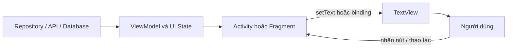
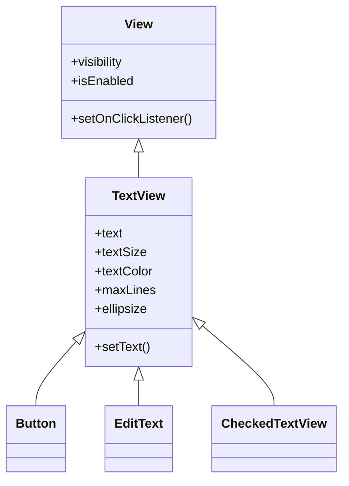
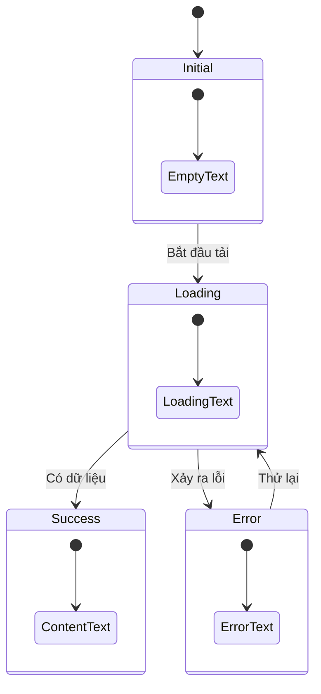
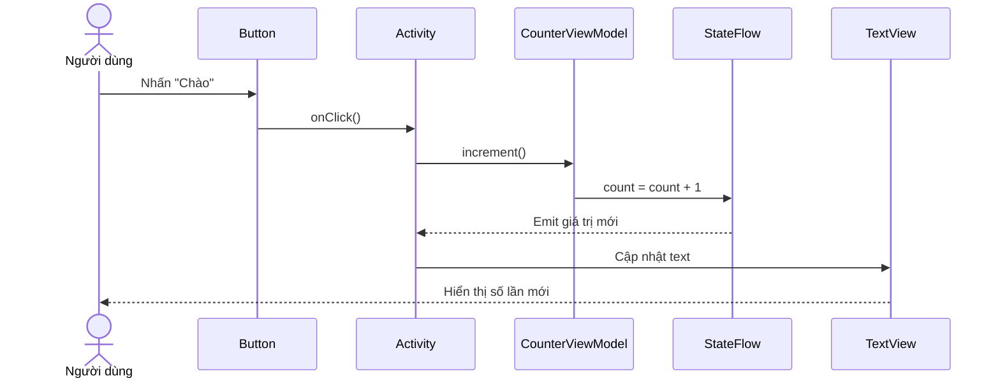
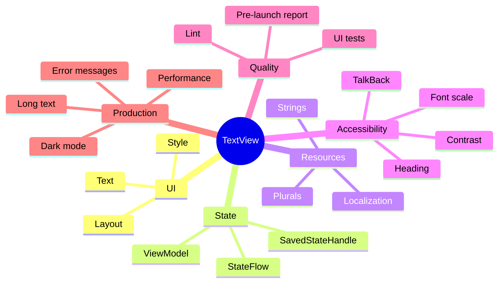

[](https://developer.android.com/codelabs/basic-android-kotlin-training-xml-layouts?hl=ko&utm_source=chatgpt.com)

# 009 — TextView

| Thuộc tính              | Nội dung                               |
| ----------------------- | -------------------------------------- |
| **Học phần**            | 02 — App Components and User Interface |
| **Module**              | Module 04 — Interface and Navigation   |
| **Nhóm nội dung**       | UI Elements                            |
| **Nguồn roadmap**       | Interface and Navigation / UI Elements |
| **Loại bài**            | UI                                     |
| **Thứ tự trong module** | 009                                    |
| **Thời lượng gợi ý**    | 30 phút                                |

---

## 1. Tóm tắt


> **Hình 1:** Các `TextView` được sử dụng để hiển thị tiêu đề, câu hỏi, nhãn và kết quả trong một màn hình Android.

`TextView` là thành phần giao diện thuộc Android View System, dùng để **hiển thị văn bản cho người dùng**. Khi người dùng cần nhập hoặc chỉnh sửa văn bản, Android cung cấp `EditText`, một lớp được xây dựng dựa trên khả năng xử lý văn bản của `TextView`. ([Android Developers][1])

Một `TextView` có thể hiển thị:

* Tiêu đề màn hình.
* Nhãn cho ô nhập liệu.
* Nội dung bài viết.
* Trạng thái tải dữ liệu.
* Thông báo lỗi.
* Số liệu thống kê.
* Văn bản có định dạng.
* Liên kết và emoji.
* Nội dung thay đổi theo state của màn hình.

Trong Android hiện đại, Google khuyến nghị Jetpack Compose cho giao diện mới. Tuy nhiên, `TextView` vẫn rất quan trọng khi làm việc với:

* Ứng dụng sử dụng XML layout.
* Mã nguồn Android cũ.
* Fragment và Activity dùng View System.
* Custom View.
* Giao diện kết hợp giữa Compose và XML.
* App Widget hoặc các API vẫn dựa trên `View`. ([Android Developers][2])

### Vị trí của TextView trong ứng dụng



`TextView` không nên tự tải dữ liệu hoặc chứa business logic. Vai trò chính của nó là **render trạng thái giao diện đã được chuẩn bị bởi UI layer**.

---

## 2. Mục tiêu học tập


> **Hình 2:** Một màn hình Android được tạo bởi cây `ViewGroup` và các `View` con như `TextView`.

Sau bài học, anh có thể:

* Giải thích `TextView` bằng ngôn ngữ của mình.
* Khai báo `TextView` trong XML.
* Truy cập và cập nhật `TextView` bằng Kotlin.
* Phân biệt `TextView`, `EditText`, `Button` và Compose `Text`.
* Đưa chuỗi văn bản vào `strings.xml`.
* Hiển thị số lượng đúng bằng plural resources.
* Hiểu tác động của lifecycle và UI state lên văn bản.
* Giữ nội dung phù hợp khi xoay màn hình.
* Thiết kế văn bản có thể đọc được khi người dùng tăng font size.
* Kiểm tra khả năng tiếp cận bằng TalkBack và Accessibility Scanner.
* Viết một UI test xác nhận văn bản thay đổi đúng.
* Tạo screenshot hoặc README làm artifact cho portfolio.

### Kết quả đầu ra dự kiến

Sau khoảng 30 phút, anh hoàn thành một màn hình nhỏ có:

1. Một tiêu đề.
2. Một `TextView` hiển thị số lần thao tác.
3. Một `TextView` hiển thị trạng thái.
4. Một nút làm thay đổi state.
5. State không bị mất khi xoay màn hình.
6. Một UI test cơ bản.
7. Một screenshot cho portfolio.

---

## 3. Khái niệm chính


> **Hình 3:** `TextView` thường là View con nằm trong `ConstraintLayout`, `LinearLayout` hoặc một `ViewGroup` khác.

### 3.1. TextView là gì?

Định nghĩa ngắn gọn:

> `TextView` là một `View` dùng để hiển thị văn bản trong giao diện Android.

Cây kế thừa được đơn giản hóa như sau:



Điều này giải thích vì sao `Button` và `EditText` cũng có nhiều thuộc tính như `text`, `textSize`, `textColor` hoặc `fontFamily`.

### 3.2. Khai báo TextView trong XML

Ví dụ tối thiểu:

```xml
<TextView
    android:id="@+id/textGreeting"
    android:layout_width="wrap_content"
    android:layout_height="wrap_content"
    android:text="@string/greeting" />
```

Trong đó:

* `android:id`: định danh để Kotlin hoặc View Binding truy cập View.
* `layout_width`: chiều rộng của View.
* `layout_height`: chiều cao của View.
* `android:text`: nội dung được hiển thị.

Android layout được xây dựng từ các phần tử XML tương ứng với các `View` và `ViewGroup`. Các thuộc tính trong XML được ánh xạ thành cấu hình của đối tượng View khi layout được inflate. ([Android Developers][3])

### 3.3. Các thuộc tính thường dùng

| Thuộc tính                     | Công dụng                      | Ví dụ                 |
| ------------------------------ | ------------------------------ | --------------------- |
| `android:id`                   | Định danh View                 | `@+id/textStatus`     |
| `android:text`                 | Nội dung văn bản               | `@string/loading`     |
| `android:textSize`             | Kích thước chữ                 | `18sp`                |
| `android:textColor`            | Màu chữ                        | `@color/text_primary` |
| `android:textStyle`            | In đậm hoặc nghiêng            | `bold`                |
| `android:fontFamily`           | Font chữ                       | `sans-serif-medium`   |
| `android:gravity`              | Căn nội dung bên trong View    | `center`              |
| `android:textAlignment`        | Căn văn bản theo layout        | `viewStart`           |
| `android:maxLines`             | Số dòng tối đa                 | `2`                   |
| `android:ellipsize`            | Thêm dấu `…` khi quá dài       | `end`                 |
| `android:lineSpacingExtra`     | Khoảng cách thêm giữa các dòng | `4dp`                 |
| `android:includeFontPadding`   | Padding bổ sung của font       | `false`               |
| `android:textIsSelectable`     | Cho phép chọn và sao chép      | `true`                |
| `android:autoSizeTextType`     | Tự điều chỉnh kích thước chữ   | `uniform`             |
| `android:accessibilityHeading` | Đánh dấu đây là tiêu đề        | `true`                |
| `android:labelFor`             | Gắn nhãn cho ô nhập liệu       | `@id/inputName`       |
| `tools:text`                   | Nội dung chỉ dùng khi preview  | `"Dữ liệu mẫu"`       |

### 3.4. `sp` và `dp`

Kích thước chữ nên sử dụng `sp`, không nên sử dụng `dp` hoặc `px`.

```xml
android:textSize="18sp"
```

`sp` chịu ảnh hưởng từ cài đặt kích thước chữ của người dùng. Nhờ đó, người dùng cần văn bản lớn hơn có thể tăng font size trong phần Accessibility của hệ thống. Android hỗ trợ font scaling tới 200% trên các phiên bản hiện đại, vì vậy màn hình cần được kiểm tra với chữ lớn để tránh bị cắt hoặc chồng lấn. ([Android Developers][4])

### 3.5. Không hard-code chuỗi trong layout

Không nên viết:

```xml
android:text="Xin chào"
```

Nên viết:

```xml
android:text="@string/greeting"
```

Và khai báo trong `res/values/strings.xml`:

```xml
<resources>
    <string name="greeting">Xin chào</string>
</resources>
```

String resources cho phép tái sử dụng, định dạng và bản địa hóa nội dung. Android hỗ trợ chuỗi đơn, mảng chuỗi và quantity strings dành cho số nhiều. ([Android Developers][5])

Ví dụ tiếng Anh:

```text
res/
├── values/
│   └── strings.xml
└── values-en/
    └── strings.xml
```

`res/values/strings.xml`:

```xml
<string name="greeting">Xin chào</string>
```

`res/values-en/strings.xml`:

```xml
<string name="greeting">Hello</string>
```

### 3.6. Chuỗi có tham số

Không nên ghép chuỗi trực tiếp:

```kotlin
textView.text = "Xin chào " + userName
```

Nên dùng placeholder:

```xml
<string name="welcome_user">Xin chào, %1$s!</string>
```

```kotlin
binding.textGreeting.text = getString(
    R.string.welcome_user,
    userName
)
```

### 3.7. Số nhiều với `plurals`

Không nên tự viết:

```kotlin
"$count lần"
```

Khai báo resource:

```xml
<plurals name="greeting_count">
    <item quantity="one">Đã chào %1$d lần</item>
    <item quantity="other">Đã chào %1$d lần</item>
</plurals>
```

Sử dụng:

```kotlin
binding.textCount.text = resources.getQuantityString(
    R.plurals.greeting_count,
    count,
    count
)
```

Mặc dù tiếng Việt thường không biến đổi danh từ theo số lượng, `plurals` vẫn giúp ứng dụng dễ dịch sang các ngôn ngữ có quy tắc số nhiều phức tạp hơn. Android cung cấp quantity-string resources riêng cho trường hợp này. ([Android Developers][5])

### 3.8. Cập nhật văn bản bằng Kotlin

Với View Binding:

```kotlin
binding.textStatus.text = getString(R.string.status_ready)
```

Với resource ID:

```kotlin
binding.textStatus.setText(R.string.status_ready)
```

Cần phân biệt:

```kotlin
textView.text = "123"
```

và:

```kotlin
textView.setText(123)
```

Trong trường hợp thứ hai, Android hiểu `123` là một resource ID, không phải số cần hiển thị. Để hiển thị số:

```kotlin
textView.text = number.toString()
```

Hoặc tốt hơn:

```kotlin
textView.text = getString(R.string.score_value, number)
```

### 3.9. TextView và state

`TextView` chỉ nên phản ánh state hiện tại:



Ví dụ:

```kotlin
when (uiState) {
    UiState.Loading -> {
        binding.textStatus.setText(R.string.loading)
    }

    is UiState.Success -> {
        binding.textStatus.text = uiState.message
    }

    is UiState.Error -> {
        binding.textStatus.text = getString(
            R.string.error_message,
            uiState.reason
        )
    }
}
```

Android khuyến nghị UI layer quan sát một state holder như `StateFlow` hoặc `LiveData`, sau đó render state đó lên View. Khi thu thập Flow từ Activity hoặc Fragment, nên dùng API nhận biết lifecycle như `repeatOnLifecycle`. ([Android Developers][6])

### 3.10. TextView và lifecycle

Một `TextView` không tự giữ business state.

Nếu anh chỉ viết:

```kotlin
var count = 0
```

bên trong `Activity`, giá trị có thể trở về `0` khi Activity được tạo lại do xoay màn hình.

Giải pháp phù hợp:

* `ViewModel`: giữ UI state qua configuration change.
* `SavedStateHandle`: lưu lượng state nhỏ cần khôi phục sau khi tiến trình bị hệ thống hủy.
* Database hoặc DataStore: lưu dữ liệu dài hạn.

`SavedStateHandle` phù hợp với dữ liệu UI nhỏ như bộ lọc, tab đang chọn, ID item hoặc số đếm. Không nên dùng nó để lưu ảnh, danh sách lớn hoặc dữ liệu phức tạp. ([Android Developers][7])

### 3.11. Accessibility

Với một `TextView` bình thường, TalkBack có thể đọc chính nội dung văn bản. Vì vậy, không nên lặp lại cùng một nội dung trong `contentDescription`.

Không nên:

```xml
<TextView
    android:text="@string/profile_title"
    android:contentDescription="@string/profile_title" />
```

Nên:

```xml
<TextView
    android:text="@string/profile_title"
    android:accessibilityHeading="true" />
```

Đối với `TextView` làm nhãn cho ô nhập liệu:

```xml
<TextView
    android:id="@+id/labelEmail"
    android:layout_width="wrap_content"
    android:layout_height="wrap_content"
    android:labelFor="@id/inputEmail"
    android:text="@string/email_label" />

<EditText
    android:id="@+id/inputEmail"
    android:layout_width="match_parent"
    android:layout_height="wrap_content"
    android:inputType="textEmailAddress" />
```

Android accessibility services tự thông báo nội dung của các thành phần văn bản tiêu chuẩn. `accessibilityHeading` giúp dịch vụ hỗ trợ nhận biết tiêu đề, còn `labelFor` tạo quan hệ giữa nhãn và trường nhập. ([Android Developers][8])

### 3.12. Độ tương phản

Văn bản nhỏ nên đạt tỷ lệ tương phản tối thiểu khoảng `4.5:1`. Văn bản lớn hoặc in đậm có thể sử dụng ngưỡng thấp hơn tùy kích thước. Không nên dùng màu xám quá nhạt trên nền trắng hoặc chữ đỏ nhạt trên nền tối. ([Android Developers][9])

### 3.13. AutoSize TextView

Ví dụ:

```xml
<TextView
    android:layout_width="match_parent"
    android:layout_height="80dp"
    android:autoSizeTextType="uniform"
    android:autoSizeMinTextSize="14sp"
    android:autoSizeMaxTextSize="28sp"
    android:autoSizeStepGranularity="2sp"
    android:gravity="center"
    android:text="@string/dynamic_title" />
```

AutoSize giúp chữ co giãn trong giới hạn của `TextView`. Tuy nhiên, tài liệu Android lưu ý rằng kết hợp autosize với kích thước `wrap_content` có thể tạo kết quả không mong muốn. ([Android Developers][10])

### 3.14. TextView so với các thành phần khác

| Thành phần         | Dùng khi                                     |
| ------------------ | -------------------------------------------- |
| `TextView`         | Hiển thị văn bản                             |
| `EditText`         | Người dùng nhập hoặc chỉnh sửa văn bản       |
| `Button`           | Thực hiện một hành động                      |
| `MaterialTextView` | Dùng View System kết hợp Material Components |
| Compose `Text`     | Giao diện được xây dựng bằng Jetpack Compose |

`MaterialTextView` kế thừa từ `AppCompatTextView` và bổ sung khả năng tích hợp tốt hơn với `TextAppearance`, bao gồm xử lý `lineHeight`. ([Android Developers][11])

---

## 4. Thực hành


> **Hình 4:** XML và Layout Editor giúp quan sát trực tiếp cách `TextView` được render.

### 4.1. Mini project: Greeting Counter

Màn hình gồm:

* Tiêu đề “Greeting Counter”.
* Số lần người dùng nhấn nút.
* Trạng thái hiện tại.
* Nút “Chào”.
* State được giữ khi xoay màn hình.

### 4.2. Cấu trúc file

```text
app/src/main/
├── java/com/example/textviewdemo/
│   ├── MainActivity.kt
│   └── CounterViewModel.kt
└── res/
    ├── layout/
    │   └── activity_main.xml
    └── values/
        ├── strings.xml
        ├── colors.xml
        └── dimens.xml
```

### 4.3. Bật View Binding

Trong `build.gradle.kts` của module app:

```kotlin
android {
    buildFeatures {
        viewBinding = true
    }
}
```

View Binding tạo một binding class chứa tham chiếu trực tiếp đến các View có ID và trong phần lớn trường hợp có thể thay thế `findViewById`. ([Android Developers][12])

### 4.4. Layout `activity_main.xml`

```xml
<?xml version="1.0" encoding="utf-8"?>
<androidx.constraintlayout.widget.ConstraintLayout
    xmlns:android="http://schemas.android.com/apk/res/android"
    xmlns:app="http://schemas.android.com/apk/res-auto"
    xmlns:tools="http://schemas.android.com/tools"
    android:layout_width="match_parent"
    android:layout_height="match_parent"
    android:padding="24dp"
    tools:context=".MainActivity">

    <TextView
        android:id="@+id/textTitle"
        android:layout_width="0dp"
        android:layout_height="wrap_content"
        android:accessibilityHeading="true"
        android:gravity="center"
        android:text="@string/screen_title"
        android:textSize="28sp"
        android:textStyle="bold"
        app:layout_constraintEnd_toEndOf="parent"
        app:layout_constraintStart_toStartOf="parent"
        app:layout_constraintTop_toTopOf="parent" />

    <TextView
        android:id="@+id/textCount"
        android:layout_width="0dp"
        android:layout_height="wrap_content"
        android:layout_marginTop="40dp"
        android:gravity="center"
        android:textSize="22sp"
        android:textStyle="bold"
        app:layout_constraintEnd_toEndOf="parent"
        app:layout_constraintStart_toStartOf="parent"
        app:layout_constraintTop_toBottomOf="@id/textTitle"
        tools:text="Đã chào 5 lần" />

    <TextView
        android:id="@+id/textStatus"
        android:layout_width="0dp"
        android:layout_height="wrap_content"
        android:layout_marginTop="16dp"
        android:gravity="center"
        android:maxLines="2"
        android:text="@string/status_ready"
        android:textSize="16sp"
        app:layout_constraintEnd_toEndOf="parent"
        app:layout_constraintStart_toStartOf="parent"
        app:layout_constraintTop_toBottomOf="@id/textCount" />

    <Button
        android:id="@+id/buttonGreeting"
        android:layout_width="0dp"
        android:layout_height="wrap_content"
        android:layout_marginTop="32dp"
        android:text="@string/action_greeting"
        app:layout_constraintEnd_toEndOf="parent"
        app:layout_constraintStart_toStartOf="parent"
        app:layout_constraintTop_toBottomOf="@id/textStatus" />

</androidx.constraintlayout.widget.ConstraintLayout>
```

`tools:text` chỉ hiển thị nội dung mẫu trong Android Studio và bị loại khỏi ứng dụng khi build. ([Android Developers][13])

### 4.5. `strings.xml`

```xml
<?xml version="1.0" encoding="utf-8"?>
<resources>

    <string name="app_name">TextView Demo</string>
    <string name="screen_title">Greeting Counter</string>
    <string name="action_greeting">Chào</string>

    <string name="status_ready">
        Nhấn nút để cập nhật TextView
    </string>

    <string name="status_updated">
        Nội dung đã được cập nhật
    </string>

    <plurals name="greeting_count">
        <item quantity="one">Đã chào %1$d lần</item>
        <item quantity="other">Đã chào %1$d lần</item>
    </plurals>

</resources>
```

### 4.6. `CounterViewModel.kt`

```kotlin
package com.example.textviewdemo

import androidx.lifecycle.SavedStateHandle
import androidx.lifecycle.ViewModel
import kotlinx.coroutines.flow.StateFlow

class CounterViewModel(
    private val savedStateHandle: SavedStateHandle
) : ViewModel() {

    val count: StateFlow<Int> =
        savedStateHandle.getStateFlow(KEY_COUNT, 0)

    fun increment() {
        savedStateHandle[KEY_COUNT] = count.value + 1
    }

    companion object {
        private const val KEY_COUNT = "greeting_count"
    }
}
```

### 4.7. `MainActivity.kt`

```kotlin
package com.example.textviewdemo

import android.os.Bundle
import androidx.activity.viewModels
import androidx.appcompat.app.AppCompatActivity
import androidx.lifecycle.Lifecycle
import androidx.lifecycle.lifecycleScope
import androidx.lifecycle.repeatOnLifecycle
import com.example.textviewdemo.databinding.ActivityMainBinding
import kotlinx.coroutines.launch

class MainActivity : AppCompatActivity() {

    private lateinit var binding: ActivityMainBinding
    private val viewModel: CounterViewModel by viewModels()

    override fun onCreate(savedInstanceState: Bundle?) {
        super.onCreate(savedInstanceState)

        binding = ActivityMainBinding.inflate(layoutInflater)
        setContentView(binding.root)

        setupActions()
        observeState()
    }

    private fun setupActions() {
        binding.buttonGreeting.setOnClickListener {
            viewModel.increment()
        }
    }

    private fun observeState() {
        lifecycleScope.launch {
            repeatOnLifecycle(Lifecycle.State.STARTED) {
                viewModel.count.collect { count ->
                    renderCount(count)
                }
            }
        }
    }

    private fun renderCount(count: Int) {
        binding.textCount.text = resources.getQuantityString(
            R.plurals.greeting_count,
            count,
            count
        )

        binding.textStatus.setText(
            if (count == 0) {
                R.string.status_ready
            } else {
                R.string.status_updated
            }
        )
    }
}
```

### 4.8. Luồng cập nhật giao diện



### 4.9. Kiểm tra thủ công

```text
[ ] Khởi động app: hiển thị “Đã chào 0 lần”.
[ ] Nhấn nút một lần: hiển thị “Đã chào 1 lần”.
[ ] Nhấn nhiều lần: số đếm tăng chính xác.
[ ] Xoay màn hình: số đếm không trở về 0.
[ ] Chuyển app xuống background rồi mở lại.
[ ] Tăng font size của thiết bị lên mức lớn nhất.
[ ] Chuyển sang dark theme.
[ ] Bật TalkBack và kiểm tra thứ tự đọc.
[ ] Kiểm tra tiếng Việt và tiếng Anh.
[ ] Kiểm tra trên màn hình nhỏ.
```

---

## 5. Bài tập


> **Hình 5:** Dùng Split View để chỉnh XML và quan sát kết quả của `TextView`.

### Bài 1 — Cơ bản

Tạo màn hình hồ sơ có:

* Họ tên.
* Email.
* Vai trò.
* Trạng thái tài khoản.

Yêu cầu:

```text
[ ] Không hard-code chuỗi.
[ ] Họ tên dùng text size lớn hơn.
[ ] Vai trò chỉ hiển thị tối đa hai dòng.
[ ] Email có thể được chọn và sao chép.
```

Gợi ý:

```xml
android:textIsSelectable="true"
```

### Bài 2 — State

Tạo một `TextView` hiển thị trạng thái mạng giả lập:

```text
Đang kiểm tra kết nối...
Đã kết nối
Mất kết nối
```

Dùng `sealed interface`:

```kotlin
sealed interface ConnectionUiState {
    data object Checking : ConnectionUiState
    data object Connected : ConnectionUiState
    data class Disconnected(
        val reason: String
    ) : ConnectionUiState
}
```

Render:

```kotlin
private fun render(state: ConnectionUiState) {
    binding.textConnection.text = when (state) {
        ConnectionUiState.Checking ->
            getString(R.string.connection_checking)

        ConnectionUiState.Connected ->
            getString(R.string.connection_connected)

        is ConnectionUiState.Disconnected ->
            getString(
                R.string.connection_disconnected,
                state.reason
            )
    }
}
```

### Bài 3 — Accessibility

Tạo một form gồm:

* `TextView` “Email”.
* `EditText` nhập email.
* `TextView` hiển thị lỗi.

Yêu cầu:

```text
[ ] Nhãn sử dụng android:labelFor.
[ ] Thông báo lỗi rõ ràng.
[ ] Không chỉ dùng màu đỏ để biểu thị lỗi.
[ ] TalkBack đọc được nội dung lỗi.
```

Có thể sử dụng:

```kotlin
binding.textError.apply {
    text = getString(R.string.invalid_email)
    visibility = View.VISIBLE
    announceForAccessibility(text)
}
```

### Bài 4 — Nội dung dài

Hiển thị phần mô tả bài viết:

```xml
android:maxLines="3"
android:ellipsize="end"
```

Thêm nút “Xem thêm” để chuyển đổi giữa ba dòng và toàn bộ nội dung.

### Bài 5 — Nâng cao

Dùng `SpannableString` để làm đậm một phần văn bản:

```kotlin
val fullText = "Trạng thái: Hoàn thành"
val styledText = SpannableString(fullText)

styledText.setSpan(
    StyleSpan(Typeface.BOLD),
    12,
    fullText.length,
    Spanned.SPAN_EXCLUSIVE_EXCLUSIVE
)

binding.textStatus.text = styledText
```

Android cung cấp hệ thống `Span` để thay đổi định dạng của một phần văn bản mà không cần tạo nhiều `TextView`. Khi cập nhật span động, cần cân nhắc `invalidate()` hoặc `requestLayout()` tùy thay đổi có ảnh hưởng đến bố cục hay không. ([Android Developers][14])

### Bài 6 — UI test

```kotlin
@RunWith(AndroidJUnit4::class)
class MainActivityTest {

    @get:Rule
    val activityRule =
        ActivityScenarioRule(MainActivity::class.java)

    @Test
    fun clickingGreetingButton_updatesTextView() {
        onView(withId(R.id.buttonGreeting))
            .perform(click())

        onView(withId(R.id.textCount))
            .check(matches(withText("Đã chào 1 lần")))
    }
}
```

Phiên bản tốt hơn nên lấy expected text từ resource thay vì hard-code:

```kotlin
@Test
fun clickingGreetingButton_updatesTextView() {
    val context = ApplicationProvider
        .getApplicationContext<Context>()

    val expected = context.resources.getQuantityString(
        R.plurals.greeting_count,
        1,
        1
    )

    onView(withId(R.id.buttonGreeting))
        .perform(click())

    onView(withId(R.id.textCount))
        .check(matches(withText(expected)))
}
```

---

## 6. Checklist hoàn thành


> **Hình 6:** Công cụ UI Check có thể phát hiện văn bản có độ tương phản thấp hoặc không phù hợp với một số dạng suy giảm thị lực màu.

### Kiến thức

* [ ] Giải thích được nhiệm vụ của `TextView`.
* [ ] Phân biệt được `TextView` và `EditText`.
* [ ] Hiểu `TextView` là một `View` trong cây giao diện.
* [ ] Biết cách khai báo `TextView` bằng XML.
* [ ] Biết cách cập nhật nội dung bằng Kotlin.
* [ ] Biết sử dụng `strings.xml`.
* [ ] Biết sử dụng placeholder và `plurals`.
* [ ] Biết vì sao kích thước chữ nên dùng `sp`.

### State và lifecycle

* [ ] Văn bản được render từ UI state.
* [ ] Không đặt business logic trong `TextView`.
* [ ] State không bị mất khi xoay màn hình.
* [ ] Không lưu dữ liệu lớn trong `SavedStateHandle`.
* [ ] Flow được collect theo lifecycle.
* [ ] Loading, success, empty và error có nội dung riêng.

### UX và accessibility

* [ ] Văn bản không bị cắt khi tăng font size.
* [ ] Màu chữ đủ tương phản với nền.
* [ ] Không dùng `contentDescription` trùng với nội dung TextView.
* [ ] Tiêu đề có thể dùng `accessibilityHeading`.
* [ ] Nhãn cho input sử dụng `labelFor`.
* [ ] Không chỉ sử dụng màu sắc để truyền đạt trạng thái.
* [ ] TalkBack đọc nội dung theo thứ tự hợp lý.

### Testing

* [ ] Có test xác nhận nội dung ban đầu.
* [ ] Có test xác nhận nội dung sau khi thay đổi state.
* [ ] Có test xoay màn hình hoặc recreate Activity.
* [ ] Đã thử dark mode.
* [ ] Đã thử font scale lớn.
* [ ] Đã thử chuỗi dài.
* [ ] Đã thử ít nhất hai locale.
* [ ] Đã chạy Android Lint.
* [ ] Đã kiểm tra Accessibility Scanner.

Tài liệu Android khuyến nghị kết hợp kiểm thử thủ công, công cụ phân tích, kiểm thử tự động và kiểm thử với người dùng để phát hiện đầy đủ hơn các vấn đề accessibility. ([Android Developers][2])

---

## 7. Ghi chú sản xuất


> **Hình 7:** Pre-launch report có thể phát hiện độ tương phản thấp, thiếu nhãn và các vấn đề accessibility khác trước khi phát hành.

### 7.1. Không hiển thị raw error từ server

Không nên:

```kotlin
binding.textError.text = throwable.message
```

Lỗi kỹ thuật có thể khó hiểu hoặc làm lộ thông tin nội bộ.

Nên:

```kotlin
binding.textError.setText(
    when (error) {
        is IOException ->
            R.string.error_network

        is HttpException ->
            R.string.error_server

        else ->
            R.string.error_unknown
    }
)
```

### 7.2. Không cập nhật View từ background thread

Sai:

```kotlin
Thread {
    binding.textStatus.text = "Hoàn thành"
}.start()
```

Nên cập nhật state trong ViewModel và để UI collect state trên lifecycle phù hợp.

### 7.3. Tránh gọi `setText()` liên tục

Ví dụ không tốt:

```kotlin
items.forEach {
    textView.append(it)
}
```

Nếu danh sách lớn, thao tác liên tục có thể tạo nhiều lần đo layout và render.

Tốt hơn:

```kotlin
val content = items.joinToString(separator = "\n")
textView.text = content
```

Nếu dữ liệu rất dài hoặc có nhiều item, nên dùng `RecyclerView` thay vì nhồi toàn bộ nội dung vào một `TextView`.

### 7.4. Không dùng TextView cho hành động chỉ vì có thể click

Mặc dù `TextView` có thể nhận click:

```xml
android:clickable="true"
```

nhưng nếu thành phần thực chất là một nút, nên dùng `Button` hoặc Material Button để semantics, trạng thái focus và phản hồi tương tác rõ ràng hơn.

TextView clickable phù hợp với một số trường hợp như:

* “Xem thêm”.
* Liên kết trong đoạn văn.
* Nhãn phụ điều hướng nhẹ.

### 7.5. Cẩn thận với `ellipsize`

```xml
android:maxLines="1"
android:ellipsize="end"
```

Không nên cắt các nội dung quan trọng như:

* Mã giao dịch.
* Số tiền.
* Thông báo lỗi.
* Mã xác thực.
* Tên tệp cần phân biệt.

Có thể cho phép mở nội dung đầy đủ hoặc cung cấp tooltip, dialog hay màn hình chi tiết.

### 7.6. Kiểm tra chuỗi dài và ngôn ngữ RTL

Một chuỗi tiếng Đức, Nga hoặc Việt có thể dài hơn đáng kể so với bản tiếng Anh. Đồng thời, tiếng Ả Rập và Hebrew sử dụng hướng từ phải sang trái.

Nên sử dụng:

```xml
android:textAlignment="viewStart"
```

và constraint:

```xml
app:layout_constraintStart_toStartOf="parent"
app:layout_constraintEnd_toEndOf="parent"
```

thay vì phụ thuộc cứng vào `left` và `right`.

### 7.7. Release checklist

```text
[ ] Không còn hard-coded text trong XML hoặc Kotlin.
[ ] Không hiển thị exception thô cho người dùng.
[ ] Kiểm tra loading, empty, success và error.
[ ] Kiểm tra locale mặc định.
[ ] Kiểm tra ít nhất một locale khác.
[ ] Kiểm tra RTL nếu ứng dụng hỗ trợ.
[ ] Kiểm tra font scale lớn nhất.
[ ] Kiểm tra dark mode.
[ ] Kiểm tra màn hình nhỏ và tablet.
[ ] Kiểm tra TalkBack.
[ ] Kiểm tra độ tương phản.
[ ] Kiểm tra rotate và process recreation.
[ ] Chạy unit test, UI test và Android Lint.
[ ] Xem accessibility pre-launch report trên Google Play.
```

Google Play có thể tạo pre-launch report sau khi app được tải lên release channel. Báo cáo accessibility có thể chỉ ra vấn đề liên quan đến touch target, độ tương phản, nhãn nội dung và cách triển khai semantics. ([Android Developers][2])

---

## Artifact gợi ý cho portfolio

### Screenshot cần chụp

```text
01-initial-state.png
02-updated-state.png
03-large-font.png
04-dark-mode.png
```

### README mẫu

```markdown
# Android TextView State Demo

Ứng dụng nhỏ minh họa cách sử dụng TextView trong Android View System.

## Tính năng

- Khai báo TextView bằng XML.
- Cập nhật nội dung từ StateFlow.
- Lưu số đếm bằng SavedStateHandle.
- Hỗ trợ string resources và plurals.
- Giữ state khi xoay màn hình.
- Có kiểm thử UI bằng Espresso.
- Kiểm tra font scaling và accessibility.

## Kiến trúc

User Action
→ Activity
→ ViewModel
→ StateFlow
→ Activity render
→ TextView

## Kiểm thử

- Initial state.
- Button click.
- Activity recreation.
- Large font.
- TalkBack.
- Dark mode.
```

---

## Tổng kết

`TextView` nhìn đơn giản nhưng liên quan trực tiếp đến nhiều khía cạnh quan trọng của một ứng dụng Android:



Một implementation tốt không chỉ hiển thị đúng văn bản, mà còn phải:

* Nhận nội dung từ UI state.
* Không mất state khi lifecycle thay đổi.
* Hỗ trợ localization.
* Thích nghi với font size lớn.
* Có độ tương phản phù hợp.
* Được TalkBack đọc đúng.
* Có test bảo vệ hành vi quan trọng.
* Không làm lộ lỗi kỹ thuật cho người dùng.

[1]: https://developer.android.com/reference/android/widget/TextView?utm_source=chatgpt.com "TextView | API reference"
[2]: https://developer.android.com/guide/topics/ui/accessibility/testing "Test your app's accessibility  |  App quality  |  Android Developers"
[3]: https://developer.android.com/develop/ui/views/layout/declaring-layout?utm_source=chatgpt.com "Layouts in views"
[4]: https://developer.android.com/about/versions/14/features?utm_source=chatgpt.com "Features and APIs Overview  |  Android Developers"
[5]: https://developer.android.com/topic/architecture/views/resources/string-resource-views "String resources (Views)  |  Android Developers"
[6]: https://developer.android.com/topic/architecture/views/recommendations-views?utm_source=chatgpt.com "Recommendations for Android architecture (Views)  |  Android Developers"
[7]: https://developer.android.com/topic/libraries/architecture/viewmodel/viewmodel-savedstate?hl=en&utm_source=chatgpt.com "Saved State module for ViewModel  |  App architecture  |  Android Developers"
[8]: https://developer.android.com/guide/topics/ui/accessibility/views/apps-views?hl=en&utm_source=chatgpt.com "Make apps more accessible (Views)  |  Android Developers"
[9]: https://developer.android.com/guide/topics/ui/accessibility/apps.html?utm_source=chatgpt.com "Make apps more accessible  |  App quality  |  Android Developers"
[10]: https://developer.android.com/develop/ui/views/text-and-emoji/autosizing-textview "Autosize TextViews  |  Android Developers"
[11]: https://developer.android.com/reference/com/google/android/material/textview/MaterialTextView?utm_source=chatgpt.com "MaterialTextView | API reference"
[12]: https://developer.android.com/topic/libraries/view-binding?utm_source=chatgpt.com "View binding"
[13]: https://developer.android.com/studio/write/tool-attributes?utm_source=chatgpt.com "Tools attributes reference | Android Studio"
[14]: https://developer.android.com/develop/ui/views/text-and-emoji/spans?utm_source=chatgpt.com "Spans | Views"

---

# Bài luyện tập

## Mục tiêu


## Đề bài


## Yêu cầu hoàn thành

- [ ] 
- [ ] 
- [ ] 

## Kết quả / lời giải


## Ghi chú
