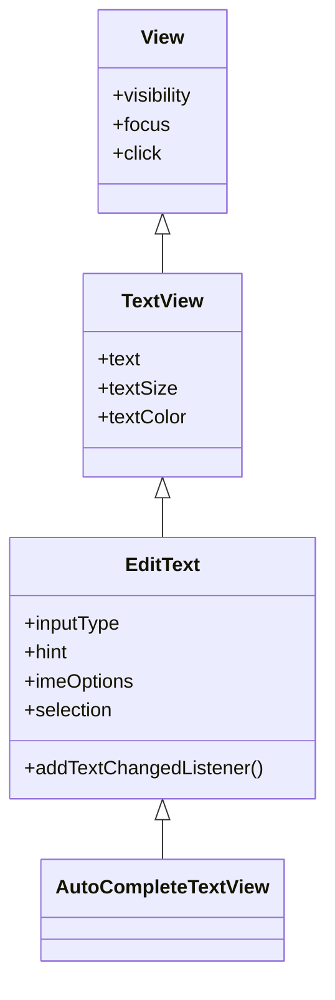
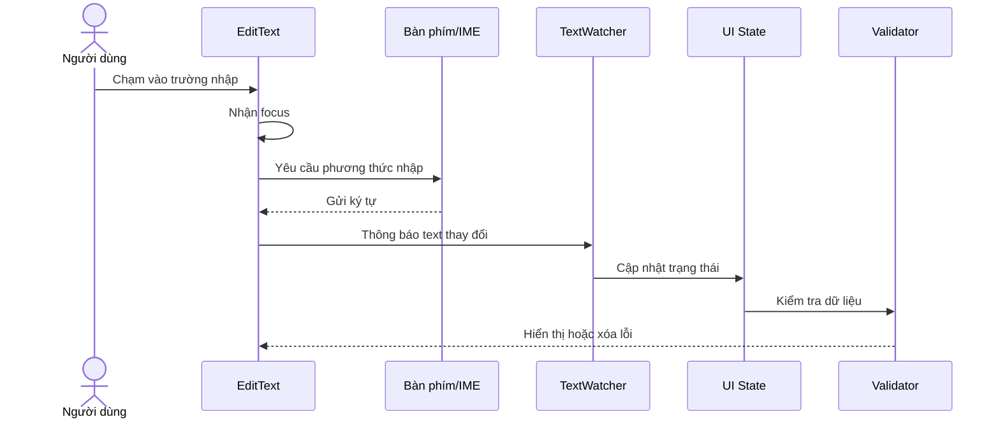
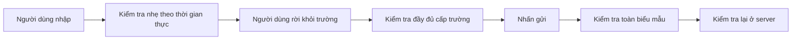
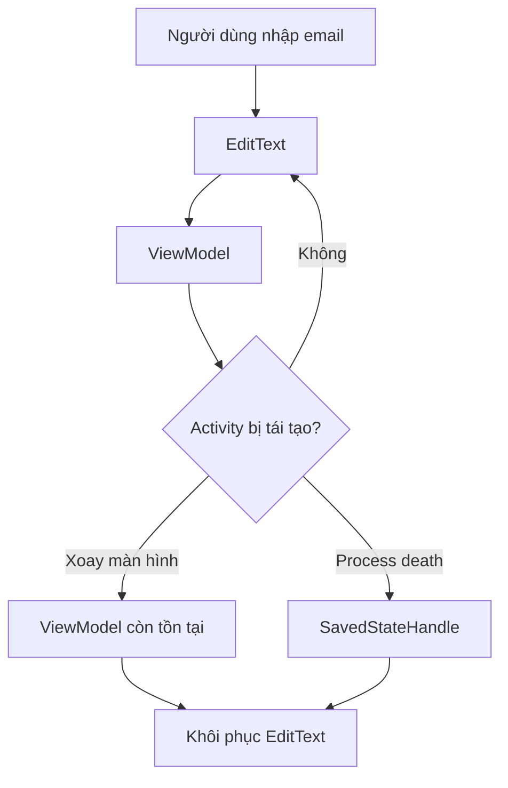
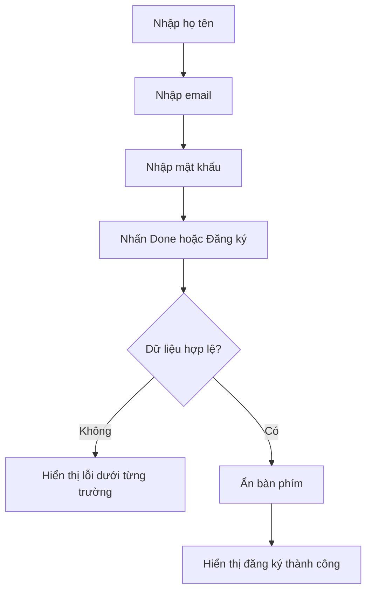
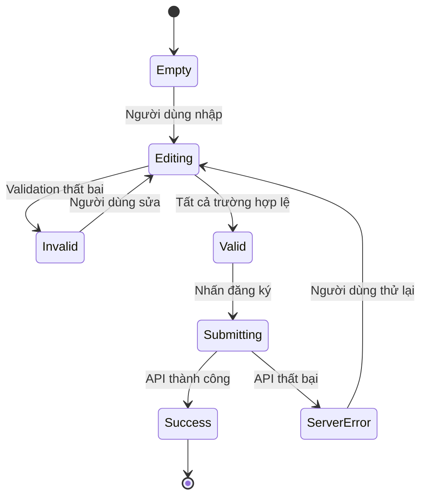
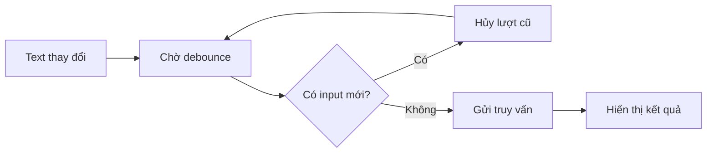
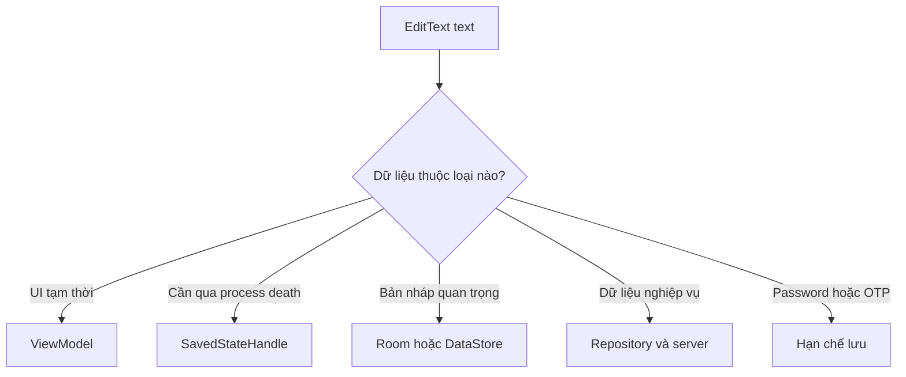
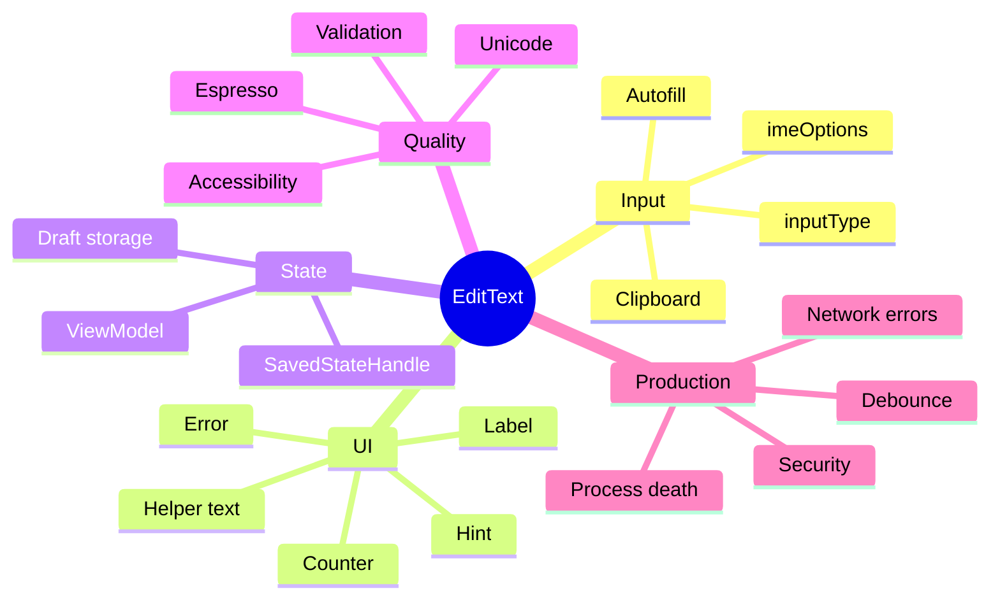

[](https://developer.android.com/develop/ui/views/touch-and-input/creating-input-method?utm_source=chatgpt.com)

# 010 — EditText trong Android

**Học phần:** 02 — App Components and User Interface
**Module:** Module 04 — Interface and Navigation
**Nhóm nội dung:** UI Elements
**Nguồn roadmap:** Interface and Navigation / UI Elements
**Loại bài:** UI
**Thứ tự trong module:** 010
**Thời lượng gợi ý:** 30 phút

---

## 1. Tóm tắt

`EditText` là thành phần giao diện thuộc hệ thống **Android Views**, dùng để cho phép người dùng nhập và chỉnh sửa văn bản. Về quan hệ kế thừa, `EditText` là lớp con của `TextView`, nhưng được bổ sung khả năng nhận focus, hiển thị con trỏ, chọn văn bản và giao tiếp với bàn phím hoặc phương thức nhập liệu IME. ([Android Developers][1])



Trong ứng dụng thực tế, `EditText` xuất hiện ở:

* Màn hình đăng nhập và đăng ký.
* Biểu mẫu hồ sơ người dùng.
* Ô tìm kiếm.
* Trình soạn tin nhắn.
* Ô nhập mã OTP, số điện thoại hoặc email.
* Biểu mẫu thanh toán và địa chỉ.
* Ô nhập phản hồi hoặc bình luận.


*Ảnh: kiểu bàn phím số được hệ thống lựa chọn cho trường nhập số điện thoại.* 

> [!NOTE]
> `EditText` thuộc UI dùng XML/View. Trong Jetpack Compose, thành phần tương ứng là `TextField`, `OutlinedTextField` hoặc `BasicTextField`. ([Android Developers][2])

---

## 2. Mục tiêu học tập

Sau bài học, anh có thể:

* Giải thích được `EditText` là gì và khác `TextView` như thế nào.
* Tạo trường nhập liệu bằng XML.
* Đọc và cập nhật nội dung của `EditText` bằng Kotlin.
* Cấu hình bàn phím bằng `android:inputType`.
* Cấu hình nút hành động trên bàn phím bằng `android:imeOptions`.
* Theo dõi thay đổi văn bản bằng `TextWatcher` hoặc `doAfterTextChanged`.
* Kiểm tra dữ liệu đầu vào và hiển thị lỗi.
* Quản lý focus và bàn phím mềm.
* Bảo toàn dữ liệu biểu mẫu khi xoay màn hình hoặc tái tạo `Activity`.
* Viết kiểm thử giao diện bằng Espresso.
* Phân biệt `EditText`, `TextInputEditText` và Compose `TextField`.


`inputType` ảnh hưởng đến bàn phím, ký tự được đề xuất và cách hiển thị dữ liệu; `imeOptions` có thể thay nút Enter bằng những hành động như `Next`, `Done`, `Search` hoặc `Send`. ([Android Developers][3])

---

## 3. Khái niệm chính

### 3.1. EditText hoạt động như thế nào?

Khi người dùng chạm vào `EditText`, quá trình cơ bản diễn ra như sau:



Android thường tự động hiển thị hoặc ẩn bàn phím khi focus đi vào hoặc rời khỏi trường có thể chỉnh sửa. Khi bàn phím xuất hiện, diện tích hiển thị của ứng dụng bị giảm nên layout cần hỗ trợ cuộn hoặc xử lý window insets phù hợp. ([Android Developers][4])

---

### 3.2. EditText cơ bản bằng XML

```xml
<EditText
    android:id="@+id/nameInput"
    android:layout_width="match_parent"
    android:layout_height="wrap_content"
    android:hint="@string/name_hint"
    android:inputType="textPersonName"
    android:imeOptions="actionNext"
    android:maxLines="1" />
```

Các thuộc tính quan trọng:

| Thuộc tính                     | Vai trò                         | Ví dụ              |
| ------------------------------ | ------------------------------- | ------------------ |
| `android:id`                   | Định danh View                  | `@+id/emailInput`  |
| `android:hint`                 | Gợi ý dữ liệu cần nhập          | `Email của bạn`    |
| `android:text`                 | Nội dung ban đầu                | `Nguyễn Văn A`     |
| `android:inputType`            | Loại dữ liệu và bàn phím        | `textEmailAddress` |
| `android:imeOptions`           | Nút hành động của bàn phím      | `actionDone`       |
| `android:maxLength`            | Giới hạn số ký tự               | `100`              |
| `android:maxLines`             | Số dòng tối đa                  | `1`                |
| `android:minLines`             | Số dòng tối thiểu               | `3`                |
| `android:gravity`              | Vị trí nội dung                 | `top\|start`       |
| `android:autofillHints`        | Gợi ý loại dữ liệu cho Autofill | `emailAddress`     |
| `android:importantForAutofill` | Cho phép Autofill xem trường    | `yes`              |

Tài liệu Android yêu cầu trường nhập liệu nên khai báo `android:inputType` để hệ thống có thể hiển thị phương thức nhập phù hợp. ([Android Developers][3])

---

### 3.3. Các loại inputType thường dùng

```xml
<!-- Văn bản thông thường -->
android:inputType="text"

<!-- Họ tên -->
android:inputType="textPersonName|textCapWords"

<!-- Email -->
android:inputType="textEmailAddress"

<!-- Mật khẩu -->
android:inputType="textPassword"

<!-- Số nguyên -->
android:inputType="number"

<!-- Số thập phân -->
android:inputType="numberDecimal"

<!-- Số điện thoại -->
android:inputType="phone"

<!-- URL -->
android:inputType="textUri"

<!-- Nội dung nhiều dòng -->
android:inputType="textCapSentences|textMultiLine"
```


`textPassword` giúp che nội dung đang nhập và yêu cầu IME xử lý trường như dữ liệu mật khẩu. Tuy nhiên, việc che văn bản không thay thế các biện pháp bảo mật dữ liệu khác. ([Android Developers][3])

> [!IMPORTANT]
> `inputType` chỉ giúp hệ thống lựa chọn giao diện nhập liệu phù hợp. Nó **không phải cơ chế xác thực dữ liệu**. Ứng dụng vẫn phải kiểm tra email, số điện thoại, độ dài mật khẩu và các quy tắc nghiệp vụ ở phía client lẫn server. ([Android Developers][5])

---

### 3.4. imeOptions

`imeOptions` cấu hình nút hành động ở góc bàn phím.

| Giá trị        | Trường hợp sử dụng             |
| -------------- | ------------------------------ |
| `actionNext`   | Chuyển sang ô nhập tiếp theo   |
| `actionDone`   | Kết thúc nhập biểu mẫu         |
| `actionSearch` | Thực hiện tìm kiếm             |
| `actionSend`   | Gửi tin nhắn hoặc nội dung     |
| `actionGo`     | Mở hoặc truy cập nội dung      |
| `actionNone`   | Không cung cấp hành động riêng |

Ví dụ:

```xml
<EditText
    android:id="@+id/searchInput"
    android:layout_width="match_parent"
    android:layout_height="wrap_content"
    android:hint="@string/search_hint"
    android:inputType="text"
    android:imeOptions="actionSearch"
    android:maxLines="1" />
```

Xử lý hành động bằng Kotlin:

```kotlin
binding.searchInput.setOnEditorActionListener { _, actionId, _ ->
    if (actionId == EditorInfo.IME_ACTION_SEARCH) {
        performSearch(binding.searchInput.text?.toString().orEmpty())
        true
    } else {
        false
    }
}
```

Với trường nhiều dòng, phím Enter thường được dùng để xuống dòng thay vì thực hiện `Done` hoặc `Send`. ([Android Developers][3])

---

### 3.5. Đọc và thay đổi nội dung

Đọc chuỗi từ `EditText`:

```kotlin
val name = binding.nameInput.text
    ?.toString()
    .orEmpty()
    .trim()
```

Cập nhật nội dung:

```kotlin
binding.nameInput.setText("Trần An Khánh")
```

Đưa con trỏ về cuối chuỗi:

```kotlin
binding.nameInput.setSelection(
    binding.nameInput.text?.length ?: 0
)
```

Xóa nội dung:

```kotlin
binding.nameInput.text?.clear()
```

Không nên dùng:

```kotlin
val name = binding.nameInput.text.toString()!!
```

`toString()` đã trả về một `String`; toán tử `!!` ở đây không tạo thêm giá trị và làm code khó đọc hơn.

---

### 3.6. Theo dõi thay đổi văn bản

`EditText` cung cấp callback thông qua `TextWatcher`. Đây là cơ chế phù hợp cho kiểm tra dữ liệu theo thời gian thực, cập nhật bộ đếm hoặc kích hoạt tìm kiếm. ([Android Developers][1])

Cách ngắn gọn bằng Android KTX:

```kotlin
import androidx.core.widget.doAfterTextChanged

binding.emailInput.doAfterTextChanged { editable ->
    val email = editable?.toString().orEmpty().trim()

    binding.emailLayout.error = when {
        email.isBlank() -> "Email không được để trống"
        !Patterns.EMAIL_ADDRESS.matcher(email).matches() ->
            "Email không đúng định dạng"
        else -> null
    }
}
```

Cách đầy đủ bằng `TextWatcher`:

```kotlin
binding.nameInput.addTextChangedListener(
    object : TextWatcher {

        override fun beforeTextChanged(
            text: CharSequence?,
            start: Int,
            count: Int,
            after: Int
        ) = Unit

        override fun onTextChanged(
            text: CharSequence?,
            start: Int,
            before: Int,
            count: Int
        ) {
            binding.characterCount.text =
                "${text?.length ?: 0}/50"
        }

        override fun afterTextChanged(editable: Editable?) = Unit
    }
)
```

#### Lỗi dễ gặp

Không nên gọi `setText()` vô điều kiện bên trong `afterTextChanged()`:

```kotlin
binding.nameInput.doAfterTextChanged {
    binding.nameInput.setText(it.toString().uppercase())
}
```

Việc này có thể tạo vòng callback liên tục hoặc làm con trỏ nhảy vị trí.

Một cách an toàn hơn:

```kotlin
binding.nameInput.doAfterTextChanged { editable ->
    val oldValue = editable?.toString().orEmpty()
    val normalizedValue = oldValue.trimStart()

    if (oldValue != normalizedValue) {
        binding.nameInput.setText(normalizedValue)
        binding.nameInput.setSelection(normalizedValue.length)
    }
}
```

---

### 3.7. Validation nên diễn ra ở đâu?

Có ba thời điểm phổ biến:



#### Khi đang nhập

Phù hợp với:

* Bộ đếm ký tự.
* Cảnh báo vượt độ dài.
* Xóa lỗi cũ khi người dùng sửa lại.
* Hiển thị độ mạnh mật khẩu.

Không nên hiển thị quá nhiều lỗi khi người dùng mới nhập được một hoặc hai ký tự.

#### Khi trường mất focus

Phù hợp với:

* Kiểm tra định dạng email.
* Kiểm tra tên bắt buộc.
* Kiểm tra số điện thoại.

```kotlin
binding.emailInput.setOnFocusChangeListener { _, hasFocus ->
    if (!hasFocus) {
        binding.emailLayout.error =
            validateEmail(binding.emailInput.text?.toString().orEmpty())
    }
}
```

#### Khi nhấn gửi

Luôn kiểm tra lại toàn bộ biểu mẫu:

```kotlin
private fun validateForm(): Boolean {
    val name = binding.nameInput.text?.toString().orEmpty().trim()
    val email = binding.emailInput.text?.toString().orEmpty().trim()
    val password = binding.passwordInput.text?.toString().orEmpty()

    binding.nameLayout.error = validateName(name)
    binding.emailLayout.error = validateEmail(email)
    binding.passwordLayout.error = validatePassword(password)

    return binding.nameLayout.error == null &&
        binding.emailLayout.error == null &&
        binding.passwordLayout.error == null
}
```

---

### 3.8. EditText và lifecycle

Khi xoay màn hình, đổi kích thước cửa sổ hoặc chuyển chế độ nhiều cửa sổ, `Activity` có thể bị hủy rồi tạo lại. Nếu trạng thái biểu mẫu chỉ nằm trong biến của `Activity`, dữ liệu có thể mất. Android đề xuất lựa chọn giữa `ViewModel`, saved instance state, `SavedStateHandle` và lưu trữ bền vững tùy loại dữ liệu. ([Android Developers][6])



| Loại state                        | Nơi lưu phù hợp                              |
| --------------------------------- | -------------------------------------------- |
| Text tạm thời, đơn giản           | Saved instance state hoặc `SavedStateHandle` |
| Dữ liệu dùng trong phiên màn hình | `ViewModel`                                  |
| Bản nháp quan trọng               | Room, DataStore hoặc server                  |
| Kết quả từ repository             | Tải lại từ data layer                        |
| Password, OTP                     | Hạn chế lưu; không ghi log hoặc lưu bền vững |

`ViewModel` sống qua configuration change nhưng không tự sống qua process death. `SavedStateHandle` có thể lưu những giá trị nhỏ, đơn giản cần thiết để dựng lại màn hình. ([Android Developers][6])

---

### 3.9. EditText, TextInputEditText và TextField

| Thành phần          | Hệ UI             | Khi sử dụng                                |
| ------------------- | ----------------- | ------------------------------------------ |
| `EditText`          | View/XML          | Trường nhập cơ bản hoặc giao diện tùy biến |
| `TextInputEditText` | Material View/XML | Dùng bên trong `TextInputLayout`           |
| `TextField`         | Jetpack Compose   | Trường Material dạng filled                |
| `OutlinedTextField` | Jetpack Compose   | Trường Material dạng outlined              |
| `BasicTextField`    | Jetpack Compose   | Tự thiết kế toàn bộ decoration             |

`TextInputEditText` là lớp con đặc biệt của `EditText`, được thiết kế để hoạt động trong `TextInputLayout` và hỗ trợ tốt hơn cho hint cũng như accessibility. ([Android Developers][7])

`TextInputLayout` có thể cung cấp:

* Floating label.
* Error text.
* Helper text.
* Placeholder.
* Prefix và suffix.
* Bộ đếm ký tự.
* Nút hiện hoặc ẩn mật khẩu.
* Nút xóa nội dung.
* Start icon và end icon. ([Android Developers][8])

```xml
<com.google.android.material.textfield.TextInputLayout
    android:layout_width="match_parent"
    android:layout_height="wrap_content"
    android:hint="@string/email_label">

    <com.google.android.material.textfield.TextInputEditText
        android:id="@+id/emailInput"
        android:layout_width="match_parent"
        android:layout_height="wrap_content"
        android:inputType="textEmailAddress" />

</com.google.android.material.textfield.TextInputLayout>
```

Khi dùng `TextInputLayout`, nên đặt `hint` trên `TextInputLayout` thay vì đặt trên `TextInputEditText`. ([Android Developers][8])


*Ảnh: IME đưa ra gợi ý sửa từ trong trường nhập văn bản.* 

---

## 4. Thực hành: màn hình đăng ký nhanh

### 4.1. Yêu cầu

Tạo màn hình gồm:

1. Trường họ tên.
2. Trường email.
3. Trường mật khẩu.
4. Nút đăng ký.
5. Thông báo kết quả.
6. Validation theo thời gian thực.
7. Hỗ trợ nút `Next` và `Done` trên bàn phím.
8. Giữ lại họ tên và email khi `Activity` được tái tạo.



---

### 4.2. Bật View Binding

Trong `build.gradle.kts` của module `app`:

```kotlin
android {
    buildFeatures {
        viewBinding = true
    }
}
```

Dự án cần sử dụng theme Material và có dependency Material Components tương thích với cấu hình dự án.

---

### 4.3. Layout `activity_register.xml`

```xml
<?xml version="1.0" encoding="utf-8"?>
<androidx.core.widget.NestedScrollView
    xmlns:android="http://schemas.android.com/apk/res/android"
    xmlns:app="http://schemas.android.com/apk/res-auto"
    android:id="@+id/formScrollView"
    android:layout_width="match_parent"
    android:layout_height="match_parent"
    android:fillViewport="true">

    <LinearLayout
        android:layout_width="match_parent"
        android:layout_height="wrap_content"
        android:orientation="vertical"
        android:padding="24dp">

        <TextView
            android:layout_width="wrap_content"
            android:layout_height="wrap_content"
            android:text="@string/register_title"
            android:textAppearance="?attr/textAppearanceHeadlineMedium" />

        <TextView
            android:layout_width="wrap_content"
            android:layout_height="wrap_content"
            android:layout_marginTop="8dp"
            android:text="@string/register_description"
            android:textAppearance="?attr/textAppearanceBodyMedium" />

        <com.google.android.material.textfield.TextInputLayout
            android:id="@+id/nameLayout"
            style="@style/Widget.Material3.TextInputLayout.OutlinedBox"
            android:layout_width="match_parent"
            android:layout_height="wrap_content"
            android:layout_marginTop="24dp"
            android:hint="@string/name_label"
            app:helperText="@string/name_helper">

            <com.google.android.material.textfield.TextInputEditText
                android:id="@+id/nameInput"
                android:layout_width="match_parent"
                android:layout_height="wrap_content"
                android:autofillHints="name"
                android:imeOptions="actionNext"
                android:importantForAutofill="yes"
                android:inputType="textPersonName|textCapWords"
                android:maxLength="50"
                android:maxLines="1" />

        </com.google.android.material.textfield.TextInputLayout>

        <com.google.android.material.textfield.TextInputLayout
            android:id="@+id/emailLayout"
            style="@style/Widget.Material3.TextInputLayout.OutlinedBox"
            android:layout_width="match_parent"
            android:layout_height="wrap_content"
            android:layout_marginTop="16dp"
            android:hint="@string/email_label">

            <com.google.android.material.textfield.TextInputEditText
                android:id="@+id/emailInput"
                android:layout_width="match_parent"
                android:layout_height="wrap_content"
                android:autofillHints="emailAddress"
                android:imeOptions="actionNext"
                android:importantForAutofill="yes"
                android:inputType="textEmailAddress"
                android:maxLength="254"
                android:maxLines="1" />

        </com.google.android.material.textfield.TextInputLayout>

        <com.google.android.material.textfield.TextInputLayout
            android:id="@+id/passwordLayout"
            style="@style/Widget.Material3.TextInputLayout.OutlinedBox"
            android:layout_width="match_parent"
            android:layout_height="wrap_content"
            android:layout_marginTop="16dp"
            android:hint="@string/password_label"
            app:counterEnabled="true"
            app:counterMaxLength="64"
            app:endIconMode="password_toggle">

            <com.google.android.material.textfield.TextInputEditText
                android:id="@+id/passwordInput"
                android:layout_width="match_parent"
                android:layout_height="wrap_content"
                android:autofillHints="password"
                android:imeOptions="actionDone"
                android:importantForAutofill="yes"
                android:inputType="textPassword"
                android:maxLength="64"
                android:maxLines="1" />

        </com.google.android.material.textfield.TextInputLayout>

        <com.google.android.material.button.MaterialButton
            android:id="@+id/registerButton"
            android:layout_width="match_parent"
            android:layout_height="wrap_content"
            android:layout_marginTop="24dp"
            android:text="@string/register_action" />

        <TextView
            android:id="@+id/resultText"
            android:layout_width="match_parent"
            android:layout_height="wrap_content"
            android:layout_marginTop="16dp"
            android:accessibilityLiveRegion="polite"
            android:textAppearance="?attr/textAppearanceBodyLarge"
            android:visibility="gone" />

    </LinearLayout>

</androidx.core.widget.NestedScrollView>
```

---

### 4.4. Chuỗi trong `strings.xml`

```xml
<resources>
    <string name="app_name">EditText Demo</string>

    <string name="register_title">Tạo tài khoản</string>
    <string name="register_description">
        Nhập thông tin để kiểm tra EditText và validation.
    </string>

    <string name="name_label">Họ và tên</string>
    <string name="name_helper">Từ 2 đến 50 ký tự</string>
    <string name="email_label">Email</string>
    <string name="password_label">Mật khẩu</string>
    <string name="register_action">Đăng ký</string>
</resources>
```

Không nên hard-code nội dung hiển thị trực tiếp trong XML hoặc Kotlin vì sẽ làm khó quá trình đa ngôn ngữ hóa.

---

### 4.5. ViewModel lưu state đơn giản

```kotlin
package com.example.edittextdemo

import androidx.lifecycle.SavedStateHandle
import androidx.lifecycle.ViewModel

class RegisterViewModel(
    private val savedStateHandle: SavedStateHandle
) : ViewModel() {

    var name: String
        get() = savedStateHandle[KEY_NAME].orEmpty()
        set(value) {
            savedStateHandle[KEY_NAME] = value
        }

    var email: String
        get() = savedStateHandle[KEY_EMAIL].orEmpty()
        set(value) {
            savedStateHandle[KEY_EMAIL] = value
        }

    companion object {
        private const val KEY_NAME = "register_name"
        private const val KEY_EMAIL = "register_email"
    }
}
```

Ví dụ không lưu mật khẩu trong `SavedStateHandle`. Dữ liệu nhạy cảm không nên được ghi log, lưu bản nháp hoặc lưu bền vững nếu không có yêu cầu rõ ràng.

---

### 4.6. `RegisterActivity.kt`

```kotlin
package com.example.edittextdemo

import android.os.Bundle
import android.util.Patterns
import android.view.View
import android.view.inputmethod.EditorInfo
import androidx.activity.viewModels
import androidx.appcompat.app.AppCompatActivity
import androidx.core.view.WindowInsetsCompat
import androidx.core.view.WindowInsetsControllerCompat
import androidx.core.widget.doAfterTextChanged
import com.example.edittextdemo.databinding.ActivityRegisterBinding

class RegisterActivity : AppCompatActivity() {

    private lateinit var binding: ActivityRegisterBinding

    private val viewModel: RegisterViewModel by viewModels()

    override fun onCreate(savedInstanceState: Bundle?) {
        super.onCreate(savedInstanceState)

        binding = ActivityRegisterBinding.inflate(layoutInflater)
        setContentView(binding.root)

        restoreForm()
        setupTextListeners()
        setupActions()
    }

    private fun restoreForm() {
        binding.nameInput.setText(viewModel.name)
        binding.emailInput.setText(viewModel.email)

        binding.nameInput.setSelection(
            binding.nameInput.text?.length ?: 0
        )

        binding.emailInput.setSelection(
            binding.emailInput.text?.length ?: 0
        )
    }

    private fun setupTextListeners() {
        binding.nameInput.doAfterTextChanged { editable ->
            val value = editable?.toString().orEmpty()
            viewModel.name = value

            // Chỉ xóa lỗi khi người dùng bắt đầu sửa.
            if (binding.nameLayout.error != null) {
                binding.nameLayout.error = validateName(value)
            }
        }

        binding.emailInput.doAfterTextChanged { editable ->
            val value = editable?.toString().orEmpty()
            viewModel.email = value

            if (binding.emailLayout.error != null) {
                binding.emailLayout.error = validateEmail(value)
            }
        }

        binding.passwordInput.doAfterTextChanged { editable ->
            val value = editable?.toString().orEmpty()

            if (binding.passwordLayout.error != null) {
                binding.passwordLayout.error = validatePassword(value)
            }
        }
    }

    private fun setupActions() {
        binding.registerButton.setOnClickListener {
            submitForm()
        }

        binding.passwordInput.setOnEditorActionListener { _, actionId, _ ->
            if (actionId == EditorInfo.IME_ACTION_DONE) {
                submitForm()
                true
            } else {
                false
            }
        }
    }

    private fun submitForm() {
        val name = binding.nameInput.text
            ?.toString()
            .orEmpty()
            .trim()

        val email = binding.emailInput.text
            ?.toString()
            .orEmpty()
            .trim()

        val password = binding.passwordInput.text
            ?.toString()
            .orEmpty()

        val nameError = validateName(name)
        val emailError = validateEmail(email)
        val passwordError = validatePassword(password)

        binding.nameLayout.error = nameError
        binding.emailLayout.error = emailError
        binding.passwordLayout.error = passwordError

        val isValid = nameError == null &&
            emailError == null &&
            passwordError == null

        if (isValid) {
            binding.root.clearFocus()
            hideKeyboard()

            binding.resultText.apply {
                text = "Dữ liệu hợp lệ. Có thể gửi yêu cầu đăng ký."
                visibility = View.VISIBLE
            }
        } else {
            binding.resultText.visibility = View.GONE
            focusFirstInvalidField(
                nameError = nameError,
                emailError = emailError,
                passwordError = passwordError
            )
        }
    }

    private fun validateName(value: String): String? {
        val normalized = value.trim()

        return when {
            normalized.isBlank() ->
                "Họ tên không được để trống"

            normalized.length < 2 ->
                "Họ tên phải có ít nhất 2 ký tự"

            normalized.length > 50 ->
                "Họ tên không được vượt quá 50 ký tự"

            else -> null
        }
    }

    private fun validateEmail(value: String): String? {
        val normalized = value.trim()

        return when {
            normalized.isBlank() ->
                "Email không được để trống"

            !Patterns.EMAIL_ADDRESS.matcher(normalized).matches() ->
                "Email không đúng định dạng"

            else -> null
        }
    }

    private fun validatePassword(value: String): String? {
        return when {
            value.isBlank() ->
                "Mật khẩu không được để trống"

            value.length < 8 ->
                "Mật khẩu phải có ít nhất 8 ký tự"

            value.length > 64 ->
                "Mật khẩu không được vượt quá 64 ký tự"

            value.none(Char::isLetter) ->
                "Mật khẩu cần có ít nhất một chữ cái"

            value.none(Char::isDigit) ->
                "Mật khẩu cần có ít nhất một chữ số"

            else -> null
        }
    }

    private fun focusFirstInvalidField(
        nameError: String?,
        emailError: String?,
        passwordError: String?
    ) {
        val target = when {
            nameError != null -> binding.nameInput
            emailError != null -> binding.emailInput
            passwordError != null -> binding.passwordInput
            else -> null
        }

        target?.requestFocus()
    }

    private fun hideKeyboard() {
        WindowInsetsControllerCompat(
            window,
            binding.root
        ).hide(WindowInsetsCompat.Type.ime())
    }
}
```

---

### 4.7. Luồng state của bài thực hành



---

### 4.8. Accessibility

Trường nhập liệu phải có nhãn mô tả rõ người dùng cần nhập gì. Với `EditText` độc lập, có thể sử dụng `android:hint` hoặc kết nối một `TextView` với trường nhập bằng `android:labelFor`. TalkBack có thể sử dụng thông tin này để thông báo mục đích của trường. ([Android Developers][9])

Ví dụ với label riêng:

```xml
<TextView
    android:id="@+id/emailLabel"
    android:layout_width="wrap_content"
    android:layout_height="wrap_content"
    android:labelFor="@id/emailInput"
    android:text="@string/email_label" />

<EditText
    android:id="@+id/emailInput"
    android:layout_width="match_parent"
    android:layout_height="wrap_content"
    android:hint="@string/email_example"
    android:inputType="textEmailAddress" />
```

Không nên đặt:

```xml
android:contentDescription="EditText nhập email"
```

Nhãn nên mô tả ý nghĩa dữ liệu, chẳng hạn **“Email”**, thay vì lặp lại tên kỹ thuật của component.

---

## 5. Bài tập


### Bài tập 1 — Form phản hồi

Tạo màn hình gồm:

* Tiêu đề phản hồi.
* Nội dung phản hồi nhiều dòng.
* Bộ đếm `0/500`.
* Nút gửi.
* Lỗi khi nội dung dưới 10 ký tự.
* Cảnh báo khi vượt quá 500 ký tự.
* Giữ bản nháp khi xoay màn hình.

Gợi ý XML:

```xml
<com.google.android.material.textfield.TextInputLayout
    android:id="@+id/feedbackLayout"
    android:layout_width="match_parent"
    android:layout_height="wrap_content"
    android:hint="@string/feedback_label"
    app:counterEnabled="true"
    app:counterMaxLength="500">

    <com.google.android.material.textfield.TextInputEditText
        android:id="@+id/feedbackInput"
        android:layout_width="match_parent"
        android:layout_height="wrap_content"
        android:gravity="top|start"
        android:inputType="textCapSentences|textMultiLine"
        android:maxLength="500"
        android:maxLines="8"
        android:minLines="4" />

</com.google.android.material.textfield.TextInputLayout>
```

---

### Bài tập 2 — Ô tìm kiếm có debounce

Tạo `EditText` tìm kiếm sản phẩm:

1. Người dùng nhập từ khóa.
2. Chờ khoảng 300–500 ms sau lần gõ cuối.
3. Hủy truy vấn cũ khi có từ khóa mới.
4. Không gọi API khi từ khóa rỗng.
5. Hiển thị loading, kết quả và lỗi mạng.
6. Khôi phục từ khóa khi xoay màn hình.



---

### Bài tập 3 — OTP sáu chữ số

Tạo trường nhập OTP:

```xml
<EditText
    android:id="@+id/otpInput"
    android:layout_width="match_parent"
    android:layout_height="wrap_content"
    android:autofillHints="smsOTPCode"
    android:hint="@string/otp_hint"
    android:imeOptions="actionDone"
    android:inputType="number"
    android:maxLength="6"
    android:maxLines="1" />
```

Yêu cầu:

* Chỉ chấp nhận sáu chữ số.
* Không ghi OTP vào log.
* Không lưu OTP vào cơ sở dữ liệu.
* Hết hạn OTP theo thời gian của server.
* Xử lý trường hợp người dùng dán mã.
* Hiển thị lỗi khi mã không hợp lệ.

---

## 6. Kiểm thử và checklist hoàn thành


### 6.1. Kiểm thử Espresso

Espresso cho phép tìm View, thực hiện thao tác nhập văn bản và kiểm tra kết quả hiển thị. ([Android Developers][10])

```kotlin
@RunWith(AndroidJUnit4::class)
class RegisterActivityTest {

    @get:Rule
    val activityRule = ActivityScenarioRule(RegisterActivity::class.java)

    @Test
    fun invalidEmail_displaysError() {
        onView(withId(R.id.nameInput))
            .perform(typeText("An Khanh"), closeSoftKeyboard())

        onView(withId(R.id.emailInput))
            .perform(typeText("email-sai"), closeSoftKeyboard())

        onView(withId(R.id.passwordInput))
            .perform(typeText("abc12345"), closeSoftKeyboard())

        onView(withId(R.id.registerButton))
            .perform(click())

        onView(withText("Email không đúng định dạng"))
            .check(matches(isDisplayed()))
    }

    @Test
    fun validForm_displaysSuccessMessage() {
        onView(withId(R.id.nameInput))
            .perform(typeText("Tran An Khanh"), closeSoftKeyboard())

        onView(withId(R.id.emailInput))
            .perform(typeText("khanh@example.com"), closeSoftKeyboard())

        onView(withId(R.id.passwordInput))
            .perform(typeText("Android123"), closeSoftKeyboard())

        onView(withId(R.id.registerButton))
            .perform(click())

        onView(
            withText("Dữ liệu hợp lệ. Có thể gửi yêu cầu đăng ký.")
        ).check(matches(isDisplayed()))
    }
}
```

---

### 6.2. Manual test checklist

#### Hiển thị

* [ ] Label và hint hiển thị đúng.
* [ ] Không có nội dung hard-code.
* [ ] Giao diện hoạt động ở light mode và dark mode.
* [ ] Text không bị cắt khi tăng font size.
* [ ] Layout vẫn dùng được trên màn hình nhỏ.
* [ ] Nút đăng ký không bị bàn phím che.

#### Nhập liệu

* [ ] Trường họ tên mở bàn phím chữ.
* [ ] Trường email hiển thị bàn phím phù hợp.
* [ ] Trường mật khẩu che nội dung.
* [ ] Nút hiện/ẩn mật khẩu hoạt động.
* [ ] `Next` chuyển đúng sang trường tiếp theo.
* [ ] `Done` gửi biểu mẫu hoặc đóng bàn phím.
* [ ] Dán văn bản không làm ứng dụng crash.
* [ ] Nhập tiếng Việt có dấu hoạt động bình thường.

#### Validation

* [ ] Họ tên rỗng hiển thị lỗi.
* [ ] Email sai định dạng hiển thị lỗi.
* [ ] Mật khẩu ngắn hiển thị lỗi.
* [ ] Lỗi được xóa sau khi dữ liệu hợp lệ.
* [ ] Client không gửi API khi biểu mẫu không hợp lệ.
* [ ] Server vẫn kiểm tra lại toàn bộ dữ liệu.

#### Lifecycle và state

* [ ] Xoay màn hình không làm mất họ tên.
* [ ] Xoay màn hình không làm mất email.
* [ ] Trạng thái lỗi được xử lý hợp lý sau recreation.
* [ ] Quay lại ứng dụng từ background không mất bản nháp quan trọng.
* [ ] Không lưu password hoặc OTP ngoài ý muốn.

#### Accessibility

* [ ] TalkBack đọc đúng tên từng trường.
* [ ] Thứ tự focus hợp lý.
* [ ] Thông báo lỗi có thể được đọc.
* [ ] Nút hiện mật khẩu có mô tả hành động.
* [ ] Không dùng màu sắc làm dấu hiệu lỗi duy nhất.

#### Kiểm thử

* [ ] Có unit test cho hàm validation.
* [ ] Có UI test cho trường hợp hợp lệ.
* [ ] Có UI test cho trường hợp không hợp lệ.
* [ ] Có test với chuỗi dài.
* [ ] Có test với ký tự Unicode.
* [ ] Có test khi API chậm hoặc thất bại.

---

## 7. Ghi chú sản xuất


*Ảnh minh họa vòng đời của IME và quá trình bắt đầu nhập liệu.* 

### 7.1. Không xem bàn phím là validator

Bàn phím số không bảo đảm dữ liệu chỉ có số trong mọi tình huống. Người dùng có thể:

* Dán nội dung từ clipboard.
* Dùng bàn phím phần cứng.
* Dùng accessibility service.
* Dùng IME tùy chỉnh.
* Khôi phục dữ liệu từ Autofill.
* Gửi request trực tiếp tới API.

Luôn xác thực dữ liệu độc lập với UI.

---

### 7.2. Không gọi API sau mỗi ký tự

Đối với tìm kiếm hoặc kiểm tra username:

```text
Không tốt:
K → gọi API
Kh → gọi API
Kha → gọi API
Khan → gọi API
Khanh → gọi API
```

Nên sử dụng:

```text
Text change
    ↓
Debounce
    ↓
Hủy request cũ
    ↓
Gọi API với từ khóa mới nhất
```

Ngoài debounce, cần xử lý trường hợp response cũ về sau response mới để tránh hiển thị dữ liệu không còn đúng với input hiện tại.

---

### 7.3. Không ghi log dữ liệu nhạy cảm

Không nên log:

```kotlin
Log.d("Register", "Password: $password")
Log.d("Payment", "Card number: $cardNumber")
Log.d("OTP", "OTP entered: $otp")
```

Dữ liệu cần bảo vệ gồm:

* Password.
* OTP.
* Token xác thực.
* Số thẻ.
* Mã bảo mật.
* Dữ liệu sức khỏe.
* Thông tin định danh nhạy cảm.

---

### 7.4. Xử lý bàn phím và layout

Khi bàn phím xuất hiện, không gian khả dụng của ứng dụng giảm xuống. Android có thể điều chỉnh layout, nhưng form dài vẫn nên đặt trong `NestedScrollView` hoặc một container có thể cuộn để trường đang focus và nút hành động tiếp tục truy cập được. ([Android Developers][4])

Cần kiểm tra trên:

* Màn hình thấp.
* Chế độ ngang.
* Split-screen.
* Thiết bị có bàn phím vật lý.
* Font scale lớn.
* Bàn phím chiếm nhiều chiều cao.
* Các IME khác nhau.

---

### 7.5. Quản lý state theo đúng cấp



Không đưa toàn bộ response API hoặc object lớn vào `SavedStateHandle`; saved state phù hợp với dữ liệu nhỏ, đơn giản cần thiết để dựng lại UI. ([Android Developers][6])

---

### 7.6. Các lỗi phổ biến

| Hiện tượng                  | Nguyên nhân có thể                     | Cách xử lý                                |
| --------------------------- | -------------------------------------- | ----------------------------------------- |
| Bàn phím sai loại           | Thiếu hoặc sai `inputType`             | Khai báo đúng kiểu dữ liệu                |
| Nút Done không xuất hiện    | Trường đang ở chế độ multiline         | Xem lại `inputType` và `imeOptions`       |
| TextWatcher chạy lặp        | Gọi `setText()` trong callback         | Chỉ cập nhật khi giá trị thực sự khác     |
| Con trỏ nhảy về đầu         | Gọi `setText()`                        | Gọi lại `setSelection()`                  |
| Nút bị bàn phím che         | Layout không cuộn hoặc xử lý inset sai | Dùng scroll container và kiểm tra IME     |
| Mất text khi xoay           | State chỉ nằm trong Activity           | Dùng ViewModel hoặc SavedStateHandle      |
| Lỗi không được TalkBack đọc | Thiếu label hoặc live region           | Bổ sung semantic/accessibility            |
| Email hợp lệ bị từ chối     | Regex quá cứng                         | Dùng kiểm tra hợp lý và xác minh ở server |
| UI lag khi gõ               | Làm việc nặng trong TextWatcher        | Debounce và chuyển xử lý khỏi main thread |
| Form gửi hai lần            | Nút vẫn bật khi đang loading           | Khóa hành động trong lúc submit           |

---

## 8. Artifact dành cho portfolio

Một artifact nhỏ nhưng hoàn chỉnh có thể gồm:

```text
edittext-form-demo/
├── app/
│   ├── src/main/
│   │   ├── java/.../RegisterActivity.kt
│   │   ├── java/.../RegisterViewModel.kt
│   │   ├── res/layout/activity_register.xml
│   │   └── res/values/strings.xml
│   └── src/androidTest/
│       └── RegisterActivityTest.kt
├── screenshots/
│   ├── empty-form.png
│   ├── validation-errors.png
│   ├── valid-form.png
│   └── dark-mode.png
└── README.md
```

### README mẫu

```markdown
# EditText Registration Form

Ứng dụng Android nhỏ minh họa cách xây dựng biểu mẫu bằng
TextInputLayout và TextInputEditText.

## Tính năng

- Input type phù hợp cho họ tên, email và mật khẩu.
- IME action Next và Done.
- Validation phía client.
- Hiển thị lỗi với TextInputLayout.
- Password visibility toggle.
- Bảo toàn họ tên và email bằng SavedStateHandle.
- Kiểm thử UI bằng Espresso.
- Hỗ trợ accessibility cơ bản.

## Nội dung đã học

- EditText và TextInputEditText.
- TextWatcher.
- Focus và bàn phím IME.
- UI state và lifecycle.
- Validation và automated testing.
```

---

## 9. Checklist hoàn thành bài học

* [ ] Có định nghĩa ngắn gọn về `EditText`.
* [ ] Giải thích được quan hệ giữa `TextView` và `EditText`.
* [ ] Tạo được `EditText` bằng XML.
* [ ] Sử dụng đúng `inputType`.
* [ ] Sử dụng đúng `imeOptions`.
* [ ] Đọc được nội dung bằng Kotlin.
* [ ] Theo dõi text bằng `doAfterTextChanged`.
* [ ] Hiển thị lỗi validation.
* [ ] Phân biệt keyboard configuration và data validation.
* [ ] Quản lý state khi xoay màn hình.
* [ ] Có ghi chú bảo mật cho password và OTP.
* [ ] Có manual test checklist.
* [ ] Có ít nhất một Espresso UI test.
* [ ] Có screenshot hoặc README để đưa vào portfolio.

---

## 10. Kết luận

`EditText` không chỉ là một ô nhập văn bản. Một trường nhập liệu production-ready cần phối hợp nhiều yếu tố:



Nắm vững `EditText` nghĩa là anh có thể kiểm soát toàn bộ luồng từ lúc người dùng chạm vào trường, nhập dữ liệu, nhận phản hồi lỗi, xoay màn hình cho đến khi dữ liệu được gửi an toàn tới tầng nghiệp vụ hoặc server.

[1]: https://developer.android.com/reference/android/widget/EditText "EditText  |  API reference  |  Android Developers"
[2]: https://developer.android.com/develop/ui/compose/text/user-input "Configure text fields  |  Jetpack Compose  |  Android Developers"
[3]: https://developer.android.com/develop/ui/views/touch-and-input/keyboard-input/style "Specify the input method type  |  Views  |  Android Developers"
[4]: https://developer.android.com/develop/ui/views/touch-and-input/keyboard-input/visibility "Handle input method visibility  |  Views  |  Android Developers"
[5]: https://developer.android.com/develop/ui/views/touch-and-input/creating-input-method "Create an input method  |  Views  |  Android Developers"
[6]: https://developer.android.com/topic/libraries/architecture/views/saving-states-views "Save UI states (Views)  |  Android Developers"
[7]: https://developer.android.com/reference/com/google/android/material/textfield/TextInputEditText "TextInputEditText  |  API reference  |  Android Developers"
[8]: https://developer.android.com/reference/com/google/android/material/textfield/TextInputLayout "TextInputLayout  |  API reference  |  Android Developers"
[9]: https://developer.android.com/guide/topics/ui/accessibility/views/principles-views "Principles for improving app accessibility (Views)  |  Android Developers"
[10]: https://developer.android.com/training/testing/espresso "Espresso  |  Test your app on Android  |  Android Developers"

---

# Bài luyện tập

## Mục tiêu


## Đề bài


## Yêu cầu hoàn thành

- [ ] 
- [ ] 
- [ ] 

## Kết quả / lời giải


## Ghi chú
