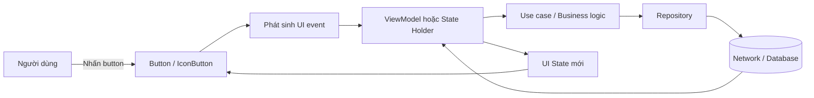
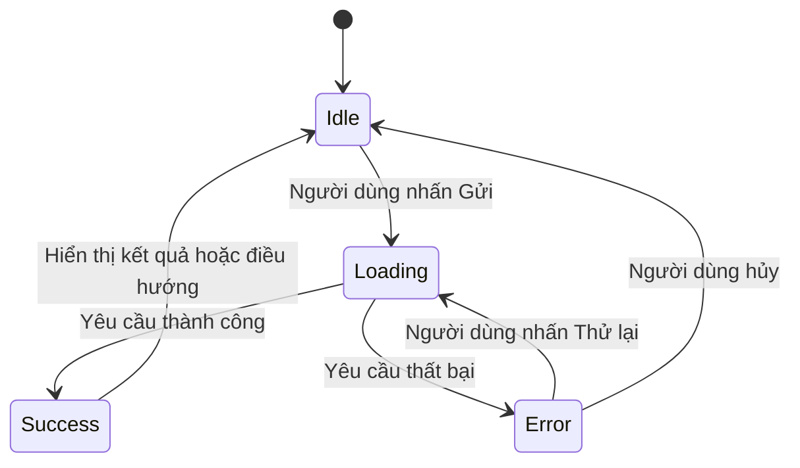
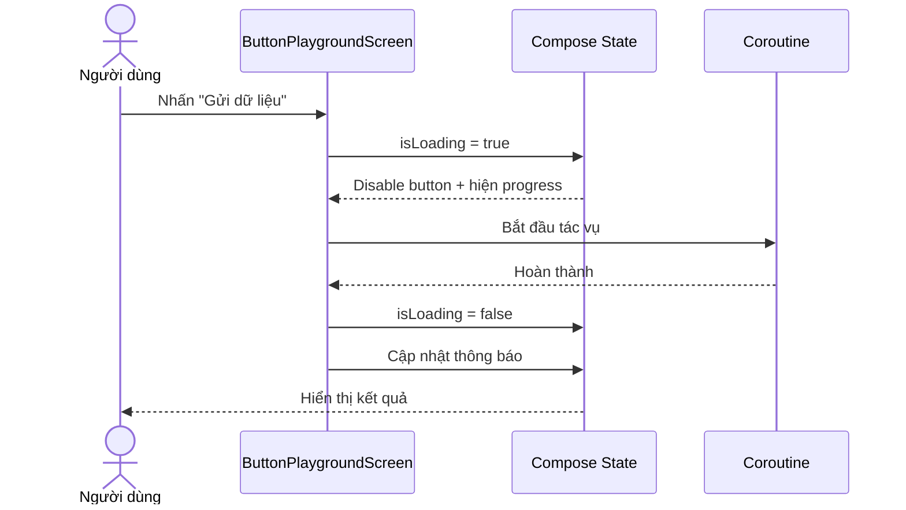
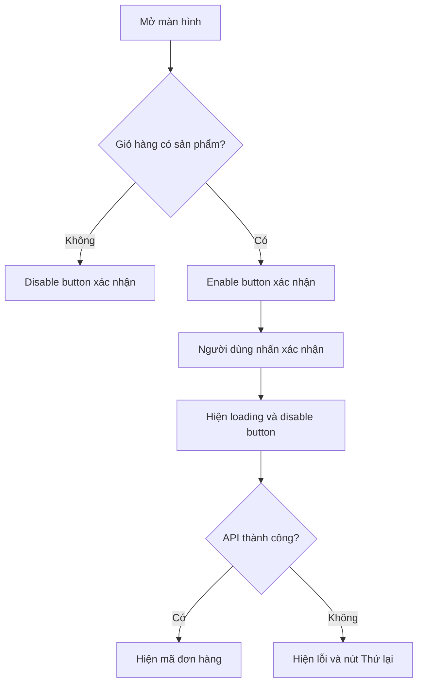
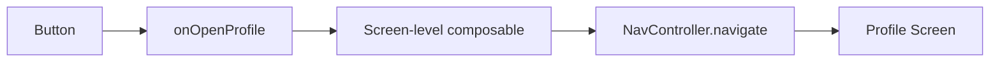
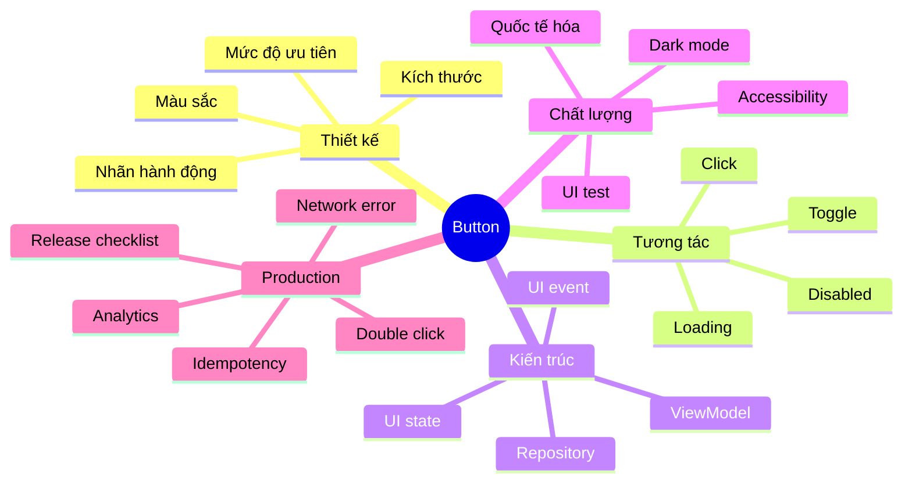

# 011 - Buttons trong Android

**Học phần:** 02 - App Components and User Interface
**Module:** Module 04 - Interface and Navigation
**Nhóm nội dung:** UI Elements
**Nguồn roadmap:** Interface and Navigation / UI Elements
**Loại bài:** UI
**Thứ tự trong module:** 011
**Thời lượng gợi ý:** 30 phút

---

## 1. Tóm tắt

**Button** là thành phần giao diện cho phép người dùng kích hoạt một hành động xác định, chẳng hạn như đăng nhập, lưu dữ liệu, gửi biểu mẫu, chuyển màn hình hoặc xóa một mục.

Một button thường gồm:

* Nhãn văn bản.
* Biểu tượng.
* Hoặc cả biểu tượng và văn bản.

Android hỗ trợ hai hướng xây dựng button chính:

1. **View System:** sử dụng XML, `Button`, `MaterialButton`, `ImageButton` và `setOnClickListener`.
2. **Jetpack Compose:** sử dụng `Button`, `FilledTonalButton`, `OutlinedButton`, `ElevatedButton`, `TextButton`, `IconButton` hoặc `FloatingActionButton`.

Tài liệu Android Developers hiện phân loại năm kiểu button Material cơ bản trong Compose: **Filled**, **Filled tonal**, **Elevated**, **Outlined** và **Text**. Mỗi kiểu thể hiện một mức độ ưu tiên hành động khác nhau.


> **Ảnh minh họa:** Năm loại button Material cơ bản. Nguồn: Android Developers.

### Vị trí của Button trong ứng dụng



Button chỉ nên chịu trách nhiệm:

* Hiển thị hành động.
* Nhận thao tác của người dùng.
* Phát ra sự kiện như `onClick`.
* Thay đổi giao diện theo state như loading, enabled hoặc disabled.

Button không nên trực tiếp chứa toàn bộ logic gọi API, truy vấn cơ sở dữ liệu hoặc xử lý nghiệp vụ phức tạp.

### Kế hoạch học trong 30 phút

| Thời gian | Nội dung                             |
| --------: | ------------------------------------ |
|    5 phút | Hiểu khái niệm và các loại button    |
|    8 phút | Viết button bằng Jetpack Compose     |
|    5 phút | Viết button bằng XML và View Binding |
|    5 phút | Quản lý loading, enabled và state    |
|    4 phút | Viết UI test                         |
|    3 phút | Chụp ảnh và cập nhật README          |

---

## 2. Mục tiêu học tập

Sau bài học, anh có thể:

* Giải thích Button bằng ngôn ngữ của mình.
* Phân biệt năm kiểu button cơ bản của Material Design.
* Chọn kiểu button phù hợp với mức độ ưu tiên của hành động.
* Xử lý sự kiện nhấn bằng `onClick` hoặc `setOnClickListener`.
* Quản lý trạng thái enabled, disabled, loading và success.
* Giữ state khi màn hình bị xoay hoặc Activity được tạo lại.
* Xây dựng button có khả năng truy cập tốt.
* Viết UI test kiểm tra button.
* Tạo một màn hình Button Playground để đưa vào portfolio.


> **Ảnh minh họa:** Filled Button dành cho hành động có mức ưu tiên cao.

### Kết quả đầu ra của bài học

Anh nên tạo được một artifact nhỏ gồm:

```text
button-playground/
├── ButtonPlaygroundScreen.kt
├── ButtonPlaygroundTest.kt
├── activity_button_playground.xml
├── ButtonPlaygroundActivity.kt
├── screenshots/
│   ├── button-normal.png
│   ├── button-loading.png
│   └── button-disabled.png
└── README.md
```

---

## 3. Khái niệm chính

### 3.1. Button là gì?

Button là thành phần tương tác truyền đạt rõ hành động sẽ xảy ra khi người dùng nhấn vào nó. Trong View System, Android cho phép tạo button bằng văn bản, biểu tượng hoặc kết hợp cả hai. Sự kiện nhấn thường được xử lý bằng `setOnClickListener`.

Ví dụ hành động phù hợp với button:

* `Đăng nhập`
* `Lưu thay đổi`
* `Gửi đơn`
* `Thêm vào giỏ hàng`
* `Tạo ghi chú`
* `Thử lại`
* `Xóa tài khoản`

Tên button nên mô tả hành động cụ thể. Tránh dùng những nhãn quá chung chung như:

* `OK`
* `Nhấn vào đây`
* `Tiếp tục` khi không rõ tiếp tục việc gì
* `Có` hoặc `Không` khi câu hỏi không được hiển thị rõ ràng

---

### 3.2. Năm loại button cơ bản trong Material Design

| Loại                    |    Mức nhấn mạnh | Trường hợp sử dụng                               |
| ----------------------- | ---------------: | ------------------------------------------------ |
| **Filled Button**       |         Cao nhất | Hành động chính như đăng nhập, lưu, gửi          |
| **Filled Tonal Button** |              Cao | Hành động quan trọng nhưng cần ít tương phản hơn |
| **Elevated Button**     | Trung bình – cao | Button cần nổi bật khỏi một surface              |
| **Outlined Button**     |       Trung bình | Hành động phụ như quay lại, hủy hoặc chỉnh sửa   |
| **Text Button**         |             Thấp | Xem thêm, bỏ qua hoặc hành động trong dialog     |

Phân loại và mục đích trên dựa trên API button Material của Jetpack Compose.

#### Filled Button


Dùng cho hành động chính của màn hình:

```kotlin
Button(
    onClick = { /* Gửi dữ liệu */ }
) {
    Text("Gửi")
}
```

#### Filled Tonal Button


Dùng cho hành động quan trọng nhưng không nên cạnh tranh với hành động chính:

```kotlin
FilledTonalButton(
    onClick = { /* Lưu bản nháp */ }
) {
    Text("Lưu bản nháp")
}
```

#### Outlined Button


Phù hợp với hành động phụ:

```kotlin
OutlinedButton(
    onClick = { /* Quay lại */ }
) {
    Text("Quay lại")
}
```

#### Elevated Button


Phù hợp khi button cần tách khỏi background hoặc surface:

```kotlin
ElevatedButton(
    onClick = { /* Mở bộ lọc */ }
) {
    Text("Bộ lọc")
}
```

#### Text Button


Dùng cho hành động ít quan trọng hơn:

```kotlin
TextButton(
    onClick = { /* Bỏ qua */ }
) {
    Text("Bỏ qua")
}
```

---

### 3.3. Button, IconButton và FloatingActionButton

Không phải mọi button đều có văn bản.

#### IconButton

`IconButton` phù hợp với những hành động phổ biến có biểu tượng dễ hiểu như:

* Tìm kiếm.
* Chia sẻ.
* Đóng.
* Yêu thích.
* Cài đặt.
* Xóa.

Android phân biệt icon button thông thường và icon button dạng toggle. Toggle icon button thể hiện hai trạng thái, chẳng hạn đã lưu hoặc chưa lưu.


```kotlin
IconButton(
    onClick = onShare
) {
    Icon(
        imageVector = Icons.Default.Share,
        contentDescription = "Chia sẻ"
    )
}
```

#### FloatingActionButton

`FloatingActionButton`, thường gọi là **FAB**, dùng cho một hành động chính, tập trung và thường xuyên nhất trên màn hình, chẳng hạn tạo ghi chú mới hoặc thêm liên hệ. Android hỗ trợ FAB thường, nhỏ, lớn và Extended FAB.

```kotlin
FloatingActionButton(
    onClick = onCreateNote
) {
    Icon(
        imageVector = Icons.Default.Add,
        contentDescription = "Tạo ghi chú"
    )
}
```

---

### 3.4. Các thuộc tính quan trọng trong Compose

```kotlin
Button(
    onClick = { },
    enabled = true,
    modifier = Modifier,
    shape = ButtonDefaults.shape,
    colors = ButtonDefaults.buttonColors(),
    elevation = ButtonDefaults.buttonElevation(),
    border = null,
    contentPadding = ButtonDefaults.ContentPadding
) {
    Text("Button")
}
```

| Thuộc tính       | Vai trò                                 |
| ---------------- | --------------------------------------- |
| `onClick`        | Callback được gọi khi người dùng nhấn   |
| `enabled`        | Cho phép hoặc vô hiệu hóa tương tác     |
| `modifier`       | Kích thước, padding, test tag và bố cục |
| `colors`         | Màu nền, màu nội dung và màu disabled   |
| `shape`          | Hình dạng và độ bo góc                  |
| `elevation`      | Độ nổi của button                       |
| `border`         | Đường viền                              |
| `contentPadding` | Khoảng cách bên trong button            |

Các tham số cốt lõi được Android Developers nêu cho Button gồm `onClick`, `enabled`, `colors` và `contentPadding`.

---

### 3.5. Luồng xử lý khi người dùng nhấn button



Button nên thay đổi theo state:

| State      | Giao diện                            |
| ---------- | ------------------------------------ |
| `Idle`     | Hiển thị nhãn bình thường            |
| `Loading`  | Hiển thị progress, khóa thao tác lặp |
| `Success`  | Hiển thị thông báo hoặc điều hướng   |
| `Error`    | Hiển thị lỗi và cho phép thử lại     |
| `Disabled` | Không nhận sự kiện nhấn              |

Ví dụ:

```kotlin
Button(
    enabled = !isLoading && inputIsValid,
    onClick = onSubmit
) {
    if (isLoading) {
        CircularProgressIndicator(
            modifier = Modifier.size(18.dp),
            strokeWidth = 2.dp
        )

        Spacer(Modifier.width(8.dp))
        Text("Đang gửi...")
    } else {
        Text("Gửi")
    }
}
```

---

### 3.6. State và lifecycle

Một button có thể phụ thuộc vào nhiều loại state:

```kotlin
data class SubmitUiState(
    val isInputValid: Boolean = false,
    val isLoading: Boolean = false,
    val isSuccess: Boolean = false,
    val errorMessage: String? = null
)
```

Lựa chọn nơi lưu state:

| Loại state                            | Nơi lưu phù hợp                          |
| ------------------------------------- | ---------------------------------------- |
| Hiệu ứng nhấn hoặc animation ngắn     | Trong composable                         |
| Toggle UI đơn giản                    | `rememberSaveable`                       |
| State của toàn màn hình               | `ViewModel`                              |
| Dữ liệu nghiệp vụ                     | Repository hoặc data layer               |
| State cần khôi phục sau process death | `SavedStateHandle` hoặc lưu trữ bền vững |

Trong Compose, state nên được đưa lên **lowest common ancestor** cần đọc và cập nhật nó. State owner nên cung cấp state bất biến và các callback sự kiện cho UI.

```kotlin
@Composable
fun FavoriteButton(
    isFavorite: Boolean,
    onFavoriteChange: (Boolean) -> Unit
) {
    IconButton(
        onClick = {
            onFavoriteChange(!isFavorite)
        }
    ) {
        Icon(
            imageVector = if (isFavorite) {
                Icons.Default.Favorite
            } else {
                Icons.Default.FavoriteBorder
            },
            contentDescription = if (isFavorite) {
                "Bỏ khỏi danh sách yêu thích"
            } else {
                "Thêm vào danh sách yêu thích"
            }
        )
    }
}
```

Composable trên là **stateless** vì state được truyền từ bên ngoài. Điều này giúp tái sử dụng và kiểm thử dễ hơn.

---

### 3.7. Accessibility

Mỗi thành phần tương tác cảm ứng nên có vùng chạm tối thiểu khoảng **48 × 48 dp**. Các Material component tiêu chuẩn như `Button` và `IconButton` đã hỗ trợ nhiều hành vi accessibility mặc định, nhưng custom button vẫn cần được kiểm tra thủ công.

Checklist accessibility cho button:

* Vùng chạm ít nhất 48 × 48 dp.
* Nhãn mô tả rõ hành động.
* Icon-only button có `contentDescription`.
* Không chỉ dùng màu để phân biệt trạng thái.
* Độ tương phản đủ rõ ở light mode và dark mode.
* Hiển thị focus khi dùng bàn phím hoặc thiết bị hỗ trợ.
* Kiểm tra với TalkBack.
* Kiểm tra khi font scale ở mức lớn.
* Không đặt hai vùng chạm quá sát nhau.
* Button disabled cần có nội dung giải thích khi lý do chưa rõ.

```kotlin
IconButton(
    modifier = Modifier.sizeIn(
        minWidth = 48.dp,
        minHeight = 48.dp
    ),
    onClick = onDelete
) {
    Icon(
        imageVector = Icons.Default.Delete,
        contentDescription = "Xóa sản phẩm"
    )
}
```

---

## 4. Thực hành

### 4.1. Bài thực hành: Button Playground bằng Jetpack Compose

Màn hình sẽ có:

* Filled Button mô phỏng gửi dữ liệu.
* Filled Tonal Button tăng bộ đếm.
* Outlined Button đặt lại state.
* Elevated Button thay đổi thông báo.
* Text Button ẩn hoặc hiện hướng dẫn.
* IconButton bật hoặc tắt yêu thích.
* Trạng thái loading và disabled.


> **Ảnh minh họa:** Button văn bản, icon button và button có cả icon lẫn văn bản trong Android View System.

### Mã nguồn Compose

```kotlin
@Composable
fun ButtonPlaygroundScreen(
    modifier: Modifier = Modifier
) {
    var count by rememberSaveable {
        mutableIntStateOf(0)
    }

    var isFavorite by rememberSaveable {
        mutableStateOf(false)
    }

    var isLoading by rememberSaveable {
        mutableStateOf(false)
    }

    var showHelp by rememberSaveable {
        mutableStateOf(false)
    }

    var statusMessage by rememberSaveable {
        mutableStateOf("Chưa có thao tác")
    }

    val coroutineScope = rememberCoroutineScope()

    Column(
        modifier = modifier
            .fillMaxSize()
            .verticalScroll(rememberScrollState())
            .padding(24.dp),
        verticalArrangement = Arrangement.spacedBy(12.dp)
    ) {
        Text(
            text = "Button Playground",
            style = MaterialTheme.typography.headlineMedium
        )

        Text(
            text = "Đã tăng: $count lần",
            style = MaterialTheme.typography.bodyLarge
        )

        Button(
            modifier = Modifier.fillMaxWidth(),
            enabled = !isLoading,
            onClick = {
                coroutineScope.launch {
                    isLoading = true
                    statusMessage = "Đang gửi dữ liệu"

                    // Chỉ dùng để mô phỏng.
                    // Production nên gọi ViewModel.
                    delay(1_000)

                    statusMessage = "Gửi dữ liệu thành công"
                    isLoading = false
                }
            }
        ) {
            if (isLoading) {
                CircularProgressIndicator(
                    modifier = Modifier.size(18.dp),
                    strokeWidth = 2.dp,
                    color = MaterialTheme.colorScheme.onPrimary
                )

                Spacer(Modifier.width(8.dp))
                Text("Đang gửi...")
            } else {
                Icon(
                    imageVector = Icons.Default.Send,
                    contentDescription = null
                )

                Spacer(Modifier.width(8.dp))
                Text("Gửi dữ liệu")
            }
        }

        FilledTonalButton(
            modifier = Modifier.fillMaxWidth(),
            onClick = {
                count++
                statusMessage = "Đã tăng bộ đếm"
            }
        ) {
            Text("Tăng bộ đếm")
        }

        OutlinedButton(
            modifier = Modifier.fillMaxWidth(),
            enabled = count > 0 || isFavorite,
            onClick = {
                count = 0
                isFavorite = false
                statusMessage = "Đã đặt lại dữ liệu"
            }
        ) {
            Text("Đặt lại")
        }

        ElevatedButton(
            modifier = Modifier.fillMaxWidth(),
            onClick = {
                statusMessage = "Elevated Button vừa được nhấn"
            }
        ) {
            Text("Thay đổi thông báo")
        }

        TextButton(
            onClick = {
                showHelp = !showHelp
            }
        ) {
            Text(
                if (showHelp) {
                    "Ẩn hướng dẫn"
                } else {
                    "Xem hướng dẫn"
                }
            )
        }

        if (showHelp) {
            Text(
                text = "Filled Button dành cho hành động chính. " +
                    "Outlined Button thường dành cho hành động phụ."
            )
        }

        Row(
            verticalAlignment = Alignment.CenterVertically
        ) {
            IconButton(
                onClick = {
                    isFavorite = !isFavorite
                    statusMessage = if (isFavorite) {
                        "Đã thêm vào yêu thích"
                    } else {
                        "Đã bỏ khỏi yêu thích"
                    }
                }
            ) {
                Icon(
                    imageVector = if (isFavorite) {
                        Icons.Default.Favorite
                    } else {
                        Icons.Default.FavoriteBorder
                    },
                    contentDescription = if (isFavorite) {
                        "Bỏ khỏi yêu thích"
                    } else {
                        "Thêm vào yêu thích"
                    }
                )
            }

            Text(
                if (isFavorite) {
                    "Đã yêu thích"
                } else {
                    "Chưa yêu thích"
                }
            )
        }

        HorizontalDivider()

        Text(
            text = "Trạng thái: $statusMessage",
            style = MaterialTheme.typography.bodyMedium
        )
    }
}
```

### Preview

```kotlin
@Preview(
    showBackground = true,
    widthDp = 390,
    heightDp = 844
)
@Composable
private fun ButtonPlaygroundPreview() {
    MaterialTheme {
        ButtonPlaygroundScreen()
    }
}
```

### Luồng hoạt động



> `delay()` chỉ được dùng để mô phỏng. Trong production, composable nên gửi event đến `ViewModel`, sau đó quan sát `UiState`.

---

### 4.2. Thực hành bằng XML và MaterialButton

#### `activity_button_playground.xml`

```xml
<?xml version="1.0" encoding="utf-8"?>
<LinearLayout
    xmlns:android="http://schemas.android.com/apk/res/android"
    xmlns:app="http://schemas.android.com/apk/res-auto"
    android:layout_width="match_parent"
    android:layout_height="match_parent"
    android:orientation="vertical"
    android:padding="24dp">

    <TextView
        android:id="@+id/tvStatus"
        android:layout_width="match_parent"
        android:layout_height="wrap_content"
        android:text="@string/status_idle"
        android:textAppearance="?attr/textAppearanceBodyLarge" />

    <com.google.android.material.button.MaterialButton
        android:id="@+id/btnSubmit"
        style="@style/Widget.Material3.Button"
        android:layout_width="match_parent"
        android:layout_height="wrap_content"
        android:layout_marginTop="16dp"
        android:text="@string/submit"
        app:icon="@drawable/ic_send_24"
        app:iconGravity="textStart" />

    <com.google.android.material.button.MaterialButton
        android:id="@+id/btnReset"
        style="@style/Widget.Material3.Button.OutlinedButton"
        android:layout_width="match_parent"
        android:layout_height="wrap_content"
        android:layout_marginTop="12dp"
        android:enabled="false"
        android:text="@string/reset" />

    <com.google.android.material.button.MaterialButton
        android:id="@+id/btnHelp"
        style="@style/Widget.Material3.Button.TextButton"
        android:layout_width="wrap_content"
        android:layout_height="wrap_content"
        android:text="@string/show_help" />

</LinearLayout>
```

#### Xử lý sự kiện bằng View Binding

View Binding tạo binding class tương ứng với mỗi layout và cung cấp tham chiếu trực tiếp đến các View có `id`. Trong phần lớn trường hợp, nó có thể thay thế `findViewById`.

```kotlin
class ButtonPlaygroundActivity : AppCompatActivity() {

    private lateinit var binding: ActivityButtonPlaygroundBinding
    private var clickCount = 0

    override fun onCreate(savedInstanceState: Bundle?) {
        super.onCreate(savedInstanceState)

        binding = ActivityButtonPlaygroundBinding.inflate(layoutInflater)
        setContentView(binding.root)

        binding.btnSubmit.setOnClickListener {
            clickCount++

            binding.tvStatus.text = getString(
                R.string.submit_count,
                clickCount
            )

            binding.btnReset.isEnabled = true
        }

        binding.btnReset.setOnClickListener {
            clickCount = 0

            binding.tvStatus.text = getString(R.string.status_idle)
            binding.btnReset.isEnabled = false
        }

        binding.btnHelp.setOnClickListener {
            MaterialAlertDialogBuilder(this)
                .setTitle(R.string.button_help_title)
                .setMessage(R.string.button_help_message)
                .setPositiveButton(R.string.close, null)
                .show()
        }
    }
}
```

---

### 4.3. Tách UI và business logic

Production không nên gọi network trực tiếp trong `onClick`.

#### Không nên

```kotlin
Button(
    onClick = {
        apiService.submitForm()
    }
) {
    Text("Gửi")
}
```

#### Nên

```kotlin
@Composable
fun SubmitScreen(
    uiState: SubmitUiState,
    onSubmitClicked: () -> Unit
) {
    Button(
        enabled = !uiState.isLoading,
        onClick = onSubmitClicked
    ) {
        Text(
            if (uiState.isLoading) {
                "Đang gửi..."
            } else {
                "Gửi"
            }
        )
    }
}
```

```kotlin
class SubmitViewModel(
    private val repository: SubmitRepository
) : ViewModel() {

    private val _uiState = MutableStateFlow(SubmitUiState())
    val uiState = _uiState.asStateFlow()

    fun submit() {
        if (_uiState.value.isLoading) return

        viewModelScope.launch {
            _uiState.update {
                it.copy(
                    isLoading = true,
                    errorMessage = null
                )
            }

            runCatching {
                repository.submit()
            }.onSuccess {
                _uiState.update {
                    it.copy(
                        isLoading = false,
                        isSuccess = true
                    )
                }
            }.onFailure { error ->
                _uiState.update {
                    it.copy(
                        isLoading = false,
                        errorMessage = error.message
                    )
                }
            }
        }
    }
}
```

---

## 5. Bài tập

### Bài tập chính: Màn hình xác nhận đơn hàng

Xây dựng màn hình gồm:

* Tổng tiền.
* Filled Button: `Xác nhận đơn hàng`.
* Outlined Button: `Chỉnh sửa đơn`.
* Text Button: `Hủy`.
* IconButton: lưu đơn hàng vào danh sách yêu thích.
* Loading indicator khi đang gửi.
* Error message khi gửi thất bại.
* Button xác nhận bị disabled nếu giỏ hàng trống.


### State gợi ý

```kotlin
data class CheckoutUiState(
    val itemCount: Int = 0,
    val totalPrice: Long = 0,
    val isFavorite: Boolean = false,
    val isSubmitting: Boolean = false,
    val orderId: String? = null,
    val errorMessage: String? = null
) {
    val canSubmit: Boolean
        get() = itemCount > 0 && !isSubmitting
}
```

### Yêu cầu hành vi



### Điều kiện hoàn thành

* Button xác nhận không nhận nhiều lần nhấn trong lúc loading.
* Xoay màn hình không làm mất tổng tiền và trạng thái yêu thích.
* Có thông báo lỗi khi yêu cầu thất bại.
* Icon-only button có `contentDescription`.
* Nội dung vẫn đọc được khi font scale lớn.
* Có ít nhất một Compose UI test.
* Có ảnh chụp trạng thái normal, loading và error.

---

### 5.1. Compose UI test

Compose cung cấp API để tìm node, thực hiện thao tác và kiểm tra trạng thái UI thông qua semantics tree.

#### Composable có thể kiểm thử

```kotlin
@Composable
fun CounterButton(
    count: Int,
    onIncrement: () -> Unit
) {
    Column {
        Text("Đã nhấn: $count")

        Button(
            onClick = onIncrement
        ) {
            Text("Tăng")
        }
    }
}
```

#### Test

```kotlin
class CounterButtonTest {

    @get:Rule
    val composeRule = createComposeRule()

    @Test
    fun clickButton_incrementsCounter() {
        composeRule.setContent {
            var count by remember {
                mutableIntStateOf(0)
            }

            CounterButton(
                count = count,
                onIncrement = {
                    count++
                }
            )
        }

        composeRule
            .onNodeWithText("Đã nhấn: 0")
            .assertExists()

        composeRule
            .onNodeWithText("Tăng")
            .performClick()

        composeRule
            .onNodeWithText("Đã nhấn: 1")
            .assertExists()
    }
}
```

### Các test case nên có

| Test case               | Kết quả mong đợi                     |
| ----------------------- | ------------------------------------ |
| Nhấn button bình thường | Callback được gọi một lần            |
| Button disabled         | Không thực hiện callback             |
| Đang loading            | Button không nhận lần nhấn tiếp theo |
| Input không hợp lệ      | Button submit bị disabled            |
| API thành công          | Hiển thị success state               |
| API thất bại            | Hiển thị lỗi và nút thử lại          |
| Toggle favorite         | Icon và mô tả accessibility thay đổi |
| Xoay màn hình           | State cần thiết được giữ lại         |

---

### 5.2. Manual test checklist

```markdown
- [ ] Filled Button dễ nhận biết là hành động chính.
- [ ] Button có phản hồi trực quan khi nhấn.
- [ ] Không gửi yêu cầu trùng khi nhấn liên tục.
- [ ] Button disabled không xử lý sự kiện.
- [ ] Loading indicator không làm thay đổi kích thước button quá nhiều.
- [ ] Thông báo lỗi giải thích được vấn đề.
- [ ] Người dùng có thể thử lại.
- [ ] State không mất sau khi xoay màn hình.
- [ ] Nhãn không bị cắt khi dùng tiếng Việt.
- [ ] Nhãn không bị cắt khi đổi sang ngôn ngữ dài hơn.
- [ ] Giao diện hoạt động ở light mode và dark mode.
- [ ] TalkBack đọc đúng tên và vai trò của button.
- [ ] Icon-only button có content description.
- [ ] Vùng chạm đạt tối thiểu 48 × 48 dp.
```

---

## 6. Checklist hoàn thành


### Kiến thức

* [ ] Có định nghĩa ngắn gọn về Button.
* [ ] Phân biệt được Filled, Tonal, Elevated, Outlined và Text Button.
* [ ] Biết khi nào dùng IconButton.
* [ ] Biết khi nào nên dùng FloatingActionButton.
* [ ] Hiểu `onClick` và `setOnClickListener`.
* [ ] Hiểu `enabled`, loading và disabled state.

### Code

* [ ] Có ví dụ Jetpack Compose.
* [ ] Có ví dụ XML và MaterialButton.
* [ ] Không đặt business logic phức tạp trong composable.
* [ ] Button nhận state và callback từ bên ngoài.
* [ ] Chặn double click trong lúc loading.
* [ ] Không hardcode chuỗi hiển thị trong production.
* [ ] Có xử lý success và error.

### Lifecycle và state

* [ ] UI state đơn giản dùng `rememberSaveable`.
* [ ] Screen state được quản lý trong ViewModel khi cần.
* [ ] Kiểm tra xoay màn hình.
* [ ] Xem xét `SavedStateHandle` khi cần khôi phục sau process recreation.
* [ ] Không lưu `Activity`, `View` hoặc `Context` không phù hợp trong ViewModel.

### Accessibility

* [ ] Vùng chạm tối thiểu 48 × 48 dp.
* [ ] Icon-only button có `contentDescription`.
* [ ] Nhãn mô tả hành động rõ ràng.
* [ ] Không chỉ dùng màu để thể hiện state.
* [ ] Đã kiểm tra TalkBack.
* [ ] Đã kiểm tra font scale lớn.

### Testing và portfolio

* [ ] Có ít nhất một UI test.
* [ ] Có manual checklist.
* [ ] Có screenshot trạng thái normal.
* [ ] Có screenshot trạng thái loading.
* [ ] Có screenshot trạng thái disabled hoặc error.
* [ ] README giải thích kiến trúc state và event.
* [ ] Source code được đưa lên repository.

---

## 7. Ghi chú sản xuất


### 7.1. Chống double click

Người dùng có thể nhấn liên tục khi mạng chậm. Điều này có thể gây:

* Tạo hai đơn hàng.
* Gửi biểu mẫu hai lần.
* Điều hướng mở nhiều màn hình giống nhau.
* Thanh toán trùng.
* Ghi dữ liệu trùng vào database.

Cách xử lý phổ biến:

```kotlin
fun submit() {
    if (uiState.value.isLoading) return

    // Chuyển sang loading trước khi bắt đầu tác vụ.
}
```

UI cũng cần disable button:

```kotlin
Button(
    enabled = !uiState.isLoading,
    onClick = onSubmit
) {
    Text("Xác nhận")
}
```

Đối với thao tác quan trọng như thanh toán, backend vẫn cần hỗ trợ **idempotency**. Không nên chỉ dựa vào việc disable button ở client.

---

### 7.2. Loading state

Một loading button tốt nên:

* Disable thao tác lặp.
* Hiển thị tiến trình.
* Giữ chiều rộng tương đối ổn định.
* Cho người dùng biết ứng dụng đang xử lý.
* Có timeout và error state.
* Cho phép thử lại khi phù hợp.

Không nên để button biến mất ngay sau khi nhấn vì người dùng có thể không biết thao tác đã được ghi nhận hay chưa.

---

### 7.3. Navigation

Khi button dùng để chuyển màn hình:

```kotlin
Button(
    onClick = onOpenProfile
) {
    Text("Xem hồ sơ")
}
```

Composable con chỉ nên phát sự kiện. `NavController` thường được giữ ở cấp màn hình hoặc navigation graph phù hợp thay vì truyền sâu vào mọi component.

Luồng nên là:



---

### 7.4. Destructive action

Button xóa nên có ngữ nghĩa rõ ràng:

```kotlin
Button(
    colors = ButtonDefaults.buttonColors(
        containerColor = MaterialTheme.colorScheme.error,
        contentColor = MaterialTheme.colorScheme.onError
    ),
    onClick = onRequestDelete
) {
    Text("Xóa tài khoản")
}
```

Đối với dữ liệu khó khôi phục:

1. Hiển thị dialog xác nhận.
2. Nói rõ dữ liệu nào sẽ bị xóa.
3. Tránh đặt hai button có mức nhấn mạnh ngang nhau.
4. Cân nhắc yêu cầu xác thực lại.
5. Cung cấp undo nếu nghiệp vụ cho phép.

---

### 7.5. Quốc tế hóa

Button phải được kiểm tra với:

* Tiếng Việt có dấu.
* Tiếng Đức hoặc ngôn ngữ có chuỗi dài.
* Ngôn ngữ RTL.
* Font scale lớn.
* Màn hình nhỏ.
* Chế độ chia đôi màn hình.

Không nên đặt chiều rộng cố định quá nhỏ:

```kotlin
// Dễ làm cắt chữ.
Modifier.width(100.dp)
```

Nên ưu tiên:

```kotlin
Modifier.fillMaxWidth()
```

hoặc để button tự đo theo nội dung:

```kotlin
Modifier.wrapContentWidth()
```

---

### 7.6. Logging và analytics

Có thể ghi nhận:

* Người dùng nhấn hành động nào.
* Thời gian từ lúc nhấn đến khi hoàn thành.
* Tỷ lệ success hoặc failure.
* Số lần thử lại.
* Lỗi validation.

Không nên log:

* Mật khẩu.
* Token.
* Thông tin thanh toán.
* Nội dung nhạy cảm.
* Dữ liệu cá nhân không cần thiết.

---

### 7.7. Release checklist

Trước khi phát hành, cần kiểm tra:

```markdown
- [ ] Hành động chính được thể hiện bằng đúng loại button.
- [ ] Không có nhiều primary button cạnh tranh nhau.
- [ ] Không thể gửi yêu cầu trùng.
- [ ] Loading, success, error và retry hoạt động.
- [ ] State không mất khi rotate hoặc background.
- [ ] Back navigation không tạo hành động lặp.
- [ ] Button hoạt động với bàn phím và TalkBack.
- [ ] Đã kiểm tra light mode và dark mode.
- [ ] Đã kiểm tra màn hình nhỏ và tablet.
- [ ] Đã kiểm tra chuỗi dịch dài.
- [ ] Analytics không thu thập dữ liệu nhạy cảm.
- [ ] Destructive action có xác nhận phù hợp.
- [ ] UI test chạy thành công trên CI.
```

---

## 8. Artifact gợi ý cho portfolio

### Tên dự án

**Android Material Button Playground**

### README mẫu

```markdown
# Android Material Button Playground

Ứng dụng nhỏ minh họa các loại button trong Material 3:

- Filled Button
- Filled Tonal Button
- Outlined Button
- Elevated Button
- Text Button
- IconButton
- FloatingActionButton

## Nội dung kỹ thuật

- Jetpack Compose
- Material 3
- State hoisting
- rememberSaveable
- Loading và error state
- Accessibility
- Compose UI testing

## Kiến trúc

UI Event → ViewModel → Repository → UI State

## Test case

- Click cập nhật state.
- Disabled button không nhận click.
- Loading ngăn double submit.
- Error hiển thị nút thử lại.
- Toggle icon cập nhật content description.
```

### Screenshot nên chụp

1. Màn hình hiển thị đầy đủ các loại button.
2. Filled Button ở trạng thái loading.
3. Outlined Button ở trạng thái disabled.
4. IconButton ở hai trạng thái selected và unselected.
5. Error state có button `Thử lại`.
6. Giao diện ở dark mode.

---

## 9. Câu hỏi tự kiểm tra

1. Filled Button và Outlined Button khác nhau về mức độ ưu tiên như thế nào?
2. Vì sao không nên gọi API trực tiếp trong composable?
3. Khi nào nên dùng `rememberSaveable`?
4. Khi nào button nên bị disabled?
5. Làm thế nào để ngăn người dùng gửi một yêu cầu hai lần?
6. Icon-only button cần thuộc tính accessibility nào?
7. Vì sao touch target nên có kích thước tối thiểu 48 × 48 dp?
8. FAB có nên được dùng cho nhiều hành động chính trên cùng màn hình không?
9. State nào nên được đưa vào ViewModel?
10. Những trạng thái nào cần được chụp screenshot cho portfolio?

---

## 10. Tổng kết

Button không chỉ là một hình chữ nhật có thể nhấn. Một button production-ready cần kết nối đúng giữa:



Một implementation tốt cần:

* Dùng đúng kiểu button cho đúng hành động.
* Phát event thay vì chứa business logic.
* Hiển thị rõ loading, success và error.
* Không làm mất state ngoài ý muốn.
* Hỗ trợ accessibility.
* Có test bảo vệ hành vi quan trọng.
* Xử lý double click và lỗi mạng trước khi release.

### Tài liệu chính thức

* Android Developers — Button trong Jetpack Compose.
* Android Developers — Button trong View System.
* Android Developers — Icon Button.
* Android Developers — Floating Action Button.
* Android Developers — Accessibility cho ứng dụng.
* Android Developers — State hoisting.
* Android Developers — Compose Testing APIs.
