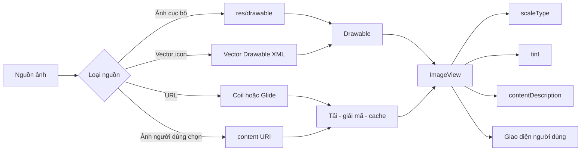
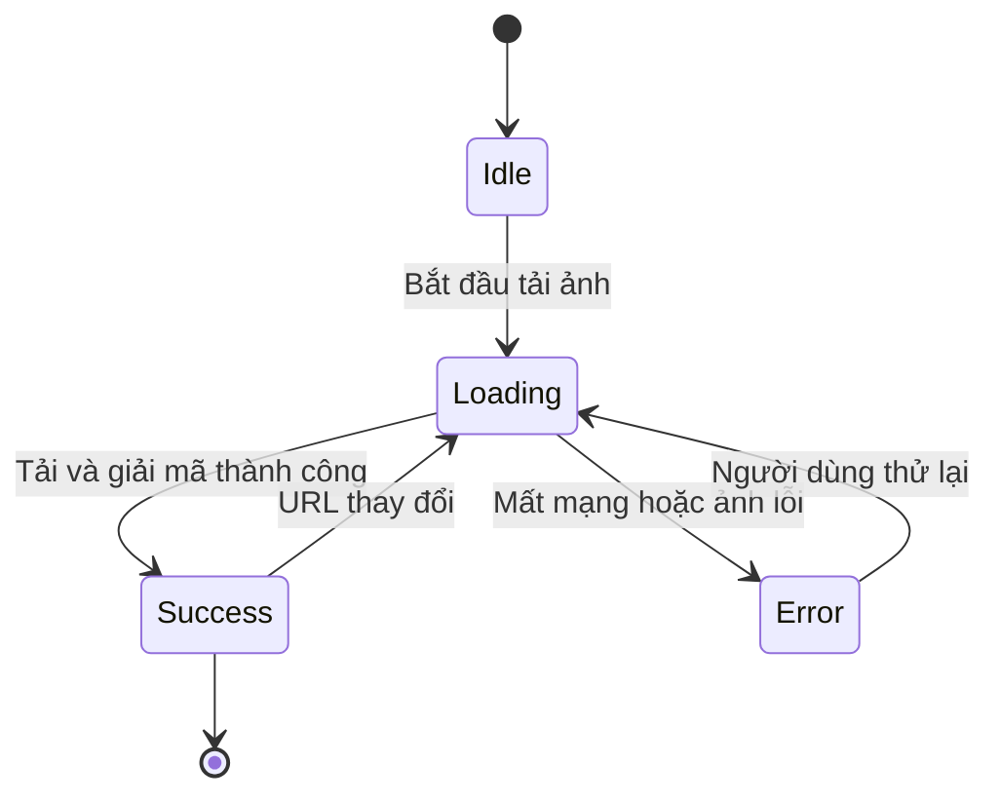
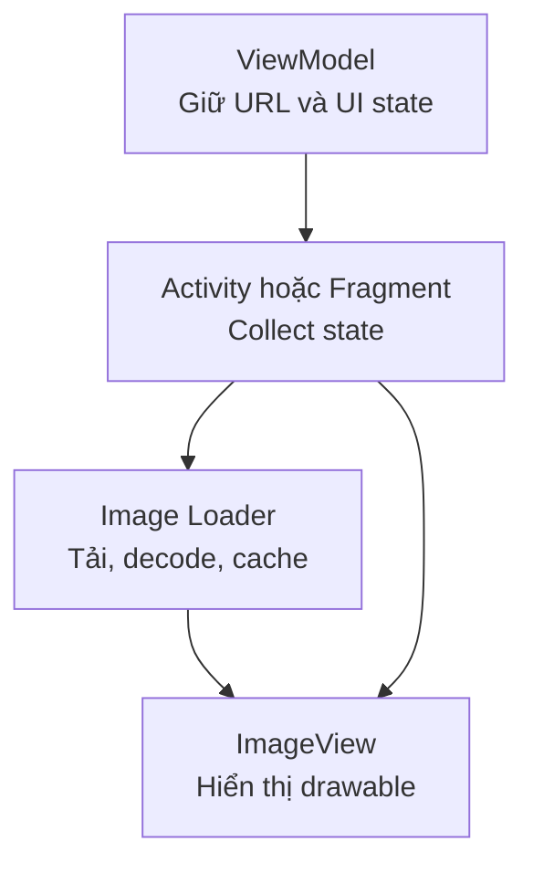
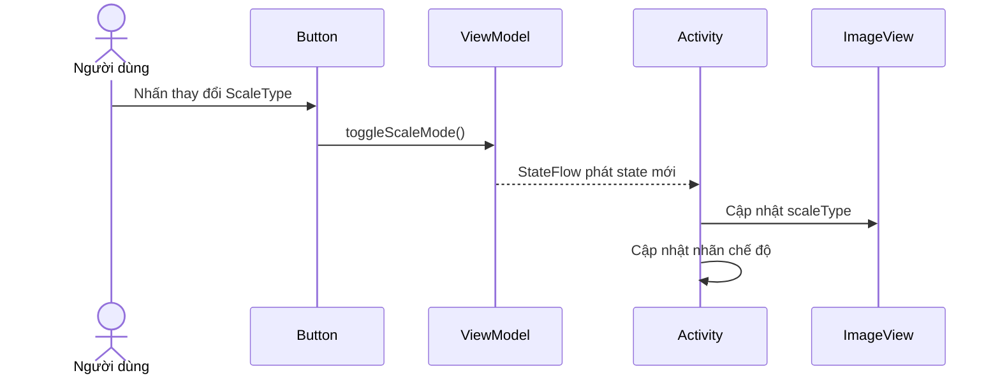
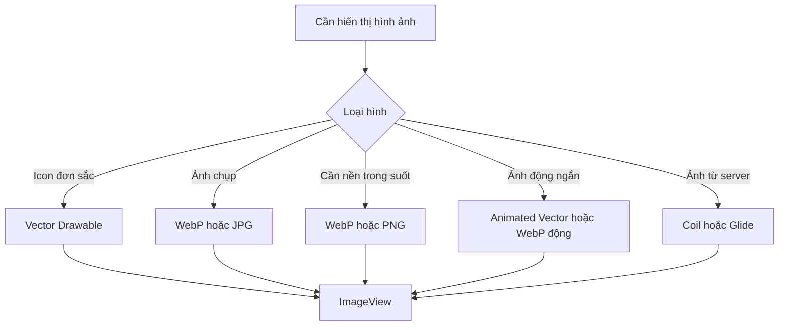

# 012 - ImageView trong Android

**Học phần:** 02 - App Components and User Interface
**Module:** Module 04 - Interface and Navigation
**Nhóm nội dung:** UI Elements
**Nguồn roadmap:** Interface and Navigation / UI Elements
**Loại bài:** UI
**Thứ tự trong module:** 012
**Thời lượng gợi ý:** 30 phút

---

## 1. Tóm tắt


> Minh họa một màn hình Android hiển thị nhiều ảnh được tải từ mạng.

`ImageView` là thành phần giao diện thuộc hệ thống **Android Views**, được dùng để hiển thị các đối tượng `Drawable`, chẳng hạn:

* Ảnh PNG, JPG hoặc WebP.
* Vector Drawable.
* Icon.
* Bitmap được tạo trong runtime.
* Ảnh lấy từ bộ nhớ thiết bị.
* Ảnh tải từ URL thông qua Coil, Glide hoặc thư viện tương tự.

Trong ứng dụng hiện đại, có thể xem `ImageView` là thành phần tương ứng với `Image` hoặc `AsyncImage` trong Jetpack Compose:

| Android Views            | Jetpack Compose      | Mục đích                           |
| ------------------------ | -------------------- | ---------------------------------- |
| `ImageView`              | `Image`              | Hiển thị ảnh cục bộ                |
| `ImageView` + Coil/Glide | `AsyncImage`         | Hiển thị ảnh từ URL                |
| `android:scaleType`      | `contentScale`       | Điều chỉnh cách ảnh khớp với khung |
| `android:tint`           | `colorFilter`        | Đổi màu drawable hoặc icon         |
| `contentDescription`     | `contentDescription` | Hỗ trợ trình đọc màn hình          |

Android hỗ trợ drawable bitmap ở các định dạng PNG, WebP, JPG và GIF; trong tài liệu Android, GIF được khuyến nghị hạn chế sử dụng. Tệp đặt trong `res/drawable` được biên dịch thành tài nguyên `Drawable` để tham chiếu bằng `R.drawable.ten_anh`.

### ImageView nằm ở đâu trong ứng dụng?



Một `ImageView` tưởng như chỉ hiển thị ảnh, nhưng trong production nó liên quan trực tiếp đến:

* Trải nghiệm tải dữ liệu.
* Bộ nhớ và hiệu năng.
* Trạng thái loading, success và error.
* Khả năng truy cập.
* Lifecycle của Activity hoặc Fragment.
* Tái sử dụng View trong `RecyclerView`.
* Kiểm thử trên nhiều kích thước và mật độ màn hình.

---

## 2. Mục tiêu học tập


Sau bài học này, anh có thể:

* Giải thích `ImageView` bằng ngôn ngữ của mình.
* Phân biệt ảnh cục bộ, vector drawable và ảnh mạng.
* Thêm `ImageView` vào layout XML.
* Thay đổi ảnh bằng Kotlin.
* Chọn đúng `scaleType`.
* Sử dụng `contentDescription` đúng mục đích.
* Quản lý trạng thái loading, success và error.
* Không lưu `Bitmap`, `Activity` hoặc `ImageView` trong `ViewModel`.
* Tải ảnh mạng bằng một image-loading library.
* Kiểm tra UI sau khi xoay màn hình hoặc đưa ứng dụng xuống nền.
* Phát hiện các vấn đề như méo ảnh, ảnh mờ, ảnh sai vị trí hoặc `OutOfMemoryError`.
* Tạo một màn hình demo đủ tốt để đưa vào portfolio.

### Kết quả đầu ra sau 30 phút

Anh nên có một mini project với:

```text
ImageViewDemo/
├── app/src/main/
│   ├── java/.../ImagePreviewActivity.kt
│   ├── java/.../ImagePreviewViewModel.kt
│   ├── res/layout/activity_image_preview.xml
│   ├── res/drawable/sample_landscape.webp
│   ├── res/drawable/loading_img.xml
│   ├── res/drawable/ic_broken_image.xml
│   └── res/values/strings.xml
├── screenshots/
│   ├── fit_center.png
│   ├── center_crop.png
│   └── landscape_mode.png
└── README.md
```

---

## 3. Khái niệm chính

### 3.1. ImageView là gì?

`ImageView` là một lớp con của `View`, chịu trách nhiệm đo kích thước, bố trí và vẽ một hình ảnh vào vùng giao diện của nó.

Ví dụ cơ bản:

```xml
<ImageView
    android:id="@+id/imagePreview"
    android:layout_width="200dp"
    android:layout_height="200dp"
    android:src="@drawable/sample_landscape"
    android:scaleType="centerCrop"
    android:contentDescription="@string/sample_photo_description" />
```

Trong AndroidX, khi sử dụng vector drawable, thường nên dùng `app:srcCompat`:

```xml
<androidx.appcompat.widget.AppCompatImageView
    android:id="@+id/iconStatus"
    android:layout_width="48dp"
    android:layout_height="48dp"
    android:contentDescription="@string/status_icon_description"
    app:srcCompat="@drawable/ic_check_circle" />
```

Vector Asset Studio tạo tài nguyên vector dưới dạng XML. Một vector có thể được co giãn trên nhiều mật độ màn hình mà không bị mất nét như bitmap và thường phù hợp với icon hoặc hình minh họa đơn giản.

---

### 3.2. Các nguồn ảnh thường gặp

| Nguồn ảnh          | Ví dụ                  | Cách đưa vào ImageView                  |
| ------------------ | ---------------------- | --------------------------------------- |
| Drawable cục bộ    | `sample.webp`          | `android:src` hoặc `setImageResource()` |
| Vector Drawable    | `ic_profile.xml`       | `app:srcCompat`                         |
| `Bitmap`           | Ảnh đã xử lý           | `setImageBitmap()`                      |
| `Drawable` runtime | Shape hoặc layer       | `setImageDrawable()`                    |
| URI                | Ảnh từ Photo Picker    | Image loader hoặc `setImageURI()`       |
| URL HTTPS          | Ảnh đại diện, sản phẩm | Coil hoặc Glide                         |

Ví dụ cập nhật ảnh từ Kotlin:

```kotlin
binding.imagePreview.setImageResource(R.drawable.sample_landscape)
```

Với `Drawable`:

```kotlin
val drawable = AppCompatResources.getDrawable(
    this,
    R.drawable.ic_check_circle
)

binding.imagePreview.setImageDrawable(drawable)
```

Với `Bitmap`:

```kotlin
binding.imagePreview.setImageBitmap(bitmap)
```

> Không nên tải và giải mã ảnh mạng thủ công trên main thread. Image-loading library xử lý tải, giải mã, cache và cập nhật View hiệu quả hơn. Android cũng khuyến nghị sử dụng thư viện như Glide, Coil hoặc giải pháp tương đương để xử lý bitmap lớn.

---

### 3.3. `android:src` và `android:background`

Hai thuộc tính này có mục đích khác nhau:

```xml
<ImageView
    android:layout_width="160dp"
    android:layout_height="160dp"
    android:background="@drawable/image_border"
    android:src="@drawable/sample_avatar" />
```

* `src` là nội dung ảnh chính của `ImageView`.
* `background` nằm phía sau toàn bộ View.
* `scaleType` áp dụng cho `src`, không áp dụng theo cùng cách cho `background`.
* Padding nằm giữa cạnh của View và nội dung ảnh.

Một lỗi phổ biến là đặt ảnh cần crop vào `background`, sau đó thắc mắc tại sao `scaleType` không hoạt động. Trong trường hợp đó, ảnh phải được đặt bằng `src` hoặc `srcCompat`.

---

### 3.4. ScaleType

`scaleType` quyết định cách ảnh được co giãn, căn chỉnh hoặc cắt khi tỷ lệ ảnh khác tỷ lệ của `ImageView`.

#### `FIT_CENTER`


Ảnh được giữ nguyên tỷ lệ, co giãn để nằm hoàn toàn trong vùng hiển thị và căn giữa. Phần trống có thể xuất hiện ở hai bên hoặc trên dưới.

```xml
android:scaleType="fitCenter"
```

Phù hợp với:

* Ảnh sản phẩm cần hiển thị đầy đủ.
* Logo.
* Hình minh họa không được phép bị cắt.
* Tài liệu hoặc ảnh có nội dung quan trọng ở sát mép.

#### `CENTER_CROP`


Ảnh giữ nguyên tỷ lệ, được phóng đủ lớn để lấp đầy View. Phần ảnh vượt ra ngoài khung bị cắt.

```xml
android:scaleType="centerCrop"
```

Phù hợp với:

* Ảnh đại diện.
* Thumbnail.
* Banner.
* Card tin tức.
* Ảnh trong danh sách hoặc lưới.

#### `FIT_XY`


Ảnh bị kéo theo cả chiều ngang và chiều dọc để lấp đầy View, không giữ tỷ lệ gốc.

```xml
android:scaleType="fitXY"
```

`fitXY` có thể làm ảnh méo. Chỉ nên dùng khi:

* Drawable được thiết kế để kéo giãn.
* Hình nền trừu tượng không có chủ thể.
* Tỷ lệ nguồn đã đúng với tỷ lệ đích.
* Đã kiểm tra trên tất cả kích thước màn hình.

Tài liệu API của Android định nghĩa các chế độ `CENTER`, `CENTER_CROP`, `CENTER_INSIDE`, `FIT_CENTER`, `FIT_START`, `FIT_END`, `FIT_XY` và `MATRIX`.

### Bảng lựa chọn ScaleType

| ScaleType      |    Giữ tỷ lệ |  Có thể crop | Có thể phóng ảnh nhỏ | Trường hợp phù hợp                   |
| -------------- | -----------: | -----------: | -------------------: | ------------------------------------ |
| `center`       |           Có |           Có |                Không | Pixel art, icon kích thước cố định   |
| `centerCrop`   |           Có |           Có |                   Có | Avatar, thumbnail, banner            |
| `centerInside` |           Có |        Không |         Thường không | Icon hoặc ảnh nhỏ cần giữ kích thước |
| `fitCenter`    |           Có |        Không |                   Có | Ảnh cần xem đầy đủ                   |
| `fitStart`     |           Có |        Không |                   Có | Ảnh căn đầu View                     |
| `fitEnd`       |           Có |        Không |                   Có | Ảnh căn cuối View                    |
| `fitXY`        |        Không |        Không |                   Có | Drawable có thể kéo dãn              |
| `matrix`       | Tùy cấu hình | Tùy cấu hình |         Tùy cấu hình | Zoom, pan, biến đổi tùy chỉnh        |

### Quy tắc ghi nhớ

```text
Muốn lấp đầy khung        → centerCrop
Muốn thấy toàn bộ ảnh     → fitCenter
Muốn ảnh nhỏ không phóng  → centerInside
Muốn tự zoom/pan          → matrix
Không muốn ảnh bị méo     → tránh fitXY
```

---

### 3.5. `adjustViewBounds`

`adjustViewBounds` cho phép `ImageView` điều chỉnh kích thước của chính nó để duy trì tỷ lệ của drawable trong những trường hợp layout cho phép.

```xml
<ImageView
    android:layout_width="match_parent"
    android:layout_height="wrap_content"
    android:adjustViewBounds="true"
    android:scaleType="fitCenter"
    android:src="@drawable/sample_landscape" />
```

Thuộc tính này hữu ích khi:

* Chiều rộng đã xác định nhưng chiều cao cần tính theo ảnh.
* Hiển thị ảnh trong bài viết.
* Card có ảnh với tỷ lệ nguồn khác nhau.

Không nên phụ thuộc hoàn toàn vào `adjustViewBounds` trong danh sách có nhiều ảnh không đồng nhất vì chiều cao thay đổi có thể làm giao diện nhảy hoặc khó dự đoán.

---

### 3.6. Tint và ColorFilter

Tint thường được dùng cho icon đơn sắc:

```xml
<androidx.appcompat.widget.AppCompatImageView
    android:layout_width="32dp"
    android:layout_height="32dp"
    android:contentDescription="@string/favorite_icon_description"
    app:srcCompat="@drawable/ic_favorite"
    app:tint="?attr/colorPrimary" />
```

Thay đổi bằng Kotlin:

```kotlin
ImageViewCompat.setImageTintList(
    binding.iconFavorite,
    ColorStateList.valueOf(
        ContextCompat.getColor(this, R.color.favorite)
    )
)
```

Không nên tint trực tiếp ảnh chụp nhiều màu, trừ khi hiệu ứng đó là chủ ý thiết kế.

---

### 3.7. Accessibility và contentDescription

Ảnh truyền tải thông tin cần có mô tả ngắn gọn và có ý nghĩa:

```xml
<ImageView
    android:id="@+id/weatherIcon"
    android:layout_width="48dp"
    android:layout_height="48dp"
    android:src="@drawable/ic_heavy_rain"
    android:contentDescription="@string/heavy_rain_description" />
```

```xml
<string name="heavy_rain_description">Mưa lớn trong chiều nay</string>
```

Không nên viết:

```xml
<string name="heavy_rain_description">Hình ảnh biểu tượng thời tiết</string>
```

Mô tả nên truyền tải **ý nghĩa**, không chỉ mô tả hình thức.

Với ảnh trang trí:

```xml
<ImageView
    android:layout_width="match_parent"
    android:layout_height="120dp"
    android:src="@drawable/decorative_wave"
    android:contentDescription="@null"
    android:importantForAccessibility="no" />
```

Trong Compose, ảnh trang trí thường đặt `contentDescription = null`. TalkBack sẽ bỏ qua ảnh đó thay vì đọc một mô tả không cần thiết.

Android Studio Lint có thể cảnh báo:

```text
[Accessibility] Missing 'contentDescription' attribute on image
```

Các accessibility check cũng có thể được tích hợp vào Espresso để phát hiện vấn đề trong quá trình kiểm thử.

---

### 3.8. Lifecycle và state

`ImageView` chỉ là lớp hiển thị. Nó không nên là nơi lưu trạng thái nghiệp vụ.

Ví dụ trạng thái liên quan tới ảnh:

```kotlin
data class ImageUiState(
    val imageUrl: String? = null,
    val scaleMode: ScaleMode = ScaleMode.FIT,
    val isLoading: Boolean = false,
    val hasError: Boolean = false
)
```



Phân chia trách nhiệm nên như sau:



Không nên:

```kotlin
class ImageViewModel : ViewModel() {
    lateinit var imageView: ImageView       // Không nên
    lateinit var activity: MainActivity     // Không nên
    var bitmap: Bitmap? = null              // Cân nhắc kỹ với bitmap lớn
}
```

Nên lưu:

```kotlin
class ImageViewModel(
    private val savedStateHandle: SavedStateHandle
) : ViewModel() {

    val imageUrl = savedStateHandle.getStateFlow(
        key = "image_url",
        initialValue = ""
    )

    fun setImageUrl(url: String) {
        savedStateHandle["image_url"] = url
    }
}
```

Khi Activity hoặc Fragment được tạo lại:

1. UI thu thập state từ `ViewModel`.
2. URL hoặc resource ID được áp dụng lại.
3. Image loader đọc cache hoặc tải lại khi cần.
4. `ImageView` hiển thị kết quả mới.

---

### 3.9. Hiệu năng và bộ nhớ

Bitmap sau khi giải mã có thể lớn hơn rất nhiều so với kích thước tệp JPG hoặc WebP trên ổ đĩa. Với cấu hình `ARGB_8888`, mỗi pixel thường cần khoảng bốn byte bộ nhớ. Vì vậy, bitmap 1.000 × 1.000 pixel có thể cần khoảng 4 MB bộ nhớ dù tệp nén ban đầu nhỏ hơn nhiều.

Ví dụ:

```text
4000 × 3000 × 4 byte
= 48.000.000 byte
≈ 45,8 MiB cho một bitmap
```

Nếu ứng dụng đồng thời giữ nhiều ảnh lớn, nguy cơ bao gồm:

* Garbage collection diễn ra thường xuyên.
* Cuộn danh sách bị giật.
* Thời gian decode tăng.
* `OutOfMemoryError`.
* App bị hệ thống kết thúc khi thiếu bộ nhớ.

Nguyên tắc:

```text
Kích thước bitmap trong RAM
nên gần với kích thước hiển thị thực tế,
không phải luôn bằng độ phân giải ảnh gốc.
```

Với ảnh mạng, nên sử dụng image-loading library có resize, cache và request management thay vì tự gọi `BitmapFactory` cho toàn bộ ảnh.

---

### 3.10. ImageView và Jetpack Compose

Trong Compose:

```kotlin
Image(
    painter = painterResource(R.drawable.sample_landscape),
    contentDescription = stringResource(R.string.sample_photo_description),
    contentScale = ContentScale.Crop
)
```

Android hướng dẫn dùng `painterResource()` để tải PNG, JPEG, WebP hoặc vector resource cục bộ vào `Image`. Với ảnh mạng, có thể sử dụng Coil `AsyncImage`.

Bảng ánh xạ gần đúng:

| ImageView ScaleType | Compose ContentScale                           |
| ------------------- | ---------------------------------------------- |
| `centerCrop`        | `ContentScale.Crop`                            |
| `fitCenter`         | `ContentScale.Fit`                             |
| `fitXY`             | `ContentScale.FillBounds`                      |
| `centerInside`      | `ContentScale.Inside`                          |
| `center`            | `ContentScale.None` kết hợp `Alignment.Center` |

---

## 4. Thực hành


### 4.1. Yêu cầu mini project

Xây dựng màn hình **Image Preview** gồm:

* Một `ImageView`.
* Một ảnh cục bộ.
* Nút chuyển giữa `FIT_CENTER` và `CENTER_CROP`.
* Nhãn hiển thị chế độ hiện tại.
* Trạng thái chế độ không bị mất khi xoay màn hình.
* `contentDescription` hợp lệ.
* Một ví dụ tùy chọn tải ảnh từ URL.

### 4.2. Giao diện dự kiến

```text
┌───────────────────────────────────┐
│          IMAGE PREVIEW            │
├───────────────────────────────────┤
│                                   │
│       ┌───────────────────┐       │
│       │                   │       │
│       │       ẢNH         │       │
│       │                   │       │
│       └───────────────────┘       │
│                                   │
│       Chế độ: FIT_CENTER          │
│                                   │
│      [ THAY ĐỔI SCALE TYPE ]      │
│      [ TẢI ẢNH TỪ MẠNG ]          │
│                                   │
└───────────────────────────────────┘
```

---

### 4.3. Thêm drawable

Đặt ảnh vào:

```text
app/src/main/res/drawable/sample_landscape.webp
```

Tên tài nguyên:

* Chỉ dùng chữ thường.
* Không dùng dấu cách.
* Dùng dấu gạch dưới.
* Không bắt đầu bằng số.

Hợp lệ:

```text
sample_landscape.webp
profile_placeholder.xml
ic_broken_image.xml
```

Không hợp lệ:

```text
Sample Image.webp
ảnh_phong_cảnh.webp
01-landscape.webp
```

---

### 4.4. Layout XML

Tệp `res/layout/activity_image_preview.xml`:

```xml
<?xml version="1.0" encoding="utf-8"?>
<androidx.constraintlayout.widget.ConstraintLayout
    xmlns:android="http://schemas.android.com/apk/res/android"
    xmlns:app="http://schemas.android.com/apk/res-auto"
    xmlns:tools="http://schemas.android.com/tools"
    android:layout_width="match_parent"
    android:layout_height="match_parent"
    android:padding="24dp"
    tools:context=".ImagePreviewActivity">

    <TextView
        android:id="@+id/title"
        android:layout_width="wrap_content"
        android:layout_height="wrap_content"
        android:text="@string/image_preview_title"
        android:textAppearance="@style/TextAppearance.Material3.TitleLarge"
        app:layout_constraintEnd_toEndOf="parent"
        app:layout_constraintStart_toStartOf="parent"
        app:layout_constraintTop_toTopOf="parent" />

    <com.google.android.material.card.MaterialCardView
        android:id="@+id/imageCard"
        android:layout_width="0dp"
        android:layout_height="260dp"
        android:layout_marginTop="24dp"
        app:cardCornerRadius="20dp"
        app:layout_constraintEnd_toEndOf="parent"
        app:layout_constraintStart_toStartOf="parent"
        app:layout_constraintTop_toBottomOf="@id/title"
        app:strokeWidth="1dp">

        <androidx.appcompat.widget.AppCompatImageView
            android:id="@+id/imagePreview"
            android:layout_width="match_parent"
            android:layout_height="match_parent"
            android:contentDescription="@string/sample_photo_description"
            android:scaleType="fitCenter"
            app:srcCompat="@drawable/sample_landscape" />

    </com.google.android.material.card.MaterialCardView>

    <TextView
        android:id="@+id/scaleMode"
        android:layout_width="wrap_content"
        android:layout_height="wrap_content"
        android:layout_marginTop="16dp"
        android:text="@string/mode_fit_center"
        android:textAppearance="@style/TextAppearance.Material3.BodyLarge"
        app:layout_constraintEnd_toEndOf="parent"
        app:layout_constraintStart_toStartOf="parent"
        app:layout_constraintTop_toBottomOf="@id/imageCard" />

    <com.google.android.material.button.MaterialButton
        android:id="@+id/btnToggleScale"
        android:layout_width="0dp"
        android:layout_height="wrap_content"
        android:layout_marginTop="16dp"
        android:text="@string/change_scale_type"
        app:layout_constraintEnd_toEndOf="parent"
        app:layout_constraintStart_toStartOf="parent"
        app:layout_constraintTop_toBottomOf="@id/scaleMode" />

    <com.google.android.material.button.MaterialButton
        android:id="@+id/btnLoadRemote"
        style="@style/Widget.Material3.Button.OutlinedButton"
        android:layout_width="0dp"
        android:layout_height="wrap_content"
        android:layout_marginTop="12dp"
        android:text="@string/load_remote_image"
        app:layout_constraintEnd_toEndOf="parent"
        app:layout_constraintStart_toStartOf="parent"
        app:layout_constraintTop_toBottomOf="@id/btnToggleScale" />

</androidx.constraintlayout.widget.ConstraintLayout>
```

---

### 4.5. String resources

Tệp `res/values/strings.xml`:

```xml
<resources>
    <string name="app_name">ImageView Demo</string>

    <string name="image_preview_title">Image Preview</string>
    <string name="sample_photo_description">
        Phong cảnh núi và hồ nước
    </string>

    <string name="mode_fit_center">Chế độ: FIT_CENTER</string>
    <string name="mode_center_crop">Chế độ: CENTER_CROP</string>

    <string name="change_scale_type">Thay đổi ScaleType</string>
    <string name="load_remote_image">Tải ảnh từ mạng</string>
</resources>
```

Không hard-code chuỗi trong layout hoặc Kotlin vì:

* Khó dịch đa ngôn ngữ.
* Khó kiểm thử.
* Khó tái sử dụng.
* `contentDescription` cũng cần được bản địa hóa.

---

### 4.6. ViewModel lưu trạng thái

Tệp `ImagePreviewViewModel.kt`:

```kotlin
package com.example.imageviewdemo

import androidx.lifecycle.SavedStateHandle
import androidx.lifecycle.ViewModel
import kotlinx.coroutines.flow.StateFlow

enum class ScaleMode {
    FIT,
    CROP
}

class ImagePreviewViewModel(
    private val savedStateHandle: SavedStateHandle
) : ViewModel() {

    private companion object {
        const val KEY_SCALE_MODE = "scale_mode"
    }

    val scaleMode: StateFlow<ScaleMode> =
        savedStateHandle.getStateFlow(
            KEY_SCALE_MODE,
            ScaleMode.FIT
        )

    fun toggleScaleMode() {
        val nextMode = when (scaleMode.value) {
            ScaleMode.FIT -> ScaleMode.CROP
            ScaleMode.CROP -> ScaleMode.FIT
        }

        savedStateHandle[KEY_SCALE_MODE] = nextMode
    }
}
```

---

### 4.7. Activity cập nhật ImageView

Tệp `ImagePreviewActivity.kt`:

```kotlin
package com.example.imageviewdemo

import android.os.Bundle
import android.widget.ImageView
import androidx.activity.viewModels
import androidx.appcompat.app.AppCompatActivity
import androidx.lifecycle.Lifecycle
import androidx.lifecycle.lifecycleScope
import androidx.lifecycle.repeatOnLifecycle
import com.example.imageviewdemo.databinding.ActivityImagePreviewBinding
import kotlinx.coroutines.launch

class ImagePreviewActivity : AppCompatActivity() {

    private lateinit var binding: ActivityImagePreviewBinding

    private val viewModel: ImagePreviewViewModel by viewModels()

    override fun onCreate(savedInstanceState: Bundle?) {
        super.onCreate(savedInstanceState)

        binding = ActivityImagePreviewBinding.inflate(layoutInflater)
        setContentView(binding.root)

        binding.btnToggleScale.setOnClickListener {
            viewModel.toggleScaleMode()
        }

        observeScaleMode()
    }

    private fun observeScaleMode() {
        lifecycleScope.launch {
            repeatOnLifecycle(Lifecycle.State.STARTED) {
                viewModel.scaleMode.collect { mode ->
                    renderScaleMode(mode)
                }
            }
        }
    }

    private fun renderScaleMode(mode: ScaleMode) {
        when (mode) {
            ScaleMode.FIT -> {
                binding.imagePreview.scaleType =
                    ImageView.ScaleType.FIT_CENTER

                binding.scaleMode.setText(
                    R.string.mode_fit_center
                )
            }

            ScaleMode.CROP -> {
                binding.imagePreview.scaleType =
                    ImageView.ScaleType.CENTER_CROP

                binding.scaleMode.setText(
                    R.string.mode_center_crop
                )
            }
        }
    }
}
```

Luồng cập nhật:



---

### 4.8. Bật View Binding

Trong `build.gradle.kts` của module app:

```kotlin
android {
    buildFeatures {
        viewBinding = true
    }
}
```

---

### 4.9. Tải ảnh mạng bằng Coil


Coil hiện hỗ trợ trực tiếp Android Views thông qua hàm mở rộng `ImageView.load()`. Với Coil 3, dự án Views cần artifact Coil chính và một network module để tải URL.

Ví dụ dependency tại thời điểm biên soạn:

```kotlin
dependencies {
    implementation("io.coil-kt.coil3:coil:3.5.0")
    implementation("io.coil-kt.coil3:coil-network-okhttp:3.5.0")
}
```

Thêm quyền mạng:

```xml
<uses-permission android:name="android.permission.INTERNET" />
```

Tải ảnh:

```kotlin
import coil3.load

private fun loadRemoteImage() {
    val imageUrl =
        "https://images.example.com/sample-landscape.webp"

    binding.imagePreview.load(imageUrl) {
        crossfade(true)
        placeholder(R.drawable.loading_img)
        error(R.drawable.ic_broken_image)
    }
}
```

Gọi khi nhấn nút:

```kotlin
binding.btnLoadRemote.setOnClickListener {
    loadRemoteImage()
}
```

Coil cung cấp `ImageView.load()` cho Android Views và xử lý image request thông qua `ImageLoader`.

> Trong dự án thật, không đưa token, thông tin đăng nhập hoặc dữ liệu riêng tư trực tiếp vào URL ảnh.

---

## 5. Bài tập


### Bài tập 1: Chuyển ScaleType

Mở rộng demo để chuyển lần lượt qua bốn chế độ:

```text
FIT_CENTER
    ↓
CENTER_CROP
    ↓
CENTER_INSIDE
    ↓
FIT_XY
    ↓
FIT_CENTER
```

Yêu cầu:

* Hiển thị tên chế độ hiện tại.
* State không bị mất khi xoay màn hình.
* Có ảnh chụp cho từng chế độ.
* Viết hai câu nhận xét về sự khác biệt.

---

### Bài tập 2: Loading, Success và Error

Tạo mô hình state:

```kotlin
sealed interface RemoteImageState {
    data object Idle : RemoteImageState
    data object Loading : RemoteImageState
    data object Success : RemoteImageState
    data class Error(val message: String) : RemoteImageState
}
```

Yêu cầu giao diện:

| State     | UI                          |
| --------- | --------------------------- |
| `Idle`    | Ảnh mặc định                |
| `Loading` | Loading drawable            |
| `Success` | Ảnh mạng                    |
| `Error`   | Broken image và nút thử lại |

Ảnh loading:


Ảnh lỗi:


Placeholder giúp người dùng biết ứng dụng vẫn đang xử lý; error drawable tạo phản hồi rõ ràng khi URL không tồn tại, dữ liệu bị hỏng hoặc mất kết nối. Android codelab chính thức cũng minh họa việc cung cấp `placeholder` và `error` khi tải ảnh bất đồng bộ.

---

### Bài tập 3: Accessibility

Chuẩn bị ba ảnh:

1. Ảnh truyền tải thông tin.
2. Ảnh trang trí.
3. Icon có thể nhấn.

Cấu hình:

```xml
<!-- Ảnh truyền tải thông tin -->
<ImageView
    android:contentDescription="@string/chart_description" />

<!-- Ảnh trang trí -->
<ImageView
    android:contentDescription="@null"
    android:importantForAccessibility="no" />

<!-- Thành phần có hành động -->
<ImageButton
    android:contentDescription="@string/open_profile" />
```

Kiểm tra bằng TalkBack:

* Thứ tự focus có hợp lý không?
* Ảnh trang trí có bị đọc không?
* Icon có được mô tả bằng hành động không?
* Mô tả có thay đổi khi trạng thái thay đổi không?

---

### Bài tập 4: RecyclerView

Tạo danh sách 20 sản phẩm, mỗi item gồm:

```text
┌──────────────────────────────┐
│ ┌──────────┐  Tên sản phẩm   │
│ │ ImageView│  250.000 đ      │
│ └──────────┘  [Xem chi tiết] │
└──────────────────────────────┘
```

Trong `onBindViewHolder()`:

```kotlin
fun bind(item: Product) {
    binding.productName.text = item.name
    binding.productPrice.text = item.formattedPrice

    binding.productImage.load(item.imageUrl) {
        placeholder(R.drawable.product_placeholder)
        error(R.drawable.ic_broken_image)
        crossfade(true)
    }
}
```

Kiểm tra:

* Cuộn nhanh không hiển thị ảnh của item cũ.
* Placeholder luôn xuất hiện đúng.
* Ảnh lỗi không làm vỡ layout.
* Không decode ảnh nguyên bản quá lớn cho thumbnail nhỏ.
* `contentDescription` phản ánh đúng sản phẩm hiện tại.

---

## 6. Kiểm thử và debugging


### 6.1. Kiểm thử ViewModel

```kotlin
class ImagePreviewViewModelTest {

    @Test
    fun initialMode_isFit() {
        val viewModel = ImagePreviewViewModel(
            SavedStateHandle()
        )

        assertEquals(
            ScaleMode.FIT,
            viewModel.scaleMode.value
        )
    }

    @Test
    fun toggleScaleMode_changesFitToCrop() {
        val viewModel = ImagePreviewViewModel(
            SavedStateHandle()
        )

        viewModel.toggleScaleMode()

        assertEquals(
            ScaleMode.CROP,
            viewModel.scaleMode.value
        )
    }

    @Test
    fun toggleTwice_returnsToFit() {
        val viewModel = ImagePreviewViewModel(
            SavedStateHandle()
        )

        viewModel.toggleScaleMode()
        viewModel.toggleScaleMode()

        assertEquals(
            ScaleMode.FIT,
            viewModel.scaleMode.value
        )
    }
}
```

---

### 6.2. Kiểm thử Espresso

```kotlin
@RunWith(AndroidJUnit4::class)
class ImagePreviewActivityTest {

    @get:Rule
    val activityRule =
        ActivityScenarioRule(ImagePreviewActivity::class.java)

    @Test
    fun image_isDisplayedWithContentDescription() {
        onView(withId(R.id.imagePreview))
            .check(matches(isDisplayed()))
            .check(
                matches(
                    withContentDescription(
                        R.string.sample_photo_description
                    )
                )
            )
    }

    @Test
    fun clickToggle_changesModeLabel() {
        onView(withId(R.id.btnToggleScale))
            .perform(click())

        onView(withId(R.id.scaleMode))
            .check(
                matches(
                    withText(R.string.mode_center_crop)
                )
            )
    }
}
```

Bật accessibility checks:

```kotlin
@RunWith(AndroidJUnit4::class)
class AccessibilityTest {

    companion object {
        @BeforeClass
        @JvmStatic
        fun enableAccessibilityChecks() {
            AccessibilityChecks.enable()
                .setRunChecksFromRootView(true)
        }
    }
}
```

Espresso hỗ trợ tích hợp Accessibility Test Framework để kiểm tra các vấn đề trong cây View khi thực hiện thao tác UI.

---

### 6.3. Checklist kiểm thử thủ công

#### Hiển thị

* [ ] Ảnh không bị méo ngoài ý muốn.
* [ ] Ảnh không bị cắt mất chủ thể quan trọng.
* [ ] Placeholder có cùng kích thước với ảnh thật.
* [ ] Error drawable không làm thay đổi layout.
* [ ] Border và corner radius hiển thị đúng.
* [ ] Tint hoạt động trong light mode và dark mode.

#### Lifecycle và state

* [ ] ScaleType không bị mất khi xoay màn hình.
* [ ] Ảnh đúng được hiển thị sau khi quay lại ứng dụng.
* [ ] Không giữ tham chiếu Activity trong ViewModel.
* [ ] Không giữ bitmap lớn lâu hơn cần thiết.
* [ ] Không cập nhật một View đã bị destroy.

#### Network

* [ ] Hiển thị đúng khi mạng chậm.
* [ ] Hiển thị error khi URL trả về 404.
* [ ] Hiển thị error khi mất mạng.
* [ ] Có cách thử lại.
* [ ] Không tải lặp ảnh khi cache còn hợp lệ.
* [ ] Không dùng HTTP không mã hóa nếu không thực sự cần.

#### Accessibility

* [ ] Ảnh có ý nghĩa có `contentDescription`.
* [ ] Ảnh trang trí không nhận accessibility focus.
* [ ] Icon có thể nhấn được mô tả bằng hành động.
* [ ] Nội dung mô tả nằm trong `strings.xml`.
* [ ] TalkBack đọc đúng sau khi trạng thái ảnh thay đổi.

---

### 6.4. Lỗi thường gặp

#### Ảnh không hiển thị

Nguyên nhân có thể:

```text
Sai tên resource
        ↓
View có width hoặc height bằng 0
        ↓
Constraint bị thiếu
        ↓
Tint trùng màu nền
        ↓
URL lỗi
        ↓
Thiếu INTERNET permission
        ↓
Không thêm network module cho image loader
```

Kiểm tra:

```kotlin
Log.d("ImageViewDemo", "URL: $imageUrl")
```

```xml
<uses-permission android:name="android.permission.INTERNET" />
```

---

#### Ảnh bị méo

Nguyên nhân thường gặp:

```xml
android:scaleType="fitXY"
```

Cách sửa:

```xml
android:scaleType="centerCrop"
```

hoặc:

```xml
android:scaleType="fitCenter"
```

---

#### Ảnh bị mờ

Các nguyên nhân:

* Ảnh nguồn quá nhỏ nhưng bị phóng lớn.
* Dùng bitmap thay cho vector đối với icon.
* Chọn sai density qualifier.
* Server trả về thumbnail quá nhỏ.
* Ảnh đã bị nén nhiều lần.

Giải pháp:

* Dùng vector drawable cho icon đơn sắc.
* Cung cấp ảnh có kích thước phù hợp.
* Kiểm tra `drawable-mdpi`, `drawable-xhdpi` và các qualifier.
* Yêu cầu CDN trả đúng kích thước.

---

#### OutOfMemoryError

Dấu hiệu:

```text
java.lang.OutOfMemoryError:
Failed to allocate a ... byte allocation
```

Cách xử lý:

* Không decode ảnh camera nguyên bản chỉ để hiển thị thumbnail.
* Yêu cầu image loader resize theo View.
* Không giữ danh sách bitmap trong ViewModel.
* Không cache mọi ảnh bằng cache tự viết.
* Kiểm tra Memory Profiler.
* Dùng WebP hoặc định dạng phù hợp cho tài nguyên.
* Giảm kích thước ảnh trước khi đóng gói.

---

#### Ảnh sai trong RecyclerView

Nguyên nhân:

* ViewHolder được tái sử dụng.
* Request cũ hoàn thành sau khi item mới đã bind.
* Không đặt placeholder cho lần bind mới.
* URL hoặc cache key sai.

Cách bind an toàn:

```kotlin
binding.productImage.load(item.imageUrl) {
    placeholder(R.drawable.product_placeholder)
    error(R.drawable.ic_broken_image)
}
```

Không nên chỉ tải ảnh trong một nhánh rồi bỏ trống nhánh còn lại:

```kotlin
if (item.imageUrl != null) {
    binding.productImage.load(item.imageUrl)
}
// ImageView có thể giữ ảnh của item cũ.
```

Nên xử lý cả trường hợp URL rỗng:

```kotlin
if (item.imageUrl.isNullOrBlank()) {
    binding.productImage.setImageResource(
        R.drawable.product_placeholder
    )
} else {
    binding.productImage.load(item.imageUrl) {
        placeholder(R.drawable.product_placeholder)
        error(R.drawable.ic_broken_image)
    }
}
```

---

## 7. Checklist hoàn thành


### Kiến thức

* [ ] Giải thích được `ImageView` là gì.
* [ ] Phân biệt được `src` và `background`.
* [ ] Biết khi nào dùng bitmap và vector drawable.
* [ ] Phân biệt được `fitCenter` và `centerCrop`.
* [ ] Biết rủi ro của `fitXY`.
* [ ] Hiểu mục đích của `adjustViewBounds`.
* [ ] Hiểu vai trò của `contentDescription`.
* [ ] Biết ảnh trang trí cần được bỏ khỏi accessibility tree.

### Thực hành

* [ ] Có một `ImageView` trong layout XML.
* [ ] Hiển thị được drawable cục bộ.
* [ ] Thay đổi được ảnh hoặc `scaleType` bằng Kotlin.
* [ ] State không mất sau configuration change.
* [ ] Có placeholder và error drawable.
* [ ] Có ví dụ tải ảnh từ URL.
* [ ] Có ít nhất một UI test.
* [ ] Đã chạy Android Lint.
* [ ] Đã kiểm tra bằng TalkBack hoặc Accessibility Scanner.

### Portfolio

* [ ] Có ảnh chụp `FIT_CENTER`.
* [ ] Có ảnh chụp `CENTER_CROP`.
* [ ] Có ảnh chụp loading state.
* [ ] Có ảnh chụp error state.
* [ ] Có README giải thích lựa chọn kỹ thuật.
* [ ] Có mô tả về accessibility.
* [ ] Có ghi chú về memory và performance.

---

## 8. Ghi chú sản xuất


### 8.1. Trước khi chọn ImageView

Hỏi:

1. Đây là icon, ảnh chụp, hình nền hay ảnh dữ liệu?
2. Ảnh có cần giữ toàn bộ nội dung không?
3. Có được phép crop không?
4. Ảnh có phải tải từ mạng không?
5. Người dùng cần biết điều gì nếu tải thất bại?
6. Ảnh có ý nghĩa đối với người dùng dùng TalkBack không?
7. Kích thước ảnh gốc có lớn hơn nhiều so với View không?
8. Ảnh có xuất hiện trong danh sách cuộn không?

---

### 8.2. Chọn loại tài nguyên



Android hỗ trợ bitmap drawable ở các định dạng PNG, WebP, JPG và GIF; WebP hoặc PNG thường phù hợp hơn cho tài nguyên Android so với GIF truyền thống.

---

### 8.3. Loading và error phải là một phần của thiết kế

Không xem placeholder như phần bổ sung sau cùng.

Thiết kế nên có đủ:

```text
Loading:
┌─────────────────────┐
│      Spinner        │
└─────────────────────┘

Success:
┌─────────────────────┐
│      Ảnh thật       │
└─────────────────────┘

Error:
┌─────────────────────┐
│   Broken image      │
│    [Thử lại]        │
└─────────────────────┘
```

Mỗi trạng thái phải:

* Giữ nguyên kích thước layout.
* Có phản hồi rõ ràng.
* Không làm nội dung xung quanh nhảy.
* Hỗ trợ thử lại khi phù hợp.
* Có accessibility semantics hợp lý.

---

### 8.4. Không tải ảnh quá lớn

Ví dụ server lưu ảnh 4000 × 3000 nhưng UI chỉ hiển thị 120 × 120:

```text
Không tối ưu:
Ảnh 4000 × 3000
        ↓
Tải toàn bộ
        ↓
Decode toàn bộ
        ↓
Thu nhỏ xuống 120 × 120

Tối ưu:
Yêu cầu ảnh gần 240 × 240
        ↓
Tải thumbnail
        ↓
Decode theo kích thước đích
        ↓
Hiển thị 120 × 120
```

Ảnh có độ phân giải cao hơn đáng kể so với kích thước hiển thị không mang lại lợi ích thị giác tương ứng nhưng làm tăng RAM và chi phí scaling.

---

### 8.5. Release checklist

Trước khi phát hành:

* [ ] Chạy Lint và xử lý cảnh báo accessibility.
* [ ] Kiểm tra màn hình nhỏ và tablet.
* [ ] Kiểm tra portrait và landscape.
* [ ] Kiểm tra dark mode.
* [ ] Kiểm tra font scale lớn.
* [ ] Kiểm tra TalkBack.
* [ ] Kiểm tra mạng chậm.
* [ ] Kiểm tra offline.
* [ ] Kiểm tra URL lỗi và dữ liệu ảnh hỏng.
* [ ] Kiểm tra cuộn nhanh trong RecyclerView.
* [ ] Kiểm tra trên thiết bị RAM thấp.
* [ ] Kiểm tra Memory Profiler.
* [ ] Xác nhận không có URL chứa dữ liệu nhạy cảm.
* [ ] Xác nhận server ảnh sử dụng HTTPS.
* [ ] Xác nhận placeholder và error không bị thiếu ở release build.
* [ ] Kiểm tra ProGuard/R8 nếu image loader sử dụng cấu hình đặc biệt.

---

## 9. Artifact gợi ý cho portfolio

### Tên dự án

```text
Android Image Preview — ImageView, State and Accessibility
```

### Nội dung README mẫu

```markdown
# Android Image Preview

Ứng dụng nhỏ minh họa cách sử dụng ImageView trong Android Views.

## Tính năng

- Hiển thị drawable cục bộ.
- Chuyển đổi giữa FIT_CENTER và CENTER_CROP.
- Lưu chế độ bằng ViewModel và SavedStateHandle.
- Tải ảnh mạng bằng Coil.
- Có placeholder và error drawable.
- Hỗ trợ contentDescription.
- Có unit test và Espresso test.

## Kiến trúc

UI → ViewModel → StateFlow → ImageView

Image URL → Coil → Cache/Decode → ImageView

## Những điều đã học

- Sự khác nhau giữa src và background.
- Cách chọn ScaleType phù hợp.
- Không giữ Bitmap lớn trong ViewModel.
- Thiết kế loading, success và error state.
- Kiểm tra accessibility bằng TalkBack và Espresso.
```

### Screenshot cần chụp

```text
screenshots/
├── 01-fit-center.png
├── 02-center-crop.png
├── 03-loading.png
├── 04-success.png
├── 05-error.png
└── 06-landscape.png
```

---

## 10. Lịch học gợi ý trong 30 phút

|  Thời gian | Nội dung                               |
| ---------: | -------------------------------------- |
|   0–5 phút | Hiểu ImageView, drawable và `src`      |
|  5–10 phút | Thử `fitCenter`, `centerCrop`, `fitXY` |
| 10–17 phút | Xây dựng layout XML                    |
| 17–22 phút | Thêm ViewModel và state                |
| 22–25 phút | Thêm Coil, placeholder và error        |
| 25–28 phút | Kiểm tra rotate và accessibility       |
| 28–30 phút | Chụp screenshot và cập nhật README     |

---

## 11. Câu hỏi tự kiểm tra

1. `ImageView` khác `ImageButton` như thế nào?
2. Tại sao `centerCrop` thường phù hợp với avatar?
3. Tại sao `fitXY` có thể làm ảnh méo?
4. Khi nào nên đặt `contentDescription="@null"`?
5. Vì sao không nên giữ một bitmap lớn trong `ViewModel`?
6. Vì sao ảnh JPG 100 KB có thể chiếm vài MB sau khi giải mã?
7. Placeholder giải quyết vấn đề UX nào?
8. Vì sao item trong RecyclerView đôi khi hiển thị nhầm ảnh?
9. `app:srcCompat` có lợi ích gì khi dùng vector drawable?
10. Thành phần tương ứng của `ImageView` trong Compose là gì?

---

## 12. Tóm tắt ghi nhớ

```text
ImageView = nơi hiển thị Drawable
        +
ScaleType = cách ảnh khớp với khung
        +
Image loader = tải, decode và cache
        +
ViewModel = giữ UI state
        +
contentDescription = khả năng truy cập
        +
Test = bảo vệ hành vi khi state và lifecycle thay đổi
```

> `ImageView` không chỉ là “đặt một ảnh lên màn hình”. Một implementation tốt phải đồng thời xử lý đúng tỷ lệ, bộ nhớ, lifecycle, trạng thái tải, accessibility và trải nghiệm khi xảy ra lỗi.

---

## 13. Tài liệu tham khảo

* [ImageView API Reference](https://developer.android.com/reference/android/widget/ImageView)
* [ImageView.ScaleType API Reference](https://developer.android.com/reference/kotlin/android/widget/ImageView.ScaleType)
* [Drawable resources](https://developer.android.com/guide/topics/resources/drawable-resource)
* [Drawables overview](https://developer.android.com/develop/ui/views/graphics/drawables)
* [Vector Asset Studio for Views](https://developer.android.com/studio/views/vector-asset-studio-views)
* [Loading large bitmaps efficiently](https://developer.android.com/topic/performance/graphics/load-bitmap)
* [Accessibility principles for Views](https://developer.android.com/guide/topics/ui/accessibility/views/principles-views)
* [Testing accessibility for Views](https://developer.android.com/guide/topics/ui/accessibility/views/testing-views)
* [Loading images in Compose](https://developer.android.com/develop/ui/compose/graphics/images/loading)
* [Coil documentation](https://coil-kt.github.io/coil/getting_started/)
