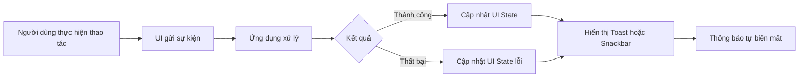
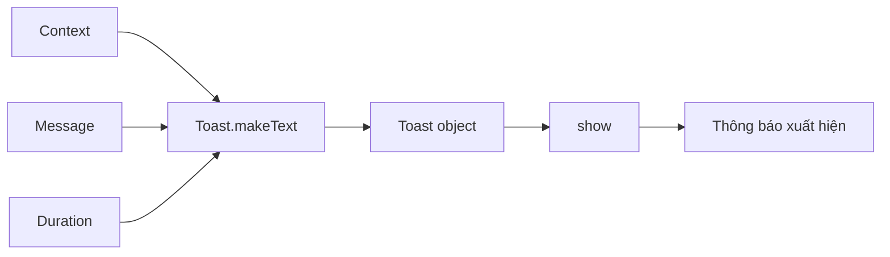
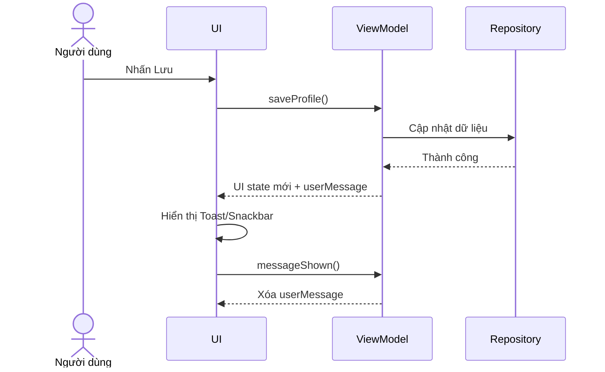
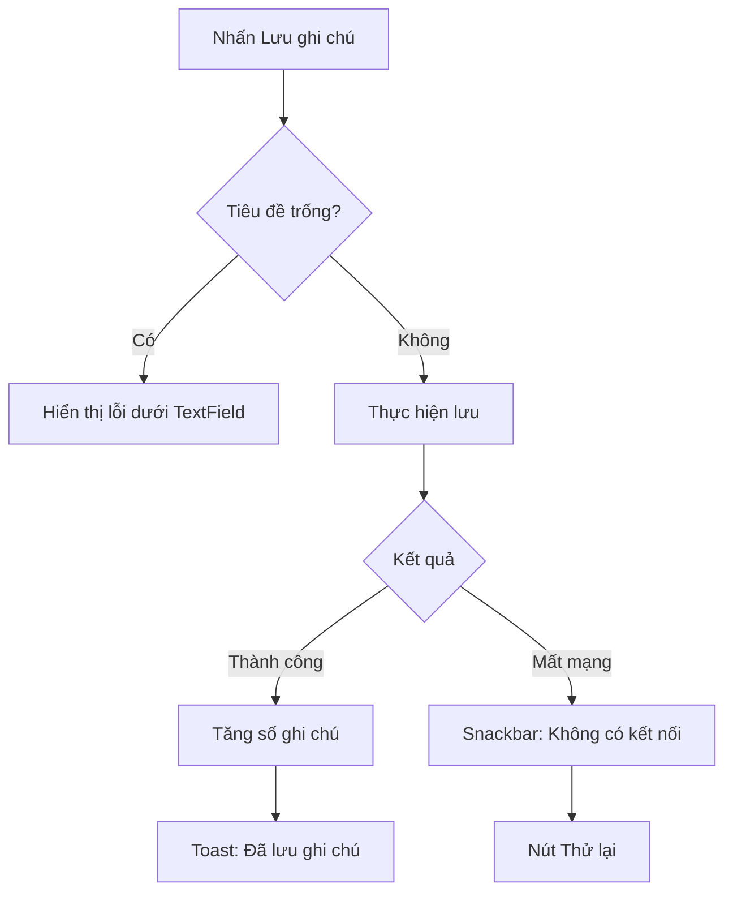
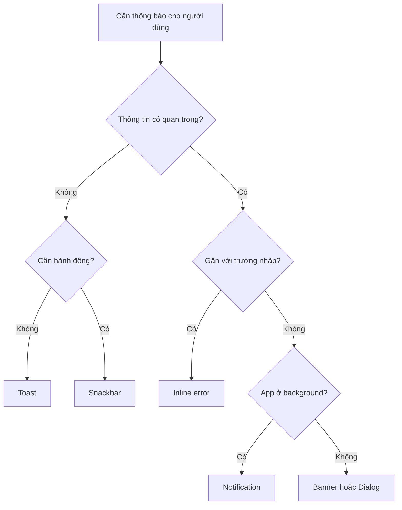

# 013 — Toast trong Android

> **Học phần:** 02 — App Components and User Interface
> **Module:** Module 04 — Interface and Navigation
> **Nhóm nội dung:** UI Elements
> **Nguồn roadmap:** Interface and Navigation / UI Elements
> **Loại bài:** UI
> **Thứ tự trong module:** 013
> **Thời lượng gợi ý:** 30 phút

---

## 1. Tóm tắt


*Hình minh họa: Toast tiêu chuẩn trên Android 12 trở lên. Nguồn: Android Developers.*

**Toast** là một thông báo nhỏ xuất hiện tạm thời trên màn hình để cung cấp phản hồi ngắn về một thao tác vừa xảy ra, chẳng hạn:

* “Đã sao chép liên kết”.
* “Đã lưu cài đặt”.
* “Không thể kết nối”.
* “Đang gửi tin nhắn…”.

Toast không chiếm toàn bộ màn hình, không nhận focus, không yêu cầu người dùng đóng và tự biến mất sau một khoảng thời gian. Activity hiện tại vẫn hiển thị và người dùng vẫn có thể tương tác với ứng dụng. ([Android Developers][1])

Ví dụ Kotlin cơ bản:

```kotlin
Toast.makeText(
    context,
    "Đã lưu thành công",
    Toast.LENGTH_SHORT
).show()
```

### Vị trí của Toast trong ứng dụng



Toast thuộc **UI layer** và nên được xem là một **hiệu ứng giao diện tạm thời**, không phải nơi lưu trữ trạng thái hay thực hiện business logic.

---

## 2. Mục tiêu học tập


*Hình minh họa: UI elements, state holder, domain layer và data layer.*

Sau bài học, anh có thể:

* Giải thích Toast là gì và khi nào nên sử dụng.
* Tạo Toast trong ứng dụng dùng Android Views.
* Tạo Toast từ một màn hình Jetpack Compose.
* Phân biệt Toast, Snackbar, Notification và thông báo lỗi nội tuyến.
* Hiểu mối quan hệ giữa Toast với UI event, UI state và lifecycle.
* Tránh Toast bị hiển thị lặp lại khi Compose recomposition.
* Biết các giới hạn của Toast trên Android 11 và Android 12 trở lên.
* Xây dựng một màn hình demo, checklist kiểm thử và README ngắn cho portfolio.

Trong kiến trúc Android, việc quyết định **thông báo gì** có thể xuất phát từ state hoặc kết quả business logic, nhưng việc quyết định **hiển thị bằng Toast, Snackbar hay thành phần nào khác** thuộc trách nhiệm của UI layer. Android khuyến nghị giữ những đối tượng giao diện như `Context`, `Toast` và `View` ra khỏi `ViewModel`. ([Android Developers][2])

---

## 3. Khái niệm chính


*Hình minh họa: Snackbar có thể chứa nút hành động, khác với Toast.*

### 3.1. Toast là gì?

Toast là một popup nhỏ:

* Hiển thị thông báo ngắn.
* Không chặn thao tác của người dùng.
* Không nhận focus.
* Không có nút hành động.
* Tự động biến mất.
* Có thể xuất hiện ngay cả khi không gắn trực tiếp vào một `View`.

Một Toast tiêu chuẩn được tạo qua ba bước:



```kotlin
val toast = Toast.makeText(
    context,
    "Xin chào Toast!",
    Toast.LENGTH_SHORT
)

toast.show()
```

Có thể viết gọn:

```kotlin
Toast.makeText(
    context,
    "Xin chào Toast!",
    Toast.LENGTH_SHORT
).show()
```

### 3.2. Các tham số của `Toast.makeText()`

```kotlin
Toast.makeText(
    context,
    text,
    duration
)
```

| Tham số    | Ý nghĩa                              | Ví dụ                                              |
| ---------- | ------------------------------------ | -------------------------------------------------- |
| `context`  | Môi trường Android dùng để tạo Toast | `this`, `requireContext()`, `LocalContext.current` |
| `text`     | Nội dung hiển thị                    | `"Đã lưu"` hoặc `R.string.saved`                   |
| `duration` | Thời lượng tương đối                 | `Toast.LENGTH_SHORT`, `Toast.LENGTH_LONG`          |

Android chỉ cung cấp hai hằng thời lượng:

```kotlin
Toast.LENGTH_SHORT
Toast.LENGTH_LONG
```

Không nên phụ thuộc vào một số mili giây chính xác vì thời gian hiển thị có thể chịu ảnh hưởng bởi hệ thống và thiết lập hỗ trợ tiếp cận của thiết bị. API chỉ cam kết mức thời lượng “ngắn” hoặc “dài”. ([Android Developers][3])

### 3.3. Khi nào nên dùng Toast?

Toast phù hợp với thông tin:

* Ngắn.
* Không quan trọng đến mức phải xác nhận.
* Không cần người dùng thực hiện hành động.
* Không phải nội dung duy nhất giải thích lỗi.
* Nếu bỏ lỡ cũng không làm gián đoạn luồng chính.

Ví dụ phù hợp:

```kotlin
Toast.makeText(
    context,
    "Đã sao chép liên kết",
    Toast.LENGTH_SHORT
).show()
```

Ví dụ không phù hợp:

```text
Thanh toán thất bại vì thẻ đã hết hạn.
Hãy cập nhật phương thức thanh toán trước ngày 20/08.
```

Thông báo trên quá quan trọng và quá dài. Nó nên được hiển thị bằng dialog, banner hoặc nội dung lỗi trực tiếp trên màn hình.

### 3.4. Toast, Snackbar, Notification hay lỗi nội tuyến?

| Thành phần         | Khi sử dụng                                           | Có hành động? |  Tồn tại lâu? |
| ------------------ | ----------------------------------------------------- | ------------: | ------------: |
| **Toast**          | Phản hồi rất ngắn, không quan trọng                   |         Không |         Không |
| **Snackbar**       | Phản hồi trong app, có thể hoàn tác                   |     Có thể có |          Ngắn |
| **Notification**   | App ở background hoặc cần thu hút lại người dùng      |            Có |            Có |
| **Inline message** | Lỗi gắn với trường nhập liệu hoặc nội dung quan trọng |     Có thể có |            Có |
| **Dialog**         | Cần xác nhận hoặc quyết định trước khi tiếp tục       |            Có | Đến khi xử lý |

Android khuyến nghị cân nhắc **Snackbar thay cho Toast khi ứng dụng đang ở foreground**, đặc biệt khi người dùng có thể cần hành động như “Hoàn tác”. Nếu ứng dụng ở background và người dùng cần thực hiện một hành động, nên dùng Notification. ([Android Developers][1])

### 3.5. Thay đổi từ Android 11

Từ Android 11, tức API 30:

* `Toast.setView()` và custom Toast view đã bị deprecated.
* Custom Toast phát từ ứng dụng đang ở background có thể bị hệ thống chặn.
* `setGravity()` và `setMargin()` không còn tác dụng đối với text Toast của ứng dụng target API 30 trở lên.
* Có thể dùng `Toast.Callback` để nhận biết Toast được hiển thị hoặc ẩn.
* Toast được phát liên tục từ background có thể bị giới hạn tần suất. ([Android Developers][3])

Không nên viết mới custom Toast như sau:

```kotlin
// Không khuyến nghị cho code mới
val toast = Toast(context)
toast.view = customView
toast.show()
```

Thay vào đó:

```kotlin
Toast.makeText(
    context,
    R.string.saved_successfully,
    Toast.LENGTH_SHORT
).show()
```

Hoặc dùng Snackbar khi muốn tự thiết kế giao diện và thêm hành động.

### 3.6. Thay đổi từ Android 12

Với ứng dụng target Android 12, tức API 31 trở lên:

* Text Toast chỉ hiển thị tối đa hai dòng.
* Toast hiển thị icon của ứng dụng bên cạnh nội dung.
* Chiều dài thực tế của mỗi dòng phụ thuộc kích thước màn hình.

Vì vậy, nội dung Toast nên thật ngắn. ([Android Developers][1])

```kotlin
// Tốt
"Đã lưu thay đổi"

// Không tốt
"Thông tin của bạn đã được lưu thành công vào cơ sở dữ liệu của ứng dụng"
```

### 3.7. Toast và UI state

Không nên coi Toast là state chính của màn hình.

Ví dụ, sau khi người dùng lưu hồ sơ:

```text
State chính:
- Tên người dùng mới.
- Trạng thái isSaving.
- Lỗi lưu dữ liệu.
- Dữ liệu hồ sơ đã cập nhật.

Hiệu ứng tạm thời:
- Hiển thị “Đã lưu hồ sơ”.
```

Luồng dữ liệu phù hợp:



Android khuyến nghị các event từ `ViewModel` cuối cùng nên dẫn đến cập nhật UI state. Sau khi thông báo tạm thời được hiển thị, UI có thể báo lại cho `ViewModel` để xóa message khỏi state, tránh hiển thị lại khi màn hình được tạo lại. ([Android Developers][4])

### 3.8. Toast trong Jetpack Compose

Toast không phải là một Composable. Nó vẫn là API thuộc Android framework.

Compose truy cập nó thông qua `LocalContext.current`:

```kotlin
@Composable
fun ToastButton() {
    val context = LocalContext.current

    Button(
        onClick = {
            Toast.makeText(
                context,
                "Bạn vừa nhấn nút",
                Toast.LENGTH_SHORT
            ).show()
        }
    ) {
        Text("Hiển thị Toast")
    }
}
```

Không gọi Toast trực tiếp trong thân Composable:

```kotlin
@Composable
fun IncorrectExample() {
    val context = LocalContext.current

    // Sai: có thể chạy lại mỗi khi recomposition
    Toast.makeText(
        context,
        "Màn hình được hiển thị",
        Toast.LENGTH_SHORT
    ).show()

    Text("Nội dung")
}
```

Một Composable có thể được chạy lại nhiều lần. Toast nên được kích hoạt bởi:

* `onClick`.
* `LaunchedEffect`.
* Một UI event đã được quản lý.
* Một thay đổi state có cơ chế đánh dấu đã xử lý.

---

## 4. Thực hành


*Hình minh họa: State đi xuống UI và event đi lên state holder.*

### 4.1. Yêu cầu mini project

Tạo màn hình **Toast Demo** gồm:

* Một bộ đếm số lần lưu.
* Nút “Lưu dữ liệu”.
* Mỗi lần nhấn:

  * Bộ đếm tăng một đơn vị.
  * Toast thông báo “Đã lưu lần N”.
* Một nút tạo lỗi giả lập.
* Nội dung sử dụng string resource.
* State không mất khi xoay màn hình.

### 4.2. Khai báo string resource

File `res/values/strings.xml`:

```xml
<resources>
    <string name="app_name">Toast Demo</string>
    <string name="toast_demo_title">Toast Demo</string>
    <string name="save_data">Lưu dữ liệu</string>
    <string name="simulate_error">Giả lập lỗi</string>
    <string name="save_count">Số lần đã lưu: %1$d</string>
    <string name="saved_message">Đã lưu lần %1$d</string>
    <string name="error_message">Không thể kết nối máy chủ</string>
</resources>
```

### 4.3. Phiên bản Jetpack Compose

```kotlin
package com.example.toastdemo

import android.widget.Toast
import androidx.compose.foundation.layout.Arrangement
import androidx.compose.foundation.layout.Column
import androidx.compose.foundation.layout.fillMaxSize
import androidx.compose.foundation.layout.padding
import androidx.compose.material3.Button
import androidx.compose.material3.MaterialTheme
import androidx.compose.material3.OutlinedButton
import androidx.compose.material3.Text
import androidx.compose.runtime.Composable
import androidx.compose.runtime.getValue
import androidx.compose.runtime.saveable.rememberSaveable
import androidx.compose.runtime.setValue
import androidx.compose.runtime.mutableIntStateOf
import androidx.compose.ui.Alignment
import androidx.compose.ui.Modifier
import androidx.compose.ui.platform.LocalContext
import androidx.compose.ui.unit.dp

@Composable
fun ToastDemoScreen(
    modifier: Modifier = Modifier
) {
    val context = LocalContext.current

    var saveCount by rememberSaveable {
        mutableIntStateOf(0)
    }

    Column(
        modifier = modifier
            .fillMaxSize()
            .padding(24.dp),
        verticalArrangement = Arrangement.spacedBy(
            space = 16.dp,
            alignment = Alignment.CenterVertically
        ),
        horizontalAlignment = Alignment.CenterHorizontally
    ) {
        Text(
            text = context.getString(
                R.string.save_count,
                saveCount
            ),
            style = MaterialTheme.typography.headlineSmall
        )

        Button(
            onClick = {
                saveCount++

                val message = context.getString(
                    R.string.saved_message,
                    saveCount
                )

                Toast.makeText(
                    context,
                    message,
                    Toast.LENGTH_SHORT
                ).show()
            }
        ) {
            Text(
                text = context.getString(R.string.save_data)
            )
        }

        OutlinedButton(
            onClick = {
                Toast.makeText(
                    context,
                    R.string.error_message,
                    Toast.LENGTH_LONG
                ).show()
            }
        ) {
            Text(
                text = context.getString(
                    R.string.simulate_error
                )
            )
        }
    }
}
```

Gắn màn hình vào `MainActivity`:

```kotlin
package com.example.toastdemo

import android.os.Bundle
import androidx.activity.ComponentActivity
import androidx.activity.compose.setContent

class MainActivity : ComponentActivity() {

    override fun onCreate(savedInstanceState: Bundle?) {
        super.onCreate(savedInstanceState)

        setContent {
            ToastDemoTheme {
                ToastDemoScreen()
            }
        }
    }
}
```

### 4.4. Tại sao dùng `rememberSaveable`?

```kotlin
var saveCount by rememberSaveable {
    mutableIntStateOf(0)
}
```

`rememberSaveable` giúp giữ bộ đếm qua những thay đổi cấu hình có thể lưu được, chẳng hạn xoay màn hình. Trong Compose, state thay đổi sẽ kích hoạt recomposition cho những thành phần đang đọc state đó. ([Android Developers][5])

Toast không cần được “khôi phục” sau khi xoay màn hình vì nó chỉ là phản hồi tạm thời. Chỉ state nghiệp vụ như `saveCount` mới cần được giữ.

### 4.5. Phiên bản Android Views

Layout `res/layout/activity_toast_demo.xml`:

```xml
<?xml version="1.0" encoding="utf-8"?>
<LinearLayout
    xmlns:android="http://schemas.android.com/apk/res/android"
    android:layout_width="match_parent"
    android:layout_height="match_parent"
    android:gravity="center"
    android:orientation="vertical"
    android:padding="24dp">

    <TextView
        android:id="@+id/saveCountText"
        android:layout_width="wrap_content"
        android:layout_height="wrap_content"
        android:text="@string/save_count"
        android:textSize="24sp" />

    <Button
        android:id="@+id/saveButton"
        android:layout_width="wrap_content"
        android:layout_height="wrap_content"
        android:layout_marginTop="16dp"
        android:text="@string/save_data" />

</LinearLayout>
```

Activity:

```kotlin
package com.example.toastdemo

import android.os.Bundle
import android.widget.Button
import android.widget.TextView
import android.widget.Toast
import androidx.appcompat.app.AppCompatActivity

class ToastDemoActivity : AppCompatActivity() {

    private var saveCount = 0

    override fun onCreate(savedInstanceState: Bundle?) {
        super.onCreate(savedInstanceState)
        setContentView(R.layout.activity_toast_demo)

        saveCount = savedInstanceState?.getInt(KEY_SAVE_COUNT) ?: 0

        val countText = findViewById<TextView>(R.id.saveCountText)
        val saveButton = findViewById<Button>(R.id.saveButton)

        renderCount(countText)

        saveButton.setOnClickListener {
            saveCount++
            renderCount(countText)

            Toast.makeText(
                this,
                getString(R.string.saved_message, saveCount),
                Toast.LENGTH_SHORT
            ).show()
        }
    }

    override fun onSaveInstanceState(outState: Bundle) {
        outState.putInt(KEY_SAVE_COUNT, saveCount)
        super.onSaveInstanceState(outState)
    }

    private fun renderCount(textView: TextView) {
        textView.text = getString(
            R.string.save_count,
            saveCount
        )
    }

    companion object {
        private const val KEY_SAVE_COUNT = "save_count"
    }
}
```

### 4.6. Hiển thị Toast từ Fragment

```kotlin
Toast.makeText(
    requireContext(),
    R.string.saved_message,
    Toast.LENGTH_SHORT
).show()
```

Chỉ gọi `requireContext()` khi Fragment đang được gắn vào Activity. Với callback bất đồng bộ, cần kiểm tra lifecycle hoặc chỉ thu thập kết quả khi Fragment đang ở trạng thái phù hợp.

### 4.7. Mô hình state-driven message với ViewModel

```kotlin
data class ToastUiState(
    val saveCount: Int = 0,
    val userMessage: String? = null
)
```

```kotlin
class ToastViewModel : ViewModel() {

    private val _uiState = MutableStateFlow(ToastUiState())
    val uiState = _uiState.asStateFlow()

    fun save() {
        _uiState.update { current ->
            val newCount = current.saveCount + 1

            current.copy(
                saveCount = newCount,
                userMessage = "Đã lưu lần $newCount"
            )
        }
    }

    fun messageShown() {
        _uiState.update { current ->
            current.copy(userMessage = null)
        }
    }
}
```

Trong Compose:

```kotlin
@Composable
fun ToastViewModelScreen(
    viewModel: ToastViewModel = viewModel()
) {
    val context = LocalContext.current
    val uiState by viewModel.uiState.collectAsStateWithLifecycle()

    uiState.userMessage?.let { message ->
        LaunchedEffect(message) {
            Toast.makeText(
                context,
                message,
                Toast.LENGTH_SHORT
            ).show()

            viewModel.messageShown()
        }
    }

    Button(
        onClick = viewModel::save
    ) {
        Text("Lưu: ${uiState.saveCount}")
    }
}
```

Điểm quan trọng là gọi `messageShown()` sau khi hiển thị để message không xuất hiện lại không cần thiết.

---

## 5. Bài tập


*Hình minh họa: Chạy và phân tích kết quả kiểm thử trong Android Studio.*

### Bài tập: màn hình quản lý ghi chú

Tạo màn hình gồm:

1. Một `TextField` nhập tiêu đề ghi chú.
2. Một nút “Lưu ghi chú”.
3. Một dòng hiển thị số ghi chú đã lưu.
4. Phản hồi theo các trường hợp:

   * Tiêu đề trống: hiển thị lỗi ngay dưới `TextField`.
   * Lưu thành công: hiển thị Toast.
   * Mất kết nối: hiển thị Snackbar với nút “Thử lại”.
5. State phải tồn tại khi xoay màn hình.

### Luồng mong đợi



### Gợi ý triển khai

```kotlin
data class NoteUiState(
    val title: String = "",
    val titleError: String? = null,
    val savedCount: Int = 0,
    val userMessage: String? = null,
    val isOffline: Boolean = false
)
```

Không dùng Toast cho lỗi nhập liệu:

```kotlin
// Không tốt
if (title.isBlank()) {
    Toast.makeText(
        context,
        "Tiêu đề không được để trống",
        Toast.LENGTH_SHORT
    ).show()
}
```

Nên hiển thị lỗi gần trường nhập:

```kotlin
OutlinedTextField(
    value = title,
    onValueChange = onTitleChanged,
    isError = titleError != null,
    supportingText = {
        titleError?.let {
            Text(it)
        }
    }
)
```

### Checklist kiểm thử thủ công

* [ ] Nhấn “Lưu” với tiêu đề trống không tạo ghi chú.
* [ ] Lỗi xuất hiện ngay dưới trường tiêu đề.
* [ ] Nhập tiêu đề hợp lệ rồi lưu sẽ tăng bộ đếm.
* [ ] Mỗi thao tác thành công chỉ tạo một Toast.
* [ ] Nhấn nút liên tục không tạo hàng dài Toast khó đọc.
* [ ] Toast không chứa nội dung dài quá hai dòng.
* [ ] Xoay màn hình không làm mất tiêu đề và bộ đếm.
* [ ] Xoay màn hình không làm Toast cũ xuất hiện lại.
* [ ] Chế độ tiếng Việt và tiếng Anh đều dùng string resource.
* [ ] Khi mất mạng, Snackbar có nút “Thử lại”.
* [ ] TalkBack vẫn đọc được thông tin quan trọng từ màn hình, không phụ thuộc hoàn toàn vào Toast.

### Artifact cho portfolio

Lưu các tệp sau:

```text
toast-demo/
├── README.md
├── screenshots/
│   ├── toast-success.png
│   ├── inline-validation.png
│   └── snackbar-offline.png
├── app/
│   └── src/
│       ├── main/
│       ├── test/
│       └── androidTest/
└── docs/
    └── manual-test-checklist.md
```

README có thể mô tả:

```markdown
# Android Toast Demo

Ứng dụng minh họa cách sử dụng Toast cho phản hồi ngắn,
Snackbar cho lỗi có hành động và inline message cho validation.

## Nội dung đã thực hành

- Toast.makeText()
- LocalContext trong Compose
- rememberSaveable
- UI state và one-time message
- Kiểm thử xoay màn hình
- Localization
- Phân biệt Toast và Snackbar
```

---

## 6. Checklist hoàn thành


*Hình minh họa: Unit test, component test, feature test, application test và release candidate test.*

### Kiến thức

* [ ] Định nghĩa được Toast bằng ngôn ngữ của mình.
* [ ] Biết Toast thuộc UI layer.
* [ ] Biết Toast là phản hồi tạm thời, không phải dữ liệu nghiệp vụ.
* [ ] Phân biệt `LENGTH_SHORT` và `LENGTH_LONG`.
* [ ] Biết Android 12 giới hạn Toast ở hai dòng và thêm icon ứng dụng.
* [ ] Biết custom Toast view đã bị deprecated từ API 30.
* [ ] Phân biệt Toast, Snackbar, Notification, dialog và inline error.

### Code

* [ ] Tạo Toast bằng `Toast.makeText(...).show()`.
* [ ] Dùng string resource thay cho chuỗi hard-code.
* [ ] Tạo Toast từ Activity.
* [ ] Tạo Toast từ Fragment.
* [ ] Tạo Toast từ Compose bằng `LocalContext.current`.
* [ ] Không gọi Toast trực tiếp trong thân Composable.
* [ ] Không truyền `Context` vào `ViewModel`.
* [ ] Có cơ chế xóa message sau khi đã hiển thị.
* [ ] Không sử dụng `Toast.setView()` cho code mới.

### Lifecycle và state

* [ ] State quan trọng vẫn tồn tại khi xoay màn hình.
* [ ] Toast không xuất hiện lại ngoài ý muốn sau configuration change.
* [ ] Không giữ tham chiếu Activity trong singleton hoặc đối tượng sống lâu.
* [ ] Callback bất đồng bộ chỉ cập nhật UI khi lifecycle phù hợp.
* [ ] Không hiển thị một chuỗi Toast sau khi người dùng nhấn liên tục.

### UX và accessibility

* [ ] Nội dung Toast ngắn và dễ hiểu.
* [ ] Không dùng Toast cho thông báo cần hành động.
* [ ] Không dùng Toast làm cách duy nhất để báo lỗi quan trọng.
* [ ] Snackbar được dùng khi cần “Hoàn tác” hoặc “Thử lại”.
* [ ] Inline error được dùng cho validation.
* [ ] Notification được dùng khi app ở background và cần người dùng chú ý.

### Testing và portfolio

* [ ] Có checklist kiểm thử thủ công.
* [ ] Có ít nhất một screenshot Toast.
* [ ] Có README giải thích lựa chọn UX.
* [ ] Có kiểm thử logic tạo message.
* [ ] Đã chạy thử trên ít nhất Android 11 và Android 12 trở lên.
* [ ] Đã kiểm tra light mode và dark mode.
* [ ] Đã kiểm tra ít nhất hai kích thước màn hình.

Một chiến lược kiểm thử tốt thường có nhiều kiểm thử nhỏ, nhanh ở đáy và ít kiểm thử end-to-end hơn ở phía trên. Android cũng khuyến nghị chạy component và feature test trước khi merge, sau đó dùng application hoặc release candidate test cho các luồng quan trọng. ([Android Developers][6])

---

## 7. Ghi chú sản xuất


*Hình minh họa: Giao diện Toast do hệ thống kiểm soát trên Android mới.*

### 7.1. Chọn đúng loại phản hồi

Trước khi dùng Toast, hãy hỏi:



Không dùng Toast để báo:

* Thanh toán thất bại.
* Tài khoản bị khóa.
* Dữ liệu chưa được lưu.
* Quyền truy cập bị từ chối nhưng người dùng cần biết cách sửa.
* Lỗi pháp lý, bảo mật hoặc quyền riêng tư.
* Các bước tiếp theo bắt buộc.

### 7.2. Không để Toast trở thành business logic

Không tốt:

```kotlin
class ProfileViewModel : ViewModel() {

    fun saveProfile(context: Context) {
        // ViewModel phụ thuộc Android UI
        Toast.makeText(
            context,
            "Đã lưu",
            Toast.LENGTH_SHORT
        ).show()
    }
}
```

Tốt hơn:

```kotlin
data class ProfileUiState(
    val isSaving: Boolean = false,
    val userMessage: String? = null
)
```

```kotlin
class ProfileViewModel : ViewModel() {

    fun saveProfile() {
        // Thực hiện logic lưu...

        _uiState.update {
            it.copy(userMessage = "Đã lưu hồ sơ")
        }
    }
}
```

UI quyết định cách trình bày:

```kotlin
when {
    messageIsActionable -> showSnackbar()
    messageIsShort -> showToast()
    else -> showInlineMessage()
}
```

### 7.3. Hạn chế Toast trùng lặp

Tình huống thường gặp:

```kotlin
Button(
    onClick = {
        Toast.makeText(
            context,
            "Đang xử lý",
            Toast.LENGTH_SHORT
        ).show()

        startRequest()
    }
)
```

Người dùng nhấn mười lần có thể tạo nhiều thông báo nối tiếp nhau.

Giải pháp:

* Disable nút khi `isLoading = true`.
* Debounce thao tác.
* Hủy Toast cũ trước khi tạo Toast mới.
* Chỉ hiển thị thông báo khi trạng thái thật sự thay đổi.
* Không hiển thị Toast cho từng bước nhỏ của một request.

Ví dụ tái sử dụng một Toast:

```kotlin
class ToastController(
    context: Context
) {
    private val appContext = context.applicationContext
    private var currentToast: Toast? = null

    fun show(message: String) {
        currentToast?.cancel()

        currentToast = Toast.makeText(
            appContext,
            message,
            Toast.LENGTH_SHORT
        ).also {
            it.show()
        }
    }

    fun cancel() {
        currentToast?.cancel()
        currentToast = null
    }
}
```

### 7.4. Localization

Không viết:

```kotlin
Toast.makeText(
    context,
    "Saved successfully",
    Toast.LENGTH_SHORT
).show()
```

Nên viết:

```kotlin
Toast.makeText(
    context,
    R.string.saved_successfully,
    Toast.LENGTH_SHORT
).show()
```

`res/values/strings.xml`:

```xml
<string name="saved_successfully">Saved successfully</string>
```

`res/values-vi/strings.xml`:

```xml
<string name="saved_successfully">Đã lưu thành công</string>
```

Cần kiểm tra cả ngôn ngữ có từ dài vì Android 12 trở lên giới hạn Toast ở hai dòng.

### 7.5. Không hiển thị dữ liệu nhạy cảm

Không đưa vào Toast:

* Access token.
* Mật khẩu.
* Mã OTP.
* Số thẻ đầy đủ.
* Raw server exception.
* Stack trace.
* Dữ liệu sức khỏe hoặc thông tin cá nhân nhạy cảm.

Không tốt:

```kotlin
Toast.makeText(
    context,
    exception.stackTraceToString(),
    Toast.LENGTH_LONG
).show()
```

Tốt hơn:

```kotlin
Toast.makeText(
    context,
    R.string.generic_error_message,
    Toast.LENGTH_SHORT
).show()

logger.error(
    exception,
    tag = "SaveProfile"
)
```

Người dùng nhận thông báo dễ hiểu; chi tiết kỹ thuật được ghi vào hệ thống logging phù hợp.

### 7.6. Accessibility

Toast có thể biến mất trước khi người dùng:

* Kịp đọc.
* Kịp nghe bằng trình đọc màn hình.
* Hiểu được nguyên nhân lỗi.
* Ghi nhớ bước cần thực hiện tiếp theo.

Vì vậy:

* Không phụ thuộc hoàn toàn vào Toast cho thông tin quan trọng.
* Giữ trạng thái quan trọng trên màn hình.
* Dùng inline error cho validation.
* Dùng Snackbar hoặc dialog khi cần hành động.
* Kiểm tra với TalkBack và cỡ chữ lớn.
* Tránh thông điệp mơ hồ như “Có lỗi xảy ra” nếu có thể đưa ra hướng xử lý.

### 7.7. Kiểm thử

Text Toast trên Android mới có thể được hệ thống render bên ngoài view hierarchy của ứng dụng, nên việc tìm và assert trực tiếp Toast trong UI test có thể không ổn định. Nên ưu tiên:

1. Unit test logic quyết định message.
2. Test UI state được cập nhật đúng.
3. Dùng abstraction để kiểm tra lệnh hiển thị.
4. Manual test hoặc screenshot test trên thiết bị phù hợp.
5. Test hành vi chính thay vì phụ thuộc vào pixel của Toast.

Ví dụ abstraction:

```kotlin
interface UserMessagePresenter {
    fun showShort(message: String)
}
```

```kotlin
class AndroidToastPresenter(
    context: Context
) : UserMessagePresenter {

    private val appContext = context.applicationContext

    override fun showShort(message: String) {
        Toast.makeText(
            appContext,
            message,
            Toast.LENGTH_SHORT
        ).show()
    }
}
```

Fake dùng trong test:

```kotlin
class FakeUserMessagePresenter : UserMessagePresenter {

    val messages = mutableListOf<String>()

    override fun showShort(message: String) {
        messages += message
    }
}
```

```kotlin
@Test
fun saveSuccess_showsExpectedMessage() {
    val presenter = FakeUserMessagePresenter()

    presenter.showShort("Đã lưu")

    assertEquals(
        listOf("Đã lưu"),
        presenter.messages
    )
}
```

### 7.8. Release checklist

Trước khi phát hành:

* [ ] Kiểm tra Toast trên Android 11.
* [ ] Kiểm tra Toast trên Android 12 trở lên.
* [ ] Kiểm tra thiết bị màn hình nhỏ.
* [ ] Kiểm tra font size lớn.
* [ ] Kiểm tra tiếng Việt và tiếng Anh.
* [ ] Kiểm tra dark mode.
* [ ] Không còn custom Toast dùng `setView()`.
* [ ] Không dùng Toast để hiển thị raw exception.
* [ ] Không hiển thị Toast liên tục từ background.
* [ ] Message quan trọng vẫn tồn tại trong UI.
* [ ] Luồng cần hành động sử dụng Snackbar, dialog hoặc Notification.
* [ ] Toast không xuất hiện lặp lại sau rotate hoặc quay lại từ back stack.

---

## Tài liệu chính

* **Toasts overview — Android Developers:** định nghĩa, cách dùng `makeText()`, giới hạn hai dòng và lựa chọn thay thế. ([Android Developers][1])
* **Toast API reference:** custom Toast deprecated, callback, giới hạn background và các API không còn tác dụng. ([Android Developers][3])
* **Android 11 behavior changes:** custom Toast từ background bị chặn. ([Android Developers][7])
* **Android 12 behavior changes:** Toast hiển thị icon ứng dụng và tối đa hai dòng. ([Android Developers][8])
* **UI events:** cách biểu diễn transient message bằng UI state và đánh dấu đã hiển thị. ([Android Developers][4])
* **Snackbar trong Compose:** dùng khi phản hồi cần hành động hoặc gắn với màn hình foreground. ([Android Developers][9])

[1]: https://developer.android.com/guide/topics/ui/notifiers/toasts "Toasts overview  |  Android Developers"
[2]: https://developer.android.com/topic/architecture/ui-layer "UI layer  |  App architecture  |  Android Developers"
[3]: https://developer.android.com/reference/android/widget/Toast?utm_source=chatgpt.com "Toast  |  API reference  |  Android Developers"
[4]: https://developer.android.com/topic/architecture/views/ui-layer/events-views "UI events (Views)  |  Android Developers"
[5]: https://developer.android.com/develop/ui/compose/architecture "Compose UI Architecture  |  Jetpack Compose  |  Android Developers"
[6]: https://developer.android.com/training/testing/fundamentals/strategies "Testing strategies  |  Test your app on Android  |  Android Developers"
[7]: https://developer.android.com/about/versions/11/behavior-changes-11?utm_source=chatgpt.com "Behavior changes: Apps targeting Android 11  |  Android Developers"
[8]: https://developer.android.com/about/versions/12/behavior-changes-12 "Behavior changes: Apps targeting Android 12  |  Android Developers"
[9]: https://developer.android.com/develop/ui/compose/components/snackbar "Snackbar  |  Jetpack Compose  |  Android Developers"
