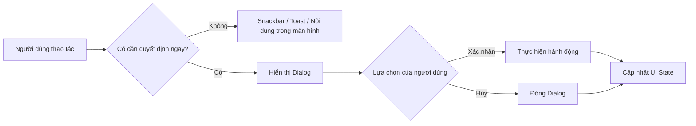
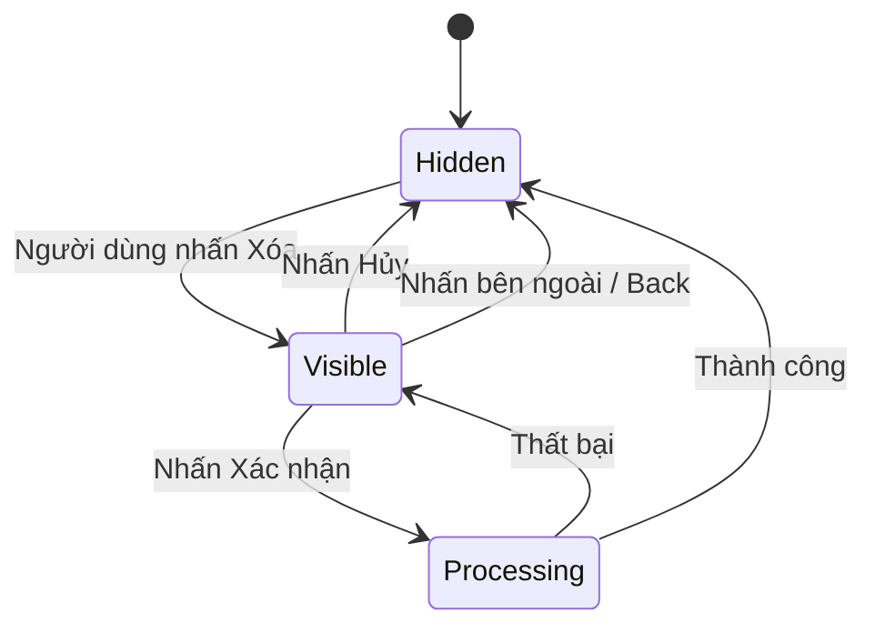
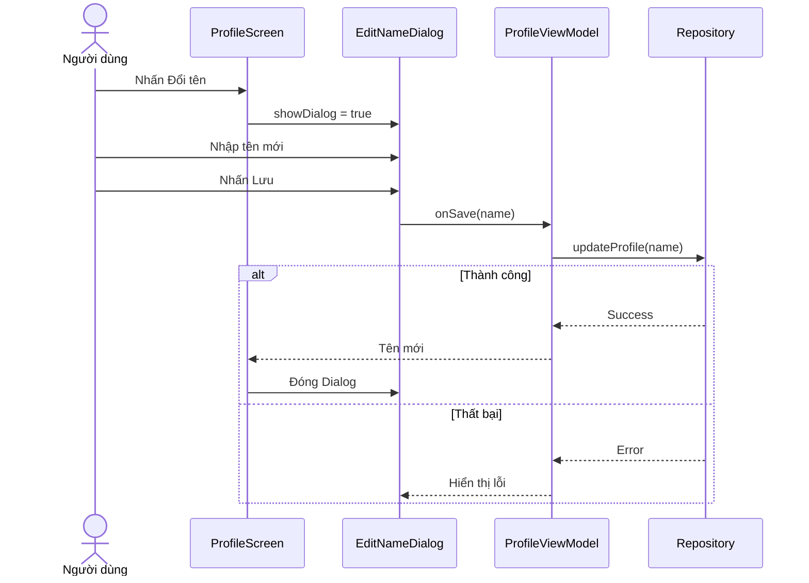
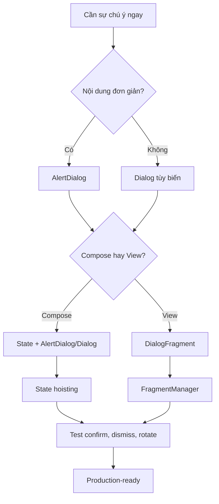

# 014 - Dialogs trong Android

| Thông tin               | Nội dung                               |
| ----------------------- | -------------------------------------- |
| **Học phần**            | 02 - App Components and User Interface |
| **Module**              | Module 04 - Interface and Navigation   |
| **Nhóm nội dung**       | UI Elements                            |
| **Nguồn roadmap**       | Interface and Navigation / UI Elements |
| **Loại bài**            | UI                                     |
| **Thứ tự trong module** | 014                                    |
| **Thời lượng gợi ý**    | 30 phút                                |

---

## 1. Tóm tắt


*Hình: Dialog yêu cầu xác nhận trước khi người dùng hủy một bản nháp.*

**Dialog** là một cửa sổ nhỏ xuất hiện phía trên nội dung hiện tại để:

* Yêu cầu người dùng xác nhận một hành động.
* Hiển thị thông tin quan trọng.
* Thu thập một lượng nhỏ dữ liệu.
* Cho phép người dùng chọn một phương án.
* Cảnh báo về hành động nguy hiểm hoặc không thể hoàn tác.

Dialog thường mang tính **modal**: khi dialog đang hiển thị, người dùng phải xử lý hoặc đóng dialog trước khi tiếp tục tương tác với nội dung phía sau. Vì dialog làm gián đoạn luồng sử dụng, chỉ nên dùng khi thông tin hoặc quyết định thực sự cần sự chú ý ngay lập tức.

### Vị trí của Dialog trong ứng dụng Android



### Ví dụ thực tế

* Xác nhận xóa tài khoản, bài viết hoặc tệp.
* Hỏi người dùng có muốn bỏ các thay đổi chưa lưu.
* Chọn ngôn ngữ hoặc một tùy chọn đơn giản.
* Nhập tên danh sách mới.
* Hiển thị thông báo quyền truy cập hoặc lỗi nghiêm trọng.
* Chọn ngày và giờ bằng `DatePickerDialog` hoặc `TimePickerDialog`.

Android cung cấp `AlertDialog` cho tiêu đề, thông điệp, nút hành động, danh sách hoặc custom layout; đồng thời có các dialog chuyên dụng để chọn ngày và giờ.

### Khi nào không nên dùng Dialog?

| Nhu cầu                              | Thành phần phù hợp hơn            |
| ------------------------------------ | --------------------------------- |
| Thông báo ngắn, không cần phản hồi   | Toast                             |
| Thông báo có hành động hoàn tác      | Snackbar                          |
| Biểu mẫu dài hoặc nhiều bước         | Màn hình riêng                    |
| Tiến trình tải dữ liệu               | Progress indicator trong màn hình |
| Danh sách hành động liên quan        | Bottom sheet hoặc menu            |
| Lỗi có thể hiển thị cạnh trường nhập | Supporting text hoặc error text   |

> `ProgressDialog` đã bị deprecated vì chặn toàn bộ tương tác của người dùng. Nên dùng `ProgressBar`, progress indicator trong nội dung hoặc notification cho tác vụ dài.

---

## 2. Mục tiêu học tập


Sau bài học, anh có thể:

* Giải thích Dialog bằng ngôn ngữ của mình.
* Phân biệt `AlertDialog`, `Dialog` tùy biến và `DialogFragment`.
* Xác định trường hợp nên hoặc không nên dùng Dialog.
* Quản lý trạng thái mở, đóng và xử lý hành động của Dialog.
* Giữ trạng thái Dialog khi xoay màn hình hoặc Activity được tạo lại.
* Viết Dialog bằng Jetpack Compose.
* Viết Dialog trong hệ thống View truyền thống.
* Kiểm thử hành vi xác nhận, hủy và dismiss.
* Xử lý loading, lỗi và thao tác bất đồng bộ an toàn.
* Tạo screenshot, test và README để đưa vào portfolio.

---

## 3. Khái niệm chính


### 3.1. Cấu trúc của một Dialog

Một Dialog thường gồm các thành phần:

```text
┌──────────────────────────────────┐
│              Icon                │
│                                  │
│        Xóa ghi chú này?          │  ← Tiêu đề
│                                  │
│ Hành động này không thể hoàn tác │  ← Nội dung
│                                  │
│             HỦY          XÓA     │  ← Nút hành động
└──────────────────────────────────┘
```

| Thành phần          | Vai trò                                       |
| ------------------- | --------------------------------------------- |
| **Icon**            | Thể hiện loại thông báo hoặc mức độ nguy hiểm |
| **Title**           | Nêu quyết định người dùng cần đưa ra          |
| **Supporting text** | Giải thích hậu quả hoặc cung cấp ngữ cảnh     |
| **Dismiss action**  | Đóng dialog mà không thực hiện hành động      |
| **Confirm action**  | Xác nhận và tiếp tục hành động                |
| **Scrim**           | Lớp nền tối làm nổi bật dialog                |
| **Custom content**  | Form, ảnh, danh sách hoặc nội dung tùy biến   |

Trong Compose, `AlertDialog` cung cấp sẵn các vị trí như `icon`, `title`, `text`, `dismissButton`, `confirmButton` và `onDismissRequest`.

### 3.2. Các loại Dialog phổ biến

#### AlertDialog

Phù hợp với thông báo hoặc quyết định đơn giản:

* Một tiêu đề.
* Một đoạn mô tả.
* Một nút xác nhận.
* Một nút hủy.
* Icon tùy chọn.

```kotlin
AlertDialog(
    onDismissRequest = { /* Đóng dialog */ },
    title = { Text("Xóa ghi chú?") },
    text = { Text("Hành động này không thể hoàn tác.") },
    confirmButton = {
        TextButton(onClick = { /* Xóa */ }) {
            Text("Xóa")
        }
    },
    dismissButton = {
        TextButton(onClick = { /* Hủy */ }) {
            Text("Hủy")
        }
    }
)
```

`AlertDialog` là lựa chọn thuận tiện khi giao diện chỉ cần cấu trúc xác nhận cơ bản theo Material Design.

#### Dialog tùy biến


Dùng `Dialog` khi cần:

* Hiển thị ảnh.
* Chứa form nhập liệu.
* Có bố cục phức tạp.
* Có nhiều nhóm nội dung.
* Tự kiểm soát kích thước, hình dạng và khoảng cách.

`Dialog` chỉ cung cấp cửa sổ modal cơ bản. Lập trình viên phải tự thêm container như `Card`, đồng thời xác định kích thước, shape và nội dung bên trong.

#### DialogFragment

Trong giao diện View truyền thống, `DialogFragment` là Fragment chuyên dùng để tạo và quản lý Dialog. `FragmentManager` có thể quản lý trạng thái và tự khôi phục Dialog sau configuration change.

#### DatePickerDialog và TimePickerDialog

Đây là các Dialog có giao diện dựng sẵn để người dùng chọn ngày hoặc giờ. Không nên tự xây một bộ chọn ngày giờ bằng các `EditText` nếu Android đã có thành phần phù hợp.

### 3.3. State của Dialog

Dialog không nên tự quyết định toàn bộ trạng thái nghiệp vụ. Thành phần cha hoặc state holder nên quản lý:

```kotlin
var showDeleteDialog by rememberSaveable {
    mutableStateOf(false)
}
```



Luồng dữ liệu nên theo nguyên tắc:

```text
State đi xuống:
showDialog, isLoading, error

Event đi lên:
onOpen, onDismiss, onConfirm
```

State hoisting giúp Dialog có một nguồn dữ liệu duy nhất, dễ tái sử dụng và dễ kiểm thử hơn. Android khuyến nghị đưa state lên ancestor thấp nhất cùng đọc và cập nhật state đó.

### 3.4. Lifecycle và configuration change

Một lỗi phổ biến là sử dụng:

```kotlin
var showDialog by remember {
    mutableStateOf(false)
}
```

`remember` giữ dữ liệu qua recomposition nhưng state có thể mất khi Activity được tạo lại. Với trạng thái UI nhỏ và có thể lưu trong `Bundle`, có thể dùng:

```kotlin
var showDialog by rememberSaveable {
    mutableStateOf(false)
}
```

`rememberSaveable` có thể khôi phục state UI sau Activity recreation và system-initiated process recreation đối với dữ liệu có thể lưu được. State nghiệp vụ, kết quả network và dữ liệu dài hạn vẫn nên được quản lý bởi `ViewModel`, repository hoặc tầng dữ liệu.

Trong hệ thống View, `DialogFragment` giúp `FragmentManager` quản lý vòng đời và tự khôi phục Dialog khi configuration thay đổi.

### 3.5. Quy tắc thiết kế nội dung

#### Tiêu đề tốt

```text
Xóa ghi chú này?
Bỏ các thay đổi?
Cho phép truy cập vị trí?
```

#### Tiêu đề chưa tốt

```text
Thông báo
Cảnh báo
Bạn có chắc không?
```

Tiêu đề nên mô tả trực tiếp quyết định cần đưa ra.

#### Nhãn nút tốt

```text
Hủy | Xóa
Ở lại | Rời trang
Không cho phép | Cho phép
```

#### Nhãn nút chưa tốt

```text
Không | Có
Cancel | OK
Đóng | Đồng ý
```

Nhãn hành động cụ thể giúp người dùng hiểu điều gì sẽ xảy ra sau khi nhấn.

---

## 4. Thực hành


### 4.1. Yêu cầu bài thực hành

Xây dựng màn hình quản lý một ghi chú gồm:

* Nội dung ghi chú.
* Nút **Xóa ghi chú**.
* Dialog xác nhận.
* Nút **Hủy**.
* Nút **Xóa**.
* Thông báo sau khi xóa thành công.
* State không bị mất khi xoay màn hình.

### 4.2. Triển khai bằng Jetpack Compose

```kotlin
import androidx.compose.material.icons.Icons
import androidx.compose.material.icons.outlined.Delete
import androidx.compose.material3.AlertDialog
import androidx.compose.material3.Button
import androidx.compose.material3.Icon
import androidx.compose.material3.Text
import androidx.compose.material3.TextButton
import androidx.compose.runtime.Composable
import androidx.compose.runtime.getValue
import androidx.compose.runtime.mutableStateOf
import androidx.compose.runtime.saveable.rememberSaveable
import androidx.compose.runtime.setValue
import androidx.compose.ui.Modifier
import androidx.compose.ui.semantics.contentDescription
import androidx.compose.ui.semantics.semantics

@Composable
fun DeleteNoteScreen() {
    var showDeleteDialog by rememberSaveable {
        mutableStateOf(false)
    }

    var noteDeleted by rememberSaveable {
        mutableStateOf(false)
    }

    if (noteDeleted) {
        Text("Ghi chú đã được xóa")
    } else {
        Button(
            onClick = { showDeleteDialog = true },
            modifier = Modifier.semantics {
                contentDescription = "Mở hộp thoại xóa ghi chú"
            }
        ) {
            Icon(
                imageVector = Icons.Outlined.Delete,
                contentDescription = null
            )
            Text("Xóa ghi chú")
        }
    }

    if (showDeleteDialog) {
        AlertDialog(
            onDismissRequest = {
                showDeleteDialog = false
            },
            icon = {
                Icon(
                    imageVector = Icons.Outlined.Delete,
                    contentDescription = null
                )
            },
            title = {
                Text("Xóa ghi chú?")
            },
            text = {
                Text(
                    "Ghi chú sẽ bị xóa vĩnh viễn. " +
                        "Hành động này không thể hoàn tác."
                )
            },
            dismissButton = {
                TextButton(
                    onClick = {
                        showDeleteDialog = false
                    }
                ) {
                    Text("Hủy")
                }
            },
            confirmButton = {
                TextButton(
                    onClick = {
                        noteDeleted = true
                        showDeleteDialog = false
                    }
                ) {
                    Text("Xóa")
                }
            }
        )
    }
}
```

`onDismissRequest` phải cập nhật state của thành phần cha. Nếu chỉ đóng cửa sổ mà không thay đổi state, Compose có thể dựng lại Dialog ở lần recomposition tiếp theo. API chính thức của `AlertDialog` cũng sử dụng callback từ thành phần cha để cập nhật trạng thái mở và đóng.

### 4.3. Tách Dialog thành composable stateless

Để tái sử dụng và kiểm thử tốt hơn:

```kotlin
@Composable
fun DeleteNoteDialog(
    onConfirm: () -> Unit,
    onDismiss: () -> Unit
) {
    AlertDialog(
        onDismissRequest = onDismiss,
        title = {
            Text("Xóa ghi chú?")
        },
        text = {
            Text("Hành động này không thể hoàn tác.")
        },
        confirmButton = {
            TextButton(onClick = onConfirm) {
                Text("Xóa")
            }
        },
        dismissButton = {
            TextButton(onClick = onDismiss) {
                Text("Hủy")
            }
        }
    )
}
```

Thành phần cha quản lý state:

```kotlin
@Composable
fun NoteScreen() {
    var showDialog by rememberSaveable {
        mutableStateOf(false)
    }

    Button(onClick = { showDialog = true }) {
        Text("Mở hộp thoại xóa")
    }

    if (showDialog) {
        DeleteNoteDialog(
            onConfirm = {
                showDialog = false
                // Gửi event sang ViewModel.
            },
            onDismiss = {
                showDialog = false
            }
        )
    }
}
```

### 4.4. Dialog có trạng thái loading

Với tác vụ network hoặc database, không nên đóng Dialog trước khi biết kết quả:

```kotlin
@Composable
fun DeleteAccountDialog(
    isDeleting: Boolean,
    errorMessage: String?,
    onConfirm: () -> Unit,
    onDismiss: () -> Unit
) {
    AlertDialog(
        onDismissRequest = {
            if (!isDeleting) {
                onDismiss()
            }
        },
        title = {
            Text("Xóa tài khoản?")
        },
        text = {
            when {
                isDeleting -> Text("Đang xóa tài khoản…")
                errorMessage != null -> Text(errorMessage)
                else -> Text(
                    "Dữ liệu của bạn sẽ bị xóa vĩnh viễn."
                )
            }
        },
        dismissButton = {
            TextButton(
                enabled = !isDeleting,
                onClick = onDismiss
            ) {
                Text("Hủy")
            }
        },
        confirmButton = {
            TextButton(
                enabled = !isDeleting,
                onClick = onConfirm
            ) {
                Text(
                    if (isDeleting) "Đang xử lý…"
                    else "Xóa tài khoản"
                )
            }
        }
    )
}
```

State nghiệp vụ có thể được mô hình hóa trong `ViewModel`:

```kotlin
data class DeleteAccountUiState(
    val showDialog: Boolean = false,
    val isDeleting: Boolean = false,
    val errorMessage: String? = null
)
```

### 4.5. Triển khai bằng View và DialogFragment

```kotlin
import android.app.Dialog
import android.os.Bundle
import androidx.core.os.bundleOf
import androidx.fragment.app.DialogFragment
import com.google.android.material.dialog.MaterialAlertDialogBuilder

class DeleteNoteDialogFragment : DialogFragment() {

    override fun onCreateDialog(
        savedInstanceState: Bundle?
    ): Dialog {
        return MaterialAlertDialogBuilder(requireContext())
            .setTitle("Xóa ghi chú?")
            .setMessage(
                "Ghi chú sẽ bị xóa vĩnh viễn. " +
                    "Hành động này không thể hoàn tác."
            )
            .setNegativeButton("Hủy", null)
            .setPositiveButton("Xóa") { _, _ ->
                parentFragmentManager.setFragmentResult(
                    REQUEST_KEY,
                    bundleOf(RESULT_CONFIRMED to true)
                )
            }
            .create()
    }

    companion object {
        const val TAG = "DeleteNoteDialog"
        const val REQUEST_KEY = "delete_note_request"
        const val RESULT_CONFIRMED = "delete_note_confirmed"
    }
}
```

Hiển thị Dialog:

```kotlin
val existingDialog =
    childFragmentManager.findFragmentByTag(
        DeleteNoteDialogFragment.TAG
    )

if (existingDialog == null) {
    DeleteNoteDialogFragment().show(
        childFragmentManager,
        DeleteNoteDialogFragment.TAG
    )
}
```

Kiểm tra `findFragmentByTag()` trước khi gọi `show()` giúp tránh hiển thị nhiều Dialog trùng nhau. Android cũng khuyến nghị chỉ gọi `show()` từ hành động người dùng hoặc khi chưa tồn tại Dialog cùng tag.

`MaterialAlertDialogBuilder` giúp `AlertDialog` nhận màu sắc và hình dạng từ Material theme của ứng dụng.

---

## 5. Bài tập


### Bài tập chính: Dialog chỉnh sửa tên hồ sơ

Xây dựng một màn hình gồm:

1. Tên người dùng hiện tại.
2. Nút **Đổi tên**.
3. Dialog chứa `TextField`.
4. Nút **Hủy**.
5. Nút **Lưu**.
6. Validation tên không được để trống.
7. Trạng thái loading khi lưu.
8. Thông báo lỗi nếu lưu thất bại.
9. Tên mới xuất hiện trên màn hình khi lưu thành công.

### Luồng yêu cầu



### Yêu cầu nâng cao

* Không cho phép nhấn **Lưu** nhiều lần.
* Không đóng Dialog khi đang gửi request.
* Giữ nội dung `TextField` khi xoay màn hình.
* Tự động focus vào trường nhập.
* Mở bàn phím khi Dialog xuất hiện.
* Hiển thị lỗi ngay dưới `TextField`.
* Kiểm thử tên rỗng, tên quá dài và lỗi mạng.
* Thử giao diện ở dark mode và font size lớn.

### Artifact đưa vào portfolio

```text
dialogs-demo/
├── README.md
├── screenshots/
│   ├── dialog-light.png
│   ├── dialog-dark.png
│   ├── validation-error.png
│   └── loading-state.png
├── app/
│   ├── ui/
│   │   ├── ProfileScreen.kt
│   │   └── EditNameDialog.kt
│   └── viewmodel/
│       └── ProfileViewModel.kt
└── androidTest/
    └── EditNameDialogTest.kt
```

README nên mô tả:

* Vấn đề Dialog giải quyết.
* Quyết định chọn `AlertDialog` hay `Dialog`.
* Cách state được quản lý.
* Cách xử lý configuration change.
* Trường hợp loading và lỗi.
* Danh sách test đã thực hiện.
* Screenshot giao diện.

---

## 6. Checklist hoàn thành


### Kiến thức

* [ ] Giải thích được Dialog là gì.
* [ ] Hiểu Dialog là thành phần gây gián đoạn luồng người dùng.
* [ ] Phân biệt `AlertDialog` và `Dialog`.
* [ ] Biết vai trò của `DialogFragment`.
* [ ] Biết khi nào nên dùng Snackbar hoặc màn hình riêng.
* [ ] Không sử dụng `ProgressDialog` cho giao diện mới.

### State và lifecycle

* [ ] Có state xác định Dialog đang mở hay đóng.
* [ ] `onDismissRequest` cập nhật state chính xác.
* [ ] Không tạo nhiều Dialog trùng nhau.
* [ ] Dialog được khôi phục hợp lý sau configuration change.
* [ ] State nghiệp vụ nằm trong `ViewModel` hoặc state holder phù hợp.
* [ ] Nội dung người dùng đang nhập không bị mất ngoài ý muốn.

### UX

* [ ] Tiêu đề mô tả rõ quyết định.
* [ ] Nội dung ngắn gọn và giải thích hậu quả.
* [ ] Nút sử dụng động từ cụ thể.
* [ ] Hành động nguy hiểm được thể hiện rõ.
* [ ] Thứ tự nút nhất quán.
* [ ] Không mở Dialog cho thông báo không quan trọng.
* [ ] Dialog không chứa một biểu mẫu quá dài.

### Accessibility

* [ ] Dialog sử dụng text có thể đọc bởi TalkBack.
* [ ] Icon có `contentDescription` khi mang ý nghĩa riêng.
* [ ] Icon trang trí dùng `contentDescription = null`.
* [ ] Focus được đưa vào nội dung phù hợp.
* [ ] Có thể điều hướng bằng bàn phím hoặc thiết bị hỗ trợ.
* [ ] Giao diện hoạt động với font size lớn.
* [ ] Độ tương phản đáp ứng theme sáng và tối.

Compose UI test dựa trên semantics để tìm và tương tác với các thành phần giao diện. Material và Compose cung cấp sẵn nhiều semantics, nhưng custom component vẫn cần được kiểm tra bằng TalkBack và accessibility test.

### Testing

* [ ] Nhấn nút mở sẽ hiển thị Dialog.
* [ ] Nhấn **Hủy** sẽ đóng Dialog.
* [ ] Nhấn Back sẽ đóng Dialog khi được phép.
* [ ] Nhấn bên ngoài sẽ đóng Dialog khi được phép.
* [ ] Nhấn **Xác nhận** gọi đúng callback.
* [ ] Hành động xác nhận chỉ chạy một lần.
* [ ] Loading vô hiệu hóa nút phù hợp.
* [ ] Lỗi được hiển thị mà không mất dữ liệu.
* [ ] Xoay màn hình không tạo Dialog trùng.
* [ ] Có test cho thao tác nguy hiểm.

### Ví dụ Compose UI test

```kotlin
@Test
fun openAndDismissDeleteDialog() {
    composeTestRule.setContent {
        DeleteNoteScreen()
    }

    composeTestRule
        .onNodeWithText("Xóa ghi chú")
        .performClick()

    composeTestRule
        .onNodeWithText("Xóa ghi chú?")
        .assertIsDisplayed()

    composeTestRule
        .onNodeWithText("Hủy")
        .performClick()

    composeTestRule
        .onNodeWithText("Xóa ghi chú?")
        .assertDoesNotExist()
}
```

```kotlin
@Test
fun confirmDeleteUpdatesScreen() {
    composeTestRule.setContent {
        DeleteNoteScreen()
    }

    composeTestRule
        .onNodeWithText("Xóa ghi chú")
        .performClick()

    composeTestRule
        .onNodeWithText("Xóa")
        .performClick()

    composeTestRule
        .onNodeWithText("Ghi chú đã được xóa")
        .assertIsDisplayed()
}
```

Compose testing sử dụng semantics tree để xác định node và thực hiện hành động như click, nhập text hoặc kiểm tra trạng thái hiển thị.

---

## 7. Ghi chú sản xuất


### 7.1. Không lạm dụng Dialog

Dialog làm người dùng phải dừng công việc hiện tại. Không nên mở Dialog cho:

* Thông báo lưu thành công.
* Thông báo trạng thái mạng thông thường.
* Gợi ý không bắt buộc.
* Nội dung quảng bá.
* Các lỗi có thể hiển thị trực tiếp trên màn hình.

### 7.2. Tránh hiển thị Dialog tự động nhiều lần

Không nên viết logic như:

```kotlin
if (uiState.hasError) {
    showDialog = true
}
```

nếu `hasError` không được tiêu thụ hoặc reset. Mỗi recomposition có thể khiến Dialog được yêu cầu hiển thị lại.

Nên mô hình hóa event hoặc state rõ ràng:

```kotlin
sealed interface ProfileUiEvent {
    data object OpenDeleteDialog : ProfileUiEvent
    data object DismissDeleteDialog : ProfileUiEvent
    data object ConfirmDelete : ProfileUiEvent
}
```

### 7.3. Không gắn network request trực tiếp vào vòng đời cửa sổ

Dialog chỉ là lớp hiển thị. Tác vụ network hoặc database nên được thực hiện bởi:

```text
Dialog
   ↓ event
ViewModel
   ↓
Use case / Repository
   ↓
Network hoặc Database
```

Nếu Activity bị tạo lại, tác vụ không nên bị gọi lại chỉ vì Dialog được dựng lại.

### 7.4. Ngăn thao tác lặp

Khi người dùng nhấn xác nhận:

* Chuyển state sang loading.
* Disable nút xác nhận.
* Không cho dismiss nếu việc hủy có thể gây trạng thái không rõ ràng.
* Không gửi request lần thứ hai.
* Ghi log lỗi nhưng không log dữ liệu nhạy cảm.

### 7.5. Hành động nguy hiểm

Đối với xóa tài khoản, thanh toán hoặc ghi đè dữ liệu:

* Giải thích hậu quả.
* Dùng nhãn hành động cụ thể.
* Không đặt nút nguy hiểm ở vị trí dễ nhấn nhầm.
* Cân nhắc yêu cầu nhập lại tên hoặc mật khẩu.
* Cân nhắc cung cấp khả năng hoàn tác thay vì xác nhận trước.
* Không đóng Dialog trước khi nhận kết quả nếu thất bại cần người dùng xử lý.

### 7.6. Màn hình lớn và responsive design

Trên điện thoại, Dialog thường phù hợp với nội dung ngắn. Trên tablet hoặc màn hình lớn, nội dung tương tự có thể được hiển thị bằng:

* Panel bên cạnh.
* Form nhúng trực tiếp.
* Two-pane layout.
* Dialog có giới hạn chiều rộng.

Không nên để Dialog mở rộng toàn bộ chiều ngang trên tablet nếu nội dung chỉ gồm một vài dòng.

### 7.7. Release checklist

Trước khi phát hành:

* [ ] Test trên Android API thấp nhất được hỗ trợ.
* [ ] Test dark mode và light mode.
* [ ] Test portrait và landscape.
* [ ] Test font scale 1.0, 1.3 và 2.0.
* [ ] Test TalkBack.
* [ ] Test thao tác Back.
* [ ] Test nhấn ngoài Dialog.
* [ ] Test offline và timeout.
* [ ] Test xoay màn hình khi Dialog đang mở.
* [ ] Test process recreation.
* [ ] Test nhấn xác nhận liên tục.
* [ ] Kiểm tra analytics không ghi dữ liệu nhạy cảm.
* [ ] Kiểm tra screenshot trên điện thoại và tablet.

---

## 8. Tổng kết nhanh



### Ghi nhớ

> **Dialog là một quyết định trong luồng người dùng, không chỉ là một hộp giao diện nổi.**

Một Dialog production-ready cần:

1. Có lý do xuất hiện rõ ràng.
2. Có state mở và đóng nhất quán.
3. Có hành động xác nhận và hủy cụ thể.
4. Không bị nhân đôi khi recomposition hoặc configuration change.
5. Xử lý loading và lỗi an toàn.
6. Có accessibility và automated test.
7. Không làm mất dữ liệu người dùng.

---

## 9. Tài liệu chính thức

* Android Views: định nghĩa, loại Dialog và cách dùng `DialogFragment`.
* Jetpack Compose: `AlertDialog`, `Dialog` cơ bản và Dialog tùy biến.
* DialogFragment: lifecycle, khôi phục state và hiển thị bằng `FragmentManager`.
* Compose state và state hoisting.
* Lưu và khôi phục UI state bằng `rememberSaveable`.
* Material Design 3 Dialog guidelines.

---

# Bài luyện tập

## Mục tiêu


## Đề bài


## Yêu cầu hoàn thành

- [ ] 
- [ ] 
- [ ] 

## Kết quả / lời giải


## Ghi chú
