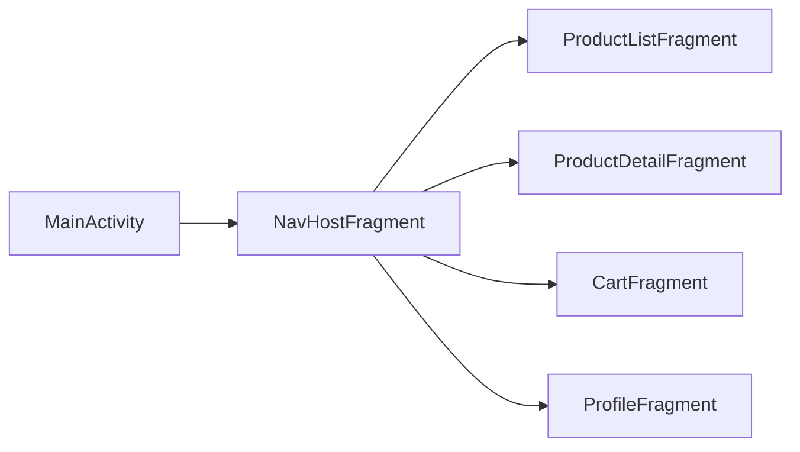
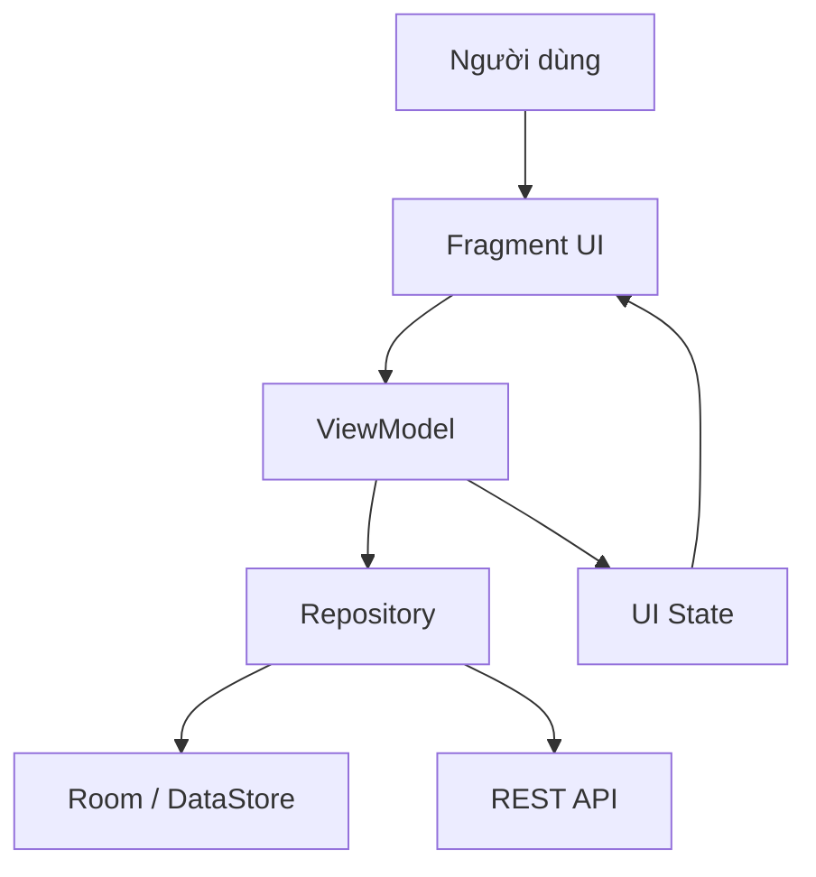
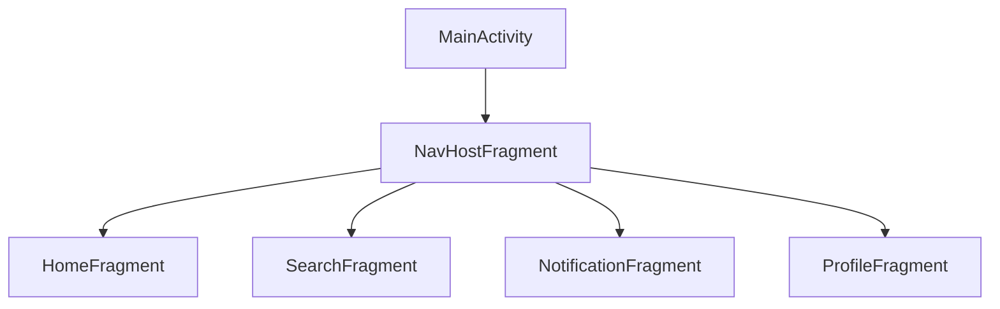
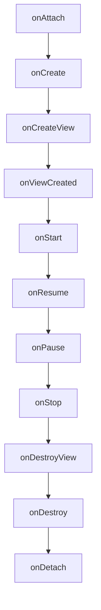
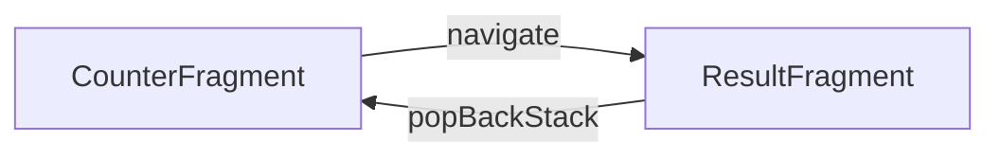
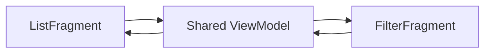
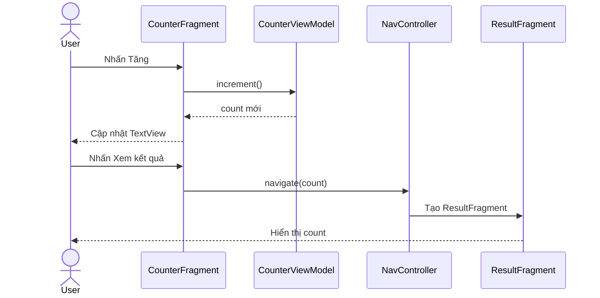
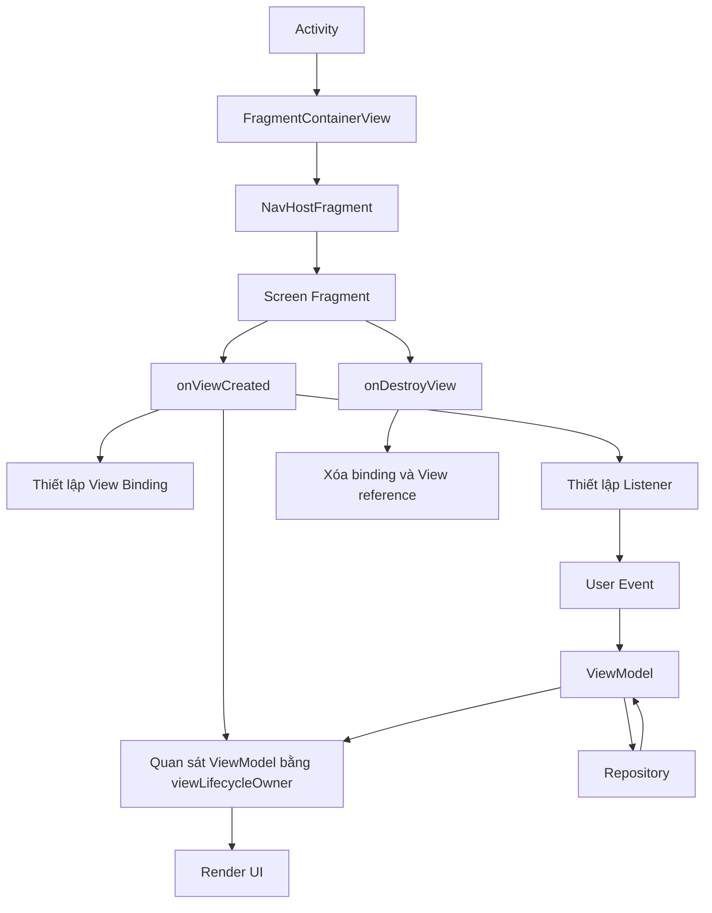

# 015 - Fragments trong Android

**Học phần:** 02 - App Components and User Interface
**Module:** Module 04 - Interface and Navigation
**Nhóm nội dung:** UI Elements
**Nguồn roadmap:** Interface and Navigation / UI Elements
**Loại bài:** UI
**Thứ tự trong module:** 015
**Thời lượng gợi ý:** 30 phút
**Ngôn ngữ:** Kotlin + XML Views
**Mức độ:** Cơ bản → Trung cấp

---

## 1. Tóm tắt


`Fragment` là một thành phần đại diện cho **một phần giao diện có thể tái sử dụng** trong ứng dụng Android. Fragment có thể quản lý layout, xử lý sự kiện người dùng và có lifecycle riêng, nhưng không thể tồn tại độc lập: nó phải được đặt bên trong một `Activity` hoặc một fragment cha. ([Android Developers][1])

Ví dụ, một ứng dụng mua sắm có thể được chia thành:

* `ProductListFragment`: hiển thị danh sách sản phẩm.
* `ProductDetailFragment`: hiển thị chi tiết sản phẩm.
* `CartFragment`: hiển thị giỏ hàng.
* `ProfileFragment`: hiển thị hồ sơ người dùng.

Activity thường đóng vai trò **khung chứa**, còn Fragment quản lý từng màn hình hoặc từng vùng nội dung.



### Fragment nằm ở đâu trong kiến trúc ứng dụng?



Fragment nên tập trung vào:

* Hiển thị dữ liệu.
* Nhận thao tác người dùng.
* Thu thập hoặc quan sát UI state.
* Gửi sự kiện cho `ViewModel`.
* Thực hiện điều hướng.

Fragment không nên trực tiếp chứa:

* Business logic phức tạp.
* Truy vấn cơ sở dữ liệu.
* Gọi API mạng.
* Logic xác thực dữ liệu dùng chung.
* Dữ liệu cần tồn tại lâu dài.

### Fragment còn phù hợp trong Android 2026 không?

Có, đặc biệt với ứng dụng sử dụng:

* XML Views.
* `RecyclerView`.
* `ViewPager2`.
* `BottomNavigationView`.
* Ứng dụng đang chuyển dần từ Views sang Compose.
* Màn hình kết hợp XML Views và Compose.

Theo hướng dẫn Android hiện tại, ứng dụng hoàn toàn dùng Compose nên sử dụng Navigation Compose; ứng dụng dùng Views hoặc kết hợp Views–Compose vẫn có thể dùng Fragment-based Navigation. ([Android Developers][2])

---

## 2. Mục tiêu học tập


Sau bài học, anh có thể:

* Giải thích Fragment bằng ngôn ngữ của mình.
* Phân biệt `Activity`, `Fragment` và View của Fragment.
* Tạo Fragment bằng Kotlin.
* Gắn Fragment vào `FragmentContainerView`.
* Hiểu Fragment lifecycle và View lifecycle.
* Quản lý View Binding đúng cách.
* Lưu UI state khi xoay màn hình hoặc tái tạo tiến trình.
* Điều hướng giữa các Fragment.
* Kiểm thử Fragment bằng `FragmentScenario`.
* Nhận biết các lỗi phổ biến như memory leak, Fragment bị thêm hai lần và state bị mất.

### Kết quả đầu ra của bài

Sau phần thực hành, project sẽ có hai màn hình:

```text
CounterFragment
     │
     │ Người dùng tăng giá trị
     ▼
CounterViewModel
     │
     │ Lưu count bằng SavedStateHandle
     ▼
ResultFragment
```

Artifact có thể đưa vào portfolio:

```text
fragment-demo/
├── screenshot-counter.png
├── screenshot-result.png
├── fragment-lifecycle.md
├── manual-test-checklist.md
├── README.md
└── app/
```

---

## 3. Khái niệm chính


### 3.1. Fragment là gì?

Một Fragment là một đối tượng kế thừa từ:

```kotlin
androidx.fragment.app.Fragment
```

Fragment có thể:

* Inflate một layout XML.
* Nhận sự kiện từ Button, EditText hoặc RecyclerView.
* Sở hữu `ViewModel`.
* Quan sát `LiveData` hoặc `Flow`.
* Điều hướng đến Fragment khác.
* Được thêm, thay thế hoặc xóa khi Activity vẫn đang chạy.

Một Fragment tối giản:

```kotlin
class HomeFragment : Fragment(R.layout.fragment_home)
```

Fragment trên sử dụng `fragment_home.xml` làm giao diện.

Android khuyến nghị sử dụng Fragment thuộc AndroidX thay vì các Fragment API cũ thuộc `android.app.Fragment` hoặc Support Library cũ. ([Android Developers][3])

---

### 3.2. Activity và Fragment khác nhau như thế nào?

| Đặc điểm                                | Activity                     | Fragment       |
| --------------------------------------- | ---------------------------- | -------------- |
| Có thể tồn tại độc lập                  | Có                           | Không          |
| Được khai báo trong Manifest            | Thường có                    | Không          |
| Có lifecycle                            | Có                           | Có             |
| Có thể quản lý một màn hình             | Có                           | Có             |
| Có View lifecycle riêng                 | Không theo cách của Fragment | Có             |
| Có thể nằm trong thành phần khác        | Không                        | Có             |
| Thường dùng làm navigation host         | Có                           | Là destination |
| Có thể tái sử dụng trong nhiều Activity | Hạn chế                      | Tốt hơn        |

Mô hình phổ biến:



Activity giữ các thành phần toàn cục như:

* App bar.
* Navigation drawer.
* Bottom navigation.
* Fragment container.

Fragment giữ nội dung của một destination.

---

### 3.3. FragmentManager

`FragmentManager` chịu trách nhiệm:

* Thêm Fragment.
* Xóa Fragment.
* Thay thế Fragment.
* Tìm Fragment.
* Quản lý back stack.
* Điều phối lifecycle của Fragment.

([Android Developers][4])

Trong Activity:

```kotlin
supportFragmentManager
```

Trong Fragment, để quản lý fragment con:

```kotlin
childFragmentManager
```

Để truy cập manager chứa Fragment hiện tại:

```kotlin
parentFragmentManager
```

Ví dụ thêm Fragment thủ công:

```kotlin
supportFragmentManager.commit {
    setReorderingAllowed(true)
    add<ProfileFragment>(R.id.fragmentContainer)
}
```

Khi thêm Fragment thủ công trong `Activity.onCreate()`, cần kiểm tra `savedInstanceState == null`. Nếu không, Activity được tái tạo có thể thêm một Fragment mới bên cạnh Fragment đã được hệ thống phục hồi. ([Android Developers][5])

```kotlin
class MainActivity : AppCompatActivity(R.layout.activity_main) {

    override fun onCreate(savedInstanceState: Bundle?) {
        super.onCreate(savedInstanceState)

        if (savedInstanceState == null) {
            supportFragmentManager.commit {
                setReorderingAllowed(true)
                add<HomeFragment>(R.id.fragmentContainer)
            }
        }
    }
}
```

---

### 3.4. FragmentContainerView

Nên sử dụng:

```xml
<androidx.fragment.app.FragmentContainerView />
```

Không nên dùng:

```xml
<fragment />
```

`FragmentContainerView` được thiết kế riêng để làm vùng chứa Fragment và có các xử lý phù hợp hơn `FrameLayout`. Android cũng cảnh báo rằng thẻ `<fragment>` có thể khiến Fragment chuyển lifecycle vượt quá trạng thái của `FragmentManager`. ([Android Developers][6])

Ví dụ:

```xml
<?xml version="1.0" encoding="utf-8"?>
<androidx.fragment.app.FragmentContainerView
    xmlns:android="http://schemas.android.com/apk/res/android"
    android:id="@+id/fragmentContainer"
    android:layout_width="match_parent"
    android:layout_height="match_parent" />
```

---

### 3.5. Fragment lifecycle và View lifecycle

Fragment có hai lifecycle cần phân biệt:

1. Lifecycle của đối tượng Fragment.
2. Lifecycle của View do Fragment tạo ra.

View có thể bị hủy trong khi đối tượng Fragment vẫn còn trong back stack. Vì vậy, các reference đến View Binding, Adapter hoặc View không được giữ sau `onDestroyView()`. Android cung cấp `viewLifecycleOwner` để các observer chỉ hoạt động trong thời gian View còn tồn tại. ([Android Developers][6])



#### Ý nghĩa các callback quan trọng

| Callback          | Mục đích phù hợp                      |
| ----------------- | ------------------------------------- |
| `onAttach()`      | Fragment được gắn vào host            |
| `onCreate()`      | Khởi tạo dữ liệu không phụ thuộc View |
| `onCreateView()`  | Tạo View của Fragment                 |
| `onViewCreated()` | Thiết lập UI, listener và observer    |
| `onStart()`       | Fragment bắt đầu hiển thị             |
| `onResume()`      | Người dùng có thể tương tác           |
| `onPause()`       | Fragment mất focus                    |
| `onStop()`        | Fragment không còn hiển thị           |
| `onDestroyView()` | Giải phóng reference đến View         |
| `onDestroy()`     | Fragment sắp bị hủy                   |
| `onDetach()`      | Fragment tách khỏi host               |

#### Quy tắc quan trọng

```text
Fragment còn sống
├── View được tạo
├── View bị hủy
├── Fragment vẫn nằm trong back stack
└── View có thể được tạo lại sau đó
```

Vì vậy, đoạn code sau dễ gây memory leak:

```kotlin
private lateinit var binding: FragmentHomeBinding
```

Nếu `binding` tiếp tục giữ View sau `onDestroyView()`, toàn bộ view hierarchy có thể chưa được giải phóng.

Mẫu an toàn hơn:

```kotlin
private var _binding: FragmentHomeBinding? = null

private val binding: FragmentHomeBinding
    get() = checkNotNull(_binding) {
        "Chỉ được truy cập binding khi View của Fragment còn tồn tại."
    }

override fun onViewCreated(
    view: View,
    savedInstanceState: Bundle?
) {
    super.onViewCreated(view, savedInstanceState)
    _binding = FragmentHomeBinding.bind(view)
}

override fun onDestroyView() {
    super.onDestroyView()
    _binding = null
}
```

---

### 3.6. Quan sát state đúng lifecycle

Không nên truyền Fragment làm `LifecycleOwner` cho dữ liệu chỉ dùng để cập nhật View:

```kotlin
viewModel.data.observe(this) {
    binding.textView.text = it
}
```

Nên dùng:

```kotlin
viewModel.data.observe(viewLifecycleOwner) {
    binding.textView.text = it
}
```

`viewLifecycleOwner` đảm bảo observer không cố cập nhật một View đã bị hủy. Đây là một trong những lý do Fragment có View lifecycle riêng. ([Android Developers][6])

Với `Flow`:

```kotlin
viewLifecycleOwner.lifecycleScope.launch {
    viewLifecycleOwner.repeatOnLifecycle(Lifecycle.State.STARTED) {
        viewModel.uiState.collect { state ->
            render(state)
        }
    }
}
```

---

### 3.7. Quản lý state


State trong Fragment có thể được chia thành:

| Loại state      | Ví dụ                                   | Nơi lưu phù hợp                |
| --------------- | --------------------------------------- | ------------------------------ |
| View state      | Text đang nhập, vị trí scroll           | View tự lưu nếu có ID          |
| UI state nhỏ    | Tab đang chọn, count, chế độ edit       | `SavedStateHandle` hoặc Bundle |
| Screen state    | Loading, error, danh sách đang hiển thị | `ViewModel`                    |
| Dữ liệu lâu dài | User, bài viết, đơn hàng                | Repository, Room hoặc server   |

Android có thể tự phục hồi Fragment và back stack, nhưng dữ liệu do ứng dụng quản lý vẫn cần được lưu đúng nơi. View có ID có thể tự lưu một số state; state nhỏ của màn hình có thể được giữ qua `SavedStateHandle` hoặc `onSaveInstanceState()`. ([Android Developers][7])

#### Không nên chỉ dùng biến thông thường

```kotlin
private var count = 0
```

Biến này có thể trở về `0` khi:

* Xoay màn hình.
* Thay đổi ngôn ngữ.
* Thay đổi dark mode.
* Hệ thống hủy và tạo lại tiến trình.

Nên chuyển state sang ViewModel:

```kotlin
class CounterViewModel(
    private val savedStateHandle: SavedStateHandle
) : ViewModel() {

    val count = savedStateHandle.getLiveData(KEY_COUNT, 0)

    fun increment() {
        savedStateHandle[KEY_COUNT] = (count.value ?: 0) + 1
    }

    companion object {
        private const val KEY_COUNT = "count"
    }
}
```

---

### 3.8. Điều hướng giữa các Fragment

Fragment có thể được điều hướng bằng:

* `FragmentTransaction`.
* Navigation Component.

Navigation Component thường đơn giản hơn vì hỗ trợ:

* Navigation graph.
* Back stack.
* Arguments.
* Deep links.
* Up và Back.
* `NavController`.
* Tích hợp với toolbar và bottom navigation.

Navigation Component quản lý FragmentManager ở tầng dưới; khi dùng Navigation, lập trình viên thường không cần tự viết các transaction cho từng destination. ([Android Developers][8])



Điều hướng:

```kotlin
findNavController().navigate(
    R.id.action_counterFragment_to_resultFragment
)
```

Quay lại:

```kotlin
findNavController().popBackStack()
```

---

### 3.9. Giao tiếp giữa các Fragment

Không nên để Fragment A giữ reference trực tiếp đến Fragment B:

```kotlin
val detailFragment = activity
    .supportFragmentManager
    .findFragmentByTag("detail") as DetailFragment

detailFragment.updateItem(item)
```

Cách này tạo coupling mạnh và dễ lỗi khi Fragment B chưa được tạo hoặc đã bị hủy.

Hai lựa chọn chính được Android đề xuất là:

* Shared `ViewModel` cho dữ liệu dùng chung hoặc tồn tại lâu hơn.
* Fragment Result API cho kết quả dùng một lần và có thể đặt trong `Bundle`. ([Android Developers][9])



---

## 4. Thực hành: Counter Fragment


### 4.1. Yêu cầu

Xây dựng ứng dụng có hai Fragment:

1. `CounterFragment`

   * Hiển thị số đếm.
   * Có nút tăng giá trị.
   * Giá trị không mất khi xoay màn hình.
   * Có nút mở màn hình kết quả.

2. `ResultFragment`

   * Nhận giá trị từ `CounterFragment`.
   * Hiển thị kết quả.
   * Có nút quay lại.

### 4.2. Luồng hoạt động



---

### 4.3. Cấu trúc thư mục

```text
app/src/main/
├── java/com/example/fragmentdemo/
│   ├── MainActivity.kt
│   ├── CounterFragment.kt
│   ├── CounterViewModel.kt
│   └── ResultFragment.kt
│
├── res/layout/
│   ├── activity_main.xml
│   ├── fragment_counter.xml
│   └── fragment_result.xml
│
└── res/navigation/
    └── nav_graph.xml
```

---

### 4.4. Dependency

Tại thời điểm tài liệu Android được cập nhật trong năm 2026, ví dụ chính thức sử dụng Fragment `1.8.9` và Navigation `2.9.8`. Nên kiểm tra version catalog của project trước khi sao chép vào dự án thực tế. ([Android Developers][5])

```kotlin
// app/build.gradle.kts

android {
    buildFeatures {
        viewBinding = true
    }
}

dependencies {
    implementation("androidx.fragment:fragment-ktx:1.8.9")

    implementation(
        "androidx.navigation:navigation-fragment-ktx:2.9.8"
    )
    implementation(
        "androidx.navigation:navigation-ui-ktx:2.9.8"
    )
}
```

---

### 4.5. Layout của Activity

Tạo `res/layout/activity_main.xml`:

```xml
<?xml version="1.0" encoding="utf-8"?>
<androidx.fragment.app.FragmentContainerView
    xmlns:android="http://schemas.android.com/apk/res/android"
    xmlns:app="http://schemas.android.com/apk/res-auto"

    android:id="@+id/navHostFragment"
    android:name="androidx.navigation.fragment.NavHostFragment"

    android:layout_width="match_parent"
    android:layout_height="match_parent"

    app:defaultNavHost="true"
    app:navGraph="@navigation/nav_graph" />
```

`app:defaultNavHost="true"` giúp `NavHostFragment` xử lý nút Back hệ thống cho navigation graph này.

---

### 4.6. MainActivity

```kotlin
package com.example.fragmentdemo

import androidx.appcompat.app.AppCompatActivity

class MainActivity : AppCompatActivity(R.layout.activity_main)
```

Activity chỉ đóng vai trò host nên không cần chứa logic của từng màn hình.

---

### 4.7. Layout CounterFragment

Tạo `res/layout/fragment_counter.xml`:

```xml
<?xml version="1.0" encoding="utf-8"?>
<LinearLayout
    xmlns:android="http://schemas.android.com/apk/res/android"

    android:layout_width="match_parent"
    android:layout_height="match_parent"

    android:gravity="center"
    android:orientation="vertical"
    android:padding="24dp">

    <TextView
        android:id="@+id/titleTextView"
        android:layout_width="wrap_content"
        android:layout_height="wrap_content"
        android:text="Fragment Counter"
        android:textSize="24sp"
        android:textStyle="bold" />

    <TextView
        android:id="@+id/countTextView"
        android:layout_width="wrap_content"
        android:layout_height="wrap_content"
        android:layout_marginTop="24dp"
        android:text="0"
        android:textSize="56sp"
        android:textStyle="bold" />

    <Button
        android:id="@+id/incrementButton"
        android:layout_width="match_parent"
        android:layout_height="wrap_content"
        android:layout_marginTop="32dp"
        android:text="Tăng giá trị" />

    <Button
        android:id="@+id/resultButton"
        android:layout_width="match_parent"
        android:layout_height="wrap_content"
        android:layout_marginTop="12dp"
        android:text="Xem kết quả" />

</LinearLayout>
```

---

### 4.8. CounterViewModel

```kotlin
package com.example.fragmentdemo

import androidx.lifecycle.SavedStateHandle
import androidx.lifecycle.ViewModel

class CounterViewModel(
    private val savedStateHandle: SavedStateHandle
) : ViewModel() {

    val count = savedStateHandle.getLiveData(KEY_COUNT, 0)

    fun increment() {
        val currentValue = count.value ?: 0
        savedStateHandle[KEY_COUNT] = currentValue + 1
    }

    companion object {
        private const val KEY_COUNT = "counter_value"
    }
}
```

Ở đây:

* `ViewModel` tách state khỏi View.
* `SavedStateHandle` giúp giữ state qua quá trình tái tạo màn hình.
* Fragment chỉ render giá trị được cung cấp.

---

### 4.9. CounterFragment

```kotlin
package com.example.fragmentdemo

import android.os.Bundle
import android.view.View
import androidx.core.os.bundleOf
import androidx.fragment.app.Fragment
import androidx.fragment.app.viewModels
import androidx.navigation.fragment.findNavController
import com.example.fragmentdemo.databinding.FragmentCounterBinding

class CounterFragment : Fragment(R.layout.fragment_counter) {

    private var _binding: FragmentCounterBinding? = null

    private val binding: FragmentCounterBinding
        get() = checkNotNull(_binding) {
            "Không được truy cập binding sau onDestroyView()."
        }

    private val viewModel: CounterViewModel by viewModels()

    override fun onViewCreated(
        view: View,
        savedInstanceState: Bundle?
    ) {
        super.onViewCreated(view, savedInstanceState)

        _binding = FragmentCounterBinding.bind(view)

        setupObservers()
        setupListeners()
    }

    private fun setupObservers() {
        viewModel.count.observe(viewLifecycleOwner) { count ->
            binding.countTextView.text = count.toString()
        }
    }

    private fun setupListeners() {
        binding.incrementButton.setOnClickListener {
            viewModel.increment()
        }

        binding.resultButton.setOnClickListener {
            val count = viewModel.count.value ?: 0

            findNavController().navigate(
                R.id.action_counterFragment_to_resultFragment,
                bundleOf(ARG_COUNT to count)
            )
        }
    }

    override fun onDestroyView() {
        super.onDestroyView()
        _binding = null
    }

    companion object {
        private const val ARG_COUNT = "count"
    }
}
```

Điểm cần chú ý:

```kotlin
viewModel.count.observe(viewLifecycleOwner)
```

Không dùng:

```kotlin
viewModel.count.observe(this)
```

vì dữ liệu đang cập nhật một View thuộc View lifecycle.

---

### 4.10. Layout ResultFragment

Tạo `res/layout/fragment_result.xml`:

```xml
<?xml version="1.0" encoding="utf-8"?>
<LinearLayout
    xmlns:android="http://schemas.android.com/apk/res/android"

    android:layout_width="match_parent"
    android:layout_height="match_parent"

    android:gravity="center"
    android:orientation="vertical"
    android:padding="24dp">

    <TextView
        android:id="@+id/resultTitleTextView"
        android:layout_width="wrap_content"
        android:layout_height="wrap_content"
        android:text="Kết quả"
        android:textSize="24sp"
        android:textStyle="bold" />

    <TextView
        android:id="@+id/resultTextView"
        android:layout_width="wrap_content"
        android:layout_height="wrap_content"
        android:layout_marginTop="24dp"
        android:text="0"
        android:textSize="56sp"
        android:textStyle="bold" />

    <Button
        android:id="@+id/backButton"
        android:layout_width="match_parent"
        android:layout_height="wrap_content"
        android:layout_marginTop="32dp"
        android:text="Quay lại" />

</LinearLayout>
```

---

### 4.11. ResultFragment

```kotlin
package com.example.fragmentdemo

import android.os.Bundle
import android.view.View
import androidx.fragment.app.Fragment
import androidx.navigation.fragment.findNavController
import com.example.fragmentdemo.databinding.FragmentResultBinding

class ResultFragment : Fragment(R.layout.fragment_result) {

    private var _binding: FragmentResultBinding? = null

    private val binding: FragmentResultBinding
        get() = checkNotNull(_binding)

    override fun onViewCreated(
        view: View,
        savedInstanceState: Bundle?
    ) {
        super.onViewCreated(view, savedInstanceState)

        _binding = FragmentResultBinding.bind(view)

        val count = requireArguments().getInt(ARG_COUNT)

        binding.resultTextView.text = count.toString()

        binding.backButton.setOnClickListener {
            findNavController().popBackStack()
        }
    }

    override fun onDestroyView() {
        super.onDestroyView()
        _binding = null
    }

    companion object {
        private const val ARG_COUNT = "count"
    }
}
```

---

### 4.12. Navigation graph

Tạo `res/navigation/nav_graph.xml`:

```xml
<?xml version="1.0" encoding="utf-8"?>
<navigation
    xmlns:android="http://schemas.android.com/apk/res/android"
    xmlns:app="http://schemas.android.com/apk/res-auto"

    android:id="@+id/nav_graph"
    app:startDestination="@id/counterFragment">

    <fragment
        android:id="@+id/counterFragment"
        android:name="com.example.fragmentdemo.CounterFragment"
        android:label="Counter">

        <action
            android:id="@+id/action_counterFragment_to_resultFragment"
            app:destination="@id/resultFragment" />
    </fragment>

    <fragment
        android:id="@+id/resultFragment"
        android:name="com.example.fragmentdemo.ResultFragment"
        android:label="Result">

        <argument
            android:name="count"
            android:defaultValue="0"
            app:argType="integer" />
    </fragment>

</navigation>
```

> Thẻ `<fragment>` bên trong navigation graph là định nghĩa **destination**, không phải thẻ `<fragment>` được dùng trực tiếp để nhúng Fragment vào layout Activity. Cảnh báo về `<fragment>` áp dụng cho layout XML chứa View.

---

### 4.13. Kiểm tra state

Thực hiện:

1. Mở ứng dụng.
2. Nhấn **Tăng giá trị** ba lần.
3. Xoay thiết bị.
4. Xác nhận giá trị vẫn là `3`.
5. Mở màn hình kết quả.
6. Nhấn Back.
7. Xác nhận giá trị ở màn hình trước vẫn là `3`.
8. Chuyển ứng dụng xuống background rồi mở lại.
9. Bật “Don’t keep activities” để kiểm tra tái tạo màn hình.

---

### 4.14. Kế hoạch 30 phút

|  Thời gian | Công việc                                               |
| ---------: | ------------------------------------------------------- |
|   0–5 phút | Hiểu Fragment, Activity và lifecycle                    |
|  5–10 phút | Tạo Activity, FragmentContainerView và navigation graph |
| 10–18 phút | Tạo CounterFragment và ViewModel                        |
| 18–23 phút | Tạo ResultFragment và navigation                        |
| 23–27 phút | Kiểm tra rotate, Back và state                          |
| 27–30 phút | Chụp screenshot và viết README                          |

---

## 5. Bài tập


### Bài tập 1: Bộ đếm có nút giảm

Bổ sung:

* Nút giảm giá trị.
* Không cho giá trị nhỏ hơn `0`.
* Nút reset.
* Hiển thị Snackbar sau khi reset.

Yêu cầu ViewModel:

```kotlin
fun decrement()
fun reset()
```

---

### Bài tập 2: Truyền tiêu đề sang ResultFragment

Cho người dùng nhập tên bài tập:

```text
Tên: Chống đẩy
Số lần: 20
```

Truyền cả hai giá trị sang ResultFragment:

```text
Bạn đã hoàn thành 20 lần Chống đẩy
```

State cần giữ khi xoay màn hình:

* Tên bài tập.
* Số lần.
* Trạng thái lỗi validation.

---

### Bài tập 3: Shared ViewModel

Tạo:

```text
ProductListFragment
        │
        ├── chọn sản phẩm
        ▼
SharedProductViewModel
        │
        ▼
ProductDetailFragment
```

Không truyền toàn bộ object bằng Bundle. Chỉ truyền ID hoặc dùng ViewModel/repository làm nguồn dữ liệu.

---

### Bài tập 4: Fragment Result API

Tạo `FilterFragment` cho phép chọn:

* Giá thấp đến cao.
* Giá cao đến thấp.
* Sản phẩm mới nhất.

Khi người dùng nhấn **Áp dụng**, gửi kết quả về `ProductListFragment` bằng Fragment Result API.

---

### Bài tập 5: Master–detail cho màn hình lớn

Trên điện thoại:

```text
ProductListFragment
        │
        ▼
ProductDetailFragment
```

Trên tablet:

```text
┌─────────────────────┬─────────────────────┐
│ ProductListFragment │ ProductDetailFragment│
└─────────────────────┴─────────────────────┘
```

Fragment giúp tái sử dụng cùng nội dung trong các cấu hình màn hình khác nhau. ([Android Developers][1])

---

## 6. Checklist hoàn thành


### Kiến thức

* [ ] Giải thích được Fragment là gì.
* [ ] Biết Fragment không thể tồn tại độc lập.
* [ ] Phân biệt Activity lifecycle và Fragment lifecycle.
* [ ] Phân biệt Fragment lifecycle và View lifecycle.
* [ ] Hiểu vai trò của `FragmentManager`.
* [ ] Hiểu vai trò của `NavController`.
* [ ] Biết khi nào dùng Shared ViewModel.
* [ ] Biết khi nào dùng Fragment Result API.

### Code

* [ ] Fragment kế thừa từ `androidx.fragment.app.Fragment`.
* [ ] Dùng `FragmentContainerView`.
* [ ] Khởi tạo binding trong `onViewCreated()`.
* [ ] Xóa binding trong `onDestroyView()`.
* [ ] Quan sát dữ liệu bằng `viewLifecycleOwner`.
* [ ] Không giữ Activity context trong biến toàn cục.
* [ ] Không gọi API hoặc database trực tiếp từ Fragment.
* [ ] State màn hình được đặt trong ViewModel.
* [ ] State nhỏ cần phục hồi sử dụng `SavedStateHandle`.
* [ ] Navigation không bị thực hiện hai lần khi nhấn nhanh.

### Kiểm thử thủ công

* [ ] Mở Fragment thành công.
* [ ] Nút bấm cập nhật UI.
* [ ] State không mất khi rotate.
* [ ] State phù hợp sau khi đổi dark mode.
* [ ] Back stack hoạt động đúng.
* [ ] Không xuất hiện Fragment trùng lặp.
* [ ] Không crash khi nhấn Back nhanh.
* [ ] Không crash khi chuyển background rồi quay lại.
* [ ] Error state và loading state hiển thị đúng.
* [ ] TalkBack đọc được tiêu đề và nút bấm.

### Artifact portfolio

* [ ] Có screenshot màn hình đầu.
* [ ] Có screenshot màn hình kết quả.
* [ ] Có sơ đồ navigation.
* [ ] Có mô tả lifecycle.
* [ ] Có test checklist.
* [ ] Có README giải thích cách chạy project.
* [ ] Có commit history rõ ràng.

---

### Kiểm thử tự động với FragmentScenario

AndroidX cung cấp `FragmentScenario` để tạo Fragment độc lập và chuyển Fragment qua các lifecycle state khác nhau. `launchInContainer()` phù hợp với Fragment có UI; `launch()` phù hợp với kiểm thử không cần view hierarchy. ([Android Developers][10])

Dependency:

```kotlin
dependencies {
    debugImplementation(
        "androidx.fragment:fragment-testing-manifest:1.8.9"
    )

    androidTestImplementation(
        "androidx.fragment:fragment-testing:1.8.9"
    )
}
```

Ví dụ kiểm tra nút tăng:

```kotlin
@RunWith(AndroidJUnit4::class)
class CounterFragmentTest {

    @Test
    fun clickIncrement_updatesCounter() {
        launchFragmentInContainer<CounterFragment>(
            themeResId = R.style.Theme_FragmentDemo
        )

        onView(withId(R.id.incrementButton))
            .perform(click())

        onView(withId(R.id.countTextView))
            .check(matches(withText("1")))
    }
}
```

Kiểm tra state sau khi tái tạo:

```kotlin
@Test
fun recreate_keepsCounterValue() {
    val scenario = launchFragmentInContainer<CounterFragment>(
        themeResId = R.style.Theme_FragmentDemo
    )

    onView(withId(R.id.incrementButton))
        .perform(click(), click(), click())

    scenario.recreate()

    onView(withId(R.id.countTextView))
        .check(matches(withText("3")))
}
```

### Kiểm thử navigation

Navigation Component đã kiểm thử việc quản lý destination và back stack ở cấp thư viện; test của ứng dụng nên tập trung xác nhận rằng thao tác trong Fragment gửi đúng lệnh đến `NavController`. Android cung cấp `TestNavHostController` cho trường hợp này. ([Android Developers][11])

```kotlin
@Test
fun clickResult_navigatesToResultFragment() {
    val context = ApplicationProvider
        .getApplicationContext<Context>()

    val navController = TestNavHostController(context)

    val scenario = launchFragmentInContainer<CounterFragment>(
        themeResId = R.style.Theme_FragmentDemo
    )

    scenario.onFragment { fragment ->
        navController.setGraph(R.navigation.nav_graph)
        navController.setCurrentDestination(
            R.id.counterFragment
        )

        Navigation.setViewNavController(
            fragment.requireView(),
            navController
        )
    }

    onView(withId(R.id.resultButton))
        .perform(click())

    assertThat(navController.currentDestination?.id)
        .isEqualTo(R.id.resultFragment)
}
```

---

## 7. Ghi chú sản xuất


### 7.1. Không giữ binding sau onDestroyView

Sai:

```kotlin
private lateinit var binding: FragmentHomeBinding
```

Nếu không giải phóng đúng lúc, Fragment trong back stack có thể giữ reference đến toàn bộ View đã bị hủy.

Đúng:

```kotlin
override fun onDestroyView() {
    super.onDestroyView()
    _binding = null
}
```

---

### 7.2. Không khởi chạy coroutine theo lifecycle của Fragment khi nó cập nhật View

Rủi ro:

```kotlin
lifecycleScope.launch {
    viewModel.uiState.collect {
        binding.render(it)
    }
}
```

Fragment có thể còn sống trong khi View đã bị hủy.

Nên dùng:

```kotlin
viewLifecycleOwner.lifecycleScope.launch {
    viewLifecycleOwner.repeatOnLifecycle(
        Lifecycle.State.STARTED
    ) {
        viewModel.uiState.collect { state ->
            render(state)
        }
    }
}
```

---

### 7.3. Không tái sử dụng cùng một Fragment instance

Không nên:

```kotlin
val profileFragment = ProfileFragment()

fun openProfile() {
    fragmentManager.replace(
        R.id.container,
        profileFragment
    )
}
```

Sau khi Fragment bị remove, việc dùng lại cùng instance có thể mang theo state cũ ngoài dự kiến. Android khuyến cáo tạo instance mới thay vì tái sử dụng Fragment đã bị xóa khỏi `FragmentManager`. ([Android Developers][6])

Nên dùng:

```kotlin
fun openProfile() {
    fragmentManager.commit {
        replace<ProfileFragment>(R.id.container)
    }
}
```

---

### 7.4. Không lưu dữ liệu lớn trong Bundle

Bundle và SavedState phù hợp với state nhỏ:

* ID.
* Boolean.
* Số đếm.
* Tab đang chọn.
* Chuỗi ngắn.
* Bộ lọc đơn giản.

Không nên lưu:

* Bitmap lớn.
* Danh sách hàng nghìn phần tử.
* Response API hoàn chỉnh.
* Object chứa context.
* Database entity graph phức tạp.

Dữ liệu lớn hoặc dữ liệu cần tồn tại lâu dài nên nằm trong repository, database hoặc server; SavedState chỉ giữ thông tin đủ để phục hồi màn hình. ([Android Developers][7])

---

### 7.5. Ngăn double navigation

Người dùng có thể nhấn nút hai lần liên tiếp và tạo hai lệnh navigation.

Ví dụ bảo vệ theo destination:

```kotlin
private fun openResult(count: Int) {
    val navController = findNavController()

    if (
        navController.currentDestination?.id
        != R.id.counterFragment
    ) {
        return
    }

    navController.navigate(
        R.id.action_counterFragment_to_resultFragment,
        bundleOf("count" to count)
    )
}
```

Có thể kết hợp:

* Disable nút tạm thời.
* Debounce click.
* Kiểm tra destination hiện tại.
* Biểu diễn navigation bằng one-time UI event.

---

### 7.6. Xử lý loading, error và empty state

Fragment production không nên chỉ có trạng thái thành công.

```kotlin
sealed interface ProductUiState {

    data object Loading : ProductUiState

    data class Success(
        val products: List<Product>
    ) : ProductUiState

    data object Empty : ProductUiState

    data class Error(
        val message: String
    ) : ProductUiState
}
```

Fragment chỉ render:

```kotlin
private fun render(state: ProductUiState) {
    when (state) {
        ProductUiState.Loading -> showLoading()

        is ProductUiState.Success ->
            showProducts(state.products)

        ProductUiState.Empty -> showEmpty()

        is ProductUiState.Error ->
            showError(state.message)
    }
}
```

---

### 7.7. Network request phải gắn với ViewModel

Không nên:

```kotlin
override fun onViewCreated(
    view: View,
    savedInstanceState: Bundle?
) {
    api.getProducts()
}
```

Mỗi lần View được tạo lại, request có thể bị gọi lại ngoài ý muốn.

Nên:

```kotlin
class ProductViewModel(
    private val repository: ProductRepository
) : ViewModel() {

    val uiState = repository.products
        .stateIn(
            scope = viewModelScope,
            started = SharingStarted.WhileSubscribed(5_000),
            initialValue = ProductUiState.Loading
        )
}
```

Fragment chỉ thu thập state.

---

### 7.8. Fragment StrictMode và logging

Trong lúc debug, có thể bật log `FragmentManager`:

```bash
adb shell setprop log.tag.FragmentManager DEBUG
```

Hoặc mức chi tiết hơn:

```bash
adb shell setprop log.tag.FragmentManager VERBOSE
```

Log này giúp quan sát:

* Fragment được attach.
* Fragment được tạo.
* Transaction được commit.
* Back stack thay đổi.
* Lifecycle state chuyển đổi.

Android cũng cung cấp `FragmentStrictMode` để phát hiện các lỗi như tái sử dụng Fragment hoặc dùng API không phù hợp. ([Android Developers][12])

Ví dụ chỉ dành cho debug:

```kotlin
class MainActivity : AppCompatActivity() {

    init {
        if (BuildConfig.DEBUG) {
            supportFragmentManager.strictModePolicy =
                FragmentStrictMode.Policy.Builder()
                    .detectFragmentReuse()
                    .detectWrongFragmentContainer()
                    .penaltyLog()
                    .build()
        }
    }
}
```

---

### 7.9. Các lỗi phổ biến

| Lỗi                                | Nguyên nhân thường gặp                 | Hướng xử lý                               |
| ---------------------------------- | -------------------------------------- | ----------------------------------------- |
| Fragment xuất hiện hai lần         | Không kiểm tra `savedInstanceState`    | Chỉ add thủ công khi state null           |
| Crash khi quay lại màn hình        | Truy cập binding sau `onDestroyView()` | Đặt binding về null                       |
| State trở về mặc định              | Dùng biến cục bộ trong Fragment        | Dùng ViewModel/SavedStateHandle           |
| Observer cập nhật View cũ          | Quan sát bằng `this`                   | Dùng `viewLifecycleOwner`                 |
| Request API bị gọi nhiều lần       | Gọi trong `onViewCreated()`            | Đưa request và cache vào ViewModel        |
| Navigation chạy hai lần            | Người dùng nhấn nút nhanh              | Debounce hoặc kiểm tra destination        |
| Fragment phụ thuộc Activity cụ thể | Ép kiểu `requireActivity()`            | Dùng interface, ViewModel hoặc result API |
| Back không đúng                    | Transaction không vào back stack       | Dùng Navigation Component                 |
| Memory leak Adapter                | Adapter giữ View/Fragment              | Gỡ adapter hoặc listener khi hủy View     |
| Crash do state đã lưu              | Commit transaction quá muộn            | Không navigate sau state saving           |

---

### 7.10. Release checklist

Trước khi phát hành tính năng dùng Fragment:

```text
[ ] Navigation graph không có destination bị cô lập
[ ] Back và Up hoạt động đúng
[ ] Deep link mở đúng destination
[ ] State được giữ khi rotate
[ ] Dark mode không làm mất dữ liệu
[ ] Đổi ngôn ngữ không làm mất nội dung đang nhập
[ ] Process recreation đã được kiểm tra
[ ] Không giữ View Binding sau onDestroyView
[ ] Network loading/error/retry hoạt động
[ ] Không double navigation
[ ] Fragment tests chạy thành công
[ ] Accessibility labels đầy đủ
[ ] Không có FragmentStrictMode violation
[ ] Không có memory leak trong LeakCanary
```

---

## 8. Sơ đồ tổng kết



### Công thức ghi nhớ

```text
Fragment = Screen controller
ViewModel = UI state holder
Repository = Data coordinator
NavController = Navigation manager
viewLifecycleOwner = Lifecycle của View
FragmentManager = Bộ quản lý Fragment
```

---

## 9. README mẫu cho portfolio

```markdown
# Android Fragment Counter Demo

Ứng dụng Android nhỏ minh họa cách sử dụng Fragment,
Navigation Component, View Binding, ViewModel và SavedStateHandle.

## Tính năng

- Tăng giá trị bộ đếm.
- Giữ state khi xoay màn hình.
- Điều hướng giữa hai Fragment.
- Truyền argument qua Navigation Component.
- Quản lý View Binding theo View lifecycle.
- Kiểm thử Fragment bằng FragmentScenario.

## Kiến trúc

Fragment → ViewModel → SavedStateHandle

## Các trường hợp đã kiểm thử

- Xoay màn hình.
- Chuyển background.
- Back navigation.
- Process recreation.
- Nhấn nút liên tục.
- Loading và error state.

## Công nghệ

- Kotlin
- AndroidX Fragment
- Navigation Component
- View Binding
- ViewModel
- SavedStateHandle
- Espresso
- FragmentScenario
```

---

## 10. Tài liệu chính thức

* Tổng quan Fragment và khả năng tái sử dụng UI. ([Android Developers][1])
* Cách tạo Fragment và sử dụng `FragmentContainerView`. ([Android Developers][5])
* Fragment lifecycle và View lifecycle. ([Android Developers][6])
* Lưu và phục hồi Fragment state. ([Android Developers][7])
* Navigation cho Views, Fragments và Compose. ([Android Developers][2])
* Kiểm thử Fragment bằng `FragmentScenario`. ([Android Developers][10])
* Kiểm thử navigation bằng `TestNavHostController`. ([Android Developers][11])
* Giao tiếp bằng Shared ViewModel và Fragment Result API. ([Android Developers][9])

[1]: https://developer.android.com/guide/fragments "Fragments  |  App architecture  |  Android Developers"
[2]: https://developer.android.com/guide/navigation "Navigation  |  App architecture  |  Android Developers"
[3]: https://developer.android.com/jetpack/androidx?utm_source=chatgpt.com "AndroidX overview | Jetpack"
[4]: https://developer.android.com/guide/fragments/fragmentmanager?utm_source=chatgpt.com "Fragment manager | App architecture"
[5]: https://developer.android.com/guide/fragments/create "Create a fragment  |  App architecture  |  Android Developers"
[6]: https://developer.android.com/guide/fragments/lifecycle "Fragment lifecycle  |  App architecture  |  Android Developers"
[7]: https://developer.android.com/guide/fragments/saving-state "Saving state with fragments  |  App architecture  |  Android Developers"
[8]: https://developer.android.com/guide/navigation/migrate?utm_source=chatgpt.com "Migrate to the Navigation component | App architecture"
[9]: https://developer.android.com/guide/fragments/communicate?hl=en&utm_source=chatgpt.com "Communicate with fragments  |  App architecture  |  Android Developers"
[10]: https://developer.android.com/guide/fragments/test "Test your fragments  |  App architecture  |  Android Developers"
[11]: https://developer.android.com/guide/navigation/testing/fragments "Test fragment navigation  |  App architecture  |  Android Developers"
[12]: https://developer.android.com/guide/fragments/debugging?utm_source=chatgpt.com "Debug your fragments  |  App architecture  |  Android Developers"
