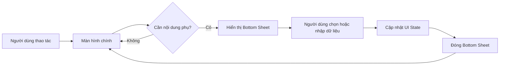
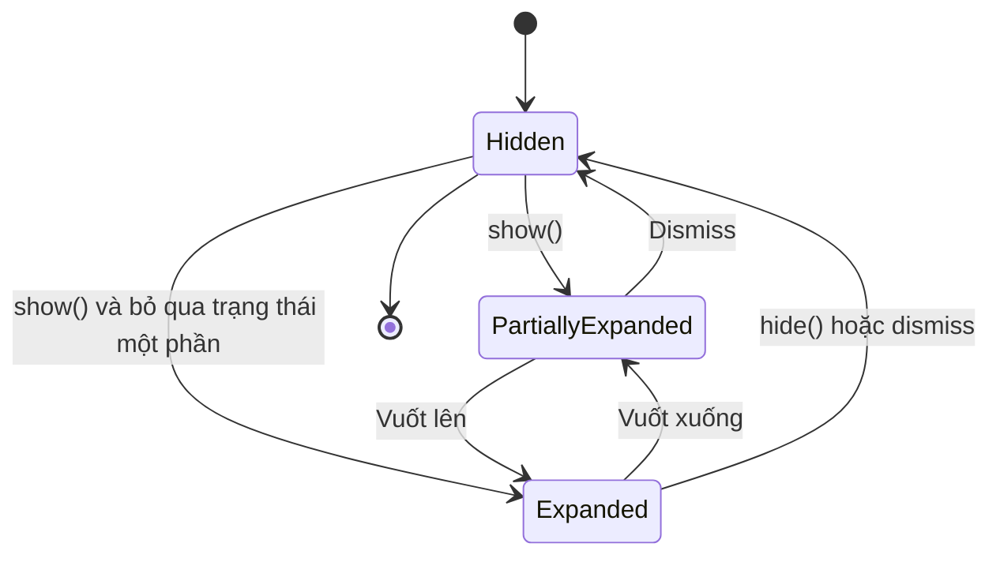
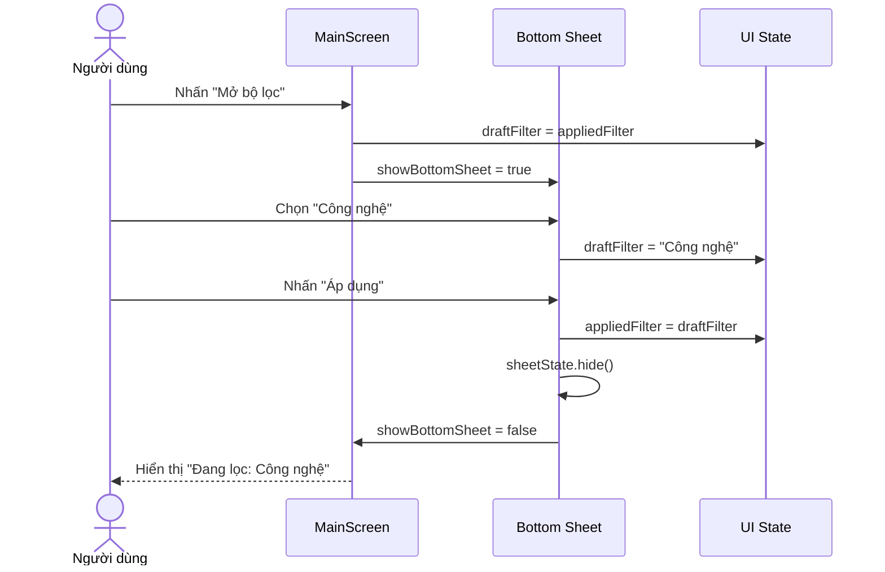
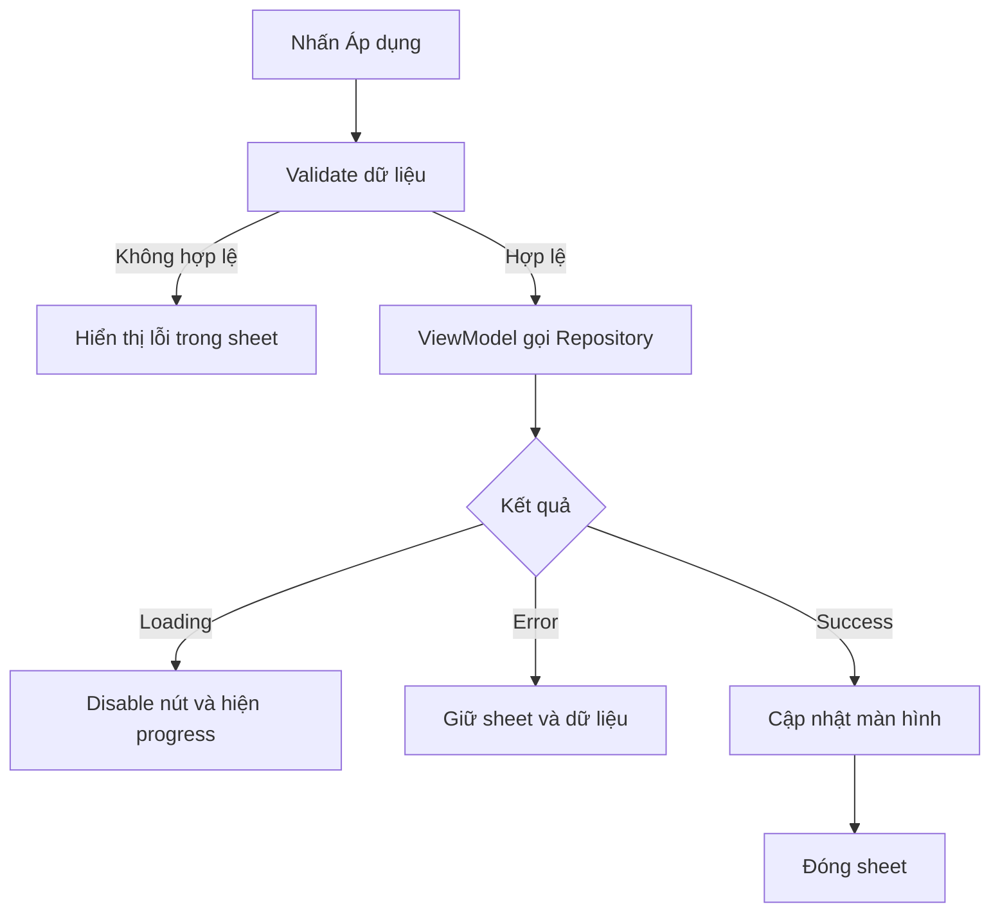

[](https://medium.com/%40snishanthdeveloper/mastering-modal-bottom-sheets-in-jetpack-compose-dynamic-interactions-with-material-3-cf76f66facf1?utm_source=chatgpt.com)

# 016 — Bottom Sheet trong Android

| Thuộc tính              | Nội dung                                               |
| ----------------------- | ------------------------------------------------------ |
| **Học phần**            | 02 — App Components and User Interface                 |
| **Module**              | Module 04 — Interface and Navigation                   |
| **Nhóm nội dung**       | UI Elements                                            |
| **Nguồn roadmap**       | Interface and Navigation / UI Elements                 |
| **Loại bài**            | UI                                                     |
| **Thứ tự trong module** | 016                                                    |
| **Thời lượng gợi ý**    | 30 phút                                                |
| **Công nghệ chính**     | Jetpack Compose Material 3                             |
| **Kiến thức liên quan** | State, coroutine, lifecycle, accessibility, UI testing |

---

## 1. Tóm tắt


**Bottom Sheet** là một bề mặt giao diện xuất hiện từ cạnh dưới màn hình để hiển thị nội dung hoặc hành động bổ sung mà không bắt người dùng rời khỏi ngữ cảnh hiện tại.

Ví dụ phổ biến:

* Bộ lọc sản phẩm.
* Chọn phương thức thanh toán.
* Danh sách hành động như chia sẻ, lưu, chỉnh sửa.
* Mini music player.
* Form nhập nhanh.
* Chi tiết một địa điểm trên bản đồ.
* Menu lựa chọn trên màn hình điện thoại.

Theo Material Design 3, Bottom Sheet có hai nhóm chính:

1. **Standard Bottom Sheet**: tồn tại đồng thời với nội dung chính.
2. **Modal Bottom Sheet**: phủ lên nội dung chính, thường có lớp nền tối `scrim` và yêu cầu người dùng đóng hoặc hoàn thành hành động trước khi quay lại màn hình bên dưới. ([Material Design][1])

Trong Jetpack Compose Material 3, `ModalBottomSheet` được dùng để tạo Modal Bottom Sheet. Trạng thái mở, đóng và mở một phần được quản lý thông qua `SheetState`. ([Android Developers][2])

### Bottom Sheet nằm ở đâu trong ứng dụng?



Bottom Sheet chủ yếu thuộc **presentation layer**, nhưng nội dung bên trong nó có thể tương tác với:

* `ViewModel`.
* `StateFlow`.
* Navigation.
* Repository.
* Network API.
* Local database.
* Permission hoặc system picker.

> Bottom Sheet không nên tự chứa toàn bộ business logic. Nó chủ yếu hiển thị trạng thái và phát ra sự kiện người dùng.

---

## 2. Mục tiêu học tập


Sau bài học, anh có thể:

* Giải thích Bottom Sheet bằng ngôn ngữ của mình.
* Phân biệt Standard Bottom Sheet và Modal Bottom Sheet.
* Xác định tình huống nên và không nên dùng Bottom Sheet.
* Tạo Bottom Sheet bằng Jetpack Compose Material 3.
* Điều khiển mở, đóng và mở một phần bằng `SheetState`.
* Quản lý state để dữ liệu không bị mất ngoài ý muốn.
* Kiểm thử thao tác mở, chọn dữ liệu và đóng Bottom Sheet.
* Nhận biết các vấn đề production liên quan đến:

  * Xoay màn hình.
  * Process recreation.
  * Bàn phím ảo.
  * Nested scrolling.
  * Accessibility.
  * Network loading.
  * Các kích thước màn hình khác nhau.

### Tiêu chí hoàn thành

Anh được xem là đã hiểu bài khi có thể trả lời:

> “Khi nào nên dùng Bottom Sheet thay cho Dialog hoặc một màn hình mới, state của nó được quản lý ở đâu, và test hành vi mở–đóng như thế nào?”

---

## 3. Khái niệm chính


### 3.1. Standard Bottom Sheet

Standard Bottom Sheet tồn tại cùng với màn hình chính. Người dùng thường vẫn có thể quan sát hoặc tương tác với một phần nội dung phía sau.

Ví dụ:

* Mini music player nằm dưới danh sách bài hát.
* Bảng thông tin địa điểm trong ứng dụng bản đồ.
* Thanh điều khiển media.
* Nội dung hỗ trợ khi người dùng cuộn hoặc di chuyển bản đồ.

Trong Compose Material 3, trường hợp này thường được triển khai bằng `BottomSheetScaffold`.

```text
┌──────────────────────────────┐
│                              │
│       Nội dung chính         │
│                              │
│                              │
├──────────────────────────────┤
│  Standard Bottom Sheet       │
│  Vẫn tồn tại cùng màn hình   │
└──────────────────────────────┘
```

### 3.2. Modal Bottom Sheet

Modal Bottom Sheet xuất hiện phía trên màn hình hiện tại và thường làm mờ nội dung phía sau bằng `scrim`.

Người dùng có thể đóng bằng:

* Vuốt xuống.
* Nhấn ra ngoài sheet.
* Nhấn nút quay lại.
* Nhấn nút đóng.
* Hoàn thành một hành động.

```text
┌──────────────────────────────┐
│       Scrim làm tối nền      │
│                              │
│      Nội dung bị khóa        │
├──────────────────────────────┤
│          ─────               │
│     Modal Bottom Sheet       │
│     Lựa chọn / Form / Menu   │
└──────────────────────────────┘
```

`ModalBottomSheet` cung cấp `onDismissRequest` để ứng dụng phản ứng khi người dùng yêu cầu đóng sheet. Khi gọi `hide()`, ứng dụng nên đợi hoạt ảnh đóng hoàn tất rồi loại Bottom Sheet khỏi composition. ([Android Developers][2])

### 3.3. So sánh hai loại

| Tiêu chí                          | Standard Bottom Sheet              | Modal Bottom Sheet                     |
| --------------------------------- | ---------------------------------- | -------------------------------------- |
| Nội dung chính còn tương tác được | Thường có                          | Không                                  |
| Có `scrim`                        | Không                              | Có                                     |
| Mục đích                          | Điều khiển hoặc thông tin liên tục | Hành động, lựa chọn hoặc form tạm thời |
| Ví dụ                             | Mini player                        | Bộ lọc sản phẩm                        |
| Compose API thường dùng           | `BottomSheetScaffold`              | `ModalBottomSheet`                     |
| Cần đóng trước khi tiếp tục       | Không bắt buộc                     | Thường có                              |

### 3.4. Các thành phần cấu tạo

Một Bottom Sheet thường gồm:

| Thành phần           | Vai trò                                         |
| -------------------- | ----------------------------------------------- |
| **Container**        | Bề mặt chứa nội dung                            |
| **Drag handle**      | Gợi ý người dùng có thể kéo sheet               |
| **Scrim**            | Làm tối và khóa nội dung phía sau đối với modal |
| **Title**            | Mô tả mục đích của sheet                        |
| **Content**          | Danh sách, form, bộ lọc hoặc chi tiết           |
| **Actions**          | Áp dụng, lưu, xác nhận hoặc hủy                 |
| **Dismiss behavior** | Cách đóng sheet                                 |

`BottomSheetDragHandleView` trong hệ thống View truyền thống có khả năng hỗ trợ thao tác accessibility và chuyển đổi giữa các trạng thái collapsed, half-expanded và expanded. ([Android Developers][3])

### 3.5. Các trạng thái của Bottom Sheet

Đối với Compose Material 3, có thể hình dung ba trạng thái chính:



| Trạng thái          | Ý nghĩa                           |
| ------------------- | --------------------------------- |
| `Hidden`            | Sheet không hiển thị              |
| `PartiallyExpanded` | Sheet chỉ chiếm một phần màn hình |
| `Expanded`          | Sheet mở tối đa                   |

Để cho phép trạng thái mở một phần, tạo `SheetState` với:

```kotlin
rememberModalBottomSheetState(
    skipPartiallyExpanded = false
)
```

Khi `skipPartiallyExpanded = true`, sheet bỏ qua trạng thái mở một phần và mở trực tiếp tới trạng thái expanded. ([Android Developers][4])

### 3.6. Bottom Sheet, Dialog hay màn hình mới?

| Nhu cầu                                | Thành phần phù hợp    |
| -------------------------------------- | --------------------- |
| Xác nhận hành động rất ngắn            | Alert Dialog          |
| Chọn một vài hành động theo ngữ cảnh   | Modal Bottom Sheet    |
| Form dài, nhiều bước                   | Màn hình riêng        |
| Điều khiển luôn hiện diện              | Standard Bottom Sheet |
| Hiển thị lỗi nghiêm trọng cần xác nhận | Dialog                |
| Bộ lọc danh sách trên mobile           | Modal Bottom Sheet    |
| Nội dung phức tạp, có deep link riêng  | Màn hình riêng        |

### Không nên dùng Bottom Sheet khi

* Nội dung quá dài và có nhiều cấp điều hướng.
* Người dùng phải hoàn thành một quy trình nhiều bước.
* Nội dung cần URL hoặc deep link riêng.
* Hành động mang tính phá hủy nhưng không có bước xác nhận rõ ràng.
* Sheet chứa một Bottom Sheet khác.
* Toàn bộ màn hình chỉ còn một vùng rất nhỏ để thao tác.
* Người dùng có nguy cơ mất dữ liệu khi vô tình vuốt xuống.

---

## 4. Thực hành


### 4.1. Yêu cầu mini project

Xây dựng màn hình **Danh sách sản phẩm** có:

* Nhãn hiển thị bộ lọc hiện tại.
* Nút **Mở bộ lọc**.
* Modal Bottom Sheet chứa ba lựa chọn:

  * Tất cả.
  * Công nghệ.
  * Sách.
* Nút **Áp dụng**.
* Nút **Hủy**.
* State thay đổi sau khi người dùng áp dụng bộ lọc.

### 4.2. Dependency

Sử dụng Compose BOM hoặc version catalog của dự án và thêm Material 3:

```kotlin
dependencies {
    implementation(platform(libs.androidx.compose.bom))
    implementation("androidx.compose.material3:material3")
}
```

Không nên sao chép một phiên bản thư viện cố định từ bài viết cũ; hãy dùng Compose BOM ổn định mà dự án đang quản lý.

### 4.3. Code Jetpack Compose hoàn chỉnh

```kotlin
package com.example.bottomsheetdemo

import androidx.compose.foundation.layout.Arrangement
import androidx.compose.foundation.layout.Column
import androidx.compose.foundation.layout.Row
import androidx.compose.foundation.layout.Spacer
import androidx.compose.foundation.layout.fillMaxSize
import androidx.compose.foundation.layout.fillMaxWidth
import androidx.compose.foundation.layout.height
import androidx.compose.foundation.layout.navigationBarsPadding
import androidx.compose.foundation.layout.padding
import androidx.compose.material3.Button
import androidx.compose.material3.ExperimentalMaterial3Api
import androidx.compose.material3.FilterChip
import androidx.compose.material3.MaterialTheme
import androidx.compose.material3.ModalBottomSheet
import androidx.compose.material3.OutlinedButton
import androidx.compose.material3.Text
import androidx.compose.material3.rememberModalBottomSheetState
import androidx.compose.runtime.Composable
import androidx.compose.runtime.getValue
import androidx.compose.runtime.mutableStateOf
import androidx.compose.runtime.rememberCoroutineScope
import androidx.compose.runtime.saveable.rememberSaveable
import androidx.compose.runtime.setValue
import androidx.compose.ui.Modifier
import androidx.compose.ui.semantics.paneTitle
import androidx.compose.ui.semantics.semantics
import androidx.compose.ui.platform.testTag
import androidx.compose.ui.unit.dp
import kotlinx.coroutines.launch

@OptIn(ExperimentalMaterial3Api::class)
@Composable
fun FilterBottomSheetDemo(
    modifier: Modifier = Modifier,
) {
    var showBottomSheet by rememberSaveable {
        mutableStateOf(false)
    }

    // Giá trị đã được áp dụng lên màn hình chính.
    var appliedFilter by rememberSaveable {
        mutableStateOf("Tất cả")
    }

    // Giá trị tạm thời khi người dùng đang thao tác trong sheet.
    var draftFilter by rememberSaveable {
        mutableStateOf(appliedFilter)
    }

    val sheetState = rememberModalBottomSheetState(
        skipPartiallyExpanded = false,
    )

    val coroutineScope = rememberCoroutineScope()

    fun closeSheetWithAnimation() {
        coroutineScope
            .launch {
                sheetState.hide()
            }
            .invokeOnCompletion {
                if (!sheetState.isVisible) {
                    showBottomSheet = false
                }
            }
    }

    Column(
        modifier = modifier
            .fillMaxSize()
            .padding(24.dp),
        verticalArrangement = Arrangement.Center,
    ) {
        Text(
            text = "Danh sách sản phẩm",
            style = MaterialTheme.typography.headlineMedium,
        )

        Spacer(modifier = Modifier.height(12.dp))

        Text(
            text = "Đang lọc: $appliedFilter",
            modifier = Modifier.testTag("applied_filter"),
        )

        Spacer(modifier = Modifier.height(24.dp))

        Button(
            modifier = Modifier.testTag("open_sheet"),
            onClick = {
                // Mỗi lần mở, draft bắt đầu từ giá trị đang áp dụng.
                draftFilter = appliedFilter
                showBottomSheet = true
            },
        ) {
            Text("Mở bộ lọc")
        }
    }

    if (showBottomSheet) {
        ModalBottomSheet(
            modifier = Modifier
                .testTag("filter_sheet")
                .semantics {
                    paneTitle = "Bộ lọc sản phẩm"
                },
            sheetState = sheetState,
            onDismissRequest = {
                // Không áp dụng draft khi người dùng vuốt xuống
                // hoặc chạm vào vùng scrim.
                showBottomSheet = false
            },
        ) {
            Column(
                modifier = Modifier
                    .fillMaxWidth()
                    .navigationBarsPadding()
                    .padding(
                        start = 24.dp,
                        end = 24.dp,
                        bottom = 24.dp,
                    ),
            ) {
                Text(
                    text = "Bộ lọc sản phẩm",
                    style = MaterialTheme.typography.titleLarge,
                )

                Spacer(modifier = Modifier.height(8.dp))

                Text(
                    text = "Chọn một danh mục",
                    style = MaterialTheme.typography.bodyMedium,
                )

                Spacer(modifier = Modifier.height(16.dp))

                listOf(
                    "Tất cả",
                    "Công nghệ",
                    "Sách",
                ).forEach { category ->
                    FilterChip(
                        modifier = Modifier.testTag(
                            "filter_$category"
                        ),
                        selected = draftFilter == category,
                        onClick = {
                            draftFilter = category
                        },
                        label = {
                            Text(category)
                        },
                    )

                    Spacer(modifier = Modifier.height(8.dp))
                }

                Spacer(modifier = Modifier.height(16.dp))

                Row(
                    modifier = Modifier.fillMaxWidth(),
                    horizontalArrangement = Arrangement.spacedBy(12.dp),
                ) {
                    OutlinedButton(
                        modifier = Modifier.weight(1f),
                        onClick = {
                            draftFilter = appliedFilter
                            closeSheetWithAnimation()
                        },
                    ) {
                        Text("Hủy")
                    }

                    Button(
                        modifier = Modifier
                            .weight(1f)
                            .testTag("apply_filter"),
                        onClick = {
                            appliedFilter = draftFilter
                            closeSheetWithAnimation()
                        },
                    ) {
                        Text("Áp dụng")
                    }
                }
            }
        }
    }
}
```

`SheetState.show()` và `SheetState.hide()` là các hàm suspend, vì vậy chúng cần được gọi trong coroutine. Khi sheet đã được ẩn, nên loại `ModalBottomSheet` khỏi composition thay vì chỉ giữ một sheet ẩn trong cây UI. ([Android Developers][2])

### 4.4. Luồng state của ví dụ



### 4.5. Vì sao cần `draftFilter`?

Không nên sửa trực tiếp dữ liệu đang áp dụng mỗi khi người dùng chọn một mục trong sheet.

Ví dụ:

```text
Sai:
Người dùng chọn "Sách"
→ Danh sách phía sau đổi ngay
→ Người dùng nhấn Hủy
→ Không biết phải khôi phục state nào

Tốt:
Người dùng chọn "Sách"
→ Chỉ cập nhật draftFilter
→ Nhấn Áp dụng mới cập nhật appliedFilter
→ Nhấn Hủy thì bỏ draftFilter
```

Mẫu state này đặc biệt hữu ích cho:

* Bộ lọc nhiều trường.
* Form chỉnh sửa hồ sơ.
* Chọn ngày giờ.
* Chọn phương thức thanh toán.
* Cấu hình thông báo.

### 4.6. Quản lý state với ViewModel

Đối với ứng dụng production, business state nên được đưa lên `ViewModel`:

```kotlin
data class ProductFilterUiState(
    val appliedCategory: String = "Tất cả",
    val draftCategory: String = "Tất cả",
    val isApplying: Boolean = false,
    val errorMessage: String? = null,
)

sealed interface ProductFilterAction {
    data object OpenSheet : ProductFilterAction
    data object DismissSheet : ProductFilterAction
    data class SelectCategory(
        val category: String,
    ) : ProductFilterAction

    data object Apply : ProductFilterAction
}
```

Có thể giữ `showBottomSheet` ở UI nếu việc mở sheet chỉ là trạng thái trình bày tạm thời. Tuy nhiên, các dữ liệu như lựa chọn bộ lọc, form nhập và trạng thái loading nên nằm trong `ViewModel` khi cần tồn tại qua configuration change hoặc được chia sẻ với màn hình.

### 4.7. Phiên bản View truyền thống

Nếu dự án chưa sử dụng Compose, Modal Bottom Sheet có thể được tạo bằng `BottomSheetDialogFragment`.

```kotlin
class ProductFilterSheet : BottomSheetDialogFragment() {

    override fun onCreateView(
        inflater: LayoutInflater,
        container: ViewGroup?,
        savedInstanceState: Bundle?,
    ): View {
        return inflater.inflate(
            R.layout.sheet_product_filter,
            container,
            false,
        )
    }
}
```

Hiển thị sheet:

```kotlin
ProductFilterSheet().show(
    parentFragmentManager,
    "ProductFilterSheet",
)
```

`BottomSheetDialogFragment` là một biến thể của `DialogFragment`, sử dụng `BottomSheetDialog` để trình bày nội dung dưới dạng Modal Bottom Sheet. Với Standard Bottom Sheet trong hệ thống View, có thể gắn `BottomSheetBehavior` vào một view con của `CoordinatorLayout`. ([Android Developers][5])

---

## 5. Bài tập


### Bài tập 1 — Action Sheet

Tạo Bottom Sheet xuất hiện khi người dùng nhấn nút ba chấm của một bài viết.

Nội dung:

* Lưu bài viết.
* Chia sẻ.
* Sao chép liên kết.
* Báo cáo.
* Hủy.

Yêu cầu:

* Nhấn một hành động thì sheet đóng.
* Hiển thị Snackbar xác nhận hành động.
* Hành động “Báo cáo” phải mở bước xác nhận tiếp theo.
* Không sử dụng Bottom Sheet lồng trong Bottom Sheet.

### Bài tập 2 — Bộ lọc có nhiều state

Mở rộng ví dụ thành bộ lọc gồm:

* Danh mục.
* Khoảng giá.
* Đánh giá tối thiểu.
* Chỉ hiển thị sản phẩm còn hàng.

Tạo hai state riêng:

```kotlin
val appliedFilter: ProductFilter
val draftFilter: ProductFilter
```

Hành vi cần kiểm tra:

1. Mở sheet.
2. Thay đổi nhiều giá trị.
3. Nhấn Hủy.
4. Mở lại sheet.
5. Các giá trị phải quay về bộ lọc đang áp dụng.
6. Nhấn Áp dụng.
7. Màn hình chính phải cập nhật.

### Bài tập 3 — Loading và lỗi mạng

Giả sử nút **Áp dụng** gọi API.

Hãy thiết kế các trạng thái:

```kotlin
sealed interface ApplyFilterState {
    data object Idle : ApplyFilterState
    data object Loading : ApplyFilterState
    data object Success : ApplyFilterState
    data class Error(
        val message: String,
    ) : ApplyFilterState
}
```

Quy tắc UX:

* Khi loading, vô hiệu hóa nút Áp dụng.
* Không đóng sheet ngay nếu API chưa thành công.
* Khi lỗi, giữ lại dữ liệu người dùng đã chọn.
* Hiển thị lỗi gần khu vực hành động.
* Khi thành công mới đóng sheet.

### Bài tập 4 — Partial Bottom Sheet

Thay đổi:

```kotlin
skipPartiallyExpanded = false
```

Kiểm tra:

* Sheet có mở ở trạng thái một phần không?
* Người dùng có thể vuốt lên để mở toàn màn hình không?
* Người dùng có thể vuốt xuống để đóng không?
* Nội dung có đủ cao để trạng thái partial mang lại giá trị không?

Android hướng dẫn sử dụng `skipPartiallyExpanded = false` để cho phép sheet xuất hiện một phần trước khi người dùng mở rộng hoặc đóng nó. ([Android Developers][4])

### Bài tập 5 — Portfolio artifact

Tạo repository có cấu trúc:

```text
bottom-sheet-demo/
├── app/
├── screenshots/
│   ├── main-screen.png
│   ├── sheet-partial.png
│   ├── sheet-expanded.png
│   └── filter-applied.png
├── docs/
│   └── state-diagram.md
├── README.md
└── demo.gif
```

README nên có:

```markdown
# Material 3 Bottom Sheet Demo

## Chức năng

- Modal Bottom Sheet
- Partial expansion
- Draft và applied state
- Dismiss animation
- Compose UI test
- Accessibility pane title

## Luồng sử dụng

1. Mở bộ lọc.
2. Chọn danh mục.
3. Áp dụng.
4. Quan sát danh sách cập nhật.

## Kỹ thuật

- Jetpack Compose
- Material 3
- SheetState
- rememberSaveable
- Compose UI Testing
```

---

## 6. Checklist hoàn thành


### 6.1. Checklist kiến thức

* [ ] Giải thích được Bottom Sheet là gì.
* [ ] Phân biệt được Standard và Modal Bottom Sheet.
* [ ] Biết khi nào nên dùng Dialog hoặc màn hình mới.
* [ ] Hiểu `scrim`, container và drag handle.
* [ ] Biết các trạng thái hidden, partial và expanded.
* [ ] Biết vai trò của `SheetState`.
* [ ] Biết vì sao cần coroutine khi gọi `hide()` hoặc `show()`.
* [ ] Biết loại sheet khỏi composition sau khi đóng.
* [ ] Phân biệt presentation state và business state.

### 6.2. Checklist UX

* [ ] Sheet có tiêu đề rõ ràng.
* [ ] Hành động chính dễ nhận biết.
* [ ] Có cách đóng sheet.
* [ ] Không dùng Bottom Sheet lồng nhau.
* [ ] Không đặt form quá dài trong sheet.
* [ ] Dữ liệu không bị mất khi vô tình đóng.
* [ ] Nội dung có thể cuộn khi chiều cao không đủ.
* [ ] Nút dưới cùng không bị navigation bar che.
* [ ] Bàn phím không che trường nhập hoặc nút xác nhận.
* [ ] Touch target đủ lớn.

### 6.3. Checklist state và lifecycle

* [ ] State không bị khai báo trùng ở nhiều nơi.
* [ ] Dữ liệu quan trọng nằm trong `ViewModel` hoặc saved state.
* [ ] Đã xác định có cần giữ sheet mở khi xoay màn hình không.
* [ ] Đã kiểm tra khi ứng dụng chuyển background rồi quay lại.
* [ ] Đã kiểm tra process recreation.
* [ ] Đã phân biệt dữ liệu tạm `draft` và dữ liệu đã áp dụng.
* [ ] Không gọi network request trực tiếp trong composable body.
* [ ] Không gọi `show()` hoặc `hide()` ngoài coroutine.

### 6.4. Checklist accessibility

* [ ] Sheet có tiêu đề hoặc `paneTitle`.
* [ ] Icon có `contentDescription` phù hợp.
* [ ] TalkBack đọc đúng thứ tự nội dung.
* [ ] Focus được chuyển vào sheet khi mở.
* [ ] Khi đóng, focus quay lại phần tử đã mở sheet.
* [ ] Không chỉ dựa vào màu sắc để biểu thị mục đang chọn.
* [ ] Drag handle không phải cách duy nhất để đóng sheet.

Compose sử dụng semantics để cung cấp ý nghĩa cho UI, hỗ trợ accessibility và cho phép UI test tìm, kiểm tra và thao tác với các thành phần giao diện. ([Android Developers][6])

### 6.5. UI test mẫu

```kotlin
package com.example.bottomsheetdemo

import androidx.compose.ui.test.assertIsDisplayed
import androidx.compose.ui.test.junit4.createComposeRule
import androidx.compose.ui.test.onAllNodesWithTag
import androidx.compose.ui.test.onNodeWithTag
import androidx.compose.ui.test.onNodeWithText
import androidx.compose.ui.test.performClick
import org.junit.Rule
import org.junit.Test

class FilterBottomSheetDemoTest {

    @get:Rule
    val composeRule = createComposeRule()

    @Test
    fun openSelectAndApplyFilter() {
        composeRule.setContent {
            FilterBottomSheetDemo()
        }

        // Mở Bottom Sheet.
        composeRule
            .onNodeWithTag("open_sheet")
            .performClick()

        composeRule
            .onNodeWithTag("filter_sheet")
            .assertIsDisplayed()

        // Chọn danh mục.
        composeRule
            .onNodeWithTag("filter_Công nghệ")
            .performClick()

        // Áp dụng.
        composeRule
            .onNodeWithTag("apply_filter")
            .performClick()

        // Chờ animation đóng hoàn tất.
        composeRule.waitUntil(
            timeoutMillis = 5_000,
        ) {
            composeRule
                .onAllNodesWithTag("filter_sheet")
                .fetchSemanticsNodes()
                .isEmpty()
        }

        composeRule
            .onNodeWithText("Đang lọc: Công nghệ")
            .assertIsDisplayed()
    }
}
```

Compose UI Testing cung cấp API để tìm node, thực hiện hành động, kiểm tra thuộc tính và tự đồng bộ với UI khi có thể. Kiểm thử instrumented trên thiết bị vẫn cần thiết đối với các tương tác thực tế như bàn phím, kích thước màn hình và gesture. ([Android Developers][7])

### 6.6. Manual test

| Mã    | Tình huống            | Kết quả mong đợi                           |
| ----- | --------------------- | ------------------------------------------ |
| BS-01 | Nhấn Mở bộ lọc        | Sheet xuất hiện                            |
| BS-02 | Chạm vùng scrim       | Sheet đóng                                 |
| BS-03 | Vuốt sheet xuống      | Sheet đóng                                 |
| BS-04 | Nhấn Back             | Sheet đóng trước màn hình                  |
| BS-05 | Chọn danh mục         | FilterChip cập nhật                        |
| BS-06 | Nhấn Hủy              | Giá trị cũ được giữ                        |
| BS-07 | Nhấn Áp dụng          | Màn hình cập nhật                          |
| BS-08 | Xoay thiết bị         | State đúng theo yêu cầu sản phẩm           |
| BS-09 | Bật TalkBack          | Tiêu đề và lựa chọn được đọc đúng          |
| BS-10 | Mở bàn phím           | Trường nhập và nút không bị che            |
| BS-11 | Màn hình nhỏ          | Nội dung cuộn được                         |
| BS-12 | Tablet hoặc landscape | Sheet không trở nên quá rộng hoặc khó dùng |

---

## 7. Ghi chú sản xuất


### 7.1. Không để hai nguồn state cạnh tranh

Mẫu dễ gây lỗi:

```kotlin
var localSelection by remember { mutableStateOf(...) }
val viewModelSelection by viewModel.selection.collectAsState()
```

Nếu cả hai cùng đại diện cho một dữ liệu, giao diện có thể:

* Hiển thị giá trị cũ.
* Bị reset sau recomposition.
* Áp dụng sai bộ lọc.
* Không khôi phục đúng khi quay lại màn hình.

Hãy xác định rõ:

```text
ViewModel
├── appliedFilter
├── draftFilter
├── loading
└── error

Composable
├── showBottomSheet
└── sheet animation state
```

### 7.2. Không lưu mọi thứ vào `SheetState`

`SheetState` chỉ nên quản lý trạng thái trình bày của sheet.

Không nên đưa các dữ liệu này vào `SheetState`:

* Danh mục được chọn.
* Nội dung form.
* Kết quả API.
* Trạng thái thanh toán.
* ID sản phẩm.
* Business error.

Các dữ liệu đó nên nằm trong UI state hoặc domain state.

### 7.3. Xử lý việc đóng ngoài ý muốn

Form quan trọng có thể bị đóng khi người dùng:

* Vuốt xuống.
* Nhấn Back.
* Chạm vào scrim.
* Xoay màn hình.
* Chuyển sang ứng dụng khác.

Có thể dùng `confirmValueChange` để từ chối một số chuyển đổi trạng thái:

```kotlin
val sheetState = rememberModalBottomSheetState(
    skipPartiallyExpanded = true,
    confirmValueChange = { targetValue ->
        when {
            hasUnsavedChanges &&
                targetValue == SheetValue.Hidden -> false

            else -> true
        }
    },
)
```

Tuy nhiên, không nên khóa người dùng trong sheet mà không có cách thoát rõ ràng. Nếu dữ liệu quan trọng chưa lưu, một phương án tốt hơn là hiển thị xác nhận “Bỏ thay đổi?” trước khi đóng.

### 7.4. Network request

Luồng phù hợp:



Không nên đóng sheet ngay sau khi bắt đầu request nếu người dùng cần biết request đã thành công hay chưa.

### 7.5. Bàn phím và form

Với sheet chứa `TextField`:

* Dùng nội dung có khả năng cuộn.
* Thêm `imePadding()` khi cần.
* Đưa trường đang focus vào vùng nhìn thấy.
* Kiểm tra cả bàn phím gesture và bàn phím ba nút.
* Không đặt nút xác nhận tại vị trí bị IME che.
* Khi submit, tránh đóng bàn phím và sheet theo thứ tự gây giật hình.

Ví dụ:

```kotlin
Column(
    modifier = Modifier
        .fillMaxWidth()
        .verticalScroll(rememberScrollState())
        .imePadding()
        .navigationBarsPadding()
        .padding(24.dp),
) {
    // Form content
}
```

### 7.6. Nested scrolling

Bottom Sheet có thể xung đột gesture với:

* `LazyColumn`.
* `LazyGrid`.
* Map.
* Pager.
* WebView.
* RecyclerView.
* Slider kéo theo chiều dọc.

Dấu hiệu lỗi:

* Sheet di chuyển thay vì danh sách cuộn.
* Danh sách không cuộn tới cuối.
* Sheet giật khi đổi hướng vuốt.
* Swipe-to-dismiss kích hoạt ngoài ý muốn.

Cần test trực tiếp trên thiết bị, đặc biệt khi sheet có danh sách dài.

### 7.7. Màn hình lớn

Bottom Sheet phù hợp nhất với thiết bị nhỏ. Trên tablet hoặc desktop, một sheet trải toàn bộ chiều rộng có thể làm nội dung khó đọc.

Có thể cân nhắc:

* Giới hạn chiều rộng.
* Căn giữa nội dung.
* Dùng Dialog.
* Dùng Side Sheet.
* Dùng supporting pane trong adaptive layout.

Material Design cũng định nghĩa Side Sheet là bề mặt nội dung phụ gắn vào cạnh màn hình, phù hợp hơn trong một số giao diện rộng. ([Material Design][8])

### 7.8. Navigation

Bottom Sheet có thể được xem là:

1. **UI tạm thời trong cùng destination**.
2. **Một navigation destination riêng**.

Nên tạo destination riêng khi sheet:

* Có logic riêng đáng kể.
* Cần nhận navigation arguments.
* Có deep-link-like state.
* Cần theo dõi analytics như một màn hình.
* Cần giữ trong navigation history.

Navigation 3 có recipe chính thức để hiển thị một destination dưới dạng Modal Bottom Sheet bằng `BottomSheetSceneStrategy` và metadata của entry. ([Android Developers][9])

### 7.9. Các lỗi thường gặp

| Lỗi                              | Nguyên nhân                            | Cách xử lý                                  |
| -------------------------------- | -------------------------------------- | ------------------------------------------- |
| Nhấn nút nhưng sheet không hiện  | Không đưa sheet vào composition        | Kiểm tra `if (showBottomSheet)`             |
| Sheet đóng nhưng vẫn chiếm state | Chỉ gọi `hide()`                       | Đặt `showBottomSheet = false` sau animation |
| Sheet biến mất ngay              | State bị reset khi recomposition       | Dùng `rememberSaveable` hoặc ViewModel      |
| Nhấn Hủy nhưng dữ liệu vẫn đổi   | Sửa trực tiếp applied state            | Dùng draft state                            |
| Sheet che navigation bar         | Thiếu inset padding                    | Dùng `navigationBarsPadding()`              |
| Form bị bàn phím che             | Thiếu IME handling                     | Dùng `imePadding()` và scroll               |
| UI test không ổn định            | Assertion trước khi animation kết thúc | Chờ sheet xuất hiện hoặc biến mất           |
| TalkBack không hiểu sheet        | Thiếu semantics hoặc title             | Thêm `paneTitle`, label và description      |
| Sheet khó đóng                   | Không có hành động đóng rõ ràng        | Thêm nút Hủy hoặc Đóng                      |
| Người dùng mất form              | Dismiss không được kiểm soát           | Lưu draft hoặc xác nhận bỏ thay đổi         |

### 7.10. Release checklist

Trước khi release:

* [ ] Test trên màn hình nhỏ.
* [ ] Test landscape.
* [ ] Test tablet hoặc foldable.
* [ ] Test dark theme.
* [ ] Test font scale 1.3× và 2.0×.
* [ ] Test TalkBack.
* [ ] Test gesture navigation.
* [ ] Test bàn phím mở và đóng.
* [ ] Test nhấn Back.
* [ ] Test chạm scrim.
* [ ] Test vuốt lên và xuống.
* [ ] Test xoay màn hình.
* [ ] Test background rồi mở lại ứng dụng.
* [ ] Test network chậm, lỗi và timeout.
* [ ] Kiểm tra analytics không ghi trùng sự kiện mở sheet.
* [ ] Kiểm tra dữ liệu nhạy cảm không xuất hiện trong log.
* [ ] Kiểm tra screenshot trên nhiều kích thước thiết bị.

---

## Tổng kết nhanh

```text
Bottom Sheet
├── Standard
│   ├── Cùng tồn tại với nội dung chính
│   ├── Phù hợp với điều khiển liên tục
│   └── Ví dụ: mini music player
│
└── Modal
    ├── Phủ lên nội dung chính
    ├── Có scrim
    ├── Phù hợp với bộ lọc, lựa chọn và hành động
    └── Compose API: ModalBottomSheet

State
├── showBottomSheet: có render sheet hay không
├── SheetState: animation và vị trí sheet
├── draftState: dữ liệu người dùng đang chỉnh
└── appliedState: dữ liệu đã xác nhận
```

> **Nguyên tắc quan trọng:** Bottom Sheet là bề mặt trình bày nội dung phụ. Hãy giữ business state bên ngoài sheet, phân biệt dữ liệu tạm với dữ liệu đã áp dụng, kiểm soát việc dismiss và kiểm thử đầy đủ trên gesture, bàn phím, lifecycle cùng accessibility.

[1]: https://m3.material.io/components/bottom-sheets?utm_source=chatgpt.com "Bottom sheets"
[2]: https://developer.android.com/develop/ui/compose/components/bottom-sheets "Bottom sheets  |  Jetpack Compose  |  Android Developers"
[3]: https://developer.android.com/reference/com/google/android/material/bottomsheet/BottomSheetDragHandleView?utm_source=chatgpt.com "BottomSheetDragHandleView | API reference"
[4]: https://developer.android.com/develop/ui/compose/components/bottom-sheets-partial "Partial bottom sheet  |  Jetpack Compose  |  Android Developers"
[5]: https://developer.android.com/reference/com/google/android/material/bottomsheet/BottomSheetBehavior?utm_source=chatgpt.com "BottomSheetBehavior | API reference"
[6]: https://developer.android.com/develop/ui/compose/accessibility/semantics?utm_source=chatgpt.com "Semantics | Jetpack Compose"
[7]: https://developer.android.com/develop/ui/compose/testing "Test your Compose layout  |  Jetpack Compose  |  Android Developers"
[8]: https://m3.material.io/components/side-sheets/guidelines?utm_source=chatgpt.com "Side sheets – Material Design 3"
[9]: https://developer.android.com/guide/navigation/navigation-3/recipes/bottomsheet "App architecture  |  Android Developers"

---

# Bài luyện tập

## Mục tiêu


## Đề bài


## Yêu cầu hoàn thành

- [ ] 
- [ ] 
- [ ] 

## Kết quả / lời giải


## Ghi chú
