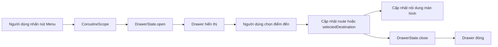
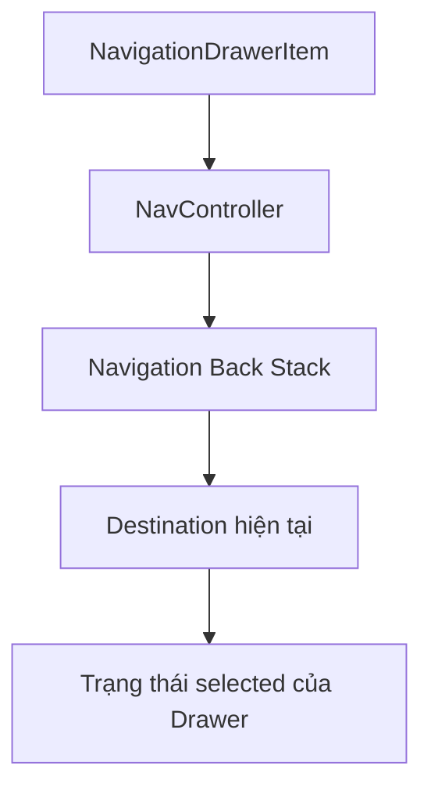
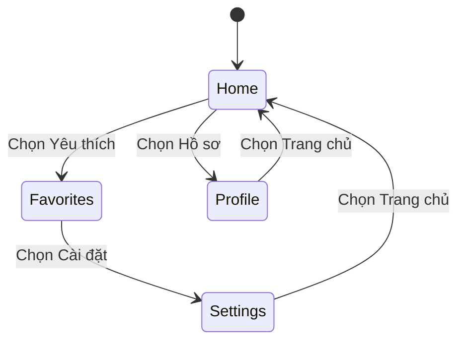
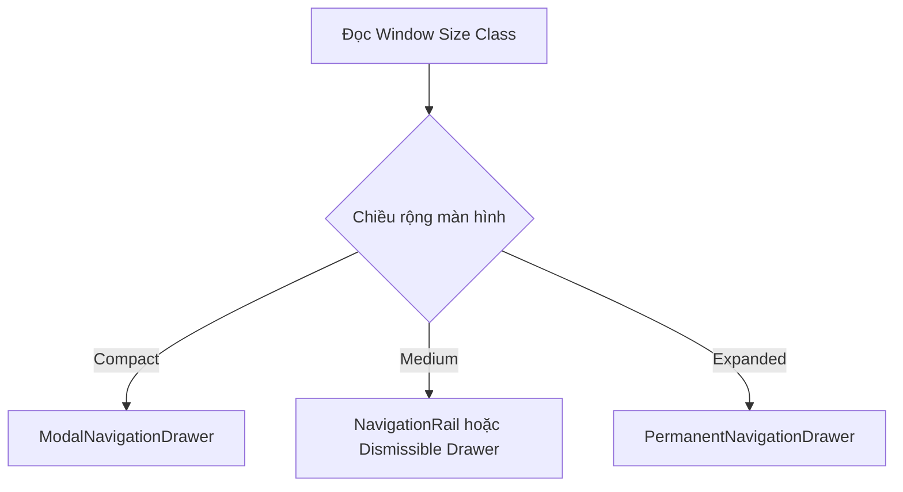
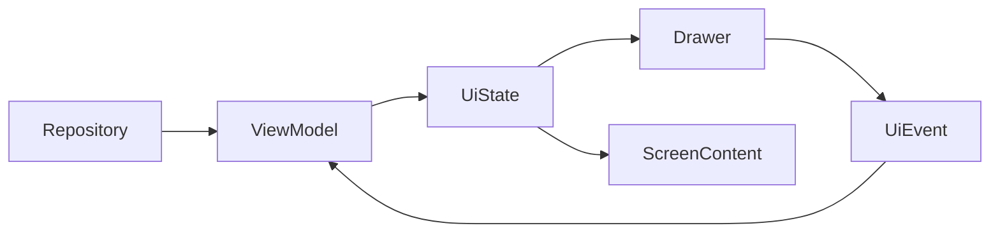
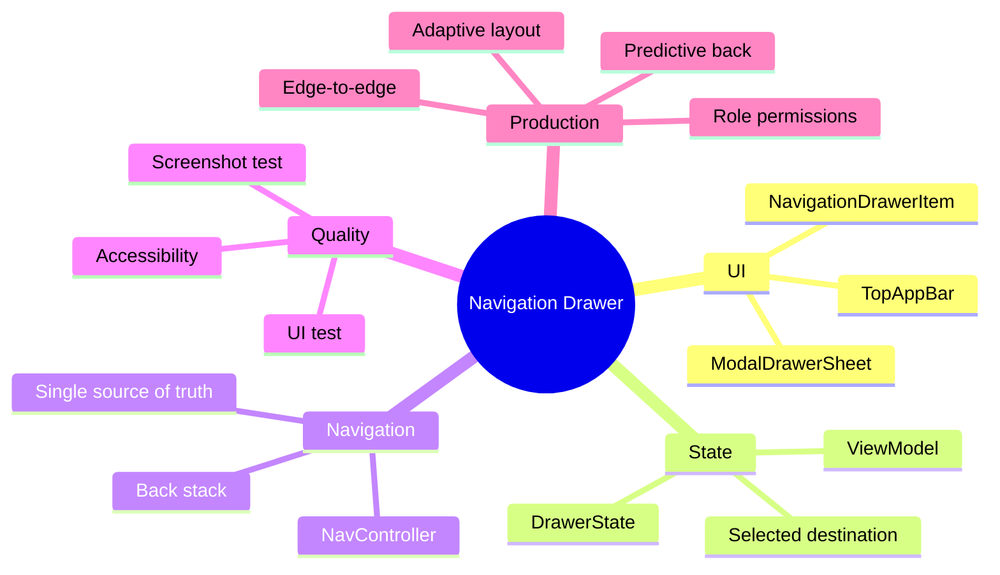

# 017 - Drawer trong Android

**Học phần:** 02 - App Components and User Interface
**Module:** Module 04 - Interface and Navigation
**Nhóm nội dung:** UI Elements
**Nguồn roadmap:** Interface and Navigation / UI Elements
**Loại bài:** UI
**Thứ tự trong module:** 017
**Thời lượng gợi ý:** 30 phút

---

## 1. Tóm tắt

**Drawer**, thường gọi đầy đủ là **Navigation Drawer**, là một bảng điều hướng xuất hiện từ cạnh màn hình. Nó chứa các điểm đến cấp cao như Trang chủ, Yêu thích, Hồ sơ, Cài đặt hoặc Trợ giúp.

Người dùng có thể mở Drawer bằng:

* Nhấn biểu tượng menu trên `TopAppBar`.
* Vuốt từ cạnh bắt đầu của màn hình, nếu ứng dụng bật thao tác vuốt.
* Phím điều hướng hoặc thiết bị hỗ trợ truy cập, nếu giao diện được triển khai đúng semantics.

Drawer phù hợp với ứng dụng có nhiều nhóm nội dung, nhiều chức năng cấp cao hoặc cần đặt phần quản lý tài khoản và cài đặt ở một khu vực chung. Material Design phân biệt hai kiểu chính: **modal drawer** phủ lên nội dung và **standard drawer** chia sẻ không gian với nội dung. ([Android Developers][1])


*Nguồn ảnh: [Android Developers – Navigation drawer](https://developer.android.com/develop/ui/compose/components/drawer)*

### Kết quả cần đạt

Sau bài học, anh có thể:

* Giải thích Drawer khác Navigation Bar và Navigation Rail như thế nào.
* Tạo Drawer bằng Jetpack Compose Material 3.
* Quản lý trạng thái mở, đóng và mục đang được chọn.
* Kết nối Drawer với điều hướng của ứng dụng.
* Kiểm thử thao tác mở Drawer và chuyển màn hình.
* Ghi lại screenshot và README làm sản phẩm portfolio.

### Phân bổ 30 phút

| Thời gian | Nội dung                             |
| --------: | ------------------------------------ |
|    5 phút | Hiểu khái niệm và trường hợp sử dụng |
|    5 phút | Hiểu thành phần và luồng trạng thái  |
|   12 phút | Viết ví dụ Jetpack Compose           |
|    5 phút | Kiểm thử thủ công và UI test         |
|    3 phút | Chụp screenshot, viết README         |

---

## 2. Mục tiêu học tập

### 2.1. Nhận biết khi nào nên dùng Drawer

Drawer không phải lựa chọn mặc định cho mọi ứng dụng.

| Tình huống                                    | Thành phần phù hợp            |
| --------------------------------------------- | ----------------------------- |
| 3–5 điểm đến chính trên điện thoại            | `NavigationBar`               |
| 3–7 điểm đến trên màn hình trung bình         | `NavigationRail`              |
| Nhiều điểm đến, chia thành nhiều nhóm         | Navigation Drawer             |
| Tablet hoặc desktop cần menu luôn hiển thị    | `PermanentNavigationDrawer`   |
| Menu tạm thời phủ lên nội dung điện thoại     | `ModalNavigationDrawer`       |
| Menu có thể mở ra và làm nội dung dịch chuyển | `DismissibleNavigationDrawer` |

Android khuyến nghị Navigation Bar cho khoảng ba đến năm điểm đến cùng cấp trên thiết bị nhỏ. Drawer chứa được nhiều điểm đến hơn, nhưng có thể kém thuận tiện trên điện thoại vì người dùng thường phải với tay lên App Bar để mở nó. Trên màn hình lớn, Navigation Rail hoặc Drawer cố định thường cân bằng và dễ thao tác hơn. ([Android Developers][2])


*Nguồn ảnh: [Android Developers – Layouts and navigation patterns](https://developer.android.com/design/ui/mobile/guides/layout-and-content/layout-and-nav-patterns)*

### 2.2. Mục tiêu kỹ thuật

Sau phần thực hành, ứng dụng cần có:

* Một nút menu trên `TopAppBar`.
* Drawer chứa ít nhất ba điểm đến.
* Một mục đang chọn có trạng thái hiển thị rõ ràng.
* Nhấn một mục sẽ cập nhật nội dung chính.
* Drawer tự đóng sau khi chọn mục.
* Trạng thái màn hình được bảo toàn khi giao diện được tạo lại.
* Nội dung mô tả phù hợp cho TalkBack.
* Một UI test xác minh luồng mở menu và chọn mục.

---

## 3. Khái niệm chính


*Nguồn ảnh: [Android Developers – Detailed navigation drawer](https://developer.android.com/develop/ui/compose/components/drawer)*

### 3.1. Cấu trúc của Navigation Drawer

Một Drawer thường gồm:

```text
Navigation Drawer
├── Header
│   ├── Avatar
│   ├── Tên người dùng
│   └── Email hoặc thông tin phụ
├── Nhóm điều hướng chính
│   ├── Trang chủ
│   ├── Yêu thích
│   └── Hồ sơ
├── Divider
└── Nhóm tiện ích
    ├── Cài đặt
    └── Trợ giúp
```

Không nhất thiết Drawer nào cũng cần header tài khoản. Với ứng dụng nhỏ, chỉ nên giữ các thành phần thực sự cần thiết.

### 3.2. Các thành phần Compose quan trọng

| Thành phần                 | Vai trò                                    |
| -------------------------- | ------------------------------------------ |
| `ModalNavigationDrawer`    | Container quản lý Drawer dạng modal        |
| `ModalDrawerSheet`         | Bề mặt chứa nội dung Drawer                |
| `NavigationDrawerItem`     | Một điểm đến trong Drawer                  |
| `DrawerState`              | Trạng thái mở hoặc đóng                    |
| `rememberDrawerState()`    | Tạo và ghi nhớ `DrawerState`               |
| `DrawerValue.Open`         | Drawer đang mở                             |
| `DrawerValue.Closed`       | Drawer đang đóng                           |
| `Scaffold`                 | Tổ chức Top App Bar và nội dung màn hình   |
| `rememberCoroutineScope()` | Gọi hàm `open()` và `close()` dạng suspend |

`DrawerState.open()` và `DrawerState.close()` là các hàm suspend, vì vậy thường được gọi trong coroutine. `DrawerState` cũng cung cấp các thuộc tính như `isOpen`, `isClosed`, `currentValue` và `targetValue`. ([Android Developers][3])

### 3.3. Ba dạng Drawer trong Material 3 Compose

#### Modal Navigation Drawer

```kotlin
ModalNavigationDrawer(...)
```

* Phủ lên nội dung.
* Phần nội dung phía sau bị che bởi một lớp `scrim`.
* Phù hợp nhất với thiết bị nhỏ hoặc khi menu chỉ xuất hiện tạm thời.
* Không làm thay đổi hệ lưới của phần nội dung chính. ([Android Developers][4])

#### Dismissible Navigation Drawer

```kotlin
DismissibleNavigationDrawer(...)
```

* Có thể mở hoặc đóng.
* Khi mở, Drawer tham gia vào bố cục và có thể làm nội dung dịch chuyển.
* Phù hợp với màn hình rộng hơn điện thoại thông thường. ([Android Developers][5])

#### Permanent Navigation Drawer

```kotlin
PermanentNavigationDrawer(...)
```

* Luôn hiển thị.
* Thường đặt cạnh nội dung chính.
* Thích hợp cho tablet, desktop hoặc giao diện có nhiều không gian ngang.
* Android khuyến nghị dùng modal drawer thay vì permanent drawer trên màn hình điện thoại. ([Android Developers][6])

### 3.4. Luồng hoạt động



### 3.5. Drawer state và application state

Cần phân biệt hai loại trạng thái:

| Trạng thái            | Ví dụ                                    | Nơi quản lý                                  |
| --------------------- | ---------------------------------------- | -------------------------------------------- |
| UI tạm thời           | Drawer đang mở hay đóng                  | `DrawerState`                                |
| Trạng thái điều hướng | Đang ở Home hay Profile                  | `NavController` hoặc state đã hoist          |
| Trạng thái nghiệp vụ  | Người dùng, số thông báo, quyền truy cập | `ViewModel`                                  |
| Trạng thái cần lưu    | Bộ lọc, mục đã chọn, dữ liệu nhập        | `SavedStateHandle`, database hoặc repository |

Không nên tải dữ liệu mạng trực tiếp bên trong `drawerContent`. Drawer chỉ nên hiển thị trạng thái đã được cung cấp từ `ViewModel` hoặc tầng UI state.

### 3.6. Drawer và back stack

Khi tích hợp Navigation Compose:



Nên lấy mục đang chọn từ destination hiện tại của `NavController` thay vì duy trì hai nguồn trạng thái riêng biệt. `NavController` quản lý các destination theo cấu trúc back stack dạng vào sau ra trước. ([Android Developers][7])

---

## 4. Thực hành

### 4.1. Kết quả giao diện


*Nguồn ảnh: [Android Developers – NavigationUI](https://developer.android.com/guide/navigation/integrations/ui)*

Ví dụ dưới đây tạo một ứng dụng nhỏ gồm:

* Trang chủ.
* Yêu thích.
* Hồ sơ.
* Cài đặt.
* Top App Bar có nút mở menu.
* Mục đang chọn được làm nổi bật.
* Nội dung màn hình thay đổi khi chọn một mục.
* Drawer tự động đóng sau khi điều hướng.

### 4.2. Dependency

Với dự án Jetpack Compose Material 3, cần các dependency tương ứng:

```kotlin
dependencies {
    implementation(platform(libs.androidx.compose.bom))
    implementation(libs.androidx.compose.material3)
    implementation(libs.androidx.compose.material.icons.extended)

    androidTestImplementation(platform(libs.androidx.compose.bom))
    androidTestImplementation(libs.androidx.compose.ui.test.junit4)
    debugImplementation(libs.androidx.compose.ui.test.manifest)
}
```

Nên sử dụng Compose BOM và version catalog của dự án thay vì chép một số phiên bản cố định từ bài hướng dẫn.

### 4.3. Model cho các điểm đến

```kotlin
import androidx.compose.runtime.Immutable
import androidx.compose.ui.graphics.vector.ImageVector

@Immutable
data class DrawerDestination(
    val route: String,
    val label: String,
    val icon: ImageVector
)
```

### 4.4. Ví dụ hoàn chỉnh bằng Jetpack Compose

```kotlin
import androidx.compose.foundation.layout.Arrangement
import androidx.compose.foundation.layout.Box
import androidx.compose.foundation.layout.Column
import androidx.compose.foundation.layout.Spacer
import androidx.compose.foundation.layout.fillMaxSize
import androidx.compose.foundation.layout.height
import androidx.compose.foundation.layout.padding
import androidx.compose.foundation.layout.widthIn
import androidx.compose.material.icons.Icons
import androidx.compose.material.icons.outlined.FavoriteBorder
import androidx.compose.material.icons.outlined.Home
import androidx.compose.material.icons.outlined.Menu
import androidx.compose.material.icons.outlined.Person
import androidx.compose.material.icons.outlined.Settings
import androidx.compose.material3.DrawerValue
import androidx.compose.material3.ExperimentalMaterial3Api
import androidx.compose.material3.HorizontalDivider
import androidx.compose.material3.Icon
import androidx.compose.material3.IconButton
import androidx.compose.material3.MaterialTheme
import androidx.compose.material3.ModalDrawerSheet
import androidx.compose.material3.ModalNavigationDrawer
import androidx.compose.material3.NavigationDrawerItem
import androidx.compose.material3.NavigationDrawerItemDefaults
import androidx.compose.material3.Scaffold
import androidx.compose.material3.Text
import androidx.compose.material3.TopAppBar
import androidx.compose.material3.rememberDrawerState
import androidx.compose.runtime.Composable
import androidx.compose.runtime.getValue
import androidx.compose.runtime.mutableStateOf
import androidx.compose.runtime.remember
import androidx.compose.runtime.rememberCoroutineScope
import androidx.compose.runtime.saveable.rememberSaveable
import androidx.compose.runtime.setValue
import androidx.compose.ui.Alignment
import androidx.compose.ui.Modifier
import androidx.compose.ui.graphics.vector.ImageVector
import androidx.compose.ui.unit.dp
import kotlinx.coroutines.launch

data class DrawerDestination(
    val route: String,
    val label: String,
    val icon: ImageVector
)

@OptIn(ExperimentalMaterial3Api::class)
@Composable
fun DrawerDemoScreen() {
    val drawerState = rememberDrawerState(
        initialValue = DrawerValue.Closed
    )

    val coroutineScope = rememberCoroutineScope()

    val destinations = remember {
        listOf(
            DrawerDestination(
                route = "home",
                label = "Trang chủ",
                icon = Icons.Outlined.Home
            ),
            DrawerDestination(
                route = "favorites",
                label = "Yêu thích",
                icon = Icons.Outlined.FavoriteBorder
            ),
            DrawerDestination(
                route = "profile",
                label = "Hồ sơ",
                icon = Icons.Outlined.Person
            ),
            DrawerDestination(
                route = "settings",
                label = "Cài đặt",
                icon = Icons.Outlined.Settings
            )
        )
    }

    // rememberSaveable giúp mục đang chọn tồn tại khi Activity được tạo lại.
    var selectedRoute by rememberSaveable {
        mutableStateOf("home")
    }

    val selectedDestination =
        destinations.firstOrNull { it.route == selectedRoute }
            ?: destinations.first()

    ModalNavigationDrawer(
        drawerState = drawerState,
        gesturesEnabled = true,
        drawerContent = {
            /*
             * Truyền cùng drawerState cho ModalDrawerSheet.
             * Với Material 3 mới, cách này hỗ trợ xử lý Back và
             * predictive back tốt hơn.
             */
            ModalDrawerSheet(
                drawerState = drawerState,
                modifier = Modifier.widthIn(max = 360.dp)
            ) {
                Spacer(modifier = Modifier.height(16.dp))

                Text(
                    text = "Drawer Demo",
                    style = MaterialTheme.typography.titleLarge,
                    modifier = Modifier.padding(
                        horizontal = 28.dp,
                        vertical = 12.dp
                    )
                )

                Text(
                    text = "Ứng dụng mẫu Android",
                    style = MaterialTheme.typography.bodyMedium,
                    color = MaterialTheme.colorScheme.onSurfaceVariant,
                    modifier = Modifier.padding(horizontal = 28.dp)
                )

                Spacer(modifier = Modifier.height(16.dp))
                HorizontalDivider()
                Spacer(modifier = Modifier.height(12.dp))

                Column(
                    verticalArrangement = Arrangement.spacedBy(4.dp),
                    modifier = Modifier.padding(horizontal = 12.dp)
                ) {
                    destinations.forEach { destination ->
                        NavigationDrawerItem(
                            label = {
                                Text(text = destination.label)
                            },
                            icon = {
                                /*
                                 * Icon chỉ mang tính minh họa vì label
                                 * đã mô tả đầy đủ điểm đến.
                                 */
                                Icon(
                                    imageVector = destination.icon,
                                    contentDescription = null
                                )
                            },
                            selected = destination.route == selectedRoute,
                            onClick = {
                                selectedRoute = destination.route

                                coroutineScope.launch {
                                    drawerState.close()
                                }
                            },
                            modifier = Modifier.padding(
                                NavigationDrawerItemDefaults.ItemPadding
                            )
                        )
                    }
                }
            }
        }
    ) {
        Scaffold(
            topBar = {
                TopAppBar(
                    title = {
                        Text(text = selectedDestination.label)
                    },
                    navigationIcon = {
                        IconButton(
                            onClick = {
                                coroutineScope.launch {
                                    drawerState.open()
                                }
                            }
                        ) {
                            Icon(
                                imageVector = Icons.Outlined.Menu,
                                contentDescription = "Mở menu điều hướng"
                            )
                        }
                    }
                )
            }
        ) { innerPadding ->
            Box(
                modifier = Modifier
                    .fillMaxSize()
                    .padding(innerPadding),
                contentAlignment = Alignment.Center
            ) {
                Text(
                    text = "Màn hình ${selectedDestination.label}",
                    style = MaterialTheme.typography.headlineSmall
                )
            }
        }
    }
}
```

`ModalNavigationDrawer` nhận nội dung Drawer qua `drawerContent`; `ModalDrawerSheet` tạo bề mặt Material; còn `NavigationDrawerItem` thể hiện từng điểm đến. Việc mở và đóng Drawer được điều khiển bằng `DrawerState` và coroutine. ([Android Developers][1])

Phiên bản `ModalDrawerSheet` nhận `drawerState` có khả năng xử lý thao tác Back mặc định và hỗ trợ hoạt ảnh predictive back trên các phiên bản Android phù hợp. ([Android Developers][8])

### 4.5. State change trong ví dụ

State chính là:

```kotlin
var selectedRoute by rememberSaveable {
    mutableStateOf("home")
}
```

Khi người dùng nhấn một mục:

```kotlin
selectedRoute = destination.route
```

Compose phát hiện state thay đổi và thực hiện recomposition cho:

* Tiêu đề `TopAppBar`.
* Thuộc tính `selected` của từng `NavigationDrawerItem`.
* Nội dung màn hình chính.



### 4.6. Nâng cấp để dùng Navigation Compose

Trong ứng dụng thực tế, không nên chỉ đổi `Text` như ví dụ. Mỗi item nên gọi `NavController`.

```kotlin
NavigationDrawerItem(
    label = {
        Text(destination.label)
    },
    icon = {
        Icon(
            imageVector = destination.icon,
            contentDescription = null
        )
    },
    selected = currentRoute == destination.route,
    onClick = {
        navController.navigate(destination.route) {
            launchSingleTop = true
            restoreState = true

            popUpTo(navController.graph.startDestinationId) {
                saveState = true
            }
        }

        coroutineScope.launch {
            drawerState.close()
        }
    }
)
```

Các tùy chọn có ý nghĩa:

* `launchSingleTop = true`: tránh tạo nhiều bản sao của cùng destination trên đỉnh back stack.
* `saveState = true`: lưu state của destination bị loại khỏi back stack.
* `restoreState = true`: khôi phục state khi người dùng quay lại destination.

### 4.7. Phiên bản XML và Views

Với ứng dụng dùng Views, cấu trúc thường là:

```xml
<androidx.drawerlayout.widget.DrawerLayout
    xmlns:android="http://schemas.android.com/apk/res/android"
    android:id="@+id/drawer_layout"
    android:layout_width="match_parent"
    android:layout_height="match_parent">

    <androidx.fragment.app.FragmentContainerView
        android:id="@+id/nav_host_fragment"
        android:name="androidx.navigation.fragment.NavHostFragment"
        android:layout_width="match_parent"
        android:layout_height="match_parent" />

    <com.google.android.material.navigation.NavigationView
        android:id="@+id/navigation_view"
        android:layout_width="wrap_content"
        android:layout_height="match_parent"
        android:layout_gravity="start" />

</androidx.drawerlayout.widget.DrawerLayout>
```

Trong cấu trúc này:

1. `DrawerLayout` là root.
2. `FragmentContainerView` chứa nội dung chính.
3. `NavigationView` chứa menu Drawer.
4. `android:layout_gravity="start"` đặt Drawer ở cạnh bắt đầu, hỗ trợ cả giao diện trái sang phải và phải sang trái.

Khi kết hợp `NavigationUI`, App Bar có thể tự chuyển giữa biểu tượng Drawer và biểu tượng Up tùy destination hiện tại; không cần tự quản lý `ActionBarDrawerToggle` trong trường hợp này. ([Android Developers][9])

---

## 5. Bài tập


*Nguồn ảnh: [Android Developers – Adaptive navigation](https://developer.android.com/design/ui/mobile/guides/layout-and-content/layout-and-nav-patterns)*

### Bài tập chính: Drawer cho ứng dụng ghi chú

Xây dựng một ứng dụng ghi chú với Drawer gồm:

```text
Ghi chú
├── Tất cả ghi chú
├── Yêu thích
├── Đã lưu trữ
├── Thùng rác
──────────────
Cài đặt
```

### Yêu cầu bắt buộc

* Có ít nhất năm item.
* Có icon và label cho từng item.
* Có trạng thái item đang chọn.
* Chọn item làm thay đổi nội dung.
* Drawer tự đóng sau khi chọn.
* Nút menu có `contentDescription`.
* Xoay màn hình không làm mất destination đang chọn.
* Có ít nhất một UI test.
* Chụp một screenshot khi Drawer đang mở.

### Yêu cầu nâng cao

Thêm badge hiển thị số ghi chú:

```kotlin
NavigationDrawerItem(
    label = {
        Text("Thùng rác")
    },
    badge = {
        Text("12")
    },
    selected = selectedRoute == "trash",
    onClick = {
        selectedRoute = "trash"
    }
)
```

Thêm các trạng thái dữ liệu:

```kotlin
sealed interface NotesUiState {
    data object Loading : NotesUiState

    data class Success(
        val noteCount: Int,
        val favoriteCount: Int,
        val trashCount: Int
    ) : NotesUiState

    data class Error(
        val message: String
    ) : NotesUiState
}
```

Drawer có thể lấy số lượng từ `Success`, nhưng không nên trực tiếp thực hiện truy vấn database hoặc network.

### Bài tập thích ứng màn hình

Tạo hai cách trình bày:

```text
Compact width
└── ModalNavigationDrawer

Expanded width
└── PermanentNavigationDrawer
```

Sơ đồ quyết định:



Android khuyến nghị thay đổi thành phần điều hướng theo kích thước cửa sổ thay vì giữ nguyên một Navigation Bar cho mọi thiết bị. ([Android Developers][2])

### Kiểm thử Compose UI

Ví dụ UI test cơ bản:

```kotlin
import androidx.compose.ui.test.assertIsDisplayed
import androidx.compose.ui.test.junit4.createComposeRule
import androidx.compose.ui.test.onNodeWithContentDescription
import androidx.compose.ui.test.onNodeWithText
import androidx.compose.ui.test.performClick
import org.junit.Rule
import org.junit.Test

class DrawerDemoScreenTest {

    @get:Rule
    val composeRule = createComposeRule()

    @Test
    fun openDrawer_selectProfile_showProfileScreen() {
        composeRule.setContent {
            DrawerDemoScreen()
        }

        composeRule
            .onNodeWithContentDescription("Mở menu điều hướng")
            .performClick()

        composeRule
            .onNodeWithText("Hồ sơ")
            .assertIsDisplayed()
            .performClick()

        composeRule
            .onNodeWithText("Màn hình Hồ sơ")
            .assertIsDisplayed()
    }
}
```

Khi kiểm thử điều hướng thực tế, Android khuyến nghị mô phỏng thao tác nhấn trên UI rồi xác minh destination hoặc nội dung đã hiển thị. Có thể dùng `TestNavHostController` để kiểm tra destination hiện tại. ([Android Developers][10])

### Checklist kiểm thử thủ công

| Trường hợp                | Kết quả mong đợi                        |
| ------------------------- | --------------------------------------- |
| Khởi động ứng dụng        | Drawer đóng                             |
| Nhấn nút menu             | Drawer mở                               |
| Vuốt từ cạnh màn hình     | Drawer mở nếu gestures được bật         |
| Chạm vùng scrim           | Drawer đóng                             |
| Chọn Hồ sơ                | Hiện màn hình Hồ sơ và Drawer đóng      |
| Chọn lại mục hiện tại     | Không tạo destination trùng             |
| Nhấn Back khi Drawer mở   | Drawer đóng trước                       |
| Nhấn Back khi Drawer đóng | Quay lại destination trước              |
| Xoay màn hình             | Destination hiện tại không bị mất       |
| Chuyển dark mode          | Màu Drawer vẫn dễ đọc                   |
| Tăng font scale           | Label không bị cắt bất hợp lý           |
| Bật TalkBack              | Nút menu và item được đọc đúng          |
| Dùng ngôn ngữ RTL         | Drawer xuất hiện ở cạnh bắt đầu phù hợp |

---

## 6. Checklist hoàn thành


*Nguồn ảnh: [Android Developers – Compose Preview Screenshot Testing](https://developer.android.com/studio/preview/compose-screenshot-testing)*

### Kiến thức

* [ ] Có thể định nghĩa Drawer bằng ngôn ngữ của mình.
* [ ] Phân biệt được modal, dismissible và permanent drawer.
* [ ] Biết khi nào nên dùng Navigation Bar thay cho Drawer.
* [ ] Hiểu `DrawerState`, `DrawerValue.Open` và `DrawerValue.Closed`.
* [ ] Hiểu vì sao `open()` và `close()` cần coroutine.
* [ ] Phân biệt Drawer UI state với navigation state.

### Code

* [ ] Có `ModalNavigationDrawer`.
* [ ] Có `ModalDrawerSheet`.
* [ ] Có ít nhất ba `NavigationDrawerItem`.
* [ ] Có mục đang được chọn.
* [ ] Có nút mở Drawer trên `TopAppBar`.
* [ ] Drawer đóng sau khi chọn destination.
* [ ] Không đặt logic network trực tiếp trong Drawer.
* [ ] Không duy trì hai nguồn navigation state mâu thuẫn nhau.

### Accessibility

* [ ] Nút mở Drawer có `contentDescription`.
* [ ] Label của mỗi destination rõ ràng.
* [ ] Icon trang trí dùng `contentDescription = null`.
* [ ] Item đang chọn có trạng thái selected.
* [ ] Đã kiểm thử bằng TalkBack hoặc Accessibility Scanner.
* [ ] Focus không bị mắc kẹt trong Drawer sau khi đóng.

Khi một icon chỉ minh họa cho label đã có sẵn, đặt `contentDescription = null` giúp tránh việc công cụ hỗ trợ truy cập đọc nhãn trùng lặp. ([Android Developers][11])

### Testing

* [ ] Có kiểm thử mở Drawer.
* [ ] Có kiểm thử chọn item.
* [ ] Có kiểm thử nội dung destination.
* [ ] Có kiểm thử xoay màn hình.
* [ ] Có kiểm thử dark theme.
* [ ] Có kiểm thử font scale lớn.
* [ ] Có screenshot tham chiếu hoặc screenshot thủ công.

Compose Preview Screenshot Testing có thể tạo ảnh tham chiếu, so sánh giao diện mới với ảnh đã duyệt và sinh báo cáo HTML chỉ ra phần khác biệt. Công cụ này vẫn được Android đánh dấu là experimental ở thời điểm tài liệu được cập nhật. ([Android Developers][12])

### Artifact portfolio

Cấu trúc gợi ý:

```text
drawer-demo/
├── README.md
├── screenshots/
│   ├── drawer-light.png
│   ├── drawer-dark.png
│   └── drawer-tablet.png
├── app/
│   └── src/
│       ├── main/
│       │   └── java/.../DrawerDemoScreen.kt
│       └── androidTest/
│           └── java/.../DrawerDemoScreenTest.kt
└── docs/
    └── drawer-state-flow.md
```

README nên có:

```markdown
# Android Material 3 Drawer Demo

## Chức năng

- Modal Navigation Drawer
- Bốn destination
- Lưu destination đang chọn
- Hỗ trợ dark theme
- Compose UI test

## Thành phần sử dụng

- Jetpack Compose
- Material 3
- DrawerState
- NavigationDrawerItem
- Compose UI Testing

## Kiểm thử

1. Mở Drawer từ Top App Bar.
2. Chọn Hồ sơ.
3. Xác minh Drawer đóng.
4. Xác minh màn hình Hồ sơ xuất hiện.
```

---

## 7. Ghi chú sản xuất

### 7.1. Thiết kế thích ứng


*Nguồn ảnh: [Android Developers – Adaptive navigation](https://developer.android.com/design/ui/mobile/guides/layout-and-content/layout-and-nav-patterns)*

Không nên chọn Drawer chỉ vì ứng dụng có nhiều màn hình. Trước khi triển khai, cần xem xét:

* Bao nhiêu destination thực sự là cấp cao nhất?
* Destination nào được truy cập thường xuyên?
* Ứng dụng chủ yếu chạy trên điện thoại hay tablet?
* Người dùng có cần thấy tất cả destination liên tục không?
* Các item có thể chia thành nhóm rõ ràng không?

### 7.2. Lifecycle và state

Drawer không phải là nơi sở hữu dữ liệu nghiệp vụ.

Mô hình nên là:



Ví dụ thu thập state an toàn theo lifecycle:

```kotlin
@Composable
fun MainScreen(
    viewModel: MainViewModel
) {
    val uiState by viewModel.uiState.collectAsStateWithLifecycle()

    AppDrawer(
        userName = uiState.userName,
        unreadCount = uiState.unreadCount
    )
}
```

Nên tránh:

```kotlin
@Composable
fun DrawerContent() {
    // Không nên gọi API trực tiếp tại đây.
    api.getCurrentUser()
}
```

### 7.3. Xử lý trạng thái điều hướng

Không nên duy trì đồng thời:

```kotlin
var selectedItem by remember {
    mutableStateOf("home")
}
```

và:

```kotlin
navController.currentDestination
```

nếu hai state có thể thay đổi độc lập.

Thay vào đó:

```kotlin
val backStackEntry by navController.currentBackStackEntryAsState()
val currentRoute = backStackEntry?.destination?.route

NavigationDrawerItem(
    selected = currentRoute == destination.route,
    onClick = {
        navController.navigate(destination.route)
    }
)
```

Như vậy, destination hiện tại là nguồn dữ liệu duy nhất cho trạng thái selected.

### 7.4. Predictive Back

Với Material 3 hiện đại, nên truyền cùng `drawerState` vào cả Drawer container và Drawer sheet:

```kotlin
ModalNavigationDrawer(
    drawerState = drawerState,
    drawerContent = {
        ModalDrawerSheet(
            drawerState = drawerState
        ) {
            // Drawer items
        }
    }
) {
    // Main content
}
```

Điều này hỗ trợ xử lý Back và hoạt ảnh predictive back của Drawer trên các phiên bản Android phù hợp. ([Android Developers][8])

### 7.5. Edge-to-edge và Window Insets

Khi ứng dụng target SDK 35 trở lên, edge-to-edge được áp dụng, khiến status bar và gesture navigation bar có thể trong suốt. Drawer cần được kiểm tra để đảm bảo header và item không nằm dưới system bar. ([Android Developers][13])

Các Drawer Sheet của Material 3 đã có cơ chế áp dụng inset theo chiều dọc và cạnh bắt đầu. Không nên cộng thêm nhiều lớp `statusBarsPadding()`, `safeDrawingPadding()` và padding từ `Scaffold` mà chưa kiểm tra, vì có thể tạo khoảng trống kép. ([Android Developers][14])

### 7.6. Hiệu năng

Không nên đặt trong Drawer:

* Danh sách hàng trăm item.
* Ảnh avatar kích thước quá lớn.
* Animation chạy liên tục.
* Truy vấn database trong mỗi lần recomposition.
* Tính toán phức tạp không được ghi nhớ.
* Nhiều destination không có cấu trúc nhóm.

Với danh sách menu dài, nên xem lại kiến trúc thông tin thay vì chỉ chuyển sang `LazyColumn`. Một Drawer quá dài thường là dấu hiệu hệ thống điều hướng chưa được tổ chức tốt.

### 7.7. Phân quyền

Một số destination có thể phụ thuộc vào trạng thái đăng nhập hoặc quyền người dùng:

```kotlin
val destinations = buildList {
    add(HomeDestination)

    if (uiState.isLoggedIn) {
        add(ProfileDestination)
    }

    if (uiState.isAdmin) {
        add(AdminDestination)
    }

    add(SettingsDestination)
}
```

Cần nhớ rằng ẩn item khỏi Drawer không phải cơ chế bảo mật. Destination, API và dữ liệu phía sau vẫn phải kiểm tra quyền độc lập.

### 7.8. Xử lý lỗi

Drawer không nên hiển thị lỗi kỹ thuật như:

```text
HTTP 500
NullPointerException
Room migration failed
```

Có thể sử dụng badge hoặc item hỗ trợ để chuyển người dùng đến màn hình xử lý:

```text
Đồng bộ dữ liệu    !
Tài khoản          Cần đăng nhập
Tải xuống          3 thất bại
```

Thông báo lỗi chi tiết nên nằm ở màn hình liên quan.

### 7.9. Release checklist

Trước khi phát hành:

* [ ] Kiểm thử điện thoại nhỏ.
* [ ] Kiểm thử tablet.
* [ ] Kiểm thử portrait và landscape.
* [ ] Kiểm thử dark theme.
* [ ] Kiểm thử font scale 200%.
* [ ] Kiểm thử TalkBack.
* [ ] Kiểm thử bàn phím và D-pad nếu hỗ trợ màn hình lớn.
* [ ] Kiểm thử Back và predictive back.
* [ ] Kiểm thử RTL.
* [ ] Kiểm thử người dùng chưa đăng nhập.
* [ ] Kiểm thử người dùng có các role khác nhau.
* [ ] Kiểm tra không tạo destination trùng trên back stack.
* [ ] Kiểm tra Drawer không che system bars sai cách.
* [ ] Kiểm tra analytics cho sự kiện chọn destination.
* [ ] Cập nhật screenshot trong Play Store nếu giao diện thay đổi.

---

## Tổng kết

Navigation Drawer là một thành phần điều hướng cấp cao, không chỉ là một menu trượt từ cạnh màn hình. Một triển khai tốt cần kết hợp:



Điểm quan trọng nhất:

1. Dùng Drawer khi cấu trúc điều hướng thực sự cần nó.
2. Quản lý mở và đóng bằng `DrawerState`.
3. Lấy item đang chọn từ navigation state.
4. Đóng Drawer sau khi chọn destination.
5. Tối ưu cho accessibility, edge-to-edge và predictive back.
6. Thay đổi thành phần điều hướng theo kích thước màn hình.
7. Có UI test và screenshot làm bằng chứng cho portfolio.

### Tài liệu chính thức

* [Navigation drawer trong Jetpack Compose](https://developer.android.com/develop/ui/compose/components/drawer)
* [Navigation drawer – Material Design 3](https://m3.material.io/components/navigation-drawer/overview)
* [Kết nối DrawerLayout với NavigationUI](https://developer.android.com/guide/navigation/integrations/ui)
* [Kiểm thử Navigation Compose](https://developer.android.com/guide/navigation/testing/compose)
* [Layouts and navigation patterns](https://developer.android.com/design/ui/mobile/guides/layout-and-content/layout-and-nav-patterns)
* [Compose accessibility](https://developer.android.com/develop/ui/compose/accessibility)
* [Compose Preview Screenshot Testing](https://developer.android.com/studio/preview/compose-screenshot-testing)

[1]: https://developer.android.com/develop/ui/compose/components/drawer "Navigation drawer  |  Jetpack Compose  |  Android Developers"
[2]: https://developer.android.com/design/ui/mobile/guides/layout-and-content/layout-and-nav-patterns "Layouts and navigation patterns  |  Mobile  |  Android Developers"
[3]: https://developer.android.com/develop/ui/compose/components/drawer?utm_source=chatgpt.com "Navigation drawer  |  Jetpack Compose  |  Android Developers"
[4]: https://developer.android.com/reference/kotlin/androidx/compose/material3/ModalNavigationDrawer.composable?utm_source=chatgpt.com "ModalNavigationDrawer  |  API reference  |  Android Developers"
[5]: https://developer.android.com/reference/kotlin/androidx/compose/material3/DismissibleNavigationDrawer.composable?utm_source=chatgpt.com "DismissibleNavigationDrawer  |  API reference  |  Android Developers"
[6]: https://developer.android.com/reference/kotlin/androidx/compose/material3/PermanentNavigationDrawer.composable?utm_source=chatgpt.com "PermanentNavigationDrawer  |  API reference  |  Android Developers"
[7]: https://developer.android.com/guide/navigation/backstack?utm_source=chatgpt.com "Navigation and the back stack | App architecture"
[8]: https://developer.android.com/reference/kotlin/androidx/compose/material3/ModalDrawerSheet.composable?authuser=7&utm_source=chatgpt.com "ModalDrawerSheet  |  API reference  |  Android Developers"
[9]: https://developer.android.com/guide/navigation/integrations/ui "Connect UI components to NavController using NavigationUI  |  App architecture  |  Android Developers"
[10]: https://developer.android.com/guide/navigation/testing/compose "Test Compose navigation  |  App architecture  |  Android Developers"
[11]: https://developer.android.com/develop/ui/compose/accessibility/api-defaults?authuser=6&hl=en&utm_source=chatgpt.com "API defaults  |  Jetpack Compose  |  Android Developers"
[12]: https://developer.android.com/studio/preview/compose-screenshot-testing "Compose Preview Screenshot Testing  |  Android Studio  |  Android Developers"
[13]: https://developer.android.com/develop/ui/compose/system/system-bars "About system bar protection  |  Jetpack Compose  |  Android Developers"
[14]: https://developer.android.com/develop/ui/compose/system/material-insets?utm_source=chatgpt.com "Use Material 3 insets  |  Jetpack Compose  |  Android Developers"

---

# Bài luyện tập

## Mục tiêu


## Đề bài


## Yêu cầu hoàn thành

- [ ] 
- [ ] 
- [ ] 

## Kết quả / lời giải


## Ghi chú
