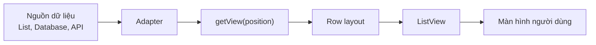
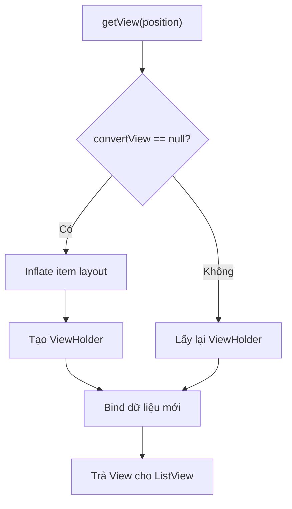
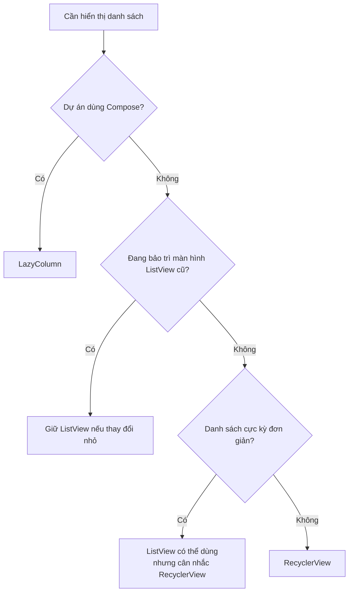
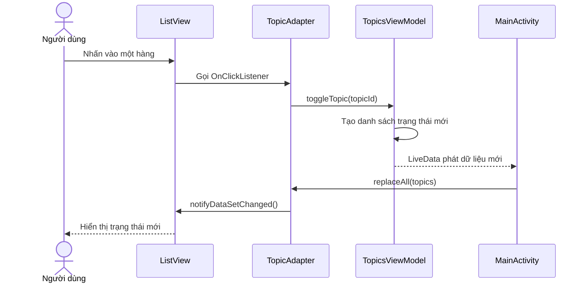
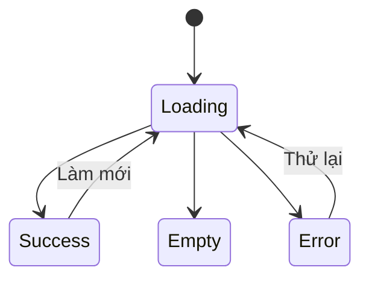
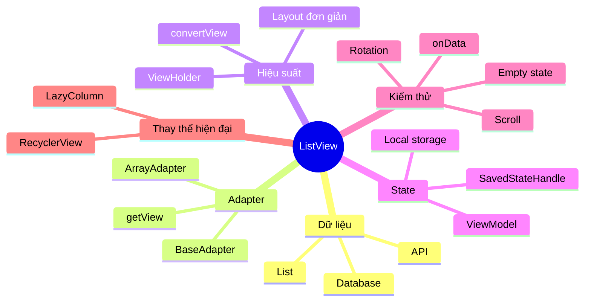

# 018 - ListView trong Android

**Học phần:** 02 - App Components and User Interface
**Module:** Module 04 - Interface and Navigation
**Nhóm nội dung:** UI Elements
**Nguồn roadmap:** Interface and Navigation / UI Elements
**Loại bài:** UI
**Thứ tự trong module:** 018
**Thời lượng gợi ý:** 30 phút

---

> [!IMPORTANT]
> `ListView` vẫn tồn tại trong Android SDK và thường xuất hiện trong các dự án cũ. Tuy nhiên, tài liệu Android hiện khuyến nghị dùng `RecyclerView` cho ứng dụng sử dụng hệ thống View và `LazyColumn` cho ứng dụng Jetpack Compose vì các giải pháp này hiện đại, linh hoạt và phù hợp hơn với danh sách phức tạp.

---

## 1. Tóm tắt


*Minh họa danh sách cuộn một cột trong Android Views.*

`ListView` là một thành phần giao diện thuộc hệ thống Android Views, dùng để hiển thị một tập hợp phần tử theo chiều dọc và cho phép người dùng cuộn qua danh sách.

Mỗi phần tử trong danh sách thường được gọi là một **row** hoặc **list item**. Dữ liệu không được thêm trực tiếp vào `ListView`; thay vào đó, một đối tượng **Adapter** chịu trách nhiệm:

1. Nhận dữ liệu từ ứng dụng.
2. Tạo hoặc tái sử dụng giao diện của từng hàng.
3. Gắn dữ liệu tương ứng vào hàng.
4. Cung cấp hàng đó cho `ListView`.

Theo tài liệu Android, `ListView` là một lớp con của `AdapterView<ListAdapter>` và hiển thị một tập hợp View có thể cuộn theo chiều dọc, trong đó mỗi View được đặt ngay bên dưới View trước đó.

### Sau bài học, anh cần hiểu

* `ListView` nằm ở đâu trong Android UI.
* Quan hệ giữa dữ liệu, `Adapter` và giao diện từng hàng.
* Cách tạo danh sách đơn giản bằng `ArrayAdapter`.
* Cách tạo giao diện hàng tùy chỉnh bằng `BaseAdapter`.
* Cách tái sử dụng `convertView` để tránh tạo View liên tục.
* Cách giữ trạng thái khi xoay màn hình.
* Cách kiểm thử danh sách bằng Espresso.
* Khi nào nên thay `ListView` bằng `RecyclerView` hoặc `LazyColumn`.

---

## 2. Mục tiêu học tập


*Ví dụ một `ListView` đơn giản với dữ liệu chuỗi.*

Sau khi hoàn thành bài này, anh có thể:

* Giải thích `ListView` bằng ngôn ngữ của mình.
* Tạo `ListView` trong tệp layout XML.
* Kết nối danh sách dữ liệu với `ListView` thông qua `Adapter`.
* Phân biệt `ArrayAdapter`, `BaseAdapter` và `RecyclerView.Adapter`.
* Tạo một hàng có nhiều thành phần như tiêu đề, trạng thái và hình ảnh.
* Thực hiện một thay đổi trạng thái và cập nhật lại danh sách.
* Giải thích vai trò của `convertView`.
* Tránh inflate một layout mới trong mọi lần gọi `getView()`.
* Giữ dữ liệu màn hình bằng `ViewModel` khi Activity được tạo lại.
* Kiểm tra thao tác trên một phần tử bằng Espresso `onData()`.
* Đưa demo, screenshot, README và checklist kiểm thử vào portfolio.

### Tiêu chí hoàn thành

Anh được xem là hoàn thành bài khi có thể trả lời:

> Dữ liệu đi qua thành phần nào trước khi được hiển thị trong `ListView`, và tại sao phải tái sử dụng `convertView`?

---

## 3. Khái niệm chính


*Danh sách tùy chỉnh có ảnh đại diện, tiêu đề và mô tả.*

### 3.1. Cấu trúc của ListView

`ListView` không tự hiểu cách biến một đối tượng Kotlin thành giao diện. Nó cần một `Adapter` đứng giữa nguồn dữ liệu và UI.



Luồng cơ bản:

```text
List<Topic>
    ↓
TopicAdapter
    ↓
getView(position)
    ↓
item_topic.xml
    ↓
ListView
```

Tài liệu Android mô tả `AdapterView` là một View có các View con được xác định bởi một `Adapter`. Adapter lấy dữ liệu từ nguồn bên ngoài và tạo View đại diện cho từng bản ghi.

---

### 3.2. Những thành phần quan trọng

| Thành phần               | Vai trò                                       |
| ------------------------ | --------------------------------------------- |
| `ListView`               | Vùng giao diện hiển thị và cuộn danh sách     |
| `Adapter`                | Cầu nối giữa dữ liệu và UI                    |
| Data source              | Danh sách, database, file hoặc dữ liệu từ API |
| Item layout              | Layout XML đại diện cho một hàng              |
| `getView()`              | Tạo hoặc tái sử dụng hàng và gắn dữ liệu      |
| `convertView`            | View cũ có thể được tái sử dụng               |
| ViewHolder               | Lưu tham chiếu đến các View con của một hàng  |
| `notifyDataSetChanged()` | Yêu cầu `ListView` đọc và vẽ lại dữ liệu      |

---

### 3.3. ArrayAdapter

`ArrayAdapter` phù hợp khi dữ liệu đơn giản, chẳng hạn danh sách chuỗi.

```kotlin
val topics = listOf(
    "TextView",
    "Button",
    "ListView",
    "RecyclerView"
)

val adapter = ArrayAdapter(
    this,
    android.R.layout.simple_list_item_1,
    topics
)

binding.topicList.adapter = adapter
```

`android.R.layout.simple_list_item_1` là layout có sẵn của Android, chứa một `TextView`.

Android cung cấp `ArrayAdapter` để tạo View cho từng đối tượng trong một tập dữ liệu. Với cấu hình mặc định, adapter gọi `toString()` trên mỗi phần tử rồi đưa kết quả vào `TextView`.

### Khi nên dùng ArrayAdapter

* Danh sách chuỗi đơn giản.
* Prototype hoặc bài thực hành.
* Menu lựa chọn nhỏ.
* Không có nhiều loại giao diện.
* Không cần animation hoặc cập nhật từng phần tử phức tạp.

---

### 3.4. Custom Adapter

Khi một hàng có nhiều thành phần, anh cần tạo adapter tùy chỉnh.

Ví dụ một hàng có:

```text
┌──────────────────────────────────────┐
│ ListView                             │
│ Trạng thái: Đã học                   │
└──────────────────────────────────────┘
```

Dữ liệu tương ứng:

```kotlin
data class Topic(
    val id: Long,
    val title: String,
    val completed: Boolean
)
```

Custom adapter chịu trách nhiệm:

```text
Topic.title     → titleText.text
Topic.completed → statusText.text
Topic.id        → xử lý sự kiện click
```

---

### 3.5. Tái sử dụng convertView

Khi cuộn, các hàng đã rời khỏi màn hình có thể được đưa trở lại adapter dưới dạng `convertView`.



Không nên viết:

```kotlin
override fun getView(
    position: Int,
    convertView: View?,
    parent: ViewGroup
): View {
    // Sai: luôn tạo một View mới.
    val row = inflater.inflate(R.layout.item_topic, parent, false)

    // Bind dữ liệu...
    return row
}
```

Nên viết theo hướng:

```kotlin
val row = convertView
    ?: inflater.inflate(R.layout.item_topic, parent, false)
```

Tài liệu hiệu suất Android cảnh báo rằng nếu `getView()` luôn inflate layout mới, ứng dụng sẽ mất lợi ích tái sử dụng View của `ListView`.

---

### 3.6. ViewHolder Pattern

ViewHolder lưu các tham chiếu như `TextView` hoặc `ImageView`, giúp tránh tìm lại View con nhiều lần.

```kotlin
private class Holder(
    val binding: ItemTopicBinding
)
```

Quy trình:

```text
Lần đầu:
inflate → tạo Holder → lưu Holder trong root.tag

Lần tái sử dụng:
convertView → lấy Holder từ tag → bind dữ liệu mới
```

> [!WARNING]
> ViewHolder của `ListView` là một pattern do lập trình viên tự triển khai. Trong `RecyclerView`, `ViewHolder` là một phần bắt buộc của kiến trúc adapter.

---

### 3.7. Cập nhật trạng thái

Khi dữ liệu thay đổi, adapter cần được thông báo:

```kotlin
items.clear()
items.addAll(newItems)
notifyDataSetChanged()
```

`notifyDataSetChanged()` làm mới toàn bộ danh sách. Điều này chấp nhận được với danh sách nhỏ, nhưng không tối ưu cho dữ liệu lớn hoặc cập nhật thường xuyên.

Với danh sách phức tạp, `RecyclerView` hỗ trợ kiến trúc linh hoạt hơn và có thể kết hợp với `DiffUtil` để xác định những phần tử thực sự thay đổi.

---

### 3.8. ListView, RecyclerView và LazyColumn

| Tiêu chí          | ListView                         | RecyclerView                 | LazyColumn            |
| ----------------- | -------------------------------- | ---------------------------- | --------------------- |
| Hệ thống UI       | Android Views                    | Android Views                | Jetpack Compose       |
| Mức độ hiện đại   | Cũ                               | Hiện đại                     | Hiện đại              |
| Hướng danh sách   | Chủ yếu dọc                      | Dọc, ngang, grid, tùy chỉnh  | Dọc                   |
| ViewHolder        | Tự triển khai                    | Bắt buộc                     | Không dùng ViewHolder |
| Diff từng phần tử | Không tích hợp tốt               | Có `DiffUtil`, `ListAdapter` | Theo state và key     |
| Animation item    | Hạn chế                          | Linh hoạt                    | Compose animation     |
| Paging            | Khó tích hợp hơn                 | Hỗ trợ tốt                   | Hỗ trợ tốt            |
| Phù hợp           | Dự án cũ, danh sách rất đơn giản | Dự án Views mới              | Dự án Compose         |

Tài liệu Android hiện gọi `RecyclerView` là lựa chọn hiện đại, linh hoạt và hiệu suất hơn cho hệ thống View. Với Compose, `LazyColumn` chỉ tạo và bố trí những item cần thiết trong vùng hiển thị.

### Cây quyết định



---

### 3.9. Lifecycle và UI state

Dữ liệu không nên chỉ được lưu trong Activity:

```kotlin
class MainActivity : AppCompatActivity() {
    // Có thể bị tạo lại khi xoay màn hình.
    private val topics = mutableListOf<Topic>()
}
```

Nên đặt trạng thái cấp màn hình trong `ViewModel`:

```kotlin
class TopicsViewModel : ViewModel() {
    private val _topics = MutableLiveData<List<Topic>>()
    val topics: LiveData<List<Topic>> = _topics
}
```

`ViewModel` giữ trạng thái qua các thay đổi cấu hình như xoay màn hình. Đối với trường hợp tiến trình ứng dụng bị hệ thống kết thúc, có thể dùng `SavedStateHandle` cho trạng thái nhỏ và dùng database hoặc local storage cho dữ liệu lớn, cần tồn tại lâu dài.

---

## 4. Thực hành: danh sách chủ đề Android


*Ví dụ danh sách dữ liệu được đưa vào `ListView` thông qua adapter.*

### 4.1. Yêu cầu demo

Xây dựng màn hình có:

* Danh sách bốn chủ đề Android.
* Trạng thái `Đã học` hoặc `Chưa học`.
* Nhấn vào một hàng để thay đổi trạng thái.
* Hiển thị số chủ đề đã hoàn thành.
* Nút đặt lại danh sách.
* Trạng thái không mất khi xoay màn hình.
* Custom adapter tái sử dụng `convertView`.

### Giao diện dự kiến

```text
┌──────────────────────────────────────┐
│ Tiến độ: 1/4 chủ đề hoàn thành      │
├──────────────────────────────────────┤
│ TextView                             │
│ Chưa học                             │
├──────────────────────────────────────┤
│ Button                               │
│ Đã học                               │
├──────────────────────────────────────┤
│ ListView                             │
│ Chưa học                             │
├──────────────────────────────────────┤
│ RecyclerView                         │
│ Chưa học                             │
├──────────────────────────────────────┤
│           ĐẶT LẠI                    │
└──────────────────────────────────────┘
```

---

### 4.2. Bật View Binding

Trong `app/build.gradle.kts`:

```kotlin
android {
    buildFeatures {
        viewBinding = true
    }
}
```

View Binding tạo lớp binding chứa tham chiếu kiểu an toàn đến các View có ID và thường được dùng để thay thế `findViewById()`.

---

### 4.3. Tạo model

Tạo `Topic.kt`:

```kotlin
package com.example.listviewdemo

data class Topic(
    val id: Long,
    val title: String,
    val completed: Boolean = false
)
```

---

### 4.4. Tạo layout màn hình

Tạo `res/layout/activity_main.xml`:

```xml
<?xml version="1.0" encoding="utf-8"?>
<LinearLayout
    xmlns:android="http://schemas.android.com/apk/res/android"
    android:layout_width="match_parent"
    android:layout_height="match_parent"
    android:orientation="vertical"
    android:padding="16dp">

    <TextView
        android:id="@+id/progressText"
        android:layout_width="match_parent"
        android:layout_height="wrap_content"
        android:paddingBottom="12dp"
        android:text="@string/progress_initial"
        android:textAppearance="?attr/textAppearanceTitleMedium" />

    <FrameLayout
        android:layout_width="match_parent"
        android:layout_height="0dp"
        android:layout_weight="1">

        <ListView
            android:id="@+id/topicList"
            android:layout_width="match_parent"
            android:layout_height="match_parent"
            android:divider="@android:color/darker_gray"
            android:dividerHeight="1dp"
            android:listSelector="?attr/selectableItemBackground" />

        <TextView
            android:id="@+id/emptyState"
            android:layout_width="match_parent"
            android:layout_height="match_parent"
            android:gravity="center"
            android:text="@string/empty_topics"
            android:textAppearance="?attr/textAppearanceBodyLarge" />

    </FrameLayout>

    <Button
        android:id="@+id/resetButton"
        android:layout_width="match_parent"
        android:layout_height="wrap_content"
        android:layout_marginTop="12dp"
        android:text="@string/reset" />

</LinearLayout>
```

---

### 4.5. Tạo layout cho một hàng

Tạo `res/layout/item_topic.xml`:

```xml
<?xml version="1.0" encoding="utf-8"?>
<LinearLayout
    xmlns:android="http://schemas.android.com/apk/res/android"
    android:layout_width="match_parent"
    android:layout_height="wrap_content"
    android:minHeight="64dp"
    android:orientation="vertical"
    android:paddingStart="16dp"
    android:paddingTop="10dp"
    android:paddingEnd="16dp"
    android:paddingBottom="10dp">

    <TextView
        android:id="@+id/titleText"
        android:layout_width="match_parent"
        android:layout_height="wrap_content"
        android:textAppearance="?attr/textAppearanceTitleMedium" />

    <TextView
        android:id="@+id/statusText"
        android:layout_width="match_parent"
        android:layout_height="wrap_content"
        android:layout_marginTop="4dp"
        android:textAppearance="?attr/textAppearanceBodyMedium" />

</LinearLayout>
```

`minHeight="64dp"` giúp toàn bộ hàng dễ nhấn hơn. Android khuyến nghị vùng tương tác cảm ứng tối thiểu khoảng `48dp × 48dp`.

---

### 4.6. Tạo string resources

Trong `res/values/strings.xml`:

```xml
<resources>
    <string name="app_name">ListView Demo</string>

    <string name="progress_initial">0/0 chủ đề hoàn thành</string>
    <string name="progress_format">%1$d/%2$d chủ đề hoàn thành</string>

    <string name="status_done">Đã học</string>
    <string name="status_not_done">Chưa học</string>

    <string name="empty_topics">Chưa có chủ đề nào</string>
    <string name="reset">Đặt lại</string>

    <string name="topic_accessibility">
        %1$s, trạng thái %2$s. Nhấn hai lần để thay đổi.
    </string>
</resources>
```

---

### 4.7. Tạo ViewModel

Tạo `TopicsViewModel.kt`:

```kotlin
package com.example.listviewdemo

import androidx.lifecycle.LiveData
import androidx.lifecycle.MutableLiveData
import androidx.lifecycle.ViewModel

class TopicsViewModel : ViewModel() {

    private val defaultTopics = listOf(
        Topic(id = 1, title = "TextView"),
        Topic(id = 2, title = "Button"),
        Topic(id = 3, title = "ListView"),
        Topic(id = 4, title = "RecyclerView")
    )

    private val _topics = MutableLiveData(defaultTopics)

    val topics: LiveData<List<Topic>> = _topics

    fun toggleTopic(topicId: Long) {
        _topics.value = _topics.value
            .orEmpty()
            .map { topic ->
                if (topic.id == topicId) {
                    topic.copy(completed = !topic.completed)
                } else {
                    topic
                }
            }
    }

    fun reset() {
        _topics.value = defaultTopics
    }
}
```

Mỗi lần cập nhật, code tạo một danh sách mới thay vì chỉnh sửa trực tiếp danh sách cũ. Điều này giúp luồng trạng thái dễ quan sát và dễ kiểm thử hơn.

---

### 4.8. Tạo custom adapter

Tạo `TopicAdapter.kt`:

```kotlin
package com.example.listviewdemo

import android.content.Context
import android.view.LayoutInflater
import android.view.View
import android.view.ViewGroup
import android.widget.BaseAdapter
import com.example.listviewdemo.databinding.ItemTopicBinding

class TopicAdapter(
    private val context: Context,
    private val onTopicClick: (topicId: Long) -> Unit
) : BaseAdapter() {

    private val items = mutableListOf<Topic>()

    fun replaceAll(newItems: List<Topic>) {
        items.clear()
        items.addAll(newItems)
        notifyDataSetChanged()
    }

    override fun getCount(): Int = items.size

    override fun getItem(position: Int): Topic = items[position]

    override fun getItemId(position: Int): Long = items[position].id

    override fun hasStableIds(): Boolean = true

    override fun getView(
        position: Int,
        convertView: View?,
        parent: ViewGroup
    ): View {
        val holder = if (convertView == null) {
            val binding = ItemTopicBinding.inflate(
                LayoutInflater.from(context),
                parent,
                false
            )

            Holder(binding).also {
                binding.root.tag = it
            }
        } else {
            convertView.tag as Holder
        }

        val topic = getItem(position)
        val binding = holder.binding

        binding.titleText.text = topic.title

        val statusResource = if (topic.completed) {
            R.string.status_done
        } else {
            R.string.status_not_done
        }

        binding.statusText.setText(statusResource)

        // Hiệu ứng đơn giản giúp người dùng nhận biết trạng thái.
        binding.root.alpha = if (topic.completed) 0.6f else 1f

        // Listener luôn được gắn với dữ liệu hiện tại,
        // không phụ thuộc vào position cũ của View tái sử dụng.
        binding.root.setOnClickListener {
            onTopicClick(topic.id)
        }

        binding.root.contentDescription = context.getString(
            R.string.topic_accessibility,
            topic.title,
            context.getString(statusResource)
        )

        return binding.root
    }

    private class Holder(
        val binding: ItemTopicBinding
    )
}
```

### Điểm quan trọng trong adapter

```kotlin
if (convertView == null) {
    // Chỉ inflate khi chưa có View để tái sử dụng.
} else {
    // Dùng lại View cũ.
}
```

ViewHolder được lưu trong:

```kotlin
binding.root.tag = holder
```

Và lấy lại bằng:

```kotlin
convertView.tag as Holder
```

---

### 4.9. Kết nối ListView trong Activity

Tạo `MainActivity.kt`:

```kotlin
package com.example.listviewdemo

import android.os.Bundle
import androidx.activity.viewModels
import androidx.appcompat.app.AppCompatActivity
import com.example.listviewdemo.databinding.ActivityMainBinding

class MainActivity : AppCompatActivity() {

    private lateinit var binding: ActivityMainBinding

    private val viewModel: TopicsViewModel by viewModels()

    private lateinit var topicAdapter: TopicAdapter

    override fun onCreate(savedInstanceState: Bundle?) {
        super.onCreate(savedInstanceState)

        binding = ActivityMainBinding.inflate(layoutInflater)
        setContentView(binding.root)

        setupList()
        observeState()
        setupActions()
    }

    private fun setupList() {
        topicAdapter = TopicAdapter(
            context = this,
            onTopicClick = viewModel::toggleTopic
        )

        binding.topicList.adapter = topicAdapter

        // Empty view tự động xuất hiện khi adapter không có phần tử.
        binding.topicList.emptyView = binding.emptyState
    }

    private fun observeState() {
        viewModel.topics.observe(this) { topics ->
            topicAdapter.replaceAll(topics)

            val completedCount = topics.count { it.completed }

            binding.progressText.text = getString(
                R.string.progress_format,
                completedCount,
                topics.size
            )
        }
    }

    private fun setupActions() {
        binding.resetButton.setOnClickListener {
            viewModel.reset()
        }
    }
}
```

---

### 4.10. Luồng cập nhật trạng thái



---

### 4.11. Kiểm tra xoay màn hình

Thực hiện:

1. Nhấn vào hai chủ đề.
2. Xác nhận tiến độ hiển thị `2/4`.
3. Xoay thiết bị sang ngang.
4. Kiểm tra trạng thái vẫn là `2/4`.
5. Xoay lại màn hình dọc.

Dữ liệu vẫn tồn tại vì được giữ trong `ViewModel`. Tuy nhiên, demo này chưa bảo vệ trạng thái trước **process death**. Với trạng thái nhỏ cần phục hồi sau khi tiến trình bị hệ thống kết thúc, hãy bổ sung `SavedStateHandle`.

---

## 5. Bài tập


*Ví dụ danh sách nhiều phần tử dùng trong tài liệu kiểm thử Android.*

### Bài tập 1: danh sách chuỗi cơ bản

Tạo `ListView` hiển thị:

```text
FrameLayout
LinearLayout
RelativeLayout
ConstraintLayout
RecyclerView
ListView
```

Yêu cầu:

* Dùng `ArrayAdapter`.
* Nhấn vào item thì hiển thị `Toast`.
* Không tạo layout tùy chỉnh.

---

### Bài tập 2: danh sách khóa học

Tạo model:

```kotlin
data class Course(
    val id: Long,
    val name: String,
    val durationMinutes: Int
)
```

Mỗi hàng hiển thị:

```text
ListView
30 phút
```

Yêu cầu:

* Dùng custom adapter.
* Dùng View Binding.
* Tái sử dụng `convertView`.
* Không gọi network trong `getView()`.

---

### Bài tập 3: trạng thái yêu thích

Mở rộng một item:

```kotlin
data class Course(
    val id: Long,
    val name: String,
    val favorite: Boolean
)
```

Khi nhấn vào item:

* Đảo trạng thái `favorite`.
* Thay đổi biểu tượng ngôi sao.
* Cập nhật bộ đếm yêu thích.
* Giữ trạng thái khi xoay màn hình.

---

### Bài tập 4: trạng thái màn hình

Thêm ba trạng thái:

```kotlin
sealed interface CourseUiState {
    data object Loading : CourseUiState
    data class Success(val courses: List<Course>) : CourseUiState
    data object Empty : CourseUiState
    data class Error(val message: String) : CourseUiState
}
```

Thiết kế UI cho:

* Đang tải.
* Có dữ liệu.
* Không có dữ liệu.
* Tải thất bại.
* Nút thử lại.

---

### Bài tập 5: tìm lỗi tái sử dụng View

Tạo một danh sách có trạng thái màu:

```text
Hoàn thành → màu xanh
Chưa hoàn thành → màu mặc định
```

Cố tình chỉ đặt màu cho item đã hoàn thành:

```kotlin
if (item.completed) {
    binding.root.setBackgroundColor(Color.GREEN)
}
```

Cuộn lên xuống và quan sát lỗi màu xuất hiện ở item khác.

Sửa bằng cách luôn bind cả hai trạng thái:

```kotlin
binding.root.setBackgroundColor(
    if (item.completed) {
        Color.GREEN
    } else {
        Color.TRANSPARENT
    }
)
```

> [!TIP]
> Với View được tái sử dụng, mọi thuộc tính có thể thay đổi như text, màu, visibility, alpha, enabled và checked đều phải được gán lại trong mỗi lần bind.

---

### Bài tập nâng cao: chuyển sang RecyclerView

Chuyển demo sang:

```text
ListView + BaseAdapter
        ↓
RecyclerView + ListAdapter + DiffUtil
```

So sánh:

* Số dòng code.
* Cách tạo ViewHolder.
* Cách cập nhật một item.
* Animation khi trạng thái thay đổi.
* Khả năng hiển thị nhiều loại item.

---

## 6. Checklist hoàn thành


*Espresso có thể chọn dữ liệu của một hàng rồi thao tác trên View con cụ thể.*

### Kiến thức

* [ ] Giải thích được `ListView` là gì.
* [ ] Biết `ListView` thuộc `AdapterView`.
* [ ] Giải thích được vai trò của `Adapter`.
* [ ] Phân biệt được data source và item layout.
* [ ] Biết khi nào dùng `ArrayAdapter`.
* [ ] Biết khi nào cần custom adapter.
* [ ] Giải thích được `convertView`.
* [ ] Giải thích được ViewHolder pattern.
* [ ] Biết vì sao không nên luôn inflate layout mới.
* [ ] Phân biệt được `ListView`, `RecyclerView` và `LazyColumn`.

### Thực hành

* [ ] Có `ListView` trong layout XML.
* [ ] Có model dữ liệu rõ ràng.
* [ ] Có adapter kết nối dữ liệu với UI.
* [ ] Có một trạng thái thay đổi khi người dùng thao tác.
* [ ] Có gọi `notifyDataSetChanged()` sau khi dữ liệu thay đổi.
* [ ] Có tái sử dụng `convertView`.
* [ ] Không thực hiện tác vụ nặng trong `getView()`.
* [ ] Có empty state.
* [ ] Có trạng thái lỗi hoặc ghi chú cách xử lý lỗi.
* [ ] Trạng thái không mất khi xoay màn hình.

### Khả năng tiếp cận

* [ ] Hàng có vùng nhấn tối thiểu khoảng `48dp`.
* [ ] Nội dung chữ có độ tương phản phù hợp.
* [ ] Hình ảnh mang ý nghĩa có `contentDescription`.
* [ ] Hình ảnh trang trí không được đọc thừa bởi TalkBack.
* [ ] Mỗi hàng có mô tả riêng.
* [ ] Có kiểm thử với kích thước chữ lớn.
* [ ] Không chỉ dùng màu sắc để biểu thị trạng thái.

### Kiểm thử

* [ ] Kiểm thử danh sách rỗng.
* [ ] Kiểm thử một phần tử.
* [ ] Kiểm thử danh sách dài.
* [ ] Kiểm thử cuộn nhanh.
* [ ] Kiểm thử nhấn item.
* [ ] Kiểm thử xoay màn hình.
* [ ] Kiểm thử trạng thái sau khi background và foreground.
* [ ] Kiểm thử TalkBack.
* [ ] Kiểm tra không có item hiển thị sai do View recycling.

### Portfolio

* [ ] Có screenshot màn hình.
* [ ] Có GIF hoặc video thao tác.
* [ ] Có README mô tả kiến trúc.
* [ ] Có sơ đồ Data → Adapter → ListView.
* [ ] Có checklist kiểm thử.
* [ ] Có ghi chú vì sao demo dùng `ListView`.
* [ ] Có đề xuất cách chuyển sang `RecyclerView`.

---

### Ví dụ Espresso test

Đối với `AdapterView` như `ListView`, Espresso cung cấp `onData()` để tìm phần tử dựa trên dữ liệu của adapter, kể cả khi item chưa nằm trong View hierarchy hiện tại.

```kotlin
package com.example.listviewdemo

import androidx.test.espresso.Espresso.onData
import androidx.test.espresso.Espresso.onView
import androidx.test.espresso.action.ViewActions.click
import androidx.test.espresso.assertion.ViewAssertions.matches
import androidx.test.espresso.matcher.ViewMatchers.isDisplayed
import androidx.test.espresso.matcher.ViewMatchers.withId
import androidx.test.espresso.matcher.ViewMatchers.withText
import androidx.test.ext.junit.rules.ActivityScenarioRule
import androidx.test.ext.junit.runners.AndroidJUnit4
import org.hamcrest.CoreMatchers.anything
import org.junit.Rule
import org.junit.Test
import org.junit.runner.RunWith

@RunWith(AndroidJUnit4::class)
class MainActivityTest {

    @get:Rule
    val activityRule = ActivityScenarioRule(MainActivity::class.java)

    @Test
    fun clickFirstItem_updatesProgress() {
        onData(anything())
            .inAdapterView(withId(R.id.topicList))
            .atPosition(0)
            .perform(click())

        onView(withText("1/4 chủ đề hoàn thành"))
            .check(matches(isDisplayed()))
    }
}
```

### Vì sao không chỉ dùng onView?

`ListView` chỉ đưa một số lượng item đang cần hiển thị vào View hierarchy. Một item nằm ngoài màn hình có thể chưa tồn tại dưới dạng View, vì vậy `onView()` không phải lúc nào cũng tìm thấy nó. `onData()` tìm trong dữ liệu của adapter và tự cuộn đến hàng cần thao tác.

---

## 7. Ghi chú sản xuất


*Kiểm tra độ tương phản là một phần quan trọng khi thiết kế item của danh sách.*

### 7.1. Có nên dùng ListView trong production năm 2026?

`ListView` không biến mất khỏi Android SDK, nhưng không nên là lựa chọn mặc định cho màn hình danh sách mới.

Có thể tiếp tục dùng khi:

* Đang bảo trì một ứng dụng cũ.
* Màn hình hiện có đã ổn định.
* Danh sách rất đơn giản.
* Thay đổi sang `RecyclerView` tạo ra rủi ro hồi quy lớn.
* Không cần animation, grid, paging hoặc nhiều loại hàng.

Nên dùng `RecyclerView` khi:

* Xây dựng màn hình Views mới.
* Danh sách lớn hoặc thường xuyên thay đổi.
* Có nhiều loại item.
* Cần cập nhật từng phần tử.
* Cần animation.
* Cần grid hoặc danh sách ngang.
* Cần Paging.
* Cần kéo thả hoặc vuốt để xóa.

Nên dùng `LazyColumn` khi:

* Ứng dụng đã dùng Jetpack Compose.
* Trạng thái UI được quản lý theo Compose.
* Không có yêu cầu tương thích đặc biệt với màn hình Views cũ.

Android hiện khuyến nghị `RecyclerView` thay cho `ListView` trong hệ thống View và cung cấp các lazy component cho danh sách Compose.

---

### 7.2. Không thực hiện tác vụ nặng trong getView()

Không nên thực hiện trực tiếp trong `getView()`:

```text
Gọi API
Đọc database đồng bộ
Đọc file lớn
Decode bitmap lớn
Tính toán phức tạp
Khởi tạo formatter lặp lại
Tạo object không cần thiết
```

`getView()` có thể được gọi nhiều lần khi người dùng cuộn. Công việc nặng tại đây dễ gây giật khung hình.

Nên:

* Chuẩn bị dữ liệu trước khi đưa vào adapter.
* Dùng coroutine ở ViewModel hoặc repository.
* Dùng thư viện tải ảnh có cache.
* Dùng placeholder cho hình ảnh.
* Giữ item layout nông và đơn giản.
* Tái sử dụng View.

Android cũng khuyến nghị giảm độ sâu của View hierarchy vì mỗi tầng layout có thể làm tăng chi phí đo và bố trí.

---

### 7.3. Bind đầy đủ mọi trạng thái

Do View được tái sử dụng, adapter phải luôn gán lại:

```kotlin
textView.text = ...
imageView.setImageResource(...)
statusView.isVisible = ...
root.alpha = ...
checkbox.isChecked = ...
root.isEnabled = ...
```

Không nên chỉ bind nhánh `true`:

```kotlin
// Có nguy cơ lỗi recycling.
if (item.completed) {
    binding.statusText.visibility = View.VISIBLE
}
```

Phải có nhánh ngược lại:

```kotlin
binding.statusText.visibility = if (item.completed) {
    View.VISIBLE
} else {
    View.GONE
}
```

---

### 7.4. Tránh lưu Activity trong adapter lâu hơn cần thiết

Adapter thường cần `Context` để:

* Inflate layout.
* Đọc string resource.
* Đọc màu và drawable.

Không nên:

* Lưu Activity vào singleton.
* Đưa adapter vào ViewModel.
* Để ViewModel tham chiếu `ListView`, binding hoặc Activity.

`ViewModel` có vòng đời dài hơn Activity và không nên giữ các đối tượng có thể chứa Activity context vì điều đó có thể gây rò rỉ bộ nhớ.

---

### 7.5. Xử lý network và storage

Nếu dữ liệu đến từ API hoặc database, màn hình nên có ít nhất bốn trạng thái:



Không nên chỉ để `ListView` trống khi request thất bại, vì người dùng không biết:

* Danh sách thực sự rỗng.
* Ứng dụng đang tải.
* Thiết bị mất mạng.
* Server trả lỗi.
* Database chưa sẵn sàng.

---

### 7.6. State và process death

Phân loại dữ liệu:

| Loại dữ liệu                       | Nơi lưu phù hợp                   |
| ---------------------------------- | --------------------------------- |
| Danh sách đang hiển thị tạm thời   | `ViewModel`                       |
| Bộ lọc hoặc ID đang chọn           | `SavedStateHandle`                |
| Vị trí cuộn                        | View state hoặc saved state nhỏ   |
| Dữ liệu người dùng cần tồn tại lâu | Room/DataStore                    |
| Dữ liệu lấy lại được từ server     | Repository và cache               |
| Bitmap lớn                         | Image cache, không đưa vào Bundle |

Android khuyến nghị kết hợp `ViewModel`, saved state và local storage dựa trên độ phức tạp và tuổi thọ của dữ liệu. Không nên đưa dữ liệu lớn vào saved instance state.

---

### 7.7. Accessibility

Mỗi item tương tác nên:

* Có vùng nhấn đủ lớn.
* Có text rõ ràng.
* Có độ tương phản phù hợp.
* Không chỉ dùng màu để biểu thị trạng thái.
* Có mô tả riêng nếu item chứa nội dung không thể đọc từ text.
* Hoạt động với TalkBack.
* Hoạt động khi tăng font size.
* Không cắt nội dung quan trọng.

Android khuyến nghị touch target tối thiểu `48dp × 48dp`. Với text nhỏ hơn `18sp`, tỷ lệ tương phản thường nên đạt ít nhất `4.5:1`; text lớn có thể dùng ngưỡng `3:1`.

---

### 7.8. Release checklist

Trước khi phát hành màn hình có `ListView`, kiểm tra:

```text
[ ] Danh sách rỗng
[ ] Danh sách một item
[ ] Danh sách 1.000 item
[ ] Cuộn nhanh lên xuống
[ ] Item có text rất dài
[ ] Item có text đa ngôn ngữ
[ ] Font scale 200%
[ ] Chế độ tối
[ ] Màn hình nhỏ
[ ] Tablet hoặc màn hình ngang
[ ] Xoay thiết bị
[ ] Background rồi foreground
[ ] Mất mạng
[ ] Server lỗi
[ ] Hình ảnh tải thất bại
[ ] Nhấn nhanh nhiều lần
[ ] TalkBack
[ ] Không có lỗi recycling
[ ] Không có jank khi cuộn
[ ] Không có memory leak
```

---

## 8. Lỗi thường gặp

### Lỗi 1: không đặt adapter

```kotlin
val adapter = TopicAdapter(this, ::onTopicClick)

// Thiếu:
// binding.topicList.adapter = adapter
```

Kết quả: danh sách không hiển thị.

---

### Lỗi 2: sửa dữ liệu nhưng không thông báo adapter

```kotlin
items.add(newItem)

// Thiếu:
notifyDataSetChanged()
```

Kết quả: dữ liệu đã thay đổi nhưng giao diện chưa cập nhật.

---

### Lỗi 3: luôn inflate layout mới

```kotlin
val row = inflater.inflate(R.layout.item_topic, parent, false)
```

Kết quả:

* Tạo nhiều View.
* Tăng garbage collection.
* Cuộn kém mượt.
* Tốn tài nguyên.

---

### Lỗi 4: lưu position trong listener

Không nên:

```kotlin
binding.root.setOnClickListener {
    onClick(position)
}
```

Nếu dữ liệu thay đổi, `position` có thể không còn đại diện đúng cho item.

Nên truyền ID ổn định:

```kotlin
binding.root.setOnClickListener {
    onClick(topic.id)
}
```

---

### Lỗi 5: item hiển thị trạng thái của item khác

Nguyên nhân:

* View được tái sử dụng.
* Adapter không gán lại mọi thuộc tính.

Cách sửa:

```kotlin
binding.root.alpha = if (topic.completed) 0.6f else 1f
binding.statusText.text = if (topic.completed) {
    "Đã học"
} else {
    "Chưa học"
}
```

---

### Lỗi 6: đặt ListView bên trong ScrollView

Không nên:

```xml
<ScrollView>
    <ListView />
</ScrollView>
```

Cả hai đều là thành phần cuộn dọc, nên có thể gây:

* Sai kích thước.
* Xung đột cuộn.
* Hiệu suất kém.
* Hiển thị không đủ item.

Hãy để `ListView` tự quản lý việc cuộn.

---

### Lỗi 7: item quá phức tạp

Một hàng có nhiều layout lồng nhau làm tăng chi phí measure và layout.

```text
LinearLayout
└── RelativeLayout
    └── LinearLayout
        └── FrameLayout
            └── Nội dung
```

Nên làm phẳng hierarchy:

```text
ConstraintLayout
├── ImageView
├── TextView
└── TextView
```

---

## 9. Artifact cho portfolio

### Tên dự án

```text
Android ListView State Demo
```

### README gợi ý

```markdown
# Android ListView State Demo

Ứng dụng minh họa cách sử dụng ListView với custom BaseAdapter,
ViewHolder pattern, View Binding và ViewModel.

## Chức năng

- Hiển thị danh sách chủ đề Android.
- Nhấn vào item để thay đổi trạng thái.
- Hiển thị tiến độ hoàn thành.
- Giữ trạng thái khi xoay màn hình.
- Hiển thị empty state.
- Kiểm thử item bằng Espresso onData().

## Kiến trúc

ViewModel
    ↓
LiveData<List<Topic>>
    ↓
MainActivity
    ↓
TopicAdapter
    ↓
ListView

## Kiến thức áp dụng

- ListView
- AdapterView
- BaseAdapter
- convertView
- ViewHolder pattern
- View Binding
- ViewModel
- Espresso onData

## Hướng phát triển

- Chuyển sang RecyclerView và DiffUtil.
- Lưu dữ liệu bằng Room.
- Thêm loading/error state.
- Thêm tìm kiếm và bộ lọc.
```

### Screenshot cần chụp

1. Trạng thái ban đầu.
2. Một số item đã hoàn thành.
3. Màn hình ngang.
4. Empty state.
5. Espresso test chạy thành công.

### Điểm nên giải thích khi phỏng vấn

> Em dùng `ViewModel` để giữ dữ liệu qua configuration change. Adapter tái sử dụng `convertView` và lưu binding trong ViewHolder. Khi state thay đổi, Activity nhận danh sách mới, truyền vào adapter và gọi `notifyDataSetChanged()`. Với dự án mới hoặc danh sách phức tạp hơn, em sẽ chọn `RecyclerView` hoặc `LazyColumn`.

---

## 10. Tổng kết nhanh



### Ghi nhớ

1. `ListView` hiển thị danh sách cuộn dọc.
2. `Adapter` là cầu nối giữa dữ liệu và UI.
3. `getView()` bind một phần tử dữ liệu vào một hàng.
4. Luôn tái sử dụng `convertView` khi có thể.
5. Bind lại toàn bộ trạng thái vì View được tái sử dụng.
6. Giữ trạng thái cấp màn hình trong `ViewModel`.
7. Dùng Espresso `onData()` để kiểm thử `AdapterView`.
8. Với màn hình mới, ưu tiên `RecyclerView` hoặc `LazyColumn`.

---

# Bài luyện tập

## Mục tiêu


## Đề bài


## Yêu cầu hoàn thành

- [ ] 
- [ ] 
- [ ] 

## Kết quả / lời giải


## Ghi chú
