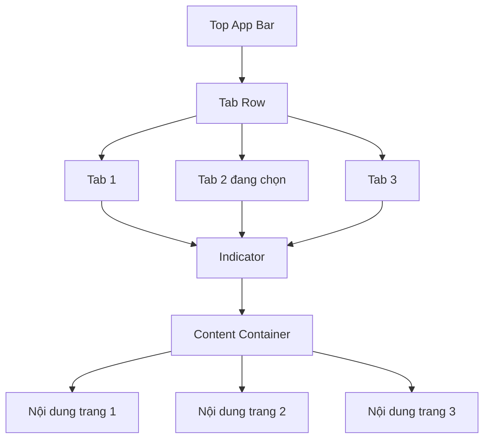
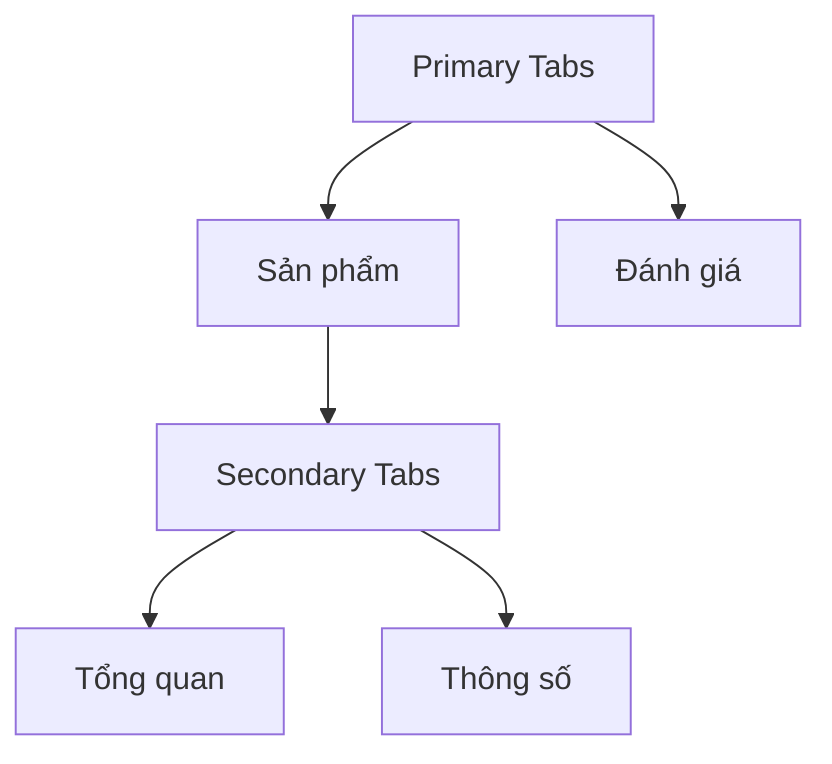
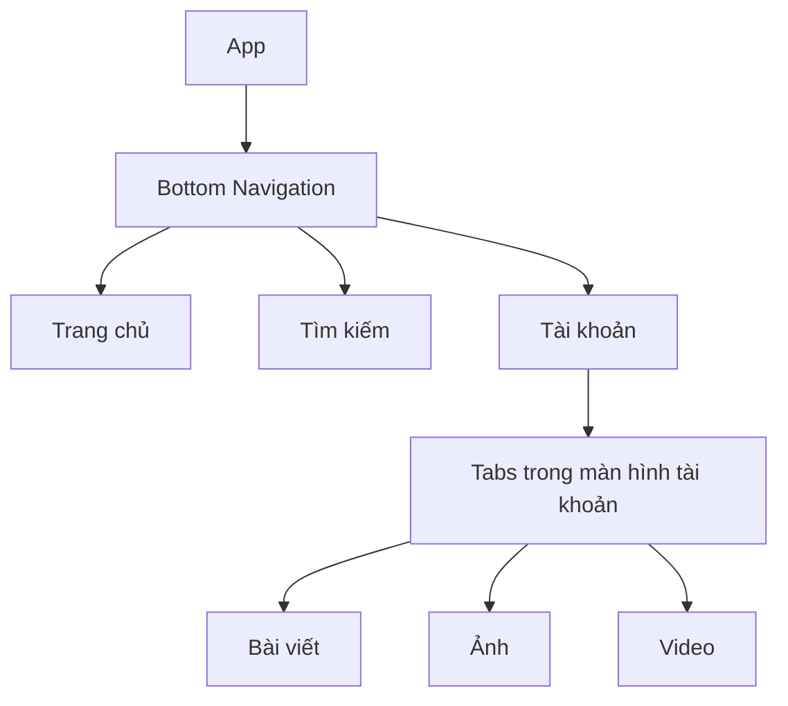
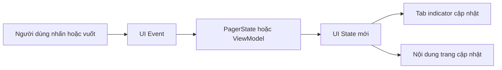
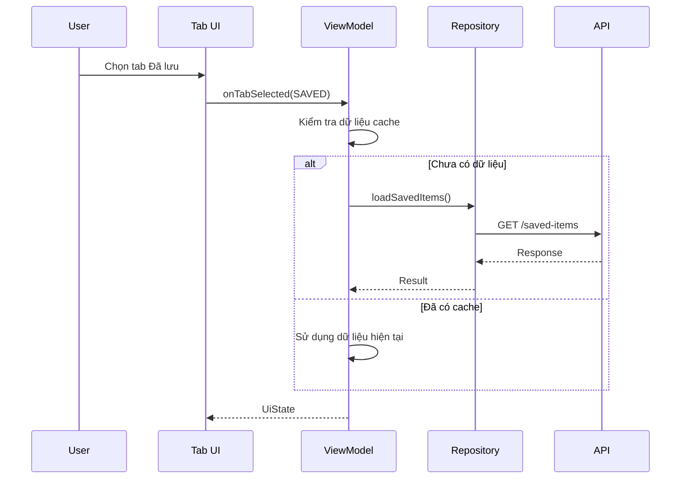
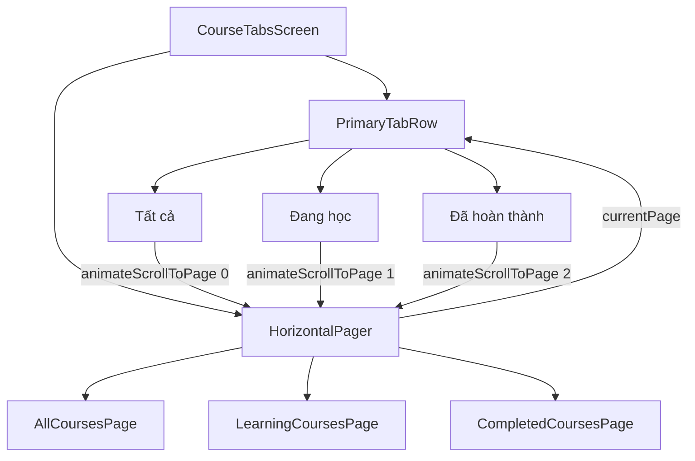
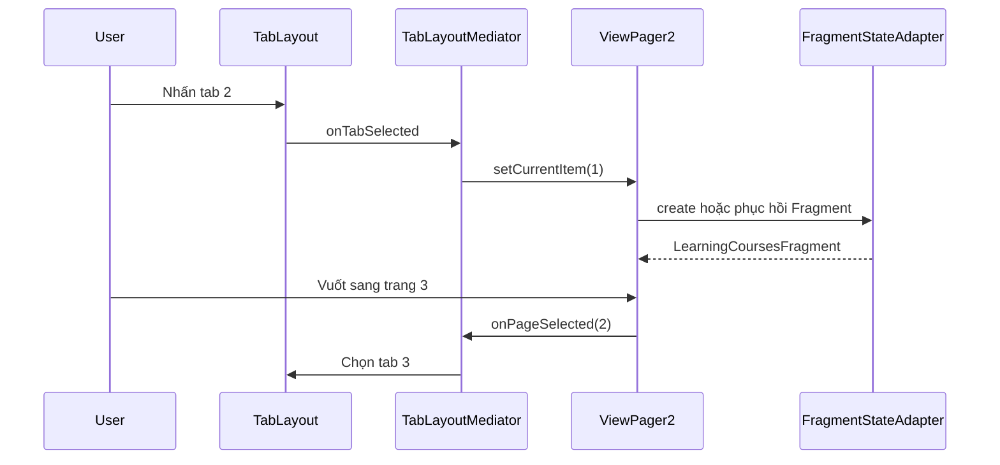
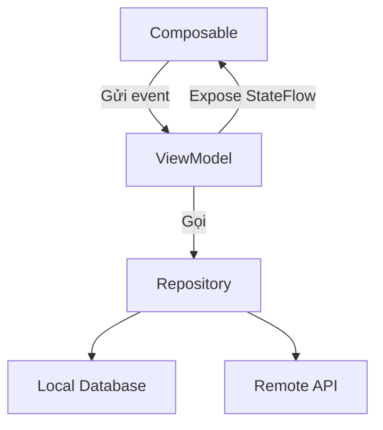
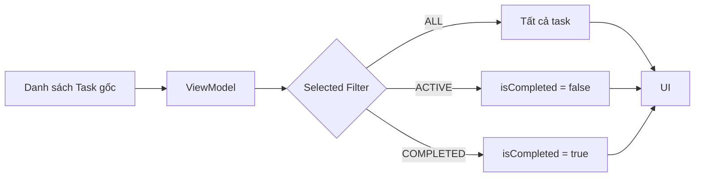
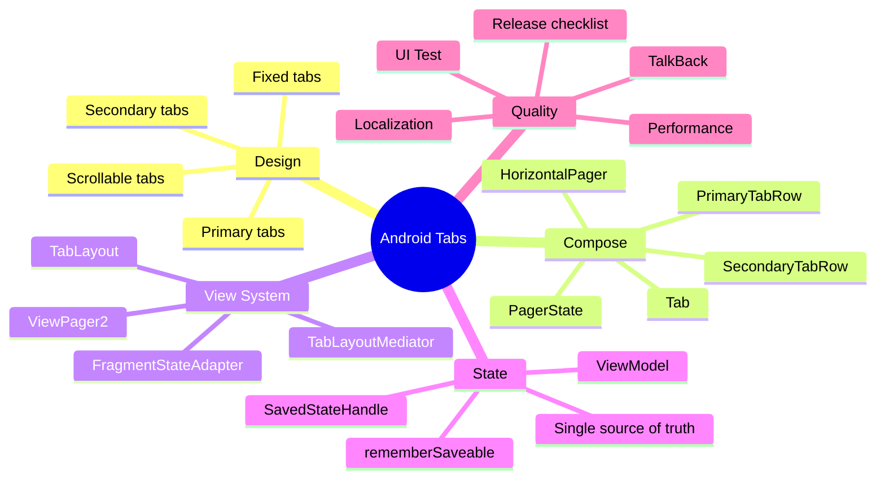

[![\[Android\] ViewPager2 and TabLayout Sample in Kotlin](https://tse3.mm.bing.net/th/id/OIP.T6YgrCsN7A7HhnPH_mARBAHaO7?r=0\&pid=Api)](https://devgeek.tistory.com/80?utm_source=chatgpt.com)

# 019 — Tabs trong Android

| Thông tin               | Nội dung                                               |
| ----------------------- | ------------------------------------------------------ |
| **Học phần**            | 02 — App Components and User Interface                 |
| **Module**              | Module 04 — Interface and Navigation                   |
| **Nhóm nội dung**       | UI Elements                                            |
| **Nguồn roadmap**       | Interface and Navigation / UI Elements                 |
| **Loại bài**            | UI                                                     |
| **Thứ tự trong module** | 019                                                    |
| **Thời lượng gợi ý**    | 30 phút                                                |
| **Mức độ**              | Cơ bản → Trung cấp                                     |
| **Công nghệ chính**     | Jetpack Compose, Material 3, `TabLayout`, `ViewPager2` |

---

## 1. Tóm tắt

**Tabs**, hay giao diện thẻ, là thành phần điều hướng cho phép người dùng chuyển nhanh giữa các nhóm nội dung có quan hệ ngang hàng.

Ví dụ trong ứng dụng nghe nhạc:

* **Bài hát**
* **Album**
* **Danh sách phát**

Khi người dùng chọn một tab, ứng dụng cần đồng thời:

1. Cập nhật trạng thái tab đang được chọn.
2. Di chuyển chỉ báo lựa chọn.
3. Hiển thị nội dung tương ứng.
4. Giữ tab và dữ liệu phù hợp khi màn hình được tạo lại.
5. Đồng bộ thao tác nhấn tab với thao tác vuốt trang.

Trong Jetpack Compose Material 3, Android cung cấp `Tab`, `PrimaryTabRow` và `SecondaryTabRow`. Với giao diện View truyền thống, mô hình thường dùng là `TabLayout + ViewPager2 + TabLayoutMediator`. ([Android Developers][1])


> **Ý chính:** Tab không chỉ là một hàng nút. Nó là sự phối hợp giữa **UI**, **state**, **navigation**, **lifecycle** và đôi khi cả **network/data loading**.

---

## 2. Mục tiêu học tập

Sau bài học, anh có thể:

* Giải thích Tabs bằng ngôn ngữ của mình.
* Phân biệt **primary tabs** và **secondary tabs**.
* Biết khi nào nên dùng tabs và khi nào nên dùng bottom navigation.
* Triển khai tabs bằng Jetpack Compose.
* Kết nối `TabLayout` với `ViewPager2` trong View System.
* Đồng bộ trạng thái giữa thao tác nhấn tab và vuốt trang.
* Tránh tải lại dữ liệu không cần thiết khi chuyển tab.
* Giữ trạng thái tab khi xoay màn hình hoặc Activity được tạo lại.
* Viết UI test kiểm tra tab được chọn và nội dung tương ứng.
* Tạo screenshot, README và source code làm artifact portfolio.


### Tiêu chí đạt bài

| Mức           | Kết quả                                                |
| ------------- | ------------------------------------------------------ |
| **Nhận biết** | Mô tả được Tabs dùng để làm gì                         |
| **Hiểu**      | Phân biệt primary, secondary, fixed và scrollable tabs |
| **Áp dụng**   | Tạo được màn hình có ít nhất ba tabs                   |
| **Phân tích** | Giải thích được state nào cần lưu                      |
| **Đánh giá**  | Nhận ra trường hợp không nên dùng tabs                 |
| **Portfolio** | Có code, screenshot, test và README ngắn               |

---

## 3. Khái niệm chính

### 3.1. Tabs là gì?

Tabs là một mẫu điều hướng dùng để chia nội dung thành các nhóm có quan hệ gần nhau. Mỗi tab thường gồm:

* Nhãn văn bản.
* Biểu tượng tùy chọn.
* Trạng thái được chọn hoặc chưa chọn.
* Indicator thể hiện tab hiện tại.
* Vùng nội dung tương ứng.

Android mô tả hai nhóm chính:

* **Primary tabs:** nằm ở đầu vùng nội dung, thường ngay dưới top app bar, dùng cho các nhóm nội dung chính.
* **Secondary tabs:** nằm bên trong một vùng nội dung để tạo thêm một cấp phân loại nhỏ hơn. ([Android Developers][1])


### 3.2. Cấu trúc của một màn hình Tabs



Một tab thường có bốn trạng thái giao diện:

| Trạng thái     | Ý nghĩa                              |
| -------------- | ------------------------------------ |
| **Selected**   | Tab hiện đang được hiển thị          |
| **Unselected** | Tab có thể chọn nhưng chưa hoạt động |
| **Pressed**    | Người dùng đang nhấn                 |
| **Disabled**   | Tab không cho phép tương tác         |

Trong Compose, tham số `selected` quyết định trạng thái trực quan; `onClick` xử lý sự kiện; `text` và `icon` cung cấp nội dung; `enabled` điều khiển khả năng tương tác. ([Android Developers][1])

---

### 3.3. Primary Tabs và Secondary Tabs

#### Primary Tabs

Dùng khi tabs là cấp phân loại chính của màn hình.

Ví dụ:

```text
Trang cá nhân
├── Bài viết
├── Ảnh
└── Video
```

#### Secondary Tabs

Dùng khi bên trong một tab chính còn cần chia nhỏ nội dung.

Ví dụ:

```text
Cửa hàng
├── Sản phẩm
│   ├── Tổng quan
│   └── Thông số
└── Đánh giá
```



> Không nên tạo nhiều cấp tabs lồng nhau vì người dùng dễ mất định hướng. Khi cấu trúc trở nên sâu, nên cân nhắc navigation graph, màn hình chi tiết hoặc bộ lọc.


---

### 3.4. Fixed Tabs và Scrollable Tabs

| Loại                 | Đặc điểm                             | Phù hợp                    |
| -------------------- | ------------------------------------ | -------------------------- |
| **Fixed tabs**       | Các tab chia đều chiều rộng màn hình | Khoảng 2–4 tab ngắn        |
| **Scrollable tabs**  | Hàng tabs có thể cuộn ngang          | Nhiều tab hoặc nhãn dài    |
| **Tabs có icon**     | Icon kết hợp nhãn                    | Nhóm nội dung dễ biểu diễn |
| **Tabs chỉ có text** | Nhẹ và dễ đọc                        | Nội dung quen thuộc        |

Với `TabLayout`, khi có nhiều trang, Android hướng dẫn đặt `tabMode="scrollable"` để tránh ép toàn bộ tabs vào cùng chiều rộng màn hình. ([Android Developers][2])

```xml
<com.google.android.material.tabs.TabLayout
    android:id="@+id/tab_layout"
    android:layout_width="match_parent"
    android:layout_height="wrap_content"
    app:tabMode="scrollable" />
```


---

### 3.5. Khi nào nên dùng Tabs?

Tabs phù hợp khi:

* Các nội dung có quan hệ ngang hàng.
* Người dùng thường xuyên chuyển qua lại.
* Số lượng nhóm tương đối ít và ổn định.
* Tên tab ngắn, dễ hiểu.
* Nội dung mỗi tab có thể hiển thị độc lập.

Ví dụ phù hợp:

* Tin nhắn: Tất cả, Chưa đọc, Đã lưu.
* Hồ sơ: Bài viết, Ảnh, Video.
* Thời tiết: Hôm nay, Theo giờ, 10 ngày.
* Thương mại điện tử: Mô tả, Thông số, Đánh giá.
* Ứng dụng học tập: Bài học, Bài tập, Tiến độ.

### 3.6. Khi nào không nên dùng Tabs?

Không nên dùng tabs khi:

* Các mục không cùng cấp độ.
* Người dùng phải hoàn thành theo thứ tự.
* Có quá nhiều mục.
* Nhãn quá dài.
* Mỗi tab đại diện cho một khu vực hoàn toàn độc lập của ứng dụng.
* Chuyển tab gây mất dữ liệu biểu mẫu.
* Nội dung cần điều hướng sâu nhiều cấp.


---

### 3.7. Tabs khác gì Bottom Navigation?

| Tabs                                               | Bottom Navigation                                |
| -------------------------------------------------- | ------------------------------------------------ |
| Phân loại nội dung trong một màn hình hoặc khu vực | Điều hướng giữa các khu vực cấp cao của ứng dụng |
| Thường nằm phía trên nội dung                      | Nằm cuối màn hình                                |
| Các trang có quan hệ gần nhau                      | Các destination có thể khá độc lập               |
| Thường hỗ trợ vuốt ngang                           | Không nhất thiết hỗ trợ vuốt                     |
| Có thể phụ thuộc cùng một ViewModel                | Thường có back stack riêng                       |

Ví dụ:

```text
Bottom Navigation
├── Trang chủ
├── Tìm kiếm
└── Tài khoản
    └── Tabs
        ├── Bài viết
        ├── Ảnh
        └── Video
```



---

### 3.8. State của Tabs

Một màn hình tabs có thể chứa nhiều loại trạng thái:

| State             | Ví dụ                             | Nơi lưu phù hợp                     |
| ----------------- | --------------------------------- | ----------------------------------- |
| UI state tạm thời | Tab đang chọn                     | `rememberSaveable` hoặc pager state |
| Screen state      | Loading, error, danh sách dữ liệu | `ViewModel`                         |
| Business state    | Bộ lọc, item yêu thích            | `ViewModel` hoặc repository         |
| Persistent state  | Dữ liệu người dùng đã lưu         | Database/DataStore                  |
| Navigation state  | Destination hiện tại              | Navigation component                |

Luồng trạng thái nên đi theo một chiều:



> Tránh tạo hai nguồn sự thật riêng biệt như `selectedTabIndex` và `pagerState.currentPage` nhưng không có cơ chế đồng bộ. Đây là nguyên nhân phổ biến khiến indicator hiển thị một tab trong khi nội dung đang ở tab khác.

---

### 3.9. Lifecycle và việc tải dữ liệu

Khi mỗi tab chứa dữ liệu từ mạng, cần tránh gọi API mỗi lần recomposition.

Mô hình nên dùng:



Nguyên tắc:

* Không gọi network trực tiếp trong `Tab`.
* Không tải dữ liệu trong mỗi lần recomposition.
* ViewModel quản lý loading, success và error.
* Repository quyết định dùng cache hay network.
* Khi request cũ không còn cần thiết, cân nhắc hủy hoặc bỏ qua kết quả.
* Mỗi tab nên có trạng thái lỗi và retry riêng nếu các nguồn dữ liệu độc lập.

---

## 4. Thực hành

### 4.1. Yêu cầu mini app

Tạo màn hình quản lý danh sách gồm ba tabs:

1. **Tất cả**
2. **Đang học**
3. **Đã hoàn thành**

Người dùng có thể:

* Nhấn tab để đổi trang.
* Vuốt ngang để chuyển tab.
* Thấy indicator đồng bộ với trang hiện tại.
* Tăng bộ đếm trong từng trang.
* Giữ tab hiện tại khi UI được tái tạo ở mức phù hợp.


---

### 4.2. Sơ đồ màn hình



`HorizontalPager` tạo các trang theo nhu cầu thay vì luôn dựng toàn bộ nội dung. `PagerState` cung cấp `currentPage`, `settledPage` và `targetPage` để theo dõi quá trình chuyển trang. ([Android Developers][3])

---

### 4.3. Phiên bản Jetpack Compose

#### Dependencies

Sử dụng Compose BOM để quản lý phiên bản đồng bộ:

```kotlin
dependencies {
    implementation(platform("androidx.compose:compose-bom:<bom-version>"))

    implementation("androidx.compose.material3:material3")
    implementation("androidx.compose.foundation:foundation")
    implementation("androidx.activity:activity-compose")
}
```

#### `CourseTabsScreen.kt`

```kotlin
package com.example.tabsdemo

import androidx.compose.foundation.layout.Arrangement
import androidx.compose.foundation.layout.Box
import androidx.compose.foundation.layout.Column
import androidx.compose.foundation.layout.fillMaxSize
import androidx.compose.foundation.layout.fillMaxWidth
import androidx.compose.foundation.layout.padding
import androidx.compose.foundation.layout.weight
import androidx.compose.foundation.pager.HorizontalPager
import androidx.compose.foundation.pager.rememberPagerState
import androidx.compose.material3.Button
import androidx.compose.material3.PrimaryTabRow
import androidx.compose.material3.Tab
import androidx.compose.material3.Text
import androidx.compose.runtime.Composable
import androidx.compose.runtime.getValue
import androidx.compose.runtime.mutableIntStateOf
import androidx.compose.runtime.rememberCoroutineScope
import androidx.compose.runtime.saveable.rememberSaveable
import androidx.compose.runtime.setValue
import androidx.compose.ui.Alignment
import androidx.compose.ui.Modifier
import androidx.compose.ui.platform.testTag
import androidx.compose.ui.text.style.TextOverflow
import androidx.compose.ui.unit.dp
import kotlinx.coroutines.launch

private data class CourseTab(
    val title: String,
    val message: String
)

@Composable
fun CourseTabsScreen(
    modifier: Modifier = Modifier
) {
    val tabs = listOf(
        CourseTab(
            title = "Tất cả",
            message = "Danh sách tất cả khóa học"
        ),
        CourseTab(
            title = "Đang học",
            message = "Các khóa học đang được tiếp tục"
        ),
        CourseTab(
            title = "Hoàn thành",
            message = "Các khóa học đã hoàn thành"
        )
    )

    val pagerState = rememberPagerState(
        initialPage = 0,
        pageCount = { tabs.size }
    )

    val coroutineScope = rememberCoroutineScope()

    Column(
        modifier = modifier.fillMaxSize()
    ) {
        PrimaryTabRow(
            selectedTabIndex = pagerState.currentPage,
            modifier = Modifier.fillMaxWidth()
        ) {
            tabs.forEachIndexed { index, item ->
                Tab(
                    selected = pagerState.currentPage == index,
                    onClick = {
                        coroutineScope.launch {
                            pagerState.animateScrollToPage(index)
                        }
                    },
                    text = {
                        Text(
                            text = item.title,
                            maxLines = 1,
                            overflow = TextOverflow.Ellipsis
                        )
                    },
                    modifier = Modifier.testTag("tab_$index")
                )
            }
        }

        HorizontalPager(
            state = pagerState,
            modifier = Modifier
                .fillMaxWidth()
                .weight(1f)
        ) { page ->
            CourseTabPage(
                tab = tabs[page],
                pageIndex = page,
                modifier = Modifier.fillMaxSize()
            )
        }
    }
}

@Composable
private fun CourseTabPage(
    tab: CourseTab,
    pageIndex: Int,
    modifier: Modifier = Modifier
) {
    /*
     * rememberSaveable giúp trạng thái UI nhỏ như bộ đếm
     * có thể được phục hồi khi Activity được tạo lại.
     *
     * Với dữ liệu nghiệp vụ hoặc dữ liệu network,
     * nên chuyển state vào ViewModel.
     */
    var openCount by rememberSaveable(pageIndex) {
        mutableIntStateOf(0)
    }

    Box(
        modifier = modifier
            .padding(24.dp)
            .testTag("page_$pageIndex"),
        contentAlignment = Alignment.Center
    ) {
        Column(
            horizontalAlignment = Alignment.CenterHorizontally,
            verticalArrangement = Arrangement.spacedBy(16.dp)
        ) {
            Text(text = tab.message)

            Text(text = "Số lần tương tác: $openCount")

            Button(
                onClick = {
                    openCount++
                }
            ) {
                Text(text = "Tăng bộ đếm")
            }
        }
    }
}
```

#### Gọi từ Activity

```kotlin
package com.example.tabsdemo

import android.os.Bundle
import androidx.activity.ComponentActivity
import androidx.activity.compose.setContent
import androidx.compose.material3.MaterialTheme
import androidx.compose.material3.Surface

class MainActivity : ComponentActivity() {

    override fun onCreate(savedInstanceState: Bundle?) {
        super.onCreate(savedInstanceState)

        setContent {
            MaterialTheme {
                Surface {
                    CourseTabsScreen()
                }
            }
        }
    }
}
```

### Vì sao code trên đồng bộ tốt?

`pagerState.currentPage` là nguồn sự thật cho cả:

* `selectedTabIndex`.
* Trạng thái `selected` của từng `Tab`.
* Trang được hiển thị bởi `HorizontalPager`.

Khi người dùng nhấn tab:

```text
Tab.onClick
→ animateScrollToPage(index)
→ pagerState.currentPage thay đổi
→ indicator cập nhật
→ pager hiển thị trang mới
```

Khi người dùng vuốt:

```text
HorizontalPager thay đổi currentPage
→ PrimaryTabRow nhận index mới
→ indicator chuyển sang tab tương ứng
```

---

### 4.4. Trường hợp chỉ cần tabs, không cần vuốt

Không phải màn hình tabs nào cũng cần `HorizontalPager`. Với nội dung nhỏ, có thể dùng một biến trạng thái và `when`.

```kotlin
@Composable
fun SimpleTabsScreen() {
    val tabs = listOf("Tổng quan", "Thông số", "Đánh giá")
    var selectedTab by rememberSaveable {
        mutableIntStateOf(0)
    }

    Column(
        modifier = Modifier.fillMaxSize()
    ) {
        PrimaryTabRow(
            selectedTabIndex = selectedTab
        ) {
            tabs.forEachIndexed { index, title ->
                Tab(
                    selected = selectedTab == index,
                    onClick = {
                        selectedTab = index
                    },
                    text = {
                        Text(title)
                    }
                )
            }
        }

        when (selectedTab) {
            0 -> Text(
                text = "Nội dung tổng quan",
                modifier = Modifier.padding(24.dp)
            )

            1 -> Text(
                text = "Nội dung thông số",
                modifier = Modifier.padding(24.dp)
            )

            2 -> Text(
                text = "Nội dung đánh giá",
                modifier = Modifier.padding(24.dp)
            )
        }
    }
}
```

Mẫu này phù hợp khi:

* Không cần vuốt ngang.
* Nội dung đơn giản.
* Không cần từng trang có back stack riêng.
* Muốn giảm độ phức tạp.

---

### 4.5. Phiên bản View System: TabLayout và ViewPager2

`ViewPager` cũ đã bị deprecated; với View System nên dùng `ViewPager2`. Android hướng dẫn kết nối `TabLayout` và `ViewPager2` bằng `TabLayoutMediator`, thành phần này đồng bộ vị trí pager với tab được chọn theo cả hai chiều. ([Android Developers][4])


#### XML layout

```xml
<?xml version="1.0" encoding="utf-8"?>
<LinearLayout
    xmlns:android="http://schemas.android.com/apk/res/android"
    xmlns:app="http://schemas.android.com/apk/res-auto"
    android:layout_width="match_parent"
    android:layout_height="match_parent"
    android:orientation="vertical">

    <com.google.android.material.tabs.TabLayout
        android:id="@+id/tabLayout"
        android:layout_width="match_parent"
        android:layout_height="wrap_content"
        app:tabMode="fixed"
        app:tabGravity="fill" />

    <androidx.viewpager2.widget.ViewPager2
        android:id="@+id/viewPager"
        android:layout_width="match_parent"
        android:layout_height="0dp"
        android:layout_weight="1" />

</LinearLayout>
```

#### Adapter

```kotlin
class CoursePagerAdapter(
    fragment: Fragment
) : FragmentStateAdapter(fragment) {

    override fun getItemCount(): Int = 3

    override fun createFragment(position: Int): Fragment {
        return when (position) {
            0 -> AllCoursesFragment()
            1 -> LearningCoursesFragment()
            2 -> CompletedCoursesFragment()

            else -> error("Vị trí tab không hợp lệ: $position")
        }
    }
}
```

#### Fragment chứa Tabs

```kotlin
class CourseContainerFragment :
    Fragment(R.layout.fragment_course_container) {

    private var mediator: TabLayoutMediator? = null

    override fun onViewCreated(
        view: View,
        savedInstanceState: Bundle?
    ) {
        super.onViewCreated(view, savedInstanceState)

        val tabLayout =
            view.findViewById<TabLayout>(R.id.tabLayout)

        val viewPager =
            view.findViewById<ViewPager2>(R.id.viewPager)

        viewPager.adapter = CoursePagerAdapter(this)

        val titles = listOf(
            "Tất cả",
            "Đang học",
            "Hoàn thành"
        )

        mediator = TabLayoutMediator(
            tabLayout,
            viewPager
        ) { tab, position ->
            tab.text = titles[position]
        }.also {
            it.attach()
        }
    }

    override fun onDestroyView() {
        mediator?.detach()
        mediator = null
        super.onDestroyView()
    }
}
```

#### Luồng hoạt động



---

### 4.6. State với ViewModel

Khi tab ảnh hưởng đến dữ liệu nghiệp vụ, nên hoist state lên ViewModel.

```kotlin
enum class CourseFilter {
    ALL,
    LEARNING,
    COMPLETED
}

data class CourseTabsUiState(
    val selectedFilter: CourseFilter = CourseFilter.ALL,
    val isLoading: Boolean = false,
    val courses: List<CourseUiModel> = emptyList(),
    val errorMessage: String? = null
)

class CourseTabsViewModel : ViewModel() {

    private val _uiState =
        MutableStateFlow(CourseTabsUiState())

    val uiState: StateFlow<CourseTabsUiState> =
        _uiState.asStateFlow()

    fun selectFilter(filter: CourseFilter) {
        _uiState.update {
            it.copy(selectedFilter = filter)
        }

        loadCoursesIfNecessary(filter)
    }

    private fun loadCoursesIfNecessary(
        filter: CourseFilter
    ) {
        // Gọi repository, kiểm tra cache,
        // cập nhật loading, success hoặc error.
    }
}
```

Phân chia trách nhiệm:



---

### 4.7. Xử lý loading, empty và error cho từng tab

Không nên chỉ hiển thị màn hình trắng khi dữ liệu chưa sẵn sàng.

```kotlin
sealed interface TabContentState {

    data object Loading : TabContentState

    data class Success(
        val items: List<CourseUiModel>
    ) : TabContentState

    data object Empty : TabContentState

    data class Error(
        val message: String
    ) : TabContentState
}
```

```kotlin
@Composable
fun TabContent(
    state: TabContentState,
    onRetry: () -> Unit
) {
    when (state) {
        TabContentState.Loading -> {
            CircularProgressIndicator()
        }

        TabContentState.Empty -> {
            Text("Chưa có khóa học")
        }

        is TabContentState.Success -> {
            CourseList(items = state.items)
        }

        is TabContentState.Error -> {
            Column {
                Text(state.message)

                Button(onClick = onRetry) {
                    Text("Thử lại")
                }
            }
        }
    }
}
```

---

## 5. Bài tập

### Bài tập chính: Tabs quản lý nhiệm vụ

Xây dựng màn hình có ba tabs:

* **Tất cả**
* **Đang làm**
* **Hoàn thành**

Mỗi nhiệm vụ gồm:

```kotlin
data class Task(
    val id: Long,
    val title: String,
    val isCompleted: Boolean
)
```


### Yêu cầu chức năng

1. Tab **Tất cả** hiển thị toàn bộ nhiệm vụ.
2. Tab **Đang làm** chỉ hiển thị nhiệm vụ chưa hoàn thành.
3. Tab **Hoàn thành** chỉ hiển thị nhiệm vụ đã hoàn thành.
4. Cho phép nhấn tab để chuyển nội dung.
5. Cho phép vuốt ngang giữa các trang.
6. Indicator phải luôn khớp với trang hiện tại.
7. Cho phép thay đổi trạng thái hoàn thành.
8. Dữ liệu phải cập nhật ở cả ba tabs.
9. Không tạo ba bản sao dữ liệu khác nhau.
10. Có empty state cho tab không có nhiệm vụ.

### Kiến trúc gợi ý



### Acceptance criteria

```gherkin
Feature: Lọc nhiệm vụ bằng tabs

  Scenario: Chuyển sang tab Hoàn thành
    Given màn hình đang ở tab Tất cả
    When người dùng chọn tab Hoàn thành
    Then tab Hoàn thành được đánh dấu selected
    And chỉ nhiệm vụ đã hoàn thành được hiển thị

  Scenario: Hoàn thành một nhiệm vụ
    Given nhiệm vụ "Học Tabs" đang ở trạng thái chưa hoàn thành
    When người dùng đánh dấu nhiệm vụ là hoàn thành
    Then nhiệm vụ biến mất khỏi tab Đang làm
    And xuất hiện trong tab Hoàn thành
```

### Bài tập nâng cao

* Thêm badge số lượng cho từng tab.
* Lưu tab hiện tại bằng `SavedStateHandle`.
* Đồng bộ tab với route trong Navigation Compose.
* Thêm deep link mở trực tiếp tab Hoàn thành.
* Thêm pull-to-refresh riêng cho từng tab.
* Thêm Paging 3 cho nội dung lớn.
* Thêm analytics event khi người dùng đổi tab.
* Kiểm tra tabs trên tablet và màn hình ngang.

---

## 6. Testing và checklist hoàn thành

### 6.1. Manual test checklist


#### Chức năng cơ bản

* [ ] Tab đầu tiên được chọn khi mở màn hình.
* [ ] Nhấn từng tab hiển thị đúng nội dung.
* [ ] Indicator nằm dưới đúng tab.
* [ ] Vuốt sang trái cập nhật tab được chọn.
* [ ] Vuốt sang phải cập nhật tab được chọn.
* [ ] Không có tình trạng indicator và nội dung lệch nhau.
* [ ] Nhấn tab hiện tại không làm mất dữ liệu.
* [ ] Chuyển tab nhanh không gây crash.

#### State và lifecycle

* [ ] Tab hiện tại không bị đặt lại ngoài ý muốn khi xoay màn hình.
* [ ] Dữ liệu nhập trong mỗi tab không biến mất ngoài ý muốn.
* [ ] Không gọi lại API sau mỗi recomposition.
* [ ] Không tạo nhiều request giống nhau khi đổi tab liên tục.
* [ ] Trạng thái loading, empty và error hiển thị đúng.
* [ ] Retry chỉ tải lại dữ liệu cần thiết.

#### Giao diện

* [ ] Nhãn tab không bị cắt khó hiểu.
* [ ] Indicator có độ tương phản đủ rõ.
* [ ] Tabs hoạt động ở light mode và dark mode.
* [ ] Tabs hiển thị đúng với ngôn ngữ có nhãn dài.
* [ ] Không có tab nằm ngoài màn hình mà người dùng không biết có thể cuộn.
* [ ] Giao diện không bị che bởi status bar hoặc cutout.

#### Accessibility

* [ ] TalkBack đọc đúng nhãn tab.
* [ ] TalkBack thông báo trạng thái selected.
* [ ] Có thể chuyển tab bằng bàn phím hoặc thiết bị hỗ trợ.
* [ ] Không chỉ dùng màu sắc để biểu thị tab được chọn.
* [ ] Touch target đủ lớn.

Android khuyến nghị vùng tương tác của thành phần UI cảm ứng đạt ít nhất `48dp × 48dp`. Các Material component thường cung cấp semantics và kích thước tương tác mặc định, nhưng custom tab cần được kiểm tra thủ công. ([Android Developers][5])

---

### 6.2. Compose UI test

Compose UI Test sử dụng semantics tree để tìm và tương tác với thành phần giao diện. ([Android Developers][6])

```kotlin
class CourseTabsScreenTest {

    @get:Rule
    val composeTestRule = createComposeRule()

    @Before
    fun setup() {
        composeTestRule.setContent {
            MaterialTheme {
                CourseTabsScreen()
            }
        }
    }

    @Test
    fun firstTab_isSelectedByDefault() {
        composeTestRule
            .onNodeWithText("Tất cả")
            .assertIsSelected()

        composeTestRule
            .onNodeWithText("Danh sách tất cả khóa học")
            .assertIsDisplayed()
    }

    @Test
    fun clickingLearningTab_displaysLearningPage() {
        composeTestRule
            .onNodeWithText("Đang học")
            .performClick()

        composeTestRule
            .onNodeWithText("Đang học")
            .assertIsSelected()

        composeTestRule
            .onNodeWithText(
                "Các khóa học đang được tiếp tục"
            )
            .assertIsDisplayed()
    }

    @Test
    fun swipingLeft_changesCurrentTab() {
        composeTestRule
            .onNodeWithTag("page_0")
            .performTouchInput {
                swipeLeft()
            }

        composeTestRule
            .onNodeWithText("Đang học")
            .assertIsSelected()
    }

    @Test
    fun clickingCounter_updatesText() {
        composeTestRule
            .onNodeWithText("Tăng bộ đếm")
            .performClick()

        composeTestRule
            .onNodeWithText("Số lần tương tác: 1")
            .assertIsDisplayed()
    }
}
```

### Dependencies cho test

```kotlin
dependencies {
    androidTestImplementation(
        platform("androidx.compose:compose-bom:<bom-version>")
    )

    androidTestImplementation(
        "androidx.compose.ui:ui-test-junit4"
    )

    debugImplementation(
        "androidx.compose.ui:ui-test-manifest"
    )
}
```

---

### 6.3. Test state với ViewModel

```kotlin
@Test
fun selectCompletedFilter_updatesSelectedFilter() = runTest {
    val viewModel = CourseTabsViewModel()

    viewModel.selectFilter(
        CourseFilter.COMPLETED
    )

    assertEquals(
        CourseFilter.COMPLETED,
        viewModel.uiState.value.selectedFilter
    )
}
```

---

### 6.4. Lỗi thường gặp

| Lỗi                               | Nguyên nhân                       | Cách xử lý                                  |
| --------------------------------- | --------------------------------- | ------------------------------------------- |
| Indicator không khớp nội dung     | Có hai selected state độc lập     | Dùng một nguồn sự thật                      |
| Vuốt trang nhưng tab không đổi    | Pager chưa liên kết với tab row   | Đọc state trực tiếp từ pager                |
| Nhấn tab nhưng trang không đổi    | Không gọi `animateScrollToPage()` | Điều khiển pager trong coroutine            |
| Mỗi tab gọi lại API liên tục      | Gọi API trong composable          | Chuyển logic sang ViewModel                 |
| Dữ liệu mất khi xoay màn hình     | State chỉ dùng `remember`         | Dùng `rememberSaveable` hoặc ViewModel      |
| Tab bị chật                       | Quá nhiều tab ở fixed mode        | Dùng scrollable tabs                        |
| Memory tăng cao                   | Giữ toàn bộ page nặng             | Dùng lazy pager, cache có giới hạn          |
| Fragment bị giữ sau khi đóng View | Mediator/listener không tháo      | `detach()` trong `onDestroyView()`          |
| Nested horizontal scroll khó dùng | Pager tranh gesture với carousel  | Thiết kế lại gesture hoặc tắt swipe phù hợp |
| Nội dung chớp khi đổi tab         | Không cache state/data            | Hoist state và dùng repository cache        |

---

### 6.5. Checklist hoàn thành bài

* [ ] Có định nghĩa ngắn gọn về Tabs.
* [ ] Phân biệt được primary và secondary tabs.
* [ ] Phân biệt được fixed và scrollable tabs.
* [ ] Biết Tabs khác bottom navigation như thế nào.
* [ ] Có ví dụ Jetpack Compose.
* [ ] Có ví dụ `TabLayout + ViewPager2`.
* [ ] Có ít nhất một state change.
* [ ] Tab và pager được đồng bộ.
* [ ] Có xử lý loading, error hoặc empty state.
* [ ] Có kiểm tra lifecycle và rotation.
* [ ] Có manual checklist.
* [ ] Có ít nhất một UI test.
* [ ] Có screenshot chạy trên emulator.
* [ ] Có README để đưa vào portfolio.

---

## 7. Ghi chú sản xuất

### 7.1. State phải có một nguồn sự thật

Không nên duy trì đồng thời:

```kotlin
var selectedTab by mutableIntStateOf(0)
val pagerState = rememberPagerState(...)
```

rồi cập nhật chúng ở những nơi khác nhau.

Thiết kế an toàn hơn:

```kotlin
val selectedTab = pagerState.currentPage
```

hoặc:

```text
Navigation destination
→ xác định selected tab
→ UI render theo destination
```


---

### 7.2. Không gọi network từ composable

Mẫu không nên dùng:

```kotlin
@Composable
fun CompletedTab() {
    api.getCompletedCourses()
}
```

Mỗi recomposition có thể khiến logic thực thi lại ngoài ý muốn.

Mẫu phù hợp hơn:

```kotlin
class CourseViewModel(
    private val repository: CourseRepository
) : ViewModel() {

    val courses = repository
        .observeCourses()
        .stateIn(
            scope = viewModelScope,
            started = SharingStarted.WhileSubscribed(5_000),
            initialValue = emptyList()
        )
}
```

---

### 7.3. Tránh tải trước quá nhiều dữ liệu

Tabs chứa video, bản đồ, biểu đồ hoặc danh sách lớn có thể tiêu thụ nhiều bộ nhớ.

Cần cân nhắc:

* Chỉ tải khi người dùng mở tab lần đầu.
* Cache kết quả đã tải.
* Không giữ bitmap độ phân giải quá lớn.
* Dừng animation hoặc media khi trang không còn hoạt động.
* Không đặt `beyondBoundsPageCount` quá cao nếu trang nặng.

`HorizontalPager` tạo và bố trí trang theo nhu cầu; có thể dùng `beyondBoundsPageCount` khi thực sự cần tải thêm các trang lân cận. ([Android Developers][3])

---

### 7.4. Mỗi tab cần có trạng thái riêng

Ví dụ:

```kotlin
data class TabDataState<T>(
    val data: T? = null,
    val isLoading: Boolean = false,
    val error: String? = null,
    val hasLoaded: Boolean = false
)
```

Điều này giúp tránh tình trạng:

* Tab A lỗi làm toàn bộ màn hình lỗi.
* Tab B loading che mất dữ liệu tab C.
* Retry một tab nhưng tải lại tất cả tabs.
* Chuyển tab làm mất nội dung đã xem.

---

### 7.5. Accessibility

Khi dùng `Tab` Material 3, component đã cung cấp vai trò và selected state phù hợp cho accessibility. Với custom tab, cần tự bổ sung semantics. Android định nghĩa role tab có trạng thái selected/unselected và hỗ trợ hành động click. ([Android Developers][7])

Ví dụ custom tab:

```kotlin
Box(
    modifier = Modifier
        .semantics {
            role = Role.Tab
            selected = isSelected
        }
        .clickable {
            onSelected()
        }
        .padding(16.dp)
) {
    Text(title)
}
```

Ngoài ra:

* Dùng nhãn ngắn và có ý nghĩa.
* Không dùng icon không có mô tả nếu icon mang thông tin.
* Kiểm tra với TalkBack.
* Hỗ trợ font scale lớn.
* Không dùng màu làm dấu hiệu selected duy nhất.
* Bảo đảm vùng tương tác phù hợp.

---

### 7.6. Localization

Nhãn tiếng Anh ngắn có thể trở nên rất dài ở ngôn ngữ khác.

Ví dụ:

```text
Saved       → Đã lưu
Recommended → Được đề xuất
Downloads   → Nội dung đã tải xuống
```

Giải pháp:

* Dùng nhãn ngắn.
* Cho phép tab cuộn ngang.
* Đặt `maxLines = 1`.
* Dùng ellipsis khi cần.
* Kiểm tra tiếng Việt, tiếng Đức và ngôn ngữ RTL.
* Không hard-code chuỗi trong Kotlin.

```kotlin
Text(
    text = stringResource(R.string.tab_completed),
    maxLines = 1,
    overflow = TextOverflow.Ellipsis
)
```

---

### 7.7. Analytics

Có thể ghi nhận sự kiện đổi tab:

```kotlin
analytics.logEvent(
    name = "course_tab_selected",
    parameters = mapOf(
        "tab_name" to selectedTab.name
    )
)
```

Không nên log trong phần render vì recomposition có thể làm event bị ghi nhiều lần.

Có thể dùng:

```kotlin
LaunchedEffect(pagerState.settledPage) {
    analytics.logTabSelected(
        tabs[pagerState.settledPage].title
    )
}
```

`settledPage` phù hợp khi cần biết trang đã kết thúc chuyển động thay vì trang đang hướng tới trong lúc animation. ([Android Developers][3])

---

### 7.8. Release checklist

Trước khi phát hành:

* [ ] Kiểm tra tab click và swipe trên thiết bị thật.
* [ ] Kiểm tra xoay dọc/ngang.
* [ ] Kiểm tra process recreation.
* [ ] Kiểm tra màn hình nhỏ.
* [ ] Kiểm tra tablet và foldable.
* [ ] Kiểm tra dark mode.
* [ ] Kiểm tra font scale 150%–200%.
* [ ] Kiểm tra TalkBack.
* [ ] Kiểm tra RTL.
* [ ] Kiểm tra mạng chậm và mất mạng.
* [ ] Kiểm tra chuyển tab nhanh.
* [ ] Kiểm tra request có bị gọi trùng không.
* [ ] Kiểm tra memory bằng Android Profiler.
* [ ] Kiểm tra crash khi danh sách tab thay đổi động.
* [ ] Chạy unit test và UI test.

---

## 8. Artifact cho portfolio

### Cấu trúc thư mục gợi ý

```text
android-tabs-demo/
├── app/
│   └── src/
│       ├── main/
│       │   └── java/com/example/tabsdemo/
│       │       ├── MainActivity.kt
│       │       ├── CourseTabsScreen.kt
│       │       └── CourseTabsViewModel.kt
│       └── androidTest/
│           └── CourseTabsScreenTest.kt
├── screenshots/
│   ├── tab-all.png
│   ├── tab-learning.png
│   └── tab-completed.png
├── docs/
│   └── tabs-state-flow.md
└── README.md
```

### README mẫu

```markdown
# Android Material 3 Tabs Demo

Ứng dụng nhỏ minh họa cách xây dựng giao diện Tabs bằng
Jetpack Compose Material 3.

## Tính năng

- PrimaryTabRow với ba tabs
- HorizontalPager hỗ trợ vuốt
- Đồng bộ tab và pager bằng một nguồn state
- Giữ UI state bằng rememberSaveable
- Compose UI Test cho click và swipe
- Loading, empty và error state mẫu

## Kiến trúc

UI Event → PagerState/ViewModel → UI State → Compose UI

## Công nghệ

- Kotlin
- Jetpack Compose
- Material 3
- Compose UI Test

## Screenshots


```

---

## 9. Tóm tắt ghi nhớ



> **Công thức thực hành:**
> **Tabs = nhãn rõ ràng + một nguồn state + nội dung đồng bộ + lifecycle an toàn + kiểm thử thao tác nhấn và vuốt.**

---

## 10. Tài liệu tham khảo

* Android Developers — Tabs trong Jetpack Compose. ([Android Developers][1])
* Android Developers — Pager trong Compose. ([Android Developers][3])
* Android Developers — Swipe views với `ViewPager2` và `TabLayout`. ([Android Developers][2])
* Android Developers — `TabLayoutMediator`. ([Android Developers][8])
* Material Design 3 — Tabs guidelines. ([Material Design][9])
* Android Developers — Accessibility và touch target. ([Android Developers][5])

[1]: https://developer.android.com/develop/ui/compose/components/tabs "Tabs  |  Jetpack Compose  |  Android Developers"
[2]: https://developer.android.com/guide/navigation/navigation-swipe-view-2 "Create swipe views with tabs using ViewPager2  |  Android Developers"
[3]: https://developer.android.com/develop/ui/compose/layouts/pager "Pager in Compose  |  Jetpack Compose  |  Android Developers"
[4]: https://developer.android.com/guide/navigation/navigation-swipe-view "Create swipe views with tabs using ViewPager  |  Android Developers"
[5]: https://developer.android.com/guide/topics/ui/accessibility/apps.html?utm_source=chatgpt.com "Make apps more accessible  |  App quality  |  Android Developers"
[6]: https://developer.android.com/develop/ui/compose/testing/semantics?hl=en&utm_source=chatgpt.com "Semantics  |  Jetpack Compose  |  Android Developers"
[7]: https://developer.android.com/develop/ui/compose/accessibility/semantics?hl=en&utm_source=chatgpt.com "Semantics  |  Jetpack Compose  |  Android Developers"
[8]: https://developer.android.com/reference/com/google/android/material/tabs/TabLayoutMediator?utm_source=chatgpt.com "TabLayoutMediator | API reference - Android Developers"
[9]: https://m3.material.io/components/tabs?utm_source=chatgpt.com "Tabs – Material Design 3"
