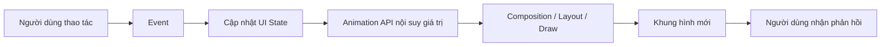
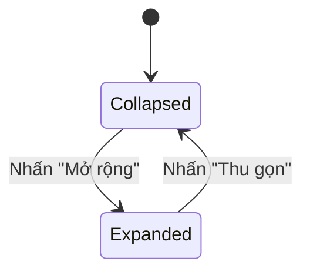
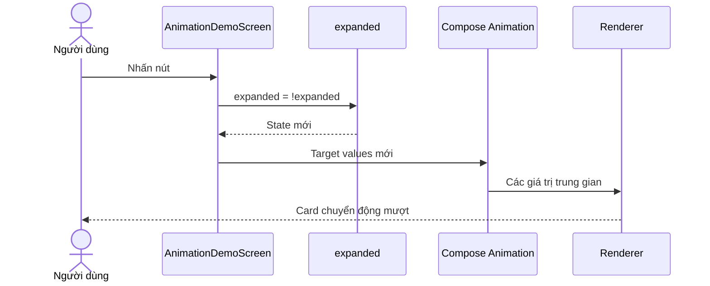
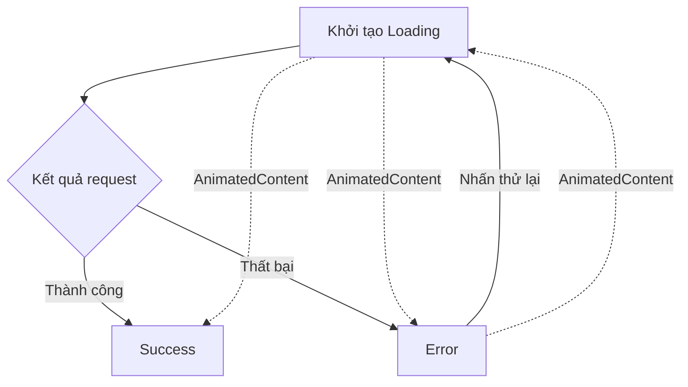
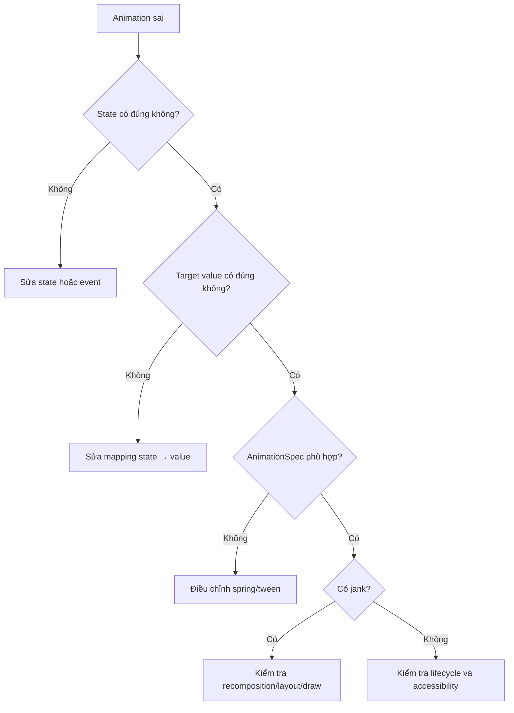

[](https://developer.android.com/develop/ui/compose/animation/choose-api?utm_source=chatgpt.com)

# 020 — Animations trong Android

| Thuộc tính              | Nội dung                               |
| ----------------------- | -------------------------------------- |
| **Học phần**            | 02 — App Components and User Interface |
| **Module**              | Module 04 — Interface and Navigation   |
| **Nhóm nội dung**       | UI Elements                            |
| **Nguồn roadmap**       | Interface and Navigation / UI Elements |
| **Loại bài**            | UI                                     |
| **Thứ tự trong module** | 020                                    |
| **Thời lượng gợi ý**    | 30 phút                                |
| **Công nghệ trọng tâm** | Jetpack Compose                        |
| **Đối chiếu**           | Android View System, MotionLayout      |

---

## 1. Tóm tắt


**Animation** là quá trình thay đổi một hoặc nhiều thuộc tính giao diện theo thời gian để người dùng hiểu rõ hơn sự chuyển đổi trạng thái của ứng dụng.

Animation tốt không chỉ làm ứng dụng “đẹp hơn”. Nó còn giúp:

* Cho biết một phần tử vừa xuất hiện, biến mất hoặc thay đổi.
* Thể hiện quan hệ giữa màn hình trước và màn hình sau.
* Phản hồi thao tác nhấn, kéo, mở rộng hoặc thu gọn.
* Giảm cảm giác thay đổi đột ngột khi dữ liệu hoặc bố cục cập nhật.
* Hướng sự chú ý của người dùng đến thành phần quan trọng.

Android cung cấp nhiều API animation khác nhau. Trong Jetpack Compose, lựa chọn phổ biến gồm `AnimatedVisibility`, `AnimatedContent`, `animate*AsState`, `updateTransition`, `Animatable`, `rememberInfiniteTransition` và các transition của Navigation Compose. Với View system, ứng dụng có thể dùng `ObjectAnimator`, `AnimatorSet`, transition framework, drawable animation hoặc `MotionLayout`. ([Android Developers][1])

> **Định nghĩa ngắn gọn:** Animation là phần trực quan hóa quá trình chuyển từ trạng thái UI hiện tại sang trạng thái UI mục tiêu.

### Vị trí của Animation trong ứng dụng



Trong Compose, state thay đổi sẽ làm những composable liên quan được recomposition. Animation API tạo ra các giá trị trung gian giữa trạng thái bắt đầu và trạng thái đích, khiến thay đổi được hiển thị thành chuyển động liên tục thay vì nhảy ngay lập tức. ([Android Developers][2])

---

## 2. Mục tiêu học tập


Sau bài học, anh có thể:

* Giải thích animation dựa trên **state**, **giá trị bắt đầu**, **giá trị mục tiêu** và **animation specification**.
* Phân biệt animation dùng để:

  * Hiện hoặc ẩn nội dung.
  * Thay đổi một thuộc tính.
  * Thay đổi nhiều thuộc tính cùng lúc.
  * Chuyển đổi giữa nhiều loại nội dung.
  * Điều khiển bằng gesture.
  * Lặp vô hạn.
* Chọn API Compose phù hợp cho từng tình huống.
* Kết nối animation với lifecycle và state restoration.
* Viết một màn hình Compose có animation.
* Kiểm thử animation bằng test clock.
* Đánh giá ảnh hưởng của animation đến UX, accessibility và hiệu năng.
* Tạo screenshot, video hoặc README để đưa vào portfolio.

Tài liệu Android Developers hiện cung cấp một decision tree riêng để lựa chọn API dựa trên loại animation, số thuộc tính, nội dung, navigation, gesture và nhu cầu lặp. ([Android Developers][1])

---

## 3. Khái niệm chính


### 3.1. Mô hình tư duy: State trước, animation sau

Không nên xem animation là nguồn dữ liệu chính của giao diện.

Thay vào đó:

```text
UI State = nguồn sự thật
Animation = cách trình bày quá trình UI State thay đổi
```

Ví dụ, một thẻ thông tin có hai trạng thái:

```kotlin
enum class CardState {
    Collapsed,
    Expanded
}
```

Từ state này, ứng dụng suy ra:

| Thuộc tính        | `Collapsed` |        `Expanded` |
| ----------------- | ----------: | ----------------: |
| Chiều cao         |         Nhỏ |               Lớn |
| Màu nền           |     Surface | Primary container |
| Độ cao            |        2 dp |              8 dp |
| Nội dung chi tiết |          Ẩn |              Hiện |
| Nhãn nút          |   “Mở rộng” |         “Thu gọn” |

Animation API chỉ nội suy giữa các giá trị trên.



### 3.2. Những thành phần của một animation

Một animation thường có các thành phần sau:

| Thành phần         | Ý nghĩa                        | Ví dụ                      |
| ------------------ | ------------------------------ | -------------------------- |
| **Initial value**  | Giá trị bắt đầu                | `0f`                       |
| **Target value**   | Giá trị cần đạt tới            | `1f`                       |
| **Animated value** | Giá trị trung gian hiện tại    | `0.47f`                    |
| **Duration**       | Thời gian chạy                 | `300 ms`                   |
| **Easing**         | Tốc độ thay đổi theo thời gian | `FastOutSlowInEasing`      |
| **AnimationSpec**  | Quy luật chuyển động           | `spring()`, `tween()`      |
| **Trigger**        | Sự kiện bắt đầu                | Click, swipe, state update |
| **Label**          | Tên dùng khi debug             | `"card-color"`             |

### 3.3. Các `AnimationSpec` phổ biến

| API                    | Đặc điểm                                  | Trường hợp sử dụng                        |
| ---------------------- | ----------------------------------------- | ----------------------------------------- |
| `spring()`             | Dựa trên vật lý, có độ nảy và vận tốc     | Chuyển động tự nhiên, có thể bị gián đoạn |
| `tween()`              | Chạy trong thời lượng cố định theo easing | Fade, đổi màu, slide                      |
| `keyframes()`          | Chỉ định giá trị tại các mốc thời gian    | Chuyển động nhiều giai đoạn               |
| `repeatable()`         | Lặp số lần xác định                       | Nhấn mạnh tạm thời                        |
| `infiniteRepeatable()` | Lặp liên tục                              | Loading, shimmer, pulse                   |
| `snap()`               | Chuyển ngay đến giá trị đích              | Tắt animation hoặc cập nhật tức thời      |

Compose sử dụng animation dựa trên spring trong nhiều trường hợp mặc định. Spring có thể tiếp tục từ vận tốc hiện tại khi giá trị mục tiêu thay đổi, trong khi `tween` phù hợp hơn khi cần kiểm soát thời lượng cụ thể. ([Android Developers][3])

### 3.4. Chọn API trong Jetpack Compose

| Nhu cầu                                 | API nên dùng                                                     |
| --------------------------------------- | ---------------------------------------------------------------- |
| Hiện hoặc ẩn composable                 | `AnimatedVisibility`                                             |
| Animate một giá trị                     | `animateFloatAsState`, `animateDpAsState`, `animateColorAsState` |
| Animate nhiều giá trị từ cùng một state | `updateTransition`                                               |
| Chuyển giữa các loại nội dung           | `AnimatedContent`                                                |
| Chuyển đổi đơn giản bằng fade           | `Crossfade`                                                      |
| Animate thay đổi kích thước nội dung    | `Modifier.animateContentSize()`                                  |
| Điều khiển thủ công hoặc theo coroutine | `Animatable`                                                     |
| Animation chạy liên tục                 | `rememberInfiniteTransition`                                     |
| Animate item trong danh sách            | `Modifier.animateItem()`                                         |
| Animation giữa các destination          | `enterTransition`, `exitTransition`                              |
| Icon vector có animation                | `AnimatedVectorDrawable`                                         |
| Animation phức tạp dựa trên artwork     | Lottie hoặc framework tương đương                                |

Android Developers khuyến nghị lựa chọn API dựa trên loại tài nguyên, việc animation có lặp hay không, số lượng thuộc tính, quan hệ giữa các thuộc tính, gesture và navigation. ([Android Developers][1])

### 3.5. Một thuộc tính và nhiều thuộc tính

#### Một thuộc tính độc lập

```kotlin
val alpha by animateFloatAsState(
    targetValue = if (visible) 1f else 0f,
    label = "content-alpha"
)
```

Phù hợp khi chỉ cần animate một giá trị đơn lẻ.

#### Nhiều thuộc tính phụ thuộc cùng state

```kotlin
val transition = updateTransition(
    targetState = expanded,
    label = "card-transition"
)

val elevation by transition.animateDp(
    label = "card-elevation"
) { isExpanded ->
    if (isExpanded) 8.dp else 2.dp
}

val cornerRadius by transition.animateDp(
    label = "card-corner"
) { isExpanded ->
    if (isExpanded) 28.dp else 16.dp
}
```

`updateTransition` giúp các thuộc tính cùng được điều khiển bởi một state và có thể được quan sát chung trong Animation Preview. ([Android Developers][4])

### 3.6. Animation trong View system

Đối với dự án XML hoặc dự án đang chuyển dần sang Compose:

| Công cụ                  | Trường hợp sử dụng                                        |
| ------------------------ | --------------------------------------------------------- |
| `ViewPropertyAnimator`   | Animate nhanh `alpha`, `translation`, `rotation`, `scale` |
| `ObjectAnimator`         | Animate một property có getter và setter                  |
| `AnimatorSet`            | Kết hợp nhiều animator                                    |
| `TransitionManager`      | Animate thay đổi giữa hai layout state                    |
| `AnimatedVectorDrawable` | Animate path hoặc thuộc tính vector                       |
| `MotionLayout`           | Chuyển động phức tạp, keyframe và gesture                 |
| `res/anim`               | Tween animation truyền thống                              |
| `res/animator`           | Property animation bằng XML                               |

`MotionLayout` là lớp con của `ConstraintLayout`, hỗ trợ transition có thể điều khiển theo tiến trình, keyframe và gesture. Nó phù hợp với chuyển động tương tác của các thành phần như app bar, button hoặc card, nhưng chỉ trực tiếp quản lý các view con của nó và không dùng cho activity transition. ([Android Developers][5])

### 3.7. Lifecycle và state

Compose có vòng đời gồm:

```text
Enter Composition
       ↓
Recompose 0..n lần
       ↓
Leave Composition
```

Khi composable rời Composition, các đối tượng lưu bằng `remember` và effect gắn với composable đó có thể bị hủy. ([Android Developers][2])

| Cách lưu state     | Phạm vi phù hợp                                                  |
| ------------------ | ---------------------------------------------------------------- |
| `remember`         | Giữ state qua recomposition                                      |
| `rememberSaveable` | State UI nhỏ cần phục hồi khi Activity hoặc process được tái tạo |
| `ViewModel`        | Screen state và business logic                                   |
| `SavedStateHandle` | Dữ liệu tối thiểu cần phục hồi cho state trong `ViewModel`       |

`rememberSaveable` phù hợp với giá trị nhỏ như trạng thái mở/đóng, lựa chọn hiện tại hoặc ID. Không nên lưu bitmap, danh sách lớn hoặc object phức tạp vào saved-state `Bundle`. ([Android Developers][6])

### 3.8. `LaunchedEffect` và animation

```kotlin
val alpha = remember { Animatable(0f) }

LaunchedEffect(Unit) {
    alpha.animateTo(1f)
}
```

`LaunchedEffect` phù hợp với animation cần chạy khi composable đi vào Composition. Tuy nhiên, đặt effect này trực tiếp bên trong item của `LazyColumn` có thể khiến animation chạy lại khi item rời màn hình rồi xuất hiện lại. State hoặc trigger nên được hoist ra ngoài item khi animation chỉ được phép chạy một lần. ([Android Developers][7])

### 3.9. Lưu ý về `alpha`

Hai cách sau không hoàn toàn giống nhau:

```kotlin
AnimatedVisibility(visible = visible) {
    Content()
}
```

```kotlin
Content(
    modifier = Modifier.alpha(animatedAlpha)
)
```

Khi alpha bằng `0`, composable vẫn có thể tồn tại trong layout và semantics tree. Với nội dung cần thực sự được thêm hoặc loại bỏ khỏi giao diện, `AnimatedVisibility` thường phù hợp hơn. ([Android Developers][7])

---

## 4. Thực hành


### 4.1. Yêu cầu màn hình

Xây dựng một thẻ khóa học có các chức năng:

1. Ban đầu chỉ hiển thị tên bài học.
2. Nhấn **Mở rộng** để hiển thị nội dung chi tiết.
3. Màu nền và elevation thay đổi theo state.
4. Nội dung xuất hiện bằng fade và expand.
5. Trạng thái mở hoặc đóng được giữ khi xoay màn hình.
6. Có test tag để kiểm thử.

### 4.2. Luồng xử lý



### 4.3. Code Compose hoàn chỉnh

```kotlin
package com.example.animationsdemo

import androidx.compose.animation.AnimatedContent
import androidx.compose.animation.AnimatedVisibility
import androidx.compose.animation.expandVertically
import androidx.compose.animation.fadeIn
import androidx.compose.animation.fadeOut
import androidx.compose.animation.shrinkVertically
import androidx.compose.animation.core.animateDpAsState
import androidx.compose.animation.core.animateColorAsState
import androidx.compose.animation.core.spring
import androidx.compose.foundation.layout.Arrangement
import androidx.compose.foundation.layout.Column
import androidx.compose.foundation.layout.Spacer
import androidx.compose.foundation.layout.fillMaxSize
import androidx.compose.foundation.layout.fillMaxWidth
import androidx.compose.foundation.layout.height
import androidx.compose.foundation.layout.padding
import androidx.compose.foundation.shape.RoundedCornerShape
import androidx.compose.material3.Button
import androidx.compose.material3.Card
import androidx.compose.material3.CardDefaults
import androidx.compose.material3.MaterialTheme
import androidx.compose.material3.Text
import androidx.compose.runtime.Composable
import androidx.compose.runtime.getValue
import androidx.compose.runtime.mutableStateOf
import androidx.compose.runtime.saveable.rememberSaveable
import androidx.compose.runtime.setValue
import androidx.compose.ui.Modifier
import androidx.compose.ui.platform.testTag
import androidx.compose.ui.tooling.preview.Preview
import androidx.compose.ui.unit.dp

private const val DETAILS_TEXT =
    "Animation giúp người dùng hiểu rõ quá trình giao diện chuyển đổi trạng thái."

@Composable
fun AnimationDemoScreen(
    modifier: Modifier = Modifier
) {
    var expanded by rememberSaveable {
        mutableStateOf(false)
    }

    val containerColor by animateColorAsState(
        targetValue = if (expanded) {
            MaterialTheme.colorScheme.primaryContainer
        } else {
            MaterialTheme.colorScheme.surfaceContainer
        },
        animationSpec = spring(),
        label = "card-color"
    )

    val elevation by animateDpAsState(
        targetValue = if (expanded) 10.dp else 2.dp,
        animationSpec = spring(),
        label = "card-elevation"
    )

    Column(
        modifier = modifier
            .fillMaxSize()
            .padding(24.dp),
        verticalArrangement = Arrangement.Center
    ) {
        Text(
            text = "020 — Animations",
            style = MaterialTheme.typography.headlineSmall
        )

        Spacer(modifier = Modifier.height(16.dp))

        Card(
            modifier = Modifier
                .fillMaxWidth()
                .testTag("animated-card"),
            shape = RoundedCornerShape(24.dp),
            colors = CardDefaults.cardColors(
                containerColor = containerColor
            ),
            elevation = CardDefaults.cardElevation(
                defaultElevation = elevation
            )
        ) {
            Column(
                modifier = Modifier
                    .fillMaxWidth()
                    .padding(20.dp)
            ) {
                Text(
                    text = "Jetpack Compose Animation",
                    style = MaterialTheme.typography.titleLarge
                )

                Spacer(modifier = Modifier.height(8.dp))

                Text(
                    text = "Nhấn nút để thay đổi UI state.",
                    style = MaterialTheme.typography.bodyMedium
                )

                AnimatedVisibility(
                    visible = expanded,
                    enter = fadeIn() + expandVertically(),
                    exit = fadeOut() + shrinkVertically(),
                    label = "details-visibility"
                ) {
                    Column {
                        Spacer(modifier = Modifier.height(16.dp))

                        Text(
                            text = DETAILS_TEXT,
                            style = MaterialTheme.typography.bodyLarge
                        )
                    }
                }

                Spacer(modifier = Modifier.height(16.dp))

                Button(
                    onClick = {
                        expanded = !expanded
                    },
                    modifier = Modifier.testTag("toggle-animation")
                ) {
                    AnimatedContent(
                        targetState = expanded,
                        label = "button-label"
                    ) { isExpanded ->
                        Text(
                            text = if (isExpanded) {
                                "Thu gọn"
                            } else {
                                "Mở rộng"
                            }
                        )
                    }
                }
            }
        }
    }
}

@Preview(showBackground = true)
@Composable
private fun AnimationDemoScreenPreview() {
    MaterialTheme {
        AnimationDemoScreen()
    }
}
```

### 4.4. Điều cần quan sát

Khi nhấn nút:

* `expanded` thay đổi.
* Compose thực hiện recomposition cho phần UI đọc state này.
* `animateColorAsState` tạo các màu trung gian.
* `animateDpAsState` tạo các giá trị elevation trung gian.
* `AnimatedVisibility` thêm hoặc loại bỏ nội dung bằng enter/exit transition.
* `AnimatedContent` thay đổi nhãn nút.
* `rememberSaveable` phục hồi trạng thái mở hoặc đóng sau khi Activity được tái tạo. ([Android Developers][6])

### 4.5. Kiểm thử animation

Compose cung cấp `mainClock` để dừng và điều khiển thời gian animation một cách xác định. Test có thể chủ động tiến đến một frame hoặc thời điểm cụ thể thay vì chờ theo thời gian thực. ([Android Developers][8])

```kotlin
package com.example.animationsdemo

import androidx.compose.material3.MaterialTheme
import androidx.compose.ui.test.assertDoesNotExist
import androidx.compose.ui.test.assertIsDisplayed
import androidx.compose.ui.test.junit4.createComposeRule
import androidx.compose.ui.test.onNodeWithTag
import androidx.compose.ui.test.onNodeWithText
import androidx.compose.ui.test.performClick
import org.junit.Rule
import org.junit.Test

class AnimationDemoScreenTest {

    @get:Rule
    val composeRule = createComposeRule()

    @Test
    fun clickExpand_afterAnimation_showsDetails() {
        composeRule.mainClock.autoAdvance = false

        composeRule.setContent {
            MaterialTheme {
                AnimationDemoScreen()
            }
        }

        composeRule
            .onNodeWithText(DETAILS_TEXT)
            .assertDoesNotExist()

        composeRule
            .onNodeWithTag("toggle-animation")
            .performClick()

        composeRule.mainClock.advanceTimeBy(500L)

        composeRule
            .onNodeWithText(DETAILS_TEXT)
            .assertIsDisplayed()
    }

    @Test
    fun clickExpand_changesButtonLabel() {
        composeRule.setContent {
            MaterialTheme {
                AnimationDemoScreen()
            }
        }

        composeRule
            .onNodeWithText("Mở rộng")
            .performClick()

        composeRule
            .onNodeWithText("Thu gọn")
            .assertIsDisplayed()
    }
}
```

### 4.6. Checklist kiểm thử thủ công

```text
[ ] Mở ứng dụng: card ở trạng thái thu gọn.
[ ] Nhấn Mở rộng: nội dung xuất hiện mượt.
[ ] Nhấn Thu gọn: nội dung biến mất mượt.
[ ] Nhấn liên tục: UI không nhấp nháy hoặc crash.
[ ] Xoay màn hình: trạng thái mở/đóng được phục hồi.
[ ] Đưa app xuống background rồi quay lại.
[ ] Thử font size lớn.
[ ] Thử dark theme.
[ ] Bật TalkBack và kiểm tra thứ tự đọc.
[ ] Kiểm tra trên thiết bị cấu hình thấp.
```

---

## 5. Bài tập


### Bài tập chính: Animated status card

Tạo một card biểu diễn quá trình tải dữ liệu với ba state:

```kotlin
enum class LoadingState {
    Loading,
    Success,
    Error
}
```

Yêu cầu:

| State     | Giao diện                             |
| --------- | ------------------------------------- |
| `Loading` | Progress indicator và dòng “Đang tải” |
| `Success` | Icon thành công và nội dung dữ liệu   |
| `Error`   | Thông báo lỗi và nút thử lại          |

Sử dụng:

* `AnimatedContent` để chuyển đổi giữa ba state.
* `animateColorAsState` để thay đổi màu card.
* `updateTransition` nếu màu, elevation và kích thước cần đồng bộ.
* `rememberSaveable` cho state demo hoặc `ViewModel` nếu state đến từ repository.
* `testTag` cho từng state.
* `mainClock` để kiểm thử animation.

### Mức độ mở rộng

#### Cấp 1 — Cơ bản

* Hiện và ẩn một đoạn văn bằng `AnimatedVisibility`.
* Dùng `fadeIn()` và `fadeOut()`.

#### Cấp 2 — Trung bình

* Animate màu, elevation và kích thước.
* Thay đổi nhiều thuộc tính từ cùng một state.

#### Cấp 3 — Nâng cao

* Người dùng kéo card để điều khiển progress.
* Dùng `Animatable` hoặc `MotionLayout`.
* Hủy animation đúng cách khi gesture mới bắt đầu.
* Viết test kiểm tra frame ở giữa animation.

### Gợi ý thuật toán



### Tiêu chí chấm

| Tiêu chí                      |   Điểm |
| ----------------------------- | -----: |
| State model rõ ràng           |      2 |
| Chọn đúng animation API       |      2 |
| Animation không gây nhấp nháy |      2 |
| State phục hồi hợp lý         |      1 |
| Có UI test                    |      1 |
| Có accessibility checklist    |      1 |
| Có README hoặc video demo     |      1 |
| **Tổng**                      | **10** |

---

## 6. Checklist hoàn thành


Android Studio Animation Preview có thể phát animation từng frame, xem giá trị của từng thuộc tính, thử transition giữa các state và phối hợp nhiều animation cùng lúc. Các `label` rõ ràng trong code giúp việc quan sát timeline dễ hơn. ([Android Developers][4])

### Kiến thức

* [ ] Giải thích được animation bằng state và target value.
* [ ] Phân biệt `spring`, `tween`, `keyframes` và `snap`.
* [ ] Biết khi nào dùng `AnimatedVisibility`.
* [ ] Biết khi nào dùng `AnimatedContent`.
* [ ] Biết khi nào dùng `animate*AsState`.
* [ ] Biết khi nào dùng `updateTransition`.
* [ ] Biết khi nào cần `Animatable`.
* [ ] Phân biệt Compose animation và MotionLayout.

### Code

* [ ] Có ít nhất một state change.
* [ ] Animation được điều khiển bởi state.
* [ ] Có `label` cho animation.
* [ ] Không tạo `Animatable` mới trong mỗi recomposition.
* [ ] Không dùng delay thủ công để giả lập animation.
* [ ] Không dùng animation như nguồn sự thật của UI.
* [ ] Có test tag cho thành phần cần kiểm thử.

### Lifecycle và state

* [ ] State cục bộ sử dụng `remember` hoặc `rememberSaveable` hợp lý.
* [ ] Business state được hoist lên state holder hoặc `ViewModel`.
* [ ] Animation effect không chạy lại ngoài ý muốn.
* [ ] Kiểm tra rotate và Activity recreation.
* [ ] Không lưu object lớn vào saved-state `Bundle`.

### Testing

* [ ] Kiểm thử trạng thái trước animation.
* [ ] Kiểm thử trạng thái sau animation.
* [ ] Có thể dừng `mainClock`.
* [ ] Có thể dùng `advanceTimeBy()` để kiểm tra thời điểm cụ thể.
* [ ] Kiểm tra thao tác nhấn liên tục.
* [ ] Kiểm tra animation khi dữ liệu lỗi hoặc request bị hủy.

### Portfolio

* [ ] Có screenshot trạng thái thu gọn.
* [ ] Có screenshot trạng thái mở rộng.
* [ ] Có GIF hoặc video ngắn.
* [ ] Có README giải thích API đã chọn.
* [ ] Có test hoặc checklist.
* [ ] Có ghi chú về state, lifecycle và performance.

---

## 7. Ghi chú sản xuất


### 7.1. Animation phải phục vụ user flow

Không nên thêm chuyển động chỉ vì “trông chuyên nghiệp”.

Trước khi thêm animation, cần trả lời:

1. Người dùng cần hiểu thay đổi nào?
2. Thành phần bắt đầu từ đâu và kết thúc ở đâu?
3. Animation có làm thao tác chậm hơn không?
4. Khi animation bị tắt, giao diện có còn sử dụng được không?
5. Animation có che giấu loading hoặc lỗi thật không?

Android Developers cũng nhấn mạnh rằng motion nên giúp người dùng hiểu ứng dụng đang làm gì, thay vì trở thành hiệu ứng trang trí không có mục đích. ([Android Developers][5])

### 7.2. Không gắn animation trực tiếp với network timing

Không nên viết:

```kotlin
delay(2_000)
state = Success
```

chỉ để animation có thời gian chạy đủ lâu.

Nên để state phản ánh đúng kết quả nghiệp vụ:

```kotlin
when (val result = repository.loadData()) {
    is Result.Success -> state = LoadingState.Success
    is Result.Error -> state = LoadingState.Error
}
```

Animation cần phản ứng với state, không quyết định state.

### 7.3. Xử lý thay đổi state giữa animation

Người dùng có thể:

* Nhấn nút nhiều lần.
* Quay lại màn hình trước.
* Đổi orientation.
* Đưa app xuống background.
* Nhận kết quả network trong khi animation đang chạy.
* Thực hiện gesture mới trước khi animation cũ hoàn tất.

Animation dựa trên spring hoặc `Animatable` có thể phù hợp khi target thường xuyên thay đổi vì chúng có khả năng tiếp tục từ trạng thái và vận tốc hiện tại. ([Android Developers][9])

### 7.4. Hiệu năng

Compose xử lý UI qua ba giai đoạn chính:

```text
Composition → Layout → Draw
```

Thay đổi xảy ra ở giai đoạn càng sớm thì lượng công việc có thể càng lớn.

| Cách animate                                       | Ảnh hưởng thường gặp                            |
| -------------------------------------------------- | ----------------------------------------------- |
| Thay đổi cấu trúc composable                       | Có thể gây recomposition                        |
| Thay đổi kích thước hoặc vị trí layout             | Có thể gây relayout và redraw                   |
| `graphicsLayer` thay đổi alpha, scale, translation | Thường giới hạn công việc ở draw                |
| Lambda modifier                                    | Có thể trì hoãn việc đọc state khỏi composition |

Khi phù hợp, nên dùng các lambda modifier như `Modifier.offset { ... }`, `Modifier.graphicsLayer { ... }` hoặc `drawBehind` để tránh recomposition không cần thiết. Android Developers lưu ý rằng animation ở draw phase thường cần ít công việc hơn animation làm thay đổi layout hoặc composition. ([Android Developers][3])

### 7.5. Accessibility

* Không truyền đạt lỗi hoặc thành công chỉ bằng chuyển động.
* Luôn có text, icon hoặc semantics tương ứng.
* Tránh flash nhanh hoặc lặp liên tục không cần thiết.
* Không để animation cản trở thao tác.
* Không dùng alpha bằng `0` để “ẩn” thành phần vẫn có thể được accessibility service đọc.
* Loading animation cần có mô tả trạng thái phù hợp.
* Animation trang trí nên được loại khỏi accessibility tree.

### 7.6. Debugging

Quy trình debug đề xuất:



Các công cụ nên sử dụng:

* Animation Preview.
* Layout Inspector.
* Recomposition counters.
* System Trace hoặc profiler.
* Compose UI test clock.
* Screenshot hoặc golden test.
* Kiểm thử trên thiết bị thật cấu hình thấp.

### 7.7. Release checklist

| Rủi ro         | Câu hỏi kiểm tra                                                |
| -------------- | --------------------------------------------------------------- |
| UX             | Animation có làm người dùng chờ không?                          |
| State          | Trạng thái cuối có chính xác khi animation bị gián đoạn không?  |
| Lifecycle      | Quay lại màn hình có làm animation chạy lại ngoài ý muốn không? |
| Navigation     | Back hoặc predictive back có chuyển động hợp lý không?          |
| Performance    | Có dropped frame hoặc jank không?                               |
| Accessibility  | Không có animation thì chức năng còn hiểu được không?           |
| Testing        | Test có phụ thuộc vào thời gian thực không?                     |
| Error handling | Network lỗi giữa animation được xử lý thế nào?                  |
| Release        | Có kiểm tra trên nhiều kích thước màn hình không?               |

---

## Artifact gợi ý cho portfolio

```text
animations-demo/
├── app/
│   └── src/
│       ├── main/
│       │   └── java/.../AnimationDemoScreen.kt
│       └── androidTest/
│           └── java/.../AnimationDemoScreenTest.kt
├── screenshots/
│   ├── collapsed.png
│   ├── expanded.png
│   └── animation-demo.gif
└── README.md
```

### README mẫu

```markdown
# Android Compose Animation Demo

## Mục tiêu

Minh họa cách xây dựng animation dựa trên UI state bằng Jetpack Compose.

## API sử dụng

- AnimatedVisibility
- AnimatedContent
- animateColorAsState
- animateDpAsState
- rememberSaveable
- ComposeTestRule.mainClock

## State

Màn hình có hai trạng thái:

- Collapsed
- Expanded

Animation không lưu business state. Nó chỉ trực quan hóa quá trình chuyển đổi
giữa hai trạng thái.

## Testing

- Kiểm tra nội dung chưa tồn tại ở trạng thái collapsed.
- Nhấn nút mở rộng.
- Tiến test clock 500 ms.
- Kiểm tra nội dung được hiển thị.

## Production notes

- Kiểm tra rotate.
- Kiểm tra thao tác nhấn liên tục.
- Kiểm tra accessibility.
- Theo dõi jank trên thiết bị cấu hình thấp.
```

---

## Tài liệu tham khảo chính thức

* [Animations in Jetpack Compose](https://developer.android.com/develop/ui/compose/animation/introduction)
* [Quick guide to Animations in Compose](https://developer.android.com/develop/ui/compose/animation/quick-guide)
* [Choose an animation API](https://developer.android.com/develop/ui/compose/animation/choose-api)
* [Test animations](https://developer.android.com/develop/ui/compose/animation/testing)
* [Animation tooling support](https://developer.android.com/develop/ui/compose/animation/tooling)
* [State and Jetpack Compose](https://developer.android.com/develop/ui/compose/state)
* [Save UI state in Compose](https://developer.android.com/develop/ui/compose/state-saving)
* [Introduction to animations for Views](https://developer.android.com/develop/ui/views/animations/overview)
* [MotionLayout](https://developer.android.com/develop/ui/views/animations/motionlayout)

[1]: https://developer.android.com/develop/ui/compose/animation/choose-api?hl=en "Choose an animation API  |  Jetpack Compose  |  Android Developers"
[2]: https://developer.android.com/develop/ui/compose/lifecycle "Lifecycle of composables  |  Jetpack Compose  |  Android Developers"
[3]: https://developer.android.com/develop/ui/compose/animation/quick-guide?hl=en&utm_source=chatgpt.com "Quick guide to Animations in Compose  |  Jetpack Compose  |  Android Developers"
[4]: https://developer.android.com/develop/ui/compose/animation/tooling?hl=en "Animation tooling support  |  Jetpack Compose  |  Android Developers"
[5]: https://developer.android.com/develop/ui/views/animations/motionlayout?hl=en "Manage motion and widget animation with MotionLayout  |  Views  |  Android Developers"
[6]: https://developer.android.com/develop/ui/compose/state-saving?hl=en&utm_source=chatgpt.com "Save UI state in Compose  |  Jetpack Compose  |  Android Developers"
[7]: https://developer.android.com/develop/ui/compose/animation/quick-guide?hl=en "Quick guide to Animations in Compose  |  Jetpack Compose  |  Android Developers"
[8]: https://developer.android.com/develop/ui/compose/animation/testing?authuser=31&hl=en "Test animations  |  Jetpack Compose  |  Android Developers"
[9]: https://developer.android.com/develop/ui/views/animations/overview "Introduction to animations  |  Views  |  Android Developers"
