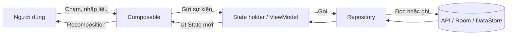
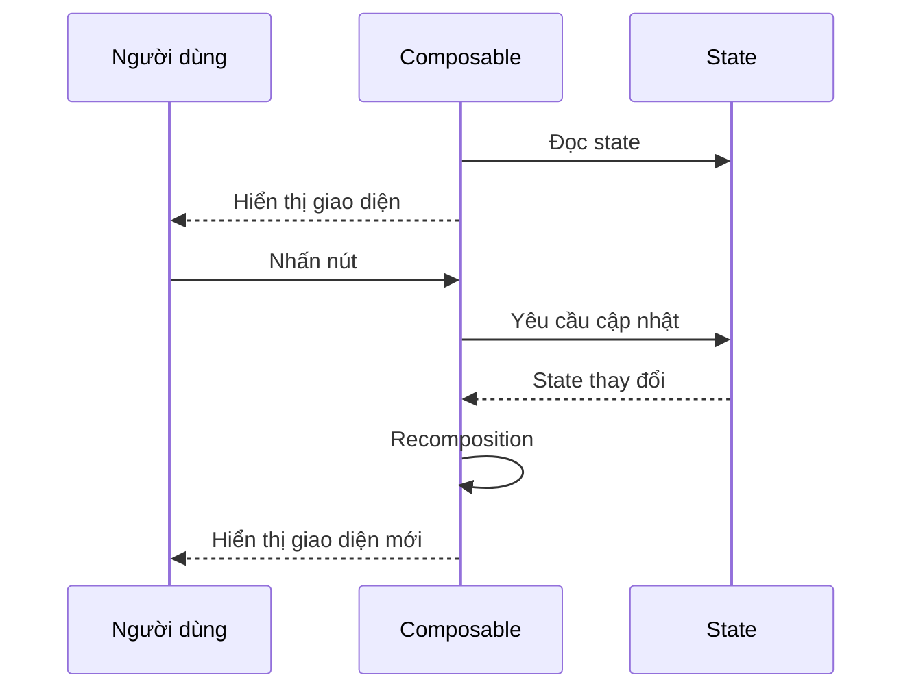
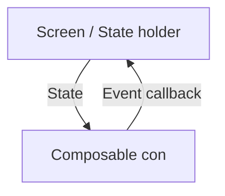
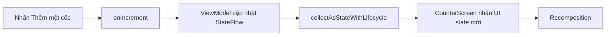
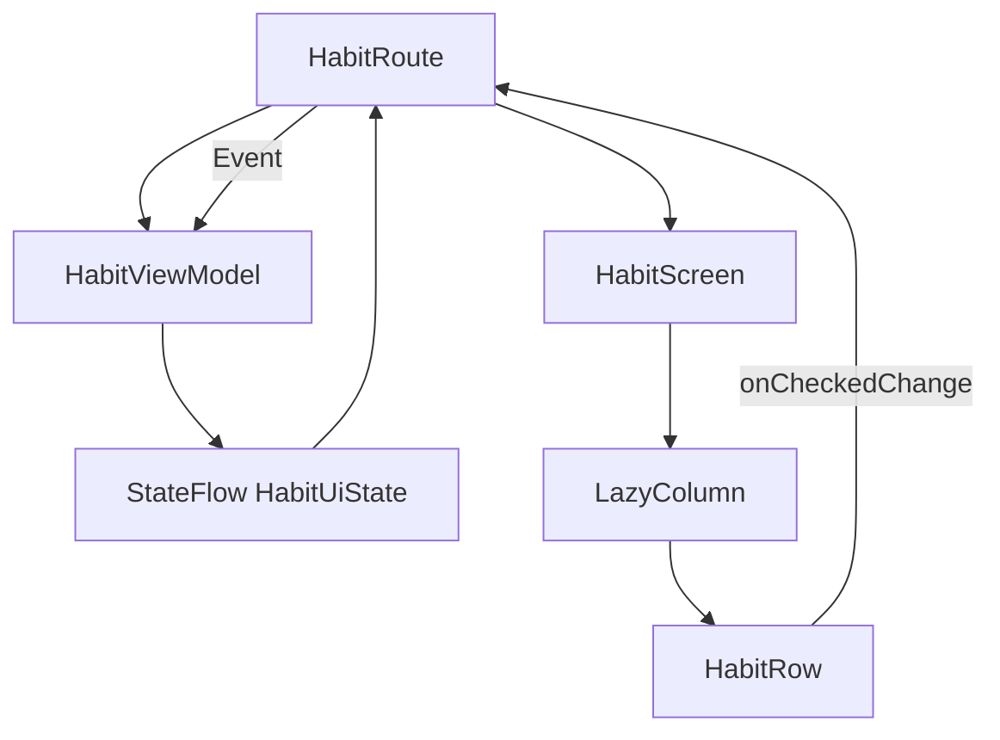
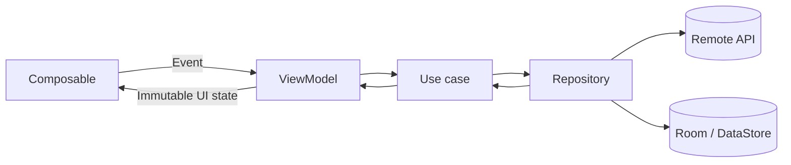
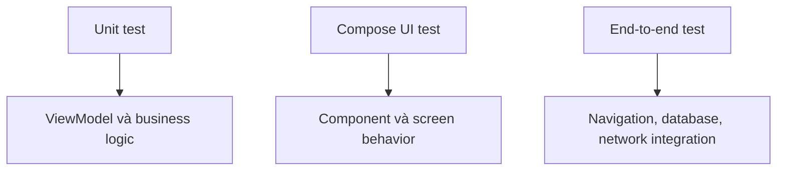
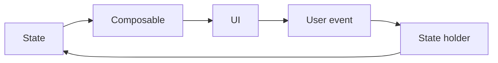

[](https://developer.android.com/develop/ui/compose/state-hoisting?hl=zh-cn&utm_source=chatgpt.com)

# 021 - Jetpack Compose

| Thuộc tính              | Nội dung                                   |
| ----------------------- | ------------------------------------------ |
| **Học phần**            | 02 - App Components and User Interface     |
| **Module**              | Module 04 - Interface and Navigation       |
| **Nhóm nội dung**       | Jetpack Compose                            |
| **Nguồn roadmap**       | Interface and Navigation / Jetpack Compose |
| **Loại bài**            | UI                                         |
| **Thứ tự trong module** | 021                                        |
| **Thời lượng gợi ý**    | 30 phút                                    |

---

## 1. Tóm tắt


**Jetpack Compose** là bộ công cụ hiện đại được Android khuyến nghị để xây dựng giao diện native. Thay vì tạo cây giao diện bằng XML rồi tìm và cập nhật từng `View`, lập trình viên viết các hàm Kotlin có gắn `@Composable` để **mô tả giao diện dựa trên trạng thái hiện tại**. Khi trạng thái thay đổi, Compose tự chạy lại những phần giao diện cần thiết. ([Android Developers][1])

Ví dụ tư duy khai báo:

```kotlin
@Composable
fun Greeting(name: String) {
    Text(text = "Xin chào, $name!")
}
```

Hàm trên không trực tiếp tạo một `TextView`, không gọi `setText()` và không giữ tham chiếu đến thành phần giao diện. Nó chỉ mô tả:

> Với giá trị `name` hiện tại, giao diện cần hiển thị dòng chữ nào?

### Vị trí của Compose trong ứng dụng Android



Compose chủ yếu thuộc **UI layer**, nhưng cách xây dựng giao diện của nó liên quan trực tiếp đến:

* **State:** dữ liệu nào quyết định nội dung đang hiển thị.
* **Lifecycle:** khi nào ứng dụng nên thu thập dữ liệu hoặc giải phóng tài nguyên.
* **Navigation:** màn hình nào đang được hiển thị.
* **Data:** `ViewModel` nhận dữ liệu từ repository rồi chuyển thành UI state.
* **Testing:** kiểm thử giao diện thông qua semantics tree.
* **Performance:** kiểm soát recomposition, tính ổn định của tham số và công việc thực hiện trong composable.
* **Release:** kiểm thử trên nhiều kích thước màn hình, chế độ tối, font lớn và quy trình khôi phục trạng thái.

### So sánh tư duy View XML và Compose

| View/XML truyền thống                        | Jetpack Compose                                     |
| -------------------------------------------- | --------------------------------------------------- |
| Giao diện thường được khai báo trong XML     | Giao diện được mô tả bằng Kotlin                    |
| Cập nhật bằng `setText()`, `setVisibility()` | Cập nhật state rồi Compose dựng lại phần cần thiết  |
| Thường dùng `findViewById` hoặc View Binding | Gọi trực tiếp các hàm composable                    |
| UI và logic cập nhật dễ bị phân tán          | Luồng state và event có thể được tổ chức thống nhất |
| Preview phụ thuộc nhiều vào layout XML       | Có thể dùng `@Preview` cho từng composable          |
| Thường suy nghĩ “thay đổi View nào?”         | Suy nghĩ “UI tương ứng với state nào?”              |

> Compose có thể cùng tồn tại với hệ thống View. Android hỗ trợ `ComposeView` để đặt Compose trong màn hình XML và `AndroidView` để dùng View cũ trong Compose, nhờ đó dự án có thể chuyển đổi từng phần thay vì viết lại toàn bộ. ([Android Developers][2])

---

## 2. Mục tiêu học tập


Sau bài học, anh có thể:

* Giải thích Jetpack Compose bằng ngôn ngữ của mình.
* Phân biệt cách xây dựng UI **imperative** và **declarative**.
* Viết một hàm có annotation `@Composable`.
* Hiểu `Composition`, initial composition và recomposition.
* Quản lý state bằng `remember`, `rememberSaveable` hoặc `ViewModel`.
* Áp dụng **state hoisting** để tạo composable stateless.
* Tổ chức luồng dữ liệu một chiều: **state đi xuống, event đi lên**.
* Thu thập `StateFlow` theo lifecycle bằng `collectAsStateWithLifecycle()`.
* Viết một UI test cơ bản bằng Compose Testing API.
* Tạo screenshot, README và source code để đưa vào portfolio.

### Kết quả đầu ra dự kiến

Sau 30 phút, anh cần có một mini app đếm lượng nước uống với các chức năng:

1. Hiển thị số cốc nước hiện tại.
2. Nhấn nút để tăng số cốc.
3. Nhấn nút để đặt lại.
4. Giao diện tự cập nhật khi state thay đổi.
5. Giá trị không bị mất khi xoay màn hình.
6. Có ít nhất một UI test.
7. Có ảnh chụp giao diện và README ngắn.

---

## 3. Khái niệm chính


### 3.1. Composable function

Composable là hàm Kotlin có annotation `@Composable`:

```kotlin
@Composable
fun ProfileHeader(
    name: String,
    modifier: Modifier = Modifier
) {
    Text(
        text = name,
        modifier = modifier
    )
}
```

Composable có thể:

* Nhận state thông qua tham số.
* Gọi các composable khác.
* Phát ra mô tả giao diện.
* Được chạy lại khi state mà nó đọc thay đổi.
* Rời khỏi Composition khi thành phần không còn cần xuất hiện.

Tên composable nên dùng danh từ hoặc cụm danh từ mô tả thành phần giao diện, chẳng hạn:

```text
ProfileScreen
UserAvatar
MessageCard
SettingsRow
```

### 3.2. Composition và recomposition

Ba thuật ngữ quan trọng:

| Thuật ngữ               | Ý nghĩa                                                             |
| ----------------------- | ------------------------------------------------------------------- |
| **Composition**         | Cấu trúc UI do Compose tạo ra sau khi thực thi các composable       |
| **Initial composition** | Lần đầu các composable được chạy để xây dựng UI                     |
| **Recomposition**       | Chạy lại những composable có dữ liệu đầu vào hoặc state đã thay đổi |

Compose theo dõi những composable nào đọc state. Khi state thay đổi, nó có thể lên lịch recomposition cho những phần liên quan thay vì cập nhật toàn bộ màn hình. ([Android Developers][3])



Composable nên tránh thực hiện trực tiếp các hành động có side effect trong phần thân:

```kotlin
// Không nên
@Composable
fun UserScreen() {
    repository.loadUser() // Có thể bị gọi lại khi recomposition
}
```

Thay vào đó, dữ liệu thường được tải trong `ViewModel`, hoặc side effect được quản lý bằng API phù hợp như `LaunchedEffect`.

---

### 3.3. State trong Compose

State là bất kỳ dữ liệu nào có thể thay đổi và ảnh hưởng đến giao diện:

* Nội dung đang nhập trong `TextField`.
* Màn hình đang được chọn.
* Trạng thái loading.
* Danh sách sản phẩm.
* Thông báo lỗi.
* Vị trí cuộn.
* Trạng thái mở hoặc đóng của bottom sheet.

Ví dụ state cục bộ:

```kotlin
@Composable
fun LocalCounter() {
    var count by remember { mutableIntStateOf(0) }

    Button(onClick = { count++ }) {
        Text("Đã nhấn $count lần")
    }
}
```

Khi `count` thay đổi, phần giao diện đọc `count` được recomposition.

#### So sánh các cách lưu state

| Công cụ                  | Tồn tại qua recomposition | Xoay màn hình | Process bị hệ thống tạo lại | Phù hợp                                    |
| ------------------------ | :-----------------------: | :-----------: | :-------------------------: | ------------------------------------------ |
| Biến Kotlin thông thường |             ❌             |       ❌       |              ❌              | Giá trị tạm trong một lần chạy hàm         |
| `remember`               |             ✅             |       ❌       |              ❌              | State UI ngắn hạn                          |
| `rememberSaveable`       |             ✅             |       ✅       |         Có giới hạn         | State nhỏ có thể lưu trong `Bundle`        |
| `ViewModel`              |             ✅             |       ✅       |       ❌ theo mặc định       | Screen state và business logic             |
| `SavedStateHandle`       |             ✅             |       ✅       |      ✅ với state đã lưu     | State cần khôi phục sau process recreation |
| Room/DataStore           |             ✅             |       ✅       |              ✅              | Dữ liệu lâu dài                            |

`remember` lưu đối tượng trong Composition và quên nó khi composable rời khỏi Composition. `rememberSaveable` có thể khôi phục những kiểu dữ liệu lưu được trong `Bundle` sau configuration change. ([Android Developers][4])

---

### 3.4. Stateful và stateless composable

#### Stateful composable

Composable tự sở hữu state:

```kotlin
@Composable
fun StatefulCounter() {
    var count by rememberSaveable { mutableIntStateOf(0) }

    CounterContent(
        count = count,
        onIncrement = { count++ }
    )
}
```

#### Stateless composable

Composable chỉ nhận state và callback:

```kotlin
@Composable
fun CounterContent(
    count: Int,
    onIncrement: () -> Unit
) {
    Button(onClick = onIncrement) {
        Text("Số lần: $count")
    }
}
```

Stateless composable thường:

* Dễ tái sử dụng.
* Dễ preview.
* Dễ kiểm thử.
* Không phụ thuộc trực tiếp vào `ViewModel`.
* Cho phép caller kiểm soát state.

---

### 3.5. State hoisting

**State hoisting** là đưa state từ composable con lên caller hoặc state holder thích hợp.

Mẫu tổng quát:

```kotlin
@Composable
fun SearchField(
    value: String,
    onValueChange: (String) -> Unit
)
```

Trong đó:

* `value` là state đi xuống.
* `onValueChange` là event đi lên.



Nên đưa state lên:

1. Tới ancestor thấp nhất mà tất cả composable cần đọc state đều có thể truy cập.
2. Tới nơi cao nhất có thể thay đổi state.
3. Tới cùng một state holder nếu nhiều state thay đổi bởi cùng một sự kiện.

Đây là cách Compose triển khai **Unidirectional Data Flow – UDF**: state đi xuống và event đi lên. ([Android Developers][5])

---

### 3.6. ViewModel và UI state

`ViewModel` là screen-level state holder. Nó cung cấp state cho UI và chứa business logic liên quan đến màn hình. ViewModel cũng giữ state qua các configuration change như xoay thiết bị. ([Android Developers][6])

Một UI state nên bất biến:

```kotlin
data class CounterUiState(
    val count: Int = 0,
    val goal: Int = 8,
    val isLoading: Boolean = false,
    val errorMessage: String? = null
)
```

ViewModel phát state:

```kotlin
class CounterViewModel : ViewModel() {

    private val _uiState = MutableStateFlow(CounterUiState())
    val uiState: StateFlow<CounterUiState> = _uiState.asStateFlow()

    fun increment() {
        _uiState.update { current ->
            current.copy(
                count = (current.count + 1)
                    .coerceAtMost(current.goal)
            )
        }
    }
}
```

Composable màn hình thu thập state:

```kotlin
@Composable
fun CounterRoute(
    viewModel: CounterViewModel = viewModel()
) {
    val uiState by viewModel.uiState.collectAsStateWithLifecycle()

    CounterScreen(
        uiState = uiState,
        onIncrement = viewModel::increment
    )
}
```

Trên Android, `collectAsStateWithLifecycle()` là cách được khuyến nghị để chuyển `Flow` thành Compose `State` theo lifecycle. Việc thu thập có thể tạm dừng khi ứng dụng không còn ở trạng thái hoạt động phù hợp, giúp tránh tiếp tục sử dụng tài nguyên không cần thiết trong background. ([Android Developers][7])

> Chỉ nên lấy `ViewModel` tại composable cấp màn hình như `CounterRoute`. Không truyền toàn bộ `ViewModel` xuống các UI component nhỏ; hãy truyền state và callback mà chúng thực sự cần.

---

### 3.7. Modifier

`Modifier` cấu hình cách composable:

* Được bố trí.
* Có kích thước.
* Nhận padding.
* Nhận sự kiện click.
* Vẽ background hoặc border.
* Cuộn.
* Cung cấp semantics.
* Tham gia animation.

```kotlin
Text(
    text = "Jetpack Compose",
    modifier = Modifier
        .fillMaxWidth()
        .padding(16.dp)
)
```

Thứ tự modifier có thể làm thay đổi kết quả:

```kotlin
// Padding nằm ngoài vùng có thể click
Modifier
    .padding(16.dp)
    .clickable { }

// Padding nằm trong vùng có thể click
Modifier
    .clickable { }
    .padding(16.dp)
```

Quy ước phổ biến là đặt `modifier` làm tham số tùy chọn đầu tiên:

```kotlin
@Composable
fun UserCard(
    user: User,
    modifier: Modifier = Modifier
)
```

---

### 3.8. Side effect

Composable có thể được gọi lại nhiều lần, vì vậy các công việc ngoài việc mô tả UI cần được quản lý rõ ràng.

| API                      | Trường hợp sử dụng                                   |
| ------------------------ | ---------------------------------------------------- |
| `LaunchedEffect`         | Chạy coroutine theo lifecycle của composable         |
| `DisposableEffect`       | Đăng ký listener và dọn dẹp khi rời Composition      |
| `SideEffect`             | Đồng bộ state Compose sang đối tượng bên ngoài       |
| `rememberCoroutineScope` | Chạy coroutine từ sự kiện UI                         |
| `derivedStateOf`         | Tạo state dẫn xuất, hạn chế cập nhật không cần thiết |
| `rememberUpdatedState`   | Dùng giá trị mới nhất bên trong effect lâu dài       |

Ví dụ:

```kotlin
LaunchedEffect(userId) {
    viewModel.loadUser(userId)
}
```

Effect được khởi động lại khi `userId` thay đổi.

---

## 4. Thực hành: xây dựng Water Counter


### 4.1. Yêu cầu mini app

Xây dựng màn hình theo dõi số cốc nước:

```text
┌──────────────────────────────┐
│        UỐNG NƯỚC HÔM NAY     │
│                              │
│            3 / 8             │
│       ███████░░░░░░░░        │
│                              │
│  [ Thêm một cốc ] [ Đặt lại ]│
└──────────────────────────────┘
```

Luồng xử lý:



---

### 4.2. Cấu hình dự án

Tạo dự án bằng template **Empty Activity** có hỗ trợ Compose. Android Studio sẽ tạo sẵn cấu hình Compose cơ bản.

Kiểm tra các dependency cần thiết:

```kotlin
dependencies {
    val composeBom = platform(
        "androidx.compose:compose-bom:2026.06.00"
    )

    implementation(composeBom)
    androidTestImplementation(composeBom)

    implementation("androidx.compose.material3:material3")

    implementation(
        "androidx.lifecycle:lifecycle-viewmodel-compose:2.10.0"
    )
    implementation(
        "androidx.lifecycle:lifecycle-runtime-compose:2.10.0"
    )

    androidTestImplementation(
        "androidx.compose.ui:ui-test-junit4"
    )
    debugImplementation(
        "androidx.compose.ui:ui-test-manifest"
    )
}
```

> Các con số trên tương ứng với ví dụ tài liệu Android tại thời điểm biên soạn. Với dự án thực tế, nên ưu tiên Compose BOM và Version Catalog do phiên bản Android Studio hiện tại đề xuất để các thư viện Compose đồng bộ với nhau. ([Android Developers][8])

---

### 4.3. Tạo UI state

**`CounterUiState.kt`**

```kotlin
package com.example.watercounter

data class CounterUiState(
    val count: Int = 0,
    val goal: Int = 8
) {
    val progress: Float
        get() = if (goal <= 0) {
            0f
        } else {
            (count.toFloat() / goal).coerceIn(0f, 1f)
        }

    val isGoalReached: Boolean
        get() = count >= goal
}
```

UI state được khai báo bằng `data class` bất biến. Mỗi lần cập nhật, ViewModel tạo một bản sao mới bằng `copy()`.

---

### 4.4. Tạo ViewModel

**`CounterViewModel.kt`**

```kotlin
package com.example.watercounter

import androidx.lifecycle.ViewModel
import kotlinx.coroutines.flow.MutableStateFlow
import kotlinx.coroutines.flow.StateFlow
import kotlinx.coroutines.flow.asStateFlow
import kotlinx.coroutines.flow.update

class CounterViewModel : ViewModel() {

    private val _uiState = MutableStateFlow(CounterUiState())
    val uiState: StateFlow<CounterUiState> = _uiState.asStateFlow()

    fun increment() {
        _uiState.update { current ->
            current.copy(
                count = (current.count + 1)
                    .coerceAtMost(current.goal)
            )
        }
    }

    fun reset() {
        _uiState.update { current ->
            current.copy(count = 0)
        }
    }
}
```

`_uiState` là mutable nhưng private. Bên ngoài chỉ nhận `StateFlow` chỉ đọc, tránh để UI sửa state trực tiếp.

---

### 4.5. Tạo stateless screen

**`CounterScreen.kt`**

```kotlin
package com.example.watercounter

import androidx.compose.foundation.layout.Arrangement
import androidx.compose.foundation.layout.Column
import androidx.compose.foundation.layout.Row
import androidx.compose.foundation.layout.Spacer
import androidx.compose.foundation.layout.fillMaxSize
import androidx.compose.foundation.layout.fillMaxWidth
import androidx.compose.foundation.layout.height
import androidx.compose.foundation.layout.padding
import androidx.compose.material3.Button
import androidx.compose.material3.LinearProgressIndicator
import androidx.compose.material3.MaterialTheme
import androidx.compose.material3.OutlinedButton
import androidx.compose.material3.Scaffold
import androidx.compose.material3.Text
import androidx.compose.runtime.Composable
import androidx.compose.ui.Alignment
import androidx.compose.ui.Modifier
import androidx.compose.ui.semantics.contentDescription
import androidx.compose.ui.semantics.semantics
import androidx.compose.ui.text.font.FontWeight
import androidx.compose.ui.tooling.preview.Preview
import androidx.compose.ui.unit.dp

@Composable
fun CounterScreen(
    uiState: CounterUiState,
    onIncrement: () -> Unit,
    onReset: () -> Unit,
    modifier: Modifier = Modifier
) {
    Scaffold(modifier = modifier) { innerPadding ->
        Column(
            modifier = Modifier
                .fillMaxSize()
                .padding(innerPadding)
                .padding(24.dp),
            horizontalAlignment = Alignment.CenterHorizontally,
            verticalArrangement = Arrangement.Center
        ) {
            Text(
                text = "Uống nước hôm nay",
                style = MaterialTheme.typography.headlineSmall,
                fontWeight = FontWeight.Bold
            )

            Spacer(modifier = Modifier.height(24.dp))

            Text(
                text = "${uiState.count} / ${uiState.goal} cốc",
                style = MaterialTheme.typography.displaySmall
            )

            Spacer(modifier = Modifier.height(16.dp))

            LinearProgressIndicator(
                progress = { uiState.progress },
                modifier = Modifier
                    .fillMaxWidth()
                    .semantics {
                        contentDescription =
                            "Tiến độ ${uiState.count} trên ${uiState.goal} cốc"
                    }
            )

            Spacer(modifier = Modifier.height(16.dp))

            Text(
                text = if (uiState.isGoalReached) {
                    "Anh đã hoàn thành mục tiêu hôm nay!"
                } else {
                    "Còn ${uiState.goal - uiState.count} cốc nữa"
                },
                style = MaterialTheme.typography.bodyLarge
            )

            Spacer(modifier = Modifier.height(32.dp))

            Row(
                horizontalArrangement = Arrangement.spacedBy(12.dp)
            ) {
                Button(
                    onClick = onIncrement,
                    enabled = !uiState.isGoalReached
                ) {
                    Text("Thêm một cốc")
                }

                OutlinedButton(
                    onClick = onReset,
                    enabled = uiState.count > 0
                ) {
                    Text("Đặt lại")
                }
            }
        }
    }
}

@Preview(
    showBackground = true,
    name = "Water Counter"
)
@Composable
private fun CounterScreenPreview() {
    MaterialTheme {
        CounterScreen(
            uiState = CounterUiState(
                count = 3,
                goal = 8
            ),
            onIncrement = {},
            onReset = {}
        )
    }
}
```

Điểm đáng chú ý:

* `CounterScreen` không biết `ViewModel` là gì.
* State được truyền bằng `CounterUiState`.
* Sự kiện được truyền bằng callback.
* Preview không cần tạo ViewModel.
* UI test có thể truyền fake state.
* `contentDescription` cung cấp thông tin cho accessibility và testing.

---

### 4.6. Tạo Route kết nối với ViewModel

**`CounterRoute.kt`**

```kotlin
package com.example.watercounter

import androidx.compose.runtime.Composable
import androidx.compose.runtime.getValue
import androidx.lifecycle.compose.collectAsStateWithLifecycle
import androidx.lifecycle.viewmodel.compose.viewModel

@Composable
fun CounterRoute(
    viewModel: CounterViewModel = viewModel()
) {
    val uiState by viewModel.uiState
        .collectAsStateWithLifecycle()

    CounterScreen(
        uiState = uiState,
        onIncrement = viewModel::increment,
        onReset = viewModel::reset
    )
}
```

Mô hình `Route` và `Screen` giúp tách hai trách nhiệm:

```text
CounterRoute
├── Lấy ViewModel
├── Thu thập StateFlow
└── Nối state và event

CounterScreen
├── Chỉ dựng UI
├── Nhận immutable state
└── Phát callback
```

---

### 4.7. Hiển thị trong Activity

**`MainActivity.kt`**

```kotlin
package com.example.watercounter

import android.os.Bundle
import androidx.activity.ComponentActivity
import androidx.activity.compose.setContent
import androidx.compose.material3.MaterialTheme
import androidx.compose.material3.Surface

class MainActivity : ComponentActivity() {

    override fun onCreate(
        savedInstanceState: Bundle?
    ) {
        super.onCreate(savedInstanceState)

        setContent {
            MaterialTheme {
                Surface {
                    CounterRoute()
                }
            }
        }
    }
}
```

---

### 4.8. Kiểm tra thủ công

| Bước | Thao tác                            | Kết quả mong đợi                      |
| ---: | ----------------------------------- | ------------------------------------- |
|    1 | Mở ứng dụng                         | Hiển thị `0 / 8 cốc`                  |
|    2 | Nhấn **Thêm một cốc**               | Giá trị tăng thành `1 / 8 cốc`        |
|    3 | Nhấn liên tục                       | Progress bar tăng theo                |
|    4 | Đạt `8 / 8`                         | Hiện thông báo hoàn thành             |
|    5 | Đạt mục tiêu                        | Nút thêm bị vô hiệu hóa               |
|    6 | Nhấn **Đặt lại**                    | Giá trị trở về `0 / 8`                |
|    7 | Tăng lên 3 rồi xoay máy             | Vẫn hiển thị `3 / 8`                  |
|    8 | Đưa app xuống background rồi mở lại | UI không crash và state vẫn nhất quán |
|    9 | Bật dark mode                       | Nội dung vẫn dễ đọc                   |
|   10 | Tăng font hệ thống                  | Giao diện không bị cắt chữ            |

---

## 5. Bài tập


### Bài tập chính: Habit Tracker bằng Compose

Mở rộng Water Counter thành ứng dụng theo dõi thói quen:

```text
THÓI QUEN HÔM NAY

[✓] Uống đủ 8 cốc nước
[ ] Đi bộ 6.000 bước
[✓] Học Android 30 phút
[ ] Ngủ trước 23:00

Đã hoàn thành: 2 / 4
```

### Yêu cầu chức năng

1. Tạo model:

```kotlin
data class HabitItem(
    val id: Long,
    val title: String,
    val isCompleted: Boolean
)
```

2. Hiển thị danh sách bằng `LazyColumn`.
3. Mỗi item có `Checkbox`.
4. Khi checkbox thay đổi, cập nhật state trong ViewModel.
5. Hiển thị số nhiệm vụ đã hoàn thành.
6. Dùng `key = { habit.id }` cho từng item.
7. Có nút đặt lại toàn bộ.
8. Có trạng thái danh sách rỗng.
9. Có ít nhất một `@Preview`.
10. Có ít nhất một UI test.

### Kiến trúc gợi ý



### UI test mẫu

Compose Testing API tương tác với giao diện qua semantics, cho phép tìm node, thực hiện thao tác và xác nhận thuộc tính hoặc nội dung hiển thị. ([Android Developers][9])

```kotlin
package com.example.watercounter

import androidx.compose.material3.MaterialTheme
import androidx.compose.runtime.getValue
import androidx.compose.runtime.mutableStateOf
import androidx.compose.runtime.setValue
import androidx.compose.ui.test.assertIsDisplayed
import androidx.compose.ui.test.junit4.createComposeRule
import androidx.compose.ui.test.onNodeWithText
import androidx.compose.ui.test.performClick
import org.junit.Rule
import org.junit.Test

class CounterScreenTest {

    @get:Rule
    val composeRule = createComposeRule()

    @Test
    fun incrementButton_updatesDisplayedCount() {
        composeRule.setContent {
            var state by mutableStateOf(
                CounterUiState(count = 0, goal = 8)
            )

            MaterialTheme {
                CounterScreen(
                    uiState = state,
                    onIncrement = {
                        state = state.copy(
                            count = state.count + 1
                        )
                    },
                    onReset = {
                        state = state.copy(count = 0)
                    }
                )
            }
        }

        composeRule
            .onNodeWithText("Thêm một cốc")
            .performClick()

        composeRule
            .onNodeWithText("1 / 8 cốc")
            .assertIsDisplayed()
    }
}
```

### Tiêu chí chấm bài

| Hạng mục                                   |   Điểm |
| ------------------------------------------ | -----: |
| Composable được tách hợp lý                |      2 |
| State hoisting đúng                        |      2 |
| ViewModel và immutable UI state            |      2 |
| Danh sách dùng `LazyColumn` và key ổn định |      1 |
| Có Preview                                 |      1 |
| Có UI test                                 |      1 |
| README và screenshot                       |      1 |
| **Tổng**                                   | **10** |

---

## 6. Checklist hoàn thành


### Kiến thức

* [ ] Giải thích được Jetpack Compose là declarative UI toolkit.
* [ ] Phân biệt được Composition và recomposition.
* [ ] Hiểu vai trò của `@Composable`.
* [ ] Phân biệt `remember` và `rememberSaveable`.
* [ ] Biết khi nào nên dùng `ViewModel`.
* [ ] Giải thích được state hoisting.
* [ ] Giải thích được UDF: state xuống, event lên.
* [ ] Biết mục đích của `collectAsStateWithLifecycle`.
* [ ] Biết composable không nên thực hiện side effect tùy ý.

### Code

* [ ] Có ít nhất một stateless composable.
* [ ] `Modifier` được nhận từ caller thay vì hardcode hoàn toàn.
* [ ] UI state được khai báo bằng immutable `data class`.
* [ ] Mutable state trong ViewModel được đặt `private`.
* [ ] ViewModel chỉ được lấy tại screen-level composable.
* [ ] Không truyền nguyên ViewModel xuống các component nhỏ.
* [ ] Không dùng collection mutable không observable làm Compose state.
* [ ] Danh sách lớn dùng `LazyColumn` hoặc `LazyRow`.
* [ ] Item danh sách có key ổn định.
* [ ] Text hiển thị cho người dùng được chuẩn bị để chuyển vào resources.

### Lifecycle và state restoration

* [ ] State không bị reset ngoài ý muốn khi recomposition.
* [ ] Đã thử xoay màn hình.
* [ ] Đã thử chuyển app xuống background.
* [ ] Đã phân biệt configuration change và process death.
* [ ] State quan trọng có chiến lược lưu bằng `SavedStateHandle`, Room hoặc DataStore.
* [ ] Flow từ ViewModel được thu thập theo lifecycle.

### Chất lượng UI

* [ ] Có Preview cho trạng thái bình thường.
* [ ] Có Preview cho loading, error hoặc empty state nếu phù hợp.
* [ ] Hoạt động trong dark mode.
* [ ] Hoạt động khi tăng font size.
* [ ] Icon quan trọng có `contentDescription`.
* [ ] Custom component có semantics phù hợp.
* [ ] Thành phần tương tác có vùng chạm đủ lớn.
* [ ] Không chỉ dùng màu sắc để biểu thị trạng thái.

Semantics tạo một cây mô tả ý nghĩa của giao diện bên cạnh UI hierarchy. Cây này được accessibility service và Compose Testing Framework sử dụng để hiểu, tìm và tương tác với các thành phần. ([Android Developers][10])

### Testing và debugging

* [ ] Có UI test cho hành vi chính.
* [ ] Test tìm node bằng text, content description hoặc test tag rõ ràng.
* [ ] Đã kiểm tra loading, success và error state.
* [ ] Đã mở Layout Inspector khi cần xem recomposition.
* [ ] Không tối ưu hiệu năng chỉ dựa trên cảm giác.
* [ ] Đã chạy app trên ít nhất hai kích thước màn hình.

### Artifact portfolio

* [ ] Có screenshot màn hình.
* [ ] Có GIF hoặc video ngắn thể hiện state thay đổi.
* [ ] Có sơ đồ state và event.
* [ ] Có README giải thích kiến trúc.
* [ ] Có source code rõ ràng.
* [ ] Có hướng dẫn chạy project.
* [ ] Có danh sách test đã thực hiện.

---

## 7. Ghi chú sản xuất


### 7.1. Không nhầm recomposition với Activity lifecycle

Recomposition không đồng nghĩa với:

* Activity bị tạo lại.
* Fragment bị tạo lại.
* Màn hình được điều hướng lại.
* ViewModel được tạo lại.

Một composable có thể recomposition nhiều lần trong cùng một Activity. Vì vậy, không nên đặt network request, ghi database hoặc đăng ký listener trực tiếp trong phần thân composable.

```kotlin
// Không nên
@Composable
fun ProductScreen(repository: ProductRepository) {
    repository.fetchProducts()
}
```

Nên để ViewModel quản lý dữ liệu:

```kotlin
class ProductViewModel(
    private val repository: ProductRepository
) : ViewModel() {

    init {
        loadProducts()
    }

    private fun loadProducts() {
        // Chạy coroutine và cập nhật UI state
    }
}
```

---

### 7.2. Thiết kế đầy đủ các UI state

Màn hình production thường không chỉ có dữ liệu thành công:

```kotlin
sealed interface ProductUiState {

    data object Loading : ProductUiState

    data class Success(
        val products: List<Product>
    ) : ProductUiState

    data class Error(
        val message: String
    ) : ProductUiState

    data object Empty : ProductUiState
}
```

Composable hiển thị theo state:

```kotlin
@Composable
fun ProductScreen(
    uiState: ProductUiState,
    onRetry: () -> Unit
) {
    when (uiState) {
        ProductUiState.Loading -> LoadingContent()

        ProductUiState.Empty -> EmptyContent()

        is ProductUiState.Success -> {
            ProductList(uiState.products)
        }

        is ProductUiState.Error -> {
            ErrorContent(
                message = uiState.message,
                onRetry = onRetry
            )
        }
    }
}
```

Điều này giúp trạng thái màn hình trở nên rõ ràng và tránh nhiều biến Boolean mâu thuẫn, chẳng hạn đồng thời vừa `isLoading = true` vừa có `error`.

---

### 7.3. Xử lý state khi xoay màn hình và process death

Phân loại state trước khi quyết định nơi lưu:

| Loại state                 | Ví dụ                              | Nơi lưu gợi ý       |
| -------------------------- | ---------------------------------- | ------------------- |
| UI element state           | TextField đang nhập, tab đang chọn | `rememberSaveable`  |
| Screen UI state            | Danh sách, loading, filter         | ViewModel           |
| Dữ liệu phục hồi nhỏ       | ID item đang mở, từ khóa tìm kiếm  | `SavedStateHandle`  |
| Dữ liệu nghiệp vụ lâu dài  | Ghi chú, giỏ hàng, lịch sử         | Room hoặc DataStore |
| Dữ liệu có nguồn từ server | Danh sách sản phẩm                 | Repository và cache |

ViewModel giữ state qua configuration change nhưng không tự đảm bảo khôi phục sau khi process bị hệ thống hủy. Với state cần phục hồi, dùng `SavedStateHandle` hoặc lưu trong data layer. ([Android Developers][11])

---

### 7.4. Network và storage

Composable không nên biết chi tiết Retrofit, Room hay DataStore.



UI chỉ cần biết:

```kotlin
data class UserUiState(
    val isLoading: Boolean,
    val userName: String,
    val errorMessage: String?
)
```

Nếu request thất bại, UI cần có:

* Error message dễ hiểu.
* Nút retry.
* Cơ chế tránh gửi request lặp.
* Trạng thái loading không khóa toàn bộ app nếu không cần.
* Nội dung cũ hoặc cache nếu nghiệp vụ cho phép.

---

### 7.5. Hiệu năng

Compose có ba giai đoạn chính: **composition**, **layout** và **drawing**. Hiểu giai đoạn nào đang bị lặp giúp xác định đúng nguyên nhân hiệu năng kém. Compose cũng sử dụng tính ổn định của tham số để quyết định khi nào có thể bỏ qua một composable trong recomposition. ([Android Developers][12])

Các nguyên tắc thực tế:

* Không thực hiện phép tính nặng trong composable.
* Dùng `remember` cho kết quả tính toán phụ thuộc input phù hợp.
* Dùng `derivedStateOf` khi state nguồn thay đổi thường xuyên hơn nhu cầu UI.
* Dùng model bất biến.
* Không tạo object mới không cần thiết trong mỗi recomposition.
* Dùng `LazyColumn` cho danh sách dài.
* Cung cấp key ổn định cho item.
* Không đọc state ở cấp quá cao nếu chỉ composable con cần.
* Đo bằng profiler, Layout Inspector hoặc benchmark trước khi tối ưu.
* Xem xét Baseline Profile cho luồng khởi động quan trọng.

Ví dụ tránh lọc lại danh sách không cần thiết:

```kotlin
@Composable
fun UserList(
    users: List<User>,
    keyword: String
) {
    val filteredUsers = remember(users, keyword) {
        users.filter {
            it.name.contains(
                keyword,
                ignoreCase = true
            )
        }
    }

    LazyColumn {
        items(
            items = filteredUsers,
            key = { user -> user.id }
        ) { user ->
            UserRow(user)
        }
    }
}
```

---

### 7.6. Accessibility

Compose cung cấp nhiều semantics mặc định cho các component Material, Foundation và Compose UI. Tuy nhiên, icon, image và custom component vẫn cần được mô tả đúng theo ngữ cảnh. ([Android Developers][13])

```kotlin
IconButton(
    onClick = onDelete
) {
    Icon(
        imageVector = Icons.Default.Delete,
        contentDescription = "Xóa nhiệm vụ"
    )
}
```

Với hình chỉ dùng để trang trí:

```kotlin
Icon(
    imageVector = Icons.Default.Star,
    contentDescription = null
)
```

Checklist accessibility production:

* Kiểm tra TalkBack.
* Kiểm tra font lớn.
* Kiểm tra display scaling.
* Kiểm tra tương phản.
* Không dùng chỉ màu đỏ hoặc xanh để biểu thị lỗi/thành công.
* Cung cấp label cho thành phần tương tác.
* Giữ thứ tự focus hợp lý.
* Kiểm tra nội dung động như Snackbar và error message.
* Dùng semantics cho custom component.

---

### 7.7. Testing strategy

Nên chia kiểm thử thành ba lớp:



#### Unit test

Kiểm tra:

* Reducer.
* ViewModel.
* Validation.
* Chuyển đổi domain model sang UI model.

#### Compose UI test

Kiểm tra:

* Nội dung có hiển thị hay không.
* Button có enabled đúng không.
* Click có phát event không.
* Loading/error/empty state.
* Semantics và accessibility.

#### Navigation hoặc end-to-end test

Kiểm tra:

* Click có mở đúng destination.
* Back stack đúng.
* Deep link.
* Luồng đăng nhập.
* Luồng lỗi từ API.

Compose cung cấp API để tìm node, xác nhận thuộc tính, thực hiện hành động và đồng bộ test với UI. ([Android Developers][9])

---

### 7.8. Migration từ XML

Không nhất thiết phải chuyển cả ứng dụng sang Compose cùng một lúc.

Chiến lược ít rủi ro:

```text
1. Tạo component Compose nhỏ
2. Đặt trong màn hình View bằng ComposeView
3. Chuyển từng màn hình độc lập
4. Giữ ViewModel và data layer hiện có
5. Kiểm thử hai hệ thống cùng hoạt động
6. Loại bỏ XML khi không còn được sử dụng
```

Compose trong View:

```xml
<androidx.compose.ui.platform.ComposeView
    android:id="@+id/compose_view"
    android:layout_width="match_parent"
    android:layout_height="wrap_content" />
```

View trong Compose:

```kotlin
@Composable
fun LegacyMapView() {
    AndroidView(
        factory = { context ->
            LegacyCustomView(context)
        },
        update = { view ->
            // Đồng bộ state mới vào View
        }
    )
}
```

Android khuyến nghị chuyển đổi tăng dần để Compose và Views cùng tồn tại trong thời gian migration. ([Android Developers][14])

---

### 7.9. Release checklist

Trước khi phát hành một màn hình Compose:

* [ ] Kiểm tra phone dọc và ngang.
* [ ] Kiểm tra tablet hoặc màn hình rộng nếu ứng dụng hỗ trợ.
* [ ] Kiểm tra light mode và dark mode.
* [ ] Kiểm tra font size lớn.
* [ ] Kiểm tra TalkBack.
* [ ] Kiểm tra loading, empty, success và error.
* [ ] Kiểm tra mất mạng và mạng chậm.
* [ ] Kiểm tra rotate.
* [ ] Kiểm tra background/foreground.
* [ ] Kiểm tra process recreation nếu state quan trọng.
* [ ] Kiểm tra double click hoặc click liên tục.
* [ ] Kiểm tra back navigation.
* [ ] Chạy unit test và Compose UI test.
* [ ] Theo dõi crash, ANR và hiệu năng sau release.

---

### 7.10. Artifact portfolio đề xuất

Cấu trúc thư mục:

```text
jetpack-compose-water-counter/
├── app/
├── screenshots/
│   ├── counter-light.png
│   ├── counter-dark.png
│   └── counter-completed.png
├── docs/
│   └── architecture.md
├── README.md
└── demo.gif
```

README nên trả lời:

```markdown
# Water Counter - Jetpack Compose

## Mục tiêu

Ứng dụng minh họa declarative UI, state hoisting,
ViewModel, StateFlow và Compose UI testing.

## Kiến trúc

UI → ViewModel → StateFlow → UI

## Công nghệ

- Kotlin
- Jetpack Compose
- Material 3
- ViewModel
- StateFlow
- Compose Testing

## Các trạng thái đã xử lý

- Counter mặc định
- Đang tiến tới mục tiêu
- Hoàn thành mục tiêu
- Đặt lại state
- Configuration change

## Kiểm thử

- Nhấn nút tăng cập nhật số cốc
- Đạt mục tiêu vô hiệu hóa nút tăng
- Đặt lại đưa số cốc về 0
```

---

## Tổng kết

Jetpack Compose thay đổi cách tư duy xây dựng giao diện Android:

```text
Không tập trung vào:
“Cần sửa View nào?”

Thay vào đó tập trung vào:
“Với state hiện tại, UI phải trông như thế nào?”
```

Luồng cốt lõi cần ghi nhớ:



Công thức kiến trúc phù hợp cho phần lớn màn hình:

```kotlin
@Composable
fun FeatureRoute(
    viewModel: FeatureViewModel = viewModel()
) {
    val uiState by viewModel.uiState
        .collectAsStateWithLifecycle()

    FeatureScreen(
        uiState = uiState,
        onAction = viewModel::onAction
    )
}
```

Trong đó:

* `ViewModel` quản lý screen state và logic.
* `Route` kết nối ViewModel với Compose.
* `Screen` là stateless composable.
* Immutable UI state đi xuống.
* Event callback đi lên.
* State thay đổi kích hoạt recomposition.
* Testing xác nhận hành vi thông qua semantics.

[1]: https://developer.android.com/compose "Jetpack Compose UI App Development Toolkit - Android Developers"
[2]: https://developer.android.com/develop/ui/compose/migrate/interoperability-apis?utm_source=chatgpt.com "Interoperability APIs  |  Jetpack Compose  |  Android Developers"
[3]: https://developer.android.com/develop/ui/compose/state?utm_source=chatgpt.com "State and Jetpack Compose  |  Android Developers"
[4]: https://developer.android.com/develop/ui/compose/architecture?utm_source=chatgpt.com "Compose UI Architecture  |  Jetpack Compose  |  Android Developers"
[5]: https://developer.android.com/codelabs/jetpack-compose-state "State in Jetpack Compose  |  Android Developers"
[6]: https://developer.android.com/topic/libraries/architecture/viewmodel?utm_source=chatgpt.com "ViewModel overview | App architecture"
[7]: https://developer.android.com/develop/ui/compose/state "State and Jetpack Compose  |  Android Developers"
[8]: https://developer.android.com/develop/ui/compose/setup-compose-dependencies-and-compiler?hl=en&utm_source=chatgpt.com "Set up the Compose Compiler Gradle plugin  |  Jetpack Compose  |  Android Developers"
[9]: https://developer.android.com/develop/ui/compose/testing "Test your Compose layout  |  Jetpack Compose  |  Android Developers"
[10]: https://developer.android.com/develop/ui/compose/testing/semantics "Semantics  |  Jetpack Compose  |  Android Developers"
[11]: https://developer.android.com/develop/ui/compose/state-hoisting?utm_source=chatgpt.com "Where to hoist state | Jetpack Compose"
[12]: https://developer.android.com/develop/ui/compose/performance?hl=en&utm_source=chatgpt.com "Jetpack Compose Performance  |  Android Developers"
[13]: https://developer.android.com/develop/ui/compose/accessibility?utm_source=chatgpt.com "Accessibility in Jetpack Compose  |  Android Developers"
[14]: https://developer.android.com/develop/ui/compose/migrate/interoperability-apis/compose-in-views?utm_source=chatgpt.com "Using Compose in Views  |  Jetpack Compose  |  Android Developers"

---

# Bài luyện tập

## Mục tiêu


## Đề bài


## Yêu cầu hoàn thành

- [ ] 
- [ ] 
- [ ] 

## Kết quả / lời giải


## Ghi chú
