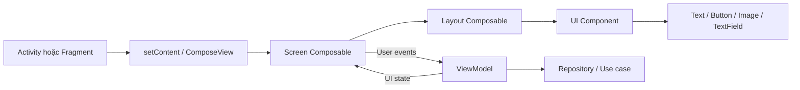
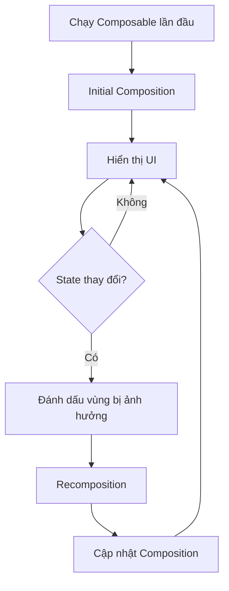
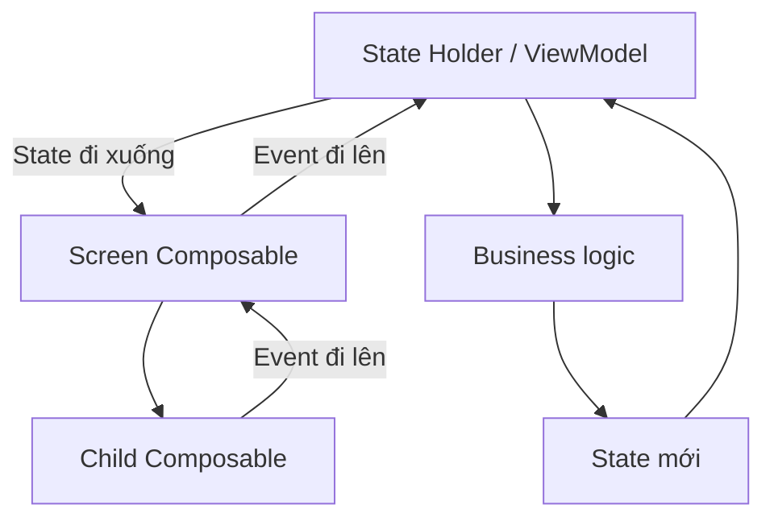
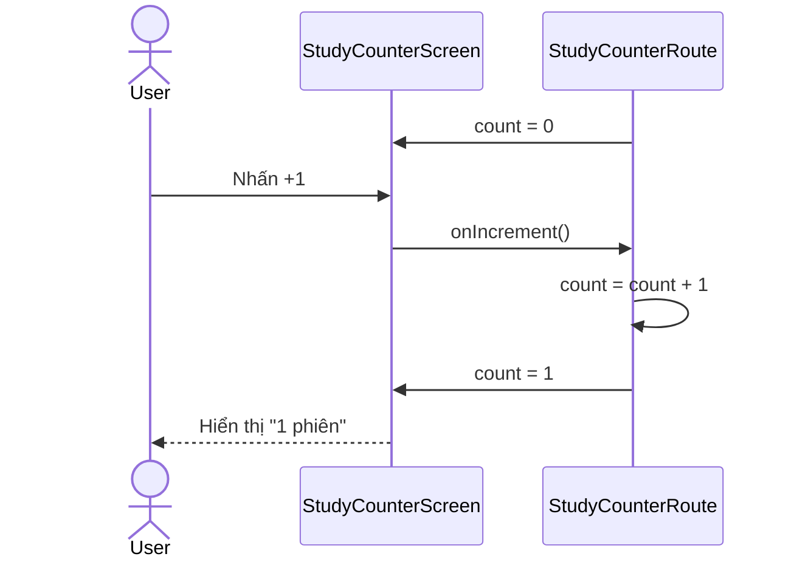

# 022 - Composable Functions

| Thuộc tính              | Nội dung                                   |
| ----------------------- | ------------------------------------------ |
| **Học phần**            | 02 - App Components and User Interface     |
| **Module**              | Module 04 - Interface and Navigation       |
| **Nhóm nội dung**       | Jetpack Compose                            |
| **Nguồn roadmap**       | Interface and Navigation / Jetpack Compose |
| **Loại bài**            | UI                                         |
| **Thứ tự trong module** | 022                                        |
| **Thời lượng gợi ý**    | 30 phút                                    |

---

## 1. Tóm tắt

**Composable Function** là đơn vị cơ bản dùng để xây dựng giao diện trong Jetpack Compose. Thay vì tạo `View`, gắn `View` vào layout và thay đổi từng thuộc tính theo kiểu mệnh lệnh, lập trình viên mô tả giao diện cần xuất hiện dựa trên **state hiện tại**.

Một hàm trở thành composable khi được đánh dấu bằng annotation `@Composable`:

```kotlin
@Composable
fun Greeting(name: String) {
    Text(text = "Xin chào, $name!")
}
```

Composable có thể gọi các composable khác để hình thành một cây giao diện gọi là **Composition**. Khi dữ liệu đầu vào hoặc state thay đổi, Compose chạy lại những phần có khả năng bị ảnh hưởng thông qua quá trình **recomposition**. Composable chỉ được gọi từ một composable khác hoặc từ một ngữ cảnh Compose như `setContent`.

Jetpack Compose hiện là hướng tiếp cận ưu tiên cho việc xây dựng giao diện Android mới. Android Developers mô tả Compose là bộ công cụ UI khai báo dành cho giao diện Android hiện đại, hỗ trợ dữ liệu động, đồ họa, hoạt ảnh và nhiều kích thước thiết bị.


### Vị trí trong ứng dụng Android



Composable Function chủ yếu thuộc **UI layer**, nhưng cách thiết kế composable có ảnh hưởng trực tiếp đến:

* Quản lý state.
* Lifecycle của giao diện.
* Navigation.
* Khả năng tái sử dụng component.
* UI testing.
* Accessibility.
* Hiệu năng và recomposition.
* Khả năng preview và bảo trì giao diện.

---

## 2. Mục tiêu học tập

Sau bài học, anh có thể:

1. Giải thích được Composable Function bằng ngôn ngữ của mình.
2. Viết được một hàm có annotation `@Composable`.
3. Phân biệt composable có state và composable không giữ state.
4. Giải thích được Composition và recomposition.
5. Sử dụng `remember` và `rememberSaveable` đúng mục đích.
6. Áp dụng **state hoisting** với state truyền xuống và event truyền lên.
7. Tách screen-level composable khỏi component-level composable.
8. Tạo `@Preview` để xem UI mà không cần chạy toàn bộ ứng dụng.
9. Viết UI test kiểm tra thay đổi state.
10. Nhận biết những lỗi production như mất state, side effect sai vị trí và recomposition không cần thiết.

Android Studio có thể hiển thị composable được đánh dấu bằng `@Preview` trong Design View. Điều này giúp kiểm tra nhanh component với dữ liệu giả mà không phải khởi động emulator cho từng thay đổi nhỏ.


### Phân bổ 30 phút

| Thời gian | Hoạt động                                        |
| --------: | ------------------------------------------------ |
|    5 phút | Hiểu `@Composable`, Composition và recomposition |
|    7 phút | Tìm hiểu state, `remember` và `rememberSaveable` |
|   10 phút | Xây dựng màn hình bộ đếm                         |
|    5 phút | Viết Preview và UI test                          |
|    3 phút | Kiểm tra lifecycle, rotation và performance      |

---

## 3. Khái niệm chính

### 3.1. Composable Function là gì?

Composable Function là hàm Kotlin được Compose Compiler xử lý để mô tả một phần giao diện.

```kotlin
@Composable
fun UserName(name: String) {
    Text(text = name)
}
```

Hàm trên không trực tiếp tạo và trả về một đối tượng `TextView`. Thay vào đó, lời gọi `Text()` đóng góp một phần tử vào Composition để Compose xây dựng giao diện.

Compose sử dụng Kotlin compiler plugin để biến các lời gọi composable thành những thành phần giao diện tương ứng.

### Quy tắc cơ bản

```kotlin
@Composable
fun ProfileCard(
    name: String,
    modifier: Modifier = Modifier
) {
    Text(
        text = name,
        modifier = modifier
    )
}
```

Một composable tốt thường:

* Nhận dữ liệu cần hiển thị qua tham số.
* Nhận hành động của người dùng qua callback.
* Có tham số `modifier: Modifier = Modifier`.
* Không thực hiện tác vụ nặng trực tiếp trong thân hàm.
* Không phụ thuộc vào thứ tự hoặc số lần hàm được chạy.
* Có phạm vi trách nhiệm nhỏ và rõ ràng.

---

### 3.2. UI khai báo và UI mệnh lệnh

| UI mệnh lệnh truyền thống                  | UI khai báo với Compose           |
| ------------------------------------------ | --------------------------------- |
| Tìm View bằng ID                           | Gọi composable                    |
| Thay đổi từng thuộc tính của View          | Cập nhật state                    |
| Tự đồng bộ dữ liệu với giao diện           | UI được tạo từ state              |
| Dễ xuất hiện trạng thái UI không nhất quán | Một state tạo ra một kết quả UI   |
| Layout thường nằm trong XML                | UI chủ yếu được mô tả bằng Kotlin |

Ví dụ tư duy mệnh lệnh:

```kotlin
button.setOnClickListener {
    count++
    counterText.text = count.toString()
}
```

Tư duy khai báo:

```kotlin
var count by remember { mutableStateOf(0) }

Text(text = count.toString())

Button(onClick = { count++ }) {
    Text("Tăng")
}
```

Ở ví dụ Compose, lập trình viên thay đổi `count`. Sau đó Compose xác định phần giao diện nào đọc `count` và cập nhật phần đó.

---

### 3.3. Composition và recomposition

**Composition** là cấu trúc mô tả giao diện được tạo khi Compose thực thi các composable lần đầu.

**Recomposition** là quá trình Compose gọi lại những composable có khả năng bị ảnh hưởng khi input hoặc state thay đổi. Compose có thể bỏ qua những hàm có đầu vào không đổi thay vì chạy lại toàn bộ cây UI.



Ví dụ:

```kotlin
@Composable
fun Counter() {
    var count by remember { mutableStateOf(0) }

    Column {
        Text(text = "Số lần: $count")

        Button(onClick = { count++ }) {
            Text("Tăng")
        }

        Text(text = "Nội dung không phụ thuộc count")
    }
}
```

Khi `count` thay đổi:

1. Compose phát hiện `State<Int>` đã thay đổi.
2. Phần đọc `count` được đánh dấu cần cập nhật.
3. Composable liên quan có thể được thực thi lại.
4. Phần giao diện không bị ảnh hưởng có thể được bỏ qua.


Lifecycle của một composable gồm ba giai đoạn chính:

```text
Enter Composition
       ↓
Recompose 0 hoặc nhiều lần
       ↓
Leave Composition
```

Một composable có thể được gọi nhiều lần ở các vị trí khác nhau; mỗi lời gọi tạo ra một instance riêng trong Composition. Khi cần quản lý tài nguyên có lifecycle bên ngoài Composition, chẳng hạn coroutine, listener hoặc đăng ký callback, cần sử dụng các Effect API phù hợp.

---

### 3.4. Composable phải nhanh và hạn chế side effect

Composable có thể:

* Được thực thi nhiều lần.
* Bị bỏ qua.
* Bị hủy giữa quá trình recomposition.
* Chạy theo thứ tự khác với thứ tự lập trình viên suy đoán.
* Được gọi rất thường xuyên, kể cả mỗi frame trong animation.

Vì vậy, composable nên **nhanh, idempotent và hạn chế side effect**. Không nên đọc file, ghi database, gửi request mạng hoặc sửa biến dùng chung trực tiếp trong phần dựng UI.

Không nên:

```kotlin
@Composable
fun UserScreen(repository: UserRepository) {
    // Sai: có thể chạy lại nhiều lần khi recomposition.
    repository.loadUser()

    Text("User")
}
```

Nên đưa business logic ra `ViewModel`:

```kotlin
@Composable
fun UserScreen(
    uiState: UserUiState,
    onRetry: () -> Unit
) {
    when (uiState) {
        UserUiState.Loading -> CircularProgressIndicator()
        is UserUiState.Success -> Text(uiState.user.name)
        is UserUiState.Error -> Button(onClick = onRetry) {
            Text("Thử lại")
        }
    }
}
```

Với tác vụ gắn với lifecycle của Composition, có thể sử dụng:

* `LaunchedEffect`
* `DisposableEffect`
* `SideEffect`
* `produceState`
* `rememberCoroutineScope`

Các Effect cần được lựa chọn dựa trên lifecycle và key của tác vụ, không nên dùng chỉ để né việc thiết kế state đúng cách.

---

### 3.5. State trong Composable

State là giá trị có thể thay đổi theo thời gian và ảnh hưởng đến nội dung đang hiển thị.

```kotlin
@Composable
fun NameInput() {
    var name by remember { mutableStateOf("") }

    OutlinedTextField(
        value = name,
        onValueChange = { name = it },
        label = { Text("Họ tên") }
    )
}
```

Compose theo dõi các lần đọc `State`. Khi `name` thay đổi, phần UI đọc `name` được lên lịch recomposition.

#### `remember`

```kotlin
var count by remember {
    mutableStateOf(0)
}
```

`remember` lưu giá trị trong Composition và giữ nó qua các lần recomposition. Khi composable rời khỏi Composition, giá trị có thể bị quên. `remember` không phải database hoặc cơ chế lưu trữ lâu dài.

#### `rememberSaveable`

```kotlin
var count by rememberSaveable {
    mutableStateOf(0)
}
```

`rememberSaveable` phù hợp với lượng nhỏ UI state cần khôi phục sau khi Activity hoặc process được hệ thống tạo lại, chẳng hạn:

* Nội dung đang nhập.
* ID item đang chọn.
* Trạng thái mở hoặc đóng.
* Bộ lọc đang dùng.
* Giá trị bộ đếm nhỏ.

Không nên lưu danh sách lớn, bitmap hoặc object phức tạp trong `rememberSaveable` vì cơ chế này sử dụng saved instance state và `Bundle`, vốn có giới hạn kích thước.

| Nhu cầu                                                   | API phù hợp                     |
| --------------------------------------------------------- | ------------------------------- |
| Giữ giá trị qua recomposition                             | `remember`                      |
| UI state nhỏ cần khôi phục khi recreate                   | `rememberSaveable`              |
| Screen state có business logic                            | `ViewModel`                     |
| State nhỏ trong ViewModel cần sống qua process recreation | `SavedStateHandle`              |
| Dữ liệu cần tồn tại lâu dài                               | Room, DataStore hoặc repository |

---

### 3.6. Stateful và stateless composable

#### Stateful composable

Stateful composable tự giữ và tự thay đổi state:

```kotlin
@Composable
fun StatefulCounter() {
    var count by rememberSaveable {
        mutableStateOf(0)
    }

    Button(onClick = { count++ }) {
        Text("Đã nhấn $count lần")
    }
}
```

Ưu điểm:

* Dễ gọi.
* Phù hợp với component nhỏ, state cục bộ.

Hạn chế:

* Caller không điều khiển được state.
* Khó tái sử dụng trong nhiều tình huống.
* Khó kiểm thử riêng.
* Khó đồng bộ state với component khác.

#### Stateless composable

```kotlin
@Composable
fun StatelessCounter(
    count: Int,
    onIncrement: () -> Unit
) {
    Button(onClick = onIncrement) {
        Text("Đã nhấn $count lần")
    }
}
```

Stateless composable không sở hữu state. Nó chỉ:

1. Nhận state.
2. Hiển thị state.
3. Phát event lên caller.

Composable không giữ state thường dễ preview, tái sử dụng và kiểm thử hơn. Android Developers khuyến nghị state hoisting để tách phần hiển thị khỏi nơi lưu state.

---

### 3.7. State hoisting

**State hoisting** là đưa state lên caller của composable.

Mẫu tổng quát:

```kotlin
@Composable
fun Component(
    value: T,
    onValueChange: (T) -> Unit
)
```

Ví dụ:

```kotlin
@Composable
fun NameScreen() {
    var name by rememberSaveable {
        mutableStateOf("")
    }

    NameContent(
        name = name,
        onNameChange = { name = it }
    )
}

@Composable
fun NameContent(
    name: String,
    onNameChange: (String) -> Unit
) {
    OutlinedTextField(
        value = name,
        onValueChange = onNameChange
    )
}
```

Lợi ích của state hoisting:

* Tạo một nguồn sự thật duy nhất.
* Caller kiểm soát được state.
* State có thể chia sẻ cho nhiều composable.
* Component dễ preview.
* Component dễ UI test.
* Có thể chuyển state lên `ViewModel`.
* Giảm sự phụ thuộc giữa UI và business logic.

State nên được đưa lên **tổ tiên chung thấp nhất** của các composable cần đọc hoặc thay đổi state. Từ state owner, nên truyền state bất biến xuống và truyền event callback lên.


---

### 3.8. Unidirectional Data Flow

Compose phù hợp với mô hình **Unidirectional Data Flow – UDF**:



Chu trình:

1. UI hiển thị state.
2. Người dùng thực hiện hành động.
3. Composable phát event.
4. State owner xử lý event.
5. State owner tạo state mới.
6. Compose cập nhật phần UI liên quan.

UDF giúp tách nơi hiển thị state khỏi nơi thay đổi state, cải thiện khả năng kiểm thử, đóng gói state và giữ giao diện nhất quán.


---

### 3.9. Screen composable và UI composable

Trong ứng dụng thực tế, nên tách hai lớp composable.

#### Route hoặc screen-level composable

* Kết nối `ViewModel`.
* Thu thập `StateFlow`.
* Xử lý navigation.
* Gọi business event.
* Không nhất thiết phù hợp để Preview trực tiếp.

```kotlin
@Composable
fun ProfileRoute(
    viewModel: ProfileViewModel,
    onNavigateBack: () -> Unit
) {
    val uiState by viewModel.uiState.collectAsStateWithLifecycle()

    ProfileScreen(
        uiState = uiState,
        onRetry = viewModel::retry,
        onBack = onNavigateBack
    )
}
```

#### Content hoặc UI-level composable

* Chỉ nhận state và callback.
* Không biết repository.
* Không nhận toàn bộ `ViewModel`.
* Dễ Preview.
* Dễ test với fake state.

```kotlin
@Composable
fun ProfileScreen(
    uiState: ProfileUiState,
    onRetry: () -> Unit,
    onBack: () -> Unit
) {
    // Render UI.
}
```

Truyền `ViewModel` xuống mọi component làm tăng coupling, khiến component khó tái sử dụng, khó preview và khó kiểm thử. Hướng dẫn Preview của Android Developers khuyến nghị tách composable nhận dữ liệu thuần khỏi composable kết nối `ViewModel`.

---

## 4. Thực hành

### 4.1. Yêu cầu

Xây dựng màn hình **Bộ đếm phiên học** có các chức năng:

* Hiển thị số phiên học.
* Tăng số phiên.
* Giảm số phiên nhưng không thấp hơn `0`.
* Đặt lại về `0`.
* Giữ state khi xoay màn hình.
* Tách stateful và stateless composable.
* Có `@Preview`.
* Có UI test.

### Luồng state



---

### 4.2. Tạo `MainActivity.kt`

```kotlin
package com.example.composablefunctions

import android.os.Bundle
import androidx.activity.ComponentActivity
import androidx.activity.compose.setContent
import androidx.compose.material3.MaterialTheme
import com.example.composablefunctions.ui.StudyCounterRoute

class MainActivity : ComponentActivity() {

    override fun onCreate(savedInstanceState: Bundle?) {
        super.onCreate(savedInstanceState)

        setContent {
            MaterialTheme {
                StudyCounterRoute()
            }
        }
    }
}
```

`setContent` xác định nội dung Compose của Activity và là điểm bắt đầu để gọi cây composable.

---

### 4.3. Tạo `StudyCounterScreen.kt`

```kotlin
package com.example.composablefunctions.ui

import androidx.compose.foundation.layout.Arrangement
import androidx.compose.foundation.layout.Column
import androidx.compose.foundation.layout.Row
import androidx.compose.foundation.layout.Spacer
import androidx.compose.foundation.layout.fillMaxSize
import androidx.compose.foundation.layout.height
import androidx.compose.foundation.layout.padding
import androidx.compose.material3.Button
import androidx.compose.material3.MaterialTheme
import androidx.compose.material3.OutlinedButton
import androidx.compose.material3.Surface
import androidx.compose.material3.Text
import androidx.compose.material3.TextButton
import androidx.compose.runtime.Composable
import androidx.compose.runtime.getValue
import androidx.compose.runtime.mutableStateOf
import androidx.compose.runtime.saveable.rememberSaveable
import androidx.compose.runtime.setValue
import androidx.compose.ui.Alignment
import androidx.compose.ui.Modifier
import androidx.compose.ui.tooling.preview.Preview
import androidx.compose.ui.unit.dp

/**
 * Stateful composable.
 *
 * Chịu trách nhiệm sở hữu UI state và chuyển state/event
 * cho composable hiển thị bên dưới.
 */
@Composable
fun StudyCounterRoute(
    modifier: Modifier = Modifier
) {
    var count by rememberSaveable {
        mutableStateOf(0)
    }

    StudyCounterScreen(
        count = count,
        onIncrement = {
            count += 1
        },
        onDecrement = {
            if (count > 0) {
                count -= 1
            }
        },
        onReset = {
            count = 0
        },
        modifier = modifier
    )
}

/**
 * Stateless composable.
 *
 * Không tự lưu count. Mọi state và event đều được truyền
 * qua tham số nên component dễ preview và kiểm thử.
 */
@Composable
fun StudyCounterScreen(
    count: Int,
    onIncrement: () -> Unit,
    onDecrement: () -> Unit,
    onReset: () -> Unit,
    modifier: Modifier = Modifier
) {
    Surface(
        modifier = modifier.fillMaxSize()
    ) {
        Column(
            modifier = Modifier.padding(24.dp),
            horizontalAlignment = Alignment.CenterHorizontally,
            verticalArrangement = Arrangement.Center
        ) {
            Text(
                text = "Mục tiêu học tập",
                style = MaterialTheme.typography.headlineMedium
            )

            Spacer(modifier = Modifier.height(12.dp))

            Text(
                text = "$count phiên",
                style = MaterialTheme.typography.displayMedium
            )

            Spacer(modifier = Modifier.height(24.dp))

            Row(
                horizontalArrangement = Arrangement.spacedBy(12.dp)
            ) {
                OutlinedButton(
                    onClick = onDecrement,
                    enabled = count > 0
                ) {
                    Text(text = "-1")
                }

                Button(
                    onClick = onIncrement
                ) {
                    Text(text = "+1")
                }
            }

            Spacer(modifier = Modifier.height(8.dp))

            TextButton(
                onClick = onReset,
                enabled = count > 0
            ) {
                Text(text = "Đặt lại")
            }
        }
    }
}
```

### Phân tích

| Thành phần            | Trách nhiệm                                |
| --------------------- | ------------------------------------------ |
| `StudyCounterRoute`   | Sở hữu `count`                             |
| `rememberSaveable`    | Giữ UI state nhỏ khi Activity được tạo lại |
| `StudyCounterScreen`  | Hiển thị state                             |
| `onIncrement`         | Event yêu cầu tăng state                   |
| `onDecrement`         | Event yêu cầu giảm state                   |
| `onReset`             | Event yêu cầu đặt lại                      |
| `enabled = count > 0` | Ngăn người dùng tạo state không hợp lệ     |

---

### 4.4. Thêm Preview

```kotlin
@Preview(
    name = "Bộ đếm - trạng thái ban đầu",
    showBackground = true
)
@Composable
private fun StudyCounterInitialPreview() {
    MaterialTheme {
        StudyCounterScreen(
            count = 0,
            onIncrement = {},
            onDecrement = {},
            onReset = {}
        )
    }
}

@Preview(
    name = "Bộ đếm - đã học",
    showBackground = true
)
@Composable
private fun StudyCounterProgressPreview() {
    MaterialTheme {
        StudyCounterScreen(
            count = 5,
            onIncrement = {},
            onDecrement = {},
            onReset = {}
        )
    }
}
```

Các callback rỗng phù hợp trong Preview vì mục tiêu ở đây là kiểm tra kết quả render của component với state giả.

Có thể mở rộng Preview để kiểm tra:

```kotlin
@Preview(
    showBackground = true,
    fontScale = 1.5f
)
```

Hoặc tạo preview cho:

* Light theme.
* Dark theme.
* Font lớn.
* Màn hình nhỏ.
* Tablet.
* Ngôn ngữ khác.
* Nội dung dài hoặc rỗng.


Compose Preview có một số giới hạn như không có network access, file access và không thể tự xây dựng mọi `ViewModel` hoặc dependency graph. Vì vậy, component nhận state thuần sẽ dễ preview hơn component phụ thuộc trực tiếp vào repository hoặc dependency injection.

---

### 4.5. Kết quả mong đợi

```text
┌─────────────────────────────┐
│                             │
│      Mục tiêu học tập       │
│                             │
│           3 phiên           │
│                             │
│         [-1]  [+1]          │
│                             │
│           Đặt lại           │
│                             │
└─────────────────────────────┘
```

### Kiểm tra nhanh

1. Mở ứng dụng.
2. Nhấn `+1` ba lần.
3. Xác nhận màn hình hiển thị `3 phiên`.
4. Nhấn `-1`.
5. Xác nhận còn `2 phiên`.
6. Nhấn `Đặt lại`.
7. Xác nhận trở về `0 phiên`.
8. Xác nhận nút `-1` và `Đặt lại` bị vô hiệu hóa khi count bằng `0`.
9. Tăng count rồi xoay màn hình.
10. Xác nhận count vẫn được khôi phục.

---

## 5. Bài tập


### Bài tập 1: Bộ đếm có giới hạn

Thay đổi component để:

* Giá trị tối thiểu là `0`.
* Giá trị tối đa là `10`.
* Nút `+1` bị vô hiệu hóa khi đạt `10`.
* Hiển thị thông báo `"Đã hoàn thành mục tiêu"` khi đạt `10`.

Gợi ý:

```kotlin
Button(
    onClick = onIncrement,
    enabled = count < 10
) {
    Text("+1")
}

if (count == 10) {
    Text("Đã hoàn thành mục tiêu")
}
```

---

### Bài tập 2: Thêm tên mục tiêu

Thêm `OutlinedTextField` để người dùng nhập tên mục tiêu:

```text
Tên mục tiêu: Học Jetpack Compose
Số phiên: 4
```

Yêu cầu:

* Dùng `rememberSaveable`.
* Tách `goalName` và `onGoalNameChange`.
* Không để `OutlinedTextField` tự quản lý state.
* Khi xoay màn hình, nội dung đang nhập không bị mất.

Chữ ký gợi ý:

```kotlin
@Composable
fun StudyCounterScreen(
    goalName: String,
    count: Int,
    onGoalNameChange: (String) -> Unit,
    onIncrement: () -> Unit,
    onDecrement: () -> Unit,
    onReset: () -> Unit,
    modifier: Modifier = Modifier
)
```

---

### Bài tập 3: Tách component

Tách màn hình thành các composable nhỏ:

```text
StudyCounterRoute
└── StudyCounterScreen
    ├── StudyGoalHeader
    ├── CounterValue
    ├── CounterControls
    └── CompletionMessage
```

Ví dụ:

```kotlin
@Composable
fun CounterControls(
    canIncrease: Boolean,
    canDecrease: Boolean,
    onIncrement: () -> Unit,
    onDecrement: () -> Unit,
    modifier: Modifier = Modifier
) {
    Row(
        modifier = modifier,
        horizontalArrangement = Arrangement.spacedBy(12.dp)
    ) {
        OutlinedButton(
            onClick = onDecrement,
            enabled = canDecrease
        ) {
            Text("-1")
        }

        Button(
            onClick = onIncrement,
            enabled = canIncrease
        ) {
            Text("+1")
        }
    }
}
```

Không nên tách mọi `Text` thành một hàm riêng. Chỉ nên tách khi component có ít nhất một trong các đặc điểm:

* Có ý nghĩa UI riêng.
* Có khả năng tái sử dụng.
* Có logic hiển thị riêng.
* Có kích thước đủ lớn.
* Cần Preview hoặc test độc lập.
* Làm composable cha dễ đọc hơn.

---

### Bài tập 4: Nâng state lên ViewModel

Tạo:

```kotlin
data class StudyUiState(
    val goalName: String = "",
    val count: Int = 0,
    val maximum: Int = 10
)
```

Sau đó triển khai:

```kotlin
class StudyViewModel : ViewModel() {

    var uiState by mutableStateOf(StudyUiState())
        private set

    fun increment() {
        if (uiState.count < uiState.maximum) {
            uiState = uiState.copy(count = uiState.count + 1)
        }
    }

    fun decrement() {
        if (uiState.count > 0) {
            uiState = uiState.copy(count = uiState.count - 1)
        }
    }

    fun reset() {
        uiState = uiState.copy(count = 0)
    }

    fun updateGoalName(value: String) {
        uiState = uiState.copy(goalName = value)
    }
}
```

Route composable:

```kotlin
@Composable
fun StudyCounterRoute(
    viewModel: StudyViewModel = viewModel()
) {
    val uiState = viewModel.uiState

    StudyCounterScreen(
        goalName = uiState.goalName,
        count = uiState.count,
        maximum = uiState.maximum,
        onGoalNameChange = viewModel::updateGoalName,
        onIncrement = viewModel::increment,
        onDecrement = viewModel::decrement,
        onReset = viewModel::reset
    )
}
```

Mục tiêu là giữ `ViewModel` ở screen-level composable và không truyền nguyên `ViewModel` xuống các component nhỏ.

---

### Bài tập 5: Viết UI test

Compose cung cấp API để tìm node, thực hiện hành động, kiểm tra thuộc tính và đồng bộ test với trạng thái UI. Các test thường tương tác với **semantics tree** thay vì truy cập trực tiếp từng composable trong source code.

Thêm dependency UI test theo cấu hình Compose của dự án:

```kotlin
dependencies {
    androidTestImplementation(
        platform(libs.androidx.compose.bom)
    )
    androidTestImplementation(
        "androidx.compose.ui:ui-test-junit4"
    )
    debugImplementation(
        "androidx.compose.ui:ui-test-manifest"
    )
}
```

Tạo test:

```kotlin
package com.example.composablefunctions

import androidx.compose.material3.MaterialTheme
import androidx.compose.ui.test.assertIsDisplayed
import androidx.compose.ui.test.assertIsNotEnabled
import androidx.compose.ui.test.onNodeWithText
import androidx.compose.ui.test.performClick
import androidx.compose.ui.test.junit4.createComposeRule
import com.example.composablefunctions.ui.StudyCounterRoute
import org.junit.Rule
import org.junit.Test

class StudyCounterScreenTest {

    @get:Rule
    val composeTestRule = createComposeRule()

    @Test
    fun increment_updatesDisplayedCount() {
        composeTestRule.setContent {
            MaterialTheme {
                StudyCounterRoute()
            }
        }

        composeTestRule
            .onNodeWithText("0 phiên")
            .assertIsDisplayed()

        composeTestRule
            .onNodeWithText("+1")
            .performClick()

        composeTestRule
            .onNodeWithText("1 phiên")
            .assertIsDisplayed()
    }

    @Test
    fun decrement_isDisabledWhenCountIsZero() {
        composeTestRule.setContent {
            MaterialTheme {
                StudyCounterRoute()
            }
        }

        composeTestRule
            .onNodeWithText("-1")
            .assertIsNotEnabled()
    }

    @Test
    fun reset_returnsCountToZero() {
        composeTestRule.setContent {
            MaterialTheme {
                StudyCounterRoute()
            }
        }

        composeTestRule
            .onNodeWithText("+1")
            .performClick()

        composeTestRule
            .onNodeWithText("+1")
            .performClick()

        composeTestRule
            .onNodeWithText("Đặt lại")
            .performClick()

        composeTestRule
            .onNodeWithText("0 phiên")
            .assertIsDisplayed()
    }
}
```

---

## 6. Checklist hoàn thành


### Kiến thức

* [ ] Giải thích được `@Composable` dùng để làm gì.
* [ ] Biết composable chỉ được gọi trong ngữ cảnh Compose.
* [ ] Phân biệt được Composition và recomposition.
* [ ] Biết state thay đổi có thể kích hoạt recomposition.
* [ ] Phân biệt được `remember` và `rememberSaveable`.
* [ ] Phân biệt được stateful và stateless composable.
* [ ] Giải thích được state hoisting.
* [ ] Hiểu state đi xuống và event đi lên.
* [ ] Biết khi nào nên dùng `ViewModel`.
* [ ] Biết side effect không nên được thực hiện tùy ý trong thân composable.

### Code

* [ ] Có ít nhất một hàm `@Composable`.
* [ ] Có tham số `Modifier`.
* [ ] Component hiển thị không nhận trực tiếp repository.
* [ ] Component nhỏ không nhận toàn bộ `ViewModel`.
* [ ] State được giữ ở một nơi rõ ràng.
* [ ] Callback được đặt tên theo hành động người dùng.
* [ ] Không sửa state trực tiếp trong child composable.
* [ ] Có trạng thái disabled cho hành động không hợp lệ.
* [ ] Có `@Preview` với dữ liệu mẫu.
* [ ] Có ít nhất một UI test.

### UX và accessibility

* [ ] UI cập nhật ngay khi người dùng thao tác.
* [ ] Nút có nhãn rõ ràng.
* [ ] Không chỉ dùng màu sắc để truyền đạt trạng thái.
* [ ] Kiểm tra font scale lớn.
* [ ] Kiểm tra light theme và dark theme.
* [ ] Kiểm tra TalkBack hoặc semantics.
* [ ] Touch target đủ lớn.
* [ ] Nội dung dài không làm vỡ layout.
* [ ] UI hoạt động trên màn hình nhỏ và màn hình lớn.

### Lifecycle và state restoration

* [ ] State không bị mất khi recomposition.
* [ ] UI state quan trọng không bị mất khi xoay màn hình.
* [ ] Không đặt object lớn trong `rememberSaveable`.
* [ ] Business state được đưa lên `ViewModel` khi cần.
* [ ] Dữ liệu lâu dài được lưu trong data layer.
* [ ] Effect có key và cleanup phù hợp.
* [ ] Không giữ tham chiếu Activity hoặc View không cần thiết.

### Portfolio artifact

* [ ] Có screenshot màn hình.
* [ ] Có GIF hoặc video ngắn thể hiện state thay đổi.
* [ ] Có README mô tả state hoisting.
* [ ] Có sơ đồ state đi xuống, event đi lên.
* [ ] Có đường dẫn tới UI test.
* [ ] Có ghi chú về rotation và state restoration.

---

## 7. Ghi chú sản xuất

### 7.1. Không coi recomposition là lỗi

Recomposition là cơ chế bình thường của Compose. Vấn đề chỉ xuất hiện khi:

* Composable chạy lại quá nhiều so với mong đợi.
* Composable không cập nhật khi state thay đổi.
* Có tác vụ nặng trong composition.
* Tham số không ổn định khiến phạm vi cập nhật quá rộng.
* Component đọc nhiều state hơn mức cần thiết.

Layout Inspector có thể hiển thị số lần composable được recomposed hoặc skipped, giúp xác định những vùng giao diện cập nhật bất thường. Tuy nhiên, không nên tối ưu sớm chỉ để mọi composable đều có thể được skip; cần đo lường và xác nhận vấn đề hiệu năng thực tế trước.


---

### 7.2. Tránh tác vụ nặng trong composable

Không nên:

```kotlin
@Composable
fun ProductScreen(repository: ProductRepository) {
    val products = repository.loadProductsSynchronously()
    ProductList(products)
}
```

Nên:

```kotlin
@Composable
fun ProductScreen(
    uiState: ProductUiState,
    onRetry: () -> Unit
) {
    when (uiState) {
        ProductUiState.Loading -> CircularProgressIndicator()
        is ProductUiState.Success -> ProductList(uiState.products)
        is ProductUiState.Error -> ErrorContent(onRetry)
    }
}
```

Network, database và xử lý dữ liệu nên nằm trong ViewModel, use case hoặc repository.

---

### 7.3. Chỉ truyền dữ liệu component thực sự cần

Không nên:

```kotlin
@Composable
fun UserAvatar(
    uiState: EntireAppUiState
)
```

Nên:

```kotlin
@Composable
fun UserAvatar(
    avatarUrl: String,
    userName: String
)
```

Truyền object quá lớn khiến component:

* Biết nhiều thông tin không cần thiết.
* Khó tái sử dụng.
* Khó preview.
* Khó test.
* Có thể bị recomposition khi field không liên quan thay đổi.

---

### 7.4. Dùng state bất biến

Ưu tiên:

```kotlin
data class ProfileUiState(
    val name: String,
    val isLoading: Boolean,
    val errorMessage: String?
)
```

Không nên để UI sửa trực tiếp collection mutable được chia sẻ:

```kotlin
val users: MutableList<User>
```

Thay vào đó, ViewModel hoặc state owner chịu trách nhiệm tạo state mới và phát state đó cho UI.

---

### 7.5. Không lưu dữ liệu lớn bằng `rememberSaveable`

Sai mục đích:

```kotlin
var bitmapList by rememberSaveable {
    mutableStateOf(largeBitmapList)
}
```

Nên lưu ID hoặc khóa tối thiểu:

```kotlin
var selectedPhotoId by rememberSaveable {
    mutableStateOf<String?>(null)
}
```

Sau đó khôi phục dữ liệu đầy đủ từ repository.

Saved instance state nên lưu lượng nhỏ state tạm thời cần thiết để xây dựng lại màn hình, không thay thế database hoặc persistent storage.

---

### 7.6. Thiết kế đầy đủ UI state

Một màn hình production thường cần nhiều trạng thái hơn `success`:

```kotlin
sealed interface ProductsUiState {
    data object Loading : ProductsUiState

    data class Success(
        val products: List<Product>
    ) : ProductsUiState

    data class Error(
        val message: String
    ) : ProductsUiState

    data object Empty : ProductsUiState
}
```

Composable phải xử lý:

* Loading.
* Empty.
* Success.
* Error.
* Retry.
* Offline.
* Nội dung cũ trong khi refresh.
* Permission denied nếu có.
* Session expired nếu có.

---

### 7.7. Release checklist

Trước khi phát hành màn hình sử dụng composable, cần kiểm tra:

| Nhóm          | Câu hỏi                                                              |
| ------------- | -------------------------------------------------------------------- |
| State         | State có một nguồn sự thật duy nhất không?                           |
| Rotation      | Nội dung người dùng đang nhập có bị mất không?                       |
| Background    | Màn hình có khôi phục hợp lý sau khi hệ thống tạo lại process không? |
| Network       | Loading, timeout, retry và offline đã được xử lý chưa?               |
| Navigation    | Quay lại có khôi phục đúng state không?                              |
| Performance   | Có composable nào recomposition bất thường không?                    |
| Accessibility | Semantics, contrast và touch target có đạt yêu cầu không?            |
| Adaptive UI   | UI có hoạt động trên điện thoại, tablet và font lớn không?           |
| Testing       | Có test cho hành vi quan trọng và regression không?                  |
| Analytics     | Event quan trọng có được ghi nhận đúng một lần không?                |

---

## Tóm tắt ghi nhớ

```text
Composable Function
        │
        ├── Mô tả UI bằng Kotlin
        ├── Nhận state qua tham số
        ├── Phát event qua callback
        ├── Có thể được chạy lại khi recomposition
        ├── Nên nhỏ, nhanh và ít side effect
        │
        ├── remember
        │      └── Giữ state qua recomposition
        │
        ├── rememberSaveable
        │      └── Khôi phục UI state nhỏ khi recreation
        │
        └── State hoisting
               ├── State đi xuống
               └── Event đi lên
```

> **Công thức thực hành:**
> `UI = Composable(state, events)`

Một composable production tốt không chỉ hiển thị đúng giao diện. Nó còn phải có ranh giới state rõ ràng, xử lý lifecycle đúng, dễ preview, dễ test và không tạo ra công việc dư thừa trong recomposition.

---

## Tài liệu tham khảo chính

* Android Compose Tutorial: định nghĩa, cách gọi và Preview của Composable Function.
* Thinking in Compose: mental model, recomposition và side effect.
* State and Jetpack Compose: `remember`, `rememberSaveable`, stateful, stateless và state hoisting.
* Lifecycle of composables: Composition lifecycle và recomposition.
* Compose UI Architecture: Unidirectional Data Flow.
* Compose Testing: semantics, actions, assertions và synchronization.
* Save UI state in Compose: lựa chọn API lưu và khôi phục state.
