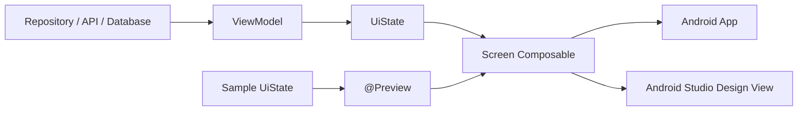
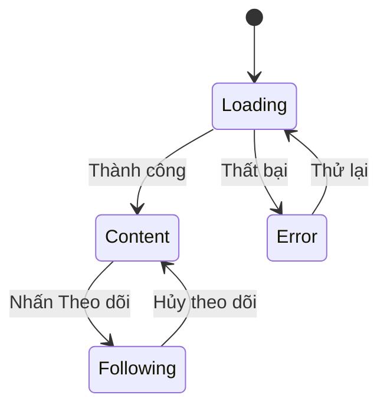
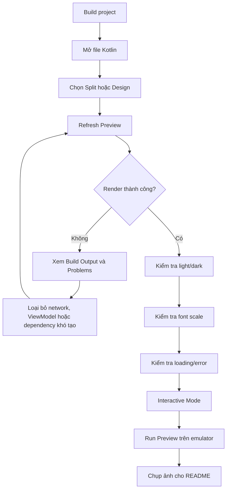
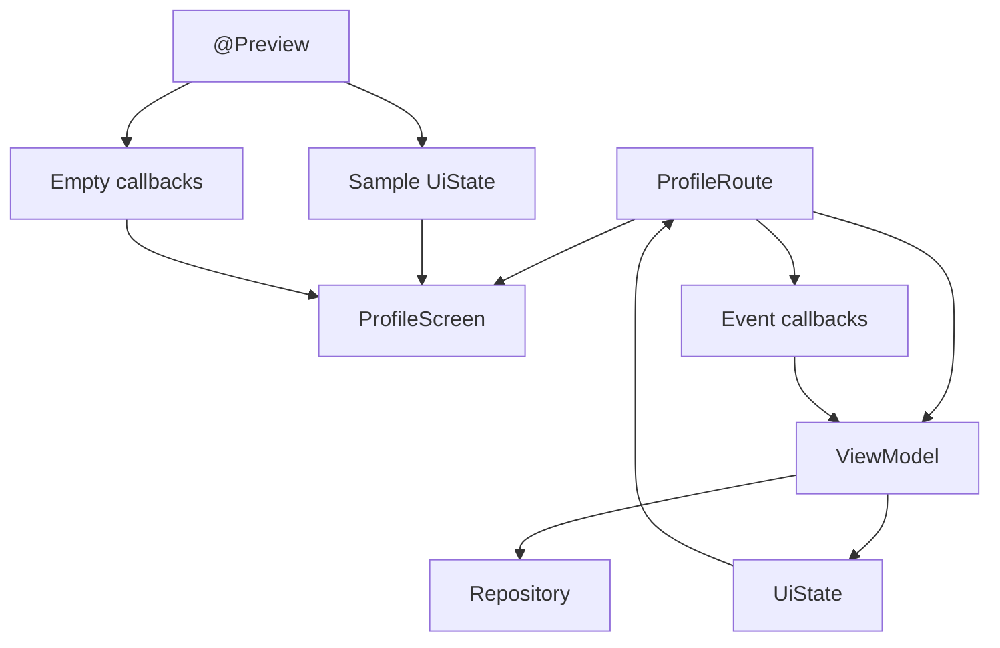

# 023 — Preview trong Jetpack Compose

> **Học phần:** 02 — App Components and User Interface
> **Module:** Module 04 — Interface and Navigation
> **Nhóm nội dung:** Jetpack Compose
> **Nguồn roadmap:** Interface and Navigation / Jetpack Compose
> **Loại bài:** UI
> **Thứ tự trong module:** 023
> **Thời lượng gợi ý:** 30 phút

---

## 1. Tóm tắt

**Preview** là công cụ của Android Studio cho phép lập trình viên xem trước một `Composable` ngay trong IDE mà không cần khởi động toàn bộ ứng dụng trên emulator hoặc thiết bị thật.

Một hàm được đánh dấu bằng `@Preview` sẽ xuất hiện trong cửa sổ **Design** hoặc **Split** của Android Studio:

```kotlin
@Preview(showBackground = true)
@Composable
fun GreetingPreview() {
    Greeting(name = "Android")
}
```

Android Studio có thể cập nhật giao diện Preview khi code thay đổi, giúp rút ngắn vòng lặp:

```text
Viết code → Xem giao diện → Điều chỉnh → Xem lại
```

Preview đặc biệt hữu ích khi cần kiểm tra nhanh:

* Giao diện sáng và tối.
* Kích thước màn hình khác nhau.
* Cỡ chữ lớn.
* Ngôn ngữ khác nhau.
* Trạng thái loading, thành công, trống và lỗi.
* Nội dung dài hoặc dữ liệu biên.
* Animation và tương tác đơn giản.

Android Studio render Preview bằng **Layoutlib**, một phiên bản Android framework chạy bên ngoài thiết bị. Vì vậy, Preview nhẹ và nhanh hơn việc khởi động emulator, nhưng bị giới hạn về mạng, tệp và một số API phụ thuộc `Context`.


*Nguồn ảnh: Android Developers — Compose Preview.*

### Preview nằm ở đâu trong kiến trúc ứng dụng?



Trong ứng dụng thật, `UiState` thường đến từ `ViewModel`. Trong Preview, lập trình viên tạo **sample state** và truyền trực tiếp vào `Composable`.

Điều này khuyến khích thiết kế giao diện theo mô hình:

```kotlin
UI = function(state, events)
```

Thay vì để UI tự truy cập mạng, database hoặc phụ thuộc trực tiếp vào `ViewModel`.

---

## 2. Mục tiêu học tập

Sau bài học, người học có thể:

* Giải thích được mục đích của `@Preview`.
* Tạo Preview cho một `Composable`.
* Cấu hình kích thước, theme, locale, font scale và system UI.
* Tạo nhiều Preview cho nhiều trạng thái giao diện.
* Sử dụng `PreviewParameterProvider` để cung cấp dữ liệu mẫu.
* Phân biệt Preview, Interactive Mode, Run Preview và screenshot test.
* Nhận biết giới hạn của Preview.
* Tách `ViewModel` khỏi composable hiển thị để giao diện dễ preview và kiểm thử.
* Tạo screenshot hoặc README làm artifact cho portfolio.

Các multipreview template như `@PreviewScreenSizes`, `@PreviewFontScales`, `@PreviewLightDark` và `@PreviewDynamicColors` cho phép render nhiều cấu hình phổ biến bằng một annotation.


*Nguồn ảnh: Android Developers — Multipreview template.*

### Kết quả tối thiểu của bài học

Cuối bài, người học cần tạo được:

1. Một `Composable` nhận `UiState`.
2. Một Preview trạng thái bình thường.
3. Một Preview trạng thái loading hoặc lỗi.
4. Một Preview light/dark.
5. Một screenshot đặt trong README.

---

## 3. Khái niệm chính

### 3.1. Annotation `@Preview`

`@Preview` đánh dấu một hàm `@Composable` để Android Studio render hàm đó trong cửa sổ thiết kế.

```kotlin
import androidx.compose.runtime.Composable
import androidx.compose.ui.tooling.preview.Preview

@Preview
@Composable
fun SimplePreview() {
    Text(text = "Hello Preview")
}
```

Một hàm Preview cơ bản nên:

* Có annotation `@Composable`.
* Có annotation `@Preview` hoặc multipreview.
* Không thực hiện network request.
* Không đọc file thật.
* Không yêu cầu dependency graph phức tạp.
* Nhận dữ liệu mẫu rõ ràng.
* Gọi lại composable được dùng trong ứng dụng thật.

Không nên xây dựng một giao diện khác chỉ dành cho Preview. Preview phải gọi đúng component hoặc screen đang được sử dụng trong production.


*Nguồn ảnh: Android Developers — Sample Preview function.*

---

### 3.2. Các tham số thường dùng

```kotlin
@Preview(
    name = "Profile - Light",
    group = "Profile",
    showBackground = true,
    showSystemUi = false,
    widthDp = 360,
    heightDp = 640,
    fontScale = 1.0f,
    locale = "vi",
    apiLevel = 35
)
@Composable
fun ProfilePreview() {
    ProfileScreen(...)
}
```

| Tham số           | Công dụng                               |
| ----------------- | --------------------------------------- |
| `name`            | Tên hiển thị của Preview                |
| `group`           | Gom các Preview cùng nhóm               |
| `showBackground`  | Thêm nền phía sau component             |
| `backgroundColor` | Chọn màu nền ARGB                       |
| `showSystemUi`    | Hiển thị status bar và navigation bar   |
| `widthDp`         | Chiều rộng vùng Preview                 |
| `heightDp`        | Chiều cao vùng Preview                  |
| `fontScale`       | Mô phỏng cỡ chữ hệ thống                |
| `locale`          | Mô phỏng locale                         |
| `uiMode`          | Mô phỏng night mode hoặc UI mode        |
| `device`          | Chọn thiết bị hoặc device specification |
| `apiLevel`        | Render với một API level                |
| `wallpaper`       | Kiểm tra dynamic color theo wallpaper   |

Android Studio cho phép đặt cùng nhiều annotation `@Preview` lên một hàm để render nhiều biến thể.

```kotlin
@Preview(
    name = "Tiếng Việt",
    locale = "vi",
    showBackground = true
)
@Preview(
    name = "English",
    locale = "en",
    showBackground = true
)
@Composable
fun LocalizedProfilePreview() {
    AppTheme {
        ProfileScreen(...)
    }
}
```

---

### 3.3. Preview và state

Compose là UI hướng trạng thái. Khi state thay đổi, Compose thực hiện recomposition cho những phần giao diện cần cập nhật.

Ví dụ một màn hình hồ sơ có thể có các trạng thái:

```kotlin
data class ProfileUiState(
    val name: String,
    val role: String,
    val followerCount: Int,
    val isFollowing: Boolean,
    val isLoading: Boolean = false,
    val errorMessage: String? = null
)
```

Mỗi trạng thái quan trọng nên có một Preview tương ứng:

| Trạng thái   | Nội dung cần quan sát                     |
| ------------ | ----------------------------------------- |
| Default      | Giao diện thông thường                    |
| Loading      | Progress indicator, nút bị vô hiệu hóa    |
| Following    | Nhãn và trạng thái nút thay đổi           |
| Error        | Thông báo lỗi dễ đọc                      |
| Long content | Text có bị tràn hay cắt không             |
| Empty        | Khoảng trống và hướng dẫn người dùng      |
| Large font   | Layout có bị vỡ khi tăng font scale không |



Preview không tự gọi API để chuyển giữa các trạng thái. Thay vào đó, ta truyền từng sample state vào composable và render chúng riêng biệt.

---

### 3.4. Preview và event callback

Composable nên nhận event dưới dạng callback:

```kotlin
@Composable
fun ProfileCard(
    state: ProfileUiState,
    onFollowClick: () -> Unit,
    modifier: Modifier = Modifier
)
```

Trong ứng dụng thật:

```kotlin
ProfileCard(
    state = uiState,
    onFollowClick = viewModel::toggleFollow
)
```

Trong Preview:

```kotlin
ProfileCard(
    state = sampleProfile,
    onFollowClick = {}
)
```

Cách thiết kế này tạo ra component:

* Ít phụ thuộc.
* Dễ tái sử dụng.
* Dễ Preview.
* Dễ viết UI test.
* Dễ tạo screenshot test.
* Dễ thay đổi nguồn dữ liệu.

Tài liệu Android khuyến nghị định nghĩa screen theo **state nhận vào** và **event gửi ra** để sử dụng Preview hiệu quả.

---

### 3.5. Multipreview

Multipreview giúp tránh lặp nhiều annotation.

```kotlin
import androidx.compose.ui.tooling.preview.PreviewLightDark
import androidx.compose.ui.tooling.preview.PreviewScreenSizes

@PreviewLightDark
@Composable
fun ProfileThemePreview() {
    AppTheme {
        ProfileScreen(...)
    }
}
```

```kotlin
@PreviewScreenSizes
@Composable
fun ProfileScreenSizesPreview() {
    AppTheme {
        ProfileScreen(...)
    }
}
```

Một số multipreview có sẵn:

```kotlin
@PreviewLightDark
@PreviewScreenSizes
@PreviewFontScales
@PreviewDynamicColors
```

> Khi kết hợp nhiều multipreview annotation, Android Studio render các tập Preview độc lập, không nhất thiết tạo tích Descartes của mọi tổ hợp cấu hình.


*Nguồn ảnh: Android Developers — Custom Multipreview.*

---

### 3.6. Custom Multipreview

Có thể tạo annotation riêng cho quy ước của dự án:

```kotlin
@Preview(
    name = "Phone",
    group = "Devices",
    widthDp = 360,
    heightDp = 800,
    showBackground = true
)
@Preview(
    name = "Tablet",
    group = "Devices",
    widthDp = 800,
    heightDp = 1280,
    showBackground = true
)
annotation class AppDevicePreviews
```

Sử dụng:

```kotlin
@AppDevicePreviews
@Composable
fun HomeScreenPreview() {
    AppTheme {
        HomeScreen(...)
    }
}
```

Custom multipreview hữu ích khi toàn bộ nhóm cùng thống nhất:

* Thiết bị mục tiêu.
* Cỡ chữ cần kiểm tra.
* Theme.
* Locale.
* Màn hình gập.
* Kích thước tablet.

---

### 3.7. `PreviewParameterProvider`

Khi cần preview nhiều bộ dữ liệu, có thể dùng `PreviewParameterProvider`.

```kotlin
class ProfileStateProvider :
    PreviewParameterProvider<ProfileUiState> {

    private val states = listOf(
        ProfileUiState(
            name = "An Khánh",
            role = "Android Developer",
            followerCount = 120,
            isFollowing = false
        ),
        ProfileUiState(
            name = "An Khánh",
            role = "Android Developer",
            followerCount = 121,
            isFollowing = true
        ),
        ProfileUiState(
            name = "An Khánh",
            role = "Android Developer",
            followerCount = 120,
            isFollowing = false,
            isLoading = true
        ),
        ProfileUiState(
            name = "An Khánh",
            role = "Android Developer",
            followerCount = 120,
            isFollowing = false,
            errorMessage = "Không thể cập nhật trạng thái."
        )
    )

    override val values: Sequence<ProfileUiState> =
        states.asSequence()

    override fun getDisplayName(index: Int): String? =
        listOf(
            "Mặc định",
            "Đang theo dõi",
            "Đang tải",
            "Có lỗi"
        ).getOrNull(index)
}
```

Sử dụng provider:

```kotlin
@Preview(
    name = "Profile states",
    group = "States",
    showBackground = true
)
@Composable
fun ProfileStatesPreview(
    @PreviewParameter(ProfileStateProvider::class)
    state: ProfileUiState
) {
    AppTheme {
        ProfileCard(
            state = state,
            onFollowClick = {}
        )
    }
}
```

Android Studio tạo một Preview cho mỗi giá trị do provider cung cấp. Provider cũng có thể giới hạn số lượng bằng thuộc tính `limit`.


*Nguồn ảnh: Android Developers — PreviewParameterProvider.*

---

### 3.8. Interactive Mode

Interactive Mode cho phép:

* Nhấn button.
* Nhập dữ liệu.
* Thử gesture.
* Quan sát state cục bộ.
* Chạy animation đơn giản.

Ví dụ:

```kotlin
@Preview(showBackground = true)
@Composable
fun FollowButtonInteractivePreview() {
    var isFollowing by remember {
        mutableStateOf(false)
    }

    Button(
        onClick = {
            isFollowing = !isFollowing
        }
    ) {
        Text(
            text = if (isFollowing) {
                "Đang theo dõi"
            } else {
                "Theo dõi"
            }
        )
    }
}
```

Sau khi Preview được render, chọn biểu tượng **Interactive Mode** trong Android Studio để nhấn nút.

Interactive Mode chạy trong môi trường sandbox riêng. Nó phù hợp để thử nhanh state, input, gesture và animation, nhưng không thay thế kiểm thử trên thiết bị thật.

---

### 3.9. Run Preview

**Run Preview** triển khai một Preview cụ thể lên emulator hoặc thiết bị đang kết nối.


*Nguồn ảnh: Android Developers — Run Preview.*

Run Preview hữu ích khi cần kiểm tra:

* Rendering thực tế trên Android.
* Context và permission.
* Font rendering.
* Gesture.
* Keyboard.
* Tương tác với hệ thống.
* Hiệu năng cơ bản.

Lưu ý rằng các tham số cấu hình của annotation như `widthDp`, `heightDp` hoặc `locale` không nhất thiết được áp dụng khi Preview được triển khai lên thiết bị.

---

### 3.10. Giới hạn của Preview

Preview được render bằng Layoutlib nên có các giới hạn chính:

* Không có network access.
* Không có file access.
* Một số `Context` API không hoạt động đầy đủ.
* Dependency injection có thể không được khởi tạo.
* `ViewModel` có repository hoặc use case phức tạp có thể không được tạo.
* Preview không mô phỏng đầy đủ lifecycle của `Activity`.
* Preview không chứng minh state được giữ khi xoay màn hình hoặc process recreation.
* Preview không thay thế test accessibility, UI test hoặc kiểm thử trên thiết bị.

Các giới hạn network, file và `Context` được tài liệu Android nêu rõ.

Có thể sử dụng `LocalInspectionMode` để nhận biết khi giao diện đang được render trong Preview:

```kotlin
@Composable
fun AvatarContent(
    userName: String
) {
    if (LocalInspectionMode.current) {
        Text(text = "Ảnh đại diện mẫu")
    } else {
        RemoteAvatar(userName = userName)
    }
}
```

Tuy nhiên, không nên lạm dụng `LocalInspectionMode` để che giấu kiến trúc khó kiểm thử. Giải pháp ưu tiên vẫn là truyền dữ liệu và dependency cần thiết từ bên ngoài.

---

## 4. Thực hành

### Yêu cầu

Xây dựng một `ProfileCard` có:

* Tên người dùng.
* Vai trò.
* Số người theo dõi.
* Nút theo dõi.
* Trạng thái loading.
* Thông báo lỗi.
* Preview nhiều state.
* Preview light/dark.
* Preview nhiều kích thước màn hình.


---

### Bước 1: Thêm dependency tooling

Nếu dự án đang sử dụng Compose BOM:

```kotlin
dependencies {
    implementation(
        platform(libs.androidx.compose.bom)
    )

    implementation(
        "androidx.compose.ui:ui-tooling-preview"
    )

    debugImplementation(
        "androidx.compose.ui:ui-tooling"
    )
}
```

`ui-tooling-preview` cung cấp các annotation Preview. `ui-tooling` chứa công cụ render dành cho build debug.

---

### Bước 2: Tạo `UiState`

```kotlin
data class ProfileUiState(
    val name: String,
    val role: String,
    val followerCount: Int,
    val isFollowing: Boolean,
    val isLoading: Boolean = false,
    val errorMessage: String? = null
)
```

---

### Bước 3: Tạo `ProfileCard`

```kotlin
@Composable
fun ProfileCard(
    state: ProfileUiState,
    onFollowClick: () -> Unit,
    modifier: Modifier = Modifier
) {
    Card(
        modifier = modifier.fillMaxWidth()
    ) {
        Column(
            modifier = Modifier.padding(16.dp),
            verticalArrangement = Arrangement.spacedBy(12.dp)
        ) {
            Text(
                text = state.name,
                style = MaterialTheme.typography.titleLarge
            )

            Text(
                text = state.role,
                style = MaterialTheme.typography.bodyMedium,
                color = MaterialTheme.colorScheme.onSurfaceVariant
            )

            Text(
                text = "${state.followerCount} người theo dõi",
                style = MaterialTheme.typography.bodySmall
            )

            state.errorMessage?.let { message ->
                Text(
                    text = message,
                    color = MaterialTheme.colorScheme.error,
                    style = MaterialTheme.typography.bodyMedium
                )
            }

            Button(
                onClick = onFollowClick,
                enabled = !state.isLoading,
                modifier = Modifier.fillMaxWidth()
            ) {
                if (state.isLoading) {
                    CircularProgressIndicator(
                        modifier = Modifier.size(18.dp),
                        strokeWidth = 2.dp
                    )

                    Spacer(
                        modifier = Modifier.width(8.dp)
                    )
                }

                Text(
                    text = when {
                        state.isLoading -> "Đang xử lý"
                        state.isFollowing -> "Đang theo dõi"
                        else -> "Theo dõi"
                    }
                )
            }
        }
    }
}
```

---

### Bước 4: Tạo theme dùng trong ví dụ

Trong dự án thật, hãy sử dụng theme của ứng dụng.

```kotlin
@Composable
private fun PreviewDemoTheme(
    content: @Composable () -> Unit
) {
    val colorScheme = if (isSystemInDarkTheme()) {
        darkColorScheme()
    } else {
        lightColorScheme()
    }

    MaterialTheme(
        colorScheme = colorScheme,
        content = content
    )
}
```

---

### Bước 5: Tạo Preview cơ bản

```kotlin
private val sampleProfile = ProfileUiState(
    name = "Trần An Khánh",
    role = "Android Developer",
    followerCount = 120,
    isFollowing = false
)

@Preview(
    name = "Profile mặc định",
    group = "Profile",
    showBackground = true,
    widthDp = 360
)
@Composable
private fun ProfileCardPreview() {
    PreviewDemoTheme {
        Surface {
            ProfileCard(
                state = sampleProfile,
                onFollowClick = {},
                modifier = Modifier.padding(16.dp)
            )
        }
    }
}
```

---

### Bước 6: Preview light và dark

```kotlin
@PreviewLightDark
@Composable
private fun ProfileCardThemePreview() {
    PreviewDemoTheme {
        Surface {
            ProfileCard(
                state = sampleProfile,
                onFollowClick = {},
                modifier = Modifier.padding(16.dp)
            )
        }
    }
}
```

---

### Bước 7: Preview nhiều kích thước màn hình

```kotlin
@PreviewScreenSizes
@Composable
private fun ProfileCardScreenSizesPreview() {
    PreviewDemoTheme {
        Surface {
            ProfileCard(
                state = sampleProfile,
                onFollowClick = {},
                modifier = Modifier.padding(16.dp)
            )
        }
    }
}
```

---

### Bước 8: Preview nhiều trạng thái

```kotlin
class ProfilePreviewParameterProvider :
    PreviewParameterProvider<ProfileUiState> {

    private val states = listOf(
        sampleProfile,
        sampleProfile.copy(
            followerCount = 121,
            isFollowing = true
        ),
        sampleProfile.copy(
            isLoading = true
        ),
        sampleProfile.copy(
            errorMessage = "Không thể kết nối máy chủ."
        ),
        sampleProfile.copy(
            name = "Người dùng có tên rất dài để kiểm tra giao diện",
            role = "Senior Android Application Developer"
        )
    )

    override val values: Sequence<ProfileUiState> =
        states.asSequence()

    override fun getDisplayName(index: Int): String? =
        listOf(
            "Mặc định",
            "Đang theo dõi",
            "Loading",
            "Error",
            "Nội dung dài"
        ).getOrNull(index)
}
```

```kotlin
@Preview(
    name = "Profile states",
    group = "States",
    showBackground = true,
    widthDp = 360
)
@Composable
private fun ProfileCardStatesPreview(
    @PreviewParameter(
        ProfilePreviewParameterProvider::class
    )
    state: ProfileUiState
) {
    PreviewDemoTheme {
        Surface {
            ProfileCard(
                state = state,
                onFollowClick = {},
                modifier = Modifier.padding(16.dp)
            )
        }
    }
}
```

---

### Bước 9: Kiểm tra state tương tác

```kotlin
@Preview(
    name = "Interactive",
    showBackground = true,
    widthDp = 360
)
@Composable
private fun ProfileCardInteractivePreview() {
    var isFollowing by remember {
        mutableStateOf(false)
    }

    PreviewDemoTheme {
        Surface {
            ProfileCard(
                state = sampleProfile.copy(
                    followerCount = if (isFollowing) 121 else 120,
                    isFollowing = isFollowing
                ),
                onFollowClick = {
                    isFollowing = !isFollowing
                },
                modifier = Modifier.padding(16.dp)
            )
        }
    }
}
```

Mở **Interactive Mode** và kiểm tra:

1. Nhấn nút `Theo dõi`.
2. Nội dung đổi thành `Đang theo dõi`.
3. Số follower tăng từ 120 lên 121.
4. Nhấn lần nữa để quay về trạng thái ban đầu.

---

### Bước 10: Luồng kiểm tra



---

## 5. Bài tập

### Bài tập chính: Product Card Preview Gallery

Tạo một component `ProductCard` gồm:

* Tên sản phẩm.
* Giá bán.
* Giá gốc.
* Trạng thái còn hàng hoặc hết hàng.
* Trạng thái đang tải.
* Thông báo lỗi.
* Nút thêm vào giỏ hàng.


*Nguồn ảnh: Android Developers — Preview sequence.*

### `UiState` gợi ý

```kotlin
data class ProductUiState(
    val name: String,
    val price: String,
    val originalPrice: String? = null,
    val isAvailable: Boolean = true,
    val isLoading: Boolean = false,
    val errorMessage: String? = null
)
```

### Các Preview bắt buộc

* Sản phẩm bình thường.
* Sản phẩm giảm giá.
* Sản phẩm hết hàng.
* Loading.
* Error.
* Tên sản phẩm dài.
* Light mode.
* Dark mode.
* Font scale lớn.
* Màn hình rộng 320 dp.
* Màn hình tablet.

### Custom annotation gợi ý

```kotlin
@Preview(
    name = "Phone nhỏ",
    widthDp = 320,
    showBackground = true
)
@Preview(
    name = "Phone tiêu chuẩn",
    widthDp = 360,
    showBackground = true
)
@Preview(
    name = "Tablet",
    widthDp = 800,
    showBackground = true
)
annotation class ProductDevicePreviews
```

### Câu hỏi phân tích

1. Điều gì xảy ra khi tên sản phẩm dài ba dòng?
2. Nút mua hàng có bị đẩy khỏi màn hình không?
3. Giá gốc và giá giảm có còn dễ đọc trong dark mode không?
4. Trạng thái hết hàng có chỉ được phân biệt bằng màu sắc không?
5. Khi `fontScale = 1.5f`, text có bị cắt không?
6. Error message có làm card thay đổi chiều cao bất thường không?
7. Loading indicator có làm nút thay đổi kích thước không?

### Tiêu chí hoàn thành

| Tiêu chí                                       |   Điểm |
| ---------------------------------------------- | -----: |
| Component nhận state và callback               |      2 |
| Có ít nhất năm state Preview                   |      2 |
| Có light/dark Preview                          |      1 |
| Có nhiều kích thước màn hình                   |      1 |
| Có font scale lớn                              |      1 |
| Không gọi network hoặc ViewModel trong Preview |      1 |
| Có screenshot                                  |      1 |
| Có README giải thích                           |      1 |
| **Tổng**                                       | **10** |

---

## 6. Checklist hoàn thành


*Nguồn ảnh: Android Developers — Compose Preview Screenshot Testing.*

### Kiến thức

* [ ] Giải thích được `@Preview` là gì.
* [ ] Biết Preview được Android Studio render bằng Layoutlib.
* [ ] Biết Preview không thay thế emulator hoặc thiết bị thật.
* [ ] Biết các giới hạn về network, file và `Context`.
* [ ] Phân biệt Preview, Interactive Mode và Run Preview.
* [ ] Biết mục đích của `PreviewParameterProvider`.
* [ ] Biết multipreview không tự tạo mọi tổ hợp cấu hình.

### Code

* [ ] Có một composable nhận `UiState`.
* [ ] Event được truyền qua callback.
* [ ] Preview không phụ thuộc trực tiếp vào `ViewModel`.
* [ ] Có dữ liệu mẫu.
* [ ] Có Preview trạng thái mặc định.
* [ ] Có Preview loading.
* [ ] Có Preview error.
* [ ] Có Preview nội dung dài.
* [ ] Có Preview light/dark.
* [ ] Có Preview nhiều kích thước màn hình.
* [ ] Có Preview font scale lớn.
* [ ] Theme của ứng dụng được áp dụng trong Preview.

### UX và accessibility

* [ ] Text không bị tràn.
* [ ] Nút không bị cắt.
* [ ] Nội dung vẫn đọc được trong dark mode.
* [ ] Loading được thể hiện rõ.
* [ ] Error message dễ hiểu.
* [ ] Không chỉ dùng màu để biểu thị trạng thái.
* [ ] Giao diện vẫn dùng được với font lớn.
* [ ] Touch target được kiểm tra trên emulator hoặc thiết bị.

### Portfolio

* [ ] Có screenshot cửa sổ Preview.
* [ ] Có ảnh light và dark mode.
* [ ] Có ảnh loading hoặc error.
* [ ] Có đoạn README giải thích các state.
* [ ] Có link tới source code.
* [ ] Có ghi chú về giới hạn và cách kiểm thử production.

### README mẫu

```markdown
## Compose Preview Demo

Component `ProfileCard` được xây dựng theo mô hình state-driven UI.

### Các trường hợp đã kiểm tra

- Default
- Following
- Loading
- Error
- Long content
- Light theme
- Dark theme
- Phone và tablet
- Large font scale

Preview chỉ dùng sample state và không phụ thuộc trực tiếp vào
ViewModel, repository hoặc network.
```

---

## 7. Ghi chú sản xuất

### 7.1. Không Preview trực tiếp composable phụ thuộc `ViewModel`

Cách khó Preview:

```kotlin
@Composable
fun ProfileScreen(
    viewModel: ProfileViewModel = hiltViewModel()
) {
    val state by viewModel.uiState.collectAsStateWithLifecycle()

    // Toàn bộ giao diện...
}
```

Preview có thể không khởi tạo được `ViewModel`, repository, use case hoặc dependency graph của Hilt. Android cũng khuyến nghị không truyền `ViewModel` sâu xuống các component vì làm giảm khả năng tái sử dụng, kiểm thử và Preview.


*Nguồn ảnh: Android Developers — ViewModel Preview failure.*

Cách nên dùng là tách **Route** và **Screen**:

```kotlin
@Composable
fun ProfileRoute(
    viewModel: ProfileViewModel = hiltViewModel()
) {
    val state by viewModel.uiState.collectAsStateWithLifecycle()

    ProfileScreen(
        state = state,
        onFollowClick = viewModel::toggleFollow,
        onRetryClick = viewModel::retry
    )
}
```

```kotlin
@Composable
fun ProfileScreen(
    state: ProfileUiState,
    onFollowClick: () -> Unit,
    onRetryClick: () -> Unit
) {
    ProfileCard(
        state = state,
        onFollowClick = onFollowClick
    )
}
```

Preview phần `ProfileScreen`:

```kotlin
@Preview(showBackground = true)
@Composable
private fun ProfileScreenPreview() {
    PreviewDemoTheme {
        ProfileScreen(
            state = sampleProfile,
            onFollowClick = {},
            onRetryClick = {}
        )
    }
}
```

### Kiến trúc đề xuất



---

### 7.2. Preview không kiểm tra lifecycle đầy đủ

Preview có thể cho biết một UI state được render như thế nào, nhưng không chứng minh rằng state được giữ khi:

* Xoay màn hình.
* Đưa ứng dụng xuống background.
* Process bị Android hủy.
* Activity được tạo lại.
* Navigation back stack thay đổi.

Những trường hợp này cần kiểm tra bằng:

* Emulator.
* Thiết bị thật.
* Instrumented UI test.
* Test `ViewModel`.
* Test `SavedStateHandle`.
* Test navigation.
* Test quá trình process recreation khi cần.

---

### 7.3. Preview không nên gọi network hoặc storage

Không nên:

```kotlin
@Preview
@Composable
fun BadPreview() {
    val products = api.getProducts()
    ProductList(products)
}
```

Nên:

```kotlin
@Preview
@Composable
fun GoodPreview() {
    ProductList(
        products = sampleProducts,
        onProductClick = {}
    )
}
```

Nếu component hiển thị ảnh từ URL, nên:

* Truyền model ảnh từ bên ngoài.
* Sử dụng placeholder trong Preview.
* Thiết kế state có trạng thái ảnh loading/error.
* Không phụ thuộc việc internet đang hoạt động.

---

### 7.4. Kiểm tra accessibility

Preview nên được sử dụng để quan sát sớm:

* Font scale lớn.
* Nội dung dài.
* Độ tương phản light/dark.
* Bố cục RTL.
* Thành phần chỉ phân biệt bằng màu.
* Text bị cắt.
* Button bị thu nhỏ.

Ví dụ:

```kotlin
@Preview(
    name = "Large font",
    fontScale = 1.5f,
    widthDp = 360,
    showBackground = true
)
@Composable
fun LargeFontProfilePreview() {
    PreviewDemoTheme {
        ProfileCard(
            state = sampleProfile,
            onFollowClick = {}
        )
    }
}
```

Tuy nhiên, vẫn cần kiểm tra TalkBack, semantics, focus order và touch target trên emulator hoặc thiết bị.

---

### 7.5. Screenshot testing

Preview có thể trở thành nguồn đầu vào cho screenshot test. Một screenshot test thường:

1. Render UI.
2. Chụp ảnh giao diện.
3. So sánh với ảnh chuẩn đã được phê duyệt.
4. Báo lỗi nếu có khác biệt.
5. Sinh báo cáo để xem ảnh chuẩn, ảnh mới và vùng khác nhau.

Android khuyến nghị screenshot testing để xác minh thuộc tính trực quan của Compose UI. Công cụ Compose Preview Screenshot Testing chính thức vẫn được đánh dấu thử nghiệm, vì vậy API và quy trình có thể thay đổi.

Không nên tạo screenshot cho mọi tổ hợp:

```text
5 states × 4 devices × 3 fonts × 2 themes × 3 locales
= 360 screenshots
```

Nên chọn các trường hợp mang lại thông tin khác biệt:

```text
Default + Light + Phone
Error + Dark + Phone
Long text + Large font
Default + Tablet
RTL locale + Phone
```

Điều này giúp tránh test suite quá lớn nhưng vẫn phát hiện được visual regression quan trọng.

---

### 7.6. Ma trận Preview đề xuất cho production

| Nhóm          | Preview tối thiểu                            |
| ------------- | -------------------------------------------- |
| State         | Loading, content, empty, error               |
| Theme         | Light, dark                                  |
| Screen        | Phone nhỏ, phone tiêu chuẩn, tablet          |
| Text          | Nội dung ngắn, nội dung dài                  |
| Accessibility | Font scale 1.0 và 1.5                        |
| Locale        | Ngôn ngữ chính, ngôn ngữ dài, RTL nếu hỗ trợ |
| Data          | Giá trị bình thường và giá trị biên          |
| System        | Có hoặc không có system UI nếu liên quan     |

---

### 7.7. Release checklist

Trước khi phát hành một màn hình Compose:

* [ ] Các state chính đã có Preview.
* [ ] UI không phụ thuộc trực tiếp vào network trong composable.
* [ ] Route và Screen đã được tách.
* [ ] Loading, empty và error state rõ ràng.
* [ ] Light/dark theme không bị lỗi màu.
* [ ] Nội dung dài không phá layout.
* [ ] Font scale lớn không cắt nội dung quan trọng.
* [ ] Màn hình nhỏ và tablet đã được kiểm tra.
* [ ] Preview đã được chạy trên emulator.
* [ ] Lifecycle và state restoration đã được kiểm tra riêng.
* [ ] Accessibility đã được kiểm tra trên thiết bị.
* [ ] Screenshot test được bổ sung cho component có rủi ro visual regression.
* [ ] Ảnh chuẩn chỉ được cập nhật sau khi thay đổi UI được review.

---

## Artifact gợi ý cho portfolio

```text
compose-preview-demo/
├── app/
│   └── src/main/java/.../profile/
│       ├── ProfileUiState.kt
│       ├── ProfileCard.kt
│       └── ProfilePreviews.kt
├── screenshots/
│   ├── profile-light.png
│   ├── profile-dark.png
│   ├── profile-loading.png
│   └── profile-error.png
└── README.md
```

Trong README nên trình bày:

* Mục tiêu của component.
* Kiến trúc state-driven.
* Các Preview đã tạo.
* Các trường hợp accessibility đã kiểm tra.
* Giới hạn của Preview.
* Cách chạy project.
* Screenshot light/dark/loading/error.

---

## Kết luận

`@Preview` không chỉ là công cụ xem giao diện. Khi được sử dụng đúng, Preview thúc đẩy một kiến trúc Compose tốt hơn:

```text
Composable nhỏ
+ UiState rõ ràng
+ Event callback
+ Sample data
+ Nhiều cấu hình Preview
= UI dễ phát triển, kiểm thử và bảo trì
```

Preview giúp phát hiện sớm lỗi layout, theme, font scale và trạng thái giao diện. Tuy nhiên, Preview không thay thế emulator, thiết bị thật, lifecycle test, accessibility test hoặc screenshot test. Một quy trình production tốt nên kết hợp tất cả các lớp kiểm tra này.
