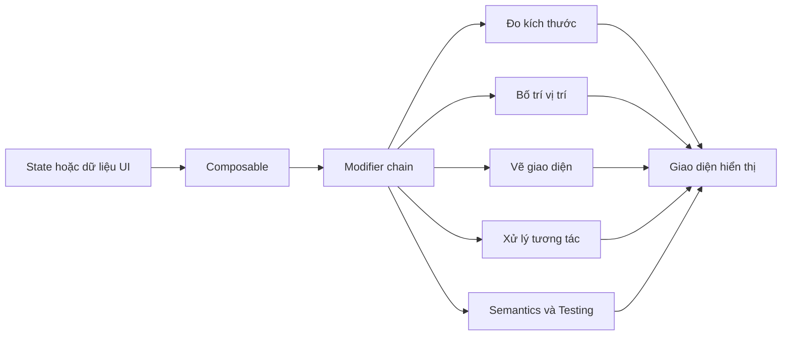
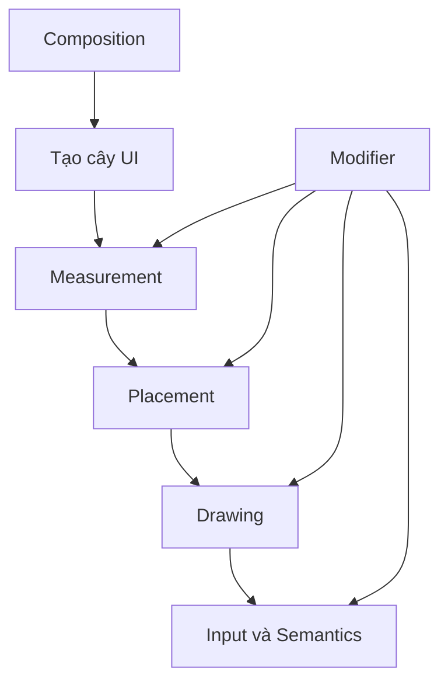
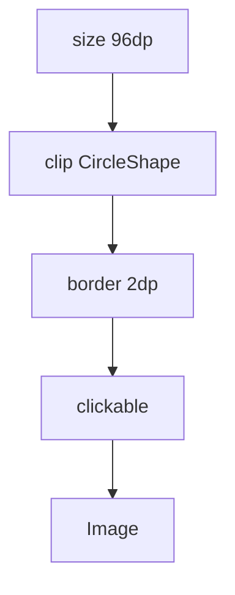
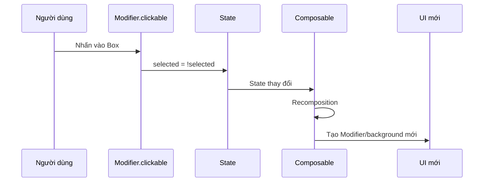
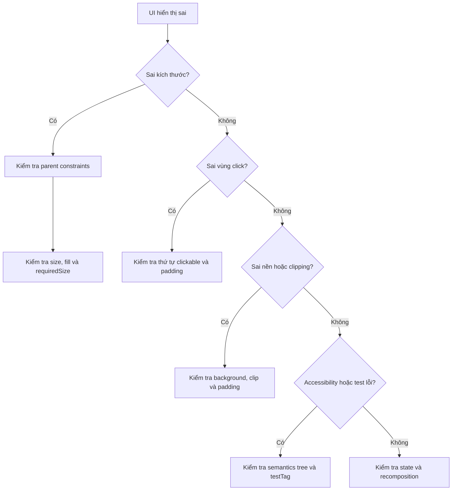

# 024 - Modifier trong Jetpack Compose

> **Học phần:** 02 - App Components and User Interface
> **Module:** Module 04 - Interface and Navigation
> **Nhóm nội dung:** Jetpack Compose
> **Nguồn roadmap:** Interface and Navigation / Jetpack Compose
> **Loại bài:** UI
> **Thứ tự trong module:** 024
> **Thời lượng gợi ý:** 30 phút

---

## 1. Tóm tắt

`Modifier` là cơ chế trung tâm dùng để **trang trí, cấu hình hoặc bổ sung hành vi** cho một composable trong Jetpack Compose.

Thông qua `Modifier`, lập trình viên có thể:

* Thay đổi kích thước và vị trí.
* Thêm khoảng cách.
* Vẽ nền, viền hoặc cắt hình dạng.
* Xử lý thao tác nhấn, kéo, cuộn.
* Thêm thông tin hỗ trợ tiếp cận.
* Thêm thông tin phục vụ kiểm thử.
* Điều chỉnh cách composable được đo, bố trí và hiển thị.

`Modifier` không tự tạo ra giao diện. Nó được gắn vào một composable như `Text`, `Image`, `Box`, `Row`, `Column` hoặc component do lập trình viên tự xây dựng.

```kotlin
Text(
    text = "Xin chào Jetpack Compose",
    modifier = Modifier
        .fillMaxWidth()
        .background(Color.LightGray)
        .padding(16.dp)
)
```

Các modifier có thể được nối thành một **chuỗi có thứ tự**. Thứ tự đó ảnh hưởng trực tiếp đến kích thước, vùng nhận sự kiện, nền, clipping và kết quả cuối cùng của giao diện. Android mô tả modifier như một danh sách bất biến, có thứ tự, trong đó mỗi phần tử đại diện cho một hành vi liên quan đến layout, drawing, input, focus hoặc semantics.


### Modifier nằm ở đâu trong ứng dụng Android?



Modifier thuộc **lớp giao diện**, không nên chứa nghiệp vụ, gọi mạng hoặc truy cập cơ sở dữ liệu.

---

## 2. Mục tiêu học tập

Sau bài học này, người học có thể:

* Giải thích được `Modifier` bằng ngôn ngữ của mình.
* Hiểu vì sao thứ tự modifier ảnh hưởng đến kết quả.
* Phân biệt modifier về layout, drawing, input và semantics.
* Sử dụng các modifier thông dụng như:

  * `padding`
  * `size`
  * `fillMaxWidth`
  * `background`
  * `clip`
  * `clickable`
  * `weight`
  * `offset`
  * `semantics`
  * `testTag`
* Thiết kế composable chấp nhận tham số `modifier`.
* Kết hợp modifier với state để cập nhật giao diện.
* Kiểm tra giao diện bằng Compose UI Test và Layout Inspector.
* Xây dựng một ví dụ nhỏ có thể đưa vào portfolio.

Modifier được biểu diễn trong cây UI như các node bao quanh layout node. Khi có nhiều modifier, mỗi modifier bao quanh phần còn lại của chuỗi, vì vậy modifier đứng trước có phạm vi tác động khác modifier đứng sau.


---

## 3. Khái niệm chính

## 3.1. Modifier là gì?

Có thể hiểu đơn giản:

> `Modifier` là danh sách các chỉ dẫn mô tả cách một composable được đo, bố trí, vẽ, tương tác và biểu diễn về mặt ngữ nghĩa.

Ví dụ:

```kotlin
Modifier
    .fillMaxWidth()
    .padding(16.dp)
    .background(Color.Blue)
```

Chuỗi trên gồm ba chỉ dẫn:

1. Chiếm toàn bộ chiều rộng được parent cho phép.
2. Tạo khoảng cách `16.dp`.
3. Vẽ nền màu xanh.

Một modifier có thể tác động đến một hoặc nhiều giai đoạn:



---

## 3.2. Modifier là chuỗi có thứ tự

Thứ tự modifier không chỉ là vấn đề định dạng code.

Hai đoạn code sau có thể tạo ra hành vi khác nhau.

### Trường hợp 1: Toàn bộ vùng padding có thể nhấn

```kotlin
Modifier
    .clickable { onClick() }
    .padding(16.dp)
```

`clickable` đứng ngoài `padding`, vì vậy vùng nhận sự kiện bao gồm cả khoảng padding.

### Trường hợp 2: Padding không thuộc vùng có thể nhấn

```kotlin
Modifier
    .padding(16.dp)
    .clickable { onClick() }
```

Trong trường hợp này, padding nằm ngoài vùng được `clickable` xử lý.

Android Developers xác nhận thứ tự modifier quyết định vùng nào nhận sự kiện; `clickable().padding()` làm cả vùng padding có thể nhấn, trong khi đảo ngược thứ tự sẽ loại phần padding khỏi vùng tương tác.


---

## 3.3. Cách đọc một chuỗi Modifier

Xét ví dụ:

```kotlin
Image(
    painter = painterResource(R.drawable.avatar),
    contentDescription = "Ảnh đại diện",
    modifier = Modifier
        .size(96.dp)
        .clip(CircleShape)
        .border(
            width = 2.dp,
            color = MaterialTheme.colorScheme.primary,
            shape = CircleShape
        )
        .clickable { onAvatarClick() }
)
```

Có thể đọc từ trên xuống:

1. Tạo vùng kích thước `96 × 96 dp`.
2. Cắt nội dung thành hình tròn.
3. Vẽ viền hình tròn.
4. Cho phép người dùng nhấn vào vùng đó.

Tuy nhiên, về mô hình cây UI, mỗi modifier đứng trước sẽ bao quanh các modifier đứng sau.



---

## 3.4. Constraints và kích thước

Trong Compose, parent truyền xuống child một tập hợp các giới hạn gọi là **constraints**:

* Chiều rộng nhỏ nhất.
* Chiều rộng lớn nhất.
* Chiều cao nhỏ nhất.
* Chiều cao lớn nhất.

Một modifier như `size`, `width`, `height`, `fillMaxWidth` hoặc `sizeIn` có thể thay đổi constraints trước khi chúng đến composable.

```kotlin
Box(
    modifier = Modifier.size(100.dp)
)
```

`size(100.dp)` yêu cầu kích thước mong muốn là `100 × 100 dp`, nhưng kích thước đó vẫn phải phù hợp với constraints từ parent.

### Hai `size` liên tiếp không ghi đè đơn giản lên nhau

```kotlin
Modifier
    .size(100.dp)
    .size(50.dp)
```

Modifier đầu tiên có thể biến constraints thành chính xác `100 × 100 dp`. Modifier thứ hai vẫn phải tôn trọng constraints nhận được nên không nhất thiết đổi kích thước xuống `50 × 50 dp`.


### `size` và `requiredSize`

```kotlin
Modifier.size(100.dp)
```

* Đưa ra kích thước mong muốn.
* Vẫn cố gắng tuân theo constraints từ parent.

```kotlin
Modifier.requiredSize(100.dp)
```

* Ép composable sử dụng kích thước đã chỉ định.
* Có thể vượt khỏi constraints do parent cung cấp.
* Chỉ nên dùng khi thực sự hiểu hậu quả.

---

## 3.5. Các nhóm Modifier thông dụng

| Nhóm             | Modifier tiêu biểu                                | Công dụng                             |
| ---------------- | ------------------------------------------------- | ------------------------------------- |
| Kích thước       | `size`, `width`, `height`, `sizeIn`               | Đặt hoặc giới hạn kích thước          |
| Chiếm không gian | `fillMaxWidth`, `fillMaxHeight`, `fillMaxSize`    | Chiếm không gian parent cho phép      |
| Khoảng cách      | `padding`, `paddingFromBaseline`                  | Tạo khoảng cách quanh nội dung        |
| Vị trí           | `offset`, `absoluteOffset`                        | Dịch chuyển vị trí hiển thị           |
| Hình dạng        | `clip`                                            | Cắt composable theo shape             |
| Trang trí        | `background`, `border`, `shadow`, `alpha`         | Vẽ nền, viền, bóng hoặc độ trong suốt |
| Tương tác        | `clickable`, `toggleable`, `selectable`           | Nhận sự kiện người dùng               |
| Cuộn và kéo      | `verticalScroll`, `horizontalScroll`, `draggable` | Xử lý cuộn hoặc kéo                   |
| Accessibility    | `semantics`, `clearAndSetSemantics`               | Bổ sung ý nghĩa cho UI                |
| Testing          | `testTag`                                         | Cho phép test tìm composable          |
| Parent data      | `weight`, `align`, `matchParentSize`              | Truyền thông tin bố trí cho parent    |
| Animation        | `animateContentSize`, `graphicsLayer`             | Thay đổi hoặc hoạt ảnh hiển thị       |

Danh sách Modifier chính thức được Android phân loại theo action, alignment, animation, drawing, focus, layout, semantics, testing và nhiều nhóm khác.


---

## 3.6. `padding` và `background`

Thứ tự của `padding` và `background` ảnh hưởng đến khu vực được tô màu.

### Nền bao gồm cả padding

```kotlin
Modifier
    .background(Color.Yellow)
    .padding(16.dp)
```

`background` đứng ngoài nên nền bao phủ toàn bộ vùng, bao gồm phần padding.

### Padding nằm ngoài nền

```kotlin
Modifier
    .padding(16.dp)
    .background(Color.Yellow)
```

Khoảng padding được tạo trước. Nền chỉ được vẽ cho phần phía trong.

Có thể hình dung:

```text
background → padding → content
┌─────────────────────────────┐
│ Background                  │
│    ┌───────────────────┐    │
│    │ Content           │    │
│    └───────────────────┘    │
└─────────────────────────────┘
```

```text
padding → background → content
┌─────────────────────────────┐
│ Padding                     │
│    ┌───────────────────┐    │
│    │ Background        │    │
│    │ Content           │    │
│    └───────────────────┘    │
└─────────────────────────────┘
```

---

## 3.7. `clip`, `padding` và `size`

Một chuỗi có thứ tự chưa phù hợp:

```kotlin
Modifier
    .clip(CircleShape)
    .padding(10.dp)
    .size(100.dp)
```

`clip` có thể áp dụng lên canvas lớn hơn nội dung thực tế do padding tạo ra. Kết quả hình ảnh bên trong không nhất thiết trông tròn như mong đợi.

Một cách thường dễ kiểm soát hơn:

```kotlin
Modifier
    .size(100.dp)
    .padding(10.dp)
    .clip(CircleShape)
```

Hoặc chọn thứ tự dựa trên yêu cầu:

* Muốn padding nằm **bên trong** hình được clip.
* Muốn padding nằm **bên ngoài** hình được clip.
* Muốn background được clip hay không được clip.

Tài liệu Android minh họa trường hợp `clip → padding → size` tạo kết quả clipping không đúng kỳ vọng vì `clip` tác động lên canvas `120 × 120 dp`, còn ảnh được vẽ trong vùng nhỏ hơn.


---

## 3.8. Modifier có phạm vi sử dụng

Một số modifier chỉ có hiệu lực trong một scope cụ thể.

### `weight`

`weight` chỉ có ý nghĩa đối với direct child của `Row` hoặc `Column`.

```kotlin
Row(
    modifier = Modifier.fillMaxWidth()
) {
    Text(
        text = "Bên trái",
        modifier = Modifier.weight(1f)
    )

    Text(
        text = "Bên phải",
        modifier = Modifier.weight(2f)
    )
}
```

Thành phần thứ hai được cấp khoảng không gian lớn gấp đôi thành phần thứ nhất.

### `align`

```kotlin
Column {
    Text(
        text = "Ở giữa",
        modifier = Modifier.align(Alignment.CenterHorizontally)
    )
}
```

`align` trong ví dụ này được cung cấp bởi `ColumnScope`.

### `matchParentSize`

```kotlin
Box {
    Spacer(
        modifier = Modifier
            .matchParentSize()
            .background(Color.LightGray)
    )

    Text("Nội dung")
}
```

`matchParentSize` chỉ có sẵn trong `BoxScope` và thường áp dụng cho direct child của `Box`. Scope safety giúp ngăn việc sử dụng modifier ở những vị trí mà nó không có tác dụng.


---

## 3.9. Quy tắc thiết kế API với Modifier

Một composable tái sử dụng nên nhận tham số:

```kotlin
@Composable
fun ProfileCard(
    name: String,
    modifier: Modifier = Modifier,
) {
    Row(
        modifier = modifier
            .fillMaxWidth()
            .padding(16.dp)
    ) {
        Text(text = name)
    }
}
```

### Quy tắc nên áp dụng

* Tên tham số là `modifier`.
* Giá trị mặc định là `Modifier`.
* Đặt sau các tham số bắt buộc.
* Đặt trước những tham số tùy chọn khác.
* Áp dụng modifier được truyền vào root composable.
* Không tự ý thay thế modifier của caller.
* Nối modifier nội bộ sau modifier của caller.

```kotlin
modifier
    .fillMaxWidth()
    .padding(16.dp)
```

Không nên:

```kotlin
@Composable
fun ProfileCard(
    name: String,
    modifier: Modifier = Modifier,
) {
    // modifier do caller truyền vào bị bỏ qua.
    Row(
        modifier = Modifier.padding(16.dp)
    ) {
        Text(name)
    }
}
```

Tài liệu API chính thức khuyến nghị `modifier` là tham số tùy chọn đầu tiên, sau các tham số bắt buộc và trước những tham số có giá trị mặc định khác.

---

## 3.10. Modifier, state và recomposition

Modifier không phải là state holder.

Tuy nhiên, modifier có thể phụ thuộc vào state:

```kotlin
var selected by remember { mutableStateOf(false) }

Box(
    modifier = Modifier
        .background(
            if (selected) Color.Green else Color.Gray
        )
        .clickable {
            selected = !selected
        }
)
```

Quy trình:



### Lifecycle cần lưu ý

```kotlin
var selected by remember {
    mutableStateOf(false)
}
```

State được giữ qua recomposition nhưng có thể mất khi Activity bị tạo lại.

```kotlin
var selected by rememberSaveable {
    mutableStateOf(false)
}
```

State có thể được lưu và phục hồi trong những trường hợp như xoay màn hình hoặc Activity được tái tạo.

Modifier không nên trực tiếp quản lý:

* API request.
* Database.
* File.
* Token đăng nhập.
* Business rules.
* Navigation state phức tạp.

Những state này nên được quản lý ở composable cấp cao hơn hoặc `ViewModel`, sau đó truyền xuống component dưới dạng state và callback.

---

## 3.11. Modifier và khả năng truy cập

Modifier có thể bổ sung semantics cho một component tùy chỉnh.

```kotlin
Box(
    modifier = Modifier
        .clickable { onToggle() }
        .semantics {
            stateDescription =
                if (enabled) "Đang bật" else "Đang tắt"
        }
)
```

Semantics cung cấp ý nghĩa của component cho:

* TalkBack và các accessibility service.
* Autofill.
* Compose UI Test.
* Layout Inspector.

Ví dụ, một icon máy ảnh có thể chỉ là hình ảnh đối với người nhìn, nhưng semantics có thể mô tả nó là “Chụp ảnh”.


### Kích thước vùng tương tác

Các thành phần có thể nhấn nên có vùng tương tác tối thiểu khoảng `48 × 48 dp`.

```kotlin
Modifier
    .sizeIn(
        minWidth = 48.dp,
        minHeight = 48.dp
    )
    .clickable { onClick() }
```

Android khuyến nghị các phần tử tương tác có kích thước tối thiểu `48 dp`; một số API Material và Compose cũng cung cấp hành vi mở rộng touch target mặc định.

---

## 4. Thực hành

### Yêu cầu

Xây dựng màn hình nhỏ có:

* Một card sử dụng chuỗi modifier.
* Card đổi trạng thái khi được nhấn.
* Màu nền thay đổi theo state.
* Có `testTag`.
* Có semantics mô tả trạng thái.
* Có nút đặt lại.
* State không mất khi xoay màn hình.


---

## 4.1. Code hoàn chỉnh

```kotlin
package com.example.modifierlesson

import androidx.compose.foundation.background
import androidx.compose.foundation.clickable
import androidx.compose.foundation.layout.Arrangement
import androidx.compose.foundation.layout.Box
import androidx.compose.foundation.layout.Column
import androidx.compose.foundation.layout.fillMaxSize
import androidx.compose.foundation.layout.fillMaxWidth
import androidx.compose.foundation.layout.height
import androidx.compose.foundation.layout.padding
import androidx.compose.foundation.layout.sizeIn
import androidx.compose.foundation.shape.RoundedCornerShape
import androidx.compose.material3.Button
import androidx.compose.material3.MaterialTheme
import androidx.compose.material3.Text
import androidx.compose.runtime.Composable
import androidx.compose.runtime.getValue
import androidx.compose.runtime.mutableStateOf
import androidx.compose.runtime.saveable.rememberSaveable
import androidx.compose.runtime.setValue
import androidx.compose.ui.Alignment
import androidx.compose.ui.Modifier
import androidx.compose.ui.draw.clip
import androidx.compose.ui.platform.testTag
import androidx.compose.ui.semantics.semantics
import androidx.compose.ui.semantics.stateDescription
import androidx.compose.ui.text.font.FontWeight
import androidx.compose.ui.tooling.preview.Preview
import androidx.compose.ui.unit.dp

@Composable
fun ModifierDemoScreen(
    modifier: Modifier = Modifier,
) {
    var isSelected by rememberSaveable {
        mutableStateOf(false)
    }

    val cardColor = if (isSelected) {
        MaterialTheme.colorScheme.primaryContainer
    } else {
        MaterialTheme.colorScheme.surfaceVariant
    }

    Column(
        modifier = modifier
            .fillMaxSize()
            .padding(24.dp),
        verticalArrangement = Arrangement.spacedBy(16.dp),
    ) {
        Text(
            text = "Modifier Lab",
            style = MaterialTheme.typography.headlineMedium,
            fontWeight = FontWeight.Bold,
        )

        Text(
            text = "Nhấn vào card để thay đổi trạng thái và màu nền.",
            style = MaterialTheme.typography.bodyLarge,
        )

        Box(
            modifier = Modifier
                .fillMaxWidth()
                .height(160.dp)
                .clip(RoundedCornerShape(24.dp))
                .background(cardColor)
                .clickable {
                    isSelected = !isSelected
                }
                .semantics {
                    stateDescription = if (isSelected) {
                        "Đã chọn"
                    } else {
                        "Chưa chọn"
                    }
                }
                .testTag("modifier-card")
                .padding(24.dp),
            contentAlignment = Alignment.Center,
        ) {
            Text(
                text = if (isSelected) {
                    "Đã chọn"
                } else {
                    "Chạm để chọn"
                },
                style = MaterialTheme.typography.titleLarge,
                fontWeight = FontWeight.SemiBold,
            )
        }

        Button(
            onClick = {
                isSelected = false
            },
            modifier = Modifier
                .sizeIn(
                    minWidth = 48.dp,
                    minHeight = 48.dp,
                )
                .testTag("reset-button"),
        ) {
            Text("Đặt lại")
        }
    }
}

@Preview(
    showBackground = true,
    widthDp = 390,
    heightDp = 844,
)
@Composable
private fun ModifierDemoScreenPreview() {
    MaterialTheme {
        ModifierDemoScreen()
    }
}
```

---

## 4.2. Phân tích chuỗi Modifier của card

```kotlin
Modifier
    .fillMaxWidth()
    .height(160.dp)
    .clip(RoundedCornerShape(24.dp))
    .background(cardColor)
    .clickable { isSelected = !isSelected }
    .semantics { /*...*/ }
    .testTag("modifier-card")
    .padding(24.dp)
```

| Modifier          | Vai trò                                    |
| ----------------- | ------------------------------------------ |
| `fillMaxWidth()`  | Card chiếm chiều rộng parent cho phép      |
| `height(160.dp)`  | Đặt chiều cao card                         |
| `clip(...)`       | Cắt card thành hình chữ nhật bo góc        |
| `background(...)` | Vẽ màu nền theo state                      |
| `clickable(...)`  | Nhận thao tác nhấn                         |
| `semantics(...)`  | Mô tả trạng thái cho accessibility         |
| `testTag(...)`    | Cho phép UI test tìm card                  |
| `padding(24.dp)`  | Tạo khoảng cách giữa nội dung và cạnh card |

Vì `clickable` đứng trước `padding`, toàn bộ card, bao gồm khu vực padding bên trong, đều nhận được thao tác nhấn. `clickable` còn hỗ trợ focus, keyboard, accessibility interaction và visual indication phù hợp.

---

## 4.3. Thay đổi thứ tự để quan sát kết quả

### Thí nghiệm A: Padding nằm ngoài vùng có thể nhấn

```kotlin
Modifier
    .padding(24.dp)
    .clickable {
        isSelected = !isSelected
    }
```

Quan sát xem phần khoảng trống bên ngoài còn nhận thao tác nhấn hay không.

### Thí nghiệm B: Nền không bao phủ padding

```kotlin
Modifier
    .padding(24.dp)
    .background(cardColor)
```

### Thí nghiệm C: Nền bao phủ padding

```kotlin
Modifier
    .background(cardColor)
    .padding(24.dp)
```

### Thí nghiệm D: Đảo `clip` và `background`

```kotlin
Modifier
    .background(cardColor)
    .clip(RoundedCornerShape(24.dp))
```

So sánh với:

```kotlin
Modifier
    .clip(RoundedCornerShape(24.dp))
    .background(cardColor)
```

---

## 4.4. UI Test

Compose UI Test tương tác với giao diện thông qua semantics tree. Modifier như `testTag` và `semantics` giúp test tìm và xác minh component.

```kotlin
package com.example.modifierlesson

import androidx.compose.material3.MaterialTheme
import androidx.compose.ui.test.assertIsDisplayed
import androidx.compose.ui.test.junit4.createComposeRule
import androidx.compose.ui.test.onNodeWithTag
import androidx.compose.ui.test.onNodeWithText
import androidx.compose.ui.test.performClick
import org.junit.Rule
import org.junit.Test

class ModifierDemoScreenTest {

    @get:Rule
    val composeRule = createComposeRule()

    @Test
    fun card_changes_state_after_click() {
        composeRule.setContent {
            MaterialTheme {
                ModifierDemoScreen()
            }
        }

        composeRule
            .onNodeWithTag("modifier-card")
            .assertIsDisplayed()
            .performClick()

        composeRule
            .onNodeWithText("Đã chọn")
            .assertIsDisplayed()
    }

    @Test
    fun reset_button_clears_selected_state() {
        composeRule.setContent {
            MaterialTheme {
                ModifierDemoScreen()
            }
        }

        composeRule
            .onNodeWithTag("modifier-card")
            .performClick()

        composeRule
            .onNodeWithTag("reset-button")
            .performClick()

        composeRule
            .onNodeWithText("Chạm để chọn")
            .assertIsDisplayed()
    }
}
```

---

## 4.5. Checklist kiểm thử thủ công

1. Mở màn hình Modifier Lab.
2. Kiểm tra card có bo góc.
3. Nhấn vào tâm card.
4. Kiểm tra text chuyển từ `Chạm để chọn` sang `Đã chọn`.
5. Kiểm tra màu nền thay đổi.
6. Nhấn vào vùng gần cạnh card.
7. Xác nhận toàn bộ vùng card đều nhận thao tác.
8. Nhấn nút `Đặt lại`.
9. Xác nhận card trở về trạng thái ban đầu.
10. Chọn card rồi xoay màn hình.
11. Xác nhận state vẫn được giữ.
12. Mở TalkBack và kiểm tra trạng thái được đọc phù hợp.
13. Kiểm tra ở màn hình nhỏ và màn hình lớn.
14. Kiểm tra chế độ sáng và tối.

---

## 5. Bài tập


### Bài tập 1: Thẻ hồ sơ

Tạo `ProfileCard` gồm:

* Avatar tròn.
* Tên người dùng.
* Trạng thái online.
* Toàn bộ card có thể nhấn.
* Avatar có viền.
* Card có padding và background.

Yêu cầu API:

```kotlin
@Composable
fun ProfileCard(
    name: String,
    isOnline: Boolean,
    onClick: () -> Unit,
    modifier: Modifier = Modifier,
)
```

---

### Bài tập 2: So sánh thứ tự Modifier

Tạo hai box dùng cùng các modifier nhưng khác thứ tự.

```kotlin
Modifier
    .background(Color.Blue)
    .padding(24.dp)
```

```kotlin
Modifier
    .padding(24.dp)
    .background(Color.Blue)
```

Viết một đoạn README giải thích:

* Box nào có nền bao phủ padding?
* Vì sao kết quả khác nhau?
* Thứ tự nào phù hợp cho card?
* Thứ tự nào phù hợp để tạo khoảng cách bên ngoài?

---

### Bài tập 3: Nút tùy chỉnh có accessibility

Tạo một component:

```kotlin
@Composable
fun FavoriteButton(
    isFavorite: Boolean,
    onClick: () -> Unit,
    modifier: Modifier = Modifier,
)
```

Yêu cầu:

* Vùng tương tác tối thiểu `48 × 48 dp`.
* Có icon trái tim.
* Có `stateDescription`.
* Có `testTag`.
* Hỗ trợ trạng thái đã yêu thích và chưa yêu thích.
* Viết ít nhất một UI test.

---

### Bài tập 4: Modifier có phạm vi

Tạo một `Row` có ba box:

```text
Box A: weight 1
Box B: weight 2
Box C: weight 1
```

Kết quả mong muốn:

```text
┌────────┬────────────────┬────────┐
│   A    │       B        │   C    │
└────────┴────────────────┴────────┘
```

Giải thích vì sao `weight` chỉ hoạt động khi composable là direct child của `Row` hoặc `Column`.

---

### Bài tập 5: Portfolio artifact

Tạo thư mục:

```text
modifier-lab/
├── README.md
├── screenshots/
│   ├── default-state.png
│   ├── selected-state.png
│   ├── dark-theme.png
│   └── ui-check.png
├── ModifierDemoScreen.kt
└── ModifierDemoScreenTest.kt
```

README nên có:

```markdown
# Modifier Lab

## Mục tiêu

Minh họa cách sử dụng và sắp xếp Modifier trong Jetpack Compose.

## Kiến thức áp dụng

- Modifier chain
- Modifier order
- State và recomposition
- rememberSaveable
- Semantics
- Compose UI Test

## Các trường hợp đã kiểm tra

- [x] Click thay đổi state
- [x] Reset state
- [x] Xoay màn hình
- [x] Dark theme
- [x] Accessibility
- [x] Màn hình nhỏ và lớn
```

---

## 6. Checklist hoàn thành


### Kiến thức

* [ ] Giải thích được Modifier là gì.
* [ ] Biết Modifier không tự tạo UI.
* [ ] Hiểu Modifier là chuỗi có thứ tự.
* [ ] Giải thích được vì sao thứ tự modifier quan trọng.
* [ ] Phân biệt được `size` và `requiredSize`.
* [ ] Hiểu constraints được truyền từ parent xuống child.
* [ ] Hiểu modifier nào có scope riêng.
* [ ] Biết Modifier không phải là nơi quản lý business state.

### Thực hành

* [ ] Tạo được composable chấp nhận `modifier: Modifier = Modifier`.
* [ ] Áp dụng modifier được truyền vào root composable.
* [ ] Dùng được `padding`, `size`, `background` và `clip`.
* [ ] Dùng được `clickable`.
* [ ] Dùng được `semantics`.
* [ ] Dùng được `testTag`.
* [ ] Có một state thay đổi sau thao tác người dùng.
* [ ] State không mất khi xoay màn hình.
* [ ] Có Preview.
* [ ] Có ít nhất một Compose UI Test.

### Chất lượng giao diện

* [ ] Touch target đủ lớn.
* [ ] Giao diện hoạt động ở chế độ sáng và tối.
* [ ] Không bị cắt nội dung trên màn hình nhỏ.
* [ ] Không dùng `requiredSize` khi không cần thiết.
* [ ] Vùng có thể nhấn đúng với hình ảnh trực quan.
* [ ] Thứ tự `clip`, `background`, `clickable` và `padding` có chủ đích.
* [ ] TalkBack mô tả đúng component.
* [ ] UI Check không còn lỗi nghiêm trọng.

### Portfolio

* [ ] Có screenshot trạng thái ban đầu.
* [ ] Có screenshot trạng thái sau khi tương tác.
* [ ] Có README giải thích modifier order.
* [ ] Có source code dễ chạy.
* [ ] Có test hoặc checklist kiểm thử.
* [ ] Có ghi chú về state, accessibility và performance.

Android Studio cung cấp UI Check trong Compose Preview để kiểm tra khả năng thích ứng và accessibility, bao gồm các vấn đề như độ tương phản thấp, text quá rộng hoặc touch target quá nhỏ.

---

## 7. Ghi chú sản xuất


## 7.1. User flow

Trước khi release, cần xác định:

* Thành phần nào có thể nhấn?
* Người dùng có nhận biết được vùng tương tác không?
* Padding có nằm trong vùng click không?
* Ripple có xuất hiện đúng vị trí không?
* Khi loading, component có còn nhận thao tác không?
* Khi disabled, semantics có phản ánh trạng thái không?

Một card nhìn như có thể nhấn nhưng chỉ một phần nhỏ nhận sự kiện sẽ tạo trải nghiệm khó chịu và tăng số lần người dùng nhấn sai.

---

## 7.2. State và lifecycle

Modifier chỉ thể hiện hành vi UI.

State nên nằm ở:

```text
ViewModel
   ↓
Screen composable
   ↓
Reusable component
   ↓
Modifier dựa trên state
```

Ví dụ:

```kotlin
@Composable
fun ProductCard(
    selected: Boolean,
    onSelectedChange: (Boolean) -> Unit,
    modifier: Modifier = Modifier,
)
```

Cách này giúp component:

* Dễ tái sử dụng.
* Dễ Preview.
* Dễ test.
* Không phụ thuộc trực tiếp vào ViewModel.
* Không tự quản lý nghiệp vụ bên trong Modifier.

---

## 7.3. Network và storage

Không nên:

```kotlin
Modifier.clickable {
    // Gọi trực tiếp repository phức tạp.
    repository.saveProduct()
}
```

Nên phát event:

```kotlin
Modifier.clickable {
    onProductClick(productId)
}
```

Sau đó parent hoặc ViewModel xử lý:

```text
Click
  ↓
UI event
  ↓
ViewModel
  ↓
Repository
  ↓
Network hoặc Database
  ↓
UI state mới
```

---

## 7.4. Accessibility

Kiểm tra:

* Touch target tối thiểu.
* `contentDescription` cho icon có ý nghĩa.
* Không đặt `contentDescription` thừa cho ảnh trang trí.
* `stateDescription` đúng trạng thái.
* Component tùy chỉnh có role phù hợp.
* Thứ tự đọc của TalkBack hợp lý.
* Màu không phải là dấu hiệu trạng thái duy nhất.

---

## 7.5. Performance

Không cần tối ưu mọi modifier chain nhỏ. Tuy nhiên, cần chú ý khi:

* Modifier chain rất dài.
* Modifier được tạo lại cho hàng nghìn item.
* UI đang chạy animation từng frame.
* State thay đổi liên tục.
* Dùng `graphicsLayer`, `drawWithCache` hoặc custom drawing.
* Layout Inspector cho thấy recomposition bất thường.

Có thể tái sử dụng chuỗi modifier không phụ thuộc state:

```kotlin
private val AvatarModifier = Modifier
    .size(72.dp)
    .clip(CircleShape)
```

```kotlin
Image(
    painter = painter,
    contentDescription = null,
    modifier = AvatarModifier,
)
```

Android cho biết việc trích xuất và tái sử dụng modifier chain có thể giảm việc cấp phát lại, hỗ trợ so sánh modifier hiệu quả hơn và cải thiện khả năng bảo trì, đặc biệt với chuỗi dài hoặc lazy list.

### State thay đổi thường xuyên

Với state thay đổi liên tục, ưu tiên modifier dùng lambda khi API hỗ trợ:

```kotlin
Modifier.offset {
    IntOffset(
        x = animatedX.roundToInt(),
        y = 0,
    )
}
```

Thay vì đọc state quá sớm trong composition:

```kotlin
Modifier.offset(
    x = animatedX.dp,
    y = 0.dp,
)
```

Hướng dẫn performance của Compose khuyến nghị trì hoãn việc đọc state và sử dụng lambda-based modifier cho các giá trị thay đổi thường xuyên khi phù hợp.

---

## 7.6. Debugging

Dùng Layout Inspector để kiểm tra:

* Kích thước thực tế.
* Vị trí của composable.
* Chuỗi component trong cây UI.
* Số lần recomposition.
* Số lần composable được skip.
* Semantics khai báo trực tiếp.
* Semantics được merge từ child.

Layout Inspector có thể hiển thị số lần composition và skip, giúp phát hiện component recomposition quá nhiều hoặc không cập nhật khi state thay đổi.

### Quy trình debug Modifier



---

## 7.7. Release checklist

Trước khi đưa tính năng sử dụng Modifier vào production:

* [ ] Kiểm tra màn hình điện thoại nhỏ.
* [ ] Kiểm tra tablet hoặc cửa sổ rộng.
* [ ] Kiểm tra portrait và landscape.
* [ ] Kiểm tra light theme và dark theme.
* [ ] Kiểm tra font scale lớn.
* [ ] Kiểm tra TalkBack.
* [ ] Kiểm tra touch target.
* [ ] Kiểm tra ripple và trạng thái disabled.
* [ ] Kiểm tra state sau khi xoay màn hình.
* [ ] Kiểm tra loading, success và error state.
* [ ] Chạy Compose UI Test.
* [ ] Chạy UI Check.
* [ ] Kiểm tra Layout Inspector.
* [ ] Kiểm tra recomposition nếu màn hình có animation.
* [ ] Lưu screenshot hoặc video ngắn cho portfolio.

---

## Kết luận

`Modifier` không chỉ là công cụ thêm `padding` hoặc `background`. Nó là cơ chế giúp lập trình viên điều khiển:

```text
Kích thước
+ Bố trí
+ Vẽ giao diện
+ Tương tác
+ Accessibility
+ Testing
= Hành vi hoàn chỉnh của một composable
```

Ba nguyên tắc quan trọng nhất:

1. **Thứ tự modifier luôn có ý nghĩa.**
2. **Composable tái sử dụng nên nhận `modifier: Modifier = Modifier`.**
3. **Modifier chỉ xử lý mối quan tâm của UI; state và nghiệp vụ nên được quản lý ở tầng phù hợp.**

Khi hiểu được cách modifier bao quanh UI node, cách constraints được truyền xuống và cách semantics được tạo ra, người học có thể xây dựng giao diện Compose dễ kiểm soát, dễ test và an toàn hơn khi đưa vào production.

---

# Bài luyện tập

## Mục tiêu


## Đề bài


## Yêu cầu hoàn thành

- [ ] 
- [ ] 
- [ ] 

## Kết quả / lời giải


## Ghi chú
