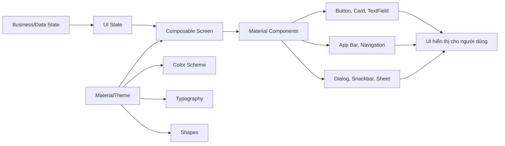
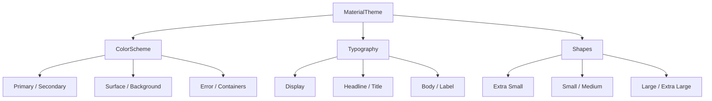
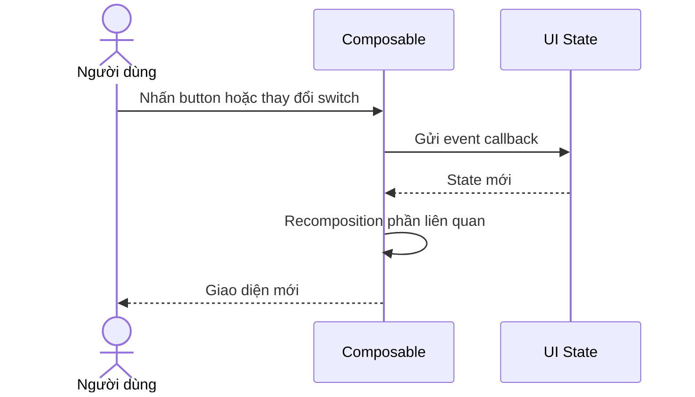
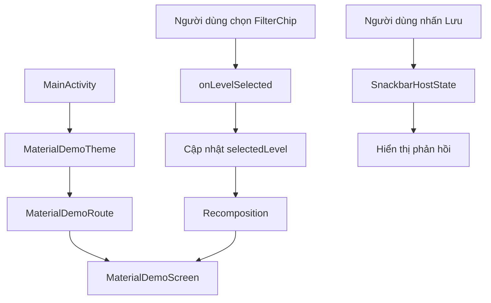
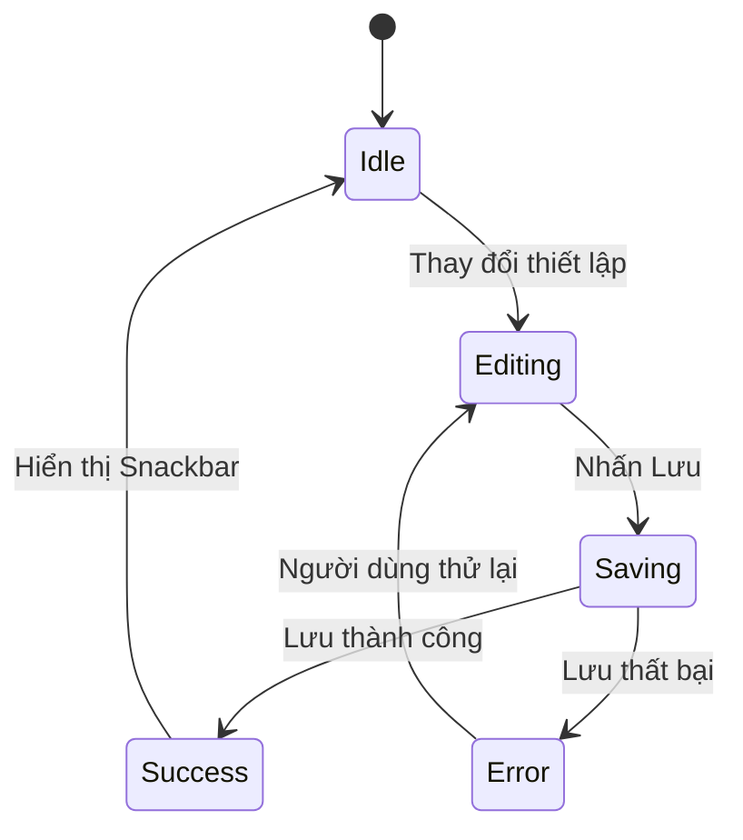
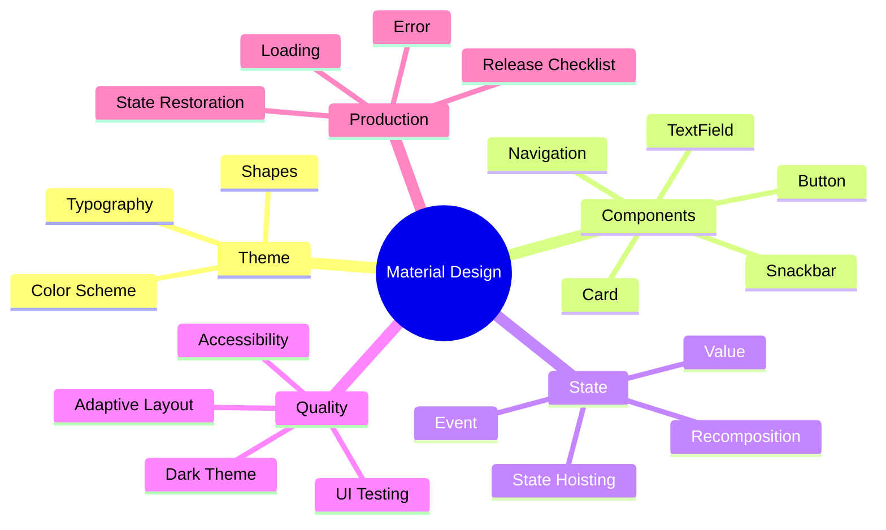

[](https://developer.android.com/develop/ui/compose/designsystems/material3?utm_source=chatgpt.com)

# 025 - Material Design

| Thuộc tính              | Nội dung                                   |
| ----------------------- | ------------------------------------------ |
| **Học phần**            | 02 - App Components and User Interface     |
| **Module**              | Module 04 - Interface and Navigation       |
| **Nhóm nội dung**       | Jetpack Compose                            |
| **Nguồn roadmap**       | Interface and Navigation / Jetpack Compose |
| **Loại bài**            | UI                                         |
| **Thứ tự trong module** | 025                                        |
| **Thời lượng gợi ý**    | 30 phút                                    |

---

## 1. Tóm tắt


**Material Design** là hệ thống thiết kế do Google phát triển, cung cấp nguyên tắc thiết kế, hệ thống màu sắc, kiểu chữ, hình dạng, chuyển động và các thành phần giao diện dùng chung.

Trong ứng dụng Android hiện đại, Jetpack Compose triển khai Material Design thông qua thư viện **Material 3**. Các thuật ngữ **Material Design 3**, **Material 3** và **M3** thường được sử dụng tương đương nhau. Material 3 hiện bao gồm khả năng cá nhân hóa của Material You và các mở rộng mới như Material 3 Expressive. ([Android Developers][1])

Material Design không chỉ giúp ứng dụng “đẹp hơn”. Nó còn giúp:

* Giao diện nhất quán giữa các màn hình.
* Người dùng nhận biết được thao tác chính và phụ.
* Hỗ trợ light theme, dark theme và dynamic color.
* Tăng khả năng tiếp cận.
* Giảm thời gian tự xây dựng các component phổ biến.
* Tạo một design system có thể mở rộng khi ứng dụng lớn lên.

> **Ý chính:** Material Design là một hệ thống thiết kế. Jetpack Compose Material 3 là bộ API giúp triển khai hệ thống đó trong mã Kotlin.

### Vị trí của Material Design trong ứng dụng



Material Design nằm chủ yếu ở **presentation/UI layer**. Nó không thay thế ViewModel, Repository, database hay network layer. Thay vào đó, Material components nhận state từ các tầng phía trên và thể hiện state đó thành giao diện.

---

## 2. Mục tiêu học tập


Sau bài học, anh có thể:

1. Giải thích Material Design bằng ngôn ngữ của mình.
2. Phân biệt Material Design, Material 3, Material You và Jetpack Compose.
3. Hiểu ba thành phần trung tâm của `MaterialTheme`:

   * `colorScheme`
   * `typography`
   * `shapes`
4. Biết lựa chọn Material component phù hợp với mức độ quan trọng của hành động.
5. Xây dựng một màn hình nhỏ bằng `Scaffold`, `Card`, `Button`, `FilterChip`, `Switch` và `Snackbar`.
6. Quản lý state để UI tự cập nhật khi người dùng tương tác.
7. Kiểm tra giao diện trong light theme, dark theme, chế độ xoay màn hình và kích thước chữ lớn.
8. Tạo screenshot, README và UI test làm artifact cho portfolio.

### Kết quả đầu ra

Sau khoảng 30 phút, sản phẩm nên có:

```text
MaterialDesignDemo/
├── ui/
│   ├── MaterialDemoScreen.kt
│   └── theme/
│       ├── Color.kt
│       ├── Theme.kt
│       └── Type.kt
├── androidTest/
│   └── MaterialDemoScreenTest.kt
├── screenshots/
│   ├── material-demo-light.png
│   └── material-demo-dark.png
└── README.md
```

---

## 3. Khái niệm chính


### 3.1. Material Design là gì?

Material Design là một design system gồm ba nhóm nội dung chính:

| Nhóm            | Vai trò                                                          |
| --------------- | ---------------------------------------------------------------- |
| **Foundations** | Màu sắc, kiểu chữ, hình dạng, chuyển động, accessibility         |
| **Components**  | Button, Card, TextField, Snackbar, Navigation Bar, Dialog        |
| **Patterns**    | Cách tổ chức màn hình, điều hướng, phản hồi và hành vi tương tác |

Jetpack Compose cung cấp các composable triển khai những thành phần Material như button, card, chip, navigation bar, snackbar và bottom sheet. Các component này có giá trị mặc định phù hợp với Material theming nhưng vẫn cho phép tùy chỉnh. ([Android Developers][2])

### 3.2. Material 2 và Material 3

| Tiêu chí         | Material 2                            | Material 3                                                      |
| ---------------- | ------------------------------------- | --------------------------------------------------------------- |
| Hệ thống màu     | Số lượng color role ít hơn            | Mở rộng theo primary, secondary, tertiary, container và surface |
| Cá nhân hóa      | Chủ yếu dùng màu thương hiệu cố định  | Hỗ trợ dynamic color                                            |
| Hình dạng        | Shape scale đơn giản hơn              | Nhiều cấp shape hơn                                             |
| Typography       | Kiểu đặt tên cũ như `h1`, `subtitle1` | `display`, `headline`, `title`, `body`, `label`                 |
| Elevation        | Phụ thuộc nhiều vào shadow            | Kết hợp shadow và tonal elevation                               |
| Android hiện đại | Phù hợp ứng dụng cũ                   | Phù hợp ứng dụng Compose mới                                    |

Trong dự án mới, nên ưu tiên import component từ:

```kotlin
import androidx.compose.material3.*
```

Thay vì trộn lẫn không có chủ đích với:

```kotlin
import androidx.compose.material.*
```

Việc trộn Material 2 và Material 3 có thể làm màu sắc, typography, shape và hành vi component thiếu nhất quán.

### 3.3. Cấu trúc `MaterialTheme`

Material 3 triển khai theme bằng composable `MaterialTheme`:

```kotlin
MaterialTheme(
    colorScheme = AppColorScheme,
    typography = AppTypography,
    shapes = AppShapes
) {
    AppContent()
}
```

Một Material 3 theme tập trung vào ba hệ thống: **color scheme, typography và shapes**. Khi thay đổi các giá trị này ở cấp theme, các Material component bên dưới sẽ tự sử dụng thiết lập mới. ([Android Developers][1])



---

### 3.4. Color scheme

Material 3 không khuyến khích rải trực tiếp mã màu như `Color.Blue` hoặc `Color(0xFF...)` khắp các composable. Thay vào đó, giao diện nên sử dụng **color role**:

```kotlin
Text(
    text = "Material Design",
    color = MaterialTheme.colorScheme.onSurface
)

Button(onClick = {}) {
    Text("Lưu")
}
```

Một số color role quan trọng:

| Color role           | Mục đích                                            |
| -------------------- | --------------------------------------------------- |
| `primary`            | Hành động hoặc thành phần quan trọng nhất           |
| `onPrimary`          | Nội dung nằm trên nền `primary`                     |
| `primaryContainer`   | Vùng chứa mang màu thương hiệu nhưng ít nổi bật hơn |
| `onPrimaryContainer` | Nội dung nằm trên `primaryContainer`                |
| `secondary`          | Thành phần có độ ưu tiên thấp hơn primary           |
| `tertiary`           | Màu nhấn bổ sung                                    |
| `surface`            | Nền cho card, sheet, dialog và nhiều component      |
| `onSurface`          | Nội dung hiển thị trên surface                      |
| `error`              | Trạng thái lỗi                                      |
| `outline`            | Viền hoặc đường phân cách                           |

Material 3 sử dụng các cặp màu dạng `container` và `onContainer` để duy trì khả năng đọc cũng như phân cấp thị giác. ([Android Developers][1])

#### Không nên

```kotlin
Button(
    colors = ButtonDefaults.buttonColors(
        containerColor = Color.Blue
    ),
    onClick = {}
) {
    Text(
        text = "Đăng nhập",
        color = Color.White
    )
}
```

#### Nên

```kotlin
Button(onClick = {}) {
    Text("Đăng nhập")
}
```

Component sẽ tự lấy màu từ `MaterialTheme.colorScheme`.

---

### 3.5. Dynamic color


Dynamic color lấy màu từ hình nền hoặc theme hệ thống của người dùng để tạo color scheme riêng cho ứng dụng. Tính năng này có trên Android 12 trở lên; ứng dụng cần cung cấp light và dark color scheme dự phòng cho thiết bị không hỗ trợ. ([Android Developers][1])

```kotlin
val colorScheme = when {
    dynamicColor && Build.VERSION.SDK_INT >= Build.VERSION_CODES.S -> {
        if (darkTheme) {
            dynamicDarkColorScheme(context)
        } else {
            dynamicLightColorScheme(context)
        }
    }

    darkTheme -> DarkColorScheme
    else -> LightColorScheme
}
```

Dynamic color nên được bật khi:

* Thương hiệu cho phép cá nhân hóa.
* Ứng dụng muốn hòa hợp với Android system UI.
* Màu thương hiệu không bắt buộc phải xuất hiện chính xác tuyệt đối.

Có thể tắt dynamic color khi:

* Màu sắc là một phần quan trọng của nhận diện thương hiệu.
* Màu mang ý nghĩa nghiệp vụ cố định.
* Giao diện cần giống nhau trên mọi thiết bị.

---

### 3.6. Typography


Material 3 chia typography thành năm nhóm:

| Nhóm       | Trường hợp sử dụng                |
| ---------- | --------------------------------- |
| `display`  | Nội dung rất lớn, hero section    |
| `headline` | Tiêu đề màn hình hoặc section lớn |
| `title`    | Tiêu đề card, dialog hoặc app bar |
| `body`     | Nội dung đọc chính                |
| `label`    | Button, chip, tab và nhãn nhỏ     |

Mỗi nhóm thường có ba mức:

```text
Large
Medium
Small
```

Ví dụ:

```kotlin
Text(
    text = "Khóa học Android",
    style = MaterialTheme.typography.headlineMedium
)

Text(
    text = "Học Material Design bằng Jetpack Compose.",
    style = MaterialTheme.typography.bodyLarge
)

Text(
    text = "30 phút",
    style = MaterialTheme.typography.labelMedium
)
```

Material 3 định nghĩa các style theo nhóm `display`, `headline`, `title`, `body` và `label`; ứng dụng không nhất thiết phải sử dụng hoặc tùy chỉnh toàn bộ các style mặc định. ([Android Developers][1])

> Không dùng `fontSize` tùy ý cho mọi `Text`. Sử dụng typography role giúp giao diện nhất quán và dễ thay đổi toàn ứng dụng.

---

### 3.7. Shapes


Shape tạo nhận diện cho card, button, dialog, chip và các vùng chứa.

```kotlin
val AppShapes = Shapes(
    extraSmall = RoundedCornerShape(4.dp),
    small = RoundedCornerShape(8.dp),
    medium = RoundedCornerShape(12.dp),
    large = RoundedCornerShape(20.dp),
    extraLarge = RoundedCornerShape(28.dp)
)
```

Sau đó sử dụng qua theme:

```kotlin
Card(
    shape = MaterialTheme.shapes.medium
) {
    // Nội dung
}
```

Material 3 cung cấp nhiều cấp shape từ `extraSmall` đến `extraLarge`; có thể tùy chỉnh toàn bộ ở `MaterialTheme` hoặc ghi đè riêng cho từng component. ([Android Developers][3])

### 3.8. Elevation và surface


Material 3 thể hiện độ nổi bằng hai cơ chế:

* `shadowElevation`: tạo bóng vật lý.
* `tonalElevation`: thay đổi tông màu của surface.

```kotlin
Surface(
    tonalElevation = 4.dp,
    shadowElevation = 1.dp
) {
    Text(
        text = "Nội dung",
        modifier = Modifier.padding(16.dp)
    )
}
```

Material 3 sử dụng tonal elevation để phân biệt các surface, đặc biệt trong dark theme, thay vì chỉ phụ thuộc vào bóng đổ. ([Android Developers][1])

---

### 3.9. Phân cấp hành động


Không phải hành động nào cũng nên dùng `Button` có nền nổi bật.

| Mức độ     | Component phù hợp      | Ví dụ              |
| ---------- | ---------------------- | ------------------ |
| Cao nhất   | `FloatingActionButton` | Tạo bài viết mới   |
| Cao        | `Button`               | Lưu, gửi, xác nhận |
| Trung bình | `FilledTonalButton`    | Thêm vào giỏ hàng  |
| Trung bình | `OutlinedButton`       | Hủy, quay lại      |
| Thấp       | `TextButton`           | Xem thêm, bỏ qua   |

Material 3 có nhiều biến thể button để thể hiện mức độ ưu tiên khác nhau. Filled button phù hợp với hành động chính, outlined button phù hợp hành động phụ và text button dành cho hành động có mức nhấn thấp. ([Android Developers][4])

#### Không nên

```text
[LƯU] [HỦY] [XÓA] [XEM THÊM]
```

Tất cả đều dùng filled button với cùng màu và kích thước.

#### Nên

```text
                 [LƯU]
[Hủy]     [Xóa]     Xem thêm
```

Chỉ hành động chính được nhấn mạnh.

---

### 3.10. State và recomposition

Compose là hệ thống UI theo state:



Khi state mà một composable đang đọc thay đổi, Compose thực thi lại phần UI liên quan và cập nhật composition. ([Android Developers][5])

```kotlin
var selected by remember { mutableStateOf(false) }

FilterChip(
    selected = selected,
    onClick = {
        selected = !selected
    },
    label = {
        Text(if (selected) "Đã chọn" else "Chưa chọn")
    }
)
```

Material component không tự quyết định business state. Component chỉ:

1. Nhận giá trị state.
2. Hiển thị state.
3. Phát event khi người dùng tương tác.

#### State hoisting

```kotlin
@Composable
fun NotificationSetting(
    enabled: Boolean,
    onEnabledChange: (Boolean) -> Unit
) {
    Switch(
        checked = enabled,
        onCheckedChange = onEnabledChange
    )
}
```

State hoisting đưa state lên composable cha và truyền xuống bằng `value` cùng callback. Cách này tạo single source of truth, giúp component dễ tái sử dụng và kiểm thử hơn. ([Android Developers][6])

---

## 4. Thực hành


### 4.1. Yêu cầu

Xây dựng màn hình **Cài đặt khóa học** có:

* `TopAppBar`.
* Một `ElevatedCard`.
* Ba `FilterChip` để chọn cấp độ.
* Một `Switch` bật hoặc tắt thông báo.
* Button lưu.
* Snackbar phản hồi.
* State được giữ khi activity được tạo lại.

### 4.2. Dependency

Nếu dự án được tạo từ Compose template của Android Studio, Material 3 thường đã được cấu hình. Trong module `app`, cần có các dependency tương đương:

```kotlin
dependencies {
    implementation(platform("androidx.compose:compose-bom:<bom-version-cua-du-an>"))

    implementation("androidx.activity:activity-compose")
    implementation("androidx.compose.material3:material3")
    implementation("androidx.compose.ui:ui-tooling-preview")

    debugImplementation("androidx.compose.ui:ui-tooling")
}
```

Không nên sao chép một version ngẫu nhiên từ bài viết cũ. Hãy dùng Compose BOM đang được dự án quản lý.

---

### 4.3. Tạo theme

```kotlin
package com.example.materialdemo.ui.theme

import android.os.Build
import androidx.compose.foundation.isSystemInDarkTheme
import androidx.compose.foundation.shape.RoundedCornerShape
import androidx.compose.material3.MaterialTheme
import androidx.compose.material3.Shapes
import androidx.compose.material3.Typography
import androidx.compose.material3.darkColorScheme
import androidx.compose.material3.dynamicDarkColorScheme
import androidx.compose.material3.dynamicLightColorScheme
import androidx.compose.material3.lightColorScheme
import androidx.compose.runtime.Composable
import androidx.compose.ui.graphics.Color
import androidx.compose.ui.platform.LocalContext
import androidx.compose.ui.unit.dp

private val LightColorScheme = lightColorScheme(
    primary = Color(0xFF415F91),
    onPrimary = Color.White,
    primaryContainer = Color(0xFFD6E3FF),
    onPrimaryContainer = Color(0xFF001B3E),
    secondary = Color(0xFF565F71),
    secondaryContainer = Color(0xFFDAE2F9),
    background = Color(0xFFF9F9FF),
    surface = Color(0xFFF9F9FF),
    error = Color(0xFFBA1A1A)
)

private val DarkColorScheme = darkColorScheme(
    primary = Color(0xFFA9C7FF),
    onPrimary = Color(0xFF0A305F),
    primaryContainer = Color(0xFF284777),
    onPrimaryContainer = Color(0xFFD6E3FF),
    secondary = Color(0xFFBEC6DC),
    secondaryContainer = Color(0xFF3E4759),
    background = Color(0xFF111318),
    surface = Color(0xFF111318),
    error = Color(0xFFFFB4AB)
)

private val AppShapes = Shapes(
    extraSmall = RoundedCornerShape(4.dp),
    small = RoundedCornerShape(8.dp),
    medium = RoundedCornerShape(16.dp),
    large = RoundedCornerShape(24.dp),
    extraLarge = RoundedCornerShape(32.dp)
)

private val AppTypography = Typography()

@Composable
fun MaterialDemoTheme(
    darkTheme: Boolean = isSystemInDarkTheme(),
    dynamicColor: Boolean = true,
    content: @Composable () -> Unit
) {
    val context = LocalContext.current

    val colorScheme = when {
        dynamicColor && Build.VERSION.SDK_INT >= Build.VERSION_CODES.S -> {
            if (darkTheme) {
                dynamicDarkColorScheme(context)
            } else {
                dynamicLightColorScheme(context)
            }
        }

        darkTheme -> DarkColorScheme
        else -> LightColorScheme
    }

    MaterialTheme(
        colorScheme = colorScheme,
        typography = AppTypography,
        shapes = AppShapes,
        content = content
    )
}
```

---

### 4.4. Tạo stateful route

```kotlin
package com.example.materialdemo.ui

import androidx.compose.runtime.Composable
import androidx.compose.runtime.getValue
import androidx.compose.runtime.mutableStateOf
import androidx.compose.runtime.saveable.rememberSaveable
import androidx.compose.runtime.setValue

@Composable
fun MaterialDemoRoute() {
    var selectedLevel by rememberSaveable {
        mutableStateOf("Cơ bản")
    }

    var notificationsEnabled by rememberSaveable {
        mutableStateOf(true)
    }

    MaterialDemoScreen(
        selectedLevel = selectedLevel,
        notificationsEnabled = notificationsEnabled,
        onLevelSelected = { level ->
            selectedLevel = level
        },
        onNotificationsChange = { enabled ->
            notificationsEnabled = enabled
        }
    )
}
```

`rememberSaveable` phù hợp với lượng nhỏ UI state có thể lưu vào saved state, chẳng hạn Boolean, String, lựa chọn hiện tại hoặc nội dung nhập đơn giản. State nghiệp vụ phức tạp nên được đưa vào state holder hoặc ViewModel. ([Android Developers][7])

---

### 4.5. Tạo màn hình Material Design

```kotlin
package com.example.materialdemo.ui

import androidx.compose.foundation.layout.Arrangement
import androidx.compose.foundation.layout.Column
import androidx.compose.foundation.layout.Row
import androidx.compose.foundation.layout.Spacer
import androidx.compose.foundation.layout.fillMaxSize
import androidx.compose.foundation.layout.fillMaxWidth
import androidx.compose.foundation.layout.height
import androidx.compose.foundation.layout.padding
import androidx.compose.material3.Button
import androidx.compose.material3.ElevatedCard
import androidx.compose.material3.ExperimentalMaterial3Api
import androidx.compose.material3.FilterChip
import androidx.compose.material3.FloatingActionButton
import androidx.compose.material3.HorizontalDivider
import androidx.compose.material3.MaterialTheme
import androidx.compose.material3.OutlinedButton
import androidx.compose.material3.Scaffold
import androidx.compose.material3.SnackbarHost
import androidx.compose.material3.SnackbarHostState
import androidx.compose.material3.Switch
import androidx.compose.material3.Text
import androidx.compose.material3.TopAppBar
import androidx.compose.runtime.Composable
import androidx.compose.runtime.remember
import androidx.compose.runtime.rememberCoroutineScope
import androidx.compose.ui.Alignment
import androidx.compose.ui.Modifier
import androidx.compose.ui.unit.dp
import kotlinx.coroutines.launch

@OptIn(ExperimentalMaterial3Api::class)
@Composable
fun MaterialDemoScreen(
    selectedLevel: String,
    notificationsEnabled: Boolean,
    onLevelSelected: (String) -> Unit,
    onNotificationsChange: (Boolean) -> Unit,
    modifier: Modifier = Modifier
) {
    val levels = listOf("Cơ bản", "Trung cấp", "Nâng cao")
    val snackbarHostState = remember { SnackbarHostState() }
    val coroutineScope = rememberCoroutineScope()

    Scaffold(
        modifier = modifier.fillMaxSize(),
        topBar = {
            TopAppBar(
                title = {
                    Text("Cài đặt khóa học")
                }
            )
        },
        snackbarHost = {
            SnackbarHost(hostState = snackbarHostState)
        },
        floatingActionButton = {
            FloatingActionButton(
                onClick = {
                    coroutineScope.launch {
                        snackbarHostState.showSnackbar(
                            message = "Đã tạo ghi chú mới"
                        )
                    }
                }
            ) {
                Text("Thêm")
            }
        }
    ) { innerPadding ->
        Column(
            modifier = Modifier
                .padding(innerPadding)
                .padding(16.dp),
            verticalArrangement = Arrangement.spacedBy(16.dp)
        ) {
            Text(
                text = "Material Design Demo",
                style = MaterialTheme.typography.headlineSmall
            )

            Text(
                text = "Chọn cấp độ và thiết lập cách ứng dụng thông báo.",
                style = MaterialTheme.typography.bodyLarge,
                color = MaterialTheme.colorScheme.onSurfaceVariant
            )

            ElevatedCard(
                modifier = Modifier.fillMaxWidth()
            ) {
                Column(
                    modifier = Modifier.padding(20.dp),
                    verticalArrangement = Arrangement.spacedBy(16.dp)
                ) {
                    Text(
                        text = "Cấp độ học",
                        style = MaterialTheme.typography.titleMedium
                    )

                    Row(
                        modifier = Modifier.fillMaxWidth(),
                        horizontalArrangement = Arrangement.spacedBy(8.dp)
                    ) {
                        levels.forEach { level ->
                            FilterChip(
                                selected = selectedLevel == level,
                                onClick = {
                                    onLevelSelected(level)
                                },
                                label = {
                                    Text(level)
                                }
                            )
                        }
                    }

                    Text(
                        text = "Gói đang chọn: $selectedLevel",
                        style = MaterialTheme.typography.bodyMedium,
                        color = MaterialTheme.colorScheme.primary
                    )

                    HorizontalDivider()

                    Row(
                        modifier = Modifier.fillMaxWidth(),
                        verticalAlignment = Alignment.CenterVertically,
                        horizontalArrangement = Arrangement.SpaceBetween
                    ) {
                        Column(
                            modifier = Modifier.weight(1f)
                        ) {
                            Text(
                                text = "Nhận thông báo",
                                style = MaterialTheme.typography.titleSmall
                            )

                            Text(
                                text = "Nhắc khi có bài học mới.",
                                style = MaterialTheme.typography.bodyMedium
                            )
                        }

                        Switch(
                            checked = notificationsEnabled,
                            onCheckedChange = onNotificationsChange
                        )
                    }

                    Spacer(modifier = Modifier.height(4.dp))

                    Button(
                        modifier = Modifier.fillMaxWidth(),
                        onClick = {
                            coroutineScope.launch {
                                snackbarHostState.showSnackbar(
                                    message = "Đã lưu cấp độ $selectedLevel"
                                )
                            }
                        }
                    ) {
                        Text("Lưu thay đổi")
                    }

                    OutlinedButton(
                        modifier = Modifier.fillMaxWidth(),
                        onClick = {
                            onLevelSelected("Cơ bản")
                            onNotificationsChange(true)
                        }
                    ) {
                        Text("Khôi phục mặc định")
                    }
                }
            }
        }
    }
}
```

`Scaffold` cung cấp cấu trúc chuẩn để kết hợp app bar, bottom bar, FAB, snackbar và nội dung màn hình. Phần `innerPadding` cần được áp dụng cho content để tránh nội dung nằm bên dưới app bar hoặc system bar. ([Android Developers][8])

---

### 4.6. Sử dụng trong Activity

```kotlin
package com.example.materialdemo

import android.os.Bundle
import androidx.activity.ComponentActivity
import androidx.activity.compose.setContent
import com.example.materialdemo.ui.MaterialDemoRoute
import com.example.materialdemo.ui.theme.MaterialDemoTheme

class MainActivity : ComponentActivity() {

    override fun onCreate(savedInstanceState: Bundle?) {
        super.onCreate(savedInstanceState)

        setContent {
            MaterialDemoTheme {
                MaterialDemoRoute()
            }
        }
    }
}
```

### 4.7. Luồng hoạt động



---

### 4.8. Preview

```kotlin
package com.example.materialdemo.ui

import androidx.compose.runtime.Composable
import androidx.compose.ui.tooling.preview.Preview
import com.example.materialdemo.ui.theme.MaterialDemoTheme

@Preview(
    name = "Light theme",
    showBackground = true
)
@Composable
private fun MaterialDemoLightPreview() {
    MaterialDemoTheme(
        darkTheme = false,
        dynamicColor = false
    ) {
        MaterialDemoScreen(
            selectedLevel = "Trung cấp",
            notificationsEnabled = true,
            onLevelSelected = {},
            onNotificationsChange = {}
        )
    }
}

@Preview(
    name = "Dark theme",
    showBackground = true
)
@Composable
private fun MaterialDemoDarkPreview() {
    MaterialDemoTheme(
        darkTheme = true,
        dynamicColor = false
    ) {
        MaterialDemoScreen(
            selectedLevel = "Nâng cao",
            notificationsEnabled = false,
            onLevelSelected = {},
            onNotificationsChange = {}
        )
    }
}
```

Tắt dynamic color trong Preview giúp kết quả ổn định hơn và dễ so sánh light/dark theme.

---

## 5. Bài tập


### Bài tập chính: Material Profile Card

Mở rộng màn hình thực hành thành một profile card có:

* Avatar hoặc placeholder.
* Tên người dùng.
* Trạng thái tài khoản.
* Chip chọn theme.
* Switch bật thông báo.
* Button lưu.
* Text button xem chi tiết.
* Snackbar sau khi lưu.

### Yêu cầu chức năng

| Mã    | Yêu cầu                                            |
| ----- | -------------------------------------------------- |
| MD-01 | Chọn được một trong ba cấp độ                      |
| MD-02 | Chip đang chọn có trạng thái khác các chip còn lại |
| MD-03 | Switch thay đổi ngay khi người dùng tương tác      |
| MD-04 | Nhấn lưu hiển thị Snackbar                         |
| MD-05 | Xoay màn hình không làm mất lựa chọn               |
| MD-06 | Light và dark theme đều đọc được                   |
| MD-07 | Font scale lớn không làm mất nội dung              |
| MD-08 | Hành động chính và phụ có mức nhấn khác nhau       |

### Bài tập nâng cao

1. Thêm lựa chọn bật hoặc tắt dynamic color.
2. Thêm `ModalBottomSheet` để chọn theme.
3. Thêm loading state cho button lưu.
4. Thêm error state nếu lưu thất bại.
5. Chuyển state sang `ViewModel`.
6. Tạo layout khác cho tablet.
7. Hỗ trợ nội dung tiếng Việt và tiếng Anh.

### State model gợi ý

```kotlin
data class MaterialDemoUiState(
    val selectedLevel: LearningLevel = LearningLevel.BASIC,
    val notificationsEnabled: Boolean = true,
    val isSaving: Boolean = false,
    val errorMessage: String? = null
)

enum class LearningLevel {
    BASIC,
    INTERMEDIATE,
    ADVANCED
}
```

### Luồng lưu dữ liệu



---

## 6. Checklist hoàn thành


### Kiến thức

* [ ] Giải thích được Material Design là một design system.
* [ ] Phân biệt được Material Design và Jetpack Compose.
* [ ] Biết Material 3 còn được gọi là M3.
* [ ] Hiểu `MaterialTheme` chứa color scheme, typography và shapes.
* [ ] Hiểu primary action không nên có nhiều hơn mức cần thiết.
* [ ] Biết Material component vẫn cần nhận state và event từ ứng dụng.

### Code

* [ ] Dùng `androidx.compose.material3`.
* [ ] Bọc nội dung bằng `MaterialTheme`.
* [ ] Không hard-code màu ở nhiều composable.
* [ ] Dùng `MaterialTheme.colorScheme`.
* [ ] Dùng `MaterialTheme.typography`.
* [ ] Dùng `MaterialTheme.shapes`.
* [ ] Áp dụng `innerPadding` của `Scaffold`.
* [ ] Tách stateful route và stateless screen.
* [ ] Dùng callback rõ nghĩa như `onLevelSelected`.
* [ ] Dùng `rememberSaveable` cho UI state nhỏ nếu phù hợp.

### UX

* [ ] Hành động chính dễ nhận biết.
* [ ] Hành động phụ không cạnh tranh với hành động chính.
* [ ] Có loading hoặc disabled state khi đang xử lý.
* [ ] Có phản hồi sau thao tác.
* [ ] Thông báo lỗi chỉ rõ người dùng cần làm gì.
* [ ] Không sử dụng màu sắc làm tín hiệu duy nhất.
* [ ] Text không bị cắt khi tăng font scale.
* [ ] Vùng chạm đủ lớn và dễ thao tác.

### Accessibility

* [ ] Icon có `contentDescription` khi mang ý nghĩa.
* [ ] Icon trang trí có `contentDescription = null`.
* [ ] Thành phần tùy chỉnh có semantics phù hợp.
* [ ] TalkBack đọc đúng tên, vai trò và trạng thái.
* [ ] Thứ tự focus hợp lý.
* [ ] Màu chữ và nền có độ tương phản phù hợp.
* [ ] Button không chỉ phân biệt bằng màu.
* [ ] Switch có label mô tả rõ chức năng.

Compose cung cấp semantics để mô tả ý nghĩa, vai trò và trạng thái của các thành phần cho accessibility service cũng như UI testing. Layout Inspector, TalkBack và Compose test APIs có thể được dùng để kiểm tra semantics. ([Android Developers][9])

### Artifact portfolio

* [ ] Có ảnh light theme.
* [ ] Có ảnh dark theme.
* [ ] Có GIF hoặc video ngắn thể hiện state change.
* [ ] Có README giải thích mục tiêu.
* [ ] Có sơ đồ state flow.
* [ ] Có ít nhất một UI test.
* [ ] Có ghi chú về accessibility.
* [ ] Có link source code.

---

## 7. Ghi chú sản xuất


### 7.1. Không xem Material Design là “lớp trang trí”

Material Design cần được xem như một phần của kiến trúc UI:

```text
UI State
   ↓
Material component
   ↓
User interaction
   ↓
Event callback
   ↓
ViewModel / state holder
   ↓
UI State mới
```

Không nên đặt network request, database operation hoặc business rule trực tiếp trong button:

```kotlin
Button(
    onClick = {
        // Không nên chứa toàn bộ xử lý nghiệp vụ ở đây.
    }
) {
    Text("Thanh toán")
}
```

Nên phát event:

```kotlin
Button(
    onClick = onCheckout
) {
    Text("Thanh toán")
}
```

---

### 7.2. Giữ state đúng vòng đời

Phân loại state trước khi lựa chọn nơi lưu:

| Loại state                           | Ví dụ                     | Nơi lưu gợi ý           |
| ------------------------------------ | ------------------------- | ----------------------- |
| Component state tạm thời             | Dialog đang mở            | `remember`              |
| UI state nhỏ cần khôi phục           | Tab đang chọn             | `rememberSaveable`      |
| Screen state                         | Loading, dữ liệu, lỗi     | `ViewModel`             |
| State cần phục hồi sau process death | ID bản ghi đang chỉnh sửa | `SavedStateHandle`      |
| Dữ liệu lâu dài                      | Theme preference          | DataStore hoặc database |

Activity hoặc process có thể bị tạo lại, vì vậy các lựa chọn đang thực hiện, input quan trọng và navigation state cần được lưu phù hợp với user flow. ([Android Developers][7])

---

### 7.3. Xử lý đầy đủ trạng thái giao diện

Một màn hình production thường không chỉ có `content`:

```kotlin
sealed interface ScreenUiState {
    data object Loading : ScreenUiState

    data class Success(
        val items: List<String>
    ) : ScreenUiState

    data class Empty(
        val message: String
    ) : ScreenUiState

    data class Error(
        val message: String
    ) : ScreenUiState
}
```

Material component tương ứng:

| State                    | Component gợi ý                        |
| ------------------------ | -------------------------------------- |
| Loading                  | `CircularProgressIndicator`            |
| Empty                    | Illustration, `Text`, CTA button       |
| Error tạm thời           | `Snackbar`                             |
| Error cần xác nhận       | `AlertDialog`                          |
| Hành động không khả dụng | Disabled button                        |
| Tác vụ đang chạy         | Loading button hoặc progress indicator |

---

### 7.4. Responsive và adaptive layout

Không nên chỉ thiết kế cho một điện thoại 360 dp.

Với navigation chính:

* Màn hình compact thường phù hợp với navigation bar.
* Màn hình expanded thường phù hợp với navigation rail.
* `NavigationSuiteScaffold` có thể chuyển đổi navigation UI theo window size trong runtime. ([Android Developers][10])

Cần kiểm tra tối thiểu:

```text
Phone portrait
Phone landscape
Tablet
Foldable
Split screen
Font scale lớn
```

---

### 7.5. Accessibility trước khi release

Material component cung cấp nền tảng accessibility tốt nhưng không tự đảm bảo toàn bộ ứng dụng đạt yêu cầu. Custom component, icon không nhãn, thứ tự focus sai hoặc thông báo lỗi chỉ dựa trên màu vẫn có thể gây vấn đề. ([Android Developers][9])

Checklist release:

* Bật TalkBack và đi qua toàn màn hình.
* Kiểm tra nội dung ở font scale lớn.
* Kiểm tra giao diện bằng grayscale.
* Kiểm tra keyboard navigation trên thiết bị lớn.
* Kiểm tra error message có được đọc.
* Kiểm tra component disabled có lý do rõ ràng.
* Dùng Accessibility Scanner và Layout Inspector.

---

### 7.6. Testing

#### UI test cơ bản

```kotlin
package com.example.materialdemo

import androidx.compose.ui.test.assertIsDisplayed
import androidx.compose.ui.test.junit4.createComposeRule
import androidx.compose.ui.test.onNodeWithText
import androidx.compose.ui.test.performClick
import com.example.materialdemo.ui.MaterialDemoRoute
import com.example.materialdemo.ui.theme.MaterialDemoTheme
import org.junit.Rule
import org.junit.Test

class MaterialDemoScreenTest {

    @get:Rule
    val composeRule = createComposeRule()

    @Test
    fun selectAdvancedLevel_updatesSelectedLevel() {
        composeRule.setContent {
            MaterialDemoTheme(
                dynamicColor = false
            ) {
                MaterialDemoRoute()
            }
        }

        composeRule
            .onNodeWithText("Nâng cao")
            .performClick()

        composeRule
            .onNodeWithText("Gói đang chọn: Nâng cao")
            .assertIsDisplayed()
    }
}
```

Compose UI testing cung cấp API để tìm node, thực hiện hành động và kiểm tra kết quả hiển thị. Một test điển hình sử dụng `createComposeRule()`, `setContent`, `performClick` và assertion trên semantics tree. ([Android Developers][11])

#### Ma trận kiểm thử

| Trường hợp         | Kết quả mong đợi                    |
| ------------------ | ----------------------------------- |
| Chọn chip mới      | Chỉ chip mới có selected state      |
| Bật/tắt Switch     | Label và state đồng bộ              |
| Nhấn lưu           | Hiển thị Snackbar                   |
| Xoay màn hình      | Lựa chọn được khôi phục             |
| Dark theme         | Nội dung vẫn đọc được               |
| Dynamic color      | UI đổi màu nhưng giữ đúng phân cấp  |
| Font scale 200%    | Không mất nội dung quan trọng       |
| Mạng lỗi           | Có error state và hành động thử lại |
| Nhấn lưu nhiều lần | Không gửi request trùng             |
| TalkBack           | Đọc đúng label và trạng thái        |

---

### 7.7. Experimental API

Một số Material 3 API có thể vẫn được đánh dấu experimental và yêu cầu:

```kotlin
@OptIn(ExperimentalMaterial3Api::class)
```

Không nên bật experimental API toàn bộ project nếu không cần thiết. Hãy giới hạn `@OptIn` ở file hoặc composable đang sử dụng, đồng thời kiểm tra migration note khi nâng dependency. ([Android Developers][1])

---

## 8. README mẫu cho portfolio


```markdown
# Material Design 3 Demo

Ứng dụng Android nhỏ minh họa cách sử dụng Material Design 3
với Jetpack Compose.

## Tính năng

- Material 3 theme
- Light và dark theme
- Dynamic color trên Android 12+
- Scaffold, TopAppBar và Snackbar
- ElevatedCard, FilterChip và Switch
- State hoisting
- State restoration với rememberSaveable
- Compose UI test

## Kiến trúc

MainActivity
└── MaterialDemoTheme
    └── MaterialDemoRoute
        └── MaterialDemoScreen

## State flow

User action → Event callback → State update → Recomposition → New UI

## Kiểm thử

- Chọn cấp độ học
- Bật/tắt thông báo
- Xoay màn hình
- Light/dark theme
- Font scale lớn
- TalkBack

## Kết quả học được

Material Design không chỉ là màu sắc và bo góc. Nó là một
design system kết nối theme, component, state, accessibility
và trải nghiệm người dùng.
```

---

## 9. Ghi nhớ nhanh



> **Công thức thực hành**
>
> `MaterialTheme + Material Components + UI State + Event Callbacks + Accessibility + Testing`

Một Android developer mạnh không chỉ biết gọi `Button()` hoặc `Card()`. Người đó cần giải thích được:

* Vì sao component này phù hợp với hành động.
* State nằm ở đâu.
* UI thay đổi như thế nào khi state đổi.
* Light/dark theme có hoạt động không.
* Người dùng TalkBack có sử dụng được không.
* Giao diện có thích nghi trên tablet không.
* Test nào bảo vệ hành vi quan trọng.
* State nào cần được khôi phục sau khi ứng dụng bị tạo lại.

[1]: https://developer.android.com/develop/ui/compose/designsystems/material3 "Material Design 3 in Compose  |  Jetpack Compose  |  Android Developers"
[2]: https://developer.android.com/develop/ui/compose/components "Material Components  |  Jetpack Compose  |  Android Developers"
[3]: https://developer.android.com/develop/ui/compose/designsystems/material3?hl=vi "Material Design 3 trong Compose  |  Jetpack Compose  |  Android Developers"
[4]: https://developer.android.com/develop/ui/compose/components/button "Button  |  Jetpack Compose  |  Android Developers"
[5]: https://developer.android.com/develop/ui/compose/architecture?utm_source=chatgpt.com "Compose UI Architecture  |  Jetpack Compose  |  Android Developers"
[6]: https://developer.android.com/develop/ui/compose/state-hoisting?utm_source=chatgpt.com "Where to hoist state  |  Jetpack Compose  |  Android Developers"
[7]: https://developer.android.com/develop/ui/compose/state-saving?hl=en&utm_source=chatgpt.com "Save UI state in Compose  |  Jetpack Compose  |  Android Developers"
[8]: https://developer.android.com/develop/ui/compose/components/scaffold "Jetpack Compose  |  Android Developers"
[9]: https://developer.android.com/develop/ui/compose/accessibility "Accessibility in Jetpack Compose  |  Android Developers"
[10]: https://developer.android.com/develop/adaptive-apps/guides/build-adaptive-navigation?authuser=14&hl=en "Build adaptive navigation  |  Adaptive Apps  |  Android Developers"
[11]: https://developer.android.com/develop/ui/compose/testing?authuser=8&hl=en "Test your Compose layout  |  Jetpack Compose  |  Android Developers"

---

# Bài luyện tập

## Mục tiêu


## Đề bài


## Yêu cầu hoàn thành

- [ ] 
- [ ] 
- [ ] 

## Kết quả / lời giải


## Ghi chú
