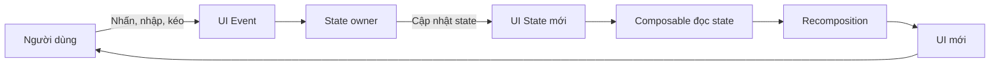
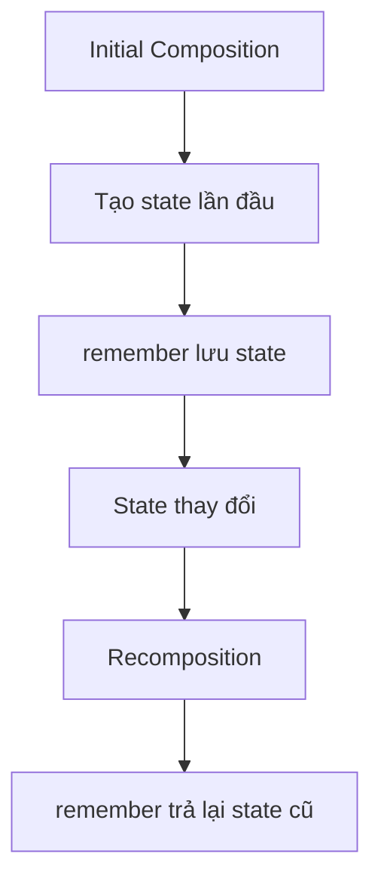
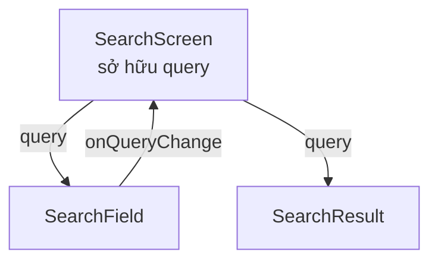
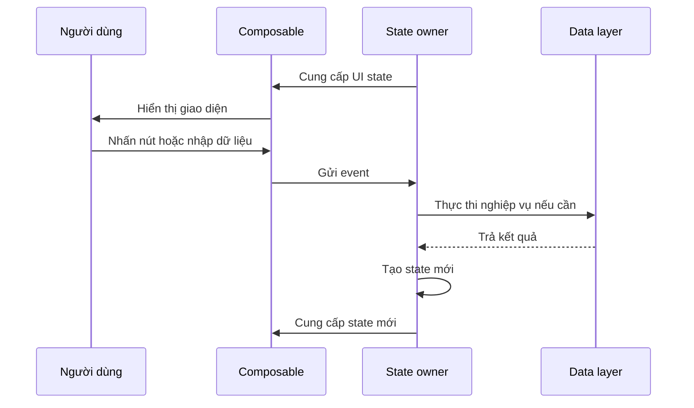
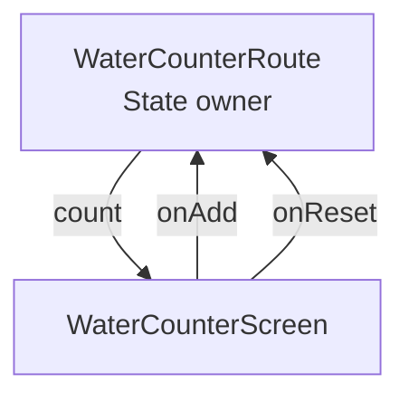

# 026 — Compose State

> **Học phần:** 02 — App Components and User Interface
> **Module:** Module 04 — Interface and Navigation
> **Nhóm nội dung:** Jetpack Compose
> **Nguồn roadmap:** Interface and Navigation / Jetpack Compose
> **Loại bài:** UI
> **Thứ tự trong module:** 026
> **Thời lượng gợi ý:** 30 phút
> **Mức độ:** Cơ bản → Trung cấp

---

## 1. Tóm tắt


Trong Jetpack Compose, **state** là dữ liệu mô tả giao diện tại một thời điểm. State có thể là:

* Nội dung người dùng đang nhập.
* Số lượng sản phẩm trong giỏ hàng.
* Trạng thái đang tải dữ liệu.
* Danh sách bài viết nhận được từ server.
* Tab đang được chọn.
* Vị trí cuộn của danh sách.
* Việc dialog, drawer hoặc bottom sheet đang mở hay đóng.

Compose hoạt động theo mô hình khai báo:

> **UI là kết quả của state hiện tại.**

Khi một giá trị state mà composable đang đọc thay đổi, Compose lên lịch chạy lại những phần giao diện liên quan. Quá trình đó được gọi là **recomposition**. Không giống hệ thống View truyền thống, lập trình viên không trực tiếp tìm một `TextView` rồi thay đổi nội dung của nó; thay vào đó, lập trình viên cập nhật state và Compose tạo lại phần UI cần thiết. ([Android Developers][1])

### Vị trí của Compose State trong ứng dụng



Compose State liên kết trực tiếp với:

| Thành phần       | Vai trò                                                  |
| ---------------- | -------------------------------------------------------- |
| **Composable**   | Hiển thị state và phát sinh event                        |
| **State holder** | Lưu giữ và điều phối state                               |
| **ViewModel**    | Quản lý screen state và business logic                   |
| **Repository**   | Cung cấp dữ liệu từ network, database hoặc cache         |
| **Lifecycle**    | Quyết định lúc nào state cần tồn tại hoặc được khôi phục |
| **Testing**      | Kiểm tra event có tạo đúng state và UI hay không         |
| **Performance**  | Giới hạn phạm vi recomposition và tránh cập nhật dư thừa |

---

## 2. Mục tiêu học tập


Sau bài học, anh có thể:

* Giải thích state và recomposition bằng ngôn ngữ của mình.
* Phân biệt `mutableStateOf`, `remember` và `rememberSaveable`.
* Hiểu sự khác nhau giữa **stateful composable** và **stateless composable**.
* Áp dụng **state hoisting** để tăng khả năng tái sử dụng và kiểm thử.
* Tổ chức luồng dữ liệu theo mô hình:

  * State đi xuống.
  * Event đi lên.
* Biết khi nào nên giữ state trong composable.
* Biết khi nào nên chuyển state sang `ViewModel`.
* Biết state nào cần tồn tại sau khi xoay màn hình hoặc Android tạo lại tiến trình.
* Viết một Compose UI test kiểm tra giao diện sau khi state thay đổi.
* Tạo screenshot, source code và README làm artifact cho portfolio.

---

## 3. Khái niệm chính


### 3.1. State là gì?

State là bất kỳ giá trị nào có thể thay đổi theo thời gian và ảnh hưởng đến nội dung được hiển thị.

Ví dụ:

```kotlin
val userName = "An Khánh"
val isLoading = false
val selectedTab = 1
val articles = listOf<Article>()
```

Không phải biến nào cũng tự động trở thành Compose State. Compose phải có khả năng **quan sát** thay đổi của giá trị đó.

Ví dụ sau không hoạt động đúng:

```kotlin
@Composable
fun BrokenCounter() {
    var count = 0

    Button(onClick = { count++ }) {
        Text("Số lần nhấn: $count")
    }
}
```

`count` chỉ là một biến Kotlin bình thường:

* Compose không theo dõi thay đổi của nó.
* Giá trị có thể bị khởi tạo lại khi composable chạy lại.
* Giao diện không được đảm bảo cập nhật.

---

### 3.2. `mutableStateOf`

`mutableStateOf()` tạo một state có thể quan sát được bởi Compose.

```kotlin
val countState = mutableStateOf(0)
```

Đọc giá trị:

```kotlin
Text(text = countState.value.toString())
```

Cập nhật giá trị:

```kotlin
countState.value++
```

Cú pháp thường dùng hơn là Kotlin property delegation:

```kotlin
var count by mutableStateOf(0)
```

Khi `count` thay đổi, những composable đã đọc `count` có thể được recomposition. Compose không nhất thiết chạy lại toàn bộ màn hình; nó theo dõi vị trí đọc state để xác định phần UI liên quan. ([Android Developers][1])

---

### 3.3. `remember`

Composable có thể chạy lại nhiều lần. Nếu tạo state trực tiếp mà không dùng `remember`, đối tượng state có thể được tạo lại.

```kotlin
@Composable
fun Counter() {
    var count by remember {
        mutableStateOf(0)
    }

    Button(onClick = { count++ }) {
        Text("Số lần nhấn: $count")
    }
}
```

`remember` yêu cầu Compose giữ lại đối tượng trong **Composition** và trả lại đối tượng đó trong những lần recomposition tiếp theo.



`remember` phù hợp với:

* Trạng thái animation tạm thời.
* Trạng thái mở hoặc đóng của thành phần nhỏ.
* Object chỉ cần tồn tại cùng composable.
* Kết quả tính toán không muốn tạo lại trong mỗi recomposition.

`remember` không đảm bảo giữ state sau khi Activity bị tạo lại. Khi composable rời Composition, giá trị được ghi nhớ cũng có thể bị loại bỏ. ([Android Developers][2])

---

### 3.4. `rememberSaveable`

State liên quan đến dữ liệu người dùng đang nhập hoặc vị trí hiện tại của họ thường cần tồn tại khi:

* Xoay màn hình.
* Chuyển chế độ sáng hoặc tối khiến Activity được tạo lại.
* Android tạo lại Activity.
* Android khôi phục app sau khi tiến trình bị giải phóng trong nền.

Sử dụng `rememberSaveable`:

```kotlin
@Composable
fun NameInput() {
    var name by rememberSaveable {
        mutableStateOf("")
    }

    OutlinedTextField(
        value = name,
        onValueChange = { name = it },
        label = {
            Text("Tên người dùng")
        }
    )
}
```

### So sánh `remember` và `rememberSaveable`

| API                | Qua recomposition |   Qua Activity recreation | Phù hợp với                       |
| ------------------ | ----------------: | ------------------------: | --------------------------------- |
| `remember`         |                Có |                     Không | State tạm thời, object nội bộ     |
| `rememberSaveable` |                Có |                        Có | Text input, lựa chọn, toggle, ID  |
| `ViewModel`        |                Có |                        Có | Screen state và business logic    |
| `SavedStateHandle` |                Có | Có, gồm khôi phục process | State nhỏ cần ViewModel khôi phục |
| Room/DataStore     |                Có |                        Có | Dữ liệu bền vững lâu dài          |

`rememberSaveable` sử dụng cơ chế saved instance state và `Bundle`. Vì dung lượng `Bundle` có giới hạn, chỉ nên lưu dữ liệu nhỏ như chuỗi nhập liệu, ID, vị trí cuộn hoặc lựa chọn đang thực hiện; không nên lưu danh sách lớn, bitmap hay toàn bộ response từ server. ([Android Developers][3])

---

### 3.5. Composition và recomposition

Có ba thuật ngữ quan trọng:

1. **Initial Composition:** lần đầu Compose chạy các composable để xây dựng UI.
2. **Composition:** cấu trúc mô tả UI hiện tại.
3. **Recomposition:** chạy lại những composable cần thiết khi dữ liệu thay đổi.

Ví dụ:

```kotlin
@Composable
fun Greeting() {
    var name by rememberSaveable {
        mutableStateOf("")
    }

    Column {
        if (name.isNotBlank()) {
            Text("Xin chào, $name!")
        }

        OutlinedTextField(
            value = name,
            onValueChange = { name = it }
        )
    }
}
```

Khi người dùng nhập tên:

1. `onValueChange` được gọi.
2. `name` nhận giá trị mới.
3. Compose phát hiện `name` đã thay đổi.
4. `Greeting()` được recomposition.
5. `Text` xuất hiện khi `name` không rỗng.

> Recomposition không phải là tạo lại toàn bộ Activity và cũng không đồng nghĩa với việc vẽ lại mọi thành phần trên màn hình.

---

### 3.6. Stateful và stateless composable

#### Stateful composable

Composable tự sở hữu state:

```kotlin
@Composable
fun StatefulCounter() {
    var count by rememberSaveable {
        mutableStateOf(0)
    }

    Button(onClick = { count++ }) {
        Text("Số lần nhấn: $count")
    }
}
```

Ưu điểm:

* Viết nhanh.
* Phù hợp với thành phần độc lập và đơn giản.

Hạn chế:

* Composable cha khó điều khiển state.
* Khó tái sử dụng trong nhiều ngữ cảnh.
* Khó truyền state giả khi preview hoặc test.

#### Stateless composable

Composable nhận state và callback từ bên ngoài:

```kotlin
@Composable
fun StatelessCounter(
    count: Int,
    onIncrement: () -> Unit,
    modifier: Modifier = Modifier
) {
    Button(
        onClick = onIncrement,
        modifier = modifier
    ) {
        Text("Số lần nhấn: $count")
    }
}
```

Composable này:

* Không tự quyết định giá trị `count`.
* Không trực tiếp sửa state.
* Chỉ hiển thị dữ liệu và gửi event.
* Có thể preview và test với nhiều giá trị khác nhau.

---

### 3.7. State hoisting

**State hoisting** là chuyển state từ composable con lên composable gọi nó.

Quy ước phổ biến:

```kotlin
value: T
onValueChange: (T) -> Unit
```

Ví dụ:

```kotlin
@Composable
fun SearchField(
    query: String,
    onQueryChange: (String) -> Unit,
    modifier: Modifier = Modifier
) {
    OutlinedTextField(
        value = query,
        onValueChange = onQueryChange,
        modifier = modifier,
        label = {
            Text("Tìm kiếm")
        }
    )
}
```

State owner:

```kotlin
@Composable
fun SearchScreen() {
    var query by rememberSaveable {
        mutableStateOf("")
    }

    SearchField(
        query = query,
        onQueryChange = { newQuery ->
            query = newQuery
        }
    )
}
```

State nên được đưa lên **tổ tiên chung thấp nhất** của các composable cần đọc hoặc thay đổi nó. Từ state owner, nên cung cấp state bất biến và callback/event để yêu cầu cập nhật state. ([Android Developers][4])



---

### 3.8. Luồng dữ liệu một chiều

Compose phù hợp với **Unidirectional Data Flow — UDF**:

```text
State đi xuống ↓
Event đi lên   ↑
```



UDF giúp:

* Có một nguồn dữ liệu đáng tin cậy.
* Hạn chế state mâu thuẫn giữa nhiều composable.
* Tách logic khỏi phần hiển thị.
* Dễ preview và kiểm thử UI.
* Theo dõi được event nào tạo ra state nào.

Compose Architecture mô tả chu trình này theo ba bước: event phát sinh, state được cập nhật và UI hiển thị state mới. ([Android Developers][5])

---

### 3.9. Khi nào dùng `ViewModel`?

Giữ state trong composable khi:

* State chỉ phục vụ một thành phần UI nhỏ.
* Logic đơn giản.
* Không có business logic.
* Không cần chia sẻ cho nhiều màn hình.

Chuyển state lên `ViewModel` khi:

* State đại diện cho toàn bộ màn hình.
* Cần gọi repository hoặc use case.
* Có loading, success và error state.
* Nhiều composable cần dùng chung dữ liệu.
* Logic cần được unit test độc lập.
* State cần tồn tại qua configuration change.

```kotlin
data class CounterUiState(
    val count: Int = 0,
    val isLoading: Boolean = false,
    val errorMessage: String? = null
)
```

```kotlin
class CounterViewModel : ViewModel() {

    private val _uiState = MutableStateFlow(CounterUiState())
    val uiState: StateFlow<CounterUiState> = _uiState.asStateFlow()

    fun addOne() {
        _uiState.update { currentState ->
            currentState.copy(
                count = (currentState.count + 1).coerceAtMost(10)
            )
        }
    }

    fun reset() {
        _uiState.value = CounterUiState()
    }
}
```

Screen-level composable:

```kotlin
@Composable
fun CounterRoute(
    viewModel: CounterViewModel = viewModel()
) {
    val uiState by viewModel.uiState.collectAsStateWithLifecycle()

    WaterCounterScreen(
        count = uiState.count,
        onAdd = viewModel::addOne,
        onReset = viewModel::reset
    )
}
```

Trên Android, `collectAsStateWithLifecycle()` là cách được khuyến nghị để chuyển `Flow` thành Compose `State` theo lifecycle. ViewModel nên được lấy ở screen-level composable; không nên truyền nguyên ViewModel xuống toàn bộ cây UI, mà nên truyền đúng state và callback mà composable con cần. ([Android Developers][1])

---

### 3.10. State không hợp lệ và state dẫn xuất

Không nên lưu nhiều state có thể mâu thuẫn với nhau.

#### Không nên

```kotlin
var firstName by remember { mutableStateOf("") }
var lastName by remember { mutableStateOf("") }
var fullName by remember { mutableStateOf("") }
```

`fullName` có thể không được cập nhật khi `firstName` hoặc `lastName` đổi.

#### Nên dùng state dẫn xuất

```kotlin
var firstName by rememberSaveable { mutableStateOf("") }
var lastName by rememberSaveable { mutableStateOf("") }

val fullName = "$firstName $lastName".trim()
```

Nguyên tắc:

> Nếu một giá trị có thể tính được từ state khác với chi phí nhỏ, thường không cần lưu nó thành state riêng.

---

### 3.11. Collection trong Compose State

Không nên thay đổi một `MutableList` thông thường rồi mong Compose tự nhận biết:

```kotlin
val tasks = remember {
    mutableListOf<String>()
}

// Không bảo đảm kích hoạt recomposition
tasks.add("Học Compose State")
```

Có thể sử dụng immutable list:

```kotlin
var tasks by remember {
    mutableStateOf(emptyList<String>())
}

tasks = tasks + "Học Compose State"
```

Hoặc snapshot-aware collection:

```kotlin
val tasks = remember {
    mutableStateListOf<String>()
}

tasks.add("Học Compose State")
```

Các collection mutable thông thường không phải observable state nên có thể làm UI hiển thị dữ liệu cũ. Android Developers khuyến nghị dùng observable state holder kết hợp dữ liệu bất biến. ([Android Developers][1])

---

### 3.12. Ghi chú mở rộng cho Compose 2026

Tài liệu Compose hiện phân biệt thêm các API như:

* `retain`
* `rememberSerializable`
* `rememberSaveable`
* `remember`

Tuy nhiên, ở cấp độ bài này, nên nắm chắc trước bốn tầng sau:

```text
remember
    ↓
rememberSaveable
    ↓
ViewModel + SavedStateHandle
    ↓
Room / DataStore / server
```

`rememberSerializable` phù hợp với kiểu dữ liệu có thể tuần tự hóa bằng `kotlinx.serialization`, còn `retain` phục vụ những object cần tồn tại lâu hơn Composition nhưng không cần sống qua process death. Đây là phần mở rộng sau khi đã thành thạo state cơ bản. ([Android Developers][2])

---

## 4. Thực hành


### 4.1. Yêu cầu

Xây dựng màn hình theo dõi lượng nước uống:

* Hiển thị số cốc hiện tại.
* Mục tiêu tối đa là 10 cốc.
* Có nút thêm một cốc.
* Có nút đặt lại.
* Nút thêm bị vô hiệu hóa khi đạt 10 cốc.
* State không mất khi xoay màn hình.
* UI trình bày dưới dạng stateless composable.
* Có Preview và UI test cơ bản.

---

### 4.2. Cấu trúc đề xuất

```text
ui/
├── WaterCounterRoute.kt
├── WaterCounterScreen.kt
└── WaterCounterPreview.kt

androidTest/
└── WaterCounterTest.kt
```



---

### 4.3. Stateful route

```kotlin
package com.example.composestate

import androidx.compose.runtime.Composable
import androidx.compose.runtime.getValue
import androidx.compose.runtime.mutableStateOf
import androidx.compose.runtime.saveable.rememberSaveable
import androidx.compose.runtime.setValue
import androidx.compose.ui.Modifier

@Composable
fun WaterCounterRoute(
    modifier: Modifier = Modifier
) {
    var count by rememberSaveable {
        mutableStateOf(0)
    }

    WaterCounterScreen(
        count = count,
        target = 10,
        onAdd = {
            count = (count + 1).coerceAtMost(10)
        },
        onReset = {
            count = 0
        },
        modifier = modifier
    )
}
```

`WaterCounterRoute` chịu trách nhiệm:

* Sở hữu state.
* Kiểm soát giới hạn hợp lệ.
* Nhận event từ UI.
* Cung cấp state mới cho UI.

---

### 4.4. Stateless screen

```kotlin
package com.example.composestate

import androidx.compose.foundation.layout.Arrangement
import androidx.compose.foundation.layout.Column
import androidx.compose.foundation.layout.Row
import androidx.compose.foundation.layout.fillMaxWidth
import androidx.compose.foundation.layout.padding
import androidx.compose.material3.Button
import androidx.compose.material3.LinearProgressIndicator
import androidx.compose.material3.MaterialTheme
import androidx.compose.material3.OutlinedButton
import androidx.compose.material3.Text
import androidx.compose.runtime.Composable
import androidx.compose.ui.Alignment
import androidx.compose.ui.Modifier
import androidx.compose.ui.unit.dp

@Composable
fun WaterCounterScreen(
    count: Int,
    target: Int,
    onAdd: () -> Unit,
    onReset: () -> Unit,
    modifier: Modifier = Modifier
) {
    val progress = if (target > 0) {
        count.toFloat() / target
    } else {
        0f
    }

    Column(
        modifier = modifier
            .fillMaxWidth()
            .padding(24.dp),
        verticalArrangement = Arrangement.spacedBy(16.dp)
    ) {
        Text(
            text = "Theo dõi lượng nước",
            style = MaterialTheme.typography.headlineSmall
        )

        Text(
            text = "Đã uống $count/$target cốc",
            style = MaterialTheme.typography.titleLarge
        )

        LinearProgressIndicator(
            progress = { progress },
            modifier = Modifier.fillMaxWidth()
        )

        Text(
            text = when {
                count == 0 -> "Hãy bắt đầu bằng một cốc nước."
                count < target -> "Còn ${target - count} cốc để đạt mục tiêu."
                else -> "Anh đã đạt mục tiêu hôm nay!"
            },
            style = MaterialTheme.typography.bodyLarge
        )

        Row(
            modifier = Modifier.fillMaxWidth(),
            horizontalArrangement = Arrangement.spacedBy(12.dp),
            verticalAlignment = Alignment.CenterVertically
        ) {
            Button(
                onClick = onAdd,
                enabled = count < target,
                modifier = Modifier.weight(1f)
            ) {
                Text("Thêm một cốc")
            }

            OutlinedButton(
                onClick = onReset,
                enabled = count > 0,
                modifier = Modifier.weight(1f)
            ) {
                Text("Đặt lại")
            }
        }
    }
}
```

Điểm cần chú ý:

* `WaterCounterScreen` không tự lưu state.
* State được truyền qua `count`.
* Event được truyền qua `onAdd` và `onReset`.
* `progress` là giá trị dẫn xuất nên không cần lưu thành state.
* UI có thể preview với bất kỳ số lượng nào.

---

### 4.5. Gọi từ Activity

```kotlin
package com.example.composestate

import android.os.Bundle
import androidx.activity.ComponentActivity
import androidx.activity.compose.setContent
import androidx.compose.material3.MaterialTheme
import androidx.compose.material3.Surface
import androidx.compose.ui.Modifier
import androidx.compose.foundation.layout.fillMaxSize

class MainActivity : ComponentActivity() {

    override fun onCreate(savedInstanceState: Bundle?) {
        super.onCreate(savedInstanceState)

        setContent {
            MaterialTheme {
                Surface(
                    modifier = Modifier.fillMaxSize()
                ) {
                    WaterCounterRoute()
                }
            }
        }
    }
}
```

---

### 4.6. Preview nhiều trạng thái

```kotlin
package com.example.composestate

import androidx.compose.material3.MaterialTheme
import androidx.compose.runtime.Composable
import androidx.compose.ui.tooling.preview.Preview

@Preview(
    name = "Trạng thái ban đầu",
    showBackground = true
)
@Composable
private fun EmptyCounterPreview() {
    MaterialTheme {
        WaterCounterScreen(
            count = 0,
            target = 10,
            onAdd = {},
            onReset = {}
        )
    }
}

@Preview(
    name = "Đang thực hiện",
    showBackground = true
)
@Composable
private fun InProgressCounterPreview() {
    MaterialTheme {
        WaterCounterScreen(
            count = 6,
            target = 10,
            onAdd = {},
            onReset = {}
        )
    }
}

@Preview(
    name = "Đã hoàn thành",
    showBackground = true
)
@Composable
private fun CompletedCounterPreview() {
    MaterialTheme {
        WaterCounterScreen(
            count = 10,
            target = 10,
            onAdd = {},
            onReset = {}
        )
    }
}
```

Preview stateless composable giúp kiểm tra:

* Empty state.
* Partial state.
* Completed state.
* Nút có bị vô hiệu hóa đúng không.
* Text có bị cắt trên màn hình nhỏ không.

---

### 4.7. Compose UI test

```kotlin
package com.example.composestate

import androidx.compose.material3.MaterialTheme
import androidx.compose.ui.test.assertIsDisplayed
import androidx.compose.ui.test.junit4.createComposeRule
import androidx.compose.ui.test.onNodeWithText
import androidx.compose.ui.test.performClick
import org.junit.Rule
import org.junit.Test

class WaterCounterTest {

    @get:Rule
    val composeRule = createComposeRule()

    @Test
    fun addButton_updatesCounterText() {
        composeRule.setContent {
            MaterialTheme {
                WaterCounterRoute()
            }
        }

        composeRule
            .onNodeWithText("Đã uống 0/10 cốc")
            .assertIsDisplayed()

        composeRule
            .onNodeWithText("Thêm một cốc")
            .performClick()

        composeRule
            .onNodeWithText("Đã uống 1/10 cốc")
            .assertIsDisplayed()
    }

    @Test
    fun resetButton_returnsCounterToZero() {
        composeRule.setContent {
            MaterialTheme {
                WaterCounterRoute()
            }
        }

        composeRule
            .onNodeWithText("Thêm một cốc")
            .performClick()

        composeRule
            .onNodeWithText("Đặt lại")
            .performClick()

        composeRule
            .onNodeWithText("Đã uống 0/10 cốc")
            .assertIsDisplayed()
    }
}
```

Compose testing API cho phép tìm node qua semantics, thực hiện hành động và xác nhận thuộc tính hoặc nội dung hiển thị. ([Android Developers][6])

---

### 4.8. Kiểm tra thủ công

| Bước | Thao tác                           | Kết quả mong đợi               |
| ---: | ---------------------------------- | ------------------------------ |
|    1 | Mở màn hình                        | Hiển thị `0/10`                |
|    2 | Nhấn “Thêm một cốc”                | Hiển thị `1/10`                |
|    3 | Nhấn liên tiếp                     | Progress tăng theo             |
|    4 | Đạt 10 cốc                         | Nút thêm bị vô hiệu hóa        |
|    5 | Nhấn “Đặt lại”                     | Trở về `0/10`                  |
|    6 | Nhập trạng thái 5 cốc rồi xoay máy | Vẫn hiển thị 5 cốc             |
|    7 | Bật font size lớn                  | Nội dung không bị che hoặc cắt |
|    8 | Dùng TalkBack                      | Các nút có nhãn dễ hiểu        |

---

### 4.9. Artifact cho portfolio

Lưu các nội dung sau:

```text
compose-state-demo/
├── README.md
├── screenshots/
│   ├── state-empty.png
│   ├── state-progress.png
│   └── state-completed.png
├── app/
│   └── source-code
└── demo/
    └── compose-state-demo.webm
```

README ngắn:

```markdown
# Compose State Water Counter

Ứng dụng nhỏ minh họa quản lý state trong Jetpack Compose.

## Nội dung áp dụng

- mutableStateOf
- rememberSaveable
- State hoisting
- Stateless composable
- Unidirectional data flow
- Compose UI testing

## Luồng hoạt động

1. UI gửi event khi người dùng nhấn nút.
2. State owner cập nhật count.
3. Compose recomposition phần UI đọc count.
4. Nội dung và progress được cập nhật.

## Kiểm thử

- Tăng bộ đếm.
- Đặt lại bộ đếm.
- Giữ state sau configuration change.
```

---

## 5. Bài tập


### Bài tập chính: màn hình tìm kiếm khóa học

Xây dựng một màn hình gồm:

* `OutlinedTextField` để nhập từ khóa.
* Danh sách khóa học.
* Chỉ hiển thị khóa học phù hợp với từ khóa.
* Nút xóa nội dung tìm kiếm.
* Empty state khi không có kết quả.
* Nội dung ô tìm kiếm không mất khi xoay màn hình.

Dữ liệu mẫu:

```kotlin
val courses = listOf(
    "Kotlin cơ bản",
    "Jetpack Compose",
    "Android Architecture",
    "Room Database",
    "Coroutines và Flow",
    "Compose State"
)
```

### Gợi ý state

```kotlin
var query by rememberSaveable {
    mutableStateOf("")
}

val filteredCourses = courses.filter { course ->
    course.contains(
        other = query,
        ignoreCase = true
    )
}
```

### Yêu cầu kiến trúc

```kotlin
@Composable
fun CourseSearchScreen(
    query: String,
    courses: List<String>,
    onQueryChange: (String) -> Unit,
    onClearQuery: () -> Unit,
    modifier: Modifier = Modifier
)
```

### Acceptance criteria

* [ ] Nhập `compose` hiển thị các khóa học có từ Compose.
* [ ] Nhập từ khóa không tồn tại hiển thị empty state.
* [ ] Nhấn xóa đưa danh sách về trạng thái ban đầu.
* [ ] Xoay màn hình không làm mất từ khóa.
* [ ] Composable hiển thị không trực tiếp sở hữu query.
* [ ] Có ít nhất ba Preview.
* [ ] Có một UI test cho kết quả tìm kiếm.
* [ ] Không lưu `filteredCourses` thành mutable state riêng.
* [ ] Có screenshot đưa vào README.

### Bài tập nâng cao

Chuyển màn hình sang `ViewModel`:

```kotlin
data class CourseSearchUiState(
    val query: String = "",
    val courses: List<String> = emptyList(),
    val isLoading: Boolean = false,
    val errorMessage: String? = null
)
```

Mô phỏng tải dữ liệu từ repository và triển khai đủ:

```text
Loading → Success
Loading → Empty
Loading → Error
Error → Retry → Success
```

---

## 6. Checklist hoàn thành


### Kiến thức

* [ ] Giải thích được state là gì.
* [ ] Giải thích được recomposition.
* [ ] Phân biệt được biến Kotlin thường và observable state.
* [ ] Phân biệt được `remember` và `rememberSaveable`.
* [ ] Hiểu stateful composable.
* [ ] Hiểu stateless composable.
* [ ] Giải thích được state hoisting.
* [ ] Mô tả được luồng “state xuống, event lên”.
* [ ] Biết khi nào cần `ViewModel`.
* [ ] Biết khi nào cần `SavedStateHandle`.

### Code

* [ ] State có một source of truth rõ ràng.
* [ ] Composable con chỉ nhận state cần thiết.
* [ ] Callback có tên mô tả đúng event.
* [ ] Không thay đổi state trực tiếp ngoài event handler.
* [ ] Không lưu state dẫn xuất nếu có thể tính lại dễ dàng.
* [ ] Không dùng `mutableListOf()` thông thường làm observable state.
* [ ] Có giới hạn để state không rơi vào giá trị không hợp lệ.
* [ ] Có `Modifier` làm optional parameter.
* [ ] Có Preview cho nhiều trạng thái.
* [ ] Có ít nhất một UI test.

### Lifecycle và UX

* [ ] Text input không mất sau configuration change.
* [ ] Vị trí hoặc lựa chọn quan trọng được khôi phục.
* [ ] Không lưu object lớn trong `rememberSaveable`.
* [ ] Có loading state.
* [ ] Có empty state.
* [ ] Có error state.
* [ ] Có retry action nếu dùng network.
* [ ] Nút được disable khi hành động không hợp lệ.
* [ ] Nội dung hoạt động với font size lớn.
* [ ] Semantics và nhãn nút đủ rõ cho accessibility.

### Portfolio

* [ ] Có source code sạch.
* [ ] Có sơ đồ state flow.
* [ ] Có screenshot trước và sau khi state thay đổi.
* [ ] Có video demo ngắn.
* [ ] Có README giải thích kỹ thuật.
* [ ] Có test result hoặc ảnh test chạy thành công.

---

## 7. Ghi chú sản xuất


### 7.1. Chọn state owner đúng cấp

| Loại state                       | Vị trí phù hợp                           |
| -------------------------------- | ---------------------------------------- |
| Thành phần nhỏ, logic đơn giản   | Composable                               |
| Logic UI phức tạp                | Plain state holder                       |
| State của toàn màn hình          | ViewModel                                |
| Dữ liệu dùng lâu dài             | Repository và data layer                 |
| Trạng thái cần khôi phục process | SavedStateHandle hoặc persistent storage |

Đưa state lên quá cao làm tăng số thành phần phụ thuộc và có thể khiến kiến trúc khó hiểu. Giữ state quá thấp lại khiến nhiều composable không thể chia sẻ hoặc điều khiển nó. Nguyên tắc là đặt state gần nơi sử dụng nhất nhưng đủ cao để mọi thành phần cần đọc hoặc ghi đều truy cập được. ([Android Developers][4])

---

### 7.2. Không dùng `rememberSaveable` như database

Không lưu trong saved state:

* Bitmap.
* Danh sách hàng nghìn phần tử.
* Toàn bộ API response.
* Object repository.
* Network client.
* Dữ liệu có thể tải lại từ database.
* Thông tin bí mật không phù hợp với Bundle.

Nên lưu:

* ID của item đang xem.
* Query đang nhập.
* Tab đang chọn.
* Scroll position.
* Trạng thái expand hoặc collapse.
* Lựa chọn chưa hoàn thành của người dùng.

Sau khi khôi phục ID hoặc query, ứng dụng có thể lấy lại dữ liệu lớn từ repository. Đây cũng là cách tránh lỗi `TransactionTooLarge`. ([Android Developers][3])

---

### 7.3. Mô hình UI state nên biểu diễn đầy đủ màn hình

Ví dụ:

```kotlin
sealed interface ArticleUiState {

    data object Loading : ArticleUiState

    data class Success(
        val articles: List<Article>
    ) : ArticleUiState

    data object Empty : ArticleUiState

    data class Error(
        val message: String
    ) : ArticleUiState
}
```

UI:

```kotlin
@Composable
fun ArticleScreen(
    uiState: ArticleUiState,
    onRetry: () -> Unit
) {
    when (uiState) {
        ArticleUiState.Loading -> LoadingContent()

        ArticleUiState.Empty -> EmptyContent()

        is ArticleUiState.Success -> {
            ArticleList(uiState.articles)
        }

        is ArticleUiState.Error -> {
            ErrorContent(
                message = uiState.message,
                onRetry = onRetry
            )
        }
    }
}
```

Cách này tránh nhiều boolean mâu thuẫn như:

```kotlin
isLoading = true
hasError = true
hasData = true
```

---

### 7.4. Tránh side effect trong thân composable

Không nên:

```kotlin
@Composable
fun ProfileScreen() {
    repository.loadProfile()
}
```

Composable có thể chạy lại nhiều lần, vì vậy đoạn trên có thể gọi network hoặc database nhiều lần.

Nên:

* Gọi nghiệp vụ từ ViewModel.
* Sử dụng effect API phù hợp khi hành động gắn với lifecycle của Composition.
* Không dựa vào giả định composable chỉ chạy một lần.

---

### 7.5. Giới hạn phạm vi recomposition

Nên:

* Truyền đúng dữ liệu composable cần.
* Dùng model bất biến.
* Không truyền toàn bộ object lớn khi chỉ cần `title`.
* Đặt state gần nơi được đọc.
* Chia màn hình thành composable nhỏ theo trách nhiệm.
* Chỉ tối ưu sau khi đã đo bằng Layout Inspector hoặc profiler.

Ví dụ:

```kotlin
// Ít phụ thuộc hơn
@Composable
fun ArticleHeader(
    title: String,
    subtitle: String
)
```

thay vì:

```kotlin
// Phụ thuộc vào toàn bộ Article
@Composable
fun ArticleHeader(
    article: Article
)
```

Compose Architecture khuyến nghị composable chỉ nhận lượng thông tin tối thiểu cần thiết để tăng khả năng tái sử dụng và hạn chế recomposition không cần thiết. ([Android Developers][5])

---

### 7.6. Kiểm thử state theo nhiều tầng

```text
ViewModel unit test
        ↓
Composable UI test
        ↓
State restoration test
        ↓
Navigation/integration test
        ↓
Manual device test
```

Cần kiểm tra tối thiểu:

1. Event tạo đúng state.
2. State tạo đúng UI.
3. Loading chuyển sang success hoặc error.
4. Retry hoạt động.
5. State quan trọng sống qua Activity recreation.
6. Process restoration có thể tái tạo màn hình.
7. Accessibility semantics vẫn đúng.
8. Màn hình hoạt động trên nhiều kích thước thiết bị.

Compose testing hỗ trợ tìm node, assertion, action và tự đồng bộ với UI trước khi thực hiện bước kiểm thử tiếp theo. ([Android Developers][6])

---

### 7.7. Release checklist

Trước khi phát hành một màn hình có state phức tạp, hãy xác nhận:

* [ ] Không mất dữ liệu người dùng khi xoay màn hình.
* [ ] Không gửi request lặp do recomposition.
* [ ] Không hiển thị đồng thời loading và error.
* [ ] Không có state ngoài phạm vi giá trị hợp lệ.
* [ ] Không lưu dữ liệu lớn trong Bundle.
* [ ] Không truyền ViewModel sâu xuống cây composable.
* [ ] Network error có thông báo và retry.
* [ ] State được khôi phục sau khi app ở nền.
* [ ] UI test được chạy trong CI.
* [ ] Analytics không bị gửi lặp lại khi recomposition.
* [ ] Screenshot test hoặc regression test được cập nhật nếu UI thay đổi.

---

## Tóm tắt ghi nhớ

```text
State thay đổi
    ↓
Compose nhận biết nơi đã đọc state
    ↓
Composable liên quan được recomposition
    ↓
UI phản ánh state mới
```

```text
State đi xuống
Event đi lên
```

```text
State nhỏ, nội bộ          → remember
State UI cần khôi phục     → rememberSaveable
Screen state + nghiệp vụ   → ViewModel
Process restoration        → SavedStateHandle
Dữ liệu bền vững           → Room / DataStore / Server
```

> **Quy tắc quan trọng nhất:** Không điều khiển UI trực tiếp. Hãy mô tả UI dựa trên state, cập nhật state thông qua event và để Compose đồng bộ giao diện.

[1]: https://developer.android.com/develop/ui/compose/state "State and Jetpack Compose  |  Android Developers"
[2]: https://developer.android.com/develop/ui/compose/state-lifespans "State lifespans in Compose  |  Jetpack Compose  |  Android Developers"
[3]: https://developer.android.com/develop/ui/compose/state-saving "Save UI state in Compose  |  Jetpack Compose  |  Android Developers"
[4]: https://developer.android.com/develop/ui/compose/state-hoisting "Where to hoist state  |  Jetpack Compose  |  Android Developers"
[5]: https://developer.android.com/develop/ui/compose/architecture "Compose UI Architecture  |  Jetpack Compose  |  Android Developers"
[6]: https://developer.android.com/develop/ui/compose/testing "Test your Compose layout  |  Jetpack Compose  |  Android Developers"

---

# Bài luyện tập

## Mục tiêu


## Đề bài


## Yêu cầu hoàn thành

- [ ] 
- [ ] 
- [ ] 

## Kết quả / lời giải


## Ghi chú
